# Semantic Watermarking for Malicious Image Manipulation Detection

Yoonseo Kim 1 Seungwoo Baek \* 1 Junyoung Park \* 1

## Abstract

The proliferation of high-fidelity generative editing models has made it possible to inject violent or sexual content into otherwise ordinary images while preserving visual plausibility, with concrete consequences for public discourse and vulnerable populations. We propose a robust semantic watermarking framework that reframes the watermark as a recoverable semantic reference rather than an opaque identifier. Our framework combines a β-VAE-based binary watermark (CLIP-VAE) with explicit channel-aware training—random bit-flip noise is injected during training so that the decoder learns graceful degradation under the noisy watermarking channel. As a downstream application, a lightweight module SDA-Net uses the recovered semantic embedding to expose not only whether but in which semantic direction an image has been altered. In a 5-way comparison against representative binary hashing baselines (SimHash, ITQ, HashNet, and their robust-MLP variants), CLIP-VAE achieves the highest reconstruction cosine similarity to the original CLIP embedding under realistic Instruct-Pix2Pix bit-error rates, and uniquely supports direction-of-drift detection—a forensic complement to existing content-moderation pipelines.

## 1. Introduction

The recent surge of high-fidelity generative models (Rombach et al., 2022; Ramesh et al., 2022; Podell et al., 2024; Saharia et al., 2022) and image-to-image editing models (Brooks et al., 2023; Meng et al., 2022; Hertz et al., 2023; Kawar et al., 2023) has made it possible to inject violent or sexual content into otherwise ordinary scenes while preserving visual plausibility. The societal cost is no longer hypothetical: in May 2023, a fabricated AI-generated image of a Pentagon explosion spread across social media within minutes and briefly moved U.S. equity markets. Because such manipulations evade casual human inspection yet carry concrete consequences for public discourse and institutional trust, methods that can reliably analyze semantic changes in images have become an urgent component of trustworthy AI infrastructure.

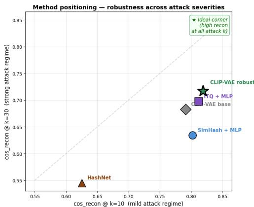  
Figure 1. Method positioning across attack severities. Five binary semantic-encoding methods (SimHash, ITQ, HashNet, CLIP-VAE base, and our channel-aware CLIP-VAE) are plotted in the (cos @ k = 10, cos @ k = 30) plane, summarizing CLIP reconstruction quality under mild and strong channel noise. The top-right corner (star marker) is ideal: high reconstruction at every attack severity. Our channel-aware CLIP-VAE sits closest to this corner, outperforming all baselines in the realistic InstructPix2Pix BER regime; full setup and analysis are in Section 4.3.

Once an image has been manipulated, the original semantic content is structurally lost from the pixel evidence: only the post-edit image remains observable, and no purely passive analysis can recover what the image was. A natural first instinct is therefore to deploy classifiers that flag manipulated content directly from pixels. Such classifiers, however, operate only on the current image and have no access to its pre-edit state: stylistic edits that gradually push a benign scene toward violent or sexual content can register as benign on a frame-by-frame basis, and adversarially crafted perturbations can evade detection at inference time. This motivates a complementary approach that anchors a sourcetime semantic reference into the image itself, against which any later edit can be compared. Crucially, this pre-edit information cannot be reconstructed from the manipulated image alone—it must be deliberately encoded at the moment of capture or distribution, making a watermark the structurally unique carrier of the image’s original semantic state.

Digital watermarking, then, is a natural defense, allowing information about the original image to persist after editing. However, the dominant focus of robust watermarking has been on survivability of the watermark under aggressive edits, rather than on the semantic content of the payload. A representative line of work—HiDDeN (Zhu et al., 2018), StegaStamp (Tancik et al., 2020), RoSteALS (Bui et al., 2023), Stable Signature (Fernandez et al., 2023), Tree-Ring Watermarks (Wen et al., 2023), Gaussian Shading (Yang et al., 2024), and VINE (Lu et al., 2024)—has substantially advanced robustness, yet treats the watermark payload as an opaque identifier: a random bit string for ownership verification. Concurrent work such as SEAL (Arabi et al., 2025), SemaMark (Ren et al., 2024), and SWIFT (Evennou et al., 2024) (which embeds image captions as real-valued vectors) explores semantic payloads, but each makes design choices that diverge from a binary, invertible, channel-robust formulation. This leaves content moderators able to verify whether an image is authentic, but unable to answer the forensic question of what changed semantically—a gap that becomes critical when the manipulated content is targeted violence or sexual material.

A natural baseline for binary semantic payloads is the rich literature of semantic hashing, which compresses highdimensional embeddings into compact binary codes. This literature spans three design philosophies that we adopt as baselines: (i) random projection (SimHash (Charikar, 2002), Spectral Hashing (Weiss et al., 2008)), (ii) linear learned hashing (Iterative Quantization (Gong & Lazebnik, 2011)), and (iii) deep learned hashing (HashNet (Cao et al., 2017), DSH (Liu et al., 2016), VDSH (Chaidaroon & Fang, 2017)). However, all of these methods are designed for retrieval and are non-invertible—the binary code supports only Hamming-distance comparison and cannot reconstruct a semantic embedding for downstream analysis. Recent neural compressors such as LLMZip (Valmeekam et al., 2023) go further but produce variable-length codes that collapse catastrophically under single-bit errors, making them incompatible with the noisy fixed-capacity channel of practical watermarking.

We take a different perspective and treat the watermark as a recoverable semantic reference rather than an opaque identifier. Our approach builds on three observations. First, CLIP image embeddings (Radford et al., 2021) provide a perceptually-aligned semantic representation (Hessel et al., 2021) that retains enough information to drive image reconstruction (Ramesh et al., 2022). Second, because CLIP embeddings are L2-normalized, semantic similarity is captured by their angular structure (Wang & Isola, 2020), which sign-based binarization of zero-centered latents preserves—a property formalized by random hyperplane rounding (Charikar, 2002; Goemans & Williamson, 1995). Third, a β-VAE (Kingma & Welling, 2014; Higgins et al., 2017) regularizes the latent toward an isotropic Gaussian prior, producing the zero-centered, well-distributed latents that sign binarization requires and—crucially—enabling invertible reconstruction from the binary code through latent statistics rescaling. A plain autoencoder lacks this regularization, and existing deep hashing methods (Cao et al., 2017; Liu et al., 2016; Chaidaroon & Fang, 2017) reuse similar architectures only for retrieval, not for invertible recovery.

Building on these observations and on the VINE (Lu et al., 2024) robust watermarking backbone, our central contribution is CLIP-VAE, a robust binary semantic watermark. To demonstrate the downstream utility of the recovered semantic embedding, we additionally present SDA-Net, a lightweight prototype-based application module for direction-of-drift detection. We further introduce channelaware training: random bit flips are injected into the binarized latent during VAE training, forcing the decoder to learn graceful degradation under channel noise. Unlike pixellevel perturbation training in HiDDeN (Zhu et al., 2018) and StegaStamp (Tancik et al., 2020), which models robustness in image space, our channel-aware training operates post-binarization in the code space, directly modeling the noisy fixed-capacity channel that real watermark decoders produce—a mechanism unavailable to random-projection methods like SimHash and not exploited by existing deep hashing baselines. In a 5-way comparison with SimHash, ITQ, HashNet, and their robust-MLP variants, CLIP-VAE achieves the highest reconstruction cosine similarity to the original CLIP embedding under realistic bit-error rates corresponding to InstructPix2Pix attacks (k =5–30 flipped bits out of 100). Beyond reconstruction quality, our framework uniquely supports direction-of-drift detection via SDA-Net— identifying not only whether but in which semantic category an image has been altered, a capability not provided by any binary hashing baseline.

## 2. Related Work

Robust Image Watermarking. The challenge of preserving watermarks under aggressive image editing has driven a steady evolution of robust watermarking methods. HiD-DeN (Zhu et al., 2018) introduced an encoder–decoder framework that learns invisible perturbations resilient to common distortions, while StegaStamp (Tancik et al., 2020) extended this paradigm to physical capture by training against a wide range of imaging artifacts. RoSteALS (Bui et al., 2023) embedded watermarks via the latent space of pretrained autoencoders for improved imperceptibility. More recent methods target the rapidly improving generative editing landscape: Stable Signature (Fernandez et al., 2023)

fine-tunes the decoder of latent diffusion models so that all generated images carry a verifiable signature, Tree-Ring Watermarks (Wen et al., 2023) embed signals directly into the initial Gaussian noise of diffusion models, and Gaussian Shading (Yang et al., 2024) achieves performance-lossless watermarking by aligning the watermark with the model’s noise distribution. VINE (Lu et al., 2024), on which our work builds, demonstrates 100-bit binary watermark survivability under both local and global generative edits. Across this rapid progress, payloads remain random identifiers— robustness is the metric of success, semantic content of the payload is not considered.

Concurrent Semantic-Payload Watermarking. SWIFT (Evennou et al., 2024) is the closest concurrent work to ours and similarly reframes the watermark payload as a semantic carrier. The two methods differ in design choices rather than in fundamental philosophy: SWIFT encodes image captions as high-dimensional real-valued vectors via a modified HiDDeN backbone, while we encode CLIP image embeddings as 100-bit binary watermarks via VINE. Our binary representation is natively compatible with the high-robustness binary channels of modern robust watermarking, and our framework introduces channel-aware learning that explicitly optimizes for bit-flip noise—a direction not explored in SWIFT. SWIFT also targets general image authentication, whereas our framework is explicitly oriented toward detecting malicious semantic categories through prototype-based drift analysis, aligning it directly with content-moderation pipelines. We do not provide a direct empirical comparison since SWIFT’s caption-based pipeline requires a separate captioner and HiDDeN backbone that differ from our setup; constructing a unified benchmark is left for future work.

Semantic Hashing and Neural Compression. A separate line of work compresses semantic content into compact binary codes for efficient retrieval. SimHash (Charikar, 2002) produces fingerprints via random hyperplane projections, and later locality-sensitive variants such as Spectral Hashing (Weiss et al., 2008) and Iterative Quantization (Gong & Lazebnik, 2011) introduce learned projections. Deep hashing methods including DSH (Liu et al., 2016), HashNet (Cao et al., 2017), and VDSH (Chaidaroon & Fang, 2017) use learned representations to produce binary codes whose Hamming distances reflect semantic similarity, with VDSH in particular employing variational inference. These methods, however, are non-invertible: the binary code supports only Hamming-distance comparison and cannot be decoded back to a semantic representation. Recent neural compressors such as LLMZip (Valmeekam et al., 2023) achieve nearentropy-rate codes by combining large language models with arithmetic coding, but produce variable-length outputs that decode catastrophically under bit errors—incompatible with watermarking’s noisy fixed-capacity channel. Our framework is the first, to our knowledge, to combine the binary structure of semantic hashing with an invertible mapping back to semantic embeddings, adapted specifically for the watermarking channel.

Image Manipulation Detection. Detecting altered or synthetic images has long been studied as a passive forensic problem, with early work focused on detecting GANgenerated faces and deepfakes through frequency-domain artifacts and more recent methods targeting diffusiongenerated content via pixel-space classifiers. Such passive approaches face a structural limitation: as generative models improve, the visual gap between real and synthetic narrows. Active forensic methods—those that embed information into the source image to enable later verification—sidestep this arms race by anchoring authenticity at the moment of capture or distribution. Our work belongs to the active family but goes beyond binary authentication: rather than only detecting whether an image was tampered with, we recover a semantic reference of the original image and quantify the direction of any subsequent semantic shift, providing finergrained signals useful for content moderation rather than just content provenance.

Trustworthy AI and Content Moderation. Content moderation systems for harmful imagery typically rely on classifiers trained directly on the moderated content, an approach that struggles with adversarially edited images that shift only subtle semantic cues. Recent work on trustworthy AI emphasizes the importance of complementary forensic signals that allow moderators to verify the original semantic intent of an image, particularly in pipelines that handle sensitive categories such as violence or sexual content. We position our framework as a forensic complement to such moderation systems: by preserving a recoverable semantic anchor through an invisible watermark and exposing the direction of any post-hoc drift, it enables moderators to flag manipulations that would otherwise pass classifieronly checks. This places semantic watermarking within a broader trustworthy-AI infrastructure rather than treating it as a standalone authentication tool.

## 3. Methodology

Our framework consists of two components (Figure 2): CLIP-VAE, our central contribution, which encodes a CLIP embedding into a 100-bit binary watermark robust to channel noise; and SDA-Net, a lightweight application module that uses the recovered embedding for prototype-based direction-of-drift detection.

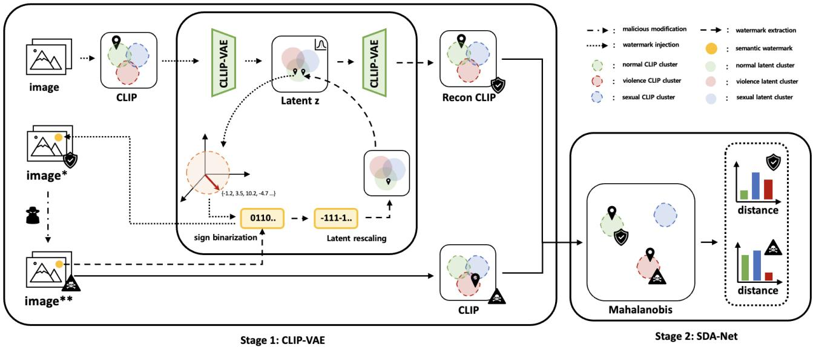  
Figure 2. CLIP-VAE–based semantic watermarking and drift detection. Semantic information is embedded into CLIP-VAE latent representations via sign-based binarization and reconstructed under malicious image manipulation through distribution-aware latent rescaling. Semantic drift is detected by comparing reconstructed and manipulated CLIP embeddings in a class-conditional semantic space.

## 3.1. CLIP-VAE

We propose CLIP-VAE, a variational autoencoder operating in the CLIP embedding space that compresses an image’s semantics into a compact 100-bit binary watermark.

Given an image, we first extract a CLIP image embedding $\mathbf { x } \in \mathbb { R } ^ { 5 1 \bar { 2 } }$ using a pretrained CLIP encoder, which is L2-normalized following the standard CLIP embedding geometry. The encoder maps x into a latent representation $z \in \mathbb { R } ^ { 1 0 0 }$ via variational inference. The decoder then maps the latent vector z to a reconstructed embedding $f _ { \mathrm { d e c } } ( z ) \in \mathbb { R } ^ { 5 1 2 }$ . To ensure consistency with the angular geometry of CLIP embeddings, we apply L2 normalization after decoding, yielding $\hat { \mathbf { x } } = f _ { \mathrm { d e c } } ( z ) / \Vert f _ { \mathrm { d e c } } ( z ) \Vert _ { 2 }$ . The resulting xˆ serves as a semantic anchor, which is compared against the CLIP embedding of a potentially manipulated image to detect semantic drift.

Training objective. We optimize a compact β-VAE objective that prioritizes semantic fidelity in CLIP space, with the KL regularization weight set to $\beta = 0 . 0 1$

$$
\mathcal { L } _ { \mathrm { C L I P - V A E } } = \underbrace { 1 - \cos ( \hat { \mathbf { x } } , \mathbf { x } ) } _ { \mathcal { L } _ { \mathrm { r e c o n } } } + \beta \mathcal { L } _ { \mathrm { K L } } ,\tag{1}
$$

Latent to Bits. Our key step is to turn the continuous latent z into a robust bit-level semantic watermark $b \in$ $\{ 0 , 1 \} ^ { D } \left( D { = } 1 0 0 \right)$ by preserving only the sign pattern:

$$
b _ { i } = { \left\{ \begin{array} { l l } { 1 } & { { \mathrm { i f ~ } } z _ { i } > 0 , } \\ { 0 } & { { \mathrm { o t h e r w i s e } } . } \end{array} \right. }\tag{2}
$$

This binarization discards magnitude but retains directional information, which is well-aligned with the geometry of CLIP embeddings (semantic similarity is largely captured by angles).

Bits to Latent. From an extracted watermark $\hat { b } ,$ we reconstruct a latent proxy zˆ in two steps. First, we map bits back to signs:

$$
s _ { i } = 2 \hat { b } _ { i } - 1 , \quad s \in \{ - 1 , + 1 \} ^ { D }\tag{3}
$$

Then, we restore scale using learned latent statistics (computed once from training latents):

$$
\hat { z } = \mu _ { \mathrm { l a t e n t } } + s \odot \sigma _ { \mathrm { l a t e n t } }\tag{4}
$$

where $\mu _ { \mathrm { l a t e n t } } , \sigma _ { \mathrm { l a t e n t } } \in \mathbb { R } ^ { D }$ are the empirical mean and standard deviation of the latent distribution. This makes reconstruction stable: even when some bits flip, the recovered zˆ remains a plausible latent sample, enabling reliable decoding to xˆ and downstream semantic drift comparison.

Channel-Aware Training. A standard β-VAE is trained only on clean latents, leaving the decoder unaware of the bit-flip noise that the watermarking channel inevitably produces. We address this with channel-aware training: at each training step, we sample $k { \sim } \mathcal { U } ( 0 , k _ { \mathrm { m a x } } )$ bits and randomly flip them in the binarized latent b before reconstructing $\hat { z } = \mu _ { \mathrm { l a t e n t } } + s _ { \mathrm { n o i s y } } \odot \sigma _ { \mathrm { l a t e n t } } .$ then minimize $1 - \cos ( \hat { \mathbf { x } } , \mathbf { x } )$ against the original CLIP embedding. A straight-through estimator for the sign function preserves gradient flow through binarization. We use a curriculum schedule with $k _ { \operatorname* { m a x } } = 1 0$ , which our ablation (Sections F and G) confirms improves bit-flip robustness without sacrificing clean reconstruction. This learning-based channel awareness is fundamentally unavailable to random-projection methods such as SimHash (Charikar, 2002).

## 3.2. Semantic Drift-Aligned Network

We propose the Semantic Drift-Aligned Network (SDA-Net) to quantify semantic drift between the preserved watermark semantics and the manipulated image content. Instead of producing discrete classification labels, SDA-Net learns a class-conditional latent geometry in which the direction of semantic change can be measured against learned class prototypes, exposing not only whether but in which semantic category an image has shifted.

Architecture and Prototypes. SDA-Net is a three-layer fully-connected variational encoder $\mathbb { R } ^ { 5 1 2 } \to \mathbb { R } ^ { 6 4 }$ (Batch-Norm, ReLU, Dropout(0.3) at each stage) producing $( \mu , \log \sigma ^ { 2 } )$ , with $z = \mu + \sigma \odot \epsilon$ . Each semantic class $c \in$ {Normal, Violence, Sexual} is a learnable prototype $\left( \mu _ { c } , \Sigma _ { c } \right)$ with diagonal $\Sigma _ { c } = \mathrm { d i a g } ( \exp ( \log \sigma _ { c } ^ { 2 } ) )$ . The Mahalanobis distance $\begin{array} { r } { d ^ { 2 } ( z , c ) = \sum _ { i } ( z _ { i } - \mu _ { c , i } ) ^ { 2 } / \sigma _ { c , } ^ { 2 } } \end{array}$ i feeds a temperature-scaled softmax yielding class scores that vary smoothly with latent proximity to each prototype. This proximity reflects class affiliation—how typical the latent is of a category—rather than within-class intensity, a distinction we revisit in Section 5.

Training and Drift Measurement. SDA-Net is trained with a joint objective combining cross-entropy (label smoothing 0.1), KL regularization toward $\mathcal { N } ( 0 , I )$ , and a supervised contrastive loss $( \lambda _ { \mathrm { c l s } } = 1 . 0 , \lambda _ { \mathrm { K L } } = 0 . 0 1 , \lambda _ { \mathrm { S C L } } = 0 . 5 ,$ $\tau { = } 0 . 0 7 )$ ; class prototypes are updated via EMA (m = 0.9). Full training details are in Section E. At inference, given reconstructed and manipulated embeddings $z _ { \mathrm { r e c o n } }$ and zmanip, we report drift magnitude $\Delta _ { \mathrm { l a t e n t } } { = } \lVert z _ { \mathrm { r e c o n } } { - } z _ { \mathrm { m a n i p } } \rVert _ { 2 }$ and perclass distance change $\Delta _ { c } = d ( z _ { \mathrm { m a n i p } } , \mu _ { c } ) - d ( z _ { \mathrm { r e c o n } } , \mu _ { c } ) ; \mathsf { a }$ negative $\Delta _ { c }$ indicates motion toward class c, often revealing manipulation before the predicted class crosses a category boundary.

## 4. Experiments

We conduct experiments to evaluate the proposed framework from three complementary perspectives: (1) semantic fidelity of reconstructed embeddings on held-out test data, (2) robustness of semantic preservation across different content categories, and (3) effectiveness of semantic manipulation detection under adversarial image editing.

Our experiments are conducted on a dataset assembled from publicly released benchmarks for harmful-content research, in keeping with the ethical handling of sensitive imagery.

Table 1. Semantic preservation performance on the test set measured by cosine similarity between original and reconstructed CLIP embeddings.
<table><tr><td>Category</td><td>Mean</td><td>Std.</td><td>Range</td></tr><tr><td>Normal</td><td>0.7948</td><td>0.0601</td><td>[0.5120, 0.9496]</td></tr><tr><td>Violence</td><td>0.8409</td><td>0.0642</td><td>[0.5678, 0.9552]</td></tr><tr><td>Sexual</td><td>0.8832</td><td>0.0446</td><td>[0.7165, 0.9540]</td></tr><tr><td>Overall</td><td>0.8285</td><td>0.0685</td><td>[0.6943, 0.9626]</td></tr></table>

To reduce semantic ambiguity arising from unclear category boundaries, we focus on two malicious content categories: Violence and Sexual. The final dataset consists of 8,000 images, including 4,000 normal images from a publicly available news image collection (Kaggle), 2,000 violent images from the HOD (Ha et al., 2024) and T2VS (Yeh et al., 2024) benchmarks, and 2,000 sexual images from a publicly distributed adult-content dataset (Figshare). The dataset is split into training and test sets with an 8:2 ratio. We do not collect, scrape, or redistribute any additional sensitive content beyond what is already released by these benchmarks under their respective licenses; no human annotation of new sensitive content was performed; and our reproducibility release contains only the preprocessing pipeline and references to the original public datasets, not the images themselves.

Throughout all experiments, we rely on CLIP image embeddings and cosine similarity as the primary semantic metric, as CLIP predominantly encodes semantic information through embedding direction.

## 4.1. CLIP-VAE

Semantic Preservation. We first measure how well the 100-bit watermark preserves the semantic content of the original CLIP embedding under clean conditions (no channel noise). Cosine similarity between original and reconstructed CLIP embeddings is reported in Table 1; an analogous t-SNE visualization of the embedding structure is provided in Section C.

As shown in Table 1, reconstructed CLIP embeddings achieve a high mean cosine similarity of 0.8285, indicating stable semantic preservation across categories. Violence and sexual content exhibit higher similarity scores, suggesting more robust preservation of semantically salient attributes.

## 4.2. SDA-Net

Classification Performance. We evaluate SDA-Net on the held-out test set across the three semantic categories. Table 2 reports per-class precision, recall, and F1. SDA-Net achieves an overall accuracy of 98.06% and an F1 score of 0.9802, with consistently high performance across all classes. The Sexual class shows the highest precision (0.9949) and the Normal class the highest recall (0.9875), confirming that the prototype-based formulation maintains strong discriminative ability while providing the structured latent space needed for drift analysis.

Table 2. Per-class classification performance of SDA-Net on the test set.
<table><tr><td>Class</td><td>Precision</td><td>Recall</td><td>F1 Score</td></tr><tr><td>Normal</td><td>0.9765</td><td>0.9875</td><td>0.9820</td></tr><tr><td>Violence</td><td>0.9747</td><td>0.9626</td><td>0.9686</td></tr><tr><td>Sexual</td><td>0.9949</td><td>0.9850</td><td>0.9899</td></tr><tr><td>Overall</td><td>0.9821</td><td>0.9784</td><td>0.9802</td></tr></table>

Latent Space Structure. Distance distribution analysis confirms that samples from each class exhibit small distances to their corresponding prototype (mean intra-class distance: 1.84–2.00) while maintaining substantial separation from the other prototypes (mean inter-class distance > 10.5). This well-separated geometry provides a reliable coordinate system in which the direction of semantic drift can be quantified against fixed semantic anchors.

## 4.3. Bit-Flip Robustness: 5-Way Comparison

We compare CLIP-VAE against four binary hashing baselines spanning the three design philosophies introduced in Section 2: (i) SimHash + MLP (robust)—random Gaussian hyperplanes paired with a learned MLP decoder trained under bit-flip noise; (ii) ITQ + MLP (robust) (Gong & Lazebnik, 2011)—PCA followed by a learned orthogonal rotation, also paired with a robust MLP decoder; (iii) HashNet (Cao et al., 2017)—deep binary encoder–decoder trained jointly with tanh annealing; and (iv) CLIP-VAE (base)—our model trained without channel noise injection. For each method we obtain a 100-bit code from the test-set CLIP embedding, randomly flip $k \in \{ 0 , 5 , 1 0 , 2 0 , 3 0 , 5 0 \}$ bits per sample (10 trials), and measure the cosine similarity between the original CLIP embedding and its reconstruction from the corrupted bits. Note that all baselines— including the originally retrieval-oriented SimHash, ITQ, and HashNet—are equipped with a learned MLP reconstruction head trained under matched conditions, equalizing the task to invertible binary encoding; the resulting gap therefore isolates channel-aware training rather than reflecting any retrieval-vs-reconstruction task mismatch.

In the realistic InstructPix2Pix BER range (k = 5–30), CLIP-VAE attains the highest cosine similarity at every bit-error rate (Table 3; full bit-flip curves in Figure 7), with the gap to the strongest baseline (ITQ + MLP) growing from 0.7% at k = 10 to 1.9% at $k = 3 0$ . HashNet underperforms uniformly, indicating that deep learned binarization without explicit channel-aware regularization fails to convert encoder capacity into channel robustness. This clear separation in the realistic-BER regime isolates channel-aware training as the source of our advantage, visualized as the 2D positioning summary in Figure 1 (top of paper).

Table 3. Bit-flip reconstruction cosine similarity in the realistic InstructPix2Pix BER regime (mean over 10 random-flip trials, $\mathrm { s t d } \le 0 . 0 0 2 4 )$ . Channel-aware CLIP-VAE achieves the highest score across all practical bit-error rates. k = 0 (clean) and $k = 5 0$ (near-random) are reported in Section D.
<table><tr><td>k flipped</td><td>5</td><td>10</td><td>20</td><td>30</td></tr><tr><td>SimHash + MLP (robust)</td><td>0.824</td><td>0.802</td><td>0.734</td><td>0.634</td></tr><tr><td>ITQ + MLP (robust)</td><td>0.830</td><td>0.812</td><td>0.763</td><td>0.698</td></tr><tr><td>HashNet</td><td>0.644</td><td>0.625</td><td>0.586</td><td>0.545</td></tr><tr><td>CLIP-VAE (base)</td><td>0.807</td><td>0.791</td><td>0.747</td><td>0.683</td></tr><tr><td>CLIP-VAE (ours)</td><td>0.830</td><td>0.819</td><td>0.783</td><td>0.717</td></tr></table>

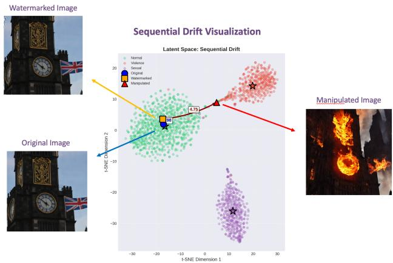  
Figure 3. Sequential drift in the SDA-Net latent space. The original (blue circle), watermarked (orange square), and InstructPix2Pixedited (red triangle) embeddings are overlaid on training-set clusters for Normal (green), Violence (red), and Sexual (purple) categories. Watermark embedding induces only $\Delta _ { \mathrm { l a t e n t } } = 1 . { \bar { 9 } } 8$ , while adversarial editing produces $\Delta _ { \mathrm { l a t e n t } } = 4 . 6 5$ directed toward the Violence cluster, exposing the manipulation despite visual plausibility.

## 4.4. Direction-of-Drift Detection

Beyond reconstruction quality, our framework offers a capability not provided by any binary hashing baseline: identifying toward which semantic category an image has been manipulated.

Building on the SDA-Net classification results in Table 2, we trace an InstructPix2Pix violence-injection edit through the SDA-Net latent space (Figure 3, Table 4). The watermarked image remains within the Normal cluster $( \Delta _ { \mathrm { l a t e n t } } = 1 . 9 8 )$ confirming that the watermark itself does not perturb semantics. After editing, the image translates by $\Delta _ { \mathrm { l a t e n t } } = 4 . 6 5$ and the directional signal $\Delta _ { \mathrm { V i o } } ~ = ~ - 2 . 3$ reveals motion toward the Violence prototype. Crucially, the predicted class remains Normal in all three states—the directional signal therefore exposes the manipulation before the classifier crosses a category boundary, an early-warning capability that no binary hashing baseline can produce.

Table 4. Sequential drift analysis. $\Delta _ { \mathrm { l a t e n t } }$ denotes drift magnitude from the original; $\Delta _ { c }$ denotes per-class distance change (negative = closer to class c). The predicted class remains Normal in all three states, but $\Delta \mathrm { v i o } = - \bar { 2 } . 3$ reveals directional drift toward the Violence prototype before any classifier boundary is crossed.
<table><tr><td>State</td><td>Pred.</td><td> $\Delta _ { \mathrm { l a t e n t } }$ </td><td> $\Delta _ { \mathrm { V i o } }$ </td><td> $\pmb { \Delta } _ { \mathrm { S e x } }$ </td></tr><tr><td>Original</td><td>Normal</td><td></td><td></td><td></td></tr><tr><td>Watermarked</td><td>Normal</td><td>1.98</td><td> $- 0 . 1 \quad + 0 . 2 \hphantom { 0 0 0 }$ </td><td></td></tr><tr><td>Manipulated</td><td>Normal</td><td>4.65</td><td> $- 2 . 3 \quad + 0 . 4 \hphantom { 0 0 0 }$ </td><td></td></tr></table>

## 5. Limitations

Our framework has several limitations that warrant discussion.

Prototype Membership vs. Intensity. SDA-Net’s prototypes represent class centroids rather than within-class intensity extremes; a drift signal $\Delta _ { c } < 0$ therefore indicates motion toward the typical region of class c, not that the image has become more intensely c-like. A faithful intensity-aware analysis would require ordinal labels (mild/moderate/severe) that our benchmarks do not provide.

Channel and Modality Limits. Our method relies on CLIP, which primarily captures visual semantics, so manipulations involving textual overlays without visual changes may go undetected. The malicious-content scope is also limited to violence and sexual content; drug-related content or political misinformation is not considered. In the realistic InstructPix2Pix attack regime, reconstruction cosine remains in the ∼0.72–0.82 range (Table 3, k = 5–30); more powerful editing models (e.g., Google Gemini) are expected to produce higher BER, and a thorough quantification across stronger editors is left for future work. Channel-aware training simulates uniform random bit flips approximating generative-attack noise; transfer to classical signal-domain channels and stronger robust-watermarking backbones are natural directions.

Linear-Probe Trade-off. On linear-probe classification, CLIP-VAE (89%) is competitive with but slightly below ITQ + MLP (95%), which is explicitly optimized for retrievalstyle similarity preservation—a trade-off reflecting our design priority of invertible reconstruction under channel noise. Adapting flip-noise schedules to class structure is a promising direction for further gains.

Other Untested Alternatives and Concurrent Work. Hyperspherical VAEs (Davidson et al., 2018) and Sphere

GAN (Park & Kwon, 2019) offer natural alignment with CLIP’s L2-normalized manifold but use spherical reparameterizations that are less compatible with sign-based binarization. VQ-VAE provides a natively discrete latent space but suffered from codebook collapse in our ablation (Section A). Continuous-valued watermarks $( \mathrm { e . g . }$ ., SWIFT (Evennou et al., 2024)) allow higher capacity but sacrifice binarychannel robustness; a unified benchmark of binary vs. realvalued semantic payloads is left for future work. The 100-bit payload itself is dictated by the VINE backbone; larger payloads could carry richer semantic information but require advances in robust-watermarking capacity beyond the scope of this work.

## 6. Ethical Considerations

Dual-Use Risk. By describing how semantic watermarks can detect malicious editing, we may also inform adversaries who wish to circumvent such detection. We mitigate this risk in three ways: first, by building on a robust watermarking backbone (VINE) whose extraction process is open but whose embedding remains imperceptible; second, by framing semantic watermarking as a defense-in-depth complement to other moderation signals rather than a standalone gatekeeper; and third, by encouraging continued open research on adaptive defenses that can co-evolve with attack techniques.

False-Positive Risk and Censorship. A drift signal that incorrectly flags a normal image as having shifted toward violence or sexual content could enable inappropriate content removal or chilling effects on legitimate expression. For this reason, we treat the directional drift signals $( \Delta _ { \mathrm { l a t e n t } } .$ $\Delta _ { c } , \Delta _ { \mathrm { s c o r e } } )$ as advisory rather than authoritative: they are designed to flag content for human review, and any production deployment should preserve this human-in-the-loop structure.

Demographic and Cultural Bias. Training data for harmful-content detection has historically reflected the cultural assumptions of its annotators, and the categories we use (violence, sexual content) carry particularly contested boundaries across demographic and cultural contexts. Our framework inherits any biases present in the public datasets we draw on, and we do not claim that the prototype geometry learned by SDA-Net is culturally invariant. Before deployment, downstream practitioners should conduct bias audits on representative populations and consider category definitions that reflect the values of the communities the system will serve.

## 7. Conclusions

We presented a robust semantic watermarking framework that reframes the watermark payload as a recoverable semantic reference rather than an opaque identifier. Our framework combines CLIP-VAE—a β-VAE binary watermark with sign-based binarization and latent-statistics rescaling—with channel-aware training that injects bit-flip noise during training so the decoder learns graceful degradation under the noisy watermarking channel. As a downstream application, we further demonstrate that the recovered semantic embedding supports direction-of-drift detection via SDA-Net, a lightweight prototype-based module that uniquely exposes the direction of any semantic shift. In a 5-way comparison with representative binary hashing baselines (SimHash, ITQ, HashNet, and robust-MLP variants), CLIP-VAE attains the highest CLIP reconstruction cosine across the realistic InstructPix2Pix bit-error range. Future work includes broader malicious-content categories, text-aware semantic representations, stronger robust-watermarking backbones, and class-conditional flip-noise schedules.

## Impact Statement

This work presents a forensic tool for identifying images that have been semantically manipulated to inject violent or sexual content, intended as a complement to human-reviewed content-moderation pipelines. The framework is designed to protect populations particularly affected by image-based harms—including minors, victims of non-consensual imagery, and public figures targeted by image manipulation campaigns— by allowing platforms to verify the original semantic intent of an image even after editing. We acknowledge several risks. Publishing detection techniques may inform adversaries seeking to evade them; the directional drift signals could be misapplied as authoritative censorship decisions rather than advisory flags; and any biases in our training data may propagate into deployment. We address these risks in detail in our Ethical Considerations section and emphasize that the framework is intended for human-inthe-loop moderation, not autonomous content removal. We encourage continued research on adaptive defenses, fairness audits, and culturally aware category definitions to ensure that semantic watermarking serves the trustworthy-AI infrastructure it is meant to support.

## Reproducibility Statement

To support reproducibility, we release our complete training and evaluation code, model configurations, and dataset preprocessing pipeline at the following anonymous repository:

$$
\begin{array} { r l } { \mathrm { h t t p s : / / a n o n y m o u s . ~ } 4 \mathrm { o p e n . ~ s c i e n c e / r / } } & { } \\ { \mathrm { C L I P - V L E - S D A - N e t - 2 5 E A } } & { } \end{array}
$$

The repository contains training and evaluation notebooks for both CLIP-VAE and SDA-Net that reproduce all reported tables and figures, preprocessing scripts, and detailed instructions for setting up the environment. Due to the sensitive nature of the dataset (violence and sexual content), we do not redistribute the images themselves; instead, we provide preprocessing scripts and references to the original public datasets (Kaggle; Ha et al., 2024; Yeh et al., 2024; Figshare) so that researchers with appropriate access can reconstruct the exact dataset used in our experiments. Hardware details and runtime measurements are included in the repository.

## Use of Generative AI Tools

In accordance with ICML 2026 policy, we disclose the use of generative AI tools during the preparation of this manuscript. We used large language models (LLMs) to assist with manuscript polishing (grammar correction and English clarity) and to draft portions of the experimental code, all of which were reviewed, debugged, and validated by the authors. All technical content—framework design, experimental methodology, analyses, results, and conclusions—is the authors’ own work, and all references in this paper were manually verified.

## References

Arabi, K., Witter, R. T., Hegde, C., and Cohen, N. SEAL: Semantic aware image watermarking. arXiv preprint arXiv:2503.12172, 2025.

Brooks, T., Holynski, A., and Efros, A. A. InstructPix2Pix: Learning to follow image editing instructions. In Proceedings of the IEEE/CVF Conference on Computer Vision and Pattern Recognition (CVPR), 2023.

Bui, T., Agarwal, S., Yu, N., and Collomosse, J. RoSteALS: Robust steganography using autoencoder latent space. In Proceedings ofthe IEEE/CVF Conference on Computer Vision and Pattern Recognition Workshops (CVPRW), 2023.

Cao, Z., Long, M., Wang, J., and Yu, P. S. HashNet: Deep learning to hash by continuation. In Proceedings of the IEEE International Conference on Computer Vision (ICCV), pp. 5608–5617, 2017.

Chaidaroon, S. and Fang, Y. Variational deep semantic hashing for text documents. In Proceedings ofthe 40th International ACM SIGIR Conference on Research and Development in Information Retrieval, 2017.

Charikar, M. S. Similarity estimation techniques from rounding algorithms. In Proceedings of the Thiry-Fourth An-

nual ACM Symposium on Theory of Computing (STOC), pp. 380–388, 2002.

Davidson, T. R., Falorsi, L., De Cao, N., Kipf, T., and Tomczak, J. M. Hyperspherical variational auto-encoders. In Proceedings ofthe 34th Conference on Uncertainty in Artificial Intelligence (UAI), 2018.

Evennou, G., Chappelier, V., Kijak, E., and Furon, T. SWIFT: Semantic watermarking for image forgery thwarting. arXiv preprint arXiv:2407.18995, 2024.

Fernandez, P., Couairon, G., Jegou, H., Douze, M., and´ Furon, T. The stable signature: Rooting watermarks in latent diffusion models. In Proceedings of the IEEE/CVF International Conference on Computer Vision (ICCV), 2023.

Figshare. Adult content dataset. https: //figshare.com/articles/dataset/ Adult\_content\_dataset/13456484.

Goemans, M. X. and Williamson, D. P. Improved approximation algorithms for maximum cut and satisfiability problems using semidefinite programming. Journal of the ACM, 42(6):1115–1145, 1995.

Gong, Y. and Lazebnik, S. Iterative quantization: A procrustean approach to learning binary codes. In Proceedings of the IEEE Conference on Computer Vision and Pattern Recognition (CVPR), 2011.

Ha, E., Kim, H., Hong, S. C., and Na, D. HOD: New harmful object detection benchmarks for robust surveillance. In Proceedings of the IEEE/CVF Winter Conference on Applications of Computer Vision (WACV) Workshops, 2024.

Hertz, A., Mokady, R., Tenenbaum, J., Aberman, K., Pritch, Y., and Cohen-Or, D. Prompt-to-prompt image editing with cross-attention control. In International Conference on Learning Representations (ICLR), 2023.

Hessel, J., Holtzman, A., Forbes, M., Le Bras, R., and Choi, Y. CLIPScore: A reference-free evaluation metric for image captioning. In Proceedings ofthe 2021 Conference on Empirical Methods in Natural Language Processing (EMNLP), 2021.

Higgins, I., Matthey, L., Pal, A., Burgess, C., Glorot, X., Botvinick, M., Mohamed, S., and Lerchner, A. β-VAE: Learning basic visual concepts with a constrained variational framework. In International Conference on Learning Representations (ICLR), 2017.

Kaggle. News dataset with images. https:// www.kaggle.com/datasets/mdkabinhasan/ news-dataset-with-images/data.

Kawar, B., Zada, S., Lang, O., Tov, O., Chang, H., Dekel, T., Mosseri, I., and Irani, M. Imagic: Text-based real image editing with diffusion models. In Proceedings of the IEEE/CVF Conference on Computer Vision and Pattern Recognition (CVPR), 2023.

Kingma, D. P. and Welling, M. Auto-encoding variational Bayes. In International Conference on Learning Representations (ICLR), 2014.

Liu, H., Wang, R., Shan, S., and Chen, X. Deep supervised hashing for fast image retrieval. In Proceedings of the IEEE Conference on Computer Vision and Pattern Recognition (CVPR), pp. 2064–2072, 2016.

Lu, S., Zhou, Z., Lu, J., Zhu, Y., and Kong, A. W.-K. Robust watermarking using generative priors against image editing: From benchmarking to advances. arXiv preprint arXiv:2410.18775, 2024.

Meng, C., He, Y., Song, Y., Song, J., Wu, J., Zhu, J.-Y., and Ermon, S. SDEdit: Guided image synthesis and editing with stochastic differential equations. In International Conference on Learning Representations (ICLR), 2022.

Park, S. W. and Kwon, J. Sphere generative adversarial network based on geometric moment matching. In Proceedings of the IEEE/CVF Conference on Computer Vision and Pattern Recognition (CVPR), 2019.

Podell, D., English, Z., Lacey, K., Blattmann, A., Dockhorn, T., Muller, J., Penna, J., and Rombach, R. SDXL:¨ Improving latent diffusion models for high-resolution image synthesis. In International Conference on Learning Representations (ICLR), 2024.

Radford, A., Kim, J. W., Hallacy, C., Ramesh, A., Goh, G., Agarwal, S., Sastry, G., Askell, A., Mishkin, P., Clark, J., Krueger, G., and Sutskever, I. Learning transferable visual models from natural language supervision. In Proceedings of the 38th International Conference on Machine Learning (ICML), 2021.

Ramesh, A., Dhariwal, P., Nichol, A., Chu, C., and Chen, M. Hierarchical text-conditional image generation with CLIP latents. arXiv preprint arXiv:2204.06125, 2022.

Ren, J., Xu, H., Liu, Y., Cui, Y., Wang, S., Yin, D., and Tang, J. A robust semantics-based watermark for large language models against paraphrasing. In Findings of the Associationfor Computational Linguistics: NAACL, 2024.

Rombach, R., Blattmann, A., Lorenz, D., Esser, P., and Ommer, B. High-resolution image synthesis with latent diffusion models. In Proceedings of the IEEE/CVF Conference on Computer Vision and Pattern Recognition (CVPR), pp. 10684–10695, 2022.

Saharia, C., Chan, W., Saxena, S., Li, L., Whang, J., Denton, E. L., Ghasemipour, K., Gontijo Lopes, R., Karagol Ayan, B., Salimans, T., Ho, J., Fleet, D. J., and Norouzi, M. Photorealistic text-to-image diffusion models with deep language understanding. In Advances in Neural Information Processing Systems (NeurIPS), 2022.

Tancik, M., Mildenhall, B., and Ng, R. StegaStamp: Invisible hyperlinks in physical photographs. In Proceedings of the IEEE/CVF Conference on Computer Vision and Pattern Recognition (CVPR), 2020.

Valmeekam, C. S. K., Narayanan, K., Kalathil, D., Chamberland, J.-F., and Shakkottai, S. LLMZip: Lossless text compression using large language models. arXiv preprint arXiv:2306.04050, 2023.

Wang, T. and Isola, P. Understanding contrastive representation learning through alignment and uniformity on the hypersphere. In International Conference on Machine Learning (ICML), 2020.

Weiss, Y., Torralba, A., and Fergus, R. Spectral hashing. In Advances in Neural Information Processing Systems (NIPS), 2008.

Wen, Y., Kirchenbauer, J., Geiping, J., and Goldstein, T. Tree-ring watermarks: Fingerprints for diffusion images that are invisible and robust. In Advances in Neural Information Processing Systems (NeurIPS), 2023.

Yang, Z., Zeng, K., Chen, K., Fang, H., Zhang, W., and Yu, N. Gaussian shading: Provable performance-lossless image watermarking for diffusion models. In Proceedings of the IEEE/CVF Conference on Computer Vision and Pattern Recognition (CVPR), 2024.

Yeh, C., Chang, Y.-M., Chiu, W.-C., and Yu, N. T2Vs meet VLMs: A scalable multimodal dataset for visual harmfulness recognition. In Advances in Neural Information Processing Systems, 2024.

Zhu, J., Kaplan, R., Johnson, J., and Fei-Fei, L. HiDDeN: Hiding data with deep networks. In Proceedings of the European Conference on Computer Vision (ECCV), pp. 657–672, 2018.

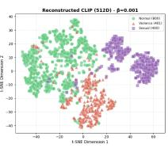

## Appendices

## A. Ablation Studies

We conduct ablation studies to validate our design choices for CLIP-VAE and SDA-Net.

## A.1. Latent Dimensionality

Table 5 shows that higher-dimensional latents yield better CLIP-level reconstruction and category accuracy, despite a slight decrease in latent-level cosine similarity. These results are obtained without watermark quantization, reflecting the intrinsic semantic capacity of the latent space. We therefore adopt a 100-dimensional latent configuration.

Table 5. Effect of latent dimensionality on semantic reconstruction.
<table><tr><td>Latent Dim</td><td>Latent Cosine ↑</td><td>CLIP Cosine ↑</td><td>Category Acc. ↑</td></tr><tr><td>50D</td><td>0.8070</td><td>0.9525</td><td>0.8877</td></tr><tr><td>100D</td><td>0.8055</td><td>0.9648</td><td>0.8942</td></tr></table>

## A.2. Effect of KL Weight β

With $\beta = 0 . 0 1$ , we achieve a well-balanced latent space that preserves semantic information while maintaining a stable distribution suitable for binarization. Smaller values $( \beta = 0 \mathrm { o r } 0 . 0 0 1 )$ leave the latent under-regularized and unsuitable for sign-based binarization; larger values $( \beta = 0 . 1 )$ over-regularize and destroy the semantic structure needed for reconstruction.

Table 6. Effect of KL weight β on reconstruction quality and latent regularity.
<table><tr><td>β</td><td>CLIP Cosine Sim ↑</td><td>KL Divergence ↓</td></tr><tr><td>0.0</td><td>0.8392</td><td>5.47</td></tr><tr><td>0.001</td><td>0.8568</td><td>2.06</td></tr><tr><td>0.01</td><td>0.8339</td><td>0.70</td></tr><tr><td>0.1</td><td>0.7965</td><td>0.19</td></tr></table>

(a) $\beta = 0 . 0$  
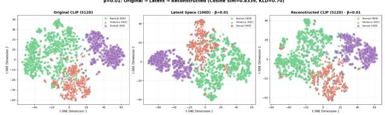  
(c) $\beta = 0 . 0 1$ (chosen)

(b) β = 0.001  
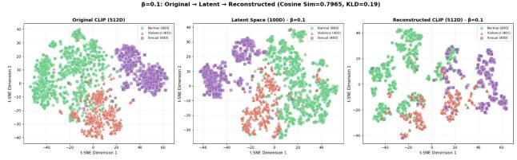  
(d) $\beta = 0 . 1$  
Figure 4. Latent space visualizations under different KL weights β. With $\beta = 0 ,$ the latent is unconstrained and asymmetric; $\beta = 0 . 0 0 1$ leaves the distribution insufficiently regularized for binarization; $\beta = 0 . 0 1$ produces the desired well-distributed, class-separated latent geometry; $\beta = 0 . 1$ over-regularizes and collapses class structure.

## A.3. VAE vs. VQ-VAE

Given that our watermarking method embeds discrete signals, we initially hypothesized that the discrete latent structure of VQ-VAE would be a natural fit. However, while VQ-VAE enforces clustering around a finite codebook, its latent representations tend to collapse toward fixed reference points, limiting fine-grained semantic preservation. The VAE’s continuous latents, regularized by a Gaussian prior, preserve semantic geometry more faithfully and remain compatible with

sign-based binarization.

Table 7. Comparison between VAE and VQ-VAE on semantic reconstruction quality.
<table><tr><td>Model</td><td>Cosine Similarity ↑</td><td>Cosine Distance ↓</td></tr><tr><td>VAE</td><td>0.8366</td><td>0.1634</td></tr><tr><td>VQ-VAE</td><td>0.7677</td><td>0.2323</td></tr></table>

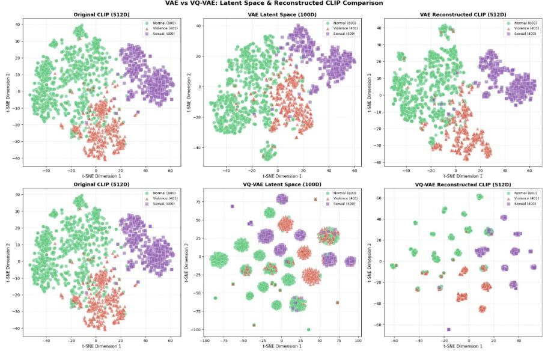  
Figure 5. Latent space comparison between VAE and VQ-VAE. VQ-VAE latents cluster tightly around a few codebook entries (visible codebook collapse), while VAE latents form smooth, semantically meaningful regions amenable to sign-based binarization.

## B. Watermark Influence Analysis

We verified that semantic watermarking does not affect CLIP embeddings or image editing outcomes. The CLIP embedding of a watermarked image remains nearly identical to that of the original, and edited images produce indistinguishable embeddings regardless of whether the original was watermarked.

## C. CLIP-VAE Reconstruction Visualization

Figure 6 shows a t-SNE visualization of original and reconstructed CLIP embeddings on the test set. Reconstructed embeddings remain within their original semantic regions despite aggressive latent compression into 100 bits, providing a qualitative complement to the cosine-similarity statistics in Table 1.

Test Dataset: Original vs Watermark-Reconstructed CLIP Embeddings

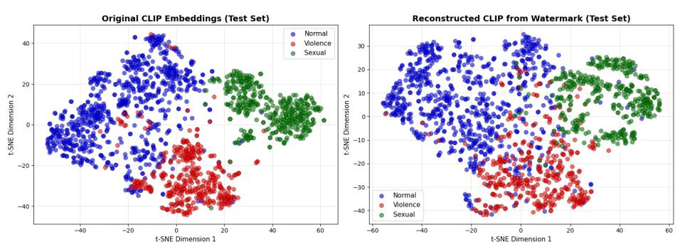  
Figure 6. t-SNE visualization of original and reconstructed CLIP embeddings on the test set. Reconstructed embeddings largely preserve the semantic structure of the originals.

## D. Full Bit-Flip Robustness Curves

Figure 7 shows the full bit-flip robustness curves for the five methods across $k \in \{ 0 , 5 , 1 0 , 2 0 , 3 0 , 5 0 \}$ . Table 8 reports reconstruction cosine at the two extreme bit-flip rates omitted from the main table. At k = 0 all learned methods cluster near $\sim 0 . 8 4$ , confirming that with a learned decoder even random projections (SimHash + MLP) can match learned binarization for clean reconstruction. At k = 50 all methods converge near ∼ 0.5 as reconstruction is dominated by the latent prior. Both endpoints are essentially uninformative for distinguishing the methods; the practical separation occurs in the realistic $k = 5 { - } 3 0$ range reported in Table 3.

Synthetic bit-flip robustness  
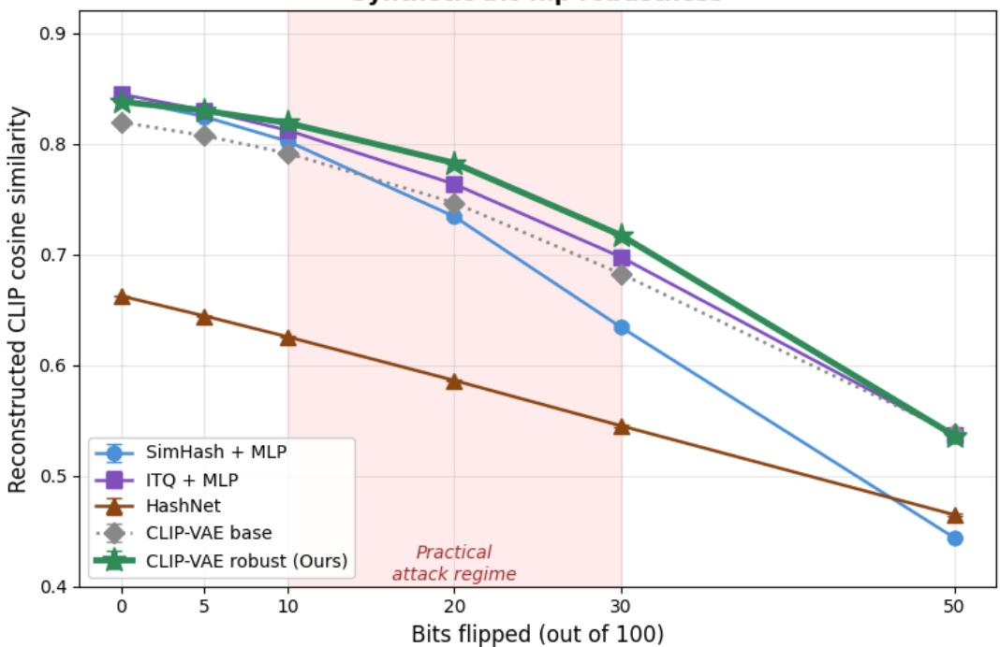  
Figure 7. Reconstruction cosine similarity as a function of the bit-flip rate k for the five binary hashing methods. The shaded region $\left( k = 8 – 2 8 \right)$ corresponds to the BER range observed under InstructPix2Pix attacks. CLIP-VAE with channel-aware training achieves the highest reconstruction in the realistic regime; HashNet underperforms uniformly.

Table 8. Bit-flip reconstruction cosine at extreme k (clean and near-random).
<table><tr><td>k flipped</td><td>0 (clean)</td><td>50 (near-random)</td></tr><tr><td>SimHash + MLP (robust)</td><td>0.840</td><td>0.444</td></tr><tr><td>ITQ + MLP (robust)</td><td>0.845</td><td>0.537</td></tr><tr><td>HashNet</td><td>0.662</td><td>0.465</td></tr><tr><td>CLIP-VAE (base)</td><td>0.819</td><td>0.538</td></tr><tr><td>CLIP-VAE (ours)</td><td>0.838</td><td>0.536</td></tr></table>

## E. SDA-Net Training Hyperparameters

Table 9 summarizes the hyperparameters used to train SDA-Net.

Table 9. SDA-Net training hyperparameters.
<table><tr><td>Component</td><td>Setting</td><td>Purpose</td></tr><tr><td>Classification</td><td> $\lambda _ { \mathrm { c l s } } = 1 . 0$ </td><td>CE + label smoothing 0.1</td></tr><tr><td>KL Divergence</td><td> $\lambda _ { \mathrm { K L } } { = } 0 . 0 1$ </td><td>Regularize to  $\mathcal { N } ( 0 , \bar { I } )$ </td></tr><tr><td>SCL</td><td> $\lambda _ { \mathrm { S C L } } = 0 . 5$ </td><td>Class separation (τ = 0.07)</td></tr><tr><td>Prototype EMA</td><td> $m { = } 0 . 9$ </td><td>Stabilize prototypes</td></tr></table>

## F. Channel-Aware Training: Component Ablation

We disentangle the two regularizers introduced for channel-aware training—flip-noise (random k-bit flip injection at the binarization stage) and sign margin (penalty on near-boundary $| z _ { i } | < \epsilon ) \mathrm { - } \mathrm { b y }$ training four variants with the same backbone and schedule. Table 10 reports bit-flip robustness (cos@k = 30) and linear-probe accuracy on the 100-bit code. Flip-noise alone provides nearly all of the robustness improvement (0.708 vs. 0.684 for the no-regularizer baseline) and the strongest linear-probe accuracy (0.94). Adding sign-margin yields a small additional gain in robustness with a slight cost to linear-probe accuracy.

Table 10. Component ablation of channel-aware training. flip-noise alone provides the bulk of the robustness benefit; sign-margin acts as a smaller complementary regularizer.
<table><tr><td>Variant</td><td> $\cos \ @ k = 3 0$ </td><td>LinProbe</td></tr><tr><td>neither</td><td>0.684</td><td>0.854</td></tr><tr><td>sign-margin only</td><td>0.689</td><td>0.900</td></tr><tr><td>flip-noise only</td><td>0.708</td><td>0.941</td></tr><tr><td>flip-noise + sign-margin (ours)</td><td>0.702</td><td>0.918</td></tr></table>

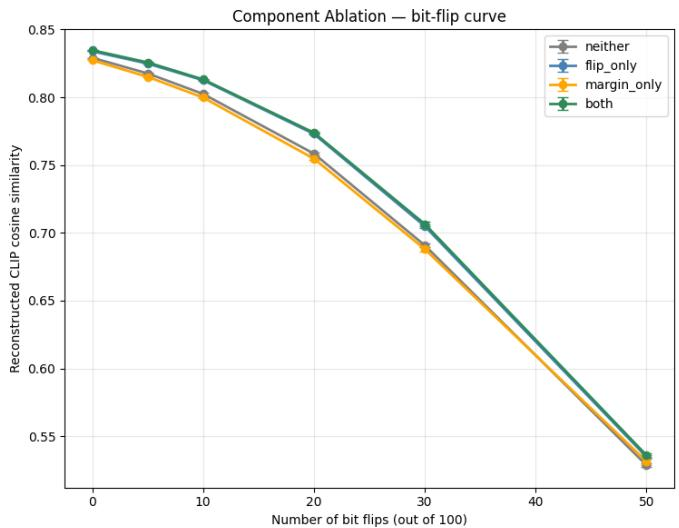

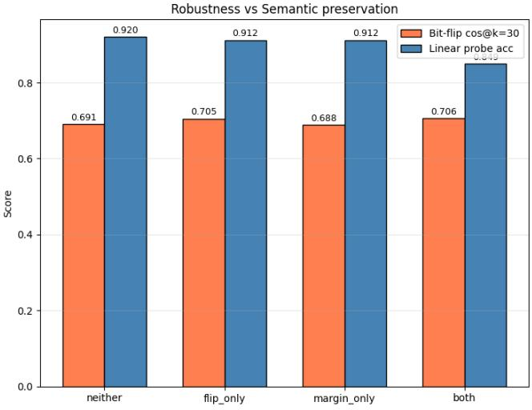

Figure 8. Component ablation visualised as bit-flip robustness curve (left) and robustness–semantic preservation summary (right). flip-noise injection alone provides the bulk of the bit-flip improvement; sign-margin contributes mainly to linear-probe accuracy without adding robustness.  
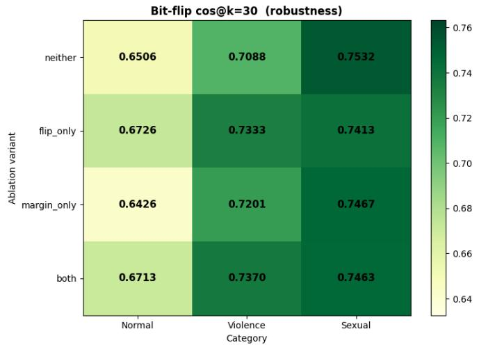

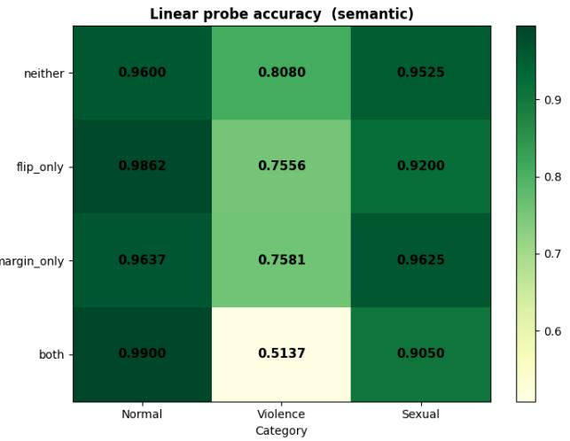  
Figure 9. Per-category breakdown of the four ablation variants. flip-noise injection improves bit-flip robustness uniformly across Normal, Violence, and Sexual categories.

Figure 8 shows that flip-noise alone is sufficient to recover most of the bit-flip robustness gain, while Figure 9 confirms that this improvement holds consistently across all three semantic categories.

## G. Hyperparameter Sensitivity $( \lambda _ { f l i p } ,$ margin, $k _ { m a x } )$

Table 11 reports a $\lambda _ { \mathrm { f l i p } }$ sweep (at fixed $\lambda _ { \mathrm { m a r g i n } } { = } 0 . 0 1 )$ and a 4-cell grid over margin $\in \{ 0 . 1 , 0 . 5 \}$ and $k _ { \operatorname* { m a x } } \in \{ 5 , 1 5 \}$ . Bit-flip robustness at $k = 3 0$ is essentially saturated across configurations $( \sigma = 0 . 0 0 5 ) ;$ linear-probe accuracy varies more $( \sigma = 0 . 0 2 0 )$ . This indicates that the channel-robustness benefit of flip-noise training is robust to hyperparameter choices, and that practical tuning trades off a few percentage points of linear-probe accuracy.

Table 11. Hyperparameter sensitivity of channel-aware training. The robustness metric $( \cos \ @ k = 3 0 )$ is stable across all configurations; linear-probe accuracy shows mild variation.
<table><tr><td>Configuration</td><td>cos@k=30</td><td>LinProbe</td></tr><tr><td> $\lambda _ { \mathrm { f l i p } } { = } 0 . 0 5$ </td><td>0.703</td><td>0.880</td></tr><tr><td> $\lambda _ { \mathrm { f l i p } } { = } 0 . 1 0$ </td><td>0.703</td><td>0.828</td></tr><tr><td> $\lambda _ { \mathrm { f l i p } } { = } 0 . 2 0$ </td><td>0.704</td><td>0.896</td></tr><tr><td> $\lambda _ { \mathrm { f l i p } } { = } 0 . 5 0$ </td><td>0.697</td><td>0.813</td></tr><tr><td> $\mathrm { m a r g i n } { = } 0 . 1 , k _ { \mathrm { m a x } } { = } 5$ </td><td>0.704</td><td>0.872</td></tr><tr><td> $\mathrm { m a r g i n } { = } 0 . 1 , k _ { \mathrm { m a x } } { = } 1 5$ </td><td>0.713</td><td>0.917</td></tr><tr><td> $\mathrm { m a r g i n } { = } 0 . 5 , k _ { \mathrm { m a x } } { = } 5$ </td><td>0.708</td><td>0.868</td></tr><tr><td> $\mathrm { m a r g i n } { = } 0 . 5 , k _ { \mathrm { m a x } } { = } 1 5$ </td><td>0.699</td><td>0.899</td></tr></table>