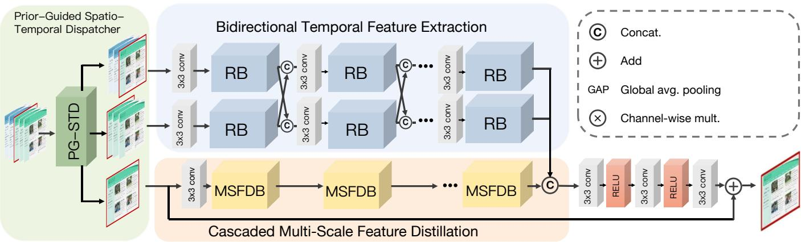
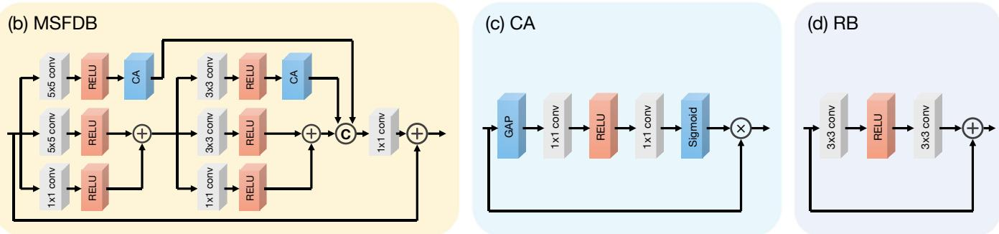
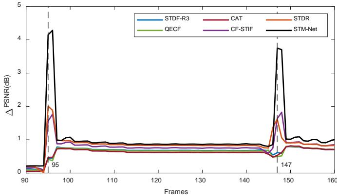
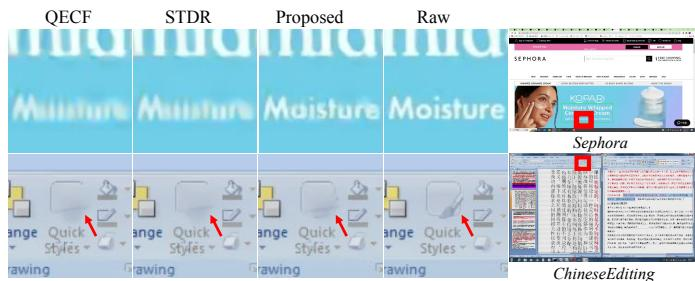
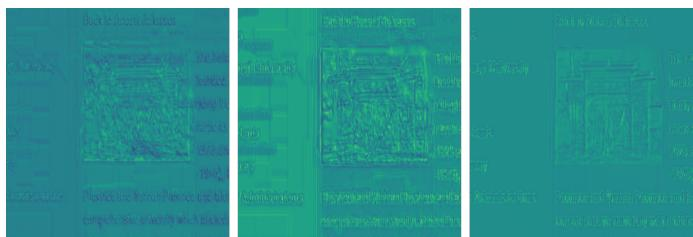

# Spatial-Temporal Multi-scale Network for Screen Content Video Quality Enhancement

Ziyin Huang, Sik-Ho Tsang, Xinyuan Qin, Yui-Lam Chan, Member, IEEE, Xueling Zhou, and Feiyu Chen

Abstract—Different from natural videos, Screen Content Videos (SCVs) are characterized by abrupt motion, scene switches, and high-frequency details such as text and graphics. Conventional video enhancement methods, which rely heavily on temporal continuity, often suffer from performance degradation when processing SCVs due to the disruption of temporal correlations. To address these challenges, we propose the Spatial-Temporal Multi-scale Network (STM-Net), a novel framework specifically tailored for compressed SCV enhancement. Our approach integrates three complementary components: a Prior-Guided Spatio-Temporal Dispatcher (PG-STD) that routes input into three parallel streams to avoid feature contamination, a Bidirectional Temporal Feature Extraction (BTFE) module that adaptively handles abrupt transitions without explicit detection, and a Cascaded Multi-scale Feature Distillation (CMFD) module that preserves critical high-frequency details. Experimental results demonstrate that STM-Net outperforms state-of-the-art methods in both objective metrics and subjective visual quality, providing a robust solution for screen content artifacts. Code is available at https://github.com/HUANGZiyin1/STM-Net.

Index Terms—Screen content video, quality enhancement, deep learning, multi-scale feature extraction.

## I. INTRODUCTION

sion ubiquitous. Pre-COVID MOOCs and remote work drove demand for efficient coding of slides, code editors, and GUIs, amplified by pandemic videoconferencing and sustained in hybrid settings [1], [2].

Various quality enhancement techniques have been proposed to improve visual fidelity for natural content [3]–[7]. However, unlike natural content, SCVs feature abrupt scene switches and computer-generated content, such as sharp edges, homogeneous regions, and repetitive patterns, which demands specialized compression like HEVC’s Screen Content Coding (SCC) [8]–[12]. Despite efficiency gains, compression artifacts such as blurring and ringing around text edges persist, severely impairing readability. Conventional enhancement methods fail due to abrupt motions (scrolling, scene switches) that disrupt temporal correlations where deep flow-based [13] or deformable convolution [14] approaches propagate errors from unrelated frames, leading to severe visual artifacts [15].

Single-frame methods [16]–[20], such as IFCNN, VRCNN, DCAD, and QE-CNN, focus primarily on spatial information to restore compressed frames. These methods effectively exploit local cues but neglect temporal continuity, limiting their performance in video sequences.

Multi-frame approaches [13]–[15], [21]–[26], such as MFQE [21], rely on optical flow alignment, which is prone to errors in SCVs due to large, discontinuous displacements. Deformable convolution networks like STDF [14] and STDR [23] offer flexible alignment but struggle with scene switches where reference frames differ entirely. Recent SCV-specific methods, including TGAF [24] and QECF [15], introduce cross-frame fusion. However, these methods typically process temporal data in a single stream, which risk feature contamination during scene switches.

To address these issues, we propose the Spatial-Temporal Multi-scale Network (STM-Net) to address temporal discontinuity and spatial high-frequency loss with three innovations:

• Prior-Guided Spatio-Temporal Dispatcher (PG-STD): PG-STD acts as a feature dispatcher that route input frames to three parallel streams (preceding, succeeding, current frames) to prevent scene-cut contamination.

• Bidirectional Temporal Feature Extraction (BTFE): Unlike single-stream methods, BTFE employs a dualstream architecture with cross-connections to adaptively prioritize reliable temporal contexts, avoiding explicit scene detection.

• Cascaded Multi-scale Feature Distillation (CMFD): To preserve fine details, CMFD employs a multi-branch architecture with multi-scale convolutions and channel attention mechanisms to distll multi-scale details in order to capture text strokes and structures while reducing oversmoothing.

Finally, there is a reconstruction process to integrate BTFE and CMFD features via residual fusion for enhanced SCV output with stable gradients. Experimental results demonstrate that STM-Net achieves superior performance compared to state-of-the-art methods, particularly in scenarios involving rich text and scene changes.

## II. OUR PROPOSED STM-NET

The proposed STM-Net framework, as illustrated in Fig. 1, is designed to remove artifacts and address the challenges of SCV enhancement by utilizing a dual-stream architecture that efficiently handles abrupt motion and scene switch scenarios. We define $I _ { t } ^ { L Q } \in \mathbb { R } ^ { H \times \mathbf { \partial W } }$ to represent a low-quality frame of size $H \times W$ . The primary objective of STM-Net is to effectively enhance $I _ { t } ^ { L Q }$ as the high-quality frame $\tilde { I } _ { t } ^ { H Q } \in \mathbb { R } ^ { H \times W }$ by leveraging both temporal and spatial information from the current frame and a neighborhood of 2R frames, which can be expressed as:

$$
\tilde { I } _ { t } ^ { H Q } = H _ { S T M - N e t } ( \{ I _ { t - R } ^ { L Q } , . . . , I _ { t } ^ { L Q } , . . . , I _ { t + R } ^ { L Q } \} )\tag{1}
$$

As illustrated in Fig. 1, the overall framework can be summarized as comprising three main modules: PG-STD, BTFE, and CMFD.

## A. Prior-Guided Spatio-Temporal Dispatcher (PG-STD)

Unlike prior single-stream methods that risk feature contamination across scene switches, the proposed PG-STD employs three parallel streams that process complementary temporal and spatial contexts to handle rapid changes in screen content. One stream processes the current frame with preceding frames $\{ I _ { t - 2 } ^ { L Q } , \stackrel { \bullet } { I _ { t - 1 } } , I _ { t } ^ { L Q } \}$ , another processes succeeding frames $\{ I _ { t } ^ { L Q } , \bar { I } _ { t + 1 } ^ { L \bar { Q } } , \bar { I } _ { t + 2 } ^ { L \bar { Q } } \}$ , and a third stream operates on the current frame alone, $\dot { I } _ { t } ^ { L Q }$ . The first two streams are fed into BTFE as dual parallel cross-connected streams that process different temporal input contexts to address rapid changes in screen content. These streams interconnect through a series of Residual Blocks (RBs) that extract hierarchical features by leveraging temporal dependencies through cross-connections. The single-frame stream is fed into CMFD module to preserve fine spatial details and mitigate over-smoothing.

## B. Bidirectional Temporal Feature Extraction (BTFE)

BTFE addresses frequent scene switches in SCVs, where conventional single-stream networks average irrelevant future frames into $I _ { t } ,$ causing artifacts.

It employs a symmetric dual-stream architecture, particularly with R=2 as in (1). One stream processes the preceding group $\{ I _ { t - 2 } ^ { L Q } , I _ { t - 1 } ^ { L Q } , I _ { t } ^ { L Q } \}$ to generate $F _ { p r e }$ , while the other processes the subsequent group $\{ I _ { t } ^ { L Q } , I _ { t + 1 } ^ { L Q } , I _ { t + 2 } ^ { L Q } \}$ to generate $F _ { p o s t }$ . Cross-connections via Residual Blocks (RBs) enable implicit prioritization:

$$
\begin{array} { r } { F _ { p r e } ^ { n } = H _ { R B } ^ { n } ( F _ { p r e } ^ { n - 1 } + F _ { p o s t } ^ { n - 1 } ) } \\ { F _ { p o s t } ^ { n } = H _ { R B } ^ { n } ( F _ { p o s t } ^ { n - 1 } + F _ { p r e } ^ { n - 1 } ) } \end{array}\tag{2}
$$

Cross-stream additions enable the network to implicitly compare and prioritize the stable temporal context over corrupted streams during abrupt changes, avoiding explicit scenecut detection overhead. This novel separation-and-fusion dynamically de-emphasizes irrelevant frames (e.g., post-switch $F _ { p r e } ^ { n }$ or pre-switch $F _ { p o s t } ^ { n } )$ , preserving high-frequency details in transitions like window dragging and switching, which is a key advance over traditional collective processing.

## C. Cascaded Multi-Scale Feature Distillation (CMFD)

Deep SCV enhancement networks suffer feature degradation in deeper layers, which struggles to preserve high-frequency text edges and sharp boundaries, which cannot be addressed by natural-video multi-scale methods.

As shown in Fig. 1, each MSFD Block (MSFDB) uses multi-path architecture comprising parallel $1 \times 1 , 3 \times 3$ , and $5 \times 5$ convolutional branches $( \Phi _ { k \times k } )$ conv + ReLU). Initial extraction on $F _ { i n }$ yields $f _ { 1 } = \Phi _ { 1 \times 1 } ( F _ { i n } ) , f _ { 5 , 1 } = \Phi _ { 5 \times 5 } ( F _ { i n } )$ with CA on the $5 \times 5$ branch giving ${ f _ { 5 , 2 } } = \mathbf { C A } ( { f _ { 5 , 1 } } )$ ; these fuse element-wise as $f _ { f u s e d } ^ { 1 } = f _ { 1 } + f _ { 5 , 1 }$

To further distill spatial information, $f _ { f u s e d } ^ { 1 }$ undergoes secondary parallel processing: $g _ { 1 } \ = \ \Phi _ { 1 \times 1 } ( f _ { f u s e d } ^ { 1 } ) , \ g _ { 3 , 1 } \ =$ $\Phi _ { 3 \times 3 } ( f _ { f u s e d } ^ { 1 } )$ (where $3 \times 3$ kernels capture mid-level context), refined by a second CA module to yield $^ { g _ { 3 , 2 } . }$ . The final distilled output is generated by concatenating the multi-scale paths followed by $\mathrm { ~ \ i ~ } 1 \times 1$ projection:

$$
F _ { d i s t i l l e d } = \Phi _ { 1 \times 1 } ( [ f _ { 5 , 2 , } { g _ { 3 , 2 } } , ( g _ { 1 } + g _ { 3 , 1 } ) ] )\tag{3}
$$

A global residual connection $F _ { o u t } = F _ { d i s t i l l e d } + F _ { i n }$ is applied to each MSFDB, facilitating stable gradient flow and feature reuse. This novel cascaded design iteratively distills hierarchical features via multi-scale kernels, uniquely balancing sharp text edges with uniform regions—mitigating deep-network degradation unlike conventional single-scale methods.

## D. Reconstruction

Finally, BTFE temporal features and CMFD spatial details are concatenated, refined via three $3 \times 3$ convolutions, and added residually to $I _ { t } ^ { L Q }$ to yield $\tilde { I } _ { t } ^ { H Q }$ . This novel fusion uniquely leverages their complementary strengths for detailpreserving SCV enhancement.

## III. EXPERIMENTAL RESULTS

## A. Implementation Details

We constructed a dataset of 41 SCV sequences (28 for training, 13 for testing), including standard Common Test Condition (CTC) sequences [28], SCVs from other sources, and self-captured SCVs containing abrupt motions [25], [29], [30]. Videos were encoded using the reference software HM16.20- SCM8.8 under the Low Delay Main SCC (LDMS) configuration at QPs 22, 27, 32, and 37. The model was implemented in PyTorch and trained using the Charbonnier loss with the Adam optimizer $( \mathrm { l r } { = } 1 0 ^ { - 4 } )$ [31] for 300,000 iterations.

## B. Objective Visual Quality Analysis

We compare STM-Net against state-of-the-art methods, including STDF-R3 [14], QECF [15], CF-STIF [22], and STDR [23]. As shown in Table I, STM-Net consistently achieves superior performance across all QP levels. At the highest compression (QP=37), STM-Net yields a ∆PSNR of 0.875 dB, surpassing the second-best methods (TGAF and CF-STIF) by approximately 8.3–9.4% and significantly outperforming STDF-R3 by 38.5%. These gains are sustained at lower QPs. Furthermore, STM-Net achieves a BD-rate reduction of −7.12%, representing a substantial improvement over CF-STIF (−6.48%). Scaling up to STM-Net-L with more RB and MSFDB blocks further improves the BD-rate reduction to −7.46%. Visual comparisons in Fig. 3 confirm that STM-Net restores sharper edges and clearer text, validating its specialized design for screen content.

(a) STM-Net  

  
Fig. 1. The proposed STM-Net structure, comprising Prior-Guided Spatio-Temporal Dispatcher (PG-STD), Bidirectional Temporal Feature Extraction (BTFE) module, and Cascaded Multi-scale Feature Distillation (CMFD) module.

TABLE I  
∆PSNR (∆P) (DB) AND ∆SSIM (∆S) $( \times 1 0 ^ { - 3 } )$ AT QP=37, AVERAGE RESULTS FOR QP=32, 27, 22, AND BD-RATE COMPARISON.
<table><tr><td rowspan="2">Seq. (QP=37)</td><td colspan="2">STDF-R3 [14]</td><td colspan="2">QECF [15]</td><td colspan="2">CAT [27]</td><td colspan="2">CF-STIF [22]</td><td colspan="2">STDR [23]</td><td colspan="2">TGAF [24]</td><td colspan="2">EAST-LITE [25]</td><td colspan="2">STM-Net</td><td colspan="2">STM-Net-L</td></tr><tr><td>∆P</td><td>ΔS</td><td>ΔP</td><td>∆S</td><td>∆P</td><td>ΔS</td><td>∆P</td><td>ΔS</td><td>∆P</td><td>∆S</td><td>∆P</td><td>∆S</td><td>∆P</td><td>∆S</td><td>∆P</td><td>∆S</td><td>∆P</td><td>∆S</td></tr><tr><td>BigBuck</td><td>0.327</td><td>3.18</td><td>0.325</td><td>3.23</td><td>0.318</td><td>4.19</td><td>0.369</td><td>3.98</td><td>0.408</td><td>4.33</td><td>0.432</td><td>4.11</td><td>0.411</td><td>4.82</td><td>0.438</td><td>4.61</td><td>0.485</td><td>5.04</td></tr><tr><td>ChineseEditing</td><td>0.273</td><td>2.22</td><td>0.244</td><td>1.63</td><td>0.200</td><td>1.24</td><td>0.360</td><td>2.41</td><td>0.321</td><td>1.77</td><td>0.48</td><td>3.79</td><td>0.525</td><td>4.17</td><td>0.544</td><td>3.68</td><td>0.65</td><td>4.68</td></tr><tr><td>EnglishDoc</td><td>0.867</td><td>2.78</td><td>0.770</td><td>2.70</td><td>0.951</td><td>3.27</td><td>1.243</td><td>3.41</td><td>1.266</td><td>4.01</td><td>1.101</td><td>3.63</td><td>0.991</td><td>3.36</td><td>1.194</td><td>3.46</td><td>1.275</td><td>4.04</td></tr><tr><td>MissionControl1</td><td>0.492</td><td>4.17</td><td>0.503</td><td>4.12</td><td>0.477</td><td>4.00</td><td>0.625</td><td>4.72</td><td>0.546</td><td>4.59</td><td>0.721</td><td>5.73</td><td>0.647</td><td>6.02</td><td>0.760</td><td>5.94</td><td>0.782</td><td>6.39</td></tr><tr><td>MissionControl2</td><td>0.569</td><td>5.33</td><td>0.563</td><td>5.19</td><td>0.568</td><td>5.18</td><td>0.672</td><td>5.67</td><td>0.689</td><td>6.08</td><td>0.677</td><td>5.38</td><td>0.612</td><td>5.55</td><td>0.700</td><td>5.48</td><td>0.748</td><td>5.94</td></tr><tr><td>MissionControl3</td><td>0.545</td><td>5.06</td><td>0.551</td><td>4.96</td><td>0.535</td><td>4.98</td><td>0.625</td><td>5.25</td><td>0.591</td><td>5.51</td><td>0.61</td><td>4.3</td><td>0.573</td><td>4.56</td><td>0.666</td><td>4.59</td><td>0.724</td><td>5.08</td></tr><tr><td>Paperpdf</td><td>1.281</td><td>2.87</td><td>1.225</td><td>2.67</td><td>1.421</td><td>3.08</td><td>1.718</td><td>3.28</td><td>1.718</td><td>3.31</td><td>1.728</td><td>3.18</td><td>1.5</td><td>3.07</td><td>1.778</td><td>3.34</td><td>1.922</td><td>3.5</td></tr><tr><td>Sephora</td><td>0.779</td><td>2.38</td><td>0.831</td><td>2.34</td><td>0.864</td><td>2.79</td><td>1.127</td><td>3.32</td><td>1.189</td><td>3.81</td><td>1.233</td><td>4.24</td><td>1.069</td><td>3.85</td><td>1.165</td><td>3.51</td><td>1.273</td><td>3.88</td></tr><tr><td>mixvideo</td><td>0.301</td><td>3.46</td><td>0.365</td><td>3.51</td><td>0.329</td><td>3.05</td><td>0.278</td><td>3.85</td><td>0.306</td><td>4.16</td><td>0.516</td><td>4.13</td><td>0.528</td><td>4.35</td><td>0.558</td><td>4.45</td><td>0.577</td><td>4.9</td></tr><tr><td>scSlideShow</td><td>0.914</td><td>4.02</td><td>0.910</td><td>3.98</td><td>0.878</td><td>4.21</td><td>1.054</td><td>4.30</td><td>1.094</td><td>4.52</td><td>0.866</td><td>4.11</td><td>1.076</td><td>4.59</td><td>1.154</td><td>4.44</td><td>1.205</td><td>4.64</td></tr><tr><td>scmap</td><td>0.453</td><td>5.71</td><td>0.373</td><td>3.53</td><td>0.416</td><td>6.26</td><td>0.526</td><td>5.97</td><td>0.408</td><td>5.04</td><td>0.463</td><td>6.44</td><td>0.476</td><td>6.91</td><td>0.487</td><td>4.64</td><td>0.571</td><td>6.12</td></tr><tr><td>scprogramming</td><td>0.406</td><td>4.90</td><td>0.427</td><td>4.93</td><td>0.403</td><td>4.86</td><td>0.520</td><td>5.51</td><td>0.514</td><td>5.11</td><td>0.545</td><td>4.97</td><td>0.545</td><td>5.82</td><td>0.596</td><td>5.42</td><td>0.649</td><td>6.11</td></tr><tr><td>scwebbrowsing</td><td>1.008</td><td>3.28</td><td>0.907</td><td>3.38</td><td>0.969</td><td>3.56</td><td>1.286</td><td>3.93</td><td>1.046</td><td>3.72</td><td>1.137</td><td>3.78</td><td>1.107</td><td>3.69</td><td>1.329</td><td>3.93</td><td>1.48</td><td>4.09</td></tr><tr><td>Avg. (QP=37)</td><td>0.632</td><td>3.80</td><td>0.615</td><td>3.55</td><td>0.641</td><td>3.90</td><td>0.800</td><td>4.28</td><td>0.777</td><td>4.30</td><td>0.808</td><td>4.45</td><td>0.774</td><td>4.67</td><td>0.875</td><td>4.42</td><td>0.949</td><td>4.95</td></tr><tr><td>Avg. (QP=32)</td><td>0.533</td><td>2.09</td><td>0.531</td><td>2.12</td><td>0.541</td><td>2.04</td><td>0.704</td><td>2.54</td><td>0.655</td><td>2.37</td><td>0.656</td><td>2.19</td><td>0.684</td><td>2.37</td><td>0.752</td><td>2.37</td><td>0.801</td><td>2.58</td></tr><tr><td>Avg. (QP=27)</td><td>0.467</td><td>0.91</td><td>0.495</td><td>1.07</td><td>0.429</td><td>0.91</td><td>0.608</td><td>1.22</td><td>0.588</td><td>1.10</td><td>0.586</td><td>0.99</td><td>0.548</td><td>1.12</td><td>0.661</td><td>1.14</td><td>0.681</td><td>1.15</td></tr><tr><td>Avg. (QP=22)</td><td>0.417</td><td>0.53</td><td>0.470</td><td>0.54</td><td>0.426</td><td>0.55</td><td>0.533</td><td>0.64</td><td>0.537</td><td>0.62</td><td>0.550</td><td>0.61</td><td>0.496</td><td>0.61</td><td>0.563</td><td>0.60</td><td>0.563</td><td>0.62</td></tr><tr><td>Avg. BD-Rate</td><td>-5.24%</td><td></td><td></td><td>-5.38%</td><td></td><td>-5.20%</td><td></td><td>-6.48%</td><td></td><td>-6.23%</td><td>-6.46%</td><td></td><td></td><td>-6.43%</td><td>-7.12%</td><td></td><td>-7.46%</td><td></td></tr><tr><td></td><td></td><td></td><td></td><td></td><td></td><td></td><td></td><td></td><td></td><td></td><td></td><td></td><td></td><td></td><td></td><td></td><td></td><td></td></tr></table>

To evaluate the capability of our proposed STM-Net in handling scene switches, a screen content videos was selected to compute the ∆PSNR curves for STDF-R3, QECF, CAT, CF-STIF, STDR, and our proposed method. The mixvideo sequence is composed of spliced videos from CTC [28], which allows us to evaluate the performance of our method in scenarios involving abrupt scene transitions. The results are shown in Fig. 2, where dashed lines indicate scene switch frames. The result demonstrates that our proposed method demonstrates an improvement during most of the transition points, highlighting its effectiveness in handling abrupt scene transitions. This robustness to screen content videos highlights the versatility and reliability of our method.

## C. Subjective Visual Quality Analysis

Fig. 3 presents a visual comparison at QP=37. The top and bottom rows display the Sephora and ChineseEditing sequences, which contain small-sized text and computer-graphic icon, respectively. This is a challenging case where highfrequency information is heavily quantized. While competing methods produce blurry artifacts in regions containing text, STM-Net effectively reconstructs the character shapes. This capability is directly attributed to the CMFD module, where the 1×1 convolution branch preserves fine details that are often lost by larger receptive fields.

Fig. 2. ∆PSNR curves for mixvideo; dashed lines mark scene switches.  
  
Fig. 3. Subjective visual quality comparison at QP=37. Top: Textual content enhancement on Sephora. Bottom: Graphical content enhancement on ChineseEditing. STM-Net restores clearer texts and sharper edges compared to state-of-the-art methods.

TABLE II  
ABLATION STUDY OF DIFFERENT ARCHITECTURE COMPONENTS IN STM-NET AT QP=37
<table><tr><td>Model Structure</td><td>STM-Net</td><td>STM-Nscale</td><td>STM-NHF</td><td>STM-Net-S</td></tr><tr><td>Multi-scale Feature Extraction</td><td>√</td><td>×</td><td>√</td><td>√</td></tr><tr><td>High-Frequency Processing</td><td>√</td><td>√</td><td>×</td><td>√</td></tr><tr><td>Number of RBs</td><td>3</td><td>3</td><td>3</td><td>2</td></tr><tr><td>Number of MSFDBs</td><td>3</td><td>3</td><td>3</td><td>2</td></tr><tr><td>∆PSNR (dB)</td><td>0.875</td><td>0.839</td><td>0.834</td><td>0.798</td></tr></table>

## D. Ablation Study

To verify the contribution of each architectural component, we conducted ablation experiments at QP=37, with the results summarized in Table II. Specifically, we compare the full model STM-Net (baseline with the complete architecture) against three ablated variants: STM-Nscale, which removes the multi-scale feature extraction paths (5×5+CA and 3×3+CA branches); STM-NHF, which removes the highfrequency processing paths (1×1 + ReLU paths); and STM-Net-S, which reduces the network depth by using only 2 RB pairs and 2 MSFDBs.

  
Fig. 4. Visualization of Intermediate Features on Scene Switch. (Left: BTFE Features Suppressed for Previous Frames; Middle: BTFE Features Emphasized for Future Frames, e.g.: left menu changed; Right: CMFD Features Emphasized for Screen Content Edges at Current Frame)

TABLE III  
COMPARISON OF MODEL SIZES
<table><tr><td>Model</td><td>STDF-R3</td><td>QECF</td><td>CAT</td><td>CF-STIF</td><td>STDR</td><td>STM-Net-S</td><td>STM-Net</td><td>STM-Net-L</td></tr><tr><td>∆ PSNR (dB)</td><td>0.632</td><td>0.615</td><td>0.641</td><td>0.800</td><td>0.777</td><td>0.798</td><td>0.875</td><td>0.949</td></tr><tr><td>Parameters (KB)</td><td>364.51</td><td>773.31</td><td>848.55</td><td>1242.10</td><td>1521.13</td><td>674.37</td><td>1009.75</td><td>1345.13</td></tr></table>

Impact of Multi-scale and High-frequency Processing: Eliminating the multi-scale branches (STM-Nscale) or discarding the high-frequency 1×1+ReLU paths (STM-NHF) both cause a consistent performance decrease of about 0.04 dB. This confirms that the multi-scale context modeling (via 5×5+CA and $3 \times 3 { + } \mathrm { C A } )$ and the fine-grained high-frequency enhancement (via 1×1+ReLU) are complementary and jointly important for handling SCVs.

Impact of Network Depth: Among all variants, reducing the overall depth (STM-Net-S: 2 RB pairs and 2 MSFDBs) yields the largest degradation (-0.077 dB). This suggests that sufficient depth is crucial for both BTFE and CMFD modules to learn complex temporal and spatial dependencies respectively, which are important for robust processing under scene switches and fine-grained high-frequency details.

## E. Model Scaling

Table III compares the average ∆PSNR against the model parameters. These results are averaged over all test sequences. As a result, the performance of STM-Net significantly surpasses other methods and requires fewer model parameters than CF-STIF and STDR, as in Table III. In addition, our STM-Net is a modular network, allowing for easy model scaling by varying the number of RB and MSFDB blocks. Therefore, in applications with computational limitations, we can use a lightweight structure, such as STM-Net-S, with fewer blocks $( N \ = \ M \ = \ 2 )$ . STM-Net-S requires fewer model parameters than STDF-R3, QECF, CAT, and STDR, as shown in Table III, yet still achieves higher ∆PSNR of 0.798 dB. This highlights the efficiency and effectiveness of our proposed method. On the other hand, scaling up as STM-Net-L (N = M = 4) yields further improvements of nearly 1 dB (0.949 dB), which demonstrates that model scaling is applicable for our STM-Net on SCV enhancement.

## F. Feature Visualizations

Fig. 4 presents intermediate feature visualizations for BTFE and CMFD using Grad-CAM [32], which validates their key advantages. These features illustrate how BTFE’s dual-stream design automatically prioritizes the more temporally consistent direction during abrupt scene switches, while CMFD effectively preserves sharp text strokes and high-frequency details. In BTFE visualizations, light colors indicate high activation weights assigned to the more temporally consistent stream (reliable frames), while dark colors denote suppressed weights on disrupted streams during abrupt scene switches, which demonstrates automatic prioritization without explicit detection. Meanwhile, CMFD features (right) preserve sharp text strokes and high-frequency details through multi-scale distillation, with light-to-dark gradients highlighting enhanced edge recovery and reduced over-smoothing compared to inputs.

## IV. CONCLUSION

This paper presents STM-Net, a specialized framework for screen content video quality enhancement. By seamlessly integrating Prior-Guided Spatio-Temporal Dispatcher (PG-STD), bidirectional temporal feature extraction (BTFE) with cascaded multi-scale feature distillation (CMFD), it effectively tackles SCV-specific challenges such as abrupt scene switches, discontinuous motions, and high-frequency detail loss from compression artifacts. Extensive experiments confirm that STM-Net achieves state-of-the-art performance, offering a promising solution for high-quality screen content delivery.

## REFERENCES

[1] A. Muller and A. Wittmer, “The choice between business travel and¨ video conferencing after covid-19 – insights from a choice experiment among frequent travelers,” Tourism Management, vol. 96, p. 104688, 2023.

[2] K. Ishii, I. Yamamoto, and M. Nakayama, “Potential benefits and determinants of remote work during the covid-19 pandemic: Evidence from japanese household panel data,” Journal of the Japanese and International Economies, vol. 70, p. 101285, 2023.

[3] W. Wan and P.-W. Hao, “Bilateral false contour elimination filter-based image bit-depth enhancement,” IEEE Signal Processing Letters, vol. 28, pp. 150–154, 2021.

[4] Y. Qiu, J. Chen, Z. Wang, X. Wang, and C.-W. Lin, “Spatio-spectral feature fusion for low-light image enhancement,” IEEE Signal Processing Letters, vol. 28, pp. 2157–2161, 2021.

[5] Y. Shi, B. Wang, X. Wu, and M. Zhu, “Unsupervised low-light image enhancement by extracting structural similarity and color consistency,” IEEE Signal Processing Letters, vol. 29, pp. 997–1001, 2022.

[6] J. Ji, B. Zhong, Q. Wu, and K.-K. Ma, “A channel-wise multi-scale network for single image super-resolution,” IEEE Signal Processing Letters, vol. 31, pp. 805–809, 2024.

[7] Y.-H. Cheng, W.-C. Siu, and S.-C. Chan, “Quality-assisted domain transfer for fast face super-resolution,” IEEE Signal Processing Letters, pp. 1–5, 2026.

[8] H. Yu, K. McCann, R. Cohen, and P. Amon, “Requirements for an extension of hevc for coding of screen content,” ISO/IEC JTC, vol. 1, 2014.

[9] Z. Ma, W. Wang, M. Xu, and H. Yu, “Advanced screen content coding using color table and index map,” IEEE Transactions on Image Processing, vol. 23, no. 10, pp. 4399–4412, 2014.

[10] J. Xu, R. Joshi, and R. A. Cohen, “Overview of the emerging HEVC screen content coding extension,” IEEE Transactions on Circuits and Systems for Video Technology, vol. 26, no. 1, pp. 50–62, 2015.

[11] X. Xu, S. Liu, T.-D. Chuang, Y.-W. Huang, S.-M. Lei, K. Rapaka, C. Pang, V. Seregin, Y.-K. Wang, and M. Karczewicz, “Intra block copy in HEVC screen content coding extensions,” IEEE Journal on Emerging and Selected Topics in Circuits and Systems, vol. 6, no. 4, pp. 409–419, 2016.

[12] X. Xu and S. Liu, “Overview of screen content coding in recently developed video coding standards,” IEEE Transactions on Circuits and Systems for Video Technology, vol. 32, no. 2, pp. 839–852, 2022.

[13] R. Yang, M. Xu, Z. Wang, and T. Li, “Multi-frame quality enhancement for compressed video,” in Proceedings of the IEEE conference on computer vision and pattern recognition, 2018, pp. 6664–6673.

[14] J. Deng, L. Wang, S. Pu, and C. Zhuo, “Spatio-temporal deformable convolution for compressed video quality enhancement,” in Proceedings of the AAAI conference on artificial intelligence, vol. 34, no. 07, 2020, pp. 10 696–10 703.

[15] J. Huang, J. Cui, M. Ye, S. Li, and Y. Zhao, “Quality enhancement of compressed screen content video by cross-frame information fusion,” Neurocomputing, vol. 493, pp. 486–496, 2022.

[16] W.-S. Park and M. Kim, “Cnn-based in-loop filtering for coding efficiency improvement,” in 2016 IEEE 12th Image, Video, and Multidimensional Signal Processing Workshop (IVMSP). IEEE, 2016, pp. 1–5.

[17] Y. Dai, D. Liu, and F. Wu, “A convolutional neural network approach for post-processing in hevc intra coding,” in International conference on multimedia modeling. Springer, 2016, pp. 28–39.

[18] H. Zhao, M. He, G. Teng, X. Shang, G. Wang, and Y. Feng, “A cnn-based post-processing algorithm for video coding efficiency improvement,” IEEE Access, vol. 8, pp. 920–929, 2020.

[19] T. Wang, M. Chen, and H. Chao, “A novel deep learning-based method of improving coding efficiency from the decoder-end for HEVC,” in 2017 data compression conference (DCC). IEEE, 2017, pp. 410–419.

[20] R. Yang, M. Xu, T. Liu, Z. Wang, and Z. Guan, “Enhancing quality for hevc compressed videos,” IEEE Transactions on Circuits and Systems for Video Technology, vol. 29, no. 7, pp. 2039–2054, 2018.

[21] Z. Guan, Q. Xing, M. Xu, R. Yang, T. Liu, and Z. Wang, “Mfqe 2.0: A new approach for multi-frame quality enhancement on compressed video,” IEEE transactions on pattern analysis and machine intelligence, vol. 43, no. 3, pp. 949–963, 2019.

[22] D. Luo, M. Ye, S. Li, and X. Li, “Coarse-to-fine spatio-temporal information fusion for compressed video quality enhancement,” IEEE Signal Processing Letters, vol. 29, pp. 543–547, 2022.

[23] D. Luo, M. Ye, S. Li, C. Zhu, and X. Li, “Spatio-temporal detail information retrieval for compressed video quality enhancement,” IEEE Transactions on Multimedia, vol. 25, pp. 6808–6820, 2023.

[24] Q. Zhu, Y. Qiu, Y. Liu, S. Zhu, and B. Zeng, “Compressed video quality enhancement with temporal group alignment and fusion,” IEEE Signal Processing Letters, vol. 31, pp. 1565–1569, 2024.

[25] Z. Huang, Y.-L. Chan, S.-H. Tsang, N.-W. Kwong, K.-M. Lam, and W.- K. Ling, “Spatio-temporal feature learning for enhancing video quality based on screen content characteristics,” Journal of Visual Communication and Image Representation, vol. 104, p. 104270, 2024.

[26] Z. Huang, Y.-L. Chan, N.-W. Kwong, S.-H. Tsang, K.-M. Lam, and W.- K. Ling, “Frame similarity-based screen content video quality enhancement via adaptive long short-term fusion,” in 2024 IEEE International Conference on Visual Communications and Image Processing (VCIP). IEEE, 2024, pp. 1–5.

[27] Y. Liu, M. Ye, Y. Gao, S. Li, Y. Zhao, and X. Li, “Content adaptive compressed screen content video quality enhancement,” in 2022 IEEE International Conference on Multimedia and Expo (ICME), 2022, pp. 01–06.

[28] K. Sharman and K. Suehring, “Common test conditions, document jctvcz1100,” Geneva, Switzerland, 2016.

[29] S.-H. Tsang, Y.-L. Chan, and W. Kuang, “Mode skipping for hevc screen content coding via random forest,” IEEE Transactions on Multimedia, vol. 21, no. 10, pp. 2433–2446, 2019.

[30] JCT-VC, “Screen content sequences,” 2015. [Online]. Available: ftp://mpeg.tnt.uni-hannover.de/testsequences/

[31] D. P. Kingma and J. Ba, “Adam: A method for stochastic optimization,” arXiv preprint arXiv:1412.6980, 2014.

[32] R. R. Selvaraju, M. Cogswell, A. Das, R. Vedantam, D. Parikh, and D. Batra, “Grad-cam: Visual explanations from deep networks via gradient-based localization,” in Proceedings of the IEEE International Conference on Computer Vision (ICCV), 2017, pp. 618–626.