# TouchScale: 500 Hours of Human Vision and Touch for Visual-Tactile Learning

Dayou Li1,∗, Hao Wang2,∗, Qianqian Yang3,∗, Zihao Zhu1,∗, Haoquan Fang4, Ziyao Zeng5, Yan Han6, Zihan Wang7, Yan Wang8, Baoru Huang9, Dilin Wang10, Kenji Shimada3, Yiyue Luo11, Manling Li12, Teresa Lv13, Mustafa Mukadam11, Rakesh Ranjan10, Ruohan Zhang4, Qi He6, Changliu Liu3, Xu Chen11, Marco Pavone4,8, Bangya Liu7, Jiachen Li14, Masayoshi Tomizuka15, Zhiwen Fan1,†

1Texas A&M University, 2Google DeepMind, 3CMU, 4Stanford University, 5Yale University, 6Microsoft, 7Overfit Lab, 8NVIDIA, 9University of Liverpool, 10Meta, 11University of Washington, 12Northwestern University, 13Sony, 14Georgia Tech, 15UC Berkeley

Large-scale egocentric human interaction data is becoming an important source of physical supervision for embodied learning, yet video alone leaves the contact and pressure that characterize physical interaction unrecorded. Recent visual–tactile datasets provide this missing supervision, but their synchronized tactile data remain far smaller in volume than human video. Moreover, the largest resources often merge recordings from diferent sensors or annotation procedures, which makes the efect of data scale dificult to isolate. In short, datasets that capture hundreds of hours of human vision and touch through one consistent sensing pipeline remain scarce. We therefore introduce TouchScale, a 500-hour dataset of contact-rich human interaction recorded with a single unified wearable setup. Its approximately 2K predefined task descriptions span everyday activities and structured manipulation, and each recording temporally aligns egocentric RGB-D video with wrist RGB video and dense full-hand bimanual tactile measurements. With TouchScale, we ask what scaling human visual–tactile data unlocks for perception and robot learning. Compared with prior tactile data, training on the full TouchScale raises zero-shot contact IoU on data from an unseen tactile sensor from 0.134 to 0.383. Pretraining a visual encoder on TouchScale also yields the highest action recognition accuracy on three benchmarks among the compared visual–tactile datasets. Used for visual–tactile mid-training of a robot policy, TouchScale improves the average real-world success rate across four contact-rich manipulation tasks from 22.5% to 57.5%. With the sensor and collection protocol held fixed, both zero-shot tactile prediction and robot success show an overall upward trend as more TouchScale data is used. These results suggest that human visual–tactile data collected at scale with consistent sensing benefits both perception and robot manipulation. We will publicly release TouchScale, including all synchronized visual–tactile recordings and reconstructed object models, to support future research on scalable visual–tactile learning.

Date: September 27, 2026   
Keywords: Visual-Tactile Learning, Egocentric Dataset, Robotic Manipulation   
Project Website: https://touch-scale.github.io/   
Correspondence: Zhiwen Fan: zhiwenfan@tamu.edu

## 1 Introduction

When a person lifts an egg or wrings a wet cloth, the outcome depends on where the fingers press and how hard, yet a camera watching the hand records only its motion. Similarly, egocentric video datasets now span hundreds to thousands of hours of human activity, from everyday tasks to fine-grained hand-object manipulation (Grauman et al., 2022, 2024; Hoque et al., 2026), and have begun to support robot learning (Kareer et al., 2025; Zheng et al., 2026), yet they capture how hands move while leaving contact and pressure unrecorded. The missing signal is increasingly important for robotics, as tactile sensing has become a common input for contact-rich manipulation (Yin et al., 2023; Yuan et al., 2024; Huang et al., 2025; Yu et al., 2025; Liu et al., 2025; Niu et al., 2026). Existing egocentric visual–tactile datasets provide this signal, but most contain fewer than 30 hours of recorded interaction (Song et al., 2025; Dessalene et al., 2026; Zhou et al., 2026b). Thus the efect of data scale is dificult to study within any single one, and pooling several datasets introduces a second dificulty, as their diferences in sensing hardware and collection protocol confound comparisons across them. Although recent studies using egocentric human data have reported favorable scaling trends for downstream robot learning (Kareer et al., 2025; Zhu et al., 2026; Punamiya et al., 2026; Zheng et al., 2026), it remains unclear whether these benefits extend to visual–tactile learning and robotic manipulation when tactile data are collected at the scale of hundreds of hours under a unified sensing pipeline.

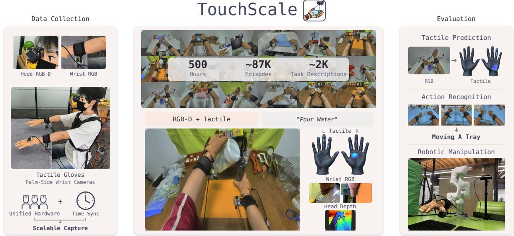  
Figure 1 Overview. TouchScale is a large-scale human visual–tactile dataset collected with a unified wearable system Capture: Human interactions are recorded with synchronized head RGB-D, wrist RGB from both hands, and bimanual tactile measurements. Dataset: TouchScale contains 500 hours of data, approximately 87K episodes, and approximately 2K task descriptions spanning diverse everyday interactions. Evaluation: We evaluate it on tactile prediction, action recognition, and robotic manipulation.

To address this gap, we introduce TouchScale, a 500-hour visual–tactile dataset that pairs diverse human interaction with consistent multimodal sensing from a unified wearable capture pipeline. Each recording synchronizes egocentric RGB-D video with wrist RGB videos and dense full-hand tactile measurements from both hands, and the recordings span everyday activities and structured manipulation tasks with diverse hand motions and interaction patterns. Using the same wearable setup, we record interactions under approximately 2K task descriptions with more than 1.5K objects, spanning 9 high-level collection settings that contain over 800 distinct scene configurations. All recordings share the same generation of sensing hardware and synchronization pipeline, so visual and tactile measurements remain consistent throughout the dataset. The wearable setup can also be deployed repeatedly across participants and environments without requiring manual action annotation, which ofers a practical collection paradigm to further scale human visual–tactile data.

With TouchScale, we study four questions about large-scale human visual–tactile data. First, we ask whether training on TouchScale enables zero-shot vision-to-touch prediction on a tactile sensor unseen during training. With the same prediction architecture, the model trained on a size-matched 16-hour subset of TouchScale reaches a contact IoU (cIoU) of 0.181 on EgoTactile, compared with 0.134 for the one trained on the 16-hour EgoTouch training split (Zhou et al., 2026b). Second, we ask whether tactile supervision on TouchScale learns visual representations that transfer beyond tactile prediction, and pretraining on TouchScale yields higher action recognition accuracy than pretraining on the compared visual–tactile datasets across three benchmarks under both linear probing and end-to-end fine-tuning. Third, we ask whether human visual–tactile data improves robot policies. Prior work has used tactile observations directly in robot policies or combined human tactile data with action supervision for transfer to robots (Liu et al., 2025; Niu et al., 2026; Zhang et al., 2026a), whereas we use TouchScale only for visual–tactile mid-training of N -VTLA (NeoteAI Team and Fudan TEAI Team, 2026) without retargeting human hand motion to the robot. This mid-training raises the average real-world success rate on four contact-rich manipulation tasks from 22.5% to 57.5%. Finally, we ask whether these gains grow with data scale when the sensor and collection protocol stay fixed. Increasing the training data from one tenth of TouchScale to the full dataset raises zero-shot cIoU on EgoTactile from 0.311 to 0.383, and growing the mid-training data from one fifth to the full dataset lifts robot success from 30.0% to 57.5%. Together, these results indicate that large-scale human visual–tactile data benefits embodied learning from perception to robot control, with gains that tend to increase over the range of scales we test.

<table><tr><td>Dataset</td><td>Hours</td><td>Samples</td><td>Vision</td><td>Views</td><td>Hands</td><td>Sensor</td><td>Components Taxels/hand</td><td></td><td>Coverage</td><td>Objects</td></tr><tr><td>STAG Sundaram et al. (2019)</td><td>NR</td><td>135K frames</td><td></td><td></td><td>Single</td><td>Glove</td><td>Normal</td><td>548</td><td>Hand</td><td>26</td></tr><tr><td>ActionSense DelPreto et al. (2022)</td><td>12.97</td><td>NR</td><td>RGB-D</td><td>H+6Exo</td><td>Both</td><td>Glove</td><td>Normal</td><td>682</td><td>Hand excl. tips</td><td>21</td></tr><tr><td>PressureVisionDB Grady et al. (2022)</td><td>16</td><td>~3M frames</td><td>RGB</td><td>4Ex0</td><td>Single</td><td>Pad</td><td>Normal</td><td></td><td>Surface</td><td></td></tr><tr><td>ContactLabelDB Grady et al. (2024)</td><td>NR</td><td>500K pressure frames</td><td>RGB</td><td>Ex0</td><td>Single</td><td>Pad</td><td>Normal</td><td></td><td>Tips</td><td></td></tr><tr><td>EgoPressure Zhao et al. (2025)</td><td>5</td><td>4.3M frames</td><td>RGB-D</td><td>H+7Exo</td><td>Single</td><td>Pad</td><td>Normal</td><td></td><td>Surface</td><td></td></tr><tr><td>OpenTouch Song et al. (2025)</td><td>5.1</td><td>2.9K clips</td><td>RGB</td><td>H</td><td>Single</td><td>Glove</td><td>Normal</td><td>169</td><td>Hand</td><td>~800 types</td></tr><tr><td>FEEL Dessalene et al. (2026)</td><td>~27</td><td>3M frames</td><td>RGB</td><td>H</td><td>Both</td><td>Glove</td><td>Normal</td><td>6</td><td>Tips+palm</td><td>NR</td></tr><tr><td>EgoTouch Zhou et al. (2026b)</td><td>20</td><td>2.1M frames</td><td>RGB</td><td>H+2W</td><td>Both</td><td>Glove</td><td>Normal</td><td>16×16</td><td>Palm</td><td>1000+</td></tr><tr><td>EgoTactile Zeng et al. (2026)</td><td>5.82</td><td>768 clips</td><td>RGB</td><td>H/neck</td><td>Single</td><td>Glove</td><td>Normal</td><td>162</td><td>Hand</td><td>63</td></tr><tr><td>DeskTask-Tac</td><td></td><td></td><td></td><td></td><td></td><td></td><td></td><td></td><td></td><td></td></tr><tr><td>Zhang et al. (2026a) TouchScale</td><td>37.2 500</td><td>~4M frames ~87K episodes</td><td>RGB RGB-D</td><td>H+2Ex0 H+2W</td><td>Both Both</td><td>Glove Glove</td><td>NR Normal</td><td>NR 880</td><td>Hand Hand</td><td>NR 1.5k+</td></tr></table>

Table 1 Comparison of human tactile and visual–tactile datasets. H, W, and Exo denote head, wrist, and external views, respectively; NR denotes not reported and – denotes not applicable. We report the pressure-labeled subset of ContactLabelDB and the directly recorded human subset of H-Tac as DeskTask-Tac. Among these datasets, TouchScale ofers the most recorded hours and the densest glove-based tactile sensing.

In summary, our main contributions are:

• We introduce TouchScale, a 500-hour human visual–tactile dataset spanning diverse physical interactions, together with a scalable wearable capture paradigm that combines egocentric RGB-D and bimanual wrist RGB cameras with dense full-hand tactile gloves, and we will make the dataset publicly available.

• We evaluate TouchScale from perception to robot control. Models trained on TouchScale transfer zero-shot to an unseen tactile sensor, and tactile-supervised pretraining on TouchScale yields visual representations that transfer to action recognition. Used as mid-training supervision without human-torobot action alignment, TouchScale raises the average real-world success rate across four contact-rich manipulation tasks from 22.5% to 57.5%.

• We study data scaling with the sensor and collection protocol held fixed, varying only the amount of training data. Both zero-shot tactile prediction and real-world manipulation success show an overall upward trend as TouchScale data increases, suggesting that the scaling benefits reported for egocentric video also hold for visual–tactile learning.

## 2 Related Work

## 2.1 Egocentric Visual–Tactile Datasets

Large-scale egocentric human interaction data is becoming an important source of supervision for embodied learning. Existing datasets cover daily activities and manipulation (Damen et al., 2022; Grauman et al., 2022, 2024; Hoque et al., 2026; Liu et al., 2026; Punamiya et al., 2026; TARS Robotics et al., 2025; Zhang et al., 2026b), with recent collections exceeding 20,000 hours (Zheng et al., 2026), but generally lack synchronized tactile measurements. EgoPressure, EgoTactile, and EgoTouch study pressure prediction from egocentric or multi-view video, covering hand–surface contact, object grasping, and bimanual manipulation (Zhao et al., 2025; Zeng et al., 2026; Zhou et al., 2026b), while TouchSight introduces TwinTouch-20H by pairing glove recordings with generated bare-hand videos that share the measured tactile labels (Zhou et al., 2026a). OpenTouch and HT-Bench evaluate tactile representations and cross-modal retrieval, with HT-Bench also studying masked tactile modeling and vision-to-tactile synthesis (Song et al., 2025; Huang et al., 2026), while FEEL studies force supervision for physical interaction understanding and visual representation learning (Dessalene et al., 2026). DeskTask-Tac contains 37.2 h of human visual–tactile recordings (Zhang et al., 2026a). Table 1 compares dataset scale and sensing configurations. TouchScale contains 500 hours collected through a consistent sensing pipeline, with egocentric RGB-D, wrist RGB, and bimanual tactile measurements. We study how data scale afects cross-dataset tactile prediction, transferable visual representations, and robot learning.

## 2.2 Human Visual–Tactile Data for Robot Learning

Human video has been used for visual pretraining and human–robot policy learning (Nair et al., 2023; Ma et al., 2023; Kareer et al., 2025; Qiu et al., 2025; Yang et al., 2025). Tactile recordings provide direct measurements of contact and pressure, but diferences in sensor layout and hand geometry complicate transfer from human hands to robots. Touch in the Wild uses human demonstrations collected with a portable tactile gripper to pretrain visual–tactile representations for downstream manipulation (Zhu et al., 2025). TactAlign and TTP study human–robot transfer through shared tactile representations: TactAlign aligns observations across human and robot sensors, while TTP pretrains on mixed human and robot interaction data using future tactile prediction (Wi et al., 2026; Zhang et al., 2026a). Tactile supervision is also used during policy mid-training. T-Rex introduces tactile-rich robot mid-training after large-scale human pretraining without tactile measurements (Niu et al., 2026), whereas N -VTLA trains a future-tactile predictor on robot data before aligning its latent tokens with an action expert (NeoteAI Team and Fudan TEAI Team, 2026). We use TouchScale for vision-to-tactile mid-training on human recordings without human action labels. The human-data stage does not require retargeting hand motion or matching human and robot action spaces. We then evaluate whether this supervision improves real-robot task success after robot-specific training.

## 3 TouchScale Dataset

TouchScale is a 500-hour human visual–tactile dataset collected with a unified wearable sensing setup. Each recording contains egocentric RGB-D video, bimanual wrist RGB video, and bimanual tactile measurements. Fig. 2 presents the capture setup and multimodal observations, and Fig. 3 summarizes the task, scene, and interaction coverage of the dataset.

## 3.1 Data Collection Setup

TouchScale uses a unified wearable setup for human visual–tactile data collection, as illustrated in Fig. 2. The setup combines an egocentric RGB-D camera, two wrist-mounted RGB cameras, and bimanual tactile gloves.

Egocentric and wrist cameras. As shown in Fig. 2, we use an Orbbec Gemini 345Lg stereo RGB-D camera as the egocentric sensor, recording RGB at 1280 × 720 and depth at 640 × 480, both at 30 Hz. The depth stream provides metric 3D scene geometry from the egocentric view throughout the interaction. Two Intel RealSense D405 cameras are mounted on the wrists and record RGB at 1280 × 720 and 30 Hz. The egocentric camera captures the overall interaction, while the wrist cameras provide close-up views of hand–object interaction and complement the egocentric view when contact is partially occluded.

Tactile gloves. We use flexible tactile sensing gloves to record bimanual tactile signals during interaction, as shown in Fig. 2. Each glove contains 880 sensing taxels distributed across the five fingers and palm, with a spatial resolution below 2 mm. The dense sensing layout provides hand-wide coverage of contact during manipulation. The gloves record normal tactile pressure across the hand. Additional hardware specifications and the sensor layout are provided in Appendix B.

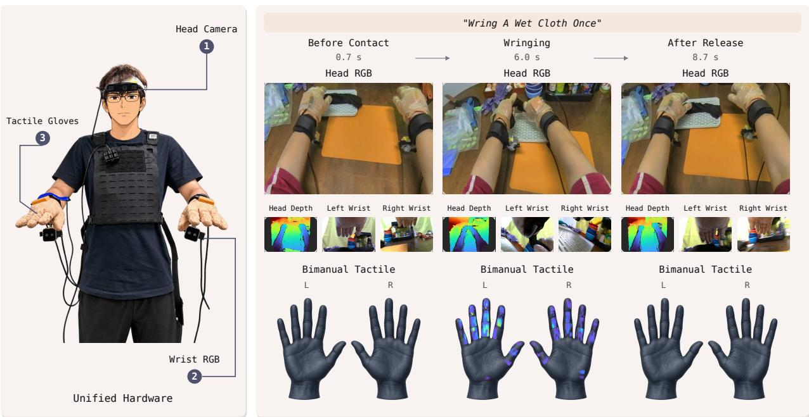  
Figure 2 TouchScale data collection. Left: the unified wearable setup used throughout the collection, consisting of a head-mounted RGB-D camera, two wrist-mounted RGB cameras, and bimanual tactile gloves. Right: timealigned observations from an example interaction, including head RGB-D, bimanual wrist RGB, and bimanual tactile measurements at diferent stages of the task.

## 3.2 Data Collection and Task Design

Diverse everyday activities. TouchScale contains approximately 2K task descriptions across 9 high-level collection settings and 800+ distinct scene configurations, including laboratory, kitchen, workbench, ofice, bedroom, medical, and packing environments. Laboratory, kitchen, and workbench activities account for the largest portions of the collection. The tasks cover transport and placement, pouring and transfer, insertion and alignment, tool use, opening and closing, folding, wiping, pressing, and other contact-rich interactions, including both single-hand and bimanual manipulation. As shown in Fig. 3, place is the most frequent task verb, followed by pour, transfer, and put, with many other interaction types represented throughout the dataset. Each task is written as a natural-language instruction with an explicit action, the manipulated object or objects, and the intended interaction or target state. When needed, the instruction further specifies the tool, target location, execution order, hand use, or completion condition. Representative examples in Fig. 3 include “Swirl a glass Erlenmeyer flask with both hands,” “Pour water from a pitcher into a wide-mouth water bottle,” “Coil a laptop charging cable and secure it with a hook-and-loop strap,” and “Seal the center seam on top of a box with a tape dispenser.”

Diverse objects, poses, and behaviors. The 500-hour collection includes 1.5k+ objects spanning diferent geometries, materials, and physical properties. For repeated recordings of a task, we vary object instances and initial configurations, including object position, orientation, relative arrangement, and scene layout. Approximately 20 participants contribute to the collection, producing diferences in grasp choice, movement timing, hand coordination, contact sequence, and motion trajectory even under the same task instruction. These variations lead to diferent hand–object poses and tactile contact patterns across repeated executions. Fig. 3 shows distinct contact distributions for tightening a screw, pipetting liquid, and wringing a cloth, while Fig. 2 shows how contact evolves as a wet cloth is grasped, wrung, and released. We additionally provide reconstructed 3D objects from object-centric RGB captures, and the procedure is described in Appendix F.

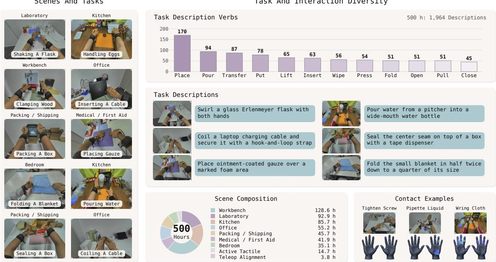  
Figure 3 Task and interaction diversity in TouchScale. Left: representative tasks across diferent collection settings. Right: task-description verb frequencies, example task instructions, the collection-setting composition of the 500-hour dataset, and representative tactile contact patterns.

Postprocessing for data quality. As shown in Fig. 10, we use an automated quality-control pipeline that crosschecks tactile recordings against wrist-view observations. For each hand, Gemini 3.7 Flash (Google DeepMind, 2026) first identifies grasp intervals, release events, visually confirmed contact fingers, and contact-free periods from the wrist video without access to tactile measurements. This blind visual pass provides an independent reference for evaluating the tactile signals. We reject recordings with clear sensor failures, including whole-hand signal loss during visually confirmed interaction and high-confidence persistent multi-finger signal failures. Missing responses from individual fingers are instead sent for manual review, since finger-level contact can be visually ambiguous. Fingers that respond elsewhere in the episode are not treated as failures when they are silent during a particular grasp. We separately screen contact-free periods for persistent tactile activity and use a second visual check to distinguish sensor noise from unobserved physical contact. More details can be found in Appendix C.

## 4 Experiments

We examine the four questions above through three experimental settings. First, we evaluate cross-dataset zero-shot tactile prediction on EgoTactile and analyze how performance changes with the amount of TouchScale training data. Second, we evaluate whether tactile-supervised pretraining on TouchScale learns transferable visual representations across three downstream action recognition benchmarks under both linear probing and end-to-end fine-tuning. Finally, we evaluate TouchScale as action-free visual–tactile mid-training for N -VTLA on four real-world contact-rich manipulation tasks, and further study how robot success and future-tactile prediction change with the amount of TouchScale mid-training data.

## 4.1 Tactile Prediction

We evaluate zero-shot transfer for tactile prediction. We first train the same TouchAnything model (Zhou et al., 2026b) on the full EgoTouch training split (16.2 h) and on a size-matched subset of TouchScale (∼16 h), and evaluate both models directly on EgoTactile (Zeng et al., 2026) without any post-training. For EgoTouch, we use the released WiLoR pose estimates (Potamias et al., 2025); for TouchScale, we obtain WiLoR poses from automatically detected hand crops. Ground-truth pressure is normalized to [0, 1] by the maximum pressure within each sequence. Each dataset retains its native tactile layout during training. Because the sensors difer in spatial layout and sensing density, we map their tactile prediction to a common set of 12 anatomical hand regions for evaluation.

Table 2 Tactile prediction. We compare models trained on EgoTouch and TouchScale under zero-shot transfer to EgoTactile and in-distribution evaluation on each source dataset’s unseen split. Zero-shot metrics are averaged over 12 anatomical hand regions.
<table><tr><td>Evaluation</td><td>Training data</td><td>cIoU↑</td><td>vIoU↑</td><td>CoP Loc.↓</td><td>Press. Mag.↓</td></tr><tr><td rowspan="2">Zero-shot (EgoTactile)</td><td>EgoTouch</td><td>0.134</td><td>0.185</td><td>0.444</td><td>0.184</td></tr><tr><td>TouchScale</td><td>0.181</td><td>0.243</td><td>0.416</td><td>0.148</td></tr><tr><td rowspan="2">Unseen split</td><td>EgoTouch</td><td>0.403</td><td>0.302</td><td>0.272</td><td>0.095</td></tr><tr><td>TouchScale</td><td>0.422</td><td>0.299</td><td>0.261</td><td>0.061</td></tr></table>

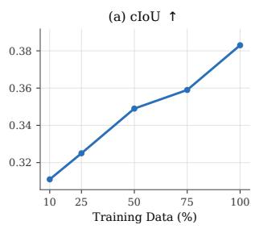

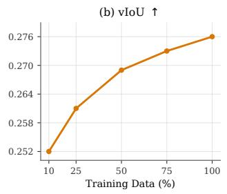

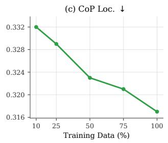

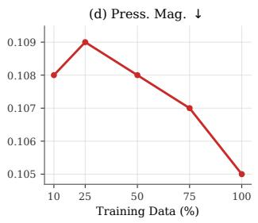  
Figure 4 Scaling of zero-shot tactile prediction. Increasing TouchScale training data generally improves zero-shot performance on EgoTactile across contact, localization, and pressure metrics.

We report four region-level metrics: contact intersection-over-union (cIoU), volumetric intersection-over-union (vIoU), center-of-pressure localization error (CoP Loc.), and regional pressure magnitude error (Press. Mag.). These metrics measure regional contact agreement, pressure overlap, pressure localization, and pressure intensity. The anatomical mapping and complete metric definitions are provided in Appendix A.

Table 2 shows that, compared to the baseline trained on EgoTouch, training on TouchScale improves zero-shot cIoU from 0.134 to 0.181 and vIoU from 0.185 to 0.243, corresponding to 35.1% and 31.4% relative gains, while reducing CoP localization error from 0.444 to 0.416 and regional pressure magnitude error from 0.184 to 0.148. Overall, TouchScale transfers better for contact prediction and spatial pressure estimation across unseen tactile hardware. On the unseen split of each source dataset, TouchScale also achieves higher cIoU (0.422 vs. 0.403), lower CoP localization error (0.261 vs. 0.272), and lower pressure magnitude error (0.061 vs. 0.095), while vIoU remains comparable (0.299 vs. 0.302).

Data scaling. We study how TouchScale data scale afects zero-shot tactile prediction while keeping the model and the EgoTactile evaluation protocol fixed. As shown in Fig. 4, increasing the training scale from 10% to 100% improves cIoU from 0.311 to 0.383 and vIoU from 0.252 to 0.276, while reducing CoP localization error from 0.332 to 0.317 and regional pressure magnitude error from 0.108 to 0.105. Overall, the four metrics show favorable scaling trends, indicating that larger TouchScale training sets improve zero-shot tactile prediction on EgoTactile.

## 4.2 Visual Representation Learning

We next evaluate the transferability of visual representations learned from TouchScale. We pretrain Hiera-B (Ryali et al., 2023) separately on TouchScale, OpenTouch (Song et al., 2025), FEEL (Dessalene et al., 2026), and EgoTouch (Zhou et al., 2026b), using the same tactile prediction objective. All encoders are initialized from the same pretrained Hiera-B checkpoint and trained with the same optimization schedule and training budget. We evaluate the resulting encoders on MECCANO (Ragusa et al., 2021), Something-Something V2 (SSv2) (Goyal et al., 2017), and Ego-Exo4D (Grauman et al., 2024) under both linear probing and end-to-end fine-tuning. Table 3 shows that TouchScale achieves the highest accuracy across all three downstream benchmarks under both evaluation settings. It reaches an average linear-probe accuracy of 24.45% and an average fine-tuning accuracy of 49.62%, outperforming the existing visual–tactile pretraining datasets. These results show that TouchScale learns more transferable visual representations for downstream action recognition.

Table 3 Downstream action recognition. TouchScale achieves the highest average accuracy under both linear probing and end-to-end fine-tuning. FT denotes end-to-end fine-tuning.
<table><tr><td></td><td colspan="2">MECCANO</td><td colspan="2">SSv2</td><td colspan="2">Ego-Exo4D</td><td colspan="2">Avg.</td></tr><tr><td>Pretraining Data</td><td>Linear</td><td>FT</td><td>Linear</td><td>FT</td><td>Linear</td><td>FT</td><td>Linear</td><td>FT</td></tr><tr><td>OpenTouch</td><td>28.76</td><td>42.07</td><td>20.39</td><td>62.82</td><td>19.76</td><td>39.94</td><td>22.97</td><td>48.28</td></tr><tr><td>FEEL</td><td>17.71</td><td>21.60</td><td>1.51</td><td>12.90</td><td>4.32</td><td>5.37</td><td>7.85</td><td>13.29</td></tr><tr><td>EgoTouch</td><td>20.16</td><td>24.16</td><td>1.74</td><td>29.87</td><td>5.06</td><td>11.22</td><td>8.99</td><td>21.75</td></tr><tr><td>TouchScale</td><td>28.97</td><td>43.71</td><td>22.82</td><td>63.27</td><td>21.55</td><td>41.89</td><td>24.45</td><td>49.62</td></tr></table>

## 4.3 Transfer to Robotic Manipulation

We build on $\mathcal { N } _ { 0 } { \mathrm { - V T L A } }$ (NeoteAI Team and Fudan TEAI Team, 2026), a vision–tactile–language–action policy for contact-rich manipulation that takes visual observations, language instructions, robot state, and tactile input to predict robot actions. Given the current tactile observation and visual–language context, $\mathcal { N } _ { 0 ^ { - } } \mathrm { V T L A }$ predicts latent tactile tokens that represent the expected tactile change over the coming action chunk and conditions the action expert on these tokens for action prediction. In Stage 1, these latent tactile tokens are trained against a future-tactile target obtained by encoding the tactile change over the same horizon. We follow the Stage-1 future-tactile prediction formulation while adapting the training pipeline to TouchScale before robot post-training, and refer to this stage as TouchScale mid-training. Details are provided in Appendix E.2.

TouchScale mid-training and robot post-training. Both variants start from the oficially released N -VTLA checkpoint. The TouchScale variant first undergoes TouchScale mid-training and is then post-trained on our robot demonstrations. The baseline skips TouchScale mid-training and is directly post-trained on the same robot demonstrations using the same protocol. The two variants therefore difer only in whether TouchScale mid-training is performed before robot post-training.

Robot setup and tasks. Our real-world setup is shown in Fig. 5. We use an xArm6 robotic arm with a BrainCo Revo 2 robotic hand, a tactile-sensing glove mounted on the hand, an external RGB-D camera, and a wrist camera. We collect 50 demonstrations per task through human teleoperation using a VR headset, a pair of trackers, and motion-capture gloves. We evaluate four contact-rich manipulation tasks with diferent interaction requirements. In Soft/Hard Sorting, the robot identifies the soft object through physical interaction and places it at the target location. In Bottle-Cap Removal, the robot picks up a bottle cap and places it into a target container. In Test-Tube Transfer, the robot picks up a test tube and transfers it to a target location. In Whiteboard Wipe, the robot wipes a marked area on the whiteboard with a cloth while maintaining sustained contact with the surface. For evaluation, we vary the initial configurations of the objects and targets across trials and report the task success rate. Both model variants follow the same evaluation protocol.

Efect of TouchScale mid-training. Table 4 compares $\mathcal { N } _ { 0 } { - } \mathrm { V T L A }$ with and without TouchScale mid-training. TouchScale mid-training improves success on all four real-world contact-rich manipulation tasks, increasing the average success rate from 22.5% to 57.5%, an absolute gain of 35 percentage points. The largest improvement is observed on Soft/Hard Sorting, where success increases from 10% to 60%. Bottle-Cap Removal improves from 40% to 70%, Test-Tube Transfer from 30% to 60%, and Whiteboard Wipe from 10% to 40%. These consistent gains span material discrimination, small-object manipulation, precise transfer, and continuouscontact manipulation, showing that the benefit of TouchScale mid-training extends across diferent forms of physical interaction. Overall, these results demonstrate that TouchScale mid-training substantially improves real-world contact-rich robotic manipulation.

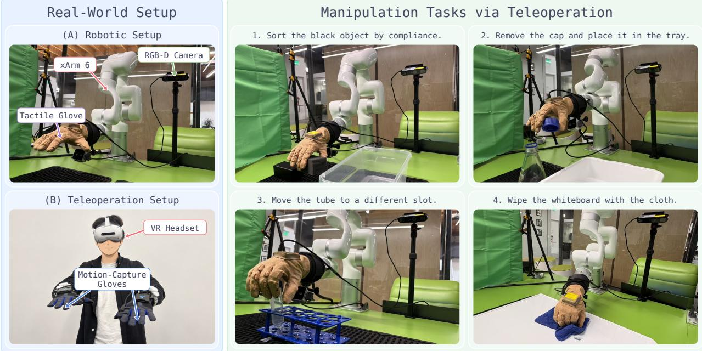  
Figure 5 Real-world robot setup and manipulation tasks. Left: the xArm6 platform with a BrainCo Revo 2 robotic hand, tactile sensing, and an external RGB-D camera and a wrist camera, together with the teleoperation setup used to collect robot demonstrations. Right: four contact-rich manipulation tasks covering material-dependent sorting, small-object manipulation, precise transfer, and sustained surface contact. We collect 50 teleoperated demonstrations for each task.

Table 4 Real-world robot manipulation. TouchScale mid-training improves success across all four tasks. Both variants start from the same N0-VTLA checkpoint and use the same 50 robot demonstrations per task for robot post-training. Each task is evaluated over 20 trials.
<table><tr><td>Mid-training</td><td>Soft/Hard Sorting</td><td>Bottle-Cap Removal</td><td>Test-Tube Transfer</td><td>Whiteboard Wipe</td><td>Avg.</td></tr><tr><td>No</td><td>10%</td><td>40%</td><td>30%</td><td>10%</td><td>22.5%</td></tr><tr><td>Yes</td><td>60%</td><td>70%</td><td>60%</td><td>40%</td><td>57.5%</td></tr></table>

Efect of TouchScale data scale on robot policy. We next examine how policy performance changes with the amount of TouchScale data used during mid-training. For each data scale, we perform TouchScale mid-training and then post-train the policy on the same robot demonstrations using the same protocol. As shown in Fig. 6 (left), the average success rate across all four real-world tasks increases from 22.5% without TouchScale mid-training to 30.0%, 32.5%, 50.0%, 50.0%, and 57.5% when using 20%, 40%, 60%, 80%, and 100% of TouchScale, respectively. The results show an overall positive scaling trend, with larger amounts of human visual–tactile mid-training data leading to stronger downstream robot performance.

Scaling tactile world modeling with TouchScale. We explore how TouchScale data scale afects the tactile world modeling during mid-training. Given the current tactile observation and visual–language context, the model predicts latent tactile tokens representing the expected tactile change over the future horizon. We evaluate these predictions on the robot data unseen during TouchScale mid-training, before robot post-training. As shown in Fig. 6 (right), future-tactile prediction accuracy increases from 2.87% with 20% of TouchScale to 3.31% with the full dataset, compared with 0.18% without TouchScale mid-training. These results show that TouchScale mid-training improves future-tactile prediction on robot observations, while the gain from increasing the amount of human visual–tactile data from 20% to 100% is modest. Details are provided in Appendix D.

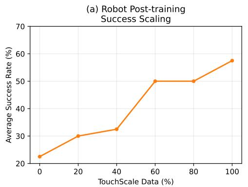

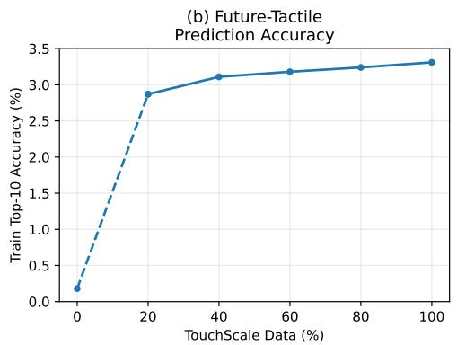  
Figure 6 Scaling of TouchScale mid-training. Left: average post-training success rate across four real-world manipulation tasks with diferent amounts of TouchScale mid-training data. Right: future-tactile prediction accuracy on robot data unseen during TouchScale mid-training.

Tactile–action correlation. We further examine the relation between future-tactile prediction and action prediction after post-training on robot data. On held-out robot data, we compute the Pearson correlation coeficient between the per-step future-tactile prediction error and action prediction error. With TouchScale mid-training, the two errors show a weak positive correlation $( r = 0 . 1 1 9 , p = 0 . 0 2 0 )$ , whereas the baseline shows essentially no correlation $( r = 0 . 0 0 3 , p = 0 . 9 5 3 )$ . This result suggests a limited but detectable association between future-tactile prediction and downstream action prediction after mid-training.

## 5 Conclusion and Limitations

We introduce TouchScale, a 500-hour human visual–tactile dataset collected with a consistent sensing and synchronization pipeline. Training on TouchScale improves zero-shot tactile prediction and visual representation learning for downstream action recognition, while mid-training with TouchScale benefits real-world robot manipulation. The scaling results further show overall positive trends as more TouchScale data is used, highlighting the value of large-scale human visual–tactile data for embodied learning. Together, these results validate synchronized human vision and touch as a highly efective supervisory signal for both perception and robotic control. Our current robot evaluation is limited to one platform and four manipulation tasks, and TouchScale does not include action labels. Broader evaluation across robot embodiments and contact-rich tasks remains future work. We also observe only a weak association between future-tactile and action prediction errors, and the role of future-tactile prediction in robot control remains an open question.

## References

Dima Damen, Hazel Doughty, Giovanni Maria Farinella, Antonino Furnari, Evangelos Kazakos, Jian Ma, Davide Moltisanti, Jonathan Munro, Toby Perrett, Will Price, and Michael Wray. Rescaling egocentric vision: Collection, pipeline and challenges for EPIC-KITCHENS-100. International Journal of Computer Vision, 130(1):33–55, 2022. doi: 10.1007/s11263-021-01531-2.

Joseph DelPreto, Chao Liu, Yiyue Luo, Michael Foshey, Yunzhu Li, Antonio Torralba, Wojciech Matusik, and Daniela Rus. ActionSense: A multimodal dataset and recording framework for human activities using wearable sensors in a kitchen environment. In Neural Information Processing Systems (NeurIPS) Track on Datasets and Benchmarks, 2022. https://action-sense.csail.mit.edu/.

Eadom Dessalene, Botao He, Michael Maynord, Yonatan Tussa, Pavan Mantripragada, Yianni Karabati, Nirupam Roy, and Yiannis Aloimonos. FEEL (force-enhanced egocentric learning): A dataset for physical action understanding. arXiv preprint arXiv:2603.15847, 2026.

Google DeepMind. Gemini 3.7 flash: Model card. Google DeepMind model card, August 2026. https://deepmind. google/models/model-cards/gemini-3-7-flash/. Published August 13, 2026.

Raghav Goyal, Samira Ebrahimi Kahou, Vincent Michalski, Joanna Materzynska, Susanne Westphal, Heuna Kim, Valentin Haenel, Ingo Fruend, Peter Yianilos, Moritz Mueller-Freitag, et al. The “something something” video database for learning and evaluating visual common sense. In ICCV, 2017.

Patrick Grady, Chengcheng Tang, Samarth Brahmbhatt, Christopher D. Twigg, Chengde Wan, James Hays, and Charles C. Kemp. PressureVision: Estimating hand pressure from a single RGB image. In European Conference on Computer Vision (ECCV), 2022. https://arxiv.org/abs/2203.10385.

Patrick Grady, Jeremy A. Collins, Chengcheng Tang, Christopher D. Twigg, Kunal Aneja, James Hays, and Charles C. Kemp. PressureVision++: Estimating fingertip pressure from diverse RGB images. In Proceedings of the IEEE/CVF Winter Conference on Applications of Computer Vision (WACV), pages 8698– 8708, 2024. https://openaccess.thecvf.com/content/WACV2024/html/Grady\_PressureVision\_Estimating\_ Fingertip\_Pressure\_From\_Diverse\_RGB\_Images\_WACV\_2024\_paper.html.

Kristen Grauman, Andrew Westbury, Eugene Byrne, et al. Ego4d: Around the world in 3,000 hours of egocentric video. In Proceedings of the IEEE/CVF Conference on Computer Vision and Pattern Recognition, pages 18995–19012, 2022.

Kristen Grauman, Andrew Westbury, Lorenzo Torresani, et al. Ego-exo4d: Understanding skilled human activity from first- and third-person perspectives. In Proceedings of the IEEE/CVF Conference on Computer Vision and Pattern Recognition, pages 19383–19400, 2024.

Ryan Hoque, Peide Huang, David J. Yoon, Mouli Sivapurapu, and Jian Zhang. Egodex: Learning dexterous manipulation from large-scale egocentric video. In The Fourteenth International Conference on Learning Representations, 2026.

Binghao Huang, Yixuan Wang, Xinyi Yang, Yiyue Luo, and Yunzhu Li. 3D-ViTac: Learning fine-grained manipulation with visuo-tactile sensing. In Proceedings of The 8th Conference on Robot Learning, volume 270 of Proceedings of Machine Learning Research, pages 2557–2578. PMLR, 2025.

Yuzhe Huang, Jiaping Wu, Jiaming Jiang, Hezhe Lin, Aikebaier Aierken, Yunlong Wang, Kun Cheng, Ziyuan Jiao, and Yuanxin Zhong. HT-Bench: Benchmarking and learning dexterous full-hand tactile representations with egocentric vision. arXiv preprint arXiv:2606.19161, 2026.

Simar Kareer, Dhruv Patel, Ryan Punamiya, Pranay Mathur, Shuo Cheng, Chen Wang, Judy Hofman, and Danfei Xu. Egomimic: Scaling imitation learning via egocentric video. In 2025 IEEE International Conference on Robotics and Automation, pages 13226–13233, 2025. doi: 10.1109/ICRA55743.2025.11127989.

Lulin Liu, Dayou Li, Yiqing Liang, Sicong Jiang, Hitesh Vijay, Hezhen Hu, Xuhai Xu, Zirui Liu, Srinivas Shakkottai, Manling Li, and Zhiwen Fan. EgoTL: Egocentric think-aloud chains for long-horizon tasks. arXiv preprint arXiv:2604.09535, 2026.

Qingtao Liu, Yu Cui, Zhengnan Sun, Gaofeng Li, Jiming Chen, and Qi Ye. Vtdexmanip: A dataset and benchmark for visual-tactile pretraining and dexterous manipulation with reinforcement learning. In The Thirteenth International Conference on Learning Representations, 2025.

Yecheng Jason Ma, Shagun Sodhani, Dinesh Jayaraman, Osbert Bastani, Vikash Kumar, and Amy Zhang. VIP: Towards universal visual reward and representation via value-implicit pre-training. In International Conference on Learning Representations (ICLR), 2023.

Suraj Nair, Aravind Rajeswaran, Vikash Kumar, Chelsea Finn, and Abhinav Gupta. R3M: A universal visual representation for robot manipulation. In Proceedings of The 6th Conference on Robot Learning, volume 205 of Proceedings of Machine Learning Research, pages 892–909. PMLR, 2023.

NeoteAI Team and Fudan TEAI Team. N0-VTLA: Scaling vision-tactile-language-action model with latent tactile tokens. arXiv preprint arXiv:2607.23782, 2026.

Dantong Niu, Zhuoyang Liu, Zekai Wang, Boning Shao, Zhao-Heng Yin, Anirudh Pai, Yuvan Sharma, Stefano Saravalle, Ruijie Zheng, Jing Wang, Ryan Punamiya, Mengda Xu, Yuqi Xie, Yunfan Jiang, Letian Fu, Konstantinos Kallidromitis, Matteo Gioia, Junyi Zhang, Jiaxin Ge, Haiwen Feng, Fabio Galasso, Wei Zhan, David M. Chan, Yutong Bai, Roei Herzig, Jiahui Lei, Fei-Fei Li, Ken Goldberg, Jitendra Malik, Pieter Abbeel, Yuke Zhu, Danfei Xu, Jim Fan, and Trevor Darrell. T-Rex: Tactile-reactive dexterous manipulation. arXiv preprint arXiv:2606.17055, 2026.

Rolandos Alexandros Potamias, Jinglei Zhang, Jiankang Deng, and Stefanos Zafeiriou. WiLoR: End-to-end 3d hand localization and reconstruction in-the-wild. In 2025 IEEE/CVF Conference on Computer Vision and Pattern Recognition (CVPR), pages 12242–12254. IEEE, 2025.

Ryan Punamiya, Simar Kareer, Zeyi Liu, Josh Citron, Ri-Zhao Qiu, Xiongyi Cai, Alexey Gavryushin, Jiaqi Chen, Davide Liconti, Lawrence Y. Zhu, Patcharapong Aphiwetsa, Baoyu Li, Aniketh Cheluva, Pranav Kuppili, Yangcen Liu, Dhruv Patel, Aidan Gao, Hye-Young Chung, Ryan Co, Renee Zbizika, et al. EgoVerse: An egocentric human dataset for robot learning from around the world. In Proceedings of Robotics: Science and Systems, 2026.

Ri-Zhao Qiu, Shiqi Yang, Xuxin Cheng, Chaitanya Chawla, Jialong Li, Tairan He, Ge Yan, David J. Yoon, Ryan Hoque, Lars Paulsen, Ge Yang, Jian Zhang, Sha Yi, Guanya Shi, and Xiaolong Wang. Humanoid policy ∼ human policy. In Proceedings of The 9th Conference on Robot Learning, volume 305 of Proceedings of Machine Learning Research, pages 2888–2906. PMLR, 2025.

Francesco Ragusa, Antonino Furnari, Salvatore Livatino, and Giovanni Maria Farinella. The meccano dataset: Understanding human-object interactions from egocentric videos in an industrial-like domain. In WACV, 2021.

Chaitanya Ryali, Yuan-Ting Hu, Daniel Bolya, Chen Wei, Haoqi Fan, Po-Yao Huang, Vaibhav Aggarwal, Arkabandhu Chowdhury, Omid Poursaeed, Judy Hofman, Jitendra Malik, Yanghao Li, and Christoph Feichtenhofer. Hiera: A hierarchical vision transformer without the bells-and-whistles. In Proceedings of the 40th International Conference on Machine Learning, volume 202 of Proceedings of Machine Learning Research, pages 29441–29454. PMLR, 2023.

Yuxin Ray Song, Jinzhou Li, Rao Fu, Devin Murphy, Kaichen Zhou, Rishi Shiv, Yaqi Li, Haoyu Xiong, Crystal Elaine Owens, Yilun Du, Yiyue Luo, Xianyi Cheng, Antonio Torralba, Wojciech Matusik, and Paul Pu Liang. OPENTOUCH: Bringing full-hand touch to real-world interaction. arXiv preprint arXiv:2512.16842, 2025.

Subramanian Sundaram, Petr Kellnhofer, Yunzhu Li, Jun-Yan Zhu, Antonio Torralba, and Wojciech Matusik Learning the signatures of the human grasp using a scalable tactile glove. Nature, 569(7758):698–702, 2019. doi: 10.1038/s41586-019-1234-z. https://www.nature.com/articles/s41586-019-1234-z.

TARS Robotics, Yuhang Zheng, Jichao Peng, Weize Li, Yupeng Zheng, Xiang Li, Yujie Jin, Julong Wei, Guanhua Zhang, Ruiling Zheng, Ming Cao, Songen Gu, Zhenhong Zou, Kaige Li, Ke Wu, Mingmin Yang, Jiahao Liu, Pengfei Li, Hengjie Si, Feiyu Zhu, Wang Fu, Likun Wang, Ruiwen Yao, Jieru Zhao, Yilun Chen, and Wenchao Ding. World in your hands: A large-scale and open-source ecosystem for learning human-centric manipulation in the wild. arXiv preprint arXiv:2512.24310, 2025.

Youngsun Wi, Jessica Yin, Elvis Xiang, Akash Sharma, Jitendra Malik, Mustafa Mukadam, Nima Fazeli, and Tess Hellebrekers. TactAlign: Human-to-robot policy transfer via tactile alignment. In Proceedings of Robotics: Science and Systems, Sydney, Australia, July 2026. doi: 10.15607/RSS.2026.XXII.006.

Ruihan Yang, Qinxi Yu, Yecheng Wu, Rui Yan, Borui Li, An-Chieh Cheng, Xueyan Zou, Yunhao Fang, Xuxin Cheng, Ri-Zhao Qiu, Hongxu Yin, Sifei Liu, Song Han, Yao Lu, and Xiaolong Wang. EgoVLA: Learning vision-language-action models from egocentric human videos. arXiv preprint arXiv:2507.12440, 2025.

Zhao-Heng Yin, Binghao Huang, Yuzhe Qin, Qifeng Chen, and Xiaolong Wang. Rotating without seeing: Towards in-hand dexterity through touch. In Proceedings of Robotics: Science and Systems, Daegu, Republic of Korea, July 2023. doi: 10.15607/RSS.2023.XIX.036.

Kelin Yu, Yunhai Han, Qixian Wang, Vaibhav Saxena, Danfei Xu, and Ye Zhao. Mimictouch: Leveraging multi-modal human tactile demonstrations for contact-rich manipulation. In Proceedings of The 8th Conference on Robot Learning, volume 270 of Proceedings of Machine Learning Research, pages 4844–4865. PMLR, 2025.

Ying Yuan, Haichuan Che, Yuzhe Qin, Binghao Huang, Zhao-Heng Yin, Kang-Won Lee, Yi Wu, Soo-Chul Lim, and Xiaolong Wang. Robot synesthesia: In-hand manipulation with visuotactile sensing. In 2024 IEEE International Conference on Robotics and Automation (ICRA), pages 6558–6565, 2024. doi: 10.1109/ICRA57147.2024.10610532.

Yuan Zeng, Yujia Shi, Tiao Tan, Xingting Li, Yaqi Qin, Zongqing Lu, Wenming Yang, Jing-Hao Xue, and Qingmin Liao. Egotactile: Learning grasp pressure for everyday objects from egocentric video. In International Conference on Machine Learning, 2026.

Chi Zhang, Penglin Cai, Ziheng Xi, Haoqi Yuan, Hao Luo, Wanpeng Zhang, Sipeng Zheng, Chaoyi Xu, and Zongqing Lu. Human-centric transferable tactile pre-training for dexterous robotic manipulation. arXiv preprint arXiv:2607.01067, 2026a.

Wenkang Zhang, Chengbo Yuan, Zicheng Zhang, Zhengxue Cheng, and Yang Gao. EgoTac: In-the-wild tactile prediction from egocentric vision. arXiv preprint arXiv:2608.15060, 2026b.

Yiming Zhao, Taein Kwon, Paul Streli, Marc Pollefeys, and Christian Holz. EgoPressure: A dataset for hand pressure and pose estimation in egocentric vision. In Proceedings of the IEEE/CVF Conference on Computer Vision and Pattern Recognition (CVPR), pages 27727–27738, 2025. doi: 10.1109/CVPR52734.2025.02582.

Ruijie Zheng, Dantong Niu, Yuqi Xie, Jing Wang, Mengda Xu, Yunfan Jiang, Fernando Castañeda, Fengyuan Hu, You Liang Tan, Letian Fu, Trevor Darrell, Furong Huang, Yuke Zhu, Danfei Xu, and Linxi Fan. EgoScale: Scaling dexterous manipulation with diverse egocentric human data. arXiv preprint arXiv:2602.16710, 2026.

Danyan Zhou, Jinxuan Lu, Jiawei Lin, Tianxing Chen, Chuqiao Lyu, and Wenbo Ding. TouchSight: Bare-handed tactile prediction from egocentric video via generative visual augmentation. arXiv preprint arXiv:2609.20414, 2026a.

Jianyi Zhou, Ziteng Gao, Feiyang Hong, Zirui Liu, Guannan Zhang, Weisheng Dai, Ruichen Zhen, Chuqiao Lyu, Haotian Wu, Yinian Mao, Xushi Wang, Yuxiang Jiang, Wenbo Ding, and Shuo Yang. Touchanything: A dataset and framework for bimanual tactile estimation from egocentric video. arXiv preprint arXiv:2605.13083, 2026b.

Lawrence Y. Zhu, Pranav Kuppili, Ryan Punamiya, Patcharapong Aphiwetsa, Dhruv Patel, Simar Kareer, Sehoon Ha, and Danfei Xu. EMMA: Scaling mobile manipulation via egocentric human data. IEEE Robotics and Automation Letters, 11(3):3087–3094, 2026.

Xinyue Zhu, Binghao Huang, and Yunzhu Li. Touch in the wild: Learning fine-grained manipulation with a portable visuo-tactile gripper. arXiv preprint arXiv:2507.15062, 2025.

## Appendix

## A Tactile Prediction Evaluation Protocol

## A.1 Cross-sensor anatomical mapping

TouchScale, EgoTouch, and EgoTactile use tactile sensors with diferent native layouts and sensing densities. For cross-dataset evaluation, we represent TouchScale on a 32 × 44 hand-shaped grid with 880 valid cells, EgoTouch on its native 21 × 21 hand-shaped grid with 217 valid cells, and EgoTactile on a $1 7 \times 1 9$ hand-shaped grid with 137 valid cells. Direct taxel-wise comparison across these processed layouts is therefore not well defined.

For cross-dataset evaluation, we map all three tactile layouts to the same set of 12 anatomical hand regions. Let

$$
\begin{array} { r l } & { \mathcal { F } = \{ \mathrm { t h u m b } , \mathrm { i n d e x } , \mathrm { m i d d l e } , \mathrm { r i n g } , \mathrm { p i n k y } \} , } \\ & { \Omega = \Big \{ f ^ { \mathrm { t i p } } , f ^ { \mathrm { m i d / b a s e } } \mid f \in \mathcal { F } \Big \} } \\ & { \cup \big \{ \mathrm { p a l m } , \mathrm { t h u m b - b a s e } \big \} , \quad \mid \Omega \mid = 1 2 . } \end{array}\tag{1}
$$

The shared space contains five fingertip regions, five finger middle/base regions, the palm, and the thumb base.

For dataset d with $N _ { d }$ valid native taxels, we define a fixed dataset-specific lookup

$$
q _ { d } : \{ 1 , \dots , N _ { d } \} \to \Omega \cup \{ \emptyset \} ,\tag{2}
$$

where $q _ { d } ( m )$ gives the anatomical region associated with native taxel $m ,$ and ∅ denotes taxels excluded from evaluation. The corresponding binary assignment matrix is

$$
\mathbf { M } ^ { ( d ) } \in \{ 0 , 1 \} ^ { 1 2 \times N _ { d } } , \qquad M _ { r , m } ^ { ( d ) } = \mathbb { I } [ q _ { d } ( m ) = r ] .\tag{3}
$$

The lookup is constructed from the anatomical location of each sensing taxel in the native tactile glove layout. Finger middle and base taxels are merged into the corresponding mid/base region when they are represented separately in the native sensor definition. Fingertip, palm, and thumb-base taxels retain their anatomical identities. Left- and right-hand layouts are represented in the same hand-centric orientation before applying the mapping. Figure 7 illustrates the dataset-specific assignments and the resulting shared anatomical space.

Importantly, this mapping does not resize or interpolate the native tactile grids. Each dataset retains its native tactile representation during training, and anatomical pooling is applied only for cross-dataset evaluation. The same mapping is applied to predictions and ground truth.

Let $p _ { t , m }$ and $\hat { p } _ { t , m }$ denote the normalized ground-truth and predicted pressure at native taxel m and time $t ,$ respectively. Ground-truth pressure is normalized to [0, 1] by the maximum pressure within each sequence, while the model prediction is already bounded to [0, 1]. For clarity, we omit the dataset superscript on M in the following definitions.

## A.2 Region-level tactile representation

Using the anatomical assignment above, we aggregate each native tactile map into region-level quantities that are independent of the number of sensing taxels within each region.

The binary contact state of region r is defined as

$$
c _ { t , r } ( p ) = \mathbb { I } \left[ \frac { \sum _ { m } M _ { r , m } \mathbb { I } [ p _ { t , m } > \tau ] } { \sum _ { m } M _ { r , m } } > \rho \right] , \qquad \tau = 0 . 1 , \quad \rho = 0 . 2 ,\tag{4}
$$

where $\tau = 0 . 1$ is the taxel-level contact threshold applied to normalized pressure, and $\rho = 0 . 2$ is the minimum fraction of active taxels required for a region to be considered in contact. For ground truth, $\tau = 0 . 1$ corresponds

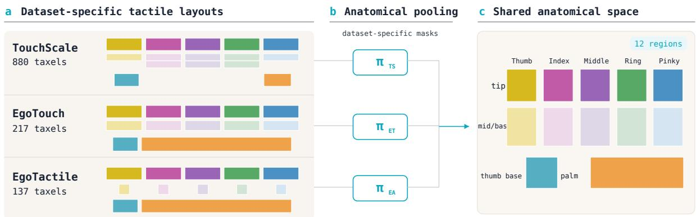  
Figure 7 Cross-sensor anatomical mapping. Dataset-specific anatomical assignments pool the TouchScale, EgoTouch, and EgoTactile tactile layouts into the same 12 anatomical regions for cross-dataset evaluation.

to 10% of the per-sequence maximum pressure. Using the fraction of active taxels rather than their absolute number reduces the efect of diferent sensing densities across datasets.

The mean pressure within region r is

$$
\mu _ { t , r } ( p ) = \frac { \sum _ { m } M _ { r , m } p _ { t , m } } { \sum _ { m } M _ { r , m } } .\tag{5}
$$

We compute the regional center of pressure (CoP) as

$$
\mathbf { g } _ { t , r } ( p ) = \frac { \sum _ { m } M _ { r , m } p _ { t , m } \mathbf { x } _ { m } } { \sum _ { m } M _ { r , m } p _ { t , m } + \epsilon } ,\tag{6}
$$

where $\mathbf { x } _ { m } \in [ 0 , 1 ] ^ { 2 }$ denotes the normalized spatial coordinate of native taxel m in a shared hand-centric coordinate frame, and ϵ is a small constant for numerical stability.

The regional pressure magnitude is defined as

$$
s _ { t , r } ( p ) = \frac { \sum _ { m } M _ { r , m } p _ { t , m } ^ { 2 } } { \sum _ { m } M _ { r , m } p _ { t , m } + \epsilon } .\tag{7}
$$

The total regional pressure, used only to select which region–time pairs are scored for the center-of-pressure metrics, is

$$
S _ { t , r } ( p ) = \sum _ { m } M _ { r , m } p _ { t , m } .\tag{8}
$$

We call a region–time pair $( t , r )$ evaluable, written as $( t , r ) \in \mathcal { E }$ , when both the prediction grid and the ground-truth grid contribute at least one valid taxel to region r at time t. For the evaluation on the single-hand EgoTactile dataset, every pair is evaluable. This restriction only takes efect when the dataset-specific layout has no taxel in a region. The same region-level quantities are computed from the predicted pressure ${ \hat { p } } .$

## A.3 Evaluation metrics

We evaluate tactile prediction using four region-level metrics. Each metric is computed per sequence over that sequence’s frames and then macro-averaged over the N test sequences. We use $\langle \cdot \rangle _ { \mathrm { s e q } }$ to denote this per-sequence macro-average. Within a sequence, the average over regions is taken only over regions with a non-empty denominator, defined separately for each metric below.

Contact IoU. We compute contact intersection-over-union over time for each anatomical region and average the result across regions:

$$
\mathrm { c I o U } = \left. \frac { 1 } { | \mathcal { R } ^ { \mathrm { c } } | } \sum _ { r \in \mathcal { R } ^ { \mathrm { c } } } \frac { \sum _ { t : ( t , r ) \in \mathcal { E } } c _ { t , r } ( \hat { p } ) c _ { t , r } ( p ) } { \sum _ { t : ( t , r ) \in \mathcal { E } } \mathbb { I } \big [ c _ { t , r } ( \hat { p } ) + c _ { t , r } ( p ) > 0 \big ] + \epsilon } \right. _ { \mathrm { s e q } } ,\tag{9}
$$

where the average runs over the regions contacted in at least one evaluable frame,

$$
\begin{array} { r } { \mathcal { R } ^ { \mathrm { c } } = \Big \{ r : \sum _ { t : ( t , r ) \in \mathcal { E } } \mathbb { I } [ c _ { t , r } ( \hat { p } ) + c _ { t , r } ( p ) > 0 ] > 0 \Big \} . } \end{array}\tag{10}
$$

Volumetric IoU. Volumetric IoU (vIoU) measures the overlap between predicted and ground-truth regional pressure magnitudes over time:

$$
\mathrm { v I o U } = \Bigg \langle \frac { 1 } { | \mathcal { R } ^ { \mathrm { v } } | } \sum _ { r \in \mathcal { R } ^ { \mathrm { v } } } \frac { \sum _ { t : ( t , r ) \in \mathcal { E } } \operatorname* { m i n } \big ( \mu _ { t , r } ( \widehat { p } ) , \mu _ { t , r } ( p ) \big ) } { \sum _ { t : ( t , r ) \in \mathcal { E } } \operatorname* { m a x } \big ( \mu _ { t , r } ( \widehat { p } ) , \mu _ { t , r } ( p ) \big ) + \epsilon } \Bigg \rangle _ { \mathrm { s e q } } ,\tag{11}
$$

where the average runs over the regions with non-zero pooled pressure,

$$
\begin{array} { r } { \mathcal { R } ^ { \mathrm { v } } = \Big \{ r : \sum _ { t : ( t , r ) \in \mathcal { E } } \operatorname* { m a x } \big ( \mu _ { t , r } ( \hat { p } ) , \mu _ { t , r } ( p ) \big ) > 0 \Big \} . } \end{array}\tag{12}
$$

CoP localization error. The center of pressure is meaningful only for regions where the predicted or groundtruth regional pressure is non-trivial. For each region $r ,$ let

$$
\mathcal { A } _ { r } = \big \{ t : ( t , r ) \in \mathcal { E } \mathrm { ~ a n d ~ } \big ( S _ { t , r } ( \hat { p } ) > \tau \mathrm { ~ o r ~ } S _ { t , r } ( p ) > \tau \big ) \big \}\tag{13}
$$

denote the frames in which the total regional pressure $S _ { t , r }$ of the prediction or ground truth exceeds the threshold $\tau ,$ and let

$$
\mathcal { R } ^ { \mathcal { A } } = \left\{ r : \mathcal { A } _ { r } \neq \emptyset \right\}\tag{14}
$$

denote the regions evaluated in at least one such frame. The CoP localization error is

$$
E _ { \mathrm { C o P } } = \Bigg \langle \frac { 1 } { | \mathscr { R } ^ { A } | } \sum _ { r \in \mathscr { R } ^ { A } } \frac { 1 } { | \mathscr { A } _ { r } | } \sum _ { t \in \mathscr { A } _ { r } } \left. \hat { g } _ { t , r } - g _ { t , r } \right. _ { 2 } \Bigg \rangle _ { \mathrm { s e q } } .\tag{15}
$$

Regional pressure magnitude error. Over the same region–time sets $\mathcal { A } _ { r }$ and regions $\mathcal { R } ^ { A }$ , the regional pressure magnitude error measures the absolute diference between the predicted and ground-truth regional pressure magnitudes:

$$
E _ { \mathrm { m a g } } = \Bigg \langle \frac { 1 } { | \mathcal { R } ^ { A } | } \sum _ { r \in \mathcal { R } ^ { A } } \frac { 1 } { | \mathcal { A } _ { r } | } \sum _ { t \in \mathcal { A } _ { r } } \big | s _ { t , r } ( \hat { p } ) - s _ { t , r } ( p ) \big | \Bigg \rangle _ { \mathrm { s e q } } .\tag{16}
$$

These four metrics correspond to cIoU, vIoU, CoP Loc., and Press. Mag. in the main paper. Higher cIoU and vIoU indicate better performance, while lower CoP Loc. and Press. Mag. indicate better performance.

## A.4 Qualitative Results of Tactile Prediction

Figure 8 shows representative tactile predictions from the model trained on TouchScale. Across diverse contact-rich interactions, the predictions recover the dominant contact regions on both hands and closely follow the spatial distribution of the ground-truth pressure. The model captures both sparse fingertip contacts and broader multi-region contact patterns, showing consistent tactile prediction across diferent objects and interaction patterns.

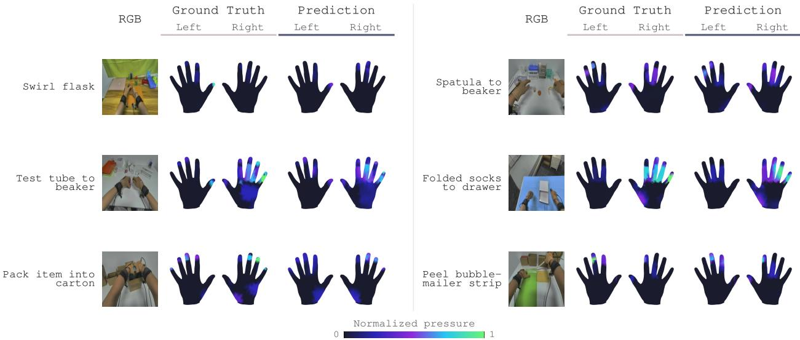  
Figure 8 Qualitative tactile prediction. Across diverse human interactions, the predictions closely reproduce the groundtruth contact regions and pressure distributions for both hands, showing consistent tactile prediction across objects and interaction patterns.

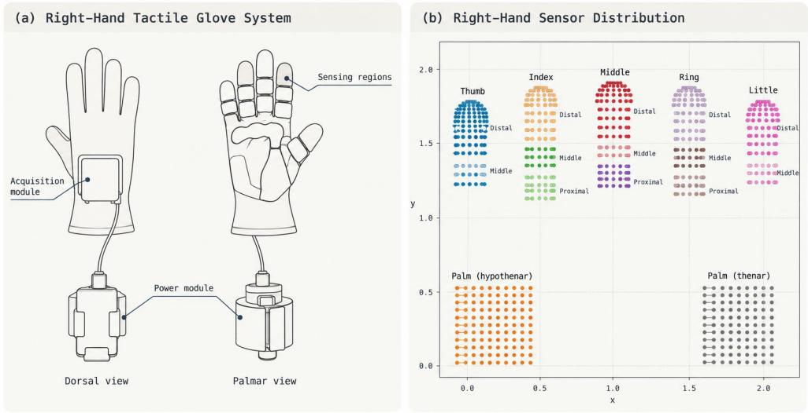  
Figure 9 Tactile glove hardware. The Tachin Glove used in TouchScale contains an acquisition module on the dorsal side, while tactile sensing regions cover the five fingers and palm on the palmar side. The glove is connected to an external power module for wearable tactile recording.

## B Tactile Glove Details

We use flexible tactile sensing gloves (Tachin Glove) for full-hand tactile data collection. Each glove contains 880 sensing taxels distributed over the five fingers and palm, as illustrated in Fig. 9. Each sensing unit measures 1.5 × 1.5 mm, and the glove provides a spatial resolution below 2 mm. The sensing layer records normal tactile pressure. The measurement range is $\mathrm { 0 . 2 { - } 3 0 ~ N / c m ^ { 2 } }$ , with a resolution of $0 . 0 5 ~ \mathrm { N / c m ^ { 2 } }$

The sensing layer is connected to an acquisition module mounted on the back of the hand and an external power module. The glove supports wireless acquisition at 50 Hz over WiFi and wired acquisition at 100 Hz through USB Type-C. The battery module supports more than 10 hours of continuous operation. Together, these components form the wearable tactile acquisition system used throughout data collection.

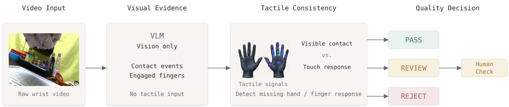  
Figure 10 Postprocessing for data quality. Contact events and engaged fingers are first identified from wrist video without tactile input, then compared with tactile responses to detect missing signals. The resulting consistency check assigns PASS, REVIEW, or REJECT, with uncertain cases sent for human inspection.

## C Tactile Data Quality Control

Data are captured by Noitom under our contracted data-collection process. Noitom obtains informed consent from participants prior to data collection and performs an initial vendor-side quality check before delivery to us. We then apply our own quality-control procedure at the batch, episode, and hand levels. At the batch level, we first check that the required camera streams, timestamps, tactile recordings, and task metadata are present for each episode. We also compute basic integrity statistics, including agreement between video frame counts and timestamps, irregular frame intervals, consistency of recording duration across streams, and interruptions in tactile sampling. These statistics are stored for inspection but are not used directly to determine data quality. We additionally render a synchronized visualization of the camera streams, tactile hand maps, and pressure traces for later review. Each valid episode is then processed independently for the left and right hands. The final episode label is determined by the more severe hand-level result: Reject, Review, or Pass.

Missing tactile signals. For each hand, we first test whether all tactile measurements remain below a small response threshold throughout the episode. We use a normalized threshold of 0.03. A fully silent hand is not considered faulty by itself, since the hand may simply remain unused. To determine whether contact is expected, we run Gemini-3.7-Flash on the corresponding wrist-view video at 2 fps without providing any tactile information. The model identifies grasp and release intervals, fingers that are visibly involved in each contact, fingers whose contact state is uncertain, and intervals in which the hand is visually free. This blind visual pass provides an independent reference for evaluating the tactile recordings. A fully silent hand is rejected only when the visual analysis confirms that the hand interacts with an object.

For finger-level analysis, tactile measurements are grouped by finger, using the maximum response over the tip, middle, and base regions, with an additional trace for the palm. Values below the response threshold are treated as zero. We evaluate visually confirmed contacts on the thumb, index, middle, and ring fingers; the little finger and palm are excluded from the missing-signal decision because their contact state is less reliable from the wrist view. For each contact interval, we identify confirmed contact fingers whose tactile response remains zero. If all confirmed contact fingers in an interval are silent, at least two such fingers are involved, and these fingers also remain unresponsive throughout the episode, we treat the case as a high-confidence sensor failure and assign Reject. A finger that remains unresponsive throughout the episode without this multi-finger evidence results in Review. If the same finger responds elsewhere in the episode, the missing response is treated as uncertain rather than as a sensor failure.

Tactile noise. We separately examine tactile activity during intervals that the visual pass identifies as contact-free. Continuous responses above the same threshold lasting at least 0.3 s are collected as noise candidates. Candidates are ranked by their duration and peak response, and the five strongest are retained for verification. For each candidate, Gemini-3.7-Flash receives a short clip containing the enlarged tactile visualization alongside the synchronized wrist view, with 1.5 s of context before and after the candidate at 6 fps. Unlike the first VLM call, this second call has access to both visual and tactile information and is used only to determine whether the apparent tactile activity occurs while the hand is truly free of contact. Candidates explained by visible contact are discarded; confirmed contact-free responses are recorded as tactile noise.

Tactile noise does not independently determine the Reject/Review/Pass label. We record its timing, cumulative duration, fraction of visually free time, and afected fingers for quality analysis. For each episode, the two hands are evaluated independently, and the more severe hand-level result determines the final episode label. Rejected and review cases are exported with corresponding visualizations for manual inspection.

## D Future-Tactile Prediction Accuracy

We evaluate whether the tactile predictor learned during Stage 1 transfers from human visual–tactile data to robot observations. For each sample i, the Stage-1 predictor produces latent tactile tokens $\hat { Z } _ { i }$ representing the expected tactile change over the future horizon, while the observed tactile change over the same horizon is encoded to obtain the target representation $Z _ { i } ^ { * }$

We mean-pool and $\ell _ { 2 } \cdot$ -normalize both representations,

$$
\hat { \mathbf { z } } _ { i } = \frac { \mathrm { M e a n P o o l } ( \hat { \mathbf { Z } } _ { i } ) } { \| \mathrm { M e a n P o o l } ( \hat { \mathbf { Z } } _ { i } ) \| _ { 2 } } , \qquad \mathbf { z } _ { i } ^ { * } = \frac { \mathrm { M e a n P o o l } ( \mathbf { Z } _ { i } ^ { * } ) } { \| \mathrm { M e a n P o o l } ( \mathbf { Z } _ { i } ^ { * } ) \| _ { 2 } } ,\tag{17}
$$

and compute their cosine similarity as

$$
\begin{array} { r } { s _ { i j } = \hat { \mathbf { z } } _ { i } ^ { \top } \mathbf { z } _ { j } ^ { * } . } \end{array}\tag{18}
$$

An accurate prediction should assign higher similarity to its corresponding target representation than to the tactile-change targets from other samples.

Metrics. For each predicted representation $\hat { \mathbf { z } } _ { i } .$ , we rank all target representations according to cosine similarity. Top-K accuracy measures the fraction of samples for which the corresponding future tactile target appears among the K highest-ranked candidates:

$$
\mathrm { T o p } { \mathbf { - } } K = \frac { 1 } { N } \sum _ { i = 1 } ^ { N } \mathbb { I } \left[ \mathrm { r a n k } \left( \mathbf { z } _ { i } ^ { * } \mid \hat { \mathbf { z } } _ { i } \right) \leq K \right] .\tag{19}
$$

Higher values indicate more accurate future-tactile prediction. We use the Top-10 accuracy as the primary metric in the main paper. We additionally report mean reciprocal rank (MRR),

$$
\mathrm { M R R } = \frac { 1 } { N } \sum _ { i = 1 } ^ { N } \frac { 1 } { \mathrm { r a n k } \left( \mathbf { z } _ { i } ^ { * } \mid \hat { \mathbf { z } } _ { i } \right) } ,\tag{20}
$$

where higher values indicate that the corresponding future tactile target is ranked closer to the top. Finally, we report the contrastive loss over the full candidate set,

$$
\mathcal { L } _ { \mathrm { p o o l } } = - \frac { 1 } { N } \sum _ { i = 1 } ^ { N } \log \frac { \exp ( s _ { i i } / \tau ) } { \sum _ { j = 1 } ^ { N } \exp ( s _ { i j } / \tau ) } ,\tag{21}
$$

where $\tau$ is the temperature. Lower Pool NCE indicates better separation between the corresponding future tactile representation and the remaining candidates.

Evaluation protocol. We evaluate all Stage-1 checkpoints on the same downstream robot trajectories. The Train split contains 55 episodes and 5,469 valid samples after temporal subsampling, while the Val split contains 13 episodes and 3,070 valid samples. Their union forms a pooled set of 8,539 samples. None of these trajectories is used during Stage-1 mid-training. We use Train Top-10 as the primary metric because it evaluates future-tactile prediction on the robot-data distribution used for policy post-training, while the Val and pooled results are reported as additional reference.

Table 5 Future-tactile prediction accuracy on robot observations. TouchScale mid-training improves prediction accuracy, with a modest positive scaling trend in Train Top-10.
<table><tr><td rowspan="2">Mid-training Data</td><td colspan="2">Train</td><td colspan="2">Val</td><td colspan="3">Pooled</td></tr><tr><td>Top-10↑</td><td>MRR↑</td><td>Top-10↑</td><td>MRR↑</td><td>Top-10↑</td><td>MRR↑</td><td>Pool NCE↓</td></tr><tr><td>None</td><td>0.18</td><td>0.0016</td><td>0.62</td><td>0.0039</td><td>0.14</td><td>0.0012</td><td>9.031</td></tr><tr><td>20%</td><td>2.87</td><td>0.0083</td><td>2.93</td><td>0.0165</td><td>2.34</td><td>0.0063</td><td>8.890</td></tr><tr><td>40%</td><td>3.11</td><td>0.0090</td><td>2.80</td><td>0.0170</td><td>2.63</td><td>0.0070</td><td>8.889</td></tr><tr><td>60%</td><td>3.18</td><td>0.0108</td><td>3.13</td><td>0.0154</td><td>2.58</td><td>0.0075</td><td>8.884</td></tr><tr><td>80%</td><td>3.24</td><td>0.0094</td><td>3.13</td><td>0.0158</td><td>2.69</td><td>0.0066</td><td>8.890</td></tr><tr><td>100%</td><td>3.31</td><td>0.0094</td><td>4.17</td><td>0.0176</td><td>2.49</td><td>0.0064</td><td>8.883</td></tr></table>

Without TouchScale Stage-1 training, Train Top-10 accuracy is 0.18%, approximately the random-chance level. TouchScale Stage-1 training raises the accuracy to 2.87–3.31%. As the amount of TouchScale data increases from 20% to 100%, Train Top-10 improves from 2.87% to 3.31%. The Val and pooled results are reported in Table 5 as additional reference. Overall, TouchScale Stage-1 training improves Train Top-10 over the checkpoint without human mid-training, while increasing the TouchScale scale from 20% to 100% provides a modest additional gain.

## E Real-world Contact-rich Robotic Manipulation

## E.1 Qualitative Results

We provide qualitative examples to show the robotic execution. Figure 11 shows representative successful executions after TouchScale mid-training across all four tasks: Bottle-Cap Removal, Soft/Hard Sorting, Test-Tube Transfer, and Whiteboard Wipe. Each row follows one rollout over time and illustrates the progression from establishing physical interaction to completing the manipulation goal. The examples cover diferent contact requirements, including object compliance, small-object handling, precise transfer, and continuous contact during wiping.

Figure 12 shows representative Whiteboard Wipe failures from the baseline N -VTLA policy without TouchScale mid-training. Although the baseline can initiate interaction with the whiteboard, these rollouts do not successfully complete the wiping task. Together with the quantitative results in the main paper, these examples illustrate the improvement in contact-rich manipulation after TouchScale mid-training.

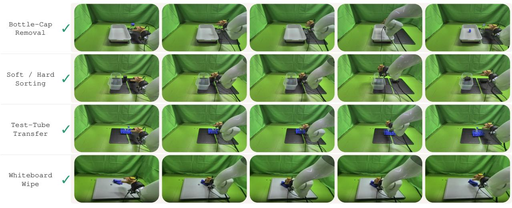  
Figure 11 Successful executions with TouchScale mid-training. Representative real-world rollouts across the four manipulation tasks. Each row shows the progression from initial interaction to successful task completion.

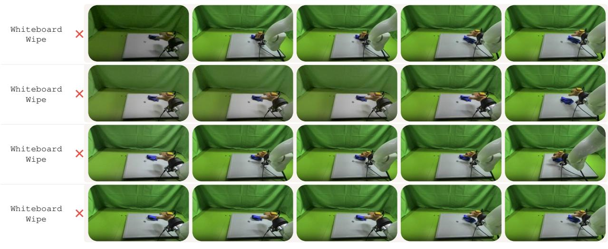  
Figure 12 Failure cases without TouchScale mid-training. Representative Whiteboard Wipe rollouts from the baseline N -VTLA policy that fail to complete the manipulation task.

## E.2 Implementation Details

TouchScale mid-training. We initialize from the oficially released ${ \mathcal { N } } _ { 0 } .$ -VTLA checkpoint and follow its Stage-1 future-tactile prediction formulation while adapting the training pipeline to TouchScale. During TouchScale mid-training, the vision–language–action backbone is frozen and no human action labels are used. We update only the tactile projection layer, the tactile predictor, and an auxiliary tactile reconstruction head. The predictor uses the tactile\_kv architecture with five latent tactile tokens, matching the released checkpoint configuration. Given the current tactile observation together with visual–language context, the predictor produces latent tactile tokens that represent the expected tactile change over a future horizon of $H = 5 0$ frames.

For each training sample, the future-tactile target is constructed from the tactile change between the current observation and the observation at $t + H$ . This tactile change is encoded with the tactile encoder, and targets from the available tactile views are averaged to obtain the target latent representation $z ^ { * }$ . The target branch is stop-gradient during Stage-1 training. We mean-pool and $\ell _ { 2 } { \mathrm { - n o r m a l i z e } }$ the predicted and target latent tactile representations and optimize a symmetric InfoNCE objective over the global training batch. In addition, a two-layer reconstruction head maps the predicted latent tactile tokens to an $8 \times 8$ representation of the corresponding future tactile change. The Stage-1 objective is

$$
\begin{array} { r } { \mathcal { L } _ { \mathrm { m i d } } = \mathcal { L } _ { \mathrm { N C E } } + \lambda _ { \mathrm { r e c } } \mathcal { L } _ { \mathrm { r e c } } , } \end{array}\tag{22}
$$

where $\mathcal { L } _ { \mathrm { r e c } }$ is an $\ell _ { 1 }$ reconstruction loss and $\lambda _ { \mathrm { { r e c } } } = 0 . 5$ . We use a temperature of 0.07 for the contrastive objective.

Training configuration. We optimize the trainable tactile pathway with AdamW using a global batch size of 64 and gradient clipping at 1.0. The learning rate is warmed up for 500 steps to $1 \times 1 0 ^ { - 4 }$ and then decayed to $1 \times 1 0 ^ { - 5 }$ by 20K steps. Approximately 123.8M parameters are updated during TouchScale mid-training, while the remaining 3.71B parameters of the base policy remain frozen. The vision–language backbone is kept in evaluation mode and evaluated without gradient computation throughout this stage.

Multimodal alignment. TouchScale recordings retain their original timestamps in the released dataset. For $\mathcal { N } _ { 0 ^ { - } } \mathrm { V T L A }$ mid-training, the three RGB streams and two tactile streams are converted to a common 30 Hz training timeline using timestamp-based nearest-neighbor association. This conversion is performed only when constructing the model training samples and does not modify the original TouchScale recordings. We use fixed tactile normalization statistics estimated from the training split and apply the same normalization throughout mid-training.

Robot post-training. After TouchScale mid-training, the resulting checkpoint is post-trained on our robotic demonstrations using the N -VTLA robot adaptation pipeline. The baseline starts from the same released checkpoint but skips TouchScale mid-training. Both variants are post-trained with the same 50 robot demonstrations per task and the same optimization and data-processing protocol. Thus, the only diference between the two variants is whether the tactile predictor receives action-free human visual–tactile mid-training on TouchScale before robot post-training.

## F 3D Object Reconstruction

For objects in TouchScale, we record short object-centric RGB videos by moving the camera around each object to capture it from multiple viewpoints. We select several frames in which the object is fully visible and segment the foreground object from the background. The resulting multi-view RGB images are provided to the Meshy Multi-Image-to-3D API to reconstruct a 3D model for each object. These reconstructed object models are provided together with TouchScale.