# ULTRAWORLD: LEARNING INTERACTIVE ULTRA-SOUND WORLD MODELS FROM UNTRACKED CLINI-CAL VIDEOS WITH ACOUSTIC SAMPLING MAP

Keke Yang\*1, Erqi Wang\*1, Sainan Guan 2 & Hongliang Ren 1 B

1 The Chinese University of Hong Kong

2 The Eighth Affiliated Hospital, Sun Yat-sen University

## ABSTRACT

World models can enable autonomous ultrasound scanning by predicting the outcomes of probe motions from local observations. Learning this action–observation relationship typically relies on synchronized video–pose pairs, which are costly to collect at scale and largely unavailable in routine clinical recordings. Reliable action following further requires modeling ultrasound’s cross-sectional sampling geometry. We present UltraWorld, a self-distillation recipe that transfers priors from clinical ultrasound videos into interactive world models without real action annotations. Starting from clinical videos, we adapt a video foundation model into an ultrasound generator conditioned on reference images and anatomical masks. Anatomical masks sampled along programmable trajectories through 3D anatomy provide spatial guidance for synthesizing action–video pairs. We then use these synthetic pairs to self-distill the generator into a world model that predicts future observations from local observations and actions, without requiring anatomical masks or other 3D assets at inference time. To further improve action following, we introduce the Acoustic Sampling Map (AsMap), which represents probe poses and imaging settings as pixel-wise 3D sampling positions, beam directions, and depths. Experiments demonstrate improved prediction fidelity and action following. Across nine simulated closed-loop local planning episodes, UltraWorld reduces the mean final distance to the goal and orientation error by 29% and 38%, respectively, compared with visual servoing. Project Page: https://ultraworld-project.github.io/.

## 1 INTRODUCTION

World models have shown promise for autonomous ultrasound scanning, supporting probe guidance (Yue et al., 2025) and policy learning from predicted observations (Fan et al., 2026). Predicting the outcomes of candidate actions from local observations supports planning and policy evaluation or improvement through simulated interactions (Hafner et al., 2020; Huang et al., 2026; Guo et al., 2026). This is particularly useful in ultrasound, where sonographers face the demanding task of relating 2D sections to 3D anatomy to guide probe motion (Jiang et al., 2025a). Two challenges limit this capability. First, acquiring synchronized ultrasound video–pose data is costly, limiting data scale and clinical diversity. Second, scanning operations alter which anatomical cross-sections are imaged and how they are sampled, making reliable action-controlled prediction difficult in ultrasound.

Recent world models transfer pretrained video generators for data efficiency but still require observation–action pairs to learn target-domain control (Huang et al., 2026). In ultrasound, col lecting these pairs requires expert operators, calibrated tracking, synchronized recording, and participant recruitment, making large-scale acquisition labor-intensive. Existing clinical videos, meanwhile, usually lack probe-motion records. Simulation offers controlled interactions, but full-path ray tracing may omit tissue scattering and attenuation (Duelmer et al., 2025), while learning-based simulation may require specially acquired and registered CT–ultrasound pairs (Ao et al., 2026). This motivates a more scalable route to learning reliable action responses from untracked clinical videos.

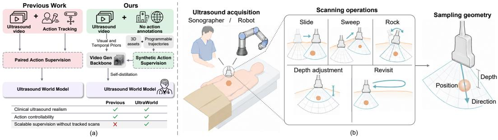  
Figure 1: Learning ultrasound world models from untracked clinical videos. (a) Clinical videos provide appearance priors, while 3D anatomy provides motion supervision. Together, they yield synthetic action–video pairs for self-distillation. (b) Complex scanning operations change which anatomical cross-sections are imaged and how they are sampled. AsMap encodes the resulting sampling positions, beam directions, and depths to support reliable action control.

Our key insight is that visual and temporal priors learned from clinical videos can be transferred into an interactive world model using independently constructed action supervision (Figure 1(a)). Clinical videos capture anatomical appearance and temporal changes (Mishra et al., 2026); their plane selection and scanning sequences also implicitly reflect clinical judgment and expertise. We can learn these priors in a controllable video generator, then construct action supervision using 3D anatomical assets and programmable scanning trajectories. Self-distillation provides a route for this transfer, using generated outputs as supervision to learn new conditioning capabilities (Cai et al., 2025) or representations (Bahmani et al., 2026). Using generated action–video pairs, we can transfer this prior to prediction conditioned on local observations and scanning operations, without tracked clinical recordings.

Learning from this supervision also requires relating local 2D observations to probe motion in 3D: scanning operations change both the anatomical cross-section and its sampling geometry (Figure 1(b)). Pose-only inputs omit imaging-scale changes, while camera encodings describe viewing rays or projective relationships (Li et al., 2025). Ultrasound pixels instead correspond to depthlocalized samples along acoustic beams (Szabo, 2014). Reliable action conditioning therefore need to make these sampling locations explicit under probe motion and imaging adjustments.

We present UltraWorld, a recipe for learning interactive ultrasound world models from untracked clinical videos. We adapt a video foundation model into an ultrasound generator conditioned on a reference image and anatomical mask sequences. For action supervision, we generate action–video pairs using mask sequences sampled from 3D assets along programmable trajectories. Through selfdistillation, we transfer the learned ultrasound priors into an observation- and action-conditioned world model initialized from the generator’s weights, requiring neither masks nor 3D assets at inference. To link 3D probe motion to changes in 2D observations, we introduce the Acoustic Sampling Map (AsMap), encoding probe poses and imaging settings as pixel-wise 3D sampling positions, beam directions, and depths. Experiments show improved prediction fidelity and action following. We further evaluate consistency from unseen clinical frames and explore closed-loop local planning for robotic ultrasound scanning in simulation.

Our main contributions are as follows: (1) A self-distillation recipe for learning ultrasound world models from untracked clinical videos, combining clinical video priors with programmable supervision from 3D anatomy to learn action-conditioned prediction without real video–pose pairs. (2) The Acoustic Sampling Map (AsMap), which grounds probe motion and imaging adjustments in pixel-wise 3D sampling positions, beam directions, and depths to support reliable action control in cross-sectional ultrasound imaging. (3) Experimental validation and a robotic planning application, demonstrating improved prediction fidelity and action following, evaluating consistency from unseen clinical frames, and exploring closed-loop local planning for robotic ultrasound scanning in simulation.

## 2 RELATED WORKS

Robotic Ultrasound. Robotic ultrasound guidance has been explored through visual servoing (Abolmaesumi et al., 2002; Chatelain et al., 2017; Ma et al., 2025), reinforcement learning (Li et al., 2021), and demonstration-based reward learning (Jiang et al., 2024b). Integrated systems further combine learned navigation, probe-orientation optimization, and force feedback for autonomous thyroid scanning (Su et al., 2024). More recently, ultrasound world models have demonstrated the value of predicting acquisition outcomes for improving probe guidance and supporting policy learning. Cardiac Copilot and EchoWorld learn cardiac world models for echocardiography probe guidance (Jiang et al., 2024a; Yue et al., 2025), while Fan et al. (2026) use a diffusion world model to provide rewards for goal-conditioned policy training and demonstrate closed-loop goal-plane navigation. Despite these benefits, both world-model approaches rely on synchronized ultrasound–pose recordings to learn acquisition dynamics, leaving routine untracked clinical videos underexploited.

Ultrasound Synthesis. Ultrasound synthesis encompasses anatomical simulation from CT/MRderived anatomy and learned generation (Kutter et al., 2009; Salehi et al., 2015). SonoGym (Ao et al., 2026) supports physics-based and generative ultrasound simulation from CT-derived anatomy for robotic learning. Echo from Noise (Stojanovski et al., 2023) uses semantic-conditioned diffusion to generate training images for cardiac segmentation, while BUSGen (Yu et al., 2026a) learns large-scale breast ultrasound priors to synthesize task-specific data for downstream analysis. Video diffusion models generate cardiac cycles from semantic maps (Van Phi et al., 2024) or arbitrary single frames (Zhang et al., 2026). These studies demonstrate the value of anatomical control and synthetic data, but visual realism alone does not establish faithful responses to prescribed scanning actions. Connecting clinical video priors with acquisition control requires consistency between the commanded trajectory and the evolving anatomy.

Geometric Conditioning. Geometric conditioning encodes pose and imaging geometry within visual models. Ultrasound world models encode probe motion using learned embeddings or multiscale trigonometric features (Yue et al., 2025; Fan et al., 2026), leaving pixel-wise sampling relationships implicit. In camera-controlled video generation, CameraCtrl II (He et al., 2025) uses pixel-aligned Plucker embeddings with input-level feature addition, while VD3D (Bahmani et al.,¨ 2025) injects Plucker camera embeddings into video diffusion transformers through a ControlNet-¨ like conditioning mechanism. GTA (Miyato et al., 2024) incorporates relative geometric transformations into attention, while PRoPE (Li et al., 2025) models relative camera-frustum relationships through both intrinsics and extrinsics. These camera-centric representations encode optical viewing rays or projective relationships. Adapting such conditioning to ultrasound requires representing depth-resolved acoustic sampling under probe motion and imaging configuration.

## 3 PRELIMINARIES

Controllable video generation. Following controllable video models (Jiang et al., 2025b), we denote a reference condition by r and temporally aligned controls by $\mathbf { C } _ { 1 : T } = \{ \mathbf { c } _ { t } \} _ { t = 1 } ^ { T } . \mathbf { A }$ conditional video generator models $p _ { \theta } ( \mathbf { X } _ { 1 : T } \mid \mathbf { r } , \mathbf { C } _ { 1 : T } )$ , where $\mathbf { \bar { X } } _ { 1 : T } = \{ \mathbf { x } _ { t } \} _ { t = 1 } ^ { T }$ denotes the generated video.

Ultrasound acquisition parameters. Clinical ultrasound acquisition is determined jointly by probe pose and imaging configuration. We denote the acquisition state at time t as ${ \pmb { \xi } } _ { t } = ( { \bf T } _ { t } , { \pmb { \kappa } } _ { t } )$ where $\mathbf { T } _ { t } \in S E ( 3 )$ transforms points from the probe coordinate system to the patient coordinate system, and $\kappa _ { t }$ denotes acquisition parameters such as scan geometry, physical sampling scale, imaging depth or field of view, and beam steering.

An ultrasound acquisition maps a physical point p to its image coordinate as

$$
\begin{array} { r } { \left( u , v \right) = \pi _ { \mathrm { U S } } \left( \mathbf { T } _ { t } \mathbf { p } ; \kappa _ { t } \right) , } \end{array}\tag{1}
$$

where $\pi _ { \mathrm { U S } }$ denotes the acquisition-dependent mapping from spatial locations on the imaging plane to ultrasound image coordinates.

World models. A visual world model predicts the visual consequences of actions from an observed context (Zhu et al., 2025; Huang et al., 2026). Given $\mathbf { X } ^ { c } = \left\{ \mathbf { \bar { x } } _ { 1 } , \dots , \mathbf { x } _ { K } \right\}$ and future actions $\mathbf { A } ^ { f } = \left\{ \mathbf { a } _ { K } , \dots , \mathbf { a } _ { K + H - 1 } \right\}$ , it predicts $\widehat { \mathbf { X } } ^ { f } = \mathcal { W } _ { \theta } ( \mathbf { X } ^ { c } , \mathbf { A } ^ { f } )$ , where $\widehat { \mathbf { X } } ^ { f } = \{ \hat { \mathbf { x } } _ { K + 1 } , \dotsc , \hat { \mathbf { x } } _ { K + H } \}$

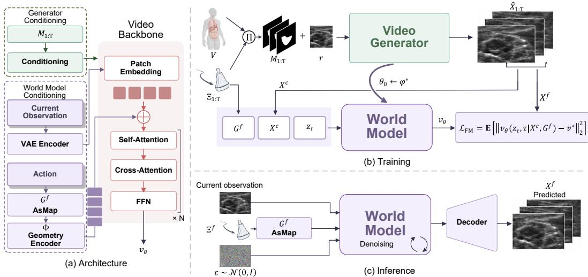  
Figure 2: Overall framework of UltraWorld. (a) A shared video backbone supports maskconditioned generation and action-conditioned world modeling through AsMap. (b) 3D anatomy and programmable trajectories provide synthetic action–video supervision, transferring the learned video prior to the world model through self-distillation and flow matching. (c) At inference, the world model predicts future ultrasound video from the current observation and prescribed acquisition trajectory.

## 4 METHOD

In this section, we present UltraWorld, a recipe for learning interactive ultrasound world models from action-free clinical videos. Our key idea is to transfer the visual and temporal priors learned from clinical videos into action-conditioned dynamics through anatomy-guided interaction supervision. We further introduce a pixel-aligned representation of ultrasound acquisition to explicitly encode the spatial effects of diverse clinical scanning operations. The overall approach is illustrated in Fig. 2.

## 4.1 FROM ACTION-FREE ULTRASOUND VIDEOS TO INTERACTIVE TRAJECTORIES

We reformulate world-model learning as transferring priors from action-free clinical ultrasound videos to trajectories with explicit acquisition supervision. We first learn a controllable video prior, then construct the missing action supervision independently from anatomy-guided scanning trajectories.

Learning ultrasound priors from action-free videos. Given an action-free ultrasound sequence $\mathbf { X } _ { 1 : T } = \overline { { \{ } }  \mathbf { x } _ { t } \} _ { t = 1 } ^ { T }$ , we associate it with a temporally aligned semantic anatomical condition $\mathbf { M } _ { 1 : T } =$ $\begin{array} { r } { \{ \mathbf { m } _ { t } \} _ { t = 1 } ^ { T } . } \end{array}$ Instantiating the structured video control $\mathbf { C } _ { 1 : T }$ with $\mathbf { M } _ { 1 : T }$ , we learn a controllable ultrasound video generator

$$
p _ { \phi } \left( \mathbf { X } _ { 1 : T } \mid \mathbf { r } , \mathbf { M } _ { 1 : T } \right) ,\tag{2}
$$

where r is a reference ultrasound image that anchors the appearance characteristics of the generated sequence. Crucially, this stage requires no corresponding acquisition states $\Xi _ { 1 : T } ,$ allowing ultrasound-specific visual and temporal priors to be learned directly from action-free clinical videos.

Anatomy-guided ultrasound scanning trajectories. The learned video prior captures realistic ultrasound appearance and temporal evolution, but action-free videos do not specify how observations should change under prescribed acquisition states. We obtain this missing interaction supervision from 3D anatomical volumes. Let $\nu$ denote a semantic anatomical volume. We construct a scanning trajectory as a sequence of acquisition states

$$
\boldsymbol { \Xi } _ { 1 : T } = \left\{ \pmb { \xi } _ { t } \right\} _ { t = 1 } ^ { T } , \qquad \boldsymbol { \xi } _ { t } = \left( \mathbf { T } _ { t } , \pmb { \kappa } _ { t } \right) ,\tag{3}
$$

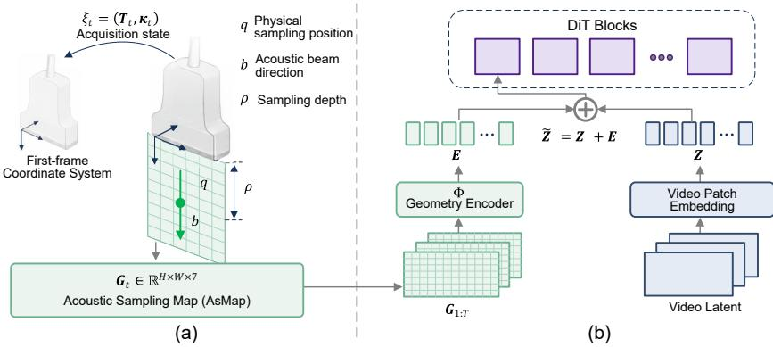  
Figure 3: Acoustic Sampling Map and geometry conditioning. (a) Probe pose and imaging parameters determine each pixel’s physical sampling position q, beam direction b, and sampling depth $\rho .$ Positions and directions are expressed in the first-frame probe coordinate system, forming a seven-channel AsMap. (b) A geometry encoder Φ aligns the AsMap sequence with the video tokens, providing pixel-aligned conditioning before the first transformer block.

where $\mathbf { T } _ { t }$ denotes the transducer pose and $\kappa _ { t }$ specifies the ultrasound acquisition parameters. We programmatically sample trajectories covering common clinical scanning operations, including sweeps, slide, rock, revisits, and changes in imaging depth or field of view.

For each acquisition state, the corresponding anatomical observation is obtained by resampling the 3D volume under the specified acquisition configuration,

$$
\begin{array} { r } { \mathbf { m } _ { t } = \Pi \left( \mathcal { V } ; \pmb { \xi } _ { t } \right) , } \end{array}\tag{4}
$$

where $\Pi ( \cdot )$ denotes the volumetric sampling operator. Applying this operation along $\Xi _ { 1 : T }$ yields an anatomically consistent mask trajectory $\mathbf { M } _ { 1 : T }$ whose acquisition states are known by construction. Consistent with prior ultrasound simulation, we use MR only to provide 3D anatomical geometry for $M _ { 1 : T }$ , while ultrasound appearance is inherited from the clinical-ultrasound prior $p _ { \phi }$ (Kutter et al., 2009).

Interactive trajectory synthesis. We then use the anatomy-guided mask trajectory as the structured control of the learned ultrasound video prior:

$$
\hat { \mathbf { X } } _ { 1 : T } \sim p _ { \phi } \left( \mathbf { X } _ { 1 : T } \mid \mathbf { r } , \mathbf { M } _ { 1 : T } \right) .\tag{5}
$$

Because $\mathbf { M } _ { 1 : T }$ is generated from the prescribed acquisition trajectory $\Xi _ { 1 : T }$ , the synthesized ultrasound sequence is paired by construction with its acquisition states. Repeating this process produces an interaction dataset

$$
\begin{array} { r } { \hat { \mathcal { D } } _ { \mathrm { t r a j } } = \left\{ \left( \hat { \mathbf { X } } _ { 1 : T } , \Xi _ { 1 : T } \right) \right\} , } \end{array}\tag{6}
$$

thereby converting the visual and temporal priors learned from action-free clinical videos into scalable action-labeled supervision for ultrasound world-model learning.

## 4.2 ACOUSTIC SAMPLING MAP

Clinical ultrasound acquisition depends jointly on probe motion and imaging configuration. For example, a sonographer may reduce the imaging depth to enlarge a lesion within the field of view while keeping the probe pose nearly unchanged. A 6-DoF pose alone cannot distinguish these acquisitions, although they correspond to different physical sampling geometries and therefore different image observations. To explicitly represent the spatial sampling induced by both probe motion and acquisition parameters, we introduce the Acoustic Sampling Map (AsMap), a dense, pixel-aligned representation of ultrasound acquisition geometry (Fig. 3).

Acoustic sampling geometry. For each image location $( u , v )$ , we define its probe-local sampling geometry as

$$
\begin{array} { r } { S _ { \mathrm { { U S } } } ( u , v ; \kappa _ { t } ) = ( \mathbf { q } _ { t , u , v } , \mathbf { b } _ { t , u , v } , \rho _ { t , u , v } ) , } \end{array}\tag{7}
$$

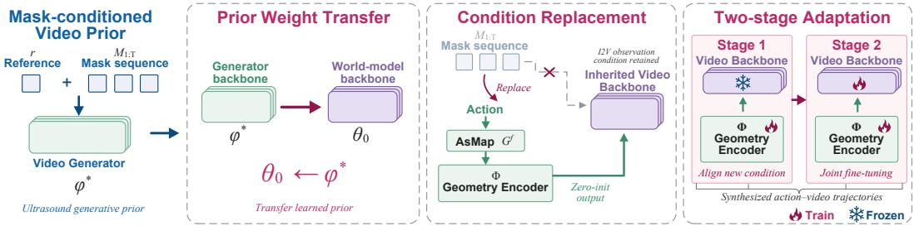  
Figure 4: Self-distillation for ultrasound world modeling. The transformation consists of three steps: (1) Prior weight transfer: initialize the world model from the learned video generator; (2) Condition replacement: replace anatomical-mask conditioning with AsMap conditioning while retaining the observation input; (3) Two-stage adaptation: train the geometry encoder with a frozen video backbone, then jointly fine-tune both. Both stages use synthesized action–video trajectories.

where $\mathbf { q } _ { t , u , v } \in \mathbb { R } ^ { 3 }$ is the physical sampling position, $\mathbf { b } _ { t , u , v } \in \mathbb { R } ^ { 3 }$ is the unit acoustic beam direction, and $\rho _ { t , u , v }$ is the sampling depth.

To describe a trajectory consistently, we express positions and directions in the probe coordinate system of the first frame. With $T _ { t } = \dot { ( R _ { t } , \mathbf { t } _ { t } ) }$ denoting the probe-to-patient transformation,

$$
\left[ \mathbf { q } _ { t , u , v } ^ { ( 1 ) } \right] = T _ { 1 } ^ { - 1 } T _ { t } \left[ \mathbf { q } _ { t , u , v } \right] , \qquad \mathbf { b } _ { t , u , v } ^ { ( 1 ) } = R _ { 1 } ^ { \top } R _ { t } \mathbf { b } _ { t , u , v } .\tag{8}
$$

The AsMap at time t is then

$$
\mathbf { G } _ { t } ( u , v ) = \left[ \mathbf { q } _ { t , u , v } ^ { ( 1 ) } , \mathbf { b } _ { t , u , v } ^ { ( 1 ) } , \rho _ { t , u , v } \right] \in \mathbb { R } ^ { 7 } , \qquad \mathbf { G } _ { t } \in \mathbb { R } ^ { H \times W \times 7 } .\tag{9}
$$

Unlike pose-only conditioning, AsMap explicitly changes with the physical sampling configuration even when the probe pose is fixed. The first-frame formulation also removes dependence on the arbitrary global patient coordinate frame; additional properties are discussed in Appendix A.

Encoding and injection. A lightweight geometry encoder Φ converts the AsMap sequence into features aligned with the video tokens,

$$
{ \bf E } = \Phi ( { \bf G } _ { 1 : T } ) , \qquad \widetilde { { \bf Z } } = { \bf Z } + { \bf E } ,\tag{10}
$$

where Z denotes the patch-embedded video features. Following the input-level conditioning strategy of CameraCtrl II (He et al., 2025), the AsMap features are added once before the first transformer block, providing frame- and pixel-aligned acquisition conditioning without modifying the internal transformer architecture.

## 4.3 SELF-DISTILLATION FOR ULTRASOUND WORLD MODELING

The synthesized trajectories transfer geometry-controlled video generation into action-conditioned prediction of how ultrasound appearance changes with scanning operations. Following generative self-distillation (Cai et al., 2025; Bahmani et al., 2026), we transform the mask-conditioned ultrasound generator into an action-conditioned world model by replacing mask conditioning with AsMap while retaining the observation input (Fig. 4). We initialize the world-model backbone from the teacher, $\theta _ { 0 }  \phi ^ { * }$ , and train it on the synthesized trajectories to model $p _ { \theta } ( \mathbf { X } ^ { f } \mid \mathbf { X } ^ { c } , \mathbf { G } ^ { f } )$ . For optimization, we first train the AsMap encoder Φ with the video backbone frozen and then jointly fine-tune both. Detailed training procedures are provided in Appendix B.

## 5 EXPERIMENTS

## 5.1 EXPERIMENTAL SETUP

Datasets. We use BUV (Lin et al., 2022) and CAMUS (Leclerc et al., 2019) to learn the maskconditioned ultrasound video prior, and I-SPY1 (Newitt et al., 2016; Hylton et al., 2016) to construct

anatomy-guided trajectories from volumetric breast MRI. CAMUS is used only for prior learning. Training details. We initialize the ultrasound video generator from Wan2.1-FunControl-1.3B-V1.1 (Wan Team et al., 2025) and train the generator and world model at 512 × 512 resolution.

Baselines. We compare AsMap with Fourier Encoding (Fan et al., 2026), MLP Encoding inspired by EchoWorld (Yue et al., 2025), and PRoPE (Li et al., 2025). All methods receive the same acquisition state $\left( \mathbf { T } _ { t } , \kappa _ { t } \right)$

## 5.2 MASK-CONDITIONED ULTRASOUND VIDEO GENERATOR

We first verify that the mask-conditioned generator preserves realistic ultrasound appearance while following the prescribed anatomical structure. As shown in Fig. 5, the generated sequences remain temporally coherent and follow the target anatomy across both breast ultrasound and echocardiography. Quantitative evaluation of generation fidelity and mask controllability is provided in Appendix E.1.

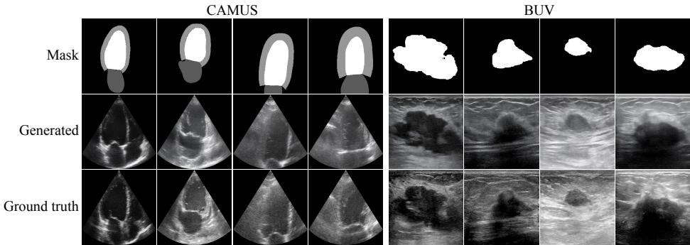  
Figure 5: Mask-conditioned ultrasound video generation. Generated sequences follow the prescribed anatomy while preserving realistic ultrasound appearance.

## 5.3 WORLD MODEL QUALITY ANALYSIS

We evaluate whether UltraWorld predicts plausible changes in ultrasound texture and anatomical appearance in response to prescribed acquisition trajectories. Following recent discussions on worldmodel evaluation (Yu et al., 2026b), we consider both prediction fidelity and action-sensitive behavior. We first evaluate on paired synthesized trajectories with known reference futures and acquisition states. Counterfactual evaluations under alternative trajectories are provided in Appendix E.

Metrics. Following trajectory-conditioned world models (Zhu et al., 2025), we evaluate prediction fidelity using PSNR, LPIPS, and latent $\ell _ { 2 }$ distance, and action following using ∆-LPIPS (Li et al., 2026) and Motion Error. The latter measures the discrepancy between predicted and reference target-anatomy displacements. Let $\pmb { \mu } _ { t }$ and $\hat { \pmb { \mu } } _ { t }$ denote the reference and predicted target-anatomy centroids at frame t:

$$
E _ { \mathrm { m o t i o n } } = \frac { 1 } { | \mathcal { P } | } \sum _ { t \in \mathcal { P } } \| \big ( \pmb { \hat { \mu } _ { t + 1 } } - \pmb { \hat { \mu } _ { t } } \big ) - \big ( \pmb { \mu _ { t + 1 } } - \pmb { \mu _ { t } } \big ) \| _ { 2 } ,\tag{11}
$$

where $\mathcal { P }$ denotes the set of valid frame pairs.

Prediction fidelity and action following. Table 1 compares AsMap with representative global action encodings and projective geometric conditioning under the same acquisition states. AsMap achieves the best performance across both prediction-fidelity and action-following metrics, showing that explicitly representing pixel-wise ultrasound sampling geometry improves both visual prediction and responses to prescribed acquisition changes.

Figure 6 compares future ultrasound predictions from the same initial observation under four scanning operations. White arrows highlight where baseline predictions fail to follow the image changes induced by probe motion or imaging adjustments. Yellow insets reveal missing or unstable local features, including hypoechoic regions and surrounding echogenic tissue interfaces. UltraWorld more consistently predicts how these features evolve with the prescribed actions while maintaining plausible texture and local anatomical appearance across future frames. Additional examples are provided in Appendix E.2.

Table 1: Comparison of different action-conditioning representations. AsMap consistently improves both prediction fidelity and action following over global action encodings and projective geometric conditioning. Motion error is measured in pixels.
<table><tr><td rowspan="2">Conditioning</td><td colspan="3">Prediction fidelity</td><td colspan="2">Action following</td></tr><tr><td>a PSNR↑</td><td>LPIPS↓</td><td>Latent  $\ell _ { 2 }$  →</td><td>△-LPIPS↓</td><td>Motion err.↓</td></tr><tr><td>Fourier Enc. (Fan et al., 2026)</td><td>22.946</td><td>0.274</td><td>0.120</td><td>0.509</td><td>4.540</td></tr><tr><td>MLP Enc. (Yue et al., 2025)</td><td>23.031</td><td>0.262</td><td>0.121</td><td>0.486</td><td>4.471</td></tr><tr><td>PRoPE (Li et al., 2025)</td><td>22.634</td><td>0.275</td><td>0.127</td><td>0.504</td><td>4.457</td></tr><tr><td>AsMap (Ours)</td><td>24.994</td><td>0.236</td><td>0.095</td><td>0.466</td><td>4.155</td></tr></table>

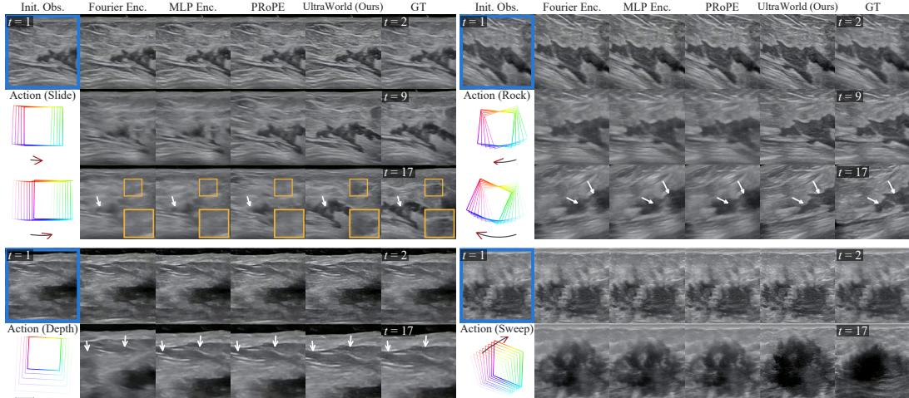  
Figure 6: Qualitative comparison across scanning operations. UltraWorld follows prescribed operations more consistently. White arrows highlight differences in action following; yellow insets highlight missing or unstable hypoechoic regions and anatomical features in baseline predictions.

Ablation studies. A parameter-matched MLP using the same first-frame-relative coordinates remains worse than AsMap (Table 2), indicating that the gain is not explained by encoder capacity or coordinate convention. Initialization from Wan2.1 performs comparably, suggesting that selfdistillation does not critically rely on generator-weight inheritance.

## 5.4 ULTRAWORLD FOR ROBOTIC ULTRASOUND PLANNING

Building on world-model-based robotic planning (Hansen et al., 2024; Zhu et al., 2025; Zhou et al., 2025), we evaluate UltraWorld for goal-directed local ultrasound planning in simulation. We use model predictive control (MPC) (Mayne et al., 2000), optimizing candidate probe-action sequences with the cross-entropy method (CEM) (De Boer et al., 2005). We compare against an intensity-based visual-servoing baseline inspired by Nadeau & Krupa (2013); implementation details are provided in Appendix C. Across nine episodes, UltraWorld achieves lower mean terminal translation and rotation errors than visual servoing (Fig. 7). Figure 8 shows a representative closed-loop episode in which imagined rollouts guide the probe toward the target view.

Table 2: Ablation studies on action encoding and initialization. “Matched” approximately matches the AsMap encoder parameter count and uses the same first-frame-relative coordinates. For each ablation, the remaining components follow the full model configuration.
<table><tr><td rowspan="2">Variant</td><td colspan="3">Prediction fidelity</td><td colspan="2">Action following</td></tr><tr><td>PSNR↑</td><td>LPIPS↓</td><td>Latent  $\ell _ { 2 }$  →</td><td>∆-LPIPS↓</td><td>Motion err.↓</td></tr><tr><td>Matched MLP conditioning</td><td>23.402</td><td>0.258</td><td>0.113</td><td>0.482</td><td>4.429</td></tr><tr><td>Wan2.1 initialization</td><td>24.640</td><td>0.235</td><td>0.099</td><td>0.472</td><td>4.414</td></tr><tr><td>Full model (Ours)</td><td>24.994</td><td>0.236</td><td>0.095</td><td>0.466</td><td>4.155</td></tr></table>

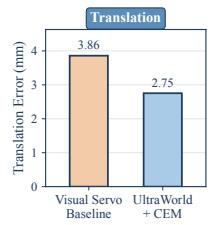

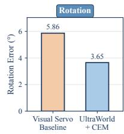

Table 3: Generalization to real clinical ultrasound.  
Figure 7: Closed-loop planning errors.
<table><tr><td rowspan="2">Conditioning</td><td colspan="2">BUSI</td><td colspan="2">BUV</td></tr><tr><td>Zero- action↓</td><td>Round- trip↓</td><td>Zero- action↓</td><td>Round- trip↓</td></tr><tr><td>Fourier Enc.</td><td>0.110</td><td>0.231</td><td>0.148</td><td>0.276</td></tr><tr><td>MLP Enc.</td><td>0.172</td><td>0.238</td><td>0.244</td><td>0.253</td></tr><tr><td>PRoPE</td><td>0.159</td><td>0.227</td><td>0.226</td><td>0.317</td></tr><tr><td>AsMap (Ours)</td><td>0.042</td><td>0.062</td><td>0.059</td><td>0.076</td></tr></table>

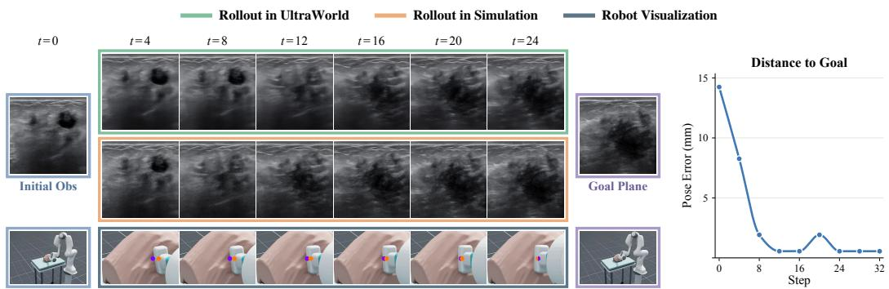

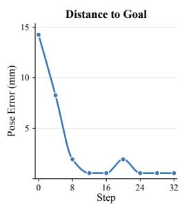  
ose 10) 7.5(mrrose 7.5o ( Figure 8: Closed-loop robotic ultrasound planning with UltraWorld. A representative episode Initial Obs Goal Plane7.5 (mrroose Goal Plane 5e E showing imagined rollouts, executed observations, and the target view. Only the first optimized action is executed before replanning from the new observation.

## 5.5 GENERALIZATION TO REAL CLINICAL ULTRASOUND

We evaluate unseen real initial frames from patient-held-out BUV and independent BUSIdataset (Al-Dhabyani et al., 2020). Without paired futures, we use zero-action and round-trip LPIPS to assess stability and recovery consistency (Li et al., 2026). AsMap achieves the lowest errors on both datasets (Table 3); qualitative rollouts are provided in Appendix E.

## 6 CONCLUSION

We presented UltraWorld, a recipe for learning ultrasound world models from untracked clinical videos. It combines a mask-conditioned ultrasound video prior with anatomy-guided trajectory synthesis for self-distillation, and introduces the Acoustic Sampling Map (AsMap) to represent pixelwise ultrasound sampling geometry. Experiments validate the fidelity and controllability of the video generator, and show that UltraWorld improves prediction fidelity and acquisition following over alternative conditioning representations. We further demonstrate closed-loop local scan planning with lower terminal translation and rotation errors than visual servoing, and improved consistency from unseen real clinical observations. Together, these results provide a practical route from untracked clinical videos to action-conditioned ultrasound world models. Future work will validate the approach with physical robotic systems.

## AI USE STATEMENT

In this work, we did not use generative AI tools for tasks requiring mandatory disclosure under the ICLR 2027 AI Policy, including developing theoretical or conceptual frameworks, formulating mathematical claims or proofs, proposing or refining hypotheses, designing research methodology or experiments, implementing the proposed methods, generating synthetic datasets, cleaning or reformatting datasets, conducting qualitative or thematic data analysis, or interpreting experimental results. Translation and proof-related assistance were not applicable to this work.

We used generative AI tools for tasks for which disclosure is recommended, including improving the readability and clarity of the manuscript, assisting with software code editing and debugging, brainstorming, and supporting literature search and summarization.

All AI-assisted text was reviewed and revised by the authors. AI-assisted code was manually inspected and validated through testing and experimental execution. Literature-related suggestions and summaries were checked against the original sources, and all references and factual claims included in the paper were independently verified by the authors. Generative AI outputs were not treated as authoritative sources.

We take responsibility for the final content of this work, including all text, claims, code, results, and artifacts produced with the aid of generative AI.

## ETHICS STATEMENT

This work uses publicly available datasets and does not involve human subjects or personally identifiable information. We are not aware of any specific ethical concerns beyond those generally associated with the use of machine learning systems.

## REPRODUCIBILITY STATEMENT

We provide detailed descriptions of the proposed method, model architecture, training procedure, hyperparameter settings, dataset preprocessing, and evaluation protocols in the main paper and appendices. Additional implementation details and experimental results are included in the supplementary material. The code and configuration files necessary to reproduce the main experiments will be released upon publication.

## REFERENCES

Purang Abolmaesumi, Septimiu E. Salcudean, Wen-Hong Zhu, Mohammad Reza Sirouspour, and Simon P. DiMaio. Image-guided control of a robot for medical ultrasound. IEEE Transactions on Robotics and Automation, 18(1):11–23, 2002. doi: 10.1109/70.988970.

Walid Al-Dhabyani, Mohammed Gomaa, Hussien Khaled, and Aly Fahmy. Dataset of breast ultrasound images. Data in Brief, 28:104863, 2020. doi: 10.1016/j.dib.2019.104863.

Yunke Ao, Masoud Moghani, Mayank Mittal, Manish Prajapat, Luohong Wu, Frederic Giraud, Fabio Carrillo, Andreas Krause, and Philipp Furnstahl. Sonogym: High performance simulation¨ for challenging surgical tasks with robotic ultrasound. Advances in Neural Information Processing Systems, 38, 2026.

Sherwin Bahmani, Ivan Skorokhodov, Aliaksandr Siarohin, Willi Menapace, Guocheng Qian, Michael Vasilkovsky, Hsin-Ying Lee, Chaoyang Wang, Jiaxu Zou, Andrea Tagliasacchi, et al. Vd3d: Taming large video diffusion transformers for 3d camera control. In International Conference on Learning Representations, volume 2025, pp. 66712–66737, 2025.

Sherwin Bahmani, Tianchang Shen, Jiawei Ren, Jiahui Huang, Yifeng Jiang, Haithem Turki, Andrea Tagliasacchi, David Lindell, Zan Gojcic, Sanja Fidler, et al. Lyra: Generative 3d scene reconstruction via video diffusion model self-distillation. In International Conference on Learning Representations, volume 2026, pp. 82850–82880, 2026.

Shengqu Cai, Eric Ryan Chan, Yunzhi Zhang, Leonidas Guibas, Jiajun Wu, and Gordon Wetzstein. Diffusion self-distillation for zero-shot customized image generation. In 2025 IEEE/CVF Conference on Computer Vision and Pattern Recognition (CVPR), pp. 18434–18443. IEEE, 2025.

Pierre Chatelain, Alexandre Krupa, and Nassir Navab. Confidence-driven control of an ultrasound probe. IEEE Transactions on Robotics, 33(6):1410–1424, 2017. doi: 10.1109/TRO.2017. 2723618.

Pieter-Tjerk De Boer, Dirk P Kroese, Shie Mannor, and Reuven Y Rubinstein. A tutorial on the cross-entropy method. Annals ofoperations research, 134(1):19–67, 2005.

Felix Duelmer, Mohammad Farid Azampour, Magdalena Wysocki, and Nassir Navab. Ultraray: Introducing full-path ray tracing in physics-based ultrasound simulation. In International Conference on Medical Image Computing and Computer-Assisted Intervention, pp. 653–662. Springer, 2025.

Siqi Fan, Mingcong Chen, Ran Liu, Zixuan Yang, Xiaoyu Fu, Xiaoqing Gao, Yunhui Liu, and Hongbin Liu. Action-conditioned world model for goal plane probe guidance in robotic ultrasound, 2026.

Yanjiang Guo, Lucy Shi, Jianyu Chen, and Chelsea Finn. Ctrl-world: A controllable generative world model for robot manipulation. In International Conference on Learning Representations, volume 2026, pp. 6121–6138, 2026.

Danijar Hafner, Timothy Lillicrap, Jimmy Ba, and Mohammad Norouzi. Dream to control: Learning behaviors by latent imagination. In International Conference on Learning Representations, 2020.

Nick Hansen, Hao Su, and Xiaolong Wang. Td-mpc2: Scalable, robust world models for continuous control. In International Conference on Learning Representations, volume 2024, pp. 47376– 47405, 2024.

Hao He, Ceyuan Yang, Shanchuan Lin, Yinghao Xu, Meng Wei, Liangke Gui, Qi Zhao, Gordon Wetzstein, Lu Jiang, and Hongsheng Li. Cameractrl ii: Dynamic scene exploration via cameracontrolled video diffusion models. In Proceedings ofthe IEEE/CVF International Conference on Computer Vision, pp. 13416–13426, 2025.

Siqiao Huang, Jialong Wu, Qixing Zhou, Shangchen Miao, and Mingsheng Long. Vid2world: Crafting video diffusion models to interactive world models. In International Conference on Learning Representations, 2026.

Nola M. Hylton, Constantine A. Gatsonis, Mark A. Rosen, Constance D. Lehman, David C. Newitt, Savannah C. Partridge, Wanda K. Bernreuter, Etta D. Pisano, Elizabeth A. Morris, Paul T. Weatherall, Sandra M. Polin, Gillian M. Newstead, Helga S. Marques, Laura J. Esserman, and Mitchell D. Schnall. Neoadjuvant chemotherapy for breast cancer: Functional tumor volume by mr imaging predicts recurrence-free survival—results from the acrin 6657/calgb 150007 i-spy 1 trial. Radiology, 279(1):44–55, 2016. doi: 10.1148/radiol.2015150013.

Haojun Jiang, Zhenguo Sun, Ning Jia, Meng Li, Yu Sun, Shaqi Luo, Shiji Song, and Gao Huang. Cardiac copilot: Automatic probe guidance for echocardiography with world model. In International Conference on Medical Image Computing and Computer-Assisted Intervention, pp. 190– 199. Springer, 2024a.

Haojun Jiang, Andrew Zhao, Qian Yang, Xiangjie Yan, Teng Wang, Yulin Wang, Ning Jia, Jiangshan Wang, Guokun Wu, Yang Yue, et al. Towards expert-level autonomous carotid ultrasonography with large-scale learning-based robotic system. Nature Communications, 16(1):7893, 2025a.

Zeyinzi Jiang, Zhen Han, Chaojie Mao, Jingfeng Zhang, Yulin Pan, and Yu Liu. Vace: All-in-one video creation and editing. In 2025 IEEE/CVF International Conference on Computer Vision (ICCV), pp. 17191–17202. IEEE, 2025b.

Zhongliang Jiang, Yuan Bi, Mingchuan Zhou, Ying Hu, Michael Burke, and Nassir Navab. Intelligent robotic sonographer: Mutual information-based disentangled reward learning from few demonstrations. The International Journal of Robotics Research, 43(7):981–1002, 2024b. doi: 10.1177/02783649231223547.

Oliver Kutter, Ramtin Shams, and Nassir Navab. Visualization and gpu-accelerated simulation of medical ultrasound from ct images. Computer methods and programs in biomedicine, 94(3): 250–266, 2009.

Sarah Leclerc, Erik Smistad, Joao Pedrosa, Andreas Ostvik, Frederic Cervenansky, Florian Espinosa, Torvald Espeland, Erik Andreas Rye Berg, Pierre-Marc Jodoin, Thomas Grenier, Carole Lartizien, Jan Dhooge, Lasse Lovstakken, and Olivier Bernard. Deep learning for segmentation using an open large-scale dataset in 2d echocardiography. IEEE Transactions on Medical Imaging, 38(9):2198–2210, 2019. doi: 10.1109/TMI.2019.2900516.

Keyu Li, Jian Wang, Yangxin Xu, Hao Qin, Dongsheng Liu, Li Liu, and Max Q.-H. Meng. Autonomous navigation of an ultrasound probe towards standard scan planes with deep reinforcement learning. In 2021 IEEE International Conference on Robotics and Automation (ICRA), pp. 8302–8308, 2021. doi: 10.1109/ICRA48506.2021.9561295.

Ruilong Li, Brent Yi, Junchen Liu, Hang Gao, Yi Ma, and Angjoo Kanazawa. Cameras as relative positional encoding. In Advances in Neural Information Processing Systems, volume 38, 2025. doi: 10.52202/085713-0540.

Yaxuan Li, Zhongyi Zhou, Yefei Chen, Yaokai Xue, and Yichen Zhu. dworldeval: Scalable robotic policy evaluation via discrete diffusion world model. arXiv preprint arXiv:2604.22152, 2026.

Zhi Lin, Junhao Lin, Lei Zhu, Huazhu Fu, Jing Qin, and Liansheng Wang. A new dataset and a baseline model for breast lesion detection in ultrasound videos. In Medical Image Computing and Computer Assisted Intervention – MICCAI 2022, pp. 614–623. Springer, 2022. doi: 10.1007/ 978-3-031-16437-8 59.

Ilya Loshchilov and Frank Hutter. Decoupled weight decay regularization. In International Conference on Learning Representations, 2019.

Xihan Ma, Mingjie Zeng, Jeffrey C. Hill, Beatrice Hoffmann, Ziming Zhang, and Haichong K. Zhang. Guiding the last centimeter: Novel anatomy-aware probe servoing for standardized imaging plane navigation in robotic lung ultrasound. IEEE Transactions on Automation Science and Engineering, 22:6569–6580, 2025. doi: 10.1109/TASE.2024.3448241.

David Q Mayne, James B Rawlings, Christopher V Rao, and Pierre OM Scokaert. Constrained model predictive control: Stability and optimality. Automatica, 36(6):789–814, 2000.

Adrien Meyer, Aditya Murali, Farahdiba Zarin, Didier Mutter, and Nicolas Padoy. Ultrasam: a foundation model for ultrasound using large open-access segmentation datasets. International Journal of Computer Assisted Radiology and Surgery, 21(1):93–102, 2026.

Divyanshu Mishra, Mohammadreza Salehi, Pramit Saha, Olga Patey, Aris Papageorghiou, Yuki Asano, and Alison Noble. Self-supervised learning of echocardiographic video representations via online cluster distillation. Advances in Neural Information Processing Systems, 38:61229– 61254, 2026.

Takeru Miyato, Bernhard Jaeger, Max Welling, and Andreas Geiger. GTA: A geometry-aware attention mechanism for multi-view transformers. In International Conference on Learning Representations, 2024. URL https://arxiv.org/abs/2310.10375.

Caroline Nadeau and Alexandre Krupa. Intensity-based ultrasound visual servoing: Modeling and validation with 2-d and 3-d probes. IEEE Transactions on Robotics, 29(4):1003–1015, 2013. doi: 10.1109/TRO.2013.2256690.

David Newitt, Nola Hylton, and I-SPY 1 Network and ACRIN 6657 Trial Team. Multi-center breast dce-mri data and segmentations from patients in the i-spy 1/acrin 6657 trials, 2016.

Mehrdad Salehi, Seyed-Ahmad Ahmadi, Raphael Prevost, Nassir Navab, and Wolfgang Wein. Patient-specific 3d ultrasound simulation based on convolutional ray-tracing and appearance optimization. In International Conference on Medical Image Computing and Computer-Assisted Intervention, pp. 510–518. Springer, 2015.

David Stojanovski, Uxio Hermida, Pablo Lamata, Arian Beqiri, and Alberto Gomez. Echo from noise: Synthetic ultrasound image generation using diffusion models for real image segmentation. In Simplifying Medical Ultrasound, volume 14337 of Lecture Notes in Computer Science, pp. 34– 43. Springer, 2023. doi: 10.1007/978-3-031-44521-7 4.

Kang Su, Jingwei Liu, Xiaoqi Ren, Yingxiang Huo, Guanglong Du, Wei Zhao, Xueqian Wang, Bin Liang, Di Li, and Peter Xiaoping Liu. A fully autonomous robotic ultrasound system for thyroid scanning. Nature Communications, 15:4004, 2024. doi: 10.1038/s41467-024-48421-y.

Thomas L. Szabo. Diagnostic Ultrasound Imaging: Inside Out. Academic Press, 2 edition, 2014. ISBN 9780123964878. doi: 10.1016/C2011-0-07261-7.

Nguyen Van Phi, Tran Minh Duc, Pham Huy Hieu, and Tran Quoc Long. Echocardiography video synthesis from end diastolic semantic map via diffusion model. In ICASSP 2024-2024 IEEE International Conference on Acoustics, Speech and Signal Processing (ICASSP), pp. 13461–13465. IEEE, 2024.

Wan Team, Ang Wang, Baole Ai, et al. Wan: Open and advanced large-scale video generative models. arXiv preprint arXiv:2503.20314, 2025.

Haojun Yu, Youcheng Li, Nan Zhang, Zihan Niu, Xuantong Gong, Yanwen Luo, Haotian Ye, Siyu He, Quanlin Wu, Wangyan Qin, Mengyuan Zhou, Jie Han, Jia Tao, Ziwei Zhao, Di Dai, Di He, Dong Wang, Binghui Tang, Ling Huo, James Zou, Qingli Zhu, Yong Wang, and Liwei Wang. A foundation generative model for breast ultrasound image analysis. Nature Biomedical Engineering, 2026a. doi: 10.1038/s41551-026-01639-1.

Yang Yu, Shiyuan Zhang, Yifei Sheng, Haoxiang Ren, and Haoxin Lin. How should world models be evaluated for embodied decision-making? a decision-making-centric position, 2026b.

Yang Yue, Yulin Wang, Haojun Jiang, Pan Liu, Shiji Song, and Gao Huang. Echoworld: Learning motion-aware world models for echocardiography probe guidance. In Proceedings of the IEEE/CVF Conference on Computer Vision and Pattern Recognition, pp. 25993–26003, 2025. doi: 10.1109/CVPR52734.2025.02421.

Jiansong Zhang, Xiaying Yang, Xiaoling Luo, and Linlin Shen. Echovdiff: Cardiac-cycle echocardiography video generation from arbitrary single frame. In Proceedings of the IEEE/CVF Conference on Computer Vision and Pattern Recognition, pp. 9040–9050, 2026.

Gaoyue Zhou, Hengkai Pan, Yann Lecun, and Lerrel Pinto. DINO-WM: World models on pre-trained visual features enable zero-shot planning. In Proceedings of the 42nd International Conference on Machine Learning, volume 267 of Proceedings of Machine Learning Research, pp. 79115–79135. PMLR, 2025. URL https://proceedings.mlr.press/ v267/zhou25t.html.

Fangqi Zhu, Hongtao Wu, Song Guo, Yuxiao Liu, Chilam Cheang, and Tao Kong. Irasim: A fine-grained world model for robot manipulation. In Proceedings ofthe IEEE/CVF International Conference on Computer Vision, pp. 9834–9844, 2025. doi: 10.1109/ICCV51701.2025.00917.

## A PROPERTIES OF THE ACOUSTIC SAMPLING MAP

We provide additional analysis of the Acoustic Sampling Map (AsMap) introduced in Sec. 4.2. AsMap converts the acquisition state ${ \xi } _ { t } = ( T _ { t } , \kappa _ { t } )$ into pixel-wise physical sampling geometry and expresses the resulting geometry in the coordinate system of the first observed frame. Below, we clarify several properties of this representation.

Sensitivity to imaging configuration. A probe pose alone does not uniquely determine an ultrasound observation, because the physical samples represented by the image also depend on the acquisition configuration $\kappa _ { t }$ . Consider two acquisition states

$$
\xi _ { t } = ( T _ { t } , \kappa _ { t } ) , \qquad \xi _ { t } ^ { \prime } = ( T _ { t } , \kappa _ { t } ^ { \prime } ) ,\tag{12}
$$

that share the same probe pose but differ in their imaging configurations. Their corresponding AsMaps are

$$
\mathbf { G } _ { t } = \mathrm { A s M a p } ( T _ { t } , \kappa _ { t } ; T _ { 1 } ) , \qquad \mathbf { G } _ { t } ^ { \prime } = \mathrm { A s M a p } ( T _ { t } , \kappa _ { t } ^ { \prime } ; T _ { 1 } ) .\tag{13}
$$

If $\kappa _ { t }$ and $\kappa _ { t } ^ { \prime }$ induce different physical sampling locations, beam directions, or sampling depths, then in general

$$
\mathbf { G } _ { t } \neq \mathbf { G } _ { t } ^ { \prime } .\tag{14}
$$

For example, changing the imaging depth or field of view changes the physical locations associated with image pixels even if $T _ { t }$ remains fixed. AsMap therefore distinguishes acquisition changes that are not observable from a 6-DoF probe pose alone.

Invariance to the global patient coordinate frame. AsMap expresses acquisition geometry relative to the probe coordinate system of the first frame. This construction removes dependence on the particular global coordinate system used to describe the trajectory.

Consider an arbitrary rigid transformation $S \in S E ( 3 )$ applied to the patient coordinate system. The probe poses then become

$$
T _ { t } ^ { \prime } = S T _ { t } , \qquad T _ { 1 } ^ { \prime } = S T _ { 1 } .\tag{15}
$$

The relative transformation used to construct AsMap satisfies

$$
( T _ { 1 } ^ { \prime } ) ^ { - 1 } T _ { t } ^ { \prime } = ( S T _ { 1 } ) ^ { - 1 } ( S T _ { t } ) = T _ { 1 } ^ { - 1 } S ^ { - 1 } S T _ { t } = T _ { 1 } ^ { - 1 } T _ { t } .\tag{16}
$$

Therefore, the first-frame-relative physical sampling positions and acoustic beam directions are unchanged under a rigid change of the global patient coordinate system. Consequently,

$$
\mathbf { G } _ { t } ^ { \prime } = \mathbf { G } _ { t } .\tag{17}
$$

This property is useful because the conditioning describes how the current acquisition differs geometrically from the observed initial acquisition, rather than encoding an arbitrary external reference frame.

Independence from numerical pose parameterization. AsMap is constructed after the probe pose has been converted to a rigid transformation $T _ { t } \in S E ( 3 )$ . Let $\mathbf { \eta } _ { \eta _ { t } }$ and $\eta _ { t } ^ { \prime }$ denote two numerical pose representations, and let $f ( \cdot )$ map either representation to $S E ( 3 )$ . If

$$
f ( \eta _ { t } ) = f ( \eta _ { t } ^ { \prime } ) = T _ { t } ,\tag{18}
$$

then both representations produce the same relative transformation $T _ { 1 } ^ { - 1 } T _ { t }$ and therefore the same AsMap.

Thus, after conversion to the physical acquisition geometry, the conditioning does not depend on whether the same rigid pose was originally represented, for example, by Euler angles, quaternions, or another equivalent parameterization. This property concerns the numerical representation of an identical physical pose and should not be interpreted as invariance to different probe poses or imaging configurations.

Metric interpretation. When the acquisition system is calibrated in physical units, $\mathbf { q } _ { t , u , v }$ represents a physical sampling location, $\rho _ { t , u , v }$ represents a physical sampling depth, and $\mathbf { b } _ { t , u , v }$ is a unit acoustic beam direction. The rigid first-frame transformation preserves these physical quantities. Therefore, AsMap retains the physical magnitude of probe translations and changes in sampling scale rather than representing them only through an arbitrary normalized action vector.

This metric interpretation assumes metric calibration of both the probe pose and the mapping from image coordinates to physical sampling geometry. Without such calibration, AsMap still defines a spatially aligned acquisition representation, but its position and depth channels should not be interpreted as absolute physical distances.

Relation to camera-ray conditioning. Camera-conditioned video models commonly associate image pixels with optical viewing rays or encode relative projective geometry. In these representations, the ray primarily specifies how a pixel observes the scene from a given camera configuration. Ultrasound acquisition differs because a B-mode pixel corresponds to a depth-resolved acoustic sample rather than only to a viewing direction.

AsMap makes this distinction explicit by representing

$$
\left( \mathbf { q } _ { t , u , v } , \mathbf { b } _ { t , u , v } , \rho _ { t , u , v } \right)\tag{19}
$$

for every image location. The beam direction $\mathbf { b } _ { t , u , v }$ describes the local acoustic propagation direction, while $\mathbf { q } _ { t , u , v }$ and $\rho _ { t , u , v }$ specify the corresponding depth-resolved physical sample. This allows changes in probe pose and imaging configuration to be converted into a common pixel-aligned sampling representation before being provided to the video model.

Spatial alignment with visual tokens. Global pose encodings associate one acquisition vector with an entire frame. In contrast, AsMap retains the correspondence between acquisition geometry and image location. After spatial and temporal alignment by the AsMap encoder ${ \bf { \bar { \Phi } } } _ { \bf { \bar { \Phi } } }$ , each geometry feature is associated with the video tokens representing the corresponding region and acquisition time.

This distinction is especially relevant when an acquisition change induces spatially non-uniform changes in the observed anatomy. Rather than requiring the video backbone to infer the mapping from a global pose vector to pixel-level image changes, AsMap exposes this correspondence explicitly in the conditioning signal.

Scope of the representation. AsMap represents ultrasound sampling geometry. In particular, the representation does not explicitly encode tissue-dependent scattering, attenuation, speckle formation, or other acoustic interactions responsible for ultrasound appearance. In UltraWorld, these visual and temporal characteristics are learned from clinical ultrasound videos by the generative prior, while AsMap specifies how the prescribed acquisition trajectory changes the spatial sampling of the underlying anatomy.

This separation is central to our formulation: the learned video prior provides ultrasound appearance and temporal dynamics, whereas AsMap provides the acquisition geometry required to transfer these priors to action-conditioned prediction.

## B ULTRAWORLD IMPLEMENTATION DETAILS

Algorithms 1 and 2 summarize the training recipe and action-conditioned inference of UltraWorld. We denote the video transformer parameters by θ and the AsMap encoder parameters by ψ. The pretrained VAE and image/text encoders remain fixed. For brevity, $\mathcal { C } _ { 1 }$ groups the inherited firstframe latent, image features, and text conditioning. The AsMap encoder $\Phi _ { \psi }$ aligns sampling maps with video tokens, and its output is added once before the first transformer block.

Anatomical masks are used only to train the video prior and synthesize the supervision videos. During self-distillation, the mask-control channels remain zero, while the initial-frame conditioning is retained. $\mathrm { M S E _ { f u t u r e } }$ denotes the mean squared error over future latent frames, excluding the observed initial latent frame.

Algorithm 1 UltraWorld Training Recipe   
Require: Pretrained video generator $p _ { \phi _ { 0 } } ;$ untracked clinical videos $\mathcal { D } _ { \mathrm { U S } } ;$ segmentation model S;   
semantic anatomical volumes V   
Ensure: World-model parameters θ and AsMap encoder parameters $\psi$   
1. Learn an ultrasound video prior   
1: Construct video–mask pairs $( \mathbf { X } _ { 1 : T } ^ { \bullet } , \mathcal { S } ( \mathbf { X } _ { 1 : T } ) )$ from ${ \mathcal { D } } _ { \mathrm { U S } }$   
2: Associate each pair with a reference ultrasound image r   
3: Adapt $p _ { \phi _ { 0 } }$ using LoRA and conditional flow matching to obtain $p _ { \phi ^ { \star } } ( \mathbf { X } \mid \mathbf { r } , \mathbf { M } )$   
2. Synthesize acquisition-supervised trajectories   
4: $\widehat { \mathcal { D } } _ { \mathrm { t r a j } } \gets \emptyset$   
5: for each trajectory to synthesize do   
6: Sample a volume $\dot { \mathcal { V } } \in \mathbb { V }$ and a programmed acquisition trajectory $\Xi _ { 1 : T } = \{ ( \mathbf { T } _ { t } , \kappa _ { t } ) \} _ { t = 1 } ^ { T }$   
7: Obtain anatomical masks by volumetric resampling: $\mathbf { m } _ { t }  \Pi ( \gamma ; \mathbf { T } _ { t } , \kappa _ { t } )$   
8: Select a clinical reference image r   
9: Generate $\widehat { \mathbf { X } } _ { 1 : T } \sim p _ { \phi ^ { \star } } ( \mathbf { X } _ { 1 : T } \mid \mathbf { r } , \mathbf { M } _ { 1 : T } )$   
10: Store $( \widehat { \mathbf { X } } _ { 1 : T } , \mathbf { \Xi } , \mathbf { \Xi } _ { 1 : T } )$ and associated conditioning metadata in $\widehat { \mathcal { D } } _ { \mathrm { t r a j } }$   
11: end for   
3. Self-distill into an action-conditioned world model   
12: Initialize the shared video-model weights θ from $\phi ^ { \star }$   
13: Initialize $\Phi _ { \psi }$ with a zero-output projection   
14: for training stage $s \in \{ 1 , 2 \}$ do   
15: Set trainable parameters: $\Omega _ { 1 } = \{ \psi \}$ and $\Omega _ { 2 } = \{ \theta , \psi \}$   
16: for each optimization step do   
17: Sample a synthesized video, its acquisition trajectory, and conditioning metadata   
18: Encode the clean video latent $\mathbf { z } _ { 0 } \gets \mathcal { E } ( \widehat { \mathbf { X } } _ { 1 : T } )$   
19: Construct $\mathcal { C } _ { 1 }$ from the initial frame and associated text condition   
20: Build first-frame-relative sampling maps: $\mathbf { G } _ { 1 : T } \gets \mathrm { A s M a p } ( \Xi _ { 1 : T } ; \mathbf { T } _ { 1 } )$   
21: Encode token-aligned geometry features: $\mathbf { E }  \Phi _ { \psi } ( \mathbf { G } _ { 1 : T } )$   
22: Randomly drop E according to the stage-specific conditioning-dropout probability   
23: Sample a shifted flow time τ and $\mathbf { \epsilon } \in \sim \mathcal { N } ( \bar { \mathbf { 0 } } , \mathbf { I } )$   
24: $\mathbf z _ { \tau } \gets ( 1 - \tau ) \mathbf z _ { 0 } + \boldsymbol \tau \mathbf \epsilon$   
25: Predict ${ \widehat { \pmb { v } } }  { \pmb { v } } _ { \theta } ( \mathbf { z } _ { \tau } , \tau \mid { \mathcal { C } } _ { 1 } , \mathbf { E } )$   
26: $\mathcal { L }  w ( \tau ) \mathrm { M S E } _ { \mathrm { f u t u r e } } ( \widehat { \boldsymbol { v } } , \epsilon - \mathbf { z } _ { 0 } )$   
27: Update $\Omega _ { s }$ with AdamW using $\mathcal { L }$   
28: end for   
29: end for   
30: return $( \theta , \psi )$

## C ROBOTIC ULTRASOUND PLANNING DETAILS

Algorithm 3 summarizes our closed-loop planning implementation. The planner interacts with an ultrasound scanning environment that provides the current observation and supports feasible probe motion. At each planning step, the planner accesses the current observation, the goal image, and the motion information required for planning, but not the target pose or future observations. UltraWorld remains frozen throughout planning.

Each candidate is predicted jointly from the current observation. Only the selected prefix is executed, after which the planner obtains a new observation from the environment and replans. The procedure runs for a fixed budget of eight MPC iterations without early termination or additional MR resampling.

Algorithm 2 Action-Conditioned Inference with UltraWorld   
Require: Initial ultrasound frame $\mathbf { x } _ { 1 } ;$ prescribed acquisition trajectory $\Xi _ { 1 : T } ;$ text condition $t ;$   
trained parameters $( \theta , \psi ) ;$ descending flow schedule $1 = \tau _ { S } > \cdot \cdot \cdot > \tau _ { 0 } = 0$   
Ensure: Predicted future ultrasound frames $\widehat { \mathbf { X } } _ { 2 : T }$   
1: Construct initial-frame and text conditioning $\mathcal { C } _ { 1 }  \mathrm { I 2 V }$ Condition $\mathbf { \Psi } _ { \mathbf { \lambda } } ( \mathbf { x } _ { 1 } , t )$   
2: $\mathbf { G } _ { 1 : T } \gets \mathrm { A s M a p } ( \Xi _ { 1 : T } ; \mathbf { T } _ { 1 } )$   
3: $\mathbf { E }  \Phi _ { \psi } ( \mathbf { G } _ { 1 : T } )$   
4: Initialize the complete video latent $\mathbf { z } _ { \tau _ { S } } \sim \mathcal { N } ( \mathbf { 0 } , \mathbf { I } )$   
5: for $i = S , \ldots , 1$ do   
6: $v  v _ { \theta } ( \mathbf z _ { \tau _ { i } } , \tau _ { i } \mid \mathcal { C } _ { 1 } , \mathbf { E } )$   
7: $\mathbf { z } _ { \tau _ { i - 1 } } \gets \mathbf { z } _ { \tau _ { i } } + ( \tau _ { i - 1 } - \tau _ { i } )$ v   
8: end for   
9: Decode $\widehat { \mathbf { X } } _ { 1 : T } \gets \mathcal { D } _ { \mathrm { V A E } } ( \mathbf { z } _ { \tau _ { 0 } } )$   
10: return $\widehat { \mathbf { X } } _ { 2 : T }$

Algorithm 3 Closed-Loop Ultrasound Planning with UltraWorld   
Require: Frozen UltraWorld W; scan environment $\mathcal { E } ;$ initial state i; goal image $\mathbf { x } _ { g }$   
Ensure: Executed observation–action sequence R   
1: $\mathbf { x } \gets \mathrm { O b s e r v e } ( \mathcal { E } , i ) ; \mathcal { R } \gets \emptyset$   
2: for MPC iteration $t = 1 , \ldots , 8$ do   
3: Initialize four categorical action distributions uniformly over five motion levels   
4: Construct feasible four-block action sequences under the environment motion constraints   
5: $B \gets \emptyset$ ▷ Evaluated candidates   
6: for CEM iteration $\ell = 1 , \ldots , 3$ do   
7: Sample up to 16 unevaluated feasible plans using the current action distributions   
8: Include the stationary plan in the first iteration   
9: for each sampled plan U do   
10: Repeat each block action for four steps to obtain a 16-step motion trajectory   
11: Construct AsMap conditions $\mathbf { G } ^ { \mathbf { U } }$ relative to the current probe pose   
12: Predict $\widehat { \mathbf { X } } _ { 0 : 1 6 } ^ { \mathbf { U } }  \mathcal { W } ( \mathbf { x } , \mathbf { G } ^ { \mathbf { U } } )$ using a shared sampling seed   
13: $J ( \mathbf { U } ) \gets \tilde { 0 . 7 } d _ { \mathrm { L P I P S } } \big ( \hat { \mathbf { x } } _ { 4 } ^ { \mathbf { U } } , \mathbf { x } _ { g } \big ) + \tilde { 0 . 3 } d _ { \mathrm { L P I P S } } \big ( \hat { \mathbf { x } } _ { 8 } ^ { \mathbf { U } } , \mathbf { \hat { x } } _ { g } \big )$   
14: Add the plan and its cost to $_ B$   
15: end for   
16: Select the four lowest-cost plans from all candidates in $\boldsymbol { B }$   
17: Update action distributions using smoothed elite frequencies and uniform exploration   
18: end for   
19: Select the lowest-cost evaluated plan $\mathbf { U } ^ { \star }$ from B   
20: Execute only its first four-step block in E   
21: Update i to the reached state and obtain $\mathbf { x } \gets \mathrm { O }$ bserve $( \mathcal { E } , i )$   
22: Append the executed actions and observations to $\mathcal { R }$   
23: end for   
24: return R

## D ADDITIONAL EXPERIMENTAL DETAILS

## D.1 DATA PREPARATION AND EVALUATION SETS

Data sources and splits. BUV (Lin et al., 2022) and CAMUS (Leclerc et al., 2019) provide untracked clinical ultrasound videos for learning the mask-conditioned ultrasound video prior, covering breast ultrasound and echocardiography, respectively. The videos are paired with frame-wise anatomical masks. I-SPY1 (Newitt et al., 2016; Hylton et al., 2016) provides volumetric breast DCE-MRI and lesion annotations used to construct anatomy-guided acquisition trajectories. All datasets are split at the patient level, and derived clips remain in the partition of their source patient.

Synthetic trajectory preparation. Programmed acquisition trajectories determine the anatomical cross-sections resampled from each I-SPY1 volume. The resulting mask trajectories are rendered into ultrasound videos by the mask-conditioned generator, yielding paired video–acquisition trajectories for world-model training and evaluation. World-model clips contain 17 frames at $5 1 2 \times 5 1 2$ resolution. Forward and backward subsequences use temporal strides of one or two and are supplemented with palindromic and stationary trajectories. RGB intensities are normalized to [−1, 1] before VAE encoding. Video latents, first-frame image features, text embeddings, and synchronized acquisition states are precomputed for training.

Table 4: Architectures of token-level action encoders.
<table><tr><td>Encoder</td><td>Architecture</td><td>Parameters</td></tr><tr><td>Fourier Enc.</td><td>Fourier features + MLP</td><td>1.11M</td></tr><tr><td>MLP Enc.</td><td>MLP</td><td>0.79M</td></tr><tr><td>MLP Enc. (Matched)</td><td>Matched-size MLP</td><td>53.49M</td></tr><tr><td>PRoPE</td><td>30-layer Linear</td><td>70.82M</td></tr><tr><td>AsMap (Ours)</td><td>Convolution + ResBlock</td><td>53.48M</td></tr></table>

Real-clinical evaluation sets. Real-initial-frame experiments use the patient-held-out BUV split and the independent BUSI dataset. Each clinical image serves as the initial observation, and the world model predicts a subsequent sequence under a prescribed acquisition trajectory. No paired clinical future observations are available, so these experiments evaluate observation stability and recovery consistency rather than direct prediction against a ground-truth future.

## D.2 BASELINE AND ABLATION SETTINGS

Action-conditioning baselines. All conditioning variants use the same video backbone and receive the same acquisition state, initial-frame observation condition, and text condition. Fourier Enc. (Fan et al., 2026) and MLP Enc. (Yue et al., 2025) convert frame-level acquisition information into global embeddings that are broadcast across spatial tokens and added to the input video tokens. AsMap instead produces spatially aligned token features. PRoPE (Li et al., 2025) applies projective geometric conditioning inside self-attention and is therefore not converted to the same additive token-conditioning interface. Table 4 summarizes the action encoders used in our comparisons. Parameter counts include only the additional conditioning encoder and exclude the shared video backbone.

Controlled ablations. The matched MLP uses the same first-frame-relative coordinate convention as AsMap and approximately matches its encoder parameter count. This ablation therefore controls for encoder capacity and reference-frame convention without imposing an identical temporal representation.

For the initialization ablation, we retain AsMap and exactly the same synthesized action–video trajectories while replacing initialization from the mask-conditioned ultrasound generator with initialization from the corresponding Wan2.1 base checkpoint. This isolates the effect of prior-weight inheritance while keeping the generator-produced supervision fixed.

Training and inference configuration. The mask-conditioned ultrasound generator is initialized from Wan2.1-FunControl-1.3B-V1.1 (Wan Team et al., 2025). All models are trained on a single NVIDIA H200 GPU using 512 × 512 videos with 17 frames per clip and a batch size of 8. We use AdamW (Loshchilov & Hutter, 2019) for optimization.

The mask-conditioned generator is trained for 2K steps with a learning rate of $1 \times 1 0 ^ { - 4 }$ . The ultrasound world model is trained for 10K steps with a learning rate of $\bar { 2 } \times 1 0 ^ { - 6 }$ . As described in Sec. 4.3, world-model adaptation first trains the acquisition encoder with the video backbone frozen and then jointly fine-tunes the acquisition encoder and video backbone.

At inference, all methods use 25 Euler sampling steps with a timestep-shift factor of 5. Text and acquisition guidance scales are both set to 1.

## D.3 EVALUATION METRICS AND PROTOCOLS

Prediction fidelity. For world-model fidelity evaluation, the conditioning frame is excluded from all reported metrics, and videos decoded from clean latents are used as references. We report PSNR, LPIPS, and latent $\ell _ { 2 }$ distance. LPIPS uses an AlexNet backbone, and latent $\ell _ { 2 }$ is implemented as mean-squared error in latent space.

Segmentation-based generator evaluation. We apply a frozen UltraSam segmenter (Meyer et al., 2026) to generated and reference ultrasound frames using identical box prompts derived from connected lesion components in the conditioning masks. Mean IoU between segmentations of generated and reference frames measures anatomical consistency, while mean Dice between generated segmentations and conditioning masks measures mask controllability. Frames with no lesion in the conditioning mask are excluded. No empty predictions occurred in this evaluation.

Action following. Following Li et al. (2026), we compute ∆-LPIPS over a four-frame interval. For reference and predicted videos, respectively,

$$
\mathbf { D } _ { t } = \mathbf { x } _ { t + 4 } - \mathbf { x } _ { t } , \qquad \widehat { \mathbf { D } } _ { t } = \widehat { \mathbf { x } } _ { t + 4 } - \widehat { \mathbf { x } } _ { t } .\tag{20}
$$

Each difference image is independently RMS-normalized:

$$
\Delta \mathrm { - } \mathrm { L P I P S } = \frac { 1 } { | \mathcal { P } _ { 4 } | } \sum _ { t \in \mathcal { P } _ { 4 } } d _ { \mathrm { L P I P S } } \left( \mathcal { N } ( \widehat { \mathbf { D } } _ { t } ) , \mathcal { N } ( \mathbf { D } _ { t } ) \right) , \qquad \mathcal { N } ( \mathbf { D } ) = \frac { \mathbf { D } } { \sqrt { \mathrm { m e a n } ( \mathbf { D } ^ { 2 } ) + \epsilon } } ,\tag{21}
$$

where $\epsilon = 1 0 ^ { - 8 }$ . The set $\mathcal { P } _ { 4 }$ contains valid four-frame pairs whose reference difference exceeds the static RMS threshold. Scores are first averaged over valid pairs within each video and then across videos; videos with no valid pairs are excluded.

Motion Error, defined in Eq. 11, compares adjacent-frame target-anatomy displacements. Reference and predicted lesion centroids are obtained using UltraSAM with identical annotation-derived box prompts. The annotation masks are used only to construct prompts and do not provide the reference centroid locations. The set $\mathcal { P }$ in Eq. 11 contains adjacent-frame pairs for which both reference and predicted centroids exist at both time points. Motion errors are averaged over valid pairs within each video and then over valid videos.

Real-clinical consistency. Real-initial-frame experiments are evaluated separately on BUSI and BUV. Zero-action LPIPS measures the average perceptual distance between the real input observation and predicted future frames while the acquisition remains stationary.

Round-trip LPIPS uses a 17-frame single-axis forward-and-return trajectory, $0  8  0 .$ , and compares the real input observation with the final predicted frame after returning to the starting acquisition state. Both metrics use the real input frame, rather than a generated conditioning frame, as the reference. Results are averaged over cases within each dataset. These metrics evaluate observation stability and return consistency without requiring paired clinical futures; round-trip consistency alone does not establish action-following accuracy.

Robotic planning evaluation. We report terminal translation error and terminal rotation error. Let $(  { \mathbf { p } } _ { f } ,  { \mathbf { R } } _ { f } )$ and $( \mathbf { p } _ { g } , \mathbf { R } _ { g } )$ denote the final executed and target probe poses. The terminal errors are

$$
\begin{array} { l } { { \displaystyle e _ { \mathrm { p o s } } = \| { \bf p } _ { f } - { \bf p } _ { g } \| _ { 2 } } , } \\ { { \displaystyle e _ { \mathrm { r o t } } = \frac { 1 8 0 } { \pi } \left\| \mathrm { r o t v e c } ( { \bf R } _ { g } ^ { \top } { \bf R } _ { f } ) \right\| _ { 2 } } , } \end{array}\tag{22}
$$

reported in millimeters and degrees, respectively. Both metrics are evaluated at the end of the fixed execution budget. The target pose is used only for evaluation; candidate selection during planning uses predicted-image LPIPS and never accesses the target pose.

Init. Obs.

GT

GT

Init. Obs.  
Fourier Enc.  
MLP Enc.  
Fourier Enc.  
MLP Enc.  
PRoPE  
UltraWorld (Ours)  
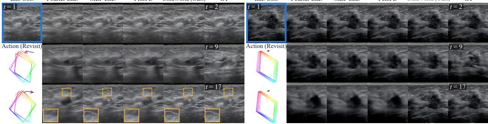  
Figure 9: Qualitative comparison under revisiting. UltraWorld and alternative conditioning methods predict future ultrasound frames from the same initial observation and prescribed trajectory. Comparisons with reference futures highlight differences in action following and the continuity of local tissue appearance.

## E ADDITIONAL RESULTS AND LIMITATIONS

## E.1 MASK-CONDITIONED GENERATOR EVALUATION

Generation fidelity. We evaluate the mask-conditioned ultrasound generator using both imagelevel and task-aware metrics. Generated videos achieve an SSIM of 0.4265 and an LPIPS of 0.4071. Following prior work evaluating synthetic ultrasound through downstream analysis (Yu et al., 2026a; Stojanovski et al., 2023), we additionally apply a pretrained ultrasound segmenter to generated and ground-truth frames. The resulting segmentations achieve a mean IoU of 0.8736, indicating that the generated videos preserve the relevant anatomical structures.

Mask controllability. We further evaluate whether the generated anatomy follows the prescribed mask trajectories. Comparing lesion regions segmented from generated frames with the conditioning masks yields a Dice score of 0.9260, compared with 0.9538 between ground-truth segmentations and the same masks. Frames without lesions in the conditioning masks are excluded. Metric and segmentation protocols are detailed in Appendix D.3.

## E.2 ACTION-CONDITIONED APPEARANCE DYNAMICS

A local 2D ultrasound observation can be compatible with different underlying 3D anatomies, leaving future sections only partially determined. Our focus is therefore on learning how scanning operations change ultrasound and anatomical appearance. Synthetic action–video pairs provides explicit supervision for these changes, while self-distillation transfers the resulting action–observation relationships into a model that predicts from local observations and actions.

Figure 9 extends Figure 6 to revisiting. UltraWorld shows more consistent responses to the prescribed operations while retaining plausible hypoechoic regions and surrounding tissue appearance. These results illustrate the transfer from generation under explicit anatomical control to predicting motion-induced visual changes while maintaining coherent local structure.

## E.3 ADDITIONAL WORLD-MODEL ROLLOUTS FOR ROBOTIC PLANNING

Figure 10 provides additional closed-loop robotic planning examples, showing UltraWorld rollouts together with the corresponding simulator executions and probe-pose errors to the goal over the planning process. These examples complement the representative episode shown in Fig. 8 of the main paper.

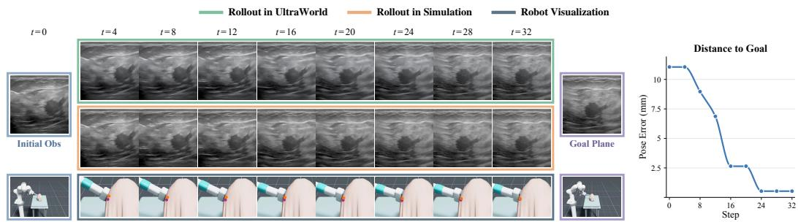

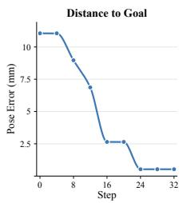  
2.5PosFigure 10: Additional qualitative rollouts for robotic planning. Additional closed-loop examples Initial Obs Goal Plane 0 8 16 24 32showing UltraWorld rollouts and the corresponding simulator executions, together with the probepose error to the goal during planning.

Input  
Fourier Enc.  
MLP Enc.  
PRoPE  
UltraWorld (Ours)  
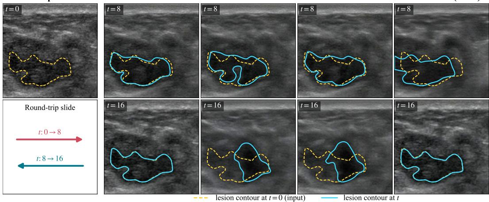  
Figure 11: Action-conditioned rollouts from real clinical ultrasound observations. Each method is initialized from the same real ultrasound image and follows a prescribed acquisition trajectory. The intermediate predictions visualize how the predicted anatomy evolves in response to the prescribed action.

## E.4 QUALITATIVE GENERALIZATION TO REAL CLINICAL ULTRASOUND

To complement the quantitative real-clinical evaluation in Table 3, we visualize action-conditioned predictions initialized from unseen clinical ultrasound images in Fig. 11. The qualitative examples illustrate how the predicted anatomy evolves in response to prescribed acquisition actions, while the round-trip results in Table 3 evaluate whether the prediction returns close to the initial observation after a forward-and-return trajectory. Because paired future observations are unavailable, these experiments assess action-sensitive behavior and recovery consistency rather than direct future-prediction fidelity.

## E.5 COUNTERFACTUAL ACQUISITION TRAJECTORIES

We additionally evaluate action sensitivity by applying alternative prescribed acquisition trajectories to the same initial observation, as illustrated in Fig. 12. These counterfactual examples isolate the effect of the conditioning trajectory: the visual context is fixed, while the requested probe motion or imaging configuration is changed. As shown in Fig. 12, different prescribed trajectories lead to different predicted anatomical evolutions, highlighting whether each action conditioning method can produce distinct and plausible motion-dependent responses.

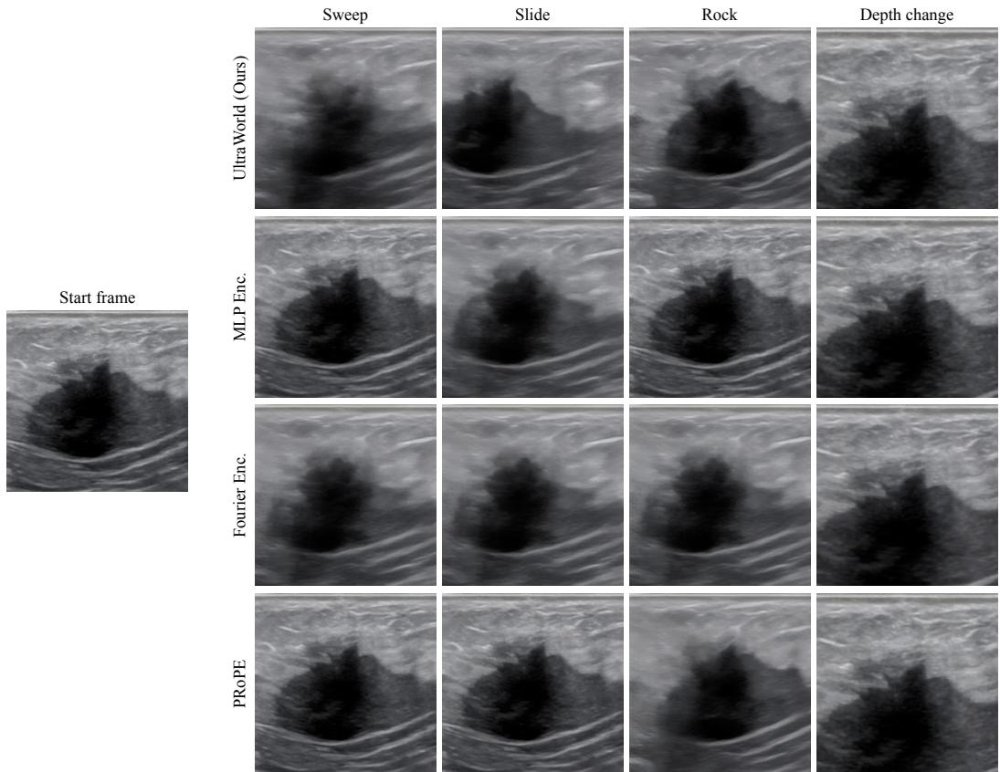  
Figure 12: Counterfactual predictions under alternative acquisition trajectories. Starting from the same ultrasound observation, we prescribe sweep, slide, rock, and depth-change trajectories and compare the resulting predictions across action conditioning methods.

## E.6 LIMITATIONS.

UltraWorld still has several limitations. First, the world model is trained primarily with generatorsynthesized action–video trajectories rather than real ultrasound sequences with synchronized probe tracking, so errors or biases in the generative prior may propagate to the distilled world model. Second, AsMap represents acquisition geometry but does not explicitly model tissue-dependent acoustic effects such as scattering, attenuation, and speckle formation, and its metric interpretation assumes calibrated probe poses and imaging geometry. Third, evaluation on real clinical ultrasound is limited to stability and round-trip consistency because paired future observations with known actions are unavailable, while closed-loop robotic planning is currently validated only in simulation and on a limited number of episodes. Future work will explore using a small amount of tracked clinical data for calibration and validation, while preserving the scalability of learning from largescale untracked clinical videos, as well as extending to broader anatomical and device domains and physical robotic systems.