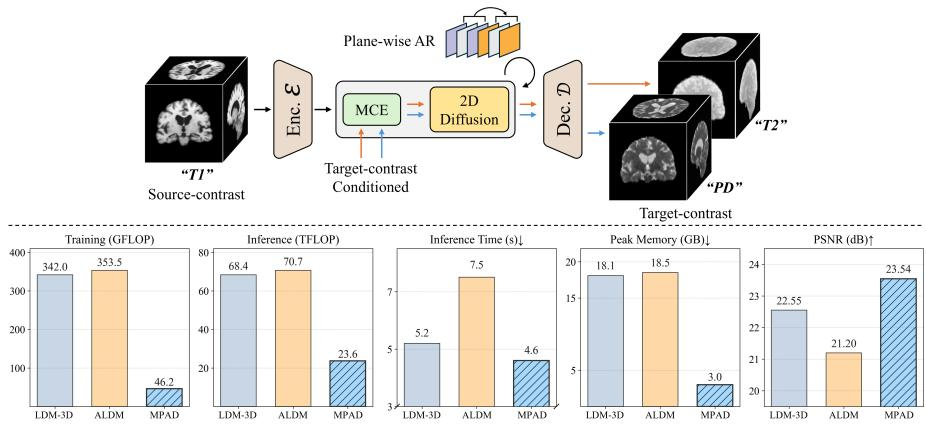
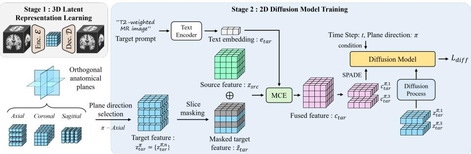
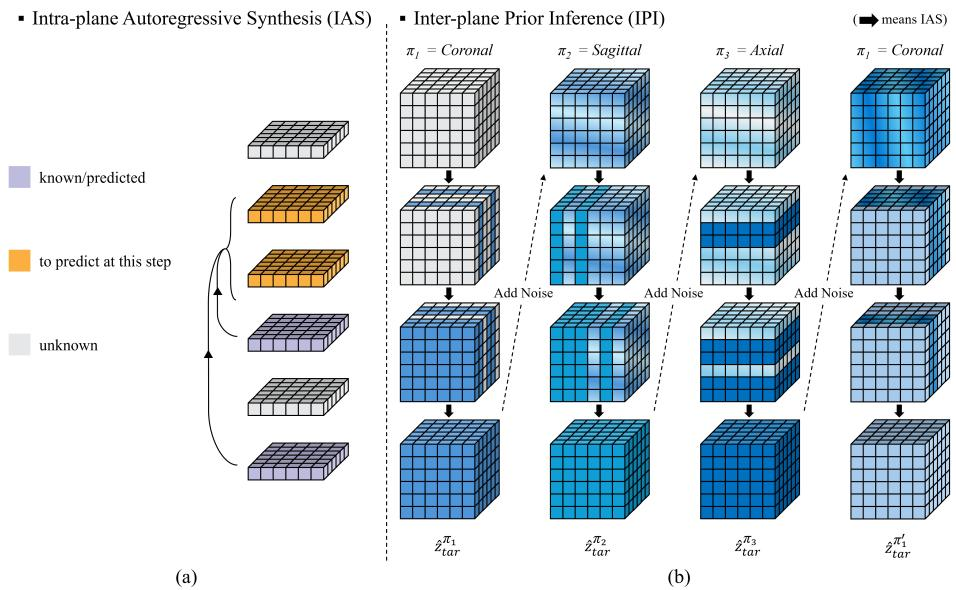
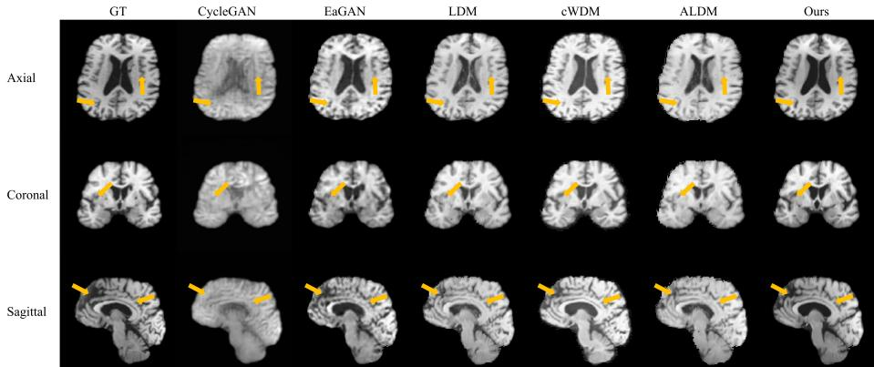
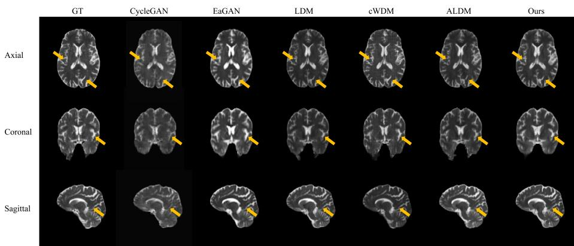

# Unified Multi-plane Autoregressive Difusion for 3D Multi-Contrast MRI Synthesis

Yejee Shin∗1, Geonhui Son∗†1,2, Jinglu Wang2, Minwoo Jung1, Yan Lu‡2, and Dosik Hwang‡1,3

1 Yonsei University

2 Microsoft Research Asia

3 Korea Institute of Science and Technology

Abstract. Acquiring a complete set of magnetic resonance imaging (MRI contrasts is time-intensive and uncomfortable for patients, despite the diagnostic value of multi-contrast imaging. This motivates synthesizing missing contrasts from those already acquired, which is an inherently 3D problem requiring anatomical coherence across axial, sagittal, and coronal planes. However, fully 3D generative models are often impractical under computational resources that scale cubically with volume size. We propose a unified Multi-Plane Autoregressive Difusion (MPAD), a latent difusion framework that achieves full-volume 3D synthesis using eficient plane-wise 2D operations while preserving volumetric coherence. A 3D autoencoder first compresses MRI scans into an isotropic 3D latent representation. A 2D difusion model is then trained to reconstruct masked latent slices of the target contrast, conditioned on both sourcecontrast slices and unmasked target-contrast slices. During inference, we introduce plane-wise autoregressive synthesis with inter-plane priors. Slices are generated autoregressively in random order within one plane orientation to maintain intra-plane continuity, then propagated as conditioning priors to orthogonal plane orientations to enforce inter-plane consistency. Compared to 3D latent difusion baselines, MPAD reduces training and inference FLOPs by 7× and 3×, respectively, while also lowering inference time and peak memory consumption. Experiments on multiple datasets demonstrate that MPAD achieves superior performance, generating high-fidelity 3D volumes and supporting one-to-many translation within a single unified model.

Keywords: Multi-contrast MRI · Synthesis · Difusion Model

## 1 Introduction

Magnetic resonance imaging (MRI) examinations routinely acquire multiple contrasts, each emphasizing diferent tissue characteristics and pathological cues.

  
Fig. 1: Overview of the proposed 3D multi-contrast MR image translation framework. Given a source-contrast (e.g., T1), the model synthesizes a target contrast (e.g., T2 or PD) in latent space using a Multi-modal Conditioning Encoder (MCE) and a 2D difusion model with plane-wise autoregressive synthesis. Bottom: Training FLOPs per iteration (GFLOPs), inference FLOPs per volume (TFLOPs), inference time, peak memory, and PSNR averaged across all translation tasks on the ADNI dataset.

However, collecting all contrasts for every subject increases acquisition time, elevates patient discomfort, and burdens scanner throughput; prolonged scans also heighten susceptibility to motion artifacts that degrade image quality [20,35,37]. The challenge is particularly severe for 3D volumetric acquisitions, which require substantially longer scan times due to their increased spatial coverage. This motivates the task of multi-contrast MR image synthesis, which aims to infer missing contrasts from acquired ones, enabling faster scans and more standardized imaging workflows.

Early work predominantly treated multi-contrast synthesis as a 2D imageto-image translation problem, learning mappings between contrasts such as T1- weighted to T2-weighted images. Generative adversarial networks (GANs) [11] and variational autoencoders (VAEs) [17] have been applied to convert slices between contrasts [7, 13, 14, 18, 29, 39]. Although efective in 2D applications, these methods lack modeling of 3D volumetric coherence, resulting in inter-plane inconsistencies and anatomical distortions that hinder their direct application to 3D data.

For 3D multi-contrast MR image synthesis, recent studies improve comprehensive spatial continuity by employing fully volumetric 3D generative architectures, including 3D GAN and 3D difusion models [3,26]. Although these models better capture anatomical structure, their computational and memory requirements grow cubically with volume size. This limits scalability, especially when a single model is expected to synthesize multiple target contrasts. Latent difusion frameworks [27] partly mitigate this by performing generation in a compressed latent space rather than directly in the high-dimensional image space. Nevertheless, even with latent compression, 3D latent difusion models face substantial practical constraints, including limited computational eficiency, prolonged inference time, and challenges in maintaining synthesis fidelity across multiple contrasts, all of which are critical considerations for real-world clinical applications.

In this paper, we aim to achieve eficient 3D multi-contrast MR image synthesis using a 2D difusion model. We propose a unified multi-plane autoregressive difusion (MPAD) synthesis framework that enables eficient slice-wise generation while preserving 3D anatomical consistency. First, we encode MR volumes into an isotropic latent representation with a 3D autoencoder, which allows for consistent slicing along any anatomical plane orientation. Then, a 2D difusion model is trained to reconstruct masked target-contrast slices conditioned on the source-contrast slices, unmasked target-contrast slices, and a text embedding specifying the desired target modality. By operating on 2D latent slices instead of full 3D volumes, our formulation avoids the cubic computational scaling of volumetric difusion while reducing cost and preserving volumetric conditioning.

At inference, MPAD performs volumetric synthesis through a novel multiplane autoregressive strategy that generates 2D slices across orthogonal planes, enforcing global 3D structural coherence. Within each plane orientation, slices are generated autoregressively in random order to maintain intra-plane continuity. Crucially, when transitioning to an orthogonal plane orientation, the previously synthesized volume serves as a conditioning prior (inter-plane prior inference), progressively enriching the anatomical context and ensuring interplane consistency.

This plane-wise autoregressive strategy achieves substantial computational savings. As shown in Fig. 1, MPAD reduces training FLOPs by 7× and inference FLOPs by 3× compared to 3D latent difusion baselines, while also significantly reducing inference time and peak memory consumption. These improvements enable larger batch sizes, and practical deployment on standard GPUs. Beyond these computational benefits, MPAD also achieves superior reconstruction quality compared to 3D baselines. In summary, our contributions are as follows:

– We introduce a novel framework that reformulates 3D multi-contrast MR image synthesis as an eficient 2D masked-slice prediction task, overcoming the computational limits of 3D models.

We propose a multi-plane autoregressive inference scheme that builds global 3D consistency from 2D operations using inter-plane priors.

– We demonstrate state-of-the-art eficiency and quality across multiple datasets, achieving 7× and 3× FLOP reductions in training and inference, significantly reduced inference time and peak memory, while improving synthesis fidelity.

## 2 Related Works

Multi-contrast MR image synthesis. Most previous studies in multi-contrast MR image synthesis have utilized 2D slice-based generative models, including

GANs and difusion models, to achieve strong fidelity in one-to-one or manyto-many translations. A representative many-to-many method is MM-GAN [29], which synthesizes multiple missing sequences in a single forward pass. Subsequently, difusion-based methods like M2DN [22] and APT [30] were introduced to overcome typical GAN limitations such as mode collapse and limited diversity. However, when applied to 3D volume synthesis in a slice-by-slice manner, a fundamental limitation of these 2D approaches is their lack of explicit mechanisms to ensure volumetric coherence, which often results in anatomical inconsistencies between adjacent slices.

To address this, some works have explored full 3D volumetric synthesis. Methods in this category range from direct 3D adaptations of 2D architectures [21] to more sophisticated models like cWDM [10], which applies difusion to 3D wavelet coeficients. In parallel, 2D/2.5D approaches attempt to approximate volumetric coherence by exchanging information between neighboring slices [8, 12]. While these eforts confirm the importance of 3D consistency, they struggle to enforce long-range dependencies without incurring the prohibitive cost of true 3D generation. This creates a clear need for a framework that can achieve global 3D coherence eficiently, without relying on a full 3D generative model.

Latent difusion for 3D MRI. Recent advances in latent difusion [27] have enabled high-fidelity volumetric MR image generation. Generative models like Medical Difusion [15] and BrainLDM [24] learn a 3D generative prior over the latent space of medical images. Make-A-Volume [41] restores 3D consistency by adding lightweight volumetric layers to a 2D slice-wise model, while the Volumetric Conditioning Module (VCM) [4] introduces a plug-in module for data-eficient control of pretrained 3D models. Adaptive Latent Difusion (ALDM) [16] employs a 3D autoencoder with switchable SPADE [23] blocks for multi-contrast conditioning. While these methods validate the potential of latent difusion for preserving volumetric context, their reliance on 3D denoising networks keeps computational requirements substantial.

Autoregressive image generation. Autoregressive (AR) generative models predict image content sequentially by conditioning each output on previously generated ones. Early AR models such as PixelRNN and PixelCNN [28, 33] operated directly in pixel space, and their sequential nature led to high computational cost. Subsequent approaches shifted to token-based generation, where images are first discretized into latent tokens. Models like DALL-E [25] and VQ-GAN [9] demonstrated that AR prediction over learned latent codes yields higher fidelity with substantially reduced complexity. Eficiency was further improved with masked prediction and parallel decoding strategies, as seen in MaskGIT [6] and multi-scale token prediction models such as VAR [31]. More recent hybrid approaches introduce continuous token modeling, e.g., GIVT [32] uses Gaussian mixture prediction, while MAR [19] integrates difusion-based denoising into the AR decoding loop.

We adapt the core principle of autoregression (AR) for 3D MR image synthe sis by factorizing a volume into sequences of 2D slices. Our approach propagates anatomical context across orthogonal planes, enforcing global 3D coherence while retaining the eficiency of slice-wise 2D difusion and avoiding the memory footprint of full 3D models.

  
Fig. 2: Overview of the proposed training framework for 3D multi-contrast MR image synthesis. Stage 1: A 3D autoencoder encodes MR volumes into isotropic latent representations. Stage 2: A 2D difusion model generates target-contrast latent slices conditioned on source-contrast slices, unmasked target-contrast slices, and text embeddings specifying the target modality. The Multi-modal Conditioning Encoder (MCE) fuses source and target features, which are then injected into the 2D difusion model via SPADE modulation layers.

## 3 Method

We propose MPAD, a framework for 3D multi-contrast MR image synthesis using a 2D autoregressive difusion model operating in latent space. Training consists of two stages: (i) learning an isotropic 3D latent representation with a 3D autoencoder, and (ii) training a 2D latent difusion model to reconstruct randomly masked target-contrast slices conditioned on source-contrast slices, both encoded in the 3D latent space. An overview of the training framework is illustrated in Fig. 2. At inference, we introduce a novel multi-plane autoregressive difusion strategy. MPAD performs two coupled procedures: Intra-plane Autoregressive Synthesis (IAS) and Inter-plane Prior Inference (IPI). IAS generates slices sequentially within each anatomical plane orientation to maintain intra-plane continuity, while IPI propagates previously generated volumes as inter-plane priors to enforce 3D structural coherence across orthogonal orientations. By combining these mechanisms, MPAD achieves eficient slice-wise generation with global 3D consistency.

## 3.1 3D Latent Representation Learning

Let $X \in \mathbb { R } ^ { H \times W \times D \times C }$ denote a 3D MR image volume. Following LDM [27], we first train a KL-regularized autoencoder to compress data. The 3D autoencoder, parameterized by the encoder–decoder pair (E, D), maps an input volume to a latent tensor $z \in \mathbb { R } ^ { h \times w \times d \times c }$ and reconstructs it from this latent representation:

$$
\operatorname* { m i n } _ { \varepsilon , \mathscr { D } } \mathcal { L } _ { \mathrm { a e } } ( X , \hat { X } ) \quad \mathrm { s . t . } \quad z = \mathscr { E } ( X ) , \ \hat { X } = \mathscr { D } ( z ) ,\tag{1}
$$

where the overall objective $\mathcal { L } _ { \mathrm { a e } }$ combines a reconstruction loss, a KL penalty on the approximate posterior, and an adversarial loss [11]. This stage produces isotropic 3D latent features that support slicing along any spatial plane without geometric bias.

## 3.2 2D Difusion Training for Anatomical Planes

Given a source contrast $X _ { s r c }$ and target contrast $X _ { t a r } .$ , we extract their latent features as $z _ { s r c } = \mathcal { E } ( X _ { s r c } )$ and $z _ { t a r } = \mathcal { E } ( X _ { t a r } )$ . At each training iteration, a plane orientation $\pi \in$ {axial, coronal, sagittal} is sampled randomly. For each plane orientation $\pi ,$ the target latent $z _ { t a r }$ is sliced along π and we denote the stacked slices as:

$$
z _ { t a r } = z _ { t a r } ^ { \pi } = \{ z _ { t a r } ^ { \pi , n } \} _ { n = 1 } ^ { N _ { s } } ,\tag{2}
$$

where $N _ { s }$ is the number of slices along that plane $( N _ { s } \ : = \ : h , w , d )$ . A random subset of slice indices is masked to form a partially masked 3D latent $\tilde { z } _ { t a r }$

To inject target-contrast information, we encode the target prompt (e.g., “T2-weighted MR image”) with a pretrained multi-modal foundation model to obtain a text embedding denoted as $e _ { \mathrm { t a r } } .$ A 3D Multi-modal conditioning encoder (MCE) then produces conditioning features:

$$
c _ { \mathrm { t a r } } = \mathrm { M C E } ( z _ { \mathrm { s r c } } \oplus \tilde { z } _ { \mathrm { t a r } } , e _ { \mathrm { t a r } } ) ,\tag{3}
$$

$$
c _ { \mathrm { t a r } } = \{ c _ { \mathrm { t a r } } ^ { \pi , n } \} _ { n = 1 } ^ { N _ { s } } .\tag{4}
$$

The prompt is encoded by BioMedCLIP [38] to yield $e _ { \mathrm { t a r } }$ , which provides semantic guidance for the desired output contrast [5].

To modulate intermediate 2D latent features with target-contrast information, we leverage spatially adaptive normalization (SPADE) [23] at each layer of the difusion model. Given the 3D conditioning features $c _ { \mathrm { t a r } }$ from MCE, we extract the corresponding 2D slice $c _ { \mathrm { t a r } } ^ { \pi , n }$ aligned with the current slice position n along the plane orientation π. The modulation of a latent feature map is defined as:

$$
\begin{array} { r l } & { \mathrm { S P A D E } ( z _ { \mathrm { t a r } } ^ { \pi , n } , c _ { \mathrm { t a r } } ^ { \pi , n } ) } \\ & { \mathrm { ~ } = \big ( 1 + \gamma ( c _ { \mathrm { t a r } } ^ { \pi , n } ) \big ) \odot \mathrm { N o r m } ( z _ { \mathrm { t a r } } ^ { \pi , n } ) + \beta ( c _ { \mathrm { t a r } } ^ { \pi , n } ) , } \end{array}\tag{5}
$$

where $\gamma ( c _ { \mathrm { t a r } } ^ { \pi , n } )$ and $\beta ( c _ { \mathrm { t a r } } ^ { \pi , n } )$ are spatially varying modulation parameters inferred from the 2D conditioning slice, allowing the model to inject target-contrast cues at each spatial location. This layer-wise conditioning enables locally adaptive synthesis that aligns the generative process with the desired contrast.

The 2D difusion model operates on individual latent slices. The model predicts target slices $z _ { \mathrm { t a r } } ^ { \pi , n }$ for masked positions, conditioned on the slice-level features $c _ { \mathrm { t a r } } ^ { \pi , \bar { n } }$ and the plane identity π. Following the standard noise-prediction objective in difusion models, we minimize

$$
\begin{array} { r } { \mathcal { L } _ { \mathrm { d i f f } } = \mathbb { E } _ { \epsilon , t } \left[ \| \epsilon - \epsilon _ { \theta } ( z _ { t a r , t } ^ { \pi , n } , t , c _ { t a r } ^ { \pi , n } , \pi ) \| _ { 2 } ^ { 2 } \right] , } \end{array}\tag{6}
$$

  
Fig. 3: (a): Random-order slice prediction within each plane, where slices are generated sequentially conditioned on previously predicted slices (purple) while unknown slices (gray) remain to be synthesized. (b): Four-pass generation process across planes. The first plane $\pi _ { 1 }$ is generated from pure noise at timestep T. Subsequent planes $\pi _ { 2 }$ and π3 start from a smaller timestep $\tau$ using previously completed planes as priors. A refinement pass on $\pi _ { 1 }$ incorporates information from all planes. The four candidates are aggregated via voxel-wise averaging to produce the final output.

where $\epsilon _ { \theta }$ denotes the denoising network, $z _ { t a r , t } ^ { \pi , n }$ is the noisy latent at timestep t, and ϵ is sampled from $\mathcal { N } ( 0 , I )$ . During training, slices from diferent anatomical planes are jointly batched, so that the network is agnostic to the choice of plane orientation while capturing anatomical structure that is consistent across orientations.

## 3.3 Plane-wise Autoregressive Synthesis

At inference, we synthesize the target latent volume $\hat { z } _ { t a r }$ autoregressively along multiple plane orientations, as illustrated in Fig. 3. The inference process operates through two coupled mechanisms. Intra-plane autoregressive synthesis (IAS) generates slices sequentially within each plane orientation to maintain spatial continuity. Inter-plane prior inference (IPI) leverages previously generated latent volumes as initialization priors for subsequent plane orientations, enforcing cross-plane consistency.

Intra-plane Autoregressive Synthesis. Plane-wise synthesis along plane π follows an autoregressive factorization. The conditional probability $p \left( \hat { z } _ { t a r } ^ { \pi } \mid c _ { t a r } \right)$

takes the form:

$$
p \left( \hat { z } _ { t a r } ^ { \pi } \mid c _ { t a r } \right) = \prod _ { n = 1 } ^ { N _ { s } } p \left( \hat { z } _ { t a r } ^ { \pi , n } \mid \hat { z } _ { t a r } ^ { \pi , < n } , c _ { t a r } \right) ,\tag{7}
$$

where $\hat { z } _ { \mathrm { t a r } } ^ { \pi , < n }$ denotes all previously generated slices. The slice generation order is randomly sampled within each plane orientation. The plane orientation order $( \pi _ { 1 } , \pi _ { 2 } , \pi _ { 3 } )$ is defined as a permutation of {coronal, sagittal, axial}.

For the first plane orientation $\pi _ { 1 } .$ , each slice is initialized from Gaussian noise and a reverse difusion procedure is performed using the denoising network ϵθ starting from the maximum timestep T. At each slice position n and timestep t, all previously generated slices are encoded through MCE to produce a conditioning vector. The network then uses this conditioning, along with the timestep and plane identifier, to predict the denoised latent slice. IAS ensures smooth transitions and anatomical continuity across slices through sequential conditioning within a plane.

Inter-plane Prior Inference. For subsequent planes $\pi _ { k } .$ , IPI leverages previously completed latent volume as priors by initializing from a smaller intermediate timestep $\tau < T$ rather than pure noise. Specifically, for each slice position n along plane $\pi _ { k } .$ , we extract the corresponding slice from previously completed volumes and apply forward difusion to reach timestep τ . We then perform reverse difusion from $\tau$ to 0, conditioned on previously generated slices $\hat { z } _ { t a r } ^ { \pi _ { k } , < n }$ source latents $z _ { s r c } ,$ and target text embedding $e _ { t a r }$ . After completing all three planes, IPI performs a refinement pass on the first plane $\pi _ { 1 } .$ , again starting from timestep τ by extracting slices from all three completed volumes. This produces a refined candidate $\hat { z } _ { t a r } ^ { \pi _ { 1 } ^ { \prime } }$ that incorporates information from all anatomical planes. By starting from a smaller timestep τ for planes with available priors, IPI reduces sampling steps while maintaining spatial consistency across the volume. The four candidates $\{ \hat { z } _ { t a r } ^ { \pi _ { 1 } } , \hat { z } _ { t a r } ^ { \pi _ { 2 } } , \hat { z } _ { t a r } ^ { \pi _ { 3 } } , \hat { z } _ { t a r } ^ { \pi _ { 1 } ^ { \prime } } \}$ are aggregated using voxel-wise averaging:

$$
\hat { z } _ { t a r } = \frac { 1 } { 4 } \left( \hat { z } _ { t a r } ^ { \pi _ { 1 } } + \hat { z } _ { t a r } ^ { \pi _ { 2 } } + \hat { z } _ { t a r } ^ { \pi _ { 3 } } + \hat { z } _ { t a r } ^ { \pi _ { 1 } ^ { \prime } } \right) .\tag{8}
$$

The final output volume is obtained by decoding the aggregated latent: $\hat { X } _ { t a r } =$ $\mathcal { D } ( \hat { { z } } _ { t a r } )$ . This multi-view aggregation ensures isotropic quality and reduces planespecific artifacts by combining complementary information from all three anatomical orientations.

## 4 Experiments and Analysis

## 4.1 Datasets

We conduct experiments on two publicly available brain MRI datasets: ADNI [1] and IXI [2]. ADNI consists of 737 MRI volumes from patients with Alzheimer’s disease, acquired exclusively with 1.5T GE Medical Systems scanners. The protocol includes T1-weighted (T1w), T2-weighted (T2w), and proton densityweighted (PDw) sequences. IXI comprises 577 brain MRI volumes from healthy participants collected at diferent sites with varying acquisition parameters. The scans were obtained using 1.5T and 3T Philips scanners and include T1w, T2w, and PDw contrasts. For both ADNI and IXI, we randomly select 100 subjects for evaluation and use all remaining subjects for training. More details are provided in the supplementary material.

## 4.2 Implementation Details

We adopt a two-stage training strategy following the Latent Difusion Model (LDM) [27] framework. In the first stage, we train a KL-regularized autoencoder to learn a compact latent representation of the 3D MRI volumes. The encoder compresses each volume into a latent space with 3 channels at $3 2 \times 3 2 \times 3 2$ resolution, and the decoder reconstructs the original resolution volume. The autoencoder employs a 3D CNN architecture with channel multipliers of 1, 2, and 4, and two residual blocks per resolution level. We train the autoencoder for 1000 epochs. In the second stage, we train a 2D CNN-based difusion model in the learned latent space. The UNet backbone consists of 2 residual blocks per level and 32 channels per attention head. We employ a linear noise schedule ranging from $\beta _ { 1 } = 0 . 0 0 1 5$ to $\beta _ { T } = 0 . 0 1 9 5$ over $T = 1 0 0 0$ difusion steps. During training, we apply random masking to the target latent slices with masking ratios uniformly sampled between 0.7 and 1.0. We use the AdamW optimizer with a learning rate of $4 \times 1 0 ^ { - 6 }$ and train for 1000 epochs. To ensure a fair comparison, we train all competing methods for the same number of epochs.

At inference, we perform autoregressive generation along three orthogonal planes using 10 DDIM steps. For the first plane, generation starts from random noise with the 10 timesteps. For subsequent planes, we leverage the previously generated volume as a prior and perform sampling using only 2 timesteps starting from an intermediate timestep τ , thereby significantly reducing computational cost. We quantitatively evaluate synthesis performance using three metrics: peak signal-to-noise ratio (PSNR) (dB), structural similarity index (SSIM) [34], and normalized mean squared error (NMSE).

## 4.3 Comparison Results

We compare our method against five approaches for 3D MR image synthesis: two generative adversarial networks [36, 40] and three difusion-based methods [10,16,27]. Among these methods, only ALDM [16] has the one-to-many synthesis capability as ours, whereby a single model handles multiple target contrasts. The remaining baselines are trained separately for each contrast pair.

Table 1 and Table 2 present quantitative comparisons on the ADNI and IXI datasets, respectively. Our method achieves competitive or superior performance across all contrast pairs and metrics. On the ADNI dataset, we obtain the highest SSIM scores in five out of six synthesis tasks and consistently achieve the lowest NMSE, demonstrating robust synthesis quality. Notably, for challenging tasks such as PD→T1 and PD→T2, our method significantly outperforms all baselines, improving PSNR by over 2 dB compared to the second-best method.

Table 1: Quantitative comparison on the ADNI dataset. All metrics are evaluated on 3D volumes. Best scores are bolded.
<table><tr><td></td><td></td><td>T1 → T2</td><td></td><td></td><td>T1 → PD</td><td></td><td></td><td>T2 → T1</td><td></td><td></td><td>T2 → PD</td><td></td><td></td><td>PD → T1</td><td></td><td></td><td>PD → T2</td><td></td></tr><tr><td>Method</td><td></td><td></td><td></td><td></td><td></td><td></td><td></td><td></td><td></td><td></td><td></td><td></td><td></td><td></td><td></td><td></td><td>PSNR↑ SSIM↑ NMSE↓ PSNR↑ SSIM↑ NMSE↓ PSNR↑ SSIM↑ NMSE↓ PSNR↑ SSIM↑ NMSE↓ PSNR↑ SSIM↑ NMSE↓ PSNR↑ SSIM↑ NMSE↓</td><td></td></tr><tr><td>CycleGAN-3D [40]</td><td>24.88</td><td>0.810</td><td>0.130</td><td>20.09</td><td>0.774</td><td>0.179</td><td>21.49</td><td>0.807</td><td>0.197</td><td>19.63</td><td>0.761</td><td>0.204</td><td>19.08</td><td>0.751</td><td>0.248</td><td>19.23</td><td>0.751</td><td>0.450</td></tr><tr><td>EaGAN [36]</td><td>21.72</td><td>0.826</td><td>0.273</td><td>19.80</td><td>0.815</td><td>0.203</td><td>21.14</td><td>0.829</td><td>0.199</td><td>20.32</td><td>0.834</td><td>0.184</td><td>19.54</td><td>0.779</td><td>0.269</td><td>20.42</td><td>0.784</td><td>0.362</td></tr><tr><td>LDM-3D [27]</td><td>22.89</td><td>0.803</td><td>0.214</td><td>23.59</td><td>0.816</td><td>0.085</td><td>21.63</td><td>0.817</td><td>0.161</td><td>25.29</td><td>0.843</td><td>0.068</td><td>19.82</td><td>0.772</td><td>0.261</td><td>22.07</td><td>0.785</td><td>0.257</td></tr><tr><td>cWDM [10]</td><td>22.79</td><td>0.814</td><td>0.221</td><td>23.58</td><td>0.763</td><td>0.072</td><td>21.26</td><td>0.825</td><td>0.158</td><td>23.44</td><td>0.779</td><td>0.081</td><td>18.03</td><td>0.747</td><td>0.399</td><td>14.69</td><td>0.651</td><td>1.337</td></tr><tr><td>ALDM [16]</td><td>20.77</td><td>0.770</td><td>0.352</td><td>22.96</td><td>0.797</td><td>0.099</td><td>20.15</td><td>0.789</td><td>0.236</td><td>24.00</td><td>0.816</td><td>0.085</td><td>19.15</td><td>0.754</td><td>0.307</td><td>20.15</td><td>0.751</td><td>0.412</td></tr><tr><td>MPAD</td><td>23.10</td><td>0.830</td><td>0.117</td><td>23.78</td><td>0.829</td><td>0.045</td><td>23.99</td><td>0.846</td><td>0.060</td><td>25.24</td><td>0.846</td><td>0.032</td><td>22.56</td><td>0.817</td><td>0.080</td><td>22.59</td><td>0.821</td><td>0.132</td></tr></table>

Table 2: Quantitative comparison on the IXI dataset. All metrics are evaluated on 3D volumes. Best scores are bolded.
<table><tr><td></td><td>PSNR↑ SSIM↑ NMSE↓ PSNR↑ SSIM↑ NMSE↓ PSNR↑ SSIM↑ NMSE↓</td><td>T1 → T2</td><td></td><td></td><td>T1 → PD</td><td></td><td></td><td>T2 → T1</td><td></td><td></td><td>T2 → PD</td><td></td><td></td><td>PD → T1</td><td></td><td></td><td>PD → T2</td><td></td></tr><tr><td>Method</td><td></td><td></td><td></td><td></td><td></td><td></td><td></td><td></td><td></td><td></td><td></td><td></td><td></td><td></td><td></td><td></td><td>↓ PSNR↑ SSIM↑ NMSE↓ PSNR↑ SSIM↑ NMSE↓ PSNR↑ SSIM↑ NMSE↓</td><td></td></tr><tr><td>CycleGAN-3D [40]</td><td>27.67</td><td>0.845</td><td>0.126</td><td>24.84</td><td>0.829</td><td>0.089</td><td>22.67</td><td>0.803</td><td>0.314</td><td>25.81</td><td>0.853</td><td>0.067</td><td>23.71</td><td>0.815</td><td>0.169</td><td>24.06</td><td>0.834</td><td>0.289</td></tr><tr><td>EaGAN [36]</td><td>26.17</td><td>0.874</td><td>0.202</td><td>22.75</td><td>0.874</td><td>0.149</td><td>23.66</td><td>0.878</td><td>0.345</td><td>23.70</td><td>0.888</td><td>0.130</td><td>22.90</td><td>0.870</td><td>0.360</td><td>24.07</td><td>0.873</td><td>0.329</td></tr><tr><td>LDM-3D [27]</td><td>28.79</td><td>0.878</td><td>0.107</td><td>27.74</td><td>0.880</td><td>0.044</td><td>27.66</td><td>0.884</td><td>0.112</td><td>29.09</td><td>0.889</td><td>0.034</td><td>28.33</td><td>0.881</td><td>0.070</td><td>30.31</td><td>0.881</td><td>0.070</td></tr><tr><td>cWDM [10]</td><td>24.62</td><td>0.853</td><td>0.319</td><td>27.28</td><td>0.870</td><td>0.057</td><td>20.86</td><td>0.836</td><td>0.526</td><td>26.26</td><td>0.862</td><td>0.086</td><td>24.53</td><td>0.850</td><td>0.235</td><td>21.98</td><td>0.836</td><td>0.585</td></tr><tr><td>ALDM [16]</td><td>29.32</td><td>0.874</td><td>0.087</td><td>27.28</td><td>0.875</td><td>0.049</td><td>27.98</td><td>0.883</td><td>0.127</td><td>28.31</td><td>0.885</td><td>0.040</td><td>27.15</td><td>0.876</td><td>0.111</td><td>29.48</td><td>0.877</td><td>0.084</td></tr><tr><td>MPAD</td><td>30.09</td><td>0.882</td><td>0.074</td><td>28.11</td><td>0.881</td><td>0.043</td><td>28.98</td><td>0.890</td><td>0.082</td><td>29.21</td><td>0.889</td><td>0.035</td><td>28.88</td><td>0.887</td><td>0.071</td><td>30.94</td><td>0.887</td><td>0.061</td></tr></table>

On the IXI dataset, our approach consistently ranks first across all metrics, with particularly strong performance on T2→T1 and PD→T2 synthesis. These results demonstrate that our autoregressive framework achieves synthesis quality superior to 3D difusion-based approaches while using only 2D denoising networks.

Fig. 4 and Fig. 5 show qualitative comparisons on representative slices from both datasets. In Fig. 4, we visualize T2→T1 synthesis results across axial, coronal, and sagittal views. CycleGAN-3D and EaGAN produce blurring and loss of fine details, particularly in white matter boundaries and cortical structures. While LDM-3D and cWDM preserve overall anatomical structure, they introduce intensity distortions in some regions. ALDM shows improved structural fidelity but exhibits misalignments in complex anatomical regions. Our method produces sharper boundaries and more accurate tissue contrast across all three orthogonal planes. Similar tendencies are observed in Fig. 5 for T1→T2 synthesis on the IXI dataset, where our approach demonstrates better preservation of ventricular boundaries, gray-white matter contrast, and anatomical details compared to baselines. The plane-wise autoregressive generation maintains spatial coherence without introducing slice-wise artifacts.

## 4.4 Ablation Results

Efect of Autoregressive Synthesis. We evaluate IAS along a single anatomical plane by varying the group size g, which controls how many slices are generated in parallel at each autoregressive step (Table 3). Relative to the non-AR baseline, introducing IAS consistently improves reconstruction quality on both ADNI and IXI. Smaller group sizes yield incremental but steady gains, as more autoregressive steps enable finer slice-to-slice dependency modeling. Notably, even the non-AR baseline achieves competitive performance. This was driven by two factors. First, the source-contrast information $z _ { s r c }$ is consistently provided for every slice, ofering reliable anatomical guidance throughout the volume regardless of whether previous target slices are available. Second, since this source information is encoded through the 3D multi-modal conditioning encoder (MCE), it inherently captures volumetric structure and spatial context. This 3D-aware source conditioning ensures that the 2D difusion model receives rich volumetric priors even without explicit autoregressive dependencies on previously generated target slices. However, autoregressive synthesis further improves upon this baseline by additionally providing previously generated target-contrast slices as conditioning, which explicitly enforces slice-to-slice continuity and refines local anatomical consistency in the target contrast. To balance accuracy and eficiency, we use g=4 in all experiments.

  
Fig. 4: Qualitative results on the ADNI dataset for T2→T1 synthesis. Each row shows axial, coronal, and sagittal views. Yellow arrows highlight anatomical regions where baseline methods show visible discrepancies compared to the ground truth (GT).

  
Fig. 5: Qualitative results on the IXI dataset for T1→T2 synthesis. Each row shows axial, coronal, and sagittal views. Yellow arrows highlight anatomical regions where baseline methods show visible discrepancies compared to the ground truth (GT).

Table 3: Ablation study on the autoregressive (AR) framework. PSNR and NMSE are averaged across all six translation tasks (T1↔T2, T1↔PD, T2↔PD) on ADNI and IXI datasets.
<table><tr><td>AR g</td><td colspan="2">ADNI IXI PSNR↑ NMSE↓ PSNR↑ NMSE↓</td></tr><tr><td>x -</td><td>22.79 0.089 28.89</td><td>0.064</td></tr><tr><td>√ 16</td><td>22.83 0.089 29.06</td><td>0.063</td></tr><tr><td>√ 4</td><td>22.85 0.089 29.08</td><td>0.063</td></tr><tr><td>1</td><td></td><td>0.061</td></tr><tr><td>√</td><td colspan="2">22.87 0.088 29.14</td></tr></table>

Table 4: Ablation study on multi-plane conditional encoding design. PSNR, SSIM, and NMSE are averaged across all six translation tasks (T1↔T2, T1↔PD, T2↔PD) on ADNI and IXI datasets. Each design choice is evaluated independently: MCE architecture (2D vs 3D convolution), masking type (learnable vs Gaussian noise), and prior information (of vs on). The first row in each block shows baseline performance, while the second row shows the performance change (∆) when switching the design. Bold values indicate the magnitude of improvement or degradation.
<table><tr><td rowspan="2"></td><td colspan="2">ADNI</td><td colspan="3">IXI</td></tr><tr><td>PSNR↑</td><td>SSIM↑</td><td>NMSE↓ PSNR↑</td><td>SSIM↑</td><td>NMSE↓</td></tr><tr><td rowspan="2">2D MCE</td><td>22.82</td><td>0.813 0.091</td><td>28.18</td><td>0.879</td><td>0.090</td></tr><tr><td>3D +0.72</td><td>+0.019</td><td>-0.013 +1.19</td><td>+0.007</td><td>-0.029</td></tr><tr><td rowspan="2">Learnable Masking Gaussian Noise</td><td>23.22</td><td>0.803 0.133</td><td>27.37</td><td>0.869</td><td>0.102</td></tr><tr><td>+0.32</td><td>+0.029 -0.055</td><td>+2.00</td><td>+0.017</td><td>-0.041</td></tr><tr><td rowspan="2">x Prior</td><td>22.42</td><td>0.795</td><td>0.087 27.49</td><td>0.873</td><td>0.098</td></tr><tr><td>√ +1.12</td><td>+0.037 -0.009</td><td>+1.88</td><td></td><td>+0.013-0.037</td></tr></table>

2D vs. 3D Multi-modal Conditioning Encoder. We compare 2D and 3D convolutional architectures in the multi-modal conditioning encoder (MCE). As shown in Table 4, the 3D architecture consistently outperforms its 2D counterpart across both datasets. The 2D architecture processes each slice independently, so conditioning features are encoded without through-plane context, which limits its ability to capture fully 3D anatomical structures. In contrast, 3D convolutions aggregate information across neighboring slices and depth, providing richer volumetric context and leading to more coherent volumes and stronger quantitative performance.

Masking Strategy. We evaluate two masking approaches during training: learnable mask tokens versus Gaussian noise. Table 4 shows that Gaussian noise masking substantially outperforms learnable tokens on both datasets. In our framework, the masked target latent is processed by MCE and then injected into the difusion model via SPADE. When using a learned mask token, masked regions are replaced with constant values that MCE can easily detect and potentially ignore, reducing the usefulness of target-side context. In contrast, Gaussian noise produces continuous, spatially varying corruptions that remain within the natural range of latent activations, forcing MCE to extract robust features from the partially noised target latent.

Table 5: Ablation study on multi-plane generation. PSNR, SSIM, and NMSE are averaged across all six translation tasks (T1↔T2, T1↔PD, T2↔PD) on ADNI and IXI datasets. Each row represents a diferent combination of planes used for generation. Checkmarks indicate which planes $\left( \pi _ { 1 } \colon \right)$ coronal, π : sagittal, π : axial, $\pi _ { 1 } ^ { \prime } \colon$ refined coronal) are generated and averaged. Best scores are bolded.
<table><tr><td colspan="4">Planes</td><td colspan="4">ADNI</td><td colspan="2">IXI</td></tr><tr><td>π1</td><td>π2 π3</td><td></td><td> $\overline { { \pi _ { 1 } ^ { \prime } } }$ </td><td>PSNR↑ SSIM↑</td><td>NMSE↓</td><td>PSNR↑</td><td>SSIM↑</td><td></td><td>NMSE↓</td></tr><tr><td>√</td><td></td><td></td><td></td><td>22.82</td><td>0.820</td><td>0.089</td><td>29.17</td><td>0.883</td><td>0.060</td></tr><tr><td></td><td>√ √</td><td></td><td></td><td>23.32</td><td>0.828</td><td>0.081</td><td>29.00</td><td>0.884</td><td>0.067</td></tr><tr><td>√</td><td></td><td>√</td><td></td><td>23.27</td><td>0.827</td><td>0.081</td><td>29.25</td><td>0.884</td><td>0.065</td></tr><tr><td></td><td></td><td>√√</td><td></td><td>23.33</td><td>0.827</td><td>0.079</td><td>29.15</td><td>0.885</td><td>0.064</td></tr><tr><td></td><td></td><td>√√√</td><td></td><td>23.49</td><td>0.830</td><td>0.078</td><td>29.29</td><td>0.886</td><td>0.062</td></tr><tr><td></td><td></td><td></td><td>√√√</td><td>23.54</td><td>0.832</td><td>0.078</td><td>29.37</td><td>0.886</td><td>0.061</td></tr></table>

Efect of Inter-plane Priors. We assess the impact of incorporating interplane priors from previously generated planes during multi-plane inference. Table 4 demonstrates that using priors consistently improves performance. Without priors, each plane is generated independently from pure noise and simply averaged, lacking cross-plane coordination. In contrast, incorporating inter-plane priors enables subsequent planes to leverage structural information from already completed planes, allowing the model to maintain anatomical consistency across orthogonal orientations. This use of inter-plane priors reduces the denoising burden by starting from a more informed initialization. It also enforces geometric constraints that prevent contradictory predictions between planes, ultimately enhancing both spatial coherence and overall image quality.

Table 6: Ablation study on the plane ordering for translation tasks (T1↔T2, T2↔PD, and PD↔T1) on the ADNI dataset.
<table><tr><td rowspan=1 colspan=1>Planes Ordering</td><td rowspan=1 colspan=1>PSNR ↑ SSIM ↑</td></tr><tr><td rowspan=1 colspan=1> $\pi _ { 3 } {  } \pi _ { 1 } {  } \pi _ { 2 } {  } \pi _ { 3 } ^ { \prime }$ </td><td rowspan=1 colspan=1>23.48  0.830</td></tr><tr><td rowspan=1 colspan=1> $\pi _ { 2 } {  } \pi _ { 3 } {  } \pi _ { 1 } {  } \pi _ { 2 } ^ { \prime }$ </td><td rowspan=1 colspan=1>23.49  0.830</td></tr><tr><td rowspan=1 colspan=1> $\pi _ { 1 } {  } \pi _ { 2 } {  } \pi _ { 3 } {  } \pi _ { 1 } ^ { \prime }$ </td><td rowspan=1 colspan=1>23.54  0.832</td></tr></table>

Efect of Multi-plane Generation. We analyze the efect of each anatomical plane and their combinations in our multi-plane generation framework. Table 5 shows a consistent trend of performance improvements as additional planes are incorporated. Starting from a single plane $\pi _ { 1 }$ (coronal), adding a second plane $\pi _ { 2 }$ (sagittal) already yields a noticeable gain in PSNR and SSIM on both ADNI and IXI, highlighting the benefit of complementary views. Generating along two orthogonal planes (e.g., $\pi _ { 2 }$ and $\pi _ { 3 } )$ leads to similar improvements, indicating that the advantage comes from multi-view information rather than a particular choice of plane. Using all three anatomical planes $( \pi _ { 1 } , \pi _ { 2 } , \pi _ { 3 } )$ further boosts performance, and an additional refinement pass on the first plane $\left( \pi _ { 1 } ^ { \prime } \right)$ after completing all three planes provides a small but consistent extra gain on both datasets. This refinement pass allows $\pi _ { 1 }$ to leverage information from all completed views, reducing plane-specific artifacts and leading to more isotropic visual quality. Overall, these results demonstrate that multi-plane generation with a final refinement step efectively aggregates complementary spatial information across orientations, yielding more consistent and higher-quality 3D synthesis.

Robustness of Plane Ordering. We analyze the robustness of plane ordering in the proposed IPI framework. As shown in Table 6, diferent generation orders yield nearly identical performance across all evaluation metrics, indicating that the synthesis process is largely invariant to the choice of plane sequence. This robustness arises because each plane is generated while conditioned on both source-contrast information and previously synthesized volumes, allowing anatomical context to be progressively accumulated regardless of ordering. Consequently, inter-plane priors provide complementary structural guidance rather than order-dependent constraints, enabling stable multi-plane aggregation and consistent volumetric reconstruction.

## 4.5 Discussion

While our method substantially reduces inference cost compared to existing difusion-based approaches (Fig. 1), the proposed multi-plane generation still involves sequential cross-plane refinement to enforce volumetric consistency. In our current implementation, reducing the number of inter-plane refinement iterations decreases inference time to approximately 1.8 s per volume, indicating further eficiency headroom without architectural changes. This reflects a controllable trade-of between inference speed and multi-plane consistency. Future work could explore more eficient aggregation mechanisms or parallel generation strategies to further accelerate inference while maintaining the benefits of multi-view consistency. Additionally, distillation techniques or fewer-step sampling methods may ofer promising directions for reducing the sampling burden without compromising synthesis quality.

## 5 Conclusion

We present MPAD, a latent-space framework for 3D multi-contrast MRI synthesis that achieves full-volume generation using only 2D difusion operations. A 3D autoencoder maps volumes to an isotropic latent representation that supports slicing along arbitrary plane orientations. The difusion model is trained to reconstruct masked target-contrast slices conditioned on source-contrast slices and target modality specification. At inference, plane-wise autoregressive generation with inter-plane priors and multi-plane aggregation enforces volumetric consistency without full 3D difusion operations. By reformulating volumetric synthesis as coordinated 2D latent difusion with structured cross-plane priors,

MPAD bridges computational eficiency and global 3D anatomical fidelity within a unified framework. Moreover, the controllable trade-of between inter-plane refinement and inference time highlights the practical flexibility of our approach, enabling adaptation to diferent deployment constraints. Future work includes further reducing sampling cost through distillation or parallelized multi-plane generation.

## Acknowledgements

This research was supported by the MSIT(Ministry of Science, ICT), Korea, under the Global Research Support Program in the Digital Field program(RS-2024- 00436680) supervised by the IITP(Institute for Information & Communications Technology Planning & Evaluation), and Microsoft Research Asia.

## References

1. The alzheimer’s disease neuroimaging initiative(adni). https://adni.loni.usc. edu/ (2025), accessed: 2025-08-30 8

2. Ixi - information extraction from images. https://brain-development.org/ixidataset/ (2025), accessed: 2025-08-30 8

3. Abramian, D., Eklund, A.: Generating fmri volumes from t1-weighted volumes using 3d cyclegan. arXiv preprint arXiv:1907.08533 (2019) 2

4. Ahn, S., Park, W., Cho, J., Park, J.: Volumetric conditioning module to control pretrained difusion models for 3d medical images. In: 2025 IEEE/CVF Winter Conference on Applications of Computer Vision (WACV). pp. 85–95. IEEE (2025) 4

5. Byeon, Y., Park, Y.W., Lee, S., Park, D., Shin, H., Han, K., Chang, J.H., Kim, S.H., Lee, S.K., Ahn, S.S., et al.: Interpretable multimodal transformer for prediction of molecular subtypes and grades in adult-type difuse gliomas. NPJ Digital Medicine 8(1), 140 (2025) 6

6. Chang, H., Zhang, H., Jiang, L., Liu, C., Freeman, W.T.: Maskgit: Masked generative image transformer. In: Proceedings of the IEEE/CVF conference on computer vision and pattern recognition. pp. 11315–11325 (2022) 4

7. Chen, R., Huang, W., Huang, B., Sun, F., Fang, B.: Reusing discriminators for encoding: Towards unsupervised image-to-image translation. In: Proceedings of the IEEE/CVF conference on computer vision and pattern recognition. p. 8168–8177 (2020) 2

8. Cho, J., Park, S., Park, J.: Two-stage approach for brain mr image synthesis: 2d image synthesis and 3d refinement. arXiv preprint arXiv:2410.10269 (2024) 4

9. Esser, P., Rombach, R., Ommer, B.: Taming transformers for high-resolution image synthesis. In: Proceedings of the IEEE/CVF conference on computer vision and pattern recognition. pp. 12873–12883 (2021) 4

10. Friedrich, P., Durrer, A., Wolleb, J., Cattin, P.C.: cwdm: Conditional wavelet difusion models for cross-modality 3d medical image synthesis. arXiv preprint arXiv:2411.17203 (2024) 4, 9, 10

11. Goodfellow, I.J., Pouget-Abadie, J., Mirza, M., Xu, B., Warde-Farley, D., Ozair, S., Courville, A., Bengio, Y.: Generative adversarial nets. Advances in neural information processing systems 27 (2014) 2, 6

12. Hu, Y., Kothapalli, S.V., Gan, W., Sukstanskii, A.L., Wu, G.F., Goyal, M., Yablonskiy, D.A., Kamilov, U.S.: Difgepci: 3d mri synthesis from mgre signals using 2.5 d difusion model. In: 2024 IEEE International Symposium on Biomedical Imaging (ISBI). pp. 1–4. IEEE (2024) 4

13. Isola, P., Zhu, J.Y., Zhou, T., Efros, A.A.: Image-to-image translation with conditional adversarial networks. In: Proceedings of the IEEE conference on computer vision and pattern recognition. p. 1125–1134 (2017) 2

14. Jang, H., Kim, H., Kim, S., Hwang, D.: Mint: Magnetic resonance image unsupervised translation via decoupling anatomical structure and contrast. Computers in Biology and Medicine 196, 110690 (2025) 2

15. Khader, F., Müller-Franzes, G., Tayebi Arasteh, S., Han, T., Haarburger, C., Schulze-Hagen, M., Schad, P., Engelhardt, S., Baeßler, B., Foersch, S., et al.: Denoising difusion probabilistic models for 3d medical image generation. Scientific Reports 13(1), 7303 (2023) 4

16. Kim, J., Park, H.: Adaptive latent difusion model for 3d medical image to image translation: Multi-modal magnetic resonance imaging study. In: Proceedings of the IEEE/CVF Winter conference on applications of computer Vision. pp. 7604–7613 (2024) 4, 9, 10

17. Kingma, D.P., Welling, M.: Auto-encoding variational bayes. arXiv preprint arXiv:1312.6114 (2013) 2

18. Kong, L., Lian, C., Huang, D., Hu, Y., Zhou, Q., et al.: Breaking the dilemma of medical image-to-image translation. Advances in Neural Information Processing Systems 34, 1964–1978 (2021) 2

19. Li, T., Tian, Y., Li, H., Deng, M., He, K.: Autoregressive image generation without vector quantization. Advances in Neural Information Processing Systems 37, 56424–56445 (2024) 4

20. Lustig, M., Donoho, D., Pauly, J.M.: Sparse mri: The application of compressed sensing for rapid mr imaging. Magnetic Resonance in Medicine: An Oficial Journal of the International Society for Magnetic Resonance in Medicine 58(6), 1182–1195 (2007) 2

21. Mahboubisarighieh, A., Shahverdi, H., Jafarpoor Nesheli, S., Alipoor Kermani, M., Niknam, M., Torkashvand, M., Rezaeijo, S.M.: Assessing the eficacy of 3d dualcyclegan model for multi-contrast mri synthesis. Egyptian Journal of Radiology and Nuclear Medicine 55(1), 118 (2024) 4

22. Meng, X., Sun, K., Xu, J., He, X., Shen, D.: Multi-modal modality-masked difusion network for brain mri synthesis with random modality missing. IEEE Transactions on Medical Imaging 43(7), 2587–2598 (2024) 4

23. Park, T., Liu, M.Y., Wang, T.C., Zhu, J.Y.: Semantic image synthesis with spatially-adaptive normalization. In: Proceedings of the IEEE/CVF conference on computer vision and pattern recognition. pp. 2337–2346 (2019) 4, 6

24. Pinaya, W.H., Tudosiu, P.D., Daflon, J., Da Costa, P.F., Fernandez, V., Nachev, P., Ourselin, S., Cardoso, M.J.: Brain imaging generation with latent difusion models. In: MICCAI workshop on deep generative models. pp. 117–126. Springer (2022) 4

25. Ramesh, A., Pavlov, M., Goh, G., Gray, S., Voss, C., Radford, A., Chen, M., Sutskever, I.: Zero-shot text-to-image generation. In: International conference on machine learning. pp. 8821–8831. Pmlr (2021) 4

26. Roca, V., Kuchcinski, G., Pruvo, J.P., Manouvriez, D., Lopes, R., et al.: Iguane: A 3d generalizable cyclegan for multicenter harmonization of brain mr images. Medical Image Analysis 99, 103388 (2025) 2

27. Rombach, R., Blattmann, A., Lorenz, D., Esser, P., Ommer, B.: High-resolution image synthesis with latent difusion models. In: Proceedings of the IEEE/CVF conference on computer vision and pattern recognition. pp. 10684–10695 (2022) 2, 4, 5, 9, 10

28. Salimans, T., Karpathy, A., Chen, X., Kingma, D.P.: Pixelcnn++: Improving the pixelcnn with discretized logistic mixture likelihood and other modifications. arXiv preprint arXiv:1701.05517 (2017) 4

29. Sharma, A., Hamarneh, G.: Missing mri pulse sequence synthesis using multi-modal generative adversarial network. IEEE transactions on medical imaging 39(4), 1170– 1183 (2019) 2, 4

30. Shin, Y., Lee, Y., Jang, H., Son, G., Kim, H., Hwang, D.: Anatomical consistency and adaptive prior-informed transformation for multi-contrast mr image synthesis via difusion model. In: Proceedings of the Computer Vision and Pattern Recognition Conference. pp. 30918–30927 (2025) 4

31. Tian, K., Jiang, Y., Yuan, Z., Peng, B., Wang, L.: Visual autoregressive modeling: Scalable image generation via next-scale prediction. Advances in neural information processing systems 37, 84839–84865 (2024) 4

32. Tschannen, M., Eastwood, C., Mentzer, F.: Givt: Generative infinite-vocabulary transformers. In: European Conference on Computer Vision. pp. 292–309. Springer (2024) 4

33. Van Den Oord, A., Kalchbrenner, N., Kavukcuoglu, K.: Pixel recurrent neural networks. In: International conference on machine learning. pp. 1747–1756. PMLR (2016) 4

34. Wang, Z., Bovik, A.C., Sheikh, H.R., Simoncelli, E.P.: Image quality assessment: from error visibility to structural similarity. IEEE transactions on image processing 13(4), 600–612 (2004) 9

35. Wood, M.L., Henkelman, R.M.: Mr image artifacts from periodic motion. Medical physics 12(2), 143–151 (1985) 2

36. Yu, B., Zhou, L., Wang, L., Shi, Y., Fripp, J., Bourgeat, P.: Ea-gans: edge-aware generative adversarial networks for cross-modality mr image synthesis. IEEE transactions on medical imaging 38(7), 1750–1762 (2019) 9, 10

37. Zaitsev, M., Maclaren, J., Herbst, M.: Motion artifacts in mri: A complex problem with many partial solutions. Journal of Magnetic Resonance Imaging 42(4), 887– 901 (2015) 2

38. Zhang, S., Xu, Y., Usuyama, N., Xu, H., Bagga, J., Tinn, R., Preston, S., Rao, R., Wei, M., Valluri, N., et al.: Biomedclip: a multimodal biomedical foundation model pretrained from fifteen million scientific image-text pairs. arXiv preprint arXiv:2303.00915 (2023) 6

39. Zhou, T., Fu, H., Chen, G., Shen, J., Shao, L.: Hi-net: hybrid-fusion network for multi-modal mr image synthesis. IEEE transactions on medical imaging 39(9), 2772–2781 (2020) 2

40. Zhu, J.Y., Park, T., Isola, P., Efros, A.A.: Unpaired image-to-image translation using cycle-consistent adversarial networks. In: Proceedings of the IEEE international conference on computer vision. pp. 2223–2232 (2017) 9, 10

41. Zhu, L., Xue, Z., Jin, Z., Liu, X., He, J., Liu, Z., Yu, L.: Make-a-volume: Leveraging latent difusion models for cross-modality 3d brain mri synthesis. In: International Conference on Medical Image Computing and Computer-Assisted Intervention. pp. 592–601. Springer (2023) 4