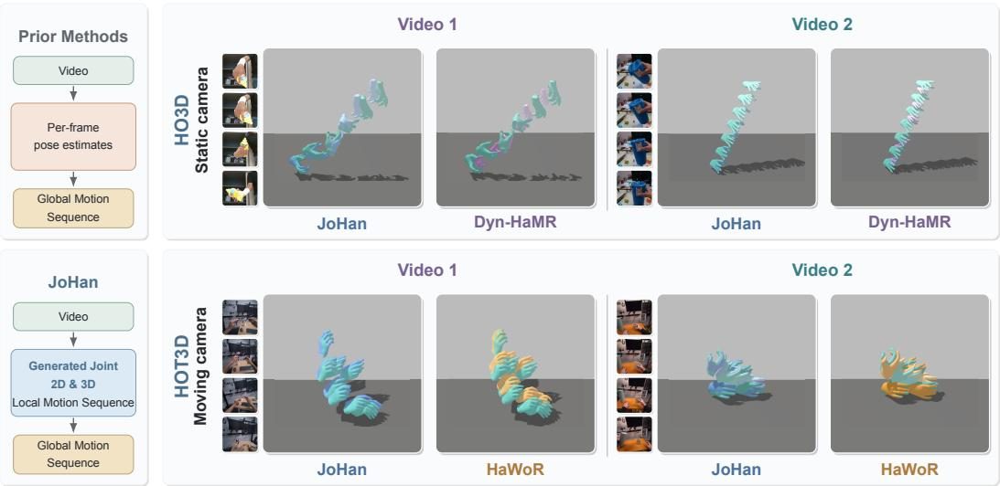
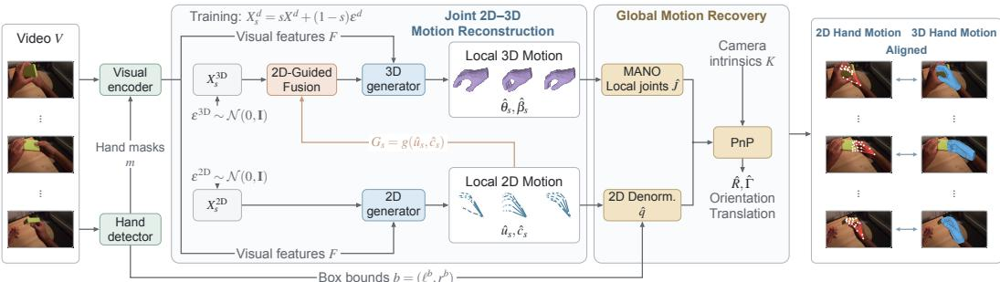
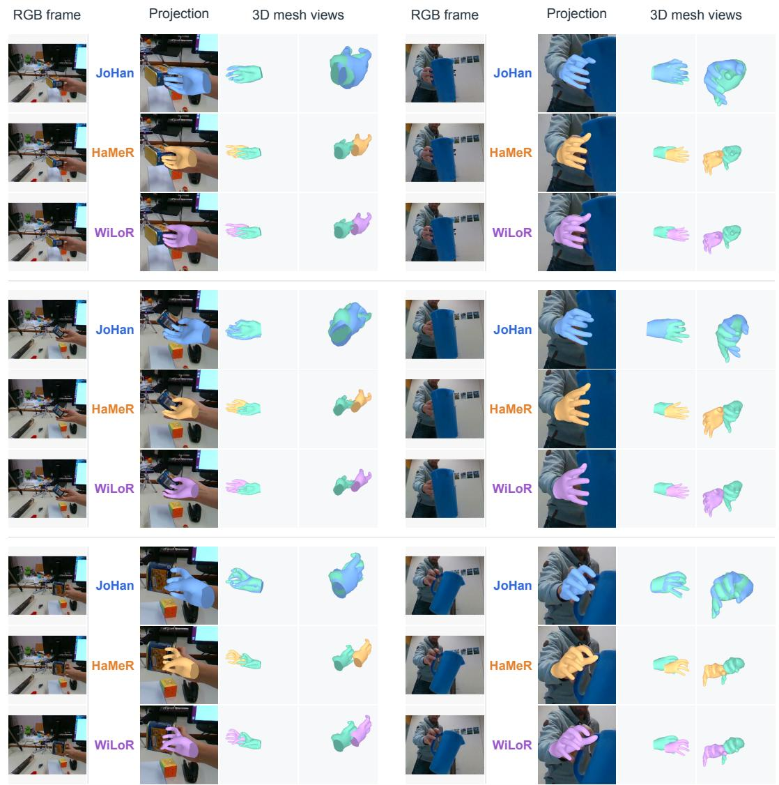
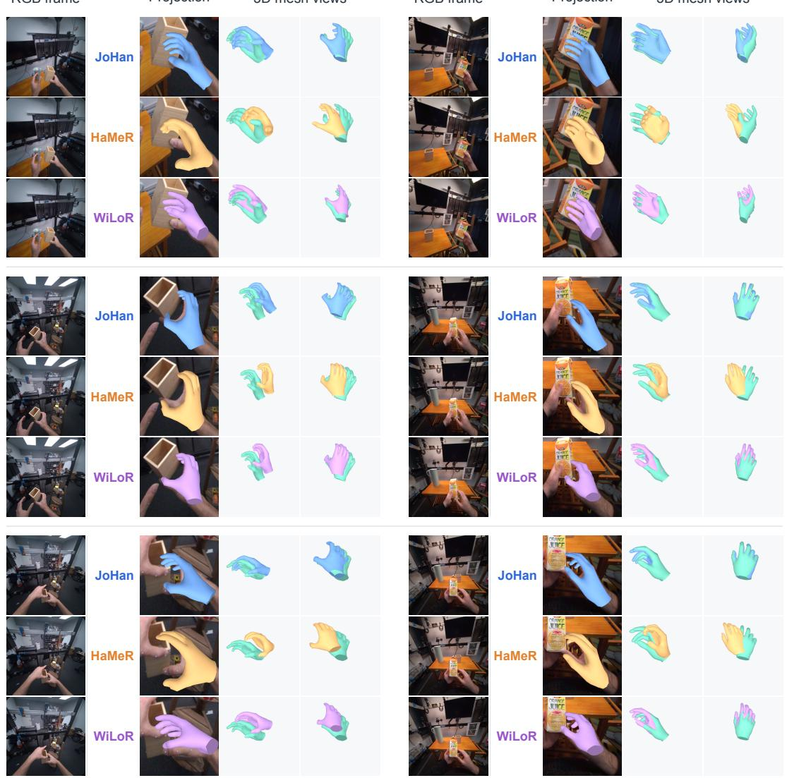
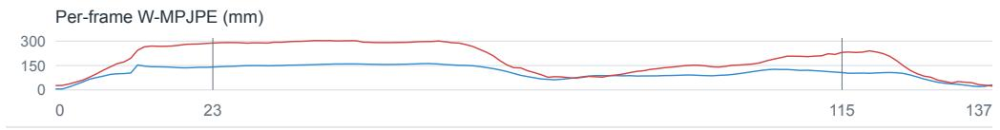
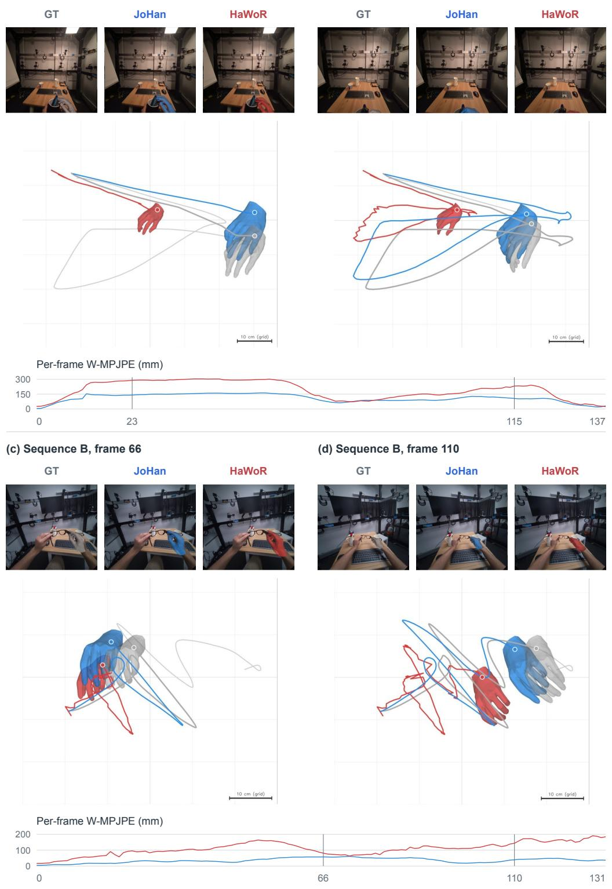
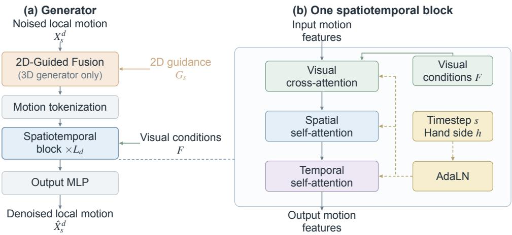

# VIDEO-CONDITIONED GENERATIVE JOINT 2D-3DHAND MOTION RECOVERY

Chen Xu1, Yunqi Li1, Binbin Huang1, Brent Yi2, Shenghua Gao1, Yi Ma 1The University of Hong Kong, 2UC Berkeley

## ABSTRACT

Recovering faithful 3D hand motion from video remains challenging due to frequent occlusions and incomplete visual observations, which make frame-wise pose estimates unreliable and temporally inconsistent. To address this problem, we propose JoHan, a unified generative framework that recovers hand motion directly from video sequences without relying on intermediate per-frame pose predictions. Trained from scratch, our model jointly generates aligned 2D and 3D local hand pose sequences by learning their temporal dynamics and crossrepresentation correspondence. The generated 2D trajectories exploit direct spatial and temporal cues from the 2D images to guide the following generative 3D motion reconstruction, while the learned motion prior promotes temporal consistency. Their learned 2D–3D correspondence further enables recovery of the hand’s global position and orientation relative to the camera. Extensive experiments on challenging benchmarks demonstrate significantly improved accuracy and speed in local hand-pose and camera-space reconstruction. Notably, our method captures much better hand-motion dynamics, producing significantly smoother motion than previous methods while maintaining high per-frame pose accuracy.

## 1 INTRODUCTION

Recovering hand motion from monocular video is a fundamental step toward understanding how people interact with the physical world. It plays an increasingly important role in applications such as augmented and virtual reality (AR/VR), robotics, and human behavior analysis (Xie et al., 2025; Qi et al., 2024; Wang et al., 2020; Liu et al., 2022). Despite its broad relevance, recovering temporally consistent hand motion remains challenging. Self-occlusion, occlusion by manipulated objects, and motion blur from rapid movement reduce the visual evidence available for hand reconstruction.

Many existing approaches formulate hand motion reconstruction as a deterministic estimation problem. They directly regress hand poses or motion from images or videos, without explicitly modeling the ambiguities arising from occlusion and motion blur (Pavlakos et al., 2024; Potamias et al., 2025; Zhang et al., 2025; Fu et al., 2023). Generative methods offer a natural way to address these ambiguities by learning a prior over plausible hand motion and generating pose sequences consistent with the observations. However, existing generative approaches often still rely on per-frame pose estimates, either as conditioning signals for motion generation (Sun et al., 2026; Xu et al., 2026) or as initial estimates for subsequent optimization with a learned motion prior (Duran et al., 2024; Yu et al., 2025). These approaches improve temporal consistency, but errors in the observations or initial poses can still affect the recovered sequence, particularly when occlusion persists.

A related limitation concerns 2D hand motion. 2D hand trajectories provide spatial and temporal evidence for reconstructing 3D motions, and are commonly used as observations (Duran et al., 2024; Xu et al., 2026; Potamias et al., 2025; Sun et al., 2026). However, their own continuity and dynamics are less explored. Since 2D and 3D motion are linked through geometric projection, errors and temporal inconsistencies in 2D trajectories can also compromise 3D motion recovery.

To address these issues, we propose JoHan, a unified generative framework that directly recovers hand motion from video by jointly generating 2D and 3D motion. Generative modeling enables the 3D branch to capture temporal hand dynamics and account for multiple plausible motions under ambiguous visual observations. However, 3D motion alone is only weakly constrained by image evidence due to inherent depth ambiguity. In contrast, 2D trajectories are directly grounded in pixelspace observations, and are capable of providing explicit guidance for 3D reconstruction through their correspondence with 3D joints. Jointly modeling the two modalities therefore combines the temporal and geometric expressiveness of 3D motion with the strong visual constraints of 2D trajectories, yielding more accurate 3D hand-motion recovery than 3D generation alone.

  
Figure 1: Joint motion generation and qualitative comparisons. Left: prior methods typically use per-frame pose estimates to condition or initialize global motion sequence reconstruction. JoHan jointly generates local 2D–3D motion sequences from video, followed by the global reconstruction. Right: world-space mesh sequences recovered from two videos from HO3D with a static camera (top, compared with Dyn-HaMR (Yu et al., 2025)) and two from HOT3D with a moving camera (bottom, compared with HaWoR (Zhang et al., 2025)). Methods are denoted by color: Ground truth, JoHan, Dyn-HaMR, and HaWoR. Selected input frames appear in temporal order from top to bottom.

Following HMP (Duran et al., 2024), we adopt a local 3D hand-motion representation, decoupling pose dynamics from global orientation and translation. We similarly normalize 2D motion to remove image-plane location and scale. The resulting local motions are jointly generated through a unified flow matching process: at each flow step, our 2D-Guided Fusion uses the evolving 2D motion to guide 3D generation. Our generators are trained from scratch and conditioned directly on full-frame video features, while cross-modal supervision promotes geometric consistency between the 2D and 3D predictions. Finally, we recover global hand motion from the resulting 2D–3D correspondences: after restoring the generated 2D poses to image coordinates, we use a PnP solver (Lepetit et al., 2009) to estimate the global orientation and translation of the hand relative to the camera.

We evaluate JoHan on HO3Dv2 (Hampali et al., 2020), HO3Dv3 (Hampali et al., 2021), and HOT3D (Banerjee et al., 2025). On HO3Dv3, it achieves a PA-MPJPE of 7.0 mm, a 2D joint error of 4.19 pixels, and the lowest MPJPE among the compared methods at 32.8 mm, supporting accurate local reconstruction and geometric global recovery. On HOT3D, it achieves a PA-MPJPE of 4.75 mm and an acceleration error of 2.69 m/s2, improving over HaWoR (Zhang et al., 2025) by 21.5% and 62.3%, respectively. As illustrated in Figure 1, JoHan generates temporally coherent and geometrically aligned 2D–3D motion directly from video, improving local pose and camera-space reconstruction while producing smoother motion.

Our main contributions are summarized as follows:

• We introduce JoHan, a unified generative framework that learns a hand motion distribution directly from video observations, without relying on pretrained per-frame pose estimators.

• We jointly generate aligned 2D and 3D local pose sequences within a shared motion generation process, modeling their temporal dynamics while providing 2D–3D correspondences for direct recovery of the hand’s global pose in the camera coordinate system.

• We demonstrate accurate hand reconstruction on both HO3Dv2 and HO3Dv3, and significantly smoother motion with accurate local poses on HOT3D. These results support the effectiveness and efficiency of JoHan across static and moving camera settings.

## RELATED WORK

Deterministic 3D Hand Estimation. Early approaches to 3D hand pose estimation relied on depth observations to provide geometric cues for model fitting and joint localization (Oikonomidis et al., 2011; Ge et al., 2016). The introduction of MANO (Romero et al., 2017) provided a compact parametric representation of hand shape and pose, and Boukhayma et al. (2019) proposed the first end-to-end framework for recovering MANO parameters from a single RGB image. More recently, HaMeR (Pavlakos et al., 2024) improved monocular hand reconstruction by scaling up both transformer-based architectures and training data, while WiLoR (Potamias et al., 2025) integrated hand localization, mesh reconstruction, and image-aligned refinement into an end-to-end framework. Video-based methods further exploit temporal context to improve robustness and motion consistency. Deformer (Fu et al., 2023) fused temporally aligned hand-mesh predictions to mitigate occlusion and motion blur. HaWoR (Zhang et al., 2025) reconstructed temporally coherent hand motion in camera space and combined it with camera trajectory estimation and motion infilling to recover complete hand trajectories in world coordinates. Despite their effectiveness, these methods use regression or model fitting to produce a single 3D pose or motion trajectory. They therefore cannot explicitly represent multiple plausible solutions when occlusion, motion blur, or depth ambiguity leaves the underlying hand motion underconstrained.

2D observations also provide valuable image-space constraints for 3D hand reconstruction, including reprojection supervision (Boukhayma et al., 2019; Pavlakos et al., 2024) and geometric refinement. HandTailor (Lv et al., 2021) refined an initially reconstructed hand mesh through optimization against image-space evidence, while HandDGP (Valassakis & Garcia-Hernando, 2024) leveraged 2D–3D keypoint correspondences in a differentiable global positioning module to recover cameraspace hand meshes. These methods demonstrate the value of 2D evidence for spatially aligning 3D hands with image observations. However, jointly modeling the temporal dynamics of 2D joint trajectories and their correspondence with 3D hand motion remains comparatively underexplored.

Generation-Based 3D Hand Reconstruction. Generative models represent pose and motion ambiguities through learned distributions from which plausible hypotheses can be sampled. Early work focused on single-frame hand poses. Crossing Nets (Wan et al., 2017) modeled hand poses using a variational autoencoder (VAE) and depth images using a generative adversarial network (GAN), connecting the two modalities through a shared latent space. This paradigm was subsequently extended to motion sequences. HMP (Duran et al., 2024) learned a VAE-based hand-motion prior from motion-capture data and recovered motion by optimizing its latent representation to match visual observations. Similarly, Dyn-HaMR (Yu et al., 2025) incorporated learned motion priors into a multi-stage optimization framework for reconstructing interacting hands. These approaches use generative priors to regularize reconstruction toward plausible and temporally coherent motion, but require iterative test-time optimization to fit each input sequence.

More recently, conditional generative models have enabled direct hand pose and motion reconstruction using diffusion or flow matching (Ho et al., 2020; Lipman et al., 2023). For individual poses, HHMR (Li et al., 2024) introduced controllable graph diffusion for hand-mesh generation and reconstruction under diverse conditions. For motion sequences, UniHand (Sun et al., 2026) employed latent diffusion to generate hand motion conditioned on visual and skeletal cues, while HandFlow (Xu et al., 2026) applied flow matching to generate sequences of hand parameters from visual features and 2D skeletal cues. These skeletal cues provide explicit image-space guidance complementary to visual features. In their default video-recovery settings, however, both methods obtain their 2D skeletal conditions from frame-wise HaMeR (Pavlakos et al., 2024) predictions, making motion generation dependent on these estimates while paying limited attention to the generation and refinement of 2D motion. In contrast, JoHan jointly generates local 2D and 3D hand motion through a unified video-conditioned flow, allowing the evolving 2D trajectories to guide 3D motion generation without requiring externally estimated poses as explicit conditioning signals.

## 2 METHODOLOGY

## 2.1 PROBLEM FORMULATION

Given a monocular video $V ~ = ~ ( I _ { 1 } , \ldots , I _ { T } )$ of $T$ RGB frames, JoHan aims to recover the 3D motion of a target hand specified by a hand-side label $h \in \{ \mathrm { l e f t } , \mathrm { r i g h t } \}$ . Each frame $I _ { t } \in \mathbb { R } ^ { H \times W \times 3 }$ has height H and width W. To provide auxiliary cues about the hand’s image-plane location and extent, we represent detector-predicted bounding boxes as binary masks $m = ( m _ { 1 } , . . . , m _ { T } )$ , where $m _ { t } \in \{ 0 , 1 \} ^ { \dot { H } \times W }$ . As illustrated in Figure 2, JoHan generates aligned local 2D and 3D hand-motion sequences $\overset { \cdot } { X } = ( X ^ { 2 \mathrm { D } } , X ^ { \mathrm { 3 D } } )$ conditioned on $C = ( \bar { V } , m , h )$ , where $X ^ { d } = ( x _ { 1 } ^ { d } , \dots , x _ { T } ^ { d } )$ denotes the motion sequence for $d \in \{ \mathrm { 2 D } , \mathrm { 3 D } \}$ , and $\boldsymbol { x } _ { t } ^ { d }$ denotes its local state at frame t. The generated 3D local motion is subsequently transformed into the camera coordinate system as a global motion using the global orientation and translation recovered through 2D–3D geometric alignment (Section 2.3).

  
Figure 2: Overview of JoHan. We first combine full-frame video features with encoded detectorderived hand masks m to form visual conditions F. Within the Joint 2D–3D Motion Reconstruction module, the 2D generator predicts clean local motion $\hat { X } _ { s } ^ { \mathrm { 2 D } }$ from the noisy state $X _ { s } ^ { \mathrm { 2 D } }$ at each flow step. This prediction is then encoded as guidance $G _ { s }$ for the 3D generator, allowing the predicted 2D geometry to inform 3D motion generation. After that, detector-derived bounds restore the imageplane location and scale of the generated 2D local poses. A PnP solver then uses these restored poses, the corresponding local MANO joints, and camera intrinsics K to recover global orientation $\hat { R }$ and translation $\hat { \Gamma } _ { }$ , which are used to place the reconstructed hands in the camera coordinate system.

Local Motion Representations. We represent 3D hand motion as a sequence of MANO (Romero et al., 2017) parameters, comprising hand pose $\theta _ { t } ,$ , shape $\beta _ { t } .$ , global orientation $R _ { t } .$ , and translation $\Gamma _ { t }$ at each frame. Following HMP (Duran et al., 2024), we distinguish global and local hand motion. Global orientation and translation together define the rigid transformation that places the local MANO hand in the camera coordinate system, whereas removing this transformation leaves the local motion of the hand joints relative to one another. The local 3D state is therefore $x _ { t } ^ { \mathrm { 3 D } } = \left( \theta _ { t } , \beta _ { t } \right)$ which MANO maps to 3D joints $J _ { t } \ = \ \mathcal { I } ( \theta _ { t } , \beta _ { t } ) \ \in \ \mathbb { R } ^ { 2 1 \times 3 }$ . Here, $J _ { t , j }$ denotes the position of joint $j \in \{ 1 , \ldots , \bar { 2 } 1 \}$ at frame t in the MANO model coordinate system, before applying global orientation $R _ { t }$ and translation $\Gamma _ { t }$ . The corresponding camera-space joints are denoted by $J _ { t } ^ { \mathrm { { \bar { c a m } } } }$

While global motion is less constrained and varies with the task, body motion, and camera motion, local motion is governed by hand anatomy and coordinated joint dynamics. This distinction motivates us to learn a more generalizable distribution over local motion.

To obtain local 2D poses, we remove the image-plane location and scale of the hand-joint coordinates $q _ { t , j } \in \mathbb { R } ^ { 2 }$ in frame $I _ { t }$ . We define their per-axis bounds as $\ell _ { t } ^ { a } = \operatorname* { m i n } _ { j } q _ { t , j } ^ { a }$ and $r _ { t } ^ { a } = \operatorname* { m a x } _ { j } q _ { t , j } ^ { a }$ for $a \in \{ x , y \}$ , and compute the normalized local pose $u _ { t } \in [ - 1 , 1 ] ^ { 2 1 \times 2 }$ as

$$
u _ { t , j } ^ { a } = 2 \frac { q _ { t , j } ^ { a } - \ell _ { t } ^ { a } } { r _ { t } ^ { a } - \ell _ { t } ^ { a } } - 1 , \qquad u _ { t } = \mathrm { N o r m } ( q _ { t } ; \ell _ { t } , r _ { t } ) .\tag{1}
$$

Here, Norm denotes the per-axis affine normalization above. The 2D state $x _ { t } ^ { \mathrm { 2 D } } = ( u _ { t } , v _ { t } )$ also includes joint visibility labels $v _ { t } \in \{ 0 , 1 \} ^ { 2 1 }$ , for which the model predicts probabilities $\dot { \hat { c } } _ { t } \in [ 0 , 1 ] ^ { 2 1 }$ Using these paired local motion representations, JoHan aims to learn a joint prior $p _ { \phi } ( X ^ { \mathrm { 2 D } } , X ^ { \mathrm { 3 D } } \mid C )$ under the conditions defined above, with trainable parameters $\phi .$

## 2.2 GENERATION-BASED JOINT 2D–3D MOTION RECONSTRUCTION

Building on the formulation above, we use flow matching (Lipman et al., 2023) to learn the conditional joint distribution of local 2D and 3D hand motion. By generating both trajectories from noise under the input conditions, JoHan learns their spatial and temporal dependencies directly from video, without relying on pretrained per-frame pose estimates.

Joint 2D–3D Motion Flow. We model local 2D and 3D motion with separately parameterized velocity branches that evolve a joint motion state along a shared generation timeline. At generation time $s \in [ 0 , 1 ]$ , we define the noisy motion states by interpolating the paired clean motions with independent Gaussian noises:

$$
X _ { s } ^ { d } = s X ^ { d } + ( 1 - s ) { \epsilon } ^ { d } , \qquad { \epsilon } ^ { d } \sim \mathcal { N } ( 0 , \bf { I } ) .\tag{2}
$$

Here $d \in \{ \mathrm { 2 D } , \mathrm { 3 D } \}$ , and s is shared across both modalities and all video frames. The paired state $X _ { s } = ( X _ { s } ^ { \mathrm { 2 \tilde { D } } } , X _ { s } ^ { \mathrm { 3 D } } )$ connects independent noise at $s = 0$ to aligned clean local motion at $s = 1$

Joint generation alone, however, does not explicitly enforce geometric agreement between the two predicted motions. While 2D joint trajectories are more directly observable in the input video, reconstructing 3D motion additionally requires resolving depth ambiguities. We therefore introduce directional 2D-to-3D guidance at each flow step. The 2D branch first predicts clean local motion $\hat { X } _ { s } ^ { \mathrm { 2 D } }$ , which parameterizes its flow velocity $\mathbf { v } _ { \phi , s } ^ { \mathrm { 2 D } }$ as detailed in Eq. 4. We encode the same clean prediction as geometric guidance for the 3D branch, allowing the evolving 2D flow to inform the 3D velocity prediction. Both velocities then advance their corresponding motion states to the next generation time, where the guidance is recomputed.

The two branches together define a single joint vector field $\mathbf { v } _ { \phi , s } = ( \mathbf { v } _ { \phi , s } ^ { \mathrm { 2 D } } , \mathbf { v } _ { \phi , s } ^ { \mathrm { 3 D } } )$ . Since the 3D branch uses the current 2D prediction, its velocity depends on both motion states. This directional coupling links the two generation processes at every flow step, allowing the model to learn a joint motion distribution while encouraging geometric agreement between the generated 2D and 3D motions.

Joint Flow Parameterization. We parameterize the joint flow using two video-conditioned spatiotemporal generators, $f _ { \phi _ { \mathrm { 2 D } } }$ and $f _ { \phi _ { \mathrm { 3 D } } }$ . Their clean-motion predictions determine the respective velocity fields $\mathbf { v } _ { \phi , s } ^ { \mathrm { 2 D } }$ and $\mathrm { \bf { v } } _ { \phi , s } ^ { \mathrm { 3 D } }$ . To condition both generators, we add CNN-encoded hand-mask features to full-frame patch features from a fine-tuned DINOv3 (Simeoni et al.´ , 2026), obtaining $F = ( F _ { t } ) _ { t = 1 } ^ { T }$ . The masks locate the hand, while full-frame features retain visual context without fluctuations from detector-defined crops (Pavlakos et al., 2024; Zhang et al., 2025; Potamias et al., 2025). Following the condition-dropout strategy of classifier-free guidance (Ho & Salimans, 2022), we randomly drop individual frames’ hand-mask conditions during training while retaining video features, so the generators can use visual evidence when detections are unavailable or unreliable.

Conditioned on $F$ and hand-side $h ,$ the 2D generator first predicts clean local motion from the noisy state $X _ { s } ^ { \mathrm { 2 D } }$ defined in Eq. 2. The encoded 2D guidance $G _ { s }$ then conditions the 3D prediction:

$$
\begin{array} { r l } & { \hat { X } _ { s } ^ { \mathrm { 2 D } } = f _ { \phi _ { \mathrm { 2 D } } } ( X _ { s } ^ { \mathrm { 2 D } } , s , F , h ) , } \\ & { \hat { X } _ { s } ^ { \mathrm { 3 D } } = f _ { \phi _ { \mathrm { 3 D } } } ( X _ { s } ^ { \mathrm { 3 D } } , s , F , h , G _ { s } ) , \qquad G _ { s } = g ( \hat { u } _ { s } , \hat { c } _ { s } ) . } \end{array}\tag{3}
$$

Here the hats denote one-step clean predictions, with $\hat { X } _ { s } ^ { \mathrm { 2 D } } = ( \hat { u } _ { s } , \hat { c } _ { s } )$ and $\hat { X } _ { s } ^ { \mathrm { 3 D } } = ( \hat { \theta } _ { s } , \hat { \beta } _ { s } )$ , while the encoder $g$ maps the predicted 2D poses and visibility probabilities into guidance $G _ { s } \left( \mathrm { E q . } \ 5 \right)$ . Under the interpolation in Eq. 2, each generator’s clean prediction determines its corresponding velocity component. We advance the paired motion state through a shared Euler update:

$$
\mathbf { v } _ { \phi , s } ^ { d } = \frac { \hat { X } _ { s } ^ { d } - X _ { s } ^ { d } } { 1 - s } , \qquad X _ { s ^ { \prime } } ^ { d } = X _ { s } ^ { d } + \Delta s \mathbf { v } _ { \phi , s } ^ { d } ,\tag{4}
$$

where $s ^ { \prime } = s + \Delta s \leq 1 , s < 1$ , and $\Delta s$ is the chosen step size.

2D-Guided Fusion. We introduce 2D-Guided Fusion to align the generated 2D guidance with the corresponding 3D motion representation. At each flow step, we encode the predicted 2D joint coordinates and weight their features by the predicted visibility probabilities. At frame t, we concatenate the noisy pose parameters of each MANO joint k with guidance from its corresponding 2D joint:

$$
z _ { t , k , s } ^ { \mathrm { p o s e } } = [ \theta _ { t , k , s } ; G _ { t , j ( k ) , s } ] , \qquad G _ { t , j , s } = g ( \hat { u } _ { t , j , s } , \hat { c } _ { t , j , s } ) = \hat { c } _ { t , j , s } E _ { \mathrm { 2 D } } ( \gamma ( \hat { u } _ { t , j , s } ) ) ,\tag{5}
$$

Here, $\theta _ { t , k , s }$ contains the noisy MANO pose parameters for joint $k \in \{ 1 , \ldots , 1 5 \}$ , and $j ( k )$ indexes its corresponding 2D joint. The encoder $g$ applies Fourier encoding γ followed by an MLP $ { E _ { \mathrm { 2 D } } }$ with the resulting features weighted by visibility probability $\hat { c } _ { t , j , s }$ . The operator $[ \cdot ; \cdot ]$ denotes concatenation, and we project $z _ { t , k , s } ^ { \mathrm { \scriptsize { \breve { p } o s e } } }$ into a D-dimensional motion token. The resulting tokens retain the correspondence between each 2D guidance feature and its 3D pose joint. We recompute $G _ { s }$ at every step, so the 3D branch uses the evolving 2D geometry throughout generation.

Both generators process D-dimensional motion tokens, with 21 joint tokens per frame in the 2D branch and 15 MANO pose tokens plus one shape token in the 3D branch. Following the denoiser architecture of D3DP (Shan et al., 2023), spatial and temporal self-attention model dependencies across joints and frames, respectively. Each block also uses visual cross-attention to incorporate $F ,$ with timestep and hand-side embeddings supplied through adaptive layer normalization with zero initialization (AdaLN-Zero) (Peebles & Xie, 2023).

Training Objectives. We learn both velocity components by jointly supervising the clean-motion predictions that parameterize them. During training, we sample $s = \mathrm { s i g m o i d } ( \xi )$ with $\xi \sim \mathcal { N } ( 0 , 1 )$ and evaluate both branches at this generation time. We omit s below for clarity and use to denote ground truth, giving the following 2D and 3D losses:

$$
\mathcal { L } _ { \mathrm { 2 D } } = \mathrm { M S E } ( \hat { u } , u ^ { * } ) + \lambda _ { c } \mathrm { B C E } ( \hat { c } , v ^ { * } ) ,\tag{6}
$$

$$
\begin{array} { r } { \mathcal { L } _ { \mathrm { 3 D } } = \lambda _ { \theta } \operatorname { M S E } ( \hat { \theta } , \theta ^ { * } ) + \lambda _ { \beta } \operatorname { M S E } ( \hat { \beta } , \beta ^ { * } ) + \lambda _ { J } \operatorname { M S E } ( \hat { J } ^ { \mathrm { c a m } } , J ^ { \mathrm { c a m } , * } ) . } \end{array}\tag{7}
$$

Here, $\hat { J } _ { t } ^ { \mathrm { c a m } } \in \mathbb { R } ^ { 2 1 \times 3 }$ denotes camera-space joints obtained from the predicted MANO pose and shape using ground-truth global orientation $R _ { t } ^ { * }$ and translation $\Gamma _ { t } ^ { * } ; \ J _ { t } ^ { \mathrm { c a m , * } }$ denotes their groundtruth counterparts. We further couple the two branches through reprojection supervision, comparing the generated 2D poses with projected 3D joints in the same normalized coordinate system, with gradients propagating to both branches:

$$
\mathcal { L } _ { \mathrm { r e p r o j } } = \mathrm { M S E } \bigg ( \Big \{ \mathrm { N o r m } \Big ( \Pi _ { K _ { t } } \big ( \hat { J } _ { t } ^ { \mathrm { c a m } } \big ) ; \ell _ { t } ^ { * } , r _ { t } ^ { * } \Big ) \Big \} _ { t = 1 } ^ { T } , \hat { u } \bigg ) ,\tag{8}
$$

where $\Pi _ { K _ { t } }$ projects 3D joints to the image plane using camera intrinsics $K _ { t }$ . The bounds $\ell _ { t } ^ { * } , r _ { t } ^ { * }$ are computed from the ground-truth 2D joints as in Eq. 1, so the projected 3D predictions and the 2D targets $\boldsymbol { u } _ { t } ^ { * }$ use the same normalization.

In summary, we train the model by jointly minimizing

$$
\mathcal { L } = \mathbb { E } [ \mathcal { L } _ { \mathrm { 2 D } } + \mathcal { L } _ { \mathrm { 3 D } } + \lambda _ { \mathrm { r e p r o j } } \mathcal { L } _ { \mathrm { r e p r o j } } ] .\tag{9}
$$

## 2.3 GLOBAL MOTION RECOVERY

To complete the 3D hand-motion reconstruction, we recover global orientation and translation from the generated local 2D–3D correspondences. After restoring the 2D poses to image coordinates, we use these correspondences and camera intrinsics to solve a perspective-n-point (PnP) problem (Lepetit et al., 2009). At inference, the hand detector predicts a bounding box in each frame for the hand region, and we take its per-axis minimum and maximum coordinates as the bounds $b _ { t } = ( \ell _ { t } ^ { b } , r _ { t } ^ { b } )$ We correct scale and shift differences between detected boxes and joint-derived bounds using a lightweight bbox refiner (Appendix A.5), and apply Kalman filtering (Kalman, 1960) to suppress frame-to-frame detection jitter. We use the refined and smoothed bounds to approximate the imageplane location and scale removed by Eq. 1, mapping the generated local poses $\hat { u } _ { t , j }$ to image-plane coordinates $\hat { q } _ { t , j }$ . We then align the generated local MANO joints $\hat { J } _ { t }$ with the restored 2D coordinates. Let $\hat { o } _ { t } ~ = ~ \hat { J } _ { t , \mathrm { w r i s t } }$ denote the local wrist position and ${ \mathcal { T } } _ { t } \subseteq \{ 1 , \dots , 2 1 \}$ the joint indices used for 2D–3D alignment. The solver estimates global orientation $\hat { R } _ { t }$ and the camera-space wrist position $\hat { \tau } _ { t }$ by minimizing the reprojection error

$$
\big ( \hat { R } _ { t } , \hat { \tau } _ { t } \big ) = \operatorname * { a r g m i n } _ { R \in \mathrm { S O } ( 3 ) , \tau \in \mathbb { R } ^ { 3 } } \sum _ { j \in \mathcal { I } _ { t } } \Big \| \Pi _ { K _ { t } } \Big ( R \big ( \hat { J } _ { t , j } - \hat { o } _ { t } \big ) + \tau \Big ) - \hat { q } _ { t , j } \Big \| _ { 2 } ^ { 2 } .\tag{10}
$$

Under the MANO convention that applies global orientation about the wrist, the translation parameter is $\hat { \Gamma } _ { t } = \hat { \tau } _ { t } - \hat { o } _ { t }$ . Together, the generated local poses and recovered global parameters specify the full camera-space hand motion.

Table 1: Hand reconstruction on HO3D. Published v2 baseline 3D scores; v3 HaMeR/WiLoR reevaluated by us. 3D errors are in mm; $\mathrm { E r r } _ { \mathrm { 2 D } }$ is 2D MPJPE in px at 256 256. Dashes: unavailable. Bold/underlined: best/second-best before rounding in each HO3D subtable and Table 2.  
(a) HO3Dv2
<table><tr><td>Method</td><td>PA-MPJPE↓</td><td>PA-MPVPE↓</td><td> $\operatorname { A U C } _ { J } \uparrow$ </td><td>F@5↑</td><td>F@15↑</td><td>Err2D ↓</td></tr><tr><td>Deformer</td><td>9.4</td><td>9.1</td><td></td><td>0.546</td><td>0.963</td><td>一</td></tr><tr><td>HandOccNet</td><td>9.1</td><td>8.8</td><td>0.819</td><td>0.564</td><td>0.963</td><td>1</td></tr><tr><td>AMVUR</td><td>8.3</td><td>8.2</td><td>0.835</td><td>0.608</td><td>0.965</td><td></td></tr><tr><td>HaMeR</td><td>7.7</td><td>7.9</td><td>0.846</td><td>0.635</td><td>0.980</td><td>6.51</td></tr><tr><td>WiLoR</td><td>7.5</td><td>7.7</td><td>0.851</td><td>0.646</td><td>0.983</td><td>6.37</td></tr><tr><td>JoHan</td><td>7.4</td><td>7.5</td><td>0.851</td><td>0.648</td><td>0.983</td><td>3.92</td></tr></table>

(b) HO3Dv3
<table><tr><td>Method</td><td>PA-MPJPE↓</td><td>PA-MPVPE↓</td><td>MPJPE↓</td><td>AUCJ ↑</td><td>F@5↑</td><td>F@15↑</td><td>Err2D ↓</td></tr><tr><td>HaMeR</td><td>7.4</td><td>7.3</td><td>54.7</td><td>0.851</td><td>0.643</td><td>0.978</td><td>6.37</td></tr><tr><td>WiLoR</td><td>7.2</td><td>7.1</td><td>53.5</td><td>0.856</td><td>0.654</td><td>0.981</td><td>6.53</td></tr><tr><td>JoHan</td><td>7.0</td><td>6.9</td><td>32.8</td><td>0.859</td><td>0.650</td><td>0.984</td><td>4.19</td></tr></table>

## 3 EXPERIMENTS

## 3.1 EXPERIMENTAL SETUP

Datasets. We train JoHan on InterHand2.6M (Moon et al., 2020), DexYCB (Chao et al., 2021), ARCTIC (Fan et al., 2023), HO3Dv3 (Hampali et al., 2021), Re:InterHand (Moon et al., 2023), and HOT3D (Banerjee et al., 2025), excluding held-out evaluation sequences. We construct clips of up to 128 frames and resize full RGB frames to 256 256; 2D ground-truth joints are obtained by projecting the 3D annotations with the camera intrinsics. Appendices A.3 and A.4 detail the data preprocessing and evaluation protocols, respectively. We evaluate local pose accuracy on both HO3Dv2 and HO3Dv3 and motion continuity/smoothness on HOT3D. For HOT3D evaluation, we use the camera motion estimation module from HaWoR (Zhang et al., 2025) to predict camera trajectories from the input videos. The main results use DINOv3 (Simeoni et al.´ , 2026) ViT-L/16 as the visual backbone. We use the YOLO hand detector released with WiLoR (Potamias et al., 2025). Implementation details are provided in Appendix A.1.

Evaluation Metrics. We report Procrustes-aligned mean per-joint and mean per-vertex position errors (PA-MPJPE and PA-MPVPE) to evaluate local hand-pose and mesh accuracy, respectively. On HO3Dv3, we also report MPJPE, which additionally evaluates camera-space joint accuracy after global recovery. Following Hampali et al. (2020), we also report the area under the curve of correctly localized joints $( \operatorname { A U C } _ { J } )$ and mesh F-scores at 5 mm and 15 mm (F@5, F@15), which assess jointlocalization accuracy across thresholds and mesh reconstruction quality. The 2D joint error $\bar { \mathrm { E r r } } _ { \mathrm { 2 D } }$ measures image-plane pose accuracy in pixels after restoring location and scale.

For world-space motion, we follow Ye et al. (2023) and use the W-MPJPE and WA-MPJPE implementations of HaWoR (Zhang et al., 2025) to assess global trajectory accuracy. They align the prediction with ground truth using the first two frames or the entire evaluated trajectory, respectively. We further report acceleration error (AccEr) to assess temporal smoothness and agreement with ground-truth motion dynamics. We provide extensive qualitative results in Appendix A.2.

## 3.2 QUANTITATIVE RESULTS

Hand Reconstruction on HO3D. HO3Dv3 (Hampali et al., 2021) provides more accurate hand and object pose annotations than HO3Dv2. Alongside published v2 results, including HandOccNet (Park et al., 2022) and AMVUR (Jiang et al., 2023), we therefore evaluate the leading v2 baselines HaMeR (Pavlakos et al., 2024) and WiLoR (Potamias et al., 2025) on the official v3 evaluation set. As shown in Table 1, JoHan achieves the lowest PA-MPJPE and PA-MPVPE among the compared methods on both versions: 7.4 mm and 7.5 mm on $\mathbf { v } 2 ,$ , and 7.0 mm and 6.9 mm on v3, respectively. These results demonstrate accurate reconstruction of local hand poses and meshes. For the 2D comparison, we reproject the predicted 3D joints of HaMeR (Pavlakos et al., 2024) and WiLoR (Potamias et al., 2025) into the image. JoHan also achieves the lowest Err on both versions, with 3.92 pixels on v2 and 4.19 pixels on v3. These results support explicitly learning 2D motion dynamics together with their correspondence to 3D motion. After recovering global orientation and translation from the generated correspondences, JoHan achieves an MPJPE of 32.8 mm on HO3Dv3, compared with 53.5 mm for WiLoR (Potamias et al., 2025) and 54.7 mm for HaMeR (Pavlakos et al., 2024). The lower camera-space error, together with the gains in local pose and 2D joint accuracy, supports the effectiveness of jointly generating geometrically aligned motions and using their correspondences for global recovery.

Table 2: HOT3D evaluation results. Joint errors are in mm; AccEr is in m $/ \mathrm { s } ^ { 2 }$ . denotes use of HaWoR’s camera motion estimation module; Dyn-HaMR uses its own camera pipeline.
<table><tr><td>Method</td><td>PA-MPJPE↓</td><td>W-MPJPE↓</td><td>WA-MPJPE↓</td><td>AccEr ↓</td></tr><tr><td>HaMeR†</td><td>9.48</td><td>135.19</td><td>33.68</td><td>12.52</td></tr><tr><td>Dyn-HaMR</td><td>7.48</td><td>89.19</td><td>29.13</td><td>7.41</td></tr><tr><td>WiLoR†</td><td>6.87</td><td>70.37</td><td>24.19</td><td>12.47</td></tr><tr><td>HaWoR</td><td>6.05</td><td>57.18</td><td>17.76</td><td>7.14</td></tr><tr><td>HandFlow</td><td>5.49</td><td>43.00</td><td>16.17</td><td>4.18</td></tr><tr><td>UniHand</td><td>4.76</td><td>63.97</td><td>25.24</td><td>4.93</td></tr><tr><td>JoHan †</td><td>4.75</td><td>55.05</td><td>20.36</td><td>2.69</td></tr></table>

Table 3: Hand recovery efficiency on a 128-frame HOT3D sequence. Parameters count only the main hand-recovery networks. Times cover the full hand-recovery pipeline separated as detection and hand pose/motion recovery processes. Lower is better for all columns.
<table><tr><td>Method</td><td>Params. (M)</td><td>Detection (s)</td><td>Recovery (s)</td><td>Total (s)</td></tr><tr><td>WiLoR</td><td>630</td><td>0.31</td><td>7.21</td><td>7.52</td></tr><tr><td>HaWoR</td><td>698</td><td>5.09</td><td>4.26</td><td>9.35</td></tr><tr><td>HaMeR</td><td>670</td><td>31.90</td><td>25.80</td><td>57.70</td></tr><tr><td>JoHan</td><td>351</td><td>0.34</td><td>1.69</td><td>2.03</td></tr></table>

World-space Motion on HOT3D. We evaluate our method on HOT3D-Clips, aligning worldspace motion within each 150-frame clip. We augment HaMeR (Pavlakos et al., 2024) and WiLoR (Potamias et al., 2025) with the camera motion estimation module of HaWoR (Zhang et al., 2025), which is also used by JoHan to estimate camera motion. Each method’s own hand predictions are then transformed into world coordinates using the estimated camera trajectory. We also include the published results of HandFlow (Xu et al., 2026) and UniHand (Sun et al., 2026) as references.

As shown in Table 2, JoHan achieves the best local pose accuracy, with a PA-MPJPE of 4.75 mm. More notably, its AccEr of $2 . 6 9 \mathrm { m } / \mathrm { s } ^ { 2 }$ is substantially lower than those of the reproduced baselines, demonstrating smoother recovered motion while preserving pose accuracy. Together with the HO3D results, this supports the effectiveness of the learned local motion prior under different cameramotion conditions, consistent with our motivation to decouple local hand dynamics from global motion. Nevertheless, our W-MPJPE and WA-MPJPE remain slightly behind the state-of-the-art results. This limitation reflects our primary focus on local motion modeling: rather than explicitly learning hand motion in world coordinates, we recover it by combining the camera-relative hand motion with the estimated camera motion through a simple geometric transformation.

Computational Efficiency. Table 3 compares parameter counts and inference time on a single 128-frame HOT3D (Banerjee et al., 2025) clip, using one NVIDIA H200 GPU. We exclude camera processing because the compared pipelines share the camera motion estimation module of Ha-WoR (Zhang et al., 2025), and separate hand recovery into hand detection and pose/motion recovery. JoHan achieves the lowest total hand recovery time among the compared methods: 2.03 s per clip, only 27.0% of the 7.52 s required by WiLoR (Potamias et al., 2025), the fastest baseline. It also uses 351M parameters, 44.3% fewer than the 630M of this baseline. JoHan uses a DINOv3 (Simeoni´ et al., 2026) ViT-L/16 encoder, which is lighter than the baselines’ ViT-H encoders, and jointly generates the entire motion sequence before geometric global recovery. These results show that JoHan combines efficient hand motion recovery with accurate local poses and smooth motion.

## 3.3 ABLATIONS

We conduct all ablations on HO3Dv3 using DINOv3 ViT-B/16 as JoHan’s visual encoder to reduce computational cost. This smaller backbone yields slightly lower accuracy than the main ViT-L/16 model; all variants are compared within the same ablation setting.

Effect of Auxiliary Losses. We ablate 3D joint and reprojection supervision in addition to the base flow matching objective (Table 4). The 3D joint loss slightly improves both outputs. Reprojection supervision has a larger effect, reducing PA-MPJPE from 8.2 to 7.8 mm and Err2D from 5.96 to 5.21 pixels. These gains support supervising geometric consistency between generated 2D motion and projected 3D motion to improve reconstruction in both modalities.

Table 4: HO3Dv3 ablations. All variants use DINOv3 ViT-B/16; the full model is repeated as the reference for both groups.
<table><tr><td>Variant</td><td>PA-MPJPE (mm) ↓ Err2D (px) ↓</td><td></td></tr><tr><td>Full model</td><td>7.8</td><td>5.21</td></tr><tr><td>Auxiliary supervision</td><td></td><td></td></tr><tr><td>Without 3D joint loss</td><td>7.9</td><td>5.32</td></tr><tr><td>Without reprojection loss</td><td>8.2</td><td>5.96</td></tr><tr><td>Use of detections</td><td></td><td></td></tr><tr><td>Cropped video</td><td>8.9</td><td>15.68</td></tr><tr><td>Full video, no masks</td><td>8.0</td><td>7.8</td></tr></table>

<table><tr><td>Variant</td><td>PA-MPJPE (mm) ↓</td><td>Err2D (px) ↓</td></tr><tr><td>Full model</td><td>7.8</td><td>5.21</td></tr><tr><td>2D–3D generation formulation</td><td></td><td></td></tr><tr><td>2D generation only</td><td></td><td>5.64</td></tr><tr><td>3D generation only</td><td>8.9</td><td></td></tr><tr><td>Separate training</td><td>12.89</td><td>5.64</td></tr><tr><td>Teacher forcing, noisy 2D</td><td>9.49</td><td>5.64</td></tr></table>

Use of Hand Detections. Following the crop-based conditioning used by previous methods (Pavlakos et al., 2024; Potamias et al., 2025), we replace full-frame inputs with detected hand crops. This increases PA-MPJPE from 7.8 to 8.9 mm and Err from 5.21 to 15.68 pixels. Fluctuations in box size and center may alter apparent hand scale and position after resizing, disrupting visual continuity, particularly for 2D motion. We also find that training and evaluating without handmask conditions yields a PA-MPJPE of 8.0 mm and an Err2D of approximately 7.8 pixels. Thus, masks provide a modest benefit to local 3D accuracy and a larger benefit to 2D generation. Accurate local 3D poses can still be recovered from full frames and the hand-side label alone, supporting our use of detections as auxiliary conditions for local generation.

Formulation of 2D–3D Generation. We first compare joint generation with 2D-only and 3D-only generators. Compared with the 3D-only generator, JoHan reduces PA-MPJPE from 8.9 to 7.8 mm; it also reduces Err from the 2D-only generator’s 5.64 pixels to 5.21 pixels. These improvements show that jointly learning the paired motions benefits reconstruction in both modalities.

We further consider training the 2D and 3D generators separately, using ground-truth 2D motion to condition the 3D generator during training. The probability chain rule allows the joint distribution to be factorized as $p ( X ^ { \mathrm { 2 D } } \mid C ) \stackrel { \smile } { p } ( X ^ { \mathrm { 3 D } } \mid \stackrel { \smile } { X } ^ { \mathrm { 2 D } } , \stackrel { \bullet } { C } )$ . However, this training strategy yields a PA-MPJPE of 12.89 mm, worse than the 3D-only generator’s 8.9 mm. This may reflect overreliance on accurate 2D annotations, which are replaced by generated conditions at inference. Following input-perturbation strategies (Ren et al., 2025; Ning et al., 2023), we perturb ground-truth 2D motion before conditioning the 3D generator in a noisy teacher-forcing variant. This improves PA-MPJPE to 9.49 mm but remains worse than JoHan’s 7.8 mm. JoHan instead uses model-generated 2D guidance during both training and inference, reducing this conditioning mismatch.

## 4 CONCLUSION

In this work, we introduced JoHan, a generative framework for recovering aligned 2D and 3D hand motion directly from monocular video sequences without relying on per-frame pose estimates. Our method first jointly generates local 2D and 3D motion, enabling it to capture hand-motion regularities and learn a generalizable motion prior. Within this joint 2D–3D motion flow, the evolving 2D prediction guides 3D generation at each step, while reprojection supervision promotes geometric consistency between the two modalities. The generated local 3D motion is then transformed into camera coordinates using the global orientation and translation recovered through 2D–3D geometric alignment. Experiments on HO3D show that JoHan accurately reconstructs local hand poses and meshes and recovers the hand’s position and orientation relative to the camera. On HOT3D, it recovers substantially smoother hand motion while maintaining accurate local poses and high speed. Our ablation studies further demonstrate that joint generation and reprojection supervision benefit both 2D and 3D modalities, and that the model retains accurate local 3D reconstruction even without detection cues. These results show that jointly learning 2D and 3D motion directly from long sequences improves reconstruction in both modalities and supports temporally coherent and accurate hand motion recovery.

## AI USAGE STATEMENT

We used generative AI tools to assist with translation and language editing, preparation and refinement of figures, and code implementation and execution for selected components of our method. We also used AI tools to help clarify the method’s mathematical formulation and present experimental results.

The research ideas and experimental designs were all conceptualized by the authors, with AI assistance in implementing and running parts of the experiment. All reported experimental results were obtained from actual experiments conducted under the authors’ supervision. Generative AI tools were not used to fabricate experimental data or measurements. The authors have reviewed all AIassisted content, made necessary revisions, and take full responsibility for the final content of this work, including its scientific claims, code, figures, and reported results.

## REFERENCES

Prithviraj Banerjee, Sindi Shkodrani, Pierre Moulon, Shreyas Hampali, Shangchen Han, Fan Zhang, Linguang Zhang, Jade Fountain, Edward Miller, Selen Basol, Richard A. Newcombe, Robert Wang, Jakob Julian Engel, and Tomas Hodan. HOT3D: hand and object tracking in 3D from egocentric multi-view videos. In Proceedings of the IEEE/CVF Conference on Computer Vision and Pattern Recognition, 2025.

Adnane Boukhayma, Rodrigo Andrade de Bem, and Philip H. S. Torr. 3D hand shape and pose from images in the wild. In Proceedings of the IEEE/CVF Conference on Computer Vision and Pattern Recognition, 2019.

Yu-Wei Chao, Wei Yang, Yu Xiang, Pavlo Molchanov, Ankur Handa, Jonathan Tremblay, Yashraj S. Narang, Karl Van Wyk, Umar Iqbal, and Stan Birchfield. DexYCB: A benchmark for capturing hand grasping of objects. In Proceedings of the IEEE/CVF Conference on Computer Vision and Pattern Recognition, 2021.

Enes Duran, Muhammed Kocabas, Vasileios Choutas, Zicong Fan, and Michael J Black. HMP: Hand motion priors for pose and shape estimation from video. In Proceedings of the IEEE/CVF Winter Conference on Applications ofComputer Vision, 2024.

Zicong Fan, Omid Taheri, Dimitrios Tzionas, Muhammed Kocabas, Manuel Kaufmann, Michael J. Black, and Otmar Hilliges. ARCTIC: A dataset for dexterous bimanual hand-object manipulation. In Proceedings of the IEEE/CVF Conference on Computer Vision and Pattern Recognition, 2023.

Qichen Fu, Xingyu Liu, Ran Xu, Juan Carlos Niebles, and Kris M Kitani. Deformer: Dynamic fusion transformer for robust hand pose estimation. In Proceedings ofthe IEEE/CVF International Conference on Computer Vision, 2023.

Liuhao Ge, Hui Liang, Junsong Yuan, and Daniel Thalmann. Robust 3D hand pose estimation in single depth images: from single-view CNN to multi-view CNNs. In Proceedings ofthe IEEE/CVF Conference on Computer Vision and Pattern Recognition, 2016.

Shreyas Hampali, Mahdi Rad, Markus Oberweger, and Vincent Lepetit. HOnnotate: A method for 3D annotation of hand and object poses. In Proceedings of the IEEE/CVF Conference on Computer Vision and Pattern Recognition, 2020.

Shreyas Hampali, Sayan Deb Sarkar, and Vincent Lepetit. HO-3D v3: Improving the accuracy of hand-object annotations of the HO-3D dataset. arXiv preprint arXiv:2107.00887, 2021.

Jonathan Ho and Tim Salimans. Classifier-free diffusion guidance. arXiv preprint arXiv:2207.12598, 2022.

Jonathan Ho, Ajay Jain, and Pieter Abbeel. Denoising diffusion probabilistic models. Advances in Neural Information Processing Systems, 2020.

Zheheng Jiang, Hossein Rahmani, Sue Black, and Bryan M Williams. A probabilistic attention model with occlusion-aware texture regression for 3d hand reconstruction from a single rgb image. In Proceedings of the IEEE/CVF Conference on Computer Vision and Pattern Recognition, 2023.

R. E. Kalman. A new approach to linear filtering and prediction problems. Journal of Basic Engineering, 1960.

Vincent Lepetit, Francesc Moreno-Noguer, and Pascal Fua. EPnP: An accurate O(n) solution to the PnP problem. Int. J. Comput. Vision, 2009.

Mengcheng Li, Hongwen Zhang, Yuxiang Zhang, Ruizhi Shao, Tao Yu, and Yebin Liu. HHMR: Holistic hand mesh recovery by enhancing the multimodal controllability of graph diffusion models. In Proceedings of the IEEE/CVF Conference on Computer Vision and Pattern Recognition, 2024.

Yaron Lipman, Ricky T. Q. Chen, Heli Ben-Hamu, Maximilian Nickel, and Matthew Le. Flow matching for generative modeling. In International Conference on Learning Representations, 2023.

Yunze Liu, Yun Liu, Che Jiang, Kangbo Lyu, Weikang Wan, Hao Shen, Boqiang Liang, Zhoujie Fu, He Wang, and Li Yi. HOI4D: A 4D egocentric dataset for category-level human-object interaction. In Proceedings of the IEEE/CVF Conference on Computer Vision and Pattern Recognition, 2022.

Jun Lv, Wenqiang Xu, Lixin Yang, Sucheng Qian, Chongzhao Mao, and Cewu Lu. HandTailor: Towards high-precision monocular 3D hand recovery. In Proceedings of the British Machine Vision Conference, 2021.

Gyeongsik Moon, Shoou-I Yu, He Wen, Takaaki Shiratori, and Kyoung Mu Lee. InterHand2.6M: A dataset and baseline for 3D interacting hand pose estimation from a single RGB image. In Andrea Vedaldi, Horst Bischof, Thomas Brox, and Jan-Michael Frahm (eds.), European Conference on Computer Vision, 2020.

Gyeongsik Moon, Shunsuke Saito, Weipeng Xu, Rohan Joshi, Julia Buffalini, Harley Bellan, Nicholas Rosen, Jesse Richardson, Mallorie Mize, Philippe de Bree, Tomas Simon, Bo Peng, Shubham Garg, Kevyn McPhail, and Takaaki Shiratori. A dataset of relighted 3D interacting hands. In Advances in Neural Information Processing Systems, 2023.

Mang Ning, Enver Sangineto, Angelo Porrello, Simone Calderara, and Rita Cucchiara. Input perturbation reduces exposure bias in diffusion models. In Andreas Krause, Emma Brunskill, Kyunghyun Cho, Barbara Engelhardt, Sivan Sabato, and Jonathan Scarlett (eds.), International Conference on Machine Learning, 2023.

Iason Oikonomidis, Nikolaos Kyriazis, and Antonis Argyros. Efficient model-based 3D tracking of hand articulations using Kinect. In Proceedings ofthe British Machine Vision Conference, 2011.

JoonKyu Park, Yeonguk Oh, Gyeongsik Moon, Hongsuk Choi, and Kyoung Mu Lee. HandOccNet: Occlusion-robust 3D hand mesh estimation network. In Proceedings ofthe IEEE/CVF Conference on Computer Vision and Pattern Recognition, 2022.

Georgios Pavlakos, Dandan Shan, Ilija Radosavovic, Angjoo Kanazawa, David Fouhey, and Jitendra Malik. Reconstructing hands in 3D with transformers. In Proceedings of the IEEE/CVF Conference on Computer Vision and Pattern Recognition, 2024.

William Peebles and Saining Xie. Scalable diffusion models with transformers. In Proceedings of the IEEE/CVF International Conference on Computer Vision, 2023.

Rolandos Alexandros Potamias, Jinglei Zhang, Jiankang Deng, and Stefanos Zafeiriou. WiLoR: End-to-end 3D hand localization and reconstruction in-the-wild. In Proceedings ofthe IEEE/CVF Conference on Computer Vision and Pattern Recognition, 2025.

Jing Qi, Li Ma, Zhenchao Cui, and Yushu Yu. Computer vision-based hand gesture recognition for human-robot interaction: a review. Complex & Intelligent Systems, 2024.

Sucheng Ren, Qihang Yu, Ju He, Xiaohui Shen, Alan L. Yuille, and Liang-Chieh Chen. Beyond next-token: Next-X prediction for autoregressive visual generation. In Proceedings of the IEEE/CVF International Conference on Computer Vision, 2025.

Javier Romero, Dimitrios Tzionas, and Michael J. Black. Embodied hands: Modeling and capturing hands and bodies together. ACM Transactions on Graphics (TOG), 2017.

Wenkang Shan, Zhenhua Liu, Xinfeng Zhang, Zhao Wang, Kai Han, Shanshe Wang, Siwei Ma, and Wen Gao. Diffusion-based 3D human pose estimation with multi-hypothesis aggregation. In Proceedings ofthe IEEE/CVF International Conference on Computer Vision, 2023.

Oriane Simeoni, Huy V. Vo, Maximilian Seitzer, Federico Baldassarre, Maxime Oquab, Cijo Jose,´ Vasil Khalidov, Marc Szafraniec, Seung Eun Yi, Michael Ramamonjisoa, Francisco Massa,¨ Daniel Haziza, Luca Wehrstedt, Jianyuan Wang, Timothee Darcet, Th´ eo Moutakanni, Leonel´ Sentana, Claire Roberts, Andrea Vedaldi, Jamie Tolan, John Brandt, Camille Couprie, Julien Mairal, Herve J´ egou, Patrick Labatut, and Piotr Bojanowski. DINOv3.´ Trans. Mach. Learn. Res., 2026.

Zhihao Sun, Tong Wu, Ruirui Tu, Daoguo Dong, and Zuxuan Wu. UniHand: A unified model for diverse controlled 4D hand motion modeling. In International Conference on Learning Representations, 2026.

Eugene Valassakis and Guillermo Garcia-Hernando. HandDGP: Camera-space hand mesh prediction with differentiable global positioning. In European Conference on Computer Vision, 2024.

Chengde Wan, Thomas Probst, Luc Van Gool, and Angela Yao. Crossing Nets: Combining GANs and VAEs with a shared latent space for hand pose estimation. In Proceedings of the IEEE/CVF Conference on Computer Vision and Pattern Recognition, 2017.

Jiayi Wang, Franziska Mueller, Florian Bernard, Suzanne Sorli, Oleksandr Sotnychenko, Neng Qian, Miguel A. Otaduy, Dan Casas, and Christian Theobalt. RGB2Hands: real-time tracking of 3D hand interactions from monocular RGB video. ACM Transactions on Graphics (TOG), 2020.

Sicheng Xie, Haidong Cao, Zejia Weng, Zhen Xing, Haoran Chen, Shiwei Shen, Jiaqi Leng, Zuxuan Wu, and Yu-Gang Jiang. Human2Robot: Learning robot actions from paired human-robot videos. In Proceedings ofthe AAAI Conference on Artificial Intelligence, 2025.

Mingxi Xu, Bowen Duan, Yi Gu, Zhengyang Shen, Renjing Xu, and Yutao Yue. HandFlow: Fully generative 4D hand recovery with flow matching. arXiv preprint arXiv:2607.11221, 2026.

Vickie Ye, Georgios Pavlakos, Jitendra Malik, and Angjoo Kanazawa. Decoupling human and camera motion from videos in the wild. In Proceedings ofthe IEEE/CVF Conference on Computer Vision and Pattern Recognition, 2023.

Zhengdi Yu, Stefanos Zafeiriou, and Tolga Birdal. Dyn-HaMR: Recovering 4D interacting hand motion from a dynamic camera. In Proceedings of the IEEE/CVF Conference on Computer Vision and Pattern Recognition, 2025.

Jinglei Zhang, Jiankang Deng, Chao Ma, and Rolandos Alexandros Potamias. HaWoR: World-space hand motion reconstruction from egocentric videos. In Proceedings of the IEEE/CVF Conference on Computer Vision and Pattern Recognition, 2025.

  
Figure 3: Qualitative hand reconstruction from videos in HO3D. Each group shows one selected frame. Each method’s row contains the input RGB frame, its predicted mesh projected onto the hand crop, and two camera-space mesh views overlaid with ground truth. Ground truth is green; JoHan, HaMeR (Pavlakos et al., 2024), and WiLoR (Potamias et al., 2025) are blue, orange, and purple, respectively.

RGB frame

Projection

3D mesh views

RGB frame

Projection

3D mesh views

  
Figure 4: Qualitative hand reconstruction from videos in HOT3D. We show six selected frames with hand–object occlusion. Each row shows the input RGB frame, a mesh projection onto the hand crop, and two camera-space mesh views overlaid with ground truth. The three method rows compare JoHan, HaMeR (Pavlakos et al., 2024), and WiLoR (Potamias et al., 2025). The layout and colors follow Figure 3.

(a) Sequence A, frame 23  
(b) Sequence A, frame 115  
  
Figure 5: World-space motion comparison on HOT3D. Four examples from two sequences compare ground truth (gray), JoHan (blue), and HaWoR (Zhang et al., 2025) (red). The enlarged views project initially aligned world-space meshes and trajectories onto the first two ground-truth principal axes. Grid spacing is 10 cm. Each row shows two frames from one sequence, indexed from zero. The curves show per-frame W-MPJPE; vertical markers indicate the displayed frames.

  
Figure 6: Conditioned generator architecture. (a) Each generator maps noised local motion $X _ { s } ^ { d }$ to a clean-motion prediction $\hat { X } _ { s } ^ { d }$ . Only the 3D generator uses 2D-Guided Fusion, which incorporates the guidance $G _ { s }$ from the current 2D prediction before motion tokenization. (b) Each spatiotemporal block applies visual cross-attention conditioned on $F ,$ , followed by spatial and temporal selfattention. Gold dashed arrows indicate AdaLN-Zero conditioning from timestep s and hand side h in both generators.

## A.1 IMPLEMENTATION DETAILS

Training and inference. We train JoHan on 32 GPUs for 300,000 iterations with an effective batch size of 256 clips. Each GPU processes two clips per forward pass, and gradients are accumulated over four passes before each optimizer update. The two motion generators are trained from scratch, while the pretrained DINOv3 (Simeoni et al. ´ , 2026) ViT-L/16 backbone is fine-tuned jointly with them. We use AdamW with learning rates $\eta _ { \mathrm { g e n } } = 2 \times 1 0 ^ { - 4 }$ for the generators and $\eta _ { \mathrm { v i s } } = 2 \times 1 0 ^ { - 5 }$ for the visual backbone, and 1,000 warm-up iterations. We maintain an exponential moving average of the model parameters with decay $\rho = 0$ .9999 for inference. For the training objective in Eq. 9, we set $\lambda _ { c } = \lambda _ { \theta } = \lambda _ { \mathrm { r e p r o j } } = 1 , \lambda _ { \beta } = 0 . 1$ , and $\lambda _ { J } = 1 0 0$ . Following the condition-dropout strategy of classifier-free guidance (Ho & Salimans, 2022), hand-mask conditions are dropped independently per frame with probability 0.3 during training; the RGB video remains available. At inference, both motion states start from independent Gaussian noise and are updated through 10 joint flow steps, with the 2D prediction recomputed before the 3D prediction at every step.

Generator architecture. Figure 6 illustrates the architecture shared by the two generators, and Table 5 lists their dimensions. The 2D generator embeds the noisy joint coordinates and visibility states into 21 motion tokens per frame. The 3D generator uses 15 MANO pose tokens and one token for the ten shape parameters. Both branches use a token dimension of $D = 3 8 4$ , but have independent parameters and different depths: four spatiotemporal blocks for 2D and six for 3D. Each block first applies visual cross-attention, followed by spatial self-attention within a frame and temporal self-attention across frames. Attention layers are accompanied by feedforward layers and residual connections. We use GELU activations and rotary positional embeddings in the spatial and temporal self-attention layers. Timestep s and hand-side h embeddings condition both generators through AdaLN-Zero (Peebles & Xie, 2023), which modulates normalized features and gates residual updates. Separate output heads predict 2D coordinates and visibility probabilities in the 2D branch, and MANO pose and shape parameters in the 3D branch.

Visual conditioning and 2D guidance. For each 256  256 RGB frame, DINOv3 ViT-L/16 produces a $1 6 \times 1 6$ grid of 1024-dimensional patch features. Binary hand masks are pooled to this grid and then projected to 1024 dimensions. We add the resulting mask features to the image features and project them to the generators’ token dimension. The spatial patch grid is retained for visual crossattention. In the 3D branch, 2D-Guided Fusion encodes the current predicted 2D coordinates with Fourier features and an MLP, then weights them by predicted visibility. As in Eq. 5, we concatenate each guidance feature with the noisy pose parameters of its corresponding MANO joint, then project the concatenated vector into a motion token. Guidance from the wrist and fingertips also contributes to the shape token. This guidance is generated by the 2D branch during both training and inference.

Table 5: Motion generator configurations. Both generators use the same full-frame visual conditions and timestep/hand-side conditioning, with independent attention parameters.
<table><tr><td>Component</td><td>2D generator</td><td>3D generator</td></tr><tr><td>Motion tokens per frame</td><td>21</td><td>15 pose + 1 shape</td></tr><tr><td>Token dimension</td><td>384</td><td>384</td></tr><tr><td>Spatiotemporal blocks</td><td>4</td><td>6</td></tr><tr><td>Attention heads</td><td>4</td><td>4</td></tr><tr><td>Feedforward hidden dimension</td><td>384</td><td>1536</td></tr><tr><td>2D-Guided Fusion</td><td></td><td> $G _ { s }$  at each flow step</td></tr><tr><td>Output per frame</td><td>21 2D joints + visibility</td><td>MANO pose + shape</td></tr></table>

Training and inference algorithms. Algorithms 1 and 2 summarize the two procedures. Here, $\mathcal { E } _ { \phi }$ denotes the visual encoder and mask feature fusion, and ϕ includes all trainable encoding and generation parameters. Training clips provide paired local targets $X ^ { * } = ( X ^ { \mathrm { 2 D } , * } , X ^ { \mathrm { 3 D } , * } )$ and jointderived bounds $b ^ { * } ~ = ~ ( \ell ^ { * } , r ^ { * } )$ through the preprocessing in Appendix A.3. Training times and noises are sampled independently for each clip, with the same s used for its two modalities. The modality index $d \in \{ \mathrm { 2 D } , \mathrm { 3 D } \}$ applies to both branches, and $\hat { X } ^ { \mathrm { 2 D } } = ( \hat { u } , \hat { c } )$ and $\hat { X } ^ { \mathrm { 3 D } } = ( \hat { \theta } , \hat { \beta } )$ denote their predictions. At inference, ϕ denotes the trained EMA weights, and the schedule ${ \boldsymbol { s } } =$ $\{ ( s _ { i } , s _ { i + 1 } - \bar { s } _ { i } ) \} _ { i = 0 } ^ { N - 1 }$ uses $\begin{array} { r } { s _ { i } = \sin ( \frac { \pi i } { 2 N } ) } \end{array}$ with N = 10. Box refinement, denormalization, MANO evaluation, and PnP are applied framewise, while Kalman filtering operates on the box trajectory.

Algorithm 1 Training JoHan Algorithm 2 Inference with JoHan   
Input: Training set D of videos ${ \overline { { V , } } }$ masks m, hand Input: Video V, hand-side $\overline { { h , } }$ intrinsics $\overline { { K ; } }$ trained   
sides $h ,$ local targets $X ^ { * } ,$ joint-derived bounds EMA parameters $\phi ,$ hand detector, and bbox re-  
$b ^ { * } ,$ , camera-space joints $J ^ { \mathrm { c a m , * } }$ , global parame- finer; flow schedule S   
ters $( R ^ { * } , \Gamma ^ { * } )$ , and intrinsics K; initial parameters Output: Local motions $\hat { X } ^ { \mathrm { 2 D } } , \hat { X } ^ { \mathrm { 3 D } } ;$ ; image-space   
ϕ; number of updates M; generator and visual- joints $\hat { q } ;$ global orientation Rˆ and MANO trans  
backbone learning rates $\eta _ { \mathrm { g e n } } , \eta _ { \mathrm { v i s } } ;$ EMA decay $\rho$ lation $\hat { \Gamma }$   
Output: Model parameters ϕ and EMA weights ϕ¯ 1: Detect target-hand boxes b from $( V , h )$   
1: $\phi  \phi$ 2: Rasterize b into binary hand masks m   
2: for $i = 1 , \dots , M$ do 3: $F \gets \mathcal { E } _ { \phi } ( V , m )$   
3: Sample a minibatch B from D 4: $X _ { 0 } ^ { d } \sim \mathcal { N } ( 0 , \mathbf { I } )$ independently   
4: Drop each frame’s mask in m with probability 5: for $( s , \Delta s ) \in { \cal S }$ in order do   
0.3 to obtain m˜   
5: $F \gets \mathcal { E } _ { \phi } ( V , \tilde { m } )$ 6: $\hat { X } _ { s } ^ { \mathrm { 2 D } } \gets f _ { \phi _ { 2 \mathrm { D } } } ( X _ { s } ^ { \mathrm { 2 D } } , s , F , h )$   
6: $\xi \sim \mathcal { N } ( 0 , 1 ) ; s \gets \mathrm { s i g m o i d } ( \xi )$ 7: $G _ { s } \gets g ( \hat { u } _ { s } , \hat { c } _ { s } )$   
7: $\epsilon ^ { d } \sim \mathcal { N } ( 0 , \mathbf { I } )$ independently 8: $\hat { X } _ { s } ^ { \mathrm { 3 D } } \gets f _ { \phi _ { 3 \mathrm { D } } } ( X _ { s } ^ { \mathrm { 3 D } } , s , F , h , G _ { s } )$   
8: $X _ { s } ^ { d }  s X ^ { d , * } + ( \bar { 1 } - s ) \epsilon ^ { d }$ 9: $\begin{array} { r } { X _ { s + \Delta s } ^ { d }  X _ { s } ^ { d } + \frac { \Delta s } { 1 - s } ( \hat { X } _ { s } ^ { d } - X _ { s } ^ { d } ) } \end{array}$   
9: $\hat { X } _ { s } ^ { \mathrm { 2 D } } \gets f _ { \phi _ { 2 \mathrm { D } } } ( X _ { s } ^ { \mathrm { 2 D } } , s , F , h )$ 10: end for   
10: $G _ { s } \gets g ( \hat { u } _ { s } , \hat { c } _ { s } )$ 11: $\hat { X } ^ { d } \gets X _ { 1 } ^ { d }$   
12: Refine b using (V, b), then apply Kalman filtering   
11: $\hat { X } _ { s } ^ { \mathrm { 3 D } } \gets f _ { \phi _ { 3 \mathrm { D } } } ( X _ { s } ^ { \mathrm { 3 D } } , s , F , h , G _ { s } )$   
13: $( \ell ^ { b } , r ^ { b } ) \gets b$   
12: Compute minibatch loss $\widehat { \mathcal { L } }$ from Eq. 9, using 14: $\begin{array} { r } { \dot { \hat { q } }  \ell ^ { \acute { b } } + \frac { \hat { u } + 1 } { 2 } ( r ^ { b } - \ell ^ { b } ) } \end{array}$   
$b ^ { * }$ for reprojection normalization   
13: Update ϕ with AdamW using $\nabla _ { \phi } \widehat { \mathcal { L } }$ and learn- 15: $\hat { J }  \mathcal { I } ( \hat { \theta } , \hat { \beta } ) ; \hat { o }  \hat { J } _ { \mathrm { w r i s t } }$   
ing rates ηgen, ηvis 16: $( \hat { R } , \hat { \pmb { \tau } } ) \gets \mathrm { P n P } ( \hat { J } - \hat { o } , \hat { q } , K )$ ▷ Eq. 10   
14: $\bar { \phi }  \rho \bar { \phi } + ( 1 - \rho ) \phi$ 17: $\hat { \Gamma }  \hat { \pmb { \tau } } - \hat { o } .$   
15: end for 18: return $( \tilde { X } ^ { \mathrm { 2 D } } , \hat { X } ^ { \mathrm { 3 D } } , \hat { q } , \hat { R } , \hat { \Gamma } )$   
16: return (ϕ, ϕ¯)

## A.2 QUALITATIVE RESULTS

Pose and mesh reconstruction. Figures 3 and 4 compare JoHan with HaMeR (Pavlakos et al., 2024) and WiLoR (Potamias et al., 2025) on six selected frames from each dataset. The image overlays show hand placement relative to the observed hand and manipulated object, while the additional mesh views reveal differences in finger poses and 3D alignment with ground truth. These examples illustrate that JoHan recovers detailed hand poses under hand–object occlusion while preserving their placement in the image.

World-space motion on HOT3D. Figure 5 compares JoHan with HaWoR (Zhang et al., 2025) using four examples from two HOT3D sequences. The two panels in each row show different time points from the same sequence, with enlarged world-space views beneath the image overlays. In these examples, JoHan follows smoother paths with fewer abrupt changes than HaWoR, consistent with the lower acceleration errors reported in Tables 2 and 7. The accompanying per-frame W-MPJPE curves provide a separate view of world-space reconstruction accuracy over each sequence.

## A.3 DATA PREPROCESSING

Data sources and common representation. We combine the training data from Inter-Hand2.6M (Moon et al., 2020), DexYCB (Chao et al., 2021), ARCTIC (Fan et al., 2023), HO3D (Hampali et al., 2021), Re:InterHand (Moon et al., 2023), and HOT3D (Banerjee et al., 2025). The egocentric and external camera streams of ARCTIC are processed separately, and leftand right-hand tracks are treated as independent motion sequences. We convert annotations into a common camera-space representation containing MANO parameters, 21 hand joints, hand-side label, camera intrinsics, and temporal validity masks. Geometric quantities are expressed in meters. Held-out evaluation sequences are excluded from training before temporal clips are constructed.

Image and annotation preprocessing. We resize full RGB frames to 256 256 without handcentered cropping and update camera intrinsics consistently. Egocentric ARCTIC and Re:InterHand images are undistorted using the provided calibration. For the Aria RGB stream of HOT3D, we undistort the images and apply the image-orientation convention used by HaWoR (Zhang et al., 2025), including a 90◦ clockwise rotation, before resizing.

We use a common SMPL-X MANO implementation across datasets. Where source shape conventions differ, we convert the shape parameters to this implementation and adjust translation to preserve the wrist position. Camera-space joint annotations are retained for image projection, while the ground-truth joints used for MANO-based 3D supervision are computed from the annotated parameters with the same hand model used for predictions. All 2D joint targets are obtained by projecting the stored 3D annotations using the camera intrinsics. The per-axis minima and maxima of these projected joints define the ground-truth bounds $\ell _ { t } ^ { * } , r _ { t } ^ { * }$ for local 2D normalization and reprojection supervision. These training bounds are distinct from the detector-derived bounds used for denormalization at inference.

Training clip construction. We split single-hand tracks at sequence boundaries and annotation discontinuities. Tracks with fewer than 32 valid frames are discarded. Tracks of 32–128 frames form one clip; longer tracks are divided into 128-frame windows with a stride of 16 frames, with an additional endpoint-aligned window when needed to cover the end of the track. We trim leading and trailing frames without finite projected joints inside the image and discard clips that become shorter than 32 frames. The retained clips are padded to 128 frames, and temporal validity masks exclude padded frames from supervision. This construction preserves temporal ordering while supporting variable-length observations within a common training format.

## A.4 EVALUATION DETAILS

HO3D. We evaluate on the official evaluation sets of HO3Dv2 (Hampali et al., 2020) and HO3Dv3 (Hampali et al., 2021), using the released ground-truth 3D joints and mesh vertices for each version. We use the official evaluation code to compute PA-MPJPE, PA-MPVPE, AUCJ, F@5, and F@15. These reference joints and vertices are used directly, rather than being regenerated from MANO parameters with our training implementation. For the additional MPJPE evaluation on HO3Dv3, we compare the recovered camera-space joints with the released joint annotations without

Procrustes alignment, thereby assessing reconstruction after global orientation and translation recovery. We compute $\mathrm { E r r _ { 2 D } }$ against the projected ground-truth joints in the 256 256 image coordinate system, with camera intrinsics adjusted for resizing.

HOT3D. We use HOT3D-Clips (Banerjee et al., 2025), which provides selected subsequences from the original recordings, each containing approximately 150 frames or five seconds of video. We use the Aria subset and condition on its main-view RGB images; the Quest3 recordings do not provide RGB images. The annotated clips include ground-truth hand poses and camera trajectories for world-space evaluation.

The official test split does not release ground-truth annotations. As in HaWoR (Zhang et al., 2025), UniHand (Sun et al., 2026), and HandFlow (Xu et al., 2026), we therefore evaluate on held-out official training data. Specifically, we adopt the 27 Aria recordings held out by HaWoR (Zhang et al., 2025), performing the split at the source-video level before clip construction. These recordings are excluded from all model training. Our training pipeline constructs windows from the remaining full recordings, as described in Appendix A.3.

Our processed HOT3D-Clips index contains 1,167 training clips and 349 test clips, with no overlap in their source videos. The frame mapping used for the main evaluation selects 333 test clips from 25 of the 27 held-out recordings. After annotation-validity and shared detection-mask filtering, 42,990 right-hand frames contribute to the JoHan results in Table 2. These evaluation clips are distinct from the 128-frame windows used for training. For JoHan, the camera motion estimation module of HaWoR (Zhang et al., 2025) supplies only the estimated camera trajectories used to transform the reconstructed camera-space hand motion into world coordinates. The additional ground-truth-box experiment uses 100-frame evaluation segments, as detailed in Appendix A.6.

## A.5 BOUNDING-BOX REFINEMENT FOR GLOBAL RECOVERY

Correcting the denormalization bounds. Detector boxes identify the hand region but need not tightly enclose the projected hand joints. Their centers and extents can therefore differ from the jointderived bounds used to normalize training poses. Directly using these boxes for denormalization introduces scale and shift errors in the recovered image-space 2D joints, which can also affect the global orientation and translation estimated by PnP. To reduce this mismatch, we train a lightweight bounding-box refiner after the detector to predict residual scale and center corrections.

During training, we perturb ground-truth joint-derived boxes in scale and position and supervise the refiner to recover their original bounds. The refiner combines CNN features from an image region around the perturbed box with an MLP embedding of its box coordinates, and predicts a log-scale correction and a two-dimensional center offset. The scale correction rescales the box extent, while the center offset is expressed relative to the input box size. At inference, the same network corrects detector-predicted boxes before they are used to restore the image-plane location and scale of the generated 2D motion. The refiner is trained separately from the motion generators and requires only a few hours of training. The generators continue to receive full-frame video features.

Effect of bounding-box refinement. Table 6 compares reconstruction with and without the refiner on the same HOT3D evaluation frames. Refinement reduces image-space 2D error from 5.18 to 3.27 px and camera-space MPJPE from 46.05 to 33.84 mm. It also improves world-space trajectory accuracy, reducing W-MPJPE from 78.37 to 55.05 mm. These results support correcting the image-plane location and scale used for denormalization before geometric global recovery. The refiner predicts box corrections rather than directly updating the generated MANO pose parameters. To further examine motion smoothness without the influence of detector-box correction, we additionally evaluate with ground-truth boxes below.

Table 6: Bounding-box refiner ablation on HOT3D. Both settings are evaluated on the same 42,990 frames. Joint errors are in mm, AccEr is in $\mathrm { m } / \mathrm { s } ^ { 2 }$ , and Err2D is in pixels. Lower values are better for all metrics.
<table><tr><td>Bbox refiner</td><td>PA-MPJPE↓</td><td>MPJPE↓</td><td>W-MPJPE↓</td><td>WA-MPJPE↓</td><td>AccEr↓</td><td>Err2D ↓</td></tr><tr><td>Without</td><td>5.20</td><td>46.05</td><td>78.37</td><td>26.86</td><td>3.42</td><td>5.18</td></tr><tr><td>With</td><td>4.75</td><td>33.84</td><td>55.05</td><td>20.36</td><td>2.69</td><td>3.27</td></tr></table>

## A.6 HOT3D EVALUATION WITH GROUND-TRUTH BOUNDING BOXES

The main HOT3D evaluation uses detected hand regions. To examine whether our smoothness advantage persists without detector-box preprocessing, we also evaluate JoHan and the reproduced baselines using ground-truth hand boxes. Following the evaluation setting of HaWoR (Zhang et al., 2025), we use 100-frame segments for this experiment. Ground-truth boxes remove detector localization errors and the need to refine or smooth predicted boxes. Table 7 reports the resulting local pose, world-space trajectory, and acceleration errors.

Table 7: HOT3D results with ground-truth bounding boxes. All rows report our evaluations on 100-frame segments using ground-truth hand boxes. Joint errors are in mm and AccEr is in $\mathrm { m } / \mathrm { s } ^ { 2 }$ JoHan uses HaWoR’s camera motion estimation module. Lower values are better for all metrics.
<table><tr><td>Method</td><td>PA-MPJPE↓</td><td>W-MPJPE↓</td><td>WA-MPJPE↓</td><td>AccEr ↓</td></tr><tr><td>HaMeR</td><td>9.00</td><td>145.15</td><td>36.31</td><td>11.07</td></tr><tr><td>WiLoR</td><td>6.28</td><td>72.81</td><td>24.72</td><td>9.48</td></tr><tr><td>HaWoR</td><td>5.47</td><td>42.95</td><td>13.43</td><td>5.13</td></tr><tr><td>JoHan</td><td>4.70</td><td>45.78</td><td>14.89</td><td>3.34</td></tr></table>

The conclusions are consistent with the detection-based evaluation: JoHan combines accurate local poses with lower acceleration error. Compared with HaWoR (Zhang et al., 2025), JoHan achieves a lower PA-MPJPE of 4.70 mm versus 5.47 mm. Its W-MPJPE and WA-MPJPE are comparable, though slightly higher: 45.78 mm versus 42.95 mm and 14.89 mm versus 13.43 mm, respectively. At the same time, its AccEr decreases from 5.13 to 3.34 m/s2, and is also lower than those of HaMeR (Pavlakos et al., 2024) and WiLoR (Potamias et al., 2025). Since this experiment uses shorter evaluation segments than the main HOT3D-Clips comparison, we assess the methods within Table 7. The lower acceleration error under this setting shows that JoHan retains its smoothness advantage without detector-box preprocessing, providing additional evidence for temporally coherent reconstruction with the learned motion prior.