# VIDEO PREDICTION POLICY 2: PREDICT BETTER, ACT BETTER

Yanjiang Guo1,2,\*, Haodong Yan1,3,\*, Zhide Zhong1,3,\*, Zhongru Zhang2,\*, Qingyuan Yang1,2,\* Qingzhou Lu1,2, Xiaoyu Chen2, Yen-Jen Wang4, Shuying Deng1,2,4, Chenghan Yang2, Puzhen Yuan1,2 Chenxin Liu1,2, Tun Ban1,5, Xiang Zhu1,2, Yichen Liu1,2, Kun Feng1,2, Haoang Li3, Jianyu Chen1,2

\*Equal Contribution 1Robotera 2Tsinghua University 3HKUST (GZ)

4University of California, Berkeley 5Shanghai Jiaotong University

Project Page: https://robert-gyj.github.io/video-prediction-policy-2

## ABSTRACT

World action models (WAMs) have emerged as an important class of generalist robot policies, aiming to transfer video prediction priors to action learning. However, we find that existing WAMs frequently produce incorrect motion predictions in open-ended environment, leading to erroneous actions. We attribute this limitation to two factors: (1) base video models are not optimized for manipulation, and (2) naively incorporating action components into video models can substantially degrade their generalization capabilities. We introduce Video Prediction Policy 2 (VPP2), a WAM that enables strong zero-shot generalization in both video prediction and action generation. First, we curate a large-scale, diverse dataset of manipulation videos to continue pretraining the base video foundation model. We annotate video clips with detailed captions and perform event-level video pretraining to promote generalization across open-ended manipulation tasks. Second, we post-train and distill the video model into a single-step visual planner with fixed prediction horizon. Finally, we introduce action module via a mixture-of-transformers (MoT) architecture to learn implicit inverse dynamics model. Experiments demonstrate three key results: (1) VPP2-14B outperforms Cosmos3-64B by 11.0% points in video prediction instruction-following success rate on open-ended tasks; (2) VPP2 surpasses the strongest baseline by 18.5% points in success rate on realworld zero-shot ALOHA manipulation tasks; and (3) following benchmark-specific post-training, VPP2 achieves the highest success rates among evaluated methods on the challenging LIBERO-Pro, LIBERO-OOD, and RoboDojo benchmarks.

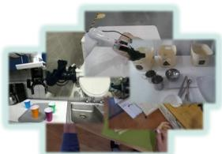

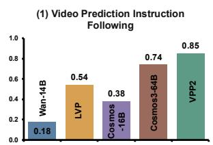

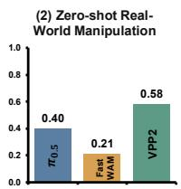

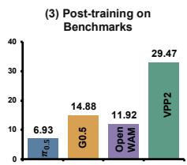

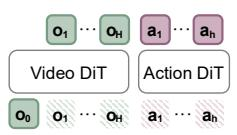

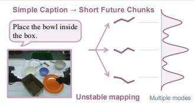

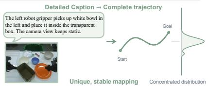  
Figure 1: A typical robot policy maps an simple instruction and an observation into an short action chunk. As datasets scale, this mapping becomes increasingly multi-modes and uncertain, leading models to learn spurious short-horizon correlations. VPP2 first establishes consistent semantic-totrajectory mappings via next event video prediction with detailed caption, then post-train and distill model to generate short action chunk.

## 1 INTRODUCTION

World action models (WAMs) are developing rapidly and have become an important class of generalist robot policies (Hu et al., 2024; Liao et al., 2025; Kim et al., 2026; Yuan et al., 2026; Ma et al., 2026; Li et al., 2026a;b; AgiBot Research Team et al., 2026; Ye et al., 2026). Many WAMs build on video foundation models (Wan et al., 2025; Agarwal et al., 2025; Yang et al., 2025), aiming to transfer their rich priors about physical dynamics to policy learning. This premise is compelling: accurate, instruction-conditioned video predictions can guide action generation through an explicit or implicit inverse dynamics model (Du et al., 2023; Hu et al., 2024). However, prior work (Zhang et al., 2026b) has found that existing WAMs often perform well only on a narrow set of seen tasks, while producing unreliable future motion predictions in unseen, out-of-distribution scenarios. These prediction failures, in turn, lead to erroneous actions. In recent benchmarks that require generalization, robot policies, including WAMs, with near-perfect success rates on standard evaluation suites suffer substantial performance drops under perturbed task configurations and novel skill compositions (Zhou et al., 2025; Li, 2025; Mishra et al., 2026).

We identify two key factors that limit the generalization of existing WAMs to unseen scenarios. First, base video models are primarily optimized for creative content generation and aesthetic quality rather than precise physical dynamics, and therefore often fail to follow manipulation instructions faithfully (Chen et al., 2025; Zhang et al., 2026b). Second, introducing action-specific components or training objectives into pretrained video foundation models can substantially degrade their generalization capabilities (Mishra et al., 2026).

To address these issues, we introduce Video Prediction Policy 2 (VPP2), a WAM that achieves strong zero-shot generalization in both video prediction and action generation. Our first objective is to train a generalizable video foundation that can faithfully follow instruction and make future predictions grounded in the current observation, without unsupported changes to the scene or task. To this end, we annotate each clip with a detailed caption specifying the manipulation process, active end effector, and target object, and perform event-level video prediction training. As illustrated in Figure 1, detailed captions and complete event-level trajectory prediction substantially reduce uncertainty in future prediction and encourage consistent mappings from semantic descriptions to visual trajectories, improving generalization across diverse instructions. We then post-train the video model to predict fixed-horizon future chunks and apply consistency distillation (Song et al., 2023) to obtain a single-step visual planner for real-time robot execution. Finally, we introduce an action expert through a mixture-of-transformers (MoT) architecture (Liang et al., 2025) to learn an implicit inverse dynamics model conditioned on the predicted future. During policy execution, we pair VPP2 with a VLM planner (Bai et al., 2025; Bytedance Seed, 2026) that translates open-ended instructions into explicit subtask instructions.

Our experiments demonstrate three key advantages of VPP2. (1) VPP2-14B follows manipulation instructions faithfully, outperforming Cosmos3-64B (Agarwal et al., 2026) by 11% in instructionfollowing success rate on open-ended tasks. (2) VPP2 exhibits strong zero-shot manipulation capabilities on a real-world ALOHA platform (Zhao et al., 2023), achieving an average success rate of 58.5% across 10 task categories, compared with 40.0% for $\pi _ { 0 . 5 }$ (Intelligence et al., 2025) and 20.5% for Fast-WAM (Yuan et al., 2026). (3) Following benchmark-specific post-training, VPP2 achieves the highest success rates among evaluated methods on LIBERO-Pro (Zhou et al., 2025) (45.0%, compared with 11.0% for the strongest baseline), LIBERO-OOD (Li, 2025; Mishra et al., 2026) (63.9%), and RoboDojo (Chen et al., 2026) (29.47%, state-of-the-art).

## 2 DATA PROCESS PIPELINE

In this section, we describe our data collection and curation pipeline, including how we unify the inputs and outputs across diverse manipulation datasets.

Video Sources. We compile a large-scale, diverse collection of manipulation videos for continued pretraining of an open-source video foundation model (Wan et al., 2025). Our data span three categories: robot manipulation datasets, human activity datasets, and general-purpose video datasets. For general-purpose video datasets, we apply an extensive filtering pipeline similar to that of LVP (Chen et al., 2025) to retain only videos depicting manipulation-related activities. Table 1 summarizes the datasets used for training.

<table><tr><td>Data Type</td><td>Embodiment Type</td><td>Data Sources</td></tr><tr><td rowspan="3">Robot</td><td>Single-arm</td><td>OXE, RoboMIND, DROID, RH20T, Molmoact</td></tr><tr><td>Dual-arm</td><td>AgibotWorld-Beta, RoboCOIN, RDT, GM100, ABC-130k, Self-</td></tr><tr><td>Mobile &amp; humanoid</td><td>collected Aloha InternData-A1, Galaxea Open-World, Self-collectd dexterous hands</td></tr><tr><td>Human</td><td>Human hands</td><td>Open-source: EgoDex, Ego4D, Epic-Kitchen Self-collected egocentric data</td></tr><tr><td>General Video Human hands</td><td></td><td>Open-vid, Panda-70M</td></tr></table>

Table 1: We use various types of manipulation datasets and perform different filtering strategy for different datasets to ensure diversity and high-quality.

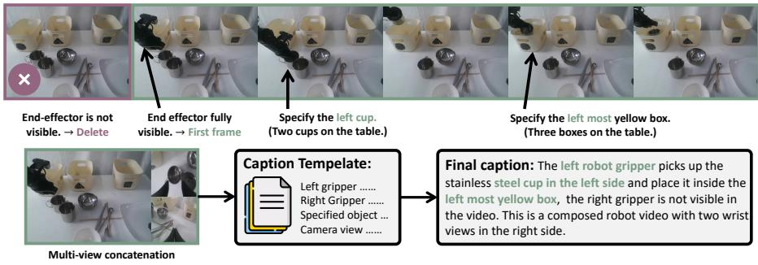  
Figure 2: An example of our data process pipeline. The central objective is to reduce uncertainty in future prediction, thereby encouraging the model to learn a consistent mapping from conditioning information to sub-task trajectories. To this end, each caption includes detailed task descriptions, explicit End-Effector Identification, visible target object, and camera-view changes.

Video Filtering, Segmentation and Captioning. We first remove corrupted trajectories, including those with camera failures or abrupt discontinuities, and segment the remaining trajectories into semantically coherent clips lasting 1–12 seconds. We identify candidate boundaries using heuristic cues associated with natural transitions, such as local minima in human-hand or end-effector velocity and moments when the gripper or fingers open or close. A vision-language model (VLM) then refines the segmentation by merging adjacent clips where appropriate and adjusting their start and end points.

After segmentation, we generate detailed captions that describe the task, explicitly identify the active end effectors, unambiguously specify the target objects, and characterize the camera views and motion. Figure 2 illustrates an example, and Appendix A.1 provides further details.

Unified T-shape Multi-view Input across Datasets. Robotics datasets commonly contain observations from multiple camera views. We arrange them into a T-shaped composite image, with the primary view on the left and two auxiliary views stacked vertically on the right, as illustrated in the bottom-left panel of Figure 2. When fewer than two auxiliary views are available, we fill the missing slots with black placeholder images.

Unified Action Space and Unified End-effector Coordinate Systems. Different robot datasets often adopt inconsistent coordinate systems and camera viewpoints, resulting in conflicting action representations for visually similar motions. For example, a leftward motion may correspond to the positive x-direction in one dataset but the negative y-direction in another, making it difficult for the model to learn the semantic meaning of each action dimension.

We focus on egocentric bimanual datasets, including ALOHA-style, humanoid-style, and human egocentric datasets. These datasets account for more than 80% of the total data and share a similar bimanual structure and camera viewpoint. We

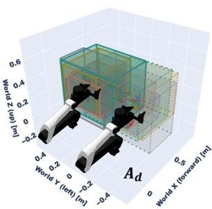  
(a) Workspace alignment

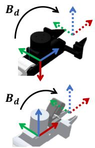  
(b) End-effector alignment  
Figure 3: (a) Bounding boxes show the aligned workspaces of different datasets. (b) Aligned end-effector coordinate frames.

explicitly align their coordinate systems at two levels: (1) workspace alignment, which applies a world-frame transformation so that different robots have comparable end-effector workspaces; and (2) end-effector alignment, which applies a local transformation to standardize end-effector origins and axis orientations.

For an arm dataset d , let $T _ { d } = { ^ { W _ { d } } T _ { E _ { d } } } \in S E ( 3 )$ denote the original end-effector pose, where $W _ { d }$ and $E _ { d }$ are the dataset’s world and end-effector frames, respectively. We define the workspace alignment as $A _ { d } = \bar { W } _ { T _ { W _ { a } } }$ and the end-effector alignment as $B _ { d } = { ^ { E _ { d } } T } _ { \bar { E } }$ , where $\bar { W }$ and E¯ denote the canonical world and end-effector frames. The aligned end-effector pose is given by $\widetilde { T } _ { d } = A _ { d } T _ { d } B _ { d }$ .

## 3 VPP2: A GENERALIST POLICY WITH ZERO-SHOT CAPABILITY

Overview. Our large-scale, diverse, and densely annotated dataset enables us to train a policy with strong generalization capabilities. VPP2 builds upon the pretrained Wan2.1-I2V-14B model (Wan et al., 2025) and introduce a action expert via mixture-of-transformers(MoT) architecture (Liang et al., 2025). Our training objective is twofold: we first adapt the video model to produce generalizable future predictions at real-time inference speed for open-ended manipulation tasks, and then train the action expert conditioned on the KV cache of the video model. To maximize policy generalization, we organize training into the stages summarized in Figure 4.

## 3.1 VIDEO PREDICTION MODEL TRAINING PIPELINE

Stage 1: Event-level Video Model Continued Pre-training. We first adapt a pretrained video generation model to the manipulation domain through event-level continued pre-training. Each training example covers a complete manipulation subtask, aligning the subtask description with the corresponding visual evolution from the initial observation to subtask completion.

Given a demonstration $\tau = ( o _ { 0 } , o _ { 1 } , \dots , o _ { T } )$ , we uniformly sample N future frames across the entire event:

$$
\mathbf { y } _ { \mathrm { e v e n t } } = \left( o _ { 0 } , o _ { \lfloor T / N \rfloor } , o _ { \lfloor 2 T / N \rfloor } , \dots , o _ { T } \right) ,\tag{1}
$$

where $T$ is the final frame index and N excludes the initial conditioning frame $o _ { 0 }$ . Let $\mathbf { x } _ { 1 } = \mathcal { E } ( \mathbf { y } _ { \mathrm { e v e n t } } )$ denote the corresponding video latent representation, where E is the video encoder. We construct the interpolated latent as

$$
\begin{array} { r } { \mathbf { x } _ { s } = ( 1 - s ) \epsilon + s \mathbf { x } _ { 1 } , \qquad \epsilon \sim \mathcal { N } ( \mathbf { 0 } , \mathbf { I } ) , \quad s \in [ 0 , 1 ] , } \end{array}\tag{2}
$$

where s denotes flow time, with $s = 0$ corresponding to noise and $s = 1$ to data. The model is optimized with the flow matching objective (Lipman et al., 2023)

$$
\begin{array} { r } { \mathcal { L } _ { \mathrm { F M } } ( \theta ) = \mathbb { E } _ { ( \mathbf { x } _ { 1 } , c ) , \epsilon , s } [ | | v _ { \theta } ( \mathbf { x } _ { s } , s , c ) - ( \mathbf { x } _ { 1 } - \epsilon ) | | _ { 2 } ^ { 2 } ] , } \end{array}\tag{3}
$$

where $v _ { \theta }$ predicts the flow velocity and c includes the subtask instruction and initial observation $o _ { 0 }$

In this stage, we predict 49 frames at a resolution of $4 1 6 \times 2 4 0$ and continue pre-training Wan2.1- I2V-14B for 30,000 optimization steps with batch size 1,024 and learning rate 1e-5. Our experiments in Sec. 4.1 show that the resulting model achieves strong instruction following on manipulation tasks, outperforming the 64B Cosmos3-Super-Image2Video model (Agarwal et al., 2026).

Stage 2: Chunk-level Video Model Post-training. Event-level continued pre-training enables the model generalize the best in manipulation tasks. However, sampling a fixed number of frames from events of different durations produces variable temporal intervals between predicted frames, complicating their alignment with downstream actions. We therefore further post-train the model to predict a fixed-duration future chunk, establishing a consistent temporal scale for action learning. In experiments, we predict 2 seconds for human hand and 8 seconds for robot manipulation.

Let H denote the prediction horizon in seconds and f the dataset frames per seconds (fps). The nominal interval between sampled frames is $\delta = f H / N$ , measured in dataset frames. For a chunk starting at frame t, the target video is

$$
{ \bf y } _ { \mathrm { c h u n k } } ^ { ( t ) } = \left( o _ { t } , o _ { t + \left\lfloor \delta \right\rfloor } , o _ { t + \left\lfloor 2 \delta \right\rfloor } , \ldots , o _ { t + \left\lfloor N \delta \right\rfloor } \right) ,\tag{4}
$$

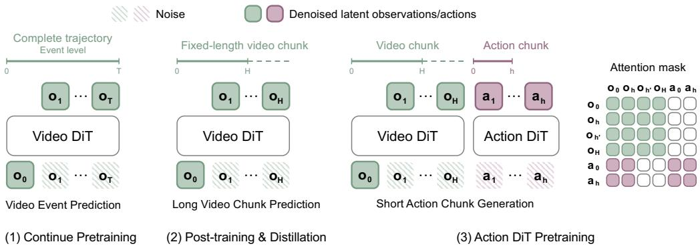  
Figure 4: The VPP2 training pipeline is designed to maximize generalization. Stage 1 uses largescale, event-level video pretraining to learn a generalizable video model for manipulation. Stage 2 post-trains and distills this model to predict long-horizon video chunks spanning 8 seconds in a single forward pass, taking approximately 0.1 seconds. Finally, Stage 3 trains an action expert to generate 2-second action chunks conditioned on the one-step video latents.

with conditioning inputs c containing the observation $o _ { t }$ and the corresponding subtask instruction. Indices $t + \lfloor f H \rfloor$ is bounded to max length $T$ and we optimize the same flow matching objective in Eq. equation $^ { 3 , }$ with $\mathbf { x } _ { 1 } = \mathcal { E } ( \mathbf { y } _ { \mathrm { c h u n k } } ^ { ( t ) } )$

Stage 2: Consistency Distillation. We distill the chunk-level video model for single-step generation (Song et al., 2023) by enforcing consistent terminal predictions at adjacent flow times:

$$
\begin{array} { r } { \mathcal { L } _ { \mathrm { C D } } = \mathbb { E } \left[ \lambda ( s , s ^ { \prime } ) \left. F _ { \theta } ( \mathbf { x } _ { s } , s , c ) - \mathrm { s t o p g r a d } \left( F _ { \bar { \theta } } ( \widehat { \mathbf { x } } _ { s ^ { \prime } } , s ^ { \prime } , c ) \right) \right. _ { 2 } ^ { 2 } \right] , } \end{array}\tag{5}
$$

where $0 \le s < s ^ { \prime } \le 1 , \widehat { \mathbf { x } } _ { s ^ { \prime } }$ is obtained by integrating the frozen teacher flow from $\left( \mathbf { x } _ { s } , s \right)$ to $s ^ { \prime } .$ , and $\bar { \theta }$ denotes the EMA student parameters. The student satisfies $F _ { \theta } ( \mathbf { x } , 1 , c ) = \mathbf { x }$ . To emphasize single-step generation, we sample $s ^ { \prime } = 1$ with probability 0.5; otherwise, we sample $s ^ { \prime }$ from the remaining flow times. At inference, the video latent is generated in a single forward pass as $F _ { \theta } ( \epsilon , 0 , c )$

## 3.2 ACTION MODELING

Stage 3: Action Pretraining across Datasets. After training a generalizable video model, we start training action on our processed bimanual datasets with unified workspace and eef coordinate systems. The action expert is a 0.9B-parameter diffusion transformer (DiT) (Peebles & Xie, 2023) with standard MoT architecture. Since the action expert is newly initialized, we freeze the base parameters of the video DiT during the early stages of action training and adapt the video backbone using only LoRA (Hu et al., 2022). This strategy helps preserve the pretrained video representations while limiting disruption from action-training gradients.

Inference Latency. We can generate video very fast since we reduce the video input to $1 7 \times 4 1 6 \times 2 4 0$ in post-training and distill the video model to enable one-step generation as described in Sec. 3.1. With bfloat16 precision and torch.compile, video model part takes approximately 0.12 seconds. The action expert then generates an action chunk conditioned on the video latents using five denoising steps, taking approximately 0.1 seconds. The total latency per action chunk is therefore approximately 0.22 seconds.

## 3.3 VLM FOR HIGH-LEVEL PLANNING.

Sub-task Planning. To tackle long-horizon tasks and handle ambiguous human instructions, we adopt a hierarchical architecture in which a VLM generates subtask plans (Shi et al., 2025). The VLM handles high-level reasoning, semantic understanding, and memory, allowing VPP2 to focus on mapping explicit instructions to trajectories. In practice, the VLM can be deployed locally or accessed through an API to a frontier model.

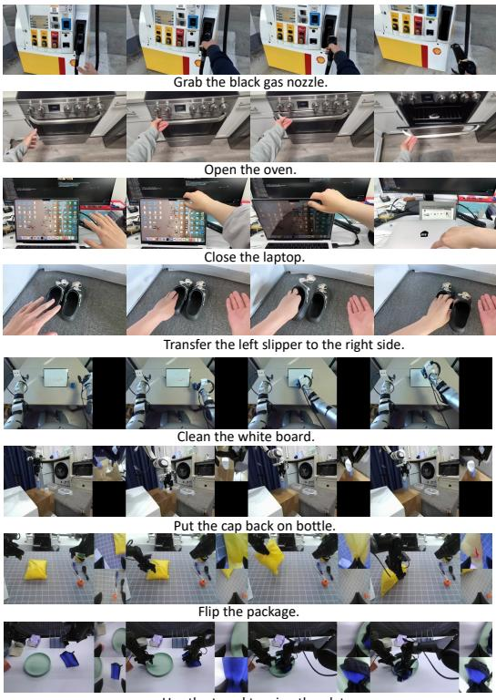

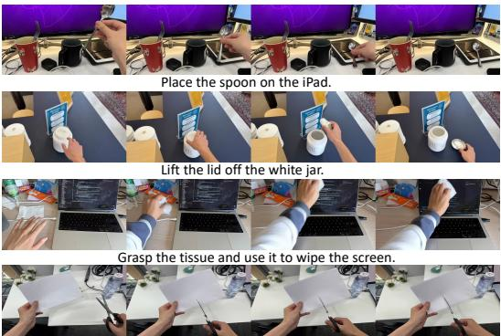

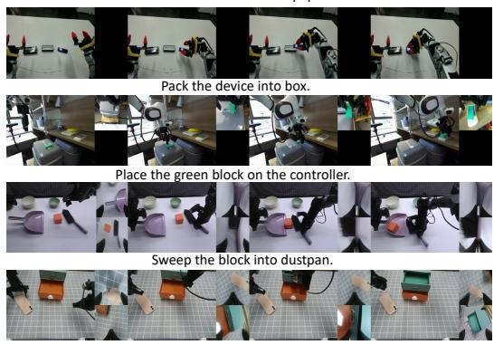  
Figure 5: VPP2 video predictions for human-hand and robot manipulation. Trained on large-scale, diverse manipulation datasets, VPP2 generalizes across human hands and a wide range of robot embodiments. For robot manipulation, VPP2 jointly predicts one to three camera views arranged in a T-shaped composite. Due to space constraints, single-step video predictions after distillation are shown in Figure 10 from Appendix.

Prompt Enhancement. Another function of VLM planning is to generate detailed subtask similar to template prompt during training caption. Also, model video generation models also find that detailed caption is essential for generation quality (Wan et al., 2025; Yang et al., 2025).

## 4 EXPERIMENTS

In this section, we conduct experiments to answer the following questions: (1) How does the motion quality of VPP2’s video predictions compare with that of state-of-the-art video foundation models on manipulation tasks? (2) How broad are VPP2’s zero-shot manipulation capabilities? (3) How well does VPP2 perform after domain-specific post-training?

## 4.1 VIDEO PREDICTION QUALITY ANALYSES

Video Prediction for Human and Robot Manipulation. Figure 5 visualizes predictions for humanhand manipulation and diverse robot embodiments from pretrained VPP2 model. To assess generalization, we randomly sample test cases from prior work (Chen et al., 2025; Zhang et al., 2026b) and take photographs in office environments and robot workspaces, pairing them with freely chosen manipulation instructions. Trained on data spanning more than 20 robot embodiments, VPP2 also generalizes to unseen embodiments and tasks, as shown in Figure 5. VPP2 also supports joint prediction across one to three camera views, with the primary view placed on the left and up to two auxiliary views stacked on the right.

Quantitative Comparisons. We compare VPP2 with four video foundation models and one ablation variant: (1) Wan-2.1-I2V-14B-480p (Wan et al., 2025), our base model; (2) LVP (Chen et al., 2025), which also adapts Wan-2.1-I2V-14B-480p to manipulation tasks; (3) Cosmos3-Nano-16B, which is extensively trained on robot manipulation data; (4) Cosmos3-Super-Image2Video-64B, the strongest

<table><tr><td>Method</td><td>Human</td><td>Robot</td></tr><tr><td>Wan2.1-14B</td><td>0.32</td><td>0.04</td></tr><tr><td>LVP</td><td>0.62</td><td>0.46</td></tr><tr><td>Cosmos3-16B</td><td>0.44</td><td>0.32</td></tr><tr><td>Cosmos3-64B</td><td>0.70</td><td>0.78</td></tr><tr><td>VPP2-Fixed-Step</td><td>0.48</td><td>0.42</td></tr><tr><td>VPP2 (ours)</td><td>0.80</td><td>0.90</td></tr></table>

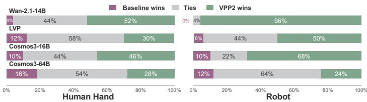  
Figure 6: Win rates of the pretrained VPP2 model against different baselines on video prediction tasks.

Table 2: Instruction following success rates.  
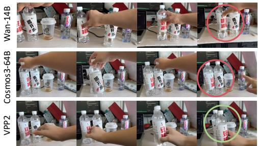  
(a) Grasp leftmost bottle and place it in front of the short cup.

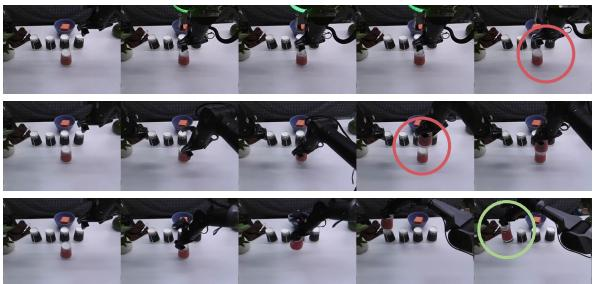  
(b) Stack red paper cup on leftmost black paper cup.

Figure 7: Comparisons on instruction following capability between VPP2, Wan-14B, Cosmos3-64B.   
VPP2 demonstrates better instruction following on complex tasks requiring spatial understanding.

model in the Cosmos 3 family (Agarwal et al., 2026); and (5) VPP2-Fixed-Step, an ablation of our method that predicts a fixed-duration future chunk rather than a complete event, potentially misaligning the predicted future with the instruction describing the full event.

We randomly collect 50 image–instruction pairs each for human-hand and robot manipulation and generate video predictions for every pair using each model. We first use a GPT-based evaluator to assess instruction-following success rates, reported in Table 2. Human evaluators then compare pairs of predictions to determine which better follows the instruction, yielding VPP2’s pairwise win rates against each baseline in Figure 6. VPP2’s advantages are most pronounced in complex manipulation scenarios requiring spatial understanding, as illustrated in Figure 7. We hypothesize that training with detailed captions encourages more accurate mappings from instructions to trajectories, contributing to these improvements.

## 4.2 POLICY PERFORMANCE ANALYSIS

Zero-shot Performance on Real-world Aloha Robot. After pretraining a strong video foundation model for manipulation, we post-train and distill it into a fast, single-step generator to support action learning. With its generalizable video predictions, VPP2 demonstrates strong zero-shot capabilities across open-ended manipulation tasks. We deploy VPP2 directly on a robot embodiment seen during training, without task-specific fine-tuning. For comparison, we train $\pi _ { 0 . 5 }$ (Intelligence et al., 2025) Wan-14B version of Fast-WAM (Yuan et al., 2026) on the same data used in VPP2 training. We evaluate models on 10 different categories of zero-shot tasks and present results in Figure 8. VPP2 achieves an average success rate of 58.5%, compared with 40.0% for $\pi _ { 0 . 5 }$ and 20.5% for Fast-WAM, and performs best in 9 of the 10 categories.

LIBERO-ID, LIBERO-Pro, and LIBERO-OOD Benchmarks. All models are trained exclusively on the four standard LIBERO suites (Liu et al., 2023) and are evaluated under three complementary settings. LIBERO-ID measures standard in-distribution manipulation performance. To assess generalization beyond the training distribution, we further evaluate on LIBERO-Pro (Zhou et al., 2025) and LIBERO-OOD (Li, 2025) without additional training. Following HarnessVLA (Zhang et al., 2026d), we evaluate the Position and Task perturbations of LIBERO-Pro, which test generalization to changes in object positions and task specifications, respectively. We further follow (Mishra et al., 2026) to evaluate compositional generalization on LIBERO-OOD, which recombines familiar objects, layouts, and goals into unseen task configurations along spatial, object, and goal dimensions. Per-suite LIBERO-ID results are provided in Appendix C.1.

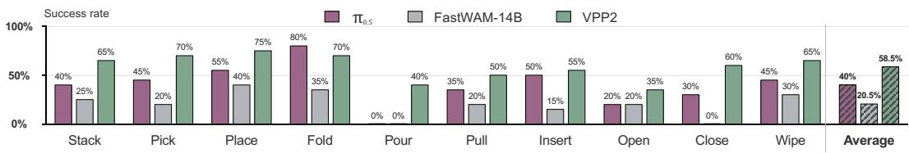

Figure 8: Zero-shot success rates on the real-world ALOHA across 10 randomly selected task categories. For a fair comparison, we finetune $\pi _ { 0 . 5 }$ and FastWAM on all ALOHA datasets exposed in VPP2’s training data and use the 14B variant of FastWAM.
<table><tr><td rowspan="2">Method</td><td>LIBERO-ID</td><td colspan="3">LIBERO-Pro</td><td colspan="4">LIBERO-OOD</td></tr><tr><td>Overall</td><td>Position</td><td>Task</td><td>Overall</td><td>Spatial</td><td>Object</td><td>Goal</td><td>Overall</td></tr><tr><td>π0 (Black et al., 2024)</td><td>94.2</td><td>0.5</td><td>0.0</td><td>0.3</td><td>0.7</td><td>0.3</td><td>4.3</td><td>1.7</td></tr><tr><td>π0.5 (Intelligence et al., 2025)</td><td>96.9</td><td>20.8</td><td>1.3</td><td>11.0</td><td>36.7</td><td>2.3</td><td>41.7</td><td>26.8</td></tr><tr><td>MolmoAct (Lee et al., 2025)</td><td>86.6</td><td>1.5</td><td>1.5</td><td>1.5</td><td>一</td><td>一</td><td>一</td><td>一</td></tr><tr><td>X-VLA (Zheng et al., 2026)</td><td>98.1</td><td>0.8</td><td>6.8</td><td>3.8</td><td>一</td><td>一</td><td>1</td><td>一</td></tr><tr><td>AtomVLA (Sun et al., 2026)</td><td>97.0</td><td>7.3</td><td>5.3</td><td>6.3</td><td>一</td><td>一</td><td>一</td><td>一</td></tr><tr><td>Cosmos-Policy (Kim et al., 2026)</td><td>98.5</td><td>一</td><td>一</td><td>一</td><td>30.7</td><td>0.3</td><td>0.7</td><td>10.5</td></tr><tr><td>Fast-WAM (Yuan et al., 2026)</td><td>97.6</td><td></td><td></td><td>一</td><td>12.7</td><td>0.0</td><td>15.7</td><td>9.4</td></tr><tr><td>DiT4DiT (Ma et al., 2026)</td><td>98.6</td><td></td><td></td><td></td><td>9.0</td><td>0.0</td><td>10.3</td><td>6.4</td></tr><tr><td>Temporal Ratio (Mishra et al., 2026)</td><td>94.0</td><td>一</td><td></td><td>一</td><td>58.6</td><td>40.0</td><td>80.3</td><td>59.4</td></tr><tr><td>VPP2 (Ours)</td><td>98.8</td><td>42.3</td><td>47.8</td><td>45.0</td><td>59.3</td><td>44.5</td><td>87.7</td><td>63.9</td></tr></table>

Table 3: Post-training on LIBERO-ID, LIBERO-Pro, and LIBERO-OOD benchmarks. All models are trained exclusively on the four standard LIBERO suites (Liu et al., 2023) and are evaluated under three complementary settings.

As shown in Table 3, while most baselines exceed 94% on LIBERO-ID, this in-distribution performance does not transfer to generalization. On LIBERO-Pro, VLA baselines drop to at most 11.0% overall, whereas VPP2 reaches 45.0%, with the largest gain on the Task perturbation (47.8% vs. 6.8%), indicating that VPP2 follows the given instruction rather than replaying memorized trajectories. On LIBERO-OOD, video-based policies such as Cosmos-Policy, Fast-WAM, and DiT4DiT reach at most 10.5%, while VPP2 achieves 63.9%, also surpassing Temporal Ratio (Mishra et al., 2026), which specifically targets this generalization gap. We attribute these gains to next-event video prediction with detailed captions, which establishes consistent mappings from instructions to future trajectories.

RoboDojo Benchmark. RoboDojo (Chen et al., 2026) is a unified sim-and-real benchmark for evaluating generalist robot manipulation policies. Its simulation benchmark contains 42 bimanual tasks covering five capability dimensions: generalization, memory, precision, long-horizon execution, and open-vocabulary instruction following. We follow the official training and evaluation protocol and report both the success rate and the average score, which captures partial task progress.

As shown in Table 4, VPP2 achieves an average score of 35.51 and a success rate of 29.47%, achieving state-of-the-art performance.1 It outperforms representative VLAs such as π (Intelligence et al., 2025), X-VLA (Zheng et al., 2026), and Xiaomi-Robotics-1 (Guo et al., 2026), world action models such as Fast-WAM (Yuan et al., 2026) and OpenWAM-α (Wang et al., 2026), and the frontier foundation model GPT-6-Astra (Zhang et al., 2026c) (28.97 / 22.48%). Per-dimension results are provided in Appendix C.2.

VPP2 with Subtask Planning. The VPP2 results in Table 4 use full-task instructions without subtask planning. We further investigate VLM-based subtask planning on five selected RoboDojo task groups covering object classification, block stacking, block swapping, mahjong, and tic-tac-toe. To train the subtask-conditioned policy, we segment demonstrations and pair each segment with a subtask instruction. At test time, a vision-language model (VLM) uses visual observations and execution feedback to select the next subtask for VPP2 to execute.

Figure 9 summarizes the results across the five selected task groups. The evaluated planning configurations achieve an average success rate of 57.6%, compared with 27.6% for the baseline. The largest gains occur in language-conditioned block stacking (10% to 52%) and tic-tac-toe (0% to 38%).

<table><tr><td></td><td>π0</td><td>π0.5</td><td>X-VLA</td><td>Fast-WAM</td><td></td><td>OpenWAM-α Xiaomi-Robotics-1</td><td>GPT-6-Astra</td><td>VPP2 (Ours)</td></tr><tr><td>Avg. Score</td><td>3.48</td><td>11.44</td><td>10.13</td><td>3.48</td><td>17.18</td><td>20.07</td><td>28.97</td><td>35.51</td></tr><tr><td>Success Rate (%)</td><td>1.53</td><td>6.93</td><td>6.52</td><td>2.03</td><td>11.92</td><td>13.93</td><td>22.48</td><td>29.47</td></tr></table>

Table 4: Post-training results on the RoboDojo simulation benchmark. Average score captures partial task progress, and success rate measures binary task completion; both are averaged over the five capability dimensions. Baseline results are taken from the official leaderboard.  
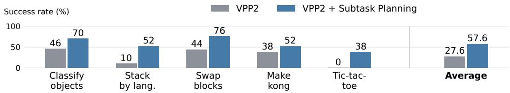  
Figure 9: Success rates with and without VLM-based subtask planning (50 trials per task). Average is the five-task mean; the baseline checkpoint matches Table 4.

## 5 RELATED WORKS

Video Foundation Model. Video generation has advanced rapidly through latent diffusion models (Blattmann et al., 2023b;a) and large-scale diffusion transformer models (Yang et al., 2025; Wan et al., 2025; Agarwal et al., 2025; 2026). Large-scale bidirectional video models provide strong general-purpose video priors; even recent autoregressive generators build on pretrained bidirectional models, using them for initialization or as teachers before causal adaptation and distillation (Yin et al., 2025; Huang et al., 2025). This motivates our strategy of first learning a generalizable video model and then adapting it for efficient prediction. Beside training strategy, prompt enhancement is an important component in video foundation models (Yang et al., 2025; Wan et al., 2025). Similarly, we use a VLM to produce detailed, manipulation-specific descriptions that reduce ambiguity in these mappings. After establishing this manipulation-focused video prior, we post-train the model for fixed-horizon prediction and distill it for single-step generation to support efficient action learning.

World Action Model. World action models (WAMs) leverage video prediction to facilitate robot policy learning. Early approaches first generate future frames and then infer actions through inverse dynamics (Du et al., 2023; Black et al., 2023; Bharadhwaj et al., 2024; Liang et al., 2024; Feng et al., 2025), but iterative video generation can incur substantial latency for closed-loop control. Hierarchical approaches also combine video-based motion planning with reactive VLA control (Zhang et al., 2026e). More recent approaches condition actions on features from video models (Hu et al., 2024; Liao et al., 2025; Yan et al., 2026b) or jointly learn visual prediction and action generation (Zhang et al., 2025; Guo et al., 2024; Li et al., 2025; Zhu et al., 2025; Ma et al., 2026; Kim et al., 2026; Yan et al., 2026a; Ye et al., 2026; Li et al., 2026a; Bi et al., 2026; Motubrain Team et al., 2026). Recent work also explores event-grounded world-action learning (Li et al., 2026b) and large-scale manipulation-specific pretraining (AgiBot Research Team et al., 2026). Nevertheless, action learning can compromise pretrained capabilities, including video-model generalization (Mishra et al., 2026) and VLM semantic understanding (Zhang et al., 2026a). VPP2 emphasizes instruction-aligned future prediction, combining event-level pretraining with detailed captions, fixed-horizon post-training, and single-step distillation to provide an efficient video backbone for action learning.

## 6 CONCLUSION

We presented Video Prediction Policy 2 (VPP2), a world action model that achieves strong zero-shot generalization in both video prediction and action generation. We first continue pretraining the base video model to produce generalizable, instruction-following predictions, then learn a policy while preserving these predictive capabilities. Experiments show that VPP2 follows manipulation instructions more faithfully than substantially larger video foundation models, exhibits strong zeroshot manipulation capabilities on a real-world ALOHA platform, and achieves the highest success rates when post-train on challenge benchmarks. We hope these findings encourage future WAM research to look beyond architectural choices for action modeling and place greater emphasis on learning generalizable video predictions and preserving this generalization during action learning.

## AI USE STATEMENT

We used generative AI tools to assist with language polishing, improve the clarity and readability of the manuscript, and draft portions of the paper. In the research process, these tools were used to suggest experimental parameter settings and assist with searches for relevant literature and technical information. We also used AI tools to annotate human and robotic manipulation datasets at scale for model training. The authors evaluated the suggestions and made the final decisions regarding experimental design and parameter selection. All AI-assisted text was reviewed and revised by the authors, and retrieved information was checked against original sources before use. The authors take full responsibility for the final content of the paper, including its data, claims, results, and references.

## REPRODUCIBILITY STATEMENT

We describe the model architecture, training objectives, and evaluation protocols in the main text, with additional data processing details provided in the appendix. Detailed training configurations, code, and model checkpoints are available on our anonymous project website.

## REFERENCES

Niket Agarwal, Arslan Ali, Maciej Bala, Yogesh Balaji, Erik Barker, Tiffany Cai, Prithvijit Chattopadhyay, Yongxin Chen, Yin Cui, Yifan Ding, et al. Cosmos world foundation model platform for physical ai. arXiv preprint arXiv:2501.03575, 2025.

Niket Agarwal, Arslan Ali, Jon Allen, Martin Antolini, Adeline Aubame, Alisson Azzolini, Junjie Bai, Maciej Bala, Yogesh Balaji, Josh Bapst, et al. Cosmos 3: Omnimodal world models for physical ai. arXiv preprint arXiv:2606.02800, 2026.

AgiBot Research Team, Renhang Liu, Wenzhi Zhao, Zhuo Yang, Liliang Chen, Pengfei Zhou, Shengcong Chen, Guanghui Ren, Youlun Peng, Rongjun Jin, et al. GE-Act 2.0: Pretraining and scaling a world-action model for robotic manipulation. arXiv preprint arXiv:2609.05588, 2026. URL https://arxiv.org/abs/2609.05588.

Shuai Bai, Yuxuan Cai, Ruizhe Chen, Keqin Chen, Xionghui Chen, Zesen Cheng, Lianghao Deng, Wei Ding, Chang Gao, Chunjiang Ge, et al. Qwen3-vl technical report. arXiv preprint arXiv:2511.21631, 2025.

Homanga Bharadhwaj, Debidatta Dwibedi, Abhinav Gupta, Shubham Tulsiani, Carl Doersch, Ted Xiao, Dhruv Shah, Fei Xia, Dorsa Sadigh, and Sean Kirmani. Gen2act: Human video generation in novel scenarios enables generalizable robot manipulation. arXiv preprint arXiv:2409.16283, 2024.

Hongzhe Bi, Hengkai Tan, Shenghao Xie, Zeyuan Wang, Shuhe Huang, Haitian Liu, Ruowen Zhao, Yao Feng, Chendong Xiang, Yinze Rong, Hongyan Zhao, Hanyu Liu, Zhizhong Su, Lei Ma, Hang Su, and Jun Zhu. Motus: A unified latent action world model. In Proceedings of the IEEE/CVF Conference on Computer Vision and Pattern Recognition, pp. 35101–35113, 2026. URL https://openaccess.thecvf.com/content/CVPR2026/html/Bi\_ Motus\_A\_Unified\_Latent\_Action\_World\_Model\_CVPR\_2026\_paper.html.

Kevin Black, Mitsuhiko Nakamoto, Pranav Atreya, Homer Walke, Chelsea Finn, Aviral Kumar, and Sergey Levine. Zero-shot robotic manipulation with pretrained image-editing diffusion models. arXiv preprint arXiv:2310.10639, 2023.

Kevin Black, Noah Brown, Danny Driess, Adnan Esmail, Michael Equi, Chelsea Finn, Niccolo Fusai, Lachy Groom, Karol Hausman, Brian Ichter, et al. π0: A vision-language-action flow model for general robot control. arXiv preprint arXiv:2410.24164, 2024.

Andreas Blattmann, Tim Dockhorn, Sumith Kulal, Daniel Mendelevitch, Maciej Kilian, Dominik Lorenz, Yam Levi, Zion English, Vikram Voleti, Adam Letts, et al. Stable video diffusion: Scaling latent video diffusion models to large datasets. arXiv preprint arXiv:2311.15127, 2023a.

Andreas Blattmann, Robin Rombach, Huan Ling, Tim Dockhorn, Seung Wook Kim, Sanja Fidler, and Karsten Kreis. Align your latents: High-resolution video synthesis with latent diffusion models. In Proceedings of the IEEE/CVF Conference on Computer Vision and Pattern Recognition, pp. 22563–22575, 2023b.

Bytedance Seed. Seed2.0 model card: Towards intelligence frontier for real-world complexity. arXiv preprint arXiv:2607.00248, 2026.

Boyuan Chen, Tianyuan Zhang, Haoran Geng, Caiyi Zhang, Peihao Li, Kiwhan Song, William T Freeman, Jitendra Malik, Pieter Abbeel, Russ Tedrake, et al. Large video planner enables generalizable robot control. arXiv preprint arXiv:2512.15840, 2025.

Tianxing Chen, Yue Chen, Zixuan Li, Junyuan Tang, Kailun Su, Haoran Lu, Weijie Wan, Baijun Chen, Songling Liu, Haowen Yan, et al. Robodojo: A unified sim-and-real benchmark for comprehensive evaluation of generalist robot manipulation policies. arXiv preprint arXiv:2607.04434, 2026.

Yilun Du, Sherry Yang, Bo Dai, Hanjun Dai, Ofir Nachum, Josh Tenenbaum, Dale Schuurmans, and Pieter Abbeel. Learning universal policies via text-guided video generation. Advances in Neural Information Processing Systems, 36, 2023.

Yao Feng, Hengkai Tan, Xinyi Mao, Guodong Liu, Shuhe Huang, Chendong Xiang, Hang Su, and Jun Zhu. Vidar: Embodied video diffusion model for generalist bimanual manipulation. arXiv preprint arXiv:2507.12898, 2025.

Jun Guo, Piaopiao Jin, Jason Li, Peiyan Li, Yingyan Li, Futeng Liu, Wanli Peng, Optimus Qin, Yifei Su, Nan Sun, et al. Xiaomi-robotics-1: Scaling vision-language-action models with over 100k hours of real-world trajectories. arXiv preprint arXiv:2607.15330, 2026.

Yanjiang Guo, Yucheng Hu, Jianke Zhang, Yen-Jen Wang, Xiaoyu Chen, Chaochao Lu, and Jianyu Chen. Prediction with action: Visual policy learning via joint denoising process. Advances in Neural Information Processing Systems, 37:112386–112410, 2024.

Edward J. Hu, Yelong Shen, Phillip Wallis, Zeyuan Allen-Zhu, Yuanzhi Li, Shean Wang, Lu Wang, and Weizhu Chen. LoRA: Low-rank adaptation of large language models. In International Conference on Learning Representations, 2022. URL https://openreview.net/forum? id=nZeVKeeFYf9.

Yucheng Hu, Yanjiang Guo, Pengchao Wang, Xiaoyu Chen, Yen-Jen Wang, Jianke Zhang, Koushil Sreenath, Chaochao Lu, and Jianyu Chen. Video prediction policy: A generalist robot policy with predictive visual representations. arXiv preprint arXiv:2412.14803, 2024.

Xun Huang, Zhengqi Li, Guande He, Mingyuan Zhou, and Eli Shechtman. Self forcing: Bridging the train-test gap in autoregressive video diffusion. In Advances in Neural Information Processing Systems, volume 38, 2025. doi: 10.52202/085713-5576. URL https://proceedings.neurips.cc/paper\_files/paper/2025/hash/ f4823f831af67a3ef15e41a85434422a-Abstract-Conference.html.

Physical Intelligence, Kevin Black, Noah Brown, James Darpinian, Karan Dhabalia, Danny Driess, Adnan Esmail, Michael Equi, Chelsea Finn, Niccolo Fusai, et al. π0.5: a vision-language-action model with open-world generalization. arXiv preprint arXiv:2504.16054, 2025.

Moo Jin Kim, Yihuai Gao, Tsung-Yi Lin, Yen-Chen Lin, Yunhao Ge, Grace Lam, Percy Liang, Shuran Song, Ming-Yu Liu, Chelsea Finn, and Jinwei Gu. Cosmos policy: Fine-tuning video models for visuomotor control and planning. arXiv preprint arXiv:2601.16163, 2026.

Jason Lee, Jiafei Duan, Haoquan Fang, Yuquan Deng, Shuo Liu, Boyang Li, Bohan Fang, Jieyu Zhang, Yi Ru Wang, Sangho Lee, et al. Molmoact: Action reasoning models that can reason in space. arXiv preprint arXiv:2508.07917, 2025.

Lin Li, Qihang Zhang, Yiming Luo, Shuai Yang, Ruilin Wang, Fei Han, Mingrui Yu, Zelin Gao, Nan Xue, Xing Zhu, Yujun Shen, and Yinghao Xu. Causal world modeling for robot control. arXiv preprint arXiv:2601.21998, 2026a. doi: 10.48550/arXiv.2601.21998. URL https://arxiv. org/abs/2601.21998.

Quanyi Li. Vlas are confined yet capable of generalizing to novel instructions. arXiv preprint arXiv:2505.03500, 2025.

Shalfun Li, Victor Yao, Charles Yang, Truth Qu, Regis Cheng, Ryan Yu, Howard Lu, Newton Von, Vincent Chen, Yohann Tang, et al. WALL-WM: Carving world action modeling at the event joints. arXiv preprint arXiv:2606.01955, 2026b. doi: 10.48550/arXiv.2606.01955. URL https://arxiv.org/abs/2606.01955.

Shuang Li, Yihuai Gao, Dorsa Sadigh, and Shuran Song. Unified video action model. arXiv preprint arXiv:2503.00200, 2025.

Junbang Liang, Ruoshi Liu, Ege Ozguroglu, Sruthi Sudhakar, Achal Dave, Pavel Tokmakov, Shuran Song, and Carl Vondrick. Dreamitate: Real-world visuomotor policy learning via video generation. arXiv preprint arXiv:2406.16862, 2024.

Weixin Liang, Lili Yu, Liang Luo, Srinivasan Iyer, Ning Dong, Chunting Zhou, Gargi Ghosh, Mike Lewis, Wen-tau Yih, Luke Zettlemoyer, and Xi Victoria Lin. Mixture-of-Transformers: A sparse and scalable architecture for multi-modal foundation models. Transactions on Machine Learning Research, 2025. ISSN 2835-8856. URL https://openreview.net/forum? id=OutjGuJnNk.

Yue Liao, Pengfei Zhou, Siyuan Huang, Donglin Yang, Shengcong Chen, Yuxin Jiang, Yue Hu, Jingbin Cai, Si Liu, Jianlan Luo, et al. Genie envisioner: A unified world foundation platform for robotic manipulation. arXiv preprint arXiv:2508.05635, 2025.

Yaron Lipman, Ricky T. Q. Chen, Heli Ben-Hamu, Maximilian Nickel, and Matt Le. Flow matching for generative modeling. In International Conference on Learning Representations, 2023. URL https://openreview.net/forum?id=PqvMRDCJT9t.

Bo Liu, Yifeng Zhu, Chongkai Gao, Yihao Feng, Qiang Liu, Yuke Zhu, and Peter Stone. Libero: Benchmarking knowledge transfer for lifelong robot learning. Advances in Neural Information Processing Systems, 36, 2023.

Teli Ma, Jia Zheng, Zifan Wang, Chunli Jiang, Andy Cui, Junwei Liang, and Shuo Yang. Dit4dit: Jointly modeling video dynamics and actions for generalizable robot control. arXiv preprint arXiv:2603.10448, 2026.

Utkarsh A Mishra, Yongxin Chen, Danfei Xu, Yang Liu, Xi Chen, and Jiayuan Mao. Understanding and mitigating the video-action generalization gap via temporal ratio. arXiv preprint arXiv:2607.08127, 2026.

Motubrain Team, Chendong Xiang, Fan Bao, Haitian Liu, Hengkai Tan, Hongzhe Bi, James Li, Jiabao Liu, Jingrui Pang, Kiro Jing, Louis Liu, Mengchen Cai, Rongxu Cui, Ruowen Zhao, Runqing Wang, Shuhe Huang, Yao Feng, Yinze Rong, Zeyuan Wang, and Jun Zhu. Motubrain: An advanced world action model for robot control. arXiv preprint arXiv:2604.27792, 2026. doi: 10.48550/arXiv.2604.27792. URL https://arxiv.org/abs/2604.27792.

William Peebles and Saining Xie. Scalable diffusion models with transformers. In Proceedings of the IEEE/CVF International Conference on Computer Vision, pp. 4195–4205, 2023. URL https://openaccess.thecvf.com/content/ICCV2023/html/Peebles\_ Scalable\_Diffusion\_Models\_with\_Transformers\_ICCV\_2023\_paper.html.

Lucy Xiaoyang Shi, Brian Ichter, Michael Equi, Liyiming Ke, Karl Pertsch, Quan Vuong, James Tanner, Anna Walling, Haohuan Wang, Niccolo Fusai, et al. Hi robot: Open-ended instruction following with hierarchical vision-language-action models. arXiv preprint arXiv:2502.19417, 2025.

Yang Song, Prafulla Dhariwal, Mark Chen, and Ilya Sutskever. Consistency models. In Proceedings ofthe 40th International Conference on Machine Learning, volume 202 of Proceedings ofMachine Learning Research, pp. 32211–32252. PMLR, 2023. URL https://proceedings.mlr. press/v202/song23a.html.

Xiaoquan Sun, Zetian Xu, Chen Cao, Zonghe Liu, Yihan Sun, Jingrui Pang, Ruijian Zhang, Zhen Yang, Kang Pang, Dingxin He, et al. Atomvla: Scalable post-training for robotic manipulation via predictive latent world models. arXiv preprint arXiv:2603.08519, 2026.

Team Wan, Ang Wang, Baole Ai, Bin Wen, Chaojie Mao, Chen-Wei Xie, Di Chen, Feiwu Yu, Haiming Zhao, Jianxiao Yang, et al. Wan: Open and advanced large-scale video generative models. arXiv preprint arXiv:2503.20314, 2025.

Yuran Wang, Siqiao Huang, Mingleyang Li, Chenhao Zhang, Jiaqi Liang, Weiyang Jin, Yue Chen, Xuemin Chi, Donghao Zhou, Qize Yu, et al. Openwam: An open, modular exploration towards systematic world-action model pretraining. arXiv preprint arXiv:2609.07398, 2026.

Haodong Yan, Junfeng Li, Junjie He, Zhide Zhong, MingMing Yu, Wenxuan Song, Jiaguan Zhu, Yangyang Zheng, Yuqiao Du, Jiadi You, et al. Robust-wam: Bridging generative pretraining and semantic foresight in world-action models. arXiv preprint arXiv:2608.05903, 2026a.

Haodong Yan, Zhide Zhong, Jiaguan Zhu, Junjie He, Weilin Yuan, Wenxuan Song, Xin Gong, Yingjie Cai, Guanyi Zhao, Xu Yan, et al. S-vam: Shortcut video-action model by self-distilling geometric and semantic foresight. arXiv preprint arXiv:2603.16195, 2026b.

Zhuoyi Yang, Jiayan Teng, Wendi Zheng, Ming Ding, Shiyu Huang, Jiazheng Xu, Yuanming Yang, Wenyi Hong, Xiaohan Zhang, Guanyu Feng, et al. CogVideoX: Text-to-video diffusion models with an expert transformer. In International Conference on Learning Representations, 2025. URL https://proceedings.iclr.cc/paper\_files/paper/2025/hash/ ce31378e9f41d8907e97dab172b6c559-Abstract-Conference.html.

Seonghyeon Ye, Yunhao Ge, Kaiyuan Zheng, Shenyuan Gao, Sihyun Yu, George Kurian, Suneel Indupuru, You Liang Tan, Chuning Zhu, Jiannan Xiang, et al. World action models are zeroshot policies. arXiv preprint arXiv:2602.15922, 2026. doi: 10.48550/arXiv.2602.15922. URL https://arxiv.org/abs/2602.15922.

Tianwei Yin, Qiang Zhang, Richard Zhang, William T. Freeman, Fredo Durand, Eli Shechtman, and Xun Huang. From slow bidirectional to fast autoregressive video diffusion models. In Proceedings of the IEEE/CVF Conference on Computer Vision and Pattern Recognition, pp. 22963–22974, 2025. URL https://openaccess.thecvf.com/content/CVPR2025/html/Yin\_ From\_Slow\_Bidirectional\_to\_Fast\_Autoregressive\_Video\_Diffusion\_ Models\_CVPR\_2025\_paper.html.

Tianyuan Yuan, Zibin Dong, Yicheng Liu, and Hang Zhao. Fast-wam: Do world action models need test-time future imagination? arXiv preprint arXiv:2603.16666, 2026.

Jianke Zhang, Yanjiang Guo, Yucheng Hu, Xiaoyu Chen, Xiang Zhu, and Jianyu Chen. UP-VLA: A unified understanding and prediction model for embodied agent. In Proceedings ofthe 42nd International Conference on Machine Learning, volume 267 of Proceedings of Machine Learning Research, pp. 74911–74922. PMLR, 2025. URL https://proceedings.mlr.press/ v267/zhang25w.html.

Jianke Zhang, Yuanfei Luo, Yucheng Hu, Xiaoyu Chen, Yanjiang Guo, Ziyang Liu, Hongbin Xu, Tian Lan, and Jianyu Chen. UAM: A dual-stream perspective on forgetting in VLA training. arXiv preprint arXiv:2605.15735, 2026a. doi: 10.48550/arXiv.2605.15735. URL https://arxiv. org/abs/2605.15735.

Jie Zhang, Xiaoyue Chen, Anzhe Chen, Dayiheng Liu, Deqing Li, Gengze Zhou, Hale Yin, Haoqi Yuan, Haoyang Li, Jiahao Li, et al. Qwen-robotworld technical report: Unifying embodied world modeling through language-conditioned video generation. arXiv preprint arXiv:2606.17030, 2026b.

Wenbo Zhang, Kaixuan Wang, Yutao Ouyang, Xiaoyu Huang, Liyang Li, Kailun Su, Weiyang Jin, Wenhao Chai, Haotian Liang, Zhiyang Dou, et al. An unexpected robot policy: Early evaluations of gpt-6 astra on robodojo and beyond. arXiv preprint arXiv:2609.24170, 2026c.

Yixian Zhang, Huanming Zhang, Feng Gao, Xiao Li, Zhihao Liu, Chunyang Zhu, Jiaxing Qiu, Yuchen Yan, Jiyuan Liu, Wenhao Tang, et al. Harness vla: Steering frozen vlas into reliable manipulation primitives via memory-guided agents. arXiv preprint arXiv:2607.08448, 2026d.

Zhongru Zhang, Chenghan Yang, Qingzhou Lu, Yanjiang Guo, Jianke Zhang, Yucheng Hu, and Jianyu Chen. Veo-Act: Enhancing VLA policies with frontier video models. arXiv preprint arXiv:2604.04502, 2026e. doi: 10.48550/arXiv.2604.04502. URL https://arxiv.org/ abs/2604.04502.

Tony Z Zhao, Vikash Kumar, Sergey Levine, and Chelsea Finn. Learning fine-grained bimanual manipulation with low-cost hardware. arXiv preprint arXiv:2304.13705, 2023.

Jinliang Zheng, Jianxiong Li, Zhihao Wang, Dongxiu Liu, Xirui Kang, Yuchun Feng, Yinan Zheng, Jiayin Zou, Yilun Chen, Jia Zeng, et al. X-vla: Soft-prompted transformer as scalable crossembodiment vision-language-action model. In International Conference on Learning Representations, 2026.

Xueyang Zhou, Yangming Xu, Guiyao Tie, Yongchao Chen, Guowen Zhang, Duanfeng Chu, Pan Zhou, and Lichao Sun. Libero-pro: Towards robust and fair evaluation of vision-language-action models beyond memorization. arXiv preprint arXiv:2510.03827, 2025.

Chuning Zhu, Raymond Yu, Siyuan Feng, Benjamin Burchfiel, Paarth Shah, and Abhishek Gupta. Unified world models: Coupling video and action diffusion for pretraining on large robotic datasets. arXiv preprint arXiv:2504.02792, 2025.

## A DATASET PROCESS DETAILS

## A.1 VIDEO CAPTIONING.

After segmentation, we use a VLM to generate detailed captions for each clip according to a predefined template. Our captioning pipeline aims to reduce uncertainty in future prediction and encourage consistent mappings from semantic descriptions to visual trajectories. Specifically, we address four major sources of uncertainty:

(1) Detailed Task Description. We describe how the end effector completes the task, including the sequence and manner of manipulation.

(2) Explicit End-Effector Identification. The active end effector must be visible in the first frame; otherwise, we trim the clip to begin when it first becomes visible. When multiple end effectors are involved, we describe the motion of each one explicitly.

(3) Unambiguous Target-Object Specification. When multiple identical or similar objects are present, we identify the target using distinctive attributes or spatial relationships. The target object must also be visible in the first frame.

(4) Camera-View Description. We use optical flow to remove egocentric clips with excessive viewpoint changes. For clips with moderate camera motion, a VLM describes the viewpoint changes and the camera views included in the video, and we incorporate this information into the caption.

## A.2 UNIFIED ACTION SPACE

We focus on egocentric bimanual datasets, including ALOHA-style, humanoid-style, and human egocentric datasets. These datasets account for more than 80% of the total data and share a similar bimanual structure and camera viewpoint. We explicitly align their coordinate systems at two levels: (1) workspace alignment, which applies a world-frame transformation so that different robots have comparable end-effector workspaces; and (2) end-effector alignment, which applies a local transformation to standardize end-effector origins and axis orientations.

For an arm dataset d , let $T _ { d } = { ^ { W _ { d } } T _ { E _ { d } } } \in S E ( 3 )$ denote the original end-effector pose, where $W _ { d }$ and $E _ { d }$ are the dataset’s world and end-effector frames, respectively. We define the workspace alignment as $A _ { d } = \bar { { ^ W } } T _ { W _ { d } }$ and the end-effector alignment as $B _ { d } = { ^ { E _ { d } } T } _ { \bar { E } }$ , where $\bar { W }$ and $\bar { E }$ denote the canonical world and end-effector frames. The aligned end-effector pose is given by

$$
\widetilde { T } _ { d } = A _ { d } T _ { d } B _ { d } ,\tag{6}
$$

## B MORE VIDEO PREDICTION RESULTS

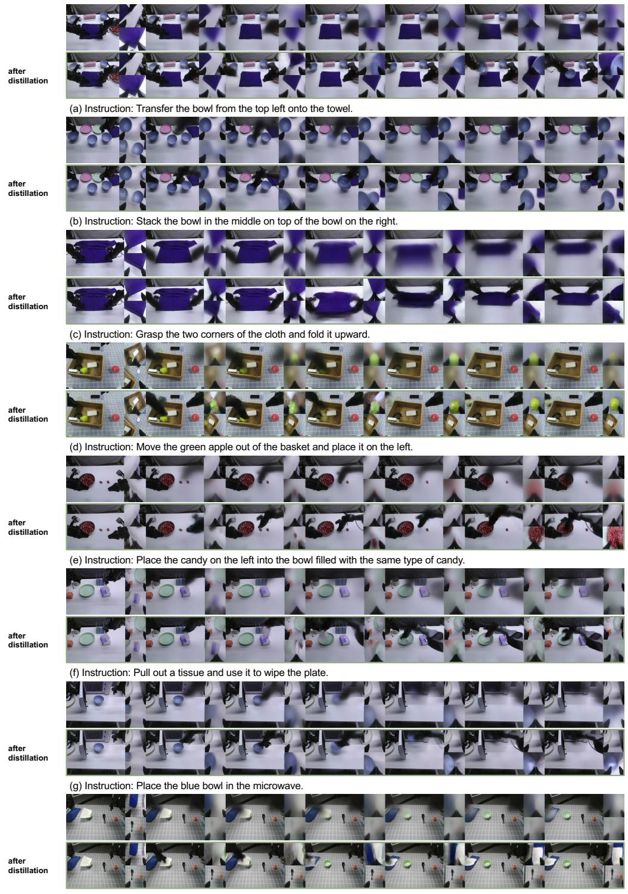  
(h) Instruction: Remove the paper covering the bowl so that the bowl is fully visible.

Figure 10: Additional video prediction results on open-ended tasks. We compare single-step video predictions before and after distillation. Distillation enables high-quality video prediction with just one sampling step.

## C DETAILED BENCHMARK RESULTS

## C.1 DETAILED LIBERO RESULTS

Table 5 reports per-suite success rates on the four standard LIBERO suites (Liu et al., 2023), which correspond to the LIBERO-ID results in Table 3. Baseline results are taken from the original papers and from Zhang et al. (2026d) and Mishra et al. (2026).

<table><tr><td>Method</td><td>Spatial</td><td>Object</td><td>Goal</td><td>Long</td><td>Avg.</td></tr><tr><td> $\pi _ { 0 }$  (Black et al., 2024)</td><td>96.8</td><td>98.8</td><td>95.8</td><td>85.2</td><td>94.2</td></tr><tr><td>π0.5 (Intelligence et al., 2025)</td><td>98.8</td><td>98.2</td><td>98.0</td><td>92.4</td><td>96.9</td></tr><tr><td>MolmoAct (Lee et al., 2025)</td><td>87.0</td><td>95.4</td><td>87.6</td><td>77.2</td><td>86.6</td></tr><tr><td>X-VLA (Zheng et al., 2026)</td><td>98.2</td><td>98.6</td><td>97.8</td><td>97.6</td><td>98.1</td></tr><tr><td>AtomVLA (Sun et al., 2026)</td><td>96.4</td><td>99.6</td><td>97.6</td><td>94.4</td><td>97.0</td></tr><tr><td>Cosmos-Policy (Kim et al., 2026)</td><td>98.1</td><td>100.0</td><td>98.2</td><td>97.6</td><td>98.5</td></tr><tr><td>Fast-WAM (Yuan et al., 2026)</td><td>98.2</td><td>100.0</td><td>97.0</td><td>95.2</td><td>97.6</td></tr><tr><td>DiT4DiT (Ma et al., 2026)</td><td>98.4</td><td>99.6</td><td>98.6</td><td>97.6</td><td>98.6</td></tr><tr><td>Temporal Ratio (Mishra et al., 2026)</td><td>96.3</td><td>99.6</td><td>97.6</td><td>82.6</td><td>94.0</td></tr><tr><td>VPP2 (Ours)</td><td>99.2</td><td>99.8</td><td>98.2</td><td>98.0</td><td>98.8</td></tr></table>

Table 5: Per-suite success rates (%) on the standard LIBERO benchmark. Best results in each column are in bold.

## C.2 DETAILED ROBODOJO RESULTS

RoboDojo (Chen et al., 2026) evaluates generalist manipulation policies on 42 bimanual simulation tasks organized into five capability dimensions. Generalization tests robustness to unseen backgrounds, lighting, clutter, and target objects, and is evaluated under both standard and randomized settings. Precision requires fine-grained target localization and contact-rich control. Long-Horizon requires completing all sub-steps of multi-step tasks. Memory contains tasks whose correct actions depend on information observed earlier in the episode. Open evaluates unseen task specifications whose required skills appear in the training data under different contexts. We follow the official training and evaluation protocol. The average score captures partial task progress, and the success rate measures binary task completion.

Tables 6 and 7 report the per-dimension average score and success rate, respectively, complementing Table 4. Baseline results are taken from the official RoboDojo simulation leaderboard as of September 2026.
<table><tr><td rowspan="2">Method</td><td colspan="2">Generalization</td><td colspan="5"></td></tr><tr><td>Std.</td><td>Rand.</td><td>Precision</td><td>Long-Horizon</td><td>Memory</td><td>Open</td><td>Avg.</td></tr><tr><td>π0 (Black et al., 2024)</td><td>7.18</td><td>0.71</td><td>3.56</td><td>6.19</td><td>3.47</td><td>0.25</td><td>3.48</td></tr><tr><td>π0.5 (Intelligence et al., 2025)</td><td>20.93</td><td>5.82</td><td>12.40</td><td>23.54</td><td>5.89</td><td>1.98</td><td>11.44</td></tr><tr><td>X-VLA (Zheng et al., 2026)</td><td>17.90</td><td>3.04</td><td>18.32</td><td>16.53</td><td>4.76</td><td>0.55</td><td>10.13</td></tr><tr><td>Fast-WAM (Yuan et al., 2026)</td><td>4.33</td><td>0.34</td><td>1.96</td><td>9.14</td><td>3.55</td><td>0.42</td><td>3.48</td></tr><tr><td>OpenWAM-α (Wang et al., 2026)</td><td>33.16</td><td>8.26</td><td>18.45</td><td>34.93</td><td>10.41</td><td>1.41</td><td>17.18</td></tr><tr><td>Xiaomi-Robotics-1 (Guo et al., 2026)</td><td>35.65</td><td>11.44</td><td>26.69</td><td>38.39</td><td>7.81</td><td>3.94</td><td>20.07</td></tr><tr><td>GPT-6-Astra (Zhang et al., 2026c)</td><td>35.32</td><td>31.40</td><td>12.65</td><td>21.45</td><td>43.04</td><td>34.36</td><td>28.97</td></tr><tr><td>VPP2 (Ours)</td><td>32.34</td><td></td><td>39.29</td><td>41.01</td><td>59.58</td><td>5.34</td><td>35.51</td></tr><tr><td>π0 (Black et al., 2024)</td><td>4.89</td><td>0.22</td><td>0.75</td><td>2.00</td><td>2.11</td><td>0.25</td><td>1.53</td></tr><tr><td>π0.5 (Intelligence et al., 2025)</td><td>14.89</td><td>1.44</td><td>5.50</td><td>14.67</td><td>4.67</td><td>1.67</td><td>6.93</td></tr><tr><td>X-VLA (Zheng et al., 2026)</td><td>12.22</td><td>1.33</td><td>12.00</td><td>9.75</td><td>3.56</td><td>0.50</td><td>6.52</td></tr><tr><td>Fast-WAM (Yuan et al., 2026)</td><td>2.11</td><td>0.11</td><td>0.00</td><td>5.17</td><td>3.44</td><td>0.42</td><td>2.03</td></tr><tr><td>OpenWAM-α (Wang et al., 2026)</td><td>25.56</td><td>4.11</td><td>9.25</td><td>25.33</td><td>9.11</td><td>1.08</td><td>11.92</td></tr><tr><td>Xiaomi-Robotics-1 (Guo et al., 2026)</td><td>28.00</td><td>6.00</td><td>18.83</td><td>23.67</td><td>6.56</td><td>3.58</td><td>13.93</td></tr><tr><td>GPT-6-Astra (Zhang et al., 2026c)</td><td>32.67</td><td>28.33</td><td>4.00</td><td>8.25</td><td>38.67</td><td>31.00</td><td>22.48</td></tr><tr><td>VPP2 (Ours)</td><td>25.00</td><td></td><td>30.50</td><td>28.00</td><td>59.33</td><td>4.50</td><td>29.47</td></tr></table>

Table 6: Per-dimension average score on the RoboDojo simulation benchmark. Generalization is evaluated under standard (Std.) and randomized (Rand.) settings. Avg. is the mean over the five capability dimensions, where the generalization score is the mean of the Std. and Rand. settings. For VPP2, we report the generalization result pooled over both settings (25 episodes each, following the official protocol), which equals their mean. Baseline results are taken from the official leaderboard.

Table 7: Per-dimension success rate (%) on the RoboDojo simulation benchmark, computed in the same way as Table 6.