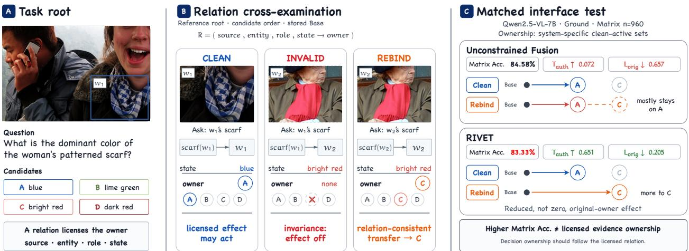
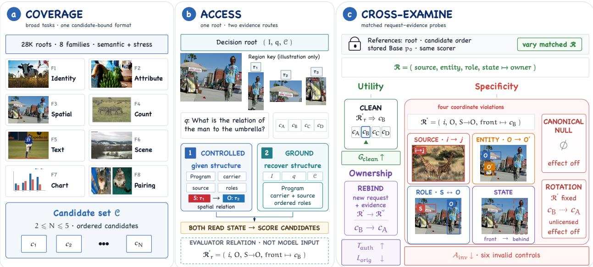
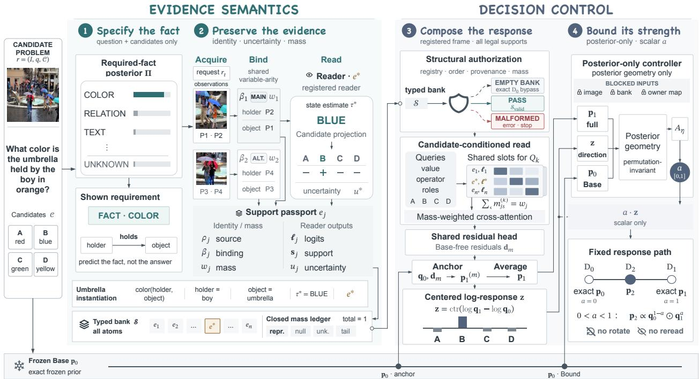

# VISUAL EVIDENCE UNDER CROSS-EXAMINATION: EVALUATING AND CONTROLLING DECISION-LEVEL EVIDENCE USE IN VISION-LANGUAGE MODELS

Huiyao Zhang1,2 Jin Bai1,2 Zilong Su3 Rui Guo1,2 Chaofan Qin1,2 Jinze Lv1,2 Wenhui Yu1,2 Hongfei Wang1,2 Ye Li1,∗

1 Technology and Engineering Center for Space Utilization, Chinese Academy of Sciences 2 University of Chinese Academy of Sciences 3 University of Science and Technology of China

zhanghuiyao25@csu.ac.cn liye@csu.ac.cn (∗ Corresponding author)

## ABSTRACT

Vision-language models increasingly reason through crops, regions, and tool-produced observations. Yet an observation can influence the answer without benefiting the candidate it supports. We study candidate-bound visual contribution: valid evidence should help, invalidating its supporting relation should remove its additional effect, and valid rebinding should redirect that effect to the newly supported candidate. We introduce CROSS-Bench, a benchmark of 28,000 decision problems, with matched invalidation and rebinding tests on a dedicated evaluation subset. Our RIVET interface preserves evidence identity and uncertainty, composes a candidate-conditioned response, and separately controls its strength. Shared-evidence experiments show that task accuracy and evidence ownership can diverge. Under matched capacity and training, RIVET increases normalized effect transfer from 0.512 to 0.651 where clean evidence has a positive effect. The advantage persists on common evaluation examples and across repeated decision-layer fits. With evidence predicted from raw inputs, RIVET improves CROSS-Bench accuracy by an average of 5.70 pp across four frozen backbones, relative to the same models without auxiliary evidence. These results separate the utility of visual evidence from the candidate-specific destination of its effect.

## 1 Introduction

Regions, crops, marked images, visual memories, and tool-produced observations expose intermediate visual evidence during vision-language reasoning [11, 18, 30, 33, 36]. A crop can reveal a small attribute that is hard to resolve in the full image, while a region reference identifies the entity relevant to a claim. Such observations allow the model to revisit particular facts during reasoning. Grounding supervision further connects intermediate claims to visible entities and relations [20, 24, 31], making it possible to inspect which image content was consulted during reasoning. These interfaces make visual information inspectable, but do not by themselves ensure that its effect reaches the supported candidate. A model may localize the right object and read the right state yet assign the resulting update to an unsupported candidate. Evaluating visual evidence therefore requires examining both its content and the candidate-level destination of its effect.

Consider the scarf example in Fig. 1. For a request about one person’s scarf, another person’s red scarf cannot support the answer “red.” Rebinding the request to that other person makes the observation relevant, so its effect should reach the red answer candidate.

Existing work improves visual access, grounds intermediate claims, and diagnoses whether perceived information enters the decision [6, 15, 27]. Counterfactual objectives encourage visual dependence and evidence–answer consistency [28, 32]. Self-Critical Reasoning regularizes correct and competing answers’ visual sensitivities [29], while receiverdependent evidence integration models how external evidence shifts an existing answer distribution [12]. These studies make candidate-level influences explicit, alongside work on visual dependence and the faithfulness of explanations [8, 23]. A complementary question is which candidate receives the observation’s effect as its supporting relation changes? Correctness may follow from priors or other evidence. Corruption sensitivity reveals dependence on the perturbed input, but leaves the destination of that effect open. We call this property decision ownership: whether an established evidence effect follows the answer candidate supported by the current visual relation.

  
Figure 1: Candidate-bound visual contribution. (A) The observation-to-candidate relation; (B) clean, invalid, and rebind request–evidence pairs; (C) utility–ownership dissociation under matched evidence on the 960-root matrix (Qwen2.5-VL-7B, predicted evidence). Ownership uses method-specific clean-active sets. Arrows denote schematic effect destinations, not magnitudes.

We formalize the broader criterion as candidate-bound visual contribution. Utility measures the benefit of valid evidence; specificity tests whether invalidating its supporting relation removes the additional effect; and ownership asks whether an established effect follows a valid change of owner. Suppressing every observation can pass invalidation without using evidence. Conversely, rewarding a fixed candidate can improve accuracy without following the visual relation. Valid rebinding supplies the positive requirement missing from either behavior: the established effect should redirect to the newly supported candidate. The criterion evaluates changes in the candidate posterior rather than only whether the top answer changes. When the original input already favors one answer, valid evidence can still add support, and a wrongly directed update can remain hidden behind the same final prediction.

CROSS-Bench operationalizes this criterion through matched clean, invalid, and rebinding conditions on a dedicated evaluation subset of its 28,000 decision roots. The benchmark covers visual attributes, counts, spatial relations, and text/chart/graph states. Effects are measured relative to Base, which sees the original image, question, and answer candidates but does not use auxiliary observations. The same predicted observations can be supplied to different decision interfaces, so differences in their candidate-level effects need not arise from different visual readings. Full-suite task accuracy provides a complementary view of the predictive utility of the evidence.

The criterion also motivates separating which candidates the evidence supports from how strongly it should act. An observation’s relevance depends on its source and semantic role, which a confidence score alone does not specify. These relations must remain available when composing multiple observations for each candidate. RIVET preserves evidence identity, bindings, candidate alignment, and uncertainty across specialized visual readers, composes evidence around candidate queries, and then controls response strength with a scalar. Candidate-conditioned composition gives each alternative access to the full evidence set, so the response can depend on how observations support that alternative jointly. The scalar controller operates on this composed response, retaining a distinction between the evidence’s candidate alignment and the size of the resulting update. Uncertainty accompanies the observations throughout composition, so an uncertain reading need not become complete support for a candidate.

## Our contributions are threefold:

• We introduce candidate-bound visual contribution and CROSS-Bench, a 28,000-root benchmark with paired tests on a dedicated subset that evaluate whether visual evidence helps when valid, loses its additional effect when invalidated, and transfers that effect under valid rebinding.

• We develop RIVET, a shared evidence-to-decision interface that preserves identity, candidate alignment, and uncertainty across specialized visual readers, composes evidence through candidate-conditioned representations, and separately controls response strength with a scalar posterior controller.

• We show that task accuracy and evidence ownership can diverge under matched evidence. Relative to a capacitymatched fusion control under matched training, RIVET increases effect transfer, normalized to the clean effect, from 0.512 to 0.651 on each method’s clean-active roots. With evidence predicted from raw inputs, it also improves task accuracy over Base by an average of 5.70 pp across four frozen backbones.

## 2 Related Work

Visual evidence acquisition and grounding. Visual reasoning interfaces expose local content through crops, marks, and region references [18, 33]. Visual CoT pairs intermediate region annotations with a multi-turn pipeline, while Set-of-Mark assigns regions visual identifiers that can be referenced in language. Beyond fixed observations, $\mathrm { V } ^ { \star }$ uses language-guided search to recover details in high-resolution images [30]. Tool-using models acquire additional views during reasoning [11, 36]: DeepEyes learns active visual inspection, and $\mathrm { \Delta V L M { - } \mathrm { \check { R } } ^ { 3 } }$ learns when and where to acquire additional views and incorporate them into an interleaved reasoning chain. Localization supervision and grounded chains of thought connect intermediate claims to visible objects and relations. Grounded Chain-of-Thought studies stepwise localization and answer–grounding consistency [31]; TreeVGR jointly supervises localization and reasoning [24]; and RegionReasoner requires explicit region references and encourages global–local consistency [20] These approaches improve visual access and the traceability of reasoning.

Evidence utilization and counterfactual dependence. Multimodal benchmarks assess visual necessity and fine-grained perception [5, 35]. Diagnostic studies examine perception–reasoning gaps [6, 15, 17, 27]. Seeing but Not Believing distinguishes attention to relevant content from its use in a decision; CogFlow studies the integration of perceived cues; and Compose and Fuse examines bottlenecks in task composition and cross-modal fusion. Counterfactual objectives probe visual dependence [28], including evidence–answer consistency under image masking [32]. Such interventions examine whether predictions change when relevant visual information is removed or corrupted. Faithfulness studies test explanations against decisions [8, 23], and Self-Critical Reasoning regularizes correct and competing answers’ visual gradient sensitivities [29]. Visual evidence selection evaluates output-distribution utility [16], while receiver-dependent integration models candidate-specific evidence relative to a prior [12]. Detecting an influence under a given support relation does not by itself establish how that influence changes when the relation becomes invalid or validly supports a different candidate.

Visual binding and compositionality. Attribute and relation benchmarks test whether models distinguish compositions built from the same objects and concepts. ARO examines attribute assignment, relations, and word order [34], while Winoground requires distinguishing image–caption pairs whose captions contain the same words [21]. Careful negative construction is needed to avoid linguistic shortcuts; SugarCrepe addresses this issue through fluent hard negatives that reduce linguistic artifacts in negative captions [9]. Entity-grounded composition and reusable visual programs structure visual reasoning [7, 14]. CoVLM interleaves language generation with visual detection, retaining explicit visual entities and relations as text is generated. GENOME constructs executable visual modules and reuses them across tasks, making the reasoning procedure available as a sequence of operations rather than a single holistic prediction. Mechanistic analyses examine internal feature binding [2], including how visual features are associated with objects and how failures in these associations relate to binding errors.

## 3 Candidate-Bound Visual Contribution

We compare visual evidence effects over a finite, ordered candidate set $\mathcal { C } _ { i }$ . Each decision problem, or root, $r _ { i } =$ $\left( I _ { i } , q _ { i } , \mathcal { C } _ { i } , y _ { i } \right)$ contains an image, request, candidates, and clean answer. The Base posterior $\mathbf { p } _ { i } ^ { 0 }$ uses the same image, request, candidates, and scoring procedure, without auxiliary observations. For each evidence condition $\iota ,$ the evaluator records the support relation

$$
\mathcal { R } _ { i } ^ { \iota } : ( \mathrm { s r c } , \mathrm { e n t } , \mathrm { r o l e } , \mathrm { s t a t e } ) _ { i } ^ { \iota } \mapsto o _ { i } ^ { \iota } ,\tag{1}
$$

where $o _ { i } ^ { \iota } \in \mathcal { C } _ { i } \cup \{ \mathcal { O } \}$ is the candidate supported by this relation, with ∅ denoting no valid owner. Each trial supplies an observable evidence–request pair $u _ { i } ^ { \iota }$ . The request specifies the relevant source, entity, and roles without revealing the answer. Ground-truth states, owners, and intervention labels remain evaluator-side.

The same candidate interface answers each condition’s supplied request. Clean trials address $q _ { i } ;$ valid rebinding addresses $q _ { i } ^ { \prime }$ with matching evidence. The primary rebinding test retains the original root, candidate order, and stored $\mathbf { p } _ { i } ^ { 0 }$ as references. It measures the new owner’s effect relative to the original Base when the request and supporting relation change together. A complementary test fixes $q _ { i } ^ { \prime } ,$ , recomputes Base and evidence-conditioned responses, and varies evidence relevance. This measures within-request selectivity, complementing the cross-request transfer test. Both tests apply to any system exposing matched candidate posteriors, without requiring RIVET’s typed representation.

## 4 CROSS-Bench: Evaluating Candidate-Bound Evidence Use

CROSS-Bench operationalizes this criterion through paired evidence interventions. It contains 28,000 decision roots constructed from public annotations, including Visual Genome, GQA, and TextOCR [10, 13, 19], and deterministic renderings, with a frozen test set of 5,600 roots. Each root pairs an image and question with $N _ { i } = | { \mathcal { C } } _ { i } | \in \{ 2 , 3 , 4 , 5 \}$ candidates and a source–entity–role–state relation. Accuracy uses the clean question; primary relation probes vary the evidence relation against the same Base reference (Fig. 1).

A prediction-blind subset of 960 test roots supports complete relation interventions, with 707 admitting valid rebinding. This subset diagnoses evidence use; all 5,600 roots measure full-suite accuracy. Train/dev/test partitions are sourcecluster-disjoint. Across 1,200 reviewed roots, both reviewers confirm unique valid targets on 98.8% and answer neutrality on 99.3%; they also assess alternative-owner validity.

Two evidence-access routes. Controlled supplies the required-fact specification, source identity, and ordered roles; Ground predicts them from raw inputs. Both infer typed state without owner or intervention labels. Crops in Fig. 2(b) illustrate the carriers; they are not extra Ground inputs. Ground predicts access before replay. Observation replacements restart acquisition; role changes reuse observations but rerun reading and subsequent stages. Typed-state replay replace state at fixed bindings before the shared decision suffix.

For each matrix root, clean preserves the relation and canonical null removes auxiliary contribution. Wrong-source, wrong-entity, wrong-role, and wrong-state invalidate individual coordinates; unauthorized candidate rotation breaks evidence–candidate association without reordering candidates. These invalid conditions should remove the additional effect.

Valid rebinding changes the request and supporting relation together, so the established effect should follow the newly supported candidate. In the scarf example, selecting the other person’s scarf and asking about that person makes the new color relevant. Requests identify the person and attribute without stating the color. A companion control fixes the new request and varies its evidence.

We summarize utility by clean gain $G _ { \mathrm { c l e a n } } ,$ specificity by invalid activity $A _ { \mathrm { i n v } } ,$ and ownership by authorized transfer $T _ { \mathrm { a u t h } }$ and original-owner leakage $L _ { \mathrm { o r i g } }$ . Let pι denote the posterior under condition ι, let $\bar { p } _ { i , c } ^ { \iota } = \operatorname* { m a x } ( p _ { i , c } ^ { \iota } , \epsilon )$ with numerical floor $\epsilon = 1 0 ^ { - 8 }$ , and let ${ \mathcal { T } } _ { \mathrm { i n v } }$ contain canonical null, single-coordinate relation violations, and unauthorized rotation:

$$
\begin{array} { r l } & { G _ { \mathrm { c l e a n } } = \mathbb { E } _ { i } \left[ \log \frac { \bar { p } _ { i , y _ { i } } ^ { \mathrm { c l e a n } } } { \bar { p } _ { i , y _ { i } } ^ { 0 } } \right] , } \\ & { \quad A _ { \mathrm { i n v } } = \mathbb { E } _ { i } \left[ \underset { \iota \in \mathbb { Z } _ { \mathrm { i n v } } } { \mathrm { m a x ~ } } \mathrm { T V } \left( \mathbf { p } _ { i } ^ { \iota } , \mathbf { p } _ { i } ^ { 0 } \right) \right] . } \end{array}\tag{2}
$$

$G _ { \mathrm { c l e a n } }$ measures the correct candidate’s log-score change, including improvements that leave the argmax unchanged. With $\begin{array} { r } { \mathrm { T V } ( \mathbf { p } , \mathbf { q } ) = \frac { 1 } { 2 } \| \mathbf { p } - \mathbf { q } \| _ { 1 } , A _ { \mathrm { i n v } } } \end{array}$ captures each root’s largest posterior movement across invalid relations, rather than averaging across invalid conditions.

  
Figure 2: CROSS-Bench evaluation protocol. Controlled supplies evidence-access structure and Ground predicts it; both estimate visual state. Clean, invalid, and rebind conditions test utility, specificity, and ownership over 2–5 candidates.

Ownership tests an effect that clean evidence has already established. We therefore evaluate it on scoreable rebindingeligible roots where clean evidence increases the original owner’s probability; this clean-active set is method-specific. Under clean evidence, $o _ { i } = y _ { i } ;$ valid rebinding introduces another valid relation supporting a new owner $n _ { i } \neq o _ { i }$ . With $[ x ] _ { + } = \operatorname* { m a x } ( x , 0 )$ , define $\dot { \Delta } _ { i , c } ^ { \iota } = p _ { i , c } ^ { \iota } - p _ { i , c } ^ { 0 } , \mathcal { D } ^ { + } = \{ i : \Delta _ { i , o _ { i } } ^ { \mathrm { c l e a n } } > \delta _ { \Delta } \}$ for clean-effect threshold $\delta _ { \Delta } = 0 . 0 1 0$ (one percentage point), and $b _ { i } = [ \Delta _ { i , o _ { i } } ^ { \mathrm { c l e a n } } ] _ { + } + \epsilon \mathrm { : }$

$$
\begin{array} { r l } & { T _ { \mathrm { a u t h } } = \mathbb { E } _ { i \in \mathcal { D } ^ { + } } \left[ \operatorname* { m i n } \left( 1 , \frac { [ \Delta _ { i , n _ { i } } ^ { \mathrm { r e b i n d } } ] _ { + } } { b _ { i } } \right) \right] , } \\ & { L _ { \mathrm { o r i g } } = \mathbb { E } _ { i \in \mathcal { D } ^ { + } } \left[ \frac { [ \Delta _ { i , o _ { i } } ^ { \mathrm { r e b i n d } } ] _ { + } } { b _ { i } } \right] . } \end{array}\tag{3}
$$

Relative to the original Base, $T _ { \mathrm { a u t h } }$ measures the positive new-owner increment and $L _ { \mathrm { o r i g } }$ the positive original-owner residual, both normalized by the clean effect. These quantities are not success rates. Unnormalized candidate changes provide the complementary effect scale. Transfer is capped; leakage remains uncapped to expose amplification. Fixed-request controls instead use each request’s own Base to measure evidence selectivity.

## 5 RIVET: A Candidate-Bound Evidence-to-Decision Interface

RIVET preserves evidence identity, bindings, and candidate meaning through composition, then separately scales the response (Fig. 3). SPECIFY identifies required facts; PRESERVE binds and reads observations; COMPOSE organize evidence around each candidate; and BOUND controls response strength.

For ordinary task inference with candidate set ${ \mathcal { C } } ,$ we omit the root index and use subscripts 0, 1, 2 for decision endpoints:

$$
\begin{array} { r l r } & { \mathbf { I I } = \mathrm { S p e c i f y } ( q , \mathcal { C } ) , \qquad } & { S = \mathrm { P r e s e r v e } ( I , \mathbf { I I } , \mathcal { C } ) , } \\ & { \mathbf { p } _ { 1 } = \mathrm { C o m p o s e } _ { \theta } ( \mathbf { p } _ { 0 } , \mathcal { S } , \mathcal { C } ) , \qquad } & { \mathbf { p } _ { 2 } = \mathrm { B o u n d } ( \mathbf { p } _ { 0 } , \mathbf { p } _ { 1 } , \mathbf { z } ) . } \end{array}\tag{4}
$$

The three endpoints are anchored to the same Base posterior, with $D _ { 0 } = { \bf p } _ { 0 } . D _ { 1 } = { \bf p } _ { 1 }$ incorporates the full evidence response, whose Base-relative log change defines z in Eq. $6 ; D _ { 2 } = { \bf p } _ { 2 }$ controls its strength. Primary relation probes

  
Figure 3: Overview of RIVET. SPECIFY plans visual requirements; PRESERVE acquires, binds, and reads observations through a shared typed interface. COMPOSE uses candidate queries to organize and read the complete evidence set; BOUND scales the resulting posterior response. Highlighted $e ^ { * }$ follows one illustrative support through the pipeline. Here $\mathbf { q } _ { t } = \operatorname* { m a x } ( \mathbf { p } _ { t } , \epsilon )$ for $\bar { t } \in \{ 0 , 1 \}$

supply $u _ { i } ^ { \iota } \left( \mathrm { S e c . } \ 3 \right)$ at the stage receiving the changed evidence or request, then rerun subsequent steps against the same Base.

## 5.1 Specify and Preserve

Required-fact planning. The question and complete candidate set determine which visual distinctions matter: color alternatives require an attribute, whereas spatial alternatives require an ordered relation. SPECIFY predicts these requirements from $( q , { \mathcal { C } } )$ without image or Base access. Its output Π retains uncertainty over registered requirements, specifying what to observe rather than a preferred answer.

PRESERVE executes the active requirements. Acquisition obtains observations; a shared Binder retains weighted assignments to semantic roles. Specialized Readers estimate attributes, counts, spatial relations (direction, relative depth, and proximity), or text/chart/graph states for these bindings. Their distinct state vocabularies map into one candidate-aligned interface for the shared Composer. One observation may support multiple requirements with separate identities and weights: shared pixels need not imply the same semantic role.

Candidate-bound support. Reading “red” is insufficient without knowing whose scarf was observed. Each atom joins provenance $\rho _ { j }$ and ordered binding $\beta _ { j }$ with candidate-aligned Reader logits $\ell _ { j }$ , their centered form ${ \bf s } _ { j }$ , uncertainty $u _ { j }$ and represented mass $w _ { j }$ . Here $u _ { j }$ summarizes evidence uncertainty, while $w _ { j }$ is the share of upstream hypothesis probability represented by this atom. With $N = | \mathcal { C } |$ and $\operatorname { c t r } ( \mathbf { v } ) = \mathbf { v } - N ^ { - 1 } ( \mathbf { 1 } ^ { \top } \mathbf { v } ) \mathbf { 1 }$ ,

$$
\begin{array} { r } { e _ { j } = \left( \rho _ { j } , \beta _ { j } , \ell _ { j } , \mathbf { s } _ { j } , u _ { j } , w _ { j } \right) , \mathbf { s } _ { j } = \mathrm { c t r } ( \boldsymbol { \ell } _ { j } ) , \mathbf { \qquad 1 } ^ { \top } \mathbf { s } _ { j } = 0 . } \end{array}\tag{5}
$$

Binding identifies whose state is read; a registered deterministic map aligns the Reader state to candidate values in $\ell _ { j }$ Subtracting the candidate mean yields centered relative evidence ${ \bf s } _ { j }$ . Unrepresented mass remains in null, unknown, or tail channels, so surviving observations are not promoted to complete support by renormalization.

## 5.2 Compose: One Full-Evidence Response

COMPOSE turns the aligned observations into a joint candidate response. A deterministic structural check verifies the operator, candidate order, positive mass, and provenance, yielding $ { S _ { \mathrm { v a l i d } } }$ . Reading or binding errors with valid schemas can pass these checks. All authorized atoms participate; an empty evidence set leaves Base unchanged. The full response and its centered log-posterior change are

$$
\begin{array} { r l } & { \mathbf { p } _ { 1 } = \mathrm { C o m p o s e } _ { \theta } \left( \mathbf { p } _ { 0 } , S _ { \mathrm { v a l i d } } , \mathcal { C } \right) , } \\ & { \mathbf { q } _ { t } = \operatorname* { m a x } ( \mathbf { p } _ { t } , \epsilon ) , \qquad t \in \{ 0 , 1 \} , } \\ & { \mathbf { z } = \mathrm { c t r } \left( \log \mathbf { q } _ { 1 } - \log \mathbf { q } _ { 0 } \right) . } \end{array}\tag{6}
$$

Candidate query $\mathbf { x } _ { k }$ encodes its value, operator, and roles. With atom embeddings and aligned Reader logits, it determines assignment scores $a _ { j k v }$ from atom j to slot v:

$$
\omega _ { j k v } = w _ { j } \frac { \exp { a _ { j k v } } } { \sum _ { u } \exp { a _ { j k u } } } , \qquad \sum _ { v } \omega _ { j k v } = w _ { j } .
$$

Each candidate can organize the atoms differently, but the assignments preserve every atom’s total mass $w _ { j }$ for that candidate. Candidate conditioning thus acts inside aggregation, while unresolved mass stays separate. Mass-weighted cross-attention reads the slots. Each of five separately fitted Composer members produces a Base-free residual with a shared head, centers it, and applies tanh and a learned positive scale. Softmax normalization after addition to Base log probabilities gives member posteriors, whose average is $\mathbf { p } _ { 1 }$

## 5.3 Bound: Strength-Only Control

Once COMPOSE forms the response, BOUND controls its strength. Geo collects permutation-invariant summaries of posterior uncertainty, disagreement, and the centered response. These determine one scalar $^ { a , }$ not a candidate-specific correction. When structurally valid support exists,

$$
a = \sigma [ A _ { \eta } ( \mathrm { G e o } _ { N } ( { \bf p } _ { 0 } , { \bf p } _ { 1 } , { \bf z } ) ) ] ,
$$

$$
\mathbf { p } _ { 2 } = \left\{ \begin{array} { l l } { \mathbf { p } _ { 0 } , } & { a = 0 , } \\ { \mathrm { N o r m a l i z e } \left( \mathbf { q } _ { 0 } ^ { 1 - a } \odot \mathbf { q } _ { 1 } ^ { a } \right) , } & { 0 < a < 1 , } \\ { \mathbf { p } _ { 1 } , } & { a = 1 . } \end{array} \right.\tag{7}
$$

The learned branch yields $0 < a < 1 ; a = 0$ and a = 1 define exact Base and full-response control endpoints. For any candidates $c , k ,$ , the interior branch satisfies

$$
\log \frac { p _ { 2 , c } } { p _ { 2 , k } } - \log \frac { q _ { 0 , c } } { q _ { 0 , k } } = a \left[ \log \frac { q _ { 1 , c } } { q _ { 1 , k } } - \log \frac { q _ { 0 , c } } { q _ { 0 , k } } \right] .\tag{8}
$$

Equation (8) scales every evidence-induced pairwise log-odds change by the same nonnegative scalar, preserving its sign. BOUND attenuates the existing response; candidate-wise control would additionally allow its effect to be redirected across candidates.

Training. The SPECIFY planner and Binder use separate program and role supervision. Composer learns task likelihood and calibration on CROSS-Bench train. BOUND minimizes NLL on fixed posterior pairs from Composer members fitted without gradient updates on those roots; Bound fitting and checkpoint selection use disjoint roots. Acquisition and Readers remain frozen; projection and authorization are deterministic. Owner maps and evaluation-condition labels supervise no component.

## 6 Experiments

Our experiments examine both the predictive value of visual evidence and the destination of its decision effect. We first compare accuracy and ownership under shared evidence, then evaluate backbone reuse and task generalization, and finally examine the roles of evidence alignment and response control.

Systems. We evaluate a Qwen2.5-VL-7B Base and four released reasoners: VLM-R3-7B, Pixel-Reasoner-7B, DeepEyes-7B, and TreeVGR-7B [4, 11, 24, 25, 36]. With shared evidence, we compare prompting, pooled fusion, Unconstrained Residual Fusion (Unconstrained Fusion), calibrated aligned summation, and Capacity-matched Fusion. RIVET uses four frozen backbones: Qwen2.5-VL-7B, Qwen3-VL-8B, InternVL3.5-8B, and LLaVA-OneVision-2-8B [1, 3, 4, 26].

Metrics and protocol. CROSS-Bench accuracy uses native final answers or vector argmax, with equal root weights. Task gains use all 5,600 test roots; Table 1 uses the nested 960-root intervention matrix. ∆Acc. denotes gains over Base in percentage points (pp). Posterior metrics use softmax-normalized option-identifier log likelihoods at the terminal answer slot or an interface’s candidate vector; all required vectors must be available, complete, finite, and in the fixed candidate order. RIVET uses Ground unless noted; CV-Bench uses official source-balanced aggregation.

## 6.1 Main Results: Accuracy and Ownership Diverge

Higher accuracy does not imply stronger ownership. Released reasoners benefit from clean evidence, yet remain sensitive to invalid evidence and transfer the clean effect incompletely (Table 1a). The shared-evidence comparison makes this separation clearer. Unconstrained Fusion achieves the highest observed accuracy and clean utility, but much of its effect remains with the original owner after valid rebinding. RIVET has lower matrix accuracy (83.33% versus 84.58%), yet raises transfer from 0.072 to 0.651 and lowers leakage from 0.657 to 0.205 with the same predicted evidence (Table 1b). The ownership ordering also holds on common clean-active roots. Evidence can therefore be useful for prediction without directing its effect to the candidate supported by the current relation.

Table 1: CROSS-Bench results on the 960-root intervention matrix. (a) Released-system diagnosis; posterior metrics use each checkpoint’s no-auxiliary reference. (b) Shared predicted evidence and Qwen2.5-VL-7B Base. Clean-active counts give scoreable positive-effect roots out of 707 rebinding-eligible roots; ownership uses these method-specific sets $( ^ { 6 6 } - ^ { 5 3 } :$ undefined).
<table><tr><td>Method</td><td>Acc. (%)↑</td><td> $G _ { \mathrm { c l e a n } }$  ←</td><td> $A _ { \mathrm { i n v } }$  →</td><td>Clean-active</td><td> $T _ { \mathrm { a u t h } }$  ↑  $/ L _ { \mathrm { o r i g } } \downarrow$ </td></tr><tr><td>(a) Released-system diagnosis</td><td></td><td></td><td></td><td></td><td></td></tr><tr><td>Qwen2.5-VL-7B (Base)</td><td>64.90</td><td>0.000</td><td>0.000</td><td>0/707</td><td></td></tr><tr><td>VLM-R³-7B</td><td>72.50</td><td>0.153</td><td>0.162</td><td>355/707</td><td>0.413 / 0.274</td></tr><tr><td>Pixel-Reasoner-7B</td><td>71.04</td><td>0.128</td><td>0.143</td><td>332/707</td><td>0.427 / 0.253</td></tr><tr><td>DeepEyes-7B</td><td>75.10</td><td>0.184</td><td>0.171</td><td>386/707</td><td>0.462 / 0.283</td></tr><tr><td>TreeVGR-7B</td><td>73.96</td><td>0.161</td><td>0.187</td><td>367/707</td><td>0.497 / 0.308</td></tr><tr><td>(b) Shared-evidence interface comparison</td><td></td><td></td><td></td><td></td><td></td></tr><tr><td>Direct Evidence Prompt</td><td>70.73</td><td>-0.241</td><td>0.310</td><td>248/707</td><td>0.107 / 0.899</td></tr><tr><td>Pooled Support Fusion</td><td>80.94</td><td>0.218</td><td>0.477</td><td>574/707</td><td>0.190 / 0.362</td></tr><tr><td>Calibrated Aligned Sum</td><td>79.79</td><td>0.221</td><td>0.000</td><td>487/707</td><td>0.603 / 0.237</td></tr><tr><td>Unconstrained Fusion</td><td>84.58</td><td>0.296</td><td>0.346</td><td>612/707</td><td>0.072 / 0.657</td></tr><tr><td>Capacity-matched Fusion</td><td>84.27</td><td>0.289</td><td>0.000</td><td>547/707</td><td>0.512 / 0.286</td></tr><tr><td>RIVET</td><td>83.33</td><td>0.281</td><td>0.000</td><td>521/707</td><td>0.651 / 0.205</td></tr></table>

Candidate conditioning matters beyond alignment. Calibrated Aligned Sum already achieves transfer of 0.603, showing the value of preserving evidence–candidate alignment. RIVET improves on this result while raising matrix accuracy from 79.79% to 83.33%. To examine the role of composition, Capacity-matched Fusion retains the same evidence, training setup, output queries, and scalar control, but pools evidence independently of the queried candidate. RIVET raises transfer from 0.512 to 0.651 under this comparison, with the advantage persisting on common clean-active roots and across three paired fits. On common roots, RIVET also produces a larger positive new-owner increment before normalization. Candidate conditioning thus improves where the evidence acts, beyond supplying aligned inputs.

Selective responses to semantic errors and evidence mismatch. Structural checks cannot reject a wrong reading whose schema is valid. On 400 clean/error pairs that hold the request and Base fixed, RIVET produces a smaller response to such errors than Capacity-matched Fusion: mean invalid TV is 0.022 versus 0.058 under the same structural checks. Both methods retain positive clean-evidence gains.

We next fix the request and vary whether the evidence concerns the requested entity and role. On 638 common roots under the new request, RIVET has similar mean matched log gain to Capacity-matched Fusion (0.229 versus 0.225), while reducing the gain from crossed evidence about the wrong entity or role (0.022 versus 0.063). The log-gain response thus favors relevant support while limiting the influence of mismatched evidence. The original request shows the same pattern; candidate-probability contrasts remain inconclusive.

## 6.2 Backbone Reuse and Task Generalization

Task gains and ownership patterns persist across Base models. Ground improves all four backbones, averaging +5.70 pp on the 5,600 CROSS-Bench test roots, with transfer near 0.65 and leakage near 0.21 across models (Table 2a). Composer is trained jointly with Base posteriors from these four backbones, and the fitted interface is reused without backbone-specific refitting. Controlled adds a further 1.84 pp on average with the same Readers, Composer, and Bound, indicating remaining headroom in fact planning, source selection, and role assignment.

The task gains extend beyond CROSS-Bench. Frozen Ground improves accuracy over Base in all 16 backbone– benchmark pairs on V⋆Bench, MMStar, CV-Bench, and MME-RealWorld-Lite (MME-RW-L) [5, 22, 30, 35], averaging +2.95 to +7.04 pp by benchmark (Table 2b). Capacity-matched Fusion also benefits from shared evidence, and the accuracy ranking between the two interfaces varies across tasks.

Independent relations show the same directional pattern. We further test transfer and selectivity on independently authored relations. On 320 attribute and spatial roots, RIVET has estimated transfer of 0.563 versus 0.447 for Capacity-matched Fusion. The ordering persists on common clean-active roots, although the paired comparison remains statistically inconclusive. A separate collection of 900 roots spans four relation types and tests selectivity under fixed requests. Across its 830 common scoreable roots, RIVET again preserves similar mean matched gain while reducing crossed gain at the request-supported candidate, consistent with the selectivity pattern on CROSS-Bench.

Table 2: Backbone reuse and task generalization. (a) CROSS-Bench accuracy on 5,600 roots (parentheses: gains over Base in pp); Ground ownership on the 960-root matrix with method-specific active sets. (b) Frozen Ground task generalization averaged over four backbones with shared predicted evidence.

(a) CROSS-Bench: backbone and route replication
<table><tr><td>Backbone</td><td>Base Acc. (%)↑</td><td>Controlled Acc. (%)↑</td><td>Ground Acc. (%)↑</td><td>Ground Tauth ↑ / Lorig ↓</td></tr><tr><td>Qwen2.5-VL-7B</td><td>66.34</td><td>73.18 (+6.84)</td><td>71.30 (+4.96)</td><td>0.651 / 0.205</td></tr><tr><td>Qwen3-VL-8B</td><td>67.96</td><td>75.89 (+7.93)</td><td>73.93 (+5.97)</td><td>0.638 / 0.216</td></tr><tr><td>InternVL3.5-8B</td><td>62.98</td><td>71.25 (+8.27)</td><td>69.45 (+6.47)</td><td>0.659 / 0.225</td></tr><tr><td>LLaVA-OneVision-2-8B</td><td>66.00</td><td>73.11 (+7.11)</td><td>71.39 (+5.39)</td><td>0.647 / 0.196</td></tr><tr><td>Mean over backbones</td><td>65.82</td><td>73.36 (+7.54)</td><td>71.52 (+5.70)</td><td>0.649 / 0.211</td></tr></table>

(b) Frozen Ground task generalization across external benchmarks
<table><tr><td>Endpoint / contrast</td><td>V*Bench</td><td>MMStar</td><td>CV-Bench</td><td>MME-RW-L</td></tr><tr><td>Mean Base Acc. (%)</td><td>77.49</td><td>61.77</td><td>81.62</td><td>49.19</td></tr><tr><td>Mean Capacity-matched Acc. (%)</td><td>82.85</td><td>64.92</td><td>84.85</td><td>55.90</td></tr><tr><td>Mean RIVET Acc. (%)</td><td>83.38</td><td>64.72</td><td>85.14</td><td>56.23</td></tr><tr><td>RIVET – Base (pp)</td><td>+5.89</td><td>+2.95</td><td>+3.52</td><td>+7.04</td></tr></table>

Table 3: State-only Oracle and architectural controls. (a) Oracle retains predicted bindings, active sets, and cleaneffect normalizers per interface; owner labels remain hidden. (b) Qwen2.5-VL-7B Ground: accuracy on 5,600 roots (parentheses: gains over Base in pp); relation metrics on the 960-root matrix, with ownership fixed to Full RIVET’s 521 active roots and clean-effect normalizers.  
(a) State-only Oracle
<table><tr><td>Decision interface</td><td>Predicted state  $T _ { \mathrm { a u t h } }$  ←  $/ L _ { \mathrm { o r i g } } .$  →</td><td>Oracle state  $T _ { \mathrm { a u t h } } \uparrow / L _ { \mathrm { o r i g } } \downarrow$  1</td></tr><tr><td>Unconstrained Fusion</td><td>0.072 / 0.657</td><td>0.101 / 0.612</td></tr><tr><td>Capacity-matched Fusion</td><td>0.512 / 0.286</td><td>0.564 / 0.253</td></tr><tr><td>RIVET</td><td>0.651 / 0.205</td><td>0.685 / 0.171</td></tr></table>

(b) Architectural controls
<table><tr><td>Variant</td><td>Acc. (%)↑</td><td> $G _ { \mathrm { c l e a n } }$  ←</td><td> $A _ { \mathrm { i n v } } \downarrow$ </td><td>Tauth ↑  $/ L _ { \mathrm { o r i g } } ~ .$  1</td></tr><tr><td>Qwen2.5-VL-7B (Base)</td><td>66.34</td><td>0.000</td><td>0.000</td><td>一</td></tr><tr><td>Full RIVET</td><td>71.30 (+4.96)</td><td>0.281</td><td>0.000</td><td>0.651 / 0.205</td></tr><tr><td>Hard program selection</td><td>70.52 (+4.18)</td><td>0.179</td><td>0.004</td><td>0.083 / 0.056</td></tr><tr><td>Shuffled evidence bindings</td><td>70.96 (+4.62)</td><td>0.264</td><td>0.006</td><td>0.296 / 0.402</td></tr><tr><td>Renormalize represented mass</td><td>70.75 (+4.41)</td><td>0.221</td><td>0.014</td><td>0.421 / 0.344</td></tr><tr><td>Pre-Compose evidence selection</td><td>70.63 (+4.29)</td><td>0.234</td><td>0.007</td><td>0.507 / 0.276</td></tr><tr><td>No scalar Bound  $( D _ { 1 } )$ </td><td>70.98 (+4.64)</td><td>0.265</td><td>0.000</td><td>0.676 / 0.194</td></tr><tr><td>Candidate-wise Bound</td><td>71.55 (+5.21)</td><td>0.298</td><td>0.000</td><td>0.468 / 0.346</td></tr></table>

## 6.3 Analysis of Evidence Alignment and Response Control

Better state estimates do not close the ownership gap. Replacing predicted visual states with Oracle states improves transfer and reduces leakage for both interfaces (Table 3a). Transfer rises from 0.512 to 0.564 for Capacity-matched Fusion and from 0.651 to 0.685 for RIVET, with evidence acquisition and bindings unchanged. Even with corrected states, the capacity-matched interface remains below RIVET with predicted states. More accurate readings help, but do not by themselves determine which candidate receives the evidence effect.

Identity and complete support matter beyond accuracy. Shuffling evidence bindings retains most of RIVET’s accuracy gain but more than halves transfer and increases leakage in frozen replay (Table 3b). Evidence can remain predictive even when its association with the supported candidate is weakened.

Reducing support before composition also harms ownership. Hard program selection weakens clean utility and nearly removes transfer despite low leakage; low leakage alone therefore does not establish successful rebinding. Renormalizing represented mass while removing unresolved-mass channels reduces transfer and increases leakage, as does pre-Compose evidence selection. Preserving bindings and uncertainty through composition matters beyond retaining enough information to answer correctly.

Bound calibrates an existing evidence response. Scalar Bound adds 0.32 pp in accuracy and improves clean utility over the unattenuated response $D _ { 1 } ,$ while $\bar { D } _ { 1 }$ retains slightly better mean ownership scores (Table 3b). Refitting with candidate-wise control pushes accuracy higher still, but reduces transfer and increases leakage. Bound’s benefit lies in calibrating the strength of an already composed response. Together, these comparisons support assigning candidate-specific evidence use to composition and leaving strength calibration to a shared scalar.

## 7 Conclusion and Limitations

CROSS-Bench shows that useful visual evidence need not direct its effect to the candidate supported by the underlying relation. RIVET addresses this gap through candidate-conditioned composition and separate strength control, improving transfer over Capacity-matched Fusion while retaining task gains over Base across frozen backbones and external benchmarks. These findings motivate evaluating evidence utility and effect destination together. The criterion focuses on positive contributions in finite candidate sets with explicit, annotatable relations; RIVET relies on registered typed state vocabularies and remains susceptible to schema-valid reading errors. Extending the analysis to contradictory or temporal evidence and open-ended generation, and relating decision-level effects to hidden-state causal mediation, are directions for future work.

## Acknowledgments

This study was supported by National Natural Science Foundation of China under Grants 61971404; in part by the Project of Technology and Engineering Center for Space Utilization, Chinese Academy of Sciences under Grant T503471; in part by the Youth Innovation Promotion Association of the Chinese Academy of Sciences under Grant 2019168.

## References

[1] Xiang An, Yin Xie, Feilong Tang, et al. LLaVA-OneVision-2: Towards next-generation perceptual intelligence, 2026. URL https://arxiv.org/abs/2605.25979.

[2] Rim Assouel, Declan Iain Campbell, Yoshua Bengio, and Taylor Whittington Webb. Visual symbolic mechanisms: Emergent symbol processing in vision language models. In International Conference on Learning Representations, 2026. URL https://openreview.net/forum?id=3RQ863cRbx.

[3] Shuai Bai, Yuxuan Cai, Ruizhe Chen, et al. Qwen3-VL technical report, 2025. URL https://arxiv.org/abs/2511.21631.

[4] Shuai Bai, Keqin Chen, Xuejing Liu, Jialin Wang, Wenbin Ge, Sibo Song, Kai Dang, Peng Wang, Shijie Wang, Jun Tang, Humen Zhong, Yuanzhi Zhu, Mingkun Yang, Zhaohai Li, Jianqiang Wan, Pengfei Wang, Wei Ding, Zheren Fu, Yiheng Xu, Jiabo Ye, Xi Zhang, Tianbao Xie, Zesen Cheng, Hang Zhang, Zhibo Yang, Haiyang Xu, and Junyang Lin. Qwen2.5-VL technical report, 2025. URL https://arxiv.org/abs/2502.13923.

[5] Lin Chen, Jinsong Li, Xiaoyi Dong, Pan Zhang, Yuhang Zang, Zehui Chen, Haodong Duan, Jiaqi Wang, Yu Qiao, Dahua Lin, and Feng Zhao. Are we on the right way for evaluating large vision-language models?, 2024. URL https://arxiv.org/abs/2403. 20330.

[6] Shuhang Chen, Yunqiu Xu, Junjie Xie, Aojun Lu, Tao Feng, Zeying Huang, Ning Zhang, Yi Sun, Yi Yang, and Hangjie Yuan. CogFlow: Bridging perception and reasoning through knowledge internalization for visual mathematical problem solving. In International Conference on Learning Representations, 2026. URL https://arxiv.org/abs/2601.01874.

[7] Zhenfang Chen, Rui Sun, Wenjun Liu, Yining Hong, and Chuang Gan. GENOME: Generative neuro-symbolic visual reasoning by growing and reusing modules. In International Conference on Learning Representations, pages 2012–2039, 2024. URL https://proceedings.iclr.cc/paper\_files/paper/2024/hash/088d99765bc121c6df215da7d45bc4e9-Abstract-Conference.html.

[8] Yu-Neng Chuang, Guanchu Wang, Chia-Yuan Chang, Ruixiang Tang, Shaochen Zhong, Fan Yang, Andrew Wen, Mengnan Du, Xuanting Cai, Vladimir Braverman, and Xia Hu. FaithLM: Towards faithful explanations for large language models. In Proceedings of the 19th Conference of the European Chapter of the Association for Computational Linguistics (Volume 1: Long Papers), pages 3802–3824, 2026. doi: 10.18653/v1/2026.eacl-long.177. URL https://aclanthology.org/2026.eacl-long.177/.

[9] Cheng-Yu Hsieh, Jieyu Zhang, Zixian Ma, Aniruddha Kembhavi, and Ranjay Krishna. SugarCrepe: Fixing hackable benchmarks for vision-language compositionality. In Advances in Neural Information Processing Systems, volume 36, 2023. URL https://proceedings.neurips.cc/paper\_files/paper/2023/hash/63461de0b4cb760fc498e85b18a7fe81-Abstract-Datasets\_ and\_Benchmarks.html.

[10] Drew A. Hudson and Christopher D. Manning. GQA: A new dataset for real-world visual reasoning and compositional question answering. In Proceedings ofthe IEEE/CVF Conference on Computer Vision and Pattern Recognition, pages 6700– 6709, 2019. URL https://openaccess.thecvf.com/content\_CVPR\_2019/html/Hudson\_GQA\_A\_New\_Dataset\_for\_Real-World\_ Visual\_Reasoning\_and\_Compositional\_CVPR\_2019\_paper.html.

[11] Chaoya Jiang, Yongrui Heng, Wei Ye, Han Yang, Haiyang Xu, Ming Yan, Ji Zhang, Fei Huang, and Shikun Zhang. VLM-R3: Region recognition, reasoning, and refinement for enhanced multimodal chain-of-thought, 2025. URL https://arxiv.org/abs 2505.16192.

[12] Sebastien Kawada and Manolis Kellis. Evidence integration in large language models, 2026. URL https://arxiv.org/abs/2609. 04290.

[13] Ranjay Krishna, Yuke Zhu, Oliver Groth, Justin Johnson, Kenji Hata, Joshua Kravitz, Stephanie Chen, Yannis Kalantidis, Li-Jia Li, David A. Shamma, Michael S. Bernstein, and Li Fei-Fei. Visual Genome: Connecting language and vision using crowdsourced dense image annotations. International Journal ofComputer Vision, 2017. doi: 10.1007/s11263-016-0981-7. URL https://doi.org/10.1007/s11263-016-0981-7.

[14] Junyan Li, Delin Chen, Yining Hong, Zhenfang Chen, Peihao Chen, Yikang Shen, and Chuang Gan. CoVLM: Composing visual entities and relationships in large language models via communicative decoding. In International Conference on Learning Representations, pages 16533–16550, 2024. URL https://proceedings.iclr.cc/paper\_files/paper/2024/hash/ 47561f5e1dc53c7d119185e217b523d0-Abstract-Conference.html.

[15] Zhining Liu, Ziyi Chen, Hui Liu, Chen Luo, Xianfeng Tang, Suhang Wang, Joy Zeng, Zhenwei Dai, Zhan Shi, Tianxin Wei, Benoit Dumoulin, and Hanghang Tong. Seeing but not believing: Probing the disconnect between visual attention and answer correctness in VLMs, 2025. URL https://arxiv.org/abs/2510.17771.

[16] Weiqing Luo, Zongye Hu, Xiao Wang, Zhiyuan Yu, Haofeng Zhang, and Ziyi Huang. Utility-oriented visual evidence selection for multimodal retrieval-augmented generation. In Proceedings of the 64th Annual Meeting of the Association for Computational Linguistics (Volume 1: Long Papers), pages 35091–35124, 2026. doi: 10.18653/v1/2026.acl-long.1620. URL https://aclanthology.org/2026.acl-long.1620/.

[17] Weijiang Lv, Yaoxuan Feng, Xiaobo Xia, Jiayu Wang, Yan Jing, Wenchao Chen, and Bo Chen. SPD-Faith bench: Diagnosing and improving faithfulness in chain-of-thought for multimodal large language models. In Findings of the Association for Computational Linguistics: ACL 2026, pages 19875–19927, 2026. doi: 10.18653/v1/2026.findings-acl.995. URL https://aclanthology.org/2026.findings-acl.995/.

[18] Hao Shao, Shengju Qian, Han Xiao, Guanglu Song, Zhuofan Zong, Letian Wang, Yu Liu, and Hongsheng Li. Visual CoT: Advancing multi-modal language models with a comprehensive dataset and benchmark for chain-of-thought reasoning, 2024. URL https://arxiv.org/abs/2403.16999.

[19] Amanpreet Singh, Guan Pang, Mandy Toh, Jing Huang, Wojciech Galuba, and Tal Hassner. TextOCR: Towards large-scale end-to-end reasoning for arbitrary-shaped scene text. In Proceedings ofthe IEEE/CVF Conference on Computer Vision and Pattern Recognition, pages 8802–8812, 2021. URL https://openaccess.thecvf.com/content/CVPR2021/html/Singh\_TextOCR Towards\_Large-Scale\_End-to-End\_Reasoning\_for\_Arbitrary-Shaped\_Scene\_Text\_CVPR\_2021\_paper.html.

[20] Wenfang Sun, Hao Chen, Yingjun Du, Yefeng Zheng, and Cees G. M. Snoek. RegionReasoner: Region-grounded multi-round visual reasoning. In International Conference on Learning Representations, 2026. URL https://arxiv.org/abs/2602.03733.

[21] Tristan Thrush, Ryan Jiang, Max Bartolo, Amanpreet Singh, Adina Williams, Douwe Kiela, and Candace Ross. Winoground: Probing vision and language models for visio-linguistic compositionality. In Proceedings of the IEEE/CVF Conference on Computer Vision and Pattern Recognition, 2022. URL https://arxiv.org/abs/2204.03162.

[22] Shengbang Tong, Ellis Brown, Penghao Wu, Sanghyun Woo, Manoj Middepogu, Sai Charitha Akula, Jihan Yang, Shusheng Yang, Adithya Iyer, Xichen Pan, Austin Wang, Rob Fergus, Yann LeCun, and Saining Xie. Cambrian-1: A fully open, vision-centric exploration of multimodal LLMs. In Advances in Neural Information Processing Systems, volume 37, 2024. doi: 10.52202/079017-2771. URL https://proceedings.neurips.cc/paper\_files/paper/2024/hash/ 9ee3a664ccfeabc0da16ac6f1f1cfe59-Abstract-Conference.html.

[23] Miles Turpin, Julian Michael, Ethan Perez, and Samuel R. Bowman. Language models don’t always say what they think: Unfaithful explanations in chain-of-thought prompting. In Advances in Neural Information Processing Systems, volume 36, 2023. doi: 10.52202/075280-3275. URL https://proceedings.neurips.cc/paper\_files/paper/2023/hash/ ed3fea9033a80fea1376299fa7863f4a-Abstract.html.

[24] Haochen Wang, Xiangtai Li, Zilong Huang, Anran Wang, Jiacong Wang, Tao Zhang, Jiani Zheng, Sule Bai, Zijian Kang, Jiashi Feng, Zhuochen Wang, and Zhaoxiang Zhang. Traceable evidence enhanced visual grounded reasoning: Evaluation and methodology. In International Conference on Learning Representations, 2026. URL https://arxiv.org/abs/2507.07999.

[25] Haozhe Wang, Alex Su, Weiming Ren, Fangzhen Lin, and Wenhu Chen. Pixel reasoner: Incentivizing pixel-space reasoning with curiosity-driven reinforcement learning, 2025. URL https://arxiv.org/abs/2505.15966.

[26] Weiyun Wang, Zhangwei Gao, Lixin Gu, et al. InternVL3.5: Advancing open-source multimodal models in versatility, reasoning, and efficiency, 2025. URL https://arxiv.org/abs/2508.18265.

[27] Yucheng Wang, Yifan Hou, Aydin Javadov, Mubashara Akhtar, and Mrinmaya Sachan. Compose and fuse: Revisiting the foundational bottlenecks in multimodal reasoning, 2025. URL https://arxiv.org/abs/2509.23744.

[28] Zhenhailong Wang, Xuehang Guo, Sofia Stoica, Haiyang Xu, Hongru Wang, Hyeonjeong Ha, Xiusi Chen, Yangyi Chen, Ming Yan, Fei Huang, and Heng Ji. Perception-aware policy optimization for multimodal reasoning. In International Conference on Learning Representations, 2026. URL https://openreview.net/forum?id=izbBqTL8vb.

[29] Jialin Wu and Raymond J. Mooney. Self-critical reasoning for robust visual question answering. In Advances in Neural Information Processing Systems, volume 32, 2019. URL https://proceedings.neurips.cc/paper\_files/paper/2019/hash/ 33b879e7ab79f56af1e88359f9314a10-Abstract.html.

[30] Penghao Wu and Saining Xie. V∗: Guided visual search as a core mechanism in multimodal LLMs. In IEEE/CVF Conference on Computer Vision and Pattern Recognition, 2024. doi: 10.1109/CVPR52733.2024.01243. URL https://arxiv.org/abs/2312.14135.

[31] Qiong Wu, Xiangcong Yang, Yiyi Zhou, Chenxin Fang, Baiyang Song, Xiaoshuai Sun, and Rongrong Ji. Grounded chainof-thought for multimodal large language models. In Proceedings of the IEEE/CVF Conference on Computer Vision and Pattern Recognition, pages 33577–33587, 2026. URL https://openaccess.thecvf.com/content/CVPR2026/html/Wu\_Grounded\_ Chain-of-Thought\_for\_Multimodal\_Large\_Language\_Models\_CVPR\_2026\_paper.html.

[32] Tianrun Xu, Haoda Jing, Ye Li, Yuquan Wei, Jun Feng, Guanyu Chen, Haichuan Gao, Tianren Zhang, and Feng Chen. DeFacto: Counterfactual thinking with images for enforcing evidence-grounded and faithful reasoning, 2025. URL https: //arxiv.org/abs/2509.20912.

[33] Jianwei Yang, Hao Zhang, Feng Li, Xueyan Zou, Chunyuan Li, and Jianfeng Gao. Set-of-Mark prompting unleashes extraordinary visual grounding in GPT-4V, 2023. URL https://arxiv.org/abs/2310.11441.

[34] Mert Yuksekgonul, Federico Bianchi, Pratyusha Kalluri, Dan Jurafsky, and James Zou. When and why vision-language models behave like bags-of-words, and what to do about it? In International Conference on Learning Representations, 2023. URL https://openreview.net/forum?id=KRLUvxh8uaX.

[35] YiFan Zhang, Huanyu Zhang, Haochen Tian, Chaoyou Fu, Shuangqing Zhang, Junfei Wu, Feng Li, Kun Wang, Qingsong Wen, Zhang Zhang, Liang Wang, and Rong Jin. MME-RealWorld: Could your multimodal LLM challenge high-resolution real-world scenarios that are difficult for humans? In International Conference on Learning Representations, pages 89655–89701, 2025. URL https://proceedings.iclr.cc/paper\_files/paper/2025/hash/df29d63af05cb91d705cf06ba5945b9d-Abstract-Conference.html.

[36] Ziwei Zheng, Michael Yang, Jack Hong, Chenxiao Zhao, Guohai Xu, Le Yang, Chao Shen, and Xing Yu. DeepEyes: Incentivizing “thinking with images” via reinforcement learning, 2025. URL https://arxiv.org/abs/2505.14362.