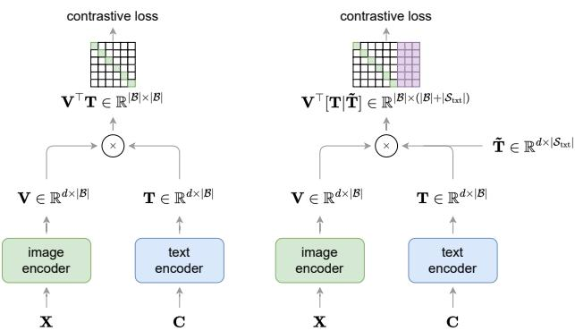
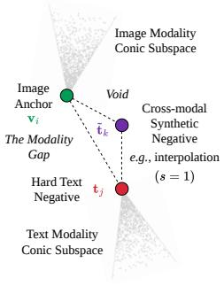
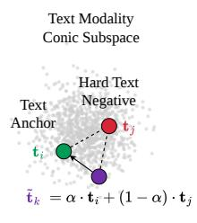
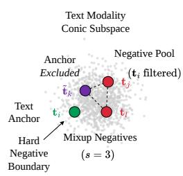
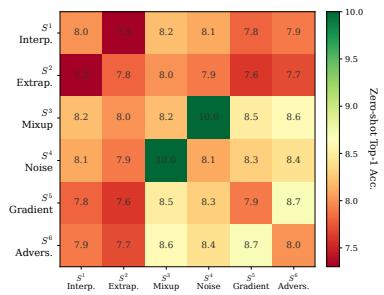
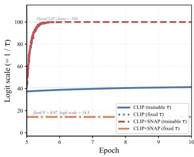
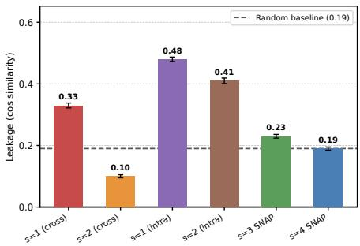
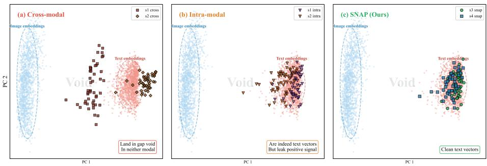
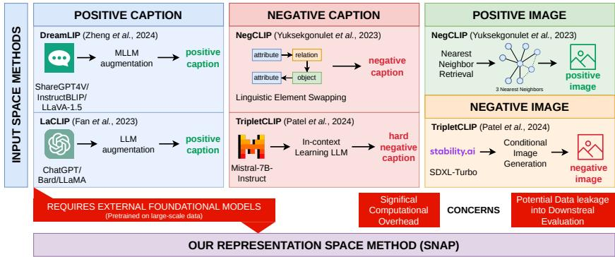

# What Makes Synthetic Hard Negatives Work in Vision-Language Pretraining?

Nikos Giakoumoglou<sup>1</sup>, Paschalis Giakoumoglou<sup>2</sup>, Andreas Floros<sup>1</sup>, Kleanthis Marios Papadopoulos<sup>1</sup>, and Tania Stathaki<sup>1</sup>

<sup>1</sup> Imperial College London, London, UK

Centre for Research and Technology Hellas, Thessaloniki, Greece nikos@imperial.ac.uk

Abstract. Synthetic hard negatives generated in the representation space have proven efective for unimodal self-supervised learning, but transferring this idea to vision-language pretraining is not straightforward. We analyze six representation-space synthesis strategies and identify two failure modes in their transfer to vision-language pretraining: crossmodal constructions that produce overly easy negatives or pull them toward the query, and intra-modal constructions that incorporate the matched positive. We also observe logit-scale saturation when training with synthetic hard negatives and a learnable temperature, and find that fixing the temperature improves downstream performance. Using this geometric analysis we propose SNAP, which generates intra-modal hard negatives that never involve the positive from either modality, avoiding both failure modes entirely. SNAP is model-agnostic, requires no external generative models, and adds less than 10% training time overhead. Evaluated on top of CLIP and FLIP across multiple architectures and datasets, SNAP delivers consistent improvements on zero-shot retrieval, zero-shot classification, and linear probe evaluation.

Keywords: CLIP · Contrastive learning · Hard negatives · Synthetic negatives · Vision-language pretraining · Zero-shot transfer

## 1 Introduction

Contrastive pretraining using weakly-supervised image-text pairs collected from the web has become the dominant paradigm for learning generic visual representations, progressively replacing supervised pretraining on large labeled datasets [8]. The core idea is to jointly learn an aligned embedding space for images and text from paired data, maximizing the similarity of matched (“positive”) image-text pairs while pushing apart mismatched (“negative”) pairs via a batch-level InfoNCE loss [18,42]. Seminal works CLIP [48], ALIGN [21], and BASIC [45] demonstrated remarkable zero-shot transfer capabilities by training on hundreds of millions of image-text pairs. However, standard CLIP-style training samples image–text pairs randomly, without explicitly controlling the dificulty or multiplicity of in-batch negatives. Although higher-similarity negatives already receive greater softmax weight in InfoNCE, their availability depends on batch composition. Hard-negative sampling and synthesis provide explicit control over this training signal [22, 52].

In unimodal self-supervised learning, synthetic hard negatives generated directly in the representation space have proven highly efective [12,13,22], ofering a fast and lightweight alternative to input-space augmentation. This raises a natural question: can representation-space synthetic negatives transfer to visionlanguage pretraining? Prior work has explored hard negatives for vision-language models primarily in the input space: rule-based text perturbations [73, 79], LLM-based caption rewrites [10, 44], or difusion-generated negative images [44]. These approaches incur significant computational overhead and typically address only one modality at a time (cf . Sec. 2). Representation-space generation would sidestep all of these issues. However, as we show in this paper, the transfer is not straightforward, and understanding why it fails reveals fundamental constraints imposed by multimodal representation geometry.

Unlike the single-modality setting where all representations inhabit one homogeneous space, vision-language models align two distinct modalities within a shared embedding space. This dual-domain structure introduces two geometric failure modes with no unimodal analogue. First, the cross-modal synthetic negatives that were tested, produced by blending image and text embeddings, fall into the modality gap [30]: a void between the image and text cones that real embeddings never occupy, making such samples trivially separable and uninformative. Second, restricting synthesis to a single modality but involving the positive pair causes positive leakage: the synthetic “negative” inherits genuine positive signal, sending contradictory gradients that confuse optimization. We characterize these geometric efects using representation-level diagnostics. Separately, we observe logit-scale saturation when synthetic hard negatives are introduced with a learnable temperature. Our temperature ablation supports combining positive-free intra-modal synthesis with a fixed temperature (Secs. 4.1 and 4.2).

We make the following contributions: (i) We identify and characterize two geometric failure modes that prevent naive transfer of representation-space synthetic negatives to vision-language pretraining, i.e., modality gap collapse and positive leakage, and provide quantitative diagnostics for each (Sec. 4.1). (ii) Guided by this analysis, we propose SNAP, a model-agnostic method that generates synthetic hard negatives directly in the representation space for both image and text modalities, applicable on top of InfoNCE-based frameworks such as CLIP and FLIP (Sec. 4.3). (iii) We conduct comprehensive evaluations across multiple architectures (ViT-B/16, ViT-B/32, RN-50), datasets (CC3M, CC12M), and downstream tasks, e.g., zero-shot retrieval (Tab. 5), zero-shot classification (Tab. 6), linear probe evaluation (Tab. 7), demonstrating broad improvements across the evaluated settings.

## 2 Related Work

## 2.1 Vision-Language Contrastive Pretraining

CLIP [48] and ALIGN [21] established the standard approach for vision-language contrastive pretraining: learning aligned image-text representations via a batch level InfoNCE loss [42] over large-scale web-crawled data. LiT [76] showed that freezing a pretrained vision encoder and training only the text tower can be surprisingly efective, while SigLIP [75] replaced the softmax-based InfoNCE with a pairwise sigmoid formulation that removes the need for global normalization. BASIC [45] demonstrated the benefits of jointly scaling both encoders and data. Since then, a wide range of methods has advanced the field through modifications to the contrastive objective [16, 27, 67, 69], integration of self supervised objectives [28,37–39,56,81], architectural changes [3,51,61,71], training eficiency improvements [29, 68], scaling [20, 58, 59, 65, 72], and improved training signals via synthetic captions [10, 32, 64, 77, 80]. SNAP is complementary to all these directions, augmenting the InfoNCE loss with representation-space synthetic negatives without modifying the architecture, data pipeline, or base objective.

## 2.2 Hard Negative Sampling

The quality and dificulty of negative samples are critical for contrastive learning [14, 54, 57, 63]. In vision, synthetic hard negatives generated in the representation space have been shown to significantly improve self-supervised representation learning [12, 13, 15, 22, 52]. MoCHi [22] mixes hard-negative features, while SynCo [13] studies six synthesis strategies that underpin our analysis. In vision-language learning, linguistic perturbations [73, 79] construct negative captions, and DiHT [47] increases the contribution of hard negatives through importance sampling while NegCLIP [73] and related methods [79] construct negatives through linguistic perturbations. In representation space, ${ \overline { { m ^ { 2 } } } } .$ -Mix within $m ^ { 3 } .$ -Mix [41] geodesically mixes another matched image–text pair to form crossmodal negatives. SNAP instead synthesizes query-specific negatives within each modality, using hard-negative mixing and noise during pretraining from scratch.

## 2.3 Synthetic Augmentation for Vision-Language Models

Several recent methods synthesize additional training data for CLIP-style pretraining, but these approaches operate in the input space and rely on large external foundation models. On the text side, captions are rewritten or generated using LLMs [10,44], captioning models [32,68], or multimodal LLMs [26,33,64,80]. On the image side, TripletCLIP [44] generates hard negative images using text-toimage difusion models (e.g., SDXL-Turbo [46]) conditioned on LLM-generated captions. These methods introduce external knowledge from models that may overlap with downstream benchmarks, making it dificult to disentangle representational improvements from data leakage, and add substantial computational overhead. SNAP avoids these issues: synthetic negatives are generated from

  
Fig. 1: Architecture comparison for the image-to-text direction. (a) Standard CLIP encodes images X and captions $\mathbf { C }$ into embeddings $\mathbf { V } \in \mathbb { R } ^ { d \times | B | }$ and $\dot { \mathbf { T } } \in \mathbb { R } ^ { d \times | B | }$ computing the similarity matrix $\mathbf { V } ^ { \top } \mathbf { T } \in | \boldsymbol { B } | \times | \boldsymbol { B } |$ using only batch negatives. (b) Our method generates synthetic text negatives $\breve { \mathbf { T } } \in \mathbb { R } ^ { \dot { d } \times | S _ { \mathrm { t x t } } | }$ directly in the representation space and concatenates them with batch embeddings to form an augmented similarity matrix $\mathbf { V } ^ { \top } [ \mathbf { T } | \tilde { \mathbf { T } } ] \in | \boldsymbol { \mathcal { B } } | \times ( | \boldsymbol { \mathcal { B } } | + | S _ { \mathrm { t x t } } | )$ . In the similarity matrices, green cells denote positive pairs, white cells denote batch negatives, and purple cells denote synthetic negatives. The text-to-image direction follows an analogous procedure with synthetic image negatives (cf. Sec. 3.2).

in-batch embeddings alone, requiring no external models and no additional data.   
More on related work in Appendix Sec. C.

## 3 Preliminaries

In this section, we present the building blocks for integrating synthetic hard negatives into vision-language contrastive learning. We first review the standard CLIP objective (Sec. 3.1), then describe how synthetic negatives augment the contrastive loss in the representation space (Sec. 3.2), and finally define the generation strategies (Sec. 3.3). These preliminaries set up the vocabulary for Sec. 4, where we analyze why naively applying these strategies to the visionlanguage setting fails and present the design choices that lead to SNAP.

## 3.1 Contrastive Language-Image Pretraining

We assume two parameterized models: an image encoder $f _ { \theta }$ with parameters $\theta \ ( e . g .$ , a vision transformer [9] or a convnet [19]) and a text encoder $g _ { \phi }$ with parameters ϕ $( e . g .$ , a GPT-style transformer [49, 50]). Each input sample $\left( \mathbf { x } _ { i } , \mathbf { c } _ { i } \right)$ consists of an image $\mathbf { x } _ { i }$ and text caption $\mathbf { c } _ { i }$ . The encoders produce embeddings $\mathbf { v } _ { i } = f _ { \theta } ( \mathbf { x } _ { i } )$ and $\mathbf { t } _ { i } = g _ { \phi } ( \mathbf { c } _ { i } )$ , which are mapped to a common d-dimensional embedding space via projection layers and $\ell _ { 2 } { \mathrm { - n o r m a l i z e d } }$ $i . e . , \| \mathbf { v } _ { i } \| _ { 2 } = \| \mathbf { t } _ { i } \| _ { 2 } = 1$ For a batch $B ,$ each sample i is associated with one positive pair and $| B | - 1$ in-batch negatives. To aid readability, throughout this section we use red to denote batch negatives. The bi-directional contrastive loss is computed as:

$$
\mathcal { L } _ { \mathrm { C L I P } } = - \frac { 1 } { 2 | \mathcal { B } | } \left( \underbrace { \sum _ { i \in \mathcal { B } } \log \frac { \exp ( \mathbf { v } _ { i } ^ { \top } \mathbf { t } _ { i } / \tau ) } { \sum _ { j \in \mathcal { B } } \exp ( \mathbf { v } _ { i } ^ { \top } \mathbf { t } _ { j } / \tau ) } } _ { \mathcal { L } _ { \mathrm { i 2 t } } } + \underbrace { \sum _ { i \in \mathcal { B } } \log \frac { \exp ( \mathbf { t } _ { i } ^ { \top } \mathbf { v } _ { i } / \tau ) } { \sum _ { j \in \mathcal { B } } \exp ( \mathbf { t } _ { i } ^ { \top } \mathbf { v } _ { j } / \tau ) } } _ { \mathcal { L } _ { \mathrm { t 2 i } } } \right) ,\tag{1}
$$

where $\tau$ is a learnable temperature parameter. We denote the two directional terms as image-to-text (i2t) and text-to-image (t2i), respectively. The denomi nators include both the positive term $j = i$ and the |B| − 1 in-batch negatives $j \neq i ,$ following the standard InfoNCE formulation [42]. In the standard CLIP formulation [48], negatives are drawn exclusively from the batch $B ,$ requiring large batch sizes $( e . g . , 3 2 , 7 6 8 )$ to provide a suficiently large and diverse pool of negatives. Training with smaller batches significantly limits discriminative ability, as the lack of diverse negatives leads to weaker representations [5].

## 3.2 Synthetic Hard Negatives in the Representation Space

We augment the denominators of both $\mathcal { L } _ { \mathrm { { i 2 t } } }$ and $\mathcal { L } _ { \mathrm { t 2 i } }$ with synthetically generated hard negatives directly in the representation space. To aid readability, we use purple to denote synthetic negatives throughout this section. For the i2t term, we generate a set of synthetic text negatives $S _ { \mathrm { t x t } } ^ { i } = \{ \tilde { \bf t } _ { k } \}$ for each image query $\mathbf { v } _ { i }$ . Similarly, for the t2i term, we generate a set of synthetic image negatives $S _ { \mathrm { i m g } } ^ { i } = \{ \tilde { \mathbf { v } } _ { k } \}$ for each text query $\mathbf { t } _ { i } .$ The augmented losses are:

$$
\bar { \mathcal { L } } _ { \mathrm { i 2 t } } = - \frac { 1 } { | \mathcal { B } | } \sum _ { i \in \mathcal { B } } \log \frac { \exp ( \mathbf { v } _ { i } ^ { \top } \mathbf { t } _ { i } / \tau ) } { \sum _ { j \in \mathcal { B } } \exp ( \mathbf { v } _ { i } ^ { \top } \mathbf { t } _ { j } / \tau ) + \sum _ { \tilde { \mathbf { t } } _ { k } \in \mathcal { S } _ { \mathrm { t x t } } ^ { i } } \exp ( \mathbf { v } _ { i } ^ { \top } \tilde { \mathbf { t } } _ { k } / \tau ) } ,\tag{2}
$$

Each query has its own synthetic-negative set, generated from its selected hard-negative pool; synthetic negatives are not shared across queries.

$$
\bar { \mathcal { L } } _ { \mathrm { t 2 i } } = - \frac { 1 } { | \mathcal { B } | } \sum _ { i \in \mathcal { B } } \log \frac { \exp ( \mathbf { t } _ { i } ^ { \top } \mathbf { v } _ { i } / \tau ) } { \sum _ { j \in \mathcal { B } } \exp ( \mathbf { t } _ { i } ^ { \top } \mathbf { v } _ { j } / \tau ) + \sum _ { \tilde { \mathbf { v } } _ { k } \in \mathcal { S } _ { \mathrm { i m g } } ^ { i } } \exp ( \mathbf { t } _ { i } ^ { \top } \tilde { \mathbf { v } } _ { k } / \tau ) } .\tag{3}
$$

The final loss combines both augmented directional terms:

$$
\bar { \mathcal { L } } = \frac { 1 } { 2 } \left( \bar { \mathcal { L } } _ { \mathrm { i 2 t } } + \bar { \mathcal { L } } _ { \mathrm { t 2 i } } \right) .\tag{4}
$$

This formulation enriches the negative set with diverse, hard examples that would be computationally prohibitive to generate in the input space, while requiring minimal overhead as the generation occurs directly in the representation space during the forward pass $( c f$ . Sec. 4.3). With synthetic negatives, we produce high-quality, diverse negatives fast and cheaply, enabling efective training even with moderate batch sizes (cf . Appendix Sec. D.1).

## 3.3 Synthetic Negative Generation Strategies

We define hardness by cosine similarity to the query [22]. Given a query image embedding $\mathbf { v } _ { i } .$ , we select the top-N batch text negatives $\hat { \mathcal { T } } _ { N } ^ { i } \subset B \setminus i$ with the highest cosine similarity to $\mathbf { v } _ { i } ;$ analogously, we select $\hat { \mathcal { V } } _ { N } ^ { i }$ for text query $\mathbf { t } _ { i }$ . We implement six strategies to generate synthetic negatives. For the i2t direction, each strategy produces a synthetic text negative $\tilde { \mathbf { t } } _ { k }$ from the query $\mathbf { v } _ { i }$ and one or two hard negatives $\mathbf { t } _ { j } , \mathbf { t } _ { l }$ sampled uniformly from $\hat { \mathcal { T } } _ { N } ^ { i }$

$$
\tilde { \mathbf { t } } _ { k } ^ { ( s ) } = \left\{ \begin{array} { l l } { \alpha _ { k } \cdot \mathbf { v } _ { i } + ( 1 - \alpha _ { k } ) \cdot \mathbf { t } _ { j } , } & { s = 1 , \alpha _ { k } \sim \mathcal { U } ( 0 , 0 . 5 ) } \\ { \mathbf { t } _ { j } + \beta _ { k } \cdot ( \mathbf { t } _ { j } - \mathbf { v } _ { i } ) , } & { s = 2 , \beta _ { k } \sim \mathcal { U } ( 1 , 1 . 5 ) } \\ { \gamma _ { k } \cdot \mathbf { t } _ { j } + ( 1 - \gamma _ { k } ) \cdot \mathbf { t } _ { l } , } & { s = 3 , \gamma _ { k } \sim \mathcal { U } ( 0 , 1 ) } \\ { \mathbf { t } _ { j } + \mathcal { N } ( \mathbf { 0 } , \sigma ^ { 2 } \cdot \mathbf { I } ) , } & { s = 4 } \\ { \mathbf { t } _ { j } + \delta \cdot \nabla _ { \mathbf { t } _ { j } } ( \mathbf { v } _ { i } ^ { \top } \mathbf { t } _ { j } ) , } & { s = 5 } \\ { \mathbf { t } _ { j } + \eta \cdot \mathrm { s i g n } ( \nabla _ { \mathbf { t } _ { j } } ( \mathbf { v } _ { i } ^ { \top } \mathbf { t } _ { j } ) ) , } & { s = 6 } \end{array} \right.\tag{5}
$$

All synthetic negatives are ℓ<sub>2</sub>-normalized after generation. Strategies s=1 (interpolation) and $s { = } 2$ (extrapolation) blend the query with hard negatives [78]; s=3 (mixup) combines pairs of hard negatives [62, 78]; s=4 perturbs a hard negative with Gaussian noise; and $s { = } 5 , 6$ apply gradient-ascent and sign-based adversarial perturbations [17, 35] (see [13] for further detail). Crucially, s=1 and s=2 involve the query embedding $\mathbf { v } _ { i }$ (or t<sub>i</sub> in the t2i direction), producing cross-modal synthetic negatives, while $s { = } 3$ and s=4 operate exclusively on same-modality negatives without involving any positive. As we show in Sec. 4.1, this distinction is critical in the vision-language setting.

## 4 Adapting Synthetic Negatives to Vision-Language Pretraining

The success of representation-space synthetic negatives in unimodal learning (Sec. 3.3) naturally suggests applying the same strategies to CLIP-style training. However, the dual-modality structure of vision-language models introduces failure modes with no unimodal analogue. This raises a central question: What makes synthetic hard negatives work in vision-language pretraining? In this section, we systematically analyze these failure modes (Sec. 4.1) along their multimodal geometry (Sec. 4.2), their secondary efect on the learnable temperature (Sec. 4.1), and present the resulting design choices that define SNAP (Sec. 4.3). All ablations use CC3M with ViT-B/16, reporting IN-val and IN-v2 zero-shot accuracy. We generate 64 synthetic negatives per query from the top-256 hardest negatives, split equally among active strategies. The hyperparameters $\sigma = 0 . 0 1 , \delta = 0 . 0 1$ and $\eta = 0 . 0 1$ are set empirically without extensive tuning, following [13].

## 4.1 Naive Extension and Failure Modes

Cross-modal synthetic negatives fail due to geometry. The most direct extension is to apply all six strategies from Eq. (5) as defined, where s=1 and s=2 blend the image query $\mathbf { v } _ { i }$ with text negatives $\mathbf { t } _ { j }$ . However, vision-language models exhibit a well-documented modality gap [30] (Fig. 2a): image and text embeddings cluster in distinct cones of the shared space, and cross-modal interpolations such as $\alpha \cdot \mathbf { v } _ { i } + ( 1 - \alpha ) \cdot \mathbf { t } _ { j }$ produce vectors in the void between them that real embeddings never occupy, making them trivially separable. As shown in Table 1, restricting to $s = 3$ , 4 in intra-modal mode nearly recovers the CLIP baseline (10.0 vs. 10.4 on IN-val); as we show in Section 4.1, the remaining gap is closed and surpassed once the temperature is fixed.

  
(a) Cross-modal Failure

  
(b) Positive Leakage

  
(c) SNAP (Ours)  
Fig. 2: Geometric intuition of failure modes in vision-language pretraining. (a) Cross-modal failure: Blending image and text embeddings creates samples in the “modality $\mathrm { g a p } ^ { \dag }$ that are trivially rejected (Sec. 4.1). (b) Positive Leakage: Including the positive pair in synthesis creates negatives that contain the actual signal, causing gradient conflict (Sec. 4.1). (c) SNAP: By generating intra-modal negatives and filtering the positive anchor, we create high-quality hard negatives that respect the modality geometry (Sec. 4.3).

Intra-modal negatives involving the positive fail due to semantic leakage. A natural fix is to convert all strategies to intra-modal variants by replacing the cross-modal query $\mathbf { v } _ { i }$ in $s = 1 , 2$ with the matched text positive $\mathbf { t } _ { i }$ . However, this introduces a subtler failure. Consider the intra-modal interpolation: $\tilde { \mathbf { t } } = \boldsymbol { \alpha } \cdot \mathbf { t } _ { i } + \left( 1 - \boldsymbol { \alpha } \right) \cdot \mathbf { t } _ { j }$ , where $\mathbf { t } _ { i }$ is the positive caption for query $\mathbf { v } _ { i }$ and $\mathbf { t } _ { j }$ is a diferent caption. Because $\mathbf { t } _ { i }$ is the correct match for $\mathbf { v } _ { i } ,$ the synthetic “negative” <sup>˜</sup>t inherits positive signal. As $\alpha  1$ , it becomes nearly identical to the true positive, yet the InfoNCE denominator treats it as a negative. This positive leakage (Fig. 2b) sends contradictory gradients: the numerator of Eq. (2) encourages similarity with $\mathbf { t } _ { i }$ , while the denominator penalizes similarity with <sup>˜</sup>t ≈ t . Tab. 1 confirms that intra-modal generation with all six strategies (8.7 on IN-val) improves over the cross-modal variant but still underperforms the CLIP baseline.

Two distinct failure modes, one solution. The tested constructions alter negative geometry through cross-modal operations or introduce positive signal through explicit inclusion of the matched positive. Strategies $s \in \{ 3 , 4 \}$ avoid both by generating negatives from non-matching pairs only. Restricting to $s \in \{ 3 , 4 \}$ nearly recovers the CLIP baseline (10.0 vs. 10.4 on IN-val, 8.0 vs. 8.4 on IN-v2; Table 1), with the remaining gap closed and surpassed once temperature is fixed (Section 4.1). Figure 3 confirms this: $s = 3$ and $s = 4$ consistently outperform any combination involving cross-modal blending or the positive pair.

Table 1: Cross-modal vs. intra-modal strats. Applying all six strategies in crossmodal mode degrades performance below the $\mathrm { C L I P }$ baseline. Converting to intra-modal mode helps but still underperforms. Restricting to $s \ : = \ : 3$ and $s \ = \ 4$ recovers performance. We highlight the default hyperparameter.
<table><tr><td>Method Strategies Mode IN-val</td><td colspan="3"> $\mathbf { I N - v 2 }$ </td></tr><tr><td>CLIP [48]</td><td> $\mathrm { n / a }$ </td><td> $\mathrm { n / a }$ </td><td>10.4 8.4</td></tr><tr><td> $\operatorname { S N A P }$ </td><td>all 6</td><td>cross</td><td>7.6 (↓) 6.8 (↓)</td></tr><tr><td>SNAP</td><td>all 6</td><td>intra</td><td>8.7 (↓) 7.5 (↓)</td></tr><tr><td>SNAP</td><td> $s { = } 3 , 4$ </td><td>intra</td><td>10.0 (↓) 8.0 (↓)</td></tr></table>

  
Fig. 3: Pairwise strategy complementarity on IN-val. Strategies s = 3, 4 achieve the highest accuracy.

Temperature divergence. Adding synthetic hard negatives changes the contrastive denominator and its interaction with the learnable temperature τ. In the evaluated configuration, CLIP+SNAP with learnable τ reaches the OpenCLIP logit-scale clamp of 100 within half an epoch after synthetic negatives are enabled (Fig. 4). This occurs with the positive-free intra-modal strategies $s = 3 , 4$ . Fixing $\tau = 0 . 0 7$ improves IN-val accuracy from 10.0 to 11.0 and IN-v2 accuracy from 8.0 to 9.6 (Tab. 2). Under the same fixed temperature, CLIP without synthetic negatives achieves 10.1 and 8.0, respectively. We therefore adopt fixed $\tau = 0 . 0 7$ as part of the SNAP training recipe. The two cross-modal strategies fail through distinct mechanisms: extrapolation (s=2) pushes vectors beyond the text cone, while interpolation (s=1) pulls toward the image query and thus the positive, making positive leakage the dominant failure rather than trivial separability, as we quantify in Section 4.2.

## 4.2 Multimodal Geometry of Synthetic Negatives

We characterize the failure modes in Sec. 4.1 using four complementary representation level diagnostics computed on ViT-B/32 trained on CC3M.

Leakage, separability, and hardness diagnostics. We quantify the failure modes with three metrics over 2,000 validation pairs (ViT-B/32, CC3M): positive leakage $\cos ( \tilde { \bf t } , { \bf t } _ { i } )$ , where values above the random baseline (0.19) indicate semantic contamination; trivially separable rate (TSR), the fraction of synthetics easier than the 10th percentile of real hard negatives; and relative hardness $\varDelta =$ $\cos ( \mathbf { v } _ { i } , \tilde { \mathbf { t } } ) - \cos ( \mathbf { v } _ { i } , \mathbf { t } _ { \mathrm { r a n d } } )$ . As shown in Fig. 5 and Tab. 3, cross-modal strategies fail for opposite reasons: s=2 (cross) lands in the void beyond the text cone (TSR 87.8%, $\varDelta = - 0 . 1 8 9 )$ , while s=1 (cross) interpolates toward the positive (leakage 0.33). Intra-modal strategies involving the positive sufer from contamination (s=1 intra: 0.48; s=2 intra: 0.41) or trivial separability (s=2 intra: TSR 74.0%). Only s=3 and s=4 avoid cross-modal mixing and explicit positive inclusion, exhibiting leakage close to the random baseline (0.23 and 0.19), low TSR (2.2% and 13.2%), and positive relative hardness.

Table 2: Temperature ablation. With fixed $\tau = 0 . 0 7 .$ , CLIP+SNAP outperforms both fixed- and learnable-temperature CLIP. We highlight the default setting.
<table><tr><td>Method</td><td>T</td><td>IN-val IN-v2</td></tr><tr><td> $\mathrm { C L I P }$ </td><td>learn.</td><td>10.4 8.4</td></tr><tr><td>CLIP</td><td>fixed</td><td>10.1 8.0</td></tr><tr><td>CLIP+SNAP learn.</td><td></td><td>10.0 (↓) 8.0 (↓)</td></tr><tr><td>CLIP+SNAP</td><td>fixed</td><td>11.0 (↑) 9.6 (↑)</td></tr></table>

  
Fig. 4: Logit scale trajectories (ViT-B/32, CC3M, epochs 5 to 10). CLIP+SNAP with a learnable τ saturates the OpenCLIP clamp within half an epoch. Both fixed-τ runs remain stable.

  
Fig. 5: Positive leakage per strategy (ViT-B/32, CC3M). mean cos(<sup>˜</sup>t, t<sub>i</sub>) per strategy; dashed line marks the random baseline (0.19).

Table 3: TSR and relative hardness. Lower TSR and higher ∆ hardness indicate harder, more informative negatives. We highlight SNAP strategies.
<table><tr><td>Strategy</td><td colspan="2">TSR (%)↓ ∆ hardness↑</td></tr><tr><td>s=1 (cross)</td><td>0.3</td><td>+0.281</td></tr><tr><td>s=2 (cross)</td><td>87.8</td><td>-0.189</td></tr><tr><td>s=1 (intra)</td><td>0.6</td><td>+0.133</td></tr><tr><td>s=2 (intra)</td><td>74.0</td><td>-0.096</td></tr><tr><td>s=3 (SNAP)</td><td>2.2</td><td>+0.041</td></tr><tr><td> $s { = } 4 \ ( \mathrm { S N A P } )$ </td><td>13.2</td><td>+0.045</td></tr></table>

PCA subspace visualization. Fig. 6 projects image embeddings, text embeddings, and synthetic negatives onto the first two principal components. Cross modal strategies scatter into the void between the image and text cones, a region real embeddings never occupy. Intra-modal strategies involving the positive cluster within the text cone but near the positive anchor, explaining the observed leakage. SNAP strategies $( s { = } 3 , s { = } 4 )$ are confined within the text cone and distributed away from the positive, occupying the same subspace as real text negatives.

  
Fig. 6: PCA subspace of synthetic negatives (ViT-B/32, CC3M). (a) Cross-moda negatives land in the gap void between modality cones. (b) Intra-modal negatives involving the positive cluster near the positive anchor, causing leakage. (c) SNAP negatives $( s { = } 3 , s { = } 4 )$ are confined within the text cone and away from the positive.

## 4.3 SNAP

Guided by the analysis in Secs. 4.1 and 4.2, we propose SNAP (Synthetically Negative Augmented Pretraining) that makes three principled design choices.

Intra-modal, positive-free strategies. SNAP uses only strategies s = 3 and s = 4 from Eq. (5), both operating in intra-modal mode (Fig. 2c). These avoid cross-modal geometric collapse and intra-modal positive leakage (Tab. 1 and Fig. 3).

Fixed temperature. SNAP fixes the temperature τ rather than learning it, preventing the logit scale saturation that arises when hard negatives interact with a learnable temperature (Tab. 2).

Table 4: Synthesis and directionality ablations on CC3M.
<table><tr><td rowspan=1 colspan=1>Variant             IN-val IN-v2</td></tr><tr><td rowspan=1 colspan=1>Random-neg. dup.10.0  8.0</td></tr><tr><td rowspan=1 colspan=1>Hard-neg. dup.     10.4  8.5</td></tr><tr><td rowspan=1 colspan=1>Hard-neg. wt.      10.5  8.7</td></tr><tr><td rowspan=1 colspan=1>s = 3                10.8  9.2</td></tr><tr><td rowspan=1 colspan=1>s = 4                10.6  8.8</td></tr><tr><td rowspan=1 colspan=1>s = 3, 4 (i2t only)  10.7  8.8s = 3, 4 (t2i only)  10.6  8.7</td></tr><tr><td rowspan=1 colspan=1>SNAP               11.0 9.6</td></tr></table>

Bidirectional synthesis. SNAP generates synthetic negatives for both i2t and t2i directions. We compare against repeating randomly sampled or hard negatives in the contrastive denominator, and increasing the weight of hardnegative terms. Both synthesis strategies outperform these controls, with their combination performing best (Tab. 4). Bidirectional synthesis also outperforms either direction alone.

Computational overhead. Since SNAP generates negatives via vector operations—specifically additions, scalar multiplications, and normalization—on pre-computed embeddings, it avoids additional forward or backward passes through the encoders. This design ensures minimal impact on training eficiency, requiring no external generative models or architectural modifications. On a ViT-B/16 backbone, CLIP [48] requires 32.5 minutes per epoch, while SNAP adds only 3 minutes, resulting in an 9.23% overhead. Similarly, FLIP [29] requires 14.9 minutes per epoch, and the addition of SNAP increases this to 16.2 minutes, a comparable overhead of 8.72%. These results demonstrate that SNAP provides significant discriminative gains with a negligible increase in training time. Further ablations on batch size and the number of synthetic negatives are provided in the supplementary material (Appendix Sec. D).

## 5 Experiments

We train the CLIP and FLIP baselines and their SNAP variants under matched data and training configurations, except for the temperature treatment described above. We also train SigLIP [75] under our training setup. Results for LaCLIP [10], TripletCLIP [44], and NegCLIP [73] are taken from [44] and included for reference only. Detailed implementation details in Appendix Sec. B.

## 5.1 Implementation Details

Pretraining datasets. We pretrain on two image-text datasets of varying scale: CC3M [55] and CC12M [4]. Due to image link rot, the versions we obtained contain fewer samples than the original releases: ≈1.7M out of 3.3M for CC3M and ≈7.2M out of 12.4M for CC12M. This may lead to minor performance diferences compared to models trained on the full datasets.

Model architectures. For the image encoder $f _ { \theta }$ , we use ViT-B/16, ViT-B/32 [9], and ResNet-50 [19]. For the text encoder $g _ { \phi }$ , we use a 12-layer Transformer [48]. Both encoders include projection heads mapping to a shared d = 512 dimensional embedding space.

Training setup. We use AdamW [34] with learning rate $5 \times 1 0 ^ { - 4 }$ , weight decay 0.2, and cosine scheduling with 10k warmup steps. Training uses batch size |B| = 4096 on 4× A100 GPUs for 32 epochs, with 224 × 224 images and text length 77. The temperature τ is initialized to 0.07 (and kept constant for SNAP).

Reproducibility. For CC3M, we pretrain three checkpoints (diferent seeds) and report the mean, with standard deviations as subscripts in Tables 5 to $7 ;$ for CC12M, a single checkpoint is used due to computational constraints.

## 5.2 Zero-Shot Image-Text Retrieval

We evaluate cross-modal retrieval on Flickr30k [70] and MSCOCO [31], computing pairwise cosine similarities over the full test split and reporting Recall@{1,5,10} for both image-to-text and text-to-image retrieval in Table 5. SNAP improves retrieval in the large majority of settings for both CLIP and FLIP, holding across all three backbones and both pretraining scales, with gains appearing on both retrieval directions rather than favoring one; the few exceptions are isolated cells that are unchanged or lower by at most a few tenths of a point.

Table 5: Zero-shot image-text retrieval on Flickr30k and MSCOCO. We report Recall@K (R@K) metrics for text and image retrieval. Symbols: <sup>‡</sup> Taken from [44]
<table><tr><td rowspan="3" colspan="2">DataMethod</td><td colspan="6">Text Retrieval</td><td colspan="6">Image Retrieval</td></tr><tr><td colspan="3">Flickr30k</td><td colspan="3">MSCOCO</td><td colspan="3">Flickr30k</td><td colspan="3">MSCOCO</td></tr><tr><td>R@1</td><td>R@5</td><td>R@10 R@1</td><td>R@5</td><td>R@10</td><td>R@1</td><td></td><td>R@5</td><td>R@10</td><td>R@1</td><td></td><td>R@5 R@10</td></tr><tr><td colspan="10">SigLIP [75] 7.2.2 NegCLIP [73]‡ 4.9 LaCLIP [10] 十</td><td>15.2.2 22.3.1</td><td>18.5</td><td>2.8.1 2.0</td><td>9.0.1 6.6</td><td>14.0.1 10.6</td></tr><tr><td>C33M</td><td>TripletCLIP [44]‡ CLIP [48] + SNAP FLIP [29] + SNAP SigLIP [75]</td><td>3.7 9.1 9.8.2 10.4 2 6.3.3 6.8.1 31.4 24.7</td><td>10.9 22.0 25.5. .3 26.3. 36.9 .1 18.5.1 19.0.1 57.2 69.5</td><td>16.0 1.6 29.8 3.2 35.7.2 5.0. 5.5. .3 26.4.2 3.3 26.9.3 3.7.1 16.2</td><td>5.1 10.4 15.0 .2 15.2 2 3 11.1. 36.1</td><td>8.9 16.2 22.3. 1 23.0. 2 10.7.3 16.7 17.1.1 .3 47.2</td><td>3.5 8.4 6.9. 1 7.9. 2 7.3 5.8. 6.3.1 23.1</td><td>10.8 19.8. 1 20.4. 1 .3</td><td>16.0 22.0 .2 .2 16.9.1 17.4.3 48.8</td><td>29.6 28.5. 1 28.9. 124.0.3 24.5.1 60.8</td><td>3.6 4.2 .2 4.1.1 3.1.1 3.5.1 11.5 28.1</td><td>11.3 12.7.2 13.6.1 20.1. 9.6.1 14.7. 10.0.2</td><td>17.4 219.0.1 2 15.1.2 2 38.4</td></tr><tr><td>CC2M</td><td>NegCLIP [73] ‡ LaCLIP [10] ‡ TripletCLIP [44] CLIP [48] + SNAP FLIP [29] + SNAP</td><td>21.3 28.0 33.1 33.8 26.2 27.2</td><td>46.6 58.2 42.7 54.6 55.9 65.7 59.5 71.2 60.0 71.9 50.1 61.8 50.9 63.1</td><td>12.3 10.5 14.6 17.8 18.6 14.4 15.1</td><td>30.2 25.9 33.0 39.4 39.8 32.1</td><td>41.4 35.6 43.8 50.3 51.3 43.5 44.5</td><td>18.7 15.1 25.3 24.2 24.9 20.2</td><td>41.7</td><td>36.3 52.4 50.9 51.4 44.1</td><td>47.0 63.3 63.0 63.5 56.1</td><td>7.2 11.4 13.1 13.7 10.7</td><td>19.8 28.5 30.5 31.0 26.2</td><td>28.4 39.0 41.2 42.6 36.4</td></tr><tr><td colspan="10">32.7 ViT-B/16 7.0. 2 19.8. .1</td><td>45.4 56.8</td><td></td><td>10.4</td><td>26.8</td><td>37.2</td></tr><tr><td>SigLIP [75] CLIP [48] + SNAP FLIP [29]</td><td></td><td colspan="10">13.6.3 31.5.1 43.6.1 16.2.3 37.8 49.6. 7.7 .2 .2 17.1.3 38.7. 250.5.1 8.1.1 7.2 6.4.2 12.1.2 31.2. 2.2 42.1 1.1</td><td>5.6.1 6.6 .3 7.2.2</td><td>15.8.2 23.1.3 18.1.3 26.2</td><td>18.4.1 26.8.1 1 15.4.1 22.7. .2</td></tr><tr><td>C2M</td><td>+ SNAP SigLIP [75] CLIP [48]</td><td colspan="10">12.3.2 231.7.3 43.1.1 7.1.3 49.4 74.2 83.5 26.1 53.6 77.5 85.9 29.4 30.2</td><td>5.1.1 5.9.1 19.1</td><td>16.3.3 24.0.2 40.5</td><td>52.1</td></tr><tr><td></td><td>+ SNAP FLIP [29] + SNAP</td><td colspan="10">55.1 78.3 87.1 47.9</td><td>21.8 22.3 18.8</td><td>44.4 45.0 39.4</td><td>56.1 56.6 50.9</td></tr><tr><td>SigLIP [75]</td><td>19.4.144.8.1</td><td>48.5 156.4.210.5.1 27.0.1</td><td>73.2 74.1 82.3</td><td>82.2 25.5 26.4</td><td>49.1 49.6 RN-50</td><td></td><td>61.2 62.2</td><td>33.6 34.3</td><td>60.5 61.0</td><td>72.1 72.7</td><td></td><td>19.5</td><td>39.9 52.1</td></tr></table>

## 5.3 Zero-Shot Classification

We evaluate zero-shot classification on ImageNet [8, 53] and 10 downstream datasets spanning fine-grained recognition (Stanford Cars [24], FGVC Air craft [36]), scene recognition (SUN397 [66]), texture classification (DTD [7]), and generic object classification (CIFAR [25]), encoding class names as text prompts and predicting via cosine similarity without any task-specific training (Table 6). SNAP improves accuracy across settings, with the clearest gains on the fine-grained Cars and Aircraft benchmarks, where CC3M ViT-B/32 accuracy roughly doubles (e.g., Cars 0.8 → 1.9, Aircraft 1.9 → 3.4 for CLIP), while general benchmarks such as ImageNet show steady improvements.

Table 6: Zero-shot classification. Top-1 accuracy on ImageNet and 10 downstream datasets spanning fine-grained, scene, and object recognition. <sup>‡</sup>Taken from [44].
<table><tr><td colspan="2"></td><td>-101</td><td>CIR-10</td><td>C-10</td><td>SU97</td><td>Cars</td><td>Airat</td><td>DD</td><td>Pts</td><td>Cal-101</td><td>Fwrs</td><td>Iaget</td></tr><tr><td colspan="10"></td><td></td><td></td><td></td><td></td></tr><tr><td rowspan="7">CC33M</td><td>SigLIP [75]</td><td></td><td>3.8.3 23.8.3</td><td>8.1.2</td><td>ViT-B/32 12.4.2 0.8.2</td><td></td><td>0.9.1</td><td>4.4.2</td><td>4.1.1</td><td>26.6.2</td><td>4.2.2</td><td>5.6.1</td></tr><tr><td>NegCLIP [73]‡</td><td></td><td></td><td>8.2</td><td></td><td></td><td>1.0</td><td>6.8</td><td>4.1</td><td>29.4</td><td>3.7</td><td>4.6</td></tr><tr><td>LaCLIP [10]‡</td><td></td><td></td><td>8.0</td><td></td><td></td><td>0.8</td><td>5.5</td><td>3.1</td><td>24.6</td><td>3.4</td><td>3.7</td></tr><tr><td>TripletCLIP [44]‡</td><td></td><td></td><td>11.8</td><td></td><td></td><td>0.9</td><td>8.9</td><td>5.7</td><td>38.5</td><td>8.2</td><td>7.3</td></tr><tr><td>CLIP [48]</td><td>5.9.2</td><td>28.7.2</td><td>10.0.3</td><td>14.5.1</td><td>0.8.</td><td>1.9.3 3</td><td>8.2.2</td><td>7.0.3</td><td>41.5.3</td><td>5.9.1</td><td>8.0.3</td></tr><tr><td>+ SNAP FLIP [29]</td><td>6.5.3 4.7.1</td><td>29.3. .2 26.8.2</td><td>10.4.2 8.7.3</td><td>14.7.2</td><td>1.9.</td><td>3.4.2 .3</td><td>9.0.1</td><td>7.3.3</td><td>42.1.2</td><td>7.3.2</td><td>8.2.2</td></tr><tr><td>+ SNAP</td><td>5.2.1</td><td>28.1.2</td><td>9.2.2</td><td>11.4.2 12.4.3</td><td>0.6.2 1.3.1</td><td>1.1 1 2.6.2</td><td>4.5.1 4.6.1</td><td>5.3.3 5.8.2</td><td>37.1.2 38.0.2</td><td>3.9.1 4.5.3</td><td>6.8.3 7.2.1</td></tr><tr><td rowspan="9"></td><td>SigLIP [75]</td><td>11.2</td><td>45.4</td><td>28.1</td><td>31.2</td><td>3.4</td><td>2.1</td><td>15.6</td><td>32.5</td><td>64.1</td><td>14.2</td><td>22.1</td></tr><tr><td>NegCLIP [73]‡</td><td></td><td></td><td>26.0</td><td></td><td></td><td>1.5</td><td>14.2</td><td>30.8</td><td>63.4</td><td>13.5</td><td>20.2</td></tr><tr><td>LaCLIP [10]‡</td><td></td><td></td><td>23.6</td><td></td><td></td><td>1.5</td><td>13.0</td><td>34.7</td><td>62.9</td><td>13.4</td><td>19.7</td></tr><tr><td>TripletCLIP [44]‡</td><td></td><td></td><td>30.3</td><td></td><td></td><td>1.2</td><td>17.4</td><td>33.2</td><td>65.3</td><td>15.4</td><td>23.3</td></tr><tr><td>CLIP [48]</td><td>13.1</td><td>50.2</td><td>31.5</td><td>35.1</td><td>4.1</td><td>2.5</td><td>18.2</td><td>35.8</td><td>67.4</td><td>16.8</td><td>24.6</td></tr><tr><td>+ SNAP</td><td>13.5</td><td>50.6</td><td>32.7</td><td>36.2</td><td>5.0</td><td>3.0</td><td>19.1</td><td>36.7</td><td>68.1</td><td>17.3</td><td>24.8</td></tr><tr><td>FLIP [29]</td><td>11.8</td><td>46.5</td><td>28.9</td><td>32.4</td><td>3.5</td><td>2.2</td><td>16.1</td><td>33.4</td><td>64.8</td><td>14.9</td><td>22.8</td></tr><tr><td>+ SNAP</td><td>13.2</td><td>47.7</td><td>29.5</td><td>33.3</td><td>4.0</td><td>2.0</td><td>17.0</td><td>34.3</td><td>65.6</td><td>15.7</td><td>23.9</td></tr><tr><td colspan="10">ViT-B/16</td><td></td><td></td></tr><tr><td rowspan="5">CC3M</td><td>SigLIP [75] CLIP [48]</td><td>6.2.3 7.4.1</td><td>28.9.3 34.3</td><td>7.0.1 9.8 .2</td><td>18.3.2 19.0</td><td>1.1.3 0.9 3</td><td>1.2 3 1.2</td><td>8.7.1 10.1</td><td>6.0.2 9.0.2</td><td>35.5 .2 46.3.</td><td>7.0.1 8.4.3</td><td>9.9.2 10.4.2</td></tr><tr><td>+ SNAP</td><td>8.4.1</td><td>34.4.1</td><td>10.5.3</td><td>19.6.1</td><td>3 1.3.2</td><td>2.0.1</td><td>10.8.1</td><td>10.5.1</td><td>47.3.1</td><td>9.0.2</td><td>11.0.2</td></tr><tr><td>FLIP [29]</td><td>5.3.2</td><td>24.1.3</td><td>9.3 .3</td><td>17.4.1</td><td>1.1.2</td><td>1.4 3</td><td>8.3.2</td><td>6.4.2</td><td>45.0</td><td>2 6.6.1</td><td>10.3 .3</td></tr><tr><td>+ SNAP</td><td>6.4.2</td><td>25.3.3</td><td>10.5.1</td><td>18.2.1</td><td>1.7.3</td><td>1.9.3</td><td>9.1.3</td><td>7.9.2</td><td>45.7.2</td><td>8.0.1</td><td>11.0.2</td></tr><tr><td>SigLIP [75] CLIP [48]</td><td>19.8 22.4</td><td>58.4 63.1</td><td>36.2 39.5</td><td>41.5 44.8</td><td>6.2 7.5</td><td>4.1 4.8</td><td>22.1 24.8</td><td>51.2 55.4</td><td>78.4 82.1</td><td>24.1 27.5</td><td>31.2 34.6</td></tr><tr><td rowspan="5">C2M</td><td>+ SNAP</td><td>23.1</td><td>63.0</td><td>40.1</td><td>46.2</td><td>7.9</td><td>4.6</td><td>25.4</td><td>56.1</td><td>83.2</td><td>28.5</td><td>35.3</td></tr><tr><td>FLIP [29]</td><td></td><td>59.8</td><td></td><td></td><td></td><td></td><td></td><td>52.4</td><td></td><td></td><td></td></tr><tr><td>+ SNAP</td><td>20.2</td><td></td><td>37.5</td><td>42.6</td><td>6.5</td><td>4.3</td><td>22.8</td><td>52.3</td><td>79.8</td><td>25.3</td><td>32.4</td></tr><tr><td></td><td>20.8</td><td>60.1</td><td>38.6</td><td>43.8</td><td>6.7</td><td>5.6</td><td>23.3</td><td></td><td>81.0</td><td>26.0</td><td>33.8</td></tr><tr><td colspan="10">RN-50</td></tr><tr><td rowspan="5">CC33M</td><td>SigLIP [75] CLIP [48]</td><td>7.5.2 7.7.1</td><td>17.9.2 23.7.1</td><td>5.2.1 4.8</td><td>21.1.1 23.3.1</td><td>1.1.1 1.4</td><td>1.5.2 1.3</td><td>9.4.2 9.3</td><td>8.8.1 11.7</td><td>38.8.1 45.4</td><td>9.5.1 12.3</td><td>13.1.2 13.6 .1</td></tr><tr><td>+ SNAP</td><td></td><td>8.2.1</td><td></td><td>.3</td><td>24.0.1</td><td>1.9.3</td><td>2 2.1.2</td><td>10.8.1</td><td>2 12.8.</td><td>.2 46.1.1</td><td>2 12.1.2</td></tr><tr><td>FLIP [29]</td><td></td><td>24.4.2</td><td>5.8.1</td><td></td><td></td><td></td><td>.2</td><td>1</td><td>.2</td><td>2</td><td>14.7.2</td></tr><tr><td>+ SNAP</td><td>9.0.1 9.5.3</td><td>23.1.1 22.9.1</td><td>6.7.2 7.4.2</td><td>22.4.3 23.2.1</td><td>0.8. 1.6.2</td><td>1.1 1.9.2</td><td>10.9. 11.7.1</td><td>9.0.2 10.4.</td><td>41.8. 42.2.1</td><td>11.7.1 13.0.2</td><td>13.7.1 14.9.1</td></tr></table>

## 5.4 Linear Probe Classification

Following standard protocols [23, 48], we freeze the image encoder and train a linear classifier, reporting top-1 test accuracy (Tab. 7). SNAP consistently produces more linearly separable visual features across backbones and data scales.

Table 7: Linear probe evaluation. Top-1 accuracy of a linear classifier trained on frozen image encoder features across ImageNet and 10 transfer datasets.
<table><tr><td></td><td>Model</td><td>--101</td><td>CIR-10</td><td>CI-R10</td><td>SU9</td><td>Cars</td><td>Airrat</td><td></td><td>DD</td><td>Pets</td><td>Ca101</td><td>wwrs</td><td>Imet</td></tr><tr><td colspan="10">ViT-B/32</td><td></td><td></td><td></td><td></td></tr><tr><td></td><td>SigLIP [75] CLIP [48]</td><td>35.4.1</td><td>72.5. .1</td><td>48.4.3 54.6</td><td>29.4.1 32.7</td><td>9.5.1 13.2</td><td>13.6.2 20.1</td><td>31.9.</td><td>2</td><td>34.0. 2</td><td>61.6. .2</td><td>50.8. 2</td><td>30.2.1</td></tr><tr><td>CCC33M</td><td>+ SNAP</td><td>40.7 .3 41.3. .2</td><td>77.2 3 78.5. 2</td><td>55.2</td><td>1 33.1</td><td>.1 3</td><td>2 13.9 .1</td><td>3 20.7. .1</td><td>38.3 3 38.9 3</td><td>40.7 41.4 3</td><td>71.1 1 72.0 .1</td><td>61.5 62.7 2</td><td>33.9 34.7.1 1</td></tr><tr><td></td><td>FLIP [29] + SNAP</td><td>40.8 .1</td><td>74.8.</td><td>2 52.8 53.6.1</td><td>.3 34.7 2</td><td>3</td><td>13.9.2</td><td>17.9. 2</td><td>39.8 .2</td><td>37.6 2</td><td>69.7</td><td>61.1</td><td>32.9.2</td></tr><tr><td></td><td>SigLIP [75]</td><td>41.4.1</td><td>75.6.2</td><td></td><td></td><td>36.1.3</td><td>14.5.1</td><td>18.7.1</td><td>41.3.1</td><td>37.5.2</td><td>70.8.1</td><td>62.0.2</td><td>33.5.3</td></tr><tr><td>C2M</td><td>CLIP [48]</td><td>54.2</td><td>84.6</td><td>63.8</td><td></td><td>44.1</td><td>24.8</td><td>31.2</td><td>48.9</td><td>56.4</td><td>79.2</td><td>78.4</td><td>45.8 48.7</td></tr><tr><td></td><td>+ SNAP</td><td>58.6</td><td>88.5</td><td>68.4</td><td></td><td>47.9</td><td>28.5</td><td>36.8</td><td>54.2 54.7</td><td>62.1 63.4</td><td>85.1</td><td>85.9</td><td>49.8</td></tr><tr><td></td><td>FLIP [29]</td><td>59.2</td><td>89.1</td><td>68.3</td><td></td><td>49.3</td><td>28.9</td><td>38.0</td><td></td><td></td><td>85.8</td><td>86.3</td><td></td></tr><tr><td></td><td>+ SNAP</td><td>57.5</td><td>87.2</td><td>67.1</td><td></td><td>46.8</td><td>27.4</td><td>35.1</td><td>53.0</td><td>60.9</td><td>83.9</td><td>84.1</td><td>47.5</td></tr><tr><td></td><td></td><td>58.0</td><td>88.1</td><td>68.0</td><td></td><td>47.3</td><td>27.2</td><td>35.3</td><td>53.0</td><td>61.7</td><td>84.9</td><td>84.7</td><td>48.6</td></tr><tr><td></td><td></td><td></td><td></td><td></td><td></td><td>ViT-B/16</td><td></td><td></td><td></td><td></td><td></td><td></td><td></td></tr><tr><td></td><td>SigLIP [75]</td><td>46.3.2</td><td>73.7.2</td><td>50.3.1</td><td></td><td>37.6.3</td><td>14.7.1</td><td>21.7. 2</td><td>45.0.</td><td>47.2 1</td><td>70.8.</td><td>66.8.1</td><td>41.3.2</td></tr><tr><td>CC33M</td><td>CLIP [48] + SNAP</td><td>49.2 .3</td><td>77.1</td><td>2 55.2</td><td>2</td><td>40.3</td><td>18.1 .3</td><td>24.6 2</td><td>47.8. .2</td><td>51.2</td><td>73.7</td><td>.2 71.6</td><td>43.1.2 3</td></tr><tr><td></td><td>FLIP [29]</td><td>49.7.3</td><td>77.5.1</td><td></td><td>56.6.1</td><td>41.0.1</td><td>19.2.1</td><td>25.3.</td><td>48.1. .3</td><td>52.2.</td><td>74.4.</td><td>72.3. .3</td><td>43.7.2 3</td></tr><tr><td></td><td></td><td>48.6. .1</td><td>75.0.1</td><td></td><td>52.9.3</td><td>41.0.2</td><td>16.0.2</td><td>21.3.3</td><td>46.2 1</td><td>47.4 3</td><td>73.2.2</td><td>70.6.3</td><td>40.9.1</td></tr><tr><td></td><td>+ SNAP</td><td>49.3.3</td><td>74.9.1</td><td>53.0.2</td><td></td><td>41.1.2</td><td>16.6.2</td><td>22.7.1</td><td>46.0.3</td><td>47.4.2</td><td>74.4.1</td><td>70.9.1</td><td>41.7.1</td></tr><tr><td></td><td></td><td></td><td></td><td></td><td></td><td></td><td></td><td></td><td></td><td></td><td></td><td></td><td></td></tr><tr><td>CC2M</td><td>SigLIP [75]</td><td>64.1</td><td>85.8</td><td>66.2</td><td></td><td>51.4</td><td>32.5</td><td>38.7</td><td>58.1</td><td>65.8</td><td>84.2</td><td>86.4</td><td>55.4</td></tr><tr><td></td><td>CLIP [48]</td><td>68.4</td><td>89.2</td><td>70.5</td><td></td><td>55.1</td><td>36.8</td><td>43.1</td><td>62.4</td><td>70.5</td><td>88.5</td><td>90.1</td><td>58.7</td></tr><tr><td></td><td>+ SNAP</td><td>68.8</td><td>90.0</td><td>71.3</td><td></td><td>56.0</td><td>38.0</td><td>43.8</td><td>63.2</td><td>71.1</td><td>89.6</td><td>90.6</td><td>59.9</td></tr><tr><td></td><td>FLIP [29]</td><td></td><td></td><td></td><td></td><td></td><td></td><td></td><td></td><td></td><td></td><td></td><td></td></tr><tr><td></td><td></td><td>67.1</td><td>88.0</td><td>69.3</td><td></td><td>54.0</td><td>35.5</td><td>41.8</td><td>61.2</td><td>69.3</td><td>87.2</td><td>88.9</td><td>57.5</td></tr><tr><td></td><td>+ SNAP</td><td>67.8</td><td>87.8</td><td>69.7</td><td></td><td>54.7</td><td>36.2</td><td>42.4</td><td>62.4</td><td>70.6</td><td>87.8</td><td>88.8</td><td>58.7</td></tr><tr><td></td><td></td><td></td><td></td><td></td><td></td><td>RN-50</td><td></td><td></td><td></td><td></td><td></td><td></td><td></td></tr><tr><td></td><td>SigLIP [75]</td><td>50.9.1</td><td>70.0.2</td><td>46.0.2</td><td></td><td>45.6.1</td><td>17.0.1</td><td>20.9.2</td><td>49.5. .2</td><td>51.3.2</td><td>73.5.</td><td>.3 71.5.2</td><td>47.2.2</td></tr><tr><td>CC3M</td><td>CLIP [48] + SNAP</td><td>56.1 56.7</td><td>74.0.3 74.1.1</td><td>52.3 52.8.</td><td>.3 50.8.</td><td>50.0.3</td><td>24.6 .3</td><td>31.1 .3 31.8.1</td><td>53.0 3 54.3.</td><td>62.4 63.6.</td><td>2 80.4 81.1.</td><td>3 80.4.3 80.8.1</td><td>50.0.2 51.4.3</td></tr></table>

## 6 Discussion & Limitations

The failure modes we identify arise from the dual-modality structure of contrastive learning rather than from a CLIP-specific architectural choice. We therefore expect the design principles of SNAP to be relevant to other dual-encoder frameworks using representation-space synthetic negatives. Our evaluation is limited to CC3M and CC12M due to computational constraints; scaling to larger datasets such as LAION-400M remains future work.

## Acknowledgements

We acknowledge the computational resources and support provided by the Imperial College Research Computing Service (http://doi.org/10.14469/hpc/ 2232), which enabled our experiments.

## References

1. Beaumont, R.: img2dataset: Easily turn large sets of image urls to an image dataset. https://github.com/rom1504/img2dataset (2021)

2. Bossard, L., Guillaumin, M., Van Gool, L.: Food-101 – Mining Discriminative Components with Random Forests. In: Eur. Conf. Comput. Vis. (ECCV). pp. 446–461 (2014)

3. Cao, A., Wei, X., Ma, Z.: FLAME: Frozen Large Language Models Enable Data Eficient Language-Image Pre-training. In: CVPR (2025)

4. Changpinyo, S., Sharma, P., Ding, N., Soricut, R.: Conceptual 12M: Pushing Web Scale Image-Text Pre-Training To Recognize Long-Tail Visual Concepts. In: CVPR. pp. 3558–3568 (June 2021)

5. Chen, T., Kornblith, S., Norouzi, M., Hinton, G.: A simple framework for contrastive learning of visual representations. In: ICML. pp. 1597–1607. PMLR (2020)

6. Cherti, M., Beaumont, R.: CLIP benchmark (Nov 2022). https://doi.org/10. 5281/zenodo.15403103, https://doi.org/10.5281/zenodo.15403103

7. Cimpoi, M., Maji, S., Kokkinos, I., Vedaldi, A.: Describing Textures in the Wild. In: IEEE Conf. Comput. Vis. Pattern Recog. (CVPR). pp. 3606–3613 (2014)

8. Deng, J., Dong, W., Socher, R., Li, L.J., Li, K., Fei-Fei, L.: ImageNet: A large-scale hierarchical image database. In: CVPR. pp. 248–255 (2009). https://doi.org/10. 1109/CVPR.2009.5206848

9. Dosovitskiy, A., Beyer, L., Kolesnikov, A., Weissenborn, D., Zhai, X., Unterthiner, T., Dehghani, M., Minderer, M., Heigold, G., Gelly, S., Uszkoreit, J., Houlsby, N.: An Image is Worth 16x16 Words: Transformers for Image Recognition at Scale. In: International Conference on Learning Representations (2021), https: //openreview.net/forum?id=YicbFdNTTy

10. Fan, L., Krishnan, D., Isola, P., Katabi, D., Tian, Y.: Improving CLIP Training with Language Rewrites. In: NeurIPS (2023)

11. Fei-Fei, L., Fergus, R., Perona, P.: Learning Generative Visual Models from Few Training Examples: An Incremental Bayesian Approach Tested on 101 Object Categories. Computer Vision and Image Understanding 106(1), 59–70 (2007)

12. Giakoumoglou, N., Floros, A., Papadopoulos, K.M., Stathaki, T.: Unsupervised Training of Vision Transformers with Synthetic Negatives. In: Second Workshop on Visual Concepts (2025), https://openreview.net/forum?id=dg8FuaOKnC

13. Giakoumoglou, N., Stathaki, T.: SynCo: Synthetic Hard Negatives for Contrastive Visual Representation Learning (2024), https://arxiv.org/abs/2410.02401

14. Giakoumoglou, N., Stathaki, T., Gkelias, A.: A Review on Discriminative Selfsupervised Learning Methods in Computer Vision (2025), https://arxiv.org/ abs/2405.04969

15. Giakoumoglou, N., Floros, A., Papadopoulos, K.M., Stathaki, T.: ViTAMINS: An Empirical Study of Training Self-Supervised Vision Transformers with Synthetic Hard Negatives (2026), https://arxiv.org/abs/2609.01041

16. Goel, S., Bansal, H., Bhatia, S., Rossi, R.A., Vinay, V., Grover, A.: Cyclip: Cyclic contrastive language-image pretraining (2022), https://arxiv.org/abs/2205. 14459

17. Goodfellow, I.J., Shlens, J., Szegedy, C.: Explaining and Harnessing Adversarial Examples (2015), https://arxiv.org/abs/1412.6572

18. Hadsell, R., Chopra, S., LeCun, Y.: Dimensionality reduction by learning an invariant mapping. In: CVRP. vol. 2, pp. 1735–1742. IEEE (2006)

19. He, K., Zhang, X., Ren, S., Sun, J.: Deep Residual Learning for Image Recognition. CVPR pp. 770–778 (2016), https://api.semanticscholar.org/CorpusID: 206594692

20. Ilharco, G., Wortsman, M., Wightman, R., Gordon, C., Carlini, N., Taori, R., Dave, A., Shankar, V., Namkoong, H., Miller, J., Hajishirzi, H., Farhadi, A., Schmidt, L.: OpenCLIP (Jul 2021). https://doi.org/10.5281/zenodo.5143773, https://doi.org/10.5281/zenodo.5143773, if you use this software, please cite it as below.

21. Jia, C., Yang, Y., Xia, Y., Chen, Y.T., Parekh, Z., Pham, H., Le, Q.V., Sung, Y., Li, Z., Duerig, T.: Scaling up visual and vision-language representation learning with noisy text supervision (2021), https://arxiv.org/abs/2102.05918

22. Kalantidis, Y., Sariyildiz, M.B., Pion, N., Weinzaepfel, P., Larlus, D.: Hard Negative Mixing for Contrastive Learning. In: NeurIPS (2020)

23. Kornblith, S., Shlens, J., Le, Q.V.: Do Better ImageNet Models Transfer Better? (2019), https://arxiv.org/abs/1805.08974

24. Krause, J., Stark, M., Deng, J., Fei-Fei, L.: 3D Object Representations for Fine-Grained Categorization. In: IEEE Conf. Comput. Vis. Pattern Recog. (CVPR). pp. 554–561 (2013)

25. Krizhevsky, A.: Learning Multiple Layers of Features from Tiny Images. Tech. Rep. 0, University of Toronto (2009)

26. Lai, Z., Zhang, H., Zhang, B., Wu, W., Bai, H., Timofeev, A., Du, X., Gan, Z., Shan, J., Chuah, C.N., Yang, Y., Cao, M.: VeCLIP: Improving CLIP Training via Visual-enriched Captions (2024)

27. Lavoie, S., Kirichenko, P., Ibrahim, M., Assran, M., Wilson, A.G., Courville, A., Ballas, N.: Modeling caption diversity in contrastive vision-language pretraining. In: ICML (2024), https://openreview.net/forum?id=iaV2fU6Dif

28. Li, Y., Liang, F., Zhao, L., Cui, Y., Ouyang, W., Shao, J., Yu, F., Yan, J.: Supervision exists everywhere: A data eficient contrastive language-image pre-training paradigm. In: ICLR (2022), https://openreview.net/forum?id=zq1iJkNk3uN

29. Li, Y., Fan, H., Hu, R., Feichtenhofer, C., He, K.: Scaling language-image pretraining via masking (2023), https://arxiv.org/abs/2212.00794

30. Liang, W., Zhang, Y., Kwon, Y., Yeung, S., Zou, J.: Mind the gap: Understanding the modality gap in multi-modal contrastive representation learning (2022), https: //arxiv.org/abs/2203.02053

31. Lin, T.Y., Maire, M., Belongie, S.J., Bourdev, L.D., Girshick, R.B., Hays, J., Perona, P., Ramanan, D., Dollár, P., Zitnick, C.L.: Microsoft COCO: Common Objects in Context. CoRR abs/1405.0312 (2014), http://dblp.uni-trier.de/ db/journals/corr/corr1405.html/LinMBHPRDZ14

32. Liu, Y., Li, X., Wang, Z., Zhao, B., Xie, C.: CLIPS: An Enhanced CLIP Framework for Learning with Synthetic Captions. arXiv preprint arXiv:2411.16828 (2024)

33. Liu, Y., Wang, K., Shao, W., Luo, P., Qiao, Y., Shou, M.Z., Zhang, K., You, Y.: MLLMs-Augmented Visual-Language Representation Learning (2024), https: //arxiv.org/abs/2311.18765

34. Loshchilov, I., Hutter, F.: Decoupled Weight Decay Regularization. In: ICLR. OpenReview.net (2019), https://openreview.net/forum?id=Bkg6RiCqY7

35. Madry, A., Makelov, A., Schmidt, L., Tsipras, D., Vladu, A.: Towards Deep Learning Models Resistant to Adversarial Attacks. In: ICLR (2018), https://openreview. net/forum?id=rJzIBfZAb

36. Maji, S., Rahtu, E., Kannala, J., Blaschko, M.B., Vedaldi, A.: Fine-Grained Visual Classification of Aircraft. arXiv abs/1306.5151 (2013)

37. Maninis, K.K., Chen, K., Ghosh, S., Karpur, A., Chen, K., Xia, Y., Cao, B., Salz, D., Han, G., Dlabal, J., Gnanapragasam, D., Seyedhosseini, M., Zhou, H., Araujo, A.: TIPS: Text-Image Pretraining with Spatial Awareness. In: ICLR (2025)

38. Mu, N., Kirillov, A., Wagner, D., Xie, S.: Slip: Self-supervision meets languageimage pre-training. In: European Conference on Computer Vision. pp. 523–540. Springer (2022)

39. Naeem, M.F., Xian, Y., Zhai, X., Hoyer, L., Gool, L.V., Tombari, F.: Silc: Improving vision language pretraining with self-distillation (2023), https://arxiv.org/abs/ 2310.13355

40. Nilsback, M., Zisserman, A.: Automated Flower Classification by Use of Color, Shape, and Texture Features. Machine Vision and Applications 18(1), 27–39 (2008)

41. Oh, C., So, J., Byun, H., Lim, Y., Shin, M., Jeon, J.J., Song, K.: Geodesic multimodal mixup for robust fine-tuning. In: Oh, A., Naumann, T., Globerson, A., Saenko, K., Hardt, M., Levine, S. (eds.) Advances in Neural Information Processing Systems. vol. 36, pp. 52326–52341. Curran Associates, Inc. (2023). https://doi. org/10.52202/075280-2278, https://proceedings.neurips.cc/paper\_files/ paper/2023/file/a45296e83b19f656392e0130d9e53cb1-Paper-Conference.pdf

42. van den Oord, A., Li, Y., Vinyals, O.: Representation Learning with Contrastive Predictive Coding (2019), https://arxiv.org/abs/1807.03748

43. Parkhi, O.M., Vedaldi, A., Zisserman, A., Jawahar, C.V.: Cats and Dogs. In: IEEE Conf. Comput. Vis. Pattern Recog. (CVPR). pp. 3498–3505 (2012)

44. Patel, M., Kusumba, A., Cheng, S., Kim, C., Gokhale, T., Baral, C., Yang, Y.: TripletCLIP: Improving Compositional Reasoning of CLIP via Synthetic Vision-Language Negatives. NeurIPS (2024)

45. Pham, H., Dai, Z., Ghiasi, G., Kawaguchi, K., Liu, H., Yu, A.W., Yu, J., Chen, Y.T., Luong, M.T., Wu, Y., Tan, M., Le, Q.V.: Combined scaling for zero-shot transfer learning. Neurocomputing 555, 126658 (2023). https://doi.org/https: //doi.org/10.1016/j.neucom.2023.126658, https://www.sciencedirect.com/ science/article/pii/S0925231223007816

46. Podell, D., English, Z., Lacey, K., Blattmann, A., Dockhorn, T., Müller, J., Penna, J., Rombach, R.: Sdxl: Improving latent difusion models for high-resolution image synthesis (2023), https://arxiv.org/abs/2307.01952

47. Radenovic, F., Dubey, A., Kadian, A., Mihaylov, T., Vandenhende, S., Patel, Y., Wen, Y., Ramanathan, V., Mahajan, D.: Filtering, distillation, and hard negatives for vision-language pre-training. In: Proceedings of the IEEE/CVF Conference on Computer Vision and Pattern Recognition (CVPR). pp. 6967–6977 (June 2023)

48. Radford, A., Kim, J.W., Hallacy, C., Ramesh, A., Goh, G., Agarwal, S., Sastry, G., Askell, A., Mishkin, P., Clark, J., Krueger, G., Sutskever, I.: Learning Transferable Visual Models From Natural Language Supervision. In: Meila, M., Zhang, T. (eds.) ICML. Proceedings of Machine Learning Research, vol. 139, pp. 8748–8763. PMLR (18–24 Jul 2021), https://proceedings.mlr.press/v139/radford21a.html

49. Radford, A., Narasimhan, K., Salimans, T., Sutskever, I.: Improving language understanding by generative pre-training. Tech. rep., OpenAI (2018), https:

/ / cdn . openai . com / research - covers / language - unsupervised / language \_ understanding\_paper.pdf

50. Radford, A., Wu, J., Child, R., Luan, D., Amodei, D., Sutskever, I.: Language Models are Unsupervised Multitask Learners. Tech. rep., OpenAI (2019), https://cdn.openai.com/better- language- models/language\_models\_are\_ unsupervised\_multitask\_learners.pdf

51. Ranasinghe, K., McKinzie, B., Ravi, S., Yang, Y., Toshev, A., Shlens, J.: Perceptual grouping in contrastive vision-language models (2023), https://arxiv.org/abs/ 2210.09996

52. Robinson, J., Chuang, C.Y., Sra, S., Jegelka, S.: Contrastive learning with hard negative samples. arXiv preprint arXiv:2010.04592 (2020)

53. Russakovsky, O., Deng, J., Su, H., Krause, J., Satheesh, S., Ma, S., Huang, Z., Karpathy, A., Khosla, A., Bernstein, M., Berg, A.C., Fei-Fei, L.: ImageNet Large Scale Visual Recognition Challenge. International Journal of Computer Vision 115(3), 211–252 (Apr 2015). https://doi.org/10.1007/s11263- 015-0816-y, http://dx.doi.org/10.1007/s11263-015-0816-y

54. Schrof, F., Kalenichenko, D., Philbin, J.: Facenet: A unified embedding for face recognition and clustering. In: 2015 IEEE Conference on Computer Vision and Pattern Recognition (CVPR). p. 815–823. IEEE (Jun 2015). https://doi.org/10. 1109/cvpr.2015.7298682, http://dx.doi.org/10.1109/CVPR.2015.7298682

55. Sharma, P., Ding, N., Goodman, S., Soricut, R.: Conceptual Captions: A Cleaned, Hypernymed, Image Alt-text Dataset For Automatic Image Captioning. In: Proceedings of ACL (2018)

56. Singh, A., Hu, R., Goswami, V., Couairon, G., Galuba, W., Rohrbach, M., Kiela, D.: FLAVA: A foundational language and vision alignment model. In: CVPR (2022)

57. Sohn, K.: Improved deep metric learning with multi-class n-pair loss objective. In: Lee, D., Sugiyama, M., Luxburg, U., Guyon, I., Garnett, R. (eds.) Advances in Neural Information Processing Systems. vol. 29. Curran Associates, Inc. (2016), https://proceedings.neurips.cc/paper\_files/paper/2016/file/ 6b180037abbebea991d8b1232f8a8ca9-Paper.pdf

58. Sun, Q., Fang, Y., Wu, L., Wang, X., Cao, Y.: Eva-clip: Improved training techniques for clip at scale (2023), https://arxiv.org/abs/2303.15389

59. Sun, Q., Wang, J., Yu, Q., Cui, Y., Zhang, F., Zhang, X., Wang, X.: Eva-clip-18b: Scaling clip to 18 billion parameters (2024), https://arxiv.org/abs/2402.04252

60. Thrush, T., Jiang, R., Bartolo, M., Singh, A., Williams, A., Kiela, D., Ross, C.: Winoground: Probing vision and language models for visio-linguistic compositionality. In: CVPR (2022)

61. Tschannen, M., Gritsenko, A., Wang, X., Naeem, M.F., Alabdulmohsin, I., Parthasarathy, N., Evans, T., Beyer, L., Xia, Y., Mustafa, B., Hénaf, O., Harmsen, J., Steiner, A., Zhai, X.: Siglip 2: Multilingual vision-language encoders with improved semantic understanding, localization, and dense features (2025), https://arxiv.org/abs/2502.14786

62. Verma, V., Lamb, A., Beckham, C., Najafi, A., Mitliagkas, I., Courville, A., Lopez-Paz, D., Bengio, Y.: Manifold Mixup: Better Representations by Interpolating Hidden States (2019), https://arxiv.org/abs/1806.05236

63. Wu, C.Y., Manmatha, R., Smola, A.J., Krähenbühl, P.: Sampling matters in deep embedding learning (2018), https://arxiv.org/abs/1706.07567

64. Wu, W., Zheng, K., Ma, S., Lu, F., Guo, Y., Zhang, Y., Chen, W., Guo, Q., Shen, Y., Zha, Z.J.: LoTLIP: Improving Language-Image Pre-training for Long Text Understanding. In: NeurIPS (2024), https://openreview.net/forum?id= pc4GSBi1Hx

65. Xiao, B., Wu, H., Xu, W., Dai, X., Hu, H., Lu, Y., Zeng, M., Liu, C., Yuan, L.: Florence-2: Advancing a unified representation for a variety of vision tasks. arXiv preprint arXiv:2311.06242 (2023)

66. Xiao, J., Hays, J., Ehinger, K.A., Oliva, A., Torralba, A.: SUN Database: Large-scale Scene Recognition from Abbey to Zoo. In: IEEE Conf. Comput. Vis. Pattern Recog. (CVPR). pp. 3485–3492 (2010)

67. Yang, J., Li, C., Zhang, P., Xiao, B., Liu, C., Yuan, L., Gao, J.: Unified contrastive learning in image-text-label space (2022)

68. Yang, K., Deng, J., An, X., Li, J., Feng, Z., Guo, J., Yang, J., Liu, T.: ALIP: Adaptive Language-Image Pre-training with Synthetic Caption (2023)

69. Yao, L., Huang, R., Hou, L., Lu, G., Niu, M., Xu, H., Liang, X., Li, Z., Jiang, X., Xu, C.: Filip: Fine-grained interactive language-image pre-training (2021), https://arxiv.org/abs/2111.07783

70. Young, P., Lai, A., Hodosh, M., Hockenmaier, J.: From image descriptions to visual denotations: New similarity metrics for semantic inference over event descriptions. Transactions of the Association for Computational Linguistics 2, 67–78 (2014)

71. Yu, J., Wang, Z., Vasudevan, V., Yeung, L., Seyedhosseini, M., Wu, Y.: CoCa: Contrastive Captioners are Image-Text Foundation Models. TMLR (2022), https: //openreview.net/forum?id=Ee277P3AYC

72. Yuan, L., Chen, D., Chen, Y.L., Codella, N., Dai, X., Gao, J., Hu, H., Huang, X., Li, B., Li, C., Liu, C., Liu, M., Liu, Z., Lu, Y., Shi, Y., Wang, L., Wang, J., Xiao, B., Xiao, Z., Yang, J., Zeng, M., Zhou, L., Zhang, P.: Florence: A new foundation model for computer vision (2021), https://arxiv.org/abs/2111.11432

73. Yuksekgonul, M., Bianchi, F., Kalluri, P., Jurafsky, D., Zou, J.: When and why Vision-Language Models behave like Bags-of-Words, and what to do about it? In: ICLR (2023), https://openreview.net/forum?id=KRLUvxh8uaX

74. Yuksekgonul, M., Bianchi, F., Kalluri, P., Jurafsky, D., Zou, J.: When and why vision-language models behave like bags-of-words, and what to do about it? In: International Conference on Learning Representations (2023), https://openreview. net/forum?id=KRLUvxh8uaX

75. Zhai, X., Mustafa, B., Kolesnikov, A., Beyer, L.: Sigmoid Loss for Language Image Pre-Training (2023), https://arxiv.org/abs/2303.15343

76. Zhai, X., Wang, X., Mustafa, B., Steiner, A., Keysers, D., Kolesnikov, A., Beyer, L.: LiT: Zero-Shot Transfer with Locked-image text Tuning. In: CVPR. pp. 18123–18133 (June 2022)

77. Zhang, B., Zhang, P., Dong, X., Zang, Y., Wang, J.: Long-clip: Unlocking the long-text capability of clip. arXiv preprint arXiv:2403.15378 (2024)

78. Zhang, H., Cisse, M., Dauphin, Y.N., Lopez-Paz, D.: mixup: Beyond Empirical Risk Minimization. In: ICLR (2018), https://openreview.net/forum?id=r1Ddp1-Rb

79. Zhang, L., Awal, R., Agrawal, A.: Contrasting Intra-Modal and Ranking Cross-Modal Hard Negatives to Enhance Visio-Linguistic Fine-grained Understanding. arXiv preprint arXiv:2306.08832 (2023)

80. Zheng, K., Zhang, Y., Wu, W., Lu, F., Ma, S., Jin, X., Chen, W., Shen, Y.: DreamLIP: Language-Image Pre-training with Long Captions. In: ECCV (2024)

81. Zhou, Y., Qi, L., Wang, J., Feng, M.H., Zhang, W., Yang, Z., Liu, W., Wang, Y.: Non-contrastive learning meets language-image pre-training. In: Proceedings of the IEEE/CVF Conference on Computer Vision and Pattern Recognition (CVPR). pp. 8913–8923 (June 2023)

## A Dataset Details

## A.1 Pretraining Datasets

We pretrain on two image-text datasets of varying scale: CC3M [55] and CC12M [4]. Both datasets were downloaded using img2dataset [1]. Due to image link rot, the versions we obtained contain slightly fewer samples than the original releases, which may lead to minor performance diferences compared to models trained on the full datasets. The same training configuration is used for both datasets (cf . Sec. B.2).

CC3M: This dataset comprises 3.3 million image-text pairs extracted from 5 billion webpages, with image descriptions derived from the HTML alt-text attribute. The version we used contains 1,666,040 unique samples.

CC12M: Following a similar collection procedure as CC3M but with more relaxed filters, CC12M consists of 12.4 million image-text pairs covering a wider range of topics and visual concepts. The version we acquired contains 7,277,079 samples.

## A.2 Downstream Datasets

We evaluate zero-shot retrieval on Flickr30k [70] and MSCOCO [31], and classification on ImageNet [8] and 10 downstream datasets. Details are provided in Tab. 8.

Table 8: Details of downstream classification datasets.
<table><tr><td>Dataset</td><td>Metric</td><td>Categories Train Size Test Size</td><td></td><td></td></tr><tr><td>Food-101 [2]</td><td>Accuracy</td><td>101</td><td>75,750</td><td>25,250</td></tr><tr><td>CIFAR-10 [25]</td><td>Accuracy</td><td>10</td><td>50,000</td><td>10,000</td></tr><tr><td>CIFAR-100 [25]</td><td>Accuracy</td><td>100</td><td>50,000</td><td>10,000</td></tr><tr><td>SUN397 [66]</td><td>Accuracy</td><td>397</td><td>19,850</td><td>19,850</td></tr><tr><td>Stanford Cars [24]</td><td>Accuracy</td><td>196</td><td>8,144</td><td>8,041</td></tr><tr><td>FGVC Aircraft [36] Mean per class</td><td></td><td>100</td><td>6,667</td><td>3,333</td></tr><tr><td>DTD [7]</td><td>Accuracy</td><td>47</td><td>3,760</td><td>1,880</td></tr><tr><td>Oxford Pets [43]</td><td>Mean per class</td><td>37</td><td>3,680</td><td>3,669</td></tr><tr><td>Caltech-101 [11]</td><td>Mean per class</td><td>102</td><td>3,060</td><td>6,085</td></tr><tr><td>Oxford Flowers [40] Mean per class</td><td></td><td>102</td><td>2,040</td><td>6,149</td></tr><tr><td>ImageNet [8]</td><td>Accuracy</td><td>1,000</td><td>1,281,167</td><td>50,000</td></tr><tr><td>Flickr30k [70]</td><td>Recall@k</td><td></td><td>29,000</td><td>1,000</td></tr><tr><td>MSCOCO [3i]</td><td>Recall@k</td><td></td><td>113,287</td><td>5,000</td></tr></table>

## B Implementation Details

We build on the OpenCLIP [20] codebase and evaluate using CLIP Benchmark [6].

## B.1 Encoders

We use ViT-B/16, ViT-B/32 [9], and ResNet-50 (RN-50) as vision encoders. All models are pretrained on CC3M, while ViT-B/16 and ViT-B/32 are additionally trained on CC12M. Following CLIP [48], the text encoder is a 12-layer Transformer with vocabulary size 49,408 and maximum context length 77.

## B.2 Hyperparameters

We use the same training configuration across all architectures and both pretraining datasets. The only diference between architectures is the image encoder itself; all other hyperparameters, including those for synthetic negative generation, are kept identical. Detailed configurations are provided in Tabs. 9a and 9b.

Table 9: Hyperparameters. (a) CLIP/FLIP training configuration, identical for ViT-B/16, ViT-B/32, and RN-50 on both CC3M and CC12M. (b) SNAP synthetic negative generation parameters.

(a) CLIP/FLIP hyperparameters.
<table><tr><td>Config</td><td>Value</td></tr><tr><td>Image resolution</td><td>224 × 224</td></tr><tr><td>Max text length</td><td>77</td></tr><tr><td>Embedding dimension d</td><td>512</td></tr><tr><td>Batch size |B|</td><td>4,096</td></tr><tr><td>Optimizer</td><td>AdamW [34]</td></tr><tr><td>Learning rate</td><td> $5 \times 1 0 ^ { - 4 }$ </td></tr><tr><td>Weight decay</td><td>0.2</td></tr><tr><td>Adam  $( \beta _ { 1 } , \beta _ { 2 } )$ </td><td>(0.9,0.98)</td></tr><tr><td>Adam €</td><td>1 × 10−8</td></tr><tr><td>LR schedule</td><td>Cosine decay</td></tr><tr><td>Warmup steps</td><td>10,000</td></tr><tr><td>Total epochs</td><td>32</td></tr><tr><td>Temperature τ (init)</td><td>0.07 (learnable)</td></tr><tr><td>GPUs</td><td>4× NVIDIA A100</td></tr></table>

(b) SNAP hyperparameters.
<table><tr><td>Config</td><td>Value</td></tr><tr><td>Top-N hard negatives</td><td>256</td></tr><tr><td>Negatives per strategy</td><td>32</td></tr><tr><td>Number of strategies</td><td>2</td></tr><tr><td>Total syn. negatives / query</td><td>64</td></tr><tr><td>Temperature τ</td><td>0.07 (constant)</td></tr><tr><td colspan="2">Strategy hyperparameters</td></tr><tr><td>Interpolation αk</td><td>~ U(0, 0.5)</td></tr><tr><td>Extrapolation  $\beta _ { k }$ </td><td>~ U(1, 1.5)</td></tr><tr><td>Mixup γk</td><td>~u(0, 1)</td></tr><tr><td>Noise std σ</td><td>0.01</td></tr><tr><td>Gradient step δ</td><td>0.01</td></tr><tr><td>Adversarial η</td><td>0.01</td></tr></table>

Distributed mining and gradient flow. Each GPU selects hard negatives for its local queries from the globally gathered current batch, excluding the matched positives. Gathering is performed without gradients, and source embeddings are detached during synthesis. Gradients from synthetic-negative terms flow through the query embeddings.

## C Related Work

We briefly contrast SNAP with the most closely related vision-language methods that incorporate synthetic data during pretraining (cf . Fig. 7). NegCLIP [73] constructs hard negative captions by swapping linguistic elements (attributes, relations, objects) in the original text and retrieves positive images from the three nearest neighbors in the training set. LaCLIP [10] augments the text side with synthetic positive captions generated by large language models such as ChatGPT, Bard, and LLaMA. DreamLIP [80] follows a similar philosophy but leverages multimodal LLMs (ShareGPT4V, LLaVA, InstructBLIP) to produce richer positive captions grounded in visual content. TripletCLIP [44] operates on both modalities: it generates hard negative captions via in-context learning with Mistral-7B-Instruct-v0.2 and then synthesizes corresponding negative images using SDXL-Turbo conditioned on those captions. All four methods operate in the input space and depend on external foundation models pretrained on large-scale data, introducing both computational overhead and potential data leakage from the generative models into downstream evaluation. In contrast, SNAP generates hard negatives directly in the representation space from in-batch embeddings alone, requires no external models or additional data, and applies to both modalities symmetrically with less than 10% training time overhead.

  
Fig. 7: Comparison of vision-language pretraining methods using synthetic data. Top: Existing input-space methods rely on external foundation models (e.g., LLMs for text, Difusion for images) to generate synthetic data, incurring significant computational overhead and risk of data leakage. Bottom: SNAP operates directly in the representation space, using in-batch embeddings to symmetrically generate hard negatives for both modalities.

## D Further Ablations and Results

We conduct additional ablation studies on CC3M with ViT-B/16, reporting zero-shot classification accuracy on IN-val and IN-v2.

Table 10: Batch size ablation.
<table><tr><td colspan="3">Batch Size Method IN-val IN-v2</td></tr><tr><td>1024</td><td>CLIP 9.2 + SNAP 9.5</td><td>7.2 8.3</td></tr><tr><td>2048</td><td>CLIP + SNAP</td><td>9.8 7.8 10.1 8.9</td></tr><tr><td>4096</td><td>CLIP + SNAP</td><td>10.4 8.4 11.0 9.6</td></tr></table>

Table 11: Synthetic negatives ablation.
<table><tr><td> $| S |$   $\lvert S _ { \mathbf { t x t } }$ </td><td>_  $\mathbf { I N - v a l }$ </td><td>IN-v2</td></tr><tr><td>32</td><td>16</td><td>10.4 8.4</td></tr><tr><td>64</td><td>32</td><td>10.5 8.5</td></tr><tr><td>128</td><td>64</td><td>11.0 9.6</td></tr><tr><td>256</td><td>128</td><td>10.7 8.9</td></tr><tr><td>512</td><td>256</td><td>9.1 7.0</td></tr><tr><td>1024</td><td>512</td><td>4.3 3.2</td></tr><tr><td>2048 1024</td><td></td><td>3.1 2.0</td></tr></table>

## D.1 Batch Size

We evaluate SNAP at batch sizes of 1024, 2048, and 4096 (Tab. 10). SNAP outperforms CLIP at each tested batch size, although its performance decline as batch size decreases is slightly larger. These results demonstrate benefits across the tested batch sizes. The hard-negative pool remains fixed at 256 candidates, so its proportion of the available negatives increases as batch size decreases(cf . Tab. 10).

## D.2 Number of Synthetic Negatives

We vary the total number of synthetic negatives $| S | = | S _ { \mathrm { t x t } } | + | S _ { \mathrm { i m g } } |$ , split equally between $s = 3$ , 4. As shown in Tab. 11, a small number of negatives $( | S | \leq 6 4 )$ yields performance similar to the CLIP baseline, as the contrastive signal is not suficiently challenging. While $| S | \ge 1 0 2 4$ significantly degrades performance. At a batch size of 4096, using 512 or 1024 synthetic negatives—representing 12.5% and 25.0% of the real negative count, respectively—makes the contrastive task too dificult to solve.

Synthesis controls. All synthesis controls use fixed $\tau = 0 . 0 7$ . The singlestrategy variants each generate 64 synthetic negatives per query and direction, matching the total count of full SNAP. The hard-negative weighting control follows the importance-sampling approach of DiHT [47].

## D.3 Paired Seed-wise Improvements

Tab. 12 reports paired seed-wise improvements for the principal CC3M ImageNet comparisons. SNAP improves accuracy for every evaluated seed across all three backbones and both baselines, showing that the average gains are consistent across the three runs.

Table 12: Paired seed-wise improvements on CC3M. ImageNet zero-shot accuracy summaries, with standard deviations shown as subscripts. Each paired gain ∆ is the accuracy with SNAP minus the baseline accuracy for the same seed, in percentage points. The final column reports the mean and sample standard deviation of the three paired gains.
<table><tr><td></td><td></td><td colspan="2">Accuracy</td><td colspan="4">Paired gain ∆ (pp)</td></tr><tr><td>Backbone</td><td>Baseline</td><td>Baseline</td><td>+SNAP</td><td>Seed 1</td><td>Seed 2</td><td>Seed 3</td><td> ${ \mathrm { M e a n } } \pm { \mathrm { s t d } } .$ </td></tr><tr><td>ViT-B/32</td><td>CLIP</td><td> $8 . 0 _ { . 3 }$ </td><td>8.2.2</td><td>+0.46</td><td>+0.02</td><td>+0.06</td><td> $+ 0 . 1 8 \pm 0 . 2 4$ </td></tr><tr><td></td><td>FLIP</td><td> $6 . 8 _ { . 3 }$ </td><td>7.2.1</td><td>+0.10</td><td>+0.27</td><td>+0.74</td><td> $+ 0 . 3 7 \pm 0 . 3 3$ </td></tr><tr><td>ViT-B/16</td><td>CLIP</td><td> $1 0 . 4 _ { . 2 }$ </td><td> $1 1 . 0 _ { . 2 }$ </td><td>+1.07</td><td>+0.30</td><td>+0.37</td><td> $+ 0 . 5 8 \pm 0 . 4 3$ </td></tr><tr><td></td><td>FLIP</td><td> $1 0 . 3 _ { . 3 }$ </td><td> $1 1 . 0 _ { . 2 }$ </td><td>+0.88</td><td>+1.16</td><td>+0.12</td><td> $+ 0 . 7 2 \pm 0 . 5 4$ </td></tr><tr><td>RN-50</td><td>CLIP</td><td> $1 3 . 6 _ { . 1 }$ </td><td> $1 4 . 7 _ { . 2 }$ </td><td>+0.99</td><td>+1.05</td><td>+1.32</td><td> $+ 1 . 1 2 \pm 0 . 1 8$ </td></tr><tr><td></td><td>FLIP</td><td> $1 3 . 7 _ { . 1 }$ </td><td> $1 4 . 9 _ { . 1 }$ </td><td>+1.17</td><td>+1.25</td><td>+1.15</td><td> $+ 1 . 1 9 \pm 0 . 0 5$ </td></tr></table>

Table 13: Compositional evaluation. Scores (%) for ViT-B/16 pretrained on CC12M.
<table><tr><td></td><td colspan="2">ARO</td><td colspan="3">Winoground</td></tr><tr><td></td><td>Method Relation Attribute Text Image Group</td><td></td><td></td><td></td><td></td></tr><tr><td>CLIP</td><td>51.2</td><td>52.1</td><td>24.5</td><td>9.8</td><td>6.3</td></tr><tr><td> $+ \ \mathrm { S N A P }$ </td><td>54.8</td><td>56.3</td><td>25.2</td><td>9.6</td><td>6.5</td></tr></table>

## D.4 Compositional Evaluation

We evaluate CLIP and SNAP with ViT-B/16 pretrained on CC12M on ARO [74] and Winoground [60] (Tab. 13). SNAP improves ARO relation and attribute accuracy by 3.6 and 4.2 percentage points, respectively, while Winoground scores remain similar.

## E Future Work

An immediate direction is to study SNAP at larger scales: training on web-scale datasets, exploring deeper and wider architectures, and integrating with recent advances in text and image encoders. The top-similarity hard-negative pool may also contain semantically compatible but unmatched examples, particularly in webcrawled data. SNAP does not explicitly filter such false negatives; incorporating semantic filtering or auditing their prevalence is left for future work.

## F Limitations

Our experiments are conducted on CC3M and CC12M, which are relatively small-scale compared to proprietary datasets used by methods such as CLIP (400M pairs) and ALIGN (1B pairs). Training on larger datasets was not feasible given our computational budget of 4× A100 GPUs, where a single CC12M run already requires multiple days. Scaling to larger data and model sizes, while remaining environmentally conscious, is an important direction for future work. We observe broad improvements across the evaluated settings; whether these benefits persist at larger data and model scales remains to be tested.

## G Discussion

SNAP operates as a drop-in augmentation to any contrastive framework that uses an InfoNCE-style loss with a softmax denominator over negatives. Since synthetic negatives are generated from in-batch embeddings alone, the method is agnostic to the choice of encoders, data, and training procedure. We expect SNAP to be applicable beyond the CLIP [48] and FLIP [29] frameworks evaluated here, including methods such as SLIP [38], DeCLIP [28], FLIP [29], LiT [76], LaCLIP [10], DreamLIP [80], CyCLIP [16], and TripletCLIP [44], all of which build on the same InfoNCE-style contrastive objective.

## H Reproducibility

We build on the OpenCLIP [20] codebase for all training and use CLIP Benchmark [6] for all downstream evaluations. Pretraining datasets were downloaded using img2dataset [1]. All experiments use identical hyperparameters across architectures and datasets (cf . Tab. 9). Training was performed on 4× NVIDIA A100 80GB GPUs using PyTorch with mixed-precision (FP16) training. We use the same set of random seeds across all runs for reproducibility. SNAP requires no external models, no additional data, and no ofline preprocessing—the only modification to the standard OpenCLIP training loop is the synthetic negative generation module, which operates entirely in the representation space during the forward pass as detailed in Algorithms 1 and 2. We will release our code and pretrained model weights upon acceptance to facilitate reproduction of all reported results.

## I Algorithm

Algorithm 1 provides the pseudo-code of SNAP, followed by the detailed imple mentation of the two specific generation strategies, s = 3 and s = 4, used in our approach (Algorithm 2).

Algorithm 1 Pseudocode of SNAP in a PyTorch-like style.

# f\_v, f\_t: visual and text encoders   
# t: fixed temperature parameter   
# n\_hard: pool size for sampling anchors (e.g., 256)   
# s3, s4: number of synthetic negatives per strategy (default: 32 each)   
# t: fixed temperature   
# n\_hard: hard-negative pool size   
# s3, s4: synthetic negatives per strategy and direction   
def synthetic\_logits(query, candidates, labels):   
scores = query @ candidates.T   
scores = scores.clone()   
scores[arange(query.shape[0]), labels] = -inf   
idxs = topk(scores, k=n\_hard, dim=1).indices   
mix = generate\_s3(candidates, idxs, s3)   
noise = generate\_s4(candidates, idxs, s4)   
synthetic = cat([mix, noise], dim=1)   
return einsum("nc,nkc->nk", query, synthetic)   
for images, texts in loader:   
v = normalize(f\_v(images), dim=-1)   
u = normalize(f\_t(texts), dim=-1)   
# Global current-batch candidates, detached for synthesis   
all\_v = gather\_no\_grad(v.detach())   
all\_u = gather\_no\_grad(u.detach())   
# Positive indices in the globally gathered batch   
# Assumes equal local batch sizes and rank-ordered gathering   
labels = rank \* v.shape[0] + arange(v.shape[0])   
syn\_i2t = synthetic\_logits(v, all\_u, labels)   
syn\_t2i = synthetic\_logits(u, all\_v, labels)   
# Obtain base logits with the existing CLIP gradient handling   
base\_i2t, base\_t2i = clip\_logits(v, u)   
logits\_i2t = cat([base\_i2t, syn\_i2t], dim=1) / t   
logits\_t2i = cat([base\_t2i, syn\_t2i], dim=1) / t   
loss = 0.5 \* (   
cross\_entropy(logits\_i2t, labels)   
+ cross\_entropy(logits\_t2i, labels)   
)   
optimizer.zero\_grad()   
loss.backward()   
optimizer.step()

Algorithm 2 SNAP Generation Strategies in a PyTorch-like style.

```python
def generate_s3(t_feat, idxs_hard, num_neg, gamma=1.0):
"""Mixup␣between␣two␣hard␣negatives."""
# sample two sets of indices from the hard pool
idx1 = randint(0, n_hard, size=(batch_size, num_neg))
idx2 = randint(0, n_hard, size=(batch_size, num_neg))
h1 = t_feat[gather(idxs_hard, 1, idx1)]
h2 = t_feat[gather(idxs_hard, 1, idx2)]
lam = rand(batch_size, num_neg, 1) * gamma
s3 = lam * h1 + (1 - lam) * h2
return normalize(s3, dim=-1)
def generate_s4(t_feat, idxs_hard, num_neg, sigma=0.01):
"""Noise␣injection␣into␣a␣hard␣negative."""
idx = randint(0, n_hard, size=(batch_size, num_neg))
h = t_feat[gather(idxs_hard, 1, idx)]
noise = randn_like(h) * sigma
return normalize(h + noise, dim=-1)
```