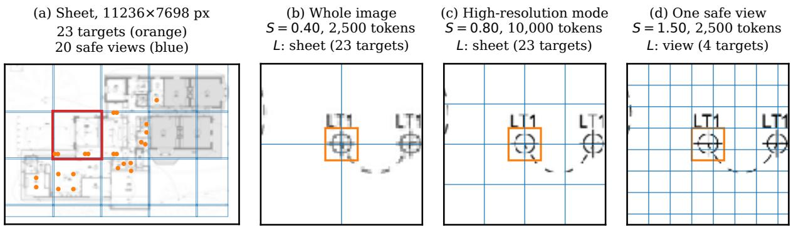
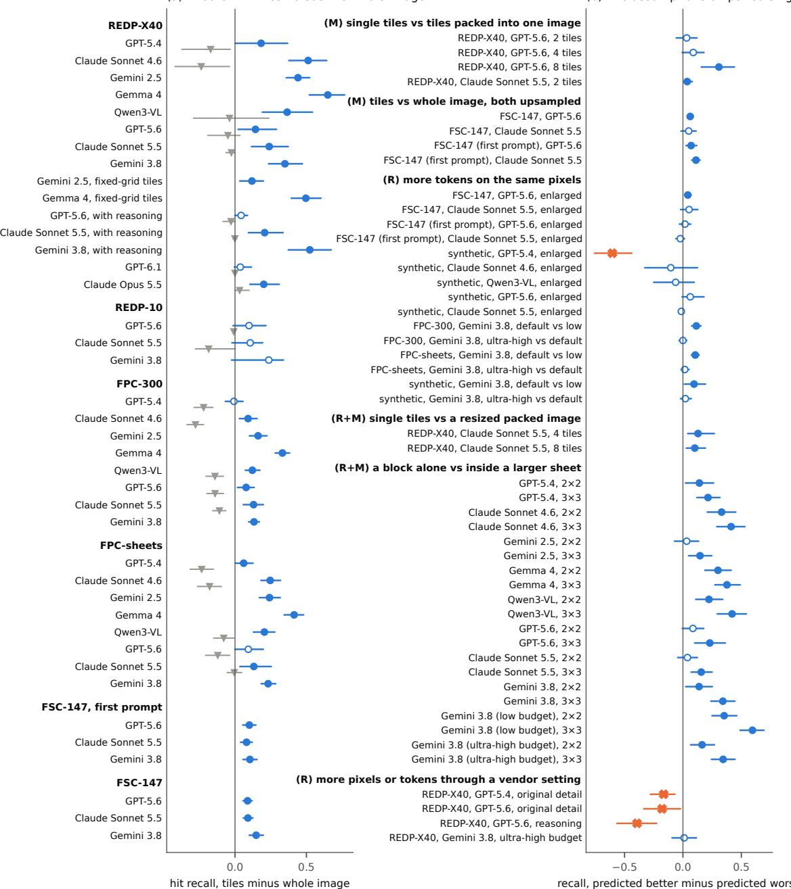
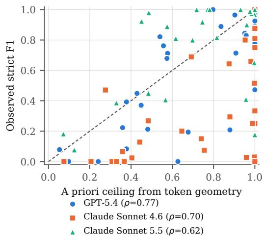
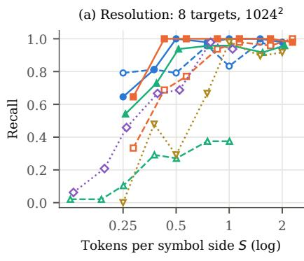
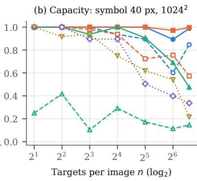
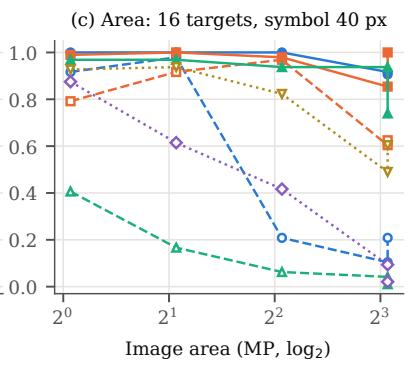
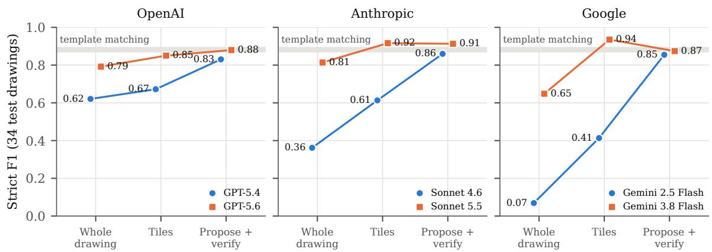
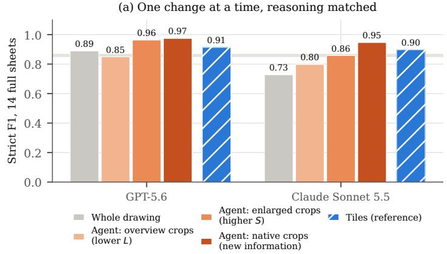
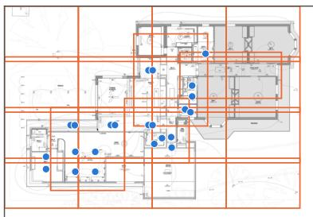

# Why VLMs Miss Small Objects, and When Zooming In Is Safe

Junzhe Shi\*   
Systems Engineering   
University of California, Berkeley   
Berkeley, CA, USA   
junzhe@berkeley.edu   
Yuan Gan   
Department of AI   
Quotr AI   
Emeryville, CA, USA   
yuan@quotr.ai   
Shida Jiang   
Systems Engineering   
University of California, Berkeley   
Berkeley, CA, USA   
shida\_jiang@berkeley.edu

## Abstract

Vision-language models (VLMs) often miss small objects in large images. We ask three questions: what limits them, which of these limits better models can remove, and whether the classical way of handling large images, lo cal decomposition, still has a future. We answer them with a theory built on two quantities of the image interface: S, the number of visual to kens across an object’s side, and L, the content a call must cover. The limits: a W × H im age sent whole within N tokens gives an object of side m at most mpN/(WH) tokens per side. Doubling the token budget N therefore raises the largest S a whole image can reach by only 41%, and seeing an image at the S an object needs costs at least order S2 tokens whatever the model. If recognition improves gradually with S, any search strategy, zoom agents included, obeys a recall-cost frontier. What better models can change: the S an ob ject needs and how much one call can carry, which we measure in bits per object found; the coverage cost remains. Decomposition: yes. Assuming only that more tokens per object and less content per call do not hurt on average, splitting an image cannot lower recall if no view zooms out relative to the whole image and views overlap by one object. Neither part of this condition can be dropped; we bound the cost of every such decomposition, and a simple rule approaches the bound as the image grows. We test the theory in about 177,000 requests on 797 images. On controlled images, none of 40 orderings predicted for 8 VLMs is violated. Checked after the fact on drawings, floor plans, natural and synthetic images, 61 of 89 implied orderings hold significantly and 4 fail, all for OpenAI models given more pixels than their default path. On construction drawings the rule never significantly lowered recall relative to the whole image and raised it by up to +0.28. We release the drawing benchmark, a planning tool for safe decomposition, the code, and the

model outputs at https://github.com/ shijunzhe/vlm-small-objects.

## 1 Introduction

Many tasks ask a vision-language model (VLM) to find every one of many small objects in a large image: symbols on engineering drawings and floor plans, components on schematics, cells in slides, defects in inspection images, items on shelves, or icons in screenshots. Current VLMs often fail at this, and the field has answered with a growing list of remedies: any-resolution encoders, tiling, vendor high-resolution modes, crop-and-zoom methods, agents trained to call zoom tools while reasoning, and reasoning itself. Each remedy is evaluated on its own benchmark, against its own baseline, and for the models of its season. Three questions remain open. What limits VLMs on such images? Which of these limits will better models remove? And does the classical way of handling large images, local decomposition, still have a future? We state our answers below and derive them in the sections that follow.

Every model we test resizes an image to a budget, cuts it into visual tokens of known size, and answers in text. Two quantities of this interface describe every call (Figure 1). S is the number of visual tokens across one side of a target object. L is the content that the call must cover and enumerate. S is known from the interface before any data is labelled, and L is fixed by the region a call shows. On the sheet of Figure 1, sent whole, a symbol spans only 0.4 tokens per side. Every remedy above is a way of changing the two quantities: tiling raises S and lowers L; a high-resolution mode raises S but leaves L at the whole image; a zoom tool lets the model set both, region by region; reasoning changes neither.

The answers rest on a theory in two layers (Section 3). The first follows from the documented interface alone and holds for every model: bounds on the S one call can reach, the token cost of seeing an image at a given S, and the fact that overlays and interpolation of the sent image add no Shannon information. The second assumes only that, on average over images, more tokens per target (R) and less content per call (M) do not reduce detection, and, for zoom tools, that more information does not (I). Under (R) and (M) we prove when decomposition is safe (Theorem 1), show that the condition is exact and what protection must cost (Theorem 2, Proposition 4), and give a rule that approaches that cost (Corollary 1). When the assumptions hold only approximately, the guarantee weakens by no more than the measured defects (Theorem 3). Five further results complete the picture. The assumptions fix the sign of the gain and nothing more (Proposition 5). Content has a unit in bits (Theorem 5). Any search strategy, adaptive agents included, obeys a recall-cost frontier (Proposition 9). False outputs have an exact price (Proposition 6). The safety results extend to any local task, segmentation included (Theorem 4).

  
Figure 1: The two quantities on a construction drawing. (a) A sheet from REDP-X40, our benchmark of 40 construction drawings, with 23 instances of one legend symbol. (b) to (d) One instance as a model with 32 px tokens receives it; blue lines are token boundaries, the orange square is the symbol’s box. Sent whole within a budget of 2,500 tokens, the symbol spans S = 0.40 tokens per side (b). A high-resolution mode with four times the budget only doubles S, and the call must still cover and list all 23 symbols (c). One view of the safe rule (Corollary 1) shows the symbol at S = 1.5 and contains four symbols (d); its 20 views, each within the same 2,500-token budget, together use 49,000 tokens, 1.3 times the lower bound on the cost of any decomposition that protects the whole sheet at that S (Theorem 2(c)).

We test the assumptions first on controlled images. To a model these are images like any other, and on them every pair of calls satisfies the definitions of the theory exactly. We then check, after the fact, every ordering that the theory implies in the data of our other experiments, where both quantities are extreme. These experiments use five kinds of data. REDP-X40 is a new benchmark of 40 construction drawings with 1,028 annotated instances. The others are ten held-out drawings (REDP-10) whose references come from a symbol library; public FloorPlanCAD plans arranged so that S and L vary independently; FSC-147 natural images; and synthetic sweeps that vary one quantity at a time. Eleven models from five families take part, in about 177,000 requests on 797 images with about 28,600 annotated instances, with every primary hypothesis registered before its calls. Beyond the answers above, we find:

• The predictions hold where the assumptions do. On controlled images, none of the 40 orderings predicted for 8 models is violated and 24 hold significantly (Table 2). Of the 89 orderings implied in the other experiments (a post hoc check), 61 hold significantly and 4 fail, all for OpenAI models given more pixels than their default path (Section 5.1). Without the theorem’s condition, protection is lost: our 44 px tile recipe, which zooms out on large symbols, lowered recall in 19 of 21 cells, significantly in 12 (a post hoc split). On construction drawings and floor-plan sheets the rule never significantly lowered recall relative to the whole image and raised it by up to +0.28, at 11% to 106% of the recipe’s tokens (Table 3).

• S governs recognition. Per-drawing F1 rises with S; with the pixels fixed, a larger token budget acts through S; and the recognition curve is a model parameter that training moves: at the same token grid, Gemini 3.8 recalls more of the same symbols than Gemini 2.5, by +0.55.

Three answers. (1) What limits VLMs. The interface does, before the model. A whole image gives an object of side m at most mpN/(WH) tokens per side, so doubling the budget N raises the largest S a whole image can reach by only 41%. Covering an image at the S an object needs costs at least order S2 tokens, for any model with this interface (Section 3). Within one call, recall falls as content grows (measured); Theorem 5 gives content a unit, bits per object found. (2) What better models can change. Better models can lower the S an object needs and raise the bits one call can carry, both model parameters that training moves; GPT-6.1 recalls 0.97 of the symbols on the 34 test drawings of our REDP-X40 benchmark in one call. Better models cannot remove the coverage cost or its S2 scaling. More pixels in one call do not always help either: on the 14 full drawing sheets of that test set, GPT-5.6 with reasoning reaches 0.33 F1 when the sheet is sent in its high-resolution mode, against 0.89 at default resolution, a failure of monotonicity in that mode. (3) Whether decomposition has a future. Yes. Wherever one call cannot pay the coverage cost and carry the content, the image must be split. Under two monotonicity assumptions, (R) and (M) of Section 3, splitting cannot lower expected recall when no view zooms out relative to the whole image and views overlap by one object, and this condition is exact (Theorem 1, Theorem 2). A simple rule does it at a cost that approaches the lower bound as the image grows (Corollary 1). What changes is who splits: a caller, a zoom tool, or the architecture itself.

• L governs capacity. At fixed S, recall falls as one call must report more targets, more area, or more packed tiles. On sheets built from nine FloorPlanCAD blocks (FPCsheets), GPT-5.6’s F1 on the first block changes by −0.22 when eight blocks are added around it in one call, and by −0.23 on the sheets where S stays at least 1. Training moves this parameter too: with 96 isolated symbols in one call, recall rose from 0.57 for Claude Sonnet 4.6 to 1.00 for Claude Sonnet 5.5, and from 0.85 for GPT-5.4 to 0.99 for GPT-5.6.

• Zoom agents succeed by decomposing the drawing themselves. With reasoning matched, GPT-5.6 and Claude Sonnet 5.5 reach 0.97 and 0.95 F1 on full sheets. GPT-5.6 gains almost entirely from S, Claude Sonnet 5.5 most from native pixels. Two of four agents count about right but fail to convert positions from crop to overview.

We release REDP-X40, the synthetic battery, a planning tool for safe decomposition, the code, the registrations, and every raw model output on the released data at https://github.com/ shijunzhe/vlm-small-objects.

## 2 Related Work

Small objects and high resolution in VLMs. VLMs fail on simple low-level visual tasks (Rahmanzadehgervi et al., 2024), their accuracy drops with object size and with distractors (Zhang et al., 2026, 2025a), and they lose small targets in large or cluttered inputs (Wu et al., 2025; Sharma et al., 2024; Zhang et al., 2025d,c). Architectural responses feed more pixels through dynamic tiling or any-resolution encoders (Chen et al., 2024; Xu et al., 2024; Bai et al., 2025). Inference-time responses divide the image and recombine (Wang et al., 2025; Akyon et al., 2022), or crop and zoom guided by attention (Zhang et al., 2025a), search (Wu and Xie, 2024; Shen et al., 2024), or a learned policy that calls zoom operations while reasoning (OpenAI, 2025; Zheng et al., 2026; Lai et al., 2026; Zhang et al., 2025b; Su et al., 2025). Liu et al. (2026) argue that zooming helps mainly by removing background rather than by enlarging the target. These works establish that zooming helps and propose ways to do it. We ask what governs the gain: we express every configuration, including an agent’s own zoom calls, in two interface quantities that are known before any data is labelled, and we separate their effects experimentally. In our agent ablation, overview crops shown without enlargement gave no significant gain, and enlarging them, which adds no new pixels, helped GPT-5.6 (+0.11) but not significantly Claude Sonnet 5.5 (Section 5.4).

Counting. Class-agnostic counters localize instances from exemplars (Amini-Naieni et al., 2024; Pelhan et al., 2026), and VLM counting has been improved by dividing the image (Qharabagh et al., 2026). Benchmarks include FSC-147 (Ranjan et al., 2021), CountBench (Paiss et al., 2023), PixMo-Count (Deitke et al., 2025), and CountQA (Tamarapalli et al., 2025), where accuracy falls as counts rise. Overlays such as marks, grids, labelled dots, and scan lines are reported to help grounding and counting (Yang et al., 2023; Lei et al., 2025; Izadi et al., 2025). We show why an overlay cannot add Shannon information while enlargement can still add usable information (Proposition 1), and we measure per-call capacity directly.

Engineering drawings. Symbol spotting and floor-plan parsing have dedicated datasets and methods (Liu et al., 2017; Kalervo et al., 2019; Fan et al., 2021; Luo et al., 2025), surveyed by Moreno-

García et al. (2019). Recent benchmarks show that VLMs struggle to recognize and count symbols on blueprints and construction drawings (Shteriyanov et al., 2025; Kondratenko et al., 2026; Jung et al., 2026). When a clean exemplar is available, normalized cross-correlation template matching (Lewis, 1995; Brunelli, 2009) is a strong, training-free baseline. We use drawings as the main testbed because they push both interface quantities to their limits, and we test the same predictions on synthetic images, FloorPlanCAD, and FSC-147.

Theory of usable information. Shannon information cannot grow under processing, but the information a computationally bounded predictor can use can (Xu et al., 2020). Overlays and interpolation of the sent image add no Shannon information but, like enlargement, may change how much of it a fixed model can use (Section 3).

## 3 Theory

Notation. A drawing X has $W \times H$ native pixels and contains n instances of a target whose template box is $w \times h$ pixels. We write $m = { \sqrt { w h } }$ for the target scale and use the matching tolerance $\tau = m / 2$ throughout. A call sends the model one image derived from the drawing. Its effective scale s is the number of pixels the model receives per native pixel, after every resampling by the caller and by the vendor. The model divides the image it receives into tokens of $t \times t$ pixels, with t fixed for each interface, and accepts at most N tokens per image. Resolution-scaled interfaces (GPT, Claude, Qwen) resize an image when it exceeds N tokens or a long-side cap (and some enlarge very small images); fixed-grid interfaces (Gemini, Gemma) pad an image to a square and resize it so that its side spans g tokens, whatever its pixel size. A target therefore spans

$$
S = { \frac { m s } { t } }\tag{1}
$$

tokens per side. The second quantity is the content L of a call: the region of the drawing it shows, with every target, distractor, and line in it. All interface parameters are documented by vendors (OpenAI, 2026; Anthropic, 2026; Google, 2026), and we verify each of them from billed token counts $( \mathsf { A p - }$ pendix C). We state the theory for detecting the instances of one target and extend it to other local tasks in Section 3.3. The theory has two layers. The first follows from the interface alone and holds for every model. The second adds assumptions about a model’s behaviour, each of which we check (Section 5.1). Proofs are in Appendix A.

## 3.1 What the interface alone implies

Proposition 1 (Information). Let Y be the target set and $R _ { s }$ the interface’s deterministic preprocessing at scale s. (a) For any transform $\gamma$ of the native drawing that is deterministic or randomized independently of Y given X, $I ( Y ; R _ { s } ( \gamma ( X ) ) ) \leq I ( Y ; X )$ . (b) For any transform η of the model input that is deterministic or uses randomness independent of(X, Y),for example upsampling or an overlay drawn on the sent image, $I ( Y ; \eta ( R _ { s } ( X ) ) ) \leq I ( Y ; R _ { s } ( X ) )$ ; moreover $\eta ( R _ { s } ( X ) )$ is a garbling of $R _ { s } ( X )$ , so for every loss its Bayes risk is at least that of $R _ { s } ( X )$ . (c) If $R _ { s }$ is linear and Λ is a fixed additive overlay, $I ( Y ; R _ { s } ( X + \Lambda ) ) = I ( Y ; R _ { s } ( X ) )$

Suppose the vendor does not resample or recompress the sent image. Then every overlay whose content depends on the drawing only through the sent image is of type (b) and cannot add Shannon information. Grids, numbered lines, labelled dots, and interpolated zoom can change only how a model uses its input. An overlay computed from the native drawing, such as marks at candidates found on native pixels, and a crop cut from the native drawing and sent at a larger scale are bounded only by (a); the crop can carry detail that $R _ { s } ( X )$ discards. For a computationally bounded predictor, usable information can still grow under deterministic processing (Xu et al., 2020): enlarging an input raises S without adding Shannon information, and can therefore help when the binding constraint is the model’s token geometry, but not when the pixels do not resolve the target. We call the two cases token-limited and information-limited.

Proposition 2 (Single-call resolution and coverage cost). (a) A resolution-scaled call that shows the whole drawing gives $S \le r \sqrt { N }$ with $r ~ = ~ m / { \sqrt { W H } } ;$ a fixed-grid call gives $S \ =$ mg/ max(W, H) at every caller scale. (b) Suppose every view’s kept core has area at most $\kappa ^ { 2 }$ times the view’s. Covering the drawing with kept cores of views shown at $S ~ \ge ~ S ^ { * }$ then requires at least $W H S ^ { * 2 } / ( \kappa ^ { 2 } m ^ { 2 } )$ tokens, hence at least $W H S ^ { * 2 } / ( \kappa ^ { 2 } m ^ { 2 } \dot { N } )$ calls (with $N = g ^ { 2 }$ forfixed grids). (c) A fixed-grid view whose longer side spans a native pixels gives $S = m g / a .$

Part (a) is an upper bound: long-side caps and per-image overhead only lower S. It also shows that a fixed-grid model gains nothing in $S$ from an enlarged whole image, and that only a smaller view raises its S (part c).

## 3.2 What follows for any model that is monotone

Calls, crops, and detection. A call c consists of a source image, a rectangular region $V _ { c }$ of it, an effective scale $s _ { c } ,$ a kept core $K _ { c } \subseteq V _ { c }$ (a rectangle, or a finite union of rectangles), a padding $P _ { c }$ , and a protocol $\pi _ { c } { \mathrm { : } }$ the prompt and any marking of the core. We take the drawing half-open, $X = [ 0 , W ) \times [ 0 , H )$ , and views and cores likewise. The source is a fixed image derived from the drawing without reference to the targets: the native drawing, a lower-resolution copy such as an overview, or a composite such as several regions packed into one image; it is blank outside the draw ing. The input of c is the region $V _ { c }$ of the source resampled to scale $s _ { c }$ and surrounded by the blank padding $P _ { c } \mathbf { ; }$ we treat the order of cropping and resampling as immaterial, which ignores differences within one resampling kernel of the region’s border. A model is any map from calls, each together with the drawing it is derived from, to probability laws of returned point sets. The model returns a random set of points. Points outside $K _ { c }$ are discarded and the rest are mapped to native coordinates. For a target centred at $x ,$ , let $p _ { c } ( x )$ be the probability that the call returns a kept point within τ of x. A set of calls detects x if one of them returns such a point, and its hit recall is the fraction of targets detected. When target centres are more than 2τ apart, each returned point lies within $\tau$ of at most one target, and hit recall equals recall under a maximum oneto-one matching. $\mathbf { A }$ target is interior to a call if its box lies inside $V _ { c }$ and its centre lies at least τ inside $K _ { c }$ . Because every target has the same box, this depends only on the centre, and we write $J _ { c }$ for the set of centres interior to $c .$

Averages over drawings. Let D be any distribution of drawings: the drawings of an application, a benchmark, or a single drawing. Calls, and the regions on which we compare them, are specified by rules that may depend on the drawing’s size but not on its targets. Thus $V _ { c } , K _ { c } , J _ { c } ,$ , and a region $U _ { : }$ a measurable set of centres, are functions of the drawing’s size; unions, intersections, and differences of regions are regions. A decomposition may use a number of calls that depends on the drawing’s size. We assume that the expected number of targets is finite. For a region $U _ { : }$ , let $\nu _ { c } ( U )$ be the expected number of targets with centres in $U \cap J _ { c }$ that c detects, over D and the model’s randomness; it is additive over disjoint regions.

We compare calls by three relations. Call $c ^ { \prime }$ is a crop of c if it shows a sub-region $V _ { c ^ { \prime } } \subseteq V _ { c }$ of a source that agrees with the source of c on $V _ { c ^ { \prime } }$ , at scale $s _ { c ^ { \prime } } \geq s _ { c } ,$ with the protocol $\pi _ { \mathrm { c r o p } }$ with which we show crops. Padding may differ. Any part of a view outside the drawing is blank and counts as padding, and $V _ { c ^ { \prime } }$ and $K _ { c ^ { \prime } }$ are then taken intersected with the drawing. For packed tiles, agreement is up to the translation that places a tile in the composite. Call $c ^ { \prime }$ refines c if both show the same region of the same source with the same core and protocol and $s _ { c ^ { \prime } } \geq s _ { c } ;$ padding may differ. Call c is a garbling of $c ^ { \prime }$ if both show the same region with the same core, padding, protocol, and scale, and the source of c is a fixed degradation of the source of $c ^ { \prime }$ that does not depend on the targets, such as a lower-resolution copy. We assume that the vendor does not resize an image again if its pixel size, after blank padding to a multiple of t, equals the size to which the vendor resized an earlier image (for fixed grids, the resize to g tokens is the only one applied). A call can then be shown at any effective scale up to the budget by choosing its padding.

Assumption 1 (Monotonicity). For all calls $c , c ^ { \prime }$ and every region $U \subseteq J _ { c } \cap J _ { c ^ { \prime } }$ on every drawing: (R) if c′ refines $c ,$ then $\nu _ { c ^ { \prime } } ( U ) \geq \nu _ { c } ( U )$ : more tokens per target do not hurt; (M) if c′ is a crop of c at the same effective scale, then $\nu _ { c ^ { \prime } } ( U ) \geq$ $\nu _ { c } ( U )$ : less content in the call does not hurt; $( I ) i f$ c is a garbling of c′, then $\nu _ { c ^ { \prime } } ( U ) \geq \nu _ { c } ( U )$ : more information does not hurt.

When D is a single drawing whose targets have distinct centres, taking U to be a single centre, and conversely summing over the finitely many targets in $U .$ , shows that Assumption 1 is equivalent to $p _ { c ^ { \prime } } ( x ) \ \geq \ p _ { c } ( x )$ for every target interior to both calls. For a general D it is weaker: it asks for the inequality only on average over the drawings and over the targets in each region, which is the quantity an experiment estimates, and it allows individual targets and drawings to go the other way. Every result below holds for whichever D the assumption is made for.

These are properties of a model, together with the protocol it is called with, treated as a black box. Each compares the same targets in two calls. (R) is the precise sense in which S governs recognition, and (M) the sense in which the content of a call governs capacity. (I) is the behavioural counterpart of Proposition 1(b): when the input of c is a function of the input of $c ^ { \prime } ,$ , the Bayes risk of $c ^ { \prime }$ is at most that of c for every fixed loss. For detection counts alone, which ignore unmatched points, the comparison is trivial for a Bayes decoder; for a VLM, (I) is an assumption.

Proposition 3 (Crop dominance). Under (R) and (M), $i f c ^ { \prime }$ is a crop of c, then $\nu _ { c ^ { \prime } } ( U ) \geq \nu _ { c } ( U ) f o r$ every region $U \subseteq J _ { c } \cap J _ { c ^ { \prime } }$

In words, the next theorem says: if no view zooms out relative to the whole image, and the views overlap enough that every target lies well inside some view, then the views together find at least as many targets as the whole image, in expectation. In its statement, $K _ { i } \oplus B _ { 0 }$ is the core enlarged by half a target box on each side.

Theorem 1 (When decomposition is safe). Let $c _ { \mathrm { w } }$ show the whole native drawing, with the whole drawing as its core, at effective scale $s _ { \mathrm { w } } ,$ , so that $S _ { \mathrm { w } } ~ = ~ m s _ { \mathrm { w } } / t .$ Let $c _ { 1 } , \ldots , c _ { k }$ be crops of ${ \mathcal { C } } _ { \mathrm { W } } ,$ so that $S _ { i } ~ \geq ~ S _ { \mathrm { w } }$ for every i. Under (R) and (M), for every region $U \subseteq J _ { c _ { \mathrm { w } } } \cap \bigcup _ { i } J _ { c _ { i } }$ , the expected number of targets with centres in U that $c _ { 1 } , \ldots , c _ { k }$ detect is at least $\nu _ { c _ { \mathrm { w } } } ( U )$ . If the cores shrunk by $\tau$ cover the drawing shrunk by $\tau ,$ and every view $V _ { i }$ contains $( K _ { i } \oplus B _ { 0 } ) \cap X$ , where $B _ { 0 } = [ - w / 2 , w / 2 ] \times [ - h / 2 , h / 2 ]$ and X is the drawing, then $J _ { c _ { \mathrm { w } } } \subseteq \cup _ { i } J _ { c _ { i } }$ , so the decomposition detects in expectation at least as many of the targets interior to $c _ { \mathrm { w } }$ as $c _ { \mathrm { w } }$ does.

The condition $S _ { i } ~ \ge ~ S _ { \mathrm { w } }$ cannot be weakened, and neither assumption can be dropped:

Proposition 4 (Tightness). Suppose target centres are more than 2τ apart. (a) For any decomposition and any target whose centre lies in the kept core of no view with $S _ { i } \geq S _ { \mathrm { w } }$ , there is a model satisfying (R), (M), and (I) under which the whole-image call detects every target interior to it with probability one and the decomposition never detects that target. (b) There are models satisfying (M) and (I) but not (R) under which a decomposition with $S _ { i } > S _ { \mathrm { w } }$ for all i detects nothing, and models satisfying (R) and (I) but not (M) under which any decomposition into views that are not the whole drawing detects nothing, while in both cases the whole-image call detects every target interior to it.

The models in the proof satisfy the assumptions for every target, hence for every ${ \mathcal { D } } ,$ so the condition is necessary whichever form of Assumption 1 is assumed.

A common recipe rescales every image so that the target spans a fixed number of pixels and then tiles. When the targets are already large in the whole-image call, this lowers S, the theorem gives no guarantee, and Proposition 4(a) shows that none is possible from the assumptions. Which decompositions are protected can be stated exactly, and what protection must cost can be bounded; a simple rule then avoids the problem at a cost that approaches the bound as the drawing grows.

Write $e _ { x } = \operatorname* { m a x } ( w , 2 \tau )$ and $e _ { y } = \operatorname* { m a x } ( h , 2 \tau )$ for the margins that a target needs in each direction, $\lambda = S ^ { 2 } / m ^ { 2 }$ for the tokens per native pixel at $S _ { \ast }$ and $\sigma = \sqrt { \lambda e _ { x } e _ { y } / N }$ , the fraction of a view’s side that one margin takes at the budget N. For the whole-image call, $J _ { c _ { \mathrm { w } } }$ is the drawing shrunk by $e _ { x } / 2$ and $e _ { y } / 2 .$ , of area $| J _ { c _ { \mathrm { w } } } | = ( W - e _ { x } ) ( H - e _ { y } )$ when $W > e _ { x }$ and $H > e _ { y }$

Theorem 2 (Exact condition and a cost lower bound). Let $c _ { \mathrm { w } }$ be as in Theorem 1 and let d be any finite set ofcalls. (a) Ifevery centre in $J _ { c _ { \mathrm { w } } }$ is interior to some call in d that is a crop or a refinement of $\cdot _ { c _ { \mathrm { w } } , }$ , then under (R) and (M) d detects in expectation at least as many of the targets interior to $c _ { \mathrm { w } }$ as $c _ { \mathrm { w } }$ does, for every D. (b) If target centres are more than 2τ apart and some $x \in J _ { c _ { \mathrm { w } } }$ is interior to no such call, there is a model satisfying (R) and (M) for every target under which $c _ { \mathrm { w } }$ detects every target interior to it and d never detects a target centred at x. (c) Suppose every centre in $J _ { c _ { \mathrm { w } } }$ is interior to a call ofd that is a crop or a refinement $o f c _ { \mathrm { w } }$ with $S _ { c } \geq S ,$ , where $S \geq S _ { \mathrm { w } }$ and $\sigma < 1$ . Then these calls use at least

$$
C _ { \mathrm { m i n } } = \frac { | J _ { c _ { \mathrm { w } } } | \lambda } { ( 1 - \sigma ) ^ { 2 } }
$$

tokens, whatever the shapes, sizes, cores, and overlaps oftheir views;for afixed grid the same holds with $N = g ^ { 2 }$

Parts (a) and (b) say that protection is decided target by target: a location is protected exactly when some crop or refinement of the whole-image call has it in its interior, and the covering hypothesis of Theorem 1 is one way to ensure this everywhere. Part (c) uses no assumption about the model; it bounds what any decomposition that protects every location with calls at $S _ { c } \geq S$ must spend, and $C _ { \mathrm { m i n } }$ is a lower bound, not an attained minimum. The following rule approaches it as the drawing grows, up to the rounding factor $\chi ,$ when its ideal views fit within the vendor’s limits.

Corollary 1 (A safe decomposition near the cost bound). For a target value $S ^ { * }$ , let $S \_ { } = $ $\operatorname* { m a x } ( S ^ { * } , S _ { \mathrm { w } } )$ , with $\sigma < 1 , W > e _ { x } ,$ and $H > e _ { y } .$ Tile the drawing,from a corner, with views ofnative size $a _ { x } \times a _ { y }$ shown at S (for afixed grid, squares of side $m g / S )$ , whose kept cores are the whole views, at pitches $p _ { x } = a _ { x } - e _ { x } > 0$ and $p _ { y } = a _ { y } - e _ { y } > 0 ,$ each view within the vendor’s limits so that it is not resized, and let T be the tokens of one view. Under (R) and (M) this decomposition detects in expectation at least as many ofthe targets interior to $c _ { \mathrm { w } }$ as the whole-image call, and it attains $S ^ { * }$ Excluding per-image overhead it uses at most

$$
\chi \bigg ( 1 + \frac { p _ { x } } { W - e _ { x } } \bigg ) \bigg ( 1 + \frac { p _ { y } } { H - e _ { y } } \bigg ) C _ { \mathrm { m i n } }
$$

tokens, where $\chi = T ( 1 - \sigma ) ^ { 2 } / ( \lambda p _ { x } p _ { y } ) \geq 1$ , and $\chi = 1$ for the views $a _ { x } = e _ { x } / \sigma , a _ { y } = e _ { y } / \sigma$ when their sides are whole numbers ofpatches.

As a recipe: choose $S \ = \ \operatorname* { m a x } ( S ^ { * } , S _ { \mathrm { w } } )$ , cut the drawing into views that overlap by one target, each as large as the budget allows at S (about $\sqrt { N } \times \sqrt { N }$ tokens for square targets), and send each view without further resizing. The ideal views have aspect ratio $e _ { x } / e _ { y }$ and cost exactly N tokens. When they exist within the vendor’s limits, the ratio of the rule’s cost to $C _ { \mathrm { m i n } }$ tends to $\chi$ as the drawing grows relative to the views, so its cost exceeds that of the cheapest decomposition that protects every location with calls at $S _ { c } \geq S$ by at most a factor that tends to $\chi . \ \chi = 1$ when the ideal views are whole numbers of patches, and $\chi$ is close to one when the views span many patches, since rounding a side to whole patches changes it by less than one patch. Every call at $S _ { c } \geq S$ protects area at most $( N / \lambda ) ( 1 - \sigma ) ^ { 2 }$ , so any such decomposition also needs at least $C _ { \mathrm { m i n } } / N$ calls, and the ratio is unchanged when a per-image overhead is counted. For square targets the ideal views are $\sqrt { N } \times \sqrt { N }$ patches whatever S, for example $5 0 \times 5 0$ at $N = 2 { , } 5 0 0$ , where $\sigma = 0 . 0 3$ at $S = 1 . 5 ;$ on a fixed grid the square views give $\chi = 1$ for square targets. No whole-image call attains $S ^ { * } > r \sqrt { N } ( S ^ { * } > m g / \operatorname* { m a x } ( W , H )$ on a fixed grid), by Proposition 2.

Keeping the whole view as the core removes the second margin of the covering construction of Theorem 1, which keeps a core inside each view and then shrinks it by τ . Points near a view’s edge, where a symbol may be cut, are kept, so the rule can add false points there, and targets in the $e _ { x } .$ wide overlaps of adjacent views can be reported twice. Both are unmatched points priced by Proposition $6 ;$ merging duplicates is the step whose loss ζ enters Theorem 3.

Which form of the assumption is needed. In Corollary 1 the sets $J _ { c _ { i } } \cap J _ { c _ { \mathrm { w } } }$ are the views shrunk by $e _ { x } / 2$ and $e _ { y } / 2 ,$ , half-open rectangles of size $p _ { x } \times p _ { y }$ that tile a region containing $J _ { c _ { \mathrm { w } } }$ , intersected with $J _ { c _ { \mathrm { w } } }$ , and in Theorem 4 the cores partition the drawing. In both cases the sets $J _ { c _ { i } } \cap J _ { c _ { \mathrm { w } } }$ partition $J _ { c _ { \mathrm { w } } }$ , and the proofs apply (R) and (M) only to regions of the single form $U = J _ { c } \cap J _ { c ^ { \prime } } \cap J _ { c _ { \mathrm { w } } } { : }$ : all targets interior to both calls compared and to the whole image. These conclusions therefore hold under the much weaker assumption that, for the pairs of calls the proof compares (the whole-image call with each tile shown at the whole image’s scale, and that call with the tile), the expected number of such targets detected does not decrease. Table 2 estimates quantities of exactly this form for its own pairs of calls and its distribution of images.

When monotonicity holds only approximately. The guarantees degrade gracefully. Let $\mu ( U )$ be the expected number of targets with centres in $U$ with $\mu ( J _ { c _ { \mathrm { w } } } ) > 0$

Theorem 3 (Decomposition with imperfect monotonicity). Let $c _ { \mathrm { w } }$ and crops $c _ { 1 } , \ldots , c _ { k }$ be as in Theorem $^ { l , }$ let $U _ { 1 } , \dots , U _ { k }$ be disjoint regions with $U _ { i } \subseteq J _ { c _ { i } } \cap J _ { c _ { \mathrm { w } } } ,$ , let $U _ { 0 } = J _ { c _ { \mathrm { w } } } \setminus \bigcup _ { i } U _ { i }$ , and let $\tilde { c } _ { i }$ show the region ofc at the scale $o f c _ { \mathrm { w . } }$ , as in the proofofProposition 3. Suppose that,for each $i ,$

$$
\begin{array} { r l } & { \nu _ { \tilde { c } _ { i } } ( U _ { i } ) \geq \nu _ { c _ { \mathrm { w } } } ( U _ { i } ) - \epsilon _ { M , i } \mu ( U _ { i } ) , } \\ & { \nu _ { c _ { i } } ( U _ { i } ) \geq \nu _ { \tilde { c } _ { i } } ( U _ { i } ) - \epsilon _ { R , i } \mu ( U _ { i } ) , } \end{array}
$$

and that a final merging step removes in expectation at most $\zeta \mu ( J _ { c _ { \mathrm { w } } } )$ hits. Then, with R the expected number ofdetected targets interior to $c _ { \mathrm { w } }$ divided by $\mu ( J _ { c _ { \mathrm { w } } } )$ (a ratio of expected counts, not a mean recall per drawing),

$$
\mathcal { R } _ { \mathrm { d } } \geq \mathcal { R } _ { \mathrm { w } } - \psi - \bar { \epsilon } - \zeta ,
$$

where $\psi = \mu ( U _ { 0 } ) / \mu ( J _ { c _ { \mathrm { w } } } )$ and $\begin{array} { r } { \bar { \epsilon } = \sum _ { i } ( \epsilon _ { M , i } + } \end{array}$ $\epsilon _ { R , i } ) \mu ( U _ { i } ) / \mu ( { J _ { c _ { \mathrm { w } } } } )$ , and with uniform defects $\epsilon _ { M } , \epsilon _ { R } , \mathcal { R } _ { \mathrm { d } } \geq \mathcal { R } _ { \mathrm { w } } - \psi - \bigl ( 1 - \psi \bigr ) \bigl ( \epsilon _ { M } + \epsilon _ { R } \bigr ) - \zeta .$ . No factor grows with the number oftiles. Ifcentres are more than $2 \tau$ apart, the calls $c _ { \mathrm { w } } , \tilde { c } _ { i } , c _ { i }$ are distinct, and $0 \leq \epsilon _ { M , i } , \epsilon _ { R , i }$ with $\epsilon _ { M , i } + \epsilon _ { R , i } \leq 1 $ , the bound with $\zeta = 0$ is attained by some model.

Exact monotonicity, full coverage, and lossless merging $( \epsilon = \psi = \zeta = 0 )$ recover Theorem 1 for crops. The defects are quantities of the kind the direct tests estimate. As an illustration, if the defects of a decomposition equalled the worst values within the 95% intervals of the (M) and (R) pairs of Table 2, with $\psi = \zeta = 0$ as for Corollary 1, the guarantee would weaken by at most 0.15 for the models we tested (the maximum, for ${ \mathrm { Q w e n } } 3 { \mathrm { - V L } } )$ , and not at all for 3 of them; this is an illustration, not a 95% bound, since it combines two intervals measured on other pairs of calls. A large defect makes the guarantee nearly vacuous: for GPT-5.4 under vendor resizing the measured loss in (R) is 0.60 (95% interval 0.44 to 0.76) in recall (Section 5.1), which is why views must be sent within the budget and, for the OpenAI models, on the default path.

What the assumptions cannot say. Theorem 1 and Theorem 2 bound the gain of a decomposition from below by zero. (R), (M), and (I) together cannot do better.

Proposition 5 (The assumptions fix the sign of the gain, not its size). Suppose target centres are more than $2 \tau$ apart, the expected number E $n _ { \mathrm { w } }$ of targets interior to $c _ { \mathrm { w } }$ is positive and finite, and $F ( z ) = \mathbb { E } n _ { \mathrm { w } } ( z ) / \mathbb { E } n _ { \mathrm { w } }$ is continuous, where $n _ { \mathrm { w } } ( z )$ counts the targets interior to $c _ { \mathrm { w } }$ whose first coordinate is at most z. Let $c _ { 1 } , \ldots , c _ { k }$ satisfy the hypotheses of Theorem 1, including its covering condition, none ofthem showing the whole drawing at scale $s _ { \mathrm { w } } .$ . For any $0 \leq r _ { \mathrm { w } } \leq r _ { \mathrm { d } } \leq 1$ there is a model satisfying (R), (M), and (I) for every target under which the expected number oftargets interior to $c _ { \mathrm { w } }$ that $c _ { \mathrm { w } }$ detects is $r _ { \mathrm { w } } \mathbb { E } n _ { \mathrm { w } }$ , and that $c _ { 1 } , \ldots , c _ { k }$ detect is $r _ { \mathrm { d } } \mathbb { E } n _ { \mathrm { w } }$

Monotonicity therefore determines whether a decomposition can hurt, and nothing about how much it helps: any gain between zero and the whole call’s miss rate is consistent with it. The size of the gain is a property of the model, which only measurement can supply, and Section 5.2 and Section 5.3 measure it.

Assumption 1 concerns detection and says nothing about points that match no target. Their effect on $F _ { 1 }$ has an exact price.

Proposition 6 $( F _ { 1 }$ of a decomposition). On a drawing with n targets, let a set ofcalls return the kept points $O ,$ let TP be the size of a maximum one-toone matching ofpoints to targets within τ, and let $\mathrm { F P } = | O | - \mathrm { T P }$ count the unmatched points, so that $F _ { 1 } = 2 \mathrm { T P } / ( n + \mathrm { T P } + \mathrm { F P } )$ . For two sets of calls d and w with $\mathrm { T P } _ { \mathrm { w } } > 0$

$$
F _ { 1 , \mathrm { d } } \geq F _ { 1 , \mathrm { w } } \iff \Delta \mathrm { F P } \leq \rho _ { \mathrm { w } } \Delta \mathrm { T P } ,
$$

$$
\rho _ { \mathrm { w } } = \frac { n + \mathrm { F P _ { w } } } { \mathrm { T P _ { w } } } \geq \frac { 1 } { \mathrm { R e c _ { w } } } ,
$$

where $\Delta \mathrm { F P = F P _ { d } - F P _ { w } , \Delta T P = T P _ { d } - T P _ { w } }$ and R $\textstyle \mathrm { e c _ { w } } \ = \ \mathrm { T P _ { w } } / n$ is the recall of w. Since $\mathrm { T P _ { d } } \ \leq \ n ,$ no set of calls that adds more than $( n + \mathrm { F P _ { w } } ) ( 1 / \mathrm { R e c _ { w } } - 1 )$ unmatchedpoints can keep $F _ { 1 }$ at least that ofw. The same holds with $n ,$ TP, and FP replaced by their expectations over D and the model, with $\mathbb { E } \operatorname { T P } _ { \mathrm { w } } > 0$ and $F _ { 1 } , \rho _ { \mathrm { w } } ,$ , and $\operatorname { R e c } _ { \mathrm { w } }$ computed from these. If target centres are more than 2τ apart and every target is interior to $c _ { \mathrm { w } } .$ then under (R) and (M) a decomposition satisfying the hypotheses of Theorem 1 or of Theorem $2 ( a )$ has $\begin{array} { r } { \mathbb { E } \mathrm { T P _ { d } } \geq \mathbb { E } \mathrm { T P _ { w } } , } \end{array}$ so its $F _ { 1 }$ computed from expected counts is at least that of $c _ { \mathrm { w } }$ whenever it adds no more unmatched points than hits.

The rate $\rho _ { \mathrm { w } }$ is at least $1 / \mathrm { R e c _ { w } }$ , so it is large whenever the whole-image call has low recall. When the whole image yields few hits, a decomposition can add many unmatched points per additional hit and still raise $F _ { 1 }$ ; when the whole image already yields most targets, it can afford few. Duplicates in the overlaps of cores are unmatched points and are priced at the same rate, and a verification step that removes unmatched points is bounded by Proposition 11. Our metric is such a maximum matching within τ (Section 4).

Proposition 7 (Zoom tools). Let an overview call $c _ { 0 }$ show the whole drawingfrom a lower-resolution copy at scale $s _ { \mathrm { o } } ,$ with its own core. Fix a region and three calls on it with a common core: $c _ { 1 }$ , the region cutfrom the overview at scale $s _ { \mathrm { o } } ; c _ { 2 }$ , the same cut enlarged to a scale $s ^ { \prime } > s _ { \mathrm { o } } ;$ and c3, native pixels ofthe region at scale $s ^ { \prime } .$ Let U be a set ofcentres interior to all four calls. Under Assumption $^ { l , }$ in expected number oftargets detected in $U , c _ { 1 }$ is no worse than $c _ { 0 } \ ( M ) , \ c _ { 2 }$ is no worse than $c _ { 1 } \ ( R )$ , and $c _ { 3 }$ is no worse than $c _ { 2 } ,$ , which is a garbling of it (I).

Proposition 3 also orders two other designs we test. When several tiles are packed into one image, each single tile is a crop of the packed image if sent at no smaller scale (up to the separator lines we draw in the tile margins, outside the cores). When drawing is added around a fixed region, the region alone is a crop of the larger drawing if that drawing is sent at no larger scale. In both cases the theory predicts no gain from the larger call.

## 3.3 Other local tasks

Nothing above depends on what a target is. An item has an anchor point x; a support box, centred at $x ,$ inside the $w \times h$ box centred at $x ,$ and containing the pixels needed to answer the item; and a correct answer, such as a class, a transcription, or a value. An item is interior to a call if the $w \times h$ box centred at its anchor lies inside $V _ { c }$ and its anchor lies at least $\tau$ inside $K _ { c } ,$ so that, as for targets, this depends only on the anchor.

Enumeration tasks. A call returns located answers, and an item is detected if a kept answer lies within τ of its anchor and equals its correct answer. Detection of one or several classes, text spotting, keypoint and landmark localization, cell detection and classification, and listing the interactive elements of a screenshot are enumeration tasks. With $p _ { c } ( x )$ and $\nu _ { c } ( U )$ defined by this event, Assumption 1 is stated as before. Proposition 3, Theorem 1, Proposition 4, Theorem 2, Corollary 1, Theorem 3, Proposition 5, Proposition 6, and Proposition 7 then hold as stated, with the same proofs, where a matching pairs only answers and items with equal answers. Hits equal matched answers when anchors with equal answers are more than 2τ apart. Proposition 8 below holds with the added target replaced by an added item.

Assignment tasks. The items are given and each needs an answer: classify each listed region, read each field of a form, label each pixel or each cell of a grid. Here the items are part of the input: calls and regions may depend on the drawing’s size and on the given items, but not on their correct answers. A call answers the items whose anchors lie in its kept core. An item is interior to the call if the $w \times h$ box centred at its anchor lies in the view and its anchor in the core, with no margin τ, so $J _ { c }$ differs from that of enumeration tasks. $\nu _ { c } ( U )$ counts correct answers to the items anchored in $U \cap J _ { c }$ . A decomposition answers each item by the call whose core contains its anchor, so no tolerance and no overlap of cores is needed.

Theorem 4 (Safe decomposition for assignment tasks). Let $c _ { \mathrm { w } }$ show the whole native drawing X, with X as its core, at effective scale $s _ { \mathrm { w } }$ and answer every item, and let $c _ { 1 } , \ldots , c _ { k }$ be crops of $c _ { \mathrm { w } }$ whose cores, taken half-open and intersected with X, partition it, each view $V _ { i }$ containing $( K _ { i } \oplus B _ { 0 } ) \cap X$

Under (R) and (M), over the items whose $w \times h$ boxes centred at their anchors lie in the drawing, the expected number of correct answers of the decomposition is at least that $o f c _ { \mathrm { w } }$

Every item receives exactly one answer, and a wrong answer on a background pixel or an empty field counts like a missed object, so Theorem 4 bounds both kinds of error at once. The ratio of the decomposition’s expected correct answers to the expected number of items is at least that of the whole-image call; on a single drawing, this ratio is the expected accuracy. Theorem 2(c) and Corollary 1 carry over with $e _ { x } = w$ and $e _ { y } = h$ The cores are the half-open interior cells of size $p _ { x } \times p _ { y }$ , with the outermost cells extended to the drawing’s edge, and the views are the unextended cells enlarged by $B _ { 0 }$ , which contain $( K \oplus B _ { 0 } ) \cap$ X for the extended cores. Proposition 4(a) holds with the same construction, the model answering correctly when $S _ { c } \geq S _ { \mathrm { w } }$ and incorrectly otherwise.

## 3.4 The content of a call, in bits

(M) orders calls by content but assigns content no size. One part of the content limit holds for every model and gives it a unit.

Theorem 5 (What a hit costs). Let a call, or any procedure, return a finite set Yˆ of R points for a region of area A containing the centres Y of n targets, with n and A fixed and Y a labelled tuple whose labels are exchangeable, and let TP be the size of a maximum one-to-one matching of points to centres within τ. Let pk be the largest probability, over k distinct labelled centres and k disks of radius τ , that each of these centres lies in its disk, and $( n ) _ { k } = n ! / ( n - k ) !$ . Then

$$
\begin{array} { r } { \mathbb { E } \big [ - \log _ { 2 } p _ { \mathrm { T P } } - \log _ { 2 } ( n ) _ { \mathrm { T P } } \big ] \leq I ( Y ; \hat { Y } ) + o , } \end{array}
$$

where $o = \mathbb { E } \log _ { 2 } { \binom { R } { \mathrm { T P } } } + \log _ { 2 } ( n + 1 )$ . Ifthe centres are independent and uniform on the region, then with $L _ { \mathrm { b i t } } = n \log _ { 2 } { \left( A / ( n \pi \tau ^ { 2 } ) \right) }$ ，

$$
\mathbb { E } [ \mathrm { R e c } ] \cdot L _ { \mathrm { b i t } } \leq I ( Y ; \hat { Y } ) + o .
$$

Consequently, for independent uniform centres and $L _ { \mathrm { b i t } } > 0 \colon ( a )$ a call whose answer carries at most C bits about the targetpositions has expected recall at most $( C + o ) / L _ { \mathrm { b i t } } ; ( b )$ any policy whose report depends on the drawing only through the model’s responses reaches expected recall E[Rec] only if its transcript (its calls and responses together with its own randomness) carries at least $\mathbb { E } [ \mathrm { R e c } ] L _ { \mathrm { b i t } } - o$ bits about the target positions, with $L _ { \mathrm { b i t } }$ computed for the whole drawing.

$L _ { \mathrm { b i t } }$ measures the content of a call in bits: every hit costs $\log _ { 2 }$ of the ratio between the area per target and the tolerance disk. Doubling both the targets and the area of a call doubles $L _ { \mathrm { b i t } }$ . Doubling the targets at a fixed area doubles $L _ { \mathrm { b i t } }$ less one bit per target, and doubling the area at a fixed number of targets adds one bit per target. Packing k tiles of equal density into one image adds their contents. The term o charges reports that match nothing: an answer that lists every cell of a grid finds every target while saying nothing about where they are. Near full recall the bound is tight up to about two bits per target. Cut a rectangle into $N _ { \mathrm { c e l l } } = A / ( 2 \tau ^ { 2 } )$ cells of side ${ \sqrt { 2 } } \tau ;$ reporting the centre of every occupied cell finds in expectation at least a fraction $1 - ( n - 1 ) / ( 2 N _ { \mathrm { c e l l } } )$ of the targets with at most $L _ { \mathrm { b i t } } + n \log _ { 2 } ( e \pi / 2 )$ bits, about 2.1 bits per target more than $L _ { \mathrm { b i t } }$ (Appendix A). Theorem 5 is the part of the content limit that holds for every model; the bits a given model can convey in one answer, $C$ in (a), are a parameter of the model, like its recognition curve. On our controlled images the best model’s whole-image answers carried on average at least about 422 bits, against at least 438 bits needed for full recall without false points (12 px symbols, recall 0.98). Both numbers are lower bounds, so they show how much the answers conveyed, not whether a model’s capacity binds; the content effects we measure on larger images (Section 5.3) are measured properties of the models, not consequences of this bound.

## 3.5 Adaptive zooming

A model may also choose its own views, zooming where it expects targets. Under a hard recognition threshold, adaptivity cannot avoid the coverage cost of Proposition 2(b).

Assumption 2 (Recognition threshold). There is an $S _ { \mathrm { r e c } } > 0$ such that, for any two drawings that differ only by one target with box B andfor any history of earlier views and responses, the model’s response to a view V has the same conditional distribution under both drawings unless V shows targets at $S _ { V } \geq S _ { \mathrm { r e c } }$ and B lies in V.

Proposition 8 (Adaptive zooming pays the coverage cost). Under Assumption 2, let F be afamily of drawings, $X _ { 0 } \in { \mathcal { F } }$ , and D the set of centres x such that $X _ { 0 }$ with one target added at x lies in F. Consider any policy, possibly adaptive and randomized, whose views andfinal report depend on the drawing only through the model’s responses, that takes views and then reports a target set, and suppose that on every drawing in $\mathcal { F }$ the report is correct (a one-to-one matching within τ covers every instance and leaves no report unmatched) with probability at least $\textstyle 1 - \delta , \delta < { \frac { 1 } { 2 } }$ . Then on $X _ { 0 }$ its expected token cost, over the randomness ofthe policy and ofthe model, is at least $\left( 1 - 2 \delta \right) | D | S _ { \mathrm { r e c } } ^ { 2 } / m ^ { 2 }$ . Area that F excludes a priori, such as title blocks and margins, is not in D; ifa target may lie anywhere inside the drawing without overlapping the targets of $X _ { 0 } ,$ , D is the drawing minus a border strip of widths $w / 2$ and $h / 2$ and minus a 2w × 2h neighbourhood of each target of $X _ { 0 } ,$ , and the bound is $( 1 - 2 \delta ) | D | / ( W H )$ times Proposition $2 ( b )$ with $S ^ { * } = S _ { \mathrm { r e c } }$ and $\kappa = 1$

Agents that crop and zoom therefore do not escape decomposition; they perform it. They save only area excluded a priori, and an overview shown at $S \geq S _ { \mathrm { r e c } }$ is itself a covering view whose tokens count. When $S _ { \mathrm { r e c } } \geq S _ { \mathrm { w } } .$ , the tiling of Corollary 1 at $S = S _ { \mathrm { { r e c } } }$ costs, excluding overhead, at most $\chi ( 1 + p _ { x } / ( W - e _ { x } ) ) ( 1 + p _ { y } / ( H - e _ { y } ) ) | J _ { c _ { w } } | / ( ( 1 -$ $\sigma ) ^ { 2 } | D | )$ times what any always-correct adaptive policy must spend; the comparison concerns cost only. The bound of Proposition 8 scales with $S _ { \mathrm { r e c } } ^ { 2 }$ Our data show recognition rising gradually rather than at a sharp threshold (Section 5.2), so Assumption 2 holds only with $S _ { \mathrm { r e c } }$ at or below the smallest $S$ we tested, and the bound is correspondingly weak for current models. Proposition 9 below replaces the threshold by a graded curve.

Graded recognition. Proposition 8 needs a sharp threshold and a policy that is always exactly right. Neither holds for current models and agents, and the following frontier needs neither. We let a call carry several images, as when an agent keeps earlier views in its context, and count its cost as the tokens of all its images, earlier ones included, which is what is processed and billed.

Assumption 3 (Graded recognition). Each image’s pixels depend on the drawing only within its view, and the model’s response to a call depends only on the call’s images and text and on the history of responses. There is a non-decreasing $f : [ 0 , \infty ) $ [0, 1] such that, for any two drawings that differ only by one target with box B and for any history of earlier responses, the laws of the model’s response to a call under the two drawings differ in total variation by at most $\textstyle \sum _ { I } f ( S _ { I } )$ , the sum over the images I ofthe call whose views meet B.

An image whose view does not meet B is identical under the two drawings, so only images that show part of the target can contribute; Assumption 3 says how much one image at S can reveal about a target. It holds with $f = \mathcal { H } [ S \geq S _ { \mathrm { r e c } } ]$ for a model satisfying Assumption 2 that keeps one image per call, and $f ( S )$ is at least the probability that a view at S detects a target it shows minus the probability that it reports one where there is none. Because $f$ bounds the change in the whole response, a measured detection curve gives only a lower bound on $f ,$ , and a frontier computed from it is indicative rather than certified.

Proposition 9 (Recall-cost frontier). Under Assumption 3, let $X _ { 0 }$ be a drawing and Ω a measurable set of centres, $0 < | \Omega | < \infty ,$ , such that $f o r$ every $x \in \Omega$ the drawing $X _ { x } , ~ X _ { 0 }$ with one target of box $B _ { x } = x + B _ { 0 }$ added at x, is valid and x is more than 2τ from every target of $X _ { 0 }$ . Consider any policy, possibly adaptive and randomized, whose calls andfinal report depend on the drawing only through the model’s responses, with randomness independent of the drawing, and which makes at most K calls almost surely,for some K. Let $\bar { R }$ be the probability, averaged over $x \in \Omega ,$ , that its report on $X _ { x }$ contains a point within τ of x, and $\overline { { \mathrm { F P } } } _ { 0 }$ the expected number ofreported points on $X _ { 0 }$ farther than τ from every target. Then its expected token cost on $X _ { 0 }$ is at least

$$
\frac { \bar { R } | \Omega | - \pi \tau ^ { 2 } \overline { { { \mathrm { F P } } } } _ { 0 } } { \beta \kappa _ { f } m ^ { 2 } } , \qquad \kappa _ { f } = \operatorname * { s u p } _ { S > 0 } \frac { f ( S ) } { S ^ { 2 } } ,
$$

where $\beta \geq 1$ bounds $( 1 + w / a _ { x } ) ( 1 + h / a _ { y } )$ over the $a _ { x } \times a _ { y }$ views it uses.

The frontier covers every strategy whose access to the image goes through the model: tiles, highresolution calls, model-based propose-and-verify, and zoom agents, with imperfect recall and with false points charged at an explicit rate. To find a fraction R¯ of targets placed anywhere in Ω, a policy must spend about $\bar { R } | \Omega | / ( \kappa _ { f } m ^ { 2 } )$ tokens on drawings without the target, unless it pays in false points. The constant $\kappa _ { f }$ is set by how much a view at small $S$ can reveal. If $f ( S ) = \mathrm { m i n } \{ 1 , ( S / S _ { 0 } ) ^ { \gamma } \}$ with $\gamma \geq 2$ , then $\kappa _ { f } = 1 / S _ { 0 } ^ { 2 }$ , and every search pays the coverage cost of Proposition 2(b) at $S ^ { * } = S _ { 0 }$ and $\kappa = 1$ up to the factors $\bar { R } , \beta _ { ; }$ , and $| \Omega | / ( W H )$ , less the price of its false points; with a sharp threshold this recovers the scaling of Proposition 8 for average rather than exact recall. If recognition rose more slowly than $S ^ { 2 }$ at small $S ,$ , the bound would be vacuous, and spreading tokens thinly over the whole image could pay. Which case holds is a property of the model, and lowering $S _ { 0 }$ , the tokens a target needs, lowers the frontier quadratically.

Two reference lines. Appendix A states and proves two further results that we use only as reference lines. Under the assumption that a model knows only which token cell contains a target (Assumption 4), a reported point lies within $\tau$ of the target with probability at most $\pi S ^ { 2 } / 4$ for $S \leq 1$ (Proposition $1 0 ) ;$ simulating this observer on the ground truth gives each drawing an a priori ceiling. For a propose-and-verify system with proposer recall q, F1 is bounded above by $2 q / ( 1 + q )$ , the F1 of a perfect verifier, and below by a function of the verifier’s acceptance rates (Proposition 11).

## 4 Experimental Setup

The experiments do two things: they test the predictions of the theory, and they measure the model parameters that the theory leaves open, namely the $S$ that recognition needs, the capacity of one call, and the coordinate interface. Table 1 lists every experiment with its data, models, runs, and registration.

Data. REDP-X40, a benchmark we introduce, has 40 partial screenshots of construction drawings from different real projects and sources, with no project-identifying information. Each image comes with one target symbol cropped from its legend, and every instance of that symbol is annotated with a centre point (1,028 instances; 3 to 116 per image). Twenty images are large sheet regions (long side 2,947 to 11,484 px; we call them $f u l l$ sheets) and twenty are smaller views (483 to 3,520 px). Six sheets form the tuning set used for every design choice; the other 34 images (14 sheets and 20 views, 660 instances) form the test set, which was scored only after the analysis plan was registered. A label audit after all runs, which pooled the detections of template matching and six model configurations, found no missing labels (Appendix K). REDP-10 has ten further construction drawings annotated by one of the authors before this study (23 drawing and class items, 225 instances), whose references come from a shared symbol library rather than each drawing’s legend; nothing was tuned on them and they are not released. FloorPlanCAD: the test split of FloorPlanCAD (Fan et al., 2021)

<table><tr><td>Experiment</td><td>Data</td><td>Models</td><td>What varies</td><td>Runs</td><td>Plan</td><td>Reported</td></tr><tr><td>Configurations, first round</td><td>REDP-X40 test (34)</td><td>GPT-5.4, Claude Sonnet whole drawing, vendor 4.6, Gemini 2.5, Gemma high resolution, 44 px 4, Qwen3-VL</td><td>and model-specific tiles,</td><td>2</td><td>1</td><td>§5.4, App. B</td></tr><tr><td>Configurations, newer REDP-X40 test models</td><td>(34)</td><td>GPT-5.5, GPT-5.6, Claude Sonnet 5.5, Claude Opus 5.5,</td><td>whole drawing, tiles</td><td></td><td></td><td>1 or 2 2, 6 §5.2, §5.4</td></tr><tr><td>Synthetic sweeps</td><td>156 controlled images</td><td>Gemini 3.8, GPT-6.1 8 model settings</td><td>S, number of targets, area, clutter, upsampling</td><td>1</td><td>3</td><td>§5.2, §5.3</td></tr><tr><td>Packed tiles</td><td>14 REDP-X40 sheets</td><td>GPT-5.6, Claude Sonnet tiles per image 5.5</td><td>k = 1, 2, 4, 8</td><td>1</td><td>3</td><td>§5.3</td></tr><tr><td>Reasoning and zoom agents</td><td>REDP-X40 test (34)</td><td>GPT-5.6, Claude Sonnet reasoning; a zoom tool, 5.5, Gemini 3.8,</td><td>up to 20 calls</td><td>2</td><td>3</td><td>§5.4</td></tr><tr><td>Matched reasoning, zoom-tool ablation</td><td>REDP-X40 test (34)</td><td>Qwen3-VL GPT-5.6, Claude Sonnet one step of the zoom 5.5</td><td>tool at a time;</td><td>1 or 2</td><td>4</td><td>§5.4</td></tr><tr><td>Token budget at fixed pixels</td><td>synthetic, FloorPlanCAD</td><td>Gemini 3.8</td><td>full-resolution call about 257, 1,090, 2,210 tokens</td><td>1</td><td>4</td><td>§5.2</td></tr><tr><td>FloorPlanCAD</td><td>FPC-300 (339), FPC-sheets (60 × 3)</td><td>first-round models, GPT-5.6, Claude Sonnet agent; sheet area 5.5, Gemini 3.8</td><td>whole image, tiles,</td><td>1</td><td>4</td><td>§5.3, §5.6</td></tr><tr><td>Held-out drawings</td><td>REDP-10 (23 items)</td><td>GPT-5.6, Claude Sonnet whole drawing, tiles, 5.5, Gemini 3.8</td><td>agent</td><td>1</td><td>3</td><td>§5.6</td></tr><tr><td>Natural images</td><td>FSC-147 (150)</td><td>5.5, Gemini 3.8</td><td>GPT-5.6, Claude Sonnet whole, upsampled, tiles</td><td>1</td><td>3</td><td>§5.6</td></tr><tr><td>Trained counters</td><td>REDP-X40, REDP-10,</td><td>CountGD, GeCo2, OWLv2</td><td>exemplar source, tile scale</td><td>1</td><td>3</td><td>§5.6, App. K</td></tr><tr><td>Assumption battery</td><td>FPC-300, FSC-147 12 controlled images</td><td>8 models</td><td>crop, refinement, garbling, safe tiling</td><td>1</td><td>5</td><td>§5.1</td></tr><tr><td>The safe rule</td><td>REDP-X40, FPC-sheets</td><td>GPT-6.1, Claude Opus 5.5, Gemini 3.8, Qwen3-VL</td><td>rule, whole image, 44 px tiles</td><td>1</td><td>6</td><td>§5.4</td></tr></table>

Table 1: Every experiment at a glance. Runs: repetitions of each model call (the rule reuses the first runs of the whole-image and tile calls). Plan: the registration that fixed the experiment’s data, conditions, and hypotheses before its calls (Section 4). Whole-image and tile conditions of every row also enter the check of Section 5.1.

has 1,000×1,000 px rasters of 20 m blocks (CC BY-NC). From it we built FPC-300, 369 block and class items (21 countable object classes, 3 to 80 instances, 30 tuning and 339 test items) with the median-size instance as the reference. In FPCsheets, the first nine blocks of each of 60 source drawings are tiled into a $3 { , } 0 0 0 ^ { 2 }$ sheet whose topleft $2 , 0 0 0 ^ { 2 }$ and first 1,0002 block are nested subsets, so that the same symbols and reference appear at three sheet areas. Labels and predictions within m/2 of a block edge, where FloorPlanCAD’s cropping cuts instances, are ignored. FSC-147: 150 test images (Ranjan et al., 2021) in three strata of exemplar size. Controlled images: 156 synthetic images built from the REDP-X40 legend templates in five sweeps (symbol size, number of targets, image area, clutter, and upsampling that adds no information; Appendix E), and an assumption battery of twelve 20482 images with 48 targets and 48 distractors each (Section 5.1). To a model a synthetic image is an image like any other; what differs is the distribution, light linework without the text and hatching of construction sheets.

Models. The first round uses GPT-5.4, Claude Sonnet 4.6, Gemini 2.5 Flash, Gemma 4 31B, and Qwen3-VL-235B-A22B (the open models through OpenRouter with a pinned provider). The second round uses GPT-5.5, GPT-5.6 Sol, Claude Sonnet 5.5, Claude Opus 5.5, and Gemini 3.8 Flash; GPT-6.1 Sol was added later. We write GPT-5.6 and GPT-6.1 for the Sol models and Gemini 2.5 and Gemini 3.8 for the Flash models. Reasoning is disabled wherever the API allows it (Gemini 3.8 keeps a minimal thinking budget, and GPT-6.1 runs at its lowest accepted effort), except where stated. The measured token geometry of every model is in Appendix C.

Conditions. Every condition on drawings and controlled images uses the same task prompt: find every instance of the reference symbol and return its centre as JSON. FSC-147 uses a domain-neutral variant (Section 5.6).

• Whole drawing: the drawing, long side at most 1,600 px, in one call. Answers are read in each model’s documented coordinate convention (Section 5.5); the first round’s registered pixel reading is reported in Appendix B.

• Vendor high resolution: the same call with OpenAI’s detail=original, which accepts far more pixels, or Gemini’s higher media-resolution settings.

• Tiles: the drawing cut into views with a margin; a blue frame marks each view’s core, and only centres inside it are kept and mapped back to native pixels. 44 px tiles rescale the drawing so that the reference spans 44 px and cut 1,024 px tiles. Model-specific tiles are 44 px tiles for models that scale with resolution; for fixed-grid models, the field of view is chosen by Proposition 2(c) so that the symbol spans 1.5 tokens (Gemma 4) or 2.5 tokens (Gemini).

• The rule: the views of Corollary 1 at $S ^ { * } =$ 1.5.

• Zoom agent: the legend crop and an overview (long side 1,600 px) plus a zoom tool that returns any rectangle cut from the native drawing (long side at most 1,024 px, at most twice native), up to 20 calls, with reasoning. Two variants of the tool, together with the agent itself, change one step at a time: the tool returns the rectangle cut from the overview at the overview’s scale (lower L only), or the same crop enlarged to the native crop’s size (also higher S, no new information); the agent’s own tool returns the native crop (also new information).

• Template matching: multi-scale, fourrotation normalized cross-correlation with non-maximum suppression, with the threshold chosen on the tuning set.

Further conditions, each named where it is used, are reasoning, packed tiles, token budgets at fixed pixels, propose and verify, and trained counters.

Metric and statistics. Predicted and annotated centres are matched one to one by a maximum matching within $\tau = m / 2 ,$ half a symbol, and strict F1 is computed from this matching. Tests of the theory use hit recall, under which a target counts as detected if any returned point lies within τ (Section 3); the two agree when targets are more than 2τ apart. Comparisons of configurations use strict F1. Runs are averaged per drawing, and every comparison is a paired bootstrap over drawings (4,000 resamples), clustered by source drawing where items share one. We call a difference significant when its 95% interval excludes zero; the registered first-round family (plan 1) and the agent controls of plan 4 are corrected for multiple tests with Holm’s method (Holm, 1979), and we give the corrected p where we cite them; other tests are reported with unadjusted intervals. A tolerance based on the template’s ink box leaves every conclusion unchanged (Appendix H).

Registration. Every experiment was registered before its calls, in six plans; the few conditions added afterwards are marked where they appear and listed in Appendix B. Plan 1 covers the first round, with the analysis plan, hypotheses, and perdrawing ceilings, and plan 2 the second round, with the newer models’ measured geometry and predicted ceilings. Plan 3 covers the synthetic sweeps, packed tiles, reasoning, zoom agents, trained counters, REDP-10, and FSC-147, with two addenda, and plan 4 matched reasoning, the zoom-tool ablation, token budgets, and FloorPlanCAD. Plan 5, written after the theory was derived, covers the assumption battery, with an addendum for the two newest models, and plan 6 the safe rule. In Section 5 we mark a result registered when it tests a registered hypothesis and post hoc when we formulated the analysis after seeing the data. Appendix B maps every hypothesis to its plan and outcome and lists every deviation.

Scale. In all, the experiments sent about 177,000 requests to VLMs (277 million input tokens) on 797 images with about 28,600 annotated instances; for construction drawings the unit of inference is the drawing.

## 5 Results

We first check the predictions of the theory (Section 5.1). The next two subsections measure the two model parameters behind the second answer:

the S that recognition needs (Section 5.2) and the capacity of one call (Section 5.3). Section 5.4 compares who splits the image (the caller, with tiles or the rule of Corollary 1, or the model, with a zoom tool), which bears on the third answer. Section 5.5 reports the coordinate interface, a further limit taken up in Section 6, and Section 5.6 checks generality on held-out drawings, public floor plans, and natural images.

## 5.1 The theory’s predictions, checked

Direct tests on controlled images (registered). Controlled images let each relation of Section 3 be built exactly. We rendered twelve $2 0 4 8 ^ { 2 }$ images, each with 48 targets and 48 distractors drawn from the REDP-X40 legend templates at a symbol scale of 12, 20, or 32 px. For each image, each model received five kinds of call: the whole image; sixteen $5 1 2 ^ { 2 }$ crops at the same effective scale (padded with blank canvas for fixed-grid interfaces, so that the vendor applies the same resizing); the same crops at twice the scale; the same crops at twice the scale but cut from a copy downsampled fourfold (a garbling); and a $3 \times 3$ tiling whose cores overlap by 2τ. The tiling satisfies the covering hypothesis of Theorem 1 at the whole image’s scale, the hardest case the theorem allows. Calls to models that scale with resolution were sized so that the vendor does not resize them. Over 8 models and five relations (Table 2), none of the 40 predicted orderings is violated: 24 hold significantly and 16 are consistent, the smallest mean difference being −0.03. The safe tiling gains from +0.06 to +0.37 in hit recall at equal S, significantly for 4 of 8 models, which is the effect of (M) alone. The two models added last to the battery, Claude Opus 5.5 and GPT-6.1, were added under a separate registration with unchanged code. None of their 10 orderings is violated, and 2 are significant. That is fewer than for the others, because they already find most targets in the whole image (whole-image recall 0.76 and 0.91, against 0.49 for GPT-5.6). No stratum by symbol size has an interval below zero. Unmatched points, which the assumptions do not govern, and the resulting F1 are reported in Appendix K.

Every implied ordering in the other experiments (post hoc). The other experiments were designed before the theory, to test registered hypotheses about configurations. After deriving the theory we searched their data for every pair of single calls that the assumptions order, on the same targets and with the same prompt, and report all 89 that we found (Figure 2). A pair counts as a violation if its 95% interval lies below zero; if every true difference were zero, about 2.2 of the 89 one-sided tests at the 2.5% level would fail by chance. Overall, 61 pairs lie significantly in the predicted direction, 24 are consistent with it, and 4 violate it. The next three paragraphs report the parts of this check.

Decomposition. We tested Theorem 1 as stated: on hit recall, over the targets interior to the wholeimage call and to a tile, on the items where every tile has at least the whole image’s S, with S computed by Equation 1 and Proposition 2. Our tiles’ cores abut without the 2τ overlap of the covering hypothesis, so we test the theorem’s first claim; the interior targets are 84% of all targets on those items. In all 40 model and data cells, which include tiles and whole drawing both with reasoning, fixed-grid tiles, the newest models, and the held-out REDP-10, the difference is at least −0.01, and in 33 the interval lies above zero (Figure 2a). The condition $S _ { \mathrm { t i l e } } \geq S _ { \mathrm { w h o l e } }$ matters in practice. Our 44 px recipe lowers S on items whose symbols are already large in the whole image. On these items (a split we made after seeing the data), the point estimate is negative in 19 of 21 cells and the interval lies below zero in 12 (grey in Figure 2a). On FPC-300, for example, GPT-5.6 gains +0.08 [+0.02, +0.13] where the theorem applies and changes by −0.14 [−0.20, −0.08] where it does not. This contrast is observational, since the items where the recipe lowers S are those with large symbols, but it is what Proposition 4(a) warns of: without the condition, nothing in the assumptions protects the decomposition. The rule of Corollary 1 never lowers S.

The assumptions on paired calls. The remaining orderings test (R) and (M), alone or chained (Figure 2b). The FSC-147 crop pairs are scored on all targets rather than on those interior to both calls, which counts targets cut by tile borders against the tiles and so makes these tests conservative. Packing more tiles into one image never raised recall. More tokens on the same pixels (Gemini 3.8’s three budgets, and enlarged images for the models that scale with resolution) never significantly lowered recall, except for GPT-5.4 on enlarged synthetic images. No FloorPlanCAD block was detected better inside a larger sheet, sent at a lower scale, than alone, for any of the ten model settings. The zoomagent comparisons of Section 5.4 are analogues of Proposition 7 at the level of a policy rather than of (a) Theorem 1: tiles versus the whole image

(b) The assumptions on paired single calls

Figure 2: Every single-call ordering implied by Assumption 1 that we found in the data of our other experiments (a post hoc check), grouped by the relation it tests. Each row is a paired difference, predicted better minus predicted worse, with a 95% bootstrap interval, clustered by source drawing where items share one. (a) Theorem 1 as stated: hit recall over targets interior to the whole-image call and to a tile, on items where every tile has at least the whole image’s S; grey, for comparison, the items where the 44 px recipe lowers S, where the theory makes no prediction and which are not counted. (b) Crops at equal scale (M); more tokens on the same pixels (R); crops at a larger scale, such as a block alone against the same block inside a larger sheet sent at a lower scale (R and M); and the same drawing with more pixels or tokens through a vendor setting (R, with new information where native pixels are sent), on the drawings where the setting adds tokens. The controlled tests of Table 2 are not shown.

<table><tr><td></td><td>(M) crop − whole</td><td> $( \mathbf { R } ) 2 { \times } \mathbf { c r o p - c r o p }$ </td><td>(I) native — garbled</td><td> $( \mathbf { R } , \mathbf { M } ) 2 \times \mathrm { c r o p - w h o l e }$ </td><td>Thm. 1: safe tiles — whole</td></tr><tr><td>GPT-5.4</td><td> $+ 0 . 1 2 [ - 0 . 0 6 , + 0 . 3 2 ]$ </td><td> $\mathbf { + 0 . 1 6 } _ { [ + 0 . 0 1 , + 0 . 2 9 ] }$ </td><td> $+ 0 . 4 3 \ [ + 0 . 2 8 , + 0 . 5 6 ]$ </td><td> $+ 0 . 2 8 \left[ + 0 . 1 3 , + 0 . 4 5 \right]$ </td><td> $\mathbf { + 0 . 2 5 } _ { [ + 0 . 1 0 , + 0 . 4 0 ] }$ </td></tr><tr><td>GPT-5.6</td><td> $\mathbf { + 0 . 3 9 } _ { [ + 0 . 1 6 , + 0 . 6 5 ] }$ </td><td> $+ 0 . 0 3 [ 0 . 0 0 , + 0 . 0 7 ]$ </td><td> $+ 0 . 2 8 [ + 0 . 1 6 , + 0 . 4 1 ]$ </td><td> $\mathbf { + 0 . 4 2 } _ { [ + 0 . 1 7 , + 0 . 6 9 ] }$ </td><td> $+ 0 . 3 7 [ + 0 . 1 5 , + 0 . 6 0 ]$ </td></tr><tr><td>Claude Sonnet 5.5</td><td> $+ 0 . 1 7 [ - 0 . 0 1 , + 0 . 4 2 ]$ </td><td> $- 0 . 0 3 \left[ - 0 . 0 7 , + 0 . 0 1 \right]$ </td><td> $+ 0 . 4 9 _ { \left[ + 0 . 2 6 , + 0 . 7 2 \right] }$ </td><td> $+ 0 . 1 4 [ - 0 . 0 5 , + 0 . 3 8 ]$ </td><td> $+ 0 . 0 9 [ - 0 . 0 8 , + 0 . 3 1 ]$ </td></tr><tr><td>Qwen3-VL</td><td> $+ 0 . 0 0 3 \left[ - 0 . 1 5 , + 0 . 1 4 \right]$ </td><td> $\mathbf { + 0 . 4 6 } _ { [ + 0 . 2 9 , + 0 . 6 2 ] }$ </td><td> $+ 0 . 5 8 \left[ + 0 . 3 6 , + 0 . 7 9 \right]$ </td><td> $+ 0 . 4 6 _ { \ : [ + 0 . 2 5 , + 0 . 6 7 ] }$ </td><td> $+ 0 . 2 3 \scriptstyle { [ + 0 . 0 9 , + 0 . 4 0 ] }$ </td></tr><tr><td>Gemma 4</td><td> $\mathbf { + 0 . 1 0 } _ { [ + 0 . 0 2 , + 0 . 2 0 ] }$ </td><td> $+ 0 . 3 2 _ { [ + 0 . 1 9 , + 0 . 4 7 ] }$ </td><td> $\mathbf { + 0 . 1 9 } _ { [ + 0 . 1 0 , + 0 . 2 9 ] }$ </td><td> $\mathbf { + 0 . 4 2 } _ { [ + 0 . 2 4 , + 0 . 6 1 ] }$ </td><td> $\mathbf { + 0 . 0 7 } _ { [ + 0 . 0 2 , + 0 . 1 3 ] }$ </td></tr><tr><td>Gemini 3.8</td><td> $+ 0 . 2 9 _ { [ + 0 . 1 1 , + 0 . 4 7 ] }$ </td><td> $\mathbf { + 0 . 2 0 } _ { [ + 0 . 0 7 , + 0 . 3 4 ] }$ </td><td> $\mathbf { + 0 . 4 0 } _ { [ + 0 . 2 0 , + 0 . 6 2 ] }$ </td><td> $+ 0 . 4 9 _ { [ + 0 . 3 4 , + 0 . 6 4 ] }$ </td><td> $+ 0 . 1 6 [ - 0 . 0 3 , + 0 . 3 5 ]$ </td></tr><tr><td> $\mathrm { C l a u d e \ O p u s } 5 . 5 ^ { \dag }$ </td><td> $+ 0 . 2 6 [ 0 . 0 0 , + 0 . 5 3 ]$ </td><td> $- 0 . 0 0 3 [ - 0 . 0 2 , + 0 . 0 1 ]$ </td><td> $\mathbf { + 0 . 3 9 } _ { [ + 0 . 1 9 , + 0 . 6 0 ] }$ </td><td> $+ 0 . 2 6 [ 0 . 0 0 , + 0 . 5 2 ]$ </td><td> $+ 0 . 2 2 [ 0 . 0 0 , + 0 . 4 4 ]$ </td></tr><tr><td> $\mathrm { G P T } { = } 6 . 1 \ \mathrm { S o l } ^ { \dag }$ </td><td> $+ 0 . 0 3 \left[ - 0 . 1 2 , + 0 . 2 4 \right]$ </td><td> $+ 0 . 0 5 [ 0 . 0 0 , + 0 . 1 1 ]$ </td><td> $+ 0 . 3 8 [ + 0 . 2 0 , + 0 . 5 8 ]$ </td><td> $+ 0 . 0 8 \left[ - 0 . 0 3 , + 0 . 2 6 \right]$ </td><td> $+ 0 . 0 6 [ - 0 . 0 9 , + 0 . 2 6 ]$ </td></tr></table>

Table 2: Direct test of Assumption 1 and Theorem 1 on controlled images. Each cell is the mean difference in hit recall, the fraction of targets detected, over targets interior to both calls, with a 95% bootstrap interval over the twelve parent images; bold: interval above zero; †: added later under an addendum to the registration. Every pair of calls satisfies the definitions of Section 3 exactly, and the tiles satisfy the covering hypothesis of Theorem 1 at $S _ { \mathrm { t i l e } } = S _ { \mathrm { w h o l e } }$

single calls, and are not counted; none of the six is significantly negative.

The violations. All 4 violations involve OpenAI models given more pixels than their default path, by which we mean the default detail setting with images that the vendor does not resize. GPT-5.4’s recall changed by $- 0 . 6 0 [ - 0 . 7 6 , - 0 . 4 4 ]$ on synthetic images that we enlarged to 2,048 px, which the vendor then resizes, although the measured geometry gives them more tokens per symbol than the originals. On small views, OpenAI’s high-resolution mode and the default call send the same image, so we compare them on the other REDP-X40 drawings (post hoc reading of registered calls). There, sending the drawing at native resolution instead of at 1,600 px changed recall by −0.16 [−0.28, −0.07] for GPT-5.4, −0.18 [−0.34, −0.02] for GPT-5.6, and −0.39 [−0.57, −0.23] for GPT-5.6 with reasoning, whose F1 on full sheets fell to 0.33 from 0.89. None of these losses is a coordinateframe error: no rescaling or shift of the answers recovers them, even fitted to the labels. In the highresolution mode GPT-5.6 often reports about the right number of symbols at wrong positions. Gemini 3.8’s ultra-high budget on the same drawings changed recall by $+ 0 . 0 1 \ [ - 0 . 0 9 , + 0 . 1 2 ]$ . Each of these pairs shows the same content with more pixels, so the losses are failures of monotonicity in these high-resolution paths, not effects of content. The guarantees therefore hold for the OpenAI models only on their default paths, which all their tiles and default whole-drawing calls in this paper use, and a high-resolution mode must be tested before it is trusted.

  
Figure 3: Per-drawing whole-drawing F1 on REDP-X40 against the a priori ceiling (34 test drawings; dashed line: observed equals ceiling), for three of the models; Spearman $\rho$ for all of them is given in Section 5.2. Claude Sonnet 4.6 is read in its documented resized frame.

## 5.2 Tokens per symbol govern recognition

Dose response on construction drawings (registered). Figure 3 plots, for each REDP-X40 test drawing, whole-drawing F1 against a ceiling computed from the geometry before any test call. Observed F1 follows it for every first-round model (Spearman $\rho = 0 . 7 7$ for GPT-5.4, 0.70 for Claude Sonnet 4.6, 0.76 for Gemma 4, 0.58 for Gemini 2.5, and 0.29 for Qwen3-VL, all with intervals above zero). For the six second-round settings (GPT-5.5, GPT-5.6, Claude Sonnet 5.5, Claude Opus 5.5, and Gemini 3.8 at its default and ultra-high budgets), ρ ranges from 0.33 (Gemini 3.8, the only interval including zero) to 0.62 (Claude Sonnet 5.5). Tiles help where the ceiling is low (+0.41 F1 for GPT-5.4) and not where it is high (−0.10). The ceiling is a function of S and of how often instances share a token, and log S alone explains as much of the per-drawing variance as the ceiling (Appendix K), so we treat S as the operative variable and the ceiling as a reference line. On FloorPlanCAD sheets, pooled over the three sheet areas, per-item F1 again rises with S for every model (Spearman +0.21 for GPT-5.6, +0.24 for Claude Sonnet 5.5, +0.42 for Gemini 3.8).

GPT-5.4 GPT-5.6 Sonnet 4.6 Sonnet 5.5 Gemini 2.5 Gemini 3.8 Gemma 4 Qwen3-VL  

  
Figure 4: Controlled stimuli, eight models. (a) Recall against tokens per symbol side S (8 targets and 8 distractors). (b) Recall against the number of targets per call at fixed S (1.25 to 1.43 for resolution-scaled models). (c) Recall against image area with 16 targets of fixed pixel size. Dashed and hollow: first round; solid and filled: second round.

Same pixels, different budget (registered). A dose response could reflect anything that correlates with symbol size. Gemini 3.8 lets the caller set the token budget per image while the pixels stay fixed: about 257, 1,090, or 2,210 tokens. On the synthetic resolution sweep, recall for 8 px symbols rises from 0.44 to 0.54 to 0.71 across the three budgets. A logistic curve in log S fits as well as one that adds a separate offset per budget (∆AIC = 0.2), so the budget acts through S. On FPC-sheets, raising the budget from low to default changes F1 by +0.17 [+0.12, +0.21] on items whose low-budget S is below 1.5 and by +0.05 [+0.002, +0.09] on the others, where we had registered no change.

The recognition curve is a model parameter (registered). Recall rises with S for every model in the synthetic sweeps, gradually rather than at a sharp threshold, and the level at which it rises differs by model (Figure 4a; values in Table 10, Appendix E). We had registered that recall would be near zero below S = 0.5 and that the curves would coincide in S; recall was near zero below 0.5 only for Gemini 2.5, and the curves did not coincide. Gemini 2.5 needs about one token per symbol side (S50 = 1.28). Gemma 4, Claude Sonnet 4.6, and Qwen3-VL reach one half at 0.31, 0.35, and 0.54.

GPT-5.4, GPT-5.6, Gemini 3.8, and Claude Sonnet 5.5 reach it at or below the smallest S we tested for them (0.13 to 0.29), so their values are extrapolated. The difference is not geometric. At Gemini 3.8’s low budget its token grid is the same as Gemini 2.5’s default grid, yet its recall on the same images is higher by +0.55 [+0.42, +0.67]. In a one-dot probe every model except Gemini 2.5 placed an isolated dot within 1 to 2 px, far below the token size (Appendix C), so the token-quantized observer of Proposition 10 describes Gemini 2.5 but not current models.

A newer generation moves the parameter (registered). Figure 5 compares two generations per vendor, with the newer models’ geometry measured and their ceilings registered before testing. Larger budgets raise whole-drawing F1 where geometry says they should: by +0.53 on full sheets for Claude (1,568 to 4,784 tokens) and +0.52 for Gemini (258 to about 1,090). At unchanged geometry GPT-5.6 improves on GPT-5.4 by +0.17 [+0.08, +0.27], while GPT-5.5 does not (−0.07), so recognition also improves across generations, though not monotonically.

Where enlargement helps (registered). Proposition 2 predicts that a fixed-grid model gains from a smaller field of view but not from more pixels, while a model that scales with resolution gains from enlargement as long as the pixels resolve the target. Choosing Gemini 2.5’s and Gemma 4’s field of view by Proposition 2(c) instead of 44 px tiles adds +0.23 and +0.08 F1 on REDP-X40, and enlarging synthetic images twofold leaves fixedgrid recall unchanged (Gemini 3.8 +0.03 [−0.01, +0.08], Gemma 4 −0.03 [−0.10, +0.03]), as does upsampling FSC-147 images for Gemini 3.8 (Section 5.6). For the models that scale with resolution, enlargement adds tokens but not Shannon information (Proposition 1). It can therefore help only when the pixels resolve the target but the tokens do not. Our registered expectation that enlargement raises recall for every such model was not supported (GPT-5.6 +0.06 [−0.01, +0.19], Claude Sonnet 5.5 −0.01 [−0.03, 0.00]). Whether it helps depends on the recognizer: at 8 px, twofold enlargement raised GPT-5.6’s recall from 0.65 to 0.83 but left Claude Sonnet 5.5 unchanged (0.65 to 0.62). The zoom agents show the same split (Section 5.4).

  
Figure 5: Two generations per vendor under three configurations (strict F1, 34 test drawings; whole drawing read in each model’s documented coordinate convention). Propose and verify: template matching proposes candidates and the model accepts or rejects each one, shown as a crop at the reference’s scale. The grey band spans template matching with the tuning-set and leave-one-out thresholds.

## 5.3 Content per call governs capacity

More targets, more area (registered). At fixed S above one, recall falls as one call must report more targets (Figure 4b). With 96 targets in one call it falls to 0.22 for Qwen3-VL, 0.48 for Gemini 3.8, and 0.57 for Claude Sonnet 4.6. The slope against the number of targets is negative for all six models whose S in this sweep is above one, but negligible for GPT-5.6 and Claude Sonnet 5.5 on these isolated symbols (−0.010 and −0.003 per doubling; Claude Sonnet 5.5 still reaches recall 1.00 with 96 targets). Within a vendor, capacity rose across generations: from 0.57 to 1.00 at 96 targets from Claude Sonnet 4.6 to 5.5, and from 0.85 to 0.99 from GPT-5.4 to GPT-5.6. Adding image area at constant S also costs recall: GPT-5.6, whose budget covers an 8.4 MP canvas without resizing, falls from 1.00 to 0.91 with 16 targets (Figure 4c).

Same targets, more context (post hoc). FPCsheets gives the cleanest test on drawn symbols. We score only the first block, whose targets and reference are identical at every sheet area. Its wholeimage F1 falls as the other eight blocks are added around it in the same call, for every model. It changes by −0.22 [−0.34, −0.09] for GPT-5.6, −0.16 [−0.25, −0.07] for Claude Sonnet 5.5, and −0.34 [−0.45, −0.24] for Gemini 3.8. Adding blocks also lowers S (median 1.5 for GPT-5.6 on the largest sheets), so we repeated the comparison on the sheets where the largest sheet still gives S ≥ 1: the drop remains (GPT-5.6 −0.23 [−0.40, −0.06] on 39 sheets; Claude Sonnet 5.5 −0.13 [−0.22, −0.04] on 50). Tiles, whose content per call does not change, stay flat (GPT-5.6 −0.01 [−0.10, +0.08]), and so does GPT-5.6’s zoom agent (−0.01 [−0.09, +0.08]). Scored over all blocks, every method, template matching included, declines with sheet area, because blocks far from the reference contain more variable instances; scoring the first block removes this confound, and we added it after the registered all-block analysis (Appendix F).

Packing tiles into one image (registered). On the 14 REDP-X40 sheets we packed the modelspecific tiles k at a time into one image, so that one call must enumerate k times the content. For GPT-5.6 each symbol keeps its tokens; Claude Sonnet 5.5’s packed images exceed its high-resolution tier and are resized, so its drop also reflects a lower S. We had registered k = 8 for GPT-5.6 only and added it for Claude afterwards. GPT-5.6’s recall falls clearly at k = 8 (−0.31 [−0.44, −0.16]). Claude Sonnet 5.5’s recall, read with the per-answer frame rule of Section 5.5, falls already at $k = 2 ( - 0 . 0 4 [ - 0 . 0 8 , - 0 . 0 0 3 ] )$ , though not monotonically in $k ( k = 4 ; - 0 . 1 3 [ - 0 . 2 7 , - 0 . 0 4 ] ;$ $k = 8 \colon - 0 . 1 0 [ - 0 . 1 9 , - 0 . 0 3 ] )$ . The registered expectation of a drop in both recall and F1 at $k = 4$ held only for Claude’s recall.

## 5.4 Who splits: tiles, the rule, and zoom agents

Tiles against the whole drawing (registered). In the first round, model-specific tiles significantly beat the whole drawing for every model except GPT-5.4 (+0.05 [−0.07, +0.17]): by +0.25 F1 for Claude Sonnet 4.6, +0.34 for Gemini $2 . 5 , + 0 . 4 4$ for Gemma $^ { 4 , }$ and +0.52 for Qwen3-VL. The ranking of the models changes too: Gemma 4 moves from third to first (Appendix K). Vendors’ own high-resolution modes do not replace decomposition: GPT-5.4 with detail=original sees each symbol at about 1.3 tokens yet changes F1 by −0.17 against tiles $( [ - 0 . 3 0 , - 0 . 0 3 ] )$ , and Gemini $2 . 5 \mathrm { { s } }$ high setting by $- 0 . 2 4 \left( [ - 0 . 3 2 , - 0 . 1 4 ] \right)$ . In the second round, the registered expectation that tiles beat the whole drawing on full sheets held for Claude Sonnet 5.5 (+0.24 [+0.06, +0.43]) and Gemini $3 . 8 \left( + 0 . 3 6 \left[ + 0 . 1 8 , + 0 . 5 5 \right] \right)$ but not for GPT-$5 . 6 \ ( + 0 . 1 3 \ [ - 0 . 0 9 , + 0 . 3 7 ] )$ . With model-specific tiles, Claude Sonnet 5.5 and Gemini 3.8 reach 0.92 and 0.94, against 0.87 for template matching.

The rule on drawings (registered). We ran the rule of Corollary 1 at $S ^ { * } = 1 . 5$ on the 34 REDP-X40 test drawings and the 60 full FPC-sheets for GPT-6.1, Claude Opus 5.5, Gemini 3.8, and Qwen3-VL (Table 3). In none of the 8 model and data cells did it lower recall significantly below the whole-image call; it raised recall significantly in 4, by up to +0.28, most for the models whose whole-image call has the fewest tokens per symbol. Where the whole image already reaches $S ^ { * }$ the rule sends essentially that image and changes little, as it should: for GPT-6.1 on FPC-sheets, 82% of sheets need a single view. The rule used 11% to 106% of the tokens of the 44 px recipe, and between 1.6 and 3.5 times the lower bound $C _ { \mathrm { m i n } }$ (medians per cell). The bound is approached only as the drawing grows relative to the views; our drawings are small enough that a single view often covers more than the bound requires. The 44 px recipe, which spends more tokens on smaller tiles, recovered more for Gemini 3.8 and Qwen3- VL on FPC-sheets, for Qwen3-VL even on the 30 sheets where the recipe lowers $S$ (rule minus recipe: $- 0 . 0 9 \left[ - 0 . 1 6 , - 0 . 0 3 \right] )$ , contrary to our registered expectation. The theory orders neither against the other: the recipe’s tiles are not crops of the rule’s views, and smaller views carry less content, which (M) rewards. The rule approaches the cheapest protection at its $S$ as the drawing grows; it is not the configuration with the most recall, and how much recall further tokens buy is a property of the model (Proposition 5).

Reasoning (registered). Reasoning helps where recognition, not resolution, is limiting. With the whole drawing in one call, GPT-5.6 rises from 0.79 to 0.92 with high-effort reasoning, and its tiles gain $+ 0 . 1 5 \left[ + 0 . 0 7 , + 0 . 2 6 \right]$ on full sheets at medium effort. Claude Sonnet 5.5 gains little in either configuration (tiles −0.01 [−0.02, +0.003]), and Gemini 3.8’s thinking changes full-sheet F1 with tiles by only $+ 0 . 0 3 \ [ - 0 . 0 1 , + 0 . 0 7 ]$ ; with the whole drawing, its thinking makes it worse, partly through the coordinate interface (Section 5.5). We had registered that, even with reasoning, the whole drawing stays below tiles on full sheets; this held for Claude Sonnet 5.5 and Gemini 3.8 but not for GPT-5.6 $( + 0 . 1 0 \left[ - 0 . 1 1 , + 0 . 2 7 \right] )$ .

Zoom agents (registered). A zoom agent decomposes the drawing itself: each zoom raises $S$ by the enlargement factor and limits L to the rectangle. We ran it, with reasoning, for GPT-5.6, Claude Sonnet 5.5, Gemini 3.8, and Qwen3-VL. Because reasoning alone changes accuracy, a further registered round ran tiles and the whole drawing with the agent’s reasoning setting, and two intermediate tools, so that each of three steps changes one thing. Agent values average two runs; the registered firstrun values are in Appendix B. On full sheets GPT-5.6’s agent reaches 0.97 F1, against 0.91 for its tiles with the same reasoning $( + 0 . 0 6 [ + 0 . 0 2 , + 0 . 1 2 ] .$ Holm $p = 0 . 0 1 3 ;$ ; registered). Claude Sonnet 5.5’s agent reaches 0.95 against 0.90, a difference that is not significant $( + 0 . 0 5 ~ [ - 0 . 0 0 5 , + 0 . 1 2 ]$ , Holm $p = 0 . 2 3 4 )$ . Our earlier registration expected the agent to stay below tiles run without reasoning on full sheets; GPT-5.6 refutes this $( + 0 . 2 2 \ [ + 0 . 1 4 ,$ +0.33]), and for Claude Sonnet 5.5 it is undecided $( + 0 . 0 3 [ - 0 . 0 1 , + 0 . 1 0 ] )$ . Over all 34 test drawings (post hoc) the differences are +0.09 [+0.04, +0.16] and $+ 0 . 0 5 [ + 0 . 0 1 , + 0 . 1 1 ]$

Which step does the work? (registered) Figure 6a changes one step at a time. Lowering L alone, by zooming into the overview at its own scale, gave no significant gain for either model $( \mathrm { G P T } { - } 5 . 6 - 0 . 0 4 [ - 0 . 1 5 , + 0 . 0 5 ]$ ; Claude Sonnet 5.5 +0.07 [−0.11, +0.25]). Enlarging the same crops, which raises S without new information, gave GPT-5.6 +0.11 [+0.02, +0.26], and native pixels added +0.01 [−0.003, +0.03]: for GPT-5.6 the active ingredient is S, and the overview is token-limited. For Claude Sonnet 5.5 no single step is decisive (enlargement +0.06 [−0.04, +0.19]), and only native pixels give a gain whose interval excludes zero (+0.09 [+0.02, +0.19]): for it the overview is closer to information-limited in the usable sense of Xu et al. (2020): the overview lacks usable pixels, not only tokens. Which regime applies is a property of the recognizer, not of the image alone.

<table><tr><td></td><td></td><td colspan="2">Recall</td><td colspan="2">Difference in recall</td><td rowspan="2">Tokens, rule / 44 px tiles</td><td rowspan="2">Cost of rule  $/ C _ { \mathrm { m i n } }$  (median)</td></tr><tr><td>Data</td><td>Model</td><td>Whole</td><td>Rule</td><td>Rule – whole</td><td>Rule – 44 px tiles</td></tr><tr><td>REDP-X40</td><td>GPT-6.1</td><td>0.97</td><td>1.00</td><td> $+ 0 . 0 3 \left[ - 0 . 0 0 4 , + 0 . 0 9 \right]$ </td><td> $+ 0 . 0 0 3 [ - 0 . 0 0 3 , + 0 . 0 1 ]$ </td><td>1.06</td><td>3.5</td></tr><tr><td>REDP-X40</td><td>Claude Opus 5.5</td><td>0.83</td><td>0.92</td><td> $+ 0 . 1 0 [ - 0 . 0 0 4 , + 0 . 2 0 ]$ </td><td> $- 0 . 0 5 [ - 0 . 1 2 , + 0 . 0 1 ]$ </td><td>0.61</td><td>2.6</td></tr><tr><td>REDP-X40</td><td>Gemini 3.8</td><td>0.62</td><td>0.90</td><td> $+ 0 . 2 8 [ + 0 . 1 5 , + 0 . 4 1 ]$ </td><td> $- 0 . 0 4 [ - 0 . 0 9 , + 0 . 0 1 ]$ </td><td>0.20</td><td>1.6</td></tr><tr><td>REDP-X40</td><td>Qwen3-VL</td><td>0.37</td><td>0.56</td><td> $\mathbf { + 0 . 1 9 } _ { [ + 0 . 0 6 , + 0 . 3 3 ] }$ </td><td> $- 0 . 0 7 [ - 0 . 1 8 , + 0 . 0 5 ]$ </td><td>0.69</td><td>2.0</td></tr><tr><td>FPC-sheets</td><td>GPT-6.1</td><td>0.63</td><td>0.61</td><td> $- 0 . 0 2 [ - 0 . 0 7 , + 0 . 0 3 ]$ </td><td>n/a</td><td>n/a</td><td>3.3</td></tr><tr><td>FPC-sheets</td><td>Claude Opus 5.5</td><td>0.51</td><td>0.56</td><td> $+ 0 . 0 5 \left[ - 0 . 0 0 4 , + 0 . 1 1 \right]$ </td><td>n/a</td><td>n/a</td><td>2.0</td></tr><tr><td>FPC-sheets</td><td>Gemini 3.8</td><td>0.25</td><td>0.43</td><td> $\mathbf { + 0 . 1 8 } _ { [ + 0 . 1 1 , + 0 . 2 5 ] }$ </td><td> $- 0 . 1 3 \left[ - 0 . 1 9 , - 0 . 0 7 \right]$ </td><td>0.11</td><td>1.6</td></tr><tr><td>FPC-sheets</td><td>Qwen3-VL</td><td>0.05</td><td>0.12</td><td> $\mathbf { + 0 . 0 7 } _ { [ + 0 . 0 2 , + 0 . 1 2 ] }$ </td><td> $- 0 . 1 1 \left[ - 0 . 1 6 , - 0 . 0 6 \right]$ </td><td>0.55</td><td>2.0</td></tr></table>

Table 3: The rule of Corollary 1 at $S ^ { * } = 1 . 5$ against the whole-image call and against the 44 px tile recipe, on the 34 REDP-X40 test drawings and the 60 full FPC-sheets: mean recall per drawing and paired differences with 95% bootstrap intervals over drawings; bold: interval above zero. The last column is the rule’s token cost over the lower bound $C _ { \mathrm { m i n } }$ of Theorem 2(c), median over drawings; it is largest where a single view already covers the drawing. n/a: the 44 px recipe was not run on FPC-sheets for GPT-6.1 and Claude Opus 5.5.

(a) One change at a time, reasoning matched  

(b) GPT-5.6 zoom calls on one sheet (20 zooms)  
  
Figure 6: (a) Strict F1 on the 14 full sheets with the same medium-effort reasoning throughout. From left to right each bar changes one step: one whole-drawing call; a zoom agent whose tool returns the requested region cut from the overview at the overview’s scale (lower L only); the same crops enlarged to the size of a native crop (also higher S, no new information); native crops (also new information); and, for reference, model-specific tiles. Agent bars average two runs, the overview-crop bars one. Grey band: template matching. (b) The 20 zoom regions GPT-5.6 chose on one sheet (orange), over the overview it received; blue dots are the annotated instances.

How the agents search (post hoc). The agents decompose the drawing in ways consistent with Proposition 8. GPT-5.6 used 11.4 zooms per drawing on average; on several sheets it first laid a regular grid of equal crops over the whole drawing and then inspected candidate regions (Figure 6b), and on full sheets it viewed 0.75 of the area at $S \geq 1$ . The registered expectation that this coverage correlates with F1 held for one of three agents (Appendix B). Claude Sonnet 5.5 used 2.6 zooms on average, none on 9 of 20 views, and concentrated them on hard sheets. Agents can succeed with partial coverage at $S \geq 1$ because the bound of Proposition 8 is set by the recognizer’s threshold $S _ { \mathrm { r e c } }$ rather than by 1, and the overview, at a median $S$ of 0.93 on full sheets, already covers much of each sheet. GPT-5.6’s agent used about twice the input tokens of its tiles and Claude’s about half (Appendix K). On FPC-sheets, where the first block’s content is fixed while the sheet grows, GPT-5.6’s agent stays flat in first-block F1, as tiles do and whole-image calls do not (Section 5.3). Gemini 3.8 and Qwen3-VL fail as agents for a reason of the interface (Section 5.5).

## 5.5 The coordinate interface is a further model parameter

S and L govern what a model can see and how much it can enumerate in one answer. What reaches the user also passes through three interface parameters: the frame (the image the coordinates refer to: as sent, or as resized by the vendor), the scale (pixels or a 0 to 1000 normalization), and theformat (how a point is written). Each changed some of our scores by as much as a model upgrade. Gemma 4, Qwen3-VL, and Gemini answer on a 0 to 1000 scale even when pixels are requested; Claude Sonnet 4.6 answers in the frame of its resized image; Qwen3-VL writes points as $" _ { \mathrm { C X } } "$ [x, y] lists, which a reader of numeric fields silently drops (Appendix B).

These parameters are not even fixed per model. When an input exceeds Claude Sonnet 5.5’s highresolution tier, the model answers sometimes in the resized frame and sometimes in the original one. In the packed-tile experiment it used the resized frame on all $2 0 4 8 ^ { 2 }$ packed images and the original frame on most $4 0 9 6 \times 2 0 4 8$ ones; on synthetic images of a single size it switched between the two. Reading every answer in the documented resized frame gives Claude an F1 of 0.22 at $k = 8 ;$ choosing the frame per answer by a label-free rule, under which more predicted centres fall on ink, gives 0.90. Gemini 3.8 with thinking switches between pixel and 0 to 1000 coordinates from one drawing to the next. We report both readings wherever they differ (Appendix B) and treat the per-answer rules as analysis choices, not as part of the registered protocol. Unlike the recognition and capacity curves, the interface did not improve across generations; it must be measured for each model and mode, which the probes in Section 6 do at negligible cost.

Agents add a fourth parameter. An agent must convert positions seen in a zoomed crop back to the overview, a conversion that no tiled or whole-image call requires. Two of the four agents failed at it, in the same way. Gemini 3.8 used the most zooms (17.8) and scored 0.63 (difference from its tiles −0.30 [−0.40, −0.21]); Qwen3-VL scored 0.21, against 0.62 for its tiles $( - 0 . 4 1 \ [ - 0 . 5 2 , - 0 . 3 0 ] )$ Both counted well: Gemini’s agent gave the exact count on 62% of drawings, and Qwen3-VL’s median relative count error was 0.21, no worse than with tiles (0.25). The reported positions were wrong. GPT-5.6 in its high-resolution mode fails in a similar way, often with about the right count at wrong positions (Section 5.1).

## 5.6 Held-out drawings, public floor plans, and natural images

REDP-10 (registered). On the ten held-out drawings we applied the configurations computed from Proposition 2 without change; their reference symbols come from a symbol library, not from each drawing’s legend (results in Appendix K; intervals clustered by drawing). The drawings are small (about 1,500 by 1,700 px), so geometry predicts that a whole-drawing call already resolves the symbols for GPT-5.6 (median $S = 1 . 2 5 )$ and Claude Sonnet 5.5 (1.43) but less so for Gemini 3.8 (0.92, against 2.5 in its tiles). Tiles indeed change F1 by 0.00 $[ - 0 . 0 6 , + 0 . 0 9 ]$ for GPT-5.6, −0.05 [−0.08, +0.02] for Claude, and +0.23 [−0.004, +0.33] for Gemini. At the item level, as registered, only Gemini’s gain is significant ([+0.08, +0.40]; Appendix B), so the registered hypothesis of a tile gain for every model is not supported; the geometric reading, a gain only where S is low, matches the data, but we formulated it after registration. Template matching with the threshold from REDP-X40 collapses to 0.38 (0.54 even with the best threshold chosen on REDP-10 itself), because library symbols differ in scale and stroke from the drawn ones, and every VLM configuration scores above it, by at least +0.30 [+0.14, +0.68] (Gemini 3.8, whole drawing). The zoom agents replicate their advantage over tiles (GPT-5.6 +0.14 [+0.04, +0.19]; Claude Sonnet $5 . 5 + 0 . 1 0 [ + 0 . 0 1 , + 0 . 1 4 ] )$ .

FPC-300 (registered). On public FloorPlanCAD blocks we applied the REDP-X40 configurations and prompts unchanged (Table 18, Appendix F). Tiles raised F1 for the two models whose wholeimage S is about one, as registered (Gemini 2.5 +0.10 [+0.07, +0.13], Gemma 4 +0.21 [+0.17, +0.24]). For the six models whose whole-image S is about two we registered no change; this held only for Qwen3-VL (−0.03 [−0.07, +0.002]). Tiles raised F1 for Gemini 3.8 (+0.08 [+0.05, +0.11]), whose tiles raise S, and lowered it for GPT-5.4 (−0.10 [−0.14, −0.06]), Claude Sonnet 4.6 (−0.11 [−0.15, −0.08]), GPT-5.6 (−0.07 [−0.10, −0.03]), and Claude Sonnet 5.5 (−0.08 [−0.11, −0.04]). The registration overlooked that the 44 px recipe shrinks images whose symbols are large, which lowers S for GPT-5.6 on 46% of items (post hoc; Section 5.1). The zoom agents, which choose their own enlargement, score highest for both models that have one.

FSC-147 (registered). The geometry also makes a negative prediction: where objects already span several tokens, enlargement should add little. We sent 150 FSC-147 images in three strata of exemplar size in three ways: whole; upsampled to a long side of 1,536 px (higher S, no new information); and as $2 \times 2$ tiles at the upsampled scale (for the models that scale with resolution, the same S and a quarter of the content per call). We used a domain-neutral prompt, registered after the first, drawing-specific prompt led GPT-5.6 to report single objects (Appendix G). Upsampling helps the models that scale with resolution on small objects (GPT-5.6 +0.09 [+0.002, +0.17], Claude Sonnet 5.5 +0.08 [+0.03, +0.12]) and adds little on large ones (+0.02 [+0.001, +0.04] and +0.02 [−0.003, +0.05]), where F1 is already about 0.9. The registered expectation that upsampling helps only small objects holds for Claude but not for GPT-5.6, whose gain stays above zero on medium (+0.06 [+0.03, +0.10]) and, narrowly, on large objects. Tiles add a further +0.14 and +0.20 on small, crowded images. Gemini 3.8, whose fixed grid ignores upsampling, shows no effect of upsampling in any stratum but gains from tiles in every stratum, including large objects (+0.18 [+0.11, +0.27]). On its fixed grid, tiles both raise S and lower the content per call, so the gain cannot be attributed to content alone.

Trained counters (registered). CountGD and GeCo2, class-agnostic exemplar counters, reach 0.90 and 0.86 F1 on our FSC-147 images, so our wrappers work. On REDP-X40 they reach at most 0.25 under each of our exemplar strategies, with thresholds not tuned per drawing, and OWLv2 less (Appendix K): trained counters do not replace the decomposed VLM on drawings.

## 6 The Three Answers in Detail

## 6.1 What limits VLMs, and which limits the interface sets

We return to the three questions of the introduction. A theorem holds for every model with this interface, a measurement for the models we tested; where we go beyond either, we say so. Table 4 sorts the limits we observed by the evidence behind them and by what the newer generation did to them. The interface sets the resolution of one call, the information lost in a resize, and the coverage cost. The recognition threshold, the capacity of one call, and the coordinate interface are model parameters. The architecture in question is the one shared by every model we tested: the image is resized to a budget, cut into tokens, processed with global attention, and answered in text.

Can a VLM do the work alone? For the task we measured, yes, under two conditions. First, each symbol must reach enough tokens for the model to recognize it reliably. Geometry-sized tiles and a native-resolution zoom tool provide this and gave our best results. A larger single image did not. GPT-5.6’s high-resolution mode, which shows most full sheets at native resolution in one call, reaches 0.35 F1 without reasoning and 0.33 with it, below its own default call at 1,600 px (0.89 with reasoning), a failure of monotonicity in that path (Section 5.1). Overlays cannot add the missing information (Proposition 1). Given a zoom tool and reasoning, GPT-5.6 and Claude Sonnet 5.5 reach 0.98 and 0.97 on all REDP-X40 test drawings and 0.94 and 0.89 on REDP-10. There, template matching falls to 0.38 because the references no longer match the drawn symbols. Trained class-agnostic counters, which reach 0.90 on natural images, do not transfer to drawings (at most 0.25 on REDP-X40 under each of our exemplar strategies, with thresholds not tuned per drawing). Second, the interface must be verified for the exact model and mode in use. The same agent loop leaves Gemini 3.8 and Qwen3-VL far below their own tiles (differences −0.30 and −0.41 F1) although their counts are close to correct, and Claude Sonnet 5.5’s coordinate frame changes with image size.

## 6.2 What better models can change: where the next models should improve

The theory separates what follows from the interface, which no model can change, from the model parameters behind (R), (M), and $S _ { \mathrm { r e c } }$ , and so says where progress pays.

<table><tr><td>Limit</td><td>Statement</td><td>Support</td><td>With current models</td></tr><tr><td>Information</td><td>Detail lost in the vendor&#x27;s resize cannot be re- covered; overlays and interpolated zoom add none (Proposition 1). For Claude Sonnet 5.5 native zoom beats enlarged overview crops by +0.09 F1 on full sheets; for GPT-5.6 by only</td><td>Proposition; ablation</td><td>Unchanged; whether it binds depends on the rec- ognizer.</td></tr><tr><td>Recognition threshold</td><td>+0.01. Recall rises gradually with tokens per symbol S; the level at which it rises is a model parameter.</td><td>Controlled sweeps; dose response</td><td>Differs by model: about one token for Gemini 2.5, 0.3 to 0.5 for Gemma 4, Claude Sonnet 4.6, and  ${ \mathrm { Q w e n } } 3 { \mathrm { - V L } }$ </td></tr><tr><td>Coverage</td><td>Seeing a drawing at  $S ^ { * }$  costs at least W  $H \breve { S } ^ { \ast 2 } / ( \kappa ^ { 2 } m ^ { 2 } )$  tokens; adaptive zooming pays at least the cost at  $S ^ { * } = \tilde { S _ { \mathrm { r e c } } }$  with  $\kappa = 1$  minus area excluded a priori (Proposition 2,</td><td>Proposition (under Assumption agent logs</td><td>0.3 for GPT-5.4 and the second-round models. Formula unchanged; its 2); value scales with  $S _ { \mathrm { r e c } } ^ { 2 } ,$  which fell, and a zoom agent now pays it on its</td></tr><tr><td>Per-call capacity</td><td>Proposition 8). Recall falls with the content of one call: more targets, more area, more tiles per image, or more blocks around a fixed block.</td><td>Pre-registered tests; FPC-sheets</td><td>own. Smaller for the newest models, not removed on</td></tr><tr><td>Interface</td><td>Coordinate frame, scale, and format differ by vendor, mode, and even answer; OpenAI high- resolution paths lowered recall although they add pixels; agents add a crop-to-overview con-</td><td>Measured</td><td>full drawing sheets. Not improving; must be checked per model and mode.</td></tr><tr><td>Verification</td><td>version, on which two of four agents failed. With per-item error rate ε, all n items are right with probability at least  $1 - n \varepsilon$  (union bound) and at most  $1 - \varepsilon ,$  and exactly  $( 1 - \varepsilon ) ^ { n }$  if errors are independent; so  $\varepsilon \ll 1 / n$  guarantees exact</td><td>Arithmetic</td><td>Lowers ε, does not remove the need.</td></tr><tr><td>Localization</td><td>large counts and, for independent errors, is also needed; locations make results checkable. Token-level quantization (Proposition 10).</td><td>Assumption 4 vio- Already removed. lated (one-dot probe; ceiling exceeded)</td><td></td></tr></table>

Table 4: Limits on finding many small objects with VLMs, the evidence behind each, and what the newer generation changed.

Lower the tokens a target needs, not only the budget. By Proposition 2(a), the S of a wholeimage call grows only with the square root of the budget: doubling N raises it by at most 41%. By Proposition 2(b) and Proposition 8, the cost of any complete search grows with the square of the S that recognition requires, so halving the tokens per target side that recognition requires cuts that cost fourfold on every image, for tiles and agents alike. The gap between Gemini 3.8 and Gemini 2.5 at the same token grid (+0.55 in recall) shows that this parameter responds to training. Recognition at low token density is the improvement with the largest effect on cost.

Raise the capacity of one call. Within one call, recall falls as content grows. On FPC-sheets, GPT-5.6’s F1 on a fixed block changes by −0.22 when eight blocks are added around it (−0.23 on the sheets where S stays at least 1). On controlled images at equal S, cropping away content raises GPT-5.6’s recall by +0.39 (Table 2). Newer models are less affected: with 96 isolated symbols in one call, recall rose from 0.57 for Claude Sonnet 4.6 to 1.00 for Claude Sonnet 5.5, so this parameter responds to training, but the losses on FPC-sheets show that it is not yet removed on drawing sheets. Enumerating many objects in one long answer is the weak point; we expect region-wise decoding, structured outputs per region, or dense output heads to address it, a hypothesis that the nested pairs of Table 2 can test. Theorem 5 measures the load in bits: for each target it finds, an answer must carry about $\log _ { 2 }$ of the ratio between the area per target and the tolerance disk, in bits. Progress on this limit is measured by the bits about positions a model can convey reliably in one answer.

Satisfy the monotonicity assumptions by design, and test them. Every safety guarantee of Section 3 rests on (R) and (M), and the zoom results also on (I). A model that satisfies them inherits Theorem 1 and Corollary 1, so callers can decompose safely without tuning per model. The 4 violations we found show that this is not automatic. All are in OpenAI models given more pixels, through vendor resizing or a high-resolution mode; in GPT-5.6’s high-resolution mode, more pixels of the same sheets lowered F1 from 0.89 to 0.33. Developers can train for consistency across crops and scales of the same image, so that a target found in the whole image is also found in its crop and at a higher scale. They can test it with nested pairs as in Table 2, on twelve controlled images per model.

Make the interface explicit. Frame, scale, and effective resolution differ by vendor, by mode, and even by answer (Section 5.5). Returning coordinates in the frame of the image sent, reporting the effective scale and token grid used, and not resizing silently are interface decisions rather than research problems, and they decide whether the guarantees can be used at all.

Prefer native pixels to visual prompts. By Proposition 1, an overlay drawn on the sent image and interpolated zoom add no Shannon information and can at most change how the model uses what it already has, while a native crop can add information about the targets (Proposition 7). Zoom tools should return native pixels and should convert coordinates themselves: two of the four agents we tested counted about right but failed at that conversion.

## 6.3 Does decomposition, the classical idea, have a future?

Will better models make decomposition unnecessary? Seeing an image at the S a target needs costs at least $\bar { W } H S ^ { 2 } / \bar { m } ^ { 2 }$ tokens whatever the model, paid by one large call or by several small ones. Decomposition becomes unnecessary for an image once a single call can both afford that cost and carry its content. The newest model we tested is close on the REDP-X40 test drawings: GPT-6.1 recalls 0.97 of the symbols in one call, and the safe rule adds only +0.03. On full FPC-sheets it recalls 0.63, and the rule, which for 82% of these sheets keeps a single view because the whole sheet already reaches the target S in one call, does no better; there the remaining limit is the model, not the interface. For Gemini 3.8 and Qwen3-VL the rule still adds up to +0.28. Newer models moved the recognition threshold, the capacity on isolated symbols, reasoning, and the ability to plan a search with tools, but made the interface less predictable rather than more. A pipeline that relies on one large call bets on the parameters that improved least on full drawing sheets. One that decomposes, by tiles or by tool, already works with current models and still benefits if the next model is better.

Will VLMs replace classical vision? Our non-VLM references, template matching and trained class-agnostic counters, are strong in domain and brittle out of it. Proposition 2 does not depend on the model, and under a recognition threshold Proposition 8 makes any complete search over an image cost on the order of WH $S _ { \mathrm { r e c } } ^ { 2 } / m ^ { 2 }$ tokens, less any area excluded a priori. Better models lower $S _ { \mathrm { r e c } } ,$ which shrinks that cost, and raise capacity, which reduces the number of pieces, but cannot remove the cost; for images whose area per target exceeds what one call can resolve, it must be paid by several calls. Local decomposition, the classical idea, does not disappear; it becomes an operation the VLM performs, through tools or inside its architecture, and Corollary 1 says how to perform it safely. In this sense VLMs can replace task-specific vision pipelines for recognition, by absorbing their decomposition rather than by avoiding it.

## 6.4 Practice today

What to build. For exhaustive, high-volume, auditable work (counts and, by extension, measurements) we would do four things. (i) Send native detail in pieces, either tiles chosen by Corollary 1, so that no view has fewer tokens per target than the whole image, or a zoom tool whose crops come from the native file. (ii) Request coordinates only on images within the vendor’s budget, or verify the frame of every answer. (iii) Keep per-item locations for review. (iv) Where a vector source exists, parse it: by the data-processing argument of Proposition 1(a), the raster carries no more information about the targets than the vector source, although this says nothing about ease of parsing. Fixed tiles are more predictable; the agent was more accurate for the two models whose interface it suits, at about twice the input tokens of tiles for GPT-5.6 and half for Claude. Tasks that need semantics, such as reading notes, recognizing unfamiliar variants, or mapping symbols to cost items, are where VLMs have no classical competitor.

What to measure for the next model. The parameters that matter are few and cheap to measure. The image budget and token size come from billed token counts on blank images. The coordinate frame, scale, and format come from a one-dot probe and from images above the budget. The recognition threshold and the per-call capacity come from the 156-image synthetic battery. For agents, the conversion from crop to overview coordinates must also be checked. For the newer models in this paper, the geometry measurements fixed tile configurations before testing and ranked the drawings on which whole-drawing calls fall short (ρ from 0.33, the only interval including zero, to 0.62 across the six second-round settings, Section 5.2). The battery would have flagged GPT-5.4’s failure on images the vendor resizes and Claude Sonnet 5.5’s frame switching before any drawing was annotated.

## 7 Conclusion

Two interface quantities, tokens per object side and content per call, explain when VLMs miss small objects and when the remedies help. The inter face alone bounds what one call can resolve and what it costs to see an image at a given resolution. Under weak, tested monotonicity assumptions, decomposition is provably safe when no view zooms out relative to the whole image and views overlap by one object, and neither condition can be dropped. A simple rule approaches the lowest cost of such a decomposition as the image grows. On controlled images no predicted ordering failed for any model; in the other experiments the only failures came from OpenAI models given more pixels than their default path. Better models lower the tokens an object needs and carry more per call, but the cost of seeing a large image at sufficient resolution remains. The next models should therefore need fewer tokens per object, carry more content per call, be monotone across crops and scales, and state their frame and scale; until one call can pay the coverage cost and carry the content, decomposition persists, increasingly performed by the models themselves.

## Limitations

Scope of the assumptions. The interface bounds and the information results hold for every model. Two results rest on assumptions that current models violate or satisfy only weakly: the token-quantized observer (Assumption 4), which we use only as a reference line, and the hard recognition threshold (Assumption 2), which we use only for the scaling of the coverage cost; Proposition 9 replaces it by graded recognition. The safety guarantees hold for models that satisfy the monotonicity assumptions. These are stated and tested on average over a distribution of images, and a guarantee established for one distribution does not carry over to another without testing there. Our tests found 4 failures, all in OpenAI models given more pixels than their default path, through vendor resizing or a highresolution mode; for these models the guarantees cover the default path only. The guarantees concern recall: for $F _ { 1 }$ we give the exact price of false outputs but no guarantee, because false outputs are not monotone under cropping. The capacity limits and measured content effects in Section 5.3 and Section 6 apply to models that resize the input to a budget, attend globally, and answer in text; architectures with local attention over native resolution or with dense output heads may behave differently.

Deviations from the plan. We first read Claude Sonnet 4.6 in the frame of the image as sent, based on an incorrect inference from the tuning set; its documented resized frame, which we use throughout, doubles its whole-drawing score. Gemini 3.8 ignored the requested pixel convention on whole drawings, and we report both readings. The secondround tile runs were repeated after the first run to check stability. Several registered expectations failed, among them recognition near zero below half a token, a gain from information-fixed upsampling, a clutter effect, agents below tiles, a tile gain for every model on REDP-10, and no tile effect on FPC-300 for the six models whose whole-image S is about two. We added the packed condition at k = 8 for Claude Sonnet 5.5 after seeing the results for GPT-5.6. The FSC-147 test was repeated with a domain-neutral prompt after we saw that the drawing prompt led GPT-5.6 to report single objects. All deviations and all pre-registered hypotheses, including those that failed, are listed in Appendix B.

Versions and cost. Commercial models change without notice, and we evaluate the versions available in September and October 2026. Tiled and propose-and-verify pipelines cost 13 to 146 calls per drawing (Appendix I); the zoom agents used about 11 to 29 thousand input tokens per drawing for GPT-5.6 and Claude and about 376 thousand for

Gemini 3.8. The learned counters ran on a single cloud GPU in a few minutes per method.

## Ethics Statement

The REDP-X40 drawings are partial screenshots without project-identifying information and are released with the annotations; the REDP-10 drawings are used for evaluation only and are not released. The work evaluates commercial and open models through their public interfaces and involves no human subjects. Systems that count items for cost estimates can cause financial errors if used without review; we recommend keeping per-item locations so that results can be checked.

## References

Fatih Cagatay Akyon, Sinan Onur Altinuc, and Alptekin Temizel. 2022. Slicing aided hyper inference and fine-tuning for small object detection. In IEEE International Conference on Image Processing (ICIP).

Niki Amini-Naieni, Tengda Han, and Andrew Zisserman. 2024. CountGD: Multi-modal open-world counting. In Advances in Neural Information Processing Systems (NeurIPS).

T. W. Anderson. 1955. The integral of a symmetric unimodal function over a symmetric convex set and some probability inequalities. Proceedings of the American Mathematical Society, 6(2):170–176.

Anthropic. 2026. Vision. https:// platform.claude.com/docs/en/ build-with-claude/vision. Accessed October 2, 2026.

Shuai Bai et al. 2025. Qwen2.5-VL technical report. arXiv preprint arXiv:2502.13923.

David Blackwell. 1953. Equivalent comparisons of experiments. The Annals ofMathematical Statistics, 24(2):265–272.

Roberto Brunelli. 2009. Template Matching Techniques in Computer Vision: Theory and Practice. Wiley.

Zhe Chen, Jiannan Wu, Wenhai Wang, Weijie Su, Guo Chen, Sen Xing, Muyan Zhong, Qinglong Zhang, Xizhou Zhu, Lewei Lu, Bin Li, Ping Luo, Tong Lu, Yu Qiao, and Jifeng Dai. 2024. InternVL: Scaling up vision foundation models and aligning for generic visual-linguistic tasks. In Proceedings of the IEEE/CVF Conference on Computer Vision and Pattern Recognition (CVPR).

Thomas M. Cover and Joy A. Thomas. 2006. Elements of Information Theory, 2nd edition. Wiley.

Matt Deitke, Christopher Clark, et al. 2025. Molmo and PixMo: Open weights and open data for state-ofthe-art vision-language models. In Proceedings of the IEEE/CVF Conference on Computer Vision and Pattern Recognition (CVPR).

Zhiwen Fan, Lingjie Zhu, Honghua Li, Xiaohao Chen, Siyu Zhu, and Ping Tan. 2021. FloorPlanCAD: A large-scale CAD drawing dataset for panoptic symbol spotting. In Proceedings ofthe IEEE/CVF International Conference on Computer Vision (ICCV).

Google. 2026. Media resolution. https: //ai.google.dev/gemini-api/docs/ media-resolution. Accessed October 2, 2026.

Sture Holm. 1979. A simple sequentially rejective multiple test procedure. Scandinavian Journal ofStatistics, 6(2):65–70.

Amirmohammad Izadi, Mohammad Ali Banayeeanzade, Fatemeh Askari, Ali Rahimiakbar, Mohammad Mahdi Vahedi, Hosein Hasani, and Mahdieh Soleymani Baghshah. 2025. Visual structures helps visual reasoning: Addressing the binding problem in VLMs. arXiv preprint arXiv:2506.22146.

Yoonhwa Jung, Junryu Fu, and Mani Golparvar-Fard. 2026. DrawingVQA: A real-world benchmark for multi-depth visual-textual reasoning on construction drawings. In Proceedings ofthe IEEE/CVF Conference on Computer Vision and Pattern Recognition (CVPR) Findings, pages 2121–2130.

Ahti Kalervo, Juha Ylioinas, Markus Häikiö, Antti Karhu, and Juho Kannala. 2019. CubiCasa5K: A dataset and an improved multi-task model for floorplan image analysis. In Image Analysis (Scandinavian Conference on Image Analysis, SCIA 2019), volume 11482 of Lecture Notes in Computer Science, pages 28–40. Springer.

Aleksei Kondratenko, Mussie Birhane, Houssame E. Hsain, and Guido Maciocci. 2026. AECV-Bench: Benchmarking multimodal models on architectural and engineering drawings understanding. arXiv preprint arXiv:2601.04819.

Xin Lai, Junyi Li, Wei Li, Tao Liu, Tianjian Li, and Hengshuang Zhao. 2026. Mini-o3: Scaling up reasoning patterns and interaction turns for visual search. In International Conference on Learning Representations (ICLR).

Xuanyu Lei, Zonghan Yang, Xinrui Chen, Peng Li, and Yang Liu. 2025. Scaffolding coordinates to promote vision-language coordination in large multi-modal models. In Proceedings of the 31st International Conference on Computational Linguistics (COLING 2025), pages 2886–2903.

J. P. Lewis. 1995. Fast normalized cross-correlation. In Vision Interface, pages 120–123.

Chen Liu, Jiajun Wu, Pushmeet Kohli, and Yasutaka Furukawa. 2017. Raster-to-vector: Revisiting floorplan transformation. In Proceedings ofthe IEEE International Conference on Computer Vision (ICCV).

Xianjie Liu, Yiman Hu, Yixiong Zou, Liang Wu, Jian Xu, and Bo Zheng. 2026. HiDe: Rethinking the Zoom-IN method in high resolution MLLMs via hierarchical decoupling. In International Conference on Machine Learning (ICML).

Ruifeng Luo, Zhengjie Liu, Tianxiao Cheng, Jie Wang, Tongjie Wang, Xingguang Wei, Haomin Wang, Yan-Peng Li, Fu Chai, Fei Cheng, Shenglong Ye, Wenhai Wang, Yanting Zhang, Yu Qiao, Hongjie Zhang, and Xianzhong Zhao. 2025. ArchCAD-400K: An open large-scale architectural CAD dataset and new baseline for panoptic symbol spotting. arXiv preprint arXiv:2503.22346.

Matthias Minderer, Alexey Gritsenko, and Neil Houlsby. 2023. Scaling open-vocabulary object detection. In Advances in Neural Information Processing Systems.

Carlos Francisco Moreno-García, Eyad Elyan, and Chrisina Jayne. 2019. New trends on digitisation of complex engineering drawings. Neural Computing and Applications, 31:1695–1712.

OpenAI. 2025. Thinking with images. https://openai.com/index/ thinking-with-images/.

OpenAI. 2026. Images and vision. https: //developers.openai.com/api/docs/ guides/images-vision. Accessed October 2, 2026.

Roni Paiss, Ariel Ephrat, Omer Tov, Shiran Zada, Inbar Mosseri, Michal Irani, and Tali Dekel. 2023. Teaching CLIP to count to ten. In Proceedings of the IEEE/CVF International Conference on Computer Vision (ICCV), pages 3170–3180.

Jer Pelhan, Alan Lukežic, Vitjan Zavrtanik, and Matejˇ Kristan. 2026. Generalized-scale object counting with gradual query aggregation. In Proceedings of the AAAI Conference on Artificial Intelligence.

Muhammad Fetrat Qharabagh, Mohammadreza Ghofrani, and Kimon Fountoulakis. 2026. LVLM-Count: Enhancing the counting ability of large vision-language models. Transactions on Machine Learning Research.

Pooyan Rahmanzadehgervi, Logan Bolton, Mohammad Reza Taesiri, and Anh Totti Nguyen. 2024. Vision language models are blind. In Proceedings of the Asian Conference on Computer Vision (ACCV).

Viresh Ranjan, Udbhav Sharma, Thu Nguyen, and Minh Hoai. 2021. Learning to count everything. In Proceedings of the IEEE/CVF Conference on Computer Vision and Pattern Recognition (CVPR), pages 3394– 3403.

Aditya Sharma, Michael Saxon, and William Yang Wang. 2024. Losing visual needles in image haystacks: Vision language models are easily distracted in short and long contexts. In Findings of the Associationfor Computational Linguistics: EMNLP 2024, pages 5429–5451, Miami, Florida, USA. Association for Computational Linguistics.

Haozhan Shen, Kangjia Zhao, Tiancheng Zhao, Ruochen Xu, Zilun Zhang, Mingwei Zhu, and Jianwei Yin. 2024. ZoomEye: Enhancing multimodal LLMs with human-like zooming capabilities through tree-based image exploration. arXiv preprint arXiv:2411.16044.

Vasil Shteriyanov, Rimma Dzhusupova, Jan Bosch, and Helena Holmström Olsson. 2025. BlueprintSymVL: A discriminative benchmark for VLM symbol recognition in engineering blueprints. Results in Engineering, 28:108171.

Zhaochen Su, Peng Xia, Hangyu Guo, Zhenhua Liu, Yan Ma, Xiaoye Qu, Jiaqi Liu, Yanshu Li, Kaide Zeng, Zhengyuan Yang, Linjie Li, Yu Cheng, Heng Ji, Junxian He, and Yi R. Fung. 2025. Thinking with images for multimodal reasoning: Foundations, methods, and future frontiers. Preprint, arXiv:2506.23918.

Jayant Sravan Tamarapalli, Rynaa Grover, Nilay Pande, and Sahiti Yerramilli. 2025. CountQA: How well do MLLMs count in the wild? Preprint, arXiv:2508.06585.

Wenbin Wang, Liang Ding, Minyan Zeng, Xiabin Zhou, Li Shen, Yong Luo, Wei Yu, and Dacheng Tao. 2025. Divide, conquer and combine: A training-free framework for high-resolution image perception in multimodal large language models. In Proceedings of the AAAI Conference on Artificial Intelligence, volume 39, pages 7907–7915.

Penghao Wu and Saining Xie. 2024. V\*: Guided visual search as a core mechanism in multimodal LLMs. In Proceedings ofthe IEEE/CVF Conference on Computer Vision and Pattern Recognition (CVPR).

Tsung-Han Wu, Giscard Biamby, Jerome Quenum, Ritwik Gupta, Joseph E. Gonzalez, Trevor Darrell, and David M. Chan. 2025. Visual haystacks: A vision-centric needle-in-a-haystack benchmark. In International Conference on Learning Representations (ICLR).

Ruyi Xu, Yuan Yao, Zonghao Guo, Junbo Cui, Zanlin Ni, Chunjiang Ge, Tat-Seng Chua, Zhiyuan Liu, Maosong Sun, and Gao Huang. 2024. LLaVA-UHD: An LMM perceiving any aspect ratio and high-resolution images. In European Conference on Computer Vision (ECCV).

Yilun Xu, Shengjia Zhao, Jiaming Song, Russell Stewart, and Stefano Ermon. 2020. A theory of usable information under computational constraints. In International Conference on Learning Representations (ICLR).

Jianwei Yang, Hao Zhang, Feng Li, Xueyan ${ \mathrm { Z o u } } .$ , Chunyuan Li, and Jianfeng Gao. 2023. Set-of-mark prompting unleashes extraordinary visual grounding in GPT-4V. arXiv preprint arXiv:2310.11441.

Jiarui Zhang, Jinyi Hu, Mahyar Khayatkhoei, Filip Ilievski, and Maosong Sun. 2026. Exploring perceptual limitations of multimodal LLMs on small visual objects. Transactions on Machine Learning Research.

Jiarui Zhang, Mahyar Khayatkhoei, Prateek Chhikara, and Filip Ilievski. 2025a. MLLMs know where to look: Training-free perception of small visual details with multimodal LLMs. In International Conference on Learning Representations (ICLR).

Xintong Zhang, Zhi Gao, Bofei Zhang, Pengxiang Li, Xiaowen Zhang, Yang Liu, Tao Yuan, Yuwei Wu, Yunde Jia, Song-Chun Zhu, and Qing Li. 2025b. Adaptive Chain-of-Focus reasoning via dynamic visual search and zooming for efficient VLMs. Preprint, arXiv:2505.15436.

YiFan Zhang, Huanyu Zhang, Haochen Tian, Chaoyou Fu, Shuangqing Zhang, Junfei Wu, Feng Li, Kun Wang, Qingsong Wen, Zhang Zhang, Liang Wang, and Rong Jin. 2025c. MME-RealWorld: Could your multimodal LLM challenge high-resolution realworld scenarios that are difficult for humans? In International Conference on Learning Representations (ICLR).

Yusen Zhang, Wenliang Zheng, Aashrith Madasu, Peng Shi, Ryo Kamoi, Hao Zhou, Zhuoyang Zou, Shu Zhao, Sarkar Snigdha Sarathi Das, Vipul Gupta, Xiaoxin Lu, Nan Zhang, Ranran Haoran Zhang, Avitej Iyer, Renze Lou, Wenpeng Yin, and Rui Zhang. 2025d. HRScene: How far are VLMs from effective high-resolution image understanding? In Proceedings of the IEEE/CVF International Conference on Computer Vision (ICCV), pages 22922–22933.

Ziwei Zheng, Michael Yang, Jack Hong, Chenxiao Zhao, Guohai Xu, Le Yang, Chao Shen, and Xing Yu. 2026. DeepEyes: Incentivizing “thinking with images” via reinforcement learning. In International Conference on Learning Representations.

## A Proofs

Two further propositions. The following two results are referred to in Section 3.

Assumption 4 (Token-quantized position). The model knows only which token cell contains a target centre, and within the cell the centre is uniform.

Proposition 10 (Quantized-observer ceiling). Under Assumption 4, any reported point xˆ satisfies $P ( \| \hat { x } - x \| \le \tau ) \le \varphi ( \tau s / t ) = \varphi ( S / 2 )$ , where $\varphi ( z )$ is the area of the part of the unit square within distance z of its centre, with equality when xˆ is the cell centre. In closed form the bound is $\pi S ^ { 2 } / 4$ for $S \leq 1$ and 1 for $S \geq { \sqrt { 2 } } .$

For each drawing we compute a reference ceiling by simulating this observer on the ground truth: instances that share a cell merge into one report at the cell centre. The ceiling is a simulated reference under Assumption 4, not a proven bound on F1 for real models, and we test where the assumption fails (Section 5.2 and Appendix B).

Proposition 11 (Propose and verify). Fix a maximum one-to-one matching within τ between candidates and the n instances. Let u candidates be matched and v unmatched, and let α and α be the fractions ofmatched and ofunmatched candidates that a verifier accepts. Then

$$
\frac { 2 \alpha _ { 1 } u } { \alpha _ { 1 } u + \alpha _ { 0 } v + n } \le F _ { 1 } \le \frac { 2 q } { 1 + q } , \qquad q = u / n ,
$$

and both bounds equal $2 q / ( 1 + q )$ when $\alpha _ { 1 } = 1$ and $\alpha _ { 0 } = 0 .$

Proposition 11 splits the loss of a propose-andverify system into a proposer term q and two verifier terms; no verifier recovers an instance that the proposer missed.

Proposition 1. (a) Because γ is deterministic or randomized independently of $Y$ given X, and $R _ { s }$ is deterministic, $Y  X  \gamma ( X )  R _ { s } ( \gamma ( X ) )$ is a Markov chain, and the data-processing inequality (Cover and Thomas, 2006) gives the claim. (b) Because η acts on $R _ { s } ( X )$ alone, with any randomness independent of $( X , Y ) , Y  R _ { s } ( X ) $ $\eta ( R _ { s } ( X ) )$ is a Markov chain. An overlay computed from the native drawing is not of this type; it falls under (a). For the Bayes risk, any decision rule d applied to $\eta ( R _ { s } ( X ) )$ defines the randomized rule $z \mapsto d ( \eta ( z ) )$ applied to $R _ { s } ( X )$ , with the same risk for every loss; so the best rule given $R _ { s } ( X )$ is at least as good. This is the elementary direction of Blackwell’s comparison of experiments (Blackwell, 1953). (c) If $R _ { s }$ is linear, $R _ { s } ( X + \Lambda ) = R _ { s } ( X ) + R _ { s } ( \Lambda )$ . Because Λ is fixed, $R _ { s } ( \Lambda )$ is a constant and $z \mapsto z + R _ { s } ( \Lambda )$ is a bijection, which preserves mutual information. Real interfaces clip, quantize, and compress, so (c) is exact only up to those operations, and an overlay that occludes the drawing, $X \odot ( 1 - M ) + \Lambda$ , is covered by (a) and (b) but not by (c).

Proposition 2. A target of scale m spans ms sent pixels, i.e. $S = m s / t$ tokens. Equivalently, a native region of area $A$ shown at $S$ tokens per target side covers $A S ^ { 2 } / m ^ { 2 }$ tokens, because one native pixel covers $( s / t ) ^ { 2 } = S ^ { 2 } / m ^ { 2 }$ tokens; rounding patch counts up only increases the count. (a)

A resolution-scaled whole-drawing call satisfies $\lceil W s / t \rceil \lceil H s / t \rceil \leq N$ , hence $W H ( s / t ) ^ { 2 } \leq N$ $s / t \le \sqrt { N / ( W H ) }$ , and $S \le m \sqrt { N / ( W H ) }$ $r \sqrt { N }$ for any aspect ratio. A fixed grid resizes the padded square so that its side spans g tokens, so the effective scale is $s = g t / \operatorname* { m a x } ( W , H )$ whatever the caller sent, and $S = m g / \operatorname* { m a x } ( W , H ) . ( \mathbf { b } )$ A view whose kept core has area $A _ { \mathrm { c o r e } }$ has area at least $A _ { \mathrm { c o r e } } / \kappa ^ { 2 }$ and costs at least $A _ { \mathrm { c o r e } } S ^ { * 2 } / ( \kappa ^ { 2 } m ^ { 2 } )$ tokens at $\begin{array} { r l } { S } & { { } \ge \ \ d S _ { \mathbb { \Gamma } } ^ { \ast } } \end{array}$ ; for a fixed grid the view, padded to a square of side $a ~ \geq ~ { \sqrt { | V | } }$ , costs $\bar { g } ^ { 2 } = a ^ { 2 } S _ { V } ^ { 2 } / m ^ { 2 } \geq | V | S _ { V } ^ { 2 } / m ^ { 2 }$ tokens by (c). The cores must cover area WH and overlaps only add cost, so the total is at least W $H S ^ { * 2 } / ( \kappa ^ { 2 } m ^ { 2 } )$ tokens; at most N fit in one call. (c) A $g \times g$ grid over a view of side a native pixels has $s / t = g / a$ so $S = m g / a$

Proposition 3. Let $c ^ { \prime }$ be a crop of c with $s _ { c ^ { \prime } } \geq$ $s _ { c } ,$ and let $U \subseteq J _ { c } \cap J _ { c ^ { \prime } }$ . Let c˜ be the call that shows the same source region as $c ^ { \prime }$ at the scale $s _ { c }$ of $^ { c , }$ with core $K _ { c ^ { \prime } }$ and protocol $\pi _ { \mathrm { c r o p } }$ , and with a padding chosen so that the vendor applies no further resizing, which the interface assumption of Section 3 allows: for a fixed grid, a blank canvas of the size of the padded image of $^ { c , }$ and for an interface that enlarges small images, a canvas large enough to avoid it. Then c˜ is a crop of c at the same effective scale, and $J _ { \tilde { c } } = J _ { c ^ { \prime } }$ because c˜ and $c ^ { \prime }$ have the same region and core, so $U \subseteq J _ { c } \cap J _ { \tilde { c } }$ and (M) gives $\nu _ { \tilde { c } } ( U ) \geq \nu _ { c } ( U )$ . The call $c ^ { \prime }$ shows the same region of the same source with the same core and protocol at scale $s _ { c ^ { \prime } } \geq s _ { c } ,$ with possibly different padding, so it refines ${ \tilde { c } } ,$ and (R) gives $\nu _ { c ^ { \prime } } ( U ) \geq \nu _ { \tilde { c } } ( U )$ . The rules that define c˜ do not depend on the targets, as Assumption 1 requires. The intermediate call need not be one that anyone makes: the assumptions are statements about the model’s response to any admissible call, and the argument only chains them.

Theorem 1. Set $J _ { c _ { i } } = \emptyset$ for indices beyond the number of calls the rule uses on a drawing, so that the argument below holds drawing by drawing; expected counts are then exchanged with the countable sum by monotone convergence. Let $U \subseteq J _ { c _ { \mathrm { w } } } \cap \bigcup _ { i } J _ { c _ { i } }$ and split it into the disjoint sets $U _ { i } = ( U \cap J _ { c _ { i } } ) \setminus \bigcup _ { j < i } J _ { c _ { j } }$ . A target with centre in $U _ { i }$ is detected by the decomposition whenever $c _ { i }$ detects it, and possibly also through another call, so the expected number of targets in $U$ that the decomposition detects is at least $\textstyle \sum _ { i } \nu _ { c _ { i } } ( U _ { i } )$ Each $c _ { i }$ is a crop of $c _ { \mathrm { w } }$ and $U _ { i } \subseteq J _ { c _ { \mathrm { w } } } \cap J _ { c _ { i } } ,$ so Proposition 3 gives $\nu _ { c _ { i } } ( U _ { i } ) \geq \nu _ { c _ { \mathrm { w } } } ( U _ { i } )$ , and $\begin{array} { r } { \sum _ { i } \nu _ { c _ { \mathrm { w } } } ( U _ { i } ) = \nu _ { c _ { \mathrm { w } } } ( U ) } \end{array}$ because the $U _ { i }$ partition $U .$ . For the second claim, let $x$ be interior to $c _ { \mathrm { w } }$ , so its centre lies in the drawing shrunk by τ and its box inside the drawing. Because the cores shrunk by $\tau$ cover the drawing shrunk by $\tau , x$ lies at least $\tau$ inside some core $K _ { i }$ . The box of x is $x + B _ { 0 }$ with $x \in K _ { i } .$ , and it lies inside the drawing, hence inside $( K _ { i } \oplus B _ { 0 } ) \cap X$ , which $V _ { i }$ contains. So $x \in J _ { c _ { i } }$ . Hence $J _ { c _ { \mathrm { w } } } \subseteq \cup _ { i } J _ { c _ { i } }$ , and the first claim with $U = J _ { c _ { \mathrm { w } } }$ gives the second.

Proposition 4. All models below return, when they return anything, exactly the centres of the targets whose boxes lie in the view, so a returned point lies within $\tau$ of a target only if it is that target’s centre (centres are more than 2τ apart). (a) Let the model return these centres if $S _ { c } \geq S _ { \mathrm { w } }$ and nothing otherwise. A target interior to a call is then detected with probability one if $S _ { c } \geq S _ { \mathrm { w } }$ and zero otherwise. (M) and (I) compare calls with equal $S _ { c }$ and the same interior target, so they hold with equality; (R) holds because raising $s _ { c }$ can only move $S _ { c }$ above $S _ { \mathrm { w } }$ . The whole-image call has $S _ { c } = S _ { \mathrm { w } }$ and detects every target interior to it. A target whose centre lies in no kept core of a view with $S _ { i } \geq S _ { \mathrm { w } }$ is never detected: views with $S _ { i } < S _ { \mathrm { w } }$ return nothing, and any other view that returns its centre discards it, because the centre is outside that view’s core. (b) Let the model return the centres if $S _ { c } \leq S _ { \mathrm { w } }$ and nothing otherwise. (M) and (I) hold with equality as before, (R) fails, the whole-image call detects every interior target, and a decomposition with $S _ { i } > S _ { \mathrm { w } }$ detects nothing. Let instead the model return the centres only when its view is the whole drawing. (R) and (I) compare calls with the same view and hold with equality, (M) fails, and a decomposition into views that are not the whole drawing detects nothing. Each model satisfies the stated assumptions target by target, so it satisfies them for every D.

Theorem 2. Here d is a rule fixed before any call, depending on the drawing’s size but not on targets or responses, so whether a call is a crop or a refinement of $c _ { \mathrm { w } }$ is fixed by the rule. (a) Calls of d that are neither crops nor refinements of $c _ { \mathrm { w } }$ can only add detections. Order the others as $c _ { 1 } , \ldots , c _ { k }$ and set $U _ { i } = \left( J _ { c _ { \mathrm { w } } } \cap J _ { c _ { i } } \right) \backslash \bigcup _ { i < i } J _ { c _ { j } }$ , which partition $J _ { c _ { \mathrm { w } } }$ . For a crop, Proposition 3 gives $\nu _ { c _ { i } } ( U _ { i } ) \geq $ $\nu _ { c _ { \mathrm { w } } } ( U _ { i } )$ ; for a refinement, $J _ { c _ { i } } = J _ { c _ { \mathrm { w } } }$ and (R) gives the same. Summing as in the proof of Theorem 1 gives the claim. (b) Let C be the set of calls c

with $s _ { c } \ge s _ { \mathrm { w } }$ whose source agrees with the native drawing on $V _ { c }$ up to a single translation, and whose protocol is $\pi _ { \mathrm { c r o p } }$ , together with the calls that refine $c _ { \mathrm { w } }$ (source the native drawing, $V _ { c } = K _ { c }$ the whole drawing, the protocol of $c _ { \mathrm { w } } , s _ { c } \geq s _ { \mathrm { w } } )$ . Let the model return, for $c \in { \mathcal { C } }$ , the centres of the targets with centres in $J _ { c } ,$ and nothing for $c \notin { \mathcal { C } } . \ ( \mathbf { R } ) { : }$ if $c \in { \mathcal { C } }$ and $c ^ { \prime }$ refines c, then $c ^ { \prime }$ has the same source, region, core, and protocol at a scale at least $s _ { c } .$ , so $c ^ { \prime } \in { \mathcal { C } }$ (refinement is transitive) and $J _ { c ^ { \prime } } = J _ { c } ,$ and equality holds; if $c \notin { \mathcal { C } } , \nu _ { c } = 0 . ( \mathbf { M } ) \colon$ : if $c \in { \mathcal { C } }$ and $c ^ { \prime }$ is a crop of c at the same scale, the source of $c ^ { \prime }$ agrees with that of ${ \mathrm { ~ ~ } } ^ { \cdot } c ,$ hence with the native drawing, on $V _ { c ^ { \prime } } \subseteq V _ { c }$ (this covers crops of refinements of $c _ { \mathrm { w } } )$ , its protocol is $\pi _ { \mathrm { c r o p } }$ and its scale is $s _ { c } \geq s _ { \mathrm { w } } , \mathrm { s } _ { 0 }$ $c ^ { \prime } \in { \mathcal { C } }$ and both calls detect every target in $J _ { c } \cap J _ { c ^ { \prime } } { \ ; }$ if $c \notin { \mathcal { C } } , \nu _ { c } = 0$ . Both hold target by target, hence for every $\mathcal { D }$ . The call $c _ { \mathrm { w } }$ is in $\mathcal { C }$ and detects every target interior to it. A call in $\mathcal { C }$ with protocol $\pi _ { \mathrm { c r o p } }$ shows a sub-region of the drawing from a source that agrees with the native drawing there, at a scale at least $s _ { \mathrm { w } } .$ , so it is a crop of $c _ { \mathrm { w } } ;$ the other calls in C are refinements of $c _ { \mathrm { w } }$ by definition. Hence every call of d that returns anything returns only centres in its interior set, which excludes x, and centres of other targets, which are more than 2τ from x; so no returned point lies within τ of x. (c) Let c be one of these calls, and let $V \cap X$ , its view intersected with the drawing, have size $a _ { x } \times a _ { y }$ , and $\lambda _ { c } = S _ { c } ^ { 2 } / m ^ { 2 }$ A centre in $J _ { c }$ has its box $x + B _ { 0 }$ inside V and lies at least τ inside $K _ { c } \subseteq V$ , so it lies at least $e _ { x } / 2$ from the left and right sides of V and $e _ { y } / 2$ from the top and bottom: $J _ { c } \cap J _ { c _ { \mathrm { w } } }$ lies in a rectangle of area $( a _ { x } - e _ { x } ) _ { + } ( a _ { y } - e _ { y } ) _ { + }$ . If this is zero there is nothing to show. Otherwise, with $\bar { e } = \sqrt { e _ { x } e _ { y } } ,$ $u = e _ { x } / a _ { x } ,$ , and $v = e _ { y } / a _ { y } , ( 1 - u ) ( 1 - \stackrel { . } { v } ) =$ $1 - u - v + u v \leq 1 - 2 \sqrt { u v } + u v = ( 1 - \sqrt { u v } ) ^ { 2 }$ and $\sqrt { u v } = { \bar { e } } / { \sqrt { a _ { x } a _ { y } } } ,$ so   
e¯ 2   
|Jc ∩ Jcw | ≤ axay   
√axay   
where $a _ { x } a _ { y } > \bar { e } ^ { 2 }$ The call costs $T _ { c } \ge \lambda _ { c } a _ { x } a _ { y }$ tokens and at most $N ,$ so $a _ { x } a _ { y } \le N / \lambda _ { c }$ and $a _ { x } a _ { y } \leq$ ${ T _ { c } } / { \lambda _ { c } } ;$ hence $| J _ { c } \cap J _ { c _ { \mathrm { w } } } | \leq ( \bar { T } _ { c } / \lambda _ { c } ) ( 1 { - } \bar { e } \sqrt { \lambda _ { c } / N } ) ^ { 2 }$ that is, $T _ { c } \geq | J _ { c } \cap J _ { c _ { \mathrm { w } } } | \lambda _ { c } / ( 1 - \bar { e } \sqrt { \lambda _ { c } / N } ) ^ { 2 }$ . The function $z \mapsto z / ( 1 - \bar { e } \sqrt { z / N } ) ^ { 2 }$ increases for $0 ~ < ~ z ~ < ~ N / \bar { e } ^ { 2 }$ , and $\lambda _ { c } \ \geq \ \lambda$ , so $T _ { c } \ \ge \ | J _ { c } \cap$ $J _ { c _ { \mathrm { w } } } | \lambda / ( 1 - \sigma ) ^ { 2 }$ . Summing over the calls, whose sets $J _ { c } \cap J _ { c _ { \mathrm { w } } }$ cover $J _ { c _ { \mathrm { w } } }$ , gives the bound. For a fixed grid, let A be the longer side of the padded image

$$
S _ { c } = m g / A , a _ { x } , a _ { y } \le A
$$

and the call costs $g ^ { 2 } { \vdots }$ its set has area at most $( A - e _ { x } ) ( A - e _ { y } ) \leq ( A - \bar { e } ) ^ { 2 }$ , because $e _ { x } + e _ { y } \ge 2 \bar { e }$ and $A \le m g / S$ gives $g ^ { 2 } \ge | J _ { c } \cap J _ { c _ { \mathrm { w } } } | g ^ { 2 } / ( \bar { m } g / S$ $\bar { e } ) ^ { 2 } = | J _ { c } \cap J _ { c _ { \mathrm { w } } } | \lambda / ( 1 - \bar { e } S / ( m g ) ) ^ { 2 }$ , the same bound with $\sqrt { N } = g$ . Since $e _ { x } \geq w$ and $e _ { y } \geq h ,$ $\bar { e } \ge m$ , so this bound is at least the one computed with m in place of e¯.

Corollary 1. Each view shows a region of size $a _ { x } \times a _ { y }$ at S within the budget and the vendor’s size limits, so no resizing occurs, its effective scale is $s = S t / m \ge s _ { \mathrm { w } }$ , and, intersected with the drawing, it is a crop of $c _ { \mathrm { w } }$ . Take views half-open. With the core equal to the view, a centre is interior exactly when its box $x + B _ { 0 }$ lies in the view and it lies at least τ inside the view, that is, when it lies in the view shrunk by $e _ { x } / 2$ horizontally and $e _ { y } / 2$ vertically; this is a half-open rectangle of size $p _ { x } \times p _ { y }$ (shrinking a rectangle by a disk leaves a rectan-$\mathrm { g l e } )$ . With the first view at a corner, the first such rectangle starts at $( e _ { x } / 2 , e _ { y } / 2 )$ , the corner of $J _ { c _ { \mathrm { w } } }$ and $\lceil ( W - e _ { x } ) / p _ { x } \rceil \lceil ( H - e _ { y } ) / p _ { y } \rceil$ of them, laid at pitches $p _ { x }$ and $p _ { y } ,$ tile a region containing $J _ { c _ { \mathrm { w } } } ;$ views that extend beyond the drawing show blank padding there. Every centre in $J _ { c _ { \mathrm { w } } }$ is therefore interior to a crop of $c _ { \mathrm { w } }$ , and Theorem $2 ( \mathrm { a } )$ gives the recall claim. A whole-image call cannot exceed $r \sqrt { N }$ by Proposition 2(a). For the cost, with $| J _ { c _ { \mathrm { w } } } | = ( W - e _ { x } ) ( H - e _ { y } )$ and $\lceil z \rceil \leq z + 1$

$$
\begin{array} { r l } & { \frac { \displaystyle \big [ ( W - e _ { x } ) / p _ { x } \big ] \big [ ( H - e _ { y } ) / p _ { y } \big ] T } { \displaystyle C _ { \operatorname* { m i n } } } } \\ & { \quad \le \Big ( 1 + \frac { p _ { x } } { W - e _ { x } } \Big ) \Big ( 1 + \frac { p _ { y } } { H - e _ { y } } \Big ) \frac { T ( 1 - \sigma ) ^ { 2 } } { \lambda p _ { x } p _ { y } } . } \end{array}
$$

The per-call bound in the proof of Theorem $2 ( \mathrm { c } ) .$ applied to one view whose interior has area $p _ { x } p _ { y }$ gives $T \geq \lambda p _ { x } p _ { y } / ( 1 - \sigma ) ^ { 2 } , \mathbf { s o } \chi \geq 1$ . For $a _ { x } =$ $e _ { x } / \sigma$ and $a _ { y } = e _ { y } / \sigma , T = \lambda a _ { x } a _ { y } = \lambda e _ { x } e _ { y } / \sigma ^ { 2 } =$ N when the sides are whole numbers of patches, and $p _ { x } p _ { y } = e _ { x } e _ { y } ( 1 / \sigma - 1 ) ^ { 2 } = N ( 1 - \sigma ) ^ { 2 } / \lambda ,$ , so $\chi = 1$ . For square targets $e _ { x } = e _ { y } = m , \sigma =$ $S / \sqrt { N }$ , and $a _ { x } S / m = \sqrt { N }$ . A fixed overhead of ω tokens per image adds ω per view. For a fixed grid, a square view of side $a = m g / S$ has $S _ { V } ~ = ~ S$ by Proposition 2(c) and costs $g ^ { 2 } ;$ the same tiling argument applies, and for square targets $\lambda p ^ { 2 } = ( \bar { S ^ { 2 } } / \bar { m ^ { 2 } } ) ( m g / \hat { S } - m ) ^ { 2 } = g ^ { 2 } ( \hat { 1 } - { S / g } ) ^ { \bar { 2 } } =$ $g ^ { 2 } ( 1 - \sigma ) ^ { 2 } , \mathrm { s o } \chi = 1$

Which form of the assumption is needed. In Corollary $1 , J _ { c _ { i } } \cap J _ { c _ { \mathrm { w } } }$ is the half-open view shrunk by $e _ { x } / 2$ and $e _ { y } / 2$ , a rectangle of size $p _ { x } \times p _ { y }$ , intersected with $J _ { c _ { \mathrm { w } } } .$ , and these rectangles, laid at pitches $p _ { x }$ and $p _ { y }$ from the corner of $J _ { c _ { \mathrm { w } } }$ , tile a region containing it. In Theorem $4 , J _ { c _ { i } } \cap J _ { c _ { \mathrm { w } } }$ = $K _ { i } \cap ( X \ominus B _ { 0 } )$ , whose items are those anchored in $K _ { i }$ with their $w \times h$ boxes inside $X .$ , and the cores partition the drawing. So in both, the sets $U _ { i } = J _ { c _ { i } } \cap J _ { c _ { \mathrm { w } } }$ partition $J _ { c _ { \mathrm { w } } } ,$ , and the proofs of Theorem 1 and Theorem $2 ( \mathrm { a } )$ use these $U _ { i }$ . Each proof applies (M) to $c _ { \mathrm { w } }$ and the intermediate call $\tilde { c } _ { i }$ on $U _ { i } = J _ { \tilde { c } _ { i } } \cap J _ { c _ { \mathrm { w } } }$ , and (R) to $\tilde { c } _ { i }$ and $c _ { i }$ on $U _ { i } = J _ { c _ { i } } \cap J _ { \tilde { c } _ { i } } \cap J _ { c _ { \mathrm { w } } }$ , using $J _ { \tilde { c } _ { i } } = J _ { c _ { i } }$ . No other region enters.

Theorem 3. A target with centre in $U _ { i }$ is detected by the decomposition whenever $c _ { i }$ detects $\mathbf { i t } ,$ so before merging the decomposition detects in expectation at least

$$
\begin{array} { r l } {  { \sum _ { i } \nu _ { c _ { i } } ( U _ { i } ) } \quad } & { } \\ & { \geq \sum _ { i } ( \nu _ { c _ { \mathrm { w } } } ( U _ { i } ) - ( \epsilon _ { M , i } + \epsilon _ { R , i } ) \mu ( U _ { i } ) ) } \\ & { = \nu _ { c _ { \mathrm { w } } } ( J _ { c _ { \mathrm { w } } } ) - \nu _ { c _ { \mathrm { w } } } ( U _ { 0 } ) - \bar { \epsilon } \mu ( J _ { c _ { \mathrm { w } } } ) } \end{array}
$$

targets interior to $c _ { \mathrm { w } }$ , by the two defect inequalities and additivity over the disjoint $U _ { 0 } , U _ { 1 } , \dots , U _ { k }$ Merging removes at most $\zeta \mu ( J _ { c _ { \mathrm { w } } } )$ ; dividing by $\mu ( J _ { c _ { \mathrm { w } } } )$ and using $\nu _ { c _ { \mathrm { w } } } ( U _ { 0 } ) ~ \leq ~ \mu ( U _ { 0 } )$ gives the bound, and $\begin{array} { r } { \sum _ { i > 1 } \mu ( U _ { i } ) = ( 1 - \psi ) \mu ( J _ { c _ { \mathrm { w } } } ) } \end{array}$ gives the uniform form. No independence is used. For attainment with $\zeta = 0 ,$ , let $c _ { \mathrm { w } }$ return the centre of every target in $J _ { c _ { \mathrm { w } } } \mathrm { ~ . ~ }$ ; let $\tilde { c } _ { i }$ return each centre in $U _ { i }$ independently with probability $1 - \epsilon _ { M , i }$ and $c _ { i }$ with probability $1 - \epsilon _ { M , i } - \epsilon _ { R , i } ;$ let no call other than $c _ { \mathrm { w } }$ return a centre in $U _ { 0 } .$ , no $c _ { i }$ return a centre outside $U _ { i }$ , and merging remove nothing. Because the calls are distinct, these laws define a model; because centres are more than $2 \tau$ apart, a returned centre detects only its own target. Then $\mathcal { R } _ { \mathrm { w } } = 1$ both defect inequalities hold with equality, and $\mathcal { R } _ { \mathrm { d } } = 1 - \psi - \bar { \epsilon } .$

Proposition 9. Fix $x \in \Omega$ and write $\mathrm { P r } _ { 0 } , \mathrm { P r } _ { x }$ for laws under $X _ { 0 }$ and $X _ { x }$ . Let the transcript be the sequence of calls and responses, together with the policy’s randomness. For $j = 0 , \ldots , K$ , let $H _ { j }$ be the law of the transcript when the first $j$ responses are drawn under $X _ { 0 }$ and the rest under $X _ { x }$ , the policy choosing calls from the history as always. $H _ { K }$ and $H _ { 0 }$ are the laws under $X _ { 0 }$ and $X _ { x } . ~ H _ { j }$ and $H _ { j - 1 }$ share the law of the first $j - 1$ steps, which is that under $X _ { 0 }$ , and use the same kernels after step $j ,$ so by the data-processing inequality for total variation, $\mathrm { T V } ( H _ { j } , H _ { j - 1 } )$ is at most the expected total variation of the j-th response law given the history, under $X _ { 0 }$ , which by Assumption 3 is at most E0 $\sum _ { I \in \operatorname { c a l l } j , V _ { I } \cap B _ { x } \neq \emptyset } f ( S _ { I } )$ By the triangle inequality, $\begin{array} { r l } { \mathrm { T } \mathbf { \check { V } } ( \mathbf { \bar { P r } } _ { 0 } , \mathbf { \bar { P r } } _ { x } ) } & { { } \leq } \end{array}$ $\begin{array} { r } { \mathbb { E } _ { 0 } \sum _ { j } \sum _ { I \in \operatorname { c a l l } j } f ( S _ { I } ) \mathcal { k } \mathbf { \left[ \boldsymbol { V } _ { I } \cap \boldsymbol { B } _ { x } \ \neq \ \varnothing \right] } } \end{array}$ on transcripts. The report is a function of the transcript and of independent randomness, so for the event $F _ { x }$ that it contains a point within $\tau$ of x, $\mathrm { P r } _ { x } ( F _ { x } ) \leq$ $\operatorname* { P r } _ { 0 } ( F _ { x } ) + \mathrm { T V } ( \operatorname* { P r } _ { 0 } , \operatorname* { P r } _ { x } )$ . Integrate over $x \in \Omega$ (Tonelli). The left side gives $\bar { R } | \Omega |$ . For the first term on the right, every reported point within τ of some $x \in \Omega$ is farther than τ from every target of $X _ { 0 } ,$ , because x is more than 2τ from them, and it covers at most $\pi \tau ^ { 2 }$ of Ω; so $\begin{array} { r } { \int _ { \Omega } \mathrm { P r } _ { 0 } ( F _ { x } ) d x \ \leq } \end{array}$ $\pi \tau ^ { 2 } \overline { { \mathrm { F P } } } _ { 0 }$ . For the second, $\{ x : \bar { V _ { I } } \cap ( x + B _ { 0 } ) \neq$ $\varnothing \} = V _ { I } \oplus B _ { 0 }$ has area $( a _ { x } + w ) ( a _ { y } + h ) \leq \beta | V _ { I } |$ and an image costs at least $| V _ { I } | S _ { I } ^ { 2 } / m ^ { 2 }$ tokens, so $f ( S _ { I } ) | V _ { I } | \leq \kappa _ { f } m ^ { 2 }$ tokens(I). Summing over images and calls bounds the integral by $\beta \kappa _ { f } m ^ { 2 }$ times the expected token cost on $X _ { 0 } ,$ , and rearranging gives the claim. For $f = \mathrm { m i n } \{ 1 , ( S / S _ { 0 } ) ^ { \gamma } \}$ with $\gamma \geq 2 , f ( S ) / S ^ { 2 } = S ^ { \gamma - 2 } / S _ { 0 } ^ { \gamma } \leq 1 / S _ { 0 } ^ { 2 }$ for $S \leq S _ { 0 }$ and $1 / S ^ { 2 } \le 1 / S _ { 0 } ^ { 2 }$ above, with equality at $S _ { 0 } ;$ for $\gamma < 2$ the ratio is unbounded as $S \to 0$

Proposition 5. Let $u ( x ) = F ( x _ { 1 } )$ for a centre x. Let $\theta ( c ) = r _ { \mathrm { w } } { \mathrm { ~ i f ~ } } s _ { c } \leq s _ { \mathrm { w } }$ and the region $V _ { c }$ covers the drawing’s whole extent in the source’s own placement (from whatever source, a lowerresolution copy included, and up to the translation that places it in a composite), and $\theta ( c ) = r _ { \mathrm { d } }$ otherwise. The model returns, for a call c, the centres of the targets with centres in $J _ { c }$ and $u ( x ) < \theta ( c )$ and nothing else. Detection is deterministic, and $p _ { c } ( x ) \ = \ \mathcal { H } [ u ( x ) \ < \ \theta ( c ) ]$ for $x \in J _ { c } . \left( \mathbf { R } \right)$ : if $c ^ { \prime }$ refines $c ,$ the views agree and $s _ { c ^ { \prime } } \geq s _ { c } ,$ so $\theta ( c ^ { \prime } ) \geq \theta ( c )$ . (M): let $\bar { c ^ { \prime } }$ be a crop of c at the same scale. If $\theta ( c ^ { \prime } ) = r _ { \mathrm { { w } } }$ , then $V _ { c ^ { \prime } }$ contains the whole drawing at $s _ { c ^ { \prime } } = s _ { c } \leq s _ { \mathrm { w } }$ , and $V _ { c } \supseteq V _ { c ^ { \prime } }$ with a source that agrees on $V _ { c ^ { \prime } } , \mathrm { s o } \theta ( c ) = r _ { \mathrm { w } } ;$ hence $\theta ( c ^ { \prime } ) \geq \theta ( c )$ in every case. (I): the calls compared have the same view and scale, so $\theta$ is equal. All three hold target by target, hence for every D. The whole-image call detects the targets in $J _ { c _ { \mathrm { w } } }$ with $u < r _ { \mathrm { w } }$ . No $c _ { i }$ shows the whole drawing at scale $s _ { \mathrm { w } }$ , and a crop of $c _ { \mathrm { w } }$ has $s _ { c _ { i } } \geq s _ { \mathrm { w } } .$ , so $\theta ( c _ { i } ) = r _ { \mathrm { d } } ;$ under the covering hypothesis every centre in $J _ { c _ { \mathrm { w } } }$ lies in some $J _ { c _ { i } }$ , so the decomposition detects exactly the targets in $J _ { c _ { \mathrm { w } } }$ with $u < r _ { \mathrm { d } }$ . Returned points match only their own targets because centres are more than 2τ apart. By the probability integral transform applied to the intensity measure,

E $\# \{ x \in J _ { c _ { \mathrm { w } } } : u ( x ) < r \} = \mathbb { E } n _ { \mathrm { w } } ( F ^ { - 1 } ( r ) )$ $r \mathbb { E } n _ { \mathrm { w } }$ for continuous F. These constructions, like those of Proposition 4, Theorem 2(b), and Theorem 4, use a model that is given the drawing with each call, as the definition of a model allows.

Theorem 5. Fix a deterministic rule that picks a maximum matching M for each pair $( Y , { \hat { Y } } )$ , with $\hat { Y }$ listed in a fixed order; M records TP, which labelled centres and which points are matched, and how. Then $I ( Y ; \hat { Y } ) = \bar { I ( Y ; Y , M ) } - { I ( Y ; M \ | }$ $\hat { Y } ) \ge I ( Y ; \hat { Y } , M ) - H ( M \mid \hat { Y } )$ . Given $( \hat { Y } , M )$ with $\mathrm { T P } \ = \ k , \ Y$ lies in the set Σ of configu rations in which the k matched labelled centres lie in the disks of radius τ around their matched points, and $P _ { Y } ( \Sigma ) \ \leq \ p _ { k } .$ . Since the conditional law of Y is supported on Σ, $D ( P _ { Y | \hat { Y } , M } \parallel P _ { Y } ) \ge$ $- \log _ { 2 } { P _ { Y } ( \Sigma ) } ~ \ge ~ - \log _ { 2 } { p _ { k } }$ , so $I ( Y ; { \hat { Y } } , M ) \ \geq$ $\mathbb { E } [ - \log _ { 2 } { p _ { \mathrm { T P } } } ]$ . Given Yˆ , M is determined by TP (at most $n + 1$ values), the matched labels and points, and their pairing, at most $( n ) _ { k } { \binom { R } { k } }$ choices for $\mathrm { T P } = k ;$ so $H ( M \mid \hat { Y } ) \leq \log _ { 2 } ( n + 1 ) +$ $\mathbb { E } [ \log _ { 2 } ( n ) _ { \mathrm { T P } } + \log _ { 2 } { \binom { R } { \mathrm { T P } } } ]$ . Combining gives the first inequality. For independent uniform centres, a disk of radius τ meets the region in area at most $\pi \tau ^ { 2 } , \mathrm { { s o } } p _ { k } \le ( \pi \tau ^ { 2 } / A ) ^ { k }$ , and $( n ) _ { k } \leq n ^ { k } ;$ ; hence the left side is at least $\mathbb { E } [ \mathrm { T P } ] \log _ { 2 } ( A / ( n \pi \tau ^ { 2 } ) ) =$ $\mathbb { E } [ \operatorname { R e c } ] L _ { \mathrm { b i t } }$ . (a) follows directly. (b): the report is a function of the transcript T, which includes the policy’s randomness, so $Y  T  { \hat { Y } }$ and $I ( Y ; { \hat { Y } } ) \leq I ( Y ; T )$ , which equals the information the responses carry about $Y$ given the policy’s randomness, because that randomness is independent of Y. Tightness at full recall: let the region be a rectangle whose sides are multiples of $\sqrt { 2 } \tau$ , cut into $N _ { \mathrm { c e l l } } = A / ( 2 \tau ^ { 2 } )$ cells of side ${ \sqrt { 2 } } \tau ,$ , and let $n \leq N _ { \mathrm { c e l l } }$ . The centre of a cell lies within τ of ev ery point of the cell. Report the centre of every cell that contains a target centre. Each reported point lies within τ of a target in its own cell and distinct cells give distinct targets, so $\mathrm { T P } = R$ is the number O of occupied cells and $o = \log _ { 2 } ( n { + } 1 )$ . Two independent uniform centres share a cell with probabil ity $1 / N _ { \mathrm { c e l l } } .$ , so the expected number of coinciding pairs is $\left( _ { 2 } ^ { n } \right) / N _ { \mathrm { c e l l } } , O$ is at least n minus that number, and $\mathbb { E } [ \mathrm { R e c } ] \geq 1 - ( n - 1 ) / ( 2 N _ { \mathrm { c e l l } } )$ . The report is a set of at most n cells, so $I ( Y ; { \hat { Y } } ) \leq H ( { \hat { Y } } ) \leq$ $\begin{array} { r } { \log _ { 2 } \sum _ { j < n } \binom { N _ { \mathrm { c e l l } } } { j } \ \leq n \log _ { 2 } ( e N _ { \mathrm { c e l l } } / n ) = L _ { \mathrm { b i t } } + } \end{array}$ $n \log _ { 2 } ( { \stackrel { - } { e } } \pi / 2 )$ . The information that suffices for this recall therefore exceeds what the theorem requires, E[Rec] $L _ { \mathrm { b i t } } - o ,$ , by at most n $\log _ { 2 } ( e \pi / 2 )$ ≈ 2.1n bits plus o and the shortfall $\left( 1 - \mathbb { E } [ \mathrm { R e c } ] \right) L _ { \mathrm { b i t } }$ . For the controlled images of Section 5.1, targets occupy a random subset of K lattice slots with a small jitter, and since the slot pitch P satisfies $2 ( \tau + P / 6 ) < P$ a disk of radius τ can receive the jittered centre of at most one slot; with exchangeable labels, $p _ { k } \le 1 / ( K ) _ { k } ;$ the numbers in Section 3.4 average the bound’s per-call terms over the whole-image calls, using the realized TP and R, and full recall without false points needs log ${ \binom { K } { n } } - \log _ { 2 } ( n + 1 )$ bits.

Proposition 6. With $| O | \ = \ \mathrm { T P } + \mathrm { F P } , F _ { 1 } \ =$ $2 \mathrm { T P } / ( n + | O | )$ . For $\mathrm { T P _ { w } } ~ > ~ 0 , ~ F _ { 1 , \mathrm { d } } ~ \geq ~ F _ { 1 , \mathrm { w } }$ holds if and only if $\mathrm { T P _ { d } } ( n + \mathrm { T P _ { w } } + \mathrm { F P _ { w } } ) ~ \ge$ $\mathrm { T P _ { w } } ( n + \mathrm { T P _ { d } } + \mathrm { F P _ { d } } )$ , that is, $( \mathrm { T P _ { d } - T P _ { w } } ) ( n +$ $\mathrm { F P _ { w } ) \geq \mathrm { T P _ { w } ( F P _ { d } - F P _ { w } ) } }$ ; dividing by $\mathrm { T P _ { w } }$ gives the condition, and $\rho _ { \mathrm { w } } \ge n / \mathrm { T P _ { w } } = 1 / \mathrm { R e c _ { w } }$ With $\mathrm { T P _ { d } } \ - \ \mathrm { T P _ { w } } \ \leq \ n - \ \mathrm { T P _ { w } } ,$ the condition implies $\mathrm { F P _ { d } } - \mathrm { F P _ { w } } \leq \rho _ { \mathrm { w } } ( n - \mathrm { T P _ { w } } ) = ( n +$ $\mathrm { F P _ { w } } ) ( 1 / \mathrm { R e c _ { w } } - 1 )$ . The argument uses only the counts, so it holds equally for their expectations, including that of $n .$ If centres are more than $2 \tau$ apart, the disks of radius $\tau$ around them are disjoint, so a maximum matching within τ matches exactly one point to each detected target and TP equals the number of detected targets. When every target is interior to $c _ { \mathrm { w } }$ , Theorem 1 gives $\mathbb { E } \mathrm { T P _ { d } } \geq \mathbb { E } \mathrm { T P _ { w } }$ ; this is the only use of the theorem. If then E $\mathrm { F P _ { d } - \mathbb { E } F P _ { w } \leq \mathbb { E } T P _ { d } - \mathbb { E } T P _ { w } , }$ the condition holds because $\rho _ { \mathrm { w } } \geq 1$

Enumeration tasks. The proofs of Proposition 3, Theorem 1, Theorem 2(a) and (c), Corollary 1, Theorem 3, and Proposition 7 use the detection event only through $\nu _ { c }$ and the sets $J _ { c } ,$ which depend only on anchors for items exactly as on centres for targets. The proofs of Proposition $^ { 4 , }$ Theorem 2(b), and Proposition 5, and the attainment in Theorem 3, use models that return anchors with their correct answers; under the hypothesis of Proposition 4, read as anchors of items with equal answers being more than $2 \tau$ apart, a returned answer matches an item only if it is that item’s anchor and answer. The proof of Proposition 6 applies to any matching, and that of Proposition 8 to any added item.

Theorem 4. Let $K _ { 1 } , \ldots , K _ { k }$ be the half-open cores, whose intersections with the drawing X partition it, and let A be the set of anchors of items whose $w \times h$ boxes centred at their anchors lie in the drawing; it depends on the given items, which are input, not on their answers. An item with anchor $x \in A \cap K _ { i }$ has the box $x + B _ { 0 }$ inside X, hence inside $( K _ { i } \oplus B _ { 0 } ) \cap X \subseteq V _ { i }$ , and its anchor in $K _ { i }$ so it is interior to $c _ { i } ;$ it is interior to $c _ { \mathrm { w } }$ , whose view and core are the drawing. The decomposition answers it by $c _ { i } ,$ so its expected number of correct answers over these items is $\textstyle \sum _ { i } \nu _ { c _ { i } } ( A \cap K _ { i } )$ . The proof of Proposition 3 uses only $( \mathbf { R } ) , ( \mathbf { M } ) .$ , and the interior sets, so it applies to the event of a correct answer and gives $\nu _ { c _ { i } } ( A \cap K _ { i } ) \ : \geq \ : \nu _ { c _ { \mathrm { w } } } ( A \cap K _ { i } )$ summing over the partition gives $\nu _ { c _ { \mathrm { w } } } ( A )$ , the expected number of correct answers of $c _ { \mathrm { w } }$ over the same items. For the transfer of Proposition $4 ( \mathrm { a } )$ , the model that answers every item in its core correctly when $S _ { c } \geq S _ { \mathrm { w } }$ and incorrectly otherwise satisfies (R), (M), and (I) as in the proof above, answers every item correctly in the whole-image call, and answers incorrectly every item whose anchor lies in the core of a view with $S _ { i } < S _ { \mathrm { w } }$

Proposition 7. The calls $c _ { 1 } , c _ { 2 }$ , and $c _ { 3 }$ share their core. $c _ { 1 }$ shows a sub-region of the source of $c _ { 0 }$ at scale $s _ { \mathrm { o } } ,$ so it is a crop of $c _ { 0 }$ at the same effective scale (M). $c _ { 2 }$ shows the same region of the same source as $c _ { 1 }$ with the same core at a larger scale, so it refines $c _ { 1 } ~ ( { \mathrm { R } } ) . ~ c _ { 3 }$ and $c _ { 2 }$ show the same region with the same core and scale; the source of $c _ { 2 }$ is the lower-resolution copy, a fixed degradation of the native drawing, so $c _ { 2 }$ is a garbling of c3 (I).

Proposition 8. Write $X _ { x }$ for $X _ { 0 }$ with one target, box $B _ { x }$ , added at centre $x \in D$ , and $\mathrm { P r } _ { 0 } , \mathrm { P r } _ { x } .$ $\mathbb { E } _ { 0 }$ for probabilities and expectations under the two drawings, over the randomness of the policy and the model. Let $Z$ be the union of all views the policy takes at $S _ { V } \geq S _ { \mathrm { r e c } }$ . Each such view costs at least $| V | S _ { V } ^ { 2 } / m ^ { 2 } \geq | V | S _ { \mathrm { r e c } } ^ { 2 } / m ^ { 2 }$ tokens, and $\sum _ { V } | V | \geq$ $| Z |$ , so the cost is at least $| Z | S _ { \mathrm { r e c } } ^ { 2 } / m ^ { 2 } ;$ views at $S _ { V } < S _ { \mathrm { r e c } }$ only add cost. It therefore suffices to show $\mathbb { E } _ { 0 } | Z | \ge ( 1 - 2 \delta ) | D |$

Fix $x \in D$ and let $E _ { x }$ be the event that no view with $S _ { V } ~ \geq ~ S _ { \mathrm { r e c } }$ contains $B _ { x }$ . Because the policy sees the drawing only through the model’s responses, Assumption 2 and induction over views show that the transcripts under $X _ { 0 }$ and under $X _ { x }$ have the same law up to the first view at $S _ { V } \geq S _ { \mathrm { r e c } }$ that contains $B _ { x }$ . Hence $\operatorname* { P r } _ { 0 } ( A \cap E _ { x } ) = \operatorname* { P r } _ { x } ( A \cap$ $E _ { x } )$ for every event A of the report, and in particular $\mathrm { P r } _ { 0 } ( E _ { x } ) = \mathrm { P r } _ { x } ( E _ { x } )$ . No report $\hat { Y }$ is correct for both drawings: a correct report matches every instance one to one and has no unmatched report, so its size equals the number of instances, which differs by one. Writing err for an incorrect report, $\hat { Y } \neq Y _ { 0 }$ and $\hat { Y } \neq Y _ { x }$ for the events that $\hat { Y }$ is not

correct for $X _ { 0 }$ or for $X _ { x }$ ,

$$
\begin{array} { r l } & { \mathrm { P r } ( \mathrm { e r r } ) + \mathrm { P r } ( \mathrm { e r r } ) } \\ & { \quad \ : \ : \ : \ : } \\ & { \quad \ : \geq \mathrm { P r } ( \hat { Y } \neq Y _ { 0 } , E _ { x } ) + \mathrm { P r } ( \hat { Y } \neq Y _ { x } , E _ { x } ) } \\ & { \quad \ : \ : \ : \ : } \\ & { \quad \ : \ : \ : = \mathrm { P r } ( \hat { Y } \neq Y _ { 0 } , E _ { x } ) + \mathrm { P r } ( \hat { Y } \neq Y _ { x } , E _ { x } ) } \\ & { \quad \ : \ : \geq \mathrm { P r } ( E _ { x } ) , } \end{array}
$$

where the equality uses $\operatorname* { P r } _ { 0 } ( A \cap E _ { x } ) = \operatorname* { P r } _ { x } ( A \cap$ $E _ { x } )$ and the last step uses that the two events cover $E _ { x }$ , and correctness at least $1 - \delta$ on both drawings gives $\mathrm { P r } _ { 0 } ( E _ { x } ) \leq 2 \delta$ . Since $x \in B _ { x }$ , the event x $\notin ~ Z$ implies $E _ { x } ,$ , so $\operatorname* { P r } _ { 0 } ( x \notin Z ) \leq 2 \delta$ . By Fubini, $\begin{array} { r } { \mathbb { E } _ { 0 } | D \setminus Z | = \int _ { D } \operatorname* { P r } _ { 0 } ( x \notin Z ) d x \le 2 \delta | D | } \end{array}$ hence $\mathbb { E } _ { 0 } | Z | \ge \mathbb { E } _ { 0 } | Z \overset {  } \cap D | = | D | - \mathbb { E } _ { 0 } | D \setminus Z | \ge$ $( 1 - 2 \delta ) | D |$ . Overlapping views and partial overlaps with $B _ { x }$ need no special treatment: the former only overcount the cost, and a view that does not contain $B _ { x }$ is uninformative by assumption.

A soft version. Suppose instead that, conditionally on any history, each view with $S _ { V } ~ < ~ S _ { \mathrm { r e c } }$ or that does not contain $B _ { x }$ changes the law of the response by at most ϵ in total variation between $X _ { 0 }$ and $X _ { x } .$ , and that the policy takes at most k views almost surely. Stop the transcript at the first view with $S _ { V } \geq S _ { \mathrm { r e c } }$ that contains $B _ { x }$ The stopped transcripts under $X _ { 0 }$ and $X _ { x }$ differ in total variation by at most kϵ (a hybrid argument, replacing one response law at a time), and $E _ { x }$ and $\{ \hat { Y } \in A \} \cap E _ { x }$ are events of the stopped transcript. Hence $| \operatorname* { P r } _ { 0 } ( A \cap E _ { x } ) - \operatorname* { P r } _ { x } ( A \cap E _ { x } ) | \leq k \epsilon$ the display above holds with −kϵ added on the right, $\mathrm { P r } _ { 0 } ( E _ { x } ) \le 2 \delta + k \epsilon$ , and the bound becomes $( 1 - 2 \delta - k \epsilon ) | D | S _ { \mathrm { r e c } } ^ { 2 } / m ^ { 2 }$ . This version fits the gradual recognition curves of Section 5.2 better than a hard threshold.

Proposition 10. Conditioned on its cell Q (side t sent pixels), the centre x is uniform on $Q .$ Measured in sent pixels the tolerance is τs (we take the resampling to be isotropic), so $P ( \| \hat { x } - x \| \leq$ $\tau ) = | B ( \hat { x } , \tau s ) \cap Q | / t ^ { 2 }$ , where $B ( \hat { x } , b )$ is the disk of radius b around xˆ. As a function of xˆ this is the convolution of the indicators of two centrally symmetric convex sets, which by Anderson’s theorem (Anderson, 1955) is maximized at the centre of $Q$ Rescaling by t gives $\varphi ( \tau s / t )$ , and with $\tau = m / 2$ we get $\tau s / t = S / 2$ . The disk of radius z centred in the unit square lies inside it for $z \leq { \frac { 1 } { 2 } } \ ( \mathrm { a r e a } \ \pi z ^ { 2 } )$ covers it for $z \geq \frac { \sqrt { 2 } } { 2 }$ , and in between loses four disjoint circular segments of half-angle arccos $\frac { 1 } { 2 z }$ giving $\varphi ( z ) = \pi z ^ { 2 } - 4 ( z ^ { 2 }$ arccos $\textstyle { \frac { 1 } { 2 z } } - { \frac { 1 } { 2 } } { \sqrt { z ^ { 2 } - { \frac { 1 } { 4 } } } } )$ which equals 1 at $\begin{array} { r } { z = \frac { \sqrt { 2 } } { 2 } } \end{array}$ . For an observer that reports one point per occupied cell, averaging over instances bounds the expected recall of isolated instances, those with no other instance in a cell within distance $\tau s + \sqrt { 2 } t$ (sent pixels) of their own, since with reports lying in their cells no report made for another cell can then match them; with k reports per cell the bound is min $( 1 , k \varphi )$ . A Monte Carlo check agrees with the closed form to within 0.002 at every $S$ we tested.

Proposition 11. The verifier keeps $\alpha _ { 1 } u + \alpha _ { 0 } v$ candidates, with $\alpha _ { 1 }$ and $\alpha _ { 0 }$ the realized acceptance fractions. The $\alpha _ { 1 } u$ accepted matched candidates keep their partners in the fixed matching, so a maximum matching of the accepted set has at least $\alpha _ { 1 } u$ hits; re-matching can only add hits while the number of reports stays $\alpha _ { 1 } u +$ α0v, so $F _ { 1 } =$ $2 \mathrm { T P } / ( \alpha _ { 1 } u + \alpha _ { 0 } v + n ) \ge 2 \alpha _ { 1 } u / ( \alpha _ { 1 } u + \alpha _ { 0 } v + n )$ Any subset of candidates has at most u hits, because u is the size of a maximum matching of all candidates, and a set with TP hits has at least TP elements, so $F _ { 1 } \leq 2 \mathrm { T P } / ( \mathrm { T P } + n ) \leq 2 u / ( u + n )$ With $\alpha _ { 1 } = 1$ and $\alpha _ { 0 } = 0$ the accepted set is exactly the matched candidates and both bounds coincide. Our metric is this maximum matching (Section 4), so the lower bound applies to the reported F1 directly.

## B Pre-registered Hypotheses, Outcomes, and Deviations

Condition codes: A1 and A2, the whole drawing read in pixels and in the documented convention; B, vendor high resolution; C, 44 px tiles; D, modelspecific tiles; H, propose and verify.

First round. Table 5 lists every hypothesis registered before the first test call, with its outcome. Intervals are 95% paired bootstrap intervals over the 34 test drawings.

Second round. Registered after the first round and before any second-round test call: G1, observed F1 at most the quantized-observer ceiling +0.05 (expected to fail, given the one-dot probe): 4 of 20 cells exceed it; not supported, as expected. G2, same geometry, new generation (no direction): GPT-5.6 +0.17 [+0.08, +0.27], GPT-5.5 −0.07 [−0.16, +0.03]. G3, a larger budget raises wholedrawing F1 on sheets: Claude Sonnet 5.5 vs. 4.6 +0.53 [+0.37, +0.68], Gemini 3.8 vs. 2.5 +0.52 [+0.33, +0.70], ultra-high vs. default +0.14 [+0.01, +0.29]; supported for Claude, and for Gemini in the native 0 to 1000 reading; not supported for Gemini in the registered pixel reading, where both Gemini models score near zero on sheets (difference −0.003). G4, D beats the whole drawing on sheets: Claude Sonnet $5 . 5 + 0 . 2 4 \ [ + 0 . 0 6 , + 0 . 4 3 ]$ Gemini $3 . 8 + 0 . 3 6 [ + 0 . 1 8 , + 0 . 5 5 ] , \mathrm { G P T } \mathrm { - } 5 . 6 + 0 . 1 3$ $[ - 0 . 0 9 , + 0 . 3 7 ] ;$ supported for two of three. G5, whole sheet at native resolution lies between the default whole drawing and tiles: not supported, since it falls below both (native minus default −0.28, tiles minus native +0.41). Tiles beat native as registered, but native also falls below the default whole drawing, which shows the same content with fewer pixels; this is a failure of monotonicity in the highresolution path (Section 5.1), so the comparison does not isolate capacity. G6, propose and verify within 0.05 of template matching and spread across all eight models at most 0.10: supported (spread 0.08). G7, per-drawing dose response for every new model: in the registered pixel reading $\rho$ ranges from 0.50 to 0.62 with all intervals above zero; supported. In Gemini 3.8’s native reading, used in the figures, its $\rho$ is 0.33 [−0.05, 0.66].

Deviations. (i) Claude Sonnet 4.6 was registered with A2 identical to A1 because a tuning-set analysis suggested it answers in the frame of the image as sent; a one-dot probe and the vendor documentation show it answers in its internally resized frame, and we report that reading as A2. (ii) Gemini 3.8 Flash answered on a 0 to 1000 scale on whole drawings although pixels were requested; we report both readings and use the native one in figures. (iii) The second-round tile condition was registered with one run; after seeing it we added a second run as a stability check (mean F1 of the two runs: Claude Sonnet 5.5 0.93 and 0.91, GPT-5.6 0.86 and 0.84, Gemini 3.8 0.93 and 0.94), and we report the mean of both runs.

Third round. Table 7 lists the hypotheses registered before the third-round experiments, including two addenda registered before the conditions they added, with outcomes. Intervals are 95% bootstrap intervals over images (controlled stimuli, FSC-147), sheets (mosaic), drawings (REDP-X40), or items with a drawing-clustered check (REDP-10).

Third-round deviations. (iv) The agent allowed 20 zooms instead of the registered 16, and Claude’s reasoning used adaptive thinking because a fixed thinking budget is not supported for Sonnet 5.5. The packed condition at k = 8 was registered for GPT-5.6 only; we added it for Claude Sonnet 5.5 after seeing the results. (v) Qwen3-VL’s list-valued points ("cx": [x, y]) were dropped by the registered reader in the first two rounds; the formataware reader recovers them and is used for the controlled stimuli, while first-round tables keep the registered reading (Qwen3-VL tiles: 0.53 registered, 0.62 format-aware). (vi) The robust reading (Appendix E) replaced an earlier frame rule for Claude Sonnet 5.5 that misread answers whose points all fell inside the resized frame. (vii) FSC-147 was repeated with a domain-neutral prompt (X8b), registered after we saw partial X8 results.

<table><tr><td></td><td>Hypothesis</td><td>Result</td><td>Verdict</td></tr><tr><td>H1</td><td>D beats A1 for every model</td><td>Claude +0.43, Gemini 2.5 +0.37, Gemma +0.73, Qwen +0.52 (Holm p &lt; 0.001); GPT-5.4 +0.05 [-0.06, +0.17]</td><td>Not sup- ported (4 of</td></tr><tr><td>H2</td><td>Gemma ranks third or lower under A1 and top two under D</td><td>fourth under A1 (third under A2), first under D</td><td>5) Supported</td></tr><tr><td>H3</td><td>D beats C for fixed-grid models</td><td>Gemini 2.5 +0.23 [+0.17, +0.30]; Gemma +0.08 [+0.02, +0.14]</td><td>Supported</td></tr><tr><td>H4</td><td>Vendor high resolution does not exceed D</td><td>GPT-5.4 -0.17 [−0.30, -0.03]; Gemini −0.24 [-0.32, -0.14]</td><td>Supported</td></tr><tr><td>H5</td><td>Reading native coordinates (A2) improves local- ization</td><td>Gemma +0.29; Gemini +0.03 (n.s.); Qwen 0.00</td><td>Partly</td></tr><tr><td>H6</td><td>D minus A1 smaller on views than on sheets</td><td>holds for GPT-5.4, Claude, Gemini 2.5; fails for Gemma and Qwen</td><td>Partly</td></tr><tr><td>H7</td><td>Some model under D reaches template matching</td><td>best D (Gemma) -0.12</td><td>Not sup- ported</td></tr><tr><td>H8</td><td>Masking half of each tile beats D</td><td>GPT-5.4 +0.03 [−0.03, +0.11]; Claude +0.09 [+0.003, +0.17]</td><td>Supported for Claude</td></tr><tr><td>H9</td><td>Observed F1 at most ceiling +0.05 in every cell</td><td>1 of 34 cells exceeds it (Gemma, generic tiles, views)</td><td>only Not sup- ported (one</td></tr><tr><td>H10</td><td>Fixed-grid models fail on whole sheets (F1 ≤ 0.10)</td><td>Gemini 2.5 and Gemma at most 0.07 on sheets</td><td>exception) Supported</td></tr><tr><td>H11</td><td>Per-drawing A1 F1 correlates with the ceiling</td><td>GPT-5.4 ρ = 0.77 [0.58, 0.88]; Claude (resized frame)  $\rho = 0 . 7 0 \ [ 0 . 4 3 , 0 . 8 8 ]$ </td><td>Supported</td></tr><tr><td>H12</td><td>Tile gains concentrate on low-ceiling drawings</td><td>GPT-5.4 +0.41 vs. -0.10; Claude +0.50 vs. Supported +0.11; Qwen +0.53 vs. +0.56 (fails; its whole- drawing F1 is near zero everywhere); not testable for fixed-grid models (3 high-ceiling</td><td>for GPT and Claude</td></tr><tr><td>H13</td><td>Propose and verify beats D</td><td>drawings) GPT-5.4 +0.16, Claude +0.25, Gemini +0.44, Gemma +0.11, Qwen +0.38 (all Holm p &lt; 0.01)</td><td>Supported</td></tr><tr><td>H14 H15</td><td>Spread across models smaller under H than D Verifier accuracy ≥ 0.93 and H ≥ 0.9× bound</td><td>0.08 vs. 0.34 accuracy 0.88 to 0.95; ratio 0.85 to 0.93</td><td>Supported Fails for 4</td></tr><tr><td></td><td></td><td></td><td>of 5 (Qwen meets both)</td></tr><tr><td>H16</td><td>H vs. template matching (no direction)</td><td>—0.04 to +0.04, all intervals include zero</td><td>Parity</td></tr></table>

Table 5: First-round hypotheses (registered before any test call).

<table><tr><td rowspan="2">Model</td><td colspan="2">Whole (A2)</td><td colspan="2">Tiles (D)</td></tr><tr><td>sheets</td><td>views 0.79</td><td>sheets 0.66</td><td>views 0.68</td></tr><tr><td>GPT-5.4 Claude Sonnet 4.6 Gemini 2.5 Flash Gemma 4 Qwen3-VL</td><td>0.38 0.14 0.01 0.07 0.00</td><td>0.52 0.11 0.48 0.01</td><td>0.59 0.42 0.66 0.52</td><td>0.63 0.41 0.82 0.53</td></tr><tr><td>GPT-5.6 Claude Sonnet 5.5 Claude Opus 5.5 GPT-5.5 Gemini 3.8 Flash</td><td>0.63 0.67 0.71 0.28 0.52</td><td>0.91 0.92 0.88 0.75 0.74</td><td>0.76 0.91 n/a n/a 0.88</td><td>0.91 0.92 n/a n/a 0.97</td></tr><tr><td>Template matching</td><td colspan="4">0.85 (sheets), 0.88 (views)</td></tr></table>

Table 6: Strict F1 by subset (14 sheets, 20 views).

Fourth round. After an internal review we registered three further sets before running them: controls for reasoning and for the components of the agent (X9), a budget manipulation at fixed pixels and a nested comparison of S with the ceiling (T1, T2), and the FloorPlanCAD replication (F-H1 to F-H8). Table 8 lists them. Holm correction is applied within X9 as registered; FPC and T1 tests are reported unadjusted with their intervals. Intervals resample drawings (X9), images (T1 synthetic), items (FPC-300), or source drawings (FPC-sheets).

Fourth-round deviations. (viii) The OpenAI account ran out of credit during the FPC-300 runs; GPT runs were paused and resumed, with no change of model, prompt, or settings. (ix) The firstblock analysis of FPC-sheets was added after we saw that template matching, whose output cannot depend on content per call, also declined with area under all-block scoring. (x) For one FPC-sheets item whose reference is 6 px wide, the tile recipe would have enlarged a 3,000 px sheet to 22,000 px; we capped the enlarged long side at 12,000 px for all FloorPlanCAD tiles, which in our runs affected only this item. (xi) The registered FPC-300 tile hypothesis (F-H2) assumed that tiles raise S; for large symbols the 44 px recipe lowers it, and the analysis relating the tile effect to the change in $S$ is post hoc.

Assumption-test deviations. (xii) GPT-6.1 Sol does not accept a reasoning effort below low, so it ran at low, the lowest accepted setting, as the addendum specified. (xiii) Adding the two models required entries in the vendor tables of the code and in the model lists of the $F _ { 1 }$ scripts; no analysis code changed. (xiv) The $F _ { 1 }$ analysis of Proposition 6 and the count of false points under crops were added after the direct test of the first six models; they use only the calls already made.

Safe-rule run. The registered primary prediction, that the rule does not lower recall below the wholeimage call, held in all 8 cells, significantly positive in 4. The registered secondary expectation, that the rule recovers at least as much as the 44 px recipe on drawings where the recipe lowers S, was not supported for Qwen3-VL on FPC-sheets (−0.09 [−0.16, −0.03] over 30 sheets) and was undecided elsewhere; this expectation was a heuristic, not a consequence of the theory. The registered identity check of the rule’s cost against the bound of Corollary 1 held for every drawing; because these drawings are only a few views wide, the boundary factors keep the rule’s tokens at a median of 2.0 times $C _ { \mathrm { m i n } }$ (90th percentile 3.8), higher for drawings smaller than one view.

## C Measured Input Geometry

We sent blank white images of ten sizes to every model and recorded billed input tokens; the content of an image does not change its cost. Table 9 compares the measured geometry with vendor documentation (OpenAI, 2026; Anthropic, 2026; Google, 2026). Two behaviours are undocumented: Gemini 2.5’s HIGH setting is ignored when a request contains two images, and GPT-5.5 and GPT-5.6 accept at least 8,192 patches at the default setting, while the documentation lists 2,500 for high.

Coordinate probe. We placed one black dot at known positions in a 1600 × 1000 image and asked for its centre. GPT-5.4 erred by 0 to 1.4 px; Claude Sonnet 4.6 answered in the frame of its internally resized image (1389 × 868) and erred by 0.3 to 2.3 px after rescaling; Gemini 2.5 Flash erred by 24 to 203 px, about one token. GPT-5.5, GPT-5.6, Claude Sonnet 5.5, and Gemini 3.8 Flash answered within about 1 px, both in pixels and on a 0 to 1000 scale.

Single-call feasibility. With $S ^ { * } ~ = ~ 1 . 5$ tokens across the template’s shorter side, a stricter criterion than at $m = { \sqrt { w h } }$ , the image tokens needed to resolve the target in one call (Proposition 2) have a median of 9,198 on the 14 test sheets (maximum 36,520) and 1,156 on views. A budget of 1,568 tokens suffices for 7% of sheets, 2,500 for 14%, 4,784 for 29%, 10,000 for 57%, and 40,000 for all of them.

## D Mechanism Checks on the Tuning Set

Four small checks on the six tuning drawings motivated the design of the experiments. Small images: placing a 384 px tile on a white 768 px canvas, same pixels, raised F1 from 0.34 to 0.61 (GPT-5.4) and from 0.15 to 0.60 (Claude Sonnet 4.6), so we never send tiles below about 768 px. Content per call: whitening half of each 1,024 px tile and querying the halves separately raised F1 from 0.66 to 0.77 and from 0.58 to 0.68; on the test set this effect shrank to +0.03 and +0.09 (H8). Existence bias: telling Claude that most tiles contain no target cut false positives on empty tiles from 0.79 to 0.26 per true instance, at a recall cost of 0.79 to 0.71. Rulers: numbered 0 to 1000 rulers on Gemini 2.5’s tiles raised F1 from 0.31 to 0.40. On the tuning set, 32 of 33 cells stayed below the quantized-observer ceiling, the exception being GPT-5.4 on padded small tiles.

## E Controlled Stimuli

Each synthetic image places n copies of one legend template (the target) and n copies drawn from three other templates (distractors) on a white canvas, on a jittered grid with spacing at least 1.6m, after drawing thin grey horizontal and vertical segments (40 per megapixel unless varied). Templates are rescaled so that $m = { \sqrt { w h } }$ takes the stated value. The reference image is the nativesize target template. Seeds are fixed per image. Sweeps, six images per level: resolution, $m \in$ {8, 12, 16, 24, 32, 48, 64} px, $n = 8 , 1 0 2 4 ^ { 2 }$ ; capacity, m = 40, n ∈ {2, 4, . . . , 96}, $1 0 2 4 ^ { 2 } ;$ ; area, $m = 4 0 , n = 1 6 .$ , canvases $1 0 2 4 ^ { 2 }$ , 14482, 20482, $2 8 9 6 ^ { 2 }$ , 4096×2048; clutter, $m = 1 6 , n = 8 ,$ 0 to 640 segments per megapixel; upsampling, the resolution images with m ≤ 16 enlarged twofold by Lanczos interpolation. The prompt is the task prompt of the main experiment with “drawing” as the image. Points are matched within $m / 2$

S is computed per model from the measured geometry (Appendix C): 32 px tokens for GPT-5.4 within 2,500 patches and for GPT-5.6 within 8,192, 28 px tokens for Claude after the documented resize (1,568 tokens for Sonnet 4.6; long edge 2,576 px and 4,784 tokens for Sonnet 5.5), 32 px tokens for Qwen3-VL within the measured cap of about 2,500 image tokens, and $\sqrt { W H / N }$ for fixed grids with N = 258 (Gemini 2.5), 280 (Gemma 4), and 1,090 (Gemini 3.8). $S _ { 5 0 }$ is the midpoint of a logistic fit of per-image recall on log S in the resolution sweep; intervals resample images (1,000 draws).

Readings. The registered reading parses strict JSON and decodes each model in its documented frame. The robust reading, which we report in the main text for the controlled stimuli and the mosaic, additionally (i) recovers centres from malformed JSON with a regular expression, which affects 4 of 156 answers for Claude Sonnet 5.5 (a missing bracket), 20 for Qwen3-VL, 1 for Claude Sonnet 4.6, and none for the other models, and (ii) chooses Claude Sonnet 5.5’s frame per answer on inputs above its tier: the original frame if any centre lies outside the resized frame, otherwise the frame under which more centres fall on ink (a pixel darker than 128 within $m / 2 )$ , with ties going to the documented resized frame. The rule uses only the image. Table 7 uses this reading for Claude Sonnet 5.5; Section 5.5 compares it with the documented reading on the packed tiles. For FSC-147 the registered script itself recovers points from malformed

JSON, which matters only for Claude Sonnet 5.5 (16% of answers omit the closing bracket of the list); under strict parsing its large-stratum U − W becomes +0.17 [+0.04, +0.30].

## F FloorPlanCAD Details

Construction and scoring. Both sets and all hypotheses F-H1 to F-H8 were registered before any model call (build-script and geometry hashes in the registration). FloorPlanCAD blocks are cut from larger drawings, so instances crossing a block edge are truncated and the truncated remainder is unlabelled; we therefore ignore predicted and annotated points within $m / 2$ of any block edge. FPC-sheets items count one class per source drawing (the class with most instances, at least 6, and at least one in the first block), giving 60 items at each of three nested areas. Intervals on FPC-sheets resample source drawings.

A priori geometry. Median S for a whole-image call (long side at most 1,600 px) is 1.95 on FPC-300 for GPT-5.4, GPT-5.6, and Qwen3-VL, 2.23 for both Claude models, 2.06 for Gemini 3.8, and 1.00 and 1.04 for Gemini 2.5 and Gemma 4. Over all 60 FPC-sheets it falls from 3.0 (k = 1) to 1.62 (k = 3) for GPT-5.6, from 3.5 to 1.85 for Claude Sonnet 5.5, from 3.2 to 1.07 for Gemini 3.8, and from about 1.6 to 0.5 for Gemini 2.5 and Gemma 4.

All blocks and the first block. Table 11 reports F1 at the three areas. Scored over all blocks, every method declines with area, template matching included (from 0.54 to 0.18 at a fixed threshold), because the reference comes from the first block and instances in other blocks of the same drawing differ more from it: 49% of them differ from the reference by more than 20% in box size, against 14% in the first block. Scored on the first block only, whose instances and reference are identical at every area, template matching is constant by construction, tiles change by at most 0.08 for every model with all intervals reaching zero, and whole-image calls decline for every model with all intervals below zero. This first-block analysis was added after the registered all-block analysis, once the confound was visible; the registered F-H5 and F-H6 verdicts in Table 8 use all blocks, and we report both.

## G Beyond Drawings: FSC-147

Pre-registered test (X8, X8b). Table 12 reports both prompts. The drawing prompt asks for instances of a “symbol” in a “drawing”; on natural images GPT-5.6 then often reported a single object, and F1 is low even for large objects. The neutral prompt, registered before its run, asks for every object of the same kind as the exemplar; it changes no other setting. Points are matched within m/2 of the annotated dots.

## H Sensitivity and Error Analysis

Tolerance. Table 13 recomputes key cells with a tolerance based on the ink bounding box of the template and with twice the primary tolerance. The comparisons in Section 5 keep their direction, with one exception: at twice the tolerance GPT-5.4’s tiles (0.80) overtake Gemma 4’s (0.76) and come within 0.07 of template matching, consistent with less precise placement by GPT-5.4 on tiles. Claude Sonnet 4.6’s whole-drawing score also rises (0.36 to 0.50), as expected for a model that localizes coarsely at about half a token per symbol.

Run-to-run stability. Mean F1 of the two tile runs: GPT-5.4 0.65 and 0.69, Claude Sonnet 4.6 0.60 and 0.62, Gemma 4 0.76 and 0.75, Claude Sonnet 5.5 0.93 and 0.91, GPT-5.6 0.86 and 0.84, Gemini 3.8 0.93 and 0.94.

Error types. Table 14 splits errors. Propose and verify removes nearly all displaced reports and, for most models, most spurious ones; GPT-5.6 is the exception, with more spurious reports as a verifier (0.35) than with tiles (0.15). GPT-5.6’s whole-drawing calls at native resolution miss 0.35 of the instances and add 0.24 spurious reports per instance, so their counts are closer to the truth than their positions (Section 5.1).

## I Cost

Table 15 lists the calls and tokens per drawing for each pipeline.

## J Prompts

Tiles. You will be shown a reference image of ONE target symbol, followed by one tile of a larger engineering drawing. Your task is to find every instance of that target symbol whose center lies inside the blue rectangle drawn on the tile. The area outside the blue rectangle is context only. This is followed by the coordinate convention (pixels of the tile, or 0 to 1000) and a JSON schema with a count and a list of centres.

Verification. Image 1 is a reference crop ofONE target symbol takenfrom the drawing’s legend. Image 2 is a small crop of the drawing, shown at the same scale as the reference, with a thin red square marking ONE candidate location. Decide whether the red square contains an instance of the reference symbol. Instances may be rotated or slightly rescaled, but must have the reference’s distinctive shape. Similar-looking symbols, parts of other symbols, text, and plain linework are NOT matches. The answer is {"match": true or false, "confidence": 0-100}.

Whole drawing. The legend crop and the drawing, with the image size stated and a request for every instance’s centre in pixel coordinates, followed by a total count.

## K Further Results

Label audit. After all runs, we pooled detections from template matching and six model configurations on the REDP-X40 test set and flagged every location where at least three methods agreed on an instance absent from the labels (60 locations), and every label that no method found (none). The annotator judged each flagged location from a crop shown next to the legend symbol; all 60 were judged not to be instances, so the audit found no missing labels (one-sided 95% upper bound: 5% of such locations). The annotator also created the labels, so this check bounds omissions, not systematic disagreement about what counts as an instance.

Unmatched points under safe tiling. The safe tiling of the assumption battery, keeping every point in the tiles’ overlapping cores, also raised $F _ { 1 }$ for all 8 models, by +0.04 to +0.32, significantly for 4 (added after the direct test of the first six models). Points that match no target do not behave monotonically: crops at equal scale returned more such points than the whole image for 3 of 8 models. What decides $F _ { 1 }$ is the rate of Proposition 6: 7 models added fewer unmatched points than hits, and Gemma 4 added 5.7 per additional hit, within its affordable rate $\rho _ { \mathrm { w } } = 4 9$ , because its whole-image recall was 3%.

The ceiling against log S. The a priori ceiling of Figure 3 is a function of S and of how often instances share a token. In nested regressions on REDP-X40, log S alone explains as much of the per-drawing variance as the ceiling (R2 0.62 against 0.62 for GPT-5.4, 0.52 against 0.39 for Claude Sonnet 4.6), and the ceiling adds significant variance only for Gemma 4 (+0.11, $p = 0 . 0 0 1 )$ On FPC-sheets the ceiling adds significant variance beyond log S for 1 of 10 model settings (at most 0.02 in R2), and log S beyond the ceiling for 4. On FPC-300, where whole images give every model nearly the same S, little per-item variance is explained by either $( R ^ { 2 } \leq 0 . 1 5 )$

First-round configurations. Table 16 reports every first-round condition on REDP-X40, read in the registered pixel convention and in each model’s documented convention. With model-specific tiles the ranking of the models changes: Gemma 4 moves from third to first.

Propose and verify. In the propose-and-verify condition the VLM never searches; it judges one candidate at a time, at many tokens per symbol. Every first-round model lands between 0.83 and 0.91, and the spread across models falls from 0.34 with model-specific tiles to 0.08, not significantly different from template matching (differences −0.04 to +0.04, none significant). Proposition 11 (Appendix A) locates the remaining loss in the verifier: the candidates contain the true instance for a ceiling of 0.98, and verifiers accept 0.81 to 0.93 of true and 0.03 to 0.14 of false candidates. For current models the role no longer helps: their tiles are within 0.03 of it or above it.

Trained counters in detail. We ran CountGD (Amini-Naieni et al., 2024), GeCo2 (Pelhan et al., 2026), and OWLv2 image-guided detection (Minderer et al., 2023). As a check of our wrappers, CountGD and GeCo2 with the dataset’s three exemplar boxes and a leave-one-image-out threshold reach 0.90 and 0.86 F1 on our 150 FSC-147 images, above GPT-5.6 on the same whole images (0.75). On REDP-X40, with the legend crop as exemplar on the same tiles as the VLMs and the threshold chosen on the tuning drawings, they reach 0.10 (CountGD), 0.23 (GeCo2), and 0.07 (OWLv2); with three in-drawing exemplars instead of the legend, or at another tile scale, at most 0.25; and even with the best threshold chosen per drawing at most 0.44. On REDP-10 they score 0.11 and 0.15, and on FPC-300, with the in-image exemplar box that is their native protocol, 0.19 and 0.34. Our reading is that the failure is one of domain: instances in drawings are thin line figures surrounded by look-alike symbols, unlike the textured objects these counters were trained on.

Agent tokens. Per drawing, GPT-5.6’s agent used 29.3k input and 2.9k output tokens, against 16.8k and 0.5k for its tiles; Claude’s agent used 11.3k and 1.4k, about half of its tiles (20.6k and 2.3k).

<table><tr><td></td><td>Hypothesis</td><td>Result</td><td>Verdict</td></tr><tr><td>X1-H1</td><td>Recall rises with S, is near zero below S ≈ 0.5, saturates by 1.5, and curves coincide in S</td><td>rises for all models; near zero below 0.5 only for Gemini 2.5; S50 ranges from below 0.25 to 1.28</td><td>Partly</td></tr><tr><td>X1-H2</td><td>At fixed S, recall falls with n for some models (S &lt; 1 not judged)</td><td>slope below zero for all six eligible models (Table 10)</td><td>Supported</td></tr><tr><td>X1d- H1</td><td>Recall falls with clutter for at least half the models</td><td>no slope interval excludes zero</td><td>Not sup-</td></tr><tr><td>X1e- H1</td><td>Upsampling raises recall for resolution- scaled models</td><td>GPT-5.6 +0.06 [–0.01, +0.19], Claude Sonnet 5.5 -0.01 [−0.03, 0.00], GPT-5.4 −0.60 (vendor down-</td><td>ported Not sup-</td></tr><tr><td>X1e-</td><td>Upsampling leaves fixed-grid models un-</td><td>Gemini 3.8 +0.03 [–0.01, +0.08], Gemini 2.5 +0.03</td><td>ported Supported</td></tr><tr><td>H2 X2-H1</td><td>changed Recall and F1 fall with tiles per call; k=4 below k=1</td><td>[−0.01, +0.07], Gemma −0.03 [−0.10, +0.03] recall at k=4: Claude −0.13 [−0.27, −0.04], GPT −0.09 [−0.18, +0.01]; F1 at k=4 not significant; not</td><td>Not sup- ported</td></tr><tr><td>X3-H1</td><td>With reasoning, the whole drawing stays</td><td>monotone in k; clear drops at k=8 for both models, and in Claude's recall already at k=2 and k=4 Claude -0.18 [-0.35, -0.02], Gemini -0.58</td><td>registered 2 of 3</td></tr><tr><td>X4-H1</td><td>below tiles on sheets The zoom agent stays below tiles on sheets</td><td>[−0.76, −0.37], GPT +0.10 [−0.11, +0.27] GPT +0.22 [+0.14, +0.33], Claude +0.03 [−0.01, +0.10], Gemini −0.35 [−0.47, -0.26]</td><td>Refuted for GPT;</td></tr><tr><td></td><td>Coverage at S ≥ 1 correlates with F1;</td><td>Spearman with F1: Gemini +0.46 (p = 0.006), GPT</td><td>for Claude; holds for Gemini 1 of</td></tr><tr><td>X4b-</td><td>recall drops when spending is below the bound of Proposition 8 Native zoom beats overview crops on</td><td>+0.19 (p = 0.293), Claude +0.10 (p = 0.564); sec- ond part not testable (Srec below the tested range) Claude +0.12 [+0.01, +0.26], GPT +0.02 [+0.001,</td><td>second part untested Supported;</td></tr><tr><td>H1 X5</td><td>sheets Learned exemplar counters (no direction</td><td>+0.05] REDP-X40 test F1: CountGD 0.10, GeCo2 0.23.</td><td>small for GPT Far below</td></tr><tr><td>X6-H1</td><td>registered) On REDP-10, tiles beat the whole draw-</td><td>OWLv2 0.07 (per-drawing oracle at most 0.44); REDP-10 at most 0.15 tiles minus whole: Gemini +0.23 [+0.08, +0.40], GPT 0.00, Claude —0.05; tiles minus template matching</td><td>template matching and VLMs First part not supported</td></tr><tr><td></td><td>matching</td><td>+0.41 to +0.52 neutral prompt: small GPT +0.09 [+0.002, +0.17],</td><td>(Gemini only; ge- ometric reading post hoc); second supported Not sup-</td></tr><tr><td></td><td></td><td>and</td><td>stays above zero for GPT-5.6 on medium</td></tr><tr><td>X8-H2 X8-H3</td><td>Fixed-grid Gemini: U — W ≈ 0 in every stratum Tile gain (T – U) grows with objects per</td><td>+0.05, -0.01, -0.05, all intervals include zero GPT +0.14 (small) vs. +0.01 (large); Claude +0.20</td><td>Supported Supported</td></tr><tr><td></td><td>image</td><td>vs. +0.02; Gemini +0.09 vs. +0.18</td><td>for GPT and Claude; not for Gemini</td></tr><tr><td>X8</td><td>Same tests with the drawing prompt (reg- istered first)</td><td>GPT-5.6 often reports one object; U — W positive only for Claude on small objects (+0.09); T – U positive in all strata (Table 12)</td><td>Confounded by prompt</td></tr><tr><td>ID</td><td>Registered prediction</td><td>Result</td><td>Verdict</td></tr><tr><td>X9-H1</td><td>ing (GPT-5.6, Claude Sonnet 5.5)</td><td>On sheets, the agent beats tiles with the same reason- GPT +0.06 [+0.02, +0.12] (Holm p = 0.013); Claude +0.05 [—0.005, GPT supported; +0.12] (Holm p = 0.234)</td><td>Claude not</td></tr><tr><td>X9-H2</td><td>tiles with reasoning on sheets</td><td>One native-resolution call with reasoning stays below GPT-5.6 —0.58 [—0.73, —0.43] (Holm p &lt; 0.001)</td><td>Supported</td></tr><tr><td>X9-H3</td><td>overview crop → native (no direction)</td><td>Decomposition A1+R → crop only → enlarged GPT −0.04, +0.11, +0.01; Claude +0.07, +0.06, +0.09 (Section 5.4)</td><td>Reported</td></tr><tr><td>T1-H1</td><td>fault budget where  $S _ { \mathrm { l o w } } < 1 . 5 ,$  not elsewhere</td><td>At fixed pixels, Gemini 3.8 F1 rises from low to de- FPC-sheets: +0.17 [+0.12, +0.21] (S &lt; 1.5), +0.05 [+0.002, +0.09] Supported on FPC- (others); FPC-300: +0.14 [+0.10, +0.19] and +0.07 [−0.01, +0.15]</td><td>300; on sheets the others also gain</td></tr><tr><td>T1-H2</td><td>Pooled over budgets, a budget term does not improve ∆AIC = 0.2 a logistic fit of recall on log S</td><td></td><td>slightly Supported</td></tr><tr><td>T1-H3</td><td>At the same token grid, Gemini 3.8 (low) recalls more +0.55 [+0.42, +0.67] than Gemini 2.5</td><td></td><td>Supported</td></tr><tr><td>T2</td><td>tion)</td><td>Does the ceiling explain F1 beyond log S? (no direc- REDP-X40: only Gemma 4 (p = 0.001); FPC-sheets: 1 of 10; FPC- Reported 300: 7 of 10 (∆R2 ≤ 0.09)</td><td></td></tr><tr><td>F-H1</td><td>FPC-300: tiles beat whole images for Gemini 2.5 and +0.10 [+0.07, +0.13]; +0.21 [+0.17, +0.24] Gemma 4</td><td></td><td>Supported</td></tr><tr><td>F-H2</td><td>FPC-300: tiles within ±0.05 or interval including zero for the six models with S &gt; 1.95</td><td>GPT-5.4 —0.10, Claude Sonnet 4.6 −0.11, GPT-5.6 —0.07, Claude Not supported (1 Sonnet 5.5 −0.08, Qwen3-VL -0.03 [−0.07, +0.002], Gemini 3.8 of 6) +0.08; post hoc, the effect tracks the change in S that tiling causes</td><td></td></tr><tr><td>F-H3</td><td>Fixed grids: per-item tile gain falls with whole-image S</td><td>(Section 5.2) Spearman Gemini 2.5 −0.16 (p = 0.004), Gemma 4 −0.27 (p &lt; Supported 0.001)</td><td></td></tr><tr><td>F-H4</td><td>is larger for models with S &lt; 1.1 at k=3</td><td>FPC-sheets: the whole-image decline from k=1 to 3 difference of declines +0.03 [-0.06, +0.12]; first block +0.10 [+0.01, Not supported on +0.19]</td><td>all blocks; holds on the first block</td></tr><tr><td>F-H5</td><td>At S ≥ 1.6, whole-image recall falls from k=1 to 3 (GPT-5.6, Claude Sonnet 5.5)</td><td> $- 0 . 4 4 ~ [ - 0 . 5 3 , ~ - 0 . 3 5 ] ; ~ - 0 . 3 3 ~ [ - 0 . 4 2 , ~ - 0 . 2 4 ] ~ ( \mathrm { f i r s t ~ b l o c k } ; ~ - 0 . 2 3 , ~ $  -0.16)</td><td>(post hoc) Supported</td></tr><tr><td>F-H6</td><td>model</td><td>Tile F1 falls by at most 0.05 from k=1 to 3 for every all blocks (paired over sheets scored at both k=1 and k=3): GPT-5.6 Not supported on —0.22, Claude Sonnet 5.5 —0.23, Gemini 3.8 —0.16; first block: —0.01, all blocks; on the —0.07, —0.03, every model within 0.08</td><td>first block (post hoc) no decline is significant, but</td></tr><tr><td>F-H7 F-H8</td><td>At k=3, the agent is not below tiles</td><td>GPT-5.6 +0.20 [+0.12, +0.29]; Claude +0.04 [−0.03, +0.10]</td><td>5.5's exceeds 0.05 Supported</td></tr><tr><td></td><td></td><td>Per-item whole-image F1 rises with S for every model Spearman from +0.21 (GPT-5.6) to +0.42 (Gemini 3.8), all p &lt; 0.01</td><td>Supported</td></tr></table>

Table 7: Third-round hypotheses (registered before the corresponding runs) and outcomes. X7 (annotation audit) was registered without a direction; its result is in Appendix K.

Table 8: Fourth-round hypotheses (registered before the corresponding runs) and outcomes. F-H5 and F-H6 were registered on all blocks; first-block values are a post hoc diagnostic (Appendix F).

<table><tr><td>Model</td><td>Geometry</td><td>Measured (input tokens for a blank image)</td></tr><tr><td>GPT-5.4</td><td>32 px patches, ×1.2; ≤2,500 (auto), ≤10,000 (original)</td><td>20482: 3,019; 30722 original: 11,068</td></tr><tr><td>GPT-5.5, GPT-5.6</td><td>32 px patches, ×1.2; ≥8,192 (auto), ≤30,000 (5.6 original)</td><td>20482: 4,934; 4096 × 2048: 9,849; 6000 × 4000 original: 28,219</td></tr><tr><td>Claude Sonnet 4.6</td><td>28 px; ≤1,568 tokens, long side ≤1,568</td><td>15362 and larger: 1,542</td></tr><tr><td>Claude Sonnet/Opus 5.5</td><td>28 px; ≤4,784 tokens, long side ≤2,576</td><td>15362: 3,050; 20482: 4,786</td></tr><tr><td>Gemini 2.5 Flash Gemini 3.8 Flash</td><td>fixed grid, 258 tokens (default)</td><td>258 at every size</td></tr><tr><td></td><td>fixed grid, ≈1,090 (default), ≈2,200 (ultra-high)</td><td>1,092 to 1,111; 2,189 to 2,220</td></tr><tr><td>Gemma 4 31B</td><td>fixed budget, 280 tokens (provider default), 3 × 3 pooling</td><td>280 at every size</td></tr><tr><td>Qwen3-VL</td><td>32 px per token (16 px patches, 2 × 2 merge)</td><td>consistent with 32 px</td></tr></table>

Table 9: Input geometry from documentation and from billed tokens.

<table><tr><td rowspan="3">Model</td><td colspan="2">Resolution</td><td colspan="3">Capacity (fixed S)</td><td>Area</td></tr><tr><td> $S _ { 5 0 }$ </td><td>R(S&lt;0.5)</td><td>S</td><td> $\mathrm { R , } n { = } 2  9 6$ </td><td>slope</td><td>R, 1 → 8.4 MP (S)</td></tr><tr><td>Gemini 2.5 Flash</td><td>1.28</td><td>0.11</td><td>0.63</td><td> $0 . 2 5  0 . 1 5$ </td><td>-0.032</td><td>0.41 → 0.01 (0.22)</td></tr><tr><td>Gemma 4</td><td>0.31</td><td>0.35</td><td>0.65</td><td> $1 . 0 0  0 . 3 4$ </td><td>-0.133</td><td>0.88 → 0.02 (0.23)</td></tr><tr><td>Qwen3-VL</td><td>0.54</td><td>0.24</td><td>1.25</td><td> $1 . 0 0  0 . 2 2$ </td><td>-0.125</td><td>0.93 → 0.60 (0.69)</td></tr><tr><td>Claude Sonnet 4.6</td><td>0.35</td><td>0.51</td><td>1.43</td><td> $1 . 0 0  0 . 5 7$ </td><td>-0.074</td><td>0.79 → 0.62 (0.55)</td></tr><tr><td>GPT-5.4</td><td>&lt;0.25</td><td>0.80</td><td>1.25</td><td> $1 . 0 0 \to 0 . 8 5$ </td><td>-0.052</td><td>0.92 → 0.21 (0.68)</td></tr><tr><td>Gemini 3.8 Flash</td><td>&lt;0.25</td><td>0.64</td><td>1.29</td><td>1.00 → 0.48</td><td>-0.080</td><td>0.97 → 0.74 (0.46)</td></tr><tr><td>Claude Sonnet 5.5</td><td>0.28</td><td>0.82</td><td>1.43</td><td> $1 . 0 0  1 . 0 0$ </td><td>-0.003</td><td>0.99 → 1.00 (0.90)</td></tr><tr><td>GPT-5.6</td><td>&lt;0.25</td><td>0.73</td><td>1.25</td><td> $1 . 0 0  0 . 9 9$ </td><td>-0.010</td><td>1.00 → 0.91 (1.25)</td></tr></table>

Table 10: Controlled stimuli, robust reading. S : tokens per symbol side at which recall reaches one half (logistic fit; <0.25: below 0.25; for GPT-5.4, GPT-5.6, Gemini 3.8, and Claude Sonnet 5.5 it lies at or below the smallest S tested and is extrapolated). R(S<0.5): mean recall over images with $S < 0 . 5 .$ . Capacity: $1 0 2 4 ^ { 2 }$ canvas, symbol 40 px, n targets and n distractors; slope of recall per doubling of n. Area: 16 targets at 40 px on canvases from $1 0 2 4 ^ { 2 }$ to 4096×2048, with S on the largest canvas in brackets. Upper block: first round; lower block: second round.

<table><tr><td></td><td colspan="3">Whole image</td><td colspan="3">Tiles (D)</td><td colspan="3">Zoom agent</td></tr><tr><td>Model</td><td>k=1</td><td>2</td><td>3</td><td>1</td><td>2</td><td>3</td><td>1</td><td>2</td><td>3</td></tr><tr><td>First block only</td><td></td><td></td><td></td><td></td><td></td><td></td><td></td><td></td><td></td></tr><tr><td>GPT-5.4</td><td>0.61</td><td>0.51</td><td>0.46</td><td>0.36</td><td>0.38</td><td>0.37</td><td></td><td></td><td></td></tr><tr><td>Claude Sonnet 4.6</td><td>0.46</td><td>0.20</td><td>0.11</td><td>0.29</td><td>0.33</td><td>0.34</td><td></td><td></td><td></td></tr><tr><td>Gemini 2.5 Flash</td><td>0.18</td><td>0.11</td><td>0.02</td><td>0.30</td><td>0.21</td><td>0.22</td><td></td><td></td><td></td></tr><tr><td>Gemma 431B</td><td>0.38</td><td>0.09</td><td>0.02</td><td>0.57</td><td>0.52</td><td>0.49</td><td></td><td></td><td></td></tr><tr><td>Qwen3-VL</td><td>0.45</td><td>0.27</td><td>0.08</td><td>0.34</td><td>0.24</td><td>0.28</td><td></td><td></td><td></td></tr><tr><td>GPT-5.6</td><td>0.73</td><td>0.68</td><td>0.52</td><td>0.60</td><td>0.57</td><td>0.59</td><td>0.81</td><td>0.83</td><td>0.80</td></tr><tr><td>Claude Sonnet 5.5</td><td>0.78</td><td>0.75</td><td>0.62</td><td>0.76</td><td>0.74</td><td>0.69</td><td>0.84</td><td>0.79</td><td>0.74</td></tr><tr><td>Gemini 3.8 (default)</td><td>0.81</td><td>0.66</td><td>0.47</td><td>0.81</td><td>0.79</td><td>0.78</td><td></td><td></td><td></td></tr><tr><td>Gemini 3.8 (low)</td><td>0.76</td><td>0.41</td><td>0.17</td><td></td><td></td><td></td><td></td><td></td><td></td></tr><tr><td>Gemini 3.8 (ultra-high)</td><td>0.83</td><td>0.64</td><td>0.46</td><td></td><td></td><td></td><td></td><td></td><td></td></tr><tr><td>Template matching</td><td></td><td></td><td></td><td>0.54 / 0.54 / 0.54</td><td></td><td></td><td></td><td></td><td></td></tr><tr><td>All blocks GPT-5.4</td><td></td><td></td><td></td><td></td><td></td><td></td><td></td><td></td><td></td></tr><tr><td>Claude Sonnet 4.6</td><td>0.61</td><td>0.40</td><td>0.25</td><td>0.36</td><td>0.32</td><td>0.26</td><td></td><td></td><td></td></tr><tr><td></td><td>0.46</td><td>0.19</td><td>0.09</td><td>0.29</td><td>0.24</td><td>0.24</td><td></td><td></td><td></td></tr><tr><td>Gemini 2.5 Flash Gemma 4 31B</td><td>0.18</td><td>0.07</td><td>0.02</td><td>0.30</td><td>0.18</td><td>0.19</td><td></td><td></td><td></td></tr><tr><td>Qwen3-VL</td><td>0.38 0.45</td><td>0.06</td><td>0.01</td><td>0.57</td><td>0.42</td><td>0.32</td><td></td><td></td><td></td></tr><tr><td></td><td></td><td>0.21</td><td>0.06</td><td>0.34</td><td>0.24</td><td>0.25</td><td></td><td></td><td></td></tr><tr><td>GPT-5.6 Claude Sonnet 5.5</td><td>0.73</td><td>0.54</td><td>0.39</td><td>0.60</td><td>0.44</td><td>0.39</td><td>0.81</td><td>0.73</td><td>0.59</td></tr><tr><td>Gemini 3.8 (default)</td><td>0.78</td><td>0.67</td><td>0.50</td><td>0.76</td><td>0.61</td><td>0.52</td><td>0.84</td><td>0.67</td><td>0.55</td></tr><tr><td></td><td>0.81</td><td>0.50</td><td>0.32</td><td>0.81</td><td>0.68</td><td>0.63</td><td></td><td></td><td></td></tr><tr><td>Gemini 3.8 (low) Gemini 3.8 (ultra-high)</td><td>0.76 0.83</td><td>0.34</td><td>0.12</td><td></td><td></td><td></td><td></td><td></td><td></td></tr><tr><td></td><td></td><td>0.52</td><td>0.34</td><td></td><td></td><td></td><td></td><td></td><td></td></tr><tr><td>Template matching</td><td></td><td></td><td></td><td></td><td>0.54 / 0.31 / 0.18</td><td></td><td></td><td></td><td></td></tr></table>

Table 11: FPC-sheets, strict F1 for sheets of $k \times k$ FloorPlanCAD blocks $( 1 , 0 0 0 ^ { 2 }$ to $3 { , } 0 0 0 ^ { 2 } \ \mathrm { p x } )$ , 60 items per area. Empty cells: not run.

<table><tr><td>Model</td><td>Stratum</td><td>S (W)</td><td>F1 W</td><td>F1 U</td><td>F1 T</td><td>U- W</td><td>T-U</td></tr><tr><td colspan="8">neutral prompt (X8b)</td></tr><tr><td>GPT-5.6</td><td>small</td><td>0.40</td><td>0.51</td><td>0.59</td><td>0.73</td><td>+0.09 [+0.002, +0.17]</td><td>+0.14 [+0.06, +0.22]</td></tr><tr><td></td><td>medium</td><td>1.07</td><td>0.83</td><td>0.89</td><td>0.91</td><td>+0.06 [+0.03, +0.10]</td><td>+0.02 [+0.01, +0.04]</td></tr><tr><td></td><td>large</td><td>2.41</td><td>0.91</td><td>0.92</td><td>0.93</td><td>+0.02 [+0.001, +0.04]</td><td>+0.01 [-0.01, +0.03]</td></tr><tr><td>Claude Sonnet 5.5</td><td>small</td><td>0.45</td><td>0.46</td><td>0.53</td><td>0.73</td><td>+0.08 [+0.03, +0.12]</td><td>+0.20 [+0.12, +0.27]</td></tr><tr><td></td><td>medium</td><td>1.22</td><td>0.87</td><td>0.86</td><td>0.90</td><td>−0.02 [−0.05, +0.02]</td><td>+0.04 [+0.01, +0.07]</td></tr><tr><td></td><td>large</td><td>2.75</td><td>0.89</td><td>0.91</td><td>0.92</td><td>+0.02 [−0.003, +0.05]</td><td>+0.02 [−0.01, +0.05]</td></tr><tr><td>Gemini 3.8</td><td>small</td><td>0.98</td><td>0.28</td><td>0.33</td><td>0.42</td><td>+0.05 [−0.01, +0.12]</td><td>+0.09 [+0.03, +0.14]</td></tr><tr><td></td><td>medium</td><td>2.46</td><td>0.44</td><td>0.43</td><td>0.63</td><td>-0.01 [−0.09, +0.07]</td><td>+0.20 [+0.13, +0.26]</td></tr><tr><td></td><td>large</td><td>5.71</td><td>0.68</td><td>0.62</td><td>0.81</td><td>-0.05 [-0.14, +0.04]</td><td>+0.18 [+0.11, +0.27]</td></tr><tr><td colspan="8">drawing prompt (X8)</td></tr><tr><td>GPT-5.6</td><td>small</td><td>0.40</td><td>0.25</td><td>0.19</td><td>0.30</td><td>-0.06 [-0.12, -0.01]</td><td>+0.11 [+0.05, +0.18]</td></tr><tr><td></td><td>medium</td><td>1.07</td><td>0.30</td><td>0.35</td><td>0.43</td><td>+0.05 [–0.05, +0.16]</td><td>+0.08 [−0.01, +0.18]</td></tr><tr><td>Claude Sonnet 5.5</td><td>large</td><td>2.41</td><td>0.40</td><td>0.44</td><td>0.55</td><td>+0.04[−0.03, +0.11]</td><td>+0.11 [+0.04, +0.18]</td></tr><tr><td></td><td>small</td><td>0.45</td><td>0.36</td><td>0.45</td><td>0.59</td><td>+0.09 [+0.03, +0.14]</td><td>+0.14 [+0.09, +0.20]</td></tr><tr><td></td><td>medium</td><td>1.22</td><td>0.56</td><td>0.51</td><td>0.63</td><td>-0.04 [−0.09, +0.002]</td><td>+0.12 [+0.06, +0.17]</td></tr><tr><td>Gemini 3.8</td><td>large</td><td>2.75</td><td>0.60</td><td>0.53</td><td>0.63</td><td>-0.07 [-0.13, -0.01]</td><td>+0.10 [+0.03, +0.16]</td></tr><tr><td></td><td>small</td><td>0.98</td><td>0.22</td><td>0.20</td><td>0.31</td><td>-0.02 [-0.05, +0.01]</td><td>+0.11 [+0.05, +0.18]</td></tr><tr><td></td><td>medium</td><td>2.46</td><td>0.21</td><td>0.19</td><td>0.31</td><td>−0.02 [−0.08, +0.04]</td><td>+0.12 [+0.05, +0.19]</td></tr><tr><td></td><td>large</td><td>5.71</td><td>0.20</td><td>0.18</td><td>0.36</td><td>−0.02 [−0.10, +0.04]</td><td>+0.18 [+0.11, +0.26]</td></tr></table>

Table 12: FSC-147, 150 images in three strata of exemplar size (Section 5.6). W: whole image; U: upsampled to a long side of 1,536 px; T: 2×2 tiles at the scale of U. S: median tokens per object side in W. Intervals: 95% bootstrap over images.

<table><tr><td>Model, condition</td><td> $\tau _ { \mathrm { s y m } }$ </td><td>ink box</td><td> $2 \tau _ { \mathrm { s y m } }$ </td></tr><tr><td>GPT-5.4, whole drawing</td><td>0.62</td><td>0.61</td><td>0.67</td></tr><tr><td>Claude Sonnet 4.6, whole drawing</td><td>0.36</td><td>0.33</td><td>0.50</td></tr><tr><td>GPT-5.4, tiles</td><td>0.67</td><td>0.67</td><td>0.80</td></tr><tr><td>Gemma 4, tiles</td><td>0.75</td><td>0.75</td><td>0.76</td></tr><tr><td>Qwen3-VL, propose + verify</td><td>0.91</td><td>0.91</td><td>0.91</td></tr><tr><td>Claude Sonnet 5.5, tiles</td><td>0.92</td><td>0.92</td><td>0.92</td></tr><tr><td>Gemini 3.8 Flash, tiles</td><td>0.94</td><td>0.93</td><td>0.94</td></tr><tr><td>Claude Sonnet 5.5, whole drawing</td><td>0.81</td><td>0.81</td><td>0.85</td></tr><tr><td>tuning-set threshold, template matching</td><td>0.87</td><td>0.87</td><td>0.87</td></tr></table>

Table 13: Strict F1 under alternative matching tolerances.

<table><tr><td>Model</td><td>Condition</td><td>miss</td><td>dup. displ. spur.</td></tr><tr><td>GPT-5.4</td><td>tiles</td><td>0.23</td><td>0.02 0.13 0.40</td></tr><tr><td>GPT-5.4</td><td>propose + verify 0.22</td><td>0.02</td><td>0.00 0.13</td></tr><tr><td>Claude Sonnet 4.6 tiles</td><td></td><td>0.30 0.04</td><td>0.15 0.52</td></tr><tr><td>Claude Sonnet 4.6 propose + verify</td><td></td><td>0.13 0.02</td><td>0.00 0.16</td></tr><tr><td>Gemini 2.5 Flash</td><td>tiles</td><td>0.58 0.02</td><td>0.25 0.43</td></tr><tr><td>Gemini 2.5 Flash</td><td>propose + verify 0.12 0.03</td><td></td><td>0.00 0.22</td></tr><tr><td>Gemma 4</td><td>tiles</td><td>0.060.01</td><td>0.00 0.88</td></tr><tr><td>Gemma 4</td><td>propose + verify 0.11 0.03</td><td></td><td>0.00 0.25</td></tr><tr><td>Qwen3-VL</td><td>tiles</td><td>0.540.02</td><td>0.05 0.20</td></tr><tr><td>Qwen3-VL</td><td>propose + verify</td><td>0.12 0.02</td><td>0.00 0.04</td></tr><tr><td>GPT-5.6</td><td>tiles</td><td>0.15 0.01</td><td>0.00 0.15</td></tr><tr><td>GPT-5.6</td><td>propose + verify 0.10 0.03</td><td></td><td>0.00 0.35</td></tr><tr><td>Claude Sonnet 5.5 tiles</td><td></td><td>0.03 0.00</td><td>0.00 0.11</td></tr><tr><td>Claude Sonnet 5.5 propose + verify 0.07 0.01</td><td></td><td></td><td>0.00 0.08</td></tr><tr><td>Gemini 3.8 Flash</td><td>tiles</td><td>0.09 0.00</td><td>0.00 0.06</td></tr><tr><td>Gemini 3.8 Flash</td><td>propose + verify</td><td>0.21 0.01</td><td>0.00 0.02</td></tr><tr><td>GPT-5.6 (original) whole, native</td><td></td><td>0.35 0.00</td><td>0.04 0.24</td></tr></table>

Table 14: Errors per annotated instance (run 0), pooled over all drawings: missed instances, duplicate reports of a found instance, reports within 2τ of a missed instance, and spurious reports elsewhere. Pooled rates need not match the per-drawing F1 averages reported elsewhere.

<table><tr><td>Model</td><td>Condition</td><td>calls</td><td>input tokens</td></tr><tr><td>GPT-5.4</td><td>whole drawing</td><td>1.0</td><td>2.1k</td></tr><tr><td>GPT-5.4</td><td>tiles</td><td>13.4</td><td>16.8k</td></tr><tr><td>Claude Sonnet 4.6</td><td>tiles</td><td>13.4</td><td>18.5k</td></tr><tr><td>Gemma 4</td><td>tiles</td><td>55.6</td><td>52.8k</td></tr><tr><td>Gemini 2.5 Flash</td><td>tiles</td><td>145.8</td><td>134.7k</td></tr><tr><td>GPT-5.4</td><td>propose + verify</td><td>57.9</td><td>54.1k</td></tr><tr><td>Claude Sonnet 5.5</td><td>whole drawing</td><td>1.0</td><td>2.4k</td></tr><tr><td>GPT-5.6 (original)</td><td>whole, native</td><td>1.0</td><td>11.1k</td></tr><tr><td>Claude Sonnet 5.5</td><td>tiles</td><td>13.4</td><td>20.6k</td></tr><tr><td>GPT-5.6</td><td>tiles</td><td>13.4</td><td>16.8k</td></tr><tr><td>Gemini 3.8 Flash</td><td>tiles</td><td>37.5</td><td>96.9k</td></tr><tr><td>Claude Sonnet 5.5</td><td>propose + verify</td><td>57.9</td><td>66.0k</td></tr></table>

Table 15: Calls and input tokens per drawing (test set, one run). Template matching runs locally in seconds.

<table><tr><td rowspan="2">Model</td><td colspan="2">Whole drawing</td><td rowspan="2">Vendor hi-res</td><td colspan="2">Tiles</td><td rowspan="2">Prop. +</td></tr><tr><td>A1</td><td>A2</td><td>C</td><td>D</td></tr><tr><td>GPT-5.4</td><td>0.62</td><td>0.62</td><td>0.51</td><td>0.67</td><td></td><td>0.83</td></tr><tr><td>Claude Sonnet 4.6</td><td>0.19</td><td>0.36</td><td>n/a</td><td>0.61</td><td></td><td>0.86</td></tr><tr><td>Gemini 2.5 Flash</td><td>0.04</td><td>0.07</td><td>0.18</td><td>0.18 0.41</td><td></td><td>0.85</td></tr><tr><td>Gemma 431B</td><td>0.02</td><td>0.31</td><td>n/a</td><td>0.68 0.75</td><td></td><td>0.86</td></tr><tr><td>Qwen3-VL</td><td>0.01</td><td>0.01</td><td>n/a</td><td>0.53</td><td></td><td>0.91</td></tr></table>

Template matching 0.87 (tuning-set threshold), 0.89 (leave-one-out)  
Table 16: First round, strict F1 on the 34 test drawings. A1 reads coordinates as pixels; A2 in each model’s documented convention. For resolution-scaled models C and D are the same configuration. Sheets and views are reported separately in Appendix B.

<table><tr><td></td><td>GPT-5.6 Sonnet 5.5</td><td></td><td>Gemini 3.8</td></tr><tr><td>Whole drawing</td><td>0.80</td><td>0.84</td><td>0.68</td></tr><tr><td>Tiles (D)</td><td>0.80</td><td>0.79</td><td>0.91</td></tr><tr><td>Propose + verify</td><td>0.79</td><td>0.80</td><td>0.74</td></tr><tr><td>Zoom agent</td><td>0.94</td><td>0.89</td><td>n/a</td></tr><tr><td>TM, X40 threshold</td><td></td><td>0.38</td><td></td></tr><tr><td>TM, oracle threshold</td><td></td><td>0.54</td><td></td></tr><tr><td>CountGD / GeCo2</td><td></td><td>0.11 / 0.15</td><td></td></tr></table>

Table 17: REDP-10: 23 drawing and class items with 225 instances from ten further drawings, references from a shared symbol library. Strict F1; no parameter was tuned on these drawings, except the oracle threshold, which is chosen on REDP-10 as an upper bound for template matching.

<table><tr><td>Model</td><td>Whole</td><td>Tiles</td><td>Agent</td></tr><tr><td>GPT-5.4 Claude Sonnet 4.6 Gemini 2.5 Flash Gemma 4 31B</td><td>0.46 0.36 0.14 0.22</td><td>0.36 0.25 0.24 0.43</td><td></td></tr><tr><td>Qwen3-VL GPT-5.6 Claude Sonnet 5.5</td><td>0.29 0.60 0.71 0.66</td><td>0.26 0.53 0.64</td><td>0.74 0.75</td></tr><tr><td>Gemini 3.8 Flash Template matching</td><td>0.19 / 0.34</td><td>0.74 0.58</td><td></td></tr></table>

Table 18: FPC-300 (public FloorPlanCAD blocks, 339 test items, 21 classes). Strict F1 with the boundary band ignored. Configurations and prompts are those of REDP-X40, unchanged; template-matching and counter thresholds are set on the 30 tuning items.