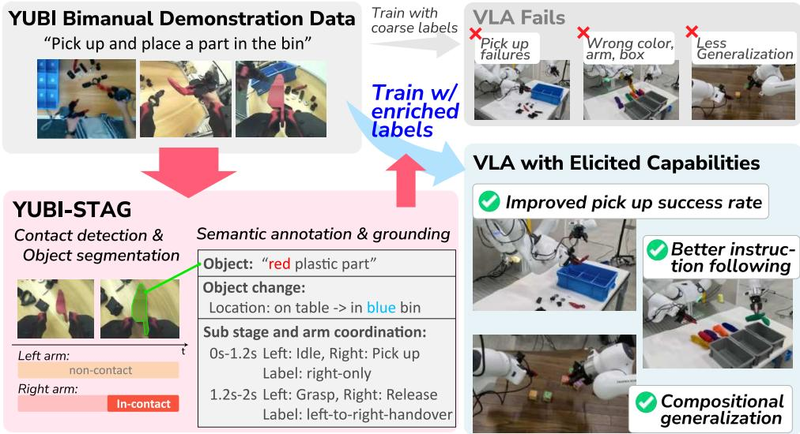
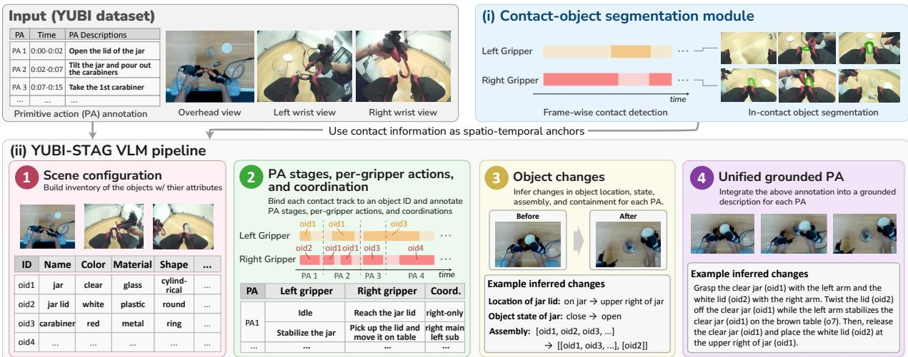
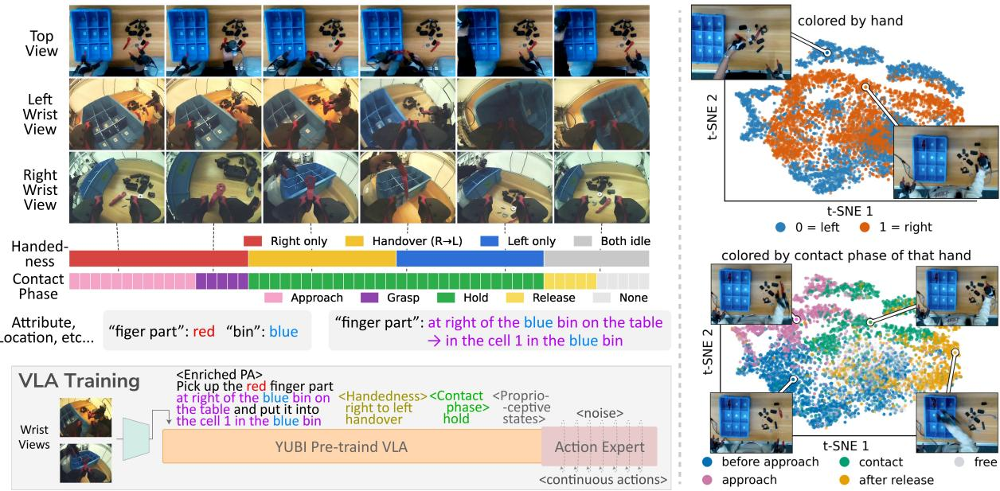
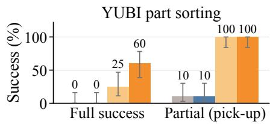
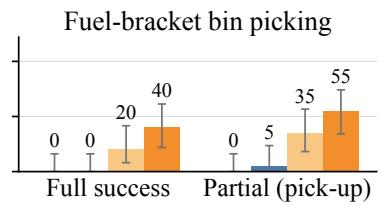
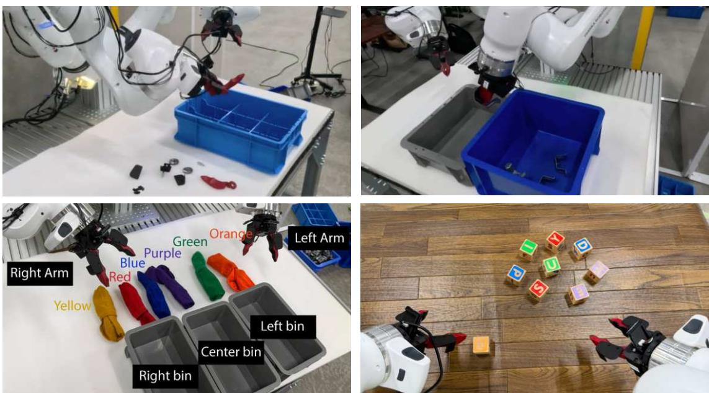
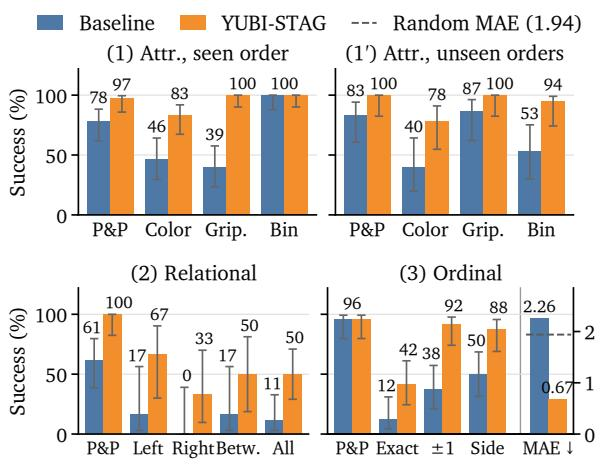
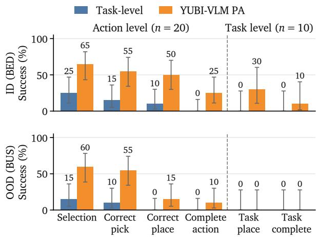

TECHNICAL REPORT

# YUBI-STAG: Contact and Semantic-Rich Alignment for VLAs via Automated Video-Language Grounding

Masatoshi Tateno1,2† Takehiko Ohkawa1‡ Yueh-Hua Wu1 Hanlong Li1,3 Tatsuya Matsushima1,2 Yoichi Sato2 Kei Ota1

1AI Robot Association (AIRoA) 2The University of Tokyo 3Institute of Science Tokyo

Correspondence: tateno.masatoshi@airoa.org Project page: https://yubi-stag.airoa.io/ †VLM Lead ‡VLA Lead

## Abstract

Vision-Language-Action (VLA) models acquire broad manipulation capabilities via large-scale pretraining, yet eliciting them through language requires fine-grained alignment between instructions and physical interactions. Existing robot demonstrations, however, typically provide only coarse task descriptions, omitting how actions are executed, including which gripper acts, which object is contacted, and how it is grasped and moved. We introduce YUBI-STAG, a framework for Spatio-Temporal Annotation and Grounding that automatically enriches manipulation demonstrations with interaction-rich semantics for aligning pretrained VLAs with fine-grained manipulation language. Combining contact-object segmentation with vision-language models, YUBI-STAG annotates object identities, attributes and states, per-gripper actions, bimanual coordination, and spatially grounded interactions. YUBI-STAG assumes a temporally localized action sequence and relies on multi-stage VLM inference. To remove these requirements, we distill the pipeline into YUBI-VLM, which directly recovers the action structure and corresponding annotations from raw, unsegmented video in few inference calls. It also operates from wrist views alone, enabling portable annotation without fixed external cameras. We evaluate both YUBI-STAG and YUBI-VLM on our new YUBI-STAG-Bench, which measures annotation quality across temporal, semantic, and spatial grounding tasks. Results show that the distilled YUBI-VLM retains much of YUBI-STAG’s annotation accuracy with fewer inference calls and shorter runtime while generalizing to unseen manipulations. Finally, we use the resulting annotations to post-train YUBI-pretrained VLA policies, aligning their manipulation capabilities with fine-grained language and contact-aware interaction structure. Experiments on bimanual manipulation show improved manipulation performance and instruction following, including control over object identity, acting gripper, target location, and spatial relations absent from the original demonstration labels. Our results show that richly grounded interaction annotations can better elicit pretrained VLA capabilities through language.

## 1. Introduction

A robot demonstration shows how the task was executed, but its label records only what the task was. A session of sorting industrial parts into bins shows which gripper acts, which part it contacts, and how that part is grasped, handed between grippers, and released. However, all of it is annotated as “pick a part and place it in a box”, which omits interaction details. This matters because vision-language-action (VLA) models acquire broad manipulation capability from large-scale pretraining [Zitkovich et al., 2023; Kim et al., 2024; Octo Model Team et al., 2024; Black et al., 2025b,a], and language is the only channel through which that capability is elicited. A language label therefore does more than document an episode, while current datasets include one task-level label per episode and repeat it across every demonstration of the same task class. For instance, recent robot-free handheld interfaces such as UMI [Chi et al., 2024] and YUBI [Ohkawa et al., 2026] ofer large-scale data (e.g., 8434 hours of bimanual interaction by YUBI) at higher throughput than teleoperation systems [Zhao et al., 2023; Fu et al., 2024]. Yet fine granularity and diversity of that language remain the bottleneck.

  
Figure 1 | From a bimanual demonstration carrying only a coarse task label such as “pick and place a part,” YUBI-STAG recovers contact-anchored annotations of object identity, per-gripper action, bimanual coordination, and object change, which post-training uses to align the pretrained capabilities of a VLA with fine-grained manipulation language.

Existing VLA post-training pipelines rely on coarse episode-level language instructions and unsegmented action sequences [Open X-Embodiment Collaboration et al., 2024; Khazatsky et al., 2024]. This coarse supervision fails to convey spatio-temporal dynamics, such as gripper-object contact transitions, grip afordances, and bimanual coordination, required for contact-rich, high-precision manipulation. Inspired by the Superficial Alignment Hypothesis in LLMs [Zhou et al., 2023], which posits that pre-trained models already possess extensive world knowledge and post-training primarily elicits proper output formats, we argue that a similar paradigm holds for VLAs. Pre-trained VLAs already encode rich geometric and physical representations; their limitation is not innate capability but the lack of precise alignment signals during post-training [Chen et al., 2024; Yu et al., 2025]. Existing instruction augmentation and intermediate representations either describe execution in language [Xiao et al., 2023; Blank et al., 2024; Belkhale et al., 2024; Hu et al., 2026] or ground actions and spatial plans in image coordinates [Zawalski et al., 2024; Yuan et al., 2024; Li et al., 2025; Lee et al., 2025; Li et al., 2026]. None jointly recovers which gripper contacts which object, at which pixels, over which interval, and how the two grippers coordinate from moving wrist views, then uses this structure to align pretrained VLAs.

We present YUBI-STAG, a framework that resolves this mismatch by annotating demonstrations with the interaction structure they already contain, and then post-training a VLA on those annotations. Spatio-Temporal Annotation and Grounding (STAG) pairs a trained contact-object segmentation module with a staged annotator built on an of-the-shelf multimodal LLM [Qwen Team, 2026]. The segmentation module localizes contact intervals and contacted-object masks from both wrist views. The resulting contact tracks identify when each gripper interacts with which object, allowing YUBI-STAG to chain localized visual evidence across interactions to recover object identities, per-gripper actions, bimanual coordination, and state changes. Because YUBI-STAG requires a temporally localized action sequence and many model calls, we distill its structured annotation capabilities into YUBI-VLM, aligning a pretrained VLM with the fine-grained interaction semantics of YUBI data. YUBI-VLM directly annotates raw, unsegmented video without predefined action boundaries and from wrist views alone, enabling portable data collection. We evaluate its annotation capabilities on our new benchmark, YUBI-STAG-Bench.

Finally, we evaluate contact- and semantic-rich alignment of VLAs using the STAG annotations. We pre-train a π0.5-based policy [Black et al., 2025a] on 8434 hours of YUBI data, then post-train it with PA instructions enriched by task-relevant STAG annotations, including object identities, attributes, target locations, and spatial relations. We also provide explicit handedness and contact-phase labels (approach, grasp, hold, release) and use contact-prioritized sampling. Experiments on a bimanual Franka robot show that alignment with these rich annotations improves fine-grained language following, contact-robust manipulation, and compositional generalization to complex tasks.

The contributions of this paper are:

• YUBI-STAG and YUBI-VLM (Sec. 3). A contact-anchored annotation pipeline that turns coarsely labeled bimanual demonstrations into grounded spatio-temporal annotations, and a distilled model that produces them directly from raw, unsegmented, wrist-view-only video without action-boundary supervision.

• YUBI-STAG-Bench (Sec. 4). A benchmark of structured annotation quality on unseen bimanual tasks, covering contact intervals and object masks, PA segmentation and descriptions, object identities and attributes, coordination, spatial relations, and state transitions.

• Contact- and semantic-rich VLA post-training (Sec. 5). A contact and semantic-rich posttraining recipe supplying handedness, contact phases, and contact-aware sampling to a π0.5-based policy, extending data-centric alignment from instruction text to physical interaction.

## 2. Related Work

## 2.1. Scalable Collection of Unconstrained Manipulation Data

Recent advances in low-cost bimanual systems [Zhao et al., 2023; Fu et al., 2024], teleoperation [Qin et al., 2023], and portable handheld grippers [Chi et al., 2024; Ohkawa et al., 2026] have enabled large-scale collection of diverse robot demonstrations [Open X-Embodiment Collaboration et al., 2024; Khazatsky et al., 2024; Walke et al., 2023]. As collection scales toward in-the-wild settings, however, demonstrations increasingly contain background clutter, camera motion, operator variation, and lack explicit action boundaries [Mandlekar et al., 2021; Bharadhwaj et al., 2024; Cui et al., 2023]. Converting such noisy, unsegmented data into fine-grained supervision therefore requires substantial curation and annotation, creating a new bottleneck for scalable robot learning.

## 2.2. Video-Language Grounding and Automated Data Annotation

Foundation models have enabled scalable annotation of robot data [Chen et al., 2024; Qwen Team, 2026; Lin et al., 2024b]. One line relabels demonstrations with finer-grained language, including execution details such as the active arm and contact region [Xiao et al., 2023; Blank et al., 2024; Belkhale et al., 2024; Smith et al., 2024; Hu et al., 2026], but does not jointly localize gripper–object contact in pixels and time. Another grounds intermediate representations such as boxes, traces, and contact points in images [Zawalski et al., 2024; Li et al., 2025; Lee et al., 2025; Li et al., 2026]. SPARC [Blank et al., 2026] and Robo2VLM [Chen et al., 2025b] derive grasp or manipulation phases from gripper state and other proprioceptive cues, which can miss non-grasping contacts. In contrast, YUBI-STAG detects gripper–object contact visually, akin to hand–object contact [Shan et al., 2020] and its fine-grained dynamics [Tateno et al., 2026], and recovers per-gripper contact intervals, contacted-object masks, and bimanual coordination from moving wrist views. YUBI-VLM uses the resulting contact tracks to annotate raw, wrist-only video.

## 2.3. Data-Centric Post-Training Alignment in VLA Policies

In NLP, the Superficial Alignment Hypothesis [Zhou et al., 2023] posits that vast knowledge and reasoning capability are acquired during pre-training, whereas post-training alignment primarily elicits output formats and behavioral styles using high-quality supervision signals. Its strong form is contested: stylistic alignment is recoverable from the base model [Lin et al., 2024a], while task competence continues to scale with post-training data [Raghavendra et al., 2024]. While this data-centric alignment paradigm is well-known in LLM/VLMs, its extension to Vision-Language-Action (VLA) models [Zitkovich et al., 2023; Kim et al., 2024; Octo Model Team et al., 2024; Black et al., 2025a] has only recently begun to be explored. Existing VLA alignment eforts optimize preferences [Zhang et al., 2026], curate which demonstrations to train on [Chen et al., 2025a], or pair fixed trajectories with fine-grained instructions [Hu et al., 2026]. However, these eforts, like standard behavior cloning, provide no explicit supervision at contact transitions (approach, grasp onset, hold, release) or bimanual coordination moments.

## 3. Spatio-Temporal Interaction Annotation

To promote alignment between VLA policies and fine-grained manipulation language, we introduce two complementary annotation approaches. We propose YUBI-STAG (Sec. 3.1), a Spatio-Temporal Annotation and Grounding (STAG) pipeline that enriches YUBI demonstrations with contact-aware, rich annotations grounded in space and time. We distill this multi-stage pipeline into YUBI-VLM (Sec. 3.2), which directly annotates raw videos at lower cost and supports wrist-only inference for portable data collection.

## 3.1. YUBI-STAG

YUBI demonstrations provide temporally localized primitive-action (PA) labels such as “Open the lid of the jar.” Following YUBI terminology, a PA denotes a composite manipulation unit, and we call its constituent actions (e.g., reach, grasp, rotate, and release) PA stages. The original annotations label only the coarse intent of the entire PA; they provide neither its stage boundaries and actions nor object attributes, bimanual coordination, or resulting object changes. YUBI-STAG takes the PA labels and synchronized videos from one overhead and two wrist cameras, and recovers the missing elements as spatio-temporally grounded, structured annotations that can be readily added as language supervision for VLA training.

  
Figure 2 | Overview of YUBI-STAG. The contact-object segmentation module extracts contact tracks—contact intervals with per-frame object masks—as spatio-temporal anchors for four annotation stages: scene configuration, PA stages and gripper coordination, object changes, and grounded PA descriptions.

YUBI-STAG combines (i) a contact-object segmentation module and (ii) a staged VLM-based annotator; Fig. 2 provides an overview, and the four annotation groups are detailed below. The given PA intervals serve as temporal scafolds, while retaining PAs in the output schema allows YUBI-VLM to later learn the complete schema from raw wrist-camera videos without predefined PAs.

(i) Contact-object segmentation module Fine-grained annotation requires knowing when each gripper contacts which object. A common proxy detects grasps from changes in gripper aperture, but it is unstable and misses non-grasping contacts used to stabilize or support objects. Because low-cost systems such as UMI and YUBI lack tactile sensors, we instead infer contact and the contacted object visually.

Our module encodes both wrist-camera streams with a frozen DINOv2-L [Oquab et al., 2024] and jointly models their frame features using a lightweight temporal transformer. For each gripper, an MLP head predicts the contact state and a DPT-style decoder predicts the pixel-level mask of the contacted object.

To train at scale, we derive pseudo-labels from gripper-aperture cues. When the aperture stabilizes, a point between the fingertips prompts SAM2 [Ravi et al., 2025] to segment and bidirectionally track a candidate object. We filter background candidates using point-tracking co-motion [Karaev et al., 2025] and monocular-depth agreement, then manually filter the results for initial training. Finally, we self-train on more diverse data and fine-tune on a small set of precise human annotations.

## (ii) VLM-based annotation pipeline

Rather than infer the full annotation in one MLLM call, YUBI-STAG organizes MLLM queries into four stages, each building on previously resolved annotations and relevant visual evidence. The preceding contact-object segmentation module provides contact tracks, each consisting of a contact interval and per-frame object masks. These tracks anchor when and where interactions occur.

1) Scene configuration. The first stage builds a scene-level inventory of object names and counts. The MLLM jointly examines the overall scene and object-centric observations localized by contact masks, providing both global scene context and clear views of objects during interaction. For each instance, it records color, material, shape, size, and role (part, container, surface, or fixture) under a persistent ID shared by all later annotations. Establishing this inventory first avoids assigning new identities to the same physical object at diferent interactions.

2) PA stages, per-gripper actions, and coordination. Before annotating gripper actions, we bind each contact track to an object ID from the inventory. Appearance alone is ambiguous when instances look alike, so we also exploit temporal continuity: tracks separated by a release and immediate re-grasp, or connected by a handover, should refer to the same object. Combining these constraints with appearance within the track masks provides stable object identities across interactions. The given PA intervals provide coarse temporal structure, which we refine into constituent stages using the contact tracks. For each stage, we record the participating object IDs, each gripper’s action, and one of seven coordination types: left- or right-only, either gripper as primary with the other supporting, either handover direction, or bimanual.

3) Object changes. We determine how each interaction changes the manipulated objects and their relations, using wrist views for close-up evidence and the overhead view for broader spatial context. Comparing each contacted object before contact and after release, we record its source and destination relative to other objects, together with changes in state, assembly, or containment. Following action-based object-state reasoning [Tateno et al., 2025], we select state observations using PA descriptions and grasp intervals. The MLLM then uses the current PA description, the previously observed state, and the corresponding visual evidence to determine whether the object’s state changed during that PA.

4) Unified grounded PA annotation. Finally, the MLLM combines the resolved PA stages, per-gripper actions, coordination, and object changes into a grounded PA description, with each object mention linked to its persistent ID.

The cost of the YUBI-STAG pipeline, in terms of processing time, the number of requests, and output token count, is discussed in the experiments section (Sec. 6.1).

## 3.2. Training YUBI-VLM

We distill YUBI-STAG to reduce its multi-stage MLLM annotation cost and adapt a pretrained VLM to YUBI videos and annotation conventions, particularly the close-range views from moving wrist cameras.

Architecture and annotation pipeline. YUBI-VLM is initialized from Qwen3.6-27B [Qwen Team, 2026] and trained on ten prediction modes covering scene inventory and attributes; PA span localization from given descriptions or joint PA description and span generation; held-object assignment; PA substages, coordination, and descriptions; PA-level object states; state-axis discovery and per-PA semantic states; containment and attachment; and grounded PA descriptions. Contact-object masks are overlaid as contours on wrist frames, with gripper and temporal information provided as text, enabling spatio-temporal grounding without additional mask encoders or visual tokens. Wrist frames are sampled preferentially around contact intervals.

Training. We jointly train all prediction modes on YUBI-STAG annotations using LoRA on Qwen3.6-27B (489M trainable parameters; 1.76%). To support wrist-only inference, the overhead view is dropped from

50% of samples, while temporal cropping and variable frame-rate sampling cover both short manipulation steps and long videos.

Training data. Training uses 2,477 sessions from 129 long-horizon tasks (29.4 hours; 18,336 PA clips), yielding 29,500 examples. All ten YUBI-STAG-Bench tasks are excluded to evaluate generalization to unseen tasks.

## 4. YUBI-STAG-Bench

To systematically evaluate structured annotations from our VLM-based pipeline, we introduce YUBI-STAG-Bench, a benchmark for semantically rich, spatio-temporally grounded understanding of longhorizon robot manipulation. It contains 100 episodes from 10 tasks (10 per task), manually annotated following the YUBI-STAG schema.

We densely annotate fields central to downstream robot learning and amenable to structured evaluation: objects, attributes, contact tracks, primitive actions (PAs), coordination types, object locations, and object states. The benchmark contains 510 objects, 970 PAs, and 2,201 interaction intervals, with per-gripper temporal intervals and contacted-object masks annotated at 10 fps.

We organize the benchmark into two task groups. Contact-object grounding detects each gripper’s contact intervals from wrist video and segments the contacted object at 10 fps. Semantic annotation evaluates structured manipulation understanding from video, task description, and contact tracks. Object ID identifies manipulated objects, and Attribute predicts shape and material. TAS localizes a given sequence of PAs, while PA GEN TAS jointly predicts PA descriptions and intervals from unsegmented video. Coordination predicts bimanual roles, Location predicts spatial relations and reference objects, and State predicts object states and their transition times. Together, these tasks evaluate the semantic and spatio-temporal annotations produced by YUBI-STAG or YUBI-VLM.

## 5. Training VLA Policies

We evaluate whether YUBI-STAG annotations improve VLA training while isolating the efect of interactionrich supervision from policy design. We adopt a $\pi _ { 0 . 5 } \cdot$ -based VLA [Black et al., 2025a], retaining its visionlanguage backbone and flow-matching action expert. The policy is first pretrained on the large-scale YUBI corpus (8434 hours [Ohkawa et al., 2026]) and then post-trained on the same small set of demonstrations (10–20 hours) under diferent STAG-derived supervision. Thus, our ablations difer only in the supervision used to elicit the shared pretrained manipulation capability. The pipeline is shown in Fig. 3.

## 5.1. YUBI VLA and Action Representation

At time t, the policy takes two wrist images, language, and proprioception and predicts a horizon of bimanual actions $\mathbf { a } _ { t : t + H - 1 }$ . Each action contains a 6-DoF delta end-efector motion and gripper command for each YUBI gripper. We use the UMI end-efector state representation [Ohkawa et al., 2026; Chi et al., 2024], making demonstrations collected with the hand-held interface directly usable for policy training. Following $\pi _ { 0 . 5 }$ , the action expert learns an action chunk by conditional flow matching [Lipman et al., 2023; Liu et al., 2023]. Given context $c _ { t } .$ , it transports Gaussian noise ϵ toward the demonstrated action a using

$$
\mathcal { L } _ { \mathrm { F M } } = \mathbb { E } _ { \mathbf { a } , \epsilon , s } \left[ \| v _ { \theta } ( \mathbf { a } _ { s } , s , c _ { t } ) - ( \mathbf { a } - \epsilon ) \| _ { 2 } ^ { 2 } \right] ,\tag{1}
$$

where ${ \bf a } _ { s } = ( 1 - s ) { \epsilon } +$ sa and $s \in [ 0 , 1 ]$ is the flow time. Apart from the supervision described below, we follow the standard $\pi _ { 0 . 5 }$ recipe without modifying the network or objective.

## 5.2. Contact- and Semantic-Rich Post-Training

Original YUBI annotations provide episode-level goals and primitive actions (PAs), but not how each interaction is executed. As illustrated in Fig. 3, we enrich PA instructions with task-relevant object and spatial information from YUBI-STAG. We also propose handedness and contact-phase labels as default, broadly applicable additions. These annotations provide more precise language supervision without changing the observation or action space.

  
Figure 3 | Contact- and semantic-rich post-training for YUBI-VLA. Left: YUBI-STAG augments primitiveaction instructions with task-relevant object attributes and locations, together with time-varying handedness and contact-phase labels while the unchanged flow-matching expert learns continuous bimanual actions. Right: t-SNE projections of per-hand delta actions after PCA-50 reduction, colored by hand identity and contact phase, reveal handedness and contact-phase structure in the trajectories and motivate the proposed labels.

Task-specific PA enrichment. Depending on the task, we enrich PA descriptions with STAG-derived object identities and attributes, target locations, and spatial relations. For example, part sorting specifies the part’s color and destination bin cell.

Handedness labels. We augment each PA with the acting gripper or handover direction, e.g., {PA} with the left gripper. The four types are left gripper, right gripper, left-to-right handover, and right-to-left handover. Unlike coarse PA or episode instructions, these labels identify the responsible gripper and are updated with STAG stages over time.

Contact-phase labels. We further label the relevant gripper–object interaction based on STAG’s contact segments as approach, grasp, hold, or release, e.g., {PA}, approaching it. Grasp spans ±0.2 s around contact onset, release the last 0.2 s of the contact segment, and the remaining contact frames are hold. These labels ground language in the current phase of the physical interaction rather than only its goal. Handedness and contact-phase labels can be used independently or jointly, as shown in Fig. 3.

Contact-prioritized sampling. Because contact transitions are sparse but often critical to task success, we rebalance training chunks toward contact phases, as the principle of prioritized replay [Schaul et al., 2016]. For example, a grasp-onset phase comprising 5% of demonstrations can constitute 30% of sampled chunks. This exposes approach, grasp, hold, and release transitions at useful frequency without altering the training objective. The same dense annotations also support data curation by identifying instruction– trajectory mismatches and diversifying language descriptions. Overall, our data-centric post-training keeps the observations, actions, architecture, and objective fixed, isolating the efect of supervision that captures both interaction semantics and temporal contact structure.

Table 1 | Grasp-based contact-object grounding on YUBI-STAG-Bench. F-Acc.: frame accuracy; e2e: all groundtruth mask frames, with uncovered frames scored as zero.
<table><tr><td rowspan="2">Method</td><td colspan="2">Grasp Detection</td><td colspan="2">Contact-Obj. Seg.</td></tr><tr><td></td><td>mIoU ↑ F-Acc. ↑</td><td>|J (e2e) ↑ F (e2e) ↑</td><td></td></tr><tr><td>Aperture + SAM2</td><td>71.8</td><td>83.8</td><td>40.3</td><td>43.6</td></tr><tr><td>Ours</td><td>89.7</td><td>94.5</td><td>74.0</td><td>75.1</td></tr></table>

## 6. Experiments

We first evaluate the annotation quality and inference eficiency of YUBI-STAG and YUBI-VLM on YUBI-STAG-Bench (Sec. 6.1). We then assess the efects of handedness and contact supervision on fine-grained manipulation (Sec. 6.2) and test language control over object identity, acting gripper, and spatial targets using enriched PAs (Sec. 6.3). Finally, we evaluate action composition from YUBI-VLM-generated PAs on seen and unseen tasks (Sec. 6.4).

## 6.1. Results on YUBI-STAG-Bench

Evaluation Protocol. Contact detection uses temporal mIoU and frame accuracy per episode–gripper pair; contact masks use DAVIS J and F [Perazzi et al., 2016] per ground-truth track, with uncovered frames scored as zero. Semantic objects are matched one-to-one by contact-track overlap, without using predicted names. As in standard action segmentation, TAS uses boundary F1@0.5 s and segment IoU; PA GEN TAS additionally measures PA-count accuracy and evaluates generated descriptions using GPT-5.2 on PAs matched one-to-one by temporal IoU. The judge assesses whether the description refers to the same step despite wording diferences (identity), specifies the object, action, and any required destination to reproduce it from text alone (suficiency), and covers exactly one reference PA rather than merged or partial steps (granularity). We report the percentage of matched pairs satisfying each criterion, with identity and suficiency judged independently. We report accuracy for object identity, attributes, coordination, and locations, and temporal mIoU and transition F1@1.0 s for states; all scores are percentages.

Contact-Object Grounding. We evaluate the contact-object segmentation module on grasp intervals from 100 benchmark episodes across both grippers. The baseline uses absolute-aperture cues to detect grasp intervals from gripper closing and subsequent aperture stabilization, then applies SAM2 within these intervals.

Table 1 shows that our module improves both temporal detection and spatial grounding across all ten tasks.   
These gains support learned contact tracks as reliable spatio-temporal anchors for YUBI-STAG.

Semantic Annotation. We evaluate semantic annotation while varying PA input and camera configuration. +PA provides ground-truth PA descriptions and intervals, +PA list only provides descriptions but requires interval prediction, and the default setting uses raw, unsegmented video; w/o Top retains only the wrist views. We apply the same pipeline and parser to the untrained Qwen3.6-27B backbone to isolate the efect of distillation; it also receives a task-independent formatting example, and all methods complete all 100 episodes. We also evaluate RoboFine-VLM-397B-A17B, the annotator released with FineVLA [Hu et al., 2026], which fine-tunes a 397B-parameter mixture-of-experts VLM on robot manipulation videos, by replacing the Qwen3.6-27B backbone under the same evaluation setup.

As shown in Table 2, YUBI-STAG performs strongly overall, with remaining challenges in fine-grained appearance, relative location, and state changes, which require visual details often missing from the distant top or moving wrist views. With matched PA input, YUBI-VLM preserves most of these capabilities and matches or exceeds YUBI-STAG on several categories, showing that distillation efectively aligns the pretrained VLM with YUBI videos and annotation conventions, although YUBI-STAG remains stronger on attributes and states.

Compared with the untrained backbone, YUBI-VLM substantially improves temporal, coordination, spatial, and state understanding while recovering PAs directly from raw video. It retains most performance with wrist views alone, with drops in relative location and state timing indicating the value of the top view for global context. RoboFine-VLM, despite large-scale training on robot videos, remains well below YUBI-VLM. While capable of detailed action descriptions, it is not trained for temporal localization and tends to over-segment PAs, limiting its spatio-temporal grounding.

Table 2 | Semantic annotation results on YUBI-STAG-Bench. B-F1: boundary F1 at 0.5 s; S-IoU: segment IoU; #Acc.: PA-count accuracy; Id./Suf./Gr.: semantic identity, suficiency, and granularity; 5-/7-way: coordination accuracy; $\mathbf { C o n t . } / \mathbf { R e l . }$ : container and relative-location accuracy; T-F1: state-transition F1 at 1.0 s. +PA uses ground-truth PA annotations as input; +PA list only uses only the ground-truth PA descriptions and predicts their temporal intervals; w/o Top uses only the two wrist views. Evaluation scores are reported in %; Speed is video duration divided by wall-clock time on one eight-H200 node. Bold: best; underline: second best.
<table><tr><td></td><td colspan="2">Object ID</td><td colspan="2">Attribute</td><td colspan="2">TAS</td><td colspan="6">PA GEN TAS</td><td colspan="2">Coordination</td><td colspan="2">Location</td><td colspan="2">State</td></tr><tr><td>Method</td><td>|Speed|</td><td>Acc.</td><td>Shape Material</td><td></td><td>B-F1 S-IoU</td><td></td><td>B-F1 S-IoU</td><td></td><td>#Acc.</td><td>Id.</td><td>Suf.</td><td>Gr.</td><td>5-way</td><td>7-way</td><td>Cont. Rel.</td><td></td><td>mIoU T-F1</td><td></td></tr><tr><td colspan="2">Baseline: untrained backbone</td><td></td><td></td><td></td><td></td><td></td><td></td><td></td><td></td><td></td><td></td><td></td><td></td><td></td><td></td><td></td><td></td><td></td></tr><tr><td>Qwen3.6-27B + PA</td><td>3.9×</td><td>96.6</td><td>64.0</td><td>85.5</td><td></td><td></td><td></td><td></td><td></td><td></td><td></td><td></td><td>76.8</td><td>51.0</td><td>54.4</td><td>31.4</td><td>43.3</td><td>11.9</td></tr><tr><td>Qwen3.6-27B + PA list only</td><td>3.9×</td><td>94.2</td><td>67.1</td><td>83.7</td><td>24.0</td><td>55.2</td><td></td><td></td><td></td><td></td><td></td><td></td><td>73.8</td><td>47.2</td><td>51.0</td><td>25.0</td><td>41.6</td><td>15.9</td></tr><tr><td>Qwen3.6-27B</td><td>3.1×</td><td>91.5</td><td>58.0</td><td>89.6</td><td></td><td></td><td>14.9</td><td>41.3</td><td>3.0</td><td>23.3</td><td>58.8</td><td>55.1</td><td>62.3</td><td>44.3</td><td>43.5</td><td>22.9</td><td>37.9</td><td>11.9</td></tr><tr><td>Qwen3.6-27B w/o Top</td><td>3.5×</td><td>92.0</td><td>58.7</td><td>88.3</td><td></td><td></td><td>16.1</td><td>45.2</td><td>10.0</td><td>29.5</td><td>66.3</td><td>64.2</td><td>68.8</td><td>46.7</td><td>16.9</td><td>14.9</td><td>38.4</td><td>12.3</td></tr><tr><td colspan="2">Baseline: VLM fine-tuned on robot manipulation videos</td><td></td><td></td><td></td><td></td><td></td><td></td><td></td><td></td><td></td><td></td><td></td><td></td><td></td><td></td><td></td><td></td><td></td></tr><tr><td>RoboFine-VLM-397B + PA</td><td>1.6×</td><td>89.7</td><td>56.0</td><td>87.0</td><td></td><td></td><td></td><td></td><td></td><td></td><td></td><td></td><td>83.9</td><td>55.7</td><td>66.7</td><td>47.9</td><td>50.9</td><td>15.9</td></tr><tr><td>RoboFine-VLM-397B + PA list only</td><td>1.6×</td><td>88.7</td><td>56.4</td><td>87.4</td><td>36.8</td><td>59.1</td><td></td><td></td><td></td><td></td><td></td><td></td><td>77.6</td><td>49.0</td><td>64.4</td><td>41.3</td><td>44.7</td><td>16.2</td></tr><tr><td>RoboFine-VLM-397B</td><td>0.9×</td><td>85.0</td><td>60.8</td><td>87.2</td><td></td><td></td><td>15.6</td><td>31.8</td><td>2.0</td><td>25.9</td><td>49.2</td><td>53.4</td><td>68.4</td><td>50.6</td><td>51.3</td><td>33.5</td><td>43.0</td><td>15.1</td></tr><tr><td colspan="2">RoboFine-VLM-397B w/o Top 1.2×</td><td>89.2</td><td>60.2</td><td>84.4</td><td></td><td></td><td>15.0</td><td>30.7</td><td>0.0</td><td>26.9</td><td>49.1</td><td>51.2</td><td>62.6</td><td>46.3</td><td>44.3</td><td>27.0</td><td>44.2</td><td>14.0</td></tr><tr><td>Ours: distilled VLM annotator</td><td></td><td></td><td></td><td></td><td></td><td></td><td></td><td></td><td></td><td></td><td></td><td></td><td></td><td></td><td></td><td></td><td></td><td></td></tr><tr><td>YUBI-VLM + PA</td><td>3.7×</td><td>98.0</td><td>67.0</td><td>85.5</td><td></td><td></td><td></td><td></td><td></td><td></td><td></td><td></td><td>93.3</td><td>55.5</td><td>96.0</td><td>64.0</td><td>64.3</td><td>64.5</td></tr><tr><td>YUBI-VLM + PA list only</td><td>3.5×</td><td>98.0</td><td>67.7</td><td>85.6</td><td>82.7</td><td>83.9</td><td></td><td></td><td></td><td></td><td></td><td></td><td>91.7</td><td>54.1</td><td>96.7</td><td>58.9</td><td>62.2</td><td>58.4</td></tr><tr><td>YUBI-VLM</td><td>3.5×</td><td>95.2</td><td>66.4</td><td>83.7</td><td></td><td></td><td>77.9</td><td>78.4</td><td>46.0</td><td></td><td>64.2 96.1 87.1</td><td></td><td>89.1</td><td>51.2</td><td>96.7</td><td>63.9</td><td>52.0</td><td>43.5</td></tr><tr><td>YUBI-VLM w/o Top</td><td>3.9×</td><td>93.9</td><td>64.6</td><td>87.7</td><td></td><td></td><td>78.2</td><td>78.5</td><td>49.0</td><td>59.9</td><td>95.7</td><td>86.0</td><td>90.6</td><td>52.7</td><td>90.0</td><td>50.0</td><td>47.9</td><td>31.0</td></tr><tr><td colspan="2">Ours: multi-stage annotation pipeline</td><td></td><td></td><td></td><td></td><td></td><td></td><td></td><td></td><td></td><td></td><td></td><td></td><td></td><td></td><td></td><td></td><td></td></tr><tr><td>YUBI-STAG (given PAs)</td><td>1.5×</td><td>94.2</td><td>72.1</td><td>92.1</td><td></td><td></td><td></td><td></td><td></td><td></td><td></td><td></td><td>93.0</td><td>61.6</td><td>95.3</td><td>55.9</td><td>76.0</td><td>67.9</td></tr></table>

  
Figure 4 | Fine-grained manipulation results over 20 trials per condition. Bars show success rates with 95% Wilson score confidence intervals. Full success completes both picking and placement; partial success indicates successful pick-up.

Inference Cost. Under the same eight-H200 setup, YUBI-VLM processes all 100 episodes (70.9 minutes of video) in less than half the wall-clock time of YUBI-STAG, reaching 3.5–3.7× real-time throughput. Per episode, YUBI-STAG requires 154 VLM requests, versus 33.0–34.1 for YUBI-VLM, a 4.5-fold diference. YUBI-STAG generates 14.6k output tokens per episode, whereas YUBI-VLM generates only 3.3–3.4k, reflecting its more compact annotation pipeline. RoboFine-VLM is substantially slower due to its much larger model size, making YUBI-VLM both the most eficient and the most accurate annotator evaluated.

## 6.2. Results on Fine-grained Manipulation

Setup. We evaluate handedness and contact supervision on two fine-grained manipulation tasks. In YUBI part sorting, the robot picks a specified YUBI finger part and places it in a designated bin cell. In fuel-bracket bin picking, it picks one of five industrial parts from a source box and transfers it to a target box, with a timeout of 2.5 minutes. The two setups are shown in the upper two panels of Fig. 5. Both tasks involve small, irregularly shaped parts, making reliable grasping itself challenging. Both use a Franka robot with the YUBI bimanual end-efector, operating at 10 Hz with eight-step action chunks. We compare two coarse-label baselines: the $\pi _ { 0 . 5 }$ baseline, post-trained on YUBI from $\pi _ { 0 . 5 } ,$ and YUBI-VLA, pretrained on the full YUBI corpus and post-trained with task-specific coarse instructions. We then augment YUBI-VLA with handedness labels (+Handedness) and additional contact-aware supervision (+Handedness + Contact).

  
Figure 5 | Experimental setup for robot evaluation tasks.

Results. Fig. 4 shows consistent gains from richer supervision. Neither coarse-label baseline completes either task. On YUBI part sorting, handedness labels yield 25% full success and 100% pick-up success, while adding contact supervision further raises full success to 60%. This suggests that specifying both the acting gripper and interaction phase improves precise manipulation beyond handedness supervision alone. Fuel-bracket bin picking is more challenging, requiring reliable acquisition before placement. Handedness supervision achieves 20% full success, which contact-aware post-training doubles to 40%, while also improving pick-up success from 35% to 55%. Across both tasks, progressively richer supervision improves the same policy architecture, supporting our claim that contact-grounded, fine-grained annotations better elicit manipulation skills acquired during large-scale YUBI pretraining.

We observe more variable and hesitant motions in the coarse-label baselines, whereas fine-grained supervision yields sharper motions. Projections of demonstration delta actions in Fig. 3 show distinct regions associated with handedness and contact phase. These observations suggest that aligning instructions with these action modes reduces ambiguity in policy conditioning, helping the flow-matching expert learn more consistent action flows.

## 6.3. Fine-grained Language Steerability

Setup. We evaluate whether YUBI-STAG annotations enable fine-grained language steerability beyond the semantics available in the original primitive actions (PAs). We consider a tabletop task with six diferently colored socks and three bins arranged from left to right, as shown in Fig. 5. In each demonstration, three randomly selected socks are placed into the bins from left to right and subsequently removed and returned to the table. The original PAs contain only coarse descriptions such as “randomly pick up socks and put it into the box,” without specifying the sock identity, manipulation gripper, or fine-grained spatial target. The selected sock colors are balanced across target bins, and the training episodes are nearly balanced between the left (5,351; 48.3%) and right (5,723; 51.7%) grippers. YUBI-STAG enriches these coarse PAs with fine-grained semantics inferred from the videos, which we use to train the manipulation policy.

We evaluate three forms of language control: (1) sock color, manipulation gripper, and target bin; (2) relative placement with respect to other socks; and (3) ordinal object selection, e.g., “second from the left.” In every experiment, evaluation trials are evenly divided across sock colors, instructed grippers, and target bins. We compare against a baseline policy trained without the enriched YUBI-STAG annotations. Both policies are post-trained from the pretrained YUBI-VLA using the same training configuration as in Sec. 6.2, and operate at 10 Hz with eight-step action chunks. The results are summarized in Fig. 6.

Color, gripper, and target-bin control. We first test joint control of sock color, manipulation gripper, and target bin. In (1), both policies select the correct bin in all completed trials, while YUBI-STAG achieves higher operation completion and color accuracy (82.9% vs. 46.4%). Its color errors mainly confuse red/ orange/yellow and blue/purple, mirroring errors in the generated annotations. YUBI-STAG also follows the specified gripper in all completed trials, whereas the baseline consistently uses the right gripper for left-gripper instructions despite balanced post-training data. This suggests that YUBI-STAG enables language-conditioned manipulation mode, rather than retaining the pretraining right-gripper bias.

  
Figure 6 | Fine-grained language steerability. Baseline (blue) and YUBI-STAG (orange) success rates with 95% Wilson confidence intervals. P&P in (3) does not measure instruction following because any sock may be grasped. MAE: ordinal position error (right axis, lower is better), compared with uniform random selection (dashed line). Attr.: attribute; Grip.: gripper; Betw.: between.

  
Figure 7 | Letter-block action composition on BED (ID) and BUS (OOD). Bars compare the task-level baseline (blue) and YUBI-VLM PA supervision (orange) with 95% Wilson score confidence intervals. Action metrics (n = 20) are cumulative; task place and task complete require both actions to succeed through placement and orientation, respectively (n = 10).

In (1’), we use two unseen bin orders, center–right–left and right–left–center, requiring instruction following beyond the training sequence. YUBI-STAG largely retains its behavior, whereas baseline target-bin accuracy drops from 100% to 53.3%, with its errors biased toward the left bin. This suggests that the baseline relies on the visual scene and learned sequence rather than grounding the target-bin instruction in language.

Relational spatial placement. We next evaluate left of, right of, and between relations to color-specified reference socks. YUBI-STAG achieves 50.0% correct placement versus 11.1% for the baseline. Remaining errors are near-misses involving reference-color confusion, left/right reversal, or placement on the reference. Despite these annotation imperfections, the gain over the baseline shows that the relational annotations are efectively reflected in policy behavior.

Ordinal spatial selection. Finally, we remove color cues and specify targets solely by ordinal position, e.g., “second from the left.” In panel (3) of Fig. 6, P&P measures pick-and-place completion with any sock. Exact requires the instructed sock, ±1 allows an ordinal error of at most one position, and Side checks whether the selected sock is in the correct left or right half of the six-sock row. These four rates use 24 trials each. The MAE bars use the right axis and report the mean absolute diference between selected and target ranks over trials with a recorded selection; lower is better. The dashed line marks the expected error of uniform random selection (1.94 positions). YUBI-STAG achieves 41.7% exact selection versus 12.5% for the baseline; 91.7% of its selections are nevertheless within one position of the target. Its MAE is 0.67 positions, compared with 2.26 for the baseline. In contrast, the baseline frequently selects the leftmost sock and performs worse than random selection in position error, indicating a strong positional bias rather than ordinal instruction following. Its comparable P&P rate does not indicate correct ordinal selection, as it can simply grasp an easier sock.

Overall, YUBI-STAG enables language control over semantic, embodiment, and spatial concepts absent from the original coarse PAs. Remaining errors are structured: color errors reflect annotation confusions, while spatial errors generally remain close to the intended target.

## 6.4. Action Composition from YUBI-VLM-Generated PAs

Setup. We test whether YUBI-VLM-generated PAs enable action composition for unseen long-horizon tasks. Using demonstrations of six letter-block arrangements (BED, LEFT, NEW, PUSH, TUBE, and YUBI), we compare a task-level baseline conditioned on the original long-horizon task instruction with YUBI-VLM PA supervision, which segments each demonstration using PA GEN TAS and conditions each segment on its generated PA description. Both policies are post-trained from the pretrained YUBI-VLA using the same training configuration as in Sec. 6.2, and operate at 10 Hz with eight-step action chunks.

At evaluation, with B pre-placed, the robot places the remaining two letters for BED (ID) and the unseen BUS (OOD), with 10 rollouts per method and task. We cumulatively evaluate whether the robot selects the instructed letter (target selection), lifts it (pick-up), places it at the correct location (placement), and leaves it face-up with the letter upright (orientation; rolled-over or sideways letters fail); task-level success requires both actions to reach the criterion, with failures and unreached stages counted as unsuccessful.

Results. As shown in Fig. 7, YUBI-VLM PA supervision consistently improves the action-success funnel on BED, particularly target selection and placement, and enables task-level placement and completion never achieved by the task-level baseline. This demonstrates that action-specific language provides more efective supervision than repeatedly conditioning on the coarse task instruction. These gains transfer to the unseen BUS composition, with substantial improvements in target selection and pick-up and successful placement and completion of individual actions, which the baseline never achieves. This suggests that generated PAs capture reusable action semantics that can be recombined beyond training tasks.

## 7. Conclusions

We presented YUBI-STAG for contact-anchored, spatio-temporal annotation of bimanual demonstrations, and YUBI-VLM for directly annotating raw and wrist-only videos, with its annotation capability validated by YUBI-STAG-Bench on unseen manipulations. Post-training YUBI-pretrained VLAs with these annotations aligns them with fine-grained language, better eliciting their pretrained capabilities and improving finegrained manipulation, language following, and compositional manipulation beyond the original coarse labels. YUBI-STAG and YUBI-VLM bridge coarse robot demonstrations and fine-grained language alignment, enabling more capable and controllable VLAs.

## Acknowledgments

This paper is based on results obtained from a project, JPNP25015, commissioned by the New Energy and Industrial Technology Development Organization (NEDO).

## References

Suneel Belkhale, Tianli Ding, Ted Xiao, Pierre Sermanet, Quon Vuong, Jonathan Tompson, Yevgen Chebotar, Debidatta Dwibedi, and Dorsa Sadigh. RT-H: Action hierarchies using language. In RSS, 2024.

Homanga Bharadhwaj, Jay Vakil, Mohit Sharma, Abhinav Gupta, Shubham Tulsiani, and Vikash Kumar. RoboAgent: Generalization and eficiency in robot manipulation via semantic augmentations and action chunking. In ICRA, 2024.

Kevin Black, Noah Brown, James Darpinian, Karan Dhabalia, Danny Driess, Adnan Esmail, Michael Equi, Chelsea Finn, Niccolo Fusai, Manuel Y. Galliker, et al. π : A vision-language-action model with open-world generalization. In CoRL, 2025a.

Kevin Black, Noah Brown, Danny Driess, Adnan Esmail, Michael Equi, Chelsea Finn, Niccolo Fusai, Lachy Groom, Karol Hausman, Brian Ichter, et al. π : A vision-language-action flow model for general robot control. In RSS, 2025b.

Nils Blank, Moritz Reuss, Marcel Rühle, Ömer Erdinç Yagmurlu, Fabian Wenzel, Oier Mees, and Rudolf Lioutikov. Scaling robot policy learning via zero-shot labeling with foundation models. In CoRL, 2024.

Nils Blank, Paul Mattes, Maximilian Xiling Li, Jakub Suliga, Thomas Roth, Moritz Reuss, Pankhuri Vanjani, and Rudolf Lioutikov. SPARC: Reliable spatial annotations from robot demonstrations at scale arXiv preprint arXiv:2606.13497, 2026.

Annie S. Chen, Alec M. Lessing, Yuejiang Liu, and Chelsea Finn. Curating demonstrations using online experience. In RSS, 2025a.

Kaiyuan Chen, Shuangyu Xie, Zehan Ma, Pannag R. Sanketi, and Ken Goldberg. Robo2VLM: Visual question answering from large-scale in-the-wild robot manipulation datasets. arXiv preprint arXiv:2505.15517, 2025b.

Lin Chen, Jinsong Li, Xiaoyi Dong, Pan Zhang, Conghui He, Jiaqi Wang, Feng Zhao, and Dahua Lin. ShareGPT4V: Improving large multi-modal models with better captions. In ECCV, 2024.

Cheng Chi, Zhenjia Xu, Chuer Pan, Eric Cousineau, Benjamin Burchfiel, Siyuan Feng, Russ Tedrake, and Shuran Song. Universal manipulation interface: In-the-wild robot teaching without in-the-wild robots. In RSS, 2024.

Zichen Jef Cui, Yibin Wang, Nur Muhammad Mahi Shafiullah, and Lerrel Pinto. From play to policy: Conditional behavior generation from uncurated robot data. In ICLR, 2023.

Zipeng Fu, Tony Z. Zhao, and Chelsea Finn. Mobile ALOHA: Learning bimanual mobile manipulation using low-cost whole-body teleoperation. In CoRL, 2024.

Xintong Hu, Xuhong Huang, Jinyu Zhang, Yutong Yao, Yuchong Sun, Qiuyue Wang, Mingsheng Li, Sicheng Xie, Yitao Liu, Junhao Chen, et al. FineVLA: Fine-grained instruction alignment for steerable vision-language-action policies. arXiv preprint arXiv:2605.27284, 2026.

Nikita Karaev, Iurii Makarov, Jianyuan Wang, Natalia Neverova, Andrea Vedaldi, and Christian Rupprecht. CoTracker3: Simpler and better point tracking by pseudo-labelling real videos. In ICCV, 2025.

Alexander Khazatsky, Karl Pertsch, Suraj Nair, Ashwin Balakrishna, Sudeep Dasari, Siddharth Karamcheti, Soroush Nasiriany, Mohan Kumar Srirama, Lawrence Yunliang Chen, Kirsty Ellis, et al. DROID: A large-scale in-the-wild robot manipulation dataset. In RSS, 2024.

Moo Jin Kim, Karl Pertsch, Siddharth Karamcheti, Ted Xiao, Ashwin Balakrishna, Suraj Nair, Rafael Rafailov, Ethan P. Foster, Pannag R. Sanketi, Quan Vuong, et al. OpenVLA: An open-source visionlanguage-action model. In CoRL, 2024.

Jason Lee, Jiafei Duan, Haoquan Fang, Yuquan Deng, Shuo Liu, Boyang Li, Bohan Fang, Jieyu Zhang, Yi Ru Wang, Sangho Lee, Winson Han, Wilbert Pumacay, Angelica Wu, Rose Hendrix, Karen Farley, Eli VanderBilt, Ali Farhadi, Dieter Fox, and Ranjay Krishna. MolmoAct: Action reasoning models that can reason in space. arXiv preprint arXiv:2508.07917, 2025.

Hao Li, Ziqin Wang, Zi-han Ding, Shuai Yang, Yilun Chen, Yang Tian, Xiaolin Hu, Tai Wang, Dahua Lin, Feng Zhao, Si Liu, and Jiangmiao Pang. RoboInter: A holistic intermediate representation suite towards robotic manipulation. In ICLR, 2026.

Yi Li, Yuquan Deng, Jesse Zhang, Joel Jang, Marius Memmel, Raymond Yu, Caelan Reed Garrett, Fabio Ramos, Dieter Fox, Anqi Li, Abhishek Gupta, and Ankit Goyal. HAMSTER: Hierarchical action models for open-world robot manipulation. arXiv preprint arXiv:2502.05485, 2025.

Bill Yuchen Lin, Abhilasha Ravichander, Ximing Lu, Nouha Dziri, Melanie Sclar, Khyathi Chandu, Chandra Bhagavatula, and Yejin Choi. The unlocking spell on base LLMs: Rethinking alignment via in-context learning. In ICLR, 2024a.

Bin Lin, Yang Ye, Bin Zhu, Jiaxi Cui, Munan Ning, Peng Jin, and Li Yuan. Video-LLaVA: Learning united visual representation by alignment before projection. In EMNLP, 2024b.

Yaron Lipman, Ricky T. Q. Chen, Heli Ben-Hamu, Maximilian Nickel, and Matthew Le. Flow matching for generative modeling. In ICLR, 2023.

Xingchao Liu, Chengyue Gong, and Qiang Liu. Flow straight and fast: Learning to generate and transfer data with rectified flow. In ICLR, 2023.

Ajay Mandlekar, Danfei Xu, Josiah Wong, Soroush Nasiriany, Chen Wang, Rohun Kulkarni, Li Fei-Fei, Silvio Savarese, Yuke Zhu, and Roberto Martín-Martín. What matters in learning from ofline human demonstrations for robot manipulation. In CoRL, 2021.

Octo Model Team, Dibya Ghosh, Homer Walke, Karl Pertsch, Kevin Black, Oier Mees, Sudeep Dasari, Joey Hejna, Tobias Kreiman, Charles Xu, et al. Octo: An open-source generalist robot policy. In RSS, 2024.

Takehiko Ohkawa, Jumpei Arima, Yuki Noguchi, Masatoshi Tateno, Makoto Sugiura, Takuya Okubo, Kengo Ikeuchi, Yuma Shin, Hiroki Nishizawa, Naoaki Kanazawa, et al. YUBI: Yielding universal bidigital interface for bimanual dexterous manipulation at scale. In CoRL, 2026.

Open X-Embodiment Collaboration, Abby O’Neill, Abdul Rehman, Abhiram Maddukuri, Abhishek Gupta, Abhishek Padalkar, Abraham Lee, Acorn Pooley, Agrim Gupta, Ajay Mandlekar, et al. Open X-Embodiment: Robotic learning datasets and RT-X models. In ICRA, 2024.

Maxime Oquab, Timothée Darcet, Théo Moutakanni, Huy Vo, Marc Szafraniec, Vasil Khalidov, Pierre Fernandez, Daniel Haziza, Francisco Massa, Alaaeldin El-Nouby, et al. DINOv2: Learning robust visual features without supervision. TMLR, 2024.

Federico Perazzi, Jordi Pont-Tuset, Brian McWilliams, Luc Van Gool, Markus Gross, and Alexander Sorkine-Hornung. A benchmark dataset and evaluation methodology for video object segmentation. In CVPR, pages 724–732, 2016.

Yuzhe Qin, Wei Yang, Binghao Huang, Karl Van Wyk, Hao Su, Xiaolong Wang, Yu-Wei Chao, and Dieter Fox. AnyTeleop: A general vision-based dexterous robot arm-hand teleoperation system. In RSS, 2023.

Qwen Team. Qwen3.6-27B: Flagship-level coding in a 27B dense model, April 2026. URL https: //qwen.ai/blog?id=qwen3.6-27b. Accessed on 2026-09-13.

Mohit Raghavendra, Vaskar Nath, and Sean Hendryx. Revisiting the superficial alignment hypothesis. arXiv preprint arXiv:2410.03717, 2024.

Nikhila Ravi, Valentin Gabeur, Yuan-Ting Hu, Ronghang Hu, Chaitanya Ryali, Tengyu Ma, Haitham Khedr, Roman Rädle, Chloe Rolland, Laura Gustafson, et al. SAM 2: Segment anything in images and videos. In ICLR, 2025.

Tom Schaul, John Quan, Ioannis Antonoglou, and David Silver. Prioritized experience replay. In ICLR, 2016.

Dandan Shan, Jiaqi Geng, Michelle Shu, and David F. Fouhey. Understanding human hands in contact at internet scale. In CVPR, 2020.

Laura Smith, Alex Irpan, Montserrat Gonzalez Arenas, Sean Kirmani, Dmitry Kalashnikov, Dhruv Shah, and Ted Xiao. STEER: Flexible robotic manipulation via dense language grounding. arXiv preprint arXiv:2411.03409, 2024.

Masatoshi Tateno, Takuma Yagi, Ryosuke Furuta, and Yoichi Sato. Learning multiple object states from actions via large language models. In WACV, pages 9555–9565, 2025.

Masatoshi Tateno, Gido Kato, Hirokatsu Kataoka, Yoichi Sato, and Takuma Yagi. HanDyVQA: A video QA benchmark for fine-grained hand-object interaction dynamics. In CVPR, pages 3455–3465, 2026.

Homer Rich Walke, Kevin Black, Tony Z. Zhao, Quan Vuong, Chongyi Zheng, Philippe Hansen-Estruch, Andre Wang He, Vivek Myers, Moo Jin Kim, Max Du, Abraham Lee, Kuan Fang, Chelsea Finn, and Sergey Levine. BridgeData V2: A dataset for robot learning at scale. In CoRL, 2023.

Ted Xiao, Harris Chan, Pierre Sermanet, Ayzaan Wahid, Anthony Brohan, Karol Hausman, Sergey Levine, and Jonathan Tompson. Robotic skill acquisition via instruction augmentation with vision-language models. In RSS, 2023.

Tianyu Yu, Haoye Zhang, Qiming Li, Qixin Xu, Yuan Yao, Da Chen, Xiaoman Lu, Ganqu Cui, Yunkai Dang, Taiwen He, et al. RLAIF-V: Open-source AI feedback leads to super GPT-4V trustworthiness. In CVPR, 2025.

Wentao Yuan, Jiafei Duan, Valts Blukis, Wilbert Pumacay, Ranjay Krishna, Adithyavairavan Murali,

Arsalan Mousavian, and Dieter Fox. RoboPoint: A vision-language model for spatial afordance prediction in robotics. In CoRL, 2024.

Michał Zawalski, William Chen, Karl Pertsch, Oier Mees, Chelsea Finn, and Sergey Levine. Robotic control via embodied chain-of-thought reasoning. In CoRL, 2024.

Zijian Zhang, Kaiyuan Zheng, Zhaorun Chen, Joel Jang, Yi Li, Siwei Han, Chaoqi Wang, Mingyu Ding, Dieter Fox, and Huaxiu Yao. GRAPE: Generalizing robot policy via preference alignment. In ICRA, 2026.

Tony Z. Zhao, Vikash Kumar, Sergey Levine, and Chelsea Finn. Learning fine-grained bimanual manipulation with low-cost hardware. In RSS, 2023.

Chunting Zhou, Pengfei Liu, Puxin Xu, Srinivasan Iyer, Jiao Sun, Yuning Mao, Xuezhe Ma, Avia Efrat, Ping Yu, Lili Yu, et al. LIMA: Less is more for alignment. In NeurIPS, 2023.

Brianna Zitkovich, Tianhe Yu, Sichun Xu, Peng Xu, Ted Xiao, Fei Xia, Jialin Wu, Paul Wohlhart, Stefan Welker, Ayzaan Wahid, et al. RT-2: Vision-language-action models transfer web knowledge to robotic control. In CoRL, 2023.