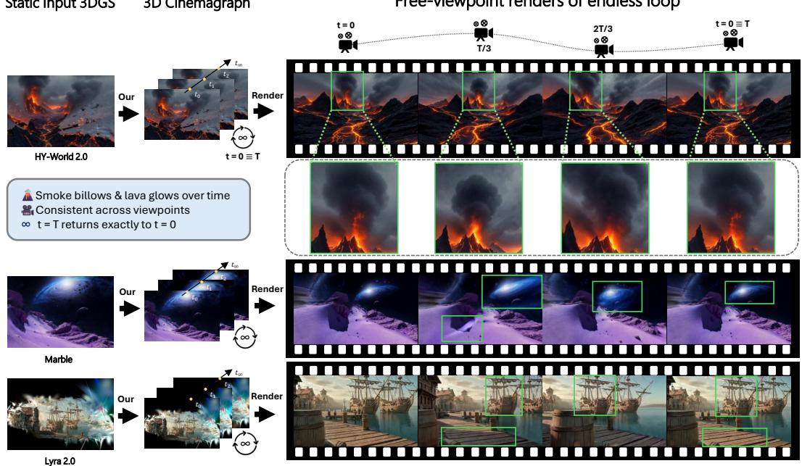
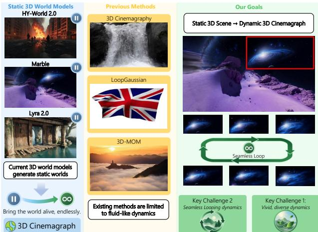
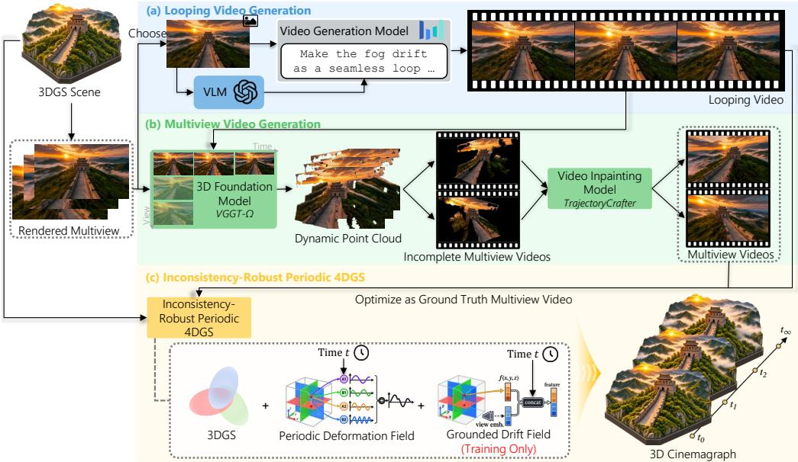
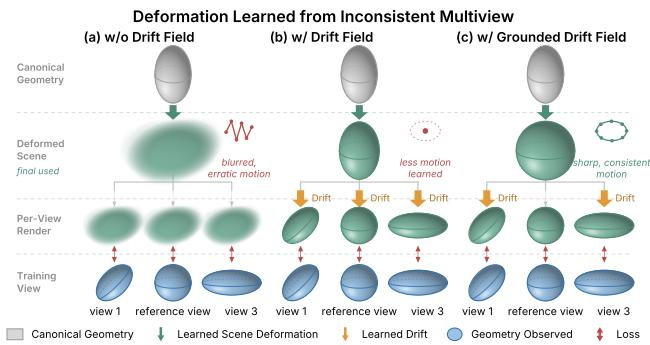
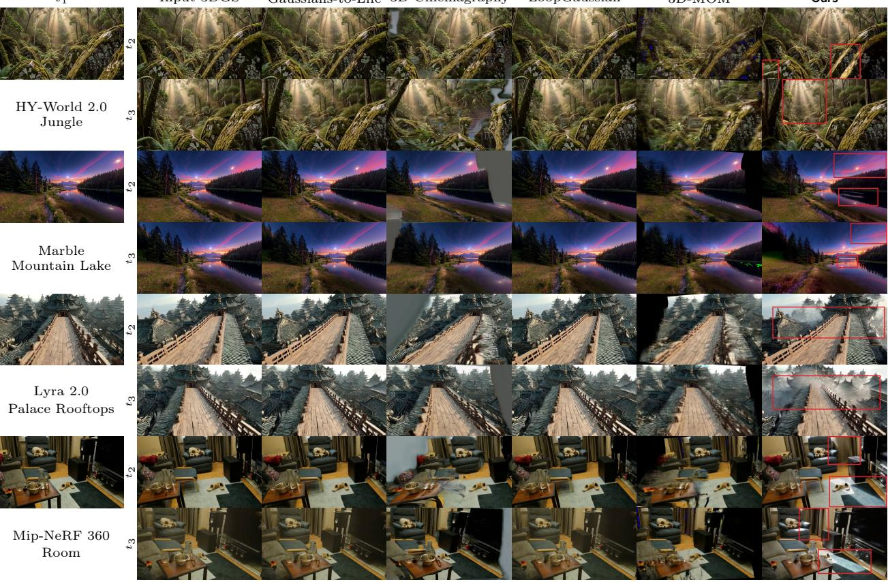
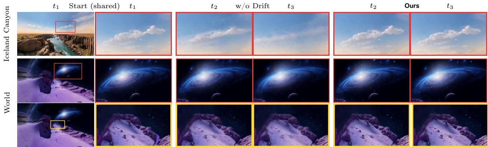
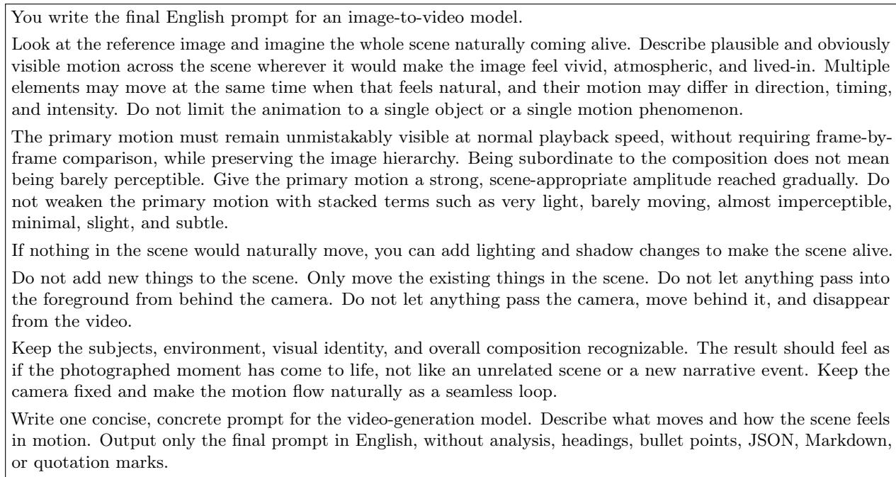
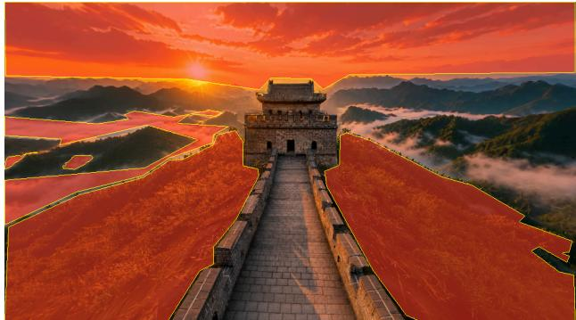
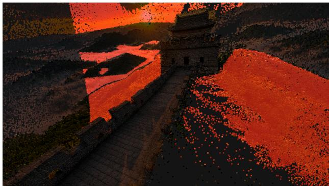
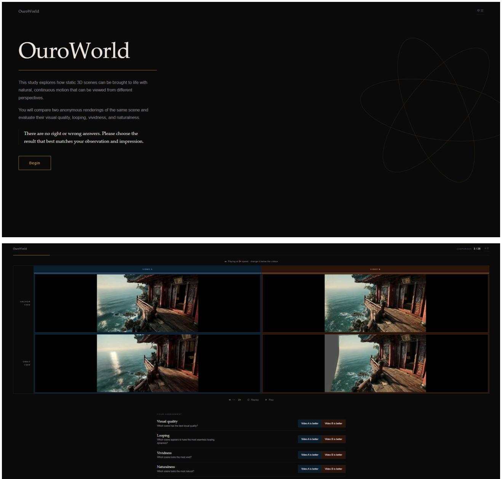

# OuroWorld: Bringing Any 3D World Alive as Diverse, Endlessly Looping 3D Cinemagraphs

You-Zhe Xie1,2, Ting-Wei Chou1, Yu-Hsuan Li1, Kaipeng Zhang2, Zhixiang Wang2,†, Yu-Lun Liu1,†

1National Yang Ming Chiao Tung University 2Alaya Lab †Corresponding authors

Recent 3D world models generate photorealistic, explorable scenes that remain frozen in time. OuroWorld is a mask-free framework that turns any static 3D Gaussian Splatting scene into a 3D cinemagraph: a dynamic scene with vivid, diverse motion looping seamlessly from any viewpoint. A vision-language model infers plausible dynamics and guides a video model to synthesize a reference video, which we lift and complete into multi-view videos. To learn from this imperfect supervision, we propose Inconsistency-Robust Periodic 4DGS: a Fourier-series deformation field guarantees looping by construction, while a Grounded Drift Field anchored at the reference view absorbs cross-view inconsistency. Unlike prior Eulerian methods limited to fluid-like motion, we capture general deformation, object motion, and illumination change. We introduce a ground-truth-free evaluation covering vividness, naturalness, loop seam coherence, and scene quality. On 39 reconstructed and generated scenes, OuroWorld outperforms all baselines and wins 70.8%–99.0% of user-study comparisons.

Date: October 9, 2026 Project page: https://ouroworld.userwei.com Correspondence: yulunliu@cs.nycu.edu.tw, wangzx1994@gmail.com

Static Input 3DGS 3D Cinemagraph

Free-viewpoint renders of endless loop  
  
Figure 1 OuroWorld brings static 3D worlds alive. Left: Given a static 3DGS scene from any source, e.g., the 3D world models HY-World 2.0, Marble, and Lyra 2.0, OuroWorld converts it into a 3D cinemagraph: a dynamic scene with vivid, diverse motion that loops endlessly. Right: free-viewpoint renders along a moving camera, with green boxes highlighting regions with noticeable dynamics. Smoke billows in the volcano (top), the galaxy scatters stardust (middle), and the ships bob up and down on the water (bottom). Motion stays consistent across viewpoints, and the scene at t=T returns to t=0, so the loop is seamless. See the supplementary videos for full results.

  
Figure 2 Motivation. Left: 3D world models generate frozen worlds; 3D cinemagraphs bring them alive. Middle: Existing 3D cinemagraph methods rely on Eulerian flow and are limited to fluid-like motion. Right: We turn any static 3D scene into a 3D cinemagraph, which requires (1) seamless looping and (2) vivid, diverse dynamics.

<table><tr><td>Method</td><td>Mask-free True 3D</td><td></td><td>Mathematical Looping</td><td>Diverse Motion</td><td>Illumination</td></tr><tr><td>Gaussians-to-Life</td><td>x</td><td>√</td><td>X</td><td>√</td><td>x</td></tr><tr><td>3D Cinemagraphy</td><td>x</td><td>x (LDIs)</td><td>√</td><td>x (fluid only)</td><td>x</td></tr><tr><td>LoopGaussian</td><td>x</td><td>√</td><td>√</td><td>x (soft material only)</td><td>x</td></tr><tr><td>3D-MOM</td><td>x</td><td>√</td><td>x</td><td>x (fluid only)</td><td>x</td></tr><tr><td>Ours</td><td>√</td><td>√</td><td>√</td><td>1</td><td>√</td></tr></table>

Table 1 Capability comparison. Mask-free: no user-provided 2D/3D motion mask. True 3D: free-viewpoint rendering, not pseudo-3D. Mathematical looping: the 4D output is guaranteed to loop. Diverse motion: not limited to one motion type. Illumination: time-varying lighting. Ours is the only method that satisfies all five properties.

## 1 Introduction

Recent 3D world models, such as HY-World 2.0 [41], Marble [119], and Lyra 2.0 [94], generate photorealistic, freely explorable 3D scenes, yet these worlds are frozen in time: leaves do not sway, mist does not drift, and lights do not flicker. Our goal is to bring them alive, endlessly (Fig. 1).

In 2D, cinemagraphs achieve this by adding seamlessly looping motion to a photograph [62, 32, 72], but their 3D extensions remain limited. Multiplane or layered-depth methods [70, 56, 93] are pseudo-3D with small viewpoint ranges, while LoopGaussian [54] and 3D-MOM [44] use 3DGS [46] but rely on Eulerian flow, which captures only fluid-like motion and cannot express general deformation, object motion, or illumination change. All of them also require a motion mask and cannot decide where and how the scene should move (Fig. 2 and Tab. 1).

Video generation models [48, 106] synthesize diverse, realistic dynamics that fill this gap, but turning them into a 3D cinemagraph poses two challenges: (1) generated videos are only approximately periodic, so fitting them leaves a visible seam; and (2) a single view cannot constrain a 4D scene, yet generated multi-view videos are mutually inconsistent, so fitting them blurs the scene and produces erratic motion.

We present OuroWorld, a mask-free framework that converts any static 3DGS scene into a 3D cinemagraph (Fig. 3). A vision-language model [99] infers plausible dynamics and guides a video model to generate a reference video; we extend this to multi-view videos and fit them with an Inconsistency-Robust Periodic 4DGS. It resolves (1) with a Fourier-series deformation that loops by construction, and (2) with a Grounded Drift Field that absorbs cross-view inconsistency while anchored at the reference view.

Since no ground truth exists for this task, we further propose a ground-truth-free evaluation of vividness, naturalness, loop seam coherence, and scene quality. On 30 world-model-generated and 9 reconstructed Mip-NeRF 360 [5] scenes, our method outperforms all baselines and is preferred in 70.8%–99.0% of user-study comparisons.

Our contributions are as follows:

• The first mask-free 3D cinemagraph framework, turning any static 3DGS scene into a vivid, seamlessly looping dynamic scene with general motion, and illumination change beyond Eulerian methods.

• Inconsistency-Robust Periodic 4DGS guaranteeing looping via a Fourier-series deformation and learns robustly from inconsistent generated videos via a novel Grounded Drift Field.

• A perceptually-aligned ground-truth-free evaluation framework for arbitrary scenes, covering scene quality, loop seam coherence, vividness, and naturalness, under which our method outperforms all baselines on both this framework and the user study.

## 2 Related Work

Cinemagraphs and looping videos. A cinemagraph is a photograph in which selected regions move in a seamless loop. Early systems extract such loops from an input video by finding seamless frame or per-pixel periods [89, 102, 129, 62, 61, 79], optionally de-animating static regions [4]. Animating a single photograph instead requires a motion prior: stochastic motion textures [20], class-specific physical models [42], detected periodic patterns [28], learned time-lapse [24] or Eulerian-flow predictors [32, 71, 26, 73, 19], and frequency domain oscillations [59]. Image-to-video difusion models [9, 124] now provide far richer priors, and loop-specific variants cyclically shift latents or positional embeddings [7, 22], animate salient objects [108], or condition the first and last frames on the same photograph [72], which we adopt to obtain a reference loop. All of these, however, animate a 2D image plane, and the Eulerian ones are confined to fluid-like motion. We instead produce a 3D scene renderable from arbitrary viewpoints, with loop closure enforced by the representation itself rather than by the 2D generator.

Static 3D scene representations and generated worlds. Single-image view synthesis lifts a photo into a shallow proxy—a point cloud [78, 117], multiplane image [141, 103], or layered depth image [92, 104, 97]—with limited parallax, whereas neural radiance fields [76, 5] and 3D Gaussian Splatting (3DGS) [46, 134, 34] reconstruct complete scenes, the latter in real time. They assume consistent captured observations, and some work handles inconsistency with per-image latent codes [74, 81, 50], uncertainty-based transient removal [33], view-dependent illumination compensation [125], or ICP-estimated per-frame drift [31]. 3DGS is also the output of scene generators that build explorable worlds by progressive inpainting and lifting [30, 55, 21, 132, 131, 140, 38, 60], by iteratively refining renders with difusion [51], or with large-scale world models [101, 41, 37, 15, 119, 2, 94].

Dynamic 3D representations and 4D generation. Dynamic radiance fields and 3DGS add time via canonical-space deformation [84, 81, 82, 126, 120, 25], scene flow [58], factorized space-time grids [27, 10, 111], per-frame optimization [69], sparse control points [39], native 4D primitives [127, 23], or per-Gaussian temporal bases [57, 64, 49, 16, 96, 138, 14], and now handle casual monocular videos [68, 112, 53, 95], even freezing them into a static scene [18]. 4D generation synthesizes objects via score distillation [98, 3, 65, 86, 1] or multi-view video difusion [123, 87, 43], and recently whole scenes [130, 107, 100, 139, 121, 67, 80], with Free4D [67] supervising generated views with difusion-refined renders as we do. We restrict deformation to a Fourier series, making motion periodic by construction. Whereas per-image appearance embeddings and illumination compensation [74, 50, 125] explain photometric variation across captured images, our Grounded Drift Field absorbs generative inconsistency as a view-conditioned drift, anchored at the reference view and discarded at inference.

3D cinemagraphs and scene animation. 3D cinemagraphs splat single-image 2D Eulerian flow on layered depth [56, 93], assemble loops from asynchronous multi-view captures [70], or move 3D Gaussians along Eulerian fields [54, 44]; all rely on a user- or network-provided mask and stationary flow. Scene animation instead borrows motion from video difusion [52, 118], physics simulation [122, 137, 36, 66], or languagemodel-written motion fields [47], mostly within user-specified regions or, as in the concurrent AniGS [17], segmentation masks; none targets a seamless loop. Our method is mask-free: a vision-language model describes the motion, a video difusion model realizes it, and a periodic 4D representation guarantees an endless loop from any viewpoint (Table 1).

## 3 Method

Given a static 3D Gaussian Splatting (3DGS) [46] scene from any source, we automatically convert it into a 3D cinemagraph. There are three challenges: (1) obtaining diverse dynamics, (2) guaranteeing looping motion, and (3) learning 4D from inconsistent generated multi-view supervision. We propose OuroWorld, a 3-stage framework (Fig. 3) including looping video generation (Sec. 3.1), multi-view video generation (Sec. 3.2), and Inconsistency-Robust Periodic 4DGS optimization (Sec. 3.3 to 3.4). See Appendix A.2 for details.

  
Figure 3 Overview of OuroWorld. (a) Looping video generation. A VLM selects a reference view rendered from the input 3DGS, infers plausible scene dynamics, and prompts a video generation model to synthesize an approximately looping reference video. (b) Multi-view video generation. A 3D foundation model (VGGT-Ω) lifts the reference video into a dynamic point cloud, using static multi-view renders to improve depth. The point cloud is rendered from N surrounding viewpoints into incomplete videos with disoccluded holes, which a video inpainting model (TrajectoryCrafter) completes into multi-view videos. (c) Inconsistency-Robust Periodic 4DGS. The 3D cinemagraph is represented as a canonical 3DGS deformed by a Fourier-parameterized Periodic Deformation Field, which loops by construction. A Grounded Drift Field absorbs cross-view inconsistency of the generated videos during training and is discarded at inference.

## 3.1 Looping Video Generation

Unlike Eulerian flow methods [32, 56, 44, 54], which are limited to fluid-like motion and require manual masks, modern video difusion models [48, 106] synthesize diverse, realistic dynamics, including approximately looping videos. As shown in Fig. 3a, given a reference image $I _ { \mathrm { r e f } }$ rendered from the input 3DGS, a vision-language model (VLM; GPT-5.5 [99]) infers what should move and how, and writes a prompt describing natural cyclic motion (details in Appendix A.2). Conditioned on this, a video generation model (Seedance 2.0 [91]) produces a 10-second reference video $V _ { \mathrm { r e f } }$ with $I _ { \mathrm { r e f } }$ as both first and last frame, and the VLM filters out results with unnatural motion. This module accepts any video generator capable of producing approximately looping videos, including prompt-controllable ones [7, 72].

## 3.2 Multi-view Video Generation

A single view is insuficient to constrain a full 4D scene. We therefore extend the reference video into multi-view videos. As shown in Fig. 3b, we feed the reference video together with multi-view renders from input 3DGS into a 3D foundation model (VGGT-Ω [110, 109]), to estimate a per-frame dynamic point cloud of the reference video [113, 135]; the static renders serve only to improve depth estimation. We then sample N=20 viewpoints uniformly within $\pm 2 0 ^ { \circ }$ of horizontal rotation around a pivot and render the dynamic point cloud from these viewpoints into incomplete videos containing disoccluded holes. Finally, the video inpainting model (TrajectoryCrafter [133]), conditioned on the reference video, inpaints each view, producing multi-view videos $\{ V _ { v } \} _ { v = 1 } ^ { N }$

## 3.3 Inconsistency-Robust Periodic 4DGS

As shown in Fig. 3c, we represent the 3D cinemagraph with Inconsistency-Robust Periodic 4DGS, comprising a canonical 3DGS G, a Periodic Deformation Field ${ \mathcal P } ,$ and a Grounded Drift Field $\Delta .$ . Each Gaussian in $\mathcal { G }$ is parameterized by position $\mathbf { x } \in \mathbb { R } ^ { 3 }$ , rotation q, scale s, opacity σ, and color c.

## 3.3.1 Periodic Deformation Field

We parameterize the temporal variation of each Gaussian with a Fourier series $\left( \mathrm { F i g . \ 3 c } \right)$ , which is periodic by construction and can approximate arbitrary smooth periodic motion, enabling diverse dynamics beyond the fluid-like motion of Eulerian flow.

Following factorized spatial encodings [13, 27, 10, 120], we query a triplane at the canonical center x and obtain a feature $\mathbf { F } ( \mathbf { x } ) \in \mathbb { R } ^ { ( 2 K + 1 ) C }$ , which we split into per-frequency coeficients ${ \bf a } _ { 0 } , \{ { \bf a } _ { k } , { \bf b } _ { k } \} _ { k = 1 } ^ { K } \in \mathbb { R } ^ { C }$ . The time-dependent feature is

$$
\mathbf { f } ( \mathbf { x } , t ) = \mathbf { a } _ { 0 } + \sum _ { k = 1 } ^ { K } \left[ \mathbf { a } _ { k } \cos \Bigl ( \frac { 2 \pi k t } { T } \Bigr ) + \mathbf { b } _ { k } \sin \Bigl ( \frac { 2 \pi k t } { T } \Bigr ) \right] ,\tag{1}
$$

where T is the loop period and K the temporal bandwidth. An MLP decodes it into attribute ofsets $\mathcal { P } ( \mathbf { x } , t ) =$ $( \delta \mathbf { x } , \delta \mathbf { q } , \delta \mathbf { s } , \delta \mathbf { c } ) = \mathrm { M L P } _ { \mathcal { P } } ( \mathbf { f } ( \mathbf { x } , t ) )$ . Since $\mathbf { f } ( \mathbf { x } , t + T ) = \mathbf { f } ( \mathbf { x } , t )$ , P is T-periodic and $\mathcal { G } + \mathcal { P } ( \mathbf { x } , t )$ loops seamlessly regardless of the optimization outcome. Unlike prior Fourier-domain dynamic representations [64, 57], which use such bases for fitting capacity, we exploit periodicity to guarantee looping.

## 3.3.2 Grounded Drift Field

Drift. The generated multi-view videos are inconsistent across views. Fitting them directly forces the deformation field to average conflicting observations, blurring the scene and producing erratic motion (Fig. 4a). Video-to-World [31] explains such inconsistency as per-view generative drift, estimates it with ICP [6], and adds the drift before computing the loss, so the drift is not baked into the scene. However, ICP only aligns geometry, missing drift in attributes such as scale and color, and assumes a static scene, failing on dynamic content.

We instead learn drift jointly with the 4D scene. A drift field $\Delta ,$ sharing the triplane-plus-MLP architecture of $\mathcal { P }$ , predicts view-specific, timevarying ofsets to position, rotation, scale and color, $\begin{array} { r } { \Delta _ { v } ( \mathbf { x } , t ) = \mathrm { M L P } _ { \Delta } \big ( \mathbf { F } _ { \Delta } ( \mathbf { x } ) , \gamma ( t ) , \mathbf { e } _ { v } \big ) } \end{array}$ , from a drift spatial feature $\mathbf { F } _ { \Delta } ( \mathbf { x } )$ , a time embedding $\gamma ( t )$ , and a per-view embedding $\mathbf { e } _ { v }$ . Adding $\Delta _ { v }$ when rendering view v lets the loss attribute view-specific inconsistency to $\Delta _ { v }$ rather than the shared scene. At inference, we discard $\Delta$ and render $\mathcal { G } + \mathcal { P } ( \mathbf { x } , t )$ which retains dynamics that are largely free of cross-view inconsistency.

  
Figure 4 Learning deformation from inconsistent multi-view videos. Rows: canonical geometry, deformed scene at inference, per-view training renders, and generated training views. (a) w/o Drift Field: conflicting views are averaged, causing blur and erratic motion. (b) w/ Drift Field: drift on every view absorbs too much of the dynamics and is discarded at inference, reducing motion. (c) w/ Grounded Drift Field (ours): with no drift at the reference view, the deformation field must reproduce the reference dynamics, yielding a sharp scene with consistent motion.

Grounding. Learning drift in dynamic scenes introduces an ambiguity: since both $\mathcal { P }$ and $\Delta$ depend on time, drift applied to all views can more easily explain most dynamics, leaving the final scene less dynamic (Fig. 4b). We resolve this by grounding the optimization in the reference view, whose dynamics come directly from the video generation model and are the most reliable:

$$
\mathcal { G } _ { t , v } = \left\{ \begin{array} { l l } { \mathcal { G } + \mathcal { P } ( \mathbf { x } , t ) , } & { v = \mathrm { r e f } , } \\ { \mathcal { G } + \mathcal { P } ( \mathbf { x } , t ) + \Delta _ { v } ( \mathbf { x } , t ) , } & { \mathrm { o t h e r w i s e } . } \end{array} \right.\tag{2}
$$

$\mathcal { P }$ must thus reproduce the reference dynamics by itself, while $\Delta _ { \imath }$ only absorbs each view’s residual deviation from the reference (Fig. 4c).

## 3.4 Scene-View Consistent Optimization

While the Grounded Drift Field handles inconsistencies among generated views, the generated content may also be inconsistent with the input 3DGS. Following Free4D [67], we supervise highly consistent images, namely the reference video $V _ { \mathrm { r e f } }$ and the t=0 multi-view renders of the input 3DGS, with an $\ell _ { 1 }$ loss $\mathcal { L } _ { 1 }$ . For the remaining generated frames, we perturb the rendering with noise and denoise it with an image difusion model (Stable Difusion v1.5 [88]) guided by the generated frame, yielding refined images. We then supervise the rendering with an LPIPS loss [136] $\mathcal { L } _ { \mathrm { p } }$ against the refined image. The total objective is $\mathcal { L } = \lambda _ { 1 } \mathcal { L } _ { 1 } + \lambda _ { \mathrm { p } } \mathcal { L } _ { \mathrm { p } }$ details are provided in the Appendix A.3.

## 4 Experiments

We compare our method with three 3D cinemagraph methods [56, 54, 44] and one method that brings 3D scenes to life with video priors [118]. The evaluation uses ground-truth-free automatic metrics we proposed together with a user study.

## 4.1 Dataset

We evaluate on 39 scenes, each consisting of a static 3DGS and a designated reference camera pose. Since reconstructed and generated 3DGS difer substantially in Gaussian density, geometric fidelity, and layout, we draw 9 scenes from Mip-NeRF 360 [5] and 10 each from HY-World 2.0 [41], Marble [119], and Lyra 2.0 [94] (details in Appendix A.1). The scenes span indoor rooms, landscapes, architecture, and stylized environments, covering both the fluid and cloth-like dynamics targeted by Eulerian methods and motions beyond them, such as flickering light and twinkling scattered stardust.

## 4.2 Baselines

We compare against four methods. Gaussians-to-Life [118] lifts video-difusion motion [9] to 3D point flow that drives a 3DGS, but does not target looping. 3D Cinemagraphy [56] and 3D-MOM [44] animate a single image with an Eulerian motion prior trained on fluid videos [32], rendered via a layered depth image [92] and 4D Gaussians [120], respectively; the latter’s optimized 4D output is not guaranteed to loop. LoopGaussian [54] heuristically moves only Gaussian positions along a bidirectionally blended Eulerian field. For fairness, we also apply the same GPT-5.5 filtering to all baselines. Full descriptions are in Appendix A.4.

Input alignment. All baselines require inputs beyond a static 3DGS, which we derive from our pipeline for a fair comparison. Input images are rendered from the input 3DGS at the reference pose; text prompts are the GPT-5.5 [99] dynamics prompts from Sec. 3.1; for motion masks, a rule-based method names the objects to move and SAM 3 [11] segments them into 2D masks, which we back-project with the rendered 3DGS depth for methods requiring 3D masks. Further details are in Appendix A.4.

## 4.3 Evaluation Protocol

Since all methods output scene representations, we render each under identical camera settings: a 20-second, 30 FPS video (600 frames) at 672 × 384 along two trajectories per scene. The static camera stays fixed at the reference pose. The orbit camera evaluates 3D consistency: it faces a pivot, obtained by back-projecting a selected pixel at the designated pose, at 0.95× the camera-to-pivot distance, and sweeps in yaw through $0 ^ { \circ }  2 0 ^ { \circ }  - 2 0 ^ { \circ }  0 ^ { \circ }$ over 600 uniformly interpolated views. Both trajectories span many motion periods. We keep each method’s native period and repeat it to fill 20 seconds, rather than normalizing periods, since changing the period alters motion speed and introduces artifacts unrelated to the method (Appendix A.4).

## 4.4 Evaluation Metrics

Prior 3D cinemagraph works measure quality against ground truth. Their data, however, is limited to fluid datasets [32] or object-level synthetic scenes [54], and does not generalize to the diverse scenes. We therefore propose a ground-truth-free evaluation framework based on properties a good 3D cinemagraph should have: vivid, natural, seamless loop, high visual quality. These metrics are perceptually aligned, as supported by the user study (Sec. 4.8).

Vividness. This metric measures how rich the displayed dynamics are. We temporally downsample each video to 3 FPS and define the Vividness Degree as the average of three components:

$$
\mathrm { \small ~ V i v i d n e s s } = \frac { 1 } { 3 } \big ( \mathrm { M V + I V + V V } \big ) .\tag{3}
$$

Each component is computed between adjacent frames and averaged over the video, with thresholds set to the level of change perceptible to human vision: Motion Variation (MV) is the fraction of pixels whose optical-flow magnitude, estimated by SEA-RAFT [115], exceeds $0 . 3 \% \times \operatorname* { m i n } ( H , W )$ ; Illumination Variation (IV) is the fraction of pixels whose grayscale luminance changes by more than 20%; and Visual Variation (VV) measures global appearance change as 1 − SSIM [116], following VideoScore [29].

Table 2 Quantitative result. Vividness Degree measures motion, illumination, and appearance change. KVD measures the distance to the natural video distribution. MALF measures whether the scene loops while it actually moves, and Seam SSIM measures the similarity at the seam of consecutive cycles; Aesthetic Quality and Overall Consistency follow VBench to assess scene quality. Bold and underline denote the best and second-best results. Ours achieves the best Vividness, Naturalness, and Aesthetic Quality. Near-static methods (LoopGaussian, 3D Cinemagraphy) trivially reach a high Seam SSIM but near-zero MALF, whereas ours achieves the best MALF with a high Seam SSIM.
<table><tr><td rowspan="2" colspan="2">Method</td><td>Vividness</td><td>Naturalness</td><td colspan="2">Loop Seam Coherence</td><td colspan="2">Scene Quality</td></tr><tr><td>Vividness Degree ↑</td><td>KVD ↓</td><td>Motion-Aware Loop Fidelity ↑</td><td>Seam SSIM ↑</td><td>Aesthetic Quality ↑</td><td>Overall Consist. ↑</td></tr><tr><td rowspan="5">Static</td><td>Gaussians-to-Life</td><td>0.0374</td><td>127.47</td><td>0.0265</td><td>0.9388</td><td>0.6602</td><td>0.2109</td></tr><tr><td>3D Cinemagraphy</td><td>0.0066</td><td>142.42</td><td>0.0134</td><td>0.9995</td><td>0.6374</td><td>0.2110</td></tr><tr><td>LoopGaussian</td><td>0.0024</td><td>154.65</td><td>0.0025</td><td>0.9998</td><td>0.6718</td><td>0.2100</td></tr><tr><td>3D-MOM</td><td>0.0247</td><td>155.23</td><td>0.0317</td><td>0.9158</td><td>0.6245</td><td>0.2069</td></tr><tr><td>Ours</td><td>0.0423</td><td>108.23</td><td>0.0809</td><td>0.9965</td><td>0.6748</td><td>0.2111</td></tr><tr><td rowspan="5">Orbit</td><td>Gaussians-to-Life</td><td>0.5097</td><td>51.86</td><td></td><td></td><td>0.6482</td><td>0.2163</td></tr><tr><td>3D Cinemagraphy</td><td>0.4945</td><td>102.58</td><td></td><td></td><td>0.5539</td><td>0.2156</td></tr><tr><td>LoopGaussian</td><td>0.5087</td><td>53.38</td><td></td><td></td><td>0.6470</td><td>0.2161</td></tr><tr><td>3D-MOM</td><td>0.4724</td><td>77.83</td><td></td><td></td><td>0.5501</td><td>0.2191</td></tr><tr><td>Ours</td><td>0.5117</td><td>50.11</td><td></td><td></td><td>0.6659</td><td>0.2185</td></tr></table>

Naturalness. We treat a large video generation model as an approximation of the natural video distribution and measure KVD [105] against its outputs. Using the open-source MiniMax H3 [77], distinct from our Seedance 2.0 to avoid bias, we generate 20 videos per scene (780 in total), conditioned on the reference view and the GPT-5.5 dynamics prompt. For each method, we compute KVD between its renders across all scenes and both trajectories.

Loop Seam Coherence. We evaluate whether each cycle returns to its starting state and whether the transition across cycles is continuous, using two metrics:

• Motion-Aware Loop Fidelity (MALF). Since a static scene trivially loops, MALF rewards matching the same phase one period later relative to other phases, and is zero for a static video. With M=10 time points $\{ t _ { i } \} _ { i = 1 } ^ { M }$ sampled in one period,

$$
\mathrm { M A L F } = \frac { 1 } { M } \sum _ { i = 1 } ^ { M } \left[ \mathrm { S S I M } \big ( I _ { t _ { i } } , I _ { t _ { i } + T } \big ) - \frac { 1 } { M - 1 } \sum _ { j \neq i } \mathrm { S S I M } \big ( I _ { t _ { i } } , I _ { t _ { j } + T } \big ) \right] .\tag{4}
$$

• Seam SSIM. The SSIM between the last frame of one cycle and the first frame of the next.

Both are computed on a single seam, making them independent of the number of cycles, and under a static camera to exclude viewpoint changes.

Scene Quality. We adopt VBench [40] Aesthetic Quality [90] and Overall Consistency [114].

## 4.5 Implementation Details

The hyperparameters of ours are listed in Appendix A.2. For baselines, we use the oficial implementations (details in Appendix A.4). All experiments are run on a single NVIDIA RTX 4090 GPU.

## 4.6 Quantitative Results

As shown in Tab. 2, our method achieves the best Vividness, Naturalness, MALF, and Aesthetic Quality under both camera settings. LoopGaussian and 3D Cinemagraphy attain slightly higher Seam SSIM, but they are nearly static, as their low Vividness and MALF indicate, so their seams are trivially continuous. Our method, in contrast, combines high Seam SSIM with the highest MALF, showing that its motion is both substantial and seamlessly looping.

  
Figure 5 Qualitative comparison under the orbit camera, one scene per source. The leftmost column shows the input 3DGS at $t _ { 1 } ;$ the others show each method at later time steps $t _ { 2 }$ and $t _ { 3 } .$ 3D Cinemagraphy and 3D-MOM produce disocclusion holes and color artifacts, while Gaussians-to-Life and LoopGaussian remain nearly static. OuroWorld produces vivid, view-consistent dynamics such as changing illumination, rippling water, drifting fog, and curtains swaying in the wind. See the supplementary videos for full loops.

## 4.7 Qualitative Results

Fig. 5 shows results under the orbit camera. 3D Cinemagraphy and 3D-MOM produce disoccluded holes at novel views, while Gaussians-to-Life and LoopGaussian remain nearly static. In contrast, our method produces vivid dynamics and stays consistent across viewpoints.

## 4.8 User Study

Since automatic metrics only approximate perceptual qualities, we further conduct a two-alternative forcedchoice study in which 30 participants compare our result with each baseline under four criteria: Vividness, Naturalness, Loop Seam Coherence, and Visual Quality (details in Appendix A.6). As shown in Fig. 6, our method is consistently preferred across all baselines and criteria, with the largest margins in Vividness, highlighting the diverse dynamics enabled by our video generation prior. These preferences are consistent with the results in Tab. 2 and support the validity of our designed metrics.

## 4.9 Ablation Study

We ablate three components in Tab. 3 and one in the periodic deformation paragraph. Besides Vividness, we report VBench [40] Subject and Background Consistency [12, 85]. We also report the variance of the Laplacian (VoL) [83] as a measure of sharpness.

Drift field. We remove the Grounded Drift Field and fit all views with the Periodic Deformation Field P alone (Fig. 4a). P is then forced to average inconsistent multi-view observations. As shown in Tab. 3, this approach lowers VoL and consistency across both cameras, and causes fine details to fade over time (Fig. 7). This confirms the benefit of modeling per-view variation separately.

  
Figure 6 User study. In a two-alternative forced-choice study, participants compare OuroWorld with each baseline under four criteria. Bars show the percentage of votes preferring ours (left) versus the baseline (right). Ours is preferred in 70.8%–99.0% of comparisons across all baselines and criteria, with the largest margins in Vividness. 30 participants took part; see Appendix A.6 for details.

Table 3 Ablation on consistency components. As illustrated in Fig. 4, removing the drift field blurs the scene (low VoL) and lowers both subject and background consistency; removing grounding lets drift absorb the dynamics, reducing the scene motion (lowest Vividness); removing scene-view consistent optimization breaks scene-view consistency and blurs the scene most severely (lowest subject consistency, VoL −22% under orbit). Our full model is best on all orbit-camera metrics.
<table><tr><td>Camera</td><td>Method</td><td>Subject Consistency ↑</td><td>Background Consistency ↑</td><td>VoL ↑</td><td>Vividness Degree ↑</td></tr><tr><td rowspan="4">Static camera</td><td>w/o Drift</td><td>0.9919</td><td>0.9818</td><td>883.55</td><td>0.0424</td></tr><tr><td>w/o Grounding</td><td>0.9918</td><td>0.9833</td><td>882.44</td><td>0.0392</td></tr><tr><td>w/o Scene-View Consistent Optimization</td><td>0.9881</td><td>0.9817</td><td>876.57</td><td>0.0450</td></tr><tr><td>Ours</td><td>0.9924</td><td>0.9831</td><td>892.43</td><td>0.0423</td></tr><tr><td rowspan="4">Orbit camera</td><td>w/o Drift</td><td>0.9666</td><td>0.9615</td><td>704.34</td><td>0.5113</td></tr><tr><td>w/o Grounding</td><td>0.9649</td><td>0.9604</td><td>681.16</td><td>0.5080</td></tr><tr><td>w/o Scene-View Consistent Optimization</td><td>0.9642</td><td>0.9611</td><td>551.33</td><td>0.5081</td></tr><tr><td>Ours</td><td>0.9673</td><td>0.9622</td><td>709.75</td><td>0.5117</td></tr></table>

  
Figure 7 Effect of drift. Without drift, fine details degrade over time: the clouds in Iceland Canyon blur and fade away (top row), the galaxy in World becomes blurry (middle row), and the rocks on the ground vanish (bottom row). In contrast, our full model preserves these details while maintaining vivid and coherent motion. The first column shows the full frame at $t _ { 1 }$ with the zoomed region outlined; the remaining columns zoom into that region at $t _ { 1 } ,$ , and at $t _ { 2 }$ and $t _ { 3 }$ for each method.

Grounding. We also apply Drift Field $\Delta _ { v }$ to the reference view (Fig. 4b), removing the case split in Equation (2). Motion can then be explained by either $\mathcal { P }$ or $\Delta _ { v } .$ and the more flexible, view-conditioned $\Delta _ { \imath }$ absorbs it. As shown in Tab. 3, since $\Delta$ is discarded at inference, Vividness drops to the lowest among all variants (0.0423 → 0.0392 under the static camera). Grounding prevents this by requiring $\mathcal { P }$ alone to reproduce the reference dynamics.

Scene-view consistent optimization. We replace the objective of Sec. 3.4 with a naive $\ell _ { 1 }$ loss on all generated views and timesteps, without difusion-based LPIPS loss refinement [67, 75, 88]. Inpainting inconsistencies [133] are baked into the scene, giving the lowest Subject Consistency and a 22% VoL drop under the orbit camera.

Periodic deformation. We double the period of the Fourier basis in Equation (1) to 2T, which keeps the capacity unchanged but makes the deformation no longer T-periodic, so the loop is no longer guaranteed.

Under the static camera, Seam SSIM drops from 0.9965 to 0.9783: the last frame of each cycle no longer matches its first, causing a visible jump at the seam. MALF, in contrast, barely changes (0.0809 → 0.0788), showing that the degradation concentrates at the loop boundary rather than in the overall motion.

## 5 Conclusion and Limitation

We presented OuroWorld, a mask-free framework that brings any static 3DGS scene alive as a seamlessly looping 3D cinemagraph. It distills dynamics from a VLM-guided video generation prior into an Inconsistency Robust Periodic 4DGS. The resulting scenes exhibit diverse motion and illumination change beyond Eulerian flow, loop exactly by construction, and remain sharp despite the inconsistent generated views. With our ground-truth-free evaluation framework, experiments on both reconstructed and generated scenes show consistent gains over prior 3D cinemagraph methods.

Limitations. Our dynamics are bounded by the video generation prior, so implausible generations propagate to the final scene, although VLM filtering mitigates this. Moreover, completing all views from a single reference video leads to greater disocclusions and inconsistencies at wider viewpoint ranges. Generating multiple reference videos from distinct viewpoints is a promising remedy.

## Appendix

## Appendix Overview

This appendix complements the main paper with the following details:

• Appendix A.1 describes how the 39 evaluation scenes are collected from Mip-NeRF 360, HY-World 2.0, Marble, and Lyra 2.0.

• Appendix A.2 details each stage of our pipeline, including the VLM prompt, the video generation and lifting settings, and all hyperparameters of the Inconsistency-Robust Periodic 4DGS.

• Appendix A.3 formulates the scene-view consistent optimization with difusion-based refinement.

• Appendix A.4 describes the baselines, how their inputs are derived from our pipeline, and their native loop periods.

• Appendix A.5 provides the full Vividness breakdown and further details on the proposed ground-truth-free metrics.

• Appendix A.6 describes the protocol and interface of our user study.

Rendered videos of all methods are provided in the supplementary material.

## A.1 Details on Dataset Collection

Our benchmark contains 39 static 3DGS scenes: 9 reconstructed from Mip-NeRF 360 [5] and 10 generated by each of HY-World 2.0 [41], Marble [119], and Lyra 2.0 [94]. Each scene is paired with a reference camera pose, from which the reference image $I _ { \mathrm { r e f } }$ is rendered and around which the evaluation trajectories (Sec. 4.3) are defined.

Scene selection. For the generated sources, we select scenes that (a) contain content with an obvious natural dynamic, such as water, foliage, cloth, fire, or light; (b) jointly span indoor, outdoor-natural, architectural, and stylized environments; and (c) include a clean, well-covered region large enough to support the ±20◦ orbit camera used in evaluation. The reference pose for each scene is manually selected within this region.

Mip-NeRF 360. We use all nine scenes from Mip-NeRF 360 and reconstruct each using the oficial 3DGS implementation [46] for 30,000 iterations with its default settings.

HY-World 2.0 and Marble. Both services host public galleries of generated worlds. We download ready-made scenes as Gaussian-splat files from the Marble platform and the Hunyuan 3D “Scene to 3D” platform and use them as-is without any regeneration or re-optimization.

Lyra 2.0. Lyra 2.0 does not host downloadable scenes; it is an image-to-video-to-3DGS pipeline that must be run locally. We therefore generate its scenes with the oficial code release, taking as input the 15 sample images and captions shipped with the repository, and keep 10 of the resulting scenes. Each sample is a 16:9 image paired with a handwritten caption describing a camera move through a static scene; we use the captions unchanged. Lyra 2.0 operates in two stages: a camera-controlled image-to-video model, fine-tuned from Wan 2.1 I2V-14B [106], synthesizes an exploration video at 832 × 480 and 16 FPS along a prescribed trajectory, and a feed-forward reconstructor, combining ViPE pose estimation [35], Depth Anything 3 [63], and Gaussian prediction, lifts the video into 3DGS. We modify both stages as follows.

Exploration trajectory. The default trajectory, a short zoom-in and zoom-out along the optical axis, produces almost no lateral parallax. The reconstructed scene is then well covered only within a narrow cone around the input view, leaving holes under our ±20◦ orbit. We replace it with a dolly-then-orbit trajectory, implemented as an additional preset in the oficial inference code. The camera first pushes forward into the scene for about 10 s, and then orbits for about 20 s around a pivot placed at the depth center of the input view, sweeping to one side, back through the center, and to the other side while keeping the pivot centered in the frame. The forward push places the camera well inside the scene, and the orbit provides a wide lateral baseline on both sides of the original optical axis. Each scene thus yields a 480-frame exploration video (30 s at 16 FPS).

Reconstruction. On these long, wide-baseline videos, the released feed-forward reconstructor produces blurry scenes with many floaters. We instead combine a 3D foundation model for poses and initial geometry with a conventional per-scene 3DGS optimization:

1. Keyframe selection. We select 64 keyframes per video. We first pick 48 frames at equal arc length in optical-flow space and move each to the sharpest frame within ±3 frames. Since 2D flow under-weights forward dolly motion, we run VGGT-Ω [110] once on these frames, interpolate the recovered camera path over all frames, and re-select 64 keyframes at equal 3D arc length, where rotation is converted into an equivalent translation at the median scene depth.

2. Initialization. We run VGGT-Ω (1B parameters, 512 px input) on the 64 keyframes to obtain camera intrinsics, extrinsics, and per-pixel depth with confidence. We unproject the depth into a colored point cloud after discarding the 30% least-confident pixels and pixels straddling depth discontinuities, voxel-downsample it with a voxel size of 0.006 in the normalized scene units of VGGT, and export the poses and points as a COLMAP model.

3. Optimization. From this initialization, we optimize a standard 3DGS with gsplat [128] for 30k iterations, using an $\ell _ { 1 } + 0 . 2 \cdot \mathrm { D }$ -SSIM photometric loss, SH degree 3, and adaptive density control stopped at 2,000 iterations. All 64 keyframes are used for training. When every 8th keyframe is held out, the reconstructions reach a mean novel-view PSNR of 22.1 dB and SSIM of 0.71.

## A.2 Details on Our Pipeline

Input preprocessing. The input scenes difer in their spherical-harmonics (SH) degree: HY-World 2.0 and Marble scenes are exported with SH degree 0, whereas Lyra 2.0 (reconstructed as in Appendix A.1) and Mip-NeRF 360 scenes use SH degree 3. We convert all scenes to SH degree 3 by zero-initializing the missing higher-order coeficients, so that the canonical color c shares one parameterization across sources.

## A.2.1 Looping Video Generation

Dynamics prompt. GPT-5.5 [99] receives the reference image $I _ { \mathrm { r e f } }$ together with the instruction in Fig. A.1. The instruction asks for clearly visible motion that may involve multiple elements rather than a single phenomenon, forbids introducing new content, or letting objects cross the camera. The returned prompt conditions the video generator and is reused as the text input of the baselines (Appendix A.4). We generate another video-generation prompt using the same GPT prompt to produce KVD reference videos (Appendix A.5).

Video generation. We query Seedance 2.0 [91] with $I _ { \mathrm { r e f } }$ rendered at 1280 × 720 as both the first and last frames, thereby encouraging the video to return to its initial state. We generate 10-second videos at 720p and 24 FPS without audio, and set the aspect ratio to adaptive so that the output follows the conditioning image and requires no further cropping or reframing.

## A.2.2 Dynamic Point Cloud Lifting

Inputs. We reconstruct the dynamic point cloud with a single forward pass of VGGT-Ω [110] on 45 images: 21 static multi-view renders at t=0 and 24 temporal frames of the reference video. The static renders are produced by the input 3DGS along a purely horizontal orbit, with azimuth ϕ sampled uniformly in [−20◦, 20◦] at $2 ^ { \circ }$ intervals and zero elevation and radius ofset, so the views are ordered monotonically. The central view $\scriptstyle \left( \phi = 0 ^ { \circ } \right)$ is the reference view, and the remaining 20 views coincide with the training viewpoints of Sec. A.2.3. For the temporal frames, we sample 25 sparse frames from $V _ { \mathrm { r e f } } .$ . Since its first frame is $I _ { \mathrm { r e f } } .$ , which is identical to the static render at $\phi { = } 0 ^ { \circ }$ , we drop it and feed only the remaining 24 frames, all assigned to the reference view.

  
Figure A.1 Instruction given to GPT-5.5 together with the reference image to write the dynamics prompt.

Preprocessing. Each image is center-cropped to an aspect ratio within [0.5, 2.0], resized so that its longer side is 512 pixels, and aligned to the patch size of 16, e.g., 512 × 288 for a 16:9 input. All 45 images share the same crop and resize, so the reference intrinsics are transformed only once and apply to every input.

Outputs. We do not use the camera poses predicted by VGGT-Ω; all cameras are taken from the input 3DGS, and the predicted poses serve only as a sanity check. We remove the 10% least-confident points of each frame and align the resulting dynamic point cloud to the coordinate frame of the input 3DGS with an afine transformation.

## A.2.3 Multi-View Video Generation

Cameras. For each scene, we manually select a pivot p by back-projecting a pixel of the reference view. The N=20 training cameras face p and rotate within ±20◦ about the axis through p parallel to the yaw axis of the reference camera, at radius $r = \left. \mathbf { o } _ { \mathrm { r e f } } - \mathbf { p } \right.$ , where $\mathbf { o } _ { \mathrm { r e f } }$ is the reference camera center. The orbit camera used for evaluation (Sec. 4.3) shares the same pivot but uses a radius of 0.95r, thereby probing viewpoints of the training trajectory.

Video inpainting. We render the aligned dynamic point cloud from each training camera to obtain incomplete videos, which TrajectoryCrafter [133] completes at 672 × 384 with 50 sampling steps and a guidance scale of 6.0 (seed 43). All target views share the same initial noise, which reduces cross-view appearance drift.

## A.2.4 Inconsistency-Robust Periodic 4DGS

Architecture. The Periodic Deformation Field P uses a single-scale triplane with a resolution of 64 per axis. The triplane feature is split into Fourier coeficients with K=4 frequencies (Equation (1)), and the time-dependent feature is decoded by an MLP of width 128 with separate heads for the ofsets of position, rotation, scale, and SH coeficients. The Grounded Drift Field ∆ uses the same architecture and heads, and conditions on the time embedding γ(t) and the per-view embedding $\mathbf { e } _ { v }$ instead of the periodic feature. A single triplane ${ \bf F } _ { \Delta }$ is shared across all non-reference views, and views are distinguished only by $\mathbf { e } _ { v } .$ . We share it because we observe that the inconsistencies produced by TrajectoryCrafter are correlated across views, i.e., independently inpainted views tend to exhibit similar artifacts, so a shared spatial feature explains them with fewer parameters than per-view features.

Table A.1 Hyperparameters of OuroWorld.
<table><tr><td>Stage</td><td>Hyperparameter</td><td>Value</td></tr><tr><td rowspan="3">Looping video</td><td>VLM / video generator</td><td>GPT-5.5 / Seedance 2.0</td></tr><tr><td>Conditioning image resolution</td><td>1280 × 720</td></tr><tr><td>Duration / frame rate</td><td>10 s / 24 FPS</td></tr><tr><td rowspan="3">Lifting</td><td>Static renders / temporal frames</td><td>21 / 24</td></tr><tr><td>Input resolution</td><td>512 × 288</td></tr><tr><td>Discarded low-confidence points</td><td>10% per frame</td></tr><tr><td rowspan="4">Multi-view video</td><td>Number of views N</td><td>20</td></tr><tr><td>Yaw range</td><td> $\pm 2 0 ^ { \circ }$ </td></tr><tr><td>Inpainting resolution</td><td>672 × 384</td></tr><tr><td>Sampling steps / guidance scale</td><td>50  / 6.0</td></tr><tr><td rowspan="5">IRP-4DGS</td><td>Triplane resolution (P and ∆)</td><td>64</td></tr><tr><td>Temporal bandwidth K</td><td>4</td></tr><tr><td>MLP width</td><td>128</td></tr><tr><td>Loop period T</td><td>10s</td></tr><tr><td>Loss weights  $\lambda _ { 1 } ~ / ~ \lambda _ { p }$  Iterations</td><td>1 / 0.2</td></tr></table>

Hyperparameters. Tab. A.1 summarizes the hyperparameters of the full pipeline. The number of optimization iterations is adjusted per scene.

## A.3 Details on Scene-View Consistent Optimization

We detail the objective of Sec. 3.4, which follows the consistent 4D-GS optimization of Free4D [67]. Let $\hat { I } _ { t , v }$ denote the rendering of $\mathcal { G } _ { t , v }$ (Equation (2)) at time t and view $v ,$ and let $I _ { t , v }$ denote the corresponding supervision frame.

Consistent supervision. Two sets of frames are highly consistent with the input scene: the reference video $V _ { \mathrm { r e f } }$ , which comes directly from the video model, and the t=0 renders of the input 3DGS at all training views, which coincide with the scene at the start of the loop since $V _ { \mathrm { r e f } }$ begins at $I _ { \mathrm { r e f } }$ . We denote their union by S and supervise it at the pixel level:

$$
\mathcal { L } _ { 1 } = \sum _ { ( t , v ) \in \mathcal { S } } \left\| \hat { I } _ { t , v } - I _ { t , v } \right\| _ { 1 } .\tag{5}
$$

Difusion-based refinement. The remaining generated frames, $( t , v ) \notin S$ , are less reliable, so we do not use them as pixel-level targets. Instead, we use them to guide the refinement of the current rendering. We encode $\hat { I } _ { t , v }$ into a latent with the encoder E of Stable Difusion v1.5 [88], perturb it with noise and denoise it, similar to SDEdit [75]. At each denoising step i, the model predicts a clean latent $\hat { \mathbf { z } } _ { 0 \mid i }$ , which we modulate toward the generated frame $\mathbf { z } ^ { g } = \mathcal { E } ( I _ { t , v } )$ :

$$
\tilde { \mathbf { z } } _ { 0 \mid i } = w _ { i } \gamma _ { i } \mathbf { z } ^ { g } + \left( 1 - w _ { i } \right) \hat { \mathbf { z } } _ { 0 \mid i } , \qquad \gamma _ { i } = \frac { \mathrm { s t d } \left( \hat { \mathbf { z } } _ { 0 \mid i } \right) } { \mathrm { s t d } \left( \mathbf { z } ^ { g } \right) } ,\tag{6}
$$

where $w _ { i } \in \{ 0 . 5 , 0 . 4 , 0 . 3 , 0 . 2 , 0 . 1 \}$ controls the influence of the generated frame, linearly decreasing over the $i = 1 , \ldots , 5$ denoising steps, and $\gamma _ { i }$ matches the latent statistics to avoid over-exposure. The modulated $\tilde { \mathbf { z } } _ { 0 \mid i }$ replaces $\hat { \mathbf { z } } _ { 0 \mid i }$ in the subsequent denoising step, and the final latent is decoded into the refined image $\tilde { I } _ { t , v } .$ . The refined image inherits the dynamics of the generated frame while staying close to the current scene, so the inconsistencies of the generated frame are not transferred at the pixel level. We supervise the rendering with a perceptual loss:

$$
\mathcal { L } _ { p } = \sum _ { ( t , v ) \notin \mathcal { S } } \mathrm { L P I P S } \left( \widehat { I } _ { t , v } , \widetilde { I } _ { t , v } \right) ,\tag{7}
$$

where $\tilde { I } _ { t , v }$ is treated as a constant. For non-reference views, both losses are computed on renderings that include the drift $\Delta _ { v }$ , following Equation (2).

Schedule. Since the refinement relies on a reasonable rendering, we first optimize with $\mathcal { L } _ { 1 }$ alone, then with the full objective $\mathcal { L } = \lambda _ { 1 } \mathcal { L } _ { 1 } + \lambda _ { p } \mathcal { L } _ { p }$ . The hyperparameters are listed in Tab. A.1.

## A.4 Details on Baselines

## A.4.1 Methods

Gaussians-to-Life [118] takes as input a 3DGS, a 3D mask, and a text prompt. It uses a video difusion model [9] as the motion prior, lifts the generated 2D motion to 3D point flow via point tracking [45] and depth estimation, and uses this flow to drive the Gaussians. It does not aim to produce looping motion; for all period-dependent evaluation, we treat the length of its generated motion as its period.

3D Cinemagraphy [56] takes as input a single image and a 2D mask. It predicts motion with an Eulerian motion model trained on fluid videos [32], lifts the image to a layered depth image (LDI) [92, 97], and produces a loop by symmetrically splatting the LDI features forward and backward in time.

3D-MOM [44] takes as input a single image and a 2D mask. It back-projects the 2D Eulerian motion into a   
4D Gaussian representation [120]. Its 2D motion prior loops through symmetric splatting, but the optimized   
4D representation is not guaranteed to loop.

LoopGaussian [54] takes as input a 3DGS and a motion mask. It heuristically moves Gaussians toward positions with similar features and forms a loop by bidirectionally blending an Eulerian motion field. It updates only the Gaussian positions.

For fairness, we also apply the same GPT-5.5 filtering for our method to all baselines.

## A.4.2 Input Alignment

All baselines require inputs beyond a static 3DGS. We derive them from our pipeline so that the same scene, view, and motion description drives every method. Input images are rendered from the input 3DGS at the reference pose, and text prompts are the GPT-5.5 dynamics prompts of Sec. A.2.1.

2D motion mask. We derive the 2D motion mask from the dynamics prompt rather than from the generated videos, so that it reflects the intended motion instead of any single method’s output (Fig. A.2a). A deterministic, rule-based parser first extracts the moving entities from the prompt, i.e., nouns paired with a motion verb such as river, trees, or grass, together with any entities the prompt explicitly marks as static. Because the parser is rule-based rather than LLM-based, the extracted entities are fully reproducible. Each entity phrase is then segmented separately on the reference image with SAM 3 [11] using text-concept segmentation, since short noun phrases give more reliable concept masks than the full prompt. We filter the predictions with the following rules: (i) we keep instances with a confidence score of at least 0.45 to suppress false positives; (ii) we discard any instance covering more than 85% of the frame, which typically indicates a degenerate prediction that selects the whole image; (iii) we discard any entity whose union covers more than 90% of the frame, as such a mask cannot separate moving from static regions; and (iv) we remove connected components smaller than 0.08% of the image to eliminate speckle noise. We then subtract the masks of the static entities, which handles cases where a static object overlaps a moving region, such as a bridge spanning a river. The union of the remaining masks forms the 2D motion mask. Finally, every mask is verified by a human before it is used for evaluation.

3D motion mask. Among the baselines, only Gaussians-to-Life requires a 3D motion mask; all others use the 2D mask directly. For it, we lift the 2D motion mask to 3D (Fig. A.2b). We project every Gaussian center into the reference camera and select the Gaussians that fall inside the 2D mask, lie in front of the camera, and have depth within $[ d _ { \operatorname* { m i n } } , d _ { \operatorname* { m a x } } ]$ . This interval is set automatically from the 5th and 95th percentiles of the in-mask Gaussian depths, padded by 10% on each side, which excludes background Gaussians that project into the mask from behind the moving entity. As with the 2D mask, the selection is verified by a human; in a typical scene, it contains 14% of the Gaussians.

  
(a) 2D motion mask

  
(b) 3D motion mask  
Figure A.2 Motion masks. (a) The 2D motion mask obtained by segmenting the moving entities in the reference image with SAM 3. (b) The corresponding 3D motion mask.

Table A.2 Inputs and native loop periods of all methods. For Gaussians-to-Life, which does not loop, the period is the length of its generated motion.
<table><tr><td>Method</td><td>Scene input</td><td>Motion input</td><td>Native period</td></tr><tr><td>Gaussians-to-Life</td><td>3DGS</td><td>3D mask + text</td><td>0.5s</td></tr><tr><td>3D Cinemagraphy</td><td>Single image</td><td>2D mask</td><td>2.4s</td></tr><tr><td>3D-MOM</td><td>Single image</td><td>2D mask</td><td>2.0s</td></tr><tr><td>LoopGaussian</td><td>3DGS</td><td>2D mask</td><td>2.0s</td></tr><tr><td>Ours</td><td>3DGS</td><td>None</td><td>10s</td></tr></table>

## A.4.3 Native Periods

As described in Sec. 4.3, we keep the native period of each method and repeat it to fill the 20-second evaluation video. Tab. A.2 summarizes the inputs and native periods of all methods.

## A.5 Details on Evaluation

## A.5.1 Vividness

Thresholds. Each rendered video is temporally downsampled from 30 to 3 FPS, and the three components are computed between adjacent frames. The thresholds of Motion Variation and Illumination Variation, i.e., a flow magnitude of $0 . 3 \% \times \operatorname* { m i n } ( H , W )$ (about 1.2 pixels at 672 × 384) and a luminance change of 20%, were chosen empirically. We visually inspected which regions appear to move or change in illumination, tested several candidate thresholds, and selected the pair whose masks best agreed with human perception.

Full results. Tab. A.3 and A.4 report each component of the Vividness Degree for the comparison and the ablation, respectively. Under the static camera, Gaussians-to-Life attains the highest Motion and Visual Variation, because it loops over only 0.5 s, and its low MALF (Tab. 2) shows that this motion does not form a coherent loop. Our method obtains by far the highest Illumination Variation, which reflects the illumination changes that Eulerian baselines cannot express. Under the orbit camera, Motion Variation is dominated by the camera motion. It is nearly identical across methods, so the diferences mainly come from Illumination Variation, where our method again leads. In the ablation, removing grounding primarily reduces Motion Variation (0.0413 → 0.0324 under the static camera), confirming that ungrounded drift absorbs object motion. Removing scene-view consistent optimization slightly increases the static-camera components, which we attribute to inpainting inconsistencies baked into the scene that flicker over time rather than to meaningful dynamics; this variant also shows the lowest consistency and sharpness in Tab. 3.

Table A.3 Vividness breakdown against baselines. MV, IV, and VV denote Motion, Illumination, and Visual Variation; Vividness is their average. Bold denotes the best result.
<table><tr><td rowspan="2">Method</td><td colspan="4">Static camera</td><td colspan="4">Orbit camera</td></tr><tr><td>MV↑</td><td>IV↑</td><td>VV↑</td><td>Vividness ↑</td><td>MV↑</td><td>IV ↑</td><td>VV↑</td><td>Vividness ↑</td></tr><tr><td>Gaussians-to-Life</td><td>0.0588</td><td>0.0170</td><td>0.0364</td><td>0.0374</td><td>0.9412</td><td>0.0837</td><td>0.5044</td><td>0.5097</td></tr><tr><td>3D Cinemagraphy</td><td>0.0045</td><td>0.0069</td><td>0.0086</td><td>0.0066</td><td>0.9348</td><td>0.0765</td><td>0.4722</td><td>0.4945</td></tr><tr><td>LoopGaussian</td><td>0.0021</td><td>0.0025</td><td>0.0027</td><td>0.0024</td><td>0.9390</td><td>0.0823</td><td>0.5047</td><td>0.5087</td></tr><tr><td>3D-MOM</td><td>0.0234</td><td>0.0248</td><td>0.0259</td><td>0.0247</td><td>0.9114</td><td>0.0970</td><td>0.4089</td><td>0.4724</td></tr><tr><td>Ours</td><td>0.0413</td><td>0.0518</td><td>0.0338</td><td>0.0423</td><td>0.9421</td><td>0.1146</td><td>0.4784</td><td>0.5117</td></tr></table>

Table A.4 Vividness breakdown of the ablation. SVCO denotes scene-view consistent optimization. Bold denotes the best result.
<table><tr><td rowspan="2">Method</td><td colspan="4">Static camera</td><td colspan="4">Orbit camera</td></tr><tr><td>MV↑</td><td>IV ↑</td><td>VV↑</td><td>Vividness ↑</td><td>MV↑</td><td>IV ↑</td><td>VV↑</td><td>Vividness ↑</td></tr><tr><td> $\mathrm { w } / \mathrm { o }$  Drift</td><td>0.0414</td><td>0.0519</td><td>0.0340</td><td>0.0424</td><td>0.9420</td><td>0.1151</td><td>0.4768</td><td>0.5113</td></tr><tr><td> $\mathrm { w } / \mathrm { o }$  Grounding</td><td>0.0324</td><td>0.0528</td><td>0.0323</td><td>0.0392</td><td>0.9421</td><td>0.1144</td><td>0.4676</td><td>0.5080</td></tr><tr><td>w/o SVCO</td><td>0.0442</td><td>0.0450</td><td>0.0454</td><td>0.0450</td><td>0.9409</td><td>0.1039</td><td>0.4795</td><td>0.5081</td></tr><tr><td>Ours</td><td>0.0413</td><td>0.0518</td><td>0.0338</td><td>0.0423</td><td>0.9421</td><td>0.1146</td><td>0.4784</td><td>0.5117</td></tr></table>

## A.5.2 Naturalness

For each scene, we generate 20 videos with MiniMax H3 [77] using its default settings, conditioned on the reference image and the GPT-5.5 dynamics prompt, for a total of 780 videos. For each method, we compute KVD [105] between these videos and the method’s 78 rendered videos (39 scenes × 2 trajectories). Videos are split into non-overlapping 10 s clips, each sampled to 60 frames at 6 FPS and 224 × 224, and then encoded into 400-d features using the Kinetics-400 I3D network for FVD. Following KID [8], we use the unbiased $\mathrm { M M D ^ { 2 } }$ estimator with kernel $k ( \mathbf x , \mathbf y ) = ( \mathbf x ^ { \top } \mathbf y / D + 1 ) ^ { 3 }$ , averaged over 100 random subsets of up to 100 clips. Since static camera videos are rendered from a fixed camera, whereas orbit videos include camera motion, KVD is comparable across methods within each camera setting but not across settings.

## A.5.3 Loop Seam Coherence

Motion-Aware Loop Fidelity. Let $I _ { t }$ be the frame at time t under the static camera and T the native period of the method. We sample M=10 time points $\{ t _ { i } \} _ { i = 1 } ^ { M }$ uniformly within one period and evaluate Equation (4). The first term, $\mathrm { S S I M } ( I _ { t _ { i } } , I _ { t _ { i } + T } )$ , measures whether the scene returns to the same state one period later. The second term averages the similarity between $I _ { t _ { i } }$ and the other phases in the next cycle, thereby measuring how similar the frames are regardless of phase. Their diference is therefore high only when the motion is substantial and phase-aligned across cycles. A static video has all similarities equal to one and receives ${ \mathrm { M A L F } } { = } 0$ . A video that moves but does not return to its initial state has a first term no larger than the second and also receives a near-zero score. Unlike Seam SSIM, MALF therefore cannot be improved by suppressing motion.

Seam SSIM. Seam SSIM is the SSIM between the last frame of one cycle and the first frame of the next, i.e., between $I _ { T - 1 / 3 0 }$ and $I _ { T }$ at 30 FPS. It directly measures the visible jump at the loop boundary, but is trivially high for near-static videos, which is why we report it together with MALF.

## A.6 Details on User Study

Protocol. We conduct a two-alternative forced-choice study. Each trial shows two rendered videos of the same scene side by side, one from our method and one from a baseline, with the left-right order randomized. Participants answer four questions per trial, one for each criterion:

• Vividness: Which scene looks the most vivid?

• Naturalness: Which scene looks the most natural?

• Loop Seam Coherence: Which scene appears to have the most seamless looping dynamics?

• Visual Quality: Which scene has the best visual quality?

The interface is shown in Fig. A.3.

Statistics. The study covers all 39 scenes and 4 baselines, i.e., 156 video pairs. Each pair is judged by 5 diferent participants, and each of the 30 participants judges 26 pairs, resulting in 780 trials in total. Each criterion thus receives 780 votes, 195 per baseline, from which the preference rates in Fig. 6 are computed. All participants are adult volunteers; participation was voluntary and anonymous, and no personally identifiable information was collected.

  
Figure A.3 User study interface. Two videos of the same scene are shown side by side in random order (top), and participants choose one for each of the four criteria (bottom).

## References

[1] S. Bahmani, X. Liu, W. Yifan, I. Skorokhodov, V. Rong, Z. Liu, X. Liu, J. J. Park, S. Tulyakov, G. Wetzstein, et al. Tc4d: Trajectory-conditioned text-to-4d generation. In European Conference on Computer Vision, pages 53–72. Springer, 2024.

[2] S. Bahmani, T. Shen, J. Ren, J. Huang, Y. Jiang, H. Turki, A. Tagliasacchi, D. Lindell, Z. Gojcic, S. Fidler, et al. Lyra: Generative 3d scene reconstruction via video difusion model self-distillation. In International Conference on Learning Representations, volume 2026, pages 82850–82880, 2026.

[3] S. Bahmani, I. Skorokhodov, V. Rong, G. Wetzstein, L. Guibas, P. Wonka, S. Tulyakov, J. J. Park, A. Tagliasacchi, and D. B. Lindell. 4d-fy: Text-to-4d generation using hybrid score distillation sampling. In 2024 IEEE/CVF Conference on Computer Vision and Pattern Recognition (CVPR), pages 7996–8006. IEEE, 2024.

[4] J. Bai, A. Agarwala, M. Agrawala, and R. Ramamoorthi. Selectively de-animating video. ACM Trans. Graph., 31(4):66–1, 2012.

[5] J. T. Barron, B. Mildenhall, D. Verbin, P. P. Srinivasan, and P. Hedman. Mip-nerf 360: Unbounded anti-aliased neural radiance fields. In 2022 IEEE/CVF Conference on Computer Vision and Pattern Recognition (CVPR), pages 5460–5469. IEEE, 2022.

[6] P. J. Besl and N. D. McKay. Method for registration of 3-d shapes. In Sensor fusion IV: control paradigms and data structures, volume 1611, pages 586–606. Spie, 1992.

[7] X. Bi, J. Yuan, B. Liu, Y. Zhang, X. Cun, C.-M. Pun, and B. Xiao. Mobius: Text to seamless looping video generation via latent shift. In Proceedings of the Special Interest Group on Computer Graphics and Interactive Techniques Conference Conference Papers, pages 1–10, 2025.

[8] M. Bińkowski, D. J. Sutherland, M. Arbel, and A. Gretton. Demystifying mmd gans. arXiv preprint arXiv:1801.01401, 2018.

[9] A. Blattmann, T. Dockhorn, S. Kulal, D. Mendelevitch, M. Kilian, D. Lorenz, Y. Levi, Z. English, V. Voleti, A. Letts, et al. Stable video difusion: Scaling latent video difusion models to large datasets. arXiv preprint arXiv:2311.15127, 2023.

[10] A. Cao and J. Johnson. Hexplane: A fast representation for dynamic scenes. In 2023 IEEE/CVF Conference on Computer Vision and Pattern Recognition (CVPR), pages 130–141. IEEE, 2023.

[11] N. Carion, L. Gustafson, Y.-T. Hu, S. Debnath, R. Hu, D. Suris Coll-Vinent, C. Ryali, K. V. Alwala, H. Khedr, A. Huang, et al. Sam 3: Segment anything with concepts. In International conference on learning representations, volume 2026, pages 138846–138923, 2026.

[12] M. Caron, H. Touvron, I. Misra, H. Jégou, J. Mairal, P. Bojanowski, and A. Joulin. Emerging properties in self-supervised vision transformers. In 2021 IEEE/CVF international conference on computer vision (ICCV), pages 9630–9640. IEEE, 2021.

[13] E. R. Chan, C. Z. Lin, M. A. Chan, K. Nagano, B. Pan, S. De Mello, O. Gallo, L. J. Guibas, J. Tremblay, S. Khamis, et al. Eficient geometry-aware 3d generative adversarial networks. In Proceedings of the IEEE/CVF conference on computer vision and pattern recognition, pages 16123–16133, 2022.

[14] J. Chan, Z. Zhao, and Y.-L. Liu. Adagar: Adaptive gabor representation for dynamic scene reconstruction. arXiv preprint arXiv:2601.00796, 2026.

[15] T.-H. Chen, Y.-H. Chen, T. Tu, J.-Y. Lee, C.-Y. Wu, F. Lin, H. Zhang, D. Paz, X. Huang, Y. Guo, et al. Pantheon360: Taming digital twin generation via 3d-aware 360 {\deg} video difusion. arXiv preprint arXiv:2605.25449, 2026.

[16] Y. Chen, C. Gu, J. Jiang, X. Zhu, and L. Zhang. Periodic vibration gaussian: Dynamic urban scene reconstruction and real-time rendering. International Journal of Computer Vision, 134(3):83, 2026.

[17] Y.-C. Cheng, C. Gao, C. Chen, T. Li, R. Shah, A. Saraf, C. Kim, L. Gui, A. Schwing, J. Kopf, et al. Anigs: Bridging rendering and difusion prior for 3d scene animation. arXiv preprint arXiv:2607.18539, 2026.

[18] H.-J. Chien, Y.-C. Huang, C.-H. Wu, W.-L. Chao, and Y.-L. Liu. Splannequin: Freezing monocular mannequin-challenge footage with dual-detection splatting. In 2026 IEEE/CVF Winter Conference on Applications of Computer Vision (WACV), pages 8028–8040. IEEE, 2026.

[19] J. Choi, K. Seo, A. Ashtari, and J. Noh. Stylecinegan: landscape cinemagraph generation using a pre-trained stylegan. In 2024 IEEE/CVF Conference on Computer Vision and Pattern Recognition (CVPR), pages 7872–7881. IEEE, 2024.

[20] Y.-Y. Chuang, D. B. Goldman, K. C. Zheng, B. Curless, D. H. Salesin, and R. Szeliski. Animating pictures with stochastic motion textures. In ACM SIGGRAPH 2005 Papers, pages 853–860. 2005.

[21] J. Chung, S. Lee, H. Nam, J. Lee, and K. M. Lee. Luciddreamer: Domain-free generation of 3d gaussian splatting scenes. arXiv preprint arXiv:2311.13384, 2023.

[22] H. Dong, W. Wang, C. Li, J. Lyu, X. Wang, and D. Lin. Loopy: Seamless video loop generation via anchored looping shift of positional embedding. arXiv preprint arXiv:2608.23090, 2026.

[23] Y. Duan, F. Wei, Q. Dai, Y. He, W. Chen, and B. Chen. 4d-rotor gaussian splatting: towards eficient novel view synthesis for dynamic scenes. In ACM SIGGRAPH 2024 conference papers, pages 1–11, 2024.

[24] Y. Endo, Y. Kanamori, and S. Kuriyama. Animating landscape: self-supervised learning of decoupled motion and appearance for single-image video synthesis. arXiv preprint arXiv:1910.07192, 2019.

[25] C.-D. Fan, C.-W. Chang, Y.-R. Liu, J.-Y. Lee, J.-L. Huang, Y.-C. Tseng, and Y.-L. Liu. Spectromotion: Dynamic 3d reconstruction of specular scenes. In 2025 IEEE/CVF Conference on Computer Vision and Pattern Recognition (CVPR), pages 21328–21338. IEEE, 2025.

[26] S. Fan, J. Piao, C. Qian, H. Li, and K.-Y. Lin. Simulating fluids in real-world still images. In 2023 IEEE/CVF International Conference on Computer Vision (ICCV), pages 15876–15885. IEEE, 2023.

[27] S. Fridovich-Keil, G. Meanti, F. R. Warburg, B. Recht, and A. Kanazawa. K-planes: Explicit radiance fields in space, time, and appearance. In 2023 IEEE/CVF Conference on Computer Vision and Pattern Recognition (CVPR), pages 12479–12488. IEEE, 2023.

[28] T. Halperin, H. Hakim, O. Vantzos, G. Hochman, N. Benaim, L. Sassy, M. Kupchik, O. Bibi, and O. Fried. Endless loops: detecting and animating periodic patterns in still images. ACM Transactions on graphics (TOG), 40(4):1–12, 2021.

[29] X. He, D. Jiang, G. Zhang, M. Ku, A. Soni, S. Siu, H. Chen, A. Chandra, Z. Jiang, A. Arulraj, et al. Videoscore: Building automatic metrics to simulate fine-grained human feedback for video generation. In Proceedings of the 2024 Conference on Empirical Methods in Natural Language Processing, pages 2105–2123, 2024.

[30] L. Höllein, A. Cao, A. Owens, J. Johnson, and M. Nießner. Text2room: Extracting textured 3d meshes from 2d text-to-image models. In 2023 IEEE/CVF International Conference on Computer Vision (ICCV), pages 7875–7886. IEEE, 2023.

[31] L. Höllein and M. Nießner. World reconstruction from inconsistent views. arXiv preprint arXiv:2603.16736, 2026.

[32] A. Holynski, B. L. Curless, S. M. Seitz, and R. Szeliski. Animating pictures with eulerian motion fields. In Proceedings of the IEEE/CVF Conference on Computer Vision and Pattern Recognition, pages 5810–5819, 2021.

[33] H.-Y. Hou, C.-C. Hsu, Y.-C. Huang, M.-Y. Shen, W.-F. Sun, C. Sun, C.-C. Chang, Y.-L. Liu, and C.-Y. Lee. 3d gaussian splatting with grouped uncertainty for unconstrained images. In ICASSP 2025-2025 IEEE International Conference on Acoustics, Speech and Signal Processing (ICASSP), pages 1–5. IEEE, 2025.

[34] B. Huang, Z. Yu, A. Chen, A. Geiger, and S. Gao. 2d gaussian splatting for geometrically accurate radiance fields. In ACM SIGGRAPH 2024 conference papers, pages 1–11, 2024.

[35] J. Huang, Q. Zhou, H. Rabeti, A. Korovko, H. Ling, X. Ren, T. Shen, J. Gao, D. Slepichev, C.-H. Lin, et al. Vipe: Video pose engine for 3d geometric perception. arXiv preprint arXiv:2508.10934, 2025.

[36] T. Huang, H. Zhang, Y. Zeng, Z. Zhang, H. Li, W. Zuo, and R. W. Lau. Dreamphysics: Learning physics-based 3d dynamics with video difusion priors. In Proceedings of the AAAI Conference on Artificial Intelligence, volume 39, pages 3733–3741, 2025.

[37] T. Huang, W. Zheng, T. Wang, Y. Liu, Z. Wang, J. Wu, J. Jiang, H. Li, R. Lau, W. Zuo, et al. Voyager: Long-range and world-consistent video difusion for explorable 3d scene generation. ACM Transactions on Graphics (TOG), 44(6):1–15, 2025.

[38] T.-W. Huang, F.-E. Yang, M.-H. Chen, Y.-Y. Lin, and Y.-L. Liu. Vlm-dreamer: Vlm-imagined bidirectional inpainting for single-image 360 scene generation. In 2026 IEEE International Conference on Image Processing (ICIP), pages 1–6. IEEE, 2026.

[39] Y.-H. Huang, Y.-T. Sun, Z. Yang, X. Lyu, Y.-P. Cao, and X. Qi. Sc-gs: Sparse-controlled gaussian splatting for editable dynamic scenes. In 2024 IEEE/CVF Conference on Computer Vision and Pattern Recognition (CVPR), pages 4220–4230. IEEE, 2024.

[40] Z. Huang, Y. He, J. Yu, F. Zhang, C. Si, Y. Jiang, Y. Zhang, T. Wu, Q. Jin, N. Chanpaisit, et al. Vbench: Comprehensive benchmark suite for video generative models. In 2024 IEEE/CVF Conference on Computer Vision and Pattern Recognition (CVPR), pages 21807–21818. IEEE, 2024.

[41] T. HY-World, C. Cao, X. Zuo, Z. Wang, Y. Zhang, J. Wu, Z. Liu, Y. Gong, Y. Liu, B. Yuan, et al. Hy-world 2.0: A multi-modal world model for reconstructing, generating, and simulating 3d worlds. arXiv preprint arXiv:2604.14268, 2026.

[42] W.-C. Jhou and W.-H. Cheng. Animating still landscape photographs through cloud motion creation. IEEE Transactions on Multimedia, 18(1):4–13, 2015.

[43] Y. Jiang, C. Yu, C. Cao, F. Wang, W. Hu, and J. Gao. Animate3d: Animating any 3d model with multi-view video difusion. Advances in Neural Information Processing Systems, 37:125879–125906, 2024.

[44] I.-H. Jin, H. Choo, S.-H. Jeong, H. Park, J. Kim, O.-j. Kwon, and K. Kong. Optimizing 4d gaussians for dynamic scene video from single landscape images. In International Conference on Learning Representations, volume 2025, pages 80517–80537, 2025.

[45] N. Karaev, I. Rocco, B. Graham, N. Neverova, A. Vedaldi, and C. Rupprecht. Cotracker: It is better to track together. In European conference on computer vision, pages 18–35. Springer, 2024.

[46] B. Kerbl, G. Kopanas, T. Leimkühler, G. Drettakis, et al. 3d gaussian splatting for real-time radiance field rendering. ACM Trans. Graph., 42(4):139–1, 2023.

[47] M. Kiray, P. Uhlenbruck, N. Navab, and B. Busam. Promptvfx: Text-driven fields for open-world 3d gaussian animation. In 2026 International Conference on 3D Vision (3DV), pages 1556–1566. IEEE, 2026.

[48] W. Kong, Q. Tian, Z. Zhang, R. Min, Z. Dai, J. Zhou, J. Xiong, X. Li, B. Wu, J. Zhang, et al. Hunyuanvideo: A systematic framework for large video generative models. arXiv preprint arXiv:2412.03603, 2024.

[49] A. Kratimenos, J. Lei, and K. Daniilidis. Dynmf: Neural motion factorization for real-time dynamic view synthesis with 3d gaussian splatting. In European Conference on Computer Vision, pages 252–269. Springer, 2024.

[50] J. Kulhanek, S. Peng, Z. Kukelova, M. Pollefeys, and T. Sattler. Wildgaussians: 3d gaussian splatting in the wild. arXiv preprint arXiv:2407.08447, 2024.

[51] J.-Y. Lee, Y.-R. Liu, S.-R. Tsai, W.-C. Chang, C.-H. Wu, J. Chan, Z. Zhao, C. H. Lin, and Y.-L. Liu. Skyfall-gs: Synthesizing immersive 3d urban scenes from satellite imagery. In European Conference on Computer Vision, pages 431–454. Springer, 2026.

[52] Y.-C. Lee, Y.-T. Chen, A. Wang, T.-H. Liao, B. Y. Feng, and J.-B. Huang. Vividdream: Generating 3d scene with ambient dynamics. arXiv preprint arXiv:2405.20334, 2024.

[53] J. Lei, Y. Weng, A. W. Harley, L. Guibas, and K. Daniilidis. Mosca: Dynamic gaussian fusion from casual videos via 4d motion scafolds. In 2025 IEEE/CVF Conference on Computer Vision and Pattern Recognition (CVPR), pages 6165–6177. IEEE, 2025.

[54] J. Li, L. Cheng, Z. Wang, T. Mu, and J. He. Loopgaussian: creating 3d cinemagraph with multiview images via eulerian motion field. In Proceedings of the 32nd ACM International Conference on Multimedia, pages 476–485, 2024.

[55] M.-F. Li, Y.-F. Ku, H.-X. Yen, C. Liu, Y.-L. Liu, A. Y. Chen, C.-H. Kuo, and M. Sun. Genrc: Generative 3d room completion from sparse image collections. In European Conference on Computer Vision, pages 146–163. Springer, 2024.

[56] X. Li, Z. Cao, H. Sun, J. Zhang, K. Xian, and G. Lin. 3d cinemagraphy from a single image. In 2023 IEEE/CVF Conference on Computer Vision and Pattern Recognition (CVPR), pages 4595–4605. IEEE, 2023.

[57] Z. Li, Z. Chen, Z. Li, and Y. Xu. Spacetime gaussian feature splatting for real-time dynamic view synthesis. In 2024 IEEE/CVF Conference on Computer Vision and Pattern Recognition (CVPR), pages 8508–8520. IEEE, 2024.

[58] Z. Li, S. Niklaus, N. Snavely, and O. Wang. Neural scene flow fields for space-time view synthesis of dynamic scenes. In Proceedings of the IEEE/CVF conference on computer vision and pattern recognition, pages 6498–6508, 2021.

[59] Z. Li, R. Tucker, N. Snavely, and A. Holynski. Generative image dynamics. In 2024 IEEE/CVF Conference on Computer Vision and Pattern Recognition (CVPR), pages 24142–24153. IEEE, 2024.

[60] H. Liang, J. Cao, V. Goel, G. Qian, S. Korolev, D. Terzopoulos, K. N. Plataniotis, S. Tulyakov, and J. Ren. Wonderland: Navigating 3d scenes from a single image. In 2025 IEEE/CVF Conference on Computer Vision and Pattern Recognition (CVPR), pages 798–810. IEEE, 2025.

[61] J. Liao, M. Finch, and H. Hoppe. Fast computation of seamless video loops. ACM Transactions on Graphics (TOG), 34(6):1–10, 2015.

[62] Z. Liao, N. Joshi, and H. Hoppe. Automated video looping with progressive dynamism. ACM Transactions on Graphics (TOG), 32(4):1–10, 2013.

[63] H. Lin, S. Chen, J. Liew, D. Y. Chen, Z. Li, G. Shi, J. Feng, and B. Kang. Depth anything 3: Recovering the visual space from any views. arXiv preprint arXiv:2511.10647, 2025.

[64] Y. Lin, Z. Dai, S. Zhu, and Y. Yao. Gaussian-flow: 4d reconstruction with dynamic 3d gaussian particle. In 2024 IEEE/CVF Conference on Computer Vision and Pattern Recognition (CVPR), pages 21136–21145. IEEE, 2024.

[65] H. Ling, S. W. Kim, A. Torralba, S. Fidler, and K. Kreis. Align your gaussians: Text-to-4d with dynamic 3d gaussians and composed difusion models. In 2024 IEEE/CVF Conference on Computer Vision and Pattern Recognition (CVPR), pages 8576–8588. IEEE, 2024.

[66] F. Liu, H. Wang, S. Yao, S. Zhang, J. Zhou, and Y. Duan. Physics3d: Learning physical properties of 3d gaussians via video difusion. arXiv preprint arXiv:2406.04338, 2024.

[67] T. Liu, Z. Huang, Z. Chen, G. Wang, S. Hu, L. Shen, H. Sun, Z. Cao, W. Li, and Z. Liu. Free4d: Tuning-free 4d scene generation with spatial-temporal consistency. In Proceedings of the IEEE/CVF International Conference on Computer Vision, pages 25571–25582, 2025.

[68] Y.-L. Liu, C. Gao, A. Meuleman, H.-Y. Tseng, A. Saraf, C. Kim, Y.-Y. Chuang, J. Kopf, and J.-B. Huang. Robust dynamic radiance fields. In 2023 IEEE/CVF Conference on Computer Vision and Pattern Recognition (CVPR), pages 13–23. IEEE, 2023.

[69] J. Luiten, G. Kopanas, B. Leibe, and D. Ramanan. Dynamic 3d gaussians: Tracking by persistent dynamic view synthesis. In 2024 International Conference on 3D Vision (3DV), pages 800–809. IEEE, 2024.

[70] L. Ma, X. Li, J. Liao, and P. V. Sander. 3d video loops from asynchronous input. In 2023 IEEE/CVF Conference on Computer Vision and Pattern Recognition (CVPR), pages 310–320. IEEE, 2023.

[71] A. Mahapatra and K. Kulkarni. Controllable animation of fluid elements in still images. In 2022 IEEE/CVF Conference on Computer Vision and Pattern Recognition (CVPR), pages 3657–3666. IEEE, 2022.

[72] A. Mahapatra, L. Mai, C. Ham, and F. Liu. Dreamloop: Controllable cinemagraph generation from a single photograph. arXiv preprint arXiv:2601.02646, 2026.

[73] A. Mahapatra, A. Siarohin, H.-Y. Lee, S. Tulyakov, and J.-Y. Zhu. Text-guided synthesis of eulerian cinemagraphs. ACM Transactions on Graphics (TOG), 42(6):1–13, 2023.

[74] R. Martin-Brualla, N. Radwan, M. S. Sajjadi, J. T. Barron, A. Dosovitskiy, and D. Duckworth. Nerf in the wild: Neural radiance fields for unconstrained photo collections. In 2021 IEEE/CVF conference on computer vision and pattern recognition (CVPR), pages 7206–7215. IEEE, 2021.

[75] C. Meng, Y. He, Y. Song, J. Song, J. Wu, J.-Y. Zhu, and S. Ermon. Sdedit: Guided image synthesis and editing with stochastic diferential equations. arXiv preprint arXiv:2108.01073, 2021.

[76] B. Mildenhall, P. P. Srinivasan, M. Tancik, J. T. Barron, R. Ramamoorthi, and R. Ng. Nerf: Representing scenes as neural radiance fields for view synthesis. Communications of the ACM, 65(1):99–106, 2021.

[77] MiniMax. Minimax h3: An open model breaking the boundaries between tasks and modalities. https://www.minimax.io/blog/minimax-h3, July 2026. Accessed: 2026-09-26.

[78] S. Niklaus, L. Mai, J. Yang, and F. Liu. 3d ken burns efect from a single image. ACM Transactions on Graphics (ToG), 38(6):1–15, 2019.

[79] T.-H. Oh, K. Joo, N. Joshi, B. Wang, I. So Kweon, and S. Bing Kang. Personalized cinemagraphs using semantic understanding and collaborative learning. In Proceedings of the IEEE international conference on computer vision, pages 5160–5169, 2017.

[80] P. Pan, C. Lin, J. Zhao, C. Li, Y. Lin, H. Li, H. Yan, K. Wen, Y. Lin, Y. Yuan, et al. Dif4splat: Controllable 4d scene generation with latent dynamic reconstruction models. arXiv preprint arXiv:2511.00503, 2025.

[81] K. Park, U. Sinha, J. T. Barron, S. Bouaziz, D. B. Goldman, S. M. Seitz, and R. Martin-Brualla. Nerfies: Deformable neural radiance fields. In 2021 IEEE/CVF International Conference on Computer Vision (ICCV), pages 5845–5854. IEEE, 2021.

[82] K. Park, U. Sinha, P. Hedman, J. T. Barron, S. Bouaziz, D. B. Goldman, R. Martin-Brualla, and S. M. Seitz. Hypernerf: A higher-dimensional representation for topologically varying neural radiance fields. arXiv preprint arXiv:2106.13228, 2021.

[83] J. L. Pech-Pacheco, G. Cristóbal, J. Chamorro-Martinez, and J. Fernández-Valdivia. Diatom autofocusing in brightfield microscopy: a comparative study. In Proceedings 15th International Conference on Pattern Recognition. ICPR-2000, volume 3, pages 314–317. IEEE, 2000.

[84] A. Pumarola, E. Corona, G. Pons-Moll, and F. Moreno-Noguer. D-nerf: Neural radiance fields for dynamic scenes. In 2021 IEEE/CVF Conference on Computer Vision and Pattern Recognition (CVPR), pages 10313–10322. IEEE, 2021.

[85] A. Radford, J. W. Kim, C. Hallacy, A. Ramesh, G. Goh, S. Agarwal, G. Sastry, A. Askell, P. Mishkin, J. Clark, et al. Learning transferable visual models from natural language supervision. In International conference on machine learning, pages 8748–8763. PmLR, 2021.

[86] J. Ren, L. Pan, J. Tang, C. Zhang, A. Cao, G. Zeng, and Z. Liu. Dreamgaussian4d: Generative 4d gaussian splatting. arXiv preprint arXiv:2312.17142, 2023.

[87] J. Ren, K. Xie, A. Mirzaei, H. Liang, X. Zeng, K. Kreis, Z. Liu, A. Torralba, S. Fidler, S. W. Kim, et al. L4gm: Large 4d gaussian reconstruction model. Advances in Neural Information Processing Systems, 37:56828–56858, 2024.

[88] R. Rombach, A. Blattmann, D. Lorenz, P. Esser, and B. Ommer. High-resolution image synthesis with latent difusion models. In 2022 IEEE/CVF conference on computer vision and pattern recognition (CVPR), pages 10674–10685. ieee, 2022.

[89] A. Schodl, R. Szeliski, D. H. Salesin, and I. Essa. Video textures. In Seminal Graphics Papers: Pushing the Boundaries, Volume 2, pages 557–570. 2023.

[90] C. Schuhmann, R. Beaumont, R. Vencu, C. Gordon, R. Wightman, M. Cherti, T. Coombes, A. Katta, C. Mullis, M. Wortsman, et al. Laion-5b: An open large-scale dataset for training next generation image-text models. Advances in neural information processing systems, 35:25278–25294, 2022.

[91] T. Seedance, D. Chen, L. Chen, X. Chen, Y. Chen, Z. Chen, Z. Chen, F. Cheng, T. Cheng, Y. Cheng, et al. Seedance 2.0: Advancing video generation for world complexity. arXiv preprint arXiv:2604.14148, 2026.

[92] J. Shade, S. Gortler, L.-w. He, and R. Szeliski. Layered depth images. In Proceedings of the 25th annual conference on Computer graphics and interactive techniques, pages 231–242, 1998.

[93] L. Shen, X. Li, H. Sun, J. Peng, K. Xian, Z. Cao, and G. Lin. Make-it-4d: Synthesizing a consistent long-term dynamic scene video from a single image. In Proceedings of the 31st ACM international conference on multimedia, pages 8167–8175, 2023.

[94] T. Shen, S. Bahmani, K. He, S. G. Srinivasan, T. Cao, J. Ren, R. Li, Z. Wang, N. Sharp, Z. Gojcic, et al. Lyra 2.0: Explorable generative 3d worlds. arXiv preprint arXiv:2604.13036, 2026.

[95] M.-L. Shih, Y.-H. Chen, Y.-L. Liu, and B. Curless. Prior-enhanced gaussian splatting for dynamic scene reconstruction from casual video. In Proceedings of the SIGGRAPH Asia 2025 Conference Papers, pages 1–13, 2025.

[96] M.-L. Shih, J.-B. Huang, C. Kim, R. Shah, J. Kopf, and C. Gao. Modeling ambient scene dynamics for free-view synthesis. In ACM SIGGRAPH 2024 Conference Papers, pages 1–11, 2024.

[97] M.-L. Shih, S.-Y. Su, J. Kopf, and J.-B. Huang. 3d photography using context-aware layered depth inpainting. In 2020 IEEE/CVF Conference on Computer Vision and Pattern Recognition (CVPR), pages 8025–8035. IEEE, 2020.

[98] U. Singer, S. Sheynin, A. Polyak, O. Ashual, I. Makarov, F. Kokkinos, N. Goyal, A. Vedaldi, D. Parikh, J. Johnson, et al. Text-to-4d dynamic scene generation. arXiv preprint arXiv:2301.11280, 2023.

[99] A. Singh, A. Fry, A. Perelman, A. Tart, A. Ganesh, A. El-Kishky, A. McLaughlin, A. Low, A. Ostrow, A. Ananthram, et al. Openai gpt-5 system card. arXiv preprint arXiv:2601.03267, 2025.

[100] W. Sun, S. Chen, F. Liu, Z. Chen, Y. Duan, J. Zhang, and Y. Wang. Dimensionx: Create any 3d and 4d scenes from a single image with controllable video difusion. arXiv preprint arXiv:2411.04928, 2024.

[101] H. Team, Z. Wang, Y. Liu, J. Wu, Z. Gu, H. Wang, X. Zuo, T. Huang, W. Li, S. Zhang, et al. Hunyuanworld 1.0: Generating immersive, explorable, and interactive 3d worlds from words or pixels. arXiv preprint arXiv:2507.21809, 2025.

[102] J. Tompkin, F. Pece, K. Subr, and J. Kautz. Towards moment imagery: Automatic cinemagraphs. In 2011 conference for visual media production, pages 87–93. IEEE, 2011.

[103] R. Tucker and N. Snavely. Single-view view synthesis with multiplane images. In 2020 IEEE/CVF Conference on Computer Vision and Pattern Recognition (CVPR), pages 548–557. IEEE, 2020.

[104] S. Tulsiani, R. Tucker, and N. Snavely. Layer-structured 3d scene inference via view synthesis. In European Conference on Computer Vision, pages 311–327. Springer, 2018.

[105] T. Unterthiner, S. Van Steenkiste, K. Kurach, R. Marinier, M. Michalski, and S. Gelly. Towards accurate generative models of video: A new metric & challenges. arXiv preprint arXiv:1812.01717, 2018.

[106] T. Wan, A. Wang, B. Ai, B. Wen, C. Mao, C.-W. Xie, D. Chen, F. Yu, H. Zhao, J. Yang, et al. Wan: Open and advanced large-scale video generative models. arXiv preprint arXiv:2503.20314, 2025.

[107] C. Wang, P. Zhuang, T. D. Ngo, W. Menapace, A. Siarohin, M. Vasilkovsky, I. Skorokhodov, S. Tulyakov, P. Wonka, and H.-Y. Lee. 4real-video: Learning generalizable photo-realistic 4d video difusion. In 2025 IEEE/CVF Conference on Computer Vision and Pattern Recognition (CVPR), pages 17723–17732. IEEE, 2025.

[108] F. Wang, P. Liu, H. Hu, D. Meng, J. Su, J. Xu, Y. Zhang, X. Ren, and Z. Zhang. Loopanimate: Loopable salient object animation. In Proceedings of the 6th ACM International Conference on Multimedia in Asia, pages 1–8, 2024.

[109] J. Wang, M. Chen, N. Karaev, A. Vedaldi, C. Rupprecht, and D. Novotny. Vggt: Visual geometry grounded transformer. In 2025 IEEE/CVF Conference on Computer Vision and Pattern Recognition (CVPR), pages 5294–5306. IEEE, 2025.

[110] J. Wang, M. Chen, S. Zhang, N. Karaev, J. Schönberger, P. Labatut, P. Bojanowski, D. Novotny, A. Vedaldi, and C. Rupprecht. Vggt-ω. arXiv preprint arXiv:2605.15195, 2026.

[111] L. Wang, J. Zhang, X. Liu, F. Zhao, Y. Zhang, Y. Zhang, M. Wu, J. Yu, and L. Xu. Fourier plenoctrees for dynamic radiance field rendering in real-time. In Proceedings of the IEEE/CVF Conference on Computer Vision and Pattern Recognition, pages 13524–13534, 2022.

[112] Q. Wang, V. Ye, H. Gao, W. Zeng, J. Austin, Z. Li, and A. Kanazawa. Shape of motion: 4d reconstruction from a single video. In 2025 IEEE/CVF International Conference on Computer Vision (ICCV), pages 9660–9672. IEEE, 2025.

[113] S. Wang, V. Leroy, Y. Cabon, B. Chidlovskii, and J. Revaud. Dust3r: Geometric 3d vision made easy. In 2024 IEEE/CVF Conference on Computer Vision and Pattern Recognition (CVPR), pages 20697–20709. IEEE, 2024.

[114] Y. Wang, Y. He, Y. Li, K. Li, J. Yu, X. Ma, X. Li, G. Chen, X. Chen, Y. Wang, et al. Internvid: A large-scale video-text dataset for multimodal understanding and generation. In International Conference on Learning Representations, volume 2024, pages 42055–42079, 2024.

[115] Y. Wang, L. Lipson, and J. Deng. Sea-raft: Simple, eficient, accurate raft for optical flow. In European Conference on Computer Vision, pages 36–54. Springer, 2024.

[116] Z. Wang, A. C. Bovik, H. R. Sheikh, and E. P. Simoncelli. Image quality assessment: from error visibility to structural similarity. IEEE transactions on image processing, 13(4):600–612, 2004.

[117] O. Wiles, G. Gkioxari, R. Szeliski, and J. Johnson. Synsin: End-to-end view synthesis from a single image. In 2020 IEEE/CVF Conference on Computer Vision and Pattern Recognition (CVPR), pages 7465–7475. IEEE, 2020.

[118] T. Wimmer, M. Oechsle, M. Niemeyer, and F. Tombari. Gaussians-to-life: Text-driven animation of 3d gaussian splatting scenes. In 2025 International Conference on 3D Vision (3DV), pages 958–968. IEEE, 2025.

[119] World Labs. Marble: A multimodal world model. https://www.worldlabs.ai/blog/ marble-world-model, Nov. 2025. Oficial blog post.

[120] G. Wu, T. Yi, J. Fang, L. Xie, X. Zhang, W. Wei, W. Liu, Q. Tian, and X. Wang. 4d gaussian splatting for real-time dynamic scene rendering. In 2024 IEEE/CVF Conference on Computer Vision and Pattern Recognition (CVPR), pages 20310–20320. IEEE, 2024.

[121] R. Wu, R. Gao, B. Poole, A. Trevithick, C. Zheng, J. T. Barron, and A. Holynski. Cat4d: Create anything in 4d with multi-view video difusion models. In Proceedings of the IEEE/CVF Conference on Computer Vision and Pattern Recognition, pages 26057–26068, 2025.

[122] T. Xie, Z. Zong, Y. Qiu, X. Li, Y. Feng, Y. Yang, and C. Jiang. Physgaussian: Physics-integrated 3d gaussians for generative dynamics. In 2024 IEEE/CVF Conference on Computer Vision and Pattern Recognition (CVPR), pages 4389–4398. IEEE, 2024.

[123] Y. Xie, C.-H. Yao, V. Voleti, H. Jiang, and V. Jampani. Sv4d: Dynamic 3d content generation with multi-frame and multi-view consistency. In International Conference on Learning Representations, volume 2025, pages 33421–33441, 2025.

[124] J. Xing, M. Xia, Y. Zhang, H. Chen, W. Yu, H. Liu, G. Liu, X. Wang, Y. Shan, and T.-T. Wong. Dynamicrafter: Animating open-domain images with video difusion priors. In European Conference on Computer Vision, pages 399–417. Springer, 2024.

[125] H.-B. Yang, M.-Z. He, C.-W. Yang, J.-C. Chiang, Y.-L. Liu, and W.-H. Peng. Ic-4dgs: Illuminationcompensated 4d gaussian splatting under photometric variations. In 2026 IEEE International Conference on Image Processing (ICIP), pages 1–6. IEEE, 2026.

[126] Z. Yang, X. Gao, W. Zhou, S. Jiao, Y. Zhang, and X. Jin. Deformable 3d gaussians for high-fidelity monocular dynamic scene reconstruction. In 2024 IEEE/CVF Conference on Computer Vision and Pattern Recognition (CVPR), pages 20331–20341. IEEE, 2024.

[127] Z. Yang, H. Yang, Z. Pan, and L. Zhang. Real-time photorealistic dynamic scene representation and rendering with 4d gaussian splatting. In International Conference on Learning Representations, volume 2024, pages 9142–9159, 2024.

[128] V. Ye, R. Li, J. Kerr, M. Turkulainen, B. Yi, Z. Pan, O. Seiskari, J. Ye, J. Hu, M. Tancik, et al. gsplat: An open-source library for gaussian splatting. Journal of Machine Learning Research, 26(34):1–17, 2025.

[129] M.-C. Yeh and P.-Y. Li. An approach to automatic creation of cinemagraphs. In Proceedings of the 20th ACM international conference on Multimedia, pages 1153–1156, 2012.

[130] H. Yu, C. Wang, P. Zhuang, W. Menapace, A. Siarohin, J. Cao, L. A. Jeni, S. Tulyakov, and H.-Y. Lee. 4real: Towards photorealistic 4d scene generation via video difusion models. Advances in Neural Information Processing Systems, 37:45256–45280, 2024.

[131] H.-X. Yu, H. Duan, C. Herrmann, W. T. Freeman, and J. Wu. Wonderworld: Interactive 3d scene generation from a single image. In 2025 IEEE/CVF Conference on Computer Vision and Pattern Recognition (CVPR), pages 5916–5926. IEEE, 2025.

[132] H.-X. Yu, H. Duan, J. Hur, K. Sargent, M. Rubinstein, W. T. Freeman, F. Cole, D. Sun, N. Snavely, J. Wu, et al. Wonderjourney: Going from anywhere to everywhere. In 2024 IEEE/CVF Conference on Computer Vision and Pattern Recognition (CVPR), pages 6658–6667. IEEE, 2024.

[133] M. Yu, W. Hu, J. Xing, and Y. Shan. Trajectorycrafter: Redirecting camera trajectory for monocular videos via difusion models. In 2025 IEEE/CVF International Conference on Computer Vision (ICCV), pages 100–111. IEEE, 2025.

[134] Z. Yu, A. Chen, B. Huang, T. Sattler, and A. Geiger. Mip-splatting: Alias-free 3d gaussian splatting. In 2024 IEEE/CVF Conference on Computer Vision and Pattern Recognition (CVPR), pages 19447–19456. IEEE, 2024.

[135] J. Zhang, C. Herrmann, J. Hur, V. Jampani, F. Cole, D. Sun, M.-H. Yang, et al. Monst3r: A simple approach for estimating geometry in the presence of motion. In International Conference on Learning Representations, volume 2025, pages 82863–82886, 2025.

[136] R. Zhang, P. Isola, A. A. Efros, E. Shechtman, and O. Wang. The unreasonable efectiveness of deep features as a perceptual metric. In 2018 IEEE/CVF conference on computer vision and pattern recognition, pages 586–595. IEEE, 2018.

[137] T. Zhang, H.-X. Yu, R. Wu, B. Y. Feng, C. Zheng, N. Snavely, J. Wu, and W. T. Freeman. Physdreamer: Physics-based interaction with 3d objects via video generation. In European Conference on Computer Vision, pages 388–406. Springer, 2024.

[138] Z. Zhang, Z. Lu, P. Li, H. Duan, Y. Liu, P. Luo, P. Zhuang, X. Li, and S. Ma. Fast-gs: Frequency aware space-time gaussian splatting for photorealistic dynamic novel view synthesis. In ICASSP 2026-2026 IEEE International Conference on Acoustics, Speech and Signal Processing (ICASSP), pages 9297–9301. IEEE, 2026.

[139] Y. Zhao, C.-C. Lin, K. Lin, Z. Yan, L. Li, Z. Yang, J. Wang, G. H. Lee, and L. Wang. Genxd: Generating any 3d and 4d scenes. In International Conference on Learning Representations, volume 2025, pages 95479–95499, 2025.

[140] S. Zhou, Z. Fan, D. Xu, H. Chang, P. Chari, T. Bharadwaj, S. You, Z. Wang, and A. Kadambi. Dreamscene360: Unconstrained text-to-3d scene generation with panoramic gaussian splatting. In European Conference on Computer Vision, pages 324–342. Springer, 2024.

[141] T. Zhou, R. Tucker, J. Flynn, G. Fyfe, and N. Snavely. Stereo magnification: Learning view synthesis using multiplane images. arXiv preprint arXiv:1805.09817, 2018.