# PERCEPTION-ACTION CONTOUR POLICY FOR GENERALIZED REFERRING EXPRESSION SEGMENTATION

Ruicheng Zhang1,2,\* Kaiwen Shen1,\* Jiaqi Hou2,\* Shuhan Yang2 Junchao Huang4 Kewei Zhang3 Jun Zhou2 Li Jiang4 Shen Zhao1,†

1Sun Yat-sen University 2Tsinghua University 3Peking University 4The Chinese University of Hong Kong, Shenzhen

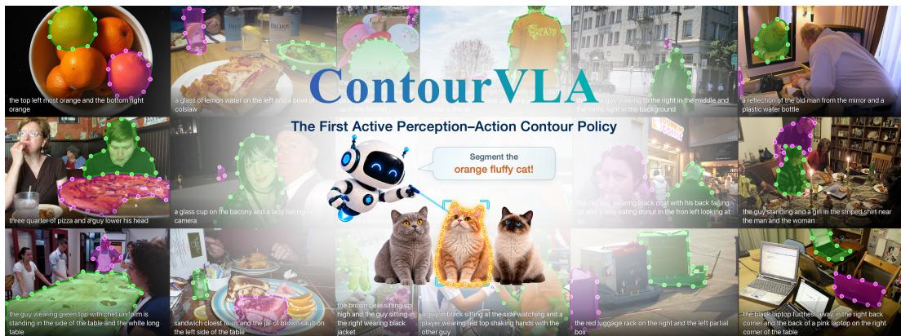

## ABSTRACT

Generalized referring expression segmentation (GRES) requires dynamically balancing high-level semantics for identifying a variable number of languagespecified referents with fine-grained visual evidence for precise boundary delineation. This requirement challenges existing cascaded vision-language architectures, which typically rely on static feature interfaces and single-pass mask prediction, limiting adaptive perception and geometric correction. We introduce ContourVLA, a vision-language-action policy that recasts GRES as a closed-loop visuomotor process, in which editable contours serve as explicit policy states that condition multimodal perception and are updated by geometric action chunks. Evolution-Aware Semantic Scheduling (EASS) couples contour-guided bidirectional boundary sampling with state-conditioned routing of multilevel multimodal features, adapting perception to each contour state. Following supervised initialization, Dustbin-Augmented Entropic Credit Transport GRPO (DECT-GRPO) jointly optimizes discrete grounding and continuous contour actions with instancelevel credits. Its rollout rewards and credits are derived from soft prediction-target correspondences that account for false positives and missed targets. ContourVLA improves gIoU over the strongest evaluated baselines by 8.7, 2.8, and 2.7 points on gRefCOCO val, testA, and testB, respectively, and achieves the highest mIoU across all eight RefCOCO, RefCOCO+, and RefCOCOg splits.

## 1 INTRODUCTION

Generalized referring expression segmentation (GRES) delineates a variable number of objects specified by free-form expressions involving attribute, relational, spatial, and numerical constraints (Liu et al., 2023a; Kim et al., 2026). Recent GRES methods typically adopt a cascaded architecture that connects preselected layers of pretrained vision-language models (VLMs) to segmentation heads through static feature interfaces (Lai et al., 2024; Xia et al., 2024; Yan et al., 2025; Xu et al., 2024). Beyond the demands of conventional fixed-category segmentation, the GRES segmentation head needs to dynamically balance high-level semantics for identifying language-specified referents and fine-grained visual evidence for recovering precise boundaries. However, static cascaded interfaces limit such adaptive feature acquisition (Luo et al., 2025). Moreover, single-pass mask prediction lacks an updatable intermediate geometric state and an explicit feedback path for revisiting local evidence, hindering the refinement of fine structures and the separation of adjacent instances (Peng et al., 2020).

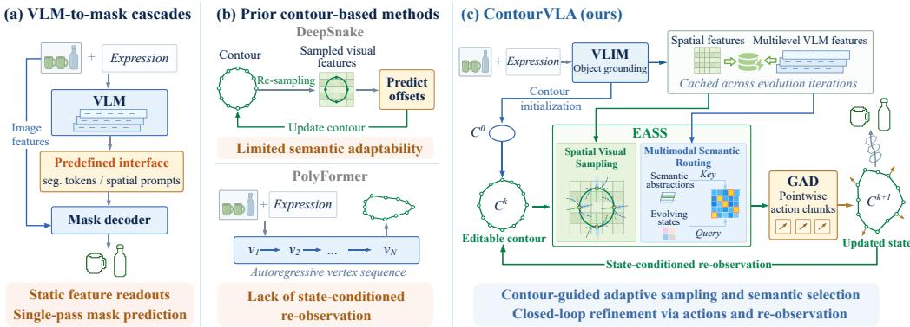  
Figure 1: Paradigm-level comparison of ContourVLA with prior methods.

These limitations motivate a shift from static feedforward prediction toward an active vision paradigm, in which the current state guides evidence acquisition and action-induced state updates condition subsequent observations (Bajcsy, 1988). Inspired by this view, we formulate GRES as a text-conditioned visuomotor decision process, where an editable contour serves as an explicit geometric state that regulates multimodal perception and evolves through pointwise geometric actions. Figure 1 contrasts this formulation with VLM-to-mask cascades and prior contour-based methods.

We introduce ContourVLA, a vision-language-action (VLA) policy (Kim et al., 2024) that formulates GRES as a closed-loop perception-action process, where multimodal observations are iteratively transformed into geometric actions for contour evolution. ContourVLA consists of a V-L Interaction Module (VLIM) and a Geometric Action Decoder (GAD). VLIM acts as a perceptual expert that grounds text-specified referents and provides multimodal observations for state-conditioned perception, while GAD serves as an action expert that predicts geometric action chunks from these observations (Zhao et al., 2023b). Executing each chunk updates the contour state and triggers the next perception–action cycle, progressively refining the contour from coarse localization to precise boundaries. ContourVLA adopts a two-stage training strategy: SFT establishes grounding and contour-trajectory priors, followed by joint GRPO post-training with self-rollout feedback (Shao et al., 2024). This formulation raises two key challenges: adaptive multimodal perception under evolving contour states and effective optimization of the joint policy.

Geometric refinement requires adaptive integration of spatial and semantic evidence throughout contour evolution, a dynamic demand that static feature interfaces cannot accommodate. We therefore introduce Evolution-Aware Semantic Scheduling (EASS), which adapts dual-axis multimodal perception through the evolving contour state. On the spatial axis, Spatial Visual Sampling uses contour geometry as a prior to sample bidirectional boundary cues over an adaptive receptive field. On the semantic axis, Multimodal Semantic Routing encodes instance geometry, evolution progress, contour motion, and decoding depth as queries to select the most relevant VLIM representations.

Effective joint-policy optimization in GRES requires multi-instance credit attribution under uneven prediction quality, false positives, and missed targets. Standard GRPO instead broadcasts a single rollout-level advantage across all instances, conflating their contributions and preventing targeted optimization (Shao et al., 2024). We therefore propose Dustbin-Augmented Entropic Credit Transport GRPO (DECT-GRPO), which assigns credit via soft correspondences established by entropic transport, while dustbin entries absorb false-positive predictions and missed targets (Cuturi, 2013; Sarlin et al., 2020). DECT-GRPO preserves module-specific likelihoods for discrete grounding and continuous contour actions, while converting transport-weighted segmentation quality into branchwise centered credit maps assigned to corresponding grounding tokens and contour actions.

Our main contributions are as follows:

• We introduce ContourVLA, the first to recast GRES as an active perception-action contour policy in which geometric states bridge multimodal perception and contour actions.

• We propose EASS, a state-conditioned perceptual scheduler that replaces static readouts with spatial visual sampling for adaptive boundary-cue acquisition and multimodal semantic routing for evolution-aware selection of multilevel multimodal features.

• We propose DECT-GRPO, which couples module-specific likelihood optimization with dustbin-augmented entropic transport to derive instance-level credits for grounding tokens and contour actions while accounting for false-positive predictions and missed targets.

## 2 RELATED WORK

Generalized Referring Expression Segmentation. Generalized referring expression segmentation (GRES) aims to identify and segment a variable number of objects specified by free-form expressions (Liu et al., 2023a). Early approaches rely on cross-modal fusion between separate visual and language encoders (Yang et al., 2022; Liu et al., 2023a; Luo et al., 2025), while recent methods typically connect pretrained VLMs with segmentation decoders through segmentation tokens or spatial prompts (Lai et al., 2024; Xia et al., 2024; Rasheed et al., 2024; Liu et al., 2025a; Huang et al., 2025; Lu et al., 2026). Despite varied interfaces, these cascades rely on fixed feature readouts and single-pass prediction, limiting adaptive semantic-spatial evidence selection and iterative segmentation correction. In contrast, ContourVLA formulates GRES as a closed-loop visuomotor process, where the evolving contour state regulates visual evidence acquisition and semantic abstraction selection, while iterative geometric actions enable continuous boundary refinement.

Contour Evolution and Vision-Language-Action Policies. Contour-based methods represent boundaries as ordered vertices and refine them through geometric updates. DeepSnake and its variants (Peng et al., 2020; Zhang et al., 2025b;c; 2026c; 2025a; Zhao et al., 2023a; Tang et al., 2024) iteratively sample local visual features for contour refinement, while PolyFormer (Liu et al., 2023b) autoregressively predicts language-conditioned contour vertices. These methods do not adapt multimodal evidence to evolving contour states in GRES. Inspired by vision-language-action models (Kim et al., 2024), ContourVLA instead recasts contour evolution as a 2D geometric action prediction problem conditioned on vision and language, and solves it through a closed-loop perception-action process.

Reinforcement Learning for Vision-Language Reasoning and Grounding. Reinforcement Learning (RL) has emerged as a potent methodology for enhancing performance on complex visual tasks Zhang et al. (2026b; 2025d; 2026a); Luo et al. (2026); Guo et al. (2026). Seg-Zero (Liu et al., 2025a) and SAM-R1 (Huang et al., 2025) apply GRPO (Shao et al., 2024) with localization or mask-quality rewards to multimodal segmentation and grounding. Standard GRPO, however, shares a rollout-level advantage across all outputs without explicitly distinguishing instance quality in the advantage assigned to each prediction. MCR-GRPO (Han et al., 2026) estimates instance importance through marginal contribution analysis. DECT-GRPO instead derives instance-level credit assignments via dustbin-augmented entropy-regularized transport, with dustbin assignments absorb ing unmatched predictions and targets.

## 3 METHOD

As shown in Figure 2, ContourVLA formulates GRES as a text-conditioned visuomotor decision process, where editable contours serve as geometric policy states that condition perception and action. Executing action chunks iteratively updates the contour state and closes the perception-action loop (Section 3.1). Within this closed loop, EASS constructs state-conditioned multimodal observations by sampling around the contour and scheduling semantic features (Section 3.2). GAD uses these observations to predict geometric action chunks that update the contour state (Section 3.3). Training follows a two-stage strategy: supervised initialization establishes a geometric prior, followed by DECT-GRPO post-training with instance-level credit assignment (Section 3.4).

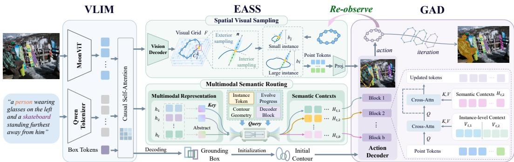  
Figure 2: Overview of the ContourVLA framework. VLIM predicts grounding boxes for contour initialization and provides visual and multilevel multimodal features. EASS performs adaptive bidirectional boundary sampling and routes semantic representations according to the evolving state. GAD combines contour point tokens with instance context and routed semantics to predict pointwise geometric action chunks. Executing these actions updates the contours and conditions subsequent observations, forming a closed perception-action loop. The dashed inset illustrates a GAD block.

## 3.1 STATE-CONDITIONED PERCEPTION-ACTION LOOP

Multimodal perception and contour initialization. Given an image-expression pair $( I , x )$ , VLIM autoregressively generates a structured grounding sequence $y _ { 1 : L _ { y } } \sim \pi _ { \theta } ^ { \bar { y } } ( \cdot \mid I , x )$ , which contains reasoning tokens followed by either M box records or a no-target response:

$$
y _ { 1 : L _ { y } } = \left\{ { { r _ { 1 : L _ { r } } } { [ \langle { \mathrm { b o x } } \rangle \langle { x _ { 1 } } \rangle \langle { y _ { 1 } } \rangle \langle { x _ { 2 } } \rangle \langle { y _ { 2 } } \rangle ] _ { i = 1 } ^ { M } \langle { \mathrm { e o s } } \rangle } , } \quad M > 0 , \right.\tag{1}
$$

The coordinate tokens in each box record are decoded into a bounding box $b _ { i } .$ , which initializes an inscribed elliptical contour $C _ { i } ^ { 0 } = ( c _ { i , 1 } ^ { 0 } , \ldots , c _ { i . P _ { i } } ^ { 0 } ) \in \mathbb { R } ^ { P _ { i } \times 2 }$ The point budget $P _ { i }$ is determined by the box perimeter to adapt contour resolution to object scale. Meanwhile, VLIM caches a visual feature grid $F$ and multilevel multimodal representations $\{ H ^ { \ell } \} _ { \ell \in \mathcal { L } }$ for subsequent state-conditioned perception. Region features pooled from $\bar { F }$ are further contextualized with box geometry to obtain the instance representation $V _ { i }$

Perception-action loop. At evolution iteration k, EASS constructs state-conditioned observations along spatial and semantic axes. The spatial branch extracts contour-conditioned boundary evidence $\Phi ( \bar { F _ { \mathrm { } } } \bar { C _ { i } ^ { k } } , b _ { i } )$ from the visual grid, while the semantic branch selects block-specific multimodal features $\mathcal { U } _ { i } ^ { k }$ from $\{ H ^ { \ell } \} _ { \ell \in \mathcal { L } }$ . Together with the instance representation $V _ { i } ,$ , these readouts constitute the multimodal observation $O _ { i } ^ { k }$ for geometric action chunk prediction $A _ { i } ^ { k }$ in GAD:

$$
O _ { i } ^ { k } = \left( \Phi ( F , C _ { i } ^ { k } , b _ { i } ) , V _ { i } , \mathcal { U } _ { i } ^ { k } \right) , \qquad A _ { i } ^ { k } = \pi _ { \phi } ( C _ { i } ^ { k } , O _ { i } ^ { k } ) , \qquad C _ { i } ^ { k + 1 } = \mathcal { T } ( C _ { i } ^ { k } , A _ { i } ^ { k } ) .\tag{2}
$$

Here $\tau$ denotes the geometric state transition function. The updated contour $C _ { i } ^ { k + 1 }$ initializes the next perception step. Thus, the contour serves as an explicit policy state connecting iterative obser vation, geometric refinement, and state evolution.

## 3.2 EVOLUTION-AWARE SEMANTIC SCHEDULING

The spatial evidence and semantic abstractions required for geometric refinement vary across evolution stages and contour states. We therefore introduce Evolution-Aware Semantic Scheduling (EASS), a dual-axis scheduler that adapts visual evidence acquisition and multimodal feature selection throughout evolution.

## 3.2.1 SPATIAL VISUAL SAMPLING

At each evolution iteration, the current contour provides a geometric prior for acquiring local visual evidence. Beyond vertex-level feature sampling (Peng et al., 2020), EASS dynamically expands the receptive field along each vertex normal by sampling bidirectional interior and exterior features from visual grid $F .$ . Let $b _ { i } ^ { \mathrm { s i z e } } = ( w _ { i } , h _ { i } )$ denote the size of box $b _ { i } ,$ , and let $n _ { i , p } ^ { k }$ be the unit normal computed after mapping the contour into box-normalized coordinates. Using nonnegative offsets

$\{ o _ { j } \} _ { j = 1 } ^ { J }$ , the contour-aligned feature profile is

$$
\phi _ { i , p } ^ { k } = \mathrm { C o n c a t } _ { j = 1 } ^ { J } \left[ F \left( c _ { i , p } ^ { k } - o _ { j } ( n _ { i , p } ^ { k } \odot b _ { i } ^ { \mathrm { s i z e } } ) \right) , F \left( c _ { i , p } ^ { k } + o _ { j } ( n _ { i , p } ^ { k } \odot b _ { i } ^ { \mathrm { s i z e } } ) \right) \right] .\tag{3}
$$

Bidirectional sampling captures complementary interior and exterior boundary cues, while boxrelative scaling adapts the receptive field to object scale. Details are provided in Appendix A.5.

## 3.2.2 MULTIMODAL SEMANTIC ROUTING

Semantic abstractions as keys. The multilevel multimodal features of VLIM constitute a candi date semantic space. For each layer ℓ, let $H ^ { \ell }$ denote its multimodal token representations. EASS compresses $H ^ { \ell }$ into a key that characterizes the semantic abstraction provided by each layer:

$$
\kappa _ { \ell } = \mathrm { N o r m } _ { 2 } \left( f _ { \mathrm { k e y } } \big ( \mathrm { P o o l } ( H ^ { \ell } ) + e _ { \ell } \big ) \right) ,\tag{4}
$$

where $\mathrm { N o r m } _ { 2 } ( z ) = z / \| z \| _ { 2 }$ and $e _ { \ell }$ is a learned layer identity.

Evolving states as queries. Instance characteristics $g _ { i }$ , contour states $c _ { i } ^ { k } .$ evolution stages $r ^ { k }$ , and decoder depths d jointly determine the semantic requirements of each refinement step. EASS encodes these factors into queries to select the VLIM layer that provides the most relevant semantic cues. For object i at evolution iteration k and GAD block d, the query is constructed as

$$
q _ { i } ^ { k , d } = \mathrm { N o r m } _ { 2 } \left( f _ { q } ( g _ { i } , c _ { i } ^ { k } , r ^ { k } , d ) \right) .\tag{5}
$$

Here $g _ { i } = \left( b _ { i } , P _ { i } \right)$ denotes the instance characteristics, where $b _ { i } = ( x _ { i } ^ { 1 } , y _ { i } ^ { 1 } , x _ { i } ^ { 2 } , y _ { i } ^ { 2 } )$ is the normalized grounding box and $P _ { i }$ is the object-adaptive contour point budget.

Evolution-aware key-query routing. EASS computes the compatibility between each evolutionconditioned query and VLIM semantic keys, yielding a probability distribution over candidate lay-

$$
\begin{array} { r } { p _ { i , \ell } ^ { k , d } = \mathrm { S o f t m a x } _ { \ell \in \mathcal { L } } \left( \langle q _ { i } ^ { k , d } , \kappa _ { \ell } \rangle + \alpha _ { u } B _ { k , d , \ell } \right) , } \end{array}\tag{6}
$$

Here $p _ { i , \ell } ^ { k , d }$ denotes the layer-selection probability for VLIM layer ℓ of object i at evolution iteration k and GAD block $d .$ To stabilize early routing, the prior B initializes an ordered correspondence between evolution-depth slots and VLIM layers, while its weight gradually decays to allow contourconditioned query-key compatibility to dominate. To retain discrete layer selection in the forward pass while enabling differentiable router optimization, EASS applies hard routing with a straightthrough estimator:

$$
\widetilde { p } _ { i } ^ { k , d } = \mathrm { s g } \big ( \mathrm { o n e h o t } ( \mathrm { a r g } \operatorname* { m a x } _ { \ell } p _ { i , \ell } ^ { k , d } ) - p _ { i } ^ { k , d } \big ) + p _ { i } ^ { k , d } , \qquad U _ { i } ^ { k , d } = \mathrm { P r o j } \big ( \sum _ { \ell \in \mathcal { L } } \widetilde { p } _ { i , \ell } ^ { k , d } H ^ { \ell } \big ) ,\tag{7}
$$

where sg denotes stop-gradient and $U _ { i } ^ { k , d }$ is the routed multimodal feature delivered to the d-th GAD block. Proj projects the selected VLIM representation into the corresponding GAD feature space. Recomputing the query after each contour update adapts the routed semantic abstraction throughout multistep contour evolution. Further details are provided in Appendix A.4.

## 3.3 GEOMETRIC ACTION CHUNKING

GAD decodes EASS observations into continuous pointwise displacement actions. Each contour vertex is represented as a geometric token based on the contour-conditioned visual evidence $\phi _ { i , p } ^ { k }$ from Spatial Visual Sampling and contour geometry:

$$
Z _ { i , p } ^ { k , 0 } = \operatorname { P r o j } \left( \operatorname { C o n c a t } [ \phi _ { i , p } ^ { k } , c _ { i , p } ^ { k } , \operatorname { P E } _ { \mathrm { b o x } } ( c _ { i , p } ^ { k } ; b _ { i } ) , \operatorname { P E } _ { \mathrm { c y c } } ( p / P _ { i } ) ] \right) .\tag{8}
$$

where $\mathrm { P E } _ { \mathrm { b o x } } ( c _ { i , p } ^ { k } ; b _ { i } )$ encodes box-relative vertex coordinates, and $\mathrm { P E _ { c y c } } ( p / P _ { i } )$ preserves the cyclic positions of vertices along the closed contour. Stacking the $P _ { i }$ point tokens yields the contour representation $Z _ { i } ^ { k , 0 } = [ Z _ { i , 1 } ^ { k , 0 } , \bar { \cdot \cdot } \cdot , Z _ { i , P _ { i } } ^ { k , 0 } ] ^ { \top } \in \mathbb { R } ^ { P _ { i } \times h }$ , which is further refined with instance-level context $V _ { i } .$ . At each GAD block, contour tokens interact with the semantic representation $U _ { i } ^ { k , d }$

$$
\begin{array} { r } { \overline { { Z } } _ { i } ^ { k , d } = \operatorname { C r o s s A t t n } _ { d } ( Z _ { i } ^ { k , d - 1 } , V _ { i } ) , \qquad Z _ { i } ^ { k , d } = \overline { { Z } } _ { i } ^ { k , d } + \operatorname { C r o s s A t t n } _ { d } ( \overline { { Z } } _ { i } ^ { k , d } , U _ { i } ^ { k , d } ) . } \end{array}\tag{9}
$$

The action decoder then predicts two-dimensional displacement means for each vertex in parallel (Zhao et al., 2023b), which updates the contour state and triggers the next iteration.

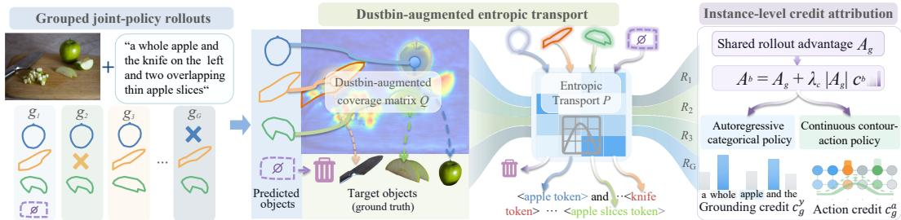  
Figure 3: Overview of DECT-GRPO. Dustbin-augmented entropic transport establishes soft prediction–target correspondences and assigns instance-level credits to grounding tokens and contour actions for joint policy optimization.

## 3.4 POLICY OPTIMIZATION WITH DECT-GRPO

We initialize VLIM with teacher-forced grounding and GAD with positional supervision along reference contour trajectories, regularized by auxiliary geometric and routing objectives (Appendix A.6). Building on this initialization, DECT-GRPO (Fig. 3) leverages dustbin-augmented entropic transport to derive instance-level credit attribution and transport-based rewards for jointly optimizing grounding and geometric actions.

Grouped joint-policy rollouts. For each input (I, x), VLIM samples G grounding outputs that define the initial contours, after which GAD generates continuous geometric action chunks. The grounding branch follows an autoregressive categorical policy, while the action branch follows a bounded continuous policy based on a tanh-transformed Gaussian. Their likelihood definitions and rollout-replay details are provided in Appendix A.7.

Dustbin-augmented entropic transport. Instances within a GRES rollout may differ substantially in segmentation quality, yet standard GRPO assigns all outputs the same rollout-level advantage without explicitly distinguishing instance quality in the assigned advantage (Shao et al., 2024). DECT-GRPO therefore uses dustbin-augmented entropic transport to establish soft prediction-target correspondences for reward construction and instance-level credit attribution, with virtual null targets and predictions absorbing false positives and missed targets.

For rollout g among the G samples of an input, let $M _ { g }$ and N denote the predicted and target instance counts, respectively. With $Q _ { g , i j }$ denoting the mask IoU between prediction i and target j, the pairwise coverage matrix $Q _ { g } = [ \bar { Q } _ { g , i j } ] \in \mathbb { R } ^ { M _ { g } \times N }$ is augmented as

$$
\begin{array} { r l } { \overline { { Q } } _ { g } = \left[ { Q _ { g } \mathbf \Delta } _ { \overline { { b } } } \right. } & { \left. b _ { \mathcal { O } } \mathbf { 1 } _ { M _ { g } } \right] \in \mathbb { R } ^ { ( M _ { g } + 1 ) \times ( N + 1 ) } , } \end{array}\tag{10}
$$

where $b _ { \mathcal { O } }$ is the null-match score. The last column absorbs unmatched predictions, while the last row accounts for missed targets. Let $P \in \mathbb { R } ^ { ( M _ { g } + 1 ) \times ( N + 1 ) }$ denote the soft transport plan, where $P _ { i j }$ is the matching mass assigned between prediction i and target j, including dustbin matches. DECT-GRPO obtains the globally consistent soft assignment through entropy-regularized optimal transport:

$$
P _ { g } ^ { \star } = \arg \operatorname* { m a x } _ { P \in \mathcal { U } _ { g } } \biggl [ \sum _ { i , j } P _ { i j } \overline { { Q } } _ { g , i j } - \varepsilon \sum _ { i , j } P _ { i j } \log P _ { i j } \biggr ] .\tag{11}
$$

Here $\mathcal { U } _ { g }$ is the set of nonnegative transport plans satisfying the prescribed prediction and target marginals. The entropy term prevents ambiguous overlaps from collapsing prematurely to hard correspondences, preserving uncertainty among plausible matches and yielding smoother instance-level credit. The marginal constraints enforce global consistency across predictions and targets, so $P _ { g , i j } ^ { \star }$ represents a globally normalized soft correspondence rather than an independent pairwise score. Mass assigned to the null target denotes unmatched predictions and lowers instance credit, whereas mass from the null prediction denotes missed targets and reduces target coverage. Its Sinkhorn solution is derived in Appendix A.8.

Transport-based reward. A reliable rollout reward should jointly capture contour accuracy, target coverage, and prediction-target correspondence. DECT-GRPO therefore evaluates segmentation quality from complementary prediction and target perspectives under the soft transport plan $P _ { g } ^ { \star }$

$$
\mathrm { P r e c } _ { g } = \frac { 1 } { M _ { g } } \sum _ { i = 1 } ^ { M _ { g } } \frac { \sum _ { j = 1 } ^ { N } P _ { g , i j } ^ { \star } Q _ { g , i j } } { \sum _ { j = 1 } ^ { N + 1 } P _ { g , i j } ^ { \star } } , \quad \mathrm { R e c } _ { g } = \frac { 1 } { N } \sum _ { j = 1 } ^ { N } \frac { \sum _ { i = 1 } ^ { M _ { g } } P _ { g , i j } ^ { \star } Q _ { g , i j } } { \sum _ { i = 1 } ^ { M _ { g } + 1 } P _ { g , i j } ^ { \star } } , \quad R _ { g } = \frac { 2 \mathrm { P r e c } _ { g } \mathrm { R e c } _ { g } } { \mathrm { P r e c } _ { g } + \mathrm { R e c } _ { g } }\tag{12}
$$

Here, $\mathrm { P r e c } _ { g }$ and ${ \mathrm { R e c } } _ { g }$ denote transport-aware precision and recall under $P _ { q } ^ { \star }$ . We set $R _ { g } = 0$ when $\mathrm { P r e c } _ { g } + \mathrm { R e c } _ { g } = 0 ;$ empty-set cases are handled separately in Appendix $\check { \mathbf { A . 9 } } .$ . Soft transport stabilizes the reward under ambiguous correspondences by avoiding discontinuities from hard matching. Dustbin mass remains in the normalization but receives no overlap credit; therefore, unmatched predictions reduce $\mathrm { P r e c } _ { g } ,$ , while missed targets reduce ${ \mathrm { R e c } } _ { g }$ . The resulting harmonic mean jointly captures contour quality, correspondence uncertainty, and target coverage.

Instance-level advantage modulation. Predictions within a rollout may differ in segmentation quality, whereas a shared rollout advantage applies the same scalar feedback to all outputs. DECT-GRPO uses transport-derived instance credits to modulate this shared advantage at the corresponding grounding-token spans and contour-action positions, introducing instance-dependent feedback while retaining the rollout-level signal.

For each predicted instance i, DECT-GRPO computes transport-weighted credit and broadcasts its normalized value to the corresponding grounding-token span $S _ { g , i }$ and contour-action indices $\mathcal { D } _ { g , i }$ Branch-wise centering and scaling produce the credit maps:

$$
e _ { g , i } = \frac { \sum _ { j = 1 } ^ { N } P _ { g , i j } ^ { \star } Q _ { g , i j } } { \sum _ { j = 1 } ^ { N + 1 } P _ { g , i j } ^ { \star } } , \qquad \mathbf { c } _ { g } ^ { y } [ S _ { g , i } ] = \mathrm { N o r m } _ { y } ( e _ { g , i } ) , \qquad \mathbf { c } _ { g } ^ { a } [ \mathcal { D } _ { g , i } ] = \mathrm { N o r m } _ { a } ( e _ { g , i } ) .\tag{13}
$$

The normalization is performed over branch outputs, yielding zero-centered credit maps that preserve the branch-wise mean advantage. The resulting output-specific advantages are

$$
A _ { g , \nu } ^ { b } = A _ { g } + \lambda _ { c } | A _ { g } | \mathbf { c } _ { g } ^ { b } [ \nu ] , \qquad b \in \{ y , a \} ,\tag{14}
$$

Answer tokens outside instance spans retain the shared rollout advantage $A _ { g } .$ The output-countweighted normalization preserves the branch-wise mean advantage. Since $\mathbf { c } _ { q } ^ { \bar { b } } [ \nu ] \in [ - 1 , 1 ]$ and we use $\lambda _ { c } ~ = ~ 0 . 5$ , the instance-modulated advantages retain the sign of $A _ { g }$ . Higher-credit instances receive larger positive advantages when $A _ { g } > 0$ and smaller-magnitude negative advantages when $A _ { g } ~ < ~ 0$ Thus, DECT-GRPO provides bounded, mean-preserving modulation of shared rollout feedback rather than independent instance-level reward or penalty decisions.

Joint policy optimization. Let $\rho _ { g , n } ^ { y }$ and $\rho _ { g , \xi } ^ { a }$ denote the current-to-behavior likelihood ratios for grounding tokens and contour actions, respectively. The joint objective is

$$
\mathcal { L } _ { \mathrm { D E C T } } = \frac { 1 } { G } \sum _ { g = 1 } ^ { G } \left[ - \frac { 1 } { L _ { g } } \sum _ { n = 1 } ^ { L _ { g } } \mathcal { S } _ { \mathrm { c l i p } } ( \rho _ { g , n } ^ { y } , A _ { g , n } ^ { y } ) - \frac { \lambda _ { a } } { | \mathcal { D } _ { g } | } \sum _ { \xi \in \mathcal { D } _ { g } } \mathcal { S } _ { \mathrm { c l i p } } ( \rho _ { g , \xi } ^ { a } , A _ { g , \xi } ^ { a } ) + \beta _ { \mathrm { K L } } K _ { g } \right]\tag{15}
$$

Here $\lambda _ { a }$ balances the two branches, and $\kappa _ { g }$ regularizes the grounding policy toward the reference model. Likelihood ratios, the clipped surrogate, and replay details are given in Appendix A.9.

## 4 EXPERIMENTS

## 4.1 EXPERIMENTAL SETUP

Datasets and metrics. We evaluate GRES on gRefCOCO (Liu et al., 2023a) and conventional referring expression segmentation (RES) on RefCOCO, RefCOCO+ (Yu et al., 2016), and Ref-COCOg (Mao et al., 2016). We report gIoU and cIoU for GRES, and mIoU and cIoU for RES.

Training setup. ContourVLA initializes its visual and language backbones from MoonViT and Qwen2.5-3B-Instruct, respectively. Grounding training on LocateAnything-Data (Wang et al., 2026) is followed by SFT and DECT-GRPO jointly on the training sets of gRefCOCO, RefCOCO, Ref-COCO+, and RefCOCOg. A single resulting checkpoint is evaluated across all benchmark splits. Training and evaluation details are provided in Appendix A.1.

## 4.2 COMPARISON WITH EXISTING METHODS

Table 1 compares ContourVLA with existing methods on GRES and conventional RES benchmarks under their respective model and training configurations. All results are obtained from our own evaluation runs, while component-level contributions are examined through the ablations in Section 4.3.

GRES results. On gRefCOCO, ContourVLA achieves 83.5, 80.3, and 74.4 gIoU on val, testA, and testB, respectively, exceeding the strongest evaluated baseline on each split by 8.7, 2.8, and 2.7 points. It also achieves the highest cIoU on val and testA, while its testB cIoU of 71.8 is just 0.1 point below HiMTok. These results combine consistent gains in expression-averaged quality with competitive cumulative pixel overlap, rather than showing an advantage under only one aggregation criterion. Since gIoU also accounts for no-target expressions, Section 4.3 further examines no-target accuracy and instance F1 to characterize rejection and instance-level segmentation more directly.

RES results. On conventional RES benchmarks, the same jointly trained checkpoint achieves the highest mIoU on all eight evaluated splits. Improvements over the strongest baselines range from 1.3 to 1.8 points on RefCOCO and from 2.8 to 3.2 points on RefCOCO+, with additional gains of 0.7 and 0.3 points on RefCOCOg val and test, respectively. These results extend the evidence beyond the generalized setting: the shared contour policy also performs well on conventional referring segmentation. Importantly, all benchmarks use the same checkpoint without further benchmarkspecific fine-tuning, supporting the applicability of one policy to both task formulations under the joint-training protocol.

Table 1: Comparison with methods across GRES and RES benchmarks (%). Red, orange, gold, and yellow shading denote the first- through fourth-best scores in each column, respectively.
<table><tr><td rowspan=3 colspan=13>gRefCOCO              RefCOCOMethodval   testA  testBgIoU cIoU mIoU cIoU mIoU cIoU mIoU cIoU</td><td rowspan=1 colspan=6>RefCOCO+</td><td rowspan=1 colspan=4>RefCOCOg</td></tr><tr><td rowspan=1 colspan=2></td><td rowspan=1 colspan=2>testA</td><td rowspan=1 colspan=2>testB</td><td rowspan=1 colspan=2>val</td><td rowspan=1 colspan=2>testA</td><td rowspan=1 colspan=2>testB</td><td rowspan=1 colspan=4>val    test</td></tr><tr><td rowspan=1 colspan=4>gIoU cIoU gIoU cIoU</td><td rowspan=1 colspan=2>gIoU cIoU</td><td rowspan=1 colspan=2>mIoU cIoU</td><td rowspan=1 colspan=2>mIoU cIoU</td><td rowspan=1 colspan=2>mIoU cIoU</td><td rowspan=1 colspan=2>mIoU cIoU m</td><td rowspan=1 colspan=2>IoU cIoU m</td><td rowspan=1 colspan=2>IoU cIoU m</td><td rowspan=1 colspan=2>IoU cIoU</td><td rowspan=1 colspan=2>mIoU cIoU</td></tr><tr><td rowspan=1 colspan=1>Grounded-SAM (Ren et al., 2024)</td><td rowspan=1 colspan=4>46.044.150.8 48.7</td><td rowspan=1 colspan=2>43.541.3</td><td rowspan=1 colspan=1>46.2</td><td rowspan=1 colspan=1>44.4</td><td rowspan=1 colspan=2>48.647.0</td><td rowspan=1 colspan=2>42.940.9</td><td rowspan=1 colspan=2>38.236.5</td><td rowspan=1 colspan=2>42.440.5</td><td rowspan=1 colspan=2>33.030.8</td><td rowspan=1 colspan=2>44.142.0</td><td rowspan=1 colspan=1>44.5</td><td rowspan=1 colspan=1>43.0</td></tr><tr><td rowspan=1 colspan=1>LISA-7B (Lai et al., 2024)</td><td rowspan=1 colspan=3>61.461.7 66.0 6</td><td rowspan=1 colspan=1>8.5</td><td rowspan=1 colspan=1>58.8</td><td rowspan=1 colspan=1>60.6</td><td rowspan=1 colspan=1>68.1</td><td rowspan=1 colspan=1>74.6</td><td rowspan=1 colspan=2>70.679.3</td><td rowspan=1 colspan=1>64.5</td><td rowspan=1 colspan=1>72.3</td><td rowspan=1 colspan=1>54.8</td><td rowspan=1 colspan=1>65.1</td><td rowspan=1 colspan=2>60.370.8</td><td rowspan=1 colspan=1>48.4</td><td rowspan=1 colspan=1>58.1</td><td rowspan=1 colspan=2>63.167.9</td><td rowspan=1 colspan=1>66.2</td><td rowspan=1 colspan=1>70.6</td></tr><tr><td rowspan=1 colspan=1>PerceptionGPT-7B (Pi et al., 2024)</td><td rowspan=1 colspan=2>61.5559.9</td><td rowspan=1 colspan=1>66.1</td><td rowspan=1 colspan=1>64.3</td><td rowspan=1 colspan=1>58.9</td><td rowspan=1 colspan=1>56.8</td><td rowspan=1 colspan=1>70.7</td><td rowspan=1 colspan=1>74.7</td><td rowspan=1 colspan=1>73.9</td><td rowspan=1 colspan=1>78.7</td><td rowspan=1 colspan=1>66.8</td><td rowspan=1 colspan=1>71.7</td><td rowspan=1 colspan=1>64.0</td><td rowspan=1 colspan=1>68.1</td><td rowspan=1 colspan=2>69.473.8</td><td rowspan=1 colspan=1>56.8</td><td rowspan=1 colspan=1>61.0</td><td rowspan=1 colspan=2>65.570.2</td><td rowspan=1 colspan=1>67.2</td><td rowspan=1 colspan=1>71.5</td></tr><tr><td rowspan=1 colspan=1>LaSagnA-7B (Wei et al., 2024)</td><td rowspan=1 colspan=2>32.4 38.1</td><td rowspan=1 colspan=1>47.3</td><td rowspan=1 colspan=1>50.4</td><td rowspan=1 colspan=1>38.9</td><td rowspan=1 colspan=1>42.1</td><td rowspan=1 colspan=1>72.8</td><td rowspan=1 colspan=1>76.8</td><td rowspan=1 colspan=1>74.2</td><td rowspan=1 colspan=1>78.8</td><td rowspan=1 colspan=1>70.7</td><td rowspan=1 colspan=1>73.8</td><td rowspan=1 colspan=1>61.4</td><td rowspan=1 colspan=1>66.4</td><td rowspan=1 colspan=1>65.3</td><td rowspan=1 colspan=1>70.6</td><td rowspan=1 colspan=1>57.3</td><td rowspan=1 colspan=1>60.1</td><td rowspan=1 colspan=2>66.170.5</td><td rowspan=1 colspan=1>67.3</td><td rowspan=1 colspan=1>72.0</td></tr><tr><td rowspan=1 colspan=1>OMG-LLaVA-7B (Zhang et al., 2024a)</td><td rowspan=1 colspan=2>36.1 39.3</td><td rowspan=1 colspan=1>50.1</td><td rowspan=1 colspan=1>52.4</td><td rowspan=1 colspan=1>42.22</td><td rowspan=1 colspan=1>43.7</td><td rowspan=1 colspan=1>73.5</td><td rowspan=1 colspan=1>77.8</td><td rowspan=1 colspan=1>75.7</td><td rowspan=1 colspan=1>80.3</td><td rowspan=1 colspan=1>69.3</td><td rowspan=1 colspan=1>74.1</td><td rowspan=1 colspan=1>64.6</td><td rowspan=1 colspan=1>69.3</td><td rowspan=1 colspan=1>68.6</td><td rowspan=1 colspan=1>73.0</td><td rowspan=1 colspan=1>58.8</td><td rowspan=1 colspan=1>63.0</td><td rowspan=1 colspan=1>68.1</td><td rowspan=1 colspan=1>73.0</td><td rowspan=1 colspan=1>68.2</td><td rowspan=1 colspan=1>73.2</td></tr><tr><td rowspan=1 colspan=1>GroundHog-7B (Zhang et al., 2024b)</td><td rowspan=1 colspan=2>66.77 64.8</td><td rowspan=1 colspan=1>71.4</td><td rowspan=1 colspan=1>71.4</td><td rowspan=1 colspan=1>64.0</td><td rowspan=1 colspan=1>62.7</td><td rowspan=1 colspan=1>74.0</td><td rowspan=1 colspan=1>78.3</td><td rowspan=1 colspan=1>75.4</td><td rowspan=1 colspan=1>80.1</td><td rowspan=1 colspan=1>71.6</td><td rowspan=1 colspan=1>75.7</td><td rowspan=1 colspan=1>66.2</td><td rowspan=1 colspan=1>70.2</td><td rowspan=1 colspan=1>70.6</td><td rowspan=1 colspan=1>75.0</td><td rowspan=1 colspan=1>60.6</td><td rowspan=1 colspan=1>64.8</td><td rowspan=1 colspan=1>69.6</td><td rowspan=1 colspan=1>74.2</td><td rowspan=1 colspan=1>69.8</td><td rowspan=1 colspan=1>74.6</td></tr><tr><td rowspan=1 colspan=1>GLaMM-7B (Rasheed et al., 2024)</td><td rowspan=1 colspan=2>68.766.9</td><td rowspan=1 colspan=1>73.5</td><td rowspan=1 colspan=1>71.6</td><td rowspan=1 colspan=1>66.2</td><td rowspan=1 colspan=1>64.1</td><td rowspan=1 colspan=1>75.0</td><td rowspan=1 colspan=1>79.4</td><td rowspan=1 colspan=1>78.8</td><td rowspan=1 colspan=1>83.5</td><td rowspan=1 colspan=1>72.7</td><td rowspan=1 colspan=1>76.9</td><td rowspan=1 colspan=1>67.8</td><td rowspan=1 colspan=1>72.7</td><td rowspan=1 colspan=1>74.1</td><td rowspan=1 colspan=1>78.7</td><td rowspan=1 colspan=1>60.2</td><td rowspan=1 colspan=1>64.5</td><td rowspan=1 colspan=1>69.8</td><td rowspan=1 colspan=1>74.6</td><td rowspan=1 colspan=1>70.6</td><td rowspan=1 colspan=1>74.7</td></tr><tr><td rowspan=1 colspan=1>GSVA-7B (Xia et al., 2024)</td><td rowspan=1 colspan=2>66.563.3</td><td rowspan=1 colspan=1>71.16</td><td rowspan=1 colspan=1>9.9</td><td rowspan=1 colspan=1>61.9</td><td rowspan=1 colspan=1>60.5</td><td rowspan=1 colspan=1>72.1</td><td rowspan=1 colspan=1>76.7</td><td rowspan=1 colspan=1>74.3</td><td rowspan=1 colspan=1>79.6</td><td rowspan=1 colspan=1>68.0</td><td rowspan=1 colspan=1>73.0</td><td rowspan=1 colspan=1>64.0</td><td rowspan=1 colspan=1>68.2</td><td rowspan=1 colspan=1>69.1</td><td rowspan=1 colspan=1>73.1</td><td rowspan=1 colspan=1>58.5</td><td rowspan=1 colspan=1>62.3</td><td rowspan=1 colspan=1>61.9</td><td rowspan=1 colspan=1>66.6</td><td rowspan=1 colspan=1>62.4</td><td rowspan=1 colspan=1>67.5</td></tr><tr><td rowspan=1 colspan=1>SegLLM-7B (Wang et al., 2025b)</td><td rowspan=1 colspan=1>69.8</td><td rowspan=1 colspan=1>67.9</td><td rowspan=1 colspan=1>74.6</td><td rowspan=1 colspan=1>72.5</td><td rowspan=1 colspan=1>67.4</td><td rowspan=1 colspan=1>65.2</td><td rowspan=1 colspan=1>75.7</td><td rowspan=1 colspan=1>80.0</td><td rowspan=1 colspan=1>77.0</td><td rowspan=1 colspan=1>81.6</td><td rowspan=1 colspan=1>71.0</td><td rowspan=1 colspan=1>75.1</td><td rowspan=1 colspan=1>66.1</td><td rowspan=1 colspan=1>70.1</td><td rowspan=1 colspan=1>68.5</td><td rowspan=1 colspan=1>72.9</td><td rowspan=1 colspan=1>57.9</td><td rowspan=1 colspan=1>62.6</td><td rowspan=1 colspan=1>68.0</td><td rowspan=1 colspan=1>72.8</td><td rowspan=1 colspan=1>69.3</td><td rowspan=1 colspan=1>73.5</td></tr><tr><td rowspan=1 colspan=1>LIRA-8B (Li et al., 2025b)</td><td rowspan=1 colspan=1>36.7</td><td rowspan=1 colspan=1>40.9</td><td rowspan=1 colspan=1>50.4</td><td rowspan=1 colspan=1>52.4</td><td rowspan=1 colspan=1>42.4</td><td rowspan=1 colspan=1>44.9</td><td rowspan=1 colspan=1>77.3</td><td rowspan=1 colspan=1>81.4</td><td rowspan=1 colspan=1>78.9</td><td rowspan=1 colspan=1>82.4</td><td rowspan=1 colspan=1>73.5</td><td rowspan=1 colspan=1>77.9</td><td rowspan=1 colspan=1>71.8</td><td rowspan=1 colspan=1>76.1</td><td rowspan=1 colspan=1>76.6</td><td rowspan=1 colspan=1>80.8</td><td rowspan=1 colspan=1>66.0</td><td rowspan=1 colspan=1>70.6</td><td rowspan=1 colspan=1>73.8</td><td rowspan=1 colspan=1>78.5</td><td rowspan=1 colspan=1>73.5</td><td rowspan=1 colspan=1>78.3</td></tr><tr><td rowspan=1 colspan=1>HiMTok-8B (Wang et al., 2025a)</td><td rowspan=1 colspan=1>72.1</td><td rowspan=1 colspan=1>70.4</td><td rowspan=1 colspan=1>73.4</td><td rowspan=1 colspan=1>74.9</td><td rowspan=1 colspan=1>71.7</td><td rowspan=1 colspan=1>71.9</td><td rowspan=1 colspan=1>80.0</td><td rowspan=1 colspan=1>85.9</td><td rowspan=1 colspan=1>80.7</td><td rowspan=1 colspan=1>81.7</td><td rowspan=1 colspan=1>78.6</td><td rowspan=1 colspan=1>83.9</td><td rowspan=1 colspan=1>74.1</td><td rowspan=1 colspan=1>80.5</td><td rowspan=1 colspan=1>76.8</td><td rowspan=1 colspan=1>83.7</td><td rowspan=1 colspan=1>70.0</td><td rowspan=1 colspan=1>72.4</td><td rowspan=1 colspan=1>75.9</td><td rowspan=1 colspan=1>80.1</td><td rowspan=1 colspan=1>75.9</td><td rowspan=1 colspan=1>78.9</td></tr><tr><td rowspan=1 colspan=1>SAM-R1-7B (Huang et al., 2025)</td><td rowspan=1 colspan=1>68.5</td><td rowspan=1 colspan=1>66.4</td><td rowspan=1 colspan=1>73.1</td><td rowspan=1 colspan=1>71.2</td><td rowspan=1 colspan=1>65.6</td><td rowspan=1 colspan=1>63.8</td><td rowspan=1 colspan=1>72.4</td><td rowspan=1 colspan=1>76.3</td><td rowspan=1 colspan=1>74.8</td><td rowspan=1 colspan=1>79.5</td><td rowspan=1 colspan=1>68.7</td><td rowspan=1 colspan=1>72.9</td><td rowspan=1 colspan=1>65.0</td><td rowspan=1 colspan=1>69.8</td><td rowspan=1 colspan=1>70.2</td><td rowspan=1 colspan=1>74.8</td><td rowspan=1 colspan=1>59.3</td><td rowspan=1 colspan=1>63.4</td><td rowspan=1 colspan=1>75.1</td><td rowspan=1 colspan=1>72.2</td><td rowspan=1 colspan=1>75.4</td><td rowspan=1 colspan=1>73.3</td></tr><tr><td rowspan=1 colspan=1>SAM3 (top-1 / union) (Carion et al., 2026)</td><td rowspan=1 colspan=1>68.1</td><td rowspan=1 colspan=1>24.0</td><td rowspan=1 colspan=1>39.92</td><td rowspan=1 colspan=1>3.1</td><td rowspan=1 colspan=1>49.2</td><td rowspan=1 colspan=1>36.4</td><td rowspan=1 colspan=1>61.0</td><td rowspan=1 colspan=1>54.8</td><td rowspan=1 colspan=1>62.5</td><td rowspan=1 colspan=1>59.1</td><td rowspan=1 colspan=1>59.8</td><td rowspan=1 colspan=1>51.9</td><td rowspan=1 colspan=1>48.5</td><td rowspan=1 colspan=1>42.9</td><td rowspan=1 colspan=1>53.8</td><td rowspan=1 colspan=1>50.0</td><td rowspan=1 colspan=1>43.6</td><td rowspan=1 colspan=1>36.5</td><td rowspan=1 colspan=1>62.5</td><td rowspan=1 colspan=1>55.5</td><td rowspan=1 colspan=1>61.7</td><td rowspan=1 colspan=1>54.4</td></tr><tr><td rowspan=1 colspan=1>RefAM-SD (Kukleva et al., 2026)</td><td rowspan=1 colspan=1>27.0</td><td rowspan=1 colspan=1>24.8</td><td rowspan=1 colspan=1>31.6</td><td rowspan=1 colspan=1>29.7</td><td rowspan=1 colspan=1>24.4</td><td rowspan=1 colspan=1>22.0</td><td rowspan=1 colspan=1>50.1</td><td rowspan=1 colspan=1>41.9</td><td rowspan=1 colspan=1>52.5</td><td rowspan=1 colspan=1>44.8</td><td rowspan=1 colspan=1>46.3</td><td rowspan=1 colspan=1>38.4</td><td rowspan=1 colspan=1>40.4</td><td rowspan=1 colspan=1>33.5</td><td rowspan=1 colspan=1>46.1</td><td rowspan=1 colspan=1>38.0</td><td rowspan=1 colspan=1>35.0</td><td rowspan=1 colspan=1>28.9</td><td rowspan=1 colspan=1>45.1</td><td rowspan=1 colspan=1>37.3</td><td rowspan=1 colspan=1>46.1</td><td rowspan=1 colspan=1>39.3</td></tr><tr><td rowspan=1 colspan=1>Early Semantic Grounding-9B (He et al., 2026)</td><td rowspan=1 colspan=1>30.12</td><td rowspan=1 colspan=1>8.0 3</td><td rowspan=1 colspan=1>4.5</td><td rowspan=1 colspan=1>32.8</td><td rowspan=1 colspan=1>27.2</td><td rowspan=1 colspan=1>25.3</td><td rowspan=1 colspan=1>54.0</td><td rowspan=1 colspan=1>50.2</td><td rowspan=1 colspan=1>56.1</td><td rowspan=1 colspan=1>53.0</td><td rowspan=1 colspan=1>50.2</td><td rowspan=1 colspan=1>46.1</td><td rowspan=1 colspan=1>44.1</td><td rowspan=1 colspan=1>40.2</td><td rowspan=1 colspan=1>46.7</td><td rowspan=1 colspan=1>43.3</td><td rowspan=1 colspan=1>40.3</td><td rowspan=1 colspan=1>36.1</td><td rowspan=1 colspan=1>50.6</td><td rowspan=1 colspan=1>46.9</td><td rowspan=1 colspan=1>50.5</td><td rowspan=1 colspan=1>46.5</td></tr><tr><td rowspan=1 colspan=1>Early Semantic Grounding-12B (He et al., 2026)</td><td rowspan=1 colspan=1>31.5</td><td rowspan=1 colspan=1>29.3</td><td rowspan=1 colspan=1>36.2</td><td rowspan=1 colspan=1>34.3</td><td rowspan=1 colspan=1>29.0</td><td rowspan=1 colspan=1>26.9</td><td rowspan=1 colspan=1>57.6</td><td rowspan=1 colspan=1>53.9</td><td rowspan=1 colspan=1>60.3</td><td rowspan=1 colspan=1>58.1</td><td rowspan=1 colspan=1>53.8</td><td rowspan=1 colspan=1>49.6</td><td rowspan=1 colspan=1>48.5</td><td rowspan=1 colspan=1>44.4</td><td rowspan=1 colspan=1>52.4</td><td rowspan=1 colspan=1>49.3</td><td rowspan=1 colspan=1>44.4</td><td rowspan=1 colspan=1>40.1</td><td rowspan=1 colspan=1>54.5</td><td rowspan=1 colspan=1>51.2</td><td rowspan=1 colspan=1>54.3</td><td rowspan=1 colspan=1>50.9</td></tr><tr><td rowspan=1 colspan=1>TALENT (Jin et al., 2026)</td><td rowspan=1 colspan=1>59.1</td><td rowspan=1 colspan=1>57.0</td><td rowspan=1 colspan=1>63.7</td><td rowspan=1 colspan=1>61.8</td><td rowspan=1 colspan=1>56.6</td><td rowspan=1 colspan=1>54.4</td><td rowspan=1 colspan=1>77.8</td><td rowspan=1 colspan=1>75.9</td><td rowspan=1 colspan=1>79.4</td><td rowspan=1 colspan=1>78.3</td><td rowspan=1 colspan=1>74.8</td><td rowspan=1 colspan=1>72.8</td><td rowspan=1 colspan=1>70.1</td><td rowspan=1 colspan=1>66.9</td><td rowspan=1 colspan=1>74.9</td><td rowspan=1 colspan=1>72.3</td><td rowspan=1 colspan=1>63.4</td><td rowspan=1 colspan=1>58.8</td><td rowspan=1 colspan=1>69.7</td><td rowspan=1 colspan=1>65.9</td><td rowspan=1 colspan=1>69.2</td><td rowspan=1 colspan=1>66.8</td></tr><tr><td rowspan=1 colspan=1>DeRIS-B (Dai et al., 2025)</td><td rowspan=1 colspan=1>73.9</td><td rowspan=1 colspan=1>68.0</td><td rowspan=1 colspan=1>72.57</td><td rowspan=1 colspan=1>1.6 6</td><td rowspan=1 colspan=1>5.26</td><td rowspan=1 colspan=1>3.1</td><td rowspan=1 colspan=1>81.1</td><td rowspan=1 colspan=1>78.4</td><td rowspan=1 colspan=1>81.9</td><td rowspan=1 colspan=1>79.8</td><td rowspan=1 colspan=1>79.5</td><td rowspan=1 colspan=1>77.6</td><td rowspan=1 colspan=1>74.3</td><td></td><td></td><td></td><td></td><td></td><td></td><td></td><td></td><td></td></tr><tr><td rowspan=1 colspan=1>ContourVLA-3B</td><td rowspan=1 colspan=1>83.5</td><td rowspan=1 colspan=1>72.3</td><td rowspan=1 colspan=1>80.3</td><td rowspan=1 colspan=1>78.1</td><td rowspan=1 colspan=1>74.4</td><td rowspan=1 colspan=1>71.8</td><td rowspan=1 colspan=1>82.4</td><td rowspan=1 colspan=1>81.3</td><td rowspan=1 colspan=1>83.7</td><td rowspan=1 colspan=1>82.9</td><td rowspan=1 colspan=1>81.1</td><td rowspan=1 colspan=1>79.2</td><td rowspan=1 colspan=1>77.5</td><td rowspan=1 colspan=1>76.4</td><td rowspan=1 colspan=1>80.7</td><td rowspan=1 colspan=1>80.7</td><td rowspan=1 colspan=1>74.2</td><td rowspan=1 colspan=1>69.3</td><td rowspan=1 colspan=1>76.6</td><td rowspan=1 colspan=1>76.9</td><td rowspan=1 colspan=1>76.7</td><td rowspan=1 colspan=1>77.3</td></tr></table>

Qualitative results. Figure 4 complements the quantitative evaluation with multi-referent, partlevel, and no-target examples. In the person-and-umbrella example, ContourVLA segments both requested referents; in the truck example, it delineates the specified front portion rather than extending the mask over the entire vehicle. It also correctly returns an empty prediction for the absenttarget expression. Compared with the displayed baselines, these examples illustrate fewer omitted referents and less over-segmentation while preserving fine boundaries. Together, they highlight two complementary requirements of GRES: identifying the complete language-specified referent set and accurately delineating the corresponding regions.

RAS  
Seg-R1  
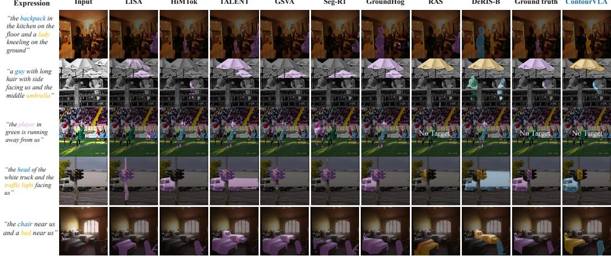  
Figure 4: Qualitative comparison on challenging GRES examples. ContourVLA recovers multiple and part-level referents, preserves fine boundaries, and correctly rejects the no-target case.

## 4.3 ABLATION STUDIES AND ANALYSIS

Closed-loop perception and EASS. Table 2 evaluates spatial sampling, semantic routing, and reobservation on gRefCOCO val. All variants are trained separately under the same SFT protocol, with identical grounding predictions, initial contours, GAD configuration, and evolution budget. The baseline (A) uses vertex sampling with a predefined VLIM layer schedule. Adding SVS (B) or MSR (C) improves both metrics, while their combination (D) raises gIoU from 71.1 to 77.6 and cIoU from 60.8 to 67.4. Freezing the initial EASS readouts across later iterations (E), while contour states and actions continue to evolve, reduces performance to 72.0 gIoU and 61.3 cIoU, supporting the benefit of state-conditioned re-observation.

Effectiveness of DECT-GRPO. Table 3 evaluates RL post-training and transport-derived instancelevel advantage modulation on gRefCOCO val. All RL variants start from the same SFT checkpoint and share training data, rollout settings, transport-based reward, and optimization budget. Shared advantage GRPO sets $\lambda _ { c } = 0 ,$ , while hard-assignment credit replaces soft transport only in credit computation. Shared-advantage GRPO improves over SFT, while full DECT-GRPO gains a further 3.0 gIoU and 5.1 instance F1@0.5 points, supporting instance-level modulation beyond shared rollout feedback. Its gains over hard-assignment credit (1.3 gIoU, 2.0 F1@0.5) further support soft correspondences. Removing dustbins lowers all four metrics, particularly no-target accuracy and instance F1@0.5, supporting dustbin-aware credit assignment for unmatched predictions and targets.

Table 2: Ablation of EASS and re-observation on gRefCOCO val (%). Refresh denotes EASS readout recomputation after contour updates.
<table><tr><td>Variant</td><td>SVS</td><td>MSR</td><td>Refresh</td><td>gIoU ↑</td><td>cIoU ↑</td></tr><tr><td>A: Baseline</td><td>X</td><td>X</td><td>√</td><td>71.1</td><td>60.8</td></tr><tr><td>B: + Spatial sampling</td><td>√</td><td>X</td><td>√</td><td>74.2</td><td>63.5</td></tr><tr><td>C: + Semantic routing</td><td>×</td><td>√</td><td>√</td><td>74.7</td><td>63.1</td></tr><tr><td>D: Full EASS</td><td>√</td><td>√</td><td>√</td><td>77.6</td><td>67.4</td></tr><tr><td>E: Frozen observations</td><td>√</td><td>√</td><td>X</td><td>72.0</td><td>61.3</td></tr></table>

Table 3: Ablation of DECT-GRPO on gRef-COCO val (%). N-acc is no-target accuracy; instance F1@0.5 uses one-to-one mask matching.
<table><tr><td>Variant</td><td>gIoU ↑</td><td>cIoU ↑</td><td>N-acc ↑</td><td>F1@0.5↑</td></tr><tr><td>SFT only</td><td>77.6</td><td>67.4</td><td>74.6</td><td>73.8</td></tr><tr><td>GRPO (shared advantage)</td><td>80.5</td><td>70.1</td><td>78.0</td><td>77.3</td></tr><tr><td>Hard-assignment credit</td><td>82.2</td><td>71.6</td><td>80.9</td><td>80.4</td></tr><tr><td>Dustbin-free credit</td><td>82.4</td><td>71.8</td><td>78.7</td><td>78.6</td></tr><tr><td>Full DECT-GRPO</td><td>83.5</td><td>72.3</td><td>83.2</td><td>82.4</td></tr></table>

Contour evolution and computational cost. Figure 5(a) compares Full EASS (D) and frozen observations (E) under identical grounding predictions and initial contours, reporting cumulative contour latency at action steps 2, 4, and 8. At the matched eight-step action budget, Full EASS improves Boundary IoU by 6.07 points over frozen observations, from 59.91% to 65.98%. Cumulative contour latency increases from 226.96 to 233.63 ms, corresponding to an additional 6.67 ms (2.94%). This comparison supports the benefit of state-conditioned re-observation at matched action budgets with a modest increase in contour-branch latency. Figure 5(b) visualizes the corresponding Full EASS evolution from initial contours to final masks. Detailed evaluation and timing protocols are provided in Appendix A.1.

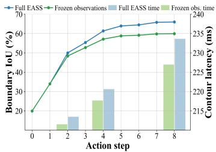  
(a) Quality and latency

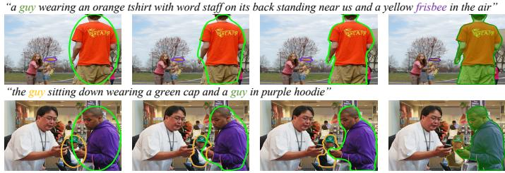  
(b) Contour trajectories  
Figure 5: Contour evolution and latency on a subset of gRefCOCO val. (a) Boundary IoU (lines) and cumulative contour latency at steps 2, 4, and 8 (bars) for Full EASS and frozen observations. (b) Full EASS evolution from initial contours to final masks, with consistent instance colors.

## 5 CONCLUSION

We presented ContourVLA, which recasts GRES as a closed-loop perception–action process in which editable contours guide multimodal perception and evolve through geometric actions. EASS couples contour-guided boundary sampling with multilevel semantic routing, while DECT-GRPO jointly optimizes grounding and contour actions through transport-based rewards and instance-level credit assignment. Among the compared methods, ContourVLA achieves the highest gIoU on all three gRefCOCO splits (by 2.7–8.7 points) and mIoU on all eight RES splits. Ablations further support the benefits of re-observation and instance-level credit, highlighting the value of coupling adaptive perception with explicit geometric refinement.

## REFERENCES

Ruzena Bajcsy. Active perception. Proceedings of the IEEE, 76:966–1005, 1988.

Shengcao Cao, Zijun Wei, Jason Kuen, Kangning Liu, Lingzhi Zhang, Jiuxiang Gu, HyunJoon Jung, Liang-Yan Gui, and Yu-Xiong Wang. Refer to any segmentation mask group with vision-language prompts. In Proceedings of the IEEE/CVF International Conference on Computer Vision, pp. 21853–21863, 2025.

Nicolas Carion, Laura Gustafson, Yuan-Ting Hu, Shoubhik Debnath, Ronghang Hu, Didac Suris Coll-Vinent, Chaitanya Ryali, Kalyan Vasudev Alwala, Haitham Khedr, Andrew Huang, et al. SAM 3: Segment anything with concepts. In International Conference on Learning Representations, volume 2026, pp. 138846–138923, 2026.

Yi-Chia Chen, Wei-Hua Li, Cheng Sun, Yu-Chiang Frank Wang, and Chu-Song Chen. SAM4MLLM: Enhance multi-modal large language model for referring expression segmentation. In European Conference on Computer Vision, pp. 323–340, 2024.

Bowen Cheng, Ross Girshick, Piotr Dollar, Alexander C. Berg, and Alexander Kirillov. Boundary´ IoU: Improving object-centric image segmentation evaluation. In Proceedings of the IEEE/CVF Conference on Computer Vision and Pattern Recognition, pp. 15329–15337, 2021.

Marco Cuturi. Sinkhorn distances: Lightspeed computation of optimal transport. In Advances in Neural Information Processing Systems, volume 26, 2013.

Ming Dai, Wenxuan Cheng, Jiang-jiang Liu, Sen Yang, Wenxiao Cai, Yanpeng Sun, and Wankou Yang. DeRIS: Decoupling perception and cognition for enhanced referring image segmentation through loopback synergy. In Proceedings of the IEEE/CVF International Conference on Computer Vision, pp. 19936–19946, October 2025.

Haowei Guo, Baolong Bi, Ruicheng Zhang, Bingqian Sun, and Wentao Zhang. When should the teacher move? temporal coupling and stability in self on-policy distillation. arXiv preprint arXiv:2606.03532, 2026.

Xinheng Han, Jianfei Wang, Yu Chen, Xiang Wang, Shuai Li, Weixing Li, and Feng Pan. Credit the right box: Marginal contribution assignment for structured visual perception. arXiv preprint arXiv:2608.01055, 2026.

Jingxuan He, Xiyu Wang, Yunke Wang, Mengyu Zheng, and Chang Xu. Early semantic grounding in image editing models for zero-shot referring image segmentation. arXiv preprint arXiv:2605.13122, 2026.

Jiaqi Huang, Zunnan Xu, Jun Zhou, Ting Liu, Yicheng Xiao, Mingwen Ou, Bowen Ji, Xiu Li, and Kehong Yuan. SAM-R1: Leveraging SAM for reward feedback in multimodal segmentation via reinforcement learning. In Advances in Neural Information Processing Systems, volume 38, pp. 138362–138383, 2025.

Shuo Jin, Siyue Yu, Bingfeng Zhang, Chao Yao, Meiqin Liu, and Jimin Xiao. TALENT: Target-aware efficient tuning for referring image segmentation. arXiv preprint arXiv:2604.00609, 2026.

Moo Jin Kim, Karl Pertsch, Siddharth Karamcheti, Ted Xiao, Ashwin Balakrishna, Suraj Nair, Rafael Rafailov, Ethan Foster, Grace Lam, Pannag Sanketi, et al. OpenVLA: An open-source vision-language-action model. arXiv preprint arXiv:2406.09246, 2024.

Namyup Kim, Jinsung Lee, and Suha Kwak. Improving target presence and plurality recognition for generalized referring image segmentation. In Proceedings of the AAAI Conference on Artificial Intelligence, volume 40, pp. 5700–5708, 2026.

Anna Kukleva, Enis Simsar, Alessio Tonioni, Muhammad Ferjad Naeem, Federico Tombari, Jan Eric Lenssen, and Bernt Schiele. RefAM: Attention magnets for zero-shot referral segmentation. Transactions on Machine Learning Research, 2026.

Xin Lai, Zhuotao Tian, Yukang Chen, Yanwei Li, Yuhui Yuan, Shu Liu, and Jiaya Jia. LISA: Reasoning segmentation via large language model. In Proceedings ofthe IEEE/CVF Conference on Computer Vision and Pattern Recognition, pp. 9579–9589, 2024.

Mengcheng Lan, Chaofeng Chen, Yue Zhou, Jiaxing Xu, Yiping Ke, Xinjiang Wang, Litong Feng, and Wei Zhang. Text4Seg: Reimagining image segmentation as text generation. In International Conference on Learning Representations, volume 2025, pp. 1634–1661, 2025.

Jiachen Li, Qing Xie, Renshu Gu, Jinyu Xu, Yongjian Liu, and Xiaohan Yu. LGD: Leveraging generative descriptions for zero-shot referring image segmentation. Pattern Recognition, 172: 112549, 2025a.

Zhang Li, Biao Yang, Qiang Liu, Shuo Zhang, Zhiyin Ma, Liang Yin, Linger Deng, Yabo Sun, Yuliang Liu, and Xiang Bai. LIRA: Inferring segmentation in large multi-modal models with local interleaved region assistance. In Proceedings of the IEEE/CVF International Conference on Computer Vision, pp. 24056–24067, 2025b.

Chang Liu, Henghui Ding, and Xudong Jiang. GRES: Generalized referring expression segmentation. In Proceedings of the IEEE/CVF Conference on Computer Vision and Pattern Recognition, pp. 23592–23601, 2023a.

Jiang Liu, Hui Ding, Zhaowei Cai, Yuting Zhang, Ravi Kumar Satzoda, Vijay Mahadevan, and R. Manmatha. PolyFormer: Referring image segmentation as sequential polygon generation. In Proceedings of the IEEE/CVF Conference on Computer Vision and Pattern Recognition, pp. 18653–18663, 2023b.

Ye Liu, Zongyang Ma, Junfu Pu, Zhongang Qi, Yang Wu, Ying Shan, and Chang Chen. UniPixel: Unified object referring and segmentation for pixel-level visual reasoning. Advances in Neural Information Processing Systems, 38:126078–126108, 2026.

Yuqi Liu, Bohao Peng, Zhisheng Zhong, Zihao Yue, Fanbin Lu, Bei Yu, and Jiaya Jia. Seg-Zero: Reasoning-chain guided segmentation via cognitive reinforcement. arXiv preprint arXiv:2503.06520, 2025a.

Yuqi Liu, Tianyuan Qu, Zhisheng Zhong, Bohao Peng, Shu Liu, Bei Yu, and Jiaya Jia. VisionReasoner: Unified visual perception and reasoning via reinforcement learning. arXiv preprint arXiv:2505.12081, 2025b.

Zhenyu Lu, Liupeng Li, Jinpeng Wang, Haoqian Kang, Yan Feng, Ke Chen, and Yaowei Wang. SegCompass: Exploring interpretable alignment with sparse autoencoders for enhanced reasoning segmentation. arXiv preprint arXiv:2605.22658, 2026.

Haocheng Luo, Jiahui Liu, Ruicheng Zhang, Zhizhou Zhong, Jiaqi Huang, Zunnan Xu, Quan Shi, Jun Zhou, Shuiyang Mao, Wei Liu, et al. Learning visual spatial planning from symbolic state via modality-gap-aware self-distillation. arXiv preprint arXiv:2606.06076, 2026.

Zhuoyan Luo, Yinghao Wu, Tianheng Cheng, Yong Liu, Yicheng Xiao, Hongfa Wang, Xiao-Ping Zhang, and Yujiu Yang. CoHD: A counting-aware hierarchical decoding framework for generalized referring expression segmentation. In Proceedings of the IEEE/CVF International Conference on Computer Vision, pp. 22685–22694, 2025.

Junhua Mao, Jonathan Huang, Alexander Toshev, Oana Camburu, Alan L. Yuille, and Kevin Murphy. Generation and comprehension of unambiguous object descriptions. In Proceedings of the IEEE Conference on Computer Vision and Pattern Recognition, pp. 11–20, 2016.

Sida Peng, Wen Jiang, Huaijin Pi, Xiuli Li, Hujun Bao, and Xiaowei Zhou. Deep snake for real-time instance segmentation. In Proceedings ofthe IEEE/CVF Conference on Computer Vision and Pattern Recognition, pp. 8530–8539, 2020.

Renjie Pi, Lewei Yao, Jiahui Gao, Jipeng Zhang, and Tong Zhang. PerceptionGPT: Effectively fusing visual perception into LLM. In Proceedings of the IEEE/CVF Conference on Computer Vision and Pattern Recognition, pp. 27114–27123, 2024.

Hanoona Rasheed, Muhammad Maaz, Sahal Shaji, Abdelrahman Shaker, Salman Khan, Hisham Cholakkal, Rao M. Anwer, Eric Xing, Ming-Hsuan Yang, and Fahad S. Khan. GLaMM: Pixel grounding large multimodal model. In Proceedings ofthe IEEE/CVF Conference on Computer Vision and Pattern Recognition, pp. 13009–13018, 2024.

Tianhe Ren, Shilong Liu, Ailing Zeng, Jing Lin, Kunchang Li, He Cao, Jiayu Chen, Xinyu Huang, Yukang Chen, Feng Yan, et al. Grounded SAM: Assembling open-world models for diverse visual tasks. arXiv preprint arXiv:2401.14159, 2024.

Paul-Edouard Sarlin, Daniel DeTone, Tomasz Malisiewicz, and Andrew Rabinovich. SuperGlue: Learning feature matching with graph neural networks. In Proceedings ofthe IEEE/CVF Conference on Computer Vision and Pattern Recognition, pp. 4937–4946, 2020.

Zhihong Shao, Peiyi Wang, Qihao Zhu, Runxin Xu, Junxiao Song, Xiao Bi, Haowei Zhang, Mingchuan Zhang, Y. K. Li, Y. Wu, and Daya Guo. DeepSeekMath: Pushing the limits of mathematical reasoning in open language models. arXiv preprint arXiv:2402.03300, 2024.

Hao Tang, Chenwei Xie, Haiyang Wang, Xiaoyi Bao, Tingyu Weng, Pandeng Li, Yun Zheng, and Liwei Wang. UFO: A unified approach to fine-grained visual perception via open-ended language interface. Advances in Neural Information Processing Systems, 38:83761–83791, 2026.

Zixuan Tang, Bin Chen, An Zeng, Mengyuan Liu, and Shen Zhao. Progressive deep snake for instance boundary extraction in medical images. Expert Systems with Applications, 249:123590, 2024.

Shiyan Tong, Jinxia Zhang, Zhiyuan Wang, Hao Tian, Yingying Wang, Kanjian Zhang, and Haikun Wei. RefChess: Training-free contextual search for zero-shot referring image segmentation. In Proceedings ofthe International Conference on Machine Learning, 2026.

Ruiqi Wang and Hao Zhang. Resanything: Attribute prompting for arbitrary referring segmentation. Advances in Neural Information Processing Systems, 38:66893–66944, 2026.

Shihao Wang, Shilong Liu, Yuanguo Kuang, Xinyu Wei, Yangzhou Liu, Zhiqi Li, Yunze Man, Guo Chen, Andrew Tao, Guilin Liu, Jan Kautz, Lei Zhang, and Zhiding Yu. LocateAnything: Fast and high-quality vision-language grounding with parallel box decoding. In European Conference on Computer Vision, pp. 336–357, 2026.

Tao Wang, Changxu Cheng, Lingfeng Wang, Senda Chen, and Wuyue Zhao. HiMTok: Learning hierarchical mask tokens for image segmentation with large multimodal model. In Proceedings ofthe IEEE/CVF International Conference on Computer Vision, pp. 23267–23278, 2025a.

Wenxuan Wang, Tongtian Yue, Yisi Zhang, Longteng Guo, Xingjian He, Xinlong Wang, and Jing Liu. Unveiling parts beyond objects: Towards finer-granularity referring expression segmentation. Proceedings of the IEEE/CVF Conference on Computer Vision and Pattern Recognition, pp. 12998–13008, 2024.

Xudong Wang, Shaolun Zhang, Shufan Li, Konstantinos Kallidromitis, Kehan Li, Yusuke Kato, Kazuki Kozuka, and Trevor Darrell. SegLLM: Multi-round reasoning segmentation with large language models. In International Conference on Learning Representations, volume 2025, pp. 56526–56547, 2025b.

Cong Wei, Haoxian Tan, Yujie Zhong, Yujiu Yang, and Lin Ma. LaSagnA: Language-based segmentation assistant for complex queries. arXiv preprint arXiv:2404.08506, 2024.

Zhuofan Xia, Dongchen Han, Yizeng Han, Xuran Pan, Shiji Song, and Gao Huang. GSVA: Generalized segmentation via multimodal large language models. In Proceedings ofthe IEEE/CVF Conference on Computer Vision and Pattern Recognition, pp. 3858–3869, 2024.

Zunnan Xu, Jiaqi Huang, Ting Liu, Yong Liu, Haonan Han, Kehong Yuan, and Xiu Li. Enhancing fine-grained multi-modal alignment via adapters: a parameter-efficient training framework for referring image segmentation. In 2nd Workshop on Advancing Neural Network Training: Computational Efficiency, Scalability, and Resource Optimization (WANT@ ICML 2024), 2024.

Mingliang Yan, Yanhua Yu, Ruochi Zhang, Zhiyuan Liu, Ruicheng Zhang, Yimeng Ren, Kangkang Lu, Zhiyong Huang, Feng Luo, and Zhen Cai. Deepmoltex: Deep alignment of molecular graphs with large language models via mixture of modality experts. In Proceedings of the 33rd ACM International Conference on Multimedia, pp. 2323–2332, 2025.

Zhao Yang, Jiaqi Wang, Yansong Tang, Kai Chen, Hengshuang Zhao, and Philip H. S. Torr. LAVT: Language-aware vision transformer for referring image segmentation. In Proceedings of the IEEE/CVF Conference on Computer Vision and Pattern Recognition, pp. 18134–18144, 2022.

Zuyao You and Zuxuan Wu. Seg-R1: Segmentation can be surprisingly simple with reinforcement learning. arXiv preprint arXiv:2506.22624, 2025.

Licheng Yu, Patrick Poirson, Shan Yang, Alexander C. Berg, and Tamara L. Berg. Modeling context in referring expressions. In European Conference on Computer Vision, pp. 69–85, 2016.

Ruicheng Zhang, Haowei Guo, Kanghui Tian, Jun Zhou, Mingliang Yan, Zeyu Zhang, and Shen Zhao. Unified medical image segmentation with state space modeling snake. In Proceedings of the 33rd ACM International Conference on Multimedia, MM ’25, pp. 7825–7834, New York, NY, USA, 2025a. Association for Computing Machinery. ISBN 9798400720352. doi: 10.1145/3746027.3755148. URL https://doi.org/10.1145/3746027.3755148.

Ruicheng Zhang, Haowei Guo, Zeyu Zhang, Puxin Yan, and Shen Zhao. GAMED-Snake: Gradient-aware adaptive momentum evolution deep snake model for multi-organ segmentation. In 2025 IEEE International Conference on Multimedia and Expo, pp. 1–6, 2025b. doi: 10.1109/ICME59968.2025.11209898.

Ruicheng Zhang, Yu Sun, Zeyu Zhang, Jinai Li, Xiaofan Liu, Hoi Fan Au, Haowei Guo, and Puxin Yan. MARL-MambaContour: Unleashing multi-agent deep reinforcement learning for active contour optimization in medical image segmentation. In Proceedings ofthe 33rd ACM International Conference on Multimedia, MM ’25, pp. 7815–7824, New York, NY, USA, 2025c. Association for Computing Machinery. ISBN 9798400720352. doi: 10.1145/3746027.3755147. URL https://doi.org/10.1145/3746027.3755147.

Ruicheng Zhang, Mingyang Zhang, Jun Zhou, Xiaofan Liu, Zunnan Xu, Zhizhou Zhong, Puxin Yan, Haocheng Luo, and Xiu Li. Mind-v: Hierarchical world model for long-horizon robotic manipulation with rl-based physical alignment. arXiv preprint arXiv:2512.06628, 2025d.

Ruicheng Zhang, Guangyu Chen, Zunnan Xu, Zihao Liu, Zhizhou Zhong, Mingyang Zhang, Jun Zhou, and Xiu Li. Robostereo: Dual-tower 4d embodied world models for unified policy optimization. arXiv preprint arXiv:2603.12639, 2026a.

Ruicheng Zhang, Kaixi Cong, Jun Zhou, Zhizhou Zhong, Zunnan Xu, Shuiyang Mao, Wei Liu, and Xiu Li. Kvpo: Ode-native grpo for autoregressive video alignment via kv semantic exploration. arXiv preprint arXiv:2605.14278, 2026b.

Ruicheng Zhang, Jianhui Lei, Kaiwen Shen, Haowei Guo, Jun Zhou, Bin Chen, Mengtang Li, Shen Zhao, and Shuo Li. Teams: Text-prompted spatiotemporal dual-head mamba snake. Medical Image Analysis, pp. 104277, 2026c.

Tao Zhang, Xiangtai Li, Hao Fei, Haobo Yuan, Shengqiong Wu, Shunping Ji, Chen Change Loy, and Shuicheng Yan. OMG-LLaVA: Bridging image-level, object-level, pixel-level reasoning and understanding. In Advances in Neural Information Processing Systems, volume 37, pp. 71737–71767, 2024a.

Yichi Zhang, Ziqiao Ma, Xiaofeng Gao, Suhaila Shakiah, Qiaozi Gao, and Joyce Chai. GROUNDHOG: Grounding large language models to holistic segmentation. Proceedings of the IEEE/CVF Conference on Computer Vision and Pattern Recognition, pp. 14227–14238, 2024b.

Shen Zhao, Jinhong Wang, Xinxin Wang, Yikang Wang, Hanying Zheng, Bin Chen, An Zeng, Fuxin Wei, Sadeer Al-Kindi, and Shuo Li. Attractive deep morphology-aware active contour network for vertebral body contour extraction with extensions to heterogeneous and semi-supervised scenarios. Medical Image Analysis, 89:102906, 2023a.

Tony Z. Zhao, Vikash Kumar, Sergey Levine, and Chelsea Finn. Learning fine-grained bimanual manipulation with low-cost hardware. In Proceedings ofRobotics: Science and Systems, 2023b.

## A ADDITIONAL IMPLEMENTATION AND EXPERIMENTAL DETAILS

## A.1 TRAINING AND EVALUATION PROTOCOL

The complete training pipeline comprises grounding pretraining followed by the two-stage contourpolicy training described in the main text: supervised fine-tuning (SFT) and DECT-GRPO posttraining. Across these three chronological stages, ContourVLA progressively acquires referent grounding, geometric contour control, and joint grounding-action optimization. The visual and language backbones are initialized from MoonViT and Qwen2.5-3B-Instruct, respectively.

Stage I: Grounding and Detection. We first train VLIM on LocateAnything-Data (Wang et al., 2026), a large-scale mixture of object detection and vision-language grounding tasks. Stage I contains 139M training instances; Figure 6 summarizes their composition. Detection provides most of the supervision, while UI, referring, OCR, layout, and pointing data contribute complementary signals for fine-grained, language-conditioned localization. This stage adapts the initialized multimodal backbone to structured referent localization. VLIM learns to produce language-conditioned grounding outputs, including bounding boxes and no-target responses, while retaining the general visual-language representations inherited from pretraining. Because LocateAnything-Data primarily provides localization annotations, Stage I trains grounding and detection rather than contour actions.

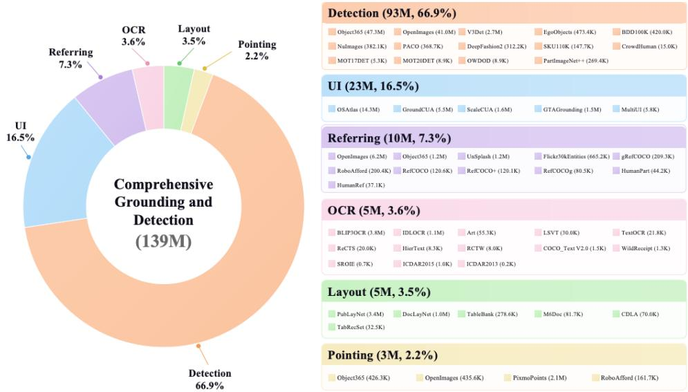  
Figure 6: Composition of the 139M LocateAnything-Data training instances used in Stage I. The mixture contains detection (66.9%), UI (16.5%), referring (7.3%), OCR (3.6%), layout (3.5%), and pointing (2.2%) data.

Stage II: Supervised Contour Fine-Tuning. Starting from the Stage-I checkpoint, we perform SFT jointly on the training sets of gRefCOCO (Liu et al., 2023a), RefCOCO and RefCOCO+ (Yu et al., 2016), and RefCOCOg (Mao et al., 2016) to initialize the contour-based perception-action policy. Ground-truth boxes supervise VLIM grounding, and segmentation masks are converted into aligned contour targets for GAD. Perturbed copies of the ground-truth boxes initialize the contouraction branch, after which reference contour trajectories supervise the evolution from these initial states toward the target boundaries.

This stage jointly establishes referent grounding and geometric action prediction. Auxiliary geometric and routing objectives stabilize contour evolution and EASS optimization, as detailed in Appendix A.6. The resulting checkpoint initializes DECT-GRPO post-training.

Stage III: DECT-GRPO Post-Training. The final stage applies DECT-GRPO to the same fourdataset training mixture, initialized from the Stage-II checkpoint. For each image-expression pair,

Table 4: Complete training pipeline of ContourVLA. The four-dataset mixture comprises the training sets of gRefCOCO, RefCOCO, RefCOCO+, and RefCOCOg.
<table><tr><td>Stage</td><td>Training data</td><td>Supervision and objective</td></tr><tr><td>I. Grounding</td><td>LocateAnything-Data</td><td>Boxes and grounding responses; comprehensive grounding and detection pretraining.</td></tr><tr><td>II. Contour SFT</td><td>Four-dataset mixture</td><td>Boxes, masks, and aligned contour trajectories; joint grounding and geometric-action learning.</td></tr><tr><td>III. DECT-GRPO</td><td>Four-dataset mixture</td><td>Final segmentation feedback; joint optimization of the grounding and contour-action policies.</td></tr></table>

VLIM samples discrete grounding outputs that define the initial contours, and GAD then samples continuous geometric action trajectories. The final contours are rasterized into segmentation masks and evaluated by dustbin-augmented entropic transport.

The resulting transport plan provides both a transport-based rollout reward and instance-level credit maps. The reward is used to compute the shared group-relative advantage, whereas the credit maps assign instance-specific corrections to the corresponding grounding tokens and contour actions. DECT-GRPO therefore jointly optimizes the autoregressive grounding policy and the continuous contour-action policy from final segmentation feedback, without retaining the supervised contour losses used in Stage II.

Data splits and checkpoint evaluation. Stage I performs grounding and detection pretraining on the 139M-instance LocateAnything-Data corpus. To prevent benchmark information leakage, entries originating from gRefCOCO, RefCOCO, RefCOCO+, or RefCOCOg are restricted to their official training splits; no validation or test annotations or expressions from these benchmarks are used during training. For Stages II and III, we likewise pool only the designated training splits of the four benchmarks, retaining the same data mixture for SFT and DECT-GRPO. After Stage III, a single checkpoint is evaluated on all validation and test splits without further adaptation to individual benchmarks.

Mask-level metrics. Each image-expression pair is treated as one evaluation sample. Predicted instance masks are merged by union, and the target mask is the union of all instances referred to by the expression. For RES, mIoU averages foreground IoU over the evaluated samples. For GRES, gIoU extends this average to no-target samples (Liu et al., 2023a): an empty prediction receives a score of one when the target is empty, whereas a nonempty prediction receives zero. An empty prediction for a nonempty target also receives zero. The cIoU metric divides the summed intersection area by the summed union area over the evaluated split. Correct empty predictions contribute zero to both sums, while foreground predictions on no-target samples contribute to the union.

No-target accuracy. N-acc is the percentage of ground-truth no-target samples for which the predicted mask contains no foreground pixels. Its denominator includes only no-target samples, rather than the full evaluation set.

Instance-level evaluation. Instance F1@0.5 is computed from individual instance masks before union. For each expression, we construct a one-to-one matching that maximizes the number of prediction-target pairs with mask IoU of at least 0.5. Matched pairs are true positives (TP); unmatched predictions and targets are false positives (FP) and false negatives (FN), respectively. Counts are accumulated over all evaluated expressions, and

$$
\mathrm { F 1 @ 0 . 5 = \frac { 2 \sum T P } { 2 \sum T P + \sum F P + \sum F N } . }\tag{16}
$$

For no-target expressions, predicted instances contribute false positives, while a correct empty prediction contributes no counts. For expressions with targets but no predictions, all targets contribute false negatives. The final score is reported as a percentage.

Boundary evaluation. For Figure 5, Boundary IoU (bIoU) (Cheng et al., 2021) is evaluated at the original image resolution on the same fixed subset of gRefCOCO validation expressions containing targets. At each action step, the predicted contours are rasterized and merged by union; the groundtruth instance masks are merged in the same way. Boundary regions are extracted by subtracting an eroded mask from the original mask, using $\mathbf { 1 3 \times 3 }$ kernel with

$$
r = \operatorname* { m a x } \biggl ( 1 , \mathrm { r o u n d } \left( 0 . 0 2 \sqrt { H ^ { 2 } + W ^ { 2 } } \right) \biggr )\tag{17}
$$

erosion iterations, where H and $W$ are the original image dimensions. Zero padding accounts for boundaries touching the image border. Boundary IoU is the intersection-over-union of the predicted and ground-truth boundary regions, averaged over expressions and reported as a percentage. Samples with no predicted mask receive zero and remain in the average at every step. This evaluation operates on expression-level union masks and does not require instance matching.

Latency protocol. For Figure 5(a), Full EASS and frozen observations use identical grounding predictions and initial contours, with two evolution iterations and four action steps per iteration. Cumulative contour latency is measured at action steps 2, 4, and 8 on the shared subset with predicted boxes. The step-2 measurement includes the cost of predicting the complete first four-step action chunk and executing its first two residual steps. Timing includes contour-branch preparation, EASS readouts, GAD execution, and contour updates, while excluding image encoding, grounding generation, and mask rasterization. Intermediate contours are recorded from each model’s complete inference run.

## A.2 ADDITIONAL QUALITATIVE COMPARISONS

Figures 7 and 8 provide additional side-by-side comparisons on challenging referring expressions, complementing the quantitative evaluation in the main text.

Figure 7 examines plural fruit referents, an absent target, and a multi-referent expression combining visual attributes and spatial relations. Different mask colors distinguish referred instances, while “No Target” denotes an empty prediction. These examples jointly test referent-set completeness, false-positive suppression, and boundary quality.

Figure 8 focuses on numerical and spatial constraints for multiple suitcases and on a heterogeneous object–person query involving a pot and a person. Together with Figure 7, it covers plural and multi-instance descriptions, heterogeneous referents, and the no-target case.

## A.3 OUT-OF-DISTRIBUTION VIDEO SEGMENTATION

To examine qualitative robustness beyond the image benchmarks, we apply the trained ContourVLA checkpoint to sampled frames from four out-of-distribution video examples. Figure 9 shows predictions in temporal order for the query displayed at the left of each panel. Across object manipulation, hand–object interaction, and human motion, the predicted masks generally remain aligned with the referred regions despite changes in pose, position, appearance, and partial occlusion. This experiment provides a qualitative OOD assessment and does not report video-level temporal-consistency metrics.

## A.4 STATE DESCRIPTORS AND DECODER INITIALIZATION

Seven-dimensional routing state. The implementation instantiates the factors $( g _ { i } , c _ { i } ^ { k } , r ^ { k } )$ in equation 5 with a seven-dimensional state descriptor: log box aspect ratio, log box area, normalized point allocation, contour irregularity, normalized evolution index, and the mean and maximum displacement from the preceding evolution iteration. Contour irregularity is the coefficient of variation of the vertex radii about the box center in box-relative coordinates. Displacements are also normalized by box width and height. All statistics exclude padded vertices, and the two displacement entries are set to zero at the initial iteration. For fixed boxes and point allocations, the first three descriptors remain constant across iterations and encode instance characteristics rather than evolution progress.

Initialization and routing regularization. Within $f _ { q } ,$ the final projection of the state-dependent component is zero-initialized. Consequently, the initial query is determined by the evolution-depth slot embedding, while the state-dependent offset is introduced gradually during training. The output projection of the residual semantic-attention branch is also zero-initialized, so the initial GAD block preserves its spatial and instance-context pathway. During SFT, aggregate-usage, maximumprobability, and expected-depth regularizers constrain the router as specified in equation 35. During DECT-GRPO, EASS is optimized through the action likelihood and the straight-through routing path, without an additional router loss.

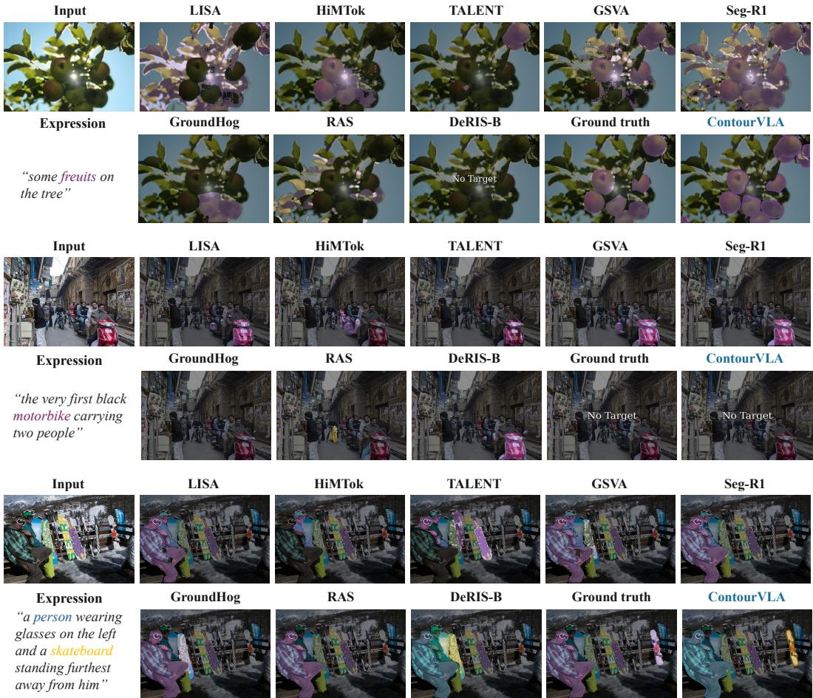  
Figure 7: Qualitative comparisons on plural, no-target, and relational referring expressions.

Routing-score scale. In equation $^ { 6 , }$ normalized queries and keys yield dot products in $[ - 1 , 1 ]$ When the prior weight is zero, the largest soft routing probability is bounded by

$$
\operatorname* { m a x } _ { \ell } p _ { i , \ell } ^ { k , d } \leq \frac { \exp ( 2 ) } { \exp ( 2 ) + | \mathcal L | - 1 } .\tag{18}
$$

The forward argmax still selects a single layer, but the bound limits the attainable value of a confidence objective defined on the soft probabilities. Equation 6 uses neither a routing temperature nor an additional logit scale.

## A.5 COORDINATE CONVENTIONS AND ACTION-CHUNK EXECUTION

Box-normalized normal-direction sampling. All image coordinates are normalized to $[ 0 , 1 ] ^ { 2 }$ For box $b _ { i } = ( x _ { i } ^ { 1 } , y _ { i } ^ { 1 } , x _ { i } ^ { 2 } , y _ { i } ^ { 2 } )$ , define its origin $\bar { \boldsymbol { q } _ { i } } = ( x _ { i } ^ { 1 } , y _ { i } ^ { 1 } )$ and anisotropic scale matrix

$$
D _ { i } = \mathrm { d i a g } ( w _ { i } , h _ { i } ) , \qquad { \overline { { c } } } _ { i , p } ^ { k } = D _ { i } ^ { - 1 } ( c _ { i , p } ^ { k } - q _ { i } ) .\tag{19}
$$

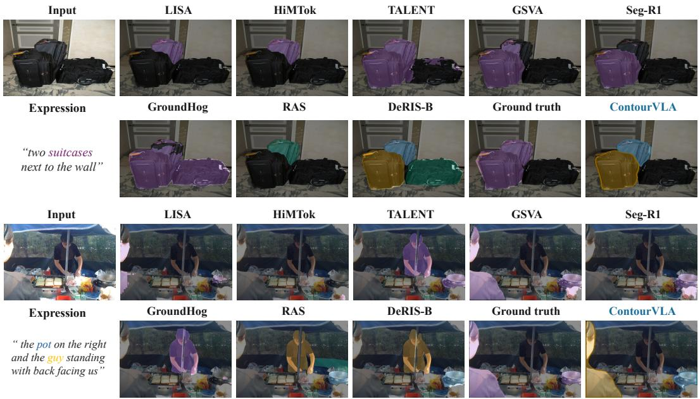

Figure 8: Qualitative comparisons on numerical, spatial, and heterogeneous queries.  
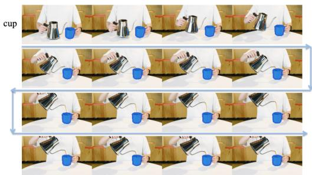  
(a)

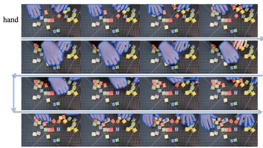

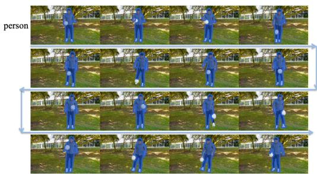  
(c)

(b)  
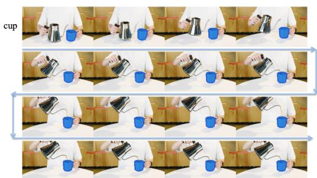  
(d)  
Figure 9: Qualitative segmentation on out-of-distribution videos. Panels (a)–(d) show sampled frames in temporal order, indicated by the arrows. The referring query is displayed at the left of each panel.

The cyclic central-difference tangent and outward unit normal are computed in this box-normalized coordinate system:

$$
\overline { { \tau } } _ { i , p } ^ { k } = \overline { { c } } _ { i , p + 1 } ^ { k } - \overline { { c } } _ { i , p - 1 } ^ { k } , \qquad n _ { i , p } ^ { k } = \frac { R _ { \mathrm { o u t } } \overline { { \tau } } _ { i , p } ^ { k } } { \operatorname* { m a x } ( \Vert \overline { { \tau } } _ { i , p } ^ { k } \Vert _ { 2 } , 1 0 ^ { - 6 } ) } ,\tag{20}
$$

where $R _ { \mathrm { o u t } }$ rotates the tangent by $- \pi / 2$ for a counterclockwise contour and by $+ \pi / 2$ for a clockwise contour. Indices are cyclic, and the contour orientation is determined from its signed area. The

Table 5: Default spatial sampling, action execution, and optimization configuration. Stage-II and Stage-III batch sizes are global.
<table><tr><td>Component</td><td>Setting</td><td>Interpretation</td></tr><tr><td>Input / feature grid</td><td> $8 9 6 \times 8 9 6 / 5 6 \times 5 6$ </td><td>Fixed-resolution input and stride-16 VLIM grid</td></tr><tr><td>Contour vertices</td><td> $P _ { i } \in [ 6 4 , 1 2 8 ]$ </td><td>Perimeter-adaptive valid-point count</td></tr><tr><td>Spatial offsets</td><td> $J = 4 ,$   $\{ o _ { j } \} = \{ 1 / 6 4 , 1 / 3 2 , 1 / 1 6 , 1 / 8 \}$ </td><td>Fractions of box-normalized distance on each side</td></tr><tr><td>GAD depth</td><td> $\dot { D } = 6 { } 6 \mathrm { b i o c k s }$ </td><td>One routed semantic feature per block</td></tr><tr><td>Action horizon</td><td> $K = 2 { \mathrm { c h u n k s } } , T = 4 { \mathrm { s t e p s / c h u n k } }$ </td><td>Eight action steps, with re-observation between the two chunks.</td></tr><tr><td>Action bound</td><td> $\delta _ { \mathrm { m a x } } = 0 . 0 5$ </td><td>Per-axis bound in normalized-box coordinates</td></tr><tr><td>VLIM adaptation</td><td>LoRA rank 64, α = 128, dropout 0.05</td><td>Applied to attention Q/K/V/O and MLP gate/up/down projections</td></tr><tr><td>Stage-II SFT</td><td>30k steps; batch  $1 2 8 ; { \mathrm { L R ~ 2 } } \times 1 0 ^ { - 5 }$  (LoRA) and  $1 \times 1 0 ^ { - 4 } \ ( \mathrm { E A S S / G A D } )$ </td><td>Four-dataset joint supervised training</td></tr><tr><td>Stage-III DECT-GRPO</td><td>8k updates; 32 input groups/update;  $G = \mathrm { { \hat { 8 } } ; L R 5 \times 1 0 ^ { - 6 } \ \mathrm { { \bar { ( L o R A ) } } } }$  and</td><td>One update per sampled rollout group</td></tr><tr><td>Grounding sampling</td><td> $2 \times 1 0 ^ { - 5 } \left( \mathrm { E A S S / G A D } \right)$  temperature [0.65, 0.75], top-p = 0.95</td><td>Grouped rollout diversity with fixed</td></tr><tr><td>Optimizer</td><td> $\mathrm { A d a m W } , ( \beta _ { 1 } , \beta _ { 2 } ) = ( 0 . 9 , 0 . 9 5 ) ,$ </td><td>nucleus threshold Cosine decay, 3% warmup, gradient</td></tr><tr><td>Numerics</td><td>weight decay 0.01 bfloat16 with float32 rewards and</td><td>clipping at 1.0 Mixed-precision policy optimization</td></tr></table>

sampling coordinates used in equation 3 are therefore

$$
s _ { i , p , j } ^ { k , \pm } = c _ { i , p } ^ { k } \pm o _ { j } D _ { i } n _ { i , p } ^ { k } = c _ { i , p } ^ { k } \pm o _ { j } \left( n _ { i , p } ^ { k } \odot ( w _ { i } , h _ { i } ) \right) .\tag{21}
$$

This is strict normal sampling in the normalized-box domain and box-scale-normalized directional sampling in the image domain. Under anisotropic scaling, $D _ { i } n _ { i , p } ^ { k }$ need not be parallel to the Euclidean image-space normal; the latter would instead be proportional to $D _ { i } ^ { - \top } n _ { i , p } ^ { k }$ and is not used here. Before bilinear interpolation, $s = ( s _ { x } , s _ { y } )$ is mapped to feature-grid coordinates $( ( W _ { F } - 1 ) s _ { x } , ( H _ { F } - 1 ) s _ { y } )$ and clipped to the valid grid boundary.

Chunk prediction and state transition. At closed-loop iteration $k ,$ EASS is evaluated once on $C _ { i } ^ { k , 0 } = C _ { i } ^ { k }$ . Conditioned on this observation, GAD predicts the entire chunk $A _ { i } ^ { k } = \{ a _ { i , p } ^ { k , t } \} _ { p = 1 , t = 1 } ^ { P _ { i } , T }$ in parallel. Each bounded action is a residual in box-normalized coordinates:

$$
a _ { i , p } ^ { k , t } = \delta _ { \operatorname* { m a x } } \operatorname { t a n h } ( u _ { i , p } ^ { k , t } ) , \qquad { \overline { { c } } } _ { i , p } ^ { k , t } = { \overline { { c } } } _ { i , p } ^ { k , t - 1 } + a _ { i , p } ^ { k , t } ,\tag{22}
$$

or, equivalently,

$$
c _ { i , p } ^ { k , t } = c _ { i , p } ^ { k , t - 1 } + D _ { i } a _ { i , p } ^ { k , t } .\tag{23}
$$

The $T$ residual fields are executed sequentially without refreshing visual or semantic observations inside the chunk. Coordinates are clipped to the image domain, while vertex ordering and valid-point counts remain fixed. After the final within-chunk step, $C _ { i } ^ { k + 1 } = C _ { i } ^ { k , T }$ ; normals, spatial samples, routing queries, and GAD observations are then recomputed before predicting the next chunk. Thus, $T$ controls the open-loop action horizon, whereas $K$ controls the number of perception-action cycles. Deterministic SFT and inference use $u = \mu ;$ DECT-GRPO samples u according to equation 39.

Centralized implementation configuration. Table 5 reports the default geometry and optimization settings. With $K = 2$ and $T = 4 .$ , the policy executes eight action steps and re-observes the contour after every four steps. Since $\delta _ { \mathrm { m a x } } = 0 . 0 5$ , one step can move a vertex by at most 5% of the box width and height along the two normalized coordinate axes.

## A.6 SUPERVISED TARGETS AND LOSS DETAILS

Grounding targets and initial contours. SFT uses teacher-forced grounding answers constructed from quantized and subsequently dequantized ground-truth boxes. A separate copy of each box is perturbed to initialize the contour-action branch; the grounding targets themselves are not jittered. Each perturbed box initializes an elliptical contour with 64-128 valid vertices, and the corresponding ground-truth boundary is resampled by arc length to the same number of vertices. The perturbation magnitude increases linearly from 0.05 to 0.10 during the first 3,000 optimization steps.

Reference contour trajectories. Let $\Gamma _ { i }$ be the resampled ground-truth contour. We align it to $C _ { i } ^ { 0 }$ by minimizing squared vertex distances over cyclic shifts and both traversal directions, denoted by $\mathcal { P } _ { \mathrm { c y c } }$

$$
\pi _ { i } ^ { \star } = \arg \operatorname* { m i n } _ { \pi \in \mathcal { P } _ { \mathrm { c y c } } } \sum _ { p = 1 } ^ { P _ { i } } \| \Gamma _ { i , \pi ( p ) } - c _ { i , p } ^ { 0 } \| _ { 2 } ^ { 2 } , \qquad c _ { i , p } ^ { \star } = \Gamma _ { i , \pi _ { i } ^ { \star } ( p ) } .\tag{24}
$$

This operation fixes the within-instance vertex correspondence and is distinct from the inter-instance transport used by DECT-GRPO. At evolution iteration k, the reference position for action step t interpolates from the iteration’s actual starting contour to the aligned target:

$$
\widetilde { C } _ { i } ^ { k , t } = \mathrm { s g } ( C _ { i } ^ { k } ) + \frac { t } { T } \big ( C _ { i } ^ { \star } - \mathrm { s g } ( C _ { i } ^ { k } ) \big ) .\tag{25}
$$

The references in equation 25 provide soft positional supervision through equation 29, rather than executable expert-action trajectories. The predicted contour remains subject to the bounded transitions in equation 22-equation 23, so these references are not guaranteed to be reachable within every chunk. Reaching the aligned target at each chunk endpoint is therefore a supervision objective, not a hard constraint. The stop-gradient operator is applied only when constructing the reference. The predicted contour trajectory itself remains connected across iterations, so later trajectory losses can backpropagate through earlier contour updates.

Smooth $\scriptstyle 1 \cdot \ell _ { 1 }$ and trajectory weights. For a scalar residual, the smooth- $\cdot \ell _ { 1 }$ penalty is

$$
h _ { \beta } ( r ) = \{ { { r ^ { 2 } } / { ( 2 \beta ) } } , \quad | r | < \beta , \qquad \beta = 0 . 0 5 .\tag{26}
$$

With $k = 0 , \ldots , K - 1$ and $t = 1 , \dots , T$ , the time weights in equation 29 are

$$
\omega _ { k , t } = \frac { ( ( k T + t ) / ( K T ) ) ^ { \gamma } } { \sum _ { k ^ { \prime } = 0 } ^ { K - 1 } \sum _ { t ^ { \prime } = 1 } ^ { T } ( ( k ^ { \prime } T + t ^ { \prime } ) / ( K T ) ) ^ { \gamma } } , \qquad \gamma = 1 .\tag{27}
$$

These weights sum to one over all evolution iterations and action steps. To emphasize vertices that must travel farther, we define box-normalized distances from the initial contour:

$$
\begin{array} { r l } & { d _ { i , p } = \lVert ( c _ { i , p } ^ { \star } - c _ { i , p } ^ { 0 } ) \oslash b _ { i } ^ { \mathrm { s i z e } } \rVert _ { 2 } , \qquad \overline { { d } } _ { i } = P _ { i } ^ { - 1 } \sum _ { p } d _ { i , p } , } \\ & { v _ { i , p } ^ { \prime } = 1 + \lambda _ { \mathrm { t r a v e l } } \frac { d _ { i , p } } { \operatorname* { m a x } \left( \overline { { d } } _ { i } , \epsilon _ { \mathrm { n u m } } \right) } , \qquad v _ { i , p } = \frac { v _ { i , p } ^ { \prime } } { P _ { i } ^ { - 1 } \sum _ { q = 1 } ^ { P _ { i } } v _ { i , q } ^ { \prime } } , } \end{array}\tag{28}
$$

where $\lambda _ { \mathrm { t r a v e l } } = 1$ and $\epsilon _ { \mathrm { { n u m } } } > 0$ prevents division by zero. All averages exclude padded vertices. Normalizing $v _ { i , p }$ to unit mean preserves the average weight of each instance, and equation 29 weights instances equally rather than in proportion to their vertex counts.

Trajectory supervision. Let $\mathcal { T }$ contain instances with valid target contours. Their box-normalized residual and trajectory loss are

$$
\begin{array} { l } { { \displaystyle r _ { i , k , t , p } = ( c _ { i , p } ^ { k , t } - \widetilde { c } _ { i , p } ^ { k , t } ) \oslash b _ { i } ^ { \mathrm { s i z e } } , } } \\ { { \displaystyle \mathcal { L } _ { \mathrm { t r a j } } = \frac { 1 } { | \mathcal { T } | } \sum _ { i \in \mathcal { T } } \frac { 1 } { P _ { i } } \sum _ { p = 1 } ^ { P _ { i } } v _ { i , p } \sum _ { k , t } \omega _ { k , t } \sum _ { d \in \{ x , y \} } h _ { 0 . 0 5 } ( r _ { i , k , t , p , d } ) . } } \end{array}\tag{29}
$$

Box dimensions are lower-bounded before normalization. The temporal weights emphasize later actions, while the unit-mean travel weights emphasize vertices farther from their aligned targets.

Region supervision. At the end of each evolution iteration, we differentiably rasterize the predicted contour within an expanded region of interest (ROI) and compare it with the ground-truth mask rasterized in the same ROI:

$$
{ \mathcal { L } } _ { \mathrm { r e g i o n } } = { \frac { \sum _ { k = 0 } ^ { K - 1 } \eta _ { k } \mathrm { M e a n } _ { i \in { \mathcal { I } } } \left[ 1 - \mathrm { S o f t I o U } \left( { \mathcal { R } } _ { \mathrm { s o f t } } ( C _ { i } ^ { k , T } ) , Y _ { i } ^ { \mathrm { R O I } } \right) \right] } { \sum _ { k = 0 } ^ { K - 1 } \eta _ { k } } } , \qquad \eta _ { k } = { \frac { k + 1 } { K } } .\tag{30}
$$

The soft-rasterization temperature is 0.0025. Unlike the mask evaluation used to construct the RL reward, this operation is differentiable with respect to the predicted contour.

Final-contour regularization. Let $X _ { i , p } = c _ { i , p } ^ { K } \oslash b _ { i } ^ { \mathrm { s i z e } }$ and use cyclic adjacency within each instance’s valid point count. Smoothness penalizes deviation from the midpoint of neighboring vertices:

$$
\mathcal { L } _ { \mathrm { s m o o t h } } = \mathrm { M e a n } _ { i , p } \left\| X _ { i , p } - \frac { X _ { i , p - 1 } + X _ { i , p + 1 } } { 2 } \right\| _ { 1 } .\tag{31}
$$

With $l _ { i , p } = \lVert X _ { i , p + 1 } - X _ { i , p } \rVert _ { 2 }$ and $\begin{array} { r } { \bar { l } _ { i } = P _ { i } ^ { - 1 } \sum _ { p } l _ { i , p } } \end{array}$ , the spacing penalty is

$$
\mathcal { L } _ { \mathrm { s p a c i n g } } = \mathrm { M e a n } _ { i } \frac { 1 } { P _ { i } } \sum _ { p = 1 } ^ { P _ { i } } ( l _ { i , p } - \bar { l } _ { i } ) ^ { 2 } .\tag{32}
$$

This term promotes uniform edge lengths within each contour without imposing a common absolute spacing across objects. Both regularizers are applied only to the final contour.

Auxiliary signed-distance supervision. For locations q on a $1 6 \times 1 6$ grid in each object ROI, let $d _ { i } ^ { \star } ( q ) \ { = } \ \mathrm { \bar { S } D F } ( q , C _ { i } ^ { \star } )$ denote the target signed distance. We normalize it by $r _ { i } = \operatorname* { m a x } ( ( w _ { i } +$ $h _ { i } ) / \bar { 2 } , \bar { 1 0 } ^ { - 3 } )$ and truncate only the target:

$$
\begin{array} { r l r } & { \widetilde { d } _ { i } ( q ) = \mathrm { c l i p } ( d _ { i } ^ { \star } ( q ) / r _ { i } , - \tau _ { \mathrm { s d f } } , \tau _ { \mathrm { s d f } } ) , } & { \tau _ { \mathrm { s d f } } = 0 . 2 5 , } \\ & { \mathcal { L } _ { \mathrm { S D F } } = \mathrm { M e a n } _ { i , q } h _ { \beta } \Big ( \widehat { d } _ { i } ( q ) / r _ { i } - \widetilde { d } _ { i } ( q ) \Big ) . } & \end{array}\tag{33}
$$

The predicted distance is not clipped, which preserves gradients outside the target truncation interval.

Grounding supervision. Let S collect supervised answer-token positions. The teacher-forced grounding objective is

$$
\mathcal { L } _ { \mathrm { g r o u n d } } = - \frac { 1 } { | \cal S | } \sum _ { n \in \cal S } \log \pi _ { \theta } ^ { y } ( y _ { n } ^ { \star } \mid I , x , y _ { < n } ^ { \star } ) .\tag{34}
$$

Supervised positions include coordinate tokens, structural tags, no-target responses, and the endof-sequence token. Prompt positions are excluded, and copied expression tokens inside <ref> tags are masked by default. The target coordinates are obtained from the annotated boxes before geometric perturbation. If an example contains no valid target contour, the geometric losses provide no contour-learning signal, whereas grounding supervision, including no-target responses, remains active.

Routing regularization during SFT. Index decoder slots first by evolution iteration $k \_ =$ $0 , \ldots , K - 1$ and then by block depth $d = 1 , \dotsc , D$ , with $s = k \bar { D } + d \in \{ 1 , . . . , K D \}$ , and write $p _ { i , s , \ell }$ for their layer probabilities. Define $\overline { { { p } } } _ { \ell } ~ = ~ \mathrm { M e a n } _ { i , s } p _ { i , s , \ell }$ and expected layer depth $\begin{array} { r } { m _ { i , s } = \sum _ { \ell } \ell p _ { i , s , \ell } . } \end{array}$ . The regularizer is

$$
\begin{array} { r l } & { \mathcal { L } _ { \mathrm { r o u t e r } } = \mathrm { ~ - ~ } \lambda _ { \mathrm { d i v } } H ( \overline { { p } } ) - \lambda _ { \mathrm { c o n f } } \mathrm { ~ M e a n } _ { i , s } \operatorname* { m a x } _ { \ell } p _ { i , s , \ell } } \\ & { ~ + ~ \lambda _ { \mathrm { m o n o } } \mathrm { M e a n } _ { i , 1 \leq s < K D } \mathrm { R e L U } ( m _ { i , s } - m _ { i , s + 1 } ) . } \end{array}\tag{35}
$$

The first term encourages diverse aggregate layer usage; the second rewards confident selection through the maximum probability rather than by minimizing per-slot entropy. The final term penalizes decreases in expected layer depth between adjacent evolution–depth slots. The confidence objective respects the finite probability range in equation 18 and therefore does not require probabilities to approach one. These auxiliary terms are used only during SFT and are not added separately during DECT-GRPO.

Effective SFT coefficients. The SFT objective used in our experiments is

$$
\begin{array} { r } { \mathcal { L } _ { \mathrm { S F T } } = \mathcal { L } _ { \mathrm { g r o u n d } } + 2 \mathcal { L } _ { \mathrm { t r a j } } + 0 . 0 4 \mathcal { L } _ { \mathrm { s m o o t h } } + 0 . 1 0 \mathcal { L } _ { \mathrm { s p a c i n g } } } \\ { + 0 . 7 0 \mathcal { L } _ { \mathrm { r e g i o n } } + 0 . 1 7 8 \mathcal { L } _ { \mathrm { S D F } } + \mathcal { L } _ { \mathrm { r o u t e r } } . \qquad } \end{array}\tag{36}
$$

The coefficients internal to ${ \mathcal { L } } _ { \mathrm { r o u t e r } }$ are specified separately. These supervised objectives initialize the policy and are not retained during DECT-GRPO post-training.

## A.7 DECT-GRPO REPLAY AND TRAINING PROTOCOL

Configuration and group-relative advantages. The DECT-GRPO configuration uses $G = 8 ,$ $\tau = 0 . 0 0 1 , \sigma _ { a } = 0 . 0 5 , \lambda _ { c } = 0 . 5 , \lambda _ { a } = 1 . 0 ,$ , clipping range $c = 0 . 2 , \beta _ { \mathrm { K L } } = 0 . 0 2$ , transport entropy $\varepsilon = 0 . 0 5$ , and null score $b _ { \mathcal { O } } = 0 . 2 5$ . For the G rewards associated with one image–expression pair, define

$$
\overline { { R } } = \frac { 1 } { G } \sum _ { g = 1 } ^ { G } R _ { g } , \qquad \sigma _ { R } = \sqrt { \frac { 1 } { G } \sum _ { g = 1 } ^ { G } ( R _ { g } - \overline { { R } } ) ^ { 2 } } , \qquad A _ { g } = { \bf 1 } \{ \sigma _ { R } \geq \tau \} \frac { R _ { g } - \overline { { R } } } { \operatorname* { m a x } ( \sigma _ { R } , \tau ) } .\tag{37}
$$

The threshold τ suppresses numerically unstable updates when the rewards within a group are effectively identical.

Rollout likelihoods and replay. For a sampled grounding sequence, the grounding branch follows an autoregressive categorical policy with token-level log-probability

$$
\ell _ { g , n } ^ { y } = \log \pi _ { \theta } ^ { y } ( y _ { g , n } \mid I , x , y _ { g , < n } ) .\tag{38}
$$

For each valid action index $\xi = ( i , k , t , p )$ , GAD predicts a two-dimensional mean $\mu _ { g , \xi }$ and samples $\displaystyle u _ { g , \xi } \sim \mathcal { N } ( \mu _ { g , \xi } , \sigma _ { a } ^ { 2 } I _ { 2 } )$ . The bounded contour action is $a _ { g , \xi } = \delta _ { \mathrm { m a x } } \operatorname { t a n h } ( u _ { g , \xi } )$ , with log-probability

$$
\ell _ { g , \xi } ^ { a } = \log \mathcal { N } ( u _ { g , \xi } ; \mu _ { g , \xi } , \sigma _ { a } ^ { 2 } I _ { 2 } ) - \sum _ { h = 1 } ^ { 2 } \log \left[ \delta _ { \operatorname* { m a x } } \left( 1 - \operatorname { t a n h } ^ { 2 } u _ { g , \xi , h } \right) \right] .\tag{39}
$$

During rollout collection, we store the sampled grounding outputs, pre-tanh action latents, behaviorpolicy log-probabilities, valid-point masks, grounding boxes, and historical contour states. During replay, the sampled quantities remain fixed, while current grounding log-probabilities, trainable observations, and action means are recomputed with gradients enabled. Dropout is disabled during both collection and replay.

Direct geometric policy gradients. For a fixed latent u and fixed variance, the transformation Jacobian is constant with respect to the current mean. Thus

$$
\frac { \partial \ell ^ { a } } { \partial \mu } = \frac { u - \mu } { \sigma _ { a } ^ { 2 } } , \qquad \nabla _ { \phi } \mathcal { L } _ { g } ^ { a } \approx - \frac { 1 } { | { \mathcal { D } _ { g } } | } \sum _ { \xi \in { \mathcal { D } _ { g } } } A _ { g , \xi } ^ { a } \nabla _ { \phi } \ell _ { g , \xi } ^ { a } .\tag{40}
$$

This approximation holds when the likelihood ratios are close to one and clipping is inactive. The sampled continuous actions and their historical states are detached, while the current mean network remains differentiable. The resulting score-function gradient trains GAD and its observation pathways without differentiating through the mask reward. DECT-GRPO retains none of the SFT trajectory, region, smoothness, spacing, SDF, or router losses, and it introduces no action-reference KL or action-entropy term. Inference and SFT use deterministic actions $\delta _ { \mathrm { m a x } } \operatorname { t a n h } ( \mu )$

Output-count weighting. Grounding-token counts and valid-action counts can induce different centered corrections for the same instance. With correctly aligned, disjoint grounding spans and valid-point masks, each branch preserves its rollout-level advantage sum under instance-level modulation:

$$
\sum _ { n = 1 } ^ { L _ { g } } A _ { g , n } ^ { y } = L _ { g } A _ { g } , \qquad \sum _ { \xi \in \mathcal { D } _ { g } } A _ { g , \xi } ^ { a } = | \mathcal { D } _ { g } | A _ { g } .\tag{41}
$$

This conservation property does not make the branch gradients equal, because their likelihood models and normalizations differ. Within an instance, all valid action steps and vertices receive the same instance-corrected advantage; DECT-GRPO does not estimate an additional temporal credit signal. For a single predicted instance, branch-wise centering yields zero instance correction, but the rollout still receives the shared advantage $A _ { g }$

Grounding sampling and reference convention. Grounding answers use temperature and nucleus sampling. For each rollout, the temperature is sampled from [0.65, 0.75], while the nucleus threshold remains fixed. Replay scores the re-tokenized answer under the model’s untruncated softmax. Because collection and replay therefore use different token distributions, the resulting objective should be interpreted as the implemented branch-wise policy-gradient surrogate rather than as an exactly unbiased on-policy estimator of the transformed grounding sampler. The grounding reference branch is formed by disabling the LoRA adapters while sharing the current visual-to-language projector. Reference log-probabilities are detached, but the reference is not a separately frozen copy of the complete SFT model. The exponential reference penalty is applied only to grounding and is not treated as an exact KL estimate under the transformed sampler. Behavior-policy log-probabilities are retained for both branches, and each rollout group is used for a single update rather than for multiple PPO epochs.

## A.8 DERIVATION OF DUSTBIN-AUGMENTED ENTROPIC TRANSPORT

For rollout g, DECT solves the entropy-regularized transport problem

$$
P _ { g } ^ { \star } = \arg \operatorname* { m a x } _ { P \in \mathcal { U } _ { g } } \left[ \langle P , \overline { { Q } } _ { g } \rangle - \varepsilon \sum _ { i , j } P _ { i j } \log P _ { i j } \right] ,\tag{42}
$$

where ${ \mathcal { U } } _ { g } = \{ P \ \ge \ 0 \ | \ P { \bf 1 } = { \bf a } _ { g } , \ P ^ { \top } { \bf 1 } = { \bf b } _ { g } \}$ specifies the prediction-side and target-side marginals, with $\mathbf { 1 } ^ { \top } \mathbf { a } _ { g } = \mathbf { 1 } ^ { \top } \mathbf { b } _ { g }$ . The augmented score matrix $\overline { { Q } } _ { g }$ contains both real prediction– target IoUs and dustbin scores, so matched and unmatched instances are handled within a single transport problem.

Operational marginals, dustbin capacity, and solver settings. For ${ { M } _ { g } } \mathrm { ~ > ~ 0 ~ }$ and $N > 0$ , let $T _ { g } = M _ { g } + N$ . We use the normalized SuperGlue-style marginals

$$
{ \bf a } _ { g } = { \frac { 1 } { T _ { g } } } \left[ { \bf 1 } _ { M } \right] , \qquad { \bf b } _ { g } = { \frac { 1 } { T _ { g } } } \left[ { \bf 1 } _ { N } \right] .\tag{43}
$$

Thus, every real prediction supplies $1 / T _ { g }$ mass and every real target demands $1 / T _ { g }$ mass. The nullprediction row has capacity $N / T _ { g } ,$ , enough to explain all targets as missed, while the null-target column has capacity $M _ { g } / T _ { g } ,$ enough to absorb all predictions as unmatched. The null–null entry receives whichever part of these capacities remains after real matches are formed. Consequently, dustbin capacity is determined by equation 43, rather than merely by appending a row and column.

Mask IoUs are kept on their native [0, 1] scale. In all experiments we fix $\varepsilon = 0 . 0 5$ and $b _ { \mathcal { O } } = 0 . 2 5 ;$ hence a weak real match competes directly with a null match of score 0.25, while entropy smooths competition within a scale of 0.05. We perform Sinkhorn scaling in the log domain, initialized with zero log-scalings, until the maximum row/column marginal residual is below $1 0 ^ { - 6 }$ or 1000 iterations are reached. Cases with $M _ { g } = 0 ~ \mathrm { o r } ~ N = 0$ bypass transport and use the explicit set rewards in Section A.9.

Dustbin-free credit ablation. For the variant in Table 3, the rollout reward remains unchanged. For ${ \cal M } _ { g } > 0$ and $N > 0$ , we compute a separate entropic transport plan $\Pi _ { g } ^ { \star }$ on the real prediction– target IoU matrix $Q _ { g } ,$ , with uniform row and column marginals $1 / M _ { g }$ and $1 / N$ , respectively. Instance credits are computed as $\begin{array} { r } { e _ { g , i } = \sum _ { j = 1 } ^ { N } \Pi _ { g , i j } ^ { \star } Q _ { g , i j } / \sum _ { j = 1 } ^ { N } \Pi _ { g , i j } ^ { \star } } \end{array}$ . Entropy regularization, solver settings, branch-wise credit normalization, advantage modulation, and empty-set handling remain unchanged.

Equivalent reward identity. For $M _ { g } , N > 0$ , define the total real-match overlap mass as

$$
S _ { g } = \sum _ { i = 1 } ^ { M _ { g } } \sum _ { j = 1 } ^ { N } P _ { g , i j } ^ { \star } Q _ { g , i j } .\tag{44}
$$

When the marginal constraints in equation 43 are satisfied exactly, every real prediction row and real target column has total mass $1 / ( M _ { g } ^ { \bullet } + N )$ ). Substitution into equation 12 gives

$$
\mathrm { P r e c } _ { g } = \frac { M _ { g } + N } { M _ { g } } S _ { g } , \qquad \mathrm { R e c } _ { g } = \frac { M _ { g } + N } { N } S _ { g } , \qquad \left[ R _ { g } = 2 S _ { g } \right] .\tag{45}
$$

The zero-reward convention following equation 12 extends this identity to $S _ { g } = 0$ , including the case in which all real prediction–target IoUs vanish. This equality provides an implementation check rather than a new reward definition. Because finite Sinkhorn scaling satisfies the marginals only up to the stopping tolerance, numerical checks of the identity allow the corresponding residual error.

Introducing Lagrange multipliers α and $\beta$ for the row and column constraints gives

$$
\mathcal { L } ( P , \alpha , \beta ) = \sum _ { i , j } P _ { i j } \overline { { Q } } _ { g , i j } - \varepsilon \sum _ { i , j } P _ { i j } \log P _ { i j } + \alpha ^ { \top } ( { \bf a } _ { g } - P { \bf 1 } ) + \beta ^ { \top } ( { \bf b } _ { g } - P ^ { \top } { \bf 1 } ) .\tag{46}
$$

Stationarity with respect to $P _ { i j }$ yields

$$
\begin{array} { r } { \overline { { Q } } _ { g , i j } - \varepsilon ( \log P _ { i j } + 1 ) - \alpha _ { i } - \beta _ { j } = 0 , } \end{array}\tag{47}
$$

and therefore

$$
P _ { i j } = u _ { i } \exp \left( \frac { \overline { { Q } } _ { g , i j } } { \varepsilon } \right) v _ { j } ,\tag{48}
$$

where the constant term is absorbed into the positive scaling factors $u _ { i }$ and $v _ { j }$ . Defining the elemen twise exponential kernel

$$
{ \bf K } _ { g } = \exp \left( \frac { \overline { { Q } } _ { g } } { \varepsilon } \right) ,\tag{49}
$$

the optimal plan takes the matrix form

$$
P _ { g } ^ { \star } = \mathrm { d i a g } ( { \bf u } ) { \bf K } _ { g } \ \mathrm { d i a g } ( { \bf v } ) .\tag{50}
$$

The marginal constraints determine the scaling vectors:

$$
\mathbf { u } \odot ( \mathbf { K } _ { g } \mathbf { v } ) = \mathbf { a } _ { g } , \qquad \mathbf { v } \odot ( \mathbf { K } _ { g } ^ { \top } \mathbf { u } ) = \mathbf { b } _ { g } ,\tag{51}
$$

which leads to the alternating Sinkhorn updates

$$
\mathbf { u }  \mathbf { a } _ { g } \oslash ( \mathbf { K } _ { g } \mathbf { v } ) , \qquad \mathbf { v }  \mathbf { b } _ { g } \oslash ( \mathbf { K } _ { g } ^ { \top } \mathbf { u } ) ,\tag{52}
$$

where $\odot$ and $\oslash$ denote elementwise multiplication and division. For numerical stability, the implementation maintains dual log-scalings $\mathbf { f } = \varepsilon$ log u and $\mathbf { h } = \varepsilon$ log v and alternates

$$
\begin{array} { r l } & { f _ { i } \gets \varepsilon \left[ \log a _ { g , i } - \mathrm { L S E } _ { j } \left( \frac { \overline { { Q } } _ { g , i j } + h _ { j } } { \varepsilon } \right) \right] , } \\ & { h _ { j } \gets \varepsilon \left[ \log b _ { g , j } - \mathrm { L S E } _ { i } \left( \frac { \overline { { Q } } _ { g , i j } + f _ { i } } { \varepsilon } \right) \right] , } \\ & { P _ { g , i j } = \exp \left( \frac { \overline { { Q } } _ { g , i j } + f _ { i } + h _ { j } } { \varepsilon } \right) , } \end{array}\tag{53}
$$

where LSE denotes log-sum-exp. This is algebraically equivalent to equation 52 but avoids explicitly forming large entries of $\mathbf { K } _ { g } .$

This factorization clarifies the role of entropy regularization in DECT. Without it, small IoU differences can induce nearly hard assignments, making instance credit sensitive to ambiguous or overlapping predictions. Entropy regularization instead produces the positive affinity kernel $\mathbf { K } _ { g } ,$ , allowing mass to be distributed among plausible matches before the marginal constraints reconcile competing assignments globally. Dustbin entries participate in the same normalization, so false-positive predictions and missed targets compete directly with real correspondences rather than being handled by separate heuristics.

Equation 13 converts the transport plan into instance-level credit. Real matches contribute in proportion to mask IoU, whereas dustbin assignments contribute no overlap credit. Thus, $P _ { g } ^ { \star }$ resolves ambiguous correspondences globally while allowing unmatched predictions and targets to reduce the downstream reward and credit signals.

Representative transport and credit cases. The following examples use the fixed settings above. Matrices are rounded to four decimals; their last row and last column denote the null prediction and null target, respectively. We report the conditional instance credit $e _ { i }$ from equation 13. For the normalized correction $\widehat { e } _ { i }$ , we assume equal grounding/action output counts per predicted instance; the final branch advantage is then $A _ { g , i } ^ { b } \overset {  } { = } A _ { g } ^ { - } + 0 . 5 | A _ { g } ^ { - } | \widehat { e } _ { i }$

Ambiguous matching. For two nearly interchangeable predictions and targets,

$$
\begin{array} { r } { Q = \left[ \begin{array} { l l } { 0 . 7 0 } & { 0 . 6 8 } \\ { 0 . 6 8 } & { 0 . 7 0 } \end{array} \right] , \qquad P ^ { \star } \approx \left[ \begin{array} { l l l } { 0 . 1 4 7 9 } & { 0 . 0 9 9 1 } & { 0 . 0 0 3 0 } \\ { 0 . 0 9 9 1 } & { 0 . 1 4 7 9 } & { 0 . 0 0 3 0 } \\ { 0 . 0 0 3 0 } & { 0 . 0 0 3 0 } & { 0 . 4 9 4 0 } \end{array} \right] . } \end{array}\tag{54}
$$

The off-diagonal mass preserves matching uncertainty. Both predictions receive the same credit, $e = ( 0 . 6 8 3 7 , 0 . 6 8 3 7 )$ , so $\widehat { e } = ( 0 , 0 )$ . This avoids an arbitrary instance-level preference, while the rollout reward is $R _ { g } = 0 . 6 8 3 7$

Duplicate predictions. For two predictions competing for one target,

$$
\begin{array} { r } { Q = \Big [ 0 . 8 8 \Big ] , \qquad P ^ { \star } \approx \Big [ 0 . 0 2 3 0 \quad 0 . 3 1 0 3 \Big ] . } \end{array}\tag{55}
$$

Most target mass is assigned to the stronger prediction, whereas the weaker duplicate is sent to the null target. The credits are $e \ = \ ( 0 . \bar { 8 1 } 9 1 \bar { , } 0 . 0 4 2 9 )$ and ${ \widehat { e } } = ( 1 , - 1 )$ , so the former receives $A _ { g } + 0 . 5 | A _ { g } |$ and the latter $A _ { g } - 0 . 5 | A _ { g } | ;$ ; the set reward is $R _ { g } = 0 . 5 7 4 7 $

Missed target. For one prediction and two targets,

$$
\begin{array} { r } { Q = [ 0 . 8 4 \quad 0 . 1 2 ] , \qquad P ^ { \star } \approx \left[ 0 . 3 3 2 4 \quad 0 . 0 0 0 1 \quad 0 . 0 0 0 9 \right] } \\ { 0 . 0 0 0 9 \quad 0 . 3 3 3 3 \quad 0 . 3 3 2 5 ] . } \end{array}\tag{56}
$$

The second target is explained almost entirely by the null-prediction row. The existing prediction has $e _ { 1 } = 0 . 8 3 7 6$ and, because it is the only prediction, $\widehat { e } _ { 1 } = 0$ . The missed target instead lowers recall and the shared rollout reward to $R _ { g } = \mathrm { { \bar { 0 } } } . 5 5 8 4$ , thereby affecting all sampled outputs through $A _ { g }$ even though no instance-specific span exists for the missing object.

## A.9 DECT-GRPO OPTIMIZATION DETAILS

Credit-map normalization. For rollout $^ { g , }$ the instance credit $e _ { g , i }$ in equation 13 is broadcast to the grounding-token span $S _ { g , i }$ and valid action indices $\mathcal { D } _ { g , i }$ . Because different instances can contribute different numbers of grounding-token and action-likelihood terms, the two branches normalize the credits separately. Let

$$
w _ { g , i } ^ { y } = | S _ { g , i } | , \qquad w _ { g , i } ^ { a } = | \mathcal { D } _ { g , i } | , \qquad \bar { e } _ { g } ^ { b } = \frac { \sum _ { i } w _ { g , i } ^ { b } e _ { g , i } } { \sum _ { i } w _ { g , i } ^ { b } } ,\tag{57}
$$

for $b \in \{ y , a \}$ . The normalized instance credit is

$$
\widehat { e } _ { g , i } ^ { b } = \frac { e _ { g , i } - \overline { { e } } _ { g } ^ { b } } { \operatorname* { m a x } _ { j } \lvert e _ { g , j } - \overline { { e } } _ { g } ^ { b } \rvert } ,\tag{58}
$$

when the denominator exceeds $1 0 ^ { - 6 } ;$ otherwise, the correction is set to zero. The credit maps are constructed by assigning $\mathbf { c } _ { g } ^ { y } [ S _ { g , i } ] = \widehat { e } _ { g , i } ^ { y }$ and $\mathbf { c } _ { g } ^ { a } [ \mathcal { D } _ { g , i } ] = \widehat { e } _ { g , i } ^ { a }$ . This output-count-weighted centering preserves the branch-wise mean advantage after instance-level modulation, as shown in equation 41. It requires valid, nonoverlapping grounding spans and valid-point masks for the action branch.

Sign-preserving modulation. For $A _ { g } \neq 0$ , the instance-modulated advantage satisfies

$$
\frac { A _ { g , \nu } ^ { b } } { A _ { g } } = 1 + \lambda _ { c } \operatorname { s g n } ( A _ { g } ) \mathbf { c } _ { g } ^ { b } [ \nu ] \in [ 1 - \lambda _ { c } , 1 + \lambda _ { c } ] .
$$

Thus, for $0 \leq \lambda _ { c } < 1$ , the correction preserves the sign of the shared advantage. With the default $\lambda _ { c } = 0 . 5 .$ , the ratio lies in [0.5, 1.5]. When $A _ { g } = 0$ , the correction also vanishes. The mechanism therefore differentiates the strength of shared rollout feedback across instances without assigning independent advantage signs.

Empty outputs and set rewards. For positive-target inputs with no predicted objects, the rollout reward is set to

$$
R _ { g } = 0 , \qquad M _ { g } = 0 , N > 0 .\tag{59}
$$

For no-target inputs, the reward depends only on the predicted object count,

$$
R _ { g } = \frac { 1 } { 1 + M _ { g } } , \qquad N = 0 .\tag{60}
$$

For these no-target examples, grounding advantages are multiplied by the configured weight $\alpha _ { \mathrm { n { e g } } } .$ The action branch is disabled because the reward evaluates object count rather than contour quality, even when the rollout contains predicted objects. Missed targets have no corresponding grounding span or action trajectory and therefore influence optimization through target coverage, the set reward $R _ { g } ,$ , and the shared group-relative advantage $A _ { g }$

Likelihood ratios and clipped objectives. During rollout collection, we store grounding and action log-probabilities under the behavior policy. During replay, the current log-probabilities are recomputed on the same sampled outputs. Their likelihood ratios are

$$
\begin{array} { r l } { \rho _ { g , n } ^ { y } = \exp \left( \ell _ { g , n } ^ { y } - \ell _ { g , n } ^ { y , \mathrm { o l d } } \right) , \quad } & { { } \rho _ { g , \xi } ^ { a } = \exp \left( \ell _ { g , \xi } ^ { a } - \ell _ { g , \xi } ^ { a , \mathrm { o l d } } \right) . } \end{array}\tag{61}
$$

Both branches use the clipped surrogate from equation 15, defined explicitly as

$$
S _ { \mathrm { c l i p } } ( \rho , A ) = \operatorname* { m i n } ( \rho A , \mathrm { c l i p } ( \rho , 1 - c , 1 + c ) A ) .\tag{62}
$$

For grounding, the instance-modulated token advantages from equation 14 yield

$$
\mathcal { L } _ { g } ^ { y } = - \frac { 1 } { L _ { g } } \sum _ { n = 1 } ^ { L _ { g } } S _ { \mathrm { c l i p } } ( \rho _ { g , n } ^ { y } , A _ { g , n } ^ { y } ) + \beta _ { \mathrm { K L } } K _ { g } .\tag{63}
$$

For geometric actions,

$$
\mathcal { L } _ { g } ^ { a } = - \frac { 1 } { | \mathcal { D } _ { g } | } \sum _ { \xi \in \mathcal { D } _ { g } } \mathcal { S } _ { \mathrm { c l i p } } ( { \rho } _ { g , \xi } ^ { a } , A _ { g , \xi } ^ { a } ) ,\tag{64}
$$

where $\mathcal { D } _ { g }$ contains all valid two-dimensional actions in the rollout. Padding points do not contribute to the action likelihood or loss.

Grounding reference regularization. The grounding branch is regularized toward a reference policy. Let

$$
d _ { g , n } = \mathrm { s g } \big ( \ell _ { g , n } ^ { y , \mathrm { r e f } } \big ) - \ell _ { g , n } ^ { y } .\tag{65}
$$

We use

$$
{ \mathcal K } _ { g } = \frac { 1 } { L _ { g } } \sum _ { n = 1 } ^ { L _ { g } } \left( \exp ( d _ { g , n } ) - d _ { g , n } - 1 \right) .\tag{66}
$$

This nonnegative exponential surrogate is applied only to grounding; the continuous action branch uses no reference-policy regularizer.

Fixed-sample replay. Rollout collection stores the sampled grounding output, pre-tanh action latents, behavior-policy log-probabilities, valid-point masks, boxes, and historical contour states. During replay, these sampled quantities remain fixed while the current VLIM, EASS, and GAD features and action means are recomputed with gradients enabled. Rewards, rasterized masks, transport plans, and credit maps are detached from gradient computation.

Consequently, the action branch is optimized through score-function gradients of the sampled continuous actions rather than differentiation through contour rasterization, mask rewards, or transport matching. Gradients from the action likelihood propagate through GAD and its trainable observation pathways, including EASS and the trainable VLIM features.

Update aggregation. Rollouts with zero group-relative advantage or without scoreable grounding outputs are omitted from the policy loss, including the grounding reference term. The action loss is additionally omitted when $\bar { M _ { g } } = \mathrm { \bar { 0 } } , N = 0 .$ , or $| \bar { \mathcal { D } } _ { g } | \overset { - } { = } 0$ . Each remaining rollout retains its $1 / G$ weight in equation 15; grounding and action losses are normalized independently before applying $\lambda _ { a } .$ Across gradient-accumulation steps, gradients are averaged over the accumulation count and across devices, then clipped before the optimizer update. Each sampled group is used for a single policy update.

## A.10 ADDITIONAL ABLATION STUDIES

## A.10.1 STATE CONDITIONING IN SEMANTIC ROUTING

Experimental setup. We compare four semantic-routing variants to distinguish learned layer selection from conditioning on static instance attributes and evolving contour geometry. All variants retain Spatial Visual Sampling (SVS), contour-aligned spatial re-observation, and the default action horizon $K = 2$ and $T = 4$ . They follow the same Stage-II SFT protocol from the same Stage-I initialization and are evaluated with identical grounding outputs and initial contours, as in Table 2. No RL post-training is used in this comparison.

The predefined schedule retains SVS and spatial re-observation but uses the predefined VLIM layer schedule instead of learned semantic routing. Slot-conditioned routing retains evolution–depth slot embeddings and the normalized evolution index, but masks instance-specific and dynamic geometric descriptors at the query input. Static-instance-conditioned routing additionally retains log box aspect ratio, log box area, and normalized point allocation. Full state-conditioned routing further includes contour irregularity and the mean and maximum displacement from the preceding evolution iteration, recovering Full EASS. These descriptors follow Appendix A.4.

For the three learned-routing variants, masked query dimensions are set to zero during both training and inference without changing the query-network width. Semantic-key construction, candidate layers, straight-through selection, the routing-prior schedule, and routing regularizers remain unchanged. Only routing-query inputs are ablated; geometry in SVS, contour tokens, and instance context is retained. Because semantic keys depend on VLIM features, slot-conditioned routing can still vary across image–expression inputs rather than imposing a dataset-wide fixed schedule.

Evaluation. We report gIoU and cIoU on gRefCOCO val under the common-grounding protocol of Table 2. We additionally report mean Boundary IoU on the fixed positive-target expression subset used in Figure 5, denoted $\mathrm { \bar { b } I o \bar { U } _ { + } . }$ . It is evaluated after eight action steps using expression-level union masks, original image resolution, and the boundary-width parameter of $2 \%$ of the image diagonal specified in Appendix A.1. Empty predictions receive zero and remain in the average.

Table 6: State conditioning in semantic routing on gRefCOCO val (%). All variants retain SVS and spatial re-observation. gIoU and cIoU use the validation split; $\mathrm { \ b I o U _ { \mathrm { + } } }$ uses the fixed positivetarget subset from Figure 5 at action step 8. The Full EASS boundary score is the Figure 5 endpoint (65.98%), rounded to one decimal place. Bold denotes the best score in each column.
<table><tr><td>Routing variant</td><td> $\mathrm { g I o U \uparrow }$ </td><td>cIoU ↑</td><td> $\mathrm { \ b I o U } _ { + } \uparrow$ </td></tr><tr><td>Predefined schedule</td><td>74.2</td><td>63.5</td><td>61.4</td></tr><tr><td>Slot-conditioned</td><td>74.7</td><td>64.2</td><td>62.2</td></tr><tr><td>Static-instance-conditioned</td><td>76.5</td><td>65.1</td><td>64.3</td></tr><tr><td>Full state-conditioned</td><td>77.6</td><td>67.4</td><td>66.0</td></tr></table>

Analysis. Table 6 shows modest gains from slot-conditioned routing over the predefined schedule, followed by further improvements when static instance attributes are included. Full state conditioning adds 1.1 gIoU, 2.3 cIoU, and 1.7 bIoU points over the static variant. With SVS and spatial re-observation retained, this comparison supports the value of evolving contour descriptors for semantic routing beyond evolution–depth slots and static instance attributes. The boundary improvement on the fixed positive-target subset is consistent with more effective semantic conditioning during contour refinement.

## A.10.2 GROUNDING AND CONTOUR-ACTION OPTIMIZATION

Experimental setup. We ablate the two policy-gradient (PG) terms while retaining the complete architecture. Let $\mathcal { L } _ { \mathrm { P G } } ^ { \bar { y } }$ and $\mathcal { L } _ { \mathrm { P G } } ^ { a }$ denote the aggregated grounding-token and contour-action clippedsurrogate losses, respectively, excluding reference regularization and the action coefficient. We use

$$
\mathcal { L } _ { \eta _ { y } , \eta _ { a } } = \eta _ { y } \mathcal { L } _ { \mathrm { P G } } ^ { y } + \eta _ { a } \lambda _ { a } \mathcal { L } _ { \mathrm { P G } } ^ { a } + \beta _ { \mathrm { K L } } \mathcal { K } .\tag{67}
$$

The switches $( \eta _ { y } , \eta _ { a } ) = ( 1 , 0 ) , ( 0 , 1 )$ , and (1, 1) give grounding-PG only, action-PG only, andjoint DECT-GRPO, respectively. K retains the original grounding reference penalty and aggregation rules in Appendix A.9 for all RL variants. SFT-only denotes the checkpoint before post-training.

All RL variants use the same SFT initialization, training data, rollout settings, transport reward, dustbin treatment, instance credits, and optimization budget. Both grounding and actions are sampled regardless of which PG term is retained. Loss coefficients and validity masks are unchanged, and no SFT losses are added. No-target rollouts receive no action PG loss. This is an objective ablation, not module freezing: shared VLIM features can change even when one PG term is absent.

End-to-end and fixed-grounding evaluation. Table 7(a) evaluates the full gRefCOCO validation split using each model’s own grounding. Panel (b) fixes the same complete SFT grounding sequences, boxes, and initial contours for every model on the fixed positive-target subset used in Figure 5. Models recompute their own VLIM features, EASS observations, and eight-step contour actions without regenerating grounding outputs. Thus, upstream predictions are controlled, but learned observation pathways are not frozen.

On this subset, $\mathrm { m I o U _ { + } }$ averages expression-level union-mask IoU, while bIoU follows the boundary protocol above. Empty predictions remain in both averages with zero scores; no model-specific filtering is applied. The SFT-only boundary reference is shared with Full EASS in Table 6. Panel (b) is a separate controlled evaluation, not a positive-target breakdown of panel (a).

Table 7: Ablation of grounding and contour-action PG objectives (%). (a) End-to-end evaluation on the full gRefCOCO validation split using each model’s own grounding. (b) Eight-step contour evaluation on the fixed positive-target subset from Figure 5, with the same SFT grounding and initial contours for every model. Bold denotes the best score in each column.
<table><tr><td rowspan="2">Variant</td><td colspan="4">(a) End-to-end</td><td colspan="2">(b) Fixed grounding</td></tr><tr><td> $\mathrm { g I o U }$ </td><td>↑ cIoU↑</td><td>N-acc ↑</td><td>F1@0.5↑</td><td> $\mathrm { m I o U } _ { + } \uparrow$ </td><td> $\mathrm { \ b I o U } _ { + } \uparrow$ </td></tr><tr><td>SFT only</td><td>77.6</td><td>67.4</td><td>74.6</td><td>73.8</td><td>78.4</td><td>66.0</td></tr><tr><td>Grounding-PG only</td><td>81.4</td><td>70.2</td><td>80.7</td><td>79.8</td><td>79.0</td><td>66.7</td></tr><tr><td>Action-PG only</td><td>79.8</td><td>69.5</td><td>76.3</td><td>76.1</td><td>80.5</td><td>68.5</td></tr><tr><td>Joint DECT-GRPO</td><td>83.5</td><td>72.3</td><td>83.2</td><td>82.4</td><td>81.2</td><td>69.3</td></tr></table>

Analysis. Both single-PG objectives improve over SFT, but their relative performance differs between the two evaluation settings. Grounding-PG-only training achieves higher end-to-end scores, whereas action-PG-only training yields better region overlap and boundary quality under fixed SFT grounding. Joint DECT-GRPO achieves the highest scores in both panels. Relative to grounding-PG only, it improves end-to-end gIoU and F1@0.5 by 2.1 and 2.6 points, respectively. Under fixed grounding, it retains gains of $2 . 2 \mathrm { m I o U } _ { + }$ and $2 . 6 \mathrm { b I o U _ { + } }$ points, supporting a refinement benefit from including the action objective beyond changes in predicted boxes and referent counts at evaluation. Joint training also improves over action-PG only under both protocols, supporting the retention of both PG terms within the evaluated training budget. These comparisons support the two training objectives without attributing their gains to isolated modules.

## A.11 LIMITATIONS AND SCOPE

Scope of the closed loop. In the current formulation, “closed-loop VLA” specifically denotes feedback between the evolving geometry of initialized contours and state-conditioned visual–semantic readouts. VLIM determines the instance set and initial boxes before contour evolution; the subsequent action space refines these instances but does not regenerate boxes or introduce instance-birth and instance-deletion actions within the same inference rollout. Consequently, an initially missed referent—including the M = 0 case—cannot be recovered through later contour updates. DECT-GRPO improves the grounding policy across training rollouts, but is not intended to imply online bidirectional revision of grounding and segmentation. This scoped design isolates geometric correction and keeps inference stable; extending the action space with re-grounding and cardinality changing operations is a natural direction for a broader closed-loop policy.

Contour representation. The fixed ordered-vertex state provides efficient, interpretable boundary updates, but retains the initialized contour topology and point budget. Highly disconnected regions, holes, or exceptionally thin structures may therefore benefit from topology-changing actions or adaptive vertex insertion. These extensions are complementary to EASS and DECT-GRPO rather than changes to their underlying perception and credit-assignment principles.