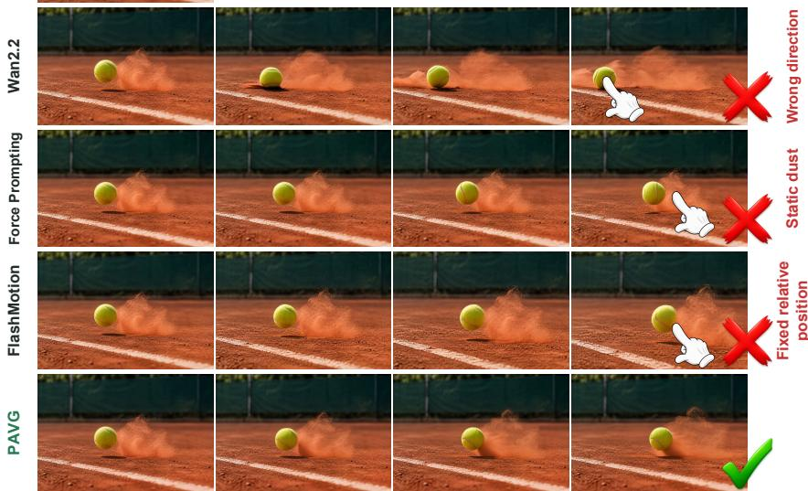
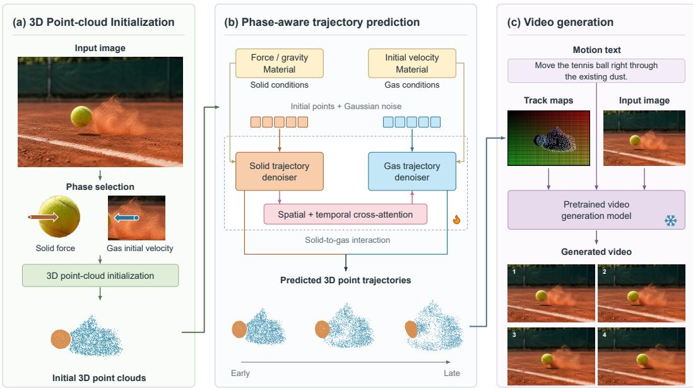
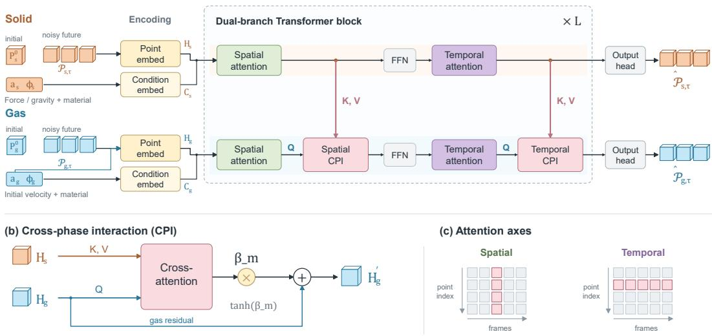
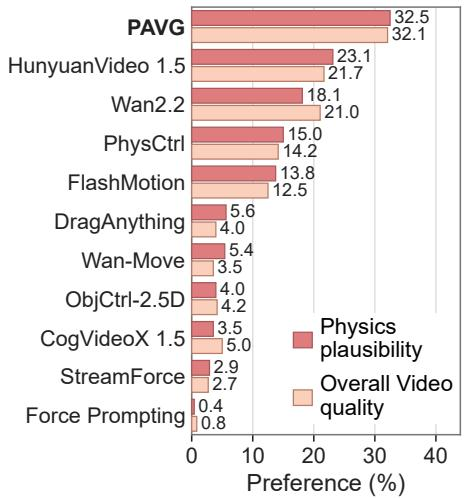
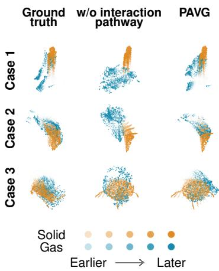

# PHASE-AWARE VIDEO GENERATION FOR PHYSICS-GROUNDED DYNAMICS AND INTERACTIONS

Jingfeng Oua,b, Kun Wangc, Rui Zhaoc, Jingwei Guand, Limin Wanga, Chao Dongb, Xingyu Zengb,\*

A tennis ball moves to the right through existing dust. The dust drifts left, then deflects and curls around the passing ball.

  
Figure 1: A tennis ball moving through dust. Wan2.2 moves the ball in the wrong direction; Force Prompting leaves the dust stationary; FlashMotion moves the ball and dust together without a visible interaction. PAVG follows the prescribed ball motion and produces a responsive dust plume, yielding a more physically plausible solid–gas interaction. The figure contains fine-grained motion details and is best viewed on a computer.

## ABSTRACT

Generating physically plausible videos for solid–gas dynamics is challenging as different phases exhibit distinct dynamics yet remain coupled through physical interactions. We present PAVG, a Phase-Aware Video Generator for solid–gas dynamics and interactions. It employs a dual-branch architecture to explicitly model the distinct dynamics of solids and gases, while spatiotemporal cross-attention captures their physical interactions. This design enables PAVG to preserve phasespecific motion characteristics while producing physically consistent responses across phases. To facilitate this task, we further construct a simulation corpus comprising over 700K physical trajectories across diverse solid, gas, and solid– gas interaction scenarios. Extensive evaluations demonstrate that our PAVG produces videos with improved motion adherence, physical plausibility, and visual quality compared with existing approaches.

## 1 INTRODUCTION

Many real-world events involve multiple physical phases 1 and their interactions. As illustrated in Figure 1, a tennis ball moving right through existing dust can deflect the leftward-drifting plume and induce local curling around the ball. Given an initial image and an external physical intervention, we aim to generate the subsequent video with both high visual fidelity and physically plausible dynamics. This setting requires modeling not only how each phase evolves, but also how motion in one phase influences another, such as when a moving solid induces or alters the motion of surrounding gas.

Large-scale video generation models have achieved remarkable visual fidelity and increasingly sophisticated motion generation (Brooks et al., 2024; Blattmann et al., 2023; Xing et al., 2024; Yang et al., 2024; Wu et al., 2025; Team Wan et al., 2025). However, visual plausibility does not guarantee physical plausibility, and recent evaluations reveal persistent failures in capturing physically plausible motion and interactions (Bansal et al., 2024; 2025). Such failures become particularly evident in multi-phase scenes: in Figure 1, the baselines move the ball in the wrong direction, leave the dust stationary, or move both phases together without a visible interaction. Thus, independently plausible phase dynamics are insufficient; the generated motions must also be consistent with their interactions.

Existing physics-grounded video generation approaches address this limitation by incorporating physical dynamics through either explicit simulation or learned physical priors (Xie et al., 2024; Jiang et al., 2024; Liu et al., 2024; Chen et al., 2025a; Tan et al., 2024; Wang et al., 2025b; Su et al., 2026; Zhang et al., 2024). The simulation-based approaches, however, are computationally expensive and sensitive to numerical settings, such as time step and spatial resolution. They always require repeated solves and parameter adjustment for controllable generation (Jiang et al., 2016; Macklin et al., 2016; Modi et al., 2024; Liu et al., 2024; Tan et al., 2024). In contrast, learned physical priors provide a more scalable alternative (Wang et al., 2025b), but multi-phase scenes introduce a fundamental modeling challenge: different phases exhibit distinct dynamics, while their evolution is coupled through physical interactions (Zhang et al., 2026c; Tao et al., 2026). Solids may exhibit rigid or deformable motion, whereas gases involve velocity transport, dissipation, pressure, and buoyancy (Stomakhin et al., 2013; Macklin et al., 2016; Modi et al., 2024; Thuerey & Pfaff, 2018; Ummenhofer et al., 2020; Winchenbach & Thuerey, 2024; Baumgarten et al., 2021). A suitable model therefore needs to preserve phase-specific dynamics while explicitly capturing cross-phase interactions.

We present PAVG (Phase-Aware Video Generation), a framework for physics-grounded video generation of single-phase motion and solid–gas interactions. Given an initial image and an external intervention, PAVG lifts the image to phase-specific 3D point representations and predicts their future trajectories, which are then injected into a pretrained video generator as motion controls. Instead of performing online physical simulation, PAVG learns physical trajectory priors directly from data. Its dual-branch architecture separately models solid and gas dynamics, while spatiotemporal crossattention couples the branches to capture their interactions. We further employ a two-stage training strategy, first learning single-phase motion priors and then cross-phase interactions. To support this setting, we construct a dataset covering diverse solid, gas, and solid–gas interaction scenarios. Experiments demonstrate that PAVG achieves better motion adherence, greater physical plausibility, and higher video quality than other approaches.

Our contributions are:

• We propose PAVG (Phase-Aware Video Generation), a framework for physics-grounded dynamics and interactions that models single-phase motion and solid–gas interaction through a shared point-trajectory interface for physically controllable video generation.

• We introduce a dual-branch trajectory predictor with spatiotemporal cross-attention to capture solid-gas interactions while supporting both single- and cross-phase motion prediction.

• We construct a trajectory dataset and a held-out benchmark covering diverse single-phase motions and solid–gas interactions.

• We systematically evaluate trajectory prediction and video generation across single-phase and cross-phase settings, demonstrating better adherence to motion instructions, greater physical plausibility, and higher video quality.

## 2 RELATED WORK

## 2.1 CONTROLLABLE VIDEO GENERATION

Controllable video generation augments general-purpose video models (Wu et al., 2025; Team Wan et al., 2025; Yang et al., 2024) with object, region, or multi-entity motion controls (Yin et al., 2023; Wang et al., 2024b; Geng et al., 2025; Zhang et al., 2025a; Fu et al., 2024; Wu et al., 2024; Wang et al., 2024a; Zhang et al., 2025b; Li et al., 2025c;b), including point trajectories (Wang et al., 2025a; Zhang et al., 2026f; Chu et al., 2025; Li et al., 2026c), 3D-aware conditions (Wang et al., 2025c; Chen et al., 2025c; Gu et al., 2025; Zheng et al., 2026; Zhang et al., 2026a), and structured guidance (Choo et al., 2026; Chen et al., 2026b;a). Recent work also models passive or rigid-body responses (Liu et al., 2026; Romero et al., 2026). PAVG instead predicts phase-specific trajectories from material properties and applied forces before synthesis.

## 2.2 PHYSICS-GROUNDED VIDEO GENERATION

Physics-grounded video generation incorporates physical structure through simulation or learned priors (Yang et al., 2026). Simulation-based methods combine solvers with neural scenes or generative models (Xie et al., 2024; Jiang et al., 2024; Liu et al., 2024; Tan et al., 2024; Chen et al., 2025a; Li et al., 2025d; Zhao et al., 2025a; Foo et al., 2026; Zhang et al., 2026b; Su et al., 2026); other methods learn or expose physical controls (Spitznagel et al., 2025; Wang et al., 2025b; Gillman et al., 2025; 2026; Wang et al., 2026a; Yuan et al., 2026; Narayanan et al., 2026; Shen et al., 2026; Zhang et al., 2024) or guide generation through physical reasoning and alignment (Yang et al., 2025; Xue et al., 2025; Pathak et al., 2026; Li et al., 2026d;b; Wang et al., 2026b; Yang & Zhang, 2026; Cai et al., 2026; Zhang et al., 2026d; Cheng et al., 2026; Nguyen et al., 2026; Feng et al., 2026). PAVG uses a shared trajectory interface to preserve distinct solid and gas dynamics and model their interaction before synthesis.

## 2.3 DYNAMICS MODELING AND TRAJECTORY PREDICTION

Physical dynamics models use material points, grids, particles, or graphs to represent phasedependent states (Jiang et al., 2016; Stomakhin et al., 2013; Macklin et al., 2016; Modi et al., 2024; Thuerey & Pfaff, 2018; Battaglia et al., 2016; Li et al., 2019; Sanchez-Gonzalez et al., 2020; Pfaff et al., 2021; Feng et al., 2025b). Fluid predictors incorporate continuous convolutions or equivariance (Ummenhofer et al., 2020; Winchenbach & Thuerey, 2024; Toshev et al., 2023), while latent motion priors model non-rigid motion (Tevet et al., 2023; Cao et al., 2024; Ji et al., 2025). Recent work learns physical parameters and dynamics from videos (Garcia et al., 2025; Chen et al., 2025b; Zhao et al., 2025b; Gao et al., 2025; Li et al., 2025a; Quan et al., 2026; Perini et al., 2026) or predicts scene and object trajectories (Zhang et al., 2026e; Soraki et al., 2026); PhysCtrl and equation-based forecasting connect trajectory prediction to video generation (Wang et al., 2025b; Feng et al., 2025a). HGATSolver, Fisale, and CFC explicitly couple distinct physical domains (Zhang et al., 2026c; Tao et al., 2026; Dou et al., 2025). PAVG instead learns fixed-identity point trajectories for video control across single-phase motion and solid–gas interaction.

## 3 PRELIMINARIES

Solids and gases share momentum conservation but have distinct dynamics, motivating phasespecific models (Baumgarten et al., 2021; Tao et al., 2026). Their motions can be coupled through forces transmitted across the solid–gas interface.

## 3.1 SOLID DYNAMICS

Solid stress depends on deformation and history (Masi & Stefanou, 2023; Raj et al., 2026). With deformation gradient ${ \bf F } _ { s }$ , internal variables $\zeta _ { s }$ , and material properties $\phi _ { s }$ , the constitutive laws are

$$
\frac { D \mathbf { F } _ { s } } { D t } = ( \nabla \mathbf { u } _ { s } ) \mathbf { F } _ { s } , \qquad \sigma _ { s } = \mathcal { C } _ { s } ( \mathbf { F } _ { s } , \boldsymbol { \zeta } _ { s } ; \boldsymbol { \phi } _ { s } ) , \qquad \frac { D \boldsymbol { \zeta } _ { s } } { D t } = \mathcal { G } _ { s } ( \mathbf { F } _ { s } , \boldsymbol { \zeta } _ { s } ; \boldsymbol { \phi } _ { s } ) .\tag{1}
$$

Here, $\mathbf { u } _ { s }$ is solid velocity, $D / D t$ is the material derivative, $\mathcal { C } _ { s }$ maps material state to stress $\pmb { \sigma } _ { s }$ , and $\mathcal { G } _ { s }$ governs internal history. Elastic deformation is reversible; plastic changes persist. Rigid motion satisfies $\mathbf { F } _ { s } ^ { \mathsf { T } } \mathbf { F } _ { s } = \mathbf { I }$ , allowing translation and rotation. Contact forces restrict admissible motion.

## 3.2 GAS DYNAMICS

Gas motion is described by velocity field $\mathbf { U } _ { g }$ and transported concentration $c _ { q } ,$ rather than deformation-dependent stress (Li et al., 2026a). For nearly incompressible flow, $\nabla \cdot \mathbf { \check { U } } _ { g } \approx 0$ , and

$$
\begin{array} { c } { \displaystyle \partial _ { t } c _ { g } + \mathbf { U } _ { g } \cdot \nabla c _ { g } = \kappa _ { c } \nabla ^ { 2 } c _ { g } , } \\ { \displaystyle _ { \varrho _ { 0 } } \big ( \partial _ { t } \mathbf { U } _ { g } + ( \mathbf { U } _ { g } \cdot \nabla ) \mathbf { U } _ { g } \big ) = - \nabla p + \mu \nabla ^ { 2 } \mathbf { U } _ { g } + \varrho _ { 0 } \mathbf { b } _ { g } \big ( c _ { g } \big ) + \mathbf { f } _ { g } ^ { \mathrm { i n t } } , } \end{array}\tag{2}
$$

where $\varrho _ { 0 }$ is reference density, $\kappa _ { c }$ is concentration diffusivity, and $\mu$ is dynamic viscosity. Pressure p enforces incompressibility. Body acceleration ${ \bf b } _ { g }$ includes buoyancy; $\mathbf { f } _ { g } ^ { \mathrm { i n t } }$ is interphase force density. Gas evolution depends on transport, pressure, and dissipation, not material memory.

## 3.3 SOLID–GAS INTERACTION

We consider mechanical interaction at a solid–gas interface $\Gamma _ { s g }$ . Neglecting interfacial inertia and other surface forces, momentum balance gives equal and opposite tractions (Liu & Marsden, 2018):

$$
\pmb { \sigma } _ { s } \mathbf { n } _ { s } + \sigma _ { g } \mathbf { n } _ { g } = \mathbf { 0 } , \qquad \pmb { \sigma } _ { g } = - p \mathbf { I } + \pmb { \tau } _ { g } , \qquad \mathbf { x } \in \Gamma _ { s g } .\tag{3}
$$

Here, $\mathbf { n } _ { s }$ and $\mathbf { n } _ { g }$ are outward unit normals, and $\tau _ { g }$ is viscous stress. Pressure and viscous stresses transmit forces between the phases, coupling solid motion and deformation with gas flow.

Appendix A provides the detailed dynamical models and their simulation implementations.

## 4 METHODS

## 4.1 OVERVIEW

Given selected regions of the input image $I _ { 0 } ,$ we initialize phase-specific 3D point clouds $\mathbf { P } ^ { 0 }$ . PAVG (Tθ) predicts their 3D trajectories from physical controls $\bar { \mathbf { a } ^ { \mathrm { { \bar { t r a j } } } } }$ and phase/material conditions $\phi .$ . The projected tracks, $I _ { 0 } ,$ and text prompt y guide a pretrained video generator $\mathcal { G } _ { \psi }$ (Appendix C.3):

$$
\begin{array} { r } { \widehat { \mathcal { P } } ^ { 1 : F _ { \mathrm { p h y s } } } = \mathcal { T } _ { \boldsymbol { \theta } } \big ( \mathbf { P } ^ { 0 } , \mathbf { a } ^ { \mathrm { t r a j } } , \boldsymbol { \phi } \big ) , \qquad \widehat { \mathcal { V } } _ { 1 : F } = \mathcal { G } _ { \psi } \Big ( I _ { 0 } , y , \Pi \Big ( \widehat { \mathcal { P } } ^ { 1 : F _ { \mathrm { p h y s } } } \Big ) \Big ) . } \end{array}\tag{4}
$$

Here, Π projects 3D trajectories to image-space tracks, and $F _ { \mathrm { p h y s } }$ and $F$ are the physical and video frame counts; $\mathcal { P }$ denotes future 3D point positions.

  
Figure 2: PAVG overview: (a) initialize phase-specific 3D point clouds; (b) use a phase-aware point-trajectory predictor to predict solid and gas trajectories; (c) project the trajectories to guide a pretrained video generation model. Flames and snowflakes mark trainable and frozen modules.

## 4.2 PHASE-AWARE POINT-TRAJECTORY PREDICTOR

PAVG couples two phase-specific point-cloud diffusion branches with spatiotemporal attention (Wang et al., 2025b). Spatial and temporal cross-phase interaction (CPI) modules connect the branches while preserving phase-specific dynamics (Figure 3). Given phase regions and physical controls (e.g., material properties and applied forces), we assume negligible gas feedback on solid motion and transfer solid context only to gas. Because interaction requires position- and statedependent cross-phase context while preserving phase-specific dynamics and Stage-1 priors, we use directional, gated residual cross-attention. CPI factorizes this exchange into spatial and temporal updates, avoiding full joint attention over all points and frames.

Phase-specific input encoding. For phase $q \in \{ s , g \}$ , the input comprises N fixed-identity points, initial cloud $\mathbf { P } _ { q } ^ { 0 } .$ , control ${ \bf a } _ { q }$ , and material properties $\phi _ { q }$ . At diffusion step τ , noisy trajectories $\mathcal { P } _ { q , \tau }$ are encoded as

$$
\begin{array} { r } { ( \mathbf { H } _ { q } , \mathbf { C } _ { q } ) = \operatorname { E n c o d e } _ { q } ( \mathcal { P } _ { q , \tau } , \mathbf { c } _ { q } ) , \qquad \mathbf { c } _ { q } = ( \mathbf { P } _ { q } ^ { 0 } , \mathbf { a } _ { q } , \phi _ { q } ) . } \end{array}\tag{5}
$$

The encoder prepends the initial cloud and embeds positions as point features $\mathbf { H } _ { q } ;$ force, material, and boundary descriptors form condition tokens $\mathbf { C } _ { q } .$

Cross-phase interaction. Each of L blocks applies spatial self-attention, spatial $\mathrm { C P I , }$ a feedforward network, temporal self-attention, and temporal CPI. Self-attention and feed-forward layers remain branch-specific, with PhysCtrl’s residual connections and timestep-conditioned normalization; spatial attention and feed-forward layers also update condition tokens. Both CPI modules use gated residual cross-attention (Figure 3b):

$$
\mathbf { H } _ { g } \gets \mathbf { H } _ { g } + \operatorname { t a n h } ( \beta _ { m } ) \mathrm { A t t n } _ { m } ( \mathbf { H } _ { g } , \mathrm { s g } ( \mathbf { H } _ { s } ) , \mathrm { s g } ( \mathbf { H } _ { s } ) ) , \quad m \in \{ \mathrm { s p } , \mathrm { t e m p } \} ,\tag{6}
$$

where sg stops gradients and $\beta _ { m }$ is a learned scalar initialized to zero. Spatial CPI reads all solid points in the same frame; temporal CPI reads matching indices across frames after spatial mixing, not physical solid–gas correspondences. CPI follows the directional local-transfer model (Appendix A.3, Eq. 22), updates only gas features, and uses distinct parameters in each block to propagate features and condition tokens.

(a) Phase-specific denoising  
  
Figure 3: PAVG architecture: (a) phase-specific denoising with cross-phase interaction (CPI) modules; (b) gated cross-attention within CPI; and (c) spatial and temporal attention axes. $\mathbf { H } _ { g } ^ { \prime }$ denotes the gas latent feature after the CPI update.

Trajectory denoising and output. Branch-specific heads apply timestep-conditioned normalization and 3D projection, then add the initial cloud to predicted offsets for clean positions $\widehat { \mathcal { P } } _ { q , \tau }$ . Starting from Gaussian noise, DDIM iteratively updates $\mathcal { P } _ { q , \tau }$ at decreasing $\tau ;$ each pass predicts all physical frames jointly with fixed $\mathbf { P } _ { q } ^ { 0 } ,$ while single-phase inputs bypass CPI.

## 4.3 TRAINING

We use two-stage training: Stage 1 learns phase-specific motion priors, and Stage 2 initializes PAVG from them and jointly learns single-phase motion and cross-phase interaction.

Stage 1: Single-phase priors. For single-phase rollouts, we sample τ from a K-step schedule and $\mathbf { \epsilon } \epsilon \sim \mathcal { N } ( \mathbf { 0 } , \mathbf { I } )$ ), form $\mathcal { P } _ { q , \tau } = \alpha _ { \tau } \mathcal { P } _ { q } + \sigma _ { \tau } \epsilon ,$ , and predict clean positions $\widehat { \mathcal { P } } _ { q }$ from $\mathbf { c } _ { q }$ and $\tau .$ We supervise positions and frame-to-frame motion with

$$
\begin{array} { r } { \mathcal { L } _ { \mathrm { d i f f } } ^ { q } = \mathbb { E } _ { \mathcal { P } _ { q } , \tau , \epsilon } \lVert \widehat { \mathcal { P } } _ { q } - \mathcal { P } _ { q } \rVert _ { 2 } ^ { 2 } , \qquad \mathcal { L } _ { \mathrm { v e l } } ^ { q } = \mathrm { m e a n } _ { f } \lVert \Delta \widehat { \mathbf { P } } _ { q } ^ { f } - \Delta \mathbf { P } _ { q } ^ { f } \rVert _ { 2 } ^ { 2 } , } \end{array}\tag{7}
$$

where $\mathbf { P } _ { q } ^ { f }$ is the frame-f point cloud, $\Delta \mathbf { P } _ { q } ^ { f } = \mathbf { P } _ { q } ^ { f + 1 } - \mathbf { P } _ { q } ^ { f } ,$ , and $f = 1 , \ldots , F _ { \mathrm { p h y s } } - 1$ . For solids, we additionally use PhysCtrl’s deformation and contact-plane penetration losses, ${ \mathcal { L } } _ { \mathrm { d e f } }$ and ${ \mathcal { L } } _ { \mathrm { { f l o o r } } }$ (Wang et al., 2025b).

For gas, we impose MantaFlow’s pressure-projection incompressibility constraint (Thuerey & Pfaff, 2018). Because targets are tracer trajectories rather than Eulerian grids, a locally fitted displacement Jacobian $\mathbf { J } _ { k }$ yields

$$
\begin{array} { r } { \nabla \cdot { \mathbf { U } } _ { g } \approx 0 , \qquad d _ { k } = \operatorname { t r } ( { \mathbf { J } } _ { k } ) \approx \delta t _ { f } \nabla \cdot { \mathbf { U } } _ { g } ( { \mathbf { x } } _ { k } ) , } \end{array}\tag{8}
$$

where $\delta t _ { f }$ is the stored-frame interval and $d _ { k } , \widehat { d } _ { k }$ come from simulated and predicted trajectories. The divergence loss is

$$
{ \mathcal { L } } _ { \mathrm { d i v } } = { \mathrm { m e a n } } _ { k \in \Omega _ { \mathrm { d i v } } } { \mathrm { ~ H u b e r } } \left( { \frac { { \widehat { d } } _ { k } - d _ { k } } { \sigma _ { d } } } \right) .\tag{9}
$$

Here, $\Omega _ { \mathrm { d i v } }$ contains valid neighborhoods and $\sigma _ { d }$ is the lower-bounded batchwise RMS of $d _ { k }$ . Matching $d _ { k }$ , rather than zero, accounts for discretization and sampling. With $\ell _ { q } = \mathcal { L } _ { \mathrm { d i f f } } ^ { q } + \lambda _ { \mathrm { v e l } } \mathcal { L } _ { \mathrm { v e l } } ^ { q }$ , the

complete Stage 1 objectives are

$$
\begin{array} { r } { \mathcal { L } _ { \mathrm { s t a g e 1 } } ^ { s } = \ell _ { s } + \lambda _ { \mathrm { d e f } } \mathcal { L } _ { \mathrm { d e f } } + \lambda _ { \mathrm { f l o o r } } \mathcal { L } _ { \mathrm { f l o o r } } , \qquad \mathcal { L } _ { \mathrm { s t a g e 1 } } ^ { g } = \ell _ { g } + \lambda _ { \mathrm { d i v } } \mathcal { L } _ { \mathrm { d i v } } . } \end{array}\tag{10}
$$

Each λ weights its corresponding objective.

Stage 2: Interaction learning. Stage 2 mixes single-solid, single-gas, and paired solid–gas trajectories, applying Eq. 10 to present branches and independent noise to paired targets at a shared τ. For paired trajectories, the local coupling model (Appendix A.3) transfers solid-induced momentum to gas in the solid-affected region, and we supervise the corresponding velocity increment.

For gas point p at frame f, predicted positions $\widehat { \mathbf { x } } _ { g , p } ^ { f }$ give

$$
\widehat { \mathbf { v } } _ { g , p } ^ { f } = \frac { \widehat { \mathbf { x } } _ { g , p } ^ { f } - \widehat { \mathbf { x } } _ { g , p } ^ { f - 1 } } { \delta t _ { f } } , \qquad \widehat { \Delta \mathbf { v } } _ { g , p } ^ { f , \mathrm { t o t a l } } = \widehat { \mathbf { v } } _ { g , p } ^ { f } - \widehat { \mathbf { v } } _ { g , p } ^ { f - 1 } .\tag{11}
$$

Using the recorded free-gas increment $\Delta { \bf v } _ { g , p } ^ { f , \mathrm { f r e e } }$ (Appendix C.2), we define

$$
\begin{array} { r } { \widehat { \Delta \mathbf v } _ { g , p } ^ { f , s  g } : = \widehat { \Delta \mathbf v } _ { g , p } ^ { f , \mathrm { t o t a l } } - \Delta \mathbf v _ { g , p } ^ { f , \mathrm { f r e e } } . } \end{array}\tag{12}
$$

With $\widehat { \mathbf { x } } _ { g , p } ^ { 0 } = \mathbf { x } _ { g , p } ^ { 0 }$ and $\widehat { \mathbf { v } } _ { g , p } ^ { 0 } = \mathbf { a } _ { g , p }$ , we impose in the interaction region

$$
\mathcal { L } _ { \mathrm { c o u p l i n g } } = \mathrm { m e a n } _ { ( f , p ) \in \Omega _ { \mathrm { c p l } } } \mathrm { H u b e r } ( \frac { \widehat { \Delta \mathbf { v } } _ { g , p } ^ { f , s  g } - \Delta \mathbf { v } _ { g , p } ^ { f , s  g } } { \sigma _ { \mathrm { c p l } } } ) ,\tag{13}
$$

The recorded transfer defines valid pairs $\Omega _ { \mathrm { c p l } } ;$ its lower-bounded batchwise componentwise RMS gives $\sigma _ { \mathrm { c p l } }$ . Appendix C.2 gives the decomposition. Stage 2 combines the complete phase-specific objectives:

$$
{ \mathcal { L } } _ { \mathrm { t r a j } } = { \frac { \sum _ { q \in \{ s , g \} } w _ { q } { \mathcal { L } } _ { \mathrm { s t a g e l } } ^ { q } } { w _ { s } + w _ { g } } } , \qquad { \mathcal { L } } _ { \mathrm { s t a g e 2 } } = { \mathcal { L } } _ { \mathrm { t r a j } } + \lambda _ { \mathrm { c o u p l i n g } } { \mathcal { L } } _ { \mathrm { c o u p l i n g } } .\tag{14}
$$

In each batch, $\mathcal { L } _ { \mathrm { s t a g e 1 } } ^ { q }$ averages valid phase-q samples, with $w _ { q } = 0$ when phase q is absent.

## 5 EXPERIMENTS

## 5.1 BENCHMARKS

Video generation. We assemble a benchmark of 32 scenes covering single-phase motion and solid– gas interaction: eight solid, eight gas, and sixteen solid–gas cases. The solid cases are adopted from the released examples of PhysCtrl (Wang et al., 2025b), while we construct gas and interaction cases covering smoke, dust, and mist motion, including a ball landing in dust and steam moving in response to a pot lid being lifted. Each case provides an initial image and prescribed motion conditions; scene construction and condition specifications are detailed in Appendix B.

Trajectory prediction. We construct a trajectory dataset and benchmark covering solid motion, gas motion, and solid–gas interaction, using PhysCtrl’s data generation methodology to generate the solid portion (Wang et al., 2025b). Dataset construction details are in Appendix B.

## 5.2 MOTION VIDEO GENERATION

Baselines. We select baselines from general-purpose video generation (HunyuanVideo-1.5, Wan2.2-I2V-A14B, and CogVideoX1.5-5B-I2V); motion-controlled generation (DragAnything, ObjCtrl-2.5D, FlashMotion, and Wan-Move); and physics-controlled generation (Force Prompting, StreamForce, and PhysCtrl). Method-specific inputs are detailed in Appendix C.5.

Quantitative evaluation. Five multimodal judges—GPT-4o, GPT-5.5, GPT-5.6-sol, Gemini-3.8- flash, and DeepSeek-v4.1-flash—evaluate all eleven methods on 32 scenes. Each rates Semantic Adherence (SA), Physical Commonsense (PC), and Video Quality (VQ) on a five-point Likert scale (Bansal et al., 2024; Wang et al., 2025b), using a shared rubric and scene-specific randomized anonymous video orders. Table 1 averages each metric equally over scenes and judges. PAVG ranks first in SA and PC and second in VQ.

Figure 4 shows that PAVG achieves the highest aggregate human preference rates for both Physics plausibility and Overall Video quality. Although HunyuanVideo-1.5 and Wan2.2 achieve competitive video quality, their physics-plausibility preference rates remain below PAVG’s, highlighting the effectiveness of our physics-grounded motion modeling approach. Appendix C.5 details both the multimodal-judge evaluation and the human preference study.

Table 1: Motion video generation on the 32-scene benchmark. Scores are averaged equally over scenes and five judges; higher is better. Bold: best; underlined: second best.
<table><tr><td rowspan=1 colspan=1>Method                   SA↑ PC↑ VQ↑</td></tr><tr><td rowspan=1 colspan=1>General-purpose video generationHunyuanVideo-1.5       3.11  3.03  3.66Wan2.2-I2V-A14B       3.05  3.08  3.53CogVideoX1.5-5B-I2V 2.26  2.46  2.93</td></tr><tr><td rowspan=1 colspan=1>Motion-controlled generationDragAnything            2.40  2.45  2.69ObjCtrl-2.5D             2.28  2.27  2.83FlashMotion              3.17  3.18  3.58Wan-Move                2.09  1.99  2.25</td></tr><tr><td rowspan=1 colspan=1>Physics-controlled generationForce Prompting         2.03  2.24  2.86StreamForce              1.91  2.04  2.78PhysCtrl                  3.10  2.98  3.33</td></tr><tr><td rowspan=1 colspan=1>OursPAVG                     3.39  3.28  3.61</td></tr></table>

  
Figure 4: Human preference rates averaged over 32 scenes for eleven methods (15 questionnaires; 480 participant–scene responses per criterion). Participants can select multiple equally best videos per criterion, so rates across methods can sum to over 100%.

## 5.3 PAVG: TRAJECTORY PREDICTION

Baselines. We compare PhysCtrl, MDM, and Motion2VecSets for solid trajectory modeling; SFBC, DLF, and SEGNN for fluid/gas trajectory modeling; and GNS, HGATSolver, and Fisale for cross-phase interaction modeling. The evaluation details are provided in Appendices C.1 and C.4.

Quantitative evaluation. We evaluate trajectories using voxel IoU (vIoU), Chamfer distance (CD), and correspondence-aware pointwise $L _ { 2 }$ error (Corr) (Wang et al., 2025b; Lei & Daniilidis, 2022; Cao et al., 2024), averaged over future frames and test sequences. Table 2 shows that PAVG achieves the best results on all three metrics and settings, outperforming both interaction-capable baselines and phase-specific models on the single-phase subsets.

SFBC and DLF predict gas dynamics autoregressively rather than modeling full fixed-identity trajectories; on solids, PhysCtrl outperforms the latent-motion baselines MDM and Motion2VecSets. For interactions, GNS, HGATSolver, and Fisale use autoregressive updates with particle-type message passing, heterogeneous attention, and latent ALE grids, respectively (Sanchez-Gonzalez et al., 2020; Zhang et al., 2026c; Tao et al., 2026). PAVG instead jointly denoises all future frames with phase-specific spatiotemporal Transformers and solid-to-gas CPI, preserving within-phase dynamics and cross-phase influence in a shared trajectory space.

Table 2: Trajectory prediction across single-phase motion and solid–gas interaction.
<table><tr><td>Method</td><td colspan="3">Overall*</td><td colspan="3">Single-phase: Solid</td><td colspan="3">Single-phase: Gas</td><td colspan="3">Interaction: Solid-gas</td></tr><tr><td></td><td>vIoU↑</td><td>CD↓</td><td>Corr↓</td><td>vIoU↑</td><td>CD↓</td><td>Corr↓</td><td>vIoU↑</td><td>CD↓</td><td>Corr↓</td><td>vIoU↑</td><td>CD↓</td><td>Corr↓</td></tr><tr><td>Gas-only</td><td></td><td></td><td></td><td></td><td></td><td></td><td></td><td></td><td></td><td></td><td></td><td></td></tr><tr><td>SFBC</td><td></td><td></td><td></td><td></td><td></td><td></td><td></td><td></td><td>0.4838740.1209060.274170</td><td></td><td></td><td></td></tr><tr><td>DLF</td><td></td><td></td><td></td><td></td><td></td><td></td><td></td><td></td><td>0.483505 0.0536500.241004</td><td></td><td></td><td></td></tr><tr><td>SEGNN</td><td></td><td></td><td></td><td></td><td></td><td></td><td></td><td></td><td>0.561893 0.0070600.176081</td><td></td><td></td><td></td></tr><tr><td>Solid-only</td><td></td><td></td><td></td><td></td><td></td><td></td><td></td><td></td><td></td><td></td><td></td><td></td></tr><tr><td>Motion2VecSets</td><td></td><td></td><td></td><td>0.141172 0.8429130.656012</td><td></td><td></td><td></td><td></td><td></td><td></td><td></td><td></td></tr><tr><td>MDM</td><td></td><td></td><td></td><td>0.3573440.0977700.246086</td><td></td><td></td><td></td><td></td><td></td><td></td><td></td><td></td></tr><tr><td>PhysCtrl</td><td></td><td></td><td></td><td>0.588372 0.022882 0.080403</td><td></td><td></td><td></td><td></td><td></td><td></td><td></td><td></td></tr><tr><td colspan="9">Phase-aware interaction</td><td></td><td></td><td></td><td></td></tr><tr><td>GNS</td><td>0.465241 0.0274800.209879</td><td></td><td></td><td></td><td></td><td></td><td></td><td></td><td>0.422463 0.039714 0.163346 0.559694 0.007163 0.176219 0.439404 0.031521 0.249974</td><td></td><td></td><td></td></tr><tr><td>HGATSolver</td><td>0.449227 0.068079 0.223303</td><td></td><td></td><td></td><td></td><td></td><td></td><td></td><td>0.306664 0.163993 0.309513 0.570428 0.006277 0.116932 0.459907 0.051023 0.233384</td><td></td><td></td><td></td></tr><tr><td>Fisale</td><td>0.5181430.0362050.182453</td><td></td><td></td><td></td><td></td><td></td><td></td><td></td><td>0.478780 0.054490 0.144728 0.578805 0.005874 0.117675 0.507492 0.042229 0.233703</td><td></td><td></td><td></td></tr><tr><td>PAVG</td><td>0.696343 0.006630 0.062433</td><td></td><td></td><td></td><td></td><td></td><td></td><td></td><td>0.611964 0.017294 0.068361 0.793352 0.001370 0.061515 0.690028 0.003928 0.059928</td><td></td><td></td><td></td></tr></table>

∗ For metric $m ,$ Overall assigns equal weight to single-phase motion and solid–gas interaction, with solid and gas weighted equally within single-phase motion: $\begin{array} { r } { \hat { O _ { m } } = \frac { 1 } { 2 } \left( \frac { 1 } { 2 } S _ { m } + \frac { 1 } { 2 } G _ { m } \right) ^ { \sim } + \frac { 1 } { 2 } I _ { m } , } \end{array}$ , where $S _ { m } , G _ { m } ,$ and $\hat { I } _ { m }$ denote the solid, gas, and solid–gas scores, respectively. The interaction score $I _ { m }$ is computed on the concatenated gas and solid point sets. — denotes that the method is not applicable to the corresponding evaluation setting; the scope of each baseline is specified in Section 5.3. Bold indicates the best reported result.

## 5.4 ABLATION STUDIES

We ablate phase-specific modeling and the interaction pathway below; Appendices C.1, C.2, and C.4 cover Stage 2 initialization, physical constraints, and shared settings.

Phase-specific vs. unified modeling. Table 3 compares separate solid and gas predictors with a unified predictor trained on mixed-phase data, matching its cumulative training examples per phase to the corresponding specialist. Appendix C.1 provides details.

With matched per-phase exposure, specialists outperform Unified on all three metrics for both phases. Relative to Unified, Solid-only improves solid vIoU by 3.02%, while Gas-only improves gas vIoU by 10.63% and reduces CD and Corr by 35.43% and 28.86%, respectively. This supports learning distinct phase dynamics before coupling them through cross-phase modules.

Table 3: Phase-specific versus unified modeling in Stage 1. Solid-only and Gas-only are trained separately; Unified shares one predictor across both phases. Training exposure is matched per phase. Solid scores aggregate the five solid subsets.
<table><tr><td colspan="3">Solid</td></tr><tr><td>Predictor</td><td>vIoU↑</td><td>CD↓ Corr↓</td></tr><tr><td>Solid-only</td><td>0.588372</td><td>0.022882 0.080403</td></tr><tr><td>Gas-only</td><td>N/A N/A</td><td>N/A</td></tr><tr><td>Unified</td><td>0.571150</td><td>0.024851 0.086428</td></tr></table>

<table><tr><td>Predictor</td><td>vIoU↑</td><td>CD↓</td><td>Corr↓</td></tr><tr><td>Solid-only</td><td>N/A</td><td>N/A</td><td>N/A</td></tr><tr><td>Gas-only</td><td>0.799263</td><td>0.001281</td><td>0.059713</td></tr><tr><td>Unified</td><td>0.722483</td><td>0.001984 0.083933</td><td></td></tr></table>

Interaction pathway ablation. We enable or disable solid-to-gas Cross-Attention at inference in the same two-stage-trained PAVG model, keeping all other settings unchanged. Figure 5 compares both variants with ground truth on three held-out cases: PAVG better predicts gas trajectories near the solid, whereas removing the pathway produces weaker, less coherent responses. Table 4 confirms improvements in all gas and joint trajectory metrics on the interaction subset, with unchanged solid predictions, supporting the pathway’s role in capturing solid-induced gas motion.

  
Figure 5: Qualitative interaction-pathway ablation on three heldout solid–gas cases. With the CPI pathway enabled, the gas visibly responds to and follows the solid’s motion.

Table 4: Quantitative interaction-pathway ablation on the solid–gas interaction subset of our benchmark. The same PAVG checkpoint is evaluated with or without solid-to-gas Cross-Attention. Metrics are reported for the concatenated joint output and separately for each phase.
<table><tr><td rowspan="2">Variant</td><td colspan="3">Joint solid-gas</td><td colspan="3">Interaction: solid</td><td colspan="3">Interaction: gas</td></tr><tr><td>vIoU↑</td><td>CD↓</td><td>Corr↓</td><td>vIoU↑</td><td>CD↓</td><td>Corr↓</td><td>vIoU↑</td><td>CD↓</td><td>Corr↓</td></tr><tr><td>PAVG</td><td>0.690028</td><td>0.003928</td><td>0.059928</td><td>0.728056</td><td>0.011593</td><td>0.049734</td><td>0.642296</td><td>0.003537</td><td>0.070121</td></tr><tr><td>w/o solid-to-gas Cross-Attention 0.540755</td><td></td><td>0.016072</td><td>0.178830</td><td>0.728056</td><td></td><td></td><td>0.011593 0.0497340.4284350.0671360.307926</td><td></td><td></td></tr></table>

## 6 CONCLUSION

In this work, we introduced PAVG (Phase-Aware Video Generation), a framework for physicsgrounded dynamics and interactions. PAVG explicitly separates the distinct dynamics of solids and gases through a dual-branch trajectory predictor, while spatiotemporal cross-attention captures the physical coupling between phases. By learning physical trajectory priors from the proposed largescale trajectory corpus, PAVG enables efficient and controllable video generation under external physical interventions. Experiments across single-phase and solid-gas interaction scenarios show consistent improvements in motion adherence, physical plausibility, and visual quality. We hope this work provides a step toward more general physics-grounded video generation models capable of reasoning about heterogeneous physical dynamics and their interactions.

## AI USE STATEMENT

In this work, we used generative AI tools to support research execution by generating the initial scene images used as inputs for the comparative video-generation experiments and evaluating generated videos with the fixed five-judge protocol described in Section 5.2 and Appendix C.5. We also used generative AI tools to create or edit software code, edit the manuscript to improve its readability and wording, and correct LaTeX formatting. We did not use generative AI tools for literature retrieval or discovery, generating synthetic datasets, developing theoretical models or conceptual frameworks, formulating or proving mathematical claims, or designing or providing feedback on the research methodology or experiments. The initial scene images were experiment inputs and were not used as a synthetic dataset; the model ratings were collected under a predefined evaluation protocol and did not determine the method, experimental protocol, or conclusions. We reviewed all AI-assisted work: the authors manually checked the generated images, reviewed and tested all code modifications, checked the evaluation protocol and resulting scores, and checked the manuscript, figures, tables, equations, and reported results. The authors made the final decisions about the method, experimental protocol, and conclusions, and take full responsibility for the final content of this work, including all text, code, images, figures, results, and other artifacts produced with AI assistance.

## REPRODUCIBILITY STATEMENT

We provide a detailed description of PAVG and its phase-aware point-trajectory predictor in Section 4, including the model interface, cross-phase interaction modules, and two-stage training objectives. Section 5 specifies the benchmark composition, baselines, evaluation metrics, and ablation protocols. Appendix A documents the solid, gas, and solid–gas simulation dynamics; Ap pendix B describes trajectory generation, data partitions, and video benchmark construction; and Appendix C provides the architecture, optimization, initialization, trajectory-evaluation, and videoscoring details, including the fixed data splits, reported random seeds, sampling settings, and evaluation prompts. The code and project repository are currently private. A public release is planned upon publication.

## REFERENCES

Hritik Bansal, Zongyu Lin, Tianyi Xie, Zeshun Zong, Michal Yarom, Yonatan Bitton, Chenfanfu Jiang, Yizhou Sun, Kai-Wei Chang, and Aditya Grover. VideoPhy: Evaluating physical commonsense for video generation. arXiv preprint arXiv:2406.03520, 2024.

Hritik Bansal, Clark Peng, Yonatan Bitton, Roman Goldenberg, Aditya Grover, and Kai-Wei Chang. Videophy-2: A challenging action-centric physical commonsense evaluation in video generation. arXiv preprint arXiv:2503.06800, 2025.

Peter W. Battaglia, Razvan Pascanu, Matthew Lai, Danilo Rezende, and Koray Kavukcuoglu. Interaction networks for learning about objects, relations and physics. In Advances in Neural Information Processing Systems, volume 29, 2016.

Aaron S. Baumgarten, Benjamin L. S. Couchman, and Ken Kamrin. A coupled finite volume and material point method for two-phase simulation of liquid–sediment and gas–sediment flows. Computer Methods in Applied Mechanics and Engineering, 384:113940, 2021. doi: 10.1016/j.cma.2021.113940.

Andreas Blattmann, Tim Dockhorn, Sumith Kulal, Daniel Mendelevitch, Maciej Kilian, Dominik Lorenz, Yam Levi, Zion English, Vikram Voleti, Adam Letts, et al. Stable video diffusion: Scaling latent video diffusion models to large datasets. arXiv preprint arXiv:2311.15127, 2023.

Tim Brooks, Bill Peebles, Connor Holmes, Will DePue, Yufei Guo, Li Jing, David Schnurr, Joe Taylor, Troy Luhman, Eric Luhman, Clarence Ng, Ricky Wang, and Aditya Ramesh. Video generation models as world simulators. Technical report, OpenAI, 2024. URL https: //openai.com/index/video-generation-models-as-world-simulators/.

Yuanhao Cai, Kunpeng Li, Menglin Jia, Jialiang Wang, Junzhe Sun, Feng Liang, Weifeng Chen, Felix Juefei-Xu, Chu Wang, Ali Thabet, Xiaoliang Dai, Xuan Ju, Alan Yuille, and Ji Hou. PhyGDPO: Physics-aware groupwise direct preference optimization for physically consistent text-to-video generation. In European Conference on Computer Vision, 2026. URL https: //eccv.ecva.net/virtual/2026/poster/4063.

Wei Cao, Chang Luo, Biao Zhang, Matthias Nießner, and Jiapeng Tang. Motion2vecsets: 4d latent vector set diffusion for non-rigid shape reconstruction and tracking. In Proceedings of the IEEE/CVF Conference on Computer Vision and Pattern Recognition, 2024.

Boyuan Chen, Hanxiao Jiang, Shaowei Liu, Saurabh Gupta, Yunzhu Li, Hao Zhao, and Shenlong Wang. Physgen3d: Crafting a miniature interactive world from a single image. arXiv preprint arXiv:2503.20746, 2025a.

Chuhao Chen, Zhiyang Dou, Chen Wang, Yiming Huang, Anjun Chen, Qiao Feng, Jiatao Gu, and Lingjie Liu. Vid2Sim: Generalizable, video-based reconstruction of appearance, geometry and physics for mesh-free simulation. In Proceedings of the IEEE/CVF Conference on Computer Vision and Pattern Recognition, pp. 26545–26555, 2025b.

URL https://openaccess.thecvf.com/content/CVPR2025/html/Chen\_ Vid2Sim\_Generalizable\_Video-based\_Reconstruction\_of\_Appearance\_ Geometry\_and\_Physics\_for\_CVPR\_2025\_paper.html.

Chuhao Chen, Peter Wonka, Chaoyang Wang, Chen Wang, Qiao Feng, Sergey Tulyakov, and Lingjie Liu. PhysStream: Streaming physics-grounded video generation with structured scene memory and fine-grained motion control. arXiv preprint arXiv:2609.17521, 2026a. URL https:// arxiv.org/abs/2609.17521.

Yingjie Chen, Yifang Men, Yuan Yao, Miaomiao Cui, and Liefeng Bo. Perceptionas-Control: Fine-grained controllable image animation with 3D-aware motion representation. In Proceedings of the IEEE/CVF International Conference on Computer Vision, pp. 14380–14389, 2025c. doi: 10.1109/ICCV51701.2025.01334. URL https://openaccess.thecvf.com/content/ICCV2025/html/Chen\_ Perception-as-Control\_Fine-grained\_Controllable\_Image\_Animation\_ with\_3D-aware\_Motion\_Representation\_ICCV\_2025\_paper.html.

Zhifei Chen, Tianshuo Xu, Leyi Wu, Luozhou Wang, Dongyu Yan, Zihan You, Wenting Luo, and Yingcong Chen. STANCE: Controllable video generation for structured dynamics via Sparse-To-dense ANChored Encoding. In European Conference on Computer Vision, 2026b. URL https://eccv.ecva.net/virtual/2026/poster/3671.

Kexu Cheng, Zicheng Liu, Mingju Gao, Chunhe Song, and Hao Tang. PhysRAG: Enhancing physics-awareness in video generation via retrieval-augmented generation. In European Conference on Computer Vision, 2026. URL https://eccv.ecva.net/virtual/2026/ poster/5129.

Kyobin Choo, Youngmin Kim, Hyunkyung Han, Geunrip Park, Chanyoung Kim, Sunyoung Jung, and Seong Jae Hwang. QWERTY: Training-free motion control via query-warped video diffusion transformers. In European Conference on Computer Vision, 2026. URL https://eccv. ecva.net/virtual/2026/poster/4226.

Ruihang Chu, Yefei He, Zhekai Chen, Shiwei Zhang, Xiaogang Xu, Bin Xia, Dingdong Wang, Hongwei Yi, Xihui Liu, Hengshuang Zhao, Yu Liu, Yingya Zhang, and Yujiu Yang. Wan-Move: Motion-controllable video generation via latent trajectory guidance. In Advances in Neural Information Processing Systems, volume 38, pp. 448–476, 2025. doi: 10.52202/085713-0014. URL https://doi.org/10.52202/085713-0014.

Zhiyang Dou, Chen Peng, Xinyu Lu, Xiaohan Ye, Lixing Fang, Yuan Liu, Wenping Wang, Chuang Gan, Lingjie Liu, and Taku Komura. CFC: Simulating character-fluid coupling using a two-level world model. ACM Transactions on Graphics, 44(6):1–17, 2025. doi: 10.1145/3763318. URL https://dl.acm.org/doi/10.1145/3763318.

Tao Feng, Xianbing Zhao, Zhenhua Chen, Tien Tsin Wong, Hamid Rezatofighi, Gholamreza Haffari, and Lizhen Qu. Physics-grounded motion forecasting via equation discovery for trajectory-guided image-to-video generation. arXiv preprint arXiv:2507.06830, 2025a.

Yutao Feng, Xiang Feng, Yintong Shang, Ying Jiang, Chang Yu, Zeshun Zong, Tianjia Shao, Hongzhi Wu, Kun Zhou, Chenfanfu Jiang, and Yin Yang. Gaussian splashing: Unified particles for versatile motion synthesis and rendering. In Proceedings of the IEEE/CVF Conference on Computer Vision and Pattern Recognition, pp. 518–529, 2025b. URL https://openaccess.thecvf.com/content/CVPR2025/html/ Feng\_Gaussian\_Splashing\_Unified\_Particles\_for\_Versatile\_Motion\_ Synthesis\_and\_Rendering\_CVPR\_2025\_paper.html.

Yuxiang Feng, Juncheng Wang, Chao Xu, Yijie Qian, Huihan Wang, Wenlong Hou, Yang Liu, Baigui Sun, Yong Liu, and Shujun Wang. NEWTON: Agentic planning for physically grounded video generation. arXiv preprint arXiv:2605.18396, 2026. URL https://arxiv.org/abs/ 2605.18396.

Lin Geng Foo, Mark He Huang, Alexandros Lattas, Stylianos Moschoglou, Thabo Beeler, and Christian Theobalt. Physical simulator in-the-loop video generation. In Proceedings of the

IEEE/CVF Conference on Computer Vision and Pattern Recognition (CVPR), pp. 4301–4311, June 2026. URL https://openaccess.thecvf.com/content/CVPR2026/html/ Foo\_Physical\_Simulator\_In-the-Loop\_Video\_Generation\_CVPR\_2026\_ paper.html.

Xiao Fu, Xian Liu, Xintao Wang, Sida Peng, Menghan Xia, Xiaoyu Shi, Ziyang Yuan, Pengfei Wan, Di Zhang, and Dahua Lin. 3dtrajmaster: Mastering 3d trajectory for multi-entity motion in video generation. arXiv preprint arXiv:2412.07759, 2024.

Yue Gao, Hong-Xing Yu, Bo Zhu, and Jiajun Wu. FluidNexus: 3D fluid reconstruction and prediction from a single video. In Proceedings of the IEEE/CVF Conference on Computer Vision and Pattern Recognition (CVPR), pp. 26091–26101, June 2025. URL https://openaccess.thecvf.com/content/CVPR2025/html/Gao\_ FluidNexus\_3D\_Fluid\_Reconstruction\_and\_Prediction\_from\_a\_Single\_ Video\_CVPR\_2025\_paper.html.

Alejandro Castaneda Garcia, Jan Warchocki, Jan van Gemert, Daan Brinks, and Ner-˜ gis Tomen. Learning physics from video: Unsupervised physical parameter estimation for continuous dynamical systems. In Proceedings of the IEEE/CVF Conference on Computer Vision and Pattern Recognition, pp. 27924–27933, 2025. URL https://openaccess.thecvf.com/content/CVPR2025/html/Garcia\_ Learning\_Physics\_From\_Video\_Unsupervised\_Physical\_Parameter\_ Estimation\_for\_Continuous\_CVPR\_2025\_paper.html.

Daniel Geng, Charles Herrmann, Junhwa Hur, Forrester Cole, Serena Zhang, Tobias Pfaff, Tatiana Lopez-Guevara, Yusuf Aytar, Michael Rubinstein, Chen Sun, Oliver Wang, Andrew Owens, and Deqing Sun. Motion prompting: Controlling video generation with motion trajectories. In Proceedings of the IEEE/CVF Conference on Computer Vision and Pattern Recognition (CVPR), pp. 1–12, June 2025. URL https://openaccess.thecvf.com/content/CVPR2025/ html/Geng\_Motion\_Prompting\_Controlling\_Video\_Generation\_with\_ Motion\_Trajectories\_CVPR\_2025\_paper.html.

Nate Gillman, Charles Herrmann, Michael Freeman, Daksh Aggarwal, Evan Luo, Deqing Sun, and Chen Sun. Force Prompting: Video generation models can learn and generalize physicsbased control signals. In Advances in Neural Information Processing Systems, volume 38, pp. 114276–114303, 2025. doi: 10.52202/085713-3448. URL https://doi.org/10.52202/ 085713-3448.

Nate Gillman, Yinghua Zhou, Zitian Tang, Evan Luo, Arjan Chakravarthy, Daksh Aggarwal, Michael Freeman, and Chen Sun. Goal Force: Teaching video models to accomplish physics-conditioned goals. In Proceedings of the IEEE/CVF Conference on Computer Vision and Pattern Recognition (CVPR), pp. 20077–20087, June 2026. URL https: //openaccess.thecvf.com/content/CVPR2026/html/Gillman\_Goal\_ Force\_Teaching\_Video\_Models\_To\_Accomplish\_Physics-Conditioned\_ Goals\_CVPR\_2026\_paper.html.

Zekai Gu, Rui Yan, Jiahao Lu, Peng Li, Zhiyang Dou, Chenyang Si, Zhen Dong, Qifeng Liu, Cheng Lin, Ziwei Liu, et al. Diffusion as shader: 3d-aware video diffusion for versatile video generation control. arXiv preprint arXiv:2501.03847, 2025.

Bin Ji, Ye Pan, Zhimeng Liu, Shuai Tan, Xiaogang Jin, and Xiaokang Yang. POMP: Physics-consistent motion generative model through phase manifolds. In Proceedings of the IEEE/CVF Conference on Computer Vision and Pattern Recognition, pp. 22690–22701, 2025. URL https://openaccess.thecvf.com/content/CVPR2025/html/Ji\_ POMP\_Physics-consistent\_Motion\_Generative\_Model\_through\_Phase\_ Manifolds\_CVPR\_2025\_paper.html.

Chenfanfu Jiang, Craig Schroeder, Joseph Teran, Alexey Stomakhin, and Andrew Selle. The material point method for simulating continuum materials. In ACM SIGGRAPH 2016 Courses, pp. 1–52. ACM, 2016.

Ying Jiang, Chang Yu, Tianyi Xie, Xuan Li, Yutao Feng, Huamin Wang, Minchen Li, Henry Lau, Feng Gao, Yin Yang, et al. Vr-gs: A physical dynamics-aware interactive gaussian splatting system in virtual reality. In ACM SIGGRAPH 2024 Conference Papers, pp. 1–1, 2024.

Alexander Kirillov, Eric Mintun, Nikhila Ravi, Hanzi Mao, Chloe Rolland, Laura Gustafson, Tete Xiao, Spencer Whitehead, Alexander C. Berg, Wan-Yen Lo, Piotr Dollar, and Ross Girshick. Seg-´ ment anything. In Proceedings of the IEEE/CVF International Conference on Computer Vision, 2023.

Jiahui Lei and Kostas Daniilidis. Cadex: Learning canonical deformation coordinate space for dynamic surface representation via neural homeomorphism. In Proceedings of the IEEE/CVF Conference on Computer Vision and Pattern Recognition, pp. 6624–6634, 2022.

Chen Li, Shanshan Dong, Sheng Qiu, Jianmin Han, Yibo Zhao, Zan Gao, Taku Komura, and Kemeng Huang. SmokeSVD: Smoke reconstruction from a single view via progressive novel view synthesis and refinement with diffusion models. In Proceedings ofthe IEEE/CVF Conference on Computer Vision and Pattern Recognition, pp. 7414–7424, 2026a.

Jinxi Li, Ziyang Song, and Bo Yang. TRACE: Learning 3D gaussian physical dynamics from multiview videos. In Proceedings of the IEEE/CVF International Conference on Computer Vision, pp. 8820–8829, 2025a. doi: 10.1109/ICCV51701.2025.00825. URL https://openaccess. thecvf.com/content/ICCV2025/html/Li\_TRACE\_Learning\_3D\_Gaussian\_ Physical\_Dynamics\_from\_Multi-view\_Videos\_ICCV\_2025\_paper.html.

Mengxian Li, Zhan Wang, Fan Qi, and Changsheng Xu. PhysAlign: Learning physical priors for dynamical event-driven video generation via representation alignment. In European Conference on Computer Vision, 2026b. URL https://eccv.ecva.net/virtual/2026/poster/ 3309.

Quanhao Li, Zhen Xing, Rui Wang, Hui Zhang, Qi Dai, and Zuxuan Wu. MagicMotion: Controllable video generation with dense-to-sparse trajectory guidance. In Proceedings of the IEEE/CVF International Conference on Computer Vision, pp. 12112–12123, 2025b. doi: 10. 1109/ICCV51701.2025.01126. URL https://openaccess.thecvf.com/content/ ICCV2025/html/Li\_MagicMotion\_Controllable\_Video\_Generation\_with\_ Dense-to-Sparse\_Trajectory\_Guidance\_ICCV\_2025\_paper.html.

Quanhao Li, Zhen Xing, Rui Wang, Haidong Cao, Qi Dai, Daoguo Dong, and Zuxuan Wu. FlashMotion: Few-step controllable video generation with trajectory guidance. In Proceedings of the IEEE/CVF Conference on Computer Vision and Pattern Recognition, pp. 8986–8996, 2026c. URL https://openaccess.thecvf.com/content/CVPR2026/ html/Li\_FlashMotion\_Few-Step\_Controllable\_Video\_Generation\_with\_ Trajectory\_Guidance\_CVPR\_2026\_paper.html.

Yunyi Li, Yu Qiao, Yaohui Wang, and Xinyuan Chen. DeforM: Reasoning-guided physics-aware video generation via spatial-temporal masking. In European Conference on Computer Vision, 2026d. URL https://eccv.ecva.net/virtual/2026/poster/3443.

Yunzhu Li, Jiajun Wu, Russ Tedrake, Joshua B. Tenenbaum, and Antonio Torralba. Learning particle dynamics for manipulating rigid bodies, deformable objects, and fluids. In International Conference on Learning Representations, 2019.

Ziye Li, Hao Luo, Xincheng Shuai, and Henghui Ding. AnyI2V: Animating any conditional image with motion control. In Proceedings of the IEEE/CVF International Conference on Computer Vision, pp. 17302–17311, 2025c. URL https://openaccess.thecvf.com/ content/ICCV2025/html/Li\_AnyI2V\_Animating\_Any\_Conditional\_Image\_ with\_Motion\_Control\_ICCV\_2025\_paper.html.

Zizhang Li, Hong-Xing Yu, Wei Liu, Yin Yang, Charles Herrmann, Gordon Wetzstein, and Jiajun Wu. WonderPlay: Dynamic 3D scene generation from a single image and actions. In Proceedings of the IEEE/CVF International Conference on Computer Vision (ICCV), pp. 9080–9090, October 2025d. URL https://openaccess.thecvf.com/content/ICCV2025/html/Li\_ WonderPlay\_Dynamic\_3D\_Scene\_Generation\_from\_a\_Single\_Image\_and\_ ICCV\_2025\_paper.html.

Ju Liu and Alison L. Marsden. A unified continuum and variational multiscale formulation for fluids, solids, and fluid-structure interaction. Computer Methods in Applied Mechanics and Engineering, 337:549–597, 2018. doi: 10.1016/j.cma.2018.03.045.

Shaowei Liu, Zhongzheng Ren, Saurabh Gupta, and Shenlong Wang. Physgen: Rigid-body physicsgrounded image-to-video generation. In European Conference on Computer Vision, pp. 360–378, 2024.

Shaowei Liu, Xuanchi Ren, Tianchang Shen, Huan Ling, Saurabh Gupta, Shenlong Wang, Sanja Fidler, and Jun Gao. DIVER: Disentangling camera–object and active–passive motion for video generation. In European Conference on Computer Vision, 2026. URL https://eccv.ecva. net/virtual/2026/poster/5541.

Miles Macklin, Matthias Muller, and Nuttapong Chentanez. Xpbd: Position-based simulation of¨ compliant constrained dynamics. In Proceedings of the 9th International Conference on Motion in Games, pp. 49–54, 2016.

Filippo Masi and Ioannis Stefanou. Evolution TANN and the identification of internal variables and evolution equations in solid mechanics. Journal of the Mechanics and Physics of Solids, 174: 105245, 2023. doi: 10.1016/j.jmps.2023.105245.

Vismay Modi, Nicholas Sharp, Or Perel, Shinjiro Sueda, and David I. W. Levin. Simplicits: Meshfree, geometry-agnostic elastic simulation. ACM Transactions on Graphics, 43(4):1–11, 2024.

Sriram Narayanan, Ziyu Jiang, Srinivasa Narasimhan, and Manmohan Chandraker. PhyCo: Learning controllable physical priors for generative motion. In Proceedings of the IEEE/CVF Conference on Computer Vision and Pattern Recognition, pp. 41892–41902, 2026. URL https://openaccess.thecvf.com/content/CVPR2026/html/Narayanan\_ PhyCo\_Learning\_Controllable\_Physical\_Priors\_for\_Generative\_ Motion\_CVPR\_2026\_paper.html.

Minh-Loi Nguyen, Xuan-Vu Le, Trung-Nghia Le, Tam V. Nguyen, Minh-Triet Tran, and Thanh-Toan Do. Physplan: Grounded physical state reasoning and graph-guided optimization for physically plausible video generation. arXiv preprint arXiv:2609.13006, 2026. URL https: //arxiv.org/abs/2609.13006.

Saurabh Pathak, Elahe Arani, Mykola Pechenizkiy, and Bahram Zonooz. PhysVid: Physics aware local conditioning for generative video models. In Proceedings of the IEEE/CVF Conference on Computer Vision and Pattern Recognition, pp. 41847–41858, 2026. URL https://openaccess.thecvf.com/content/CVPR2026/html/Pathak\_ PhysVid\_Physics\_Aware\_Local\_Conditioning\_for\_Generative\_Video\_ Models\_CVPR\_2026\_paper.html.

Janne Perini, Rafael Bischof, Moab Arar, Ayc¸a Duran, Michael Kraus, Siddhartha Mishra, and Bernd Bickel. Pretrained video models as differentiable physics simulators for urban wind flows. In European Conference on Computer Vision, 2026. URL https://eccv.ecva. net/virtual/2026/poster/4800.

Tobias Pfaff, Meire Fortunato, Alvaro Sanchez-Gonzalez, and Peter W. Battaglia. Learning meshbased simulation with graph networks. In International Conference on Learning Representations, 2021.

Jinsheng Quan, Qiaowei Miao, Yichao Xu, Zizhuo Lin, Ying Li, Wei Yang, Zhihui Li, and Yawei Luo. ParticleGS: Learning neural gaussian particle dynamics from videos for prior-free physical motion extrapolation. In Proceedings of the IEEE/CVF Conference on Computer Vision and Pattern Recognition, pp. 8331–8341, 2026. URL https://openaccess.thecvf.com/content/CVPR2026/html/Quan\_ ParticleGS\_Learning\_Neural\_Gaussian\_Particle\_Dynamics\_from\_ Videos\_for\_Prior-free\_CVPR\_2026\_paper.html.

Mayank Raj, Lianghao Cao, Andrew Stuart, and Kaushik Bhattacharya. A neural-network framework to learn history-dependent constitutive laws and identifiability of internal variables. Journal ofthe Mechanics and Physics ofSolids, 217:106807, 2026. doi: 10.1016/j.jmps.2026.106807.

David Romero, Ariana Bermudez, Viacheslav Iablochnikov, Hao Li, Fabio Pizzati, and Ivan Laptev. Learning to generate rigid body interactions with video diffusion models. In European Conference on Computer Vision, 2026. URL https://eccv.ecva.net/virtual/2026/poster/ 3697.

Alvaro Sanchez-Gonzalez, Jonathan Godwin, Tobias Pfaff, Rex Ying, Jure Leskovec, and Peter W. Battaglia. Learning to simulate complex physics with graph networks. In International Conference on Machine Learning, pp. 8459–8468, 2020.

Ying Shen, Jerry Xiong, Tianjiao Yu, and Ismini Lourentzou. PHANTOM: Physics-infused video generation via joint modeling of visual and latent physical dynamics. In Proceedings of the IEEE/CVF Conference on Computer Vision and Pattern Recognition, pp. 11185–11194, 2026. URL https://openaccess.thecvf.com/content/CVPR2026/html/Shen\_ PHANTOM\_Physics-Infused\_Video\_Generation\_via\_Joint\_Modeling\_of\_ Visual\_and\_CVPR\_2026\_paper.html.

Rustin Soraki, Homanga Bharadhwaj, Ali Farhadi, and Roozbeh Mottaghi. ObjectForesight: Predicting 3D object trajectories from human videos. In European Conference on Computer Vision, 2026. URL https://eccv.ecva.net/virtual/2026/poster/4086.

Martin Spitznagel, Jan Vaillant, and Janis Keuper. PhysicsGen: Can generative models learn from images to predict complex physical relations? In Proceedings of the IEEE/CVF Conference on Computer Vision and Pattern Recognition, pp. 11125–11134, 2025. URL https://openaccess.thecvf.com/content/CVPR2025/html/Spitznagel\_ PhysicsGen\_Can\_Generative\_Models\_Learn\_from\_Images\_to\_Predict\_ Complex\_CVPR\_2025\_paper.html.

Alexey Stomakhin, Craig Schroeder, Lawrence Chai, Joseph Teran, and Andrew Selle. A material point method for snow simulation. ACM Transactions on Graphics, 32(4):1–10, 2013.

Ruijie Su, Yuanzhi Liang, Xiaohua Xie, and Jianhuang Lai. Physics-grounded fluid video generation with a simulation dataset and dual-stream optical-flow supervision. arXiv preprint arXiv:2607.25321, 2026. URL https://arxiv.org/abs/2607.25321.

Xiyang Tan, Ying Jiang, Xuan Li, Zeshun Zong, Tianyi Xie, Yin Yang, and Chenfanfu Jiang. Physmotion: Physics-grounded dynamics from a single image. arXiv preprint arXiv:2411.17189, 2024.

Jiaxiang Tang, Zhaoxi Chen, Xiaokang Chen, Tengfei Wang, Gang Zeng, and Ziwei Liu. LGM: Large multi-view gaussian model for high-resolution 3D content creation. In European Conference on Computer Vision, 2024.

Shilong Tao, Zhe Feng, Shaohan Chen, Weichen Zhang, Zhanxing Zhu, and Yunhuai Liu. Neural latent arbitrary lagrangian-eulerian grids for fluid-solid interaction. In International Conference on Learning Representations, 2026. URL https://arxiv.org/abs/2603.00792.

Team Wan, Ang Wang, Baole Ai, Bin Wen, Chaojie Mao, Chen-Wei Xie, Di Chen, Feiwu Yu, Haiming Zhao, Jianxiao Yang, et al. Wan: Open and advanced large-scale video generative models. arXiv preprint arXiv:2503.20314, 2025. URL https://arxiv.org/abs/2503. 20314.

Guy Tevet, Sigal Raab, Brian Gordon, Yonatan Shafir, Daniel Cohen-Or, and Amit Haim Bermano. Human motion diffusion model. In International Conference on Learning Representations, 2023.

Nils Thuerey and Tobias Pfaff. Mantaflow: An extensible framework for fluid simulation. Opensource software, 2018. URL http://mantaflow.com.

Artur P. Toshev, Gianluca Galletti, Johannes Brandstetter, Stefan Adami, and Nikolaus A. Adams. Learning lagrangian fluid mechanics with e(3)-equivariant graph neural networks. arXiv preprint arXiv:2305.15603, 2023.

Benjamin Ummenhofer, Lukas Prantl, Nils Thuerey, and Vladlen Koltun. Lagrangian fluid simulation with continuous convolutions. In International Conference on Learning Representations, 2020.

Vikram Voleti, Chun-Han Yao, Mark Boss, Adam Letts, David Pankratz, Dmitry Tochilkin, Christian Laforte, Robin Rombach, and Varun Jampani. SV3D: Novel multi-view synthesis and 3D generation from a single image using latent video diffusion. arXiv preprint arXiv:2403.12008, 2024.

Angtian Wang, Haibin Huang, Jacob Zhiyuan Fang, Yiding Yang, and Chongyang Ma. Ati: Any trajectory instruction for controllable video generation. arXiv preprint arXiv:2505.22944, 2025a.

Chen Wang, Chuhao Chen, Yiming Huang, Zhiyang Dou, Yuan Liu, Jiatao Gu, and Lingjie Liu. PhysCtrl: Generative physics for controllable and physicsgrounded video generation. In Advances in Neural Information Processing Systems, volume 38, pp. 167907–167932, 2025b. doi: 10.52202/085713-5598. URL https://proceedings.neurips.cc/paper\_files/paper/2025/hash/ f53fd88a4340063ecd258c0ae9948b40-Abstract-Conference.html.

Hanhui Wang, Yiming Xie, Haiwen Feng, Zhaoyang Lv, Shenlong Wang, and Huaizu Jiang. Streaming video generation with streaming force control. arXiv preprint arXiv:2606.07508, 2026a.

Hanlin Wang, Hao Ouyang, Qiuyu Wang, Wen Wang, Ka Leong Cheng, Qifeng Chen, Yujun Shen, and Limin Wang. LeviTor: 3D trajectory oriented image-to-video synthesis. In Proceedings of the IEEE/CVF Conference on Computer Vision and Pattern Recognition, pp. 12490–12500, 2025c. doi: 10.1109/CVPR52734.2025.01165. URL https://openaccess.thecvf. com/content/CVPR2025/html/Wang\_LeviTor\_3D\_Trajectory\_Oriented\_ Image-to-Video\_Synthesis\_CVPR\_2025\_paper.html.

Ruoyu Wang, Jialun Liu, Huayang Huang, Haibin Huang, Jiepeng Wang, Chi Zhang, Xuelong Li, and Yu Wu. SIFT: Self-imagination fine-tuning for physically plausible motion in video diffusion models. In European Conference on Computer Vision, 2026b. URL https://eccv.ecva. net/virtual/2026/poster/5178.

Zhouxia Wang, Yushi Lan, Shangchen Zhou, and Chen Change Loy. ObjCtrl-2.5D: Training-free object control with camera poses. arXiv preprint arXiv:2412.07721, 2024a.

Zhouxia Wang, Ziyang Yuan, Xintao Wang, Tianshui Chen, Menghan Xia, Ping Luo, and Ying Shan. Motionctrl: A unified and flexible motion controller for video generation. In ACM SIGGRAPH 2024 Conference Papers, 2024b.

Rene Winchenbach and Nils Thuerey. Symmetric basis convolutions for learning lagrangian fluid mechanics. In International Conference on Learning Representations, 2024.

Bing Wu, Chang Zou, Changlin Li, Duojun Huang, Fang Yang, Hao Tan, Jack Peng, Jianbing Wu, Jiangfeng Xiong, Jie Jiang, et al. HunyuanVideo 1.5 technical report. arXiv preprint arXiv:2511.18870, 2025.

Weijia Wu, Zhuang Li, Yuchao Gu, Rui Zhao, Yefei He, David Junhao Zhang, Mike Zheng Shou, Yan Li, Tingting Gao, and Di Zhang. DragAnything: Motion control for anything using entity representation. arXiv preprint arXiv:2403.07420, 2024.

Tianyi Xie, Zeshun Zong, Yuxing Qiu, Xuan Li, Yutao Feng, Yin Yang, and Chenfanfu Jiang. Physgaussian: Physics-integrated 3d gaussians for generative dynamics. In Proceedings of the IEEE/CVF Conference on Computer Vision and Pattern Recognition, pp. 4389–4398, 2024.

Jinbo Xing, Menghan Xia, Yong Zhang, Haoxin Chen, Wangbo Yu, Hanyuan Liu, Gongye Liu, Xintao Wang, Ying Shan, and Tien-Tsin Wong. Dynamicrafter: Animating open-domain images with video diffusion priors. In European Conference on Computer Vision, pp. 399–417. Springer, 2024.

Qiyao Xue, Xiangyu Yin, Boyuan Yang, and Wei Gao. PhyT2V: LLM-guided iterative selfrefinement for physics-grounded text-to-video generation. In Proceedings of the IEEE/CVF Conference on Computer Vision and Pattern Recognition, pp. 18826–18836, 2025. URL https://openaccess.thecvf.com/content/CVPR2025/html/Xue\_PhyT2V\_ LLM-Guided\_Iterative\_Self-Refinement\_for\_Physics-Grounded\_ Text-to-Video\_Generation\_CVPR\_2025\_paper.html.

Shuo-Jin Yang, Yan-Rui Xu, Dong-Yu Chen, Yi-Qing Du, and Fang-Lue Zhang. From visual generation to world simulation: A survey of physically consistent video generative models. Journal of Computer Science and Technology, 2026. doi: 10.1007/s11390-026-6624-8. Accepted manuscript.

Xindi Yang, Baolu Li, Yiming Zhang, Zhenfei Yin, Lei Bai, Liqian Ma, Zhiyong Wang, Jianfei Cai, Tien-Tsin Wong, Huchuan Lu, and Xu Jia. VLIPP: Towards physically plausible video generation with vision and language informed physical prior. In Proceedings of the IEEE/CVF International Conference on Computer Vision, pp. 12360–12370, 2025. URL https://openaccess.thecvf.com/content/ICCV2025/html/Yang\_VLIPP\_ Towards\_Physically\_Plausible\_Video\_Generation\_with\_Vision\_and\_ Language\_ICCV\_2025\_paper.html.

Zhuoran Yang and Yanyong Zhang. PhysPO: Physics-aware local preference optimization for physically consistent video generation. In European Conference on Computer Vision, 2026. URL https://eccv.ecva.net/virtual/2026/poster/3783.

Zhuoyi Yang, Jiayan Teng, Wendi Zheng, Ming Ding, Shiyu Huang, Jiazheng Xu, Yuanming Yang, Wenyi Hong, Xiaohan Zhang, Guanyu Feng, et al. CogVideoX: Text-to-video diffusion models with an expert transformer. arXiv preprint arXiv:2408.06072, 2024.

Shengming Yin, Chenfei Wu, Jian Liang, Jie Shi, Houqiang Li, Gong Ming, and Nan Duan. Dragnuwa: Fine-grained control in video generation by integrating text, image, and trajectory. arXiv preprint arXiv:2308.08089, 2023.

Yu Yuan, Xijun Wang, Tharindu Wickremasinghe, Zeeshan Nadir, Bole Ma, and Stanley H. Chan. NewtonGen: Physics-consistent and controllable text-to-video generation via neural newtonian dynamics. In International Conference on Learning Representations, 2026. URL https:// openreview.net/forum?id=rJ6N6sunaU.

Guiyu Zhang, Yabo Chen, Xunzhi Xiang, Junchao Huang, Zhongyu Wang, and Li Jiang. SymphoMotion: Joint control of camera motion and object dynamics for coherent video generation. In Proceedings of the IEEE/CVF Conference on Computer Vision and Pattern Recognition, pp. 11127–11137, 2026a. URL https://openaccess.thecvf.com/content/ CVPR2026/html/Zhang\_SymphoMotion\_Joint\_Control\_of\_Camera\_Motion\_ and\_Object\_Dynamics\_for\_CVPR\_2026\_paper.html.

Haoze Zhang, Tianyu Huang, Zichen Wan, Xiaowei Jin, Hongzhi Zhang, Hui Li, and Wangmeng Zuo. PhysChoreo: Physics-controllable video generation with part-aware semantic grounding. In European Conference on Computer Vision, 2026b. URL https://eccv.ecva.net/ virtual/2026/poster/5160.

Qin-Yi Zhang, Hong Wang, Siyao Liu, Haichuan Lin, Linying Cao, Xiao-Hu Zhou, Chen Chen, Shuangyi Wang, and Zeng-Guang Hou. HGATSolver: A heterogeneous graph attention solver for fluid–structure interaction. In Proceedings of the AAAI Conference on Artificial Intelligence, volume 40, pp. 1534–1542, 2026c. doi: 10.1609/aaai.v40i2.37129. URL https: //ojs.aaai.org/index.php/AAAI/article/view/37129.

Qiyuan Zhang, Biao Gong, Shuai Tan, Zheng Zhang, Yujun Shen, Xing Zhu, Yuyuan Li, Kelu Yao, Chunhua Shen, and Changqing Zou. PhysRVG: Physics-aware unified reinforcement learning for video generative models. In European Conference on Computer Vision, 2026d. URL https: //eccv.ecva.net/virtual/2026/poster/3673.

Tianyuan Zhang, Hong-Xing Yu, Rundi Wu, Brandon Y. Feng, Changxi Zheng, Noah Snavely, Jiajun Wu, and William T. Freeman. PhysDreamer: Physics-based interaction with 3d objects via video generation. In European Conference on Computer Vision, 2024. URL https://arxiv. org/abs/2404.13026.

Yanran Zhang, Ziyi Wang, Wenzhao Zheng, Zheng Zhu, Jie Zhou, and Jiwen Lu. Geometry-aware single-image 4D synthesis via dense trajectory generation. In European Conference on Computer Vision, 2026e. URL https://eccv.ecva.net/virtual/2026/poster/3965.

Zhenghao Zhang, Junchao Liao, Menghao Li, Zuozhuo Dai, Bingxue Qiu, Siyu Zhu, Long Qin, and Weizhi Wang. Tora: Trajectory-oriented diffusion transformer for video generation. In Proceedings of the IEEE/CVF Conference on Computer Vision and Pattern Recognition (CVPR), pp. 2063–2073, June 2025a. URL https://openaccess.thecvf.com/ content/CVPR2025/html/Zhang\_Tora\_Trajectory-oriented\_Diffusion\_ Transformer\_for\_Video\_Generation\_CVPR\_2025\_paper.html.

Zhiyuan Zhang, Can Wang, Dongdong Chen, and Jing Liao. FlexTraj: Image-to-video generation with flexible point trajectory control. In Proceedings of the IEEE/CVF Conference on Computer Vision and Pattern Recognition (CVPR), pp. 4221–4231, June 2026f. URL https://openaccess.thecvf.com/content/CVPR2026/html/ Zhang\_FlexTraj\_Image-to-Video\_Generation\_with\_Flexible\_Point\_ Trajectory\_Control\_CVPR\_2026\_paper.html.

Zhongwei Zhang, Fuchen Long, Zhaofan Qiu, Yingwei Pan, Wu Liu, Ting Yao, and Tao Mei. MotionPro: A precise motion controller for image-to-video generation. In Proceedings of the IEEE/CVF Conference on Computer Vision and Pattern Recognition, pp. 27957–27967, 2025b. doi: 10.1109/CVPR52734.2025.02603. URL https://openaccess.thecvf. com/content/CVPR2025/html/Zhang\_MotionPro\_A\_Precise\_Motion\_ Controller\_for\_Image-to-Video\_Generation\_CVPR\_2025\_paper.html.

Haoyu Zhao, Hao Wang, Xingyue Zhao, Hao Fei, Hongqiu Wang, Chengjiang Long, and Hua Zou. PhysSplat: Efficient physics simulation for 3D scenes via MLLM-guided gaussian splatting. In Proceedings of the IEEE/CVF International Conference on Computer Vision, pp. 5242–5252, 2025a. URL https://openaccess.thecvf.com/content/ICCV2025/html/ Zhao\_PhysSplat\_Efficient\_Physics\_Simulation\_for\_3D\_Scenes\_via\_ MLLM-Guided\_Gaussian\_ICCV\_2025\_paper.html.

Yizhou Zhao, Haoyu Chen, Chunjiang Liu, Zhenyang Li, Charles Herrmann, Junhwa Hur, Yinxiao Li, Ming-Hsuan Yang, Bhiksha Raj, and Min Xu. Toward material-agnostic system identification from videos. In Proceedings of the IEEE/CVF International Conference on Computer Vision, pp. 5944–5956, 2025b. URL https://openaccess.thecvf.com/content/ICCV2025/ html/Zhao\_Toward\_Material-Agnostic\_System\_Identification\_from\_ Videos\_ICCV\_2025\_paper.html.

Sixiao Zheng, Minghao Yin, Wenbo Hu, Xiaoyu Li, Ying Shan, and Yanwei Fu. VerseCrafter: Dynamic realistic video world model with 4D geometric control. In Proceedings of the IEEE/CVF Conference on Computer Vision and Pattern Recognition, pp. 40277–40290, 2026. URL https://openaccess.thecvf.com/content/CVPR2026/html/ Zheng\_VerseCrafter\_Dynamic\_Realistic\_Video\_World\_Model\_with\_4D\_ Geometric\_Control\_CVPR\_2026\_paper.html.

## A DYNAMICS AND SIMULATION

This appendix expands the phase-specific dynamics in Section 3 and describes the solvers used to generate trajectory supervision. Solid simulation follows the MPM and rigid-body formulation used by PhysCtrl (Wang et al., 2025b; Jiang et al., 2016), whereas gas simulation uses MantaFlow (Thuerey & Pfaff, 2018) with an additional local coupling update for interaction scenes. The simulators are used for data generation, not for online video synthesis.

## A.1 SOLID DYNAMICS AND SIMULATION

Continuum description. For a material coordinate X, the deformation map ${ \boldsymbol { x } } ( \mathbf { X } , t )$ gives position x and deformation gradient $\mathbf { F } = \partial \pmb { \chi } / \partial \mathbf { X }$ . Mass and momentum balance take the form

$$
\frac { D \varrho _ { s } } { D t } + \varrho _ { s } \nabla \cdot \mathbf { u } _ { s } = 0 , \qquad \varrho _ { s } \frac { D \mathbf { u } _ { s } } { D t } = \nabla \cdot \pmb { \sigma } _ { s } + \mathbf { f } _ { s } ^ { \mathrm { e x t } } ,\tag{15}
$$

where $\mathbf { f } _ { s } ^ { \mathrm { e x t } }$ is external force per unit volume, including gravity when enabled. For an elastic strainenergy density Ψ, the first Piola stress $\mathbf { P }$ and Cauchy stress satisfy

$$
{ \bf P } = \frac { \partial \Psi } { \partial { \bf F } } , \qquad \ \sigma _ { s } = J ^ { - 1 } { \bf P } { \bf F } ^ { \top } , \qquad J = \operatorname* { d e t } { \bf F } .\tag{16}
$$

Material parameters determine Ψ; plastic updates additionally retain irreversible changes through the material state in Eq. 1. Thus, the same balance equations support distinct elastic, plasticine, and sand responses through their constitutive and return-mapping rules (Jiang et al., 2016).

Material point discretization. MPM stores positions, velocities, volumes, and deformation states on material points and evaluates their interactions through a background grid (Wang et al., 2025b; Jiang et al., 2016). Let $w _ { i p } = N _ { i } ( \mathbf { x } _ { p } ^ { n } )$ ) be the interpolation weight from point p to grid node $i , \mathbf { C } _ { p }$ its affine velocity matrix, and $\Delta t$ a simulation substep. Particle-to-grid transfer and momentum update:

$$
\begin{array} { r l r } { \displaystyle } & { } & { \displaystyle m _ { i } = \sum _ { p } w _ { i p } m _ { p } , } \\ { \displaystyle } & { } & { \displaystyle m _ { i } \mathbf { u } _ { i } ^ { n } = \sum _ { p } w _ { i p } m _ { p } \left[ \mathbf { v } _ { p } ^ { n } + \mathbf { C } _ { p } ^ { n } ( \mathbf { x } _ { i } - \mathbf { x } _ { p } ^ { n } ) \right] , } \\ { \displaystyle } & { } & { \displaystyle \mathbf { u } _ { i } ^ { * } = \mathbf { u } _ { i } ^ { n } + \frac { \Delta t } { m _ { i } } \left[ \mathbf { f } _ { i } ^ { \mathrm { e x t } } - \sum _ { p } V _ { p } ^ { 0 } \mathbf { P } _ { p } ^ { n } ( \mathbf { F } _ { p } ^ { n } ) ^ { \top } \nabla N _ { i } ( \mathbf { x } _ { p } ^ { n } ) \right] . } \end{array}\tag{17}
$$

Here, $V _ { p } ^ { 0 }$ is the reference point volume; updates use only grid nodes with nonzero mass. Boundary and contact conditions modify $\mathbf { u } _ { i } ^ { * }$ to obtain $\mathbf u _ { i } ^ { n + 1 }$ . Grid-to-particle transfer then gives

$$
\begin{array} { r l r } { \mathbf { v } _ { p } ^ { n + 1 } = \displaystyle \sum _ { i } w _ { i p } \mathbf { u } _ { i } ^ { n + 1 } , } & { } & { \mathbf { x } _ { p } ^ { n + 1 } = \mathbf { x } _ { p } ^ { n } + \Delta t \mathbf { v } _ { p } ^ { n + 1 } , } \\ { \mathbf { F } _ { p } ^ { \mathrm { t r i a l } } = \displaystyle \left[ \mathbf { I } + \Delta t \displaystyle \sum _ { i } \mathbf { u } _ { i } ^ { n + 1 } \nabla N _ { i } ( \mathbf { x } _ { p } ^ { n } ) ^ { \top } \right] \mathbf { F } _ { p } ^ { n } , } & { \mathbf { F } _ { p } ^ { n + 1 } = \mathcal { R } _ { \operatorname* { m a t } } ( \mathbf { F } _ { p } ^ { \mathrm { t r i a l } } ) . } \end{array}\tag{18}
$$

The material-specific return map ${ \mathcal { R } } _ { \mathrm { m a t } }$ is the identity for the elastic update and enforces the selected yield response for plastic materials. The affine matrix is updated from the same grid velocities, preserving the local velocity variation needed by the next transfer. These substeps are distinct from the more sparsely stored trajectory frames used for learning.

Rigid motion and contact. Rigid examples use a rigid-body solver rather than a deformable material with an artificially large stiffness. For center of mass $\mathbf { x } _ { c } ,$ rotation R, angular velocity ω, mass m, and world-space inertia $\mathbf { I } _ { w }$ , the motion obeys

$$
\begin{array} { c } { m \dot { \mathbf { v } } _ { c } = \mathbf { f } ^ { \mathrm { e x t } } + \mathbf { f } ^ { \mathrm { c o n t a c t } } , \quad \dot { \mathbf { x } } _ { c } = \mathbf { v } _ { c } , } \\ { \displaystyle \frac { d } { d t } ( \mathbf { I } _ { w } \omega ) = \pmb { \tau } ^ { \mathrm { e x t } } + \pmb { \tau } ^ { \mathrm { c o n t a c t } } , \quad \dot { \mathbf { R } } = [ \pmb { \omega } ] _ { \times } \mathbf { R } . } \end{array}\tag{19}
$$

Here, $[ { \boldsymbol { \omega } } ] _ { \times } \mathbf { a } = { \boldsymbol { \omega } } \times \mathbf { a }$ . Fixed body-space points follow ${ \bf x } _ { p } ( t ) = { \bf x } _ { c } ( t ) + { \bf R } ( t ) { \bf r } _ { p }$ , so their pairwise distances remain unchanged. For both rigid and deformable examples, floor contact supplies reaction forces or velocity corrections that prevent penetration. The material, force, and sampling choices used to construct the solid data are given in Appendix B.2.

## A.2 GAS DYNAMICS AND SIMULATION

Incompressible flow approximation. MantaFlow represents gas velocity on a staggered MAC grid and transports a scalar concentration field (Thuerey & Pfaff, 2018). In our setup, $c _ { g }$ describes the visible smoke or aerosol concentration, rather than a spatially varying density in a compressible equation of state. The reference carrier density $\varrho _ { 0 }$ is held constant, and pressure enforces the approximate divergence-free condition in Eq. 2. This model describes transport and buoyancy without resolving acoustic waves or phase changes.

Advection, forcing, and pressure projection. Let $\boldsymbol { \mathcal { A } } _ { \Delta t } ( \mathbf { U } , \boldsymbol { q } )$ denote semi-Lagrangian transport of a field $q$ by velocity U over one step. The implementation uses second-order advection for concentration and velocity, followed by buoyancy and pressure projection (Thuerey & Pfaff, 2018).

Its principal operators can be written as

$$
\begin{array} { r l r } {  { c _ { g } ^ { n + 1 } = \operatorname* { m a x } ( 1 - \gamma \Delta t , 0 ) \mathcal { A } _ { \Delta t } ( \mathbf { U } _ { g } ^ { n } , c _ { g } ^ { n } ) , } } \\ & { } & { \mathbf { U } _ { g } ^ { * } = \mathcal { A } _ { \Delta t } ( \mathbf { U } _ { g } ^ { n } , \mathbf { U } _ { g } ^ { n } ) + \Delta t \mathbf { b } _ { g } ( c _ { g } ^ { n + 1 } ) , } \\ & { } & { \nabla ^ { 2 } p ^ { n + 1 } = \frac { \varrho _ { 0 } } { \Delta t } \nabla \cdot \mathbf { U } _ { g } ^ { * } , \qquad \mathbf { U } _ { g } ^ { n + 1 } = \mathbf { U } _ { g } ^ { * } - \frac { \Delta t } { \varrho _ { 0 } } \nabla p ^ { n + 1 } . } \end{array}\tag{20}
$$

The last two expressions give the continuum form of the discrete projection; the solver incorporates the domain boundary conditions. The coefficient $\gamma$ controls concentration decay and is not a molecular diffusion coefficient. Our scene implementation does not add separate explicit viscosity or concentration-diffusion solves; smoothing can also arise from advection and interpolation. Thus, the general viscous and diffusive terms in Section 3.2 should not be interpreted as independently tuned, nonzero terms in every generated sequence. Wall conditions are applied around the pressure solve, while open boundaries are specified by the scene configuration. In interaction scenes, the transfer described below is inserted before an additional projection of the recorded velocity field.

Tracer trajectories. Learning targets are persistent tracers from the initial gas support, not Eulerian grid cells. For interpolated velocity $\mathcal { T } [ \mathbf { U } _ { g } ]$ , continuous and discrete tracer motion obey

$$
\begin{array} { r } { \dot { \mathbf { x } } _ { g , p } = \mathbb { Z } [ \mathbf { U } _ { g } ] ( \mathbf { x } _ { g , p } ) , \qquad \mathbf { x } _ { g , p } ^ { n + 1 } = \mathbf { x } _ { g , p } ^ { n } + \Delta t \mathbb { Z } [ \mathbf { U } _ { g } ^ { n } ] ( \mathbf { x } _ { g , p } ^ { n } ) . } \end{array}\tag{21}
$$

The exporter preserves tracer identities, records concentration weights and alive flags, and applies the configured obstacle and domain-boundary handling. Tracers leaving the valid domain are marked inactive rather than replaced by new identities.

## A.3 SOLID–GAS INTERACTION DYNAMICS AND SIMULATION

Interface conditions. Equation 3 is the dynamic interface condition. For an impermeable interface with no slip, the kinematic condition is $\mathbf { u } _ { s } = \mathbf { U } _ { g }$ on $\Gamma _ { s g }$ (Liu & Marsden, 2018). For an incompressible Newtonian gas, $\pmb { \tau } _ { g } = \mu ( \nabla \mathbf { U } _ { g } + \nabla \mathbf { U } _ { q } ^ { \mathsf { T } } )$ . The traction $\sigma _ { g } \mathbf { n } _ { g }$ is the force per unit area exerted on the gas by the solid; integrating it over the interface gives the resultant force. Its counterpart on the solid has the opposite sign. In a boundary-based formulation, this exchange enters through interface tractions; in a distributed-force formulation, it is represented by interphase force densities, such as $\mathbf { f } _ { g } ^ { \mathrm { i n t } }$ in Eq. 2. These describe one exchange and must not be counted twice.

Local transfer approximation. Our data-generation implementation uses a localized acceleration model rather than resolving the full two-sided interface problem. Let $\mathbf { r } _ { s g } = \mathcal { E } _ { s } [ \mathbf { u } _ { s } ] - \mathbf { U } _ { g }$ , where ${ \mathcal { E } } _ { s }$ extends solid velocity into the nearby gas region. For outward solid normal $\mathbf { n } _ { s g } ,$ , the tangential component is $\mathbf { r } _ { s g } ^ { t } = ( \mathbf { I } - \mathbf { n } _ { s g } \mathbf { n } _ { s g } ^ { \mathsf { T } } ) \mathbf { r } _ { s g }$ . The local transfer rule is

$$
\mathbf { a } _ { s  g } = w _ { s g } [ k _ { n } [ \mathbf { r } _ { s g } \cdot \mathbf { n } _ { s g } ] _ { + } \mathbf { n } _ { s g } + k _ { t } \mathbf { r } _ { s g } ^ { t } ] ,\tag{22}
$$

where $[ u ] _ { + } = \operatorname* { m a x } ( u , 0 ) , k _ { n } , k _ { t }$ set transfer strengths, and the nonnegative weight $w _ { s g } ( \mathbf { x } , t )$ localizes interaction near the solid. Under the one-way approximation, $\mathbf { f } _ { g } ^ { \mathrm { i n t } } = \varrho _ { 0 } \mathbf { a } _ { s  g }$ and ${ \bf f } _ { s } ^ { \mathrm { i n t } } \approx { \bf 0 }$ This is an implementation-specific approximation, not an exact enforcement of Eq. 3. MantaFlow handles gas evolution and pressure projection; the coupling update uses replayed solid points. The effective solid velocity equals its simulated velocity except near floor contact, where a positive frame-to-frame jump in the floor-normal component is added to account for the collision impulse.

The local weight in Eq. 22 is

$$
w _ { s g } ( \mathbf { x } , t ) = \mathbf { 1 } [ c _ { g } ( \mathbf { x } , t ) > c _ { \mathrm { m i n } } ] \left[ 1 - \frac { d ( \mathbf { x } , \boldsymbol { \Omega } _ { s } ( t ) ) } { R } \right] _ { + } ^ { 2 } ,\tag{23}
$$

where $\Omega _ { s } ( t )$ is the solid region, d is the distance to it, R is the influence radius, and $c _ { \mathrm { m i n } }$ is the gasconcentration threshold. Thus, weights decay quadratically to zero at R. After accumulating and normalizing point contributions, we cap the increment norm. In cells occupied by solid points, an occupancy-weighted correction blends this increment toward the difference between the local solid and gas velocities. The resulting update is applied before pressure projection and tracer transport. The recorded $\Delta \mathbf { v } _ { q , p } ^ { f , s  g }$ samples this applied update at the gas tracers; it is not the difference between separately simulated coupled and uncoupled trajectories.

Discrete coupling update. The implementation evaluates local stencils around the replayed solid points, using the direction from each solid point to a gas-grid location as a local normal surrogate. For grid location i and solid point j, let $w _ { i j }$ be the density-gated distance weight and $\mathbf { a } _ { i j }$ the bracketed relative-velocity response in Eq. 22. Overlapping point contributions produce

$$
\Delta \mathbf { U } _ { i } ^ { \mathrm { p e n } } = \mathrm { c l i p } _ { v _ { \mathrm { m a x } } } \left( \frac { \Delta t \sum _ { j } w _ { i j } \mathbf { a } _ { i j } } { \operatorname* { m a x } ( 1 , \sum _ { j } w _ { i j } ) } \right) , \qquad \Delta \mathbf { U } _ { i } = ( 1 - o _ { i } ) \Delta \mathbf { U } _ { i } ^ { \mathrm { p e n } } + o _ { i } ( \overline { { \mathbf { u } } } _ { s , i } - \mathbf { U } _ { g , i } ) ,\tag{24}
$$

where $\mathrm { c l i p } _ { v _ { \mathrm { m a x } } }$ caps the vector norm, $o _ { i } \in [ 0 , 1 ]$ is particle occupancy, and $\overline { { \mathbf { u } } } _ { s , i }$ is the occupancyweighted solid velocity. The second expression drives occupied cells toward the local solid velocity without deleting their concentration. The stateful coupling configuration uses $k _ { n } = 2 8 , k _ { t } = 5 ,$ particle radius 0.012, influence radius $R = 0 . 0 4 5 , c _ { \mathrm { m i n } } \bar { = } 1 \bar { 0 } ^ { - 4 }$ , and $v _ { \mathrm { m a x } } = 0 .$ .45 in the normalized simulation coordinates. For recorded floor-collision events, an additional localized upward and radial velocity increment transfers the pre-impact normal impulse to nearby gas. The resulting field is projected before export, while the applied pre-projection transfer is retained as a separate diagnostic for the interaction constraint.

## B DATA GENERATION AND BENCHMARKS

## B.1 TRAJECTORY REPRESENTATION

Each trajectory sample contains an initial point cloud, numerical motion conditions, and future positions with fixed point identities. We retain $N = 2 { , } 0 4 8$ points for each present phase and supervise 24 future physical frames. Prior work finds that this point budget provides comparable or better video-generation performance than other evaluated settings, including larger point sets (Wang et al., 2025b). For paired samples, the solid and gas have separate point identities and share the same coordinate transform and sampled times. Point indices are not correspondences between phases. Phase-presence flags distinguish single-phase samples from interactions, and gas alive flags identify invalid tracer entries. The stored initial state is used as a condition rather than a prediction target. The training loaders select future stored-frame indices 1, $3 , \ldots , 4 7 ;$ physical velocities use the associated elapsed times, including the shorter first interval where applicable. Simulation coordinates, model normalization, and image projection are separate transforms and are not interpreted as calibrated camera-space SI measurements.

## B.2 SOLID TRAJECTORY GENERATION

We generate solid trajectories following PhysCtrl’s asset curation and simulation methodology (Wang et al., 2025b), rather than importing its complete trajectory dataset. The source geometry consists of ObjaverseXL assets selected by TRELLIS-500K. Objects are normalized, randomly oriented, and sampled with farthest-point sampling to obtain the control-point representation. Material assignments produce elastic, plasticine, sand, and rigid examples using the solvers in Appendix A.1. For deformable materials, the generation recipe samples $\log _ { 1 0 } E$ uniformly from $[ 4 , 7 ]$ and Poisson’s ratio ν from [0.05, 0.45]. Elastic examples include localized-force and gravity-driven motion, whereas plasticine, sand, and rigid examples form gravity-driven subsets. Localized-force conditions record the application point, affected-point mask, and force vector; gravity examples record the gravity flag and floor height. Rigid trajectories apply the simulated object transform to fixed bodyspace sample points. Exports contain positions, velocities, material labels, physical conditions, and, where defined by MPM, deformation gradients, affine velocity matrices, and point volumes.

## B.3 GAS TRAJECTORY GENERATION

Gas initialization draws on OpenVDB/JangaFX and WildSmoke assets to obtain a spatial concentration distribution and an initial tracer cloud. These assets supply initial states; subsequent motion is generated under the prescribed controls using the MantaFlow procedure in Appendix A.2. We vary the initial gas support, orientation, and velocity condition while retaining 2,048 tracer identities. The random-motion generation recipe samples an isotropic direction and a speed from a Gaussian with mean 2.0 and standard deviation 0.4, truncated to [0.8, 3.2] in its normalized coordinates. The global initial-motion descriptor is supplemented by spatial expansion, swirl, and smooth perturbations to form a nonuniform initial velocity field. It is not a continuously applied external force. The corresponding recipe uses a $2 8 \times 3 6 \times 2 8$ gas grid and 48 evolution intervals of 0.05, with the initial state stored separately. Continuous source emission and imposed domain wind are disabled in this singlegas recipe, so the rollout evolves the existing gas support. The exporter records positions, sampled velocities, concentration weights, and validity flags before the learning-time frame selection.

## B.4 INTERACTION TRAJECTORY GENERATION

Interaction examples combine a simulated solid rollout with a gas initial state in a shared spatial domain. The solid positions and velocities are replayed at the gas solver’s recorded times, while the initial gas support is aligned relative to the solid or its contact plane. MantaFlow advances the gas with the local transfer and collision updates in Appendix A.3. Both point streams are exported together with their physical conditions and phase-presence flags. Additional gas diagnostics record the total velocity change, the applied solid-induced velocity increment, and tracer validity. These diagnostics provide the supervision region and scale used by the interaction constraint; they are not obtained by subtracting two independently simulated trajectories. The solid and gas streams of one interaction remain together when assigning that sample to a dataset partition.

## B.5 DATASET PARTITIONS AND BENCHMARK

The corpus comprises five solid subsets, one gas subset, and one interaction subset. We use fixed training, validation, and test manifests, with 100 validation and 100 test trajectories reserved from each subset. The benchmark consists of the seven held-out test subsets: 500 solid, 100 gas, and 100 solid–gas interaction sequences. Validation samples are used for development, and the test membership is kept fixed across comparisons and ablations. Single-phase baselines use the corresponding solid or gas partitions, while interaction-capable predictors use the combined partitions. All methods share the same test point identities, physical-frame selection, and coordinate normalization. Table 5 reports the subset-level training and test counts.

## B.6 VIDEO GENERATION BENCHMARK

The 32-scene benchmark comprises eight solid, eight gas, and sixteen solid–gas interaction cases. The solid cases use initial images and physical conditions from the released PhysCtrl examples (Wang et al., 2025b), covering elastic, rigid, plasticine, and sand motion. These examples provide initial-state inputs rather than ground-truth future trajectories. We construct gas and interaction cases: gas scenes cover smoke, fine dust, and water mist under prescribed initial velocities; interactions include a tennis ball landing through court dust, steam responding to a lifted metal pot lid, household objects disturbing residual mist or dust, and an aircraft moving through a cloud.

Each scene specifies an initial image, selected phase regions, numerical motion conditions, and a textual motion description. Solid conditions specify material properties and applied forces or gravity;

Table 5: Training datasets and held-out trajectory test sets. The force condition denotes drag for solid sequences and initial velocity for gas sequences.
<table><tr><td>Dataset</td><td>Simulator</td><td>Train</td><td>Test</td></tr><tr><td>Solid</td><td></td><td></td><td></td></tr><tr><td>elastic-force</td><td>MPM</td><td>150,201</td><td>100</td></tr><tr><td>elastic-gravity</td><td>MPM</td><td>94,038</td><td>100</td></tr><tr><td>plasticine-gravity</td><td>MPM</td><td>71,356</td><td>100</td></tr><tr><td>sand-gravity</td><td>MPM</td><td>95,414</td><td>100</td></tr><tr><td>rigid-gravity</td><td>rigid body</td><td>97,091</td><td>100</td></tr><tr><td>Gas</td><td></td><td></td><td></td></tr><tr><td>gas-force</td><td>MantaFlow</td><td>99,800</td><td>100</td></tr><tr><td>Interaction</td><td></td><td></td><td></td></tr><tr><td>solid-gas-force</td><td>MPM+MantaFlow</td><td>99,792</td><td>100</td></tr></table>

gas conditions specify initial motion rather than a sustained force. These conditions are prescribed rather than estimated from the input image. Scene identifiers link the clean input image, phase masks, numerical conditions, and generation prompt, and these inputs are fixed before comparison. Methods receive the conditions through their supported interfaces, as described in Section 5.2. For PAVG, the selected regions initialize phase-specific point clouds, whose predicted trajectories guide video synthesis through the implementation in Appendix C.3.

## C TRAINING AND IMPLEMENTATION DETAILS

## C.1 ARCHITECTURE AND OPTIMIZATION

Each PAVG branch uses eight spatiotemporal Transformer blocks, a 256-dimensional latent space, and four attention heads. The solid and gas branches have independent parameters and are connected by the spatial and temporal CPI modules defined in Section 4.2. The interaction gates are initialized to zero, and solid context is detached when read by the gas branch. Inputs include the initial geometry, pointwise initial velocity and action mask, point volumes, and force, material, and boundary descriptors. Material descriptors distinguish the four solid categories and gas; padded fields for absent phases do not create an additional motion target.

Stage 1 trains the two single-phase priors separately, and Stage 2 initializes the respective branches from these priors and trains on single-phase and paired samples. For the main model, each Stage 1 predictor and the Stage 2 model use 60K optimizer updates with an effective batch size of 32. Table 6 summarizes the shared configuration and stage-specific batch layout. The diffusion objective predicts clean positions using a 1,000-step DDPM schedule with sample clipping disabled. Trajectory inference uses the corresponding DDIM schedule with 25 denoising steps. Checkpoints and data manifests are fixed for each reported comparison; test data are not used as additional conditioning during sampling.

In the phase-specific training configurations, the velocity, deformation, floor, and gas-divergence weights are 1, $\mathrm { \dot { 1 } 0 ^ { - 3 } }$ , 1, and 0.05, respectively, with each physical term applied to its applicable data. The main Stage 2 model retains these phase-specific terms and weights, uses equal solid and gas branch weights, and adds a coupling coefficient of 0.05. Baseline-specific architectures and budgets are described in Appendix C.4.

Phase-specific and unified pretraining. The Stage 1 comparison in Table 3 uses the same singlebranch implementation and condition encoding for separate and unified predictors. The training sets contain 508,100 solid and 99,800 gas sequences, with no interaction data used in this comparison. Each phase-specific predictor is trained only on its own phase for 60K updates with a global batch size of 32, corresponding to 1.92 million training examples. The unified predictor is trained from scratch on both sets, with its cumulative training exposure on each phase matched to that of the corresponding phase-specific predictor: 1.92 million solid examples and 1.92 million gas examples. Solid and gas data are mixed throughout training rather than processed in consecutive phase-specific stages. A deterministic sampler randomly selects and orders two solid and two gas examples in every local batch; with 24 GPUs and no gradient accumulation, each update contains 48 examples from each phase (global batch size 96). Thus, 40K successful updates match the per-phase sample budget of the two separate 60K-update runs. This corresponds to approximately 3.78 nominal epochs over the solid set and 19.24 over the gas set, matching each phase to its own baseline rather than equating epoch counts across phases. Both settings apply the same phase-specific objectives: deformation and floor constraints on applicable solid samples and the divergence constraint on gas samples, without an advection loss.

Table 6: PAVG architecture and optimization settings.
<table><tr><td>Setting</td><td>Value</td></tr><tr><td>Blocks / latent dimension / attention heads</td><td>8 / 256 / 4 per branch</td></tr><tr><td>Points / future frames</td><td>2,048 per phase / 24</td></tr><tr><td>Optimizer</td><td> $\mathrm { A d a m } \mathbf { \hat { W } } , { \hat { \boldsymbol { \beta } } } = ( 0 . 9 , 0 . 9 9 9 ) , \epsilon = 1 0 ^ { - 8 }$ </td></tr><tr><td>Learning rate / weight decay</td><td> $1 0 ^ { - 4 } / 1 0 ^ { - 2 }$ </td></tr><tr><td>Schedule / warmup</td><td>Cosine decay / 100 updates</td></tr><tr><td>Gradient clipping / precision</td><td>Norm 1.0 / bfloat16</td></tr><tr><td>Updates / effective batch</td><td>60K per stage / 32</td></tr><tr><td>Stage 1 solid: GPUs × local batch × accumulation</td><td> $8 \times \bar { 1 } \times 4$ </td></tr><tr><td>Stage 1 gas: GPUs × local batch × accumulation</td><td> $8 \times 2 \times 2$ </td></tr><tr><td>Stage 2: GPUs × local batch × accumulation</td><td> $1 6 \times 1 \times 2$ </td></tr><tr><td>Diffusion training / inference steps</td><td>1,000 / 25</td></tr></table>

Stage 2 initialization ablation. To isolate the effect of Stage 1 initialization, we compare random and phase-specific initialization while keeping the Stage 2 architecture in separate-backbone mode. The random variant initializes both branches from scratch, whereas the phase-specific variant loads the separately pretrained solid and gas checkpoints into the corresponding branches. Both variants use the combined training data, the same losses and scheduler, a global batch size of 32, and 60K Stage 2 updates; only the initialization source changes. These runs use position, velocity, and coupling losses, without the deformation, floor, and gas-divergence terms active in the main model.

Table 7: Stage 2 initialization ablation under the same dual-branch architecture and reduced-loss training recipe. Overall uses the weighting in Table 2.
<table><tr><td rowspan="2">Initialization</td><td colspan="3">Overall*</td><td colspan="3">Single-phase: Solid</td><td colspan="3">Single-phase: Gas</td><td colspan="3">Interaction: Solid-gas</td></tr><tr><td>vIoU↑</td><td>CD↓</td><td>Corr↓</td><td>vIoU↑</td><td>CD↓</td><td>Corr↓</td><td>vIoU↑</td><td>CD↓</td><td>Corr↓</td><td>vIoU↑</td><td>CD↓</td><td>Corr↓</td></tr><tr><td>Random</td><td>0.644972</td><td>0.008163</td><td>0.082704</td><td>0.582268</td><td>0.022199</td><td>0.080927</td><td>0.710286</td><td>0.002036</td><td>0.096300</td><td>0.643667</td><td>0.004209</td><td>0.076795</td></tr><tr><td>Phase-specific 0.690964</td><td></td><td>0.006586</td><td>0.063135</td><td>0.617950</td><td>0.016784</td><td>0.067902</td><td>0.783433</td><td>0.001444</td><td>0.062611</td><td>0.681236</td><td>0.004059</td><td>0.061014</td></tr></table>

Phase-specific initialization increases vIoU and reduces CD and Corr relative to random initialization in every benchmark group. These results support using pretrained phase-specific dynamics priors for Stage 2 learning under the fixed training budget.

## C.2 PHYSICAL CONSTRAINTS

Solid deformation and floor constraints. Following PhysCtrl (Wang et al., 2025b), the deformation constraint reconstructs grid velocities from predicted point motion and recorded material state, then compares the updated and simulated deformation gradients:

$$
\widetilde { \mathbf { F } } _ { p } ^ { f + 1 } = \left[ \mathbf { I } + \delta t _ { f } \sum _ { i } \widehat { \mathbf { u } } _ { i } ^ { f + 1 } \nabla N _ { i } ( \widehat { \mathbf { x } } _ { p } ^ { f } ) ^ { \top } \right] \mathbf { F } _ { p } ^ { f } ,\tag{25}
$$

where the reference $\mathbf { F } _ { p } ^ { f }$ and affine state are provided by the MPM data, and $\widehat { \mathbf { u } } _ { i } ^ { f + 1 }$ is obtained by transferring the predicted point velocities to the grid. Unlike the simulation step in Eq. 17, this supervision estimates the kinematic deformation update from trajectory motion rather than running a full stress-driven rollout during training. It is applied only to samples with the required solid-state fields. For a horizontal contact plane of height h and upward y coordinate, the penetration penalty is

$$
\begin{array} { r } { \mathcal { L } _ { \mathrm { H o o r } } = \operatorname* { m e a n } _ { f , p } \left[ \operatorname* { m a x } ( h - \widehat { x } _ { s , p , y } ^ { f } , 0 ) \right] ^ { 2 } . } \end{array}\tag{26}
$$

Trajectory-level gas supervision. The training files contain point positions and interaction diagnostics, but not MantaFlow’s Eulerian density, pressure, or velocity grids. Consequently, all differentiable predicted quantities below are constructed from the predicted point positions.

Point-cloud divergence proxy. Let $\mathcal { N } ( k )$ be center $k ' \mathrm { s }$ nearest-neighbor set in the initial cloud. For stored interval $f ,$ define the frame-to-frame and relative displacements for neighbor $j \colon$

$$
\mathbf { u } _ { p } ^ { f } = \mathbf { x } _ { p } ^ { f + 1 } - \mathbf { x } _ { p } ^ { f } , \qquad \delta \mathbf { x } _ { k j } ^ { f } = \mathbf { x } _ { j } ^ { f } - \mathbf { x } _ { k } ^ { f } , \qquad \delta \mathbf { u } _ { k j } ^ { f } = \mathbf { u } _ { j } ^ { f } - \mathbf { u } _ { k } ^ { f } .\tag{27}
$$

The same definitions are applied to the predicted positions, using hats. We fit a local linear displacement map with ridge regularization,

$$
\mathbf { J } _ { k } ^ { f } = \arg \operatorname* { m i n } _ { \mathbf { J } } \sum _ { j \in \mathcal { N } ( k ) } \left\| \delta \mathbf { u } _ { k j } ^ { f } - \mathbf { J } \delta \mathbf { x } _ { k j } ^ { f } \right\| _ { 2 } ^ { 2 } + \lambda _ { \mathrm { r e g } } \| \mathbf { J } \| _ { F } ^ { 2 } ,
$$

$$
\widehat { \mathbf { J } } _ { k } ^ { f } = \arg \operatorname* { m i n } _ { \mathbf { J } } \sum _ { j \in \mathcal { N } ( k ) } \left\| \widehat { \delta } \widehat { \mathbf { u } } _ { k j } ^ { f } - \widehat { \mathbf { J } } \widehat { \delta \mathbf { x } } _ { k j } ^ { f } \right\| _ { 2 } ^ { 2 } + \lambda _ { \mathrm { r e g } } \| \mathbf { J } \| _ { F } ^ { 2 } .\tag{28}
$$

The simulated and predicted divergence proxies are the traces

$$
d _ { k } ^ { f } = \operatorname { t r } ( \mathbf { J } _ { k } ^ { f } ) , \qquad { \widehat { d } } _ { k } ^ { f } = \operatorname { t r } ( { \widehat { \mathbf { J } } } _ { k } ^ { f } ) .\tag{29}
$$

In the main text, the batch and frame indices are suppressed and k denotes one center–time neighborhood. In the implementation, at most 256 centers are selected uniformly from the input cloud, each uses 8 nearest neighbors, and $\lambda _ { \mathrm { r e g } } = 1 0 ^ { - 3 }$ . A center–time pair belongs to $\Omega _ { \mathrm { d i v } }$ only when the center and at least three of its neighbors are valid in both the predicted and simulated trajectories. With the simulated values used as the reference, the normalization is

$$
\sigma _ { d } = \operatorname* { m a x } \left( \sqrt { \frac { 1 } { \lvert \Omega _ { \mathrm { d i v } } \rvert } \sum _ { ( b , f , k ) \in \Omega _ { \mathrm { d i v } } } \left( d _ { b , k } ^ { f } \right) ^ { 2 } } , \sigma _ { d , \mathrm { m i n } } \right) , \qquad \sigma _ { d , \mathrm { m i n } } = 1 . 0 .\tag{30}
$$

The scale is recomputed for each batch and detached from the computation graph. Since the fitted quantity uses displacement rather than velocity, it is proportional to $\Delta t \nabla \cdot { \mathbf { \bar { v } } }$ for a fixed physical frame interval; its zero condition is therefore the same incompressibility proxy.

Solid-induced gas transfer scale. For a sampled interaction interval, the duration is $\delta t _ { f } \ =$ $\Delta t _ { \mathrm { i n t } } m _ { f }$ , where $m _ { f }$ is the number of raw simulation steps aggregated into that interval. The predicted gas velocity is computed only from the model trajectory, initialized by the observed state:

$$
\widehat { \mathbf { v } } _ { g , p } ^ { f } = \frac { \widehat { \mathbf { x } } _ { g , p } ^ { f } - \widehat { \mathbf { x } } _ { g , p } ^ { f - 1 } } { \delta t _ { f } } , \qquad \widehat { \mathbf { x } } _ { g , p } ^ { 0 } = \mathbf { x } _ { g , p } ^ { 0 } , \qquad \widehat { \mathbf { v } } _ { g , p } ^ { 0 } = \mathbf { v } _ { g , p } ^ { 0 , \mathrm { i n i t } } .\tag{31}
$$

The subsequent predicted total velocity change is obtained by subtracting the previous predicted velocity, using the initial velocity only for the first interval. The existing interaction files provide the total gas velocity change and the solid-induced transfer increment. The loader converts both raw fields to the same sampled-interval representation, then defines

$$
\Delta \mathbf { v } _ { g , p } ^ { f , \mathrm { f r e e } } = \Delta \mathbf { v } _ { g , p } ^ { f , \mathrm { t o t a l } } - \Delta \mathbf { v } _ { g , p } ^ { f , s  g } , \qquad \widehat { \Delta \mathbf { v } } _ { g , p } ^ { f , s  g } = \widehat { \Delta \mathbf { v } } _ { g , p } ^ { f , \mathrm { t o t a l } } - \Delta \mathbf { v } _ { g , p } ^ { f , \mathrm { f r e e } } .\tag{32}
$$

The valid set $\Omega _ { \mathrm { c p l } }$ contains gas point–interval pairs whose gas tracer is alive, whose interaction sample is valid, for which both phase streams are present, and whose simulated transfer magnitude is at least $1 0 ^ { - 5 }$ . We normalize by the batchwise componentwise RMS of simulated transfer,

$$
\sigma _ { \mathrm { c p l } } = \operatorname* { m a x } ( \sqrt { \frac { 1 } { 3 | \Omega _ { \mathrm { c p l } } | } \sum _ { ( b , f , p ) \in \Omega _ { \mathrm { c p l } } } \| \Delta \mathbf { v } _ { g , p } ^ { f , s  g } \| _ { 2 } ^ { 2 } }  , \sigma _ { \mathrm { c p l , m i n } } ) , \qquad \sigma _ { \mathrm { c p l , m i n } } = 1 0 ^ { - 4 } .\tag{33}
$$

This scale is also detached from the computation graph. Substituting Eq. 32 gives:

$$
\begin{array} { r } { \widehat { \Delta \mathbf { v } } _ { g , p } ^ { f , s  g } - \Delta \mathbf { v } _ { g , p } ^ { f , s  g } = \widehat { \Delta \mathbf { v } } _ { g , p } ^ { f , \mathrm { t o t a l } } - \Delta \mathbf { v } _ { g , p } ^ { f , \mathrm { t o t a l } } . } \end{array}\tag{34}
$$

Thus, Eq. 13 is algebraically identical to the implemented objective. The recorded transfer selects and normalizes the supervision region; the optimized residual matches total velocity increments, not an independently inferred causal transfer.

Cross-phase interaction physical-constraint ablation. To assess whether localized physical supervision improves coupled motion, we use the coupling objective to supervise gas velocity increments in simulator-identified interaction regions. We compare PAVG with a variant that removes only $\mathcal { L } _ { \mathrm { c o u p l i n g } }$ while keeping the same interaction architecture and initialization (Table 8). Adding the coupling objective further improves vIoU and Corr while keeping CD at a comparable level, providing additional physical regularization for cross-phase interaction modeling.

Table 8: Ablation of the cross-phase interaction physical constraint on the solid–gas interaction subset of our benchmark.
<table><tr><td>Objective</td><td>vIoU↑</td><td>CD↓</td><td>Corr↓</td></tr><tr><td> $\mathrm { w } / \mathrm { o } ~ \mathcal { L } _ { \mathrm { c o u p l i n g } }$ </td><td>0.677608</td><td>0.003948</td><td>0.061509</td></tr><tr><td>with  $\mathcal { L } _ { \mathrm { c o u p l i n g } }$ </td><td>0.681236</td><td>0.004059</td><td>0.061014</td></tr></table>

## C.3 IMAGE-TO-VIDEO IMPLEMENTATION

Step 1: Phase-specific initialization. The video benchmark uses reviewed solid and gas masks to construct 2.5D point clouds in a shared image-aligned coordinate system. For sampled pixel $( u _ { p } , v _ { p } )$ , image-space center $\left( c _ { u } , c _ { v } \right)$ , and scale s, the proxy coordinates are

$$
\mathbf { x } _ { p } ^ { 0 } = \left[ ( u _ { p } - c _ { u } ) / s , \ : ( c _ { v } - v _ { p } ) / s , \ : z _ { p } \right] ^ { \mathsf { T } } ,\tag{35}
$$

where $z _ { p }$ is a small depth perturbation used to give the proxy finite thickness. The same center and scale are used for both phases in an interaction scene, preserving their image-space separation. We sample 2,048 points per present phase and retain the inverse transform for projection. Solid conditions specify material properties, initial velocity, force support, and the contact plane when applicable. Gas conditions contain a prescribed global initial-motion descriptor and pointwise initial velocities. Where a nonuniform initial field is required, the initializer maps a training-only gas initial state to the target support and prescribed direction; it does not use future trajectories from that sample. These numerical conditions are not estimated from the single image.

A reconstruction-based initialization is also supported for selected solid regions: rembg and SAM (Kirillov et al., 2023) isolate the object, SV3D (Voleti et al., 2024) provides additional views, and LGM (Tang et al., 2024) reconstructs a representation from which points are sampled. This optional path is distinct from the mask-derived benchmark initialization, whose results do not establish full volumetric gas reconstruction.

Step 2: Point-trajectory prediction. We encode the initial point clouds and numerical conditions using the same phase ordering and normalization as the training inputs. PAVG samples all 24 future frames jointly, starting from Gaussian noise and applying 25 DDIM updates. The video-benchmark trajectory runs use a fixed sampling seed of 42 and guidance scale of 1.0. Single-phase inputs activate the corresponding branch; interaction inputs activate both branches and the learned interaction pathway. The initial cloud remains fixed throughout denoising, and the returned coordinates are clean absolute positions rather than Eulerian fields. Neither the text prompt nor future ground-truth motion is supplied to PAVG.

Step 3: Projection and video generation. For the mask-derived initialization, the stored inverse transform maps predicted positions back to pixel coordinates, with model depth retained in the track representation. The reconstruction-based path instead uses its camera projection. The current DaS adapter constructs 49 track frames from the initial cloud and the 24 forecasts: it inserts midpoints between successive forecasts and repeats the last endpoint. This is a temporal control encoding, not a new physical simulation or an assertion that every video backbone follows the same physical clock. Image-space control anchors inside each phase mask are assigned to nearby projected points; anchors outside the moving regions remain fixed, and out-of-frame tracks are marked invisible. The two phase streams are merged into one tracking condition rather than synthesized as separate videos. Pretrained DaS (Gu et al., 2025), using the cogshader5B checkpoint, receives the clean initial image, merged tracking condition, and scene text. The video-synthesis components are frozen and are not optimized during PAVG training. The 32-scene video evaluation samples each frozen generated clip as described in Appendix C.5; export FPS does not redefine the trajectory solver’s stored-frame intervals.

## C.4 TRAJECTORY EVALUATION

Baseline adaptation. The gas-only comparison assigns SFBC, DLF, and SEGNN to gas training and test data; the solid-only comparison assigns PhysCtrl, MDM, and Motion2VecSets to solid training and test data. The single-phase rows refer to phase-specific training, rather than subset scores from a combined model. For the solid-only comparison, MDM and Motion2VecSets are adapted to predict point trajectories from initial geometry and physical conditions, following the baseline setup in PhysCtrl (Wang et al., 2025b). The overall comparison evaluates the single-solid, single-gas, and paired solid–gas sets, with GNS, HGATSolver, and Fisale trained on their union under the mixed protocol. The comparison fixes the available initial geometry and physical conditions and excludes ground-truth future states from inference inputs. The resulting comparison concerns task-adapted implementations under fixed data splits and metrics, not the original methods in their native problem settings.

Baselines retain method-specific architectures and training budgets. The MDM configuration uses eight layers, 256 latent dimensions, and 60K updates, while Motion2VecSets uses 60K autoencoder updates followed by 60K diffusion updates, with a global batch size of 32 in both stages. HGAT Solver is trained for 60K updates with a global batch size of 16 and seed 42, and its checkpoint is selected by validation performance. Fisale is trained for 60K updates with a global batch size of 24 and seed $\dot { 4 } 2 ,$ and its checkpoint is selected by validation performance. Autoregressive predictors roll out from the initial state without teacher-forcing future targets, while sequence predictors output the evaluation horizon jointly.

Metrics and aggregation. For predicted and reference clouds ${ \widehat { P } } , P$ at a future frame, define

$$
\begin{array} { l } { \displaystyle \mathrm { C D } ( \widehat { P } , P ) = \frac { 1 } { | \widehat { P } | } \sum _ { \widehat { \mathbf x } \in \widehat { P } } \underset { \mathbf x \in P } { \operatorname* { m i n } } \| \widehat { \mathbf x } - \mathbf x \| _ { 2 } ^ { 2 } + \frac { 1 } { | P | } \sum _ { \mathbf x \in P } \underset { \widehat { \mathbf x } \in \widehat { P } } { \operatorname* { m i n } } \| \mathbf x - \widehat { \mathbf x } \| _ { 2 } ^ { 2 } , } \\ { \displaystyle \mathrm { C o r r } ( \widehat { P } , P ) = \frac { 1 } { N _ { P } } \sum _ { p = 1 } ^ { N _ { P } } \| \widehat { \mathbf x } _ { p } - \mathbf x _ { p } \| _ { 2 } , } \end{array}\tag{36}
$$

where $N _ { P }$ is the number of ordered points in the evaluated cloud. CD sums the two directed squareddistance means without a factor of $1 / 2$ , whereas Corr uses unsquared Euclidean distance and requires the fixed point identities. For vIoU, points are voxelized on a grid with spacing 0.1 over $[ - 1 . 5 , 1 . 5 ) ^ { 3 }$ in the evaluation coordinates, and occupied-cell intersection is divided by occupiedcell union. Points outside this grid do not contribute occupied cells, and an empty union receives zero vIoU. Each metric is averaged over the 24 future frames and then over samples in its evaluation subset. The interaction score in Table 2 uses the concatenated solid and gas clouds, whereas the pathway ablation additionally evaluates the two streams separately. Overall weights solid, gas, and interaction scores by $1 / 4 , 1 / 4$ , and $1 / 2$ , rather than by their frequencies among the 700 samples.

Ablation settings. All ablation variants use fixed data splits, Base-capacity branches, and the same evaluation protocol. Unless otherwise specified, each predictor is trained for 60K updates per stage with a global batch size of 32. The exposure-matched unified Stage 1 predictor instead uses 40K updates with a global batch size of 96, as detailed in Appendix C.1.

The interaction-pathway comparison uses the same two-stage-trained model and disables only the solid-to-gas cross-attention updates at inference. Its quantitative evaluation covers the interaction subset of the trajectory benchmark, while its qualitative comparison shows three examples from that subset. Initial conditions, sampling settings, and random seeds are matched between the two variants. The interaction-constraint study instead changes the coupling-loss coefficient during training while retaining the architecture and evaluation protocol. These interventions test information transfer and physical supervision separately.

## C.5 VIDEO EVALUATION AND SCORING PROMPTS

Inputs and evaluation procedure. All video methods receive the same clean initial image; the shared motion description is supplied only to methods with a text interface. PAVG and the PhysCtrl baseline additionally receive numerical physical conditions for trajectory prediction, whereas Force Prompting and StreamForce receive controls through their native force interfaces. The generalpurpose baselines receive image and text conditions only. For motion-controlled baselines, frozen trajectories from the PAVG control pipeline are converted into phase-wise masks and box trajectories for FlashMotion, point tracks and visibility for Wan-Move, phase-wise representative trajectories and masks for DragAnything, and a merged-entity representative trajectory and mask for ObjCtrl-2.5D. For ObjCtrl-2.5D, the initial image is also used to estimate depth, and the merged trajectory is converted into camera poses using the released implementation. We evaluate its merged-entity adapter rather than the multi-object extension demonstrated in its paper; this aggregation cannot preserve independent solid and gas motion. These baselines evaluate alternative video synthesis backends under trajectory guidance. Their frozen videos are retained when the PAVG and PhysCtrl videos are updated, so their control trajectories are not assumed to be identical to those in the updated PAVG release. Method-native negative prompts and inference settings are not treated as additional shared physical inputs. The annotated condition image is supplied to the evaluator, not substituted for the clean generation input.

PAVG uses its full Stage 2 model. For PhysCtrl, we use a checkpoint trained on the solid training split of our dataset for 60K updates with a task-adapted eight-layer, 256-dimensional Transformer and a global batch size of 32. Training uses AdamW with a learning rate of $1 0 ^ { - 4 } ,$ weight decay of $1 0 ^ { - 2 }$ , cosine decay, and 100 warmup updates. This PhysCtrl video checkpoint differs from the one used for trajectory evaluation in Table 2. For solid–gas scenes, the PhysCtrl adapter jointly predicts 2,048 points (1,024 solid and 1,024 gas) in one pass, supplying gas velocity as per-point initial velocity rather than an external force. This is an adaptation of the solid-trained predictor to gas and interaction inputs, not a gas-trained PhysCtrl model. Both methods use seed 42 for trajectory sampling and video generation and produce 49-frame clips at $7 2 0 \times 4 8 0$ resolution and 8 FPS.

Five-judge protocol and aggregation. Following PhysCtrl’s reference-free criteria (Wang et al., 2025b), GPT-4o, GPT-5.5, GPT-5.6-sol, Gemini-3.8-flash, and DeepSeek-v4.1-flash independently rate SA, PC, and VQ as integers from 1 to 5. All five judges use the same frozen rubric on the same 32 scenes: eight solid, eight gas, and sixteen solid–gas cases. For a clip with $F _ { v }$ frames, the ten evaluation indices are round $( j ( F _ { v } - 1 ) / 9 )$ for $j = 0 , \ldots , 9$ , including the first and last frames. Each video is represented by four vertical contact sheets containing samples $1 { - } 3 , 4 { - } 6 , 7 { - } 8 ,$ and $9 \mathrm { - } 1 0 .$ , read from top to bottom. Each request therefore contains 45 images: one annotated initial image and four sheets for each of eleven anonymous videos. Red denotes solid force or gravity; cyan denotes initial gas velocity, not sustained wind. The PNG sheets are preserved, while request images are encoded as JPEGs with a maximum side length of 768 pixels and quality 64, using the high-detail image setting. Method order is shuffled separately for each scene with seed 20260924 and held fixed across judges; method identities and previous scores are not supplied. The exact per-scene permutations, prompts, input hashes, and raw responses are retained with the evaluation records. GPT-5.6-sol uses the request identifier gpt-5.6-sol:stable.

All 160 judge–scene requests are complete, yielding $5 \times 3 2 \times 1 1 \times 3 = 5 . 2 8 0$ scalar ratings. For method m and criterion k, we first compute the scene mean for each judge j and then their equalweight mean:

$$
\bar { s } _ { m , k } = \frac { 1 } { 5 } \sum _ { j = 1 } ^ { 5 } \left( \frac { 1 } { 3 2 } \sum _ { c = 1 } ^ { 3 2 } s _ { j , c , m , k } \right) .\tag{37}
$$

$\mathrm { S A , P C , }$ and $\mathrm { v Q }$ are never combined into one score. We use no intermediate rounding; displayed values are rounded half up to two decimals, and rankings use the unrounded means. Incomplete or unparsable responses are not filled with zeros, and ratings from other video releases or rubric versions are not pooled. Best and second-best distinct values are marked in bold and underlined, respectively, with all ties retained.

Individual judge results. Table 9 reports each judge’s mean over the same 32 scenes. The method labels and evaluated videos match Table 1. Rankings vary by judge, so the aggregate lead does not imply that PAVG wins every metric for every judge.

Table 9: Individual judge scores over the same 32 scenes. Higher is better for all metrics. Bold: best; underlined: second best within each judge and metric.
<table><tr><td></td><td colspan="3">GPT-40</td><td colspan="2">GPT-5.5 GPT-5.6-sol</td><td colspan="2">Gemini- 3.8-flash</td><td colspan="2">DeepSeek- v4.1-flash</td></tr><tr><td>Method</td><td></td><td>SA↑ PC↑ VQ↑</td><td>SA↑ PC↑ VQ↑</td><td></td><td>SA↑ PC↑ VQ↑</td><td></td><td>SA↑ PC↑ VQ↑</td><td></td><td>SA↑ PC↑ VQ↑</td></tr><tr><td>HunyuanVideo-1.5</td><td>3.63</td><td>3.63 3.88</td><td></td><td>3.06 2.91 3.59</td><td></td><td>2.94 2.75 3.69</td><td>3.00 3.00 3.63</td><td></td><td>2.94 2.88 3.53</td></tr><tr><td>Wan2.2-I2V-A14B</td><td></td><td>3.31 3.50 3.81</td><td></td><td>3.16 3.19 3.44</td><td>2.53 2.41 3.34</td><td></td><td>2.94 3.00</td><td>3.53</td><td>3.31 3.28 3.53</td></tr><tr><td>CogVideoX1.5-5B-I2V</td><td></td><td>2.75 2.94 3.41</td><td></td><td>2.13 2.31 2.72</td><td>1.84 2.19</td><td>2.75</td><td>2.31 2.47</td><td>2.91</td><td>2.25 2.412.84</td></tr><tr><td>DragAnything</td><td></td><td>2.78 2.81 3.06</td><td></td><td>2.38 2.31 2.50</td><td>1.94 2.09</td><td>2.41</td><td>2.34 2.44</td><td>2.72</td><td>2.56 2.59 2.78</td></tr><tr><td>ObjCtrl-2.5D</td><td></td><td>2.59 2.663.03</td><td></td><td>2.09 2.03 2.75</td><td>2.16 2.06</td><td>2.75</td><td>2.50 2.53</td><td>2.88</td><td>2.03 2.062.72</td></tr><tr><td>FlashMotion</td><td></td><td>3.28 3.44 3.75</td><td></td><td>3.53 3.41 3.72</td><td>3.00 2.88</td><td>3.59</td><td>2.94 3.03</td><td>3.47 3.09</td><td>3.133.38</td></tr><tr><td>Wan-Move</td><td></td><td>2.47 2.473.00</td><td></td><td>2.03 1.84 1.81</td><td>1.751.63</td><td>1.78</td><td>2.34 2.34</td><td>2.50</td><td>1.881.692.16</td></tr><tr><td>Force Prompting</td><td></td><td>2.28 2.41 2.88</td><td></td><td>2.09 2.25 3.00</td><td>1.69 2.03</td><td>2.72</td><td>2.13</td><td>2.343.03</td><td>1.97 2.16 2.69</td></tr><tr><td>StreamForce</td><td></td><td>2.34 2.412.97</td><td></td><td>1.75 1.81 2.75</td><td>1.44 1.72</td><td>2.50</td><td>2.00 2.19</td><td>2.94</td><td>2.03 2.09 2.72</td></tr><tr><td>PhysCtrl</td><td>3.413.47</td><td>3.78</td><td></td><td>2.88 2.81 3.13</td><td>3.22</td><td>2.843.34</td><td>3.19 3.13</td><td>3.31</td><td>2.81 2.63 3.09</td></tr><tr><td>PAVG</td><td>3.75 3.78</td><td>4.00</td><td>3.41 3.25</td><td>3.66</td><td>3.44 3.19</td><td>3.53</td><td>3.34 3.22</td><td>3.53</td><td>3.00 2.94 3.31</td></tr></table>

Shared scoring rubric. The frozen rubric retains PhysCtrl’s three criteria and five-point scale, with explicit guidance for gas continuity, torque, and temporal evidence. The following template summarizes the request shared by all five judges; the scene-specific text prompt is appended after it.

Evaluate 11 anonymous image-to-video results for the same scene. Attachment 1 is the annotated input image; the corresponding clean image was used for generation. The arrows are not objects to be generated. Attachments 2–5 represent Video 1, 6–9 represent Video 2, and so on through 42–45 for Video 11. Read each video’s four sheets in order, with samples 1–3, 4–6, 7–8, and 9–10 arranged top to bottom. Each tile is a full frame; its position on the sheet is not motion.

Score each criterion independently on a five-point Likert scale (1 = poor, 5 = excellent). Inspect all ten samples across all four sheets before scoring. Track displacement, orientation, support contact, and gas against stable landmarks through early, middle, and late samples, accounting for camera motion. Small, gradual, or out-and-back motion is not no motion; do not judge from one frame or only the endpoints. If motion is unclear at the supplied resolution, state uncertainty rather than claiming that nothing moves.

• Semantic Adherence (SA): How well content and motion match the text prompt, especially the force direction and position. The video should start from the input image. For gas, check the specified motion and interaction and trace later clouds to initial gas or a scene/prompt-supported source. Substantial new clouds or abrupt replacement without a plausible origin are errors even when their direction is correct. Normal deformation, diffusion, splitting, and emergence from occlusion need not preserve the initial silhouette.

• Physical Commonsense (PC): Whether motion is physically plausible given the force direction and application point. Consider translation and torque about the center of mass or relevant support/pivot. Penalize clearly missing or opposite rotation when expected and visible, but not plausible torque-driven tilt. Do not require rotation when gravity, contact, constraints, or a negligible moment arm explain its absence; state uncertainty for ambiguous geometry. For gas, assess plausible transport, deformation, spreading, and solid–gas interaction from the initial conditions. Penalize unsupported gas creation, solid-like behavior, and sticker-like translation that preserves the gas shape and internal pattern throughout without plausible evolution or interaction. Bulk advection alone is not an error, and dramatic turbulence is not required.

• Video Quality (VQ): Overall visual and temporal quality; static or nearly-static sequences are less preferred. Assess visible artifacts and discontinuities independently: smooth rendering does not excuse semantic or physical errors.

Return a JSON object containing a videos array with exactly eleven entries. Each contains video, a concise Chinese observed motion summary of early-to-middle-to-late changes, and SA, PC, and VQ objects. Each criterion contains a brief Chinese reason, one to four supporting sample numbers in samples, and an integer score from 1 to

5. Support motion or stillness claims with early and late samples, checking intermediate samples too.

No prompt specifies a preferred method, a required ranking, or a target score distribution.

Interpretation and limitations. These ratings measure perceived adherence, plausibility, and quality, not physical ground truth. Finite temporal sampling and image resizing can obscure subtle motion or artifacts. Uniform sampling compares visible progression; it does not establish equal physical speeds across backbones with different native temporal settings. The scores characterize this frozen video release and rubric, and should not be treated as directly comparable to ratings from earlier releases.

Human preference study. We conducted a user study to evaluate the physics plausibility and overall quality of videos generated by PAVG and ten baselines. Each participant evaluated 32 scenes, each containing an annotated input image, a text prompt describing the scene and physical conditions, and eleven generated results presented as two-second looping GIFs. Red arrows indicate forces on solids, while blue arrows indicate gas initial velocities. Arrow tails mark the force application point or initial-velocity annotation location, and arrowheads indicate the corresponding direction. Scene and method orders were randomized, with method identities hidden.

Participants were asked to carefully observe the results and select one or more equally best videos independently for two criteria: (1) Physics plausibility: motion that best matches the text prompt and solid-force or gas-initial-velocity direction, considering both motions and their interaction when both phases are present. The arrows and text prompts were assumed to match. (2) Overall Video quality: the best visual and temporal quality.

We received 15 complete questionnaires, yielding 15 × 32 = 480 scene evaluations per criterion. For each question, we computed each method’s preference rate as its number of selections divided by 480, expressed as a percentage. Each selected method was counted once per scene, including tied choices. Figure 4 reports these percentages.