# PUMPIRE: UNIFIED BENCHMARK FOR METRIC DIS-TANCE ESTIMATION

Siyu Chen1,∗ Zehan Wang1,∗,† Jiayang Xu1,∗ Yihan Wu2 Jialei Wang1

Junming Chen1 Ziang Zhang1 Yutong Ying3 Zhou Zhao1,‡

1Zhejiang University; 2Zhejiang University of Technology; 3Shanghai Jiaotong University

## ABSTRACT

We present Pumpire, a unified benchmark for evaluating metric point-pair distance estimation capability of both image- and video-level 3D foundation models, with or without depth priors. In contrast to previous approaches that normally evaluate depth and camera intrinsics separately or evaluate point-clouds with geometric similarity metrics, which cannot directly reflect models’ pointto-point distance estimation capability, Pumpire directly assesses point-to-point distances from the reconstructed geometry. To this end, we collect a large-scale and diverse dataset (pumpire-6k) comprising 100 real-world scenes, each annotated with physically measured point-pair distances and containing 64 frames, for a total of 6,400 frames. Building on this dataset, we establish a holistic evaluation protocol that covers both image- and video-level 3D foundation models and enables direct assessment of point-pair distance errors and cross-setting comparison. We conduct extensive experiments across 29 baseline configurations of representative 3D foundation models and provide a comprehensive analysis of the results. By offering this benchmark, we target the more fundamental ability to perceive and estimate physical scale in the reconstructed 3D space, which prior evaluation protocols have largely overlooked. The project page can be found at https://pumpire.github.io/

## 1 INTRODUCTION

Accurate estimation of metric distances between 3D point pairs—such as the physical separation between objects or individual object scale—has been a foundational capability across modern intelligent systems. In autonomous driving, translation errors between 3D detections and ground truth are associated with collision rates Taamazyan et al. (2024); Caesar et al. (2020). In robotic manipulation, grasp success rates depend on 3D spatial measurements, not pixel-level depth accuracy alone Hietanen et al. (2021); Hu et al. (2026). In vision-language models Cheng et al. (2024); Chen et al. (2024); Shi et al. (2026); Ma et al. (2025); Yang et al. (2025), limitations in accurately recovering metric distances and object scales remain a critical bottleneck for spatial reasoning and physical task execution. Hence, accurate metric point-pair distance estimation serves as a core enabler of safe, reliable, and generalizable behavior.

Recent progress in metric 3D foundation models—exemplified by recent works Wang et al.; Hu et al. (2024); Lin et al.; Leroy et al. (2024); Wang et al. (2026a); Ke et al. (2026)—has made it feasible to recover metric distances between arbitrary points in a scene from RGB inputs. These models can be categorized along two axes. The first concerns the input configuration: image-level models operate on a single image, whereas video-level models leverage multi-frame observations. The second concerns the prediction paradigm: estimation models directly recover scene geometry from RGB inputs, while completion models additionally condition on sparse depth priors to improve accuracy. Despite these advances, three critical gaps remain.

First, existing benchmarks for depth and camera intrinsics estimation are insufficient to characterize a model’s point-pair distance estimation capability. Finding 1 shows that strong performance on depth and camera intrinsics benchmarks—even when considered jointly—does not necessarily translate into accurate metric distance estimation, highlighting the need for direct evaluation of point-pair distances.

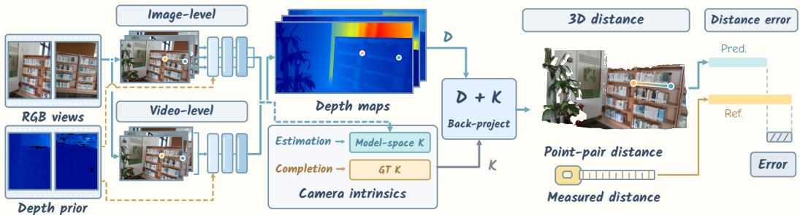  
Figure 1: Overview of the Pumpire evaluation protocol. Pumpire provides a unified evaluation of image- and video-level 3D foundation models under geometry estimation and completion settings. Estimation models recover geometry from RGB inputs, whereas completion models additionally condition on depth priors. Pumpire back-projects depth maps predicted by 3D foundation models with their associated camera intrinsics and quantifies the results with the proposed metrics. Their predicted distance is compared with the physically measured ground truth using the proposed metrics as introduced in Section 4.

Second, existing point-cloud benchmarks are also not designed to directly evaluate metric point-pair distance estimation. Current benchmarks primarily assess geometric fidelity using metrics such as Chamfer Distance, Accuracy, Completion, and F1-Score Wang et al. (2025a); Leroy et al. (2024); Cabon et al. (2025); Wang et al. (2025b), or point-wise reconstruction errors Wang et al., rather than directly evaluating the accuracy of metric distance estimation between arbitrary point pairs. Meanwhile, recent spatial reasoning benchmarks Cheng et al. (2024); Chen et al. (2024); Liao et al. (2024); Guo et al. (2026); Xu et al. (2026) explicitly evaluate metric distance reasoning, but at a coarse, object-level granularity through question answering. Consequently, neither benchmark type directly assesses metric distance estimation at the point level, leaving the ability to recover physical distances between arbitrary point pairs insufficiently evaluated.

Third, there is no evaluation framework that enables unified comparisons of metric 3D foundation models across image- and video-level estimation and completion settings. Existing benchmarks are fragmented: some target image-level estimation Geiger et al. (2013); Silberman et al. (2012); Vasiljevic et al. (2019); Xian et al. (2024) or completion Wang et al. (2026b); Li et al. (2025); Wong et al. (2020); Jung et al. (2023), while others focus on video-level estimation Schroppel et al. (2022);¨ Cong et al. (2025); Schops et al. (2017); Knapitsch et al. (2017) or completion Dai et al. (2017); Shotton et al. (2013). This fragmentation limits unified comparison of 3D foundation models across different settings.

In this work, we make the following contributions:

• We introduce the first unified benchmark for directly evaluating the metric point-pair distance estimation capability of 3D foundation models, enabling unified comparisons across image- and video-level estimation and completion settings.

• We curate a real-world benchmark dataset comprising 100 diverse scenes and 6,400 frames, annotated with physically measured point-pair distances and spanning indoor and outdoor environments with varying levels of difficulty, enabling comprehensive evaluation of metric 3D foundation models under diverse real-world conditions.

• We conduct comprehensive evaluations across 29 baseline configurations of representative 3D foundation models and present empirical insights into metric point-pair distance estimation, revealing the strengths and limitations of different model categories and guiding downstream applications.

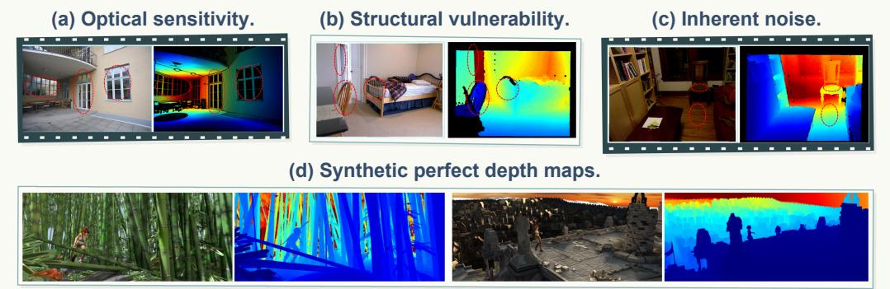  
Figure 2: Limitations of existing depth benchmarks.

## 2 RELATED WORK

## 2.1 GEOMETRY ESTIMATION

Recent 3D foundation models have advanced both cross-domain generalization and metric-scale recovery from visual observations. At the image level, MiDaS Ranftl et al. (2020) and Depth Anything v2 Yang et al. (2024) improve generalization through diverse training data, while Metric3D family Yin et al. (2023); Hu et al. (2024) and Unidepth Piccinelli et al. (2024; 2025) explicitly account for camera geometry to recover metric depth. MoGe-2 Wang et al. instead represents metric geometry through point maps. Beyond single-image prediction, video-level methods exploit geometric constraints across observations. DUSt3R Wang et al. (2024) reconstructs geometry from image pairs, and MASt3R Leroy et al. (2024) augments this formulation with learned correspondences. Extending geometry prediction to multiple views, MUSt3R Cabon et al. (2025), VGGT Wang et al. (2025a), and Depth Anything 3 Lin et al. infer consistent geometry across multiple observations, while CUT3R Wang et al. (2025b) adopts a stateful recurrent formulation that continuously updates a persistent scene representation.

## 2.2 GEOMETRY COMPLETION WITH DEPTH PRIORS

Geometry completion additionally incorporates depth measurements as metric constraints, requiring methods to handle incomplete observations and sensor noise. At the image level, CDM Liu et al. (2025) addresses camera-specific noise, while Lingbot-Depth Tan et al. (2026) refines incomplete and noisy depth through masked depth modeling. To accommodate varying depth coverage, Omnidc Zuo et al. (2025) emphasizes generalization across sparsity patterns, and PriorDA Wang et al. (2025c) combines incomplete metric measurements with dense relative depth predictions. At the video level, MapAnything Keetha et al. (2026) and pi3x Wang et al. (2026a) support both RGB-only and depth- conditioned inference, bridging estimation and completion. Beyond direct input condi tioning, CAPA Ke et al. (2026) incorporates depth observations through parameter-efficient test-time adaptation. These diverse input configurations and inference strategies motivate a unified evaluation of metric point-pair distance estimation, which Pumpire provides to inform model comparison for real-world applications.

## 3 PUMPIRE-6K

Limitations of current benchmarks. In existing real-world datasets, point-pair distances derived from sensor-based depth maps can be inaccurate on reflective or transparent surfaces (Figure 2a), thin structures and object boundaries (Figure 2b), and even ordinary surfaces affected by inherent sensor noise (Figure 2c). Synthetic datasets provide noise-free geometry but may not reflect realworld performance due to the domain gap (Figure 2d). We therefore collect real-world scenes and manually measure physical point-pair distances with a tape measure.

Large-scale collection. We collect pumpire-6k from 100 diverse real-world scenes, including 40 indoor and 60 outdoor scenes. For each scene, we capture a sequence of 200–300 frames and uniformly sample 64 frames to reduce inter-frame redundancy, yielding 6,400 frames in total. Each sequence provides 1280 × 720 RGB images, RGB-aligned depth maps, camera intrinsics, the physically measured distance between two sticker centers, and their pixel coordinates in each frame. We annotate the sticker coordinates using a coarse-to-fine pipeline that combines manual anchor-frame annotation, CoTracker3-based propagation Karaev et al. (2025), and frame-by-frame verification. Further details are provided in Appendix A.

Diverse surface coverage. As discussed above, sensor-derived depth annotations can be unreliable under challenging optical properties, texture patterns, and geometric structures. By physically measuring point-pair distances, we prevent these sensing errors from propagating into the ground truth, allowing pumpire-6k to cover a broad range of such conditions for comprehensive model evaluation. Table 1 summarizes this coverage.

Table 1: Surface coverage of pumpire-6k. “N” denotes the number of scenes containing each property. Categories are not mutually exclusive, as a scene may exhibit multiple properties.
<table><tr><td>Optical properties</td><td>N</td><td>Texture patterns</td><td>N</td><td>Geometric structures</td><td>N</td></tr><tr><td>Common</td><td>84</td><td>Common</td><td>83</td><td>Common</td><td>63</td></tr><tr><td>Transparent surfaces</td><td>12</td><td>Repetitive textures</td><td>13</td><td>Slender structures</td><td>25</td></tr><tr><td>Reflective surfaces</td><td>10</td><td>Textureless regions</td><td>5</td><td>Near sharp edges</td><td>11</td></tr></table>

Randomized viewpoint acquisition. During capture, we randomize the camera trajectories to ensure that the sequences encompass a wide variety of motion modes, exemplified by randomized distance scaling mode (bidirectional near–far transitions), variations in camera orientation, stochastic in-image positioning of stickers, and perspective variations across a wide range of viewing angles and distances. To adapt to the substantial depth variations that arise from such randomized motions, we employ circular stickers of 10 mm in radius, enabling reliable localization across the full range of capture distances.

Together, pumpire-6k combines manually measured point-pair distances and frame-verified pixel annotations with broad coverage of indoor and outdoor environments, local surface properties, and viewing conditions, enabling reliable and comprehensive evaluation of metric point-pair distance estimation.

## 4 PUMPIRE PROTOCOLS

As illustrated in Figure 1, we introduce a unified protocol for evaluating image- and video-level metric 3D models under both estimation and completion settings. For models that directly predict a depth map, we use it as $D ;$ otherwise, we obtain D from the z-coordinates of the predicted pointmap. We then back-project the two annotated pixels into the camera coordinate system and compute their Euclidean distance:

$$
\begin{array} { r } { d _ { \mathrm { p r e d } } = \| { \bf P } _ { 0 } - { \bf P } _ { 1 } \| _ { 2 } , \qquad \mathrm { w h e r e } \quad { \bf P } _ { i } = D ( u _ { i } , v _ { i } ) K ^ { - 1 } [ u _ { i } , v _ { i } , 1 ] ^ { \top } , \quad i \in \{ 0 , 1 \} . } \end{array}\tag{1}
$$

Here, K denotes the camera intrinsics, and the ground-truth distance $d _ { \mathrm { g t } }$ is obtained through physical measurement as described in Section 3.

Let S denote the number of scenes and $M _ { s }$ the number of evaluated frames in scene $s .$ Since the point pair remains fixed within each scene, $d _ { \mathrm { g t } } ^ { ( s ) }$ is shared across all frames. We evaluate each scene using Absolute Error (AE), Relative Error (RE), Logarithmic Error (LE), and Threshold Accuracy $( \delta _ { \tau } ) \colon$ Define the frame-wise absolute error and distance ratio as $e _ { s , j } = \left| d _ { \mathrm { p r e d } } ^ { ( s , j ) } - d _ { \mathrm { g t } } ^ { ( s ) } \right|$ and $r _ { s , j } = $ $d _ { \mathrm { p r e d } } ^ { ( s , j ) } / d _ { \mathrm { g t } } ^ { ( s ) }$ . The scene-level metrics are then

$$
\mathrm { A E } _ { s } = \frac { 1 } { M _ { s } } \sum _ { j = 1 } ^ { M _ { s } } e _ { s , j } .\tag{2}
$$

$$
\mathrm { R E } _ { s } = \frac { 1 } { M _ { s } } \sum _ { j = 1 } ^ { M _ { s } } \frac { e _ { s , j } } { d _ { \mathrm { g t } } ^ { ( s ) } } .\tag{3}
$$

Table 2: Performance of raw sensor depth on normal and challenging scenes. N denotes the number of scenes. AE is reported in meters, and δ metrics are reported as percentages.
<table><tr><td></td><td>N</td><td>AE</td><td>RE</td><td>LE</td><td>RSD</td><td> $\delta _ { 1 . 0 5 }$ </td><td> $\delta _ { 1 . 1 0 }$ </td><td> $\delta _ { 1 }$  25</td></tr><tr><td>Normal</td><td>76</td><td>0.026</td><td>0.038</td><td>0.036</td><td>0.062</td><td>79.32</td><td>92.56</td><td>98.66</td></tr><tr><td>Challenging</td><td>24</td><td>4.047</td><td>8.390</td><td>1.228</td><td>0.887</td><td>21.03</td><td>27.60</td><td>36.72</td></tr><tr><td>Overall</td><td>100</td><td>0.991</td><td>2.043</td><td>0.322</td><td>0.260</td><td>65.33</td><td>76.97</td><td>83.80</td></tr></table>

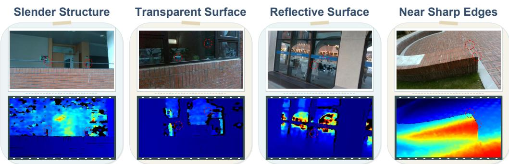  
Figure 3: Representative challenging scenes with unreliable sensor depth. These cases correspond to the challenging subset identified via the RSD threshold (> 0.1).

$$
\mathrm { L E } _ { s } = \frac { 1 } { M _ { s } } \sum _ { j = 1 } ^ { M _ { s } } \left| \log r _ { s , j } \right| .\tag{4}
$$

$$
\delta _ { \tau , s } = \frac { 1 } { M _ { s } } \sum _ { j = 1 } ^ { M _ { s } } \mathbf { 1 } \bigl [ \operatorname* { m a x } \bigl ( r _ { s , j } , r _ { s , j } ^ { - 1 } \bigr ) < \tau \bigr ] .\tag{5}
$$

The benchmark-level result for each metric $q \in \{ \mathrm { A E } , \mathrm { R E } , \mathrm { L E } , \delta _ { \tau } \}$ is obtained by averaging its scene-level values:

$$
q = \frac { 1 } { S } \sum _ { s = 1 } ^ { S } q _ { s } .\tag{6}
$$

To evaluate cross-view consistency, we utilize Relative Standard Deviation (RSD) to measure the normalized variation of predicted distances within each sequence. For sequence s, RSD is defined as

$$
\mathrm { R S D } _ { s } = \frac { 1 } { \bar { d } _ { \mathrm { p r e d } } ^ { ( s ) } } \sqrt { \frac { 1 } { M _ { s } - 1 } \sum _ { j = 1 } ^ { M _ { s } } { \left( d _ { \mathrm { p r e d } } ^ { ( s , j ) } - \bar { d } _ { \mathrm { p r e d } } ^ { ( s ) } \right) ^ { 2 } } } , \qquad \bar { d } _ { \mathrm { p r e d } } ^ { ( s ) } = \frac { 1 } { M _ { s } } \sum _ { j = 1 } ^ { M _ { s } } d _ { \mathrm { p r e d } } ^ { ( s , j ) } .\tag{7}
$$

## 5 BENCHMARKING METRIC 3D FOUNDATION MODELS

## 5.1 SCENE DIFFICULTY SPLIT VIA CROSS-VIEW CONSISTENCY

Severe failures on a small number of difficult scenes can dominate aggregate metrics and obscure performance on typical cases. We therefore report results separately on normal and challenging scenes. Since raw depth sensors are affected by optical and geometric conditions that also challenge learned 3D models, we use sensor reliability as a proxy for scene difficulty. Specifically, we measure the cross-view variation of point-pair distances derived from raw sensor depth using $\mathrm { R } \dot { \mathrm { S D } } _ { \mathrm { s e n s o r } }$ , with higher values indicating less reliable depth measurements. Using an empirical threshold of 0.1, we identify 24 challenging scenes and 76 normal scenes. Table 2 summarizes the sensor performance on both subsets, and Figure 3 shows representative challenging scenes.

Table 3: Quantitative results for image-level geometry estimation. The top-3 results are high lighted as first , second , and third , the same highlighting applies below.
<table><tr><td></td><td colspan="7">Normal</td><td colspan="7"></td></tr><tr><td>Model</td><td>AE↓</td><td>RE↓</td><td>LE↓</td><td>RSD↓</td><td>δ1.05 ↑</td><td>δ1.10 ↑</td><td> $\delta _ { 1 . 2 5 } \uparrow$ </td><td>Rank↓ AE↓</td><td>RE↓</td><td>LE↓</td><td>RSD↓</td><td>δ1.05 ↑</td><td> $\delta _ { 1 . 1 0 }$  ←</td><td> $\delta _ { 1 . 2 5 }$ </td><td>↑ Rank↓</td></tr><tr><td>Metric3D</td><td>1.180</td><td>1.695</td><td>0.828</td><td>0.347</td><td>8.02</td><td>14.68</td><td>27.82 8.00</td><td>5.004</td><td>9.273</td><td>1.299</td><td>0.672</td><td>7.68</td><td>14.13</td><td>23.11</td><td>8.00</td></tr><tr><td>MoGe-3</td><td>0.208</td><td>0.292</td><td>0.236</td><td>0.084</td><td>18.89</td><td>35.49</td><td>59.89</td><td>6.00</td><td>0.158 0.275</td><td>0.228</td><td>0.112</td><td>12.63</td><td>26.82</td><td>58.20</td><td>3.00</td></tr><tr><td>Depth Pro</td><td>0.135</td><td>0.196</td><td>0.234</td><td>0.154</td><td>17.74</td><td>32.98</td><td>65.30</td><td>5.57</td><td>0.171 0.426</td><td>0.250</td><td>0.220</td><td>15.82</td><td>31.58</td><td>68.10</td><td>2.86</td></tr><tr><td>Unidepth</td><td>0.159</td><td>0.220</td><td>0.207</td><td>0.134</td><td>20.00</td><td>38.38</td><td>68.44</td><td>4.86</td><td>0.943 1.941</td><td>0.676</td><td>0.337</td><td>15.10</td><td>26.24</td><td>42.90</td><td>6.29</td></tr><tr><td>MoGe-2</td><td>0.176</td><td>0.242 0.204</td><td></td><td>0.086</td><td>23.40</td><td>40.93</td><td>63.08</td><td>4.71</td><td>0.202 0.355</td><td>0.258</td><td>0.206</td><td>15.95</td><td>30.21</td><td>57.03</td><td>3.43</td></tr><tr><td>MetricAnything</td><td>0.145</td><td>0.194 0.176</td><td></td><td>0.089</td><td>25.00</td><td>41.28</td><td>66.96</td><td>3.43</td><td>0.333 0.743</td><td>0.315</td><td>0.242</td><td>18.68</td><td>35.35</td><td>64.84</td><td>3.57</td></tr><tr><td>Unidepthv2</td><td>0.099</td><td>0.136 0.137</td><td></td><td>0.097</td><td>26.01</td><td>48.48</td><td>79.61</td><td>2.43</td><td>1.059</td><td>2.644 0.583</td><td>0.290</td><td>19.53</td><td>37.37</td><td>54.69</td><td>4.86</td></tr><tr><td>Metric3D v2</td><td>0.073 0.106 0.104 0.068</td><td></td><td></td><td></td><td>31.00</td><td>56.00</td><td>90.42</td><td>1.00</td><td>1.126</td><td>1.854 0.513</td><td>0.434</td><td>20.57</td><td>41.99</td><td>65.95</td><td>4.00</td></tr></table>

Table 4: Quantitative results for video-level geometry estimation. pi3x and MapAnything also support depth-prior conditioning; their results are reported in Table 6.
<table><tr><td></td><td colspan="7">Normal</td><td colspan="7">Challenging</td></tr><tr><td>Model</td><td>AE↓</td><td>RE↓</td><td>LE↓</td><td>RSD↓ δ1.05 ↑</td><td> $\delta _ { 1 . 1 0 }$ </td><td>↑ δ1.25 ↑</td><td>Rank↓</td><td>AE↓</td><td>RE↓</td><td>LE↓</td><td>RSD↓</td><td>δ1.05 ↑</td><td>δ1.10 ↑ δ1.25</td><td>个 Rank↓</td></tr><tr><td>MapAnything</td><td>0.295</td><td>0.404</td><td>0.312 0.061</td><td>9.14</td><td>18.79</td><td>37.66</td><td>5.57</td><td>0.560</td><td>1.750</td><td>0.440 0.190</td><td>4.90</td><td>8.40</td><td>43.40</td><td>4.43</td></tr><tr><td>MASt3R</td><td>0.126</td><td>0.188</td><td>0.207 0.088</td><td>16.26</td><td>31.90</td><td>62.48</td><td>4.57</td><td>1.036</td><td>2.206 0.677</td><td>0.515</td><td>11.47</td><td>18.59</td><td>38.26</td><td>5.57</td></tr><tr><td>pi3x</td><td>0.129</td><td>0.184 0.206</td><td>0.037</td><td>18.35</td><td>34.08</td><td>60.80</td><td>4.00</td><td>0.185</td><td>0.402 0.254</td><td>0.136</td><td>11.48</td><td>25.38</td><td>63.09</td><td>2.14</td></tr><tr><td>MUSt3R</td><td>0.120 0.174 0.193</td><td></td><td>0.095</td><td>22.71</td><td>38.96</td><td>67.50</td><td>3.29</td><td>0.996</td><td>2.1160.671</td><td>0.497</td><td>10.69</td><td>19.36</td><td>41.99</td><td>4.86</td></tr><tr><td>CUT3R</td><td>0.110 0.155 0.156</td><td></td><td>0.090</td><td>22.65</td><td>42.39</td><td>76.12</td><td>2.57</td><td>0.330 0.646 0.342</td><td></td><td>0.310</td><td>17.49</td><td>33.85</td><td>63.27</td><td>2.71</td></tr><tr><td>Depth Anything 3</td><td>0.078 0.108 0.102</td><td></td><td>0.029</td><td>30.52</td><td>54.16</td><td>92.25</td><td>1.00</td><td>0.167</td><td>0.432 0.219</td><td>0.174</td><td>21.16</td><td>38.66</td><td>81.56</td><td>1.29</td></tr></table>

## 5.2 QUANTITATIVE RESULTS FOR 3D FOUNDATION MODELS ON OUR BENCHMARK

Baselines. We benchmark 29 representative baseline configurations spanning four settings: imagelevel estimation (8), image-level completion (10), video-level estimation (6), and video-level completion (5). All evaluated models predict scene geometry at absolute scale, enabling direct comparison under our unified distance-evaluation protocol. The complete model list, including the evaluated variants and backbones, is provided in Appendix B.

Back-projection protocol. As later demonstrated in Finding 1, point-pair distance estimation depends on the coupling between depth and camera intrinsics. We therefore back-project predicted depth using the intrinsics associated with its camera space: predicted intrinsics (or canonical intrinsics for Metric3D Yin et al. (2023) and Metric3D v2 Hu et al. (2024)) for estimation models, and ground-truth intrinsics for completion models conditioned on sensor depth. For video-level evaluation, we sample 32 groups of 10 frames per scene and average the metrics across all predictions. Video-level completion models additionally receive sensor-depth priors, with both depth and intrinsics provided to MapAnything Keetha et al. (2026) and pi3x Wang et al. (2026a).

Image-level geometry estimation models. As shown in Table 3, Metric3D v2 Hu et al. (2024) achieves the best average rank on the normal subset, followed by Unidepthv2 Piccinelli et al. (2025) and MetricAnything Ma et al. (2026). On the challenging subset, Depth Pro Bochkovskiy et al. (2025) and MoGe-3 Kong et al. (2026) rank first and second, respectively, while Metric3D v2 drops substantially in average rank. These results suggest that strong performance under normal conditions does not necessarily generalize to challenging scenes.

Video-level geometry estimation models. As shown in Table 4, Depth Anything 3 Lin et al. ranks first on both subsets. On the challenging subset, pi3x Wang et al. (2026a) improves from fourth to second in average rank, whereas MUSt3R Cabon et al. (2025) drops from third to fifth. Both pi3x and MapAnything Keetha et al. (2026) support depth-prior conditioning, with the corresponding completion results reported in Table 6.

Image-level geometry completion models. As shown in Table 5, Lingbot-Depth Tan et al. (2026) ranks first on both the normal and challenging subsets. The relative ordering of the other methods changes markedly across the two subsets. In particular, CDM-L515 and CDM-D435 Liu et al. (2025) move from eighth and seventh place on the normal subset to second and third on the challenging subset, whereas Omni-dc Zuo et al. (2025) and LDCM Yu et al. (2026b) drop in average rank.

Table 5: Quantitative results for image-level geometry completion with sensor depth prior. We input the sensor depth as the prior without any preprocessing.
<table><tr><td></td><td colspan="8">Normal</td><td colspan="8">Challenging</td></tr><tr><td>Model</td><td>AE↓</td><td>RE↓</td><td>LE↓</td><td>RSD↓</td><td>δ1.05 ↑</td><td>δ1.10 ↑</td><td> $\delta _ { 1 . 2 5 } \uparrow$ </td><td>Rank↓</td><td>AE↓</td><td>RE↓</td><td>LE↓</td><td>RSD↓</td><td>δ1.05 ↑</td><td>δ1.10 ↑</td><td>δ1.25 ↑</td><td>Rank↓</td></tr><tr><td>PromptDA</td><td>0.081</td><td>0.111</td><td>0.108</td><td>0.145</td><td>54.26</td><td>72.88</td><td>87.75</td><td>9.71</td><td>1.412</td><td>2.610</td><td>0.871</td><td>0.727</td><td>9.90</td><td>17.84</td><td>28.91</td><td>5.86</td></tr><tr><td>Marigold-dc</td><td>0.077</td><td>0.112</td><td>0.079</td><td>0.153</td><td>63.38</td><td>79.38</td><td>92.33</td><td>9.29</td><td>3.813</td><td>8.175</td><td>1.296</td><td>0.783</td><td>12.04</td><td>18.29</td><td>29.23</td><td>8.71</td></tr><tr><td>CDM-L515</td><td></td><td>0.0460.057 0.056</td><td></td><td>0.050</td><td>64.14</td><td>86.99</td><td>97.10</td><td>7.00</td><td>2.569</td><td>7.541</td><td>0.759</td><td>0.672</td><td>26.43</td><td>38.93</td><td>50.59</td><td>3.00</td></tr><tr><td>CDM-D435</td><td>0.043</td><td>0.0530.051</td><td></td><td>0.052</td><td>71.57</td><td>87.69</td><td>96.69</td><td>6.43</td><td>2.721</td><td>5.079</td><td>0.907</td><td>0.462</td><td>26.69</td><td>37.24</td><td>48.37</td><td>3.14</td></tr><tr><td>DepthLab</td><td>0.031</td><td>0.046</td><td>0.044</td><td>0.064</td><td>69.65</td><td>89.14</td><td>98.70</td><td>5.57</td><td>4.010</td><td>8.394</td><td>1.237</td><td>0.837</td><td>17.06</td><td>24.02</td><td>34.38</td><td>8.71</td></tr><tr><td>PriorDA</td><td>0.037</td><td>0.048</td><td>0.041</td><td>0.067</td><td>78.54</td><td>93.61</td><td>98.52</td><td>5.00</td><td>2.602</td><td>5.383</td><td>0.990</td><td>0.730</td><td>20.83</td><td>30.27</td><td>45.31</td><td>4.86</td></tr><tr><td>InfiniDepth</td><td>0.028</td><td>30.0410.039</td><td></td><td>0.057</td><td>77.55</td><td>91.84</td><td>98.33</td><td>4.86</td><td>3.129</td><td>6.066</td><td>1.072</td><td>0.705</td><td>26.37</td><td>33.40</td><td>43.55</td><td>4.86</td></tr><tr><td>LDCM</td><td>0.025</td><td>0.0380.036</td><td></td><td>0.056</td><td>78.95</td><td>92.82</td><td>98.66</td><td>3.00</td><td>3.975</td><td>8.158 1.209</td><td></td><td>0.897</td><td>21.68</td><td>27.60</td><td>37.43</td><td>7.43</td></tr><tr><td>Omni-dc</td><td>0.025</td><td>0.037</td><td>0.036</td><td>0.055</td><td>77.98</td><td>92.72</td><td>98.85</td><td>2.86</td><td>3.739</td><td>7.817</td><td>1.185</td><td>0.845</td><td>19.34</td><td>26.17</td><td>37.17</td><td>7.29</td></tr><tr><td>Lingbot-Depth</td><td></td><td>0.022 0.029 0.028</td><td></td><td>0.034</td><td>84.52</td><td>98.46</td><td>99.81</td><td>1.00</td><td>1.045</td><td>2.628</td><td></td><td>0.576 0.386</td><td>47.92</td><td>58.98</td><td>67.12</td><td>1.14</td></tr></table>

Table 6: Quantitative results for video-level geometry completion with sensor depth prior. We input the sensor depth for every view as the prior without any preprocessing. “CAPA \*” means CAPA framework supported by “\*” pretrained model.
<table><tr><td></td><td colspan="8">Normal</td><td colspan="8">Challenging</td></tr><tr><td>Model</td><td>AE↓</td><td>RE↓</td><td>LE↓</td><td>RSD↓</td><td> $\delta _ { 1 . 0 5 }$  ←</td><td> $\delta _ { 1 . 1 0 } \mathrm { ~ } ^ { \cdot }$  个</td><td> $\delta _ { 1 . 2 5 } \uparrow$ </td><td>Rank↓</td><td>AE↓</td><td>RE↓</td><td>LE↓</td><td>RSD↓</td><td> $\delta _ { 1 . 0 5 } \uparrow \delta _ { 1 . 1 0 } \uparrow \delta _ { 1 . 2 5 } \uparrow$ </td><td></td><td></td><td>Rank↓</td></tr><tr><td>pi3x</td><td>0.097</td><td>0.131</td><td>0.139</td><td>0.062</td><td>26.43</td><td>44.76</td><td>80.46</td><td>5.00</td><td>2.811</td><td>5.781</td><td>1.079</td><td>0.911</td><td>8.42</td><td>15.91</td><td>37.83</td><td>4.43</td></tr><tr><td>MapAnything</td><td>0.028</td><td>0.040</td><td>0.038</td><td>0.053</td><td>77.44</td><td>93.67</td><td>98.76</td><td>4.00</td><td>3.334</td><td>7.172</td><td>1.117</td><td>0.839</td><td>20.96</td><td>28.61</td><td>39.64</td><td>4.14</td></tr><tr><td>CAPA-MoGe2</td><td>0.019</td><td>0.027</td><td>0.027</td><td>0.027</td><td>85.42</td><td>96.95</td><td>99.76</td><td>2.29</td><td>2.351</td><td>4.692</td><td>1.037</td><td>0.524</td><td>21.43</td><td>26.26</td><td>37.07</td><td>2.43</td></tr><tr><td>CAPA-Unidepthv2</td><td>0.018</td><td>0.027</td><td>0.027</td><td>0.027</td><td>86.15</td><td>97.25</td><td>99.76</td><td>1.86</td><td>2.522</td><td>4.99</td><td>1.041</td><td>0.607</td><td>25.69</td><td>31.94</td><td>41.97</td><td>2.57</td></tr><tr><td>CAPA-VGGT</td><td>0.016 0.022</td><td></td><td>0.022</td><td>0.028</td><td>91.44</td><td>98.71</td><td>99.89</td><td>1.29</td><td>2.352</td><td>4.811</td><td>0.974</td><td>0.604</td><td>31.48</td><td>38.14</td><td>44.87</td><td>1.43</td></tr></table>

Video-level geometry completion models. As shown in Table 6, the three CAPA variants Ke et al. (2026) achieve the top three average ranks on both subsets, with CAPA-VGGT ranking first. On the challenging subset, CAPA-MoGe2 achieves the lowest AE, RE, and RSD, whereas CAPA-VGGT achieves the lowest LE and the highest threshold accuracies.

## 6 COMPREHENSIVE INSIGHTS

We first examine the coupling between predicted depth and camera intrinsics. We then analyze the performance characteristics of different 3D foundation models under our unified point-pair distance evaluation protocol. Unless otherwise specified, we use the normal subset to characterize general performance and both subsets for robustness analysis. Additional qualitative results are provided in the appendix G.

Direct evaluation of point-pair distance estimation. To investigate why direct evaluation is necessary, we conduct two experiments. First, we evaluate five image-level geometry estimation models on standard depth and camera-intrinsics benchmarks. Table 7 summarizes their average ranks (see full results in appendix E). The rankings exhibit obvious task-specific discrepancies: Unidepth performs best on depth but relatively poorly on intrinsics, whereas MoGe-2 shows the opposite trend. Moreover, despite achieving the best combined depth–intrinsics rank, MoGe-2 is outperformed by Unidepthv2 on Pumpire (Table 3). Second, under the Pumpire evaluation protocol, we replace each model’s predicted intrinsics with ground-truth intrinsics when back-projecting its predicted depth, which degrades performance in most cases. These results demonstrate that point-pair distance esti mation depends on depth–intrinsics coupling and cannot be reliably characterized by separate benchmarks, motivating its direct evaluation.

Finding 1: The coupling between predicted depth and camera intrinsics renders their separate evaluation insufficient for reliably characterizing point-pair distance estimation.

Sensor depth versus learned 3D foundation models. We provide the first quantified comparison between raw sensor depth and learned 3D foundation models for point-pair distance estimation. On normal scenes (Figure 4a), raw RealSense D435 depth is a remarkably strong baseline: only 5 of the 18 baseline configurations approach or surpass its $\delta _ { 1 . 0 5 } ,$ all of them completion models (Lingbot-Depth, PriorDA, Omni-dc, LDCM, and InfiniDepth), while the best estimation model reaches barely half its accuracy. The ordering reverses on challenging scenes, where 16 of the 18 baseline configurations achieve a lower RE than the sensor: optical sensitivity and structural vulnerability invalidate active measurement, whereas learned models fall back on geometric priors.

Table 7: Average rank (Rank ↓) of each model on the depth benchmark (12 metrics) and the intrinsics benchmark (24 metrics). Bold: best; underlined: second best.
<table><tr><td>Benchmark</td><td>Depth Pro</td><td>MoGe-2</td><td>MetricAnything</td><td>Unidepth</td><td>Unidepthv2</td></tr><tr><td>Depth benchmark</td><td>4.25</td><td>2.83</td><td>2.75</td><td>2.08</td><td>2.83</td></tr><tr><td>Intrinsics benchmark</td><td>2.89</td><td>1.00</td><td>1.50</td><td>3.46</td><td>3.83</td></tr><tr><td>Overall rank</td><td>3.57</td><td>1.92</td><td>2.13</td><td>2.77</td><td>3.33</td></tr></table>

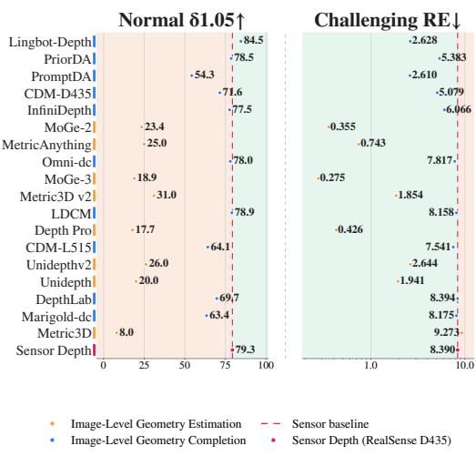  
(a)

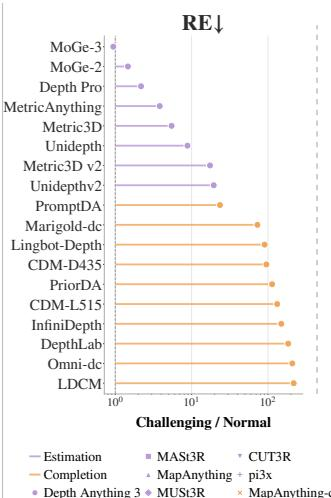

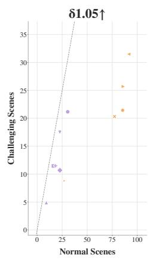  
(b)  
Figure 4: (a) Image-level geometry estimation (orange) and completion (blue) versus raw RealSense D435 depth: $\delta _ { 1 . 0 5 }$ on normal scenes and RE on challenging scenes. Red dashed lines mark the sensor baseline; green regions indicate better performance. (b) Robustness of geometry estimation (purple) and completion (orange): challenging-to-normal RE ratios for image-level models (left), and $\delta _ { 1 . 0 5 }$ on normal (x-axis) versus challenging (y-axis) scenes for multi-view models (right). Lower RE ratios indicate less degradation; points closer to the dashed $y = x$ line indicate more consistent accuracy across scene difficulty. The suffix $\ " - \mathrm { c } ^ { \prime \prime }$ in MapAnything-c and pi3x-c denotes their geometry completion settings with depth priors.

Finding 2: Raw sensor depth is highly reliable on benign surfaces, but under challenging sensing conditions learned 3D foundation models are far more robust and surpass it.

Distinct robustness patterns of estimation and completion. Figure 4b contrasts the two families across scene difficulty. The challenging-to-normal RE ratio (left) yields a non-overlapping separation: estimation models stay within 1–20×, whereas completion models degrade by 20–210×; the multi-view scatter (right) shows the same contrast, with estimation models lying near the $y = x$ line and completion models far below it. Yet larger degradation does not imply inferiority, as the completion cluster still attains the highest $\delta _ { 1 . 0 5 }$ on both subsets. The two families therefore differ in robustness patterns: completion models are precise on most frames but suffer catastrophic outliers on optically and structurally degraded regions that inflate RE, whereas estimation models trade peak accuracy for uniformly bounded errors.

Finding 3: Completion and estimation models exhibit distinct robustness patterns: the former attains higher peak accuracy but degrades catastrophically on challenging scenes, the latter keeps errors bounded throughout.

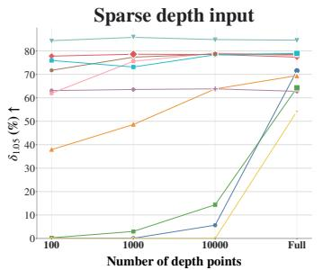  
(a)

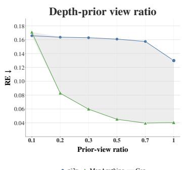  
(b)

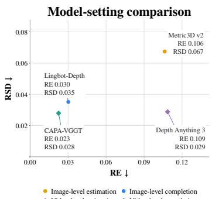  
(c)  
Figure 5: (a) Image-level completion accuracy $( \delta _ { 1 . 0 5 } )$ with 100, 1,000, or 10,000 randomly sampled depth points, or full sensor depth (Full). (b) Video-level completion RE as the fraction of views with depth priors increases from 0.1 to 1.0; shading indicates the gap between models. Enlarged markers in (a,b) highlight each model’s best setting. (c) RE versus RSD of predicted distances for representative image- and video-level estimation and completion models. Points closer to the lowerleft corner indicate greater accuracy and cross-frame consistency.

Sparsely-sampled depth prior for image-level estimation models. We randomly sample 100, 1,000, or 10,000 pixels from each sensor depth map as input priors, using the full depth map as a reference. Figure 5a reveals a counterintuitive result: increasing the number of depth points does not consistently improve completion accuracy, and several models perform best at intermediate densities. Completion models inherently face two distinct challenges: sparsity and sensor noise. Sparse inputs contain fewer geometric constraints but exclude much of the measurement noise, whereas full depth maps provide denser observations while retaining the complete sensor-noise pattern. Thus, performance is jointly determined by the model’s robustness to both sparsity and noise.

Finding 4: Geometry completion requires jointly addressing input sparsity and sensor noise;   
consequently, denser depth priors do not necessarily yield better performance.

Offering models with different numbers of depth priors. We ablate the fraction of views with sensor-depth priors as $\rho \in \{ 0 . 1 , 0 . 2 , 0 . 3 , 0 . 5 , 0 . 7 , 1 . 0 \}$ . Since MapAnything Keetha et al. (2026) and pi3x Wang et al. (2026a) are the only evaluated models that support partial per-view depth conditioning, we report results for these two methods. As shown in Figure 5b, RE decreases consistently for both models as ρ increases, demonstrating the benefit of additional depth priors. The improvement is substantially larger for MapAnything, whereas pi3x exhibits a more gradual reduction. This contrast indicates that models differ considerably in their ability to integrate metric cues across views.

Finding 5: Additional depth priors generally improve video-level completion, but the benefit depends on the model’s ability to integrate metric information across views.

Comparison across model settings. We analyze RE and RSD of the best-performing model from each of the four settings on the normal subset (Figure 5c). Moving from image-level estimation (Metric3D v2) to video-level estimation (Depth Anything 3) yields comparable RE (0.106 vs. 0.109) but substantially lower RSD (0.067 vs. 0.029), suggesting that multi-view models achieve better cross-view consistency. In contrast, the image-level completion model (Lingbot-Depth) achieves substantially lower RE than the estimation models, while attaining an RSD comparable to that of the video-level models (0.035 vs. 0.028 and 0.029, respectively), suggesting that per-view metric depth priors anchor independently predicted geometry to a consistent physical scale, thereby improving both metric accuracy and cross-view consistency. Video-level completion (CAPA-VGGT), which combines depth priors with multi-view context, achieves the lowest RE and RSD overall.

Finding 6: Multi-view estimation improves consistency, depth-conditioned completion improves both accuracy and consistency, and combining both performs best overall.

## 7 CONCLUSION

We introduced Pumpire, a unified benchmark for directly evaluating the metric point-pair distance estimation capability of 3D foundation models. To support this evaluation, we constructed pumpire-6k with 100 real-world scenes and 6,400 frames annotated with physically measured distances, spanning diverse indoor and outdoor environments, surface properties, and viewing conditions. Our protocol enables unified comparison across image- and video-level geometry estimation and completion models. We systematically evaluate 29 baseline configurations and conduct in-depth analyses, revealing the necessity of direct distance evaluation, distinct accuracy–robustness trade-offs across model families and sensing conditions, and the effects of multi-view context and depth priors on distance accuracy and cross-view consistency.

## AI USE STATEMENT

In this work, we used ChatGPT for programming assistance, language polishing, and visual refinement of paper figures. We did not use generative AI tools to generate research ideas, determine the technical methodology, collect the dataset, or annotate the dataset, and other tasks requiring disclosure are not applicable to this work. All AI-assisted text, code, and visual materials were reviewed and verified by the authors. We take responsibility for the final content of this work, including text, claims, code, figures, and other artifacts produced with the aid of generative AI.

## REFERENCES

Iro Armeni, Sasha Sax, Amir R Zamir, and Silvio Savarese. Joint 2d-3d-semantic data for indoor scene understanding. arXiv preprint arXiv:1702.01105, 2017.

Alexey Bochkovskiy, Amael Delaunoy, Hugo Germain, Marcel Santos, Yichao Zhou, Stephan¨ Richter, and Vladlen Koltun. Depth pro: Sharp monocular metric depth in less than a second. In International Conference on Learning Representations, volume 2025, pp. 75602–75637, 2025.

Yohann Cabon, Lucas Stoffl, Leonid Antsfeld, Gabriela Csurka, Boris Chidlovskii, Jerome Revaud, and Vincent Leroy. Must3r: Multi-view network for stereo 3d reconstruction. In 2025 IEEE/CVF Conference on Computer Vision and Pattern Recognition (CVPR), pp. 1050–1060. IEEE, 2025.

Holger Caesar, Varun Bankiti, Alex H Lang, Sourabh Vora, Venice Erin Liong, Qiang Xu, Anush Krishnan, Yu Pan, Giancarlo Baldan, and Oscar Beijbom. nuscenes: A multimodal dataset for autonomous driving. In 2020 IEEE/CVF conference on computer vision and pattern recognition (CVPR), pp. 11618–11628. IEEE, 2020.

Boyuan Chen, Zhuo Xu, Sean Kirmani, Brain Ichter, Dorsa Sadigh, Leonidas Guibas, and Fei Xia. Spatialvlm: Endowing vision-language models with spatial reasoning capabilities. In Proceedings of the IEEE/CVF conference on computer vision and pattern recognition, pp. 14455–14465, 2024.

An-Chieh Cheng, Hongxu Yin, Yang Fu, Qiushan Guo, Ruihan Yang, Jan Kautz, Xiaolong Wang, and Sifei Liu. Spatialrgpt: Grounded spatial reasoning in vision-language models. Advances in Neural Information Processing Systems, 37:135062–135093, 2024.

Wenyan Cong, Yiqing Liang, Yancheng Zhang, Ziyi Yang, Yan Wang, Boris Ivanovic, Marco Pavone, Chen Chen, Zhangyang Wang, and Zhiwen Fan. E3d-bench: A benchmark for endto-end 3d geometric foundation models. arXiv preprint arXiv:2506.01933, 2025.

Angela Dai, Angel X Chang, Manolis Savva, Maciej Halber, Thomas Funkhouser, and Matthias Nießner. Scannet: Richly-annotated 3d reconstructions of indoor scenes. In 2017 IEEE conference on computer vision and pattern recognition (CVPR), pp. 2432–2443. IEEE, 2017.

Andreas Geiger, Philip Lenz, Christoph Stiller, and Raquel Urtasun. Vision meets robotics: The kitti dataset. The international journal ofrobotics research, 32(11):1231–1237, 2013.

Xianda Guo, Ruijun Zhang, Yiqun Duan, Yuhang He, Dujun Nie, Wenke Huang, Chenming Zhang, Shuai Liu, Hao Zhao, and Long Chen. Surds: Benchmarking spatial understanding and reasoning in driving scenarios with vision language models. Advances in Neural Information Processing Systems, 38, 2026.

Antti Hietanen, Jyrki Latokartano, Alessandro Foi, Roel Pieters, Ville Kyrki, Minna Lanz, and Joni-Kristian Kam¨ ar¨ ainen. Benchmarking pose estimation for robot manipulation. ¨ Robotics and Autonomous Systems, 143:103810, 2021.

Mu Hu, Wei Yin, Chi Zhang, Zhipeng Cai, Xiaoxiao Long, Hao Chen, Kaixuan Wang, Gang Yu, Chunhua Shen, and Shaojie Shen. Metric3d v2: A versatile monocular geometric foundation model for zero-shot metric depth and surface normal estimation. IEEE Transactions on Pattern Analysis and Machine Intelligence, 46(12):10579–10596, 2024.

Ning Hu, Senhao Cao, and Maochen Li. Reliability-aware execution gating for near-field and offaxis vision-guided robotic alignment. arXiv preprint arXiv:2602.08466, 2026.

HyunJun Jung, Patrick Ruhkamp, Guangyao Zhai, Nikolas Brasch, Yitong Li, Yannick Verdie, Jifei Song, Yiren Zhou, Anil Armagan, Slobodan Ilic, et al. On the importance of accurate geometry data for dense 3d vision tasks. In Proceedings ofthe IEEE/CVF Conference on Computer Vision and Pattern Recognition, pp. 780–791, 2023.

Nikita Karaev, Yuri Makarov, Jianyuan Wang, Natalia Neverova, Andrea Vedaldi, and Christian Rupprecht. Cotracker3: Simpler and better point tracking by pseudo-labeling real videos. In 2025 IEEE/CVF International Conference on Computer Vision (ICCV), pp. 1–10. IEEE, 2025.

Bingxin Ke, Qunjie Zhou, Jiahui Huang, Xuanchi Ren, Tianchang Shen, Konrad Schindler, Laura Leal-Taixe, and Shengyu Huang. Depth completion as parameter-efficient test-time adaptation.´ arXiv preprint arXiv:2602.14751, 2026.

Nikhil Keetha, Norman Muller, Johannes Sch¨ onberger, Lorenzo Porzi, Yuchen Zhang, Tobias Fis-¨ cher, Arno Knapitsch, Duncan Zauss, Ethan Weber, Nelson Antunes, et al. Mapanything: Universal feed-forward metric 3d reconstruction; map-anything. github. io. In 2026 International Conference on 3D Vision (3DV), pp. 499–509. IEEE, 2026.

Arno Knapitsch, Jaesik Park, Qian-Yi Zhou, and Vladlen Koltun. Tanks and temples: Benchmarking large-scale scene reconstruction. ACM Transactions on Graphics (ToG), 36(4):1–13, 2017.

Lingyu Kong, Ruicheng Li, Ruicheng Wang, Sicheng Xu, Chengtang Yao, Jianfeng Xiang, and Jiaolong Yang. Moge-3: Fine-detail monocular geometry estimation with self-guided sparse volumetric refinement. arXiv e-prints, pp. arXiv–2607, 2026.

Vincent Leroy, Yohann Cabon, and Jer´ ome Revaud. Grounding image matching in 3d with mast3r.ˆ In European conference on computer vision, pp. 71–91. Springer, 2024.

Zhengqi Li and Noah Snavely. Megadepth: Learning single-view depth prediction from internet photos. In 2018 IEEE/CVF Conference on Computer Vision and Pattern Recognition, pp. 2041– 2050. IEEE, 2018.

Zhenyu Li, Haotong Lin, Jiashi Feng, Peter Wonka, and Bingyi Kang. Benchdepth: Are we on the right way to evaluate depth foundation models? arXiv preprint arXiv:2507.15321, 2025.

Yuan-Hong Liao, Rafid Mahmood, Sanja Fidler, and David Acuna. Reasoning paths with reference objects elicit quantitative spatial reasoning in large vision-language models. In Proceedings of the 2024 Conference on Empirical Methods in Natural Language Processing, pp. 17028–17047, 2024.

Haotong Lin, Sili Chen, Junhao Liew, Donny Y Chen, Zhenyu Li, Guang Shi, Jiashi Feng, and Bingyi Kang. Depth anything 3: Recovering the visual space from any views,(2025). arXiv preprint arXiv:2511.10647, 5.

Haotong Lin, Sida Peng, Jingxiao Chen, Songyou Peng, Jiaming Sun, Minghuan Liu, Hujun Bao, Jiashi Feng, Xiaowei Zhou, and Bingyi Kang. Prompting depth anything for 4k resolution accurate metric depth estimation. In 2025 IEEE/CVF Conference on Computer Vision and Pattern Recognition (CVPR), pp. 17070–17080. IEEE, 2025.

Minghuan Liu, Zhengbang Zhu, Xiaoshen Han, Peng Hu, Haotong Lin, Xinyao Li, Jingxiao Chen, Jiafeng Xu, Yichu Yang, Yunfeng Lin, et al. Manipulation as in simulation: Enabling accurate geometry perception in robots. arXiv preprint arXiv:2509.02530, 2025.

Zhiheng Liu, Ka Leong Cheng, Qiuyu Wang, Shuzhe Wang, Hao Ouyang, Bin Tan, Kai Zhu, Yujun Shen, Qifeng Chen, and Ping Luo. Depthlab: From partial to complete. arXiv preprint arXiv:2412.18153, 2024.

Baorui Ma, Jiahui Yang, Donglin Di, Xuancheng Zhang, Jianxun Cui, Hao Li, Yan Xie, and Wei Chen. Metricanything: Scaling metric depth pretraining with noisy heterogeneous sources. arXiv preprint arXiv:2601.22054, 2026.

Wufei Ma, Luoxin Ye, Celso M de Melo, Alan Yuille, and Jieneng Chen. Spatialllm: A compound 3d-informed design towards spatially-intelligent large multimodal models. In Proceedings of the Computer Vision and Pattern Recognition Conference, pp. 17249–17260, 2025.

Luigi Piccinelli, Yung-Hsu Yang, Christos Sakaridis, Mattia Segu, Siyuan Li, Luc Van Gool, and Fisher Yu. Unidepth: Universal monocular metric depth estimation. In 2024 IEEE/CVF Conference on Computer Vision and Pattern Recognition (CVPR), pp. 10106–10116. IEEE, 2024.

Luigi Piccinelli, Christos Sakaridis, Yung-Hsu Yang, Mattia Segu, Siyuan Li, Wim Abbeloos, and Luc Van Gool. Unidepthv2: Universal monocular metric depth estimation made simpler. IEEE Transactions on Pattern Analysis and Machine Intelligence, 2025.

Rene Ranftl, Katrin Lasinger, David Hafner, Konrad Schindler, and Vladlen Koltun. Towards robust´ monocular depth estimation: Mixing datasets for zero-shot cross-dataset transfer. IEEE transactions on pattern analysis and machine intelligence, 44(3):1623–1637, 2020.

Paul-Edouard Sarlin, Mihai Dusmanu, Johannes L Schonberger, Pablo Speciale, Lukas Gruber, Vik-¨ tor Larsson, Ondrej Miksik, and Marc Pollefeys. Lamar: Benchmarking localization and mapping for augmented reality. In European Conference on Computer Vision, pp. 686–704. Springer, 2022.

Thomas Schops, Johannes L Schonberger, Silvano Galliani, Torsten Sattler, Konrad Schindler, Marc Pollefeys, and Andreas Geiger. A multi-view stereo benchmark with high-resolution images and multi-camera videos. In Proceedings of the IEEE conference on computer vision and pattern recognition, pp. 3260–3269, 2017.

Philipp Schroppel, Jan Bechtold, Artemij Amiranashvili, and Thomas Brox. A benchmark and a¨ baseline for robust multi-view depth estimation. In 2022 International Conference on 3D Vision (3DV), pp. 637–645. IEEE, 2022.

Changyue Shi, Minghao Chen, Yiping Mao, Chuxiao Yang, Xinyuan Hu, Jiajun Ding, and Zhou Yu. Realm: An mllm-agent framework for open world 3d reasoning segmentation and editing on gaussian splatting. In Proceedings of the IEEE/CVF Conference on Computer Vision and Pattern Recognition, pp. 16779–16788, 2026.

Jamie Shotton, Ben Glocker, Christopher Zach, Shahram Izadi, Antonio Criminisi, and Andrew Fitzgibbon. Scene coordinate regression forests for camera relocalization in rgb-d images. In Proceedings of the IEEE conference on computer vision and pattern recognition, pp. 2930–2937, 2013.

Nathan Silberman, Derek Hoiem, Pushmeet Kohli, and Rob Fergus. Indoor segmentation and support inference from rgbd images. In European conference on computer vision, pp. 746–760. Springer, 2012.

Vage Taamazyan, Alberto Dall’Olio, and Agastya Kalra. Collision avoidance metric for 3d camera evaluation. arXiv preprint arXiv:2405.09755, 2024.

Bin Tan, Changjiang Sun, Xiage Qin, Hanat Adai, Zelin Fu, Tianxiang Zhou, Han Zhang, Yinghao Xu, Xing Zhu, Yujun Shen, et al. Masked depth modeling for spatial perception. In European Conference on Computer Vision, pp. 453–470. Springer, 2026.

Igor Vasiljevic, Nick Kolkin, Shanyi Zhang, Ruotian Luo, Haochen Wang, Falcon Z Dai, Andrea F Daniele, Mohammadreza Mostajabi, Steven Basart, Matthew R Walter, et al. Diode: A dense indoor and outdoor depth dataset. arXiv preprint arXiv:1908.00463, 2019.

Alexander Veicht, Paul-Edouard Sarlin, Philipp Lindenberger, and Marc Pollefeys. Geocalib: Learning single-image calibration with geometric optimization. In European Conference on Computer Vision, pp. 1–20. Springer, 2024.

Massimiliano Viola, Kevin Qu, Nando Metzger, Bingxin Ke, Alexander Becker, Konrad Schindler, and Anton Obukhov. Marigold-dc: Zero-shot monocular depth completion with guided diffusion. In 2025 IEEE/CVF International Conference on Computer Vision (ICCV), pp. 5359–5370. IEEE, 2025.

Jianyuan Wang, Minghao Chen, Nikita Karaev, Andrea Vedaldi, Christian Rupprecht, and David Novotny. Vggt: Visual geometry grounded transformer. In 2025 IEEE/CVF Conference on Computer Vision and Pattern Recognition (CVPR), pp. 5294–5306. IEEE, 2025a.

Qianqian Wang, Yifei Zhang, Aleksander Holynski, Alexei A Efros, and Angjoo Kanazawa. Continuous 3d perception model with persistent state. In 2025 IEEE/CVF Conference on Computer Vision and Pattern Recognition (CVPR), pp. 10510–10522. IEEE, 2025b.

Ruicheng Wang, Sicheng Xu, Yue Dong, Yu Deng, Jianfeng Xiang, Zelong Lv, Guangzhong Sun, Xin Tong, and Jiaolong Yang. Moge-2: accurate monocular geometry with metric scale and sharp details (2025). URL https://arxiv. org/abs/2507.02546.

Shuzhe Wang, Vincent Leroy, Yohann Cabon, Boris Chidlovskii, and Jerome Revaud. Dust3r: Geometric 3d vision made easy. In 2024 IEEE/CVF Conference on Computer Vision and Pattern Recognition (CVPR), pp. 20697–20709. IEEE, 2024.

Wenshan Wang, Delong Zhu, Xiangwei Wang, Yaoyu Hu, Yuheng Qiu, Chen Wang, Yafei Hu, Ashish Kapoor, and Sebastian Scherer. Tartanair: A dataset to push the limits of visual slam. In 2020 IEEE/RSJ International Conference on Intelligent Robots and Systems (IROS), pp. 4909– 4916. IEEE, 2020.

Yifan Wang, Jianjun Zhou, Haoyi Zhu, Wenzheng Chang, Yang Zhou, Zizun Li, Junyi Chen, Jiangmiao Pang, Chunhua Shen, and Tong He. π3: Permutation-equivariant visual geometry learning. In International Conference on Learning Representations, volume 2026, pp. 10481–10497, 2026a.

Yiting Wang, Tim Brodermann, Hamed Haghighi, Haonan Zhao, Christos Sakaridis, Kurt Debat-¨ tista, and Valentina Donzella. Aurora-kitti: Any-weather depth completion and denoising in the wild. arXiv preprint arXiv:2603.14701, 2026b.

Zehan Wang, Siyu Chen, Lihe Yang, Jialei Wang, Ziang Zhang, Hengshuang Zhao, and Zhou Zhao. Depth anything with any prior. arXiv preprint arXiv:2505.10565, 2025c.

Alex Wong, Xiaohan Fei, Stephanie Tsuei, and Stefano Soatto. Unsupervised depth completion from visual inertial odometry. IEEE Robotics and Automation Letters, 5(2):1899–1906, 2020.

Ke Xian, Zhiguo Cao, Chunhua Shen, and Guosheng Lin. Towards robust monocular depth estimation: A new baseline and benchmark. International Journal of Computer Vision, 132(7): 2401–2419, 2024.

Zelin Xu, Yupu Zhang, Saugat Adhikari, Saiful Islam, Tingsong Xiao, Zibo Liu, Shigang Chen, Da Yan, and Zhe Jiang. Earthspatialbench: Benchmarking spatial reasoning capabilities of multimodal llms on earth imagery. arXiv preprint arXiv:2602.15918, 2026.

Jihan Yang, Shusheng Yang, Anjali W Gupta, Rilyn Han, Li Fei-Fei, and Saining Xie. Thinking in space: How multimodal large language models see, remember, and recall spaces. In 2025 IEEE/CVF Conference on Computer Vision and Pattern Recognition (CVPR), pp. 10632–10643. IEEE, 2025.

Lihe Yang, Bingyi Kang, Zilong Huang, Zhen Zhao, Xiaogang Xu, Jiashi Feng, and Hengshuang Zhao. Depth anything v2. Advances in neural information processing systems, 37:21875–21911, 2024.

Wei Yin, Chi Zhang, Hao Chen, Zhipeng Cai, Gang Yu, Kaixuan Wang, Xiaozhi Chen, and Chunhua Shen. Metric3d: Towards zero-shot metric 3d prediction from a single image. In 2023 IEEE/CVF International Conference on Computer Vision (ICCV), pp. 9009–9019. IEEE, 2023.

Hao Yu, Haotong Lin, Jiawei Wang, Jiaxin Li, Yida Wang, Xueyang Zhang, Yue Wang, Xiaowei Zhou, Ruizhen Hu, and Sida Peng. Infinidepth: Arbitrary-resolution and fine-grained depth estimation with neural implicit fields. arXiv preprint arXiv:2601.03252, 2026a.

Zhu Yu, Runmin Zhang, Lingteng Qiu, Kejie Qiu, Yisheng He, Siyu Zhu, Zilong Dong, Si-Yuan Cao, Hui-liang Shen, et al. Large depth completion model from sparse observations. In International Conference on Learning Representations, volume 2026, pp. 119433–119471, 2026b.

Yiming Zuo, Willow Yang, Zeyu Ma, and Jia Deng. Omni-dc: Highly robust depth completion with multiresolution depth integration. In 2025 IEEE/CVF International Conference on Computer Vision (ICCV), pp. 9287–9297. IEEE, 2025.

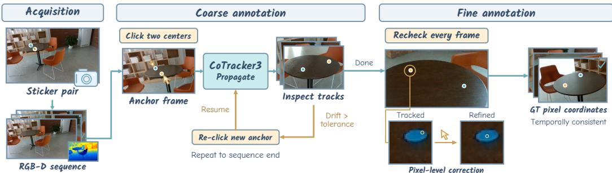  
Figure 6: Left: Overview of our data acquisition pipeline, including scene preparation, multi-view RGB-D capture, and the generation of raw data for subsequent annotation. Mid & Right: Overview of the coarse-to-fine data annotation pipeline. Valid frames are first sub-sampled from the raw image sequence, followed by anchor-frame annotation, automatic keypoint tracking, deviation-based reannotation, and frame-by-frame verification to produce the final annotated sequence.

## A PIXEL-COORDINATE ANNOTATION PIPELINE

We propose a lightweight coarse-to-fine annotation pipeline (Figure 6) for per-frame pixel coordinate annotation of sticker centers, substantially reducing manual annotation effort through a semi-automated human-in-the-loop framework built upon CoTracker3 Karaev et al. (2025). In the coarse stage, the user manually clicks the centers of the two stickers on an anchor frame to initialize their pixel coordinates. These coordinates are provided to CoTracker3 as query points, which are then propagated to subsequent frames to obtain the corresponding pixel coordinates of the sticker centers throughout the sequence. The propagated trajectories are visually inspected, and whenever the tracking drift exceeds an acceptable tolerance, the current frame is selected as a new anchor, the sticker centers are re-clicked, and trajectory propagation resumes until the end of the sequence. In the fine stage, every frame is revisited, and all propagated keypoints are manually refined to pixel-level accuracy. Owing to the strong temporal coherence between adjacent frames, even subtle localization errors are readily identifiable during sequential inspection, enabling efficient loca corrections and ultimately producing accurate and temporally consistent ground-truth annotations.

## B BASELINE CONFIGURATIONS

As summarized in Table 8, we benchmark 26 representative method entries across four settings: 8 image-level estimation methods, 9 image-level completion methods, 6 video-level estimation methods, and 3 video-level completion methods. We exclusively consider metric 3D foundation model that recover scene geometry at absolute scale. The table groups variants from the same method family into a single entry; counting the two sensor-specific CDM variants and the three CAPA backbone variants separately yields the 29 baseline configurations evaluated in Section 5.

## C VIDEO-LEVEL MODEL SAMPLING STRATEGY.

Throughout our systematic evaluation, all video-level models use the same sampling procedure with a fixed random seed. Consequently, all models obtain the same sequence of multi-view samples, including identical frame groups, sample ordering, and within-group frame ordering. This deterministic sampling setup eliminates variation from random view selection and enables direct comparison across video-level models.

## D ADDITIONAL DETAILS FOR COMPARISON ACROSS MODEL SETTINGS

To fairly compare image- and video-level models in Figure 5c, we evaluate Depth Anything 3 and CAPA-VGGT using the same multi-view samples and use their shared sampling records to determine the evaluation weight of each image. Accordingly, each Metric3D v2 and Lingbot-Depth prediction is counted as many times as its frame appears in the multi-view samples. This procedure requires no additional image-level inference and gives all four models the same 24,320 frame occurrences over the 76 normal scenes. We then compute RE and RSD from the aligned predictions within each scene, following Section 4, and average the resulting scene-level metrics equally across scenes.

Table 8: Overview of the evaluated baselines. The evaluated CDM variants and CAPA backbones are listed in parentheses.
<table><tr><td>Input</td><td>Task</td><td>Models</td></tr><tr><td rowspan="2">Image-level</td><td>Estimation</td><td>Metric3D Yin et al. (2023), Unidepth Piccinelli et al. (2024), MoGe-2 Wang et al., MoGe-3 Kong et al. (2026), Depth Pro Bochkovskiy et al. (2025), MetricAnything Ma et al. (2026), Metric3D v2 Hu et al. (2024), Unidepthv2 Piccinelli et al. (2025)</td></tr><tr><td>Completion</td><td>CDM Liu et al. (2025) (CDM-L515, CDM-D435), DepthLab Liu et al. (2024), PriorDA Wang et al. (2025c), Lingbot-Depth Tan et al. (2026), InfiniDepth Yu et al. (2026a), Omni-dc Zuo et al. (2025), LDCM Yu et al. (2026b), Marigold-dc Viola et al. (2025), PromptDA Lin et al. (2025)</td></tr><tr><td rowspan="2">Video-level</td><td>Estimation</td><td>MapAnything Keetha et al. (2026), MASt3R Leroy et al. (2024), MUSt3R Cabon et al. (2025), Depth Anything 3 Lin et al., pi3x Wang et al. (2026a), CUT3R Wang et al. (2025b)</td></tr><tr><td>Completion</td><td>MapAnything Keetha et al. (2026), pi3x Wang et al. (2026a), CAPA Ke et al. (2026) (CAPA-VGGT Wang et al. (2025a), CAPA-Unidepthv2 Piccinelli et al. (2025), CAPA-MoGe2 Wang et al.)</td></tr></table>

## E DETAILED EXPLORATION RESULTS FOR DIRECT DISTANCE EVALUATION

The ability to measure point-pair distance depends jointly on accurate depth maps and reliable camera intrinsics. This raises a fundamental question: do models with strong performance on both depth estimation and camera intrinsics estimation also achieve superior point-pair distance estimation?

To answer this, we evaluate five image-level geometry estimation models Bochkovskiy et al. (2025); Wang et al.; Ma et al. (2026); Piccinelli et al. (2024; 2025) on standard benchmarks for both tasks. For depth, we report AbsRel, L1, and $\delta _ { 1 . 2 5 }$ on NYUD Silberman et al. (2012), KITTI Geiger et al. (2013), ETH3D Schops et al. (2017), and DIODE Vasiljevic et al. (2019); for intrinsics, we report $A U C @ 1 / 5 / 1 0 ^ { \circ }$ on LaMAR Sarlin et al. (2022), MegaDepth Li & Snavely (2018), Stanford2D3D Armeni et al. (2017), and TartanAir Wang et al. (2020), following GeoCalib Veicht et al. (2024). Table 7 summarizes the average rankings. Table 10 and Table 11 provide the corresponding per-dataset results. The rankings reveal clear task-specific disparities: for example, Unidepth achieves the best depth rank but only the fourth-best intrinsics rank, whereas MoGe-2 exhibits the opposite trend, indicating that superiority in one task does not generalize to the other.

More importantly, even jointly considering the two benchmarks fails to predict point-pair distance estimation performance. Despite achieving the best overall depth–intrinsics ranking, MoGe-2 is consistently outperformed by Unidepthv2 on our distance estimation benchmark (Table 3). To further investigate this discrepancy, we replace the predicted intrinsics with ground-truth intrinsics when back-projecting the predicted depth maps. To reveal general patterns, we conduct experiments on the normal subset only. Surprisingly, this substitution degrades across the majority of metrics — 47 of the 56 model–metric pairs (Table 9), demonstrating that predicted depth maps are intrinsically coupled with their corresponding predicted intrinsics. These results show that neither existing depth and intrinsics benchmarks, nor their simple combination, can faithfully characterize a model’s point-pair distance estimation capability, highlighting the necessity of direct evaluation.

Table 9: Image-level geometry estimation using ground-truth intrinsics. For the seven evaluation metrics, values in parentheses denote changes relative to the corresponding normal-subset results in Table 3; green and red indicate improvements and degradations, respectively.
<table><tr><td>Model</td><td>AE↓</td><td>RE↓</td><td>LE↓</td><td>RSD↓</td><td> $\delta _ { 1 . 0 5 } \uparrow$ </td><td> $\delta _ { 1 . 1 0 }$  ↑</td><td> $\delta _ { 1 . 2 5 } \uparrow$ </td><td>Rank↓</td></tr><tr><td>Metric3D</td><td>1.319 (+0.139)</td><td>1.895 (+0.200)</td><td>0.893 (+0.065)</td><td>0.340 (-0.007)</td><td>5.16 (-2.86)</td><td>9.89 (-4.79)</td><td>23.42 (-4.40)</td><td>8.00</td></tr><tr><td>Depth Pro</td><td>0.144 (+0.009)</td><td>0.210 (+0.014)</td><td>0.240 (+0.006)</td><td>0.175 (+0.021)</td><td>16.53 (-1.21)</td><td>31.68 (-1.30)</td><td>62.77 (-2.53)</td><td>5.14</td></tr><tr><td>Unidepth</td><td>0.205 (+0.046)</td><td>0.287 (+0.067)</td><td>0.246 (+0.039)</td><td>0.121 (-0.013)</td><td>14.68 (-5.32)</td><td>27.22 (-11.16)</td><td>52.55 (-15.89)</td><td>6.86</td></tr><tr><td>MoGe-2</td><td>0.172 (-0.004)</td><td>0.229 (-0.013)</td><td>0.208 (+0.004)</td><td>0.095 (+0.009)</td><td>17.00 (-6.40)</td><td>31.50 (-9.43)</td><td>62.29 (-0.79)</td><td>4.86</td></tr><tr><td>MoGe-3</td><td>0.185 (-0.023)</td><td>0.253 (-0.039)</td><td>0.220 (-0.016)</td><td>0.093 (+0.009)</td><td>17.19 (-1.70)</td><td>33.68 (-1.81)</td><td>63.34 (+3.45)</td><td>4.43</td></tr><tr><td>MetricAnything</td><td>0.150 (+0.005)</td><td>0.195 (+0.001)</td><td>0.183 (+0.007)</td><td>0.098 (+0.009)</td><td>20.19 (-4.81)</td><td>37.34 (-3.94)</td><td>66.86 (-0.10)</td><td>3.29</td></tr><tr><td>Unidepthv2</td><td>0.121 (+0.022)</td><td>0.165 (+0.029)</td><td>0.153 (+0.016)</td><td>0.098 (+0.001)</td><td>23.58 (-2.43)</td><td>43.01 (-5.47)</td><td>75.41 (-4.20)</td><td>2.29</td></tr><tr><td>Metric3D v2</td><td>0.095 (+0.022)</td><td>0.138 (+0.032)</td><td>0.126 (+0.022)</td><td>0.067 (-0.001)</td><td>26.09 (-4.91)</td><td>47.94 (-8.06)</td><td>83.98 (-6.44)</td><td>1.00</td></tr></table>

Table 10: Depth benchmark results for image-level metric geometry estimation models. The best values are highlighted in green , and the second-best ones in yellow
<table><tr><td rowspan="2">Model</td><td colspan="3">NYU-D</td><td colspan="3">KITTI</td><td colspan="3">DIODE</td><td colspan="3">ETH3D</td></tr><tr><td>AbsRel ↓ L1 (m) ↓</td><td></td><td> $\delta _ { 1 . 2 5 }$ </td><td>↑|AbsRel ↓</td><td>L1 (m) ↓</td><td></td><td>δ1.25 ↑|AbsRel ↓ L1 (m) ↓</td><td></td><td> $\delta _ { 1 . 2 5 }$ </td><td></td><td>↑|AbsRel ↓ L1 (m) ↓ δ1.25 ↑</td><td></td></tr><tr><td>Depth Pro</td><td>0.09</td><td>0.25</td><td>0.93</td><td>0.14</td><td>2.34</td><td>0.83</td><td>0.40</td><td>4.46</td><td>0.41</td><td>0.38</td><td>3.25</td><td>0.33</td></tr><tr><td>MoGe-2</td><td>0.08</td><td>0.21</td><td>0.96</td><td>0.21</td><td>3.59</td><td>0.45</td><td>0.33</td><td>2.62</td><td>0.54</td><td>0.10</td><td>0.62</td><td>0.88</td></tr><tr><td>MetricAnything</td><td>0.10</td><td>0.27</td><td>0.94</td><td>0.09</td><td>1.60</td><td>0.94</td><td>0.34</td><td>2.49</td><td>0.65</td><td>0.11</td><td>0.67</td><td>0.90</td></tr><tr><td>Unidepth</td><td>0.06</td><td>0.14</td><td>0.98</td><td>0.05</td><td>1.04</td><td>0.98</td><td>0.27</td><td>2.64</td><td>0.67</td><td>0.58</td><td>3.20</td><td>0.14</td></tr><tr><td>Unidepthv2</td><td>0.07</td><td>0.18</td><td>0.96</td><td>0.09</td><td>1.58</td><td>0.95</td><td>0.78</td><td>7.07</td><td>0.54</td><td>0.21</td><td>1.23</td><td>0.68</td></tr></table>

## F EFFECT OF MULTI-VIEW SAMPLING STRIDE

To complement the video-level evaluation in Section 6 and isolate the effect of inter-view baseline, we sample $N = 4$ frames from each 64-frame sequence using a uniform stride $s \in \{ 2 , 4 , 8 , 1 6 \}$ . We draw 16 samples per scene and shuffle the sample to mitigate ordering bias. As shown in Figure $^ { 7 , }$ wider sampling generally improves $\delta _ { 1 . 0 5 } \colon$ Depth Anything 3, MapAnything, MUSt3R, and pi3x achieve their best performance at $s = 1 6$ . MASt3R and CUT3R instead peak at $s = 8$ , indicating that the benefit of wider baselines can be offset by reduced visual overlap. Overall, sampling stride reflects a trade-off between geometric diversity and cross-view correspondence.

Finding 7: Wider sampling strides generally benefit one-forward video-level geometry estimation models by providing larger inter-view baselines, while excessively wide spacing can reduce visual overlap and offset this gain.  
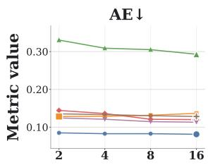

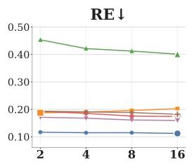

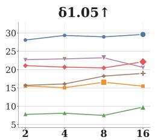

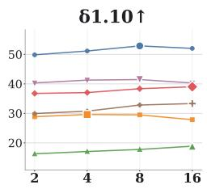  
Depth Anything 3 MASt3R MapAnything MUSt3R CUT3R Pi3X  
Figure 7: Effect of sampling stride on video-level geometry estimation models (normal subset only). Each curve corresponds to one model, and the highlighted marker on each curve indicates that model’s best-performing stride.

## G ADDITIONAL QUALITATIVE RESULTS

We provide qualitative examples for three analyses in Section 6: depth–intrinsics coupling, sparsely sampled depth priors for image-level completion, and different fractions of depth-prior views for video-level completion. These examples complement the aggregate results in Figure 5 and the directevaluation analysis in Finding 1.

Table 11: Intrinsics benchmark results for image-level metric geometry estimation models. @1/5/10◦ refer to AUC@1/5/10◦. vFoV, hFoV refer to vertical FoV and horizontal FoV. The best values are highlighted in green , and the second-best ones in yellow . Methods trained on evaluated datasets are in gray and excluded from the ranking to ensure a fair comparison

(a) LaMAR-2K
<table><tr><td>Model</td><td colspan="3">vFoV</td><td colspan="3">hFoV</td></tr><tr><td></td><td>@1°</td><td>@5°</td><td>@10°</td><td>@1°</td><td>@5°</td><td>@10°</td></tr><tr><td>Depth Pro</td><td>0.121</td><td>0.235</td><td>0.377</td><td>0.136</td><td>0.260</td><td>0.447</td></tr><tr><td>MoGe-2</td><td>0.243</td><td>0.526</td><td>0.727</td><td>0.287</td><td>0.581</td><td>0.766</td></tr><tr><td>MetricAnything</td><td>0.224</td><td>0.493</td><td>0.698</td><td>0.262</td><td>0.548</td><td>0.743</td></tr><tr><td>Unidepth Unidepthv2</td><td>0.051 0.371 0.0400.123</td><td></td><td>0.491 0.312</td><td>0.015 0.055</td><td>0.324 0.193</td><td>0.479 0.423</td></tr></table>

(c) Stanford2D3D

(b) MegaDepth-2K
<table><tr><td rowspan="2">Model</td><td colspan="3">vFoV</td><td colspan="3">hFoV</td></tr><tr><td>@1°</td><td>@5°</td><td>@10°</td><td>@1°</td><td>@5°</td><td>@10°</td></tr><tr><td>Depth Pro</td><td>0.196 0.449</td><td></td><td>0.660</td><td>0.176</td><td>0.423</td><td>0.636</td></tr><tr><td>MoGe-2</td><td>0.1760.412</td><td></td><td>0.618</td><td>0.1740.397</td><td></td><td>0.593</td></tr><tr><td>MetricAnything</td><td>0.2700.537</td><td></td><td>0.722</td><td>0.252</td><td>0.514</td><td>0.702</td></tr><tr><td>Unidepth</td><td>0.068 0.162</td><td></td><td>0.274</td><td>0.058</td><td>0.149</td><td>0.253</td></tr><tr><td>Unidepthv2</td><td>0.1240.305</td><td></td><td>0.494</td><td>0.120</td><td>0.289</td><td>0.475</td></tr></table>

(d) TartanAir

<table><tr><td rowspan="2">Model</td><td colspan="3">vFoV</td><td colspan="3">hFoV</td></tr><tr><td>@1°</td><td>@5°</td><td>@10°</td><td>@1°</td><td>@5°</td><td>@10°</td></tr><tr><td>Depth Pro</td><td>0.058</td><td>0.157</td><td>0.263</td><td>0.050</td><td>0.134</td><td>0.233</td></tr><tr><td>MoGe-2</td><td>0.094</td><td>0.269</td><td>0.487</td><td>0.087</td><td>0.249</td><td>0.454</td></tr><tr><td>MetricAnything</td><td>0.078</td><td>0.194</td><td>0.326</td><td>0.062</td><td>0.164</td><td>0.289</td></tr><tr><td>Unidepth</td><td>0.032</td><td>0.085</td><td>0.172</td><td>0.028</td><td>0.077</td><td>0.150</td></tr><tr><td>Unidepthv2</td><td>0.048</td><td>0.132</td><td>0.247</td><td>0.043</td><td>0.116</td><td>0.224</td></tr></table>

<table><tr><td>Model</td><td colspan="3">vFoV</td><td colspan="3">hFoV</td></tr><tr><td></td><td>@1°</td><td>@5°</td><td>@10°</td><td>@1°</td><td>@5°</td><td>@10°</td></tr><tr><td>Depth Pro</td><td>0.556</td><td>0.740</td><td>0.859</td><td>0.549</td><td>0.730</td><td>0.851</td></tr><tr><td>MoGe-2</td><td>0.009</td><td>0.080</td><td>0.314</td><td>0.009</td><td>0.074</td><td>0.303</td></tr><tr><td>MetricAnything</td><td>0.364</td><td>0.702</td><td>0.847</td><td>0.353</td><td>0.688</td><td>0.839</td></tr><tr><td>Unidepth</td><td>0.008</td><td>0.016</td><td>0.030</td><td>0.006</td><td>0.015</td><td>0.031</td></tr><tr><td>Unidepthv2</td><td>0.000</td><td>0.004</td><td>0.093</td><td>0.000</td><td>0.004</td><td>0.083</td></tr></table>

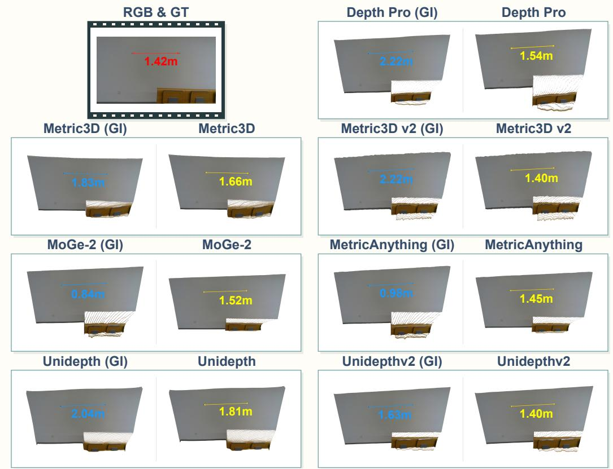  
Figure 8: Qualitative comparison for image-level geometry estimation models between backprojecting with ground-truth intrinsics and models’ predicted intrinsics. Ground-truth annotations are shown in red, (ground-truth intrinsics + depth maps) are shown in blue, (predicted intrinsics + depth maps) are shown in yellow.

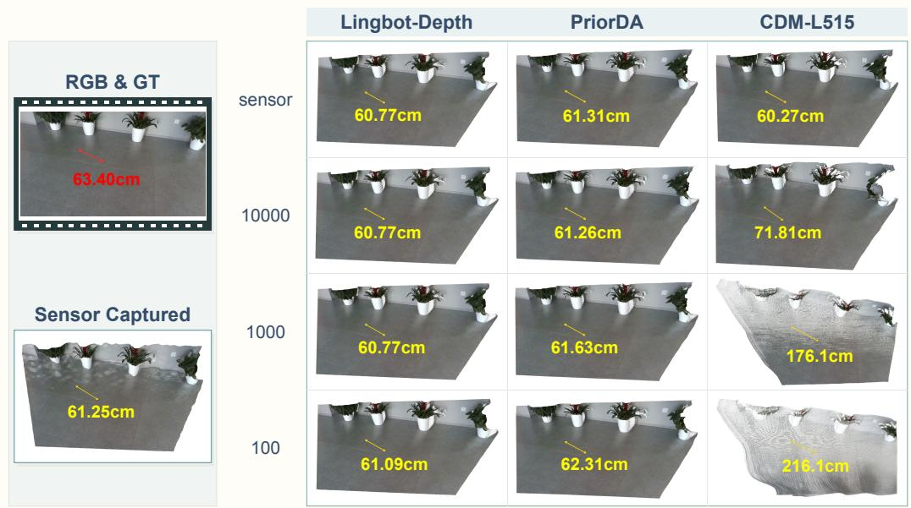  
60.77cm 61.09cmFigure 9: Qualitative comparison for image-level geometry completion models on different prior depth patterns with varying sparsity levels. The results showcase that Lingbot-Depth and75.60 78.4.60cm 75.60 .60 216.1cm176.1cm 71.81cm 216.1cm176.1cm 71.81cmPriorDA perform robustly under different patterns, while CDM-L515 exhibits a substantial perfor 176.1cmmance drop due to the large pattern domain gap between its training data and the evaluated prior patterns.

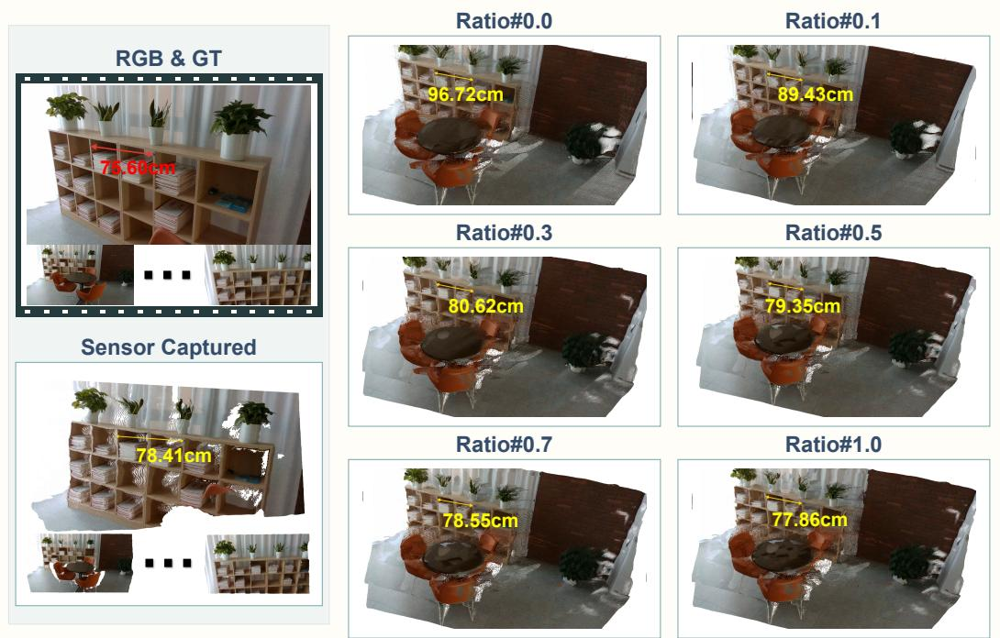  
Figure 10: Qualitative results for MapAnything Keetha et al. (2026) with varying fractions of 80.6280.62c80.62cm.43cmviews provided with depth priors. The distance of “Sensor Captured” is obtained by averaging the sensor measured distances of the ten views sampled. The results demonstrate that, as the ratio of depth priors increased, MapAnything gains continuous performance improvement. “Ratio#x” indicates the ratio of prior input to the model.