# PointVGGT: Zero-Shot Multiview RGB-D Point Cloud Registration with Visual Geometry Foundation Priors

Haobo Jiang · Liang Yu · Jianmin Zheng

Received: date / Accepted: date

Indoor Scenes

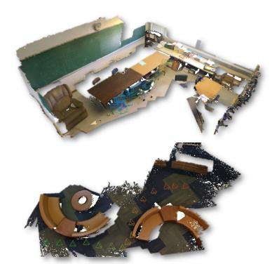  
Structured–light RGB-D Sensor  
Outdoor Scenes

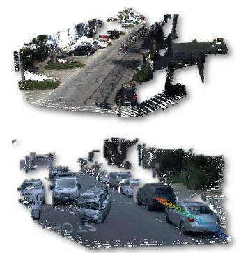  
Automotive LiDAR

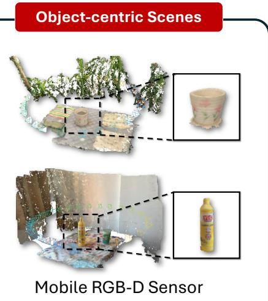  
Robust zero-shot generalization over diverse scenarios and 3D sensors.

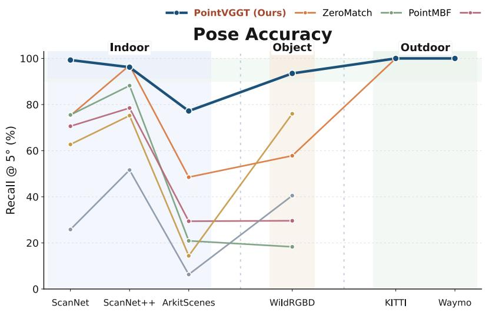

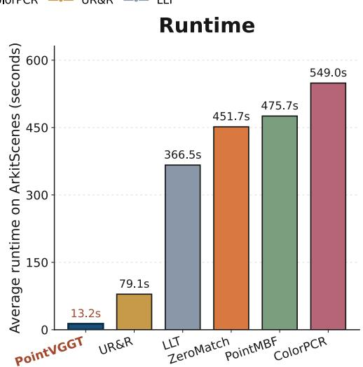  
Fig. 1. PointVGGT enables robust and eficient zero-shot multiview registration across diverse scenarios and sensor types, consistently achieving superior or competitive pose accuracy compared to prior methods across indoor, outdoor, and object-centric benchmarks while running substantially faster.

Abstract This paper addresses multiview RGB-D point cloud registration, aiming to estimate global rigid poses for unordered RGB-D scans and align them in a metrically consistent coordinate frame. The conventional pairwise-then-global paradigm sufers from locally optimized pairwise registration, severe error propagation and high computational burden. In particular, existing methods typically treat RGB data as a mere auxiliary matching cue and overlook the holistic geometric priors (e.g., camera poses and 3D models) encoded across image sequences. This paper introduces PointVGGT, a zero-shot framework built upon a novel foundation-thenrefinement paradigm that systematically leverages visual geometry foundation models (e.g., VGGT) as the computational backbone for robust, training-free multiview RGB-D registration. In the foundation stage, we directly recover metrically consistent global poses (without any pairwise estimation) by grounding the scale-ambiguous pose predictions of the foundation model against metric depth observations. In the refinement stage, we introduce an eficient voxelized spatial hashing mechanism that exploits the globally coherent 3D reconstruction (induced by the foundation model) as a shared spatial anchor, enabling dense multiview correspondences in near-linear time. On top of this, an IRLS-based robust motion-only bundle adjustment is performed using a conjugate gradient solver to jointly minimize the correspondence and reprojection residuals for multiview pose refinement. Extensive experiments on indoor/objectcentric/outdoor datasets verify the outstanding zeroshot registration accuracy and computational eficiency of our proposed method. [Code]

Keywords Multiview RGB-D Registration · Visual Geometry Foundation Model · Zero-Shot Registration · 3D Reconstruction · Point Cloud Alignment

## 1 Introduction

Multiview RGB-D point cloud registration estimates the rigid poses of a set of partially overlapping RGB-D scans and align them into a unified coordinate frame, with extensive applications such as 3D scene reconstruction (Dai et al, 2017b; Newcombe et al, 2011; Slavcheva et al, 2018), AR/VR (Azuma, 1997; Kim et al, 2022), and embodied AI (Savva et al, 2019; Szot et al, 2021). However, due to real-world challenges such as low overlap, repetitive structures, and noisy measurements, multiview registration remains both unreliable and computationally expensive, limiting its practical deployment.

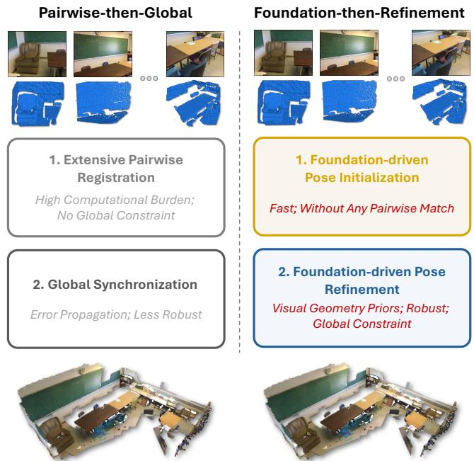  
Fig. 2 Paradigm comparison. Conventional pairwise-thenglobal pipelines rely on extensive pairwise matching (high computational cost and no global constraint) followed by pose synchronization (error propagation). By contrast, our foundation-then-refinement pipeline directly initializes poses from visual geometry foundation priors without any costly pairwise matching, and subsequently refines them with global geometric constraints, achieving a more eficient and robust registration process.

Existing multiview registration methods predominantly follow a pairwise-then-global paradigm (Arrigoni et al, 2016; Choi et al, 2015; Govindu, 2004; Huang et al, 2017; Wang et al, 2023a), in which relative trans formations are first estimated through extensive pairwise registration across scan pairs (Huang et al, 2021; Qin et al, 2022), and then integrated into globally consistent poses via pose graph synchronization (Wang and Singer, 2013; Lee and Civera, 2022). Despite its efectiveness, this paradigm sufers from several fundamental limita tions, including local optima and high computational cost in pairwise registration, as well as severe error propagation during global synchronization. Moreover, many learning-based methods exhibit limited domain generalization and often require model finetuning to adapt to new environments, further reducing their practicality in real-world applications.

More importantly, within this paradigm, RGB images are typically treated merely as auxiliary cues for improving pairwise feature matching (Yuan et al, 2023;

Jiang et al, 2025c) and are discarded thereafter. However, recent visual geometry foundation models, such as the pioneering VGGT (Wang et al, 2025a), have shown that multiview RGB images inherently encode reliable pose and structural priors by jointly predicting high-quality dense 3D pointmaps and camera poses in a single feed-forward pass, while exhibiting impressive zero-shot generalization. This naturally raises a fundamental question: Can such rich visual geometry priors be leveraged for zero-shot multiview RGB-D registration without any domain-specific weight finetuning?

Motivated by these insights, this paper introduces PointVGGT, a training-free foundation-then-refinement framework that bridges the visual geometry priors (encoded in RGB images by VGGT-style foundation models) with multiview RGB-D registration, enabling eficient and robust zero-shot alignment (see Fig. 2). Specifically, in the foundation stage, we initialize global poses by converting the scale-ambiguous pose predictions of the foundation model into metrically grounded poses through depth-based scale alignment with sensor observations. In the refinement stage, our key observation is that the globally coherent 3D model reconstructed by the foundation model naturally provides rich correspondence priors: geometrically corresponding points from diferent views tend to cluster tightly in the reconstructed space. Exploiting this property, we develop a voxelized spatial hashing scheme that discretizes the global space into uniform voxel grids and performs GPUaccelerated intra-voxel matching for fast outlier removal and cross-view correspondence building. Given these correspondences and initial poses, we jointly refine poses via a motion-only bundle adjustment (Triggs et al, 1999), optimized using Geman-McClure kernel-based iterative reweighted least squares (IRLS) (Holland and Welsch, 1977) and a conjugate gradient solver, to minimize both correspondence and geometric reprojection residuals.

Notably, unlike the conventional pairwise-then-global paradigm, our foundation-then-refinement pipeline completely eliminates locally biased and computationally intensive pairwise registration, while fully exploiting the holistic pose and geometric priors encoded in RGB inputs for reliable multiview alignment. As a result, PointVGGT reduces inference time from minutes to seconds while maintaining strong robustness. Extensive experiments show that our method achieves outstanding registration accuracy and eficiency in a fully zero-shot setting, outperforming both classical and learning-based approaches without any task-specific training or finetuning. In summary, our contributions are as follows:

We propose a novel and powerful foundation-thenrefinement paradigm for multiview RGB-D registration that, for the first time, systematically leverages foundation model-driven visual geometry priors encoded in RGB images to enable training-free, zeroshot, and robust multiview registration.

We develop an eficient foundation-driven pose initialization that grounds the scale-ambiguous pose predictions of foundation models with sensor depth observations, yielding metrically consistent global poses without redundant pairwise registration.

We design a voxelized spatial hashing scheme that exploits the globally consistent 3D reconstruction induced by the foundation model to eficiently construct dense multiview correspondences in near-linear time, avoiding time-consuming all-pair matching.

We introduce a robust motion-only bundle adjustment with Geman-McClure robust kernel-based IRLS and a conjugate gradient solver for eficient and reliable multiview pose refinement.

Our proposed foundation-then-refinement paradigm is general and inherently plug-and-play. It can be seamlessly integrated with diverse visual VGGT-style 3D foundation models, such as VGGT (Wang et al, 2025a), Pi3 (Wang et al, 2025b), and DepthAnything3 (Lin et al, 2025), naturally benefiting from their continued advances, which enables sustained performance improvements as these foundation models evolve.

## 2 Related Work

Pairwise Point Cloud Registration. Pairwise point cloud registration is the task of recovering the relative rigid transformation between two 3D scans. State-ofthe-art solutions predominantly rely on correspondencedriven pipelines, where discriminative geometric representations are first constructed and subsequently matched to estimate the relative pose. Early methods design handcrafted descriptors to encode local surface geometry (Johnson and Hebert, 1999; Tombari et al, 2010; Salti et al, 2014; Rusu et al, 2008, 2009). Representative examples include USC (Tombari et al, 2010), which builds shape-context representations under a local reference frame, SHOT (Salti et al, 2014), which aggregates normal-based histograms, and PFH/FPFH (Rusu et al, 2008, 2009), which capture pairwise geometric relationships within local neighborhoods.

With the development of deep learning, more recent approaches replace handcrafted features with learned representations derived from large-scale data (Jiang et al, 2026; Wang et al, 2023b; Li and Harada, 2022; Xu et al, 2026; Choy et al, 2020; Chen et al, 2023; Jiang et al, 2023b,a, 2021). For instance, FCGF (Choy et al, 2019) learns fully-convolutional sparse 3D features for reliable matching, while D3Feat (Bai et al, 2020) jointly learns keypoint detection and description to improve matching quality. CoFiNet (Yu et al, 2021) adopts a coarse-tofine matching strategy to refine correspondences progressively, and Predator (Huang et al, 2021) leverages overlap-aware cross-attention to improve matching robustness in low-overlap situations. RoITr (Yu et al, 2023) enhances robustness via PPF-based rotation-invariant feature encoding, and GeoTrans (Qin et al, 2022) integrates explicit geometric embeddings for more discriminative correspondence reasoning. PARE-Net (Yao et al, 2024) develops position-aware rotation-equivariant backbone for eficient and robust matching. Gen-PCR (Jiang et al, 2025b) designs Match-ControlNet to generate free lunch RGB cues for semantics-enhanced matching.

Pairwise RGB-D Point Cloud Registration. Existing pairwise RGB-D registration approaches can be broadly grouped into the optimization-based methods and learning-based methods. Optimization-based approaches predominantly extend the ICP framework (Besl and McKay, 1992) by augmenting geometric alignment with color-derived constraints. One line of work modifies the objective function itself: Park et al. (Park et al, 2017) and Whelan et al. (Whelan et al, 2015) append a photometric residual to the standard point-to-plane cost, while Danelljan et al. (Danelljan et al, 2016) embed color within a Gaussian mixture model for probabilistic EM-based optimization, and Semantic-ICP (Parkison et al, 2018) treats semantic labels as latent variables in an EM-ICP formulation (Granger and Pennec, 2002). A complementary line of work instead enriches the correspondence stage: Korn et al. (Korn et al, 2014) concatenate color channels with spatial coordinates to form augmented descriptors, Godin et al. (Godin et al, 2001) construct transformation-invariant photometric attributes to constrain nearest-neighbor selection, Servos et al. (Servos and Waslander, 2014) exploit both color and intensity for alignment, and GICP-RKHS (Parkison et al, 2019) enforces intensity-surface consistency through reproducing-kernel Hilbert space regularizers.

Learning-based approaches replace handcrafted fusion strategies with data-driven feature representations. UR&R (El Banani et al, 2021) learns transformations through diferentiable alignment and rendering, enforcing geometric and photometric consistency without explicit pose supervision. BYOC (El Banani and Johnson, 2021) bootstraps feature learning by using visual correspondences as self-generated supervisory signals. Subsequent methods focus on more efective cross-modal fusion: LLT (Wang et al, 2022) progressively merges color and geometry by employing multi-scale local linear transformations; PointMBF (Yuan et al, 2023) introduces bidirectional multi-scale fusion to capture complementary information across the two modalities; ColorPCR (Mu et al, 2024) applies multi-stage geometriccolor integration to enhance matching robustness. An alternative direction is explored by NeRF-UR (Yu et al, 2024), which adopts a neural radiance field as a global scene model for unsupervised frame-to-model training. ZeroMatch (Jiang et al, 2025c) exploits pretrained Stable Difusion to extract transferable zero-shot visual representations for general RGB-D matching. (Shou et al, 2025) introduces the overlapping constraint for inliers detection, improving robustness. Beyond pairwise RGB-D registration, our multiview setting requires jointly reasoning about geometric consistency across all views, substantially increasing both problem dificulty and computational complexity. Rather than merely treating RGB as the auxiliary matching cue in prior RGB-D methods, we explicitly exploit its inherent visual geometry priors for improved multiview matching.

Multiview Point Cloud Registration. The multiview registration pipelines primarily follow a pairwisethen-global paradigm: pairwise relative pose estimation followed by global pose synchronization. Early methods (Huber and Hebert, 2003; Choi et al, 2015) construct a fully connected pose graph from pairwise transformations, then recover global poses by solving a synchronization problem over SE(3). Because pairwise estimates are inevitably corrupted by matching failures, robust synchronization has received sustained attention. One direction isolates rotation averaging: (Govindu, 2004) proposes Lie-algebraic averaging, (Hartley et al, 2011) introduces an L1 formulation, and (Wang and Singer, 2013) provides convex relaxations with recovery guarantees, with translation solved subsequently (Huang et al, 2017). Joint SE(3) synchronization has also been pursued through non-linear optimization (K¨ummerle et al, 2011; Grisetti et al, 2011), Bayesian inference (Birdal et al, 2018), spectral methods (Arrigoni et al, 2016), and hierarchical strategies (Lee and Civera, 2022). Despite their theoretical elegance, these methods inherit a fundamental fragility: synchronization quality is upperbounded by the pairwise estimates it receives, and erroneous edges propagate and amplify through the graph.

Recent methods integrate learned components to mitigate this fragility. Gojcic et al. (Gojcic et al, 2020) jointly learn descriptors and a diferentiable synchronization module. Huang et al. (Huang et al, 2019) and Yew and Lee (Yew and Lee, 2021) learn to reweight edges during synchronization. SGHR (Wang et al, 2023a) predicts overlap ratios for pose graph initialization with history-based reweighting. FeatSync (Hu et al, 2024) refines synchronized poses through attention-based feature alignment. MDGD (Li et al, 2024) fuses descriptor and geometric cues for reliable graph construction, and

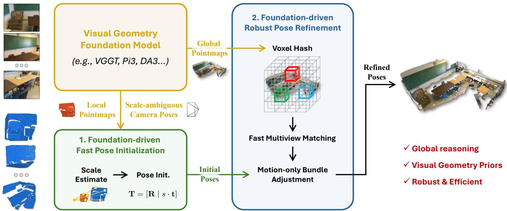  
Fig. 3 Main Pipeline of PointVGGT. Given a collection of unordered RGB-D scans, PointVGGT first processes the RGB sequence through a visual geometry foundation model to obtain scale-ambiguous camera poses and local/global 3D pointmaps. Then, foundation-driven pose initialization module grounds them into metric space via depth-based scale estimation for pose initialization. In the foundation-driven robust pose refinement module, the globally coherent reconstruction is exploited by a voxelized spatial hashing scheme to construct dense cross-view correspondences, which are then refined through an IRLS-based motion-only bundle adjustment. Our design eliminates pairwise matching, enabling zero-shot registration (without domain-specific weight finetuning) with outstanding accuracy and eficiency.

Jin et al. (Jin et al, 2024) formulate multiway registration via difusion and global optimization. While these methods improve robustness, they remain anchored to the pairwise-then-global architecture, inheriting both its quadratic cost and susceptibility to cascaded errors. While FUSER (Jiang et al, 2025a) introduces a feedforward paradigm to alleviate this issue, it is limited to geometry-only registration and cannot generalize to the RGB-D setting. Our approach departs from this paradigm entirely: globally coherent poses are obtained in a single feed-forward pass via a visual geometry foundation model, then refined through holistic multiview optimization, eliminating the time-consuming pose graph establishment and the error propagation during pose synchronization.

Visual Geometry Foundation Models. Visual geometry foundation models infer camera geometry and 3D scene structure from an unordered image set in an endto-end, feed-forward manner. DUSt3R (Wang et al, 2024) pioneers this direction by regressing dense point maps from image pairs without requiring calibrated cameras or known poses. Fast3R (Yang et al, 2025) extends this pairwise paradigm to scalable many-view reconstruction by processing multiple images jointly in a single forward pass. VGGT (Wang et al, 2025a) further advances this family by unifying the prediction of multiple scenelevel geometric attributes, including camera parameters, depth maps, point maps, and 3D point tracks. Pi3 (Wang et al, 2025b) introduces a perturbation-equivariant architecture that eliminates the common assumption of treating the first frame as the world coordinate frame. MapAnything (Keetha et al, 2025) generalizes the inputoutput interface by supporting optional geometric priors, such as intrinsics, poses, and depth, and by predicting a fully factored metric representation of scene geometry. Relatedly, DepthAnything3 (DA3) (Lin et al, 2025) adopts a more minimalist design, using a plain Transformer and a unified depth-ray representation to recover spatially consistent geometry from diferent visual inputs. More advanced VGGT variants have been explored in (Shen et al, 2025; Lu et al, 2026; Wang and Xu, 2025; Yuan et al, 2026). In this paper, we aim to integrate the visual geometry priors predicted by such foundation models for robust and eficient multiview RGB-D point cloud registration.

## 3 Methodology

## 3.1 Problem Statement

Problem Definition. Given a set of unordered, partially overlapping RGB-D scans $\mathbf { \mathcal { V } } = \{ ( \mathbf { I } _ { i } , \mathbf { X } _ { i } ) \} _ { i = 1 } ^ { S } ,$ where $\mathbf { I } _ { i } \in \mathbb { R } ^ { H _ { r g b } \times \tilde { W } _ { r g b } \times 3 }$ denotes the RGB image and ${ \bf X } _ { i } \in  \Psi$ $\mathbb { R } ^ { N _ { i } \times 3 }$ represents the point cloud (back-projected from the metric depth map $\mathbf { D } _ { i } \in \mathbb { R } ^ { H _ { d p t } \times W _ { d p t } } )$ , the multiview RGB-D point cloud registration seeks to estimate globally consistent rigid poses $\mathcal { T } = \{ T _ { i } = [ \mathbf { R } _ { i } \ | \ \mathbf { t } _ { i } ] \ \in$ $S E ( 3 ) \} _ { i = 1 } ^ { S }$ that align all scans into a common world coordinate frame. Here, $\mathbf { R } _ { i } \in S O ( 3 )$ and $\mathbf { t } _ { i } \in \mathbb { R } ^ { 3 }$ represent the 3D rotation matrix and 3D translation vector for each view i, respectively.

Multiview Registration Pipeline. Most existing multiview registration approaches (Choi et al, 2015; Huang et al, 2017; Wang et al, 2023a) decompose this problem into two sequential stages. The first stage estimates relative poses $\hat { \mathbf { T } } _ { i  j }$ between paired views $( i , j )$ via feature matching followed by robust estimators $( e . g . , \mathrm { R A N S A C } )$ The second stage then organizes these pairwise pose estimates as edges E into a pose graph $\mathcal { G } = ( \nu , \mathcal { E } )$ , and performs transformation synchronizes to recover perscan global poses. Notably, existing methods are largely geometry-centric, where the RGB-D setting is typically treated as a mere modality enhancement for improved pairwise matching (Yuan et al, 2023; Jiang et al, 2025c) rather than as an independent research problem.

Visual Geometry Foundation Priors. Given the unordered RGB images $\{ \mathbf { I } _ { i } \} _ { i = 1 } ^ { S } ,$ recent 3D foundation models (e.g., VGGT (Wang et al, 2025a)) recover visual geometry priors in a feed-forward manner, including per-scan global camera poses $\{ \hat { \mathbf { T } } _ { i } ^ { F M } = [ \hat { \mathbf { R } } _ { i } ^ { F M } | \hat { \mathbf { t } } _ { i } ^ { F M } ] \ \stackrel { \sim } { \in }$ $S E ( 3 ) \} _ { i = 1 } ^ { S } ,$ local pointmaps $\{ \bar { \mathbf { L } _ { i } } \in \mathbb { R } ^ { H \times } \bar { W } \times 3 \} _ { i = 1 } ^ { \bar { S } } ,$ and global pointmaps $\{ \mathbf { G } _ { i } \in \mathbb { R } ^ { \bar { H } \times \bar { W } \times 3 } \} _ { i = 1 } ^ { S }$ . Here, a pointmap defines a dense one-to-one mapping between image pixels and 3D points, while “local” and “global” denote the camera and world coordinate systems, respectively. Importantly, for RGB-only reconstruction, the recovered translations $\{ \hat { \bf t } _ { i } ^ { F M } \}$ and the overall scene geometry (like pointmaps) are generally defined only up to an unknown global scale, since pure RGB observations do not provide absolute metric depth cues. Recent extensions, e.g. MapAnything (Keetha et al, 2025) and DepthAnything3 (Lin et al, 2025), further improve metric geometric recovery by leveraging richer additional geometric inputs $( e . g .$ , depth maps). Nevertheless, in unconstrained real-world settings, feed-forward reconstructions may still sufer from residual scale ambiguity or cross-view scale inconsistency.

## 3.2 Motivation

Despite the importance of RGB-D sensing for robust registration (Steinbr¨ucker et al, 2011; Dai et al, 2017b), multiview RGB-D point cloud registration remains surprisingly underexplored. Rather than being treated as an independent research problem, it is often regarded as a straightforward extension of geometry-only multiview registration that follows the conventional pairwise-thenglobal paradigm. Within this framework, RGB information is typically incorporated merely as an auxiliary signal to enhance feature matching for improved pairwise registration, rather than being jointly modeled as a core component of the multiview registration process.

While efective to some extent, this paradigm inherently sufers from a series of fundamental limitations: (i) Suboptimal exploitation of visual geometry: Existing methods typically restrict RGB data to only featurelevel fusion for improved pairwise matching. Such an operation discards the rich multiview geometric priors (e.g., camera poses and 3D models) embedded across image sequences, as evidenced by SfM pipelines (Schonberger and Frahm, 2016) and recent visual foundation mod els (Wang et al, 2025b), which are crucial for global pose reasoning. Confining them to only local feature matching wastes such structural potential and truncates the upper bound of registration precision; (ii) Local optima and global error propagation: Pairwise alignment optimizes each scan pair in isolation, lacking any mechanism to incorporate global geometric constraints from other views. Consequently, in geometrically ambiguous settings, such as cases with low overlap or repetitive patterns, correspondence ambiguities cannot be resolved through joint cross-view geometric reasoning, rendering the pairwise optimization susceptible to local minima. Furthermore, these locally biased pose estimations then enter the global synchronization stage, where pose error is propagated and accumulated across the pose graph, ultimately resulting in severely degraded global pose estimations; (iii) Severe computational overhead: The existing paradigm depends on constructing a dense and reliable pose graph through numerous pairwise registrations. Each involves costly operations such as feature extraction, matching, and outlier removal. As the number of scans increases, these costs grow combinatorially, rendering the entire pipeline inherently incompatible with large-scale or time-sensitive applications.

To address these challenges, we propose PointVGGT, a novel and powerful framework for zero-shot multiview RGB-D point cloud registration. Unlike the conventional pairwise-then-global paradigm, PointVGGT follows a new foundation-then-refinement strategy. Specifically, in the foundation stage (Sec. 3.3), instead of treating RGB images as mere local matching cues, we leverage visual geometry foundation models to extract reliable multiview pose priors encoded across RGB sequences, enabling fast and robust coarse global pose initialization, thereby mitigating limitation (i). In the refinement stage (Sec. 3.4), building upon this initialization, we further develop a foundation-driven voxelized spatial hashing mechanism for eficient cross-view correspondence construction, coupled with a motion-only bundle adjustment to jointly refine all scan poses. This design avoids time-consuming pairwise registration and prevents error propagation during pose synchronization, addressing limitations (ii) and (iii). The overall pipeline is illustrated in Fig. 3.

## 3.3 Foundation-Driven Fast Pose Initialization

Reliable camera pose initialization serves as the critical starting point of our foundation-then-refinement paradigm. Inspired by the remarkable pose accuracy achieved by recent visual geometry foundation models (e.g., VGGT (Wang et al, 2025a) and Pi3 (Wang et al, 2025b)), we introduce such models for multiview registration initialization. Specifically, the model processes the entire RGB sequence in a feed-forward manner and directly recovers a set of geometrically consistent camera poses $\{ \hat { \mathbf { T } } _ { i } ^ { F M } = [ \hat { \mathbf { R } } _ { i } ^ { F M } | \hat { \mathbf { t } } _ { i } ^ { F M } ] \}$ . This strategy fully exploits the multiview geometric constraints inherently encoded in RGB images for global registration, rather than treating RGB merely as auxiliary matching cues in traditional pairwise-then-global pipelines.

Nevertheless, due to the intrinsic scale ambiguity of monocular 2D observations, the predicted poses are determined only up to an unknown global scale factor. We thus need to ground these scale-ambiguous predictions into the metric coordinate system of the RGB-D sensor, enabling metrically consistent global pose initialization. Foundation-Driven Rotation Initialization. Since camera rotations are inherently scale-invariant, the rotations predicted by the foundation model remain metrically valid despite the global scale ambiguity. We therefore directly adopt them as the rotation initialization:

$$
\hat { \bf R } _ { i } ^ { ( 0 ) } = \hat { \bf R } _ { i } ^ { F M } \in S O ( 3 ) , \quad i \in \{ 1 , \ldots , S \} .\tag{1}
$$

Foundation-Driven Translation Initialization. Although the foundation model predicts poses up to an unknown global scale, both the foundation-predicted local 3D points $\{ \mathbf { l } _ { i , k } \in \mathbf { L } _ { i } \}$ and the metric depth backprojected points $\{ \mathbf { x } _ { i , k } \in \mathbf { X } _ { i } \}$ are expressed in the same camera coordinate frame. Under the assumption of a uniform global scale, they satisfy $\mathbf { x } _ { i , k }$ ≈ s ${ \mathrm { l } } _ { i , k }$ for each point index k. Therefore, the global scale can be estimated by enforcing consistency between their radial magnitudes. Specifically, we estimate a single scale parameter by solving the objective below:

$$
s ^ { \star } = \arg \operatorname* { m i n } _ { s } \sum _ { i = 1 } ^ { S } \sum _ { k = 1 } ^ { H \times W } \left| \frac { \| \mathbf { x } _ { i , k } \| _ { 2 } } { \| \mathbf { l } _ { i , k } \| _ { 2 } } - s \right| ,\tag{2}
$$

which reduces to a 1-D least-absolute-deviation scale estimation problem, for which an optimal solution is given by any median of the ratios:

$$
\hat { s } = \mathrm { m e d i a n } \left( \left\{ \frac { \lVert { \bf x } _ { i , k } \rVert _ { 2 } } { \lVert { \bf l } _ { i , k } \rVert _ { 2 } } \right\} _ { i \in \{ 1 \ldots S \} , k \in \{ 1 \ldots H \times W \} } \right) .\tag{3}
$$

This estimator provides robustness against depth noise, prediction errors, and occasional mismatches, yielding a stable global scale estimate without requiring any pairwise alignment. With the recovered scale factor, we obtain metrically grounded coarse poses by rescaling the translation component:

$$
\hat { \mathbf { t } } _ { i } ^ { ( 0 ) } = \hat { s } \cdot \hat { \mathbf { t } } _ { i } ^ { F M } \in \mathbb { R } ^ { 3 } , \quad i \in \{ 1 , \dots , S \} .\tag{4}
$$

This direct grounding step transforms scale-ambiguous foundation predictions into metrically consistent initial poses $\{ \hat { \mathbf { T } } _ { i } ^ { ( 0 ) } = [ \hat { \mathbf { R } } _ { i } ^ { ( 0 ) } | \hat { \mathbf { t } } _ { i } ^ { ( 0 ) } ] \}$ , bypassing the pairwise registration strategy.

Notably, this initialization step is entirely registrationfree, thereby substantially reducing the computational cost compared with conventional pairwise-then-global pipelines. Moreover, thanks to large-scale data-driven training and holistic multiview reasoning of foundation models, the predicted poses exhibit impressive robustness under challenging conditions such as low overlap and repetitive patterns, providing a stable and reliable starting point for subsequent pose refinement.

## 3.4 Foundation-Driven Motion-only Bundle Adjustment For Pose Refinement

Although the proposed foundation-driven fast pose initialization provides reliable coarse pose estimates, its translation component heavily relies on global scale estimation, whose precision would be potentially influenced by real-world sensing noise and point-map inaccuracies, thereby degrading the reconstruction quality. To mitigate this issue, we further develop a foundationdriven bundle adjustment strategy for fine-grained pose refinement. Our refinement framework consists of two key components: (i) voxelized spatial hashing for fast cross-view correspondence construction, and (ii) robust motion-only bundle adjustment, as detailed below.

## 3.4.1 Voxelized Spatial Hashing for Fast Cross-view Correspondence Construction

Establishing dense, reliable cross-view correspondences, that is identifying mutually consistent feature matches across multiple scans, is a prerequisite for subsequent bundle adjustment-based pose refinement. To this end, we introduce a novel and efective voxelized spatial hashing mechanism for eficient, dense and high-quality crossview correspondence construction.

Pointmap-as-descriptor. Instead of relying on the computationally intensive extraction of pointwise geometric descriptors per scan for cross-view matching, we directly employ the readily available global pointmaps $\{ \mathbf { G } _ { i } \} _ { i = 1 } ^ { S } ,$ inferred by visual foundation models, as 3D descriptors. This is based on the fact that per-view global pointmaps represent the spatial position of each pixel in the world frame. Consequently, correspondences across multiple views naturally exhibit close 3D coordinates, aligning perfectly with the objective of geometric descriptors. Therefore, we utilize the global pointmap as a compact 3D geometric descriptor, denoted as $\{ \mathbf { g } _ { i , k } \in \mathbb { R } ^ { 3 } \}$ , for the per-scan points $\{ { \bf x } _ { i , k } \}$ , where their intrinsic pixel alignment ensures overhead-free, one-to-one assignment, and $i \in \{ 1 , . . . , S \}$ and $k \in \{ 1 , . . . , H \times W \}$ represent the scan index and point index, respectively.

Although our pointmap-as-descriptor strategy provides a compact representation for accelerated matching, conventional pairwise matching strategy across all views still sufers from high computational demands: (i) View-level scalability: Ideally, correspondences should be established for all overlapping scan pairs to ensure suficient geometric constraints. Given S input views, prior pairwise matching evaluates up to $\mathcal { O } ( S ^ { 2 } )$ scan pairs. As S increases, the number of pairwise matching operations grows quadratically, leading to substantial computational overhead; (ii) Point-level scalability: For each scan pair, dense correspondence construction requires a nearest-neighbor search over N points per scan, resulting in $\mathcal { O } ( N ^ { 2 } )$ distance evaluations. Consequently, the total computational complexity reaches $\mathcal { O } ( S ^ { 2 } N ^ { 2 } )$ which quickly becomes prohibitive for large-scale scenes. Voxelized Spatial Hashing. To bypass this computational bottleneck, we introduce a voxelized spatial hashing mechanism for fast cross-view correspondence construction. Our core idea relies on discretizing the 3D descriptors (i.e., the global pointmaps) into a uniform voxel grid. Because the global pointmaps are inherently aligned and exhibit strong geometric coherence within a common coordinate frame, potential corresponding points from multiple views naturally cluster within the same voxel. Consequently, we can rapidly identify potential correspondence candidates while filtering out numerous non-corresponding points, thereby significantly improving matching eficiency. Specifically, the 3D descriptor $\mathbf { g } _ { i , k }$ of each point $\mathbf { x } _ { i , k }$ is assigned to a voxel cell:

$$
\mathcal { V } ( \mathbf { g } _ { i , k } ) = \left\lfloor \frac { \hat { s } \cdot \mathbf { g } _ { i , k } } { \nu } \right\rfloor\tag{5}
$$

where sˆ is the scale factor (estimated in Eq. 3) used to project the global pointmaps into a metric space; ⌊·⌋ denotes the floor operation; ν is the voxel size controlling the spatial granularity; and $\nu ( \mathbf { g } _ { i , k } ) \in \mathbb { Z } ^ { 3 }$ denotes the resulting voxel index. Subsequently, all formed diferent 3D voxel indices serve as the keys in a spatial hash table hash(·), grouping all points sharing the same voxel into a single hash bin, for O(1) retrieval:

$$
h a s h ( \mathcal { V } ) = \left\{ \mathbf { g } _ { i , k } \in \mathbb { R } ^ { 3 } \mid \mathcal { V } ( \mathbf { g } _ { i , k } ) = \mathcal { V } \right\} .\tag{6}
$$

Neighborhood Voxel-aware Multiview Matching. After constructing the spatial hash table, we perform intra-voxel nearest-neighbor searches for correspondence identification. However, rigid voxelization inevitably introduces boundary artifacts: spatially adjacent points may fall into neighboring voxels, causing a strict intravoxel search to possibly miss the true nearest neighbor. To circumvent this, we expand the search scope to a $3 \times 3 \times 3$ voxel neighborhood, strictly eliminating such boundary artifacts. Concretely, for a given point ${ \bf x } _ { i , k } .$ , we first leverage its 3D descriptor $\mathbf { g } _ { i , k }$ to compute its localized voxel index $\mathcal { V } ( \mathbf { g } _ { i , k } )$ . We then query its $3 \times 3 \times 3$ neighboring voxels, denoted as $\mathcal { N } ( \mathcal { V } ( \mathbf { g } _ { i , k } ) )$ , to retrieve a candidate set of 3D descriptors: $\begin{array} { r } { \mathcal { N } _ { i , k } = \bigcup _ { \mathcal { V } \in \mathcal { N } ( \mathcal { V } ( \mathbf { g } _ { i , k } ) ) } } \end{array}$ hash(V). Consequently, the optimal matched descriptor $\mathbf { g } ^ { \star }$ is formulated as:

$$
\mathbf { g } ^ { \star } = \underset { \mathbf { g } \in \mathcal { N } _ { i , k } , v ( \mathbf { g } ) \neq i } { \operatorname { a r g m i n } } \| \mathbf { g } _ { i , k } - \mathbf { g } \| _ { 2 } , \ \mathrm { s . t . } \| \mathbf { g } _ { i , k } - \mathbf { g } \| _ { 2 } < \nu _ { c }\tag{7}
$$

where $v ( \mathbf { g } )$ returns the view index of the descriptor. The view constraint explicitly prevents intra-frame matching, while the distance threshold $\nu _ { c }$ filters out putative correspondences with large residuals. Since the total number of candidates within $\mathcal { N } _ { i , k }$ remains limited, it efectively reduces the overall matching complexity from $\mathcal { O } ( S ^ { 2 } N ^ { 2 } )$ to O(SN). In practice, we implement this neighborhood querying and matching process via parallelized custom CUDA kernels, further improving the cross-view matching eficiency.

Consequently, building upon the eficient voxel hashbased descriptor matching above, we aggregate all identified cross-view correspondences into a consolidated set:

$$
\mathcal { C } = \left\{ \left( \mathbf { x } _ { k } ^ { s } , ~ \mathbf { x } _ { k } ^ { t } , ~ i _ { k } , ~ j _ { k } , ~ c _ { k } ^ { s } , ~ c _ { k } ^ { t } \right) \right\} _ { k = 1 } ^ { | \mathcal { C } | }\tag{8}
$$

where k indexes the matched pairs; $i _ { k } , j _ { k }$ denote the respective view indices; $\mathbf { x } _ { k } ^ { s } \in \mathbf { S } _ { i _ { k } }$ and $\mathbf { x } _ { k } ^ { t } \in \mathbf { S } _ { j _ { k } }$ represent the metric 3D coordinates retrieved from the 3D scans, and $c _ { k } ^ { s } , ~ c _ { k } ^ { t }$ are their corresponding per-point confidence scores predicted by the visual foundation models.

## 3.4.2 Geometry-aware Robust Alignment Loss

With the putative correspondence set C established in Sec. 3.4.1, we perform motion-only bundle adjustment to refine the initial camera poses $( \hat { \mathbf { T } } _ { 2 } ^ { ( 0 ) } , \hat { \mathbf { T } } _ { 3 } ^ { ( 0 ) } , \hat { \mathbf { \Lambda } } _ { \cdot \cdot \cdot } , \hat { \mathbf { T } } _ { S } ^ { ( 0 ) } )$ by jointly minimizing geometry-aware alignment losses. It should be noted that to fix the gauge freedom of the pose-only optimization, we take the first frame as the reference frame and keep its pose $\hat { \mathbf { T } } _ { 1 } ^ { ( 0 ) }$ fixed, thereby anchoring the global coordinate system.

Formally, we optimize the pose increments $\xi \ =$ $( \pmb { \xi } _ { 2 } , \pmb { \xi } _ { 3 } , \dots , \pmb { \xi } _ { S } )$ , where each $\pmb { \xi } _ { i } \ = \ [ \pmb { \omega } _ { i } ^ { \top } , \pmb { v } _ { i } ^ { \top } ] ^ { \top } \ \in \ \bar { \mathbb { R } } ^ { 6 \times 1 }$ denotes a local pose increment (i.e., a twist) in the Lie algebra se(3), with $\omega _ { i }$ and ${ \mathbf { } } v _ { i }$ corresponding to the rotational and translational components, respectively. The refined SE(3) pose of view i is parameterized as

$$
\begin{array} { r l } & { \hat { \mathbf { T } } _ { 1 } = \hat { \mathbf { T } } _ { 1 } ^ { ( 0 ) } , } \\ & { \hat { \mathbf { T } } _ { i } = \pmb { \xi } _ { i } \oplus \hat { \mathbf { T } } _ { i } ^ { ( 0 ) } = \mathrm { E x p } ( \pmb { \xi } _ { i } ) \hat { \mathbf { T } } _ { i } ^ { ( 0 ) } , \quad i \in \{ 2 , . . . , S \} } \end{array}\tag{9}
$$

where $\hat { \mathbf { T } } _ { i } ^ { ( 0 ) }$ is the initialization from Sec. 3.3, and $\oplus$ denotes the left-plus operator on the SE(3) manifold; $\mathrm { E x p } : { \mathfrak { s e } } ( 3 ) \to S E ( 3 )$ is the exponential map that converts a Lie-algebra increment into a rigid transformation.

For each correspondence $k \in \mathcal { C }$ between views $i _ { k }$ and $j _ { k }$ , we consider two complementary alignment cues, namely correspondence alignment and geometric reprojection alignment:

Correspondence Alignment Residual. The first residual measures the point-to-point alignment residual between the two matched 3D points after transforming them into the world frame, which can be formulated as:

$$
\mathbf { r } _ { k } ^ { c } ( \pmb { \xi } ) = \hat { \mathbf { T } } _ { i _ { k } } \mathbf { x } _ { k } ^ { s } - \hat { \mathbf { T } } _ { j _ { k } } \mathbf { x } _ { k } ^ { t } \in \mathbb { R } ^ { 3 \times 1 } ,\tag{10}
$$

where $\mathbf { x } _ { k } ^ { s }$ and $\mathbf { x } _ { k } ^ { t }$ denote the source and target 3D points associated with the k-th correspondence; $i _ { k }$ and $j _ { k }$ denote the corresponding view indices, respectively.

Geometric Reprojection Residual. We further employ the geometric reprojection alignment as the additional constraint cues to guide pose optimization. Its core idea is based on the fact that, under the correct poses, a source 3D point transformed into the target frame should coincide with the target-side 3D point reconstructed by sampling the target depth map at its reprojected image location. Formally, we project the source point $\mathbf { x } _ { k } ^ { s }$ into the target view $j _ { k }$ , sample the target depth map $\mathbf { D } _ { j _ { k } }$ at the reprojected location, back-project the sampled depth to 3D, and measure the geometric residual between the transformed source point and the reconstructed target point: $\mathbf { r } _ { k } ^ { g } ( \pmb { \xi } ) =$

$$
\begin{array} { r } { \hat { \mathbf { T } } _ { j _ { k } } ^ { - 1 } \hat { \mathbf { T } } _ { i _ { k } } \mathbf { x } _ { k } ^ { s } - \pi ^ { - 1 } \left( \mathbf { D } _ { j _ { k } } \left( \pi \left( \hat { \mathbf { T } } _ { j _ { k } } ^ { - 1 } \hat { \mathbf { T } } _ { i _ { k } } \mathbf { x } _ { k } ^ { s } \right) \right) \right) \in \mathbb { R } ^ { 3 \times 1 } , } \end{array}\tag{11}
$$

where $\pi ( \cdot )$ and $\pi ^ { - 1 } ( \cdot )$ denote the projection and backprojection operators, respectively.

Robust Joint Optimization Objective. Consequently, we fuse the formed correspondence alignment residual and reprojection residual into a single joint residual:

$$
\mathbf { r } _ { k } ( \pmb { \xi } ) = \left[ \sqrt { \lambda _ { c } } \mathbf { r } _ { k } ^ { c } ( \pmb { \xi } ) ^ { \top } , \sqrt { \lambda _ { g } } \mathbf { r } _ { k } ^ { g } ( \pmb { \xi } ) ^ { \top } \right] ^ { \top } \in \mathbb { R } ^ { 6 \times 1 }\tag{12}
$$

where $\lambda _ { c }$ and $\lambda _ { g }$ denote the loss coeficients that control the relative contributions of each residual term. Building upon it, our robust joint optimization objective over all correspondences can be formulated as:

$$
\mathcal { L } ( \pmb { \xi } ) = \sum _ { k = 1 } ^ { | \mathcal { C } | } c _ { k } \cdot \rho ( \| \mathbf { r } _ { k } ( \pmb { \xi } ) \| _ { 2 } ) ,\tag{13}
$$

where $c _ { k } = \sqrt { c _ { k } ^ { s } \cdot c _ { k } ^ { t } }$ denotes the confidence weight derived from the foundation model’s per-point quality score for modulating each residual term. The higher confidence assigns larger optimization weights. $\rho ( x ) =$ $\frac { x ^ { 2 } / 2 } { 1 + ( x / \delta ) ^ { 2 } }$ represents the Geman-McClure kernel, a robust function for suppressing the negative efectiveness of outlier correspondences with high residuals, where $\delta > 0$ controls the kernel width.

## 3.4.3 IRLS-based Motion-only Bundle Adjustment

Building upon the joint loss defined in Eq. 13, our optimization objective is to find the optimal pose increments ${ \pmb { \xi } } ^ { * } = ( \pmb { \xi } _ { 2 } ^ { * } , \pmb { \xi } _ { 3 } ^ { * } , . . . , \pmb { \xi } _ { S } ^ { * } )$ that can minimize the residual errors over all correspondences:

$$
\pmb { \xi } ^ { * } = \arg \operatorname* { m i n } _ { \pmb { \xi } } \mathcal { L } ( \pmb { \xi } ) \triangleq \sum _ { k = 1 } ^ { | \mathcal { C } | } c _ { k } \cdot \rho ( \| \mathbf { r } _ { k } ( \pmb { \xi } ) \| _ { 2 } ) .\tag{14}
$$

We follow the well-known Iteratively Reweighted Least Squares (IRLS) (Holland and Welsch, 1977) to solve this objective. At each iteration t, the robust kernelbased optimization objective is reformulated as the leastsquare form as follows:

$$
\pmb { \xi } ^ { ( t + 1 ) } = \arg \operatorname* { m i n } _ { \pmb { \xi } } \sum _ { k = 1 } ^ { | \mathcal { C } | } c _ { k } \cdot \boldsymbol { w } _ { k } ^ { ( t ) } \cdot \| \mathbf { r } _ { k } ( \pmb { \xi } ) \| _ { 2 } ^ { 2 }\tag{15}
$$

where the robust weight $w _ { k } ^ { ( t ) }$ is formulated as:

$$
w _ { k } ^ { ( t ) } = \frac { \rho ^ { \prime } ( \| \mathbf { r } _ { k } ( \pmb { \xi } ^ { ( t ) } ) \| _ { 2 } ) } { \| \mathbf { r } _ { k } ( \pmb { \xi } ^ { ( t ) } ) \| _ { 2 } } = \left( \frac { \delta ^ { 2 } } { \delta ^ { 2 } + \| \mathbf { r } _ { k } ( \pmb { \xi } ^ { ( t ) } ) \| _ { 2 } ^ { 2 } } \right) ^ { 2 } .\tag{16}
$$

To solve the non-linear least-squares objective formulated in Eq. 15, we employ the Gauss-Newton algorithm. In detail, at each iteration $t ,$ we linearize the joint residual vector $\mathbf { r } _ { k } ( \pmb { \xi } )$ around the current pose estimate $\pmb { \xi } ^ { ( t ) }$ via a first-order Taylor expansion: $\mathbf { r } _ { k } ( \pmb { \xi } )$ ≈ $\mathbf { r } _ { k } ( \pmb { \xi } ^ { ( t ) } ) + \mathbf { J } _ { k } ^ { ( t ) } \varDelta \pmb { \xi } ,$ , where ∆ξ denotes the local left perturbation at the current iteration, and $\begin{array} { r } { \mathbf { J } _ { k } ^ { ( t ) } = \left. \frac { \partial \mathbf { r } _ { k } ( \pmb { \xi } ) } { \partial \pmb { \xi } } \right| _ { \pmb { \xi } = \pmb { \xi } ^ { ( t ) } } } \end{array}$ is the Jacobian matrix evaluated at the current state:

$$
\frac { \partial \mathbf { r } _ { k } ( \pmb { \xi } ) } { \partial \pmb { \xi } } = \left[ \sqrt [ ] { \lambda _ { c } } \frac { \partial \mathbf { r } _ { k } ^ { c } ( \pmb { \xi } ) } { \partial \pmb { \xi } } \right] = \left[ \sqrt [ ] { \lambda _ { c } } \mathbf { J } _ { k } ^ { c } \right] \in \mathbb { R } ^ { 6 \times 6 ( S - 1 ) } .\tag{17}
$$

Here, $\mathbf { J } _ { k } ^ { c }$ and $\mathbf { J } _ { k } ^ { g }$ denote the Jacobian matrices of the correspondence residual and geometric reprojection residual, respectively. Their closed-form expressions are derived by standard first-order diferentiation under the left-plus perturbation on SE(3) and are provided in Appendix A. In particular, $\mathbf { J } _ { k } ^ { g }$ is obtained by chaining the derivatives of rigid transformation, perspective projection, and bilinear sampling. The IRLS optimization objective can then be rewritten as:

$$
\varDelta \pmb { \xi } ^ { \star } = \arg \operatorname* { m i n } _ { \Delta \pmb { \xi } } \sum _ { k = 1 } ^ { | \mathcal { C } | } \beta _ { k } ^ { ( t ) } \cdot \| \mathbf { r } _ { k } ( \pmb { \xi } ^ { ( t ) } ) + \mathbf { J } _ { k } ^ { ( t ) } \varDelta \pmb { \xi } \| _ { 2 } ^ { 2 } ,\tag{18}
$$

where $\beta _ { k } ^ { ( t ) } = c _ { k } \cdot w _ { k } ^ { ( t ) }$ . By setting the partial derivatives to zero, the normal equation can be achieved:

$$
\underbrace { \left( \sum _ { k = 1 } ^ { | { \mathcal { C } } | } { \beta _ { k } ^ { \left( t \right) } { \mathbf { J } } _ { k } ^ { \left( t \right) } { \mathbf { J } } _ { k } ^ { \left( t \right) } } \right) } _ { \mathbf { H } } = \underbrace { - \sum _ { k = 1 } ^ { | { \mathcal { C } } | } { \beta _ { k } ^ { \left( t \right) } { \mathbf { J } } _ { k } ^ { \left( t \right) } { \mathbf { T } } _ { k } ( { \xi } ^ { \left( t \right) } ) } } _ { \mathbf { g } } .\tag{19}
$$

Here, $\mathbf { J } _ { k } ^ { \mathsf { T } } \mathbf { J } _ { k }$ and $\mathbf { J } _ { k } ^ { \mathsf { T } } \mathbf { r } _ { k }$ can be decoupled as:

$$
\begin{array} { r } { \mathbf { J } _ { k } ^ { \mathsf { T } } \mathbf { J } _ { k } = \lambda _ { c } \mathbf { J } _ { k } ^ { c ^ { \mathsf { T } } } \mathbf { J } _ { k } ^ { c } + \lambda _ { g } \mathbf { J } _ { k } ^ { g ^ { \mathsf { T } } } \mathbf { J } _ { k } ^ { g } , } \\ { \mathbf { J } _ { k } ^ { \mathsf { T } } \mathbf { r } _ { k } = \lambda _ { c } \mathbf { J } _ { k } ^ { c ^ { \mathsf { T } } } \mathbf { r } _ { k } ^ { c } + \lambda _ { g } \mathbf { J } _ { k } ^ { g ^ { \mathsf { T } } } \mathbf { r } _ { k } ^ { g } . } \end{array}\tag{20}
$$

To eficiently solve the normal equation in Eq. 19, we employ a damped conjugate gradient as the solver. Specifically, at each Gauss-Newton iteration, we solve the damped normal equation as follows:

$$
\left( \mathbf { H } + \lambda \mathbf { I } \right) \varDelta \pmb { \xi } ^ { \star } = - \mathbf { g } ,\tag{21}
$$

where $\lambda > 0$ is a small damping coeficient for improving numerical stability. Finally, we leverage the conjugate gradient to iteratively update the search direction until the relative residual falls below a preset threshold.

## 4 Experiments

## 4.1 Experimental Settings

Implementation Details. PointVGGT is instantiated with three recently released VGGT-style foundation models: VGGT (Wang et al, 2025a), Pi3 (Wang et al, 2025b), and DepthAnything3 (DA3) (Lin et al, 2025). In the refinement stage, the voxel cell size $\nu ,$ the correspondence threshold $\nu _ { c }$ and the robust kernel width δ are set to (0.015 m, 0.045 m, 0.05) for indoor scenes, and (0.05 m, 0.15 m, 0.1) for outdoor scenes. The loss coeficients $\lambda _ { c }$ and $\lambda _ { g }$ are set to 1.0 and 0.5, respectively. For the refinement solver, we set the learning rate to 0.005 and run the optimization for up to 40 iterations, with early stopping triggered when the relative change falls below $1 \times 1 0 ^ { - 5 }$ . All experiments are conducted on a single NVIDIA L20 GPU.

Evaluation Metrics. To quantify registration accuracy, we measure deviations between estimated relative poses $\{ \hat { \bf R } _ { i j } , \hat { \bf t } _ { i j } \}$ and their ground-truth counterparts $\{ \mathbf { R } _ { i j } , \mathbf { t } _ { i j } \}$ . Consistent with established evaluation protocols (Wang et al, 2023a; Yew and Lee, 2021; Gojcic et al, 2020), the geometric discrepancies are decoupled into angular rotation error $( \mathrm { R E } _ { i j } )$ and spatial translation error $( \mathrm { T E } _ { i j } )$ for every evaluated scan pair (i, j):

$$
\begin{array} { r l } & { \mathrm { R E } _ { i j } = \operatorname { a r c c o s } \frac { \mathrm { T r } ( \hat { \bf R } _ { i j } ^ { \top } { \bf R } _ { i j } ) - 1 } { 2 } , } \\ & { \mathrm { T E } _ { i j } = \| \hat { \bf t } _ { i j } - { \bf t } _ { i j } \| _ { 2 } . } \end{array}\tag{22}
$$

We adopt the Empirical Cumulative Distribution Function (ECDF) (Gojcic et al, 2020) to characterize the proportion of successfully registered pairs within varying error margins γ. For a universal set of evaluated pairs $\mathcal { P } _ { \cdot }$ , the ECDF at tolerance $\gamma$ is formulated as:

$$
\mathrm { E C D F } ( \gamma ) = \frac { \left| \{ ( i , j ) \in \mathcal { P } \mid \mathcal { E } _ { i j } \leq \gamma \} \right| } { | \mathcal { P } | } ,\tag{23}
$$

where $\mathcal { E } _ { i j }$ denotes either $\mathrm { R E } _ { i j }$ or $\mathrm { T E } _ { i j }$ , and |P| is the total number of evaluated pairs. For rotation, recall is reported at diferent rotation and translation thresholds. Mean and median errors are additionally reported to capture the overall distribution of registration quality beyond fixed thresholds. This joint set of metrics enables a comprehensive assessment of both precision (strict thresholds) and robustness (relaxed thresholds) under varying scene dificulty levels.

## 4.2 Comparison with Existing Methods

## 4.2.1 Evaluation on Indoor Datasets

ScanNet. ScanNet (Dai et al, 2017a) is a large-scale indoor RGB-D benchmark captured with structured-light depth sensors, covering a wide variety of room types and furniture configurations. Following the standard protocol (Wang et al, 2023a), we evaluate on 14 test scenes, each containing 30 point clouds sampled at 20- frame intervals. We compare against five state-of-the-art pairwise RGB-D registration methods: LLT (Wang et al, 2022), UR&R (El Banani et al, 2021), PointMBF (Yuan et al, 2023), ColorPCR (Mu et al, 2024), and Zero-Match (Jiang et al, 2025c), each combined with three global synchronization backends: GTSAM (Dellaert and Contributors, 2022), SGHR (Wang et al, 2023a), and PGO (pose graph optimization from Open3D) (Zhou et al, 2018), yielding 15 competitive baselines in total.

<table><tr><td>Ground Truth</td><td>PointVGGT</td><td>ZeroMatch</td><td>PointMBF</td></tr><tr><td>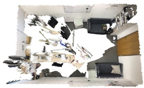</td><td>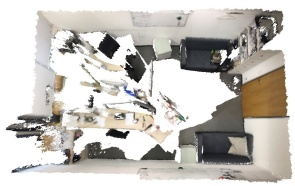</td><td>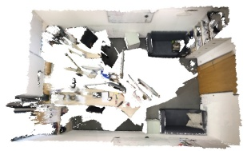</td><td>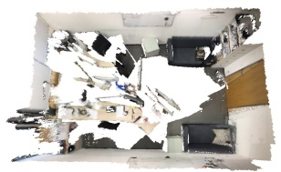 RE: 2.37 | TE: 0.08 | Time: 107.4s</td></tr><tr><td>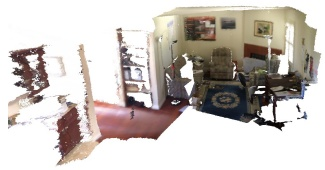</td><td>RE: 1.04 |TE: 0.03| Time: 13.1s 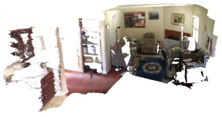 RE:1.62|TE: 0.06|Time:10.7s</td><td>RE: 2.79 | TE: 0.08 | Time: 170.0s 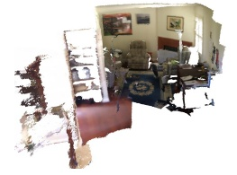 RE: 8.52ITE: 0.18|Time: 152.1s</td><td>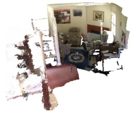 RE: 7.76 | TE: 0.20 | Time: 88.6s</td></tr><tr><td>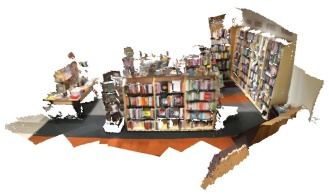 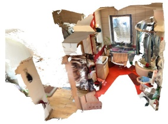</td><td>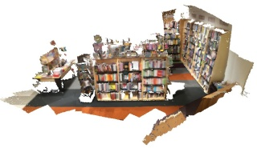 RE: 2.19|TE:0.09|Time: 11.6s</td><td>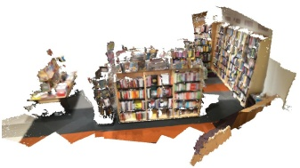 RE: 5.41 | TE: 0.19 | Time: 173.9s RE: 87.98 | TE: 2.11 | Time: 103.4s</td><td>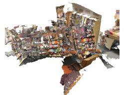</td></tr><tr><td>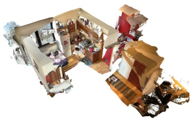</td><td>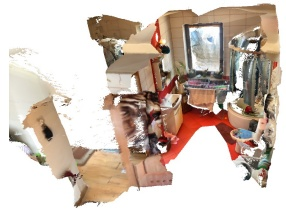 RE:1.26|TE: 0.03|Time:18.2s</td><td>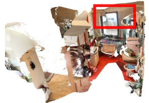 RE: 24.86ITE: 0.31 ITime: 323.6sRE: 33.78 ITE: 0.55 ITime: 294.7s</td><td>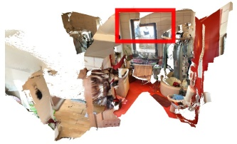</td></tr><tr><td></td><td>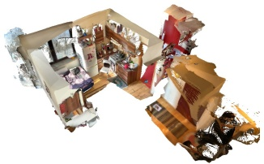</td><td>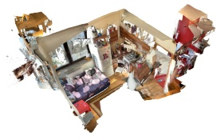</td><td></td></tr><tr><td></td><td></td><td></td><td>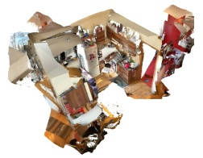</td></tr><tr><td></td><td>RE: 1.20 | TE: 0.05| Time: 20.7s</td><td>RE: 58.42 | TE: 0.89 | Time: 370.7s RE: 27.26 |TE: 1.36 | Time: 498.3s</td><td></td></tr><tr><td></td><td></td><td></td><td></td></tr><tr><td></td><td></td><td></td><td></td></tr><tr><td></td><td></td><td></td><td></td></tr><tr><td></td><td></td><td></td><td></td></tr><tr><td></td><td></td><td></td><td></td></tr><tr><td>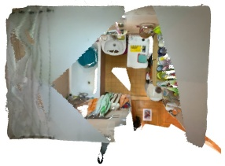</td><td></td><td></td><td></td></tr><tr><td></td><td></td><td></td><td></td></tr><tr><td></td><td></td><td>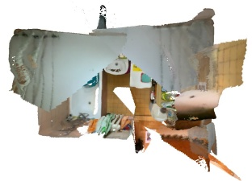</td><td></td></tr><tr><td></td><td>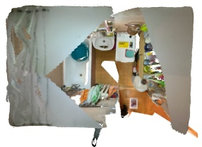</td><td></td><td></td></tr><tr><td></td><td></td><td></td><td>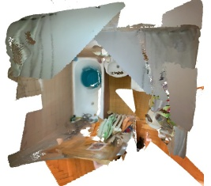</td></tr><tr><td></td><td></td><td></td><td></td></tr><tr><td></td><td></td><td></td><td></td></tr><tr><td></td><td></td><td></td><td></td></tr><tr><td></td><td></td><td></td><td></td></tr><tr><td></td><td></td><td>RE: 1.30 | TE: 0.03| Time: 12.8s RE: 41.68 | TE: 0.32 | Time: 456.7s RE: 44.97 | TE: 0.39 | Time: 444.5s</td><td></td></tr><tr><td></td><td></td><td></td><td></td></tr><tr><td></td><td></td><td></td><td></td></tr><tr><td></td><td></td><td></td><td></td></tr><tr><td></td><td></td><td></td><td></td></tr><tr><td>Fig. 4 Qualitative comparisons on ScanNet (top three rows) and ARKitScenes (bottom three rows). PointVGGT achieves more accurate alignment than two state-of-the-art RGB-D pairwise registration methods, ZeroMatch (Jiang et al, 2025c) and PointMBF (Yuan et al, 2023) with PGO (Zhou et al, 2018) (i.e., pose graph optimization of Open3D). It should</td><td>be highlighted that our proposed foundation-then-refnement paradigm significantly reduces inference time from minutes to</td><td></td><td></td></tr></table>

Table 1 Performance comparisons on indoor ScanNet (Dai et al, 2017a), ScanNet++ (Yeshwanth et al, 2023) and ArkitScenes (Baruch et al, 2021) benchmark datasets.
<table><tr><td rowspan="2">Dataset</td><td rowspan="2">Global</td><td rowspan="2">Method</td><td colspan="6">Rotation Error</td><td colspan="6">Translation Error (m)</td></tr><tr><td></td><td>10°</td><td>30°</td><td>45°</td><td>Mean/Med</td><td>0.05</td><td></td><td>0.1</td><td>0.25</td><td>0.5</td><td>0.75</td><td>Mean/Med</td></tr><tr><td rowspan="9">ScanNet</td><td rowspan="2">GSAM</td><td>LLT UR&amp;R PointMBF ColorPCR</td><td>12.4 31.4 36.4 48.7</td><td>16.3 42.3 44.5 66.7</td><td>24.6 52.4 49.6</td><td>44.2 61.1 54.3 78.3</td><td>52.1 63.7 61.5 78.6</td><td>53.9/38.7 43.6/8.3 46.8/12.4 35.4/3.1</td><td>7.3 21.0 24.8</td><td>13.8 29.1 37.5</td><td>26.2 46.5 48.2</td><td>37.6 56.7 51.4</td><td>48.1 62.0 55.8</td><td>1.19/0.80 1.02/0.30 1.05/0.42</td></tr><tr><td>ZeroMatch</td><td>40.7 13.3</td><td>48.8 19.2</td><td>76.3 56.5 30.8</td><td>57.8 48.8</td><td>60.3 55.5</td><td>47.8/5.4 50.7/31.9</td><td>27.6 28.2 7.6</td><td>49.8 43.7 15.0</td><td>74.2 48.5 29.1</td><td>77.3 52.3 42.6</td><td>77.4 55.8 51.8</td><td>0.68/0.10 0.94/0.38 1.22/0.70</td></tr><tr><td>SGHR</td><td>LLT UR&amp;R PointMBF ColorPCR ZeroMatch</td><td>33.8 37.1 50.9 51.7 16.2</td><td>47.2 48.0 67.9 64.0 25.8</td><td>54.4 54.1 78.2 70.6 43.5</td><td>58.8 61.9 81.1 73.2 73.8</td><td>61.1 64.2 83.7 73.8</td><td>48.2/5.7 43.3/5.5 28.7/2.9 34.2/2.9 29.8/11.9</td><td>23.6 26.2 26.5 32.8 11.0</td><td>36.8 40.1 47.2 54.9 21.0</td><td>52.7 51.2 71.7 66.7 38.6</td><td>56.8 54.8 78.3 71.6 57.6</td><td>60.5 57.0 78.8 74.9 67.0</td><td>1.11/0.17 1.06/0.21 0.74/0.11 0.64/0.08</td></tr><tr><td>PGO</td><td>LLT UR&amp;R PointMBF ColorPCR ZeroMatch</td><td>45.6 56.2 51.2 57.4</td><td>62.7 75.5 70.6 75.2</td><td>76.4 85.1 91.3 88.5</td><td>89.6 92.4 95.4 97.4</td><td>82.7 91.9 92.4 95.8 97.4</td><td>15.7/3.4 15.7/2.6 11.2/2.9 6.2/2.5</td><td>27.8 31.2 27.3 39.1</td><td>49.8 59.3 49.5 63.7</td><td>68.5 79.8 81.5 82.0</td><td>82.4 86.9 86.5 93.0</td><td>85.8 88.3 87.1 95.4</td><td>0.74/0.40 0.41/0.10 0.38/0.08 0.48/0.10 0.15/0.07</td></tr><tr><td></td><td>PointVGGT (VGGT) PointVGGT (DA3) PointVGGT (PI3) LLT</td><td>24.5 81.0 92.2 43.0</td><td>48.0 94.9 99.3 55.3</td><td>87.1 100.0 100.0 75.6</td><td>100.0 100.0 100.0 94.7</td><td>100.0 100.0 100.0 99.5</td><td>5.8/5.2 2.0/1.6 1.4/1.1 7.7/3.8</td><td>14.5 55.5 73.4 26.3</td><td>37.0 80.1 89.0 43.9</td><td>83.2 96.0 98.0 68.9</td><td>97.7 98.6 100.0 84.9</td><td>99.8 99.9 100.0 93.2</td><td>0.16/0.13 0.07/0.04 0.05/0.03 0.24/0.13</td></tr><tr><td rowspan="2">GSAM SGHR</td><td>UR&amp;R PointMBF ColorPCR ZeroMatch</td><td></td><td>75.8 82.5 81.1 88.4 71.3 86.4 91.2 96.1</td><td>89.3 93.6 99.0 98.0</td><td>99.7 99.7 100.0 100.0</td><td>99.7 99.7 100.0 100.0</td><td>3.4/1.5 3.0/1.2 2.5/1.6 1.7/1.2</td><td>59.9 69.0 39.6 68.4</td><td>79.9 83.3 66.4 82.1</td><td>86.9 90.0 86.7 87.3</td><td>95.1 96.3 96.9 94.2</td><td>97.9 98.3 98.9 98.9</td><td>0.11/0.04 0.09/0.03 0.122/0.065 0.10/0.03</td></tr><tr><td>LLT UR&amp;R PointMBF ColorPCR ZeroMatch</td><td>42.3 76.1 80.0 72.1 90.9</td><td>56.6 82.7 83.7 85.5 96.4</td><td>74.7 89.3 87.5 96.9 98.6</td><td>95.2 100.0 94.4 98.0 100.0</td><td>99.4 100.0 95.0 98.0 100.0</td><td>8.3/3.9 3.3/1.5 10.6/1.3 4.9/1.6 1.7/1.2</td><td>26.7 58.7 67.4 40.0 66.0</td><td>44.3 78.2 78.8 66.3 82.6</td><td>64.8 87.3 84.8 85.5 88.6</td><td>80.6 94.6 91.0 93.3 95.6</td><td>90.8 98.1 93.2 96.6 99.1</td><td>0.26/0.13 0.11/0.04 0.20/0.03 0.19/0.06 0.09/0.04</td></tr><tr><td>PGO</td><td>LLT UR&amp;R PointMBF ColorPCR ZeroMatch</td><td>35.3 69.5 80.0 66.5 89.4</td><td>51.6 75.2 88.2 78.5 97.0</td><td>73.6 83.8 94.7 91.0</td><td>96.5 98.2 99.6 95.7</td><td>99.3 98.6 100.0 95.7</td><td>7.9/4.8 6.2/1.6 2.7/1.3 9.3/1.8</td><td>23.8 55.2 68.4 40.2</td><td>44.0 70.6 83.3 66.5</td><td>66.6 81.4 92.8 86.3</td><td>82.2 91.1 98.1 91.9 98.6</td><td>90.4 97.1 99.5 94.2</td><td>0.29/0.12 0.16/0.04 0.07/0.03 0.51/0.06 0.07/0.03</td></tr><tr><td></td><td>PointVGGT (VGGT) PointVGGT (DA3) PointVGGT (PI3)</td><td>90.5 100.0 94.8</td><td>97.6 100.0 96.2</td><td>98.7 100.0 100.0 99.4</td><td>100.0 100.0 100.0 100.0</td><td>100.0 100.0 100.0 100.0</td><td>1.7/1.3 1.4/1.1 0.7/0.6 1.1/0.7</td><td>70.5 77.3 95.4 90.8</td><td>84.7 94.3 99.9 99.9</td><td>91.4 100.0 100.0 100.0</td><td>100.0 100.0 100.0</td><td>99.5 100.0 100.0 100.0</td><td>0.04/0.03 0.02/0.02 0.03/0.02</td></tr><tr><td rowspan="9">ArkitScenes</td><td rowspan="2">GSAM</td><td>LLT UR&amp;R PointMBF</td><td>2.7 7.9 8.7 19.0</td><td>4.4 11.1 10.9 28.4</td><td>8.1 17.3 16.4</td><td>20.4 29.0 26.7</td><td>31.8 35.6 31.7</td><td>82.7/78.7 84.0/84.9 81.4/81.9</td><td>2.4 6.6 7.1</td><td>4.7 10.5 10.2</td><td>9.8 17.4 15.9</td><td>21.4 24.3 25.8</td><td>34.0 34.0 34.5</td><td>1.22/1.01 1.40/1.11 1.39/1.15</td></tr><tr><td>ColorPCR ZeroMatch LLT UR&amp;R</td><td>19.3 2.4 6.9</td><td>26.8 4.1 9.2</td><td>37.9 29.5 7.2 13.6</td><td>44.8 33.4 18.7 23.7</td><td>46.0 37.0 26.0 27.5</td><td>68.5/57.5 77.2/86.8 91.2/94.0 91.6/104.2</td><td>15.0 11.9 2.1 6.2</td><td>25.6 15.4 4.4 9.8</td><td>37.0 19.2 8.8 16.5</td><td>45.6 28.6 16.0 24.2</td><td>54.1 42.7 26.1 32.4</td><td>1.01/0.63 1.10/0.90 1.56/1.26 1.59/1.28</td></tr><tr><td>SGR LLT UR&amp;R PGO</td><td>PointMBF ColorPCR ZeroMatch</td><td>6.6 14.7 28.1 3.2 10.0</td><td>8.9 20.5 39.8 6.3 14.4</td><td>12.0 26.1 47.7 12.5 22.4</td><td>14.4 18.6 31.5 34.7 48.7 49.2 34.9 44.9 38.0 41.5</td><td>104.2/115.6 86.8/92.2 62.4/78.9 71.3/59.4 83.9/75.5</td><td>4.9 12.1 2.7 7.3</td><td>17.5 10.4 19.0</td><td>8.4 19.4 29.0 6.5 13.1</td><td>13.5 27.7 36.7 15.0 23.8</td><td>18.3 35.2 44.9 27.5 34.8</td><td>25.2 42.7 56.5 38.0 40.1</td><td>1.57/1.37 1.51/1.05 0.97/0.58 1.46/1.14 1.83/1.24 1.21/0.57</td></tr><tr><td></td><td>PointMBF ColorPCR ZeroMatch PointVGGT (VGGT)</td><td>14.8 18.0 31.3 30.2</td><td>20.9 29.4 48.5 54.7</td><td>31.6 37.7 60.1 81.0</td><td>51.5 48.3 61.7 91.1</td><td>58.8 49.4 62.2 93.8</td><td>73.3/64.2 48.6/5.3 11.4/4.6</td><td>14.9 24.2 21.3</td><td>28.1 40.5 48.7</td><td>38.9 51.5 79.4</td><td>43.9 57.0 88.8</td><td>47.3 64.6 93.0</td><td>1.45/0.99 0.86/0.21 0.24/0.10</td></tr><tr><td>PointVGGT PointVGGT</td><td>(DA3) (PI3)</td><td>75.2 72.1</td><td>77.6 77.2</td><td>80.4 83.9</td><td>85.2 96.1</td><td>87.8 99.2</td><td>15.1/1.2 5.4/1.5</td><td>59.9 52.4</td><td>76.2 73.3</td><td>81.8 84.4</td><td>85.1 93.9</td><td>88.2 97.8</td><td>0.26/0.04 0.13/0.05</td></tr></table>

As shown in the top block of Table 1, PointVGGT with Pi3 and DA3 consistently and substantially outperforms the full set of pairwise-then-global baselines. Among these baselines, ZeroMatch+PGO represents the strongest competitor, achieving rotation recall of 57.4%/75.2%/88.5% at $3 ^ { \circ } / 5 ^ { \circ } / 1 0 ^ { \circ }$ and a mean rotation error of 6.2◦. PointVGGT (Pi3) exceeds these numbers by a wide margin, that is 92.2%/99.3%/100.0% recall at the same thresholds, reducing mean rotation error by 4.1× to 1.4◦ and mean translation error from 0.15 m to 0.05 m. Notably, even PointVGGT instantiated with the preliminary VGGT achieves 100% recall at 30◦/45◦. We attribute this strong performance to the holistic visual geometry priors provided by the foundation models, which jointly reason over all views. This fundamentally avoids the error propagation and outlier sensitivity inherent to conventional pairwise-then-global pipelines. Additional qualitative comparisons are presented in Fig. 4 and Appendix B.

ScanNet++. ScanNet++ (Yeshwanth et al, 2023) consists of unconstrained indoor RGB-D sequences captured by iPhone LiDAR sensors. In contrast to the clean structured-light depth in ScanNet, the raw LiDAR depth in ScanNet++ is afected by severe measurement noise, motion blur, and incomplete depth observations, all of which significantly undermine the reliability of multiview matching. We evaluate on 14 sequences from the nvs test iphone subset, where keyframes are sampled every 20 frames and up to the first 60 keyframes of each sequence are retained, following the same baseline comparison protocol as in ScanNet. As shown in the middle block of Table 1, PointVGGT (DA3) achieves impressive registration precision, yielding 100% recall under all evaluated rotation and translation thresholds, with mean/median rotation errors of $0 . 7 ^ { \circ } / 0 . 6 ^ { \circ }$ and mean/median translation errors of 0.02 m/0.02 m. Compared with the strongest baseline, ZeroMatch+PGO, PointVGGT (DA3) improves the 3◦ rotation recall by 10.6 points and the 0.05 m translation recall by 24.9 points. The gap becomes even larger under stricter thresholds, showing that PointVGGT remains robust even when noisy and incomplete depth severely degrades feature matching.

Table 2 Performance comparisons on object-centric WildRGB-D (Xia et al, 2024) benchmark dataset.
<table><tr><td rowspan="2">Pose Graph</td><td rowspan="2">Method</td><td colspan="6">Rotation Error</td><td colspan="6">Translation Error (m)</td></tr><tr><td>3°</td><td>5°</td><td>10°</td><td>30°</td><td>45°</td><td>Mean/Med</td><td>0.05</td><td>0.1</td><td>0.25</td><td>0.5</td><td>0.75</td><td>Mean/Med</td></tr><tr><td rowspan="5">GTSAM</td><td>LLT</td><td>11.3</td><td>14.3</td><td>17.4</td><td>26.2</td><td>32.8</td><td>83.3/85.9</td><td>13.3</td><td>18.5</td><td>28.3</td><td>48.3</td><td>66.5</td><td>0.56/0.53</td></tr><tr><td>UR&amp;R</td><td>18.7</td><td>22.1</td><td>24.2</td><td>28.4</td><td>33.8</td><td>83.2/91.5</td><td>17.9</td><td>22.7</td><td>30.0</td><td>44.3</td><td>67.6</td><td>0.55/0.56</td></tr><tr><td>PointMBF</td><td>6.9</td><td>10.7</td><td>15.5</td><td>23.8</td><td>29.4</td><td>84.5/86.3</td><td>10.1</td><td>14.8</td><td>24.8</td><td>46.5</td><td>67.9</td><td>0.57/0.52</td></tr><tr><td>ColorPCR</td><td>25.4</td><td>39.3</td><td>51.0</td><td>60.7</td><td>64.5</td><td>49.2/9.2</td><td>32.7</td><td>47.1</td><td>60.7</td><td>79.0</td><td>92.2</td><td>0.27/0.12</td></tr><tr><td>ZeroMatch</td><td>15.6</td><td>19.7</td><td>21.6</td><td>25.7</td><td>28.7</td><td>84.2/85.6</td><td>16.4</td><td>20.2</td><td>25.9</td><td>41.8</td><td>66.4</td><td>0.59/0.57</td></tr><tr><td rowspan="5">SGHR</td><td>LLT</td><td>11.7</td><td>14.4</td><td>17.9</td><td>27.4</td><td>34.0</td><td>83.3/84.9</td><td>13.3</td><td>17.9</td><td>29.6</td><td>47.7</td><td>66.1</td><td>0.56/0.53</td></tr><tr><td>UR&amp;R</td><td>22.2</td><td>26.3</td><td>29.1</td><td>36.8</td><td>39.3</td><td>78.0/82.4</td><td>19.8</td><td>28.0</td><td>37.2</td><td>49.4</td><td>68.1</td><td>0.51/0.51</td></tr><tr><td>PointMBF</td><td>6.8</td><td>10.6</td><td>15.4</td><td>26.8</td><td>33.4</td><td>84.7/86.4</td><td>10.6</td><td>16.2</td><td>26.4</td><td>47.5</td><td>69.3</td><td>0.57/0.52</td></tr><tr><td>ColorPCR</td><td>27.5</td><td>38.1</td><td>53.4</td><td>59.6</td><td>61.7</td><td>64.7/8.7</td><td>28.8</td><td>46.2</td><td>59.3</td><td>70.3</td><td>87.4</td><td>0.36/0.12</td></tr><tr><td>ZeroMatch</td><td>25.4</td><td>35.1</td><td>41.2</td><td>46.7</td><td>49.0</td><td>65.2/54.2</td><td>23.5</td><td>32.4</td><td>42.6</td><td>60.0</td><td>72.2</td><td>0.48/0.39</td></tr><tr><td rowspan="5">PGO</td><td>LLT</td><td>26.5</td><td>40.5</td><td>57.5</td><td>87.0</td><td>92.4</td><td>18.0/7.1</td><td>35.9</td><td>48.7</td><td>76.4</td><td>88.7</td><td>92.2</td><td>0.20/0.10</td></tr><tr><td>UR&amp;R</td><td>58.3</td><td>76.0</td><td>88.5</td><td>94.5</td><td>94.5</td><td>10.1/2.5</td><td>55.5</td><td>68.2</td><td>86.4</td><td>93.9</td><td>95.1</td><td>0.13/0.04</td></tr><tr><td>PointMBF</td><td>10.2</td><td>18.3</td><td>36.2</td><td>67.6</td><td>76.1</td><td>34.5/16.3</td><td>25.8</td><td>40.3</td><td>63.1</td><td>79.5</td><td>87.9</td><td>0.30/0.16</td></tr><tr><td>ColorPCR</td><td>20.1</td><td>29.6</td><td>43.5</td><td>54.0</td><td>59.9</td><td>64.8/22.6</td><td>22.4</td><td>35.7</td><td>48.2</td><td>69.6</td><td>85.6</td><td>0.35/0.27</td></tr><tr><td>ZeroMatch</td><td>39.7</td><td>57.8</td><td>73.1</td><td>85.6</td><td>89.7</td><td>22.0/4.1</td><td>37.4</td><td>54.4</td><td>75.9</td><td>87.5</td><td>90.6</td><td>0.21/0.09</td></tr><tr><td rowspan="4"></td><td>PointVGGT (VGGT)</td><td>31.4</td><td>59.8</td><td>92.9</td><td>100.0</td><td>100.0</td><td>4.7/4.3</td><td>71.9</td><td>95.7</td><td>99.1</td><td>100.0</td><td>100.0</td><td>0.04/0.03</td></tr><tr><td>PointVGGT (DA3)</td><td>80.8</td><td>93.1</td><td>98.5</td><td>100.0</td><td>100.0</td><td>2.0/1.4</td><td>92.9</td><td>98.8</td><td>100.0</td><td>100.0</td><td>100.0</td><td>0.02/0.01</td></tr><tr><td>PointVGGT (PI3)</td><td>88.7</td><td>93.5</td><td>98.9</td><td>100.0</td><td>100.0</td><td>1.4/0.8</td><td>93.4</td><td>99.2</td><td>100.0</td><td>100.0</td><td>100.0</td><td>0.01/0.01</td></tr></table>

Table 3 Performance comparisons on outdoor KITTI (Geiger et al, 2012) and Waymo (Sun et al, 2020) benchmark datasets.
<table><tr><td rowspan="2">Method</td><td colspan="3">Rotation Error</td><td colspan="3">Translation Error (m)</td><td colspan="3">Rotation Error</td><td colspan="3">Translation Error (m)</td></tr><tr><td>5°</td><td>10°</td><td>Mean/Med</td><td>0.5</td><td>0.75</td><td>Mean/Med</td><td>5°</td><td>10°</td><td>Mean/Med</td><td>0.5</td><td>0.75</td><td>Mean/Med</td></tr><tr><td>ZeroMatch + GTSAM</td><td>94.6</td><td>95.1</td><td>1.2/0.2</td><td>69.8</td><td>72.7</td><td>2.18/0.14</td><td>100.0</td><td>100.0</td><td>0.1/0.1</td><td>69.3</td><td>69.9</td><td>3.14/0.06</td></tr><tr><td>ZeroMatch + SGHR</td><td>95.7</td><td>98.0</td><td>0.7/0.2</td><td>52.4</td><td>57.7</td><td>2.22/0.37</td><td>100.0</td><td>100.0</td><td>0.1/0.1</td><td>58.4</td><td>61.6</td><td>3.15/0.11</td></tr><tr><td>ZeroMatch + PGO</td><td>100.0</td><td>100.0</td><td>0.5/0.3</td><td>64.9</td><td>73.6</td><td>0.99/0.22</td><td>100.0</td><td>100.0</td><td>0.5/0.3</td><td>75.7</td><td>76.4</td><td>1.91/0.06</td></tr><tr><td>PointVGGT (VGGT)</td><td>90.0</td><td>98.5</td><td>1.7/0.6</td><td>58.8</td><td>73.1</td><td>0.53/0.34</td><td>100.0</td><td>100.0</td><td>0.1/0.6</td><td>98.7</td><td>99.7</td><td>0.07/0.03</td></tr><tr><td>PointVGGT (DA3)</td><td>90.3</td><td>97.8</td><td>1.7/0.5</td><td>80.9</td><td>88.6</td><td>0.35/0.19</td><td>100.0</td><td>100.0</td><td>0.1/0.1</td><td>95.2</td><td>98.0</td><td>0.09/0.04</td></tr><tr><td>PointVGGT (PI3)</td><td>100.0</td><td>100.0</td><td>0.3/0.2</td><td>75.6</td><td>85.0</td><td>0.41/0.24</td><td>100.0</td><td>100.0</td><td>0.1/0.1</td><td>84.6</td><td>89.6</td><td>0.25/0.08</td></tr></table>

ARKitScenes. ARKitScenes (Baruch et al, 2021) is a large-scale indoor RGB-D dataset captured with iPhone LiDAR. We uniformly sample keyframes at a stride of 5 and retain up to the first 80 keyframes of each sequence. The bottom block of Table 1 shows that the strongest baseline, ZeroMatch+PGO, achieves only 31.3%/48.5%/60.1% rotation recall at $3 ^ { \circ } / 5 ^ { \circ } / 1 0 ^ { \circ }$ , underscoring the dificulty of this benchmark for conventional two-stage pipelines. In contrast, PointVGGT (Pi3) reaches 72.1%/77.2%/83.9% at the same thresholds, demonstrating robust global pose recovery under severely degraded depth conditions. PointVGGT (DA3) achieves the best performance at the strict $3 ^ { \circ } / 5 ^ { \circ }$ thresholds, with 75.2%/77.6% recall, while Pi3 performs better at the relaxed $3 0 ^ { \circ } / 4 5 ^ { \circ }$ thresholds (96.1%/99.2% vs. 85.2%/87.8% for DA3), suggesting complementary strengths across diferent foundation backbones. Together with the results on ScanNet and ScanNet++, these findings confirm the generality of the proposed foundation-then-refinement paradigm across diverse indoor sensors, ranging from clean structured-light cameras to raw consumer LiDAR.

## 4.2.2 Evaluation on Object-centric Benchmark

WildRGB-D. WildRGB-D (Xia et al, 2024) is a largescale object-centric RGB-D dataset collected from 360◦ iPhone videos of diverse real-world objects in cluttered environments. Compared with scene-level registration, it poses distinct challenges, including small object scales, severe background clutter, diverse geometric structures, and full 360◦ viewpoint coverage under handheld capture. For evaluation, we randomly select 17 sequences, each corresponding to a diferent object category: ball, book, detergent, flower pot, hat, kettle, keyboard, knife, microwave, orange, peach, pineapple, pliers, remote control, stufed toy, razor, and scissors. Keyframes are uniformly sampled from each sequence with a stride of 10. As shown in Table 2, PointVGGT consistently outperforms all pairwise-then-global baselines across all metrics. Among the baselines, UR&R+PGO is the strongest competitor, achieving 58.3%/76.0%/88.5% rotation recall at $3 ^ { \circ } / 5 ^ { \circ } / 1 0 ^ { \circ }$ . In contrast, PointVGGT (Pi3) reaches $8 8 . 7 \% / 9 3 . 5 \% / 9 8 . 9 \%$ at the same thresholds, achieves 100% recall at $3 0 ^ { \circ } / 4 5 ^ { \circ }$ , and yields only $0 . 0 1 \mathrm { m } / 0 . 0 1$ m mean/median translation error, indicating near-perfect registration across all 17 object categories. PointVGGT (DA3) also performs strongly, achieving 80.8%/93.1% recall at $3 ^ { \circ } / 5 ^ { \circ }$ and 100% recall at $3 0 ^ { \circ } / 4 5 ^ { \circ }$ . These results demonstrate that the proposed method generalizes robustly beyond scene-level registration to object-centric settings in a fully zero-shot manner. More qualitative comparisons are provided in Fig. 5.

## 4.2.3 Evaluation on Outdoor Benchmarks

KITTI. KITTI (Geiger et al, 2012) is a standard largescale outdoor benchmark where point clouds are acquired by a vehicle-mounted spinning LiDAR sensor in urban driving environments. This setting introduces a fundamentally diferent sensing modality: point clouds are substantially sparser and cover far larger spatial extents than indoor RGB-D data. For evaluation, we sample up to the first 20 keyframes from each test sequence. Since ZeroMatch is the only zero-shot method capable of operating on both indoor and outdoor point clouds (the remaining baselines are trained exclusively on indoor RGB-D data), we compare against ZeroMatch with the three global synchronization backends (GT-SAM, SGHR, PGO). As reported in the left half of Table 3, ZeroMatch+PGO achieves perfect rotation recall (100%/100% at $5 ^ { \circ } / 1 0 ^ { \circ } )$ but with a substantial mean translation error of 0.99 m. PointVGGT (Pi3) matches the perfect rotation recall with a mean/median rotation error of $0 . 3 ^ { \circ } / 0 . 2 ^ { \circ }$ , and markedly improves translation accuracy, achieving 75.6%/ 85.0% recall at $0 . 5 \mathrm { m } / 0 . 7 5$ m thresholds (vs. 64.9%/73.6% for ZeroMatch+PGO) and reducing mean translation error from 0.99 m to 0.41 m. These results confirm that PointVGGT transfers efectively to LiDAR-based outdoor registration, demonstrating the cross-modality generalization of our foundationthen-refinement paradigm.

Waymo. The Waymo Open Dataset (Sun et al, 2020) is a diverse autonomous driving benchmark featuring varied weather conditions, trafic densities, and geographic environments, providing a rigorous test of cross-domain robustness. For evaluation, we randomly select 15 test sequences and retain up to the first 20 keyframes from each sequence. Following the same comparison protocol as KITTI, we evaluate against ZeroMatch with GT-SAM, SGHR, and PGO backends. As shown in the right half of Table 3, PointVGGT (VGGT) achieves the strongest overall performance, 100%/100% rotation recall at $5 ^ { \circ } / 1 0 ^ { \circ }$ and $9 8 . 7 \% / 9 9 . 7 \%$ translation recall at $0 . 5 \mathrm { m } / 0 . 7 5 \mathrm { m }$ , with a mean/median translation error of $0 . 0 7 \mathrm { m } / 0 . 0 3 \mathrm { m }$ , far outperforming the best Zero-Match baseline (mean 1.91 m). The strong performance on both KITTI and Waymo, despite their markedly diferent environmental conditions and geographic settings, demonstrates the robust zero-shot generalization of PointVGGT across outdoor LiDAR scenarios, alongside its efectiveness on indoor RGB-D benchmarks.

## 4.3 Ablation Studies

Efectiveness of the Foundation-Driven Initialization. We first conduct the ablation experiment to validate the contribution of foundation-driven pose initialization Foundation, which applies the scale-aligned foundation-model poses directly without any subsequent refinement. As demonstrated in Table 4, the Foundation configuration alone already delivers remarkably strong performance. On ScanNet, it achieves 99.0%/100.0% rotation recall at $5 ^ { \circ } / 1 0 ^ { \circ }$ with a mean rotation error of only $1 . 5 ^ { \circ }$ , surpassing the best pairwise-then-global baseline (ZeroMatch+PGO, 88.5% at 10°) even without any geometric refinement. This provides direct empirical evidence for the central thesis of PointVGGT: visual geometry foundation models encode holistic, globally consistent geometric priors that bypass the fundamental limitations of pairwise pipelines. By jointly reasoning over all input frames, the foundation model circumvents the error accumulation in prior two-stage approaches, delivering high-quality global pose initialization at a fraction of the computational cost.

Efectiveness of Pose Refinement. We next evaluate the performance gains brought by the pose refinement stage. As demonstrated in Table 4, adding the voxelized dense correspondence construction and robust motion-only bundle adjustment $( F o u n d a t i o n  { + } R e f i n e )$ consistently improves performance across all criteria. For example, on ScanNet, the benefit of refinement is substantially more pronounced: $3 ^ { \circ }$ rotation recall improves from 90.9% to 92.2% (+1.3 points), and 0.05 m translation recall rises from 65.6% to 73.4% (+7.8 points). This large gain indicates that inaccuracies in scale-factor estimation can degrade the initial poses, while our refinement stage efectively compensates for these errors.

Moreover, we evaluate the eficacy of diferent losses: the correspondence residual and the geometric reprojection residual. As shown in the bottom block of Table 4, incorporating these residuals consistently yields performance gains. Specifically, the reprojection residual elevates the recall ratio under the 0.05m translation threshold from 65.6% to 68.0%, with the best results achieved when both losses are combined (73.4%).

Table 4 Ablation Studies on diferent components and configurations evaluated on ScanNet (Dai et al, 2017a).
<table><tr><td rowspan="2">Method</td><td colspan="6">Rotation Error</td><td colspan="6">Translation Error (m)</td></tr><tr><td> $3 ^ { \circ }$ </td><td> $5 ^ { \circ }$ </td><td> $1 0 ^ { \circ }$ </td><td> $3 0 ^ { \circ }$ </td><td> $4 5 ^ { \circ }$ </td><td>Mean/Med</td><td>0.05</td><td>0.1</td><td>0.25</td><td>0.5</td><td>0.75</td><td>Mean/Med</td></tr><tr><td>Foundation</td><td>90.9</td><td>99.0</td><td>100.0</td><td>100.0</td><td>100.0</td><td>1.5/1.2</td><td>65.6</td><td>86.9</td><td>97.8</td><td>100.0</td><td>100.0</td><td>0.06/0.04</td></tr><tr><td>Foundation + Refine</td><td>92.2</td><td>99.3</td><td>100.0</td><td>100.0</td><td>100.0</td><td>1.4/1.1</td><td>73.4</td><td>89.0</td><td>98.0</td><td>100.0</td><td>100.0</td><td>0.05/0.03</td></tr><tr><td>ADAM</td><td>91.1</td><td>98.9</td><td>100.0</td><td>100.0</td><td>100.0</td><td>1.4/1.1</td><td>70.8</td><td>88.7</td><td>97.8</td><td>100.0</td><td>100.0</td><td>0.05/0.03</td></tr><tr><td>GN w/ CG (ours)</td><td>92.2</td><td>99.3</td><td>100.0</td><td>100.0</td><td>100.0</td><td>1.4/1.1</td><td>73.4</td><td>89.0</td><td>98.0</td><td>100.0</td><td>100.0</td><td>0.05/0.03</td></tr><tr><td>Reproject. Residual</td><td>90.9</td><td>99.0</td><td>100.0</td><td>100.0</td><td>100.0</td><td>1.5/1.2</td><td>68.0</td><td>87.1</td><td>97.8</td><td>100.0</td><td>100.0</td><td>0.05/0.03</td></tr><tr><td>Reproject. + Corr. Residual</td><td>92.2</td><td>99.3</td><td>100.0</td><td>100.0</td><td>100.0</td><td>1.4/1.1</td><td>73.4</td><td>89.0</td><td>98.0</td><td>100.0</td><td>100.0</td><td>0.05/0.03</td></tr></table>

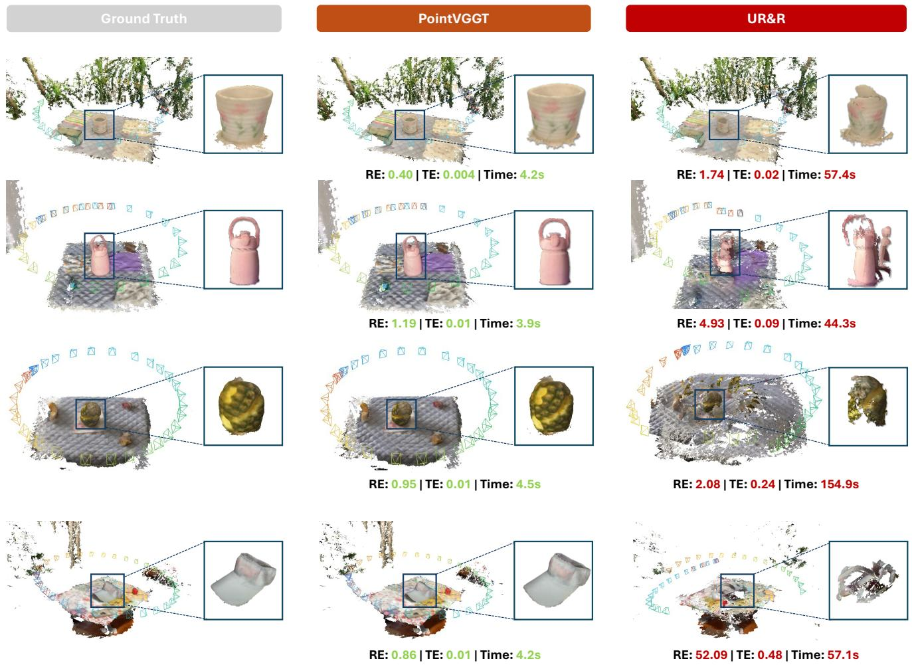  
Fig. 5 Qualitative comparisons on object-centric scenes from WildRGB-D (Xia et al, 2024). Our PointVGGT demonstrates impressive object reconstruction quality, producing more coherent and accurate surfaces and shapes than UR&R+PGO.

Analysis of Optimization Strategies. We further evaluate the efectiveness of the optimization strategy by comparing a standard ADAM baseline (Kingma and

Ba, 2014) with our GN-CG scheme (Gauss-Newton with conjugate gradient). Grounded in the IRLS objective (Eq. 18), ADAM is configured with 200 iterations, a learning rate of 0.01, and momentum parameters $\beta = ( 0 . 9 , 0 . 9 9 9 )$ . As shown in Table 4, GN w/ PCG consistently outperforms first-order adaptive methods, elevating the 0.05m translation success rate from 70.8% to 73.4%. This confirms that leveraging secondorder geometric information better accommodates the non-linearity of pose estimation than general-purpose gradient methods.

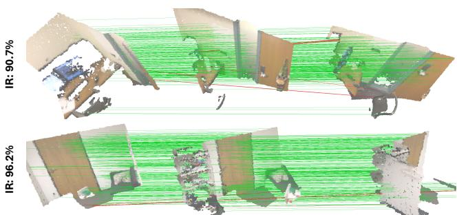  
Fig. 6 Visualization of cross-view correspondences produced by our voxelized spatial hashing-driven fast matching scheme. The high inlier ratios (green) across view pairs highlight the robustness and reliability of the proposed matching strategy.

Table 5 Runtime (second) of diferent matching schemes. NN-Match: Nearest neighbor search; VoxelMatch: Voxelized spatial hashing; IR: Inlier ratio.
<table><tr><td></td><td>NN-Match O(S2N2)</td><td>VoxelMatch O(SN)</td><td>Reduced↓</td><td>IR (%)</td></tr><tr><td>ScanNet</td><td>65.66</td><td>0.07</td><td>65.59↓</td><td>99.6</td></tr><tr><td>WildRGBD</td><td>76.15</td><td>0.07</td><td>76.08↓</td><td>89.1</td></tr><tr><td>KITTI</td><td>30.50</td><td>0.05</td><td>30.45↓</td><td>68.7</td></tr></table>

Table 6 Runtime (second) of each component. FoundInit: foundation-driven pose initialization; VoxelMatch: voxelized spatial hashing; MotionBA: motion-only bundle adjustment.
<table><tr><td></td><td>FoundInit</td><td>VoxelMatch</td><td>MotionBA</td><td>Total</td></tr><tr><td>ScanNet</td><td>3.27</td><td>0.07</td><td>7.80</td><td>11.14</td></tr><tr><td>WildRGBD</td><td>3.39</td><td>0.07</td><td>0.94</td><td>4.40</td></tr><tr><td>KITTI</td><td>1.93</td><td>0.05</td><td>10.92</td><td>12.90</td></tr></table>

Table 7 Performance and runtime under diferent numbers of Motion BA iterations. (⋆) denotes the default setting.
<table><tr><td></td><td>3°@R</td><td>5°@R</td><td>0.05@t</td><td>0.1@t</td><td>Time (s)</td></tr><tr><td>#iter=0</td><td>90.9</td><td>99.0</td><td>65.6</td><td>86.9</td><td>3.33</td></tr><tr><td>#iter=10</td><td>91.8</td><td>99.1</td><td>73.0</td><td>87.7</td><td>5.44</td></tr><tr><td>#iter=20</td><td>91.8</td><td>99.2</td><td>73.5</td><td>87.9</td><td>7.58</td></tr><tr><td>#iter=40*</td><td>92.2</td><td>99.3</td><td>73.4</td><td>89.0</td><td>11.14</td></tr><tr><td>#iter=80</td><td>92.5</td><td>99.6</td><td>73.2</td><td>89.5</td><td>14.62</td></tr></table>

Table 7 shows the trade-of between accuracy and runtime across diferent Motion BA iteration counts. While accuracy at 0.05m leaps from 65.6% to 73.0% with just 10 iterations, the performance gains plateau beyond 40 iterations. Since doubling the iterations to 80 only yields a marginal 0.3% rotation gain (92.2% → 92.5%) while increasing latency by over 30% (11.14s to 14.62s), we adopt 40 iterations as the default configuration to achieve a balance between precision and computational eficiency.

Voxelized Spatial Hashing. We now analyze the efec tiveness of the proposed voxelized spatial hashing scheme for fast correspondence construction from both eficiency and robustness perspectives. With regard to eficiency, Table 5 shows that compared with conventional pairwise matching-based correspondence construction with a complexity of $\mathcal { O } ( S ^ { 2 } N ^ { 2 } )$ , the proposed voxel matching reduces the runtime from 65.66 s to 0.07 s on ScanNet, from 76.15 s to 0.07 s on WildRGB-D, and from 30.50 s to 0.05 s on KITTI, by reducing the matching complexity to O(SN) and employing parallelized CUDA acceleration. Despite this significant acceleration, our method still recovers high-quality correspondences, specifically yielding inlier ratios of 99.6%, 89.1% and 68.7% on Scan-Net, WildRGBD and KITTI. This strong performance primarily stems from the high-quality, globally aligned 3D geometry provided by the foundation model, which brings geometrically corresponding points from diferent views into a shared spatial neighborhood and thus enables reliable correspondence retrieval through local voxel search. Fig. 6 illustrates our achieved high-quality correspondences.

Runtime Analysis. We further report the runtime of each component in the proposed pipeline in Table 6, including voxelized spatial hashing-driven correspondence construction (VoxelMatch), foundation-driven pose initialization (PoseInit), and motion-only bundle adjustment (MotionBA). It shows that VoxelMatch is extremely eficient, requiring less than 0.07 s across all datasets. By contrast, PoseInit and MotionBA dominate the runtime. Pose initialization typically takes 1.93-3.39 s depending on the number of input scans, while motion-only bundle adjustment further requires 0.94-10.92 s. In particular, Motion BA becomes the main computational bottleneck in most cases, due to iterative optimization over numerous correspondences. Notably, as shown in Fig. 1, our paradigm achieves a substantial speedup over prior pairwise-then-global methods, reducing the runtime from minutes to mere seconds.

## 5 Conclusion

We have introduced PointVGGT, a novel multiview RGB-D registration framework built upon a foundationthen-refinement paradigm. Unlike conventional methods, PointVGGT treats visual geometry priors as primary cues to directly recover metrically grounded global poses, eliminating the need for costly pairwise matching and global synchronization. By integrating voxelized spatial hashing for near-linear time correspondence building and a robust motion-only bundle adjustment, our method achieves outstanding zero-shot performance across six benchmarks, reducing inference time from minutes to mere seconds. Our framework is inherently plug-and-play and naturally benefits from the continuous evolution of

3D foundation models, ofering a scalable and eficient solution for robust multiview alignment.

## Acknowledgments

This research is supported by the MOE AcRF Tier 1 Grant of Singapore (RG107/25), by the RIE2025 Industry Alignment Fund – Industry Collaboration Projects (IAF-ICP) (Award I2301E0026), administered by A\*STAR as well as supported by Alibaba Group and NTU Singapore through Alibaba-NTU Global e-Sustainability CorpLab (ANGEL).

## References

Arrigoni F, Rossi B, Fusiello A (2016) Spectral synchronization of multiple views in se (3). SIAM Journal on Imaging Sciences

Azuma RT (1997) A survey of augmented reality. Presence: teleoperators & virtual environments

Bai X, Luo Z, Zhou L, Fu H, Quan L, Tai CL (2020) D3feat: Joint learning of dense detection and description of 3d local features. In: Proceedings of the IEEE/CVF Conference on Computer Vision and Pattern Recognition, pp 6359–6367

Baruch G, Chen Z, Dehghan A, Dimry T, Feigin Y, Fu P, Gebauer T, Jofe B, Kurz D, Schwartz A, et al (2021) Arkitscenes: A diverse real-world dataset for 3d indoor scene understanding using mobile rgb-d data. arXiv preprint arXiv:211108897

Besl PJ, McKay ND (1992) Method for registration of 3-D shapes. In: Sensor fusion IV: control paradigms and data structures, vol 1611, pp 586–606

Birdal T, Simsekli U, Eken MO, Ilic S (2018) Bayesian pose graph optimization via bingham distributions and tempered geodesic mcmc. NeurIPS

Chen S, Xu H, Li R, Liu G, Fu CW, Liu S (2023) Sira-pcr: Sim-to-real adaptation for 3d point cloud registration. In: ICCV

Choi S, Zhou QY, Koltun V (2015) Robust reconstruction of indoor scenes. In: CVPR

Choy C, Park J, Koltun V (2019) Fully convolutional geometric features. In: ICCV

Choy C, Dong W, Koltun V (2020) Deep global registration. In: CVPR

Dai A, Chang AX, Savva M, Halber M, Funkhouser T, Nießner M (2017a) Scannet: Richly-annotated 3d reconstructions of indoor scenes. In: CVPR

Dai A, Nießner M, Zollh¨ofer M, Izadi S, Theobalt C (2017b) Bundlefusion: Real-time globally consistent 3d reconstruction using on-the-fly surface reintegration. ACM Transactions on Graphics

Danelljan M, Meneghetti G, Khan FS, Felsberg M (2016) A probabilistic framework for color-based point set registration. In: Proceedings of the IEEE conference on computer vision and pattern recognition, pp 1818– 1826

Dellaert F, Contributors G (2022) borglab/gtsam. DOI 10.5281/zenodo.5794541, URL https://github. com/borglab/gtsam)

El Banani M, Johnson J (2021) Bootstrap your own correspondences. In: ICCV

El Banani M, Gao L, Johnson J (2021) Unsupervisedr&r: Unsupervised point cloud registration via diferentiable rendering. In: CVPR

Geiger A, Lenz P, Urtasun R (2012) Are we ready for autonomous driving? the kitti vision benchmark suite. In: CVPR

Godin G, Laurendeau D, Bergevin R (2001) A method for the registration of attributed range images. In: Proceedings Third International Conference on 3-D Digital Imaging and Modeling

Gojcic Z, Zhou C, Wegner JD, Guibas LJ, Birdal T (2020) Learning multiview 3d point cloud registration. In: CVPR

Govindu VM (2004) Lie-algebraic averaging for globally consistent motion estimation. In: CVPR

Granger S, Pennec X (2002) Multi-scale em-icp: A fast and robust approach for surface registration. In: ECCV

Grisetti G, K¨ummerle R, Stachniss C, Burgard W (2011) A tutorial on graph-based slam. IEEE Intelligent Transportation Systems Magazine

Hartley R, Aftab K, Trumpf J (2011) L1 rotation averaging using the weiszfeld algorithm. In: CVPR

Holland PW, Welsch RE (1977) Robust regression using iteratively reweighted least-squares. Communications in Statistics-theory and Methods

Hu Y, Li B, Xu C, Saydam S, Zhang W (2024) Featsync: 3d point cloud multiview registration with attention feature-based refinement. Neurocomputing

Huang S, Gojcic Z, Usvyatsov M, Wieser A, Schindler K (2021) Predator: Registration of 3d point clouds with low overlap. In: Proceedings of the IEEE/CVF Conference on Computer Vision and Pattern Recognition, pp 4267–4276

Huang X, Liang Z, Bajaj C, Huang Q (2017) Translation synchronization via truncated least squares. NeurIPS

Huang X, Liang Z, Zhou X, Xie Y, Guibas LJ, Huang Q (2019) Learning transformation synchronization. In: CVPR

Huber DF, Hebert M (2003) Fully automatic registration of multiple 3d data sets. Image and Vision Computing

Jiang H, Shen Y, Xie J, Li J, Qian J, Yang J (2021) Sampling network guided cross-entropy method for

unsupervised point cloud registration. In: ICCV

Jiang H, Dang Z, Wei Z, Xie J, Yang J, Salzmann M (2023a) Robust outlier rejection for 3d registration with variational bayes. In: CVPR

Jiang H, Salzmann M, Dang Z, Xie J, Yang J (2023b) Se (3) difusion model-based point cloud registration for robust 6d object pose estimation. NeurIPS

Jiang H, Xie J, Yang J, Yu L, Zheng J (2025a) Fuser: Feed-forward multiview 3d registration transformer and SE(3)n difusion refinement. arXiv preprint arXiv:251209373

Jiang H, Xie J, Yang J, Yu L, Zheng J (2025b) Generative point cloud registration. ICML

Jiang H, Xie J, Yang J, Yu L, Zheng J (2025c) Zero-shot rgb-d point cloud registration with pre-trained large vision model. In: CVPR

Jiang H, Yu L, Zheng J (2026) GM-R2: Generative matching learning for unsupervised geometric representation and registration. In: CVPR

Jin S, Armeni I, Pollefeys M, Barath D (2024) Multiway point cloud mosaicking with difusion and global optimization. In: CVPR

Johnson AE, Hebert M (1999) Using spin images for efficient object recognition in cluttered 3d scenes. IEEE Transactions on pattern analysis and machine intelligence

Keetha N, M¨uller N, Sch¨onberger J, Porzi L, Zhang Y, Fischer T, Knapitsch A, Zauss D, Weber E, Antunes N, et al (2025) Mapanything: Universal feedforward metric 3d reconstruction. arXiv preprint arXiv:250913414

Kim P, Kim J, Song M, Lee Y, Jung M, Kim HG (2022) A benchmark comparison of four of-the-shelf proprietary visual–inertial odometry systems. Sensors

Kingma DP, Ba J (2014) Adam: A method for stochastic optimization. arXiv preprint arXiv:14126980

Korn M, Holzkothen M, Pauli J (2014) Color supported generalized-icp. In: VISAPP

K¨ummerle R, Grisetti G, Strasdat H, Konolige K, Burgard W (2011) g2o: A general framework for graph optimization. In: ICRA

Lee SH, Civera J (2022) Hara: A hierarchical approach for robust rotation averaging. In: CVPR

Li S, Zhu J, Xie Y, Hu N, Wang D (2024) Matching distance and geometric distribution aided learning multiview point cloud registration. IEEE Robotics and Automation Letters

Li Y, Harada T (2022) Lepard: Learning partial point cloud matching in rigid and deformable scenes. In: CVPR

Lin H, Chen S, Liew J, Chen DY, Li Z, Shi G, Feng J, Kang B (2025) Depth anything 3: Recovering the visual space from any views. arXiv preprint

arXiv:251110647

Lu SY, Chen PT, Hsu HC, Jhong SY, Cheng WH, Chen YY (2026) Ovggt: O (1) constant-cost streaming visual geometry transformer. arXiv preprint arXiv:260305959

Mu J, Bie L, Du S, Gao Y (2024) Colorpcr: Color point cloud registration with multi-stage geometric-color fusion. In: CVPR

Newcombe RA, Izadi S, Hilliges O, Molyneaux D, Kim D, Davison AJ, Kohi P, Shotton J, Hodges S, Fitzgibbon A (2011) Kinectfusion: Real-time dense surface mapping and tracking. In: IEEE international symposium on mixed and augmented reality

Park J, Zhou QY, Koltun V (2017) Colored point cloud registration revisited. In: ICCV

Parkison SA, Gan L, Jadidi MG, Eustice RM (2018) Semantic iterative closest point through expectationmaximization. In: BMVC

Parkison SA, Ghafari M, Gan L, Zhang R, Ushani AK, Eustice RM (2019) Boosting shape registration algorithms via reproducing kernel hilbert space regularizers. IEEE Robotics and Automation Letters

Qin Z, Yu H, Wang C, Guo Y, Peng Y, Xu K (2022) Geometric transformer for fast and robust point cloud registration. In: CVPR

Rusu RB, Blodow N, Marton ZC, Beetz M (2008) Aligning point cloud views using persistent feature histograms. In: IROS

Rusu RB, Blodow N, Beetz M (2009) Fast point feature histograms (fpfh) for 3d registration. In: ICRA

Salti S, Tombari F, Di Stefano L (2014) Shot: Unique signatures of histograms for surface and texture description. Computer Vision and Image Understanding

Savva M, Kadian A, Maksymets O, Zhao Y, Wijmans E, Jain B, Straub J, Liu J, Koltun V, Malik J, et al (2019) Habitat: A platform for embodied ai research. In: ICCV

Schonberger JL, Frahm JM (2016) Structure-frommotion revisited. In: CVPR

Servos J, Waslander SL (2014) Multi channel generalized-icp. In: ICRA

Shen Y, Zhang Z, Qu Y, Zheng X, Ji J, Zhang S, Cao L (2025) Fastvggt: Training-free acceleration of visual geometry transformer. arXiv preprint arXiv:250902560

Shou Y, Wang H, Shen L, Zheng Q, Pan G, Cao Y (2025) Unsupervised rgb-d point cloud registration for scenes with low overlap and photometric inconsistency. In: ICCV

Slavcheva M, Kehl W, Navab N, Ilic S (2018) Sdf-2-sdf registration for real-time 3d reconstruction from rgb-d data. International Journal of Computer Vision

Steinbr¨ucker F, Sturm J, Cremers D (2011) Real-time visual odometry from dense rgb-d images. In: ICCV

Workshops

Sun P, Kretzschmar H, Dotiwalla X, Chouard A, Patnaik V, Tsui P, Guo J, Zhou Y, Chai Y, Caine B, et al (2020) Scalability in perception for autonomous driving: Waymo open dataset. In: CVPR

Szot A, Clegg A, Undersander E, Wijmans E, Zhao Y, Turner J, Maestre N, Mukadam M, Chaplot DS, Maksymets O, et al (2021) Habitat 2.0: Training home assistants to rearrange their habitat. NeurIPS

Tombari F, Salti S, Di Stefano L (2010) Unique shape context for 3d data description. In: Proceedings of the ACM workshop on 3D object retrieval

Triggs B, McLauchlan PF, Hartley RI, Fitzgibbon AW (1999) Bundle adjustment—a modern synthesis. In: International workshop on vision algorithms

Wang H, Liu Y, Dong Z, Guo Y, Liu YS, Wang W, Yang B (2023a) Robust multiview point cloud registration with reliable pose graph initialization and history reweighting. In: CVPR

Wang J, Chen M, Karaev N, Vedaldi A, Rupprecht C, Novotny D (2025a) Vggt: Visual geometry grounded transformer. In: CVPR

Wang L, Singer A (2013) Exact and stable recovery of rotations for robust synchronization. Information and Inference: A Journal of the IMA

Wang S, Leroy V, Cabon Y, Chidlovskii B, Revaud J (2024) Dust3r: Geometric 3d vision made easy. In: CVPR

Wang W, Mei G, Ren B, Huang X, Poiesi F, Van Gool L, Sebe N, Lepri B (2023b) Zero-shot point cloud registration. arXiv preprint arXiv:231203032

Wang Y, Zhou J, Zhu H, Chang W, Zhou Y, Li Z, Chen J, Pang J, Shen C, He T (2025b) pi3: Permutationequivariant visual geometry learning. arXiv preprint arXiv:250713347

Wang Z, Xu D (2025) Flashvggt: Eficient and scalable visual geometry transformers with compressed descriptor attention. arXiv preprint arXiv:251201540

Wang Z, Huo X, Chen Z, Zhang J, Sheng L, Xu D (2022) Improving rgb-d point cloud registration by learning multi-scale local linear transformation. In: ECCV

Whelan T, Kaess M, Johannsson H, Fallon M, Leonard JJ, McDonald J (2015) Real-time large-scale dense rgb-d slam with volumetric fusion. The International Journal of Robotics Research

Xia H, Fu Y, Liu S, Wang X (2024) Rgbd objects in the wild: Scaling real-world 3d object learning from rgb-d videos. In: CVPR

Xu H, Liu G, Zeng B, Liu S (2026) Robust partialto-partial point cloud registration with overlapping mask learning: G. liu et al. International Journal of Computer Vision

Yang J, Sax A, Liang KJ, Henaf M, Tang H, Cao A, Chai J, Meier F, Feiszli M (2025) Fast3r: Towards 3d reconstruction of 1000+ images in one forward pass. In: CVPR

Yao R, Du S, Cui W, Tang C, Yang C (2024) Parenet: Position-aware rotation-equivariant networks for robust point cloud registration. In: ECCV

Yeshwanth C, Liu YC, Nießner M, Dai A (2023) Scannet++: A high-fidelity dataset of 3d indoor scenes. In: ICCV

Yew ZJ, Lee GH (2021) Learning iterative robust transformation synchronization. In: 3DV

Yu H, Li F, Saleh M, Busam B, Ilic S (2021) Cofinet: Reliable coarse-to-fine correspondences for robust pointcloud registration. NeurIPS

Yu H, Qin Z, Hou J, Saleh M, Li D, Busam B, Ilic S (2023) Rotation-invariant transformer for point cloud matching. In: CVPR

Yu Z, Qin Z, Tang Y, Wang Y, Yi R, Zhu C, Xu K (2024) Nerf-guided unsupervised learning of rgb-d registration

Yuan M, Fu K, Li Z, Meng Y, Wang M (2023) Pointmbf: A multi-scale bidirectional fusion network for unsupervised rgb-d point cloud registration. In: ICCV

Yuan S, Yang Y, Yang X, Zhang X, Zhao Z, Zhang L, Zhang Z (2026) Infinitevggt: Visual geometry grounded transformer for endless streams. arXiv preprint arXiv:260102281

Zhou QY, Park J, Koltun V (2018) Open3D: A modern library for 3D data processing. arXiv:180109847