# REFINE CONNECTIONS, CLOSE THE GAP: A RELIABLE ENHANCEMENT FRAMEWORK FOR DRIVING SCENE TOPOLOGY

Xiaoqi Wang1,2∗ Dingyi Zhuang3∗ † David Paz1,2 Wenbin He1,2 Yucai Bai4 Peng Zhou4 Rui Zhang4 Jinhua Zhao3 Liu Ren1,2

1Bosch Research North America

2Bosch Center for Artificial Intelligence (BCAI)

3Massachusetts Institute of Technology

4Bosch XC China

{xiaoqi.wang,david.pazruiz,wenbin.he2,liu.ren}@us.bosch.com {dingyi,jinhua}@mit.edu

{yucai.bai,peng.zhou3,frank.zhang2}@cn.bosch.com

## ABSTRACT

In autonomous driving, understanding scene topology—the connectivity between lanes and traffic elements—is critical for safe path planning and motion control. While current methods excel at detecting individual map elements, their connectivity reasoning often falls short of its theoretical potential, leaving a significant performance gap relative to the theoretical upper-bound (Oracle) achievable given the underlying detections. Furthermore, the decision-ready topology graphs passed to downstream tasks often remain unreliable. Current approaches typically derive connectivity by thresholding continuous topology scores; however, these scores often fail to reflect the true logical likelihood of connectivity, resulting in false positives or missing connections. Existing benchmarks further overlook this issue by primarily evaluating continuous metrics (e.g., TOP score), rather than assessing the discrete connectivity required for decision-making. To bridge these gaps, we propose TopoEnhance, a novel topology enhancement framework designed to unlock the latent potential of existing methods and improve the reliability of decision-ready topology. We formulate topology enhancement as a denoising-based reconstruction process, where the model learns to recover structural consistency from stochastically corrupted ground-truth graphs. This formulation enables the model to resolve logical inconsistencies and rectify unreliable connections, producing robust discrete topology graphs that closely approach theoretical maximum performance. Extensive experiments across different baselines show that TopoEnhance consistently improves both continuous topology metrics $( \mathrm { T O P } _ { l l }$ and $\mathrm { T O P } _ { l t } )$ , and discrete connectivity measured by our adapted Topology Jaccard Similarity (TJS) metric. As a flexible, source-agnostic framework, TopoEnhance delivers substantial gains across diverse state-of-the-art baselines without requiring retraining.

## 1 INTRODUCTION

In autonomous driving, understanding driving-scene topology is essential, as it encodes the structure of drivable regions and their interactions with traffic elements. For instance, when executing a left turn at an intersection, accurate topology understanding enables the ego vehicle to determine which lane to follow and which traffic signals govern its movement. Achieving this requires detecting both lanes and traffic elements (map element detection), inferring connectivity between lanes to form valid driving paths (lane–lane topology), and associating traffic elements with lanes to identify relevant control signals (lane–traffic topology). The resulting topology graph, in which nodes represent lanes or traffic elements and edges encode their relations, serves as the foundation for downstream tasks such as path planning (Chai et al., 2020) and trajectory prediction (Gu et al., 2024).

While accurate detection of map elements lays the foundation, the ultimate success of topology reasoning depends on making correct connectivity predictions. Even with perfectly detected map elements, erroneous connections can still lead to critical failures. For example, a planning module may choose an unsafe route if lane connections are predicted incorrectly, despite flawless detection. Beyond these safety concerns, we observe a substantial performance gap between existing methods and the theoretical upper-bound (Oracle) achievable in connectivity reasoning given their detection results. This gap suggests that existing models do not fully exploit the structural information already present in their detections, leaving significant room for improvement on topology connections. A central goal of our work is to bridge this gap by developing a topology refinement framework that fully exploits the latent potential of existing methods.

Alongside this performance gap, another critical issue is the common oversight in how existing methods handle the final decision-ready topology. Specifically, they predict a topology score for every pair of detections and derive the final discrete topology graph through thresholding (Li et al., 2026; Wu et al., 2024; Can et al., 2022; Ye et al., 2025; Lv et al., 2025). However, the numerical values of these scores do not always faithfully reflect the true likelihood that a topology connection should exist. In multi-task learning settings ("detect" and "connect"), models can become prone to overconfidence or underconfidence due to competing objectives and gradient interference (Huang et al., 2025; Rotman & Reichart, 2022). Consequently, the resulting discrete topology graph can be unreliable with missing topology connection or false positive connections. Moreover, the quality of discrete connectivity is rarely evaluated explicitly. Current benchmarks only report mAP on continuous topology confidence scores for every possible detection pair (i.e., TOP score in OpenLane-V2 (Wang et al., 2023)), rather than directly assessing the correctness of the final discrete graph. As a result, existing methods largely overlook the reliability of discrete connectivity. However, downstream modules such as path planning depend on high-quality discrete driving topology graphs, making reliable connectivity essential. This discrepancy exposes a critical gap between the focus of existing methods and the practical needs of autonomous driving.

To address both of these challenges, we propose a novel driving topology enhancement framework, TopoEnhance, which formulates topology refinement as a diffusion-like denoising process to unlock the maximum topological reasoning potential inherent in existing detections. Given a set of detected map elements and topology confidence scores for each pair of detections, TopoEnhance acts as a independent judge that recovers a reliable discrete topologies by leveraging structural context in the driving scene. Since paired topology graphs before and after enhancement are unavailable, we develop a novel forward process (topology noise simulation) that stochastically corrupts ground-truth topology graphs to simulate realistic geometric and structural prediction errors. Complementing this, we introduce a specialized reverse process using a lightweight heterogeneous Graph Neural Network (GNN) to recover structurally consistent connectivity. This module is architected to jointly model the distinct relational dependencies of lane and traffic elements, ensuring both are optimized without one dominating the other. By exploiting this heterogeneous neighborhood information, TopoEnhance can potentially learn to identify true positive connections via general traffic rules—for example, a lane associated with right-turn successor lane should have near-zero likelihood of connecting to left-turn sign. By producing the well-calibrated topology scores, TopoEnhance leads to more reliable topology connections, bridging the gap toward the theoretical maximum performance and enhancing the robustness of downstream decision-making.

As a flexible source-agnostic framework, TopoEnhance enhance topology predictions from different sources without requiring retraining. In our experiments, we evaluate both the calibrated continuous topology scores and the resulting discrete topology after thresholding using the standard TOP score in OpenLane-V2 and a Topology Jaccard Similarity (TJS) metric we designed for this task, respectively. Across predictions generated from methods with diverse input modalities, TopoEnhance consistently improves continuous topology metrics $( \mathrm { T O P } _ { l l } , \mathrm { T O P } _ { l t } )$ and delivers substantial gains on the discrete topology metric (TJS). For instance, although TopoLogic already achieves significant improvements in TOP scores over previous state-of-the-art methods, TopoEnhance further increases its $\mathrm { T O P } _ { l t }$ from 25.4 to 27.2. In addition, while SMART attains the current state-of-the-art performance by leveraging additional auxiliary data (e.g., SD maps and satellite imagery), TopoEnhance still boosts its $\mathrm { T O P } _ { l l }$ from 37.0 to 40.1 without retraining. In summary, our key contributions are threefold:

• We identify an often-overlooked problem of decision-ready topology quality and highlight the significant performance gap between current methods and their theoretical Oracle upper bounds, presenting a major opportunity for improvement through topology refinement.

• We propose the first driving topology enhancement framework, TopoEnhance, which frames topology refinement as a denoising process to denoise and enhance the topology connections into more reliable decision-ready topology graphs.

• We conduct comprehensive experiments showing that TopoEnhance consistently improves both continuous topology metrics $( \mathrm { T O P } _ { l l }$ and $\bar { \mathrm { T O P } _ { l t } } )$ and discrete topology metrics (TJS) across predictions from diverse sources, effectively bridging the gap toward theoretical upper-bound performance without retraining.

## 2 RELATED WORK

Driving Topology Reasoning. Driving topology reasoning extracts lane–lane connectivity and lane–traffic associations to form structured road graphs, as formalized in OpenLane-V2 (Wang et al., 2023). Early DETR-style pipelines like STSU (Can et al., 2021) jointly predict lanes and relations, while subsequent works enhance reasoning through diverse architectures. TopoNet (Li et al., 2026) utilizes GNNs for joint modeling, whereas TopoMLP (Wu et al., 2024) employs a detect-then-reason pipeline with MLP heads. Further improvements integrate geometric–semantic cues (TopoLogic (Fu et al., 2024)), explicit point–lane interactions (TopoPoint (Fu et al., 2026)), and external priors such as SD maps (SMERF (Luo et al., 2024), TopoSD (Yang et al., 2024)), satellite imagery (SMART (Ye et al., 2025)), or 2D lane priors (Topo2D (Li et al., 2024)). Across these approaches, existing methods typically formulate topology as pairwise confidence scores and derive discrete graphs via thresholding. However, these scores often fail to reflect true logical likelihoods due to multi-task overconfidence or gradient interference (Huang et al., 2025; Rotman & Reichart, 2022), leaving a significant performance gap relative to the theoretical upper-bound. Furthermore, the reliability of the final discrete connectivity, though essential for downstream planning, is rarely explicitly optimized or analyzed. To bridge this gap, we introduce TopoEnhance, a dedicated enhancement framework that refines topology scores using structural context to produce more reliable decision-ready graphs.

Graph Neural Networks. Graph Neural Networks (GNNs) excel at modeling structured data by learning relational dependencies through message-passing (Wu et al., 2020). In driving scene topology, TopoNet (Li et al., 2026) pioneered using GNNs to capture map element interactions, followed by SMART (Ye et al., 2025) and TopoLogic (Fu et al., 2024), which integrated GNN-based heads for relational reasoning. More recently, TopoPoint (Fu et al., 2026) introduced a Point–Lane GNN for fine-grained feature aggregation. In this work, we propose a heterogeneous GNN-based refinement model featuring a transformer-inspired architecture. Compared with the homogeneous designs that treat all different relationships uniformly, our heterogeneous modeling employs distinct message-passing kernels for lane–lane and lane–traffic relations, acknowledging their unique semantic roles (Zhang et al., 2019). By employing Graph Attention (GAT) (Velickoviˇ c et al., 2018) layers,´ our model adaptively weights neighbors to selectively emphasize structurally consistent connections while suppressing noise. This heterogeneous attention mechanism allows TopoEnhance to implicitly learn traffic-rule-aware patterns, ensuring logically consistent topology enhancement.

## 3 TOPOENHANCE

In this paper, our high-level objective is to bridge the performance gap in driving topology reasoning by ensuring that "decision-ready" topologies are structurally consistent and reliable for down-stream autonomous driving tasks. To this end, we propose a topology enhancement framework designed to unlock the latent potential of existing perception backbones. By training on simulated topologies containing diverse predictive errors, our framework learns to recover structural consistency, thereby enabling effective generalization to the inaccuracies found in real-world topology predictions. We frame this as a diffusion-like denoising problem on topology graphs: the forward process (Section 3.2) stochastically corrupts a ground-truth topology $\mathcal { G } ^ { * }$ into a noisy graph $\mathcal { G } _ { \mathrm { n o i s e } }$ by injecting geometric and structural prediction errors; the reverse process (Section 3.3) learns to recover reliable topology from $\mathcal { G } _ { \mathrm { n o i s e } }$ through a lightweight heterogeneous GNN-based refinement model. A high-level overview of TopoEnhance is illustrated in Figure 1.

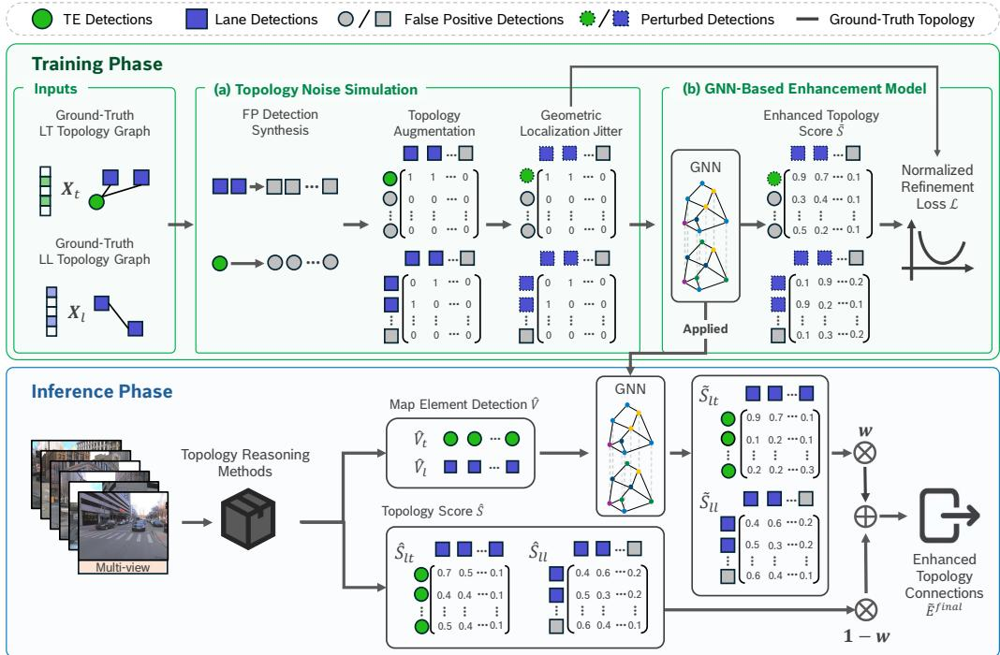  
Figure 1: Overall framework of TopoEnhance. Training phase: (a) Forward process (topology noise simulation): a novel noise simulation strategy that stochastically corrupts ground-truth topology graphs into noisy graphs $\mathcal { G } _ { \mathrm { a u g } }$ by injecting realistic geometric and structural prediction errors. (b) Reverse process (topology denoising): a lightweight heterogeneous GNN learns to recover reliable topology connections from the simulated noisy graphs. Inference phase: once trained, the enhancement model is directly applied to calibrate topology scores from any topology reasoning method, without retraining.

## 3.1 PROBLEM FORMULATION

Representation of Driving Scene Topology. We represent the driving scene topology as a heterogeneous graph $\mathcal { G } = ( \nu , \mathcal { E } )$ . The node set $\nu = \mathcal { \dot { V } } _ { l } \cup \mathcal { V } _ { t }$ consists of two distinct types: lane instances $\mathscr { V } _ { l } = \{ l _ { i } \} _ { i = 1 } ^ { n _ { l } }$ , encoded as 3D polylines, and traffic elements $\mathscr { V } _ { t } = \{ t _ { j } \} _ { j = 1 } ^ { n _ { t } }$ , represented by 2D bounding boxes. The connectivity $\mathcal { E }$ is categorized into two subsets: (1) lane–lane relations $\dot { \mathcal { E } _ { l l } } \subseteq \mathcal { V } _ { l } \times \mathcal { V } _ { l }$ , capturing structures such as successors, merges, and splits; and (2) lane–traffic relations $\mathcal { E } _ { l t } \subseteq \mathcal { V } _ { l } \times \mathcal { V } _ { t }$ , capturing lane-to-sign assignments.

Enhancing Decision-Ready Topology. In existing pipelines, connectivity $\mathcal { E }$ is typically derived by thresholding raw topology scores $\hat { S } = \{ s _ { u v } \in [ 0 , 1 ] \mid u , v \in \hat { \mathcal { V } } \}$ to obtain a discrete graph $\hat { \mathcal { G } } = ( \hat { \mathcal { V } } , \hat { \mathcal { E } } )$ where $\hat { \mathcal { E } } = \{ ( u , v ) \mid s _ { u v } \geq \tau \}$ . However, because these scores can be biased and fail to reflect the true likelihood of edge existence, the predicted topology $\hat { \mathcal G }$ can be viewed as a corrupted observation of the ground-truth ${ \bar { \boldsymbol { g } } } ^ { * }$ , suffering from false-negative or false-positive connections. We therefore formulate topology enhancement as a reverse process: learning a mapping $f _ { \theta }$ that recovers calibrated topology scores $\tilde { S } = f _ { \theta } ( \hat { \mathcal { V } } , \hat { S } )$ from the corrupted $\hat { \mathcal { G } } _ { : }$ such that the resulting discrete topology $\tilde { \mathcal { E } }$ achieves higher structural fidelity to $\mathcal { G } ^ { * }$ by resolving logical inconsistencies through heterogeneous neighborhood context.

## 3.2 FORWARD PROCESS: TOPOLOGY NOISE SIMULATION

The forward process defines the corruption distribution $q ( \mathcal { G } _ { \mathrm { n o i s e } } \mid \mathcal { G } ^ { * } )$ , which stochastically transforms a ground-truth topology $\mathcal { G } ^ { * }$ into a noisy topology $\mathcal { G } _ { \mathrm { n o i s e } }$ . Unlike image-based diffusion models where Gaussian noise can be added directly to continuous pixel values, designing a forward process for driving topology graphs is non-trivial. A driving topology graph is a heterogeneous discrete structure consisting of 3D polylines, 2D bounding boxes, and categorical connectivity relations. Corruption must be applied separately and meaningfully to each component, such that the resulting corruption distribution $q ( \dot { \mathcal { G } } _ { \mathrm { n o i s e } } \mid \mathbf { \bar { \mathcal { G } } } ^ { * } )$ closely matches the distribution of real-world topology predictions $p ( \hat { \mathcal G } )$ . Without this alignment, the reverse process $p _ { \theta } ( \mathcal { G } ^ { * } \mid \mathcal { G } _ { \mathrm { n o i s e } } )$ will fail to generalize on real-world topology predictions. To address this, we design the forward process through three components that jointly simulate the realistic error distribution of real-world topology predictions.

False-Positive Detection Synthesis. A primary failure in driving topology reasoning is the detection of false positives, i.e., lane instances or traffic elements that are either geometrically disparate from the ground-truth instances or entirely non-existent in the physical scene. We simulate these by expanding the detection set $\mathcal { V } _ { \mathrm { n o i s e } } = \mathcal { V } ^ { * } \cup \mathcal { V } _ { f p } .$ To generate the false-positive detection set $\gamma _ { f p } ,$ we sample from a high-variance distribution, accepting a candidate detection $v _ { f p }$ only if its geometric distance from the source ground-truth instance v exceeds a category-specific distance threshold $\delta _ { t y p e }$

$$
v _ { f p } = v + \epsilon , \quad \mathrm { s . t . } \quad \mathrm { d i s t } ( v , v _ { f p } ) > \delta _ { t y p e } , \quad \epsilon \sim \mathcal { N } ( 0 , \sigma _ { f p } ^ { 2 } { \bf I } ) ,\tag{1}
$$

where $v \in \mathcal { V } ^ { * }$ is a ground-truth instance and type $\in \{ l , t \}$ refers to the lane or traffic element category.

Topology Augmentation. These false-positive detections are then used to synthesize unreliable connectivities that $f _ { \theta }$ must learn to prune. We define the candidate edge set $\mathcal { E } _ { \mathrm { n o i s e } }$ by generating all potential pairs $\{ ( u , v ) \mid u , v \in \mathcal { V } _ { \mathrm { n o i s e } } \}$ . To supervise the reverse process, we assign ground-truth edge labels $y _ { u v }$ as:

$$
y _ { u v } = \mathbb { I } [ ( u , v ) \in \mathcal { E } ^ { * } ] .\tag{2}
$$

This labeling scheme naturally ensures that any connection involving at least one false-positive detection from $\gamma _ { f p }$ is assigned a negative label $( y _ { u v } = 0 )$ , as these nodes by definition do not exist in $\nu ^ { * }$ . By populating $\gamma _ { f p }$ such that the augmented node set matches the expected cardinality of detections during inference $( | \mathcal { V } _ { \mathrm { n o i s e } } | = \mathbb { E } [ | \hat { \mathcal { V } } | ] )$ , the candidate edge space $\mathcal { E } _ { \mathrm { n o i s e } }$ matches the size of the raw topology scores $\hat { S }$ to be calibrated.

Geometric Localization Jitter. In practice, the map element predictions $\hat { \mathcal { V } }$ can never perfectly reconstruct ground-truth geometries; even true-positive detections contain localization jitter in their 3D polylines or 2D bounding boxes. If $f _ { \theta }$ were trained only on perfect true-positive detections, it would fail to generalize to the noisy coordinates encountered during inference. To bridge this gap, we apply a constrained perturbation to all ground-truth detections $v \in \mathcal { V } ^ { * }$ , transforming the raw geometry into a jittered representation $v ^ { \prime } { : }$

$$
v ^ { \prime } = v + \epsilon , \quad \mathrm { s . t . } \quad \mathrm { d i s t } ( v , v ^ { \prime } ) \leq \delta _ { t y p e } , \quad \epsilon \sim \mathcal { N } ( 0 , \sigma _ { t p } ^ { 2 } { \bf I } )\tag{3}
$$

By suppressing the perturbation within $\delta _ { t y p e }$ , these detections remain semantically valid yet distinguishable from the false positives in $\gamma _ { f p } ,$ forcing $f _ { \theta }$ to resolve connectivity from topological context rather than exact coordinate matching.

Adaptive Noise Curriculum. To expose the forward process $q ( \mathcal { G } _ { \mathrm { n o i s e } } \mid \mathcal { G } ^ { * } )$ to a broad spectrum of corruption severities, we design the noise variances $\bar { \sigma } _ { t p } ^ { 2 }$ and $\sigma _ { f p } ^ { 2 }$ as dynamic functions of training progress. Inspired by curriculum learning (Wang et al., 2021), we design a curriculum-like schedule which enables a gradual transition from coarse error correction to fine-grained discrimination. Specifically, $\sigma _ { t p }$ is initialized near zero and progressively increased toward the distance threshold $\delta _ { t y p e }$ , while $\sigma _ { f p }$ starts at a relatively large value and is gradually reduced toward $\delta _ { t y p e }$ . As both noise profiles converge to $\delta _ { t y p e }$ , the geometric distinction between true and false detections becomes increasingly subtle. This design can theoretically improve training efficiency and generalization of our framework (Arora et al., 2026).

The complete forward process is summarized in Algorithm 1. By design, the simulated corruption $q ( \mathcal { G } _ { \mathrm { n o i s e } } \mid \mathcal { G } ^ { * } )$ closely approximates the error distribution of real-world predictions $\hat { \mathcal { G } } _ { \cdot }$ This alignment ensures that error-correction patterns learned on $\mathcal { G } _ { \mathrm { n o i s e } }$ naturally transfer to $\hat { \mathcal G }$ during inference, without requiring retraining on any specific prediction source.

## 3.3 REVERSE PROCESS: TOPOLOGY ENHANCEMENT MODEL

The reverse process learns the conditional distribution $p _ { \theta } ( \mathcal { G } ^ { * } \ | \ \mathcal { G } _ { \mathrm { n o i s e } } )$ , which recovers reliable topology from the corrupted topology $\mathcal { G } _ { \mathrm { n o i s e } }$ . It is achieved with a heterogeneous GNN-based enhancement model $f _ { \theta }$ that performs type-aware message passing over lane and traffic-element nodes, enabling distinct processing of lane–lane and lane–traffic relations. Through attentionbased aggregation, $f _ { \theta }$ leverages structural context to suppress inconsistent edges while reinforcing connectivity patterns aligned with lane flow and traffic regulations.

Heterogeneous GNN Architecture. Given the noisy graph $\mathcal { G } _ { \mathrm { n o i s e } } = ( \mathcal { V } _ { \mathrm { n o i s e } } , \mathcal { E } _ { \mathrm { n o i s e } } )$ , we employ a heterogeneous GNN to learn relational representations. Node features $( X _ { l } , X _ { t } )$ are initialized by encoding lane instances using their 3D polyline coordinates, while traffic elements are represented by visual features extracted from their 2D bounding boxes. The node embeddings are iteratively updated through heterogeneous message passing. Specifically, for each node $v \in \mathcal { V } _ { \mathrm { n o i s e } } .$ , its embedding $\mathbf { h } _ { v } ^ { ( k ) }$ at layer k is updated by aggregating information from its multi-type neighborhood:

$$
\mathbf { h } _ { v } ^ { ( k ) } = \sigma \left( \sum _ { r \in \mathcal { R } } \mathrm { A G G } _ { ( u , v ) \in \mathcal { E } _ { \mathrm { n o i s e } } } \left( \psi _ { r } \left( \mathbf { h } _ { v } ^ { ( k - 1 ) } , \mathbf { h } _ { u } ^ { ( k - 1 ) } \right) \right) \right) ,\tag{4}
$$

where $\mathcal { R } = \{ l l , l t \}$ denotes lane–lane and lane–traffic relations, and $\psi _ { r }$ is a relation-specific transformation function. We utilize a lightweight two-layer Heterogeneous Graph Attention Network (GAT) as aggregation function, whose attention mechanism learns relation-aware coefficients to emphasize structurally relevant neighbors while suppressing noisy or false-positive detections. After obtaining final node embeddings, we compute the refined score $\tilde { s } _ { u v } \in \tilde { S }$ via sigmoid-activated cosine similarity:

$$
\tilde { s } _ { u v } = \sigma \big ( \mathbf { h } _ { u } ^ { \top } \mathbf { h } _ { v } / ( \| \mathbf { h } _ { u } \| \| \mathbf { h } _ { v } \| ) \big ) , \quad \forall ( u , v ) \in \mathcal { E } _ { \mathrm { n o i s e } }\tag{5}
$$

where $\sigma ( \cdot )$ denotes the sigmoid function, ensuring $\tilde { s } _ { u v } \in ( 0 , 1 )$

Normalized Refinement Loss. We derive the training objective directly from the reverse process $p _ { \theta } ( \mathcal { G } ^ { * } \mid \mathcal { G } _ { \mathrm { n o i s e } } )$ . Assuming conditional independence of candidate edges given $\mathcal { G } _ { \mathrm { n o i s e } }$ , the reverse distribution factorizes as:

$$
p _ { \theta } ( \mathcal { G } ^ { * } \mid \mathcal { G } _ { \mathrm { n o i s e } } ) = \prod _ { ( u , v ) \in \mathcal { E } _ { \mathrm { n o i s e } } } \mathrm { B e r n o u l l i } ( y _ { u v } ; \tilde { s } _ { u v } ) = \prod _ { ( u , v ) \in \mathcal { E } _ { \mathrm { n o i s e } } } \tilde { s } _ { u v } ^ { y u v } ( 1 - \tilde { s } _ { u v } ) ^ { 1 - y _ { u v } } ,\tag{6}
$$

where $y _ { u v }$ is the ground-truth edge label from Equation 2 and $\tilde { s } _ { u v } \in ( 0 , 1 )$ is the sigmoid-activated cosine similarity from Equation 5. Taking the negative log-likelihood of Equation 6 yields the standard binary cross-entropy (BCE) over all candidate edges, as shown in Lemma 1. However, applying BCE jointly over all edges is problematic: the much larger lane–lane candidate space dominates the gradient, starving the lane–traffic relation of useful learning signal. We therefore adopt a relation-aware, volume-normalized BCE. For each relation $r \in \{ l l , l t \}$ , the per-relation loss is:

$$
\mathcal { L } ^ { ( r ) } = - \frac { 1 } { \vert \mathcal { E } _ { r } \vert } \left( \sum _ { ( u , v ) \in \mathcal { E } _ { r } ^ { \mathrm { p o s } } } \log \tilde { s } _ { u v } + \sum _ { ( u , v ) \in \mathcal { E } _ { r } ^ { \mathrm { n e g } } } \log ( 1 - \tilde { s } _ { u v } ) \right) ,\tag{7}
$$

where $| \mathcal { E } _ { r } |$ is the total number of candidate edges for relation $r , \mathcal { E } _ { r } ^ { \mathrm { p o s } } = \{ ( u , v ) \in \mathcal { E } _ { r } \mid y _ { u v } = 1 \}$ , and $\mathcal { E } _ { r } ^ { \mathrm { n e g } } \stackrel { \cdot } { = } \{ \dot { ( } u , v ) \in \mathcal { E } _ { r } | y _ { u v } = 0 \}$ . The overall objective balances the two relation types as:

$$
\begin{array} { r } { \mathcal { L } = \mathcal { L } ^ { ( l l ) } + \mathcal { L } ^ { ( l t ) } . } \end{array}\tag{8}
$$

As formalized in Lemma 1 and Proposition 1 (Appendix $\mathbf { A } ) , { \mathcal { L } }$ can be interpreted as a relationbalanced formulation of the reconstruction term in a single-step $T { = } 1$ diffusion evidence lower bound (ELBO) (Sohl-Dickstein et al., 2015; Ho et al., 2020).

Training and Inference. During training, $f _ { \theta }$ is optimized on simulated noisy graphs $\mathcal { G } _ { \mathrm { n o i s e } }$ from the forward process. The parameters θ are optimized against ground-truth labels Y:

$$
\theta ^ { * } = \arg \operatorname* { m i n } _ { \theta } \sum _ { ( u , v ) \in \mathcal { E } _ { \mathrm { n o i s e } } } \mathcal { L } ( \tilde { s } _ { u v } , y _ { u v } ) , \quad \mathrm { w h e r e ~ } y _ { u v } \in \mathcal { V } .\tag{9}
$$

During inference, given detection predictions $\hat { \mathcal { V } }$ and raw topology scores $\hat { \cal S } = \{ s _ { u v } \ | \ u , v \in \hat { \mathcal { V } } \}$ , we construct the inference graph $\hat { \mathcal G } = ( \hat { \mathcal V } , \hat { \mathcal E } ^ { \mathrm { c a n d } } )$ , where $\hat { \mathcal { E } } ^ { \mathrm { c a n d } } = \hat { \mathcal { V } } \times \hat { \mathcal { V } } .$ . Passing $\hat { \mathcal G }$ through $f _ { \theta }$

yields refined scores $\tilde { S } = f _ { \theta } ( \hat { \mathcal { G } } )$ , which are combined with the initial uncalibrated scores via a relation-specific fusion weight $w _ { r }$

$$
s _ { u v } ^ { \mathrm { f i n a l } } = w _ { r } \tilde { s } _ { u v } + \left( 1 - w _ { r } \right) \hat { s } _ { u v } , \quad \forall ( u , v ) \in \hat { \mathcal { E } } ^ { \mathrm { c a n d } } .\tag{10}
$$

Finally, the decision-ready discrete topology is obtained by thresholding:

$$
\tilde { \mathcal { E } } ^ { \mathrm { f i n a l } } = \{ ( u , v ) \in \hat { \mathcal { E } } ^ { \mathrm { c a n d } } \mid s _ { u v } ^ { \mathrm { f i n a l } } \geq \tau \} .\tag{11}
$$

## 4 EXPERIMENTS

Dataset. Our experimental studies are performed on OpenLane-V2 (Wang et al., 2023), a comprehensive benchmark tailored for driving scene topology understanding and developed on top of the Argoverse2 (Wilson et al., 2021) and nuScenes (Caesar et al., 2020) datasets. The benchmark supplies rich annotations spanning lane centerline reconstruction, traffic element recognition, and topological relationship modeling. It is organized into two subsets, Argoverse2 (subset\_A) and nuScenes (subset\_B), each containing 1,000 annotated driving sequences captured at 2 Hz with synchronized multi-view camera inputs. Both splits provide supervision for lane geometry, traffic elements, and the connectivity relations between lanes as well as between lanes and traffic elements. For all experiments, we train one model per dataset and apply it to enhance predictionsfrom different methods at inference time, without any method-specific retraining. For more implementation details, please refer to Appendix C.

## 4.1 EVALUATION METRICS

For all topology metrics, we first establish a correspondence between predicted detections $\hat { V }$ and ground-truth detections $V ^ { * }$ . Following OpenLane-V2 (Wang et al., 2023), detections are matched using the discrete Fréchet distance for lanes and IoU for traffic elements. We define the set of true-positive detections, $\hat { V } _ { \mathrm { T P } } ~ \subseteq ~ \hat { V }$ , as those predictions that successfully match a ground-truth counterpart.

Continuous Topology Metrics (OpenLane-V2 TOP). To evaluate the impact of our enhancement on the continuous topology scores S, we adopt the TOP metric from the OpenLane-V2 benchmark (Wang et al., 2023) (version 2.1.0). TOP is an mAP-based metric that measures how well potential connections are ranked according to their topology scores ${ \mathcal { S } } .$ , ensuring that true connections are ordered above false ones. TOP score computes average mAP between $( V ^ { * } , E ^ { * } )$ and $( \hat { V } , \hat { E } )$ over all vertices:

$$
\mathrm { T O P } = \frac { 1 } { | V ^ { * } | } \sum _ { v \in V ^ { * } } \frac { \sum _ { \hat { n } \in \hat { N } ( v ) } P ( \hat { n } ) \mathbf { 1 } ( \hat { n } \in N ( v ) ) } { | N ( v ) | } ,\tag{12}
$$

where $P ( \hat { n } )$ is the precision of neighbor nˆ in the ordered list ranked by $s _ { u v }$ . By evaluating the full ranking of candidate neighbors, TOP directly captures improvements in score calibration: promoting true positive connections on top of false positives. We report TOP both before and after enhancement to quantify improvements in ranking quality. Also, $\mathrm { T O P } _ { l l }$ and $\mathrm { T O P } _ { l t }$ are computed for lane–lane and lane–traffic relations, respectively.

Discrete Topology Metrics (TJS). While TOP score evaluates the relative ranking of continuous confidence scores, downstream autonomous driving modules operate on a discrete topology graph obtained by thresholding. A model can achieve a high TOP score by ranking edges correctly in a relative sense, yet still produce a final graph with significant missing or spurious connections if the scores are not well-calibrated. To directly assess the quality of this final “decision-ready” output, we introduce the Topology Jaccard Score (TJS), which adapts the Jaccard Similarity (Jaccard, 1912) to evaluate topological connectivity. TJS measures the overlap between the predicted and ground-truth edge sets, providing a direct assessment of discrete graph quality. Let $\mathcal { E } ^ { * }$ be the set of ground-truth edges and $\hat { \mathcal E } ^ { c a n d }$ be the set of all candidate edges. TJS is defined as:

$$
\mathrm { T J S } = | { \mathcal E } ^ { * } \cap \hat { { \mathcal E } } | / | { \mathcal E } ^ { * } \cup \hat { { \mathcal E } } | , \mathrm { w h e r e ~ } \hat { { \mathcal E } } = \{ ( u , v ) \in \hat { { \mathcal E } } ^ { c a n d } : s _ { u v } > \tau \} .\tag{13}
$$

By explicitly penalizing both false positives and false negatives in the final discrete topology graph, TJS serves as a discrete complement to the continuous $T O P$ score, and together they provide a more comprehensive evaluation oftopology connection quality

Theoretical Upper-Bound (Upper-Bound). To isolate the performance of topology reasoning from the quality of the upstream detector, we define a theoretical upper bound for both TOP and TJS. This bound represents the maximum achievable performance given the existing set of detection predictions Vˆ. Specifically, we assume an oracle that assigns the final confidence scores $\boldsymbol { s } _ { u v } ^ { * }$

$$
s _ { u v } ^ { * } = \left\{ \begin{array} { l l } { 1 . 0 } & { \mathrm { i f } \left( u , v \right) \in \mathcal { E } ^ { * } \mathrm { a n d } u , v \in \hat { \mathcal { V } } _ { \mathrm { T P } } } \\ { 0 . 0 } & { \mathrm { o t h e r w i s e } } \end{array} \right. .\tag{14}
$$

By evaluating the metrics using $s _ { u v } ^ { * }$ , we establish a performance ceiling where all possible true connectivities are perfectly recovered and ranked, while errors stemming from missing detections or false-positive detections remain. Comparing our results against this bound quantifies the remaining "headroom" for topological refinement and distinguishes between errors caused by connectivity reasoning versus those inherent to the detection backbone.

## 4.2 ENHANCED RESULTS

In this section, we present enhanced results obtained by applying TopoEnhance on existing topology reasoning methods with publicly available checkpoints to refine their topology connections. To the best of our knowledge, the methods with officially released checkpoints include TopoNet (Li et al., 2026), TopoMLP (Wu et al., 2024), Topo2D (Li et al., 2024), TopoLogic (Fu et al., 2024), and SMART (Ye et al., 2025). Among these methods, SMART achieves state-of-the-art performance in topology reasoning by leveraging additional data modalities, such as SD maps and satellite imagery. In contrast, the other methods rely solely on perspective camera images as input. Beyond methods with publicly released checkpoints, we also attempted to train several additional approaches from scratch. However, we were unable to reliably reproduce their reported results, likely due to differences in training environments or hardware configurations. To ensure fairness and reliability in our comparisons, we therefore restrict our evaluation to methods with official checkpoints. Additionally, please refer to Appendix D for additional evaluation results and Appendix E for evaluation on our practical usability toward real-world applications.

Quantitative Comparison on Continuous Topology Scores. Table 1 summarizes the performance enhancement on continuous topology scores (OpenLane-V2 TOP) across multiple existing topology reasoning methods. Our enhancer demonstrates consistent and significant improvements in the TOP metric for all evaluated baselines, regardless of their underlying architecture or input modalities. Notably, our model nearly triples the performance of TopoNet $( 6 . 7  1 9 . 5 \mathrm { T O P } _ { l l } )$ on nuScenes and provides a significant boost to TopoMLP $( 2 1 . 6  2 \bar { 4 } . 4 \mathrm { T O P } _ { l l } )$ on Argoverse2. Even for the state-of-the-art methods SMART, which utilizes auxiliary data such as satellite imagery and SD maps, our model can still further boosts performance $( 3 7 . 0  \dot { 4 } 0 . 1 \mathrm { T O P } _ { l l } )$ and $( 3 3 . 0  \bar { 3 5 . 4 } \mathrm { T O P } _ { l t } )$ during inference, without any retraining and adaptation to the additional input modalities. This indicates that by modeling the structural dependencies between predicted entities, our model successfully pushes true positive edges above spurious ones in the topology score ranking. A key observation from Table 1 is that our refined topology scores closely approach the Theoretical Upper-Bound. Since the Upper-Bound represents the maximum achievable performance given the fixed detection predictions Vˆ, the narrow gap remaining indicates that our enhancer has nearly exhausted the potential for topological refinement within the limits of the provided detections. Specifically, on Argoverse2, our enhancer reduces the margin to the maximum reachable performance in $\mathrm { T O } \dot { \mathrm { P } } _ { l l }$ to just 0.6 for TopoMLP and 0.7 for Topo2D. For the SMART baseline, the enhanced $\mathrm { T O P } _ { l l }$ of 40.1 sits within a 0.8 margin of the theoretical ceiling. These results validate that our approach effectively serves as a universal enhancement layer, capable of leveraging heterogeneous neighborhood context to rectify local connectivity errors inherent in existing prediction heads. Notably, while our main motivation is to improve discrete connectivities via topology calibration, our calibration also boost commonly agreed TOP score by correcting the relative ordering between true positives and false positives.

Quantitative Comparison on Discrete Topology Connections. While the TOP metric measures ranking quality of continuous topology scores, Topology Jaccard Score (TJS) serves as a discrete complement to evaluate the accuracy of the final discrete graph used for downstream tasks. As shown in Table 2, our enhancer consistently and reliably delivers substantial gains in final decision-ready topology graphs. For TopoMLP on Argoverse2, the $\mathrm { T J } \mathrm { S } _ { l l }$ nearly triples from a 18.5 to 59.7 and the $\mathrm { T } \bar { \mathbf { J } } \mathsf { S } _ { l t }$ doubles from a 31.5 to 59.8. For TopoNet on nuScnenes, the $\mathrm { T J } \boldsymbol { \mathrm { S } } _ { l l }$ rises from 9.0 to 42.3 and the $\mathrm { T J } \boldsymbol { \mathrm { S } } _ { l t }$ improves from a 35.6 to 56.8. These significant boost indicates that while baseline methods may have a reasonable relative rankings on topology scores, their numerical values of topology scores are often poorly calibrated—exhibiting overconfidence for false positives or underconfidence for true connections. This lack of calibration leads to numerous missing or false-positive connections when scores are thresholded to produce the final graph. Even for the state-of-the-art SMART model, which already achieves the strongest baseline performance, our enhancer boosts the performance even further, enhancing $\mathrm { T J } \boldsymbol { \mathrm { S } } _ { l l }$ from 38.1 to 87.7 and $\mathrm { T J } \boldsymbol { \mathrm { S } } _ { l t }$ from 36.6 to 82.8. These results suggest that TopoEnhance, trained on a curriculum of diverse simulated noise, produces more reliable decisionready topology graphs. By reducing both false positives and false negatives, it yields cleaner topology structures for downstream tasks such as path planning.

Table 1: Enhanced results on OpenLane-V2 measured by the TOP metric (version 2.1.0), which evaluates the quality of continuous topology scores. Bolded blue values indicate improved score over the corresponding baselines before applying TopoEnhance.
<table><tr><td rowspan="2">Dataset</td><td rowspan="2">Method</td><td colspan="2">Before TopoEnhance</td><td colspan="2">After TopoEnhance</td><td colspan="2">Upper-Bound</td></tr><tr><td> $\mathrm { T O P } _ { l l } \uparrow$ </td><td> $\mathrm { T O P } _ { l t } \ \uparrow$ </td><td> $\mathrm { T O P } _ { l l } \uparrow$ </td><td> $\mathrm { T O P } _ { l t } \ \mathrm { \Delta } \ 1$  人</td><td> $\mathrm { T O P } _ { l l } \uparrow$ </td><td> $\mathrm { T O P } _ { l t } \ \uparrow$ </td></tr><tr><td rowspan="5">Argoverse2 (Subset_A)</td><td>TopoNet (Li et al., 2026)</td><td>10.9</td><td>23.8</td><td>21.8</td><td>25.8</td><td>24.4</td><td>28.8</td></tr><tr><td>TopoMLP (Wu et al., 2024)</td><td>21.6</td><td>26.9</td><td>24.4</td><td>28.7</td><td>25.0</td><td>31.4</td></tr><tr><td>Topo2D (Li et al., 2024)</td><td>22.3</td><td>26.2</td><td>24.3</td><td>27.3</td><td>25.0</td><td>29.8</td></tr><tr><td>TopoLogic (Fu et al., 2024)</td><td>23.9</td><td>25.4</td><td>24.5</td><td>27.2</td><td>26.0</td><td>30.6</td></tr><tr><td>SMART (Ye et al., 2025)</td><td>37.0</td><td>33.0</td><td>40.1</td><td>35.4</td><td>40.9</td><td>38.9</td></tr><tr><td>nuScenes</td><td>TopoNet (Li et al., 2026)</td><td>6.7</td><td>16.7</td><td>19.5</td><td>17.8</td><td>21.2</td><td>20.3</td></tr><tr><td>(Subset_B)</td><td>TopoMLP (Wu et al., 2024)</td><td>21.0</td><td>19.8</td><td>22.8</td><td>21.5</td><td>23.5</td><td>24.1</td></tr></table>

Table 2: Enhanced results on OpenLane-V2 evaluated using the TJS metric, which measures the quality of discrete topology connections.
<table><tr><td rowspan="2">Dataset</td><td rowspan="2">Method</td><td colspan="2">Before TopoEnhance</td><td colspan="2">After TopoEnhance</td><td colspan="2">Upper-bound</td></tr><tr><td> $\mathrm { T J } S _ { l l } \uparrow$ </td><td> $\mathrm { T J S } _ { l t } \ \mathrm { \uparrow }$ </td><td> $\mathrm { T J } \boldsymbol { \mathrm { S } } _ { l l } \uparrow$ </td><td> $\mathrm { T J } S _ { l t } \ \mathrm { \uparrow }$ </td><td> $\mathrm { T J } s _ { l l } \uparrow$ </td><td> $\mathrm { T J } S _ { l t } \ \mathrm { \uparrow }$ </td></tr><tr><td rowspan="5">Argoverse2 (Subset_A)</td><td>TopoNet (Li et al., 2026)</td><td>16.3</td><td>31.0</td><td>32.9</td><td>55.8</td><td>44.3</td><td>63.7</td></tr><tr><td>TopoMLP (Wu et al., 2024)</td><td>18.5</td><td>31.5</td><td>59.7</td><td>59.8</td><td>69.7</td><td>72.8</td></tr><tr><td>Topo2D (Li et al., 2024)</td><td>18.9</td><td>34.5</td><td>55.0</td><td>51.5</td><td>68.7</td><td>70.8</td></tr><tr><td>TopoLogic (Fu et al., 2024)</td><td>21.0</td><td>32.5</td><td>43.9</td><td>53.3</td><td>50.9</td><td>71.4</td></tr><tr><td>SMART (Ye et al., 2025)</td><td>38.1</td><td>36.6</td><td>87.7</td><td>82.8</td><td>92.9</td><td>90.1</td></tr><tr><td>nuScenes</td><td>TopoNet (Li et al., 2026)</td><td>9.0</td><td>35.6</td><td>42.3</td><td>56.8</td><td>48.5</td><td>66.7</td></tr><tr><td>(Subset_B)</td><td>TopoMLP (Wu et al., 2024)</td><td>15.9</td><td>29.3</td><td>51.3</td><td>62.6</td><td>68.9</td><td>82.2</td></tr></table>

Qualitative Comparison. Figure 2 shows that TopoEnhance effectively corrects missing and fragmented connections in TopoNet and TopoMLP, such as unlinked traffic lights in TopoNet or inconsistent lane merges in TopoMLP. More qualitative results are provided in Appendix G.

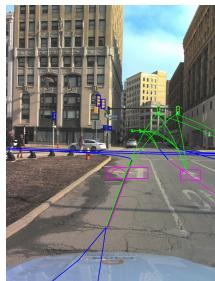  
(a) Ground-truth Topology

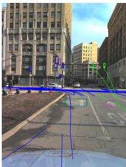  
(b) TopoNet Prediction

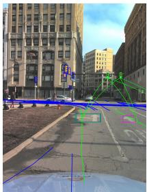  
(c) TopoNet + TopoEnhance

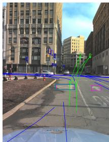  
(d) TopoMLP Prediction

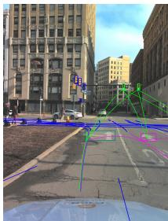  
(e) TopoMLP + TopoEnhance  
Figure 2: Qualitative comparison of topology connections before and after enhancement.

## 5 CONCLUSION

Reliable topology connectivity is fundamental to autonomous driving, as downstream modules such as trajectory prediction and path planning rely on high-fidelity discrete topologies. In this work, we identify an often-overlooked gap in existing topology reasoning systems: while prior methods focus on predicting continuous topology scores, the reliability of the final decision-ready topology graph after thresholding is rarely considered or explicitly evaluated. To bridge this gap, we propose TopoEnhance, a source-agnostic topology enhancement framework that refines topology connections using heterogeneous structural context. By reconstructing stochastically corrupted graphs, TopoEnhance learns to resolve logical inconsistencies and recover structural consistency. Experiments on OpenLane-V2 show that TopoEnhance consistently improves both topology score ranking (TOP) and discrete topology accuracy (TJS) across diverse sources without retraining. These results highlight structural refinement as a key step toward closing the performance gap in decisionready topology. More broadly, this work emphasizes the necessity of moving beyond continuous topology score prediction to prioritize the structural reliability of the discrete connections used by autonomous systems. We hope our findings encourage future research to focus on producing robust, structurally consistent driving topology connections for safe and reliable autonomous driving.

## REFERENCES

Raman Arora, Yunjuan Wang, and Kaibo Zhang. When does curriculum learning help? a theoretical perspective. In Proceedings ofAdvances in Neural Information Processing Systems, volume 38, pp. 7595–7630, 2026.

Shaked Brody, Uri Alon, and Eran Yahav. How attentive are graph attention networks? In Proceedings ofInternational Conference on Learning Representations, 2022.

Holger Caesar, Varun Bankiti, Alex H Lang, Sourabh Vora, Venice Erin Liong, Qiang Xu, Anush Krishnan, Yu Pan, Giancarlo Baldan, and Oscar Beijbom. Nuscenes: A multimodal dataset for autonomous driving. In Proceedings ofIEEE/CVF Conference on Computer Vision and Pattern Recognition, pp. 11618–11628, 2020.

Yigit Baran Can, Alexander Liniger, Danda Pani Paudel, and Luc Van Gool. Structured bird’s-eyeview traffic scene understanding from onboard images. In Proceedings ofIEEE/CVF International Conference on Computer Vision, pp. 15641–15650, 2021.

Yigit Baran Can, Alexander Liniger, Danda Pani Paudel, and Luc Van Gool. Topology preserving local road network estimation from single onboard camera image. In Proceedings of IEEE/CVF Conference on Computer Vision and Pattern Recognition, pp. 17242–17251, 2022.

Yuning Chai, Benjamin Sapp, Mayank Bansal, and Dragomir Anguelov. Multipath: Multiple probabilistic anchor trajectory hypotheses for behavior prediction. In Proceedings of Conference on Robot Learning, pp. 86–99, 2020.

Matthias Fey and Jan E. Lenssen. Fast graph representation learning with PyTorch Geometric. In Proceedings ofInternational Conference on Learning Representations Workshop on Representation Learning on Graphs and Manifolds, 2019.

Yanping Fu, Wenbin Liao, Xinyuan Liu, Hang Xu, Yike Ma, Yucheng Zhang, and Feng Dai. Topologic: An interpretable pipeline for lane topology reasoning on driving scenes. In Proceedings ofAdvances in Neural Information Processing Systems, volume 37, pp. 61658–61676, 2024.

Yanping Fu, Xinyuan Liu, Tianyu Li, Yike Ma, Yucheng Zhang, and Feng Dai. Topopoint: Enhance topology reasoning via endpoint detection in autonomous driving. In Proceedings ofAdvances in Neural Information Processing Systems, volume 38, pp. 118229–118250, 2026.

Xunjiang Gu, Guanyu Song, Igor Gilitschenski, Marco Pavone, and Boris Ivanovic. Producing and leveraging online map uncertainty in trajectory prediction. In Proceedings of IEEE/CVF Conference on Computer Vision and Pattern Recognition, pp. 14521–14530, 2024.

Jonathan Ho, Ajay Jain, and Pieter Abbeel. Denoising diffusion probabilistic models. In Proceedings ofAdvances in Neural Information Processing Systems, volume 33, pp. 6840–6851, 2020.

Wenke Huang, Jian Liang, Guancheng Wan, Didi Zhu, He Li, Jiawei Shao, Mang Ye, Bo Du, and Dacheng Tao. Be confident: Uncovering overfitting in MLLM multi-task tuning. In Proceedings ofInternational Conference on Machine Learning, 2025.

Paul Jaccard. The distribution of the flora in the alpine zone. 1. New phytologist, 11(2):37–50, 1912.

Han Li, Zehao Huang, Zitian Wang, Wenge Rong, Naiyan Wang, and Si Liu. Enhancing 3d lane detection and topology reasoning with 2d lane priors. arXiv preprint arXiv:2406.03105, 2024.

Tianyu Li, Li Chen, Huijie Wang, Yang Li, Jiazhi Yang, Xiangwei Geng, Hang Xu, Chunjing Xu, Junchi Yan, Ping Luo, and Hongyang Li. Graph-based topology reasoning for driving scenes. Science China Information Sciences, 69(5):152103, 2026.

Adam Lilja, Junsheng Fu, Erik Stenborg, and Lars Hammarstrand. Localization is all you evaluate: Data leakage in online mapping datasets and how to fix it. In Proceedings ofIEEE/CVF Conference on Computer Vision and Pattern Recognition, pp. 22150–22159, 2024.

Ilya Loshchilov and Frank Hutter. SGDR: Stochastic gradient descent with warm restarts. In Proceedings of International Conference on Learning Representations, 2017a.

Ilya Loshchilov and Frank Hutter. Decoupled weight decay regularization. arXiv preprint arXiv:1711.05101, 2017b.

Katie Z Luo, Xinshuo Weng, Yan Wang, Shuang Wu, Jie Li, Kilian Q Weinberger, Yue Wang, and Marco Pavone. Augmenting lane perception and topology understanding with standard definition navigation maps. In Proceedings ofIEEE International Conference on Robotics and Automation, pp. 4029–4035, 2024.

Changsheng Lv, Mengshi Qi, Liang Liu, and Huadong Ma. T2SG: Traffic topology scene graph for topology reasoning in autonomous driving. In Proceedings ofIEEE/CVF Conference on Computer Vision and Pattern Recognition, pp. 17197–17206, 2025.

Maxime Oquab, Timothée Darcet, Théo Moutakanni, Huy Vo, Marc Szafraniec, Vasil Khalidov, Pierre Fernandez, Daniel Haziza, Francisco Massa, Alaaeldin El-Nouby, et al. Dinov2: Learning robust visual features without supervision. Transactions on Machine Learning Research, 2024.

Guy Rotman and Roi Reichart. Multi-task active learning for pre-trained transformer-based models. Transactions ofthe Associationfor Computational Linguistics, 10:1209–1228, 2022.

Jascha Sohl-Dickstein, Eric Weiss, Niru Maheswaranathan, and Surya Ganguli. Deep unsupervised learning using nonequilibrium thermodynamics. In Proceedings ofInternational Conference on Machine Learning, pp. 2256–2265, 2015.

Petar Velickoviˇ c, Guillem Cucurull, Arantxa Casanova, Adriana Romero, Pietro Lio, and Yoshua´ Bengio. Graph attention networks. In Proceedings of International Conference on Learning Representations, 2018.

Huijie Wang, Tianyu Li, Yang Li, Li Chen, Chonghao Sima, Zhenbo Liu, Bangjun Wang, Peijin Jia, Yuting Wang, Shengyin Jiang, Feng Wen, Hang Xu, Ping Luo, Junchi Yan, Wei Zhang, and Hongyang Li. OpenLane-v2: A topology reasoning benchmark for unified 3D HD mapping. In Proceedings ofAdvances in Neural Information Processing Systems, volume 36, pp. 18873–18884, 2023.

Xin Wang, Yudong Chen, and Wenwu Zhu. A survey on curriculum learning. IEEE Transactions on Pattern Analysis and Machine Intelligence, 44(9):4555–4576, 2021.

Benjamin Wilson, William Qi, Tanmay Agarwal, John Lambert, Jagjeet Singh, Siddhesh Khandelwal, Bowen Pan, Ratnesh Kumar, Andrew Hartnett, Jhony Kaesemodel Pontes, et al. Argoverse 2: Next generation datasets for self-driving perception and forecasting. In Proceedings of Annual Conference on Neural Information Processing Systems Track on Datasets and Benchmarks, 2021.

Dongming Wu, Jiahao Chang, Fan Jia, Yingfei Liu, Tiancai Wang, and Jianbing Shen. TopoMLP: A simple yet strong pipeline for driving topology reasoning. In Proceedings of International Conference on Learning Representations, pp. 45604–45615, 2024.

Zonghan Wu, Shirui Pan, Fengwen Chen, Guodong Long, Chengqi Zhang, and Philip S Yu. A comprehensive survey on graph neural networks. IEEE Transactions on Neural Networks and Learning Systems, 32(1):4–24, 2020.

Sen Yang, Minyue Jiang, Ziwei Fan, Xiaolu Xie, Xiao Tan, Yingying Li, Errui Ding, Liang Wang, and Jingdong Wang. TopoSD: Topology-enhanced lane segment perception with SDMap prior. arXiv preprint arXiv:2411.14751, 2024.

Junjie Ye, David Paz, Hengyuan Zhang, Yuliang Guo, Xinyu Huang, Henrik I Christensen, Yue Wang, and Liu Ren. SMART: Advancing scalable map priors for driving topology reasoning. In Proceedings ofIEEE International Conference on Robotics and Automation, pp. 3298–3304, 2025.

Chuxu Zhang, Dongjin Song, Chao Huang, Ananthram Swami, and Nitesh V Chawla. Heterogeneous graph neural network. In Proceedings ofACM SIGKDD International Conference on Knowledge Discovery & Data Mining, pp. 793–803, 2019.

## Appendix

## Table of Contents

A Theoretical Diffusion-Based Interpretation of TopoEnhance 13   
B Algorithmic Summary of Forward Process: Topology Noise Simulation 15   
C Implementation Details 15   
D Additional Evaluation Results 16   
D.1 TopoEnhance on Geographically Non-Overlapping Splits . . 16   
D.2 Enhancing TopoPoint Predictions 16   
D.3 Complete OpenLane-V2 Metrics 17   
D.4 Ablation Studies 18   
E Practical Usability Toward Real-World Applications 19   
E.1 Robustness to Varying Levels of Topology Noise 19   
E.2 Temporal Consistency of Refined Topology Predictions . 20   
E.3 Safety-Relevant Topology Error Analysis . . 21   
E.4 Scene-Level Ego-Route Recoverability for Navigation and Planning . . . 23   
E.5 Efficiency Analysis For Real-Time Inference 23   
F Limitation and Future Works 24   
G Additional Qualitative Results 25

## A THEORETICAL DIFFUSION-BASED INTERPRETATION OF TOPOENHANCE

In this section, we provide a theoretical diffusion-based interpretation of TopoEnhance (Sections 3.2 and 3.3). We first show that the normalized relation-aware BCE loss (Equation 7–Equation 8) is a normalized Bernoulli negative log-likelihood (Lemma 1). We then show that this denoising likelihood corresponds to the learnable reconstruction term of a $T { = } 1$ diffusion ELBO (Proposition 1). Together, these results justify interpreting TopoEnhance as a single-step diffusion-based denoising model on topology graphs.

Setup. Let $\mathcal { G } ^ { \ast } = ( \mathcal { V } ^ { \ast } , \mathcal { E } ^ { \ast } )$ denote a clean ground-truth topology graph drawn from $p _ { \mathrm { d a t a } } ( \mathcal { G } )$ The forward process (Section 3.2) defines a single-step corruption distribution $q ( \mathcal { G } _ { \mathrm { n o i s e } } \mid \overline { { \mathcal { G } } } ^ { * } )$ that stochastically transforms $\mathcal { G } ^ { * }$ into a noisy graph $\mathcal { G } _ { \mathrm { n o i s e } } = ( \mathcal { V } _ { \mathrm { n o i s e } } , \mathcal { E } _ { \mathrm { n o i s e } } )$ by applying constrained Gaussian jitter to true-positive detections and synthesizing false-positive detections. The reverse process $f _ { \theta }$ learns the conditional denoising distribution $p _ { \theta } ( \mathcal { G } ^ { * } \mid \mathcal { G } _ { \mathrm { n o i s e } } )$ , supervised via the normalized BCE objective (Equation 7–Equation 8). We further assume that (i) the per-edge model output $\tilde { s } _ { u v } \in$ (0, 1) defines a valid Bernoulli probability, and (ii) candidate edges are conditionally independent given $\mathcal { G } _ { \mathrm { n o i s e } }$

Lemma 1. The training objective L ofTopoEnhance (Equation 7–Equation 8) is a relation-balanced, volume-normalized Bernoulli negative log-likelihood over the candidate edge set $\mathcal { E } _ { \mathrm { n o i s e } } .$

Proof. We define a correspondence map $\pi : \mathcal { V } _ { \mathrm { n o i s e } } \to \mathcal { V } ^ { * } \cup \{ \emptyset \}$ , where $\pi ( v ) \in \mathcal { V } ^ { * } \mathrm { i f } v \in \mathcal { V } _ { \mathrm { t p } }$ is a jittered true-positive detection, and $\pi ( v ) = \emptyset \mathrm { i f } v \in \mathcal { V } _ { \mathrm { f p } }$ is a synthesized false-positive detection. The ground-truth edge label is then

$$
y _ { u v } = \mathbb { I } [ \pi ( u ) \neq \emptyset , \pi ( v ) \neq \emptyset , ( \pi ( u ) , \pi ( v ) ) \in \mathcal { E } ^ { * } ] ,\tag{15}
$$

consistent with Equation 2.

Under the conditional independence assumption stated in the Setup, the reverse distribution factorizes as in Equation 6:

$$
p _ { \theta } ( \mathcal { G } ^ { * } \mid \mathcal { G } _ { \mathrm { n o i s e } } ) = \prod _ { ( u , v ) \in \mathcal { E } _ { \mathrm { n o i s e } } } \mathrm { B e r n o u l l i } ( y _ { u v } ; \tilde { s } _ { u v } ) .\tag{16}
$$

Using the Bernoulli probability mass function,

$$
\mathrm { B e r n o u l l i } ( y _ { u v } ; \tilde { s } _ { u v } ) = \tilde { s } _ { u v } ^ { y _ { u v } } ( 1 - \tilde { s } _ { u v } ) ^ { 1 - y _ { u v } } ,\tag{17}
$$

we obtain

$$
p _ { \theta } ( \mathcal { G } ^ { * } \mid \mathcal { G } _ { \mathrm { n o i s e } } ) = \prod _ { ( u , v ) \in \mathcal { E } _ { \mathrm { n o i s e } } } \tilde { s } _ { u v } ^ { y _ { u v } } ( 1 - \tilde { s } _ { u v } ) ^ { 1 - y _ { u v } } .\tag{18}
$$

Taking the negative logarithm yields the Bernoulli negative log-likelihood, i.e., binary cross-entropy over the candidate edge set:

$$
- \log p _ { \theta } ( \mathcal { G } ^ { * } \mid \mathcal { G } _ { \mathrm { n o i s e } } ) = - \sum _ { ( u , v ) \in { \mathcal E } _ { \mathrm { n o i s e } } } \left[ y _ { u v } \log \tilde { s } _ { u v } + ( 1 - y _ { u v } ) \log ( 1 - \tilde { s } _ { u v } ) \right] .\tag{19}
$$

Partitioning Equation 19 by relation type $r \in \{ l l , l t \}$ and normalizing each partition by its cardinality $| \mathcal { E } _ { r } |$ yields exactly $\boldsymbol { \mathcal { L } ^ { ( r ) } }$ from Equation 7. Therefore, $\mathcal { L }$ is obtained from the Bernoulli negative log-likelihood in Equation 19 by a normalization of its per-relation terms, and can be interpreted as a relation-balanced training objective for the conditional denoising likelihood $p _ { \theta } ( \mathcal { G } ^ { * } \mid \mathcal { G } _ { \mathrm { n o i s e } } )$ □

Proposition 1. Let $\mathcal { G } ^ { \ast } \sim p _ { \mathrm { d a t a } } ( \mathcal { G } )$ be a clean topology graph and let $q ( \mathcal { G } _ { \mathrm { n o i s e } } \mid \mathcal { G } ^ { * } )$ be the single-step corruption process defined above, with a fixed prior $p ( \mathcal { G } _ { \mathrm { n o i s e } } )$ independent of θ. Then minimizing the denoising objective

$$
{ \mathcal { L } } _ { \mathrm { d e n o i s e } } = - \mathbb { E } _ { \mathcal { G } ^ { * } \sim p _ { \mathrm { d a t a } } , \mathcal { G } _ { \mathrm { n o i s e } } \sim q ( \mathcal { G } _ { \mathrm { n o i s e } } | \mathcal { G } ^ { * } ) } \big [ \log p _ { \theta } ( \mathcal { G } ^ { * } \mid \mathcal { G } _ { \mathrm { n o i s e } } ) \big ]\tag{20}
$$

over $\theta$ is equivalent, up to an additive constant independent of $\theta ,$ to minimizing the learnable reconstruction term ofthe T=1 diffusion ELBO.

Proof. We assume $p ( \mathcal { G } _ { \mathrm { n o i s e } } )$ is fixed and independent of $\theta ,$ mirroring the standard diffusion setting in which the terminal prior is pre-specified.

A T-step diffusion model defines a forward Markov chain

$$
q ( \mathcal { G } _ { 1 : T } \mid \mathcal { G } ^ { * } ) = \prod _ { t = 1 } ^ { T } q ( \mathcal { G } _ { t } \mid \mathcal { G } _ { t - 1 } ) ,\tag{21}
$$

gradually corrupting ${ \mathcal { G } } ^ { * } { \equiv } { \mathcal { G } } _ { 0 }$ into $\mathcal { G } _ { 1 } , \ldots , \mathcal { G } _ { T }$ . The learned reverse process is

$$
p _ { \theta } ( \mathcal { G } ^ { \ast } , \mathcal { G } _ { 1 : T } ) = p ( \mathcal { G } _ { T } ) \prod _ { t = 1 } ^ { T } p _ { \theta } ( \mathcal { G } _ { t - 1 } \mid \mathcal { G } _ { t } ) .\tag{22}
$$

Applying Jensen’s inequality to the marginal log-likelihood yields the ELBO:

$$
\mathbb { E } _ { \mathcal { G } ^ { * } \sim p _ { \mathrm { d a t a } } } [ - \log p _ { \theta } ( \mathcal { G } ^ { * } ) ] \leq \mathbb { E } _ { \mathcal { G } ^ { * } \sim p _ { \mathrm { d a t a } } , q ( \mathcal { G } _ { 1 : T } | \mathcal { G } ^ { * } ) } \left[ - \log \frac { p _ { \theta } ( \mathcal { G } ^ { * } , \mathcal { G } _ { 1 : T } ) } { q ( \mathcal { G } _ { 1 : T } \mid \mathcal { G } ^ { * } ) } \right] .\tag{23}
$$

Expanding via the Markov factorizations and applying Bayes’ rule to rewrite each forward transition $q ( \mathcal G _ { t } \mid \mathcal G _ { t - 1 } )$ in terms of the posterior $q ( \mathcal { G } _ { t - 1 } \mid \bar { \mathcal { G } } _ { t } , \bar { \mathcal { G } } ^ { * } )$ gives

$$
\begin{array} { r l } & { \mathrm { E L B O } = \mathbb { E } _ { \mathcal { G } ^ { * } \sim p _ { \mathrm { d a t a } } } \Bigg [ \underbrace { \mathbb { E } _ { q ( \mathcal { G } _ { 1 } \mid \mathcal { G } ^ { * } ) } \big [ - \log p _ { \theta } ( \mathcal { G } ^ { * } \mid \mathcal { G } _ { 1 } ) \big ] } _ { \mathcal { L } _ { \mathrm { r e c o n } } } + D _ { \mathrm { K L } } ( q ( \mathcal { G } _ { T } \mid \mathcal { G } ^ { * } ) \| p ( \mathcal { G } _ { T } ) ) } \\ & { \quad \quad \quad \quad \quad \quad \quad \quad \quad + \displaystyle \sum _ { t = 2 } ^ { T } \mathbb { E } _ { q ( \mathcal { G } _ { t } \mid \mathcal { G } ^ { * } ) } \big [ D _ { \mathrm { K L } } ( q ( \mathcal { G } _ { t - 1 } \mid \mathcal { G } _ { t } , \mathcal { G } ^ { * } ) \| p _ { \theta } ( \mathcal { G } _ { t - 1 } \mid \mathcal { G } _ { t } ) ) \big ] \Bigg ] . } \end{array}\tag{24}
$$

Setting T=1 and identifying $\mathcal { G } _ { 1 } \equiv \mathcal { G } _ { \mathrm { n o i s e } }$ , the intermediate sum vanishes and the ELBO reduces to

$$
\begin{array} { r l } { \mathbb { E } _ { \mathcal { G } ^ { * } \sim p _ { \mathrm { d a t a } } } \big [ - \log p _ { \theta } ( \mathcal { G } ^ { * } ) \big ] \leq \underbrace { \mathbb { E } _ { \mathcal { G } ^ { * } \sim p _ { \mathrm { d a t a } } , \mathcal { G } _ { \mathrm { n o i s e } } \sim q ( \mathcal { G } _ { \mathrm { n o i s e } } | \mathcal { G } ^ { * } ) } _ { \mathcal { L } _ { \mathrm { r e c o n } } } \big [ - \log p _ { \theta } ( \mathcal { G } ^ { * } \mid \mathcal { G } _ { \mathrm { n o i s e } } ) \big ] } _ { \mathcal { L } _ { \mathrm { r e c o n } } } } & { } \\ { + \underbrace { \mathbb { E } _ { \mathcal { G } ^ { * } \sim p _ { \mathrm { d a t a } } } \big [ D _ { \mathrm { K L } } ( q ( \mathcal { G } _ { \mathrm { n o i s e } } \mid \mathcal { G } ^ { * } ) \mid \mid p ( \mathcal { G } _ { \mathrm { n o i s e } } ) ) \big ] } _ { \mathrm { c o n s t a n t w . t . } , \theta } . } \end{array}\tag{25}
$$

Since the KL term in Equation 25 depends only on the fixed forward process and the fixed prior,

$$
\frac { \partial } { \partial \theta } \mathbb { E } _ { \mathcal { G } ^ { \ast } \sim p _ { \mathrm { d a t a } } } [ D _ { \mathrm { K L } } ( q ( \mathcal { G } _ { \mathrm { n o i s e } } \mid \mathcal { G } ^ { \ast } ) \parallel p ( \mathcal { G } _ { \mathrm { n o i s e } } ) ) ] = 0 .\tag{26}
$$

Minimizing the $T { = } 1$ ELBO over θ therefore reduces to minimizing ${ \mathcal { L } } _ { \mathrm { r e c o n } } .$ . By the tower property, the nested expectation $\mathbb { E } _ { \mathcal { G } ^ { \ast } } \left[ \mathbb { E } _ { q ( \mathcal { G } _ { \mathrm { n o i s e } } | \mathcal { G } ^ { \ast } ) } \left[ \cdot \right] \right]$ equals the joint expectation in Equation 20, so $\bar { \mathcal { L } } _ { \mathrm { r e c o n } } =$ $\mathcal { L } _ { \mathrm { d e n o i s e } } .$

Combining Lemma 1 with Proposition 1, the normalized relation-aware BCE objective used by TopoEnhance is a relation-balanced implementation of the learnable reconstruction term in a $T { \stackrel { } { = } } 1$ diffusion ELBO. Thus, TopoEnhance can be interpreted as optimizing a single-step diffusion-based denoising objective on topology graphs.

## B ALGORITHMIC SUMMARY OF FORWARD PROCESS: TOPOLOGY NOISE SIMULATION

The algorithm of the topology noise simulation is presented at Algorithm 1.

Algorithm 1 Forward Process: Topology Noise Simulation   
Require: Ground-truth $\mathcal { G } ^ { \ast } = ( \nu ^ { \ast } , \mathcal { E } ^ { \ast } )$ , thresholds $\delta _ { t y p e }$ , training step t   
Ensure: Noisy graph $\mathcal { G } _ { \mathrm { n o i s e } } ,$ , labels Y   
1: Update $\sigma _ { t p } ( t ) , \sigma _ { f p } ( t )$ via adaptive noise curriculum   
2: $\mathcal { V } _ { t p } \gets \{ v ^ { ' } + \epsilon \ \lvert \ v \in \mathcal { V } ^ { * } , \epsilon \sim \bar { \mathcal { N } } ( 0 , \sigma _ { t p } ^ { 2 } \mathbf { I } )$ , dist $( v , v ^ { \prime } ) \leq \delta _ { t y p e } \}$   
3: $\mathcal { V } _ { f p } \gets \{ v + \epsilon \ \lvert \ v \in \mathcal { V } ^ { * } , \epsilon \sim \mathcal { N } ( 0 , \sigma _ { f p } ^ { 2 } { \bf I } ) , \mathrm { d i s t } ( v , v _ { f p } ) > \delta _ { t y p e } \}$   
4: $\mathcal { V } _ { \mathrm { n o i s e } }  \mathcal { V } _ { t p } \cup \mathcal { V } _ { f p }$ {Scaled to match $\mathbb { E } [ | \hat { \mathcal { V } } | ] \}$   
5: $\mathcal { E } _ { \mathrm { n o i s e } }  \mathcal { V } _ { \mathrm { n o i s e } } \times \mathcal { V } _ { \mathrm { n o i s e } }$ {Candidate edge space}   
6: $y _ { u v } \gets \mathbb { I } [ ( u , v ) \in \mathcal { E } ^ { * } ]$ for all $( u , v ) \in \breve { \mathcal { E } } _ { \mathrm { r } }$ noise   
7: return $\mathcal { G } _ { \mathrm { n o i s e } } , \mathcal { V } = \{ y _ { u v } \}$

## C IMPLEMENTATION DETAILS

For topology noise simulation, the dynamic noise scheduler is initialized with $\sigma _ { t p } = 1 \mathrm { e } { - 5 }$ and $\sigma _ { f p } = 1 0$ . Following the OpenLane-V2 protocol, we set $\delta _ { l } = 3 . 0$ and $\delta _ { t } = 0 . 7 5$ as the distance thresholds for determining true-positive lane and traffic-element detections, respectively. To encode both semantic and geometric context, traffic-element node features $\mathbf { X } _ { t }$ are initialized using 1024- dimensional DinoV2-ViT-L embeddings (Oquab et al., 2024) extracted from front-view images. Lane and traffic features $( \mathbf { X } _ { l } , \mathbf { X } _ { t } )$ are then projected into a shared latent space via separate MLP heads, followed by a two-layer GATv2 encoder (Brody et al., 2022) implemented in $\mathtt { P y G }$ (Fey & Lenssen, 2019) with a hidden dimension of 64, 8 attention heads, ReLU activation, and a dropout rate of 0.1. The model is trained with a batch size of 64 using the AdamW optimizer (Loshchilov & Hutter, 2017b), with an initial learning rate of 0.001, weight decay of 0.01, and a CosineAnnealingLR scheduler (Loshchilov & Hutter, 2017a) that decays the learning rate to $1 0 ^ { - 4 }$ . During inference, the calibration fusion weight is fixed at 0.6 for lane–traffic relations and varies between 0.6 and 0.9 for lane–lane relations. To derive discrete topology connections from continuous topology scores, we follow the common practice in binary classification and use a threshold of $\tau = 0 . 5$ , indicating that a connection is predicted when we are more than 50% confidence to its existence. All experiments are conducted on a single NVIDIA H200 GPU. TopoEnhance is a lightweight refinement module, requiring approximately 16 hours in total for training and just 0.1 ms per sample at inference, enabling efficient topology enhancement.

Table 3: Evaluation on the geographically non-overlapping Argoverse2 GeoSplits. Both TopoNet and TopoEnhance are trained on Argoverse2 GeoSplits.
<table><tr><td>Method</td><td> $\mathbf { T O P } _ { l l }$ </td><td> $\mathbf { T O P } _ { l t }$ </td><td> $\mathbf { T J } \mathbf { S } _ { l l }$ </td><td> $\mathbf { T J } \mathbf { S } _ { l t }$ </td></tr><tr><td>TopoNet</td><td>3.34</td><td>14.40</td><td>11.84</td><td>20.49</td></tr><tr><td>+ TopoEnhance</td><td>10.23</td><td>16.37</td><td>12.87</td><td>35.49</td></tr><tr><td>Upper-Bound</td><td>11.47</td><td>18.42</td><td>16.90</td><td>37.37</td></tr></table>

## D ADDITIONAL EVALUATION RESULTS

In this section, we provide additional experiments to further evaluate TopoEnhance from more comprehensive perspectives. We first evaluate TopoEnhance on geographically non-overlapping splits to examine whether its improvements rely on dataset-specific geographic biases (see Appendix D.1). We then extend our evaluation to TopoPoint (Fu et al., 2026), a recent strong topology reasoning method in Appendix D.2. Additionally, in Appendix D.3, although TopoEnhance does not modify or refine the upstream detection results, we provide the complete OpenLane-V2 evaluation metrics, including detection metrics (DET) and the overall OpenLane-V2 score (OLS), as a complement to the topology results reported in the main paper. Finally, the ablation studies on different node feature extractor, loss function, and the geometric localization jitter are presented in Appendix D.4.

## D.1 TOPOENHANCE ON GEOGRAPHICALLY NON-OVERLAPPING SPLITS

Geographic overlap between training and validation data can lead to data leakage and inflate the performance of online map construction models. To evaluate whether the improvements of TopoEnhance depend on such geographic biases, we conduct an additional experiment using the geographically non-overlapping Argoverse2 GeoSplits introduced by Lilja et al. (2024). Since none of the baseline methods evaluated in the main paper provide checkpoints trained on these splits, we train TopoNet from scratch on the Argoverse2 GeoSplits. To further rule out the possibility that TopoEnhance itself memorizes geographic patterns, we also retrain TopoEnhance on the same geographically non-overlapping split.

As shown in Table 3, TopoEnhance continues to move the topology predictions substantially closer to the Upper-Bound under geographically non-overlapping evaluation. In particular, $\mathrm { T O P } _ { l l }$ improves from 3.34 to 10.23, while $\mathrm { T J } \boldsymbol { \mathrm { S } } _ { l t }$ increases from 20.49 to 35.49. These results indicate that the improvements of TopoEnhance do not rely on memorizing dataset-specific geographic patterns. Instead, the enhancement model can learn transferable structural patterns for topology refinement even when geographic overlap between training and validation data is removed.

## D.2 ENHANCING TOPOPOINT PREDICTIONS

The experiments presented in the main paper evaluate methods with officially released checkpoints, since applying TopoEnhance requires sample-level lane detections, traffic-element detections, and pairwise topology confidence matrices rather than only the aggregate metrics reported in the corresponding papers. TopoPoint (Fu et al., 2026) does not provide pretrained checkpoints for both OpenLane-V2 subsets. Nevertheless, because TopoPoint is a recent strong topology reasoning method, we additionally train it on both Argoverse2 (Subset\_A) and nuScenes (Subset\_B) using its official implementation1 and evaluate TopoEnhance on the resulting predictions.

On Argoverse2, our reproduction closely matches the topology performance reported by TopoPoint, obtaining 28.10 versus 28.70 on $\mathrm { T O P } _ { l l }$ and 30.36 versus 30.00 on $\mathrm { T O P } _ { l t }$ . Applying TopoEnhance improves all four topology metrics. In particular, $\mathrm { T O P } _ { l t }$ increases from 30.36 to 32.28, $\mathrm { T J } \boldsymbol { \mathrm { S } } _ { l l }$ from 22.31 to 25.03, and $\mathrm { T J } \boldsymbol { \mathrm { S } } _ { l t }$ from 35.94 to 55.13. This demonstrates that TopoEnhance remains complementary to TopoPoint’s endpoint-aware topology reasoning architecture and able to further outperform the current state-of-the-art method.

Table 4: Additional evaluation of TopoEnhance on TopoPoint. “Reported” denotes the results reported in the TopoPoint paper, while “our reproduction” uses checkpoints trained by us with the official implementation. Since TJS is not reported by TopoPoint, the corresponding entries are omitted.
<table><tr><td>Dataset</td><td>Method</td><td> $ { \mathbf { D } }  { \mathbf { E } }  { \mathbf { T } } _ { l }$ </td><td> $\mathbf { D E T } _ { t }$ </td><td> $\mathbf { T O P } _ { l l }$ </td><td> $\mathbf { T O P } _ { l t }$ </td><td> $\mathbf { T J } \mathbf { S } _ { l l }$ </td><td> $\mathbf { T J S } _ { l t }$ </td></tr><tr><td rowspan="4">Argoverse2 (Subset_A)</td><td>TopoPoint, reported</td><td>31.40</td><td>55.30</td><td>28.70</td><td>30.00</td><td></td><td></td></tr><tr><td>TopoPoint, our reproduction</td><td>28.82</td><td>54.20</td><td>28.10</td><td>30.36</td><td>22.31</td><td>35.94</td></tr><tr><td>+ TopoEnhance</td><td>28.82</td><td>54.20</td><td>28.21</td><td>32.28</td><td>25.03</td><td>55.13</td></tr><tr><td>Upper-Bound</td><td>28.82</td><td>54.20</td><td>29.65</td><td>36.58</td><td>31.66</td><td>56.67</td></tr><tr><td rowspan="4">nuScenes (Subset_B)</td><td>TopoPoint, reported</td><td>31.20</td><td>60.20</td><td>28.30</td><td>27.10</td><td></td><td></td></tr><tr><td>TopoPoint, our reproduction</td><td>23.67</td><td>60.66</td><td>24.73</td><td>22.42</td><td>14.09</td><td>35.13</td></tr><tr><td>+ TopoEnhance</td><td>23.67</td><td>60.66</td><td>25.00</td><td>23.78</td><td>15.03</td><td>50.52</td></tr><tr><td>Upper-Bound</td><td>23.67</td><td>60.66</td><td>26.73</td><td>27.08</td><td>22.52</td><td>54.25</td></tr></table>

Table 5: Complete OpenLane-V2 evaluation corresponding to Table 1. DETl and $\mathrm { D E T } _ { t }$ measure lane and traffic-element detection, respectively. Since TopoEnhance does not modify detections, these metrics remain unchanged. OLS is computed from the displayed detection and topology metrics following the standard OpenLane-V2 evaluation protocol.
<table><tr><td rowspan="2">Dataset</td><td rowspan="2">Method</td><td colspan="2">Detection</td><td colspan="3">Before TopoEnhance</td><td colspan="3">After TopoEnhance</td><td colspan="3">Upper-Bound</td></tr><tr><td>DET{ ↑</td><td>DETt ↑</td><td>TOP{l ↑</td><td> $\overline { { \mathrm { T O P } _ { l t } \ } } \mathrm { \ 1 }$ </td><td>OLS↑</td><td>TOPl ↑</td><td> $\overline { { \mathrm { T O P } _ { l t } \mathrm { \Omega } \mathrm { \uparrow } } }$ </td><td>OLS ↑</td><td> $\overline { { \mathrm { T O P } _ { l l } } } .$ </td><td>←  $\overline { { \mathrm { T O P } _ { l t } \mathrm { \uparrow } } }$ </td><td>OLS ↑</td></tr><tr><td rowspan="5">Argoverse2 (Subset_A)</td><td>TopoNet (Li et al., 2026)</td><td>28.6</td><td>48.6</td><td>10.9</td><td>23.8</td><td>39.8</td><td>21.8</td><td>25.8</td><td>43.7</td><td>24.4</td><td>28.8</td><td>45.1</td></tr><tr><td>TopoMLP (Wu et al., 2024)</td><td>28.5</td><td>49.5</td><td>21.6</td><td>26.9</td><td>44.1</td><td>24.4</td><td>28.7</td><td>45.2</td><td>25.0</td><td>31.4</td><td>46.0</td></tr><tr><td>Topo2D (Li et al., 2024)</td><td>29.1</td><td>50.6</td><td>22.3</td><td>26.2</td><td>44.5</td><td>24.3</td><td>27.3</td><td>45.3</td><td>25.0</td><td>29.8</td><td>46.1</td></tr><tr><td>TopoLogic (Fu et al., 2024)</td><td>29.9</td><td>47.2</td><td>23.9</td><td>25.4</td><td>44.1</td><td>24.5</td><td>27.2</td><td>44.7</td><td>26.0</td><td>30.6</td><td>45.9</td></tr><tr><td>SMART (Ye et al., 2025)</td><td>46.6</td><td>47.7</td><td>37.0</td><td>33.0</td><td>53.1</td><td>40.1</td><td>35.4</td><td>54.3</td><td>40.9</td><td>38.9</td><td>55.2</td></tr><tr><td rowspan="2">nuScenes (Subset_B)</td><td>TopoNet (Li et al., 2026)</td><td>24.3</td><td>55.0</td><td>6.7</td><td>16.7</td><td>36.5</td><td>19.5</td><td>17.8</td><td>41.4</td><td>21.2</td><td>20.3</td><td>42.6</td></tr><tr><td>TopoMLP (Wu et al., 2024)</td><td>26.6</td><td>58.3</td><td>21.0</td><td>19.8</td><td>43.8</td><td>22.8</td><td>21.5</td><td>44.8</td><td>23.5</td><td>24.1</td><td>45.6</td></tr></table>

We also attempted to reproduce TopoPoint on nuScenes (Subset\_B). Unfortunately, the released repository does not provide a Subset\_B configuration, and the corresponding code path contains dataset-specific inconsistencies in lane dimensionality and image processing. After implementing the necessary fixes, our reproduced traffic-element detection performance closely matches the reported result $( \mathrm { D E T } _ { t } = 6 0 . 6 6 $ versus 60.20), while lane detection remains lower $( \mathrm { D E T } _ { l } = 2 3 . 6 7$ versus 31.20). We therefore report these results explicitly as our reproduction rather than an exact reproduction of the published Subset\_B result. Despite the weaker reproduced lane detections, TopoEnhance still improves $\mathrm { T O P } _ { l l } , \mathrm { T O P } _ { l t } , \mathrm { T J S } _ { l l }$ , and $\bar { \mathrm { T J } } \mathsf { S } _ { l t }$ , with $\mathrm { T J } \boldsymbol { \mathrm { S } } _ { l t }$ increasing from 35.13 to 50.52.

## D.3 COMPLETE OPENLANE-V2 METRICS

Table 5 complements Table 1 in the main paper by reporting the complete OpenLane-V2 metric suite, including $\mathrm { D E T } _ { l } , \mathrm { D E T } _ { t } ,$ and OLS in addition to $\mathrm { T O P } _ { l l }$ and $\mathrm { T O P } _ { l t }$ . Since TopoEnhance only refines topology connections and does not modify the upstream map-element detections, $\mathrm { D E T } _ { l }$ and $\mathrm { D E T } _ { t }$ remain identical before and after enhancement. We therefore report each detection metric once for every baseline.

OLS jointly evaluates detection and topology reasoning under the standard OpenLane-V2 protocol. We recompute OLS using the same detection results and the topology scores reported in Table 1, ensuring that the overall scores are consistent with our OpenLane-V2 v2.1.0 evaluation. Because the detection terms remain fixed, any improvement in OLS after applying TopoEnhance is entirely attributable to improved topology reasoning.

As shown in Table 5, improving topology reasoning also consistently improves the overall OpenLane-V2 score despite leaving the detection outputs unchanged. For example, TopoEnhance increases OLS from 36.5 to 41.4 for TopoNet on nuScenes and from 53.1 to 54.3 for SMART on Argoverse2. Moreover, the enhanced OLS values consistently move toward their corresponding detection-conditioned Upper-Bounds. These results further demonstrate that existing detection outputs contain substantial unrealized potential and that improving connectivity alone can translate into meaningful gains in overall driving-scene topology performance.

## D.4 ABLATION STUDIES

To evaluate the effectiveness of our core component, we conduct ablation studies to examine the impact of different visual feature extractors, loss functions and the geometric localization jitter component from topology noise simulation strategy.

Table 6: Ablation studies on different visual backbones for traffic-element node feature extraction. All experiments are conducted using TopoNet as the baseline on Argoverse2 (Subset\_A).
<table><tr><td>Backbone Model</td><td>Dim</td><td> $\mathbf { T O P } _ { l l }$ </td><td> $\mathbf { T O P } _ { l t }$ </td></tr><tr><td>DINOv2-ViT-S DINOv2-ViT-B DINOv2-ViT-L</td><td>384 768 1024</td><td>20.3 21.8 21.84</td><td>24.64 25.06 25.8</td></tr><tr><td>DINOv2-ViT-G DINOv3-ViT-S</td><td>1536 384</td><td>21.84 21.56</td><td>25.75 24.48</td></tr><tr><td>DINOv3-ViT-B DINOv3-ViT-L</td><td>768 1024</td><td>21.83 21.83</td><td>24.35 24.49</td></tr><tr><td>ResNet-50</td><td>256</td><td>21.8</td><td>25.5</td></tr></table>

Traffic-Element Node Feature Extractor. We investigate the impact of various visual backbones for extracting traffic-element (TE) node features, as the semantic richness of these embeddings is critical for establishing lane–traffic associations. We compare several variants of DINOv2 and DINOv3 across different parameter scales (Small, Base, Large, and Giant), as well as a standard ResNet-50 baseline. As shown in Table 6, the performance on lane–lane topology $( \mathrm { T O P } _ { l l } )$ remains relatively stable across most high-capacity backbones, suggesting that lane-to-lane connectivity is primarily driven by geometric and structural priors rather than deep visual semantics of traffic signs. However, lane–traffic topology $( \mathrm { T O P } _ { l t } )$ exhibits higher sensitivity to the choice of feature extractor. While DINOv3 variants provide competitive results, the DINOv2-ViT-L backbone achieves the highest overall performance $( \mathrm { T O P } _ { l t }$ of 25.8). Interestingly, increasing the model capacity further to DINOv2-ViT-G does not yield additional gains, indicating a point of diminishing returns where the feature dimensionality of 1536 may begin to overfit the relatively sparse traffic-element distribution. At the same time, the performance gap between ResNet-50 and DINOv2 ViT Large is only 0.2. This demonstrates that our method is largely backbone agnostic and remains effective even with lightweight feature extractors. Based on these results, we adopt DINOv2-ViT-L as our default TE feature extractor to balance semantic depth with computational efficiency. It is also worth noting that TopoNet uses ResNet 50 as its visual backbone. Even under the same backbone setting, our method significantly outperforms TopoNet by 11.04 on $\mathrm { T O P } _ { l l }$ and 1.7 on $\mathrm { T O P } _ { l t } ,$ as shown in Table 6 and Table 1. Overall, these results suggest that while stronger backbones provide marginal gains, the main performance improvement comes from our noise driven training strategy and refinement design, making the method robust and broadly applicable across different feature sources.

Table 7: Ablation studies on loss functions. This experiment is conducted to enhance TopoNet’s predictions on Argoverse2 (Subset\_A) under a consistent training configuration.
<table><tr><td>Loss</td><td>一  $\mathbf { T O P } _ { l l }$ </td><td> $\mathbf { T O P } _ { l t }$ </td></tr><tr><td>BCE</td><td>12.1</td><td>22.0</td></tr><tr><td>BCE + Focal</td><td>22.2</td><td>22.0</td></tr><tr><td>Normalized BCE (Ours)</td><td>21.8</td><td>25.8</td></tr></table>

Loss Function. We compare our normalized BCE loss against standard Binary Cross-Entropy (BCE) and a hybrid BCE–Focal variant. As shown in Table 7, standard BCE performs poorly due to the extreme sparsity and structural imbalance of the topology graph. In standard formulations, the total loss is dominated by the more populous lane–lane candidate space, causing the model to neglect the sparser but equally critical lane–traffic associations. While the hybrid BCE–Focal loss successfully stabilizes lane–lane topology $( \mathrm { T O P } _ { l l } )$ , it lacks a mechanism to balance the relative importance between heterogeneous relationship types, leading to suboptimal performance in traffic-element associations. In contrast, our normalized BCE achieves the most balanced overall performance by introducing relation-aware scaling. By normalizing the loss of each category by its specific candidate edge volume, we ensure that gradient updates are not overwhelmed by the density of the lane-lane relationships. This balancing mechanism ensures that the enhancer effectively captures the subtle structural dependencies of both relation types, preventing the optimization process from being biased toward the high-frequency connectivity patterns. By automatically adapting to varying connectivity densities across different scene geometries, this approach minimizes the reliance on sensitive, manually tuned weighting hyperparameters, making it a more robust choice for a universal topology enhancer.

Table 8: Ablation studies on geometric localization jitter, while keeping other components from topology noise simulation unchanged. This experiment is conducted to enhance TopoNet’s predictions on Argoverse2 (Subset\_A) under a consistent training configuration.
<table><tr><td>Strategy</td><td> $\mathbf { T O P } _ { l l }$ </td><td> $\mathbf { T O P } _ { l t }$ </td></tr><tr><td>TopoEnhance</td><td>21.8</td><td>25.8</td></tr><tr><td>TopoEnhance without Jitter</td><td>21.7</td><td>25.4</td></tr></table>

Geometric Localization Jitter. Although our primary objective is to rectify structural connectivity, the geometric precision of map elements significantly influences the learning process. In our framework, geometric localization jitter serves as a crucial regularizer. By introducing constrained, semantics-preserving perturbations to the node coordinates of ground-truth detections $( v \in \mathcal { V } ^ { * } )$ , we prevent the model from overfitting to idealized geometries. This jittering forces the heterogeneous GNN to prioritize invariant structural patterns and relational context over exact coordinate matching, which is essential for generalizing to the noisy predictions encountered during real-world inference. We emphasize that Table 8 isolates the effect of the geometric jitter component, rather than ablating the entire noise simulation strategy. Since the full framework already incorporates adaptive noise curriculum and false positive detection synthesis to simulate realistic perception errors, the additional gains from geometric jitter are expected and reflect its complementary role. Nevertheless, we observe consistent improvements across both metrics, including a notable +0.4 gain in $\mathrm { T O P } _ { l t } .$ . This indicates that geometric jitter effectively complements the modeling of structural inconsistencies by introducing realistic localization noise. As a result, the TopoEnhance becomes more robust to the coordinate inaccuracies commonly present in diverse perception systems, without compromising the learned topological priors.

## E PRACTICAL USABILITY TOWARD REAL-WORLD APPLICATIONS

In this section, we provide additional experiments to further evaluate the practical usability of TopoEnhance from multiple perspectives. We first analyze the robustness of TopoEnhance under varying levels of topology corruption in Appendix E.1 to examine whether it remains effective when the quality of the input topology varies substantially. We then evaluate temporal consistency across consecutive frames in Appendix E.2 to study whether the refined topology predictions remain consistent over time. Additionally, in Appendix E.3, we analyze safety-relevant topology errors to examine whether TopoEnhance corrects connections that are directly related to driving behaviors. We further evaluate scene-level ego-route recoverability in Appendix E.4 to assess whether the refined topology graphs better preserve complete driving routes for downstream navigation and planning. Finally, the computational efficiency of TopoEnhance, including inference latency and memory overhead, is presented in Appendix E.5.

## E.1 ROBUSTNESS TO VARYING LEVELS OF TOPOLOGY NOISE

In practical autonomous driving systems, the quality of topology predictions can vary substantially across upstream models and driving scenes. A topology enhancement method should therefore remain effective not only for high-quality predictions, but also when the input connectivity becomes increasingly unreliable. Evaluating robustness under different levels of topology noise is particularly important for TopoEnhance because it is designed as a source-agnostic enhancement module that can be applied to predictions from different upstream methods. A controlled corruption experiment provides a systematic way to stress-test this capability by gradually degrading the input topology and measuring how much connectivity can still be recovered.

Table 9: Robustness analysis under varying levels of topology noise on Argoverse2 (Subset\_A).
<table><tr><td rowspan="2">Model</td><td rowspan="2">Noise</td><td colspan="2"> $\mathbf { T O P } _ { l l }$ </td><td colspan="2"> $\mathbf { T O P } _ { l t }$ </td></tr><tr><td>Before TopoEnhance</td><td>After TopoEnhance</td><td>Before TopoEnhance</td><td>After TopoEnhance</td></tr><tr><td rowspan="8">TopoNet</td><td> $p = 0 . 0$ </td><td>10.90</td><td>21.80</td><td>23.80</td><td>25.80</td></tr><tr><td> $p = 0 . 1$ </td><td>4.62</td><td>9.99</td><td>15.81</td><td>17.11</td></tr><tr><td> $p = 0 . 2$ </td><td>2.78</td><td>6.14</td><td>11.31</td><td>12.35</td></tr><tr><td> $\overset { - } { p } = 0 . 3$ </td><td>1.99</td><td>4.39</td><td>8.48</td><td>9.39</td></tr><tr><td> $p = 0 . 5$ </td><td>1.30</td><td>2.77</td><td>4.94</td><td>5.64</td></tr><tr><td> $p = 0 . 7$ </td><td>0.99</td><td>2.02</td><td>2.93</td><td>3.52</td></tr><tr><td> $p = 0 . 9$ </td><td>0.82</td><td>1.59</td><td>1.85</td><td>2.32</td></tr><tr><td> $p = 0 . 0$ </td><td>37.00</td><td>40.10</td><td>33.00</td><td>35.40</td></tr><tr><td rowspan="6">SMART</td><td> $p = 0 . 1$ </td><td>12.65</td><td>15.03</td><td>21.84</td><td></td></tr><tr><td> $p = 0 . 2$ </td><td>6.59</td><td>8.95</td><td>15.61</td><td>23.58 17.00</td></tr><tr><td>p = 0.3</td><td>4.01</td><td>6.26</td><td>11.46</td><td>12.68</td></tr><tr><td> $p = 0 . 5$ </td><td>1.81</td><td>3.89</td><td>6.49</td><td>7.41</td></tr><tr><td> $p = 0 . 7$ </td><td>0.99</td><td>2.78</td><td>3.89</td><td>4.61</td></tr><tr><td> $p = 0 . 9$ </td><td>0.33</td><td>2.20</td><td>2.20</td><td>2.81</td></tr></table>

To directly evaluate the denoising capability of TopoEnhance under different levels of input topology quality, we conduct a controlled corruption experiment on the Argoverse2 (Subset\_A) validation set. For each predicted topology score $\hat { s } _ { u v } .$ , we independently replace it with $1 - \hat { s } _ { u v }$ with probability $p .$ We evaluate $p \in \{ 0 . 0 , 0 . 1 , 0 . 2 , 0 . 3 , 0 . 5 , 0 . 7 , 0 . 9 \}$ on both TopoNet and SMART, which have substantially different initial topology performance. The same trained TopoEnhance is applied at every corruption level without retraining or adaptation. Here, $p = 0$ corresponds to the uncorrupted predictions reported in the main paper.

As shown in Table 9, although $p = 0 . 1$ corrupts only a small fraction of topology scores, it already causes a substantial decrease in TOP. This nonlinear degradation is expected because TOP is based on mean Average Precision (mAP). Replacing a score $\hat { s } _ { u v }$ with $1 - \hat { s } _ { u v }$ can move confident false-positive connections toward the top of the ranking while pushing true-positive connections downward. Since Average Precision is particularly sensitive to errors near the top of the ranked list, even a small amount of corruption can cause a large performance drop. As the ranking becomes increasingly disrupted, additional corruption has a smaller marginal effect. For $p \geq 0 . 1$ , increasing p progressively degrades the input topology quality for both baselines and both relation types.

Nevertheless, TopoEnhance consistently improves $\mathrm { T O P } _ { l l }$ and $\mathrm { T O P } _ { l t }$ across all evaluated settings. For TopoNet, the improvement in $\mathrm { T O P } _ { l l }$ ranges from 0.77 to 10.90, while the improvement in $\mathrm { T O P } _ { l t }$ ranges from 0.47 to 2.00. For SMART, TopoEnhance improves $\mathrm { T O P } _ { l l }$ by 1.79 to 3.10 and $\mathrm { T O P } _ { l t }$ by 0.61 to 2.40 across the full range of input quality. Even at the most severe corruption level, $p = 0 . 9$ TopoEnhance improves SMART from 0.33 to 2.20 on $\mathrm { T O P } _ { l l }$ and from 2.20 to 2.81 on $\mathrm { T O P } _ { l t }$

These results show that TopoEnhance remains effective as the quality of the input topology varies substantially. Its consistent recovery of performance under controlled score corruption provides direct empirical evidence of its topology-denoising capability. Specifically, TopoEnhance can recover plausible connectivity from degraded topology predictions by leveraging geometric, semantic, and heterogeneous structural context, demonstrating that its denoising behavior remains effective across a broad range of input topology quality.

## E.2 TEMPORAL CONSISTENCY OF REFINED TOPOLOGY PREDICTIONS

In autonomous driving, topology predictions should remain stable across consecutive frames when the underlying scene structure does not change. Frequent changes in predicted connectivity or large fluctuations in topology scores can lead to inconsistent scene understanding and potentially affect downstream decision-making. We therefore evaluate whether the topology refinement produced by TopoEnhance improves the temporal consistency of predicted connections across consecutive frames.

We evaluate TopoNet, TopoMLP, TopoLogic, and SMART on the Argoverse2 (Subset\_A) validation set. To establish correspondence across frames, we use the persistent lane segment IDs inherited from the underlying Argoverse2 HD map. For every ground-truth lane pair that remains co-visible for at least $K = 5$ consecutive frames, we compute an edge flip rate, defined as the fraction of adjacent frame pairs for which the predicted edge changes between positive and negative. We additionally measure the temporal standard deviation of topology scores to quantify the variation in connection confidence across consecutive frames.

Table 10: Temporal consistency measured by edge prediction flip rate on Argoverse2 (Subset\_A). Lane correspondences across frames are established using persistent lane segment IDs, and only ground-truth lane pairs that remain co-visible for at least $K = 5$ consecutive frames are evaluated. The flip rate is the fraction of adjacent frame pairs in which the predicted discrete connectivity changes between positive and negative. Lower values indicates that the edge flip less frequently.
<table><tr><td>Model</td><td>Before TopoEnhance</td><td>After TopoEnhance</td></tr><tr><td>TopoNet</td><td>24.48%</td><td>24.21%</td></tr><tr><td>TopoMLP</td><td>12.62%</td><td>7.77%</td></tr><tr><td>TopoLogic</td><td>10.68%</td><td>8.27%</td></tr><tr><td>SMART</td><td>10.52%</td><td>6.38%</td></tr></table>

Table 11: Temporal consistency measured by the standard deviation of topology scores on Argoverse2 (Subset\_A). Lane correspondences across frames are established using persistent lane segment IDs, and only ground-truth lane pairs that remain co-visible for at least $\bar { K } = 5$ consecutive frames are evaluated. For each lane pair, the temporal standard deviation is computed over its topology scores across consecutive frames. Lower values indicate more stable topology confidence over time.
<table><tr><td>Model</td><td>Before TopoEnhance</td><td>After TopoEnhance</td></tr><tr><td>TopoNet</td><td>0.166</td><td>0.118</td></tr><tr><td>TopoMLP</td><td>0.111</td><td>0.080</td></tr><tr><td>TopoLogic</td><td>0.285</td><td>0.228</td></tr><tr><td>SMART</td><td>0.104</td><td>0.075</td></tr></table>

As shown in Tables 10 and 11, TopoEnhance reduces both the edge flip rate and the temporal variation of topology scores across all four baselines. The lower edge flip rate indicates that the refined discrete connections are more consistent across consecutive frames, while the lower temporal standard deviation indicates more stable topology confidence scores. Such temporal stability is practically important because downstream modules, such as trajectory prediction and path planning, rely on a consistent understanding of the scene topology over time. Reducing frame-to-frame fluctuations in predicted connectivity can help provide a more stable topology graph to these downstream modules and reduce inconsistent decisions caused by transient topology changes. Therefore, in addition to improving topology accuracy, TopoEnhance produces temporally more consistent predictions that are better suited for use in an autonomous driving pipeline.

## E.3 SAFETY-RELEVANT TOPOLOGY ERROR ANALYSIS

Aggregated topology metrics such as TOP and TJS measure overall connectivity quality, but they do not indicate whether the corrected connections are particularly relevant to driving behavior. In practical autonomous driving, different topology errors can have very different consequences. For example, a missing successor along the ego route can interrupt a feasible driving path, while a missing lane–traffic association can prevent the topology graph from correctly identifying the traffic control governing a lane. We therefore examine whether the improvements produced by TopoEnhance extend to topology relations that are directly relevant to navigation and traffic-rule understanding. For lane–lane topology, we consider missed ego successors, where a connection along the ego vehicle’s driven path is missing, and missed intersection turns, where a valid turning connection at an intersection or connector is absent. For lane–traffic topology, we evaluate missed associations with red, green, and yellow traffic lights, as well as turn signals (i.e., no\_left\_turn, no\_right\_turn, turn\_left and turn\_right). We evaluate only topology connections whose endpoints are successfully detected and matched, thereby isolating topology refinement from upstream detection quality. In Table 12, “Corrected” denotes a previously missing ground-truth connection recovered by

Table 12: Safety-relevant topology errors corrected and introduced by TopoEnhance on Argoverse2 (Subset\_A), grouped into lane–lane and lane–traffic relations. Lane–lane errors include missed ego successors and intersection turns, while lane–traffic errors include missed associations with traffic signals. Only relations whose endpoint detections are successfully matched to ground truth are evaluated. “Corrected” denotes a previously missing ground-truth connection recovered after refinement, while “Broken” denotes an originally correct connection that becomes incorrect.
<table><tr><td>Model</td><td>Relation</td><td>Error Type</td><td>Total</td><td>Corrected</td><td>Broken</td></tr><tr><td rowspan="5">TopoNet</td><td rowspan="2">Lane-Lane</td><td>Missed ego successor</td><td>243</td><td>60</td><td>0</td></tr><tr><td>Missed intersection turn</td><td>5,378</td><td>1,502</td><td>0</td></tr><tr><td rowspan="4">Lane-Traffic</td><td>Missed red light</td><td>153</td><td>103</td><td>0</td></tr><tr><td>Missed green light</td><td>398</td><td>311</td><td>0</td></tr><tr><td>Missed yellow light</td><td>54</td><td>23</td><td>0</td></tr><tr><td>Missed turn signal</td><td>49</td><td>36</td><td>0</td></tr><tr><td rowspan="6">TopoMLP</td><td rowspan="2">Lane-Lane</td><td>Missed ego successor</td><td>243</td><td>13</td><td>0</td></tr><tr><td>Missed intersection turn</td><td>5,353</td><td>555</td><td>2</td></tr><tr><td rowspan="4">Lane-Traffic</td><td>Missed red light</td><td>150</td><td>112</td><td>0</td></tr><tr><td>Missed green light</td><td>385</td><td>279</td><td>0</td></tr><tr><td>Missed yellow light</td><td>54</td><td>30</td><td>0</td></tr><tr><td>Missed turn signal</td><td>39</td><td>25</td><td>0</td></tr><tr><td rowspan="6">TopoLogic</td><td rowspan="2">Lane-Lane</td><td>Missed ego successor</td><td>244</td><td>7</td><td>0</td></tr><tr><td>Missed intersection turn</td><td>5,437</td><td>102</td><td>0</td></tr><tr><td rowspan="4">Lane-Traffic</td><td>Missed red light</td><td>158</td><td>102</td><td>0</td></tr><tr><td>Missed green light</td><td>391</td><td>311</td><td>0</td></tr><tr><td>Missed yellow light</td><td>58</td><td>22</td><td>0</td></tr><tr><td>Missed turn signal</td><td>45</td><td>30</td><td>0</td></tr><tr><td rowspan="6">SMART</td><td rowspan="2">Lane-Lane</td><td>Missed ego successor</td><td>250</td><td>11</td><td>0</td></tr><tr><td>Missed intersection turn</td><td>5,902</td><td>489</td><td>16</td></tr><tr><td rowspan="4">Lane-Traffic</td><td>Missed red light</td><td>150</td><td>107</td><td>0</td></tr><tr><td>Missed green light</td><td>398</td><td>316</td><td>0</td></tr><tr><td>Missed yellow light</td><td>63</td><td>43</td><td>0</td></tr><tr><td>Missed turn signal</td><td>47</td><td>42</td><td>0</td></tr></table>

TopoEnhance, while “Broken” denotes an originally correct connection that becomes incorrect after enhancement.

As shown in Table 12, TopoEnhance recovers many driving-relevant connections while introducing very few new errors. Across the four baselines, it corrects 7–60 missed ego successors and 102–1,502 missed intersection-turn connections, while breaking at most 16 intersection-turn connections for SMART and none for the other three methods. For lane–traffic topology, TopoEnhance recovers 102–112 missed red-light associations, 279–316 missed green-light associations, 22–43 missed yellow-light associations, and 25–42 missed turn-signals associations, without introducing new errors in any of these traffic-element categories.

These results provide a more practically meaningful view of the improvements than aggregated topology metrics alone. Recovering ego-route successors and valid intersection turns helps preserve the connectivity of feasible driving paths, while recovering lane–traffic associations provides more complete information about the traffic controls and maneuver constraints governing those paths. At the same time, the very small number of newly introduced errors indicates that these gains are achieved without substantially disrupting connections that were already correct. Overall, this analysis shows that the improvements from TopoEnhance extend to topology relations that are directly relevant to how downstream autonomous driving modules interpret and use the driving-scene topology.

Table 13: Scene-level ego-route recoverability on Argoverse2 (Subset\_A). Frame-level topology predictions are aggregated into a scene-level lane graph using persistent Argoverse2 lane IDs. We evaluate only routes for which the required lane detections are successfully detected and matched to ground truth. For each such scene, the ego vehicle’s actual driving route is considered recoverable only if every lane transition along the complete route is correctly recovered in the predicted scenelevel topology graph. Higher ego-route recoverability indicates that a larger fraction of scenes have their complete ego trajectories successfully recovered.
<table><tr><td>Model</td><td>Before TopoEnhance</td><td>After TopoEnhance</td></tr><tr><td>TopoNet</td><td>39.19%</td><td>68.92%</td></tr><tr><td>TopoMLP</td><td>94.81%</td><td>100%</td></tr><tr><td>TopoLogic</td><td>92.41%</td><td>93.67%</td></tr><tr><td>SMART</td><td>91.36%</td><td>98.77%</td></tr></table>

## E.4 SCENE-LEVEL EGO-ROUTE RECOVERABILITY FOR NAVIGATION AND PLANNING

While correcting individual topology connections improves topology quality at local frames, downstream navigation and planning require a continuous sequence of valid lane transitions along a driving route. Even if most individual connections are correct, a single erroneous transition can prevent the complete route from being recovered. We therefore evaluate scene-level ego-route recoverability to determine whether the local connectivity improvements produced by TopoEnhance translate into more complete driving routes for downstream navigation and planning.

Since OpenLane-V2 provides frame-level topology annotations, we first reconstruct a scene-level lane graph by aggregating topology predictions across frames using the persistent lane IDs inherited from the underlying Argoverse2 HD map. To isolate topology quality from upstream detection errors, we evaluate ego-route recoverability only when the lane detections required along the driven route are successfully detected and matched. We then examine whether the ego vehicle’s true driving route can be recovered from the predicted scene-level road topology graph. Specifically, a route is considered recoverable only if every lane transition along the ego vehicle’s complete driven trajectory, typically spanning 70–110 meters, is correctly preserved in the predicted graph. This provides a strict evaluation of route-level topology quality, since a single missing or incorrect transition can prevent the complete route from being recovered.

As shown in Table 13, TopoEnhance consistently improves full-route recoverability across all four baselines, from 39.19% to 68.92% for TopoNet, 94.81% to 100% for TopoMLP, 92.41% to 93.67% for TopoLogic, and 91.36% to 98.77% for SMART. These improvements show that the benefits of topology refinement extend beyond correcting isolated edges and lead to more complete scene-level driving paths.

This result has direct practical relevance because downstream navigation and planning modules depend on consecutive lane connectivity to identify feasible routes through a driving scene. A topology graph can achieve strong aggregate performance while still being difficult to use if a small number of missing connections interrupt an otherwise valid route. By increasing the fraction of scenes in which the complete ego route can be recovered, TopoEnhance produces topology graphs that preserve the structural information needed to support route-level reasoning more reliably. Although this experiment does not directly evaluate a downstream planner, it provides complementary evidence that the improvements from TopoEnhance extend beyond aggregate topology metrics to a structural property that is directly relevant to the practical use of topology graphs for autonomous navigation and planning.

## E.5 EFFICIENCY ANALYSIS FOR REAL-TIME INFERENCE

To evaluate the computational feasibility of TopoEnhance in real-time autonomous driving stacks, we provide a detailed breakdown of its inference time and memory overhead. We benchmark the inference pipeline on a representative nuScenes (Subset\_B) scene using TopoNet as the base topology model. All measurements are conducted on a single NVIDIA H200 GPU. To ensure a conservative "stress-test" estimate, we evaluate a dense graph configuration containing 200 lane nodes and 100 traffic-element (TE) nodes. This results in 39,800 candidate lane–lane edges and 20,000 candidate lane–TE edges, representing the upper bound of complexity in typical urban driving scenarios.

Table 14: Latency breakdown of TopoEnhance on a representative OpenLane-V2 scene (200 lanes, 100 TEs).
<table><tr><td>Component</td><td>Latency (ms)</td><td>Percentage</td></tr><tr><td>Feature Extraction</td><td>0.21</td><td>3.2%</td></tr><tr><td>GNN Message Passing</td><td>5.21</td><td>80.9%</td></tr><tr><td>Score Prediction</td><td>0.64</td><td>9.9%</td></tr><tr><td>Total</td><td>6.43</td><td>100%</td></tr></table>

Inference Latency. Table 14 details the latency for each stage of the enhancement process. The total inference overhead of TopoEnhance is 6.43 ms, which is well within the restricted computational budgets of real-time autonomous systems. This efficiency is primarily attributed to our streamlined feature extraction stage (0.21 ms), which allows for instantaneous node embedding projection, and our optimized edge-decoder for score prediction (1.02 ms). While the GNN message-passing stage constitutes the majority of the runtime (80.9%), the 5.20 ms overhead remains remarkably low given that the model must evaluate approximately 60,000 candidate edges. This performance is sustained by the parallelized nature of the Graph Attention Network (GAT) layers, where sparse-to-dense matrix multiplications are highly optimized for GPU acceleration. By decoupling the structural enhancement from the computationally expensive backbone perception model, TopoEnhance provides a scalable solution that maintains predictable sub-10 ms latency even under dense connectivity stress tests.

Table 15: Memory overhead of each inference component.
<table><tr><td>Component</td><td>Memory Overhead</td></tr><tr><td>Feature Extraction</td><td>+0.1 MB</td></tr><tr><td>GNN Message Passing</td><td>+0.0 MB</td></tr><tr><td>Score Prediction</td><td>+0.2 MB</td></tr><tr><td>Total</td><td>+0.3 MB</td></tr></table>

Memory Overhead. Table 15 summarizes the memory overhead incurred by the enhancement module. TopoEnhance is exceptionally lightweight, requiring only +0.3 MB of additional VRAM, making it highly suitable for memory-constrained edge computing platforms. The negligible memory footprint during GNN message passing (+0.0 MB) is achieved through the use of optimized graph kernels and in-place operations that avoid the allocation of large intermediate adjacency matrices. The minor overhead in the feature extraction and score prediction stages is primarily due to the storage of node embeddings and the parameters of the heterogeneous GNN layers. Because the module operates on high-level graph abstractions rather than high-resolution feature maps, it maintains a small and constant memory profile. This ensures that TopoEnhance can be integrated as a post-hoc component without competing for limited hardware resources with the primary perception backbone.

## F LIMITATION AND FUTURE WORKS

We have to admit that, relying on camera images to refine lane–traffic connectivity introduces a limitation, as it restricts the applicability of TopoEnhance to settings where camera images are available. This is a deliberate design choice because reasoning about lane–traffic connectivity requires semantic understanding of traffic elements. For example, the enhancement model must distinguish whether a traffic element corresponds to a "turn left" sign or a "go straight" sign in order to correctly refine lane–traffic connections. An alternative to camera images would be to use the semantic labels of traffic elements directly. However, such labels are typically unavailable at inference time and require an additional perception or annotation pipeline to obtain. In contrast, camera images are already available in most autonomous driving systems and naturally provide the semantic cues needed for refinement without relying on ground-truth semantic annotations. Moreover, this modality requirement only affects lane–traffic connectivity refinement. When camera images are unavailable, TopoEnhance can still be applied to lane–lane connectivity, which does not depend on image features. Future work could explore alternative semantic representations or additional modalities to further broaden the applicability of lane–traffic refinement.

## G ADDITIONAL QUALITATIVE RESULTS

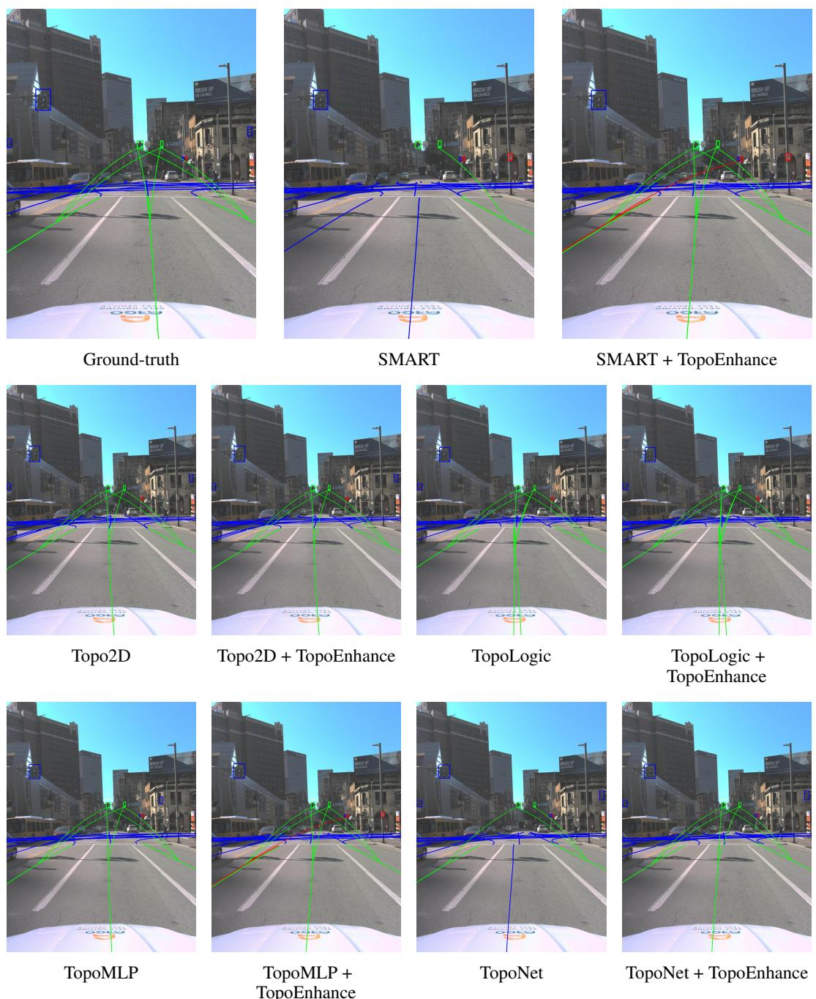  
Figure 3: Qualitative results for scene 10023: predictions before and after refinement with TopoEnhance across baselines.

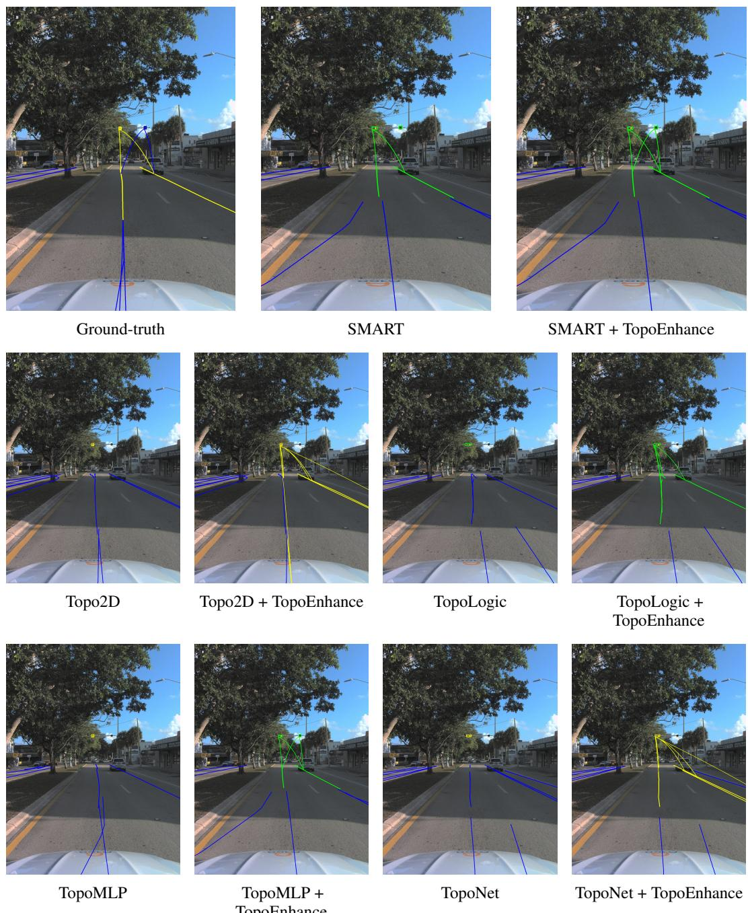  
TopoMLP + TopoEnhance  
Figure 4: Qualitative results for scene 10013: predictions before and after refinement with TopoEnhance across baselines (SMART, Topo2D, TopoLogic, TopoMLP, TopoNet). All panels correspond to the same ground-truth view (left).

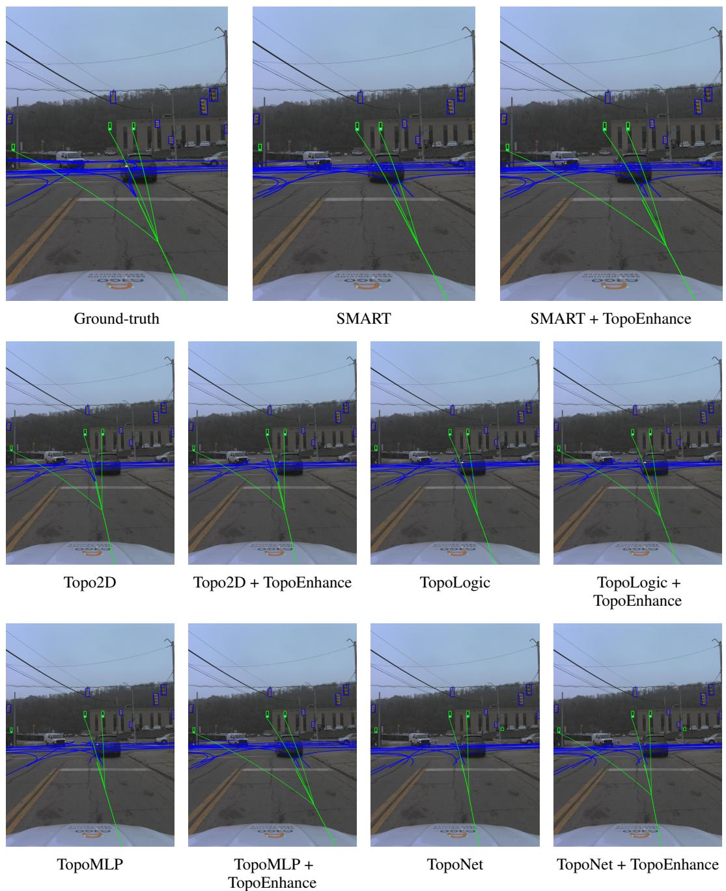  
Figure 5: Qualitative results for scene 10021: predictions before and after refinement with TopoEnhance across baselines (SMART, Topo2D, TopoLogic, TopoMLP, TopoNet). All panels correspond to the same ground-truth view (left).

  
Ground-truth

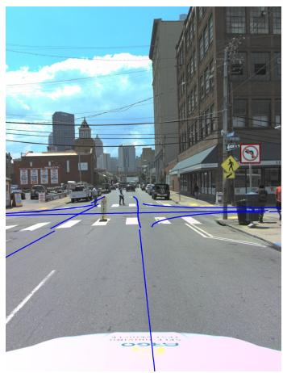

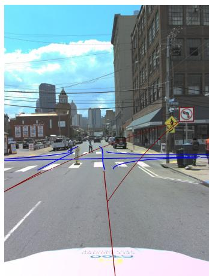  
SMART  
SMART + TopoEnhance

  
Topo2D

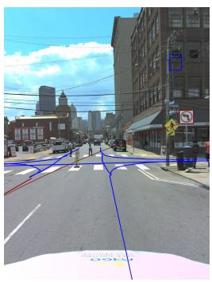  
Topo2D + TopoEnhance

  
TopoLogic

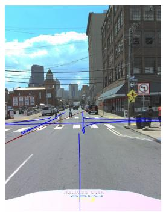  
TopoLogic + TopoEnhance

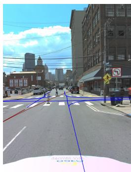  
TopoMLP

  
TopoMLP + TopoEnhance

  
TopoNet

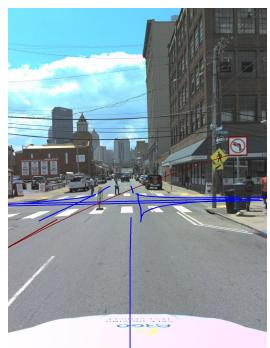  
TopoNet + TopoEnhance  
Figure 6: Qualitative results for scene 10030: predictions before and after refinement with TopoEnhance across baselines.