# RELATIVE PATCH RESPONSE LEARNING FOR GENER-ALIZABLE AI-GENERATED IMAGE DETECTION

Tianyu Wang1∗, Ouxiang Li1∗, Yanbin Hao2, Zhenhua Tang3, Shuo Wang1†

1University of Science and Technology of China, 2Hefei University of Technology

3University of Macau

tianyuwang@mail.ustc.edu.cn, shuowangcv@ustc.edu.cn

## ABSTRACT

Generative models can now synthesize highly realistic images, simultaneously increasing the risks of misinformation and visual forgery. Therefore, detecting AI-generated images becomes more essential, and a reliable detector must generalize to unseen generators and stay robust to unseen perturbations in the wild. Existing detectors are typically trained on either independently collected real and generated images or aligned real-generated pairs designed to mitigate content bias. Building on aligned pairs, recent methods form a mixed view by replacing some patches of the real image with their generated counterparts. However, we find that self-attention lets real and generated patches interact, so the feature of each patch no longer reflects its own source alone. This contextual shift makes a per-patch source label an imprecise target. To this end, we propose Relative Patch Response Learning (PRL). Instead of labeling each patch, PRL compares the same patch across two mixed views of an aligned pair and learns from its patch response, the change of its score between the views. (i) To give precise supervision under the contextual shift, a relative response objective measures the responses of source-changed patches against those of sourceunchanged patches, which respond to the shift alone. (ii) To provide a reliable reference for the shift, a reference coherence objective keeps each group of sourceunchanged patches moving as a whole. (iii) Since the two views contain different amounts of generated content, an area ranking objective asks the view with the larger generated area to have a higher mean patch score. Extensive experiments demonstrate the superior performance of PRL, which surpasses the best prior methods by 4.3% and 5.9% in average balanced accuracy across eight standard and three in-the-wild benchmarks, respectively. Code is available at https: //github.com/wittyuu/Relative-Patch-Response-Learning.

## 1 INTRODUCTION

Generative models nowadays can produce highly realistic images (Karras et al., 2019; Dhariwal & Nichol, 2021; Rombach et al., 2022; Esser et al., 2024; Lu et al., 2023; Li et al., 2026b), expanding the possibilities for visual content creation (OpenAI, 2025; Black Forest Labs et al., 2025; Wu et al., 2025) while increasing the risks of misinformation and visual forgery (Feuerriegel et al., 2023; Chen et al., 2025b; Nightingale & Farid, 2022; Yang et al., 2024). These concerns motivate AI-generated image detection, which aims to distinguish AI-generated images from real ones (Wang et al., 2020; Frank et al., 2020; Chai et al., 2020; Ojha et al., 2023). The task has two central challenges. The first is generalization: detectors are trained on a limited set of generators but must recognize images from unseen models (Corvi et al., 2023; Zhu et al., 2023). The second is robustness: images in the wild are resized, compressed and re-shared online, and a detector must remain effective after such post-processing (Grommelt et al., 2024; Cozzolino et al., 2024; Yan et al., 2025a; Cavia et al., 2024).

To meet these challenges, detectors have relied on hand-crafted features that expose the traces of generation, such as frequency spectra and pixel-level residuals (Frank et al., 2020; Tan et al., 2024b;

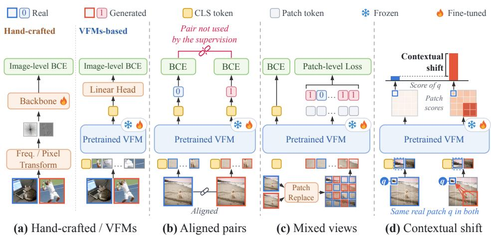  
Figure 1: Three training paradigms and the contextual shift. (a) Detectors built on hand-crafted features or on vision foundation models (VFMs) learn from real and generated images collected separately. (b) Alignment-based methods pair each real image with a reconstruction of matched content, but treat the two as independent training samples with their own image-level labels; the pair itself is not used by the supervision. (c) Patch-level methods replace some patches of a real image by their reconstruction and label each patch by its own source, in addition to the image-level label. (d) Contextual shift: a real patch q has the same input in the real image and in a mixed view, yet its score rises once other patches are replaced, while the per-patch label of (c) still marks q as real.

Li et al., 2025), or on the pretrained representations of vision foundation models (VFMs) (Ojha et al., 2023; Koutlis & Papadopoulos, 2024; Liu et al., 2024; Yan et al., 2025b). In either case, the training data are real and generated images collected separately (Figure 1a). Such unaligned data differ in content, format and resolution as well as in source, and these differences offer a detector shortcuts around the traces of generation (Guillaro et al., 2025; Rajan et al., 2025). Alignment-based methods mitigate content bias by pairing each real image with a reconstruction of matched content, and detectors trained on such pairs generalize better (Chen et al., 2024; Rajan et al., 2025; Guillaro et al., 2025; Chen et al., 2025a) (Figure 1b). Yet the alignment only shapes the data. The two images are still trained as independent samples with image-level labels, and their correspondence is never used as supervision. Recent methods go a step further on the aligned pair. PPL (Yang et al., 2026), for example, replaces some patches of a real image with their reconstruction, forming a mixed view in which the source of every patch is known, and supervises each patch by its own source (Figure 1c).

However, such a per-patch label is an imprecise target. In a vision transformer, self-attention lets every token gather evidence from the whole view. In a mixed view, the traces of generation in the replaced patches therefore spread into the real ones, and the real patches in turn dilute the replaced ones, so the feature of a patch moves with its context although the patch itself does not. We call this contextual shift (Figure 1d). The feature of a patch thus has two parts: the trace of its own source and the shift caused by the other patches, and a label that names only the source cannot tell them apart. It pushes the whole feature toward one class, so the supervision meant for the local trace is mixed with a context term, which Figure 2 makes visible in trained detectors. The label is exact about where the generated patches are, but it says nothing about what the feature of a patch should be once the rest of the view has changed.

To this end, we propose Relative Patch Response Learning (PRL), which supervises responses instead of labels. From each aligned pair, we build two mixed views that differ in which patches are replaced (Figure 3), so that every patch has aligned content in both views and only its source may differ. A linear head maps the feature of each patch to a score, higher for stronger evidence of generation, and the change of this score between the two views is its patch response. For a patch whose source is the same in both views, the input is identical, so the response is the contextual shift alone; for a patch whose source differs, the response adds the effect of its own change. The same-source patches thus serve as references for the source-changed ones. PRL has three objectives. (i) Relative response supervises each source-changed group relative to its reference, which subtracts the shift and leaves a precise target. (ii) Reference coherence keeps each reference group moving as a whole, which makes it a stable and reliable reference. (iii) Area ranking asks the view with the larger generated area to score higher. Experiments validate this design. Supervising the fine-grained correspondence within aligned pairs while accounting for the contextual shift improves the detector on both fronts. PRL averages 96.40% balanced accuracy on eight standard benchmarks of diverse generators and 93.74% on three in-the-wild benchmarks, surpassing the best previous method by 4.3% and 5.9%, respectively. Our contributions are as follows:

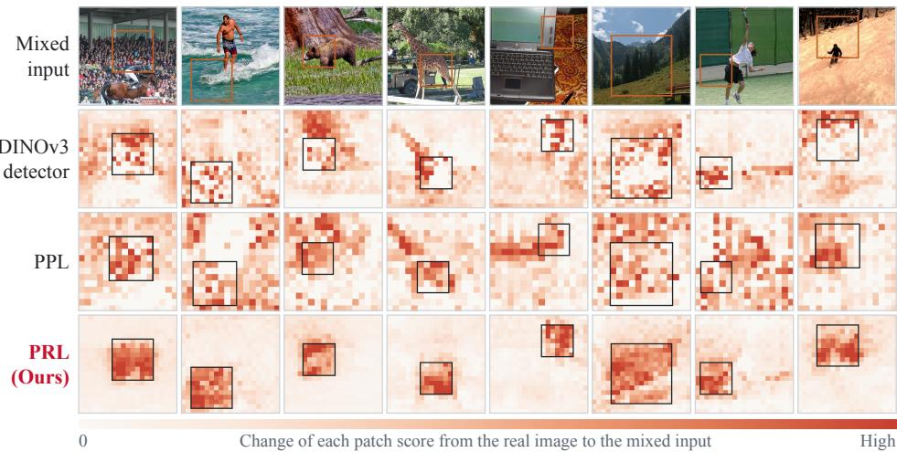  
Figure 2: Contextual shift in trained detectors. Each mixed input takes the outlined square from the aligned reconstruction and the rest from the real image. The maps show how much each patch score changes from the real image to the mixed input, darker for a larger change. For DINOv3 and PPL, we train a patch head on them. Although only the square changed, the DINOv3 detector and PPL respond outside it almost as much as inside it. PRL keeps a shift outside the square and responds inside it.

• We point out that existing methods underuse the correspondence between aligned data. Imagelevel methods train the two images independently, and patch-level supervision on mixed views ignores the contextual shift, which makes its per-patch labels imprecise targets.

• We propose PRL, which supervises patch responses rather than labels. Relative response supervision reduces the shared contextual component against the same-source patches, reference coherence keeps the reference stable, and area-based ranking adds a view-level constraint.

• On eight standard benchmarks of diverse generators and three in-the-wild benchmarks, PRL surpasses the best previous methods by 4.3% and 5.9% in average balanced accuracy, respectively. It also transfers to the detection of locally manipulated images with no additional training data.

## 2 RELATED WORK

Forensic traces and pretrained representations. One family of detectors identifies generated images from the traces left by the generation process, including frequency-domain statistics (Frank et al., 2020; Tan et al., 2024a; Li et al., 2025; Karageorgiou et al., 2025; Li et al., 2026a), pixel level relations and residuals (Tan et al., 2024b; Fu et al., 2025) and reconstruction or regeneration error (Wang et al., 2023; Ricker et al., 2024; Luo et al., 2024; Yu et al., 2024; Chu et al., 2025; Qi et al., 2026), or from the trace of the camera pipeline that generated images lack (Wu et al., 2026). Another line builds on the pretrained representations of vision foundation models, with light classifiers on frozen features (Ojha et al., 2023; Koutlis & Papadopoulos, 2024; Yang et al., 2025) or with representation adaptation (Liu et al., 2024; Tan et al., 2025; Yan et al., 2025b); GAPL (Qin et al., 2026) organizes the feature space with generator-aware prototypes, and others scale the training set to thousands of generators (Park & Owens, 2025). Both lines are typically trained on real and generated images collected separately.

Aligned training data. Separately collected real and generated images differ in content, format and resolution as well as in source, and a detector can separate them by these differences instead of by the traces of generation (Guillaro et al., 2025; Rajan et al., 2025). Alignment removes content shortcut by giving each real image a generated counterpart of matched content. DRCT (Chen et al., 2024) and B-Free (Guillaro et al., 2025) construct generated samples of similar content through reconstruction or regeneration guided by real images; AlignedForensics (Rajan et al., 2025) obtains a tighter spatial correspondence through VAE reconstruction; DDA (Chen et al., 2025a) further removes the high-frequency difference and interpolates pixels within each pair. Detectors trained on such pairs generalize better across generators than those trained on separately collected images (Rajan et al., 2025; Guillaro et al., 2025; Chen et al., 2025a). In all of these methods, however, the alignment only shapes the data. The two images of a pair are trained as independent samples with image-level labels, and their correspondence is never used as supervision.

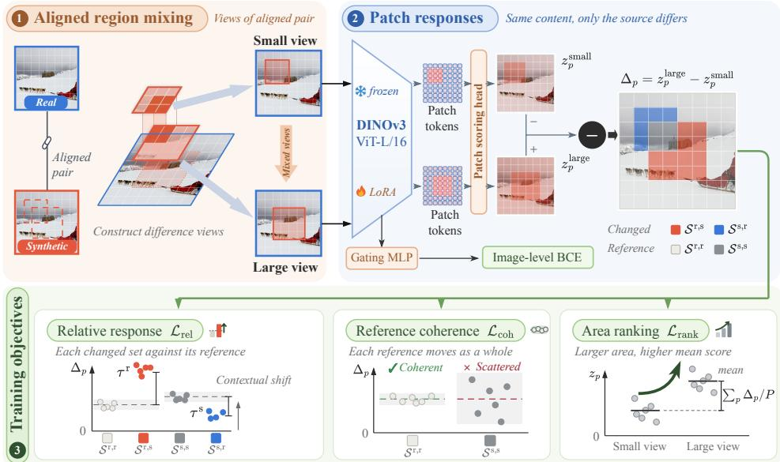  
Figure 3: Overview of PRL. ❶ Aligned region mixing: two masks mix the real and the synthetic image into a small and a large view. ❷ Patch responses: the patch scoring head scores every position in both views, and the patch response $\Delta _ { p }$ (Eq. (3)) is read on the changed sets Sr,s, Ss,r and on their references Sr,r, Ss,s; the gating MLP gives the image-level decision. ❸ Training objectives: relative response, reference coherence and area ranking.

Mixed views and patch-level supervision. Mixing real and generated content yields harder training samples. Without alignment, SimLBR (Dhakal et al., 2026) blends the feature of a real image with that of an unpaired generated image in the latent space of a foundation model and labels the blend as generated, which widens the training distribution but can only carry an image-level label. Within an aligned pair, the pixel-wise interpolation of DDA is again labeled at the image level, whereas PPL (Yang et al., 2026) replaces some real patches by their reconstruction and supervises each patch by its own source. Such a label, however, is decided by that patch alone and ignores the contextual shift. PRL instead compares the same patch across two mixed views and measures its response against the patches whose source is the same in both views.

## 3 METHOD

In this section, we detail PRL, whose framework is shown in Figure 3. Specifically, PRL supervises a ViT detector with the patch response of an aligned pair: how the score at each patch position changes between two mixed views of the pair. It has two parts: aligned region mixing, which constructs the mixed views, and response learning, which learns the traces of generation from the patch responses. Given a real image and its aligned synthetic image, we mix them patch by patch into two views and train the detector on how each patch score changes between the views.

## 3.1 ALIGNED REGION MIXING

Given a real image $I ^ { \mathrm { r } }$ and its synthetic image $\pmb { I } ^ { \mathrm { s } } .$ , where the synthetic image is aligned with the real image, we use Ω to split both images into $P$ patches as $\check { \mathcal { X } ^ { \mathrm { r } } } = \Omega ( I ^ { \mathrm { r } } ) \stackrel { \smile } { = } \{ \pmb { x } _ { p } ^ { \mathrm { r } } \} _ { p = 1 } ^ { \tilde { P } }$ and $\mathcal { X } ^ { \mathrm { s } } =$ $\Omega ( I ^ { \mathrm { s } } ) = \{ \pmb { x } _ { p } ^ { \mathrm { s } } \} _ { p = 1 } ^ { P }$ , respectively, where Ω is the function that splits an image into non-overlapping patches on the patch grid of the encoder and $P$ is the number of patches. We then define a binary mixture mask $\dot { M } = \left( m _ { 1 } , \ldots , m _ { P } \right) \in \{ 0 , 1 \} ^ { P }$ to construct a new synthetic image, which we call a mixed view, from the patches

$$
\begin{array} { r } { \hat { \pmb x } _ { p } = m _ { p } \pmb x _ { p } ^ { \mathrm { s } } + \left( 1 - m _ { p } \right) \pmb x _ { p } ^ { \mathrm { r } } , } \end{array}\tag{1}
$$

so that the mixed view consists of the patches $\hat { \mathcal X } = \{ \hat { \pmb x } _ { p } \} _ { p = 1 } ^ { P }$ . The mask is generated at random: $m _ { p } = 1$ takes the patch $\pmb { x } _ { p } ^ { \mathrm { s } }$ of $I ^ { \mathrm { s } }$ at position $p ,$ and $m _ { p } = { \mathrm { 0 } }$ takes $\pmb { x } _ { p } ^ { \mathrm { r } }$ of $\pmb { I } ^ { \mathrm { r } }$ . Thus, different masks M yield a large set of mixed views for training.

For each aligned pair, we sample two masks to construct two mixed views. The sum $\Sigma _ { p } m _ { p }$ counts the synthetic patches of a view, so a larger sum means more synthetic patches, and we require the two sums to differ; Appendix A details how the masks are sampled. Ordered by the sum, we denote the two masks by $\dot { M } ^ { \mathrm { s m a l l } }$ and $M ^ { \mathrm { l a r g e } }$ , with entries $m _ { p } ^ { \mathrm { s m a l l } }$ and $m _ { p } ^ { \mathrm { l a r g e } }$ , and the mixed views they construct by $\hat { \mathcal { X } } ^ { \mathrm { s m a l l } } = \{ \hat { \pmb { x } } _ { p } ^ { \mathrm { s m a l l } } \} _ { p = 1 } ^ { P }$ and $\hat { \mathcal X } ^ { \mathrm { l a r g e } } = \{ \hat { \pmb x } _ { p } ^ { \mathrm { l a r g e } } \} _ { p = 1 } ^ { P }$ . We then define four sets of positions by the patches the two views take:

$$
\begin{array} { r } { \mathcal { S } ^ { \mathrm { r , r } } = \{ p : \hat { x } _ { p } ^ { \mathrm { s m a l l } } = x _ { p } ^ { \mathrm { r } } , \ \hat { x } _ { p } ^ { \mathrm { l a r g e } } = x _ { p } ^ { \mathrm { r } } \} , \qquad \mathcal { S } ^ { \mathrm { r , s } } = \{ p : \hat { x } _ { p } ^ { \mathrm { s m a l l } } = x _ { p } ^ { \mathrm { r } } , \ \hat { x } _ { p } ^ { \mathrm { l a r g e } } = x _ { p } ^ { \mathrm { s } } \} , } \end{array}\tag{2}
$$

$$
\begin{array} { r } { \mathcal { S } ^ { \mathrm { s , s } } = \{ p : \hat { x } _ { p } ^ { \mathrm { s m a l l } } = x _ { p } ^ { \mathrm { s } } , \ \hat { x } _ { p } ^ { \mathrm { l a r g e } } = x _ { p } ^ { \mathrm { s } } \} , \qquad \mathcal { S } ^ { \mathrm { s , r } } = \{ p : \hat { x } _ { p } ^ { \mathrm { s m a l l } } = x _ { p } ^ { \mathrm { s } } , \ \hat { x } _ { p } ^ { \mathrm { l a r g e } } = x _ { p } ^ { \mathrm { r } } \} . } \end{array}
$$

On $S ^ { \mathrm { r , s } }$ and $S ^ { \mathrm { s , r } }$ the patch changes source between the views; these are the changed sets in Figure $^ { 3 , }$ red and blue. On $S ^ { \mathrm { r , r } }$ and $S ^ { \mathrm { s , s } }$ the patch stays the same; these are the reference sets, light and dark grey. Because the pair is aligned, the patch at every position shows aligned content in both views, and only its source may differ.

## 3.2 RESPONSE LEARNING

Patch response. Both mixed views are encoded by ${ \mathcal { F } } _ { \phi } ,$ a frozen DINOv3 ViT adapted with LoRA parameters ϕ (Hu et al., 2022). The encoder takes all P patches of a view and returns one final-layer token per position, $h _ { p } ^ { \mathrm { s m a l l } } = \mathcal { F } _ { \phi } ( \hat { \mathcal { X } } ^ { \mathrm { s m a l l } } ) _ { p }$ and $h _ { p } ^ { \mathrm { l a r g e } } = \mathcal { F } _ { \phi } ( \hat { \mathcal { X } } ^ { \mathrm { l a r g e } } ) _ { p }$ . A linear patch scoring head w maps each token to a scalar patch score, $z _ { p } ^ { \mathrm { s m a l l } } = \pmb { w } ^ { \top } h _ { p } ^ { \mathrm { s m a l l } }$ and $z _ { p } ^ { \mathrm { l a r g e } } = w ^ { \top } h _ { p } ^ { \mathrm { l a r g e } }$ , higher for stronger evidence of synthesis. The patch response at position p is the change of its score from the small to the large view,

$$
\Delta _ { p } = z _ { p } ^ { \mathrm { l a r g e } } - z _ { p } ^ { \mathrm { s m a l l } } = w ^ { \top } \big ( h _ { p } ^ { \mathrm { l a r g e } } - h _ { p } ^ { \mathrm { s m a l l } } \big ) .\tag{3}
$$

Since the content at $p$ is aligned across the two views, $\Delta _ { p }$ is not driven by content. For $p \in { \mathcal { S } } ^ { \mathrm { r , r } } \cup { \mathcal { S } } ^ { \mathrm { s , s } }$ the patch at position p is identical in the two views, so $\Delta _ { p }$ comes only from the patches that changed elsewhere in the image. This is the contextual shift (Figure 2), and the reference sets measure it directly. For $p \in S ^ { \mathrm { r , s } } \cup S ^ { \mathrm { s , r } } , \Delta _ { p }$ responds both to the change of the patch at $p$ and to the changed context, and a single position cannot tell the two apart. We therefore measure each changed set against the reference set with the same source in the small view: $S ^ { \mathrm { r , s } }$ against $S ^ { \mathrm { r , r } }$ , and $S ^ { \mathrm { s , r } }$ against $S ^ { \mathrm { s } , \mathrm { s } }$ . The two sets of each couple start from the same source and are exposed to the same change in the rest of the image; they differ mostly in whether their own patch changes, so the mean response of the reference serves as the estimate of the contextual shift of its changed set.

Relative response $( \mathcal { L } _ { \mathrm { r e l } } )$ . A change from real to synthetic should raise the score of a position above its reference, and a change from synthetic to real should lower it below its reference. In both cases, of the two sets that share a source in the small view, the one synthetic in the large view should respond more than the one real in the large view. For the positions real and synthetic in the small view, we measure this by the relative responses

$$
\tau ^ { \mathrm { r } } = \frac { 1 } { \left| \mathcal { S } ^ { \mathrm { r } , \mathrm { s } } \right| } \sum _ { p \in \mathcal { S } ^ { \mathrm { r } , \mathrm { s } } } \Delta _ { p } - \mathrm { s g } \left( \frac { 1 } { \left| \mathcal { S } ^ { \mathrm { r } , \mathrm { r } } \right| } \sum _ { p \in \mathcal { S } ^ { \mathrm { r } , \mathrm { r } } } \Delta _ { p } \right) , \tau ^ { \mathrm { s } } = \mathrm { s g } \left( \frac { 1 } { \left| \mathcal { S } ^ { \mathrm { s } , \mathrm { s } } \right| } \sum _ { p \in \mathcal { S } ^ { \mathrm { s } , \mathrm { s } } } \Delta _ { p } \right) - \frac { 1 } { \left| \mathcal { S } ^ { \mathrm { s } , \mathrm { r } } \right| } \sum _ { p \in \mathcal { S } ^ { \mathrm { s } , \mathrm { r } } } \Delta _ { p } ,\tag{4}
$$

where $| \cdot |$ is the number of elements in a set and $\operatorname { s g } ( \cdot )$ is the stop-gradient function: it returns its input unchanged in the forward pass and passes no gradient to it in the backward pass. Applied to

the means over the references $S ^ { \mathrm { r , r } }$ and $S ^ { \mathrm { s } , \mathrm { s } }$ , it keeps this loss from moving the references. With the softplus activation $\mathrm { s o f t p l u s } ( \cdot ) = \log \left( 1 + \exp \bar { ( \cdot ) } \right)$ , the loss asks both relative responses to be positive,

$$
\begin{array} { r } { \mathcal { L } _ { \mathrm { r e l } } = \frac { 1 } { 2 } \big [ \mathrm { s o f t p l u s } ( - \tau ^ { \mathrm { r } } ) + \mathrm { s o f t p l u s } ( - \tau ^ { \mathrm { s } } ) \big ] . } \end{array}\tag{5}
$$

If a set in $\tau ^ { \mathrm { r } }$ or $\tau ^ { \mathrm { s } }$ is empty, that term is dropped and the other is used alone. Subtracting the reference reduces the contextual shift.

Reference coherence $( \mathcal { L } _ { \mathrm { c o h } } )$ . The mean of a reference is a good estimate of the contextual shift only if its positions move together. We therefore penalize the deviation of every position in $S ^ { \mathrm { r , r } }$ and $S ^ { \mathrm { s , \bar { s } } }$ from the mean response of its set, averaged over both sets,

$$
\mathcal { L } _ { \mathrm { c o h } } = \frac { 1 } { \left| \mathcal { S } ^ { \mathrm { r } , \mathrm { r } } \right| + \left| \mathcal { S } ^ { \mathrm { s } , \mathrm { s } } \right| } \left[ \sum _ { p \in \mathcal { S } ^ { \mathrm { r } , \mathrm { r } } } \left( \Delta _ { p } - \frac { 1 } { \left| \mathcal { S } ^ { \mathrm { r } , \mathrm { r } } \right| } \sum _ { q \in \mathcal { S } ^ { \mathrm { r } , \mathrm { r } } } \Delta _ { q } \right) ^ { 2 } + \sum _ { p \in \mathcal { S } ^ { \mathrm { s } , \mathrm { s } } } \left( \Delta _ { p } - \frac { 1 } { \left| \mathcal { S } ^ { \mathrm { s } , \mathrm { s } } \right| } \sum _ { q \in \mathcal { S } ^ { \mathrm { s } , \mathrm { s } } } \Delta _ { q } \right) ^ { 2 } \right] .\tag{6}
$$

Removing the mean leaves the shift itself free: a reference may shift with the context, but it has to shift as a whole.

Area ranking $( \mathcal { L } _ { \mathrm { r a n k } } ) .$ . The two views also differ in how much of the view is synthetic: the large view has $\left| S ^ { \mathrm { r , \bar { s } } } \right| - \left| S ^ { \mathrm { s , r } } \right|$ more synthetic patches than the small view, a number that is always positive because the two masks have different sums. The loss

$$
{ \mathcal { L } } _ { \mathrm { r a n k } } = { \frac { \left| { \mathcal { S } } ^ { \mathrm { r } , \mathrm { s } } \right| - \left| { \mathcal { S } } ^ { \mathrm { s } , \mathrm { r } } \right| } { P } } { \mathrm { s o f t p l u s } } { \bigg ( } - { \frac { \sum _ { p = 1 } ^ { P } \Delta _ { p } } { \left| { \mathcal { S } } ^ { \mathrm { r } , \mathrm { s } } \right| - \left| { \mathcal { S } } ^ { \mathrm { s } , \mathrm { r } } \right| } } { \bigg ) }\tag{7}
$$

asks the large view to have a higher mean patch score, that is, a positive $\Sigma _ { p } \Delta _ { p }$ . Inside the softplus, the score gain is divided by the number of added synthetic patches, so the loss looks at the gain per added patch. The factor in front keeps the gradient bounded for any area gap.

Training and inference. The image-level decision comes from the detection head $^ { g , }$ a gating MLP that weights the tokens of an image, pools them and maps the result to a logit. For an image with patches $\bar { \mathcal X } .$ , the detector outputs the probability $\hat { y }$ that the image is synthetic, and is trained with the binary cross-entropy ${ \mathcal { L } } _ { \mathrm { i m g } }$

$$
\begin{array} { r } { \hat { y } = \sigma \big ( g ( \mathcal { F } _ { \phi } ( \mathcal { X } ) ) \big ) , \qquad \mathcal { L } _ { \mathrm { i m g } } = - y \log \hat { y } - ( 1 - y ) \log ( 1 - \hat { y } ) , } \end{array}\tag{8}
$$

where $\sigma$ is the sigmoid function and the label $y$ is 0 for the real image and 1 for every image that contains synthetic patches; ${ \mathcal { L } } _ { \mathrm { i m g } }$ is averaged over a batch with real and synthetic images weighted equally. The training loss is

$$
\begin{array} { r } { \mathcal { L } = \mathcal { L } _ { \mathrm { i m g } } + \lambda _ { \mathrm { r e l } } \mathcal { L } _ { \mathrm { r e l } } + \lambda _ { \mathrm { c o h } } \mathcal { L } _ { \mathrm { c o h } } + \lambda _ { \mathrm { r a n k } } \mathcal { L } _ { \mathrm { r a n k } } , } \end{array}\tag{9}
$$

with which we train ${ \mathcal { F } } _ { \phi } ,$ , w and $g .$ The response terms reach the encoder through the patch scores and thereby shape the tokens that g classifies. At inference, the detector takes a single image I and outputs yˆ of Eq. (8) with $\mathcal { X } = \Omega ( \bar { I } )$ .

## 4 EXPERIMENTS

## 4.1 EXPERIMENTAL SETUP

Implementation Details We build on DINOv3 ViT-L/16 (Simeoni et al.´ , 2025), kept frozen and adapted with LoRA (Hu et al., 2022). The training pairs are those of DDA (Chen et al., 2025a): real images from MSCOCO (Lin et al., 2014) and, for each, its reconstruction through the VAE of Stable Diffusion 2.1 (Rombach et al., 2022). Images are 336 × 336 at training and at inference. We train with Adam (Kingma & Ba, 2015) at a learning rate of $1 0 ^ { - 4 }$ and a batch of 16 pairs per GPU on two A100 GPUs, with $( \lambda _ { \mathrm { { r e l } } } , \lambda _ { \mathrm { { c o h } } } , \lambda _ { \mathrm { { r a n k } } } ) = ( 0 . 3 , \bar { 0 } . 3 , 0 . 1 )$ . Further details are given in Appendix $\mathrm { A } .$

Evaluation Benchmarks We evaluate on eleven benchmarks, which we divide into two groups. Eight standard benchmarks are assembled from known generators: GenImage (Zhu et al., 2023), AIGCDetectBenchmark (AIGCDetect) (Zhong et al., 2023), DRCT-2M (Chen et al., 2024), DDA-COCO and EvalGEN (Chen et al., 2025a), Synthbuster (Bammey, 2024), ForenSynths (Wang et al.,

Table 1: Cross-benchmark comparison. Balanced accuracy (%) on eight standard and three inthe-wild benchmarks; EvalGEN has no real counterpart and is reported as accuracy on its synthetic images. Every compared method uses its official checkpoint and inference code. Bold: best per column; underlined: second best.
<table><tr><td rowspan="2">Method</td><td colspan="8">Standard Benchmarks</td><td colspan="4">In-the-Wild Benchmarks</td></tr><tr><td>GenImage</td><td>AIGCDetect</td><td>DRCT-2M</td><td>DDA-COCO</td><td>EvalGEN</td><td>Synthbuster</td><td>ForenSynths</td><td>UnivFD</td><td>Chameleon</td><td>SynthWildX</td><td>WildRF</td><td>Avg.</td></tr><tr><td>UnivFD CVPR&#x27;23</td><td>64.05</td><td>72.50</td><td>59.64</td><td>52.32</td><td>15.39</td><td>55.31</td><td>77.69</td><td>78.95</td><td>50.71</td><td>52.27</td><td>55.08</td><td>57.63</td></tr><tr><td>FatFormer CVPR&#x27;24</td><td>61.03</td><td>74.78</td><td>50.82</td><td>51.63</td><td>27.17</td><td>53.62</td><td>86.13</td><td>82.07</td><td>51.11</td><td>53.31</td><td>59.62</td><td>59.21</td></tr><tr><td>NPR CVPR&#x27;24</td><td>46.74</td><td>47.78</td><td>49.62</td><td>49.07</td><td>3.43</td><td>41.83</td><td>37.88</td><td>41.92</td><td>52.26</td><td>49.80</td><td>59.34</td><td>43.61</td></tr><tr><td>DRCTICML&#x27;24</td><td>80.42</td><td>67.67</td><td>90.41</td><td>66.89</td><td>50.93</td><td>73.04</td><td>54.86</td><td>64.27</td><td>68.93</td><td>74.47</td><td>74.22</td><td>69.65</td></tr><tr><td>C2P-CLIP AAAI&#x27;25</td><td>62.09</td><td>70.16</td><td>54.29</td><td>50.90</td><td>13.82</td><td>68.08</td><td>87.00</td><td>84.88</td><td>50.60</td><td>53.07</td><td>59.14</td><td>59.46</td></tr><tr><td>AIDEICLR&#x27;25</td><td>60.35</td><td>53.98</td><td>58.94</td><td>50.09</td><td>13.09</td><td>56.87</td><td>42.36</td><td>47.05</td><td>57.36</td><td>55.25</td><td>62.08</td><td>50.67</td></tr><tr><td>AlignedForensics ICLR&#x27;25</td><td>77.44</td><td>65.63</td><td>95.13</td><td>86.32</td><td>61.42</td><td>77.29</td><td>51.47</td><td>60.47</td><td>68.04</td><td>79.21</td><td>82.20</td><td>73.15</td></tr><tr><td>Effort ICML&#x27;25</td><td>79.55</td><td>77.00</td><td>67.42</td><td>51.88</td><td>94.41</td><td>75.68</td><td>64.17</td><td>70.19</td><td>58.76</td><td>58.53</td><td>72.95</td><td>70.05</td></tr><tr><td>SAFE KDD&#x27;25</td><td>51.14</td><td>50.02</td><td>50.42</td><td>50.28</td><td>1.10</td><td>52.75</td><td>40.67</td><td>43.73</td><td>52.51</td><td>49.93</td><td>58.97</td><td>45.59</td></tr><tr><td>DDA NeurIPS&#x27;25</td><td>91.74</td><td>87.83</td><td>98.47</td><td>92.89</td><td>96.86</td><td>85.52</td><td>81.41</td><td>82.58</td><td>82.41</td><td>90.87</td><td>90.20</td><td>89.16</td></tr><tr><td>GAPL CVPR&#x27;26</td><td>95.56</td><td>96.08</td><td>95.23</td><td>79.27</td><td>96.10</td><td>90.63</td><td>90.94</td><td>92.89</td><td>69.30</td><td>86.23</td><td>86.01</td><td>88.93</td></tr><tr><td>PRL (Ours)</td><td>96.83</td><td>97.75</td><td>99.27</td><td>94.39</td><td>99.14</td><td>97.00</td><td>92.57</td><td>94.22</td><td>90.01</td><td>93.60</td><td>97.59</td><td>95.67</td></tr></table>

2020) and UnivFD (Ojha et al., 2023); together they cover diverse generators, including GANs, diffusion models and auto-regressive models. Three in-the-wild benchmarks collect images from the web, with unknown generators and post-processing: Chameleon (Yan et al., 2025a), Synth-WildX (Cozzolino et al., 2024) and WildRF (Cavia et al., 2024). A third group, of locally manipulated images, is introduced in Section 4.3. Appendix B describes the benchmarks in more detail.

Evaluation Metrics and Comparative Methods We report balanced accuracy, the mean of the accuracies on real and on synthetic images. Following DDA, on benchmarks whose synthetic images are stored losslessly while real ones are JPEG (GenImage, AIGCDetect, ForenSynths and UnivFD), synthetic images are JPEG-compressed at quality 96 before evaluation, so that no detector can rely on the format bias. We compare with eleven detectors: UnivFD (Ojha et al., 2023), FatFormer (Liu et al., 2024), NPR (Tan et al., 2024b), DRCT (Chen et al., 2024), C2P-CLIP (Tan et al., 2025), AIDE (Yan et al., 2025a), AlignedForensics (Rajan et al., 2025), Effort (Yan et al., 2025b), SAFE (Li et al., 2025), DDA (Chen et al., 2025a) and GAPL (Qin et al., 2026). We evaluate each method using its official checkpoint and inference code; Appendix C describes the methods in more detail.

## 4.2 CROSS-BENCHMARK COMPARISON

Overall comparison on multiple benchmarks. Table 1 compares PRL with the eleven detectors on the eleven benchmarks. PRL reaches an average balanced accuracy of 95.67%, surpassing DDA at 89.16% by 6.5% and GAPL at 88.93% by 6.7%, and is the best method on every benchmark. This consistent margin supports the design of PRL: supervising patch responses against internal references, instead of labeling patches, generalizes across every benchmark. PRL also performs best on Chameleon, the most challenging in-the-wild benchmark, with 90.01% against 82.41% for the strongest prior method. The two strongest prior methods fail in different places. GAPL, whose training set spans thousands of generators, stays close to PRL on the standard benchmarks but drops on all three in-the-wild benchmarks, to 69.30% on Chameleon, and to 79.27% on DDA-COCO; DDA, the best previous method, is strong on most benchmarks but falls behind on the in-the-wild benchmarks and on the GAN-based ones, with 81.41% on ForenSynths. Tables 2 and 3 and Appendix D report the detailed results for every subset.

Comparison on standard benchmarks. Table 2 gives the per-subset results on UnivFD; those of GenImage, AIGCDetect, Synthbuster, DRCT-2M, DDA-COCO and EvalGEN, and ForenSynths are in Appendix D. On ForenSynths, whose generators are GANs and other CNNs, the alignment-based methods DDA and AlignedForensics, trained on VAE reconstructions, fall to 81.41% and 51.47%, whereas PRL, trained on the same kind of pairs, reaches 92.57%; on DRCT-2M, whose sixteen subsets come from Stable Diffusion models and their predecessor LDM, PRL reaches 99.27% against 98.47% for DDA. GAPL is weakest on DDA-COCO, 79.27% against 94.39% for PRL. PRL is above 90% on every subset except five. On the DeepFake face swaps of ForenSynths it reaches 55.26%, where the CLIP-based detectors are stronger. On SITD and SAN, which hold low-light photographs and super-resolved images rather than generated ones, it reaches 84.72% and 88.81%. On the SD3.5 and Flux reconstructions of DDA-COCO it reaches 85.17% and 85.19%.

Table 2: Comparison of balanced accuracy (%) on the UnivFD benchmark.
<table><tr><td>Method</td><td>BigGAN</td><td>CRN</td><td>CycleGAN</td><td>DeepFake</td><td>GauGAN IMLE ProGAN SAN SITD</td><td></td><td></td><td></td><td>StarGAN</td><td>StyleGAN</td><td>DALL-E</td><td>Glide-50-27</td><td>Glide-100-10</td><td>Glide-100-27</td><td></td><td>Guided LDM-100</td><td>LDM-200</td><td></td><td>LDM-200-cfg Avg.</td></tr><tr><td>UnivFDCVPR*23</td><td>87.50</td><td>55.67</td><td>96.92</td><td>69.39</td><td>98.79</td><td>68.11</td><td>99.38</td><td>58.22 62.22</td><td>95.12</td><td>79.99</td><td>79.55</td><td>77.80</td><td>77.40</td><td>77.80</td><td>67.15</td><td>91.20</td><td>90.75</td><td>67.05</td><td>78.95</td></tr><tr><td>FatFormer CVPR&#x27;24</td><td>97.90</td><td>69.32</td><td>99.32</td><td>86.03</td><td>99.17</td><td>69.45</td><td>99.21</td><td>62.10 80.83</td><td>99.75</td><td>87.51</td><td>88.40</td><td>70.10</td><td>69.60</td><td>70.60</td><td>61.45</td><td>88.40</td><td>89.45</td><td>70.75</td><td>82.07</td></tr><tr><td>NPR CVPR*24</td><td>43.25</td><td>0.00</td><td>59.83</td><td>33.30</td><td>35.62</td><td>0.00</td><td>50.45</td><td>48.40 22.22</td><td>49.47</td><td>50.18</td><td>52.30</td><td>50.50</td><td>50.85</td><td>51.00</td><td>45.75</td><td>51.15</td><td>51.10</td><td>51.05</td><td>41.92</td></tr><tr><td>DRCTICML:24</td><td>52.45</td><td>49.80</td><td>48.83</td><td>56.38</td><td>49.45</td><td>49.26</td><td>53.02</td><td>86.76 54.44</td><td>54.38</td><td>54.45</td><td>79.05</td><td>60.05</td><td>66.45</td><td>63.15</td><td>59.00</td><td>94.80</td><td>94.80</td><td>94.65</td><td>64.27</td></tr><tr><td>C2P-CLIP AAAI&#x27;25</td><td>92.07</td><td>92.75</td><td>99.39</td><td>91.85</td><td>98.20</td><td>97.68</td><td>97.10</td><td>74.20 87.22</td><td>99.70</td><td>76.97</td><td>84.90</td><td>78.90</td><td>78.60</td><td>76.35</td><td>57.05</td><td>82.70</td><td>83.65</td><td>63.40</td><td>84.88</td></tr><tr><td>AIDEICLR&#x27;25</td><td>43.68</td><td>19.96</td><td>51.73</td><td>45.54</td><td>39.73</td><td>19.38</td><td>49.31</td><td>51.37 30.56</td><td>51.43</td><td>49.57</td><td>51.80</td><td>51.25</td><td>51.55</td><td>51.50</td><td>50.25</td><td>60.80</td><td>62.25</td><td>62.35</td><td>47.05</td></tr><tr><td>AlignedForensics ICLR&#x27;25</td><td>50.52</td><td>49.95</td><td>49.69</td><td>52.69</td><td>50.24</td><td>49.91</td><td>50.35</td><td>61.87 50.56</td><td>51.50</td><td>51.46</td><td>74.25</td><td>52.20</td><td>52.30</td><td>52.10</td><td>50.20</td><td>99.70</td><td>99.70</td><td>99.70</td><td>60.47</td></tr><tr><td>Effort ICML:25</td><td>73.60</td><td>39.20</td><td>81.49</td><td>64.59</td><td>62.52</td><td>29.54</td><td>70.08</td><td>58.90 83.89</td><td>96.02</td><td>56.42</td><td>78.90</td><td>80.70</td><td>82.10</td><td>83.45</td><td>59.65</td><td>80.15</td><td>79.75</td><td>72.65</td><td>70.19</td></tr><tr><td>SAFEKDD&#x27;25</td><td>48.95</td><td>0.11</td><td>52.58</td><td>49.09</td><td>42.60</td><td>0.10</td><td>49.96</td><td>50.46 35.83</td><td>49.95</td><td>49.99</td><td>49.55</td><td>50.90</td><td>51.45</td><td>51.15</td><td>50.40</td><td>49.15</td><td>49.20</td><td>49.45</td><td>43.73</td></tr><tr><td>DDA NeurlPS&#x27;25</td><td>90.97</td><td>86.98</td><td>72.47</td><td>76.53</td><td>92.74</td><td>89.71</td><td>92.80</td><td>94.75 58.61</td><td>72.74</td><td>87.80</td><td>75.05</td><td>76.75</td><td>80.05</td><td>78.10</td><td>90.25</td><td>84.15</td><td>84.20</td><td>84.45</td><td>82.58</td></tr><tr><td>GAPLCVPR&#x27;26</td><td>98.62</td><td>67.85</td><td>97.54</td><td>84.88</td><td>99.63</td><td>67.12</td><td>99.83</td><td>96.58 82.50</td><td>97.05</td><td>97.89</td><td>97.15</td><td>97.45</td><td>97.15</td><td>97.00</td><td>94.15</td><td>97.50</td><td>97.55</td><td>97.55</td><td>92.89</td></tr><tr><td>PRL (Ours)</td><td>99.28</td><td>96.07</td><td>97.37</td><td>55.26</td><td>99.55</td><td>96.08</td><td>98.99</td><td>88.81 84.72</td><td>99.25</td><td>98.21</td><td>98.25</td><td>96.65</td><td>95.95</td><td>96.25</td><td>94.95</td><td>98.25</td><td>98.25</td><td>98.10</td><td>94.22</td></tr></table>

Table 3: Comparison of balanced accuracy (%) on the in-thewild benchmarks Chameleon, SynthWildX and WildRF.
<table><tr><td>Method</td><td>Chameleon</td><td colspan="4">SynthWildX</td><td colspan="4">WildRF</td></tr><tr><td></td><td>Chameleon</td><td>DALL-E 3</td><td>Firefly</td><td>Midjourney</td><td>Avg.</td><td>Facebook</td><td>Reddit</td><td>Twitter</td><td>Avg.</td></tr><tr><td>UnivFD CVPR&#x27;23</td><td>50.71</td><td>45.42</td><td>65.24</td><td>46.14</td><td>52.27</td><td>49.06</td><td>60.20</td><td>55.98</td><td>55.08</td></tr><tr><td>FatFormer CVPR&#x27;24</td><td>51.11</td><td>48.01</td><td>61.62</td><td>50.30</td><td>53.31</td><td>54.37</td><td>69.67</td><td>54.82</td><td>59.62</td></tr><tr><td>NPR CVPR&#x27;24</td><td>52.26</td><td>49.53</td><td>50.55</td><td>49.31</td><td>49.80</td><td>50.31</td><td>74.93</td><td>52.78</td><td>59.34</td></tr><tr><td>DRCTICML&#x27;24</td><td>68.93</td><td>84.72</td><td>59.24</td><td>79.45</td><td>74.47</td><td>79.06</td><td>66.27</td><td>77.33</td><td>74.22</td></tr><tr><td>C2P-CLIPAAAI&#x27;25</td><td>50.60</td><td>49.97</td><td>59.73</td><td>49.53</td><td>53.07</td><td>51.88</td><td>71.60</td><td>53.94</td><td>59.14</td></tr><tr><td>AIDEICLR&#x27;25</td><td>57.36</td><td>63.47</td><td>50.60</td><td>51.67</td><td>55.25</td><td>56.88</td><td>72.07</td><td>57.31</td><td>62.08</td></tr><tr><td>AlignedForensics ICLR&#x27;25</td><td>68.04</td><td>86.85</td><td>56.95</td><td>93.83</td><td>79.21</td><td>93.44</td><td>70.87</td><td>82.31</td><td>82.20</td></tr><tr><td>Effort ICML&#x27;25</td><td>58.76</td><td>59.32</td><td>61.27</td><td>55.02</td><td>58.53</td><td>74.06</td><td>79.33</td><td>65.47</td><td>72.95</td></tr><tr><td>SAFEKDD&#x27;25</td><td>52.51</td><td>49.65</td><td>50.48</td><td>49.65</td><td>49.93</td><td>50.94</td><td>74.07</td><td>51.90</td><td>58.97</td></tr><tr><td>DDA NeurIPS&#x27;25</td><td>82.41</td><td>92.22</td><td>87.30</td><td>93.09</td><td>90.87</td><td>93.12</td><td>86.40</td><td>91.07</td><td>90.20</td></tr><tr><td>GAPLCVPR&#x27;26</td><td>69.30</td><td>87.06</td><td>87.22</td><td>84.39</td><td>86.23</td><td>88.44</td><td>82.20</td><td>87.40</td><td>86.01</td></tr><tr><td>PRL (Ours)</td><td>90.01</td><td>94.92</td><td>91.31</td><td>94.58</td><td>93.60</td><td>97.19</td><td>97.20</td><td>98.39</td><td>97.59</td></tr></table>

Table 4: Comparison of balanced accuracy (%) on AutoSplice at JPEG quality 100, 90 and 75.
<table><tr><td>Method</td><td>JPEG 100</td><td>JPEG 90</td><td>JPEG 75</td><td>Avg.</td></tr><tr><td>UnivFD CVPR&#x27;23</td><td>64.27</td><td>58.12</td><td>57.47</td><td>59.95</td></tr><tr><td>FatFormer CVPR&#x27;24</td><td>73.78</td><td>57.84</td><td>53.88</td><td>61.83</td></tr><tr><td>NPR CVPR&#x27;24</td><td>51.37</td><td>50.30</td><td>50.18</td><td>50.62</td></tr><tr><td>DRCTICML&#x27;24</td><td>70.04</td><td>62.90</td><td>60.84</td><td>64.59</td></tr><tr><td>C2P-CLIP AAAI&#x27;25</td><td>75.56</td><td>54.69</td><td>51.81</td><td>60.69</td></tr><tr><td>AIDE ICLR&#x27;25</td><td>55.22</td><td>51.52</td><td>51.27</td><td>52.67</td></tr><tr><td>AlignedForensics ICLR&#x27;25</td><td>50.34</td><td>50.12</td><td>50.80</td><td>50.42</td></tr><tr><td>Effort ICML&#x27;25</td><td>69.15</td><td>53.82</td><td>51.23</td><td>58.07</td></tr><tr><td>SAFE KDD&#x27;25</td><td>50.19</td><td>50.17</td><td>50.14</td><td>50.17</td></tr><tr><td>DDA NeurIPS&#x27;25</td><td>73.09</td><td>70.91</td><td>70.87</td><td>71.62</td></tr><tr><td>GAPL CVPR&#x27;26</td><td>82.62</td><td>78.91</td><td>78.64</td><td>80.06</td></tr><tr><td>PRL (Ours)</td><td>86.45</td><td>84.74</td><td>80.36</td><td>83.85</td></tr></table>

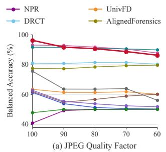

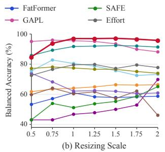

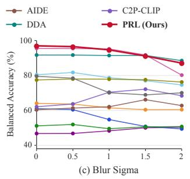  
Figure 4: Robustness to post-processing. Balanced accuracy on debiased GenImage-JPEG96 dataset, when every test image is JPEG-compressed at decreasing quality (a), resized by a scale factor (b) or blurred with a Gaussian of increasing σ (c).

Comparison on in-the-wild benchmarks. Table 3 covers images collected from the web, with unknown generators and post-processing. PRL is above 90% on all three benchmarks and on every one of their subsets; the gap to the best prior method is largest on Chameleon, where every method drops the most.

## 4.3 COMPARISON ON LOCALLY MANIPULATED IMAGES

We additionally evaluate on two benchmarks of locally manipulated images, in which a region of a real image is replaced by generated content, AutoSplice (Jia et al., 2023) and the ManipulationBench subset of DailyBench (Jiang et al., 2026), both described in Appendix B.

Table 4 reports balanced accuracy on AutoSplice at JPEG quality 100, 90 and 75. PRL reaches 86.45% at quality 100 and remains the best at 90 and 75; GAPL is the strongest prior detector at 82.62%, DDA reaches 73.09%, and most of the remaining methods stay near chance. Results on the ManipulationBench subset of DailyBench are given in Appendix D, where PRL again has the best average, 68.32% against 66.88% for DDA.

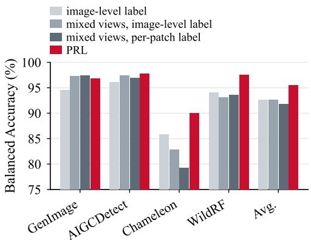  
(a) Form of supervision

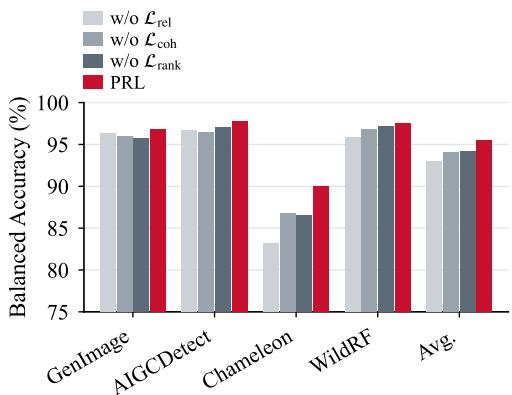  
(b) Effect of each module  
Figure 5: Ablation. Balanced accuracy (%) on GenImage, AIGCDetect, Chameleon and WildRF. (a) Three ways of using the aligned pairs: independent image-level label without and with the mixed views, the per-patch label on the mixed views, and the patch response. (b) PRL with one objective removed.

## 4.4 EVALUATION ON ROBUSTNESS

Figure 4 shows the results of three robustness evaluations on debiased GenImage-JPEG96 for all compared methods: JPEG compression at decreasing quality, resizing by a scale factor and Gaussian blur of increasing σ. PRL keeps the highest accuracy averaged over the fourteen degraded settings, 92.1% against 91.7% for GAPL and 90.6% for DDA. It is the best detector at every upscaling factor, staying above 95% up to a scale of 2 where GAPL falls to 88.2%, and it stays above 90% under blur up to σ = 1.5 and JPEG quality down to 80; at σ = 2 it remains within 1.6% of DDA while GAPL loses 15%. Under the two heaviest degradations, downscaling to half the size and JPEG quality below 80, it falls behind GAPL and DDA.

## 4.5 ABLATION STUDIES

We conduct the ablation on four representative benchmarks: two standard benchmarks, GenImage and AIGCDetect, and two in-the-wild benchmarks, Chameleon and WildRF. Figure 5 presents the results and Table 12 in Appendix E lists the detailed numbers. Figure 5a compares the aligned pairs under independent image-level labels, the mixed views built from the pairs but still under the image level label, a naive per-patch label on the mixed views, which ignores the contextual shift, and PRL. The mixed views by themselves change little, 92.68% against 92.65% on average, and lower Chameleon by 3.1%. The per-patch label gains slightly on GenImage but loses a further 3.6% on Chameleon. PRL raises the average to 95.55%, 2.9% above the image-level label and 3.7% above the per-patch label. The gain thus comes from how the mixed views are supervised, not from the views themselves, and a label per patch does worse in the wild than no patch label at all.

Figure 5b removes one objective at a time. Each removal costs between 1.4% and 2.5% on average and between 3.2% and 6.8% on Chameleon, $\mathcal { L } _ { \mathrm { r e l } }$ the most. The sensitivity to the three loss weights is reported in Appendix E.

Besides, we adapt DDA, the best previous method, to our backbone: starting from its official code, we replace its DINOv2 backbone by DINOv3 with the same LoRA adaptation and keep the rest of its pipeline. Table 13 in Appendix E shows the results. The backbone lifts DDA from 89.16% to 93.20% on average, while PRL on the same backbone reaches 95.67%.

## 5 CONCLUSION

In this paper, we study patch-level supervision on aligned pairs for AI-generated image detection. Recent methods mix the two images of a pair and label each patch of the mixed view by its source. We find that patches of different sources in a mixed view interact through self-attention, so the feature of each patch also carries information passed from patches of the other source. A per-patch label ignores this contextual shift and is therefore an imprecise target. Relative Patch Response Learning (PRL) instead compares the same patch across two mixed views of an aligned pair and learns from the change of its score. Source-unchanged patches respond to the shift alone, so PRL measures the source-changed patches against them, keeps each group of them moving as a whole, and ranks the two views by generated area. PRL surpasses the best prior methods by 4.3% and 5.9% in average balanced accuracy on eight standard and three in-the-wild benchmarks, respectively.

## REFERENCES

Quentin Bammey. Synthbuster: Towards detection of diffusion model generated images. IEEE Open Journal ofSignal Processing, 5:1–9, 2024.

Black Forest Labs, Stephen Batifol, Andreas Blattmann, Frederic Boesel, et al. FLUX.1 Kontext: Flow matching for in-context image generation and editing in latent space. arXiv preprint arXiv:2506.15742, 2025.

Bar Cavia, Eliahu Horwitz, Tal Reiss, and Yedid Hoshen. Real-time deepfake detection in the realworld. arXiv preprint arXiv:2406.09398, 2024.

Lucy Chai, David Bau, Ser-Nam Lim, and Phillip Isola. What makes fake images detectable? Understanding properties that generalize. In European Conference on Computer Vision (ECCV), 2020.

Baoying Chen, Jishen Zeng, Jianquan Yang, and Rui Yang. DRCT: Diffusion reconstruction contrastive training towards universal detection of diffusion generated images. In International Conference on Machine Learning (ICML), 2024.

Ruoxin Chen, Junwei Xi, Zhiyuan Yan, Ke-Yue Zhang, Shuang Wu, Jingyi Xie, Xu Chen, Lei Xu, Isabel Guan, Taiping Yao, and Shouhong Ding. Dual data alignment makes AI-generated image detector easier generalizable. In Advances in Neural Information Processing Systems (NeurIPS), 2025a.

Zhiyi Chen, Jinyi Ye, Beverlyn Tsai, Emilio Ferrara, and Luca Luceri. Synthetic politics: Prevalence, spreaders, and emotional reception of AI-generated political images on X. In ACM Conference on Hypertext and Social Media (HT), 2025b.

Beilin Chu, Xuan Xu, Xin Wang, Yufei Zhang, Weike You, and Linna Zhou. FIRE: Robust detection of diffusion-generated images via frequency-guided reconstruction error. In IEEE/CVF Conference on Computer Vision and Pattern Recognition (CVPR), 2025.

Riccardo Corvi, Davide Cozzolino, Giada Zingarini, Giovanni Poggi, Koki Nagano, and Luisa Verdoliva. On the detection of synthetic images generated by diffusion models. In IEEE International Conference on Acoustics, Speech and Signal Processing (ICASSP), 2023.

Davide Cozzolino, Giovanni Poggi, Riccardo Corvi, Matthias Nießner, and Luisa Verdoliva. Raising the bar of AI-generated image detection with CLIP. In IEEE/CVF Conference on Computer Vision and Pattern Recognition Workshops (CVPRW), 2024.

Aayush Dhakal, Subash Khanal, Srikumar Sastry, Jacob Arndt, Philipe Ambrozio Dias, Dalton Lunga, and Nathan Jacobs. SimLBR: Learning to detect fake images by learning to detect real images. In IEEE/CVF Conference on Computer Vision and Pattern Recognition (CVPR), 2026.

Prafulla Dhariwal and Alexander Nichol. Diffusion models beat GANs on image synthesis. In Advances in Neural Information Processing Systems (NeurIPS), 2021.

Patrick Esser, Sumith Kulal, Andreas Blattmann, Rahim Entezari, Jonas Muller, Harry Saini, Yam¨ Levi, Dominik Lorenz, Axel Sauer, Frederic Boesel, Dustin Podell, Tim Dockhorn, Zion English, and Robin Rombach. Scaling rectified flow transformers for high-resolution image synthesis. In International Conference on Machine Learning (ICML), 2024.

Stefan Feuerriegel, Renee DiResta, Josh A. Goldstein, Srijan Kumar, Philipp Lorenz-Spreen,´ Michael Tomz, and Nicolas Prollochs. Research can help to tackle AI-generated disinformation.¨ Nature Human Behaviour, 7:1818–1821, 2023.

Joel Frank, Thorsten Eisenhofer, Lea Schonherr, Asja Fischer, Dorothea Kolossa, and Thorsten¨ Holz. Leveraging frequency analysis for deep fake image recognition. In International Conference on Machine Learning (ICML), 2020.

Xinghe Fu, Zhiyuan Yan, Zheng Yang, Taiping Yao, Yandan Zhao, Shouhong Ding, and Xi Li. PiD: Generalized AI-generated images detection with pixelwise decomposition residuals. In International Conference on Machine Learning (ICML), 2025.

Patrick Grommelt, Louis Weiss, Franz-Josef Pfreundt, and Janis Keuper. Fake or JPEG? Revealing common biases in generated image detection datasets. In European Conference on Computer Vision Workshops (ECCVW), pp. 80–95, 2024.

Fabrizio Guillaro, Giada Zingarini, Ben Usman, Avneesh Sud, Davide Cozzolino, and Luisa Verdoliva. A bias-free training paradigm for more general AI-generated image detection. In IEEE/CVF Conference on Computer Vision and Pattern Recognition (CVPR), 2025.

Edward J. Hu, Yelong Shen, Phillip Wallis, Zeyuan Allen-Zhu, Yuanzhi Li, Shean Wang, Lu Wang, and Weizhu Chen. LoRA: Low-rank adaptation of large language models. In International Conference on Learning Representations (ICLR), 2022.

Shan Jia, Mingzhen Huang, Zhou Zhou, Yan Ju, Jialing Cai, and Siwei Lyu. AutoSplice: A textprompt manipulated image dataset for media forensics. In IEEE/CVF Conference on Computer Vision and Pattern Recognition Workshops (CVPRW), 2023.

Xin Jiang, Hao Tang, Junyao Gao, Zijie Yang, Meiqi Cao, Fei Shen, Dongming Zhang, Zechao Li, and Yongdong Zhang. DailyBench: A unified benchmark for AI-generated and manipulated images from modern generative models. arXiv preprint arXiv:2607.24016, 2026.

Dimitrios Karageorgiou, Symeon Papadopoulos, Ioannis Kompatsiaris, and Efstratios Gavves. Anyresolution AI-generated image detection by spectral learning. In IEEE/CVF Conference on Computer Vision and Pattern Recognition (CVPR), pp. 18706–18717, 2025.

Tero Karras, Samuli Laine, and Timo Aila. A style-based generator architecture for generative adversarial networks. In IEEE/CVF Conference on Computer Vision and Pattern Recognition (CVPR), 2019.

Diederik P. Kingma and Jimmy Ba. Adam: A method for stochastic optimization. In International Conference on Learning Representations (ICLR), 2015.

Christos Koutlis and Symeon Papadopoulos. Leveraging representations from intermediate encoderblocks for synthetic image detection. In European Conference on Computer Vision (ECCV), 2024.

Kai Li, Wenqi Ren, Wei Wang, and Xiaochun Cao. Detecting compressed AI-generated images via phase spectrum robustness. In IEEE/CVF Conference on Computer Vision and Pattern Recognition (CVPR), 2026a.

Ouxiang Li, Jiayin Cai, Yanbin Hao, Xiaolong Jiang, Yao Hu, and Fuli Feng. Improving synthetic image detection towards generalization: An image transformation perspective. In Proceedings of the ACM SIGKDD Conference on Knowledge Discovery and Data Mining (KDD), 2025.

Ouxiang Li, Yuan Wang, Xinting Hu, Huijuan Huang, Rui Chen, Jiarong Ou, Xin Tao, Pengfei Wan, Xiaojuan Qi, and Fuli Feng. Easier painting than thinking: Can text-to-image models set the stage, but not direct the play? In International Conference on Learning Representations (ICLR), pp. 86729–86758, 2026b.

Tsung-Yi Lin, Michael Maire, Serge Belongie, James Hays, Pietro Perona, Deva Ramanan, Piotr Dollar, and C. Lawrence Zitnick. Microsoft COCO: Common objects in context. In ´ European Conference on Computer Vision (ECCV), 2014.

Huan Liu, Zichang Tan, Chuangchuang Tan, Yunchao Wei, Jingdong Wang, and Yao Zhao. Forgeryaware adaptive transformer for generalizable synthetic image detection. In IEEE/CVF Conference on Computer Vision and Pattern Recognition (CVPR), 2024.

Zeyu Lu, Di Huang, Lei Bai, Jingjing Qu, Chengyue Wu, Xihui Liu, and Wanli Ouyang. Seeing is not always believing: Benchmarking human and model perception of AI-generated images. In Advances in Neural Information Processing Systems (NeurIPS), Datasets and Benchmarks Track, 2023.

Yunpeng Luo, Junlong Du, Ke Yan, and Shouhong Ding. LaRE2: Latent reconstruction error based method for diffusion-generated image detection. In IEEE/CVF Conference on Computer Vision and Pattern Recognition (CVPR), pp. 17006–17015, 2024.

Sophie J. Nightingale and Hany Farid. AI-synthesized faces are indistinguishable from real faces and more trustworthy. Proceedings of the National Academy of Sciences, 119(8):e2120481119, 2022.

Utkarsh Ojha, Yuheng Li, and Yong Jae Lee. Towards universal fake image detectors that generalize across generative models. In IEEE/CVF Conference on Computer Vision and Pattern Recognition (CVPR), 2023.

OpenAI. Addendum to GPT-4o system card: Native image generation. https://openai.com/ index/gpt-4o-image-generation-system-card-addendum/, 2025.

Jeongsoo Park and Andrew Owens. Community forensics: Using thousands of generators to train fake image detectors. In IEEE/CVF Conference on Computer Vision and Pattern Recognition (CVPR), pp. 8245–8257, 2025.

Xinyi Qi, Kai Ye, Chengchun Shi, Ying Yang, Jin Zhu, and Hongyi Zhou. A difference-in-difference approach to detecting AI-generated images. In IEEE/CVF Conference on Computer Vision and Pattern Recognition (CVPR), 2026.

Ziheng Qin, Yuheng Ji, Renshuai Tao, Yuxuan Tian, Yuyang Liu, Yipu Wang, and Xiaolong Zheng. Scaling up AI-generated image detection with generator-aware prototypes. In IEEE/CVF Conference on Computer Vision and Pattern Recognition (CVPR), 2026.

Anirudh Sundara Rajan, Utkarsh Ojha, Jedidiah Schloesser, and Yong Jae Lee. Aligned datasets improve detection of latent diffusion-generated images. In International Conference on Learning Representations (ICLR), 2025.

Jonas Ricker, Denis Lukovnikov, and Asja Fischer. AEROBLADE: Training-free detection of latent diffusion images using autoencoder reconstruction error. In IEEE/CVF Conference on Computer Vision and Pattern Recognition (CVPR), 2024.

Robin Rombach, Andreas Blattmann, Dominik Lorenz, Patrick Esser, and Bjorn Ommer. High-¨ resolution image synthesis with latent diffusion models. In IEEE/CVF Conference on Computer Vision and Pattern Recognition (CVPR), 2022.

Oriane Simeoni, Huy V. Vo, Maximilian Seitzer, Federico Baldassarre, Maxime Oquab, Cijo Jose, ´ Vasil Khalidov, Marc Szafraniec, Seungeun Yi, Michael Ramamonjisoa, et al. DINOv3.¨ arXiv preprint arXiv:2508.10104, 2025.

Chuangchuang Tan, Yao Zhao, Shikui Wei, Guanghua Gu, Ping Liu, and Yunchao Wei. Frequencyaware deepfake detection: Improving generalizability through frequency space domain learning. In AAAI Conference on Artificial Intelligence (AAAI), volume 38, pp. 5052–5060, 2024a.

Chuangchuang Tan, Yao Zhao, Shikui Wei, Guanghua Gu, Ping Liu, and Yunchao Wei. Rethinking the up-sampling operations in CNN-based generative network for generalizable deepfake detection. In IEEE/CVF Conference on Computer Vision and Pattern Recognition (CVPR), 2024b.

Chuangchuang Tan, Renshuai Tao, Huan Liu, Guanghua Gu, Baoyuan Wu, Yao Zhao, and Yunchao Wei. C2P-CLIP: Injecting category common prompt in CLIP to enhance generalization in deepfake detection. In AAAI Conference on Artificial Intelligence (AAAI), 2025.

Sheng-Yu Wang, Oliver Wang, Richard Zhang, Andrew Owens, and Alexei A. Efros. CNNgenerated images are surprisingly easy to spot... for now. In IEEE/CVF Conference on Computer Vision and Pattern Recognition (CVPR), 2020.

Zhendong Wang, Jianmin Bao, Wengang Zhou, Weilun Wang, Hezhen Hu, Hong Chen, and Houqiang Li. DIRE for diffusion-generated image detection. In IEEE/CVF International Conference on Computer Vision (ICCV), 2023.

Chenfei Wu, Jiahao Li, Jingren Zhou, et al. Qwen-Image technical report. arXiv preprint arXiv:2508.02324, 2025.

Haiwei Wu, Fengpeng Li, Zhilin Tu, Yuanman Li, Xiong Li, and Jiantao Zhou. Zero-shot detection of AI-generated image via RAW-RGB alignment. In IEEE/CVF Conference on Computer Vision and Pattern Recognition (CVPR), 2026.

Shilin Yan, Ouxiang Li, Jiayin Cai, Yanbin Hao, Xiaolong Jiang, Yao Hu, and Weidi Xie. A sanity check for AI-generated image detection. In International Conference on Learning Representations (ICLR), 2025a.

Zhiyuan Yan, Jiangming Wang, Peng Jin, Ke-Yue Zhang, Chengchun Liu, Shen Chen, Taiping Yao, Shouhong Ding, Baoyuan Wu, and Li Yuan. Orthogonal subspace decomposition for generalizable AI-generated image detection. In International Conference on Machine Learning (ICML), 2025b.

Kai-Cheng Yang, Danishjeet Singh, and Filippo Menczer. Characteristics and prevalence of fake social media profiles with AI-generated faces. Journal ofOnline Trust and Safety, 2(4), 2024.

Yongqi Yang, Zhihao Qian, Ye Zhu, Olga Russakovsky, and Yu Wu. D3: Scaling up deepfake detection by learning from discrepancy. In IEEE/CVF Conference on Computer Vision and Pattern Recognition (CVPR), pp. 23850–23859, 2025.

Zheng Yang, Ruoxin Chen, Zhiyuan Yan, Ke-Yue Zhang, Xinghe Fu, Shuang Wu, Xiujun Shu, Taiping Yao, Shouhong Ding, Zequn Qin, and Xi Li. All patches matter, more patches better: Enhance AI-generated image detection via panoptic patch learning. In International Conference on Learning Representations (ICLR), 2026.

Xiao Yu, Kejiang Chen, Kai Zeng, Han Fang, Zijin Yang, Xiuwei Shang, Yuang Qi, Weiming Zhang, and Nenghai Yu. SemGIR: Semantic-guided image regeneration based method for AI-generated image detection and attribution. In ACM International Conference on Multimedia (ACM MM), pp. 8480–8488, 2024.

Nan Zhong, Yiran Xu, Sheng Li, Zhenxing Qian, and Xinpeng Zhang. PatchCraft: Exploring texture patch for efficient AI-generated image detection. arXiv preprint arXiv:2311.12397, 2023.

Mingjian Zhu, Hanting Chen, Qiangyu Yan, Xudong Huang, Guanyu Lin, Wei Li, Zhijun Tu, Hailin Hu, Jie Hu, and Yunhe Wang. GenImage: A million-scale benchmark for detecting AI-generated image. In Advances in Neural Information Processing Systems (NeurIPS), Datasets and Bench marks Track, 2023.

## A IMPLEMENTATION DETAILS

Architecture. The frozen DINOv3 ViT-L/16 backbone is adapted with LoRA of rank 8 and scaling α = 1, applied in every transformer block to the query, key, value and output projections of selfattention and to the two projections of the MLP. The patch scoring head is a single linear layer on the final-layer patch tokens. The detection head is a gating MLP that assigns a weight to every token, aggregates the tokens with the normalized weights and maps the result to the image logit.

Data augmentation. At both training and inference, we center-crop every image to 336 × 336 pixels, and we resize an image to the input size instead when both its width and height exceed 1,024 pixels, so that the input covers the whole image. We apply the common augmentations in this field, such as random JPEG compression, Gaussian blur and colour jitter. Each augmentation is drawn once per pair and applied identically to both members, so that the alignment is preserved.

View sampling. For each training pair, with probability 0.5 we use the real image with two mixed views, and otherwise the real image with the synthetic image. Each mask replaces one axis-aligned rectangle of patches on the 21 × 21 patch grid of the encoder, so P = 441. The two masks of a pair share a base image, the real or the synthetic one with equal probability, and the rectangle takes its patches from the other image. For each mask, we draw the synthetic fraction uniformly from [0.1, 0.9] and the aspect ratio of the rectangle log-uniformly from [0.5, 2], resample until the two fractions differ, and place the rectangle uniformly at random among the positions where it fits.

## B BENCHMARKS

GenImage (Zhu et al., 2023) pairs ImageNet photographs with images from eight generators: ADM, BigGAN, Glide, Midjourney, Stable Diffusion v1.4 and v1.5, VQDM and Wukong.

AIGCDetectBenchmark (Zhong et al., 2023) collects seventeen subsets from GANs (ProGAN, StyleGAN, StyleGAN2, BigGAN, CycleGAN, StarGAN, GauGAN and the WFIR face set) and diffusion models (ADM, Glide, Midjourney, Stable Diffusion v1.4, v1.5 and XL, VQDM, Wukong and DALL-E 2), with real images drawn from LSUN, ImageNet, MSCOCO, CelebA and FFHQ.

DRCT-2M (Chen et al., 2024) generates images from MSCOCO with sixteen diffusion models. Ten text-to-image models (LDM, SD1.4, SD1.5, SD2.1, SDXL, SDXL-Refiner, SD-Turbo, SDXL-Turbo, LCM-SD1.5 and LCM-SDXL) are prompted by the MSCOCO captions, three ControlNet models are conditioned on the captions and Canny edges, and three inpainting models reconstruct the real images with an empty prompt and an all-zero mask (SDv1-DR, SDv2-DR and SDXL-DR). Every subset is paired with the shared real set.

DDA-COCO and EvalGEN (Chen et al., 2025a) are released with DDA. DDA-COCO reconstructs the MSCOCO validation images with six VAEs, including those of SD1.x, SD2.1, SDXL, SD3.5 and Flux, with frequency-level alignment to the real images. EvalGEN holds 2,765 images from five recent text-to-image generators (Flux, GoT, Infinity, OmniGen and NOVA) driven by GenEval prompts; it has no real counterpart, so we report accuracy on its synthetic images.

Synthbuster (Bammey, 2024) provides 1,000 images from each of nine generators (DALL-E 2, DALL-E 3, Firefly, Glide, Midjourney v5, Stable Diffusion 1.3, 1.4, 2 and XL).

ForenSynths (Wang et al., 2020) is the test set of CNNSpot, with thirteen subsets from CNNbased generators: ProGAN, StyleGAN, StyleGAN2, BigGAN, CycleGAN, StarGAN, GauGAN, CRN, IMLE, SITD, SAN, DeepFake and WFIR.

UnivFD (Ojha et al., 2023) extends the eleven ForenSynths subsets with eight diffusion and autoregressive subsets: Guided, three LDM variants, three Glide variants and DALL-E, nineteen subsets in total.

Chameleon (Yan et al., 2025a) collects about 26,000 real and generated images from the web. The generated images come from AI-art communities and passed a human perception test, every image is at least 448 × 448 pixels, and the generators are unknown.

SynthWildX (Cozzolino et al., 2024) holds 500 real and 1,500 generated images collected from X, attributed by the tags and annotations on the platform to DALL-E 3, Midjourney and Firefly, which form its three subsets.

WildRF (Cavia et al., 2024) collects real and generated images from Reddit, Facebook and X, one subset per platform, with unknown generators and varying resolutions, formats, compressions and editing transformations.

AutoSplice (Jia et al., 2023) replaces one object region of a real photograph by a DALL-E 2 inpainting guided by a text prompt, and releases the forged images at JPEG qualities 100, 90 and 75.

DailyBench (Jiang et al., 2026) collects edited versions of real images from LAION-Aesthetics; its ManipulationBench subset, which we use, contains edits by four open-source editors (FLUX-Fill with object masks or random rectangular masks, FLUX.2-klein-9B, Qwen-Image-Edit-2511 and Step1X-Edit-v1p2) and two proprietary ones (Nano Banana 2 and GPT-Image 2), mostly object removals and replacements.

## C COMPARED METHODS

UnivFD (Ojha et al., 2023) keeps the CLIP ViT-L/14 image encoder frozen and trains only a linear classifier on its features, arguing that a feature space not tuned to the training generator generalizes better.

FatFormer (Liu et al., 2024) adds forgery-aware adapters with a frequency branch to the CLIP image encoder and aligns the adapted image features with text prompts.

NPR (Tan et al., 2024b) models the relations between neighbouring pixels that up-sampling layers of generators leave behind and feeds them to a ResNet classifier.

DRCT (Chen et al., 2024) reconstructs both real and generated images with a diffusion model to obtain hard samples of the same content, labels every reconstruction as generated, and trains a detector with a classification and a contrastive loss.

C2P-CLIP (Tan et al., 2025) injects category-common prompts into the CLIP image encoder through the text encoder, so that the image features carry the concepts of real and generated images.

AIDE (Yan et al., 2025a) combines the highest- and lowest-frequency patches of an image, selected by DCT scoring and processed by a CNN, with the semantic features of CLIP; the paper also introduces the Chameleon benchmark.

AlignedForensics (Rajan et al., 2025) pairs every real image with its VAE reconstruction so that the two differ only in the traces of generation, and trains a detector on these aligned images.

Effort (Yan et al., 2025b) decomposes the weights of the CLIP encoder into orthogonal subspaces by singular value decomposition, freezes the principal subspace to preserve the pretrained knowledge and trains the residual subspace for detection.

SAFE (Li et al., 2025) feeds the high-frequency components of a discrete wavelet transform to a lightweight ResNet and pairs it with image transformations that preserve the traces of generation: cropping instead of resizing, colour jitter, random rotation and random masking.

DDA (Chen et al., 2025a) aligns generated images with real ones in both the pixel and the frequency domain: VAE reconstruction, high-frequency debias from the real image and pixel mixup.

Table 5: Comparison of balanced accuracy (%) on GenImage.
<table><tr><td>Method</td><td>ADM</td><td>BigGAN</td><td>Glide</td><td>Midjourney</td><td>SDv1.4</td><td>SDv1.5</td><td>VQDM</td><td>Wukong</td><td>Avg.</td></tr><tr><td>UnivFD CVPR&#x27;23</td><td>62.51</td><td>84.37</td><td>61.28</td><td>55.06</td><td>55.57</td><td>55.67</td><td>76.88</td><td>61.10</td><td>64.05</td></tr><tr><td>FatFormer CVPR&#x27;24</td><td>59.82</td><td>81.77</td><td>60.28</td><td>51.99</td><td>52.81</td><td>52.76</td><td>69.97</td><td>58.86</td><td>61.03</td></tr><tr><td>NPR CVPR&#x27;24</td><td>46.73</td><td>44.25</td><td>46.06</td><td>43.86</td><td>46.73</td><td>47.06</td><td>50.00</td><td>49.22</td><td>46.74</td></tr><tr><td>DRCTICML&#x27;24</td><td>60.74</td><td>58.38</td><td>67.86</td><td>88.68</td><td>99.37</td><td>99.21</td><td>70.03</td><td>99.10</td><td>80.42</td></tr><tr><td>C2P-CLIP AAAI&#x27;25</td><td>53.62</td><td>92.67</td><td>65.91</td><td>50.60</td><td>55.02</td><td>55.31</td><td>63.58</td><td>60.00</td><td>62.09</td></tr><tr><td>AIDEICLR&#x27;25</td><td>50.22</td><td>50.42</td><td>52.26</td><td>57.46</td><td>75.96</td><td>76.19</td><td>50.78</td><td>69.47</td><td>60.35</td></tr><tr><td>AlignedForensics ICLR&#x27;25</td><td>50.49</td><td>52.73</td><td>52.80</td><td>96.33</td><td>99.82</td><td>99.74</td><td>67.83</td><td>99.79</td><td>77.44</td></tr><tr><td>Effort ICML&#x27;25</td><td>69.75</td><td>51.60</td><td>83.43</td><td>76.37</td><td>96.03</td><td>95.82</td><td>73.24</td><td>90.17</td><td>79.55</td></tr><tr><td>SAFE KDD&#x27;25</td><td>50.41</td><td>51.84</td><td>53.73</td><td>49.89</td><td>50.55</td><td>50.54</td><td>51.01</td><td>51.15</td><td>51.14</td></tr><tr><td>DDA NeurIPS’25</td><td>89.55</td><td>86.52</td><td>89.58</td><td>95.60</td><td>98.72</td><td>98.55</td><td>76.58</td><td>98.78</td><td>91.74</td></tr><tr><td>GAPL CVPR&#x27;26</td><td>94.46</td><td>97.17</td><td>97.52</td><td>84.41</td><td>97.81</td><td>97.59</td><td>97.69</td><td>97.81</td><td>95.56</td></tr><tr><td>PRL (Ours)</td><td>94.40</td><td>91.55</td><td>95.02</td><td>96.73</td><td>99.33</td><td>99.25</td><td>99.05</td><td>99.36</td><td>96.83</td></tr></table>

Table 6: Comparison of balanced accuracy (%) on AIGCDetectBenchmark.
<table><tr><td>Method</td><td>ADM</td><td>BigGAN</td><td>CycleGAN</td><td>DALLE2</td><td>GauGAN</td><td>Glide</td><td>Midjourney</td><td>ProGAN</td><td>SDXL</td><td>SDv1.4 SDv1.5</td><td></td><td>StarGAN</td><td>StyleGAN</td><td>StyleGAN2</td><td>VQDM</td><td>WFIR</td><td>Wukong</td><td>Avg.</td></tr><tr><td>UnivFDCVPR&#x27;23</td><td>62.51</td><td>87.50</td><td>96.92</td><td>49.95</td><td>98.79</td><td>61.28</td><td>55.06</td><td>99.38</td><td>58.15</td><td>55.57</td><td>55.67</td><td>95.12</td><td>79.99</td><td>69.41</td><td>76.88</td><td>69.20</td><td>61.10</td><td>72.50</td></tr><tr><td>FatFormer CVPR&#x27;24</td><td>59.82</td><td>97.90</td><td>99.32</td><td>49.00</td><td>99.17</td><td>60.28</td><td>51.99</td><td>99.21</td><td>63.75</td><td>52.81</td><td>52.76</td><td>99.75</td><td>87.51</td><td>81.63</td><td>69.97</td><td>87.50</td><td>58.86</td><td>74.78</td></tr><tr><td>NPR CVPR&#x27;24</td><td>46.73</td><td>43.25</td><td>59.83</td><td>46.65</td><td>35.62</td><td>46.06</td><td>43.86</td><td>50.45</td><td>47.48</td><td>46.73</td><td>47.06</td><td>49.47</td><td>50.18</td><td>50.02</td><td>50.00</td><td>49.65</td><td>49.22</td><td>47.78</td></tr><tr><td>DRCTICML/24</td><td>60.74</td><td>52.45</td><td>48.83</td><td>68.25</td><td>49.45</td><td>67.86</td><td>88.68</td><td>53.02</td><td>80.65</td><td>99.37</td><td>99.21</td><td>54.38</td><td>54.45</td><td>53.74</td><td>70.03</td><td>50.15</td><td>99.10</td><td>67.67</td></tr><tr><td>C2P-CLIPAAAI&#x27;25</td><td>53.62</td><td>92.07</td><td>99.39</td><td>50.20</td><td>98.20</td><td>65.91</td><td>50.60</td><td>97.10</td><td>51.20</td><td>55.02</td><td>55.31</td><td>99.70</td><td>76.97</td><td>58.51</td><td>63.58</td><td>65.35</td><td>60.00</td><td>70.16</td></tr><tr><td>AIDEICLR&#x27;25</td><td>50.22</td><td>43.68</td><td>51.73</td><td>50.95</td><td>39.73</td><td>52.26</td><td>57.46</td><td>49.31</td><td>50.55</td><td>75.96</td><td>76.19</td><td>51.43</td><td>49.57</td><td>49.20</td><td>50.78</td><td>49.20</td><td>69.47</td><td>53.98</td></tr><tr><td>AlignedForensics ICLR&#x27;25</td><td>50.49</td><td>50.52</td><td>49.69</td><td>50.30</td><td>50.24</td><td>52.80</td><td>96.33</td><td>50.35</td><td>94.45</td><td>99.82</td><td>99.74</td><td>51.50</td><td>51.46</td><td>50.31</td><td>67.83</td><td>50.00</td><td>99.79</td><td>65.63</td></tr><tr><td>Effort ICML&#x27;25</td><td>69.75</td><td>73.60</td><td>81.49</td><td>79.15</td><td>62.52</td><td>83.43</td><td>76.37</td><td>70.08</td><td>86.88</td><td>96.03</td><td>95.82</td><td>96.02</td><td>56.42</td><td>47.67</td><td>73.24</td><td>70.35</td><td>90.17</td><td>77.00</td></tr><tr><td>SAFEKDD&#x27;25</td><td>50.41</td><td>48.95</td><td>52.58</td><td>50.05</td><td>42.60</td><td>53.73</td><td>49.89</td><td>49.96</td><td>49.93</td><td>50.55</td><td>50.54</td><td>49.95</td><td>49.99</td><td>49.99</td><td>51.01</td><td>49.10</td><td>51.15</td><td>50.02</td></tr><tr><td>DDA NeurIPS*25 GAPLCVPR&#x27;26</td><td>89.55</td><td>90.97</td><td>72.47</td><td>94.55</td><td>92.74</td><td>89.58</td><td>95.60</td><td>92.80</td><td>99.38</td><td>98.72</td><td>98.55</td><td>72.74</td><td>87.80</td><td>90.17</td><td>76.58</td><td>52.10 94.10</td><td>98.78 97.81</td><td>87.83</td></tr><tr><td></td><td>94.46</td><td>98.62</td><td>97.54</td><td>84.05</td><td>99.63</td><td>97.52</td><td>84.41</td><td>99.83</td><td>98.78</td><td>97.81</td><td>97.59</td><td>97.05</td><td>97.89</td><td>98.62</td><td>97.69</td><td></td><td></td><td>96.08</td></tr><tr><td>PRL (Ours)</td><td>94.40</td><td>99.28</td><td>97.37</td><td>96.55</td><td>99.55</td><td>95.02</td><td>96.73</td><td>98.99</td><td>99.55</td><td>99.33</td><td>99.25</td><td>99.25</td><td>98.21</td><td>98.19</td><td>99.05</td><td>91.65</td><td>99.36</td><td>97.75</td></tr></table>

GAPL (Qin et al., 2026) builds generator-aware prototypes from the principal components of the embeddings of a few generators and fine-tunes the CLIP ViT-L/14 encoder with LoRA so that image embeddings are mapped onto these prototypes. It is trained on the Community Forensics set (Park & Owens, 2025) of several thousand generators.

## D DETAILED BENCHMARK RESULTS

Tables 5, 6, 7, 8, 9 and 10 report the per-subset results on GenImage, AIGCDetect, Synthbuster, DRCT-2M, DDA-COCO and EvalGEN, and ForenSynths, which Table 1 and Section 4.2 summarize. PRL is above 98.8% on every DRCT-2M subset and above 99% on every EvalGEN generator; on DDA-COCO its two lowest subsets are the SD3.5 and Flux reconstructions. On ForenSynths, its margin over the alignment-based methods opens on every GAN generator, while the DeepFake, SITD and SAN subsets remain its hardest.

Table 11 reports balanced accuracy on the ManipulationBench subset of DailyBench (Section 4.3), with the rows of the other detectors, including the detector FPD proposed with the benchmark, as published by DailyBench. Most of the detectors it evaluates stay within a few points of chance on most editors. PRL has the best average, 68.32% against 66.88% for DDA and 63.41% for FPD, and the best result on the three FLUX-based editors, where every other detector except DDA is at chance. DDA is stronger on Qwen-Image-Edit and Step1X-Edit, and SAFE on GPT-Image 2.

Table 7: Comparison of balanced accuracy (%) on Synthbuster.
<table><tr><td>Method</td><td>DALL-E 2</td><td>DALL-E 3</td><td>Firefly</td><td>GLIDE</td><td>Midjourney</td><td>SD1.3</td><td>SD1.4</td><td>SD2</td><td>SDXL</td><td>Avg.</td></tr><tr><td>UnivFD CVPR&#x27;23</td><td>70.98</td><td>34.83</td><td>77.38</td><td>40.73</td><td>39.93</td><td>57.88</td><td>57.38</td><td>63.13</td><td>55.48</td><td>55.31</td></tr><tr><td>FatFormer CVPR&#x27;24</td><td>53.53</td><td>35.33</td><td>59.83</td><td>67.28</td><td>43.88</td><td>52.43</td><td>53.18</td><td>51.03</td><td>66.08</td><td>53.62</td></tr><tr><td>NPRCVPR&#x27;24</td><td>55.76</td><td>12.36</td><td>9.46</td><td>53.01</td><td>40.81</td><td>55.76</td><td>56.41</td><td>35.86</td><td>57.11</td><td>41.83</td></tr><tr><td>DRCTICML&#x27;24</td><td>47.54</td><td>53.39</td><td>48.59</td><td>60.19</td><td>89.29</td><td>94.09</td><td>94.09</td><td>90.79</td><td>79.39</td><td>73.04</td></tr><tr><td>C2P-CLIP AAAI*25</td><td>54.89</td><td>43.64</td><td>81.54</td><td>81.59</td><td>52.74</td><td>79.69</td><td>79.94</td><td>65.64</td><td>72.99</td><td>68.08</td></tr><tr><td>AIDEICLR&#x27;25</td><td>37.83</td><td>36.63</td><td>27.73</td><td>67.93</td><td>60.48</td><td>77.03</td><td>76.68</td><td>56.18</td><td>71.38</td><td>56.87</td></tr><tr><td>AlignedForensics ICLR&#x27;25</td><td>49.15</td><td>48.60</td><td>50.00</td><td>56.60</td><td>98.55</td><td>98.60</td><td>98.60</td><td>98.30</td><td>97.25</td><td>77.29</td></tr><tr><td>Effort ICML&#x27;25</td><td>67.88</td><td>79.28</td><td>56.08</td><td>78.98</td><td>77.23</td><td>81.63</td><td>81.68</td><td>77.88</td><td>80.48</td><td>75.68</td></tr><tr><td>SAFE KDD&#x27;25</td><td>64.27</td><td>16.22</td><td>16.57</td><td>58.47</td><td>63.02</td><td>65.72</td><td>65.42</td><td>59.32</td><td>65.77</td><td>52.75</td></tr><tr><td>DDA NeurIPS’25</td><td>81.79</td><td>85.44</td><td>87.39</td><td>71.94</td><td>88.94</td><td>88.34</td><td>88.14</td><td>88.79</td><td>88.94</td><td>85.52</td></tr><tr><td>GAPLCVPR&#x27;26</td><td>91.69</td><td>74.39</td><td>91.54</td><td>93.29</td><td>90.64</td><td>93.54</td><td>93.59</td><td>92.64</td><td>94.29</td><td>90.63</td></tr><tr><td>PRL (Ours)</td><td>97.65</td><td>97.85</td><td>93.40</td><td>94.85</td><td>97.85</td><td>97.85</td><td>97.85</td><td>97.85</td><td>97.85</td><td>97.00</td></tr></table>

Table 8: Comparison of balanced accuracy (%) on DRCT-2M.
<table><tr><td>Method</td><td>SDXL-Ref</td><td>SDXL-Ctrl</td><td>LCM-SDv1.5</td><td>LCM-SDXL</td><td>LDM</td><td>SD-Ctrl</td><td>SD-Turbo</td><td>SD2.1-Ctrl</td><td>SDXL-Turbo</td><td>SD2.1</td><td>SDv2-DR</td><td>SDv1-DR</td><td>SDv1.4</td><td>SDv1.5</td><td>SDXL-DR</td><td>SDXL</td><td>Avg.</td></tr><tr><td>UnivFDCVPR&#x27;23</td><td>54.30</td><td>72.80</td><td>53.48</td><td>65.20</td><td>81.27</td><td>66.26</td><td>55.25</td><td>63.97</td><td>52.42</td><td>56.08</td><td>52.56</td><td>56.47</td><td>55.16</td><td>54.78</td><td>52.18</td><td>62.04</td><td>59.64</td></tr><tr><td>FatFormer CVPR&#x27;24</td><td>48.60</td><td>61.06</td><td>48.61</td><td>49.97</td><td>52.93</td><td>49.97</td><td>48.59</td><td>50.20</td><td>48.54</td><td>48.56</td><td>53.71</td><td>54.98</td><td>48.55</td><td>48.55</td><td>51.78</td><td>48.55</td><td>50.82</td></tr><tr><td>NPRCVPR&#x27;24</td><td>47.72</td><td>57.20</td><td>49.16</td><td>47.72</td><td>48.85</td><td>48.11</td><td>48.28</td><td>48.57</td><td>48.07</td><td>48.50</td><td>50.78</td><td>52.60</td><td>48.84</td><td>48.77</td><td>53.03</td><td>47.76</td><td>49.62</td></tr><tr><td>DRCTICML&#x27;24</td><td>85.86</td><td>80.19</td><td>99.65</td><td>78.73</td><td>99.90</td><td>99.89</td><td>91.94</td><td>95.04</td><td>70.54</td><td>96.42</td><td>92.63</td><td>99.88</td><td>99.90</td><td>99.88</td><td>72.27</td><td>83.90</td><td>90.41</td></tr><tr><td>C2P-CLIP AAAI&#x27;25</td><td>50.92</td><td>72.09</td><td>50.67</td><td>53.56</td><td>63.61</td><td>57.02</td><td>51.07</td><td>54.28</td><td>50.44</td><td>50.95</td><td>50.91</td><td>55.89</td><td>51.88</td><td>51.64</td><td>50.68</td><td>52.98</td><td>54.29</td></tr><tr><td>AIDE ICLR&#x27;25</td><td>66.05</td><td>53.42</td><td>69.95</td><td>54.13</td><td>60.74</td><td>64.80</td><td>53.03</td><td>52.95</td><td>53.07</td><td>58.09</td><td>50.02</td><td>54.52</td><td>74.82</td><td>74.28</td><td>50.01</td><td>53.11</td><td>58.94</td></tr><tr><td>AlignedForensics ICLR&#x27;25</td><td>80.49</td><td>84.08</td><td>99.85</td><td>89.17</td><td>99.95</td><td>99.98</td><td>99.88</td><td>99.30</td><td>88.15</td><td>99.77</td><td>99.88</td><td>99.98</td><td>99.97</td><td>99.98</td><td>92.68</td><td>88.90</td><td>95.13</td></tr><tr><td>Effort ICML&#x27;25</td><td>64.81</td><td>65.94</td><td>74.96</td><td>69.65</td><td>49.99</td><td>68.00</td><td>64.20</td><td>62.27</td><td>58.91</td><td>84.89</td><td>54.37</td><td>64.80</td><td>85.73</td><td>85.66</td><td>54.10</td><td>70.49</td><td>67.42</td></tr><tr><td>SAFE KDD&#x27;25</td><td>50.11</td><td>55.28</td><td>50.13</td><td>49.94</td><td>50.22</td><td>49.96</td><td>49.97</td><td>50.04</td><td>49.95</td><td>49.97</td><td>50.35</td><td>50.22</td><td>50.01</td><td>50.02</td><td>50.67</td><td>49.92</td><td>50.42</td></tr><tr><td>DDA NeurIPS*25 GAPL CVPR26</td><td>97.47 96.57</td><td>99.45 95.55</td><td>96.98 98.44</td><td>98.60 94.99</td><td>99.32 99.21</td><td>98.96 98.27</td><td>98.31 95.48</td><td>99.24</td><td>95.53 93.61</td><td>98.54 97.07</td><td>99.47</td><td>99.18</td><td>99.06</td><td>99.06 97.88</td><td>98.11 84.34</td><td>98.18 94.33</td><td>98.47 95.23</td></tr><tr><td></td><td></td><td></td><td></td><td></td><td></td><td></td><td></td><td>96.33</td><td></td><td></td><td>90.29</td><td>93.34</td><td>97.94</td><td></td><td></td><td></td><td></td></tr><tr><td>PRL (Ours)</td><td>99.21</td><td>99.48</td><td>99.38</td><td>99.40</td><td>99.41</td><td>99.52</td><td>99.17</td><td>99.44</td><td>98.82</td><td>99.15</td><td>99.45</td><td>99.48</td><td>99.15</td><td>99.10</td><td>98.98</td><td>99.16</td><td>99.27</td></tr></table>

Table 9: Comparison of balanced accuracy (%) on DDA-COCO and of accuracy (%) on the synthetic images of EvalGEN.
<table><tr><td rowspan="2">Method</td><td colspan="7">DDA-COCO</td><td colspan="6">EvalGEN</td></tr><tr><td>VAE-ema</td><td>VAE-mse</td><td>SDXL</td><td>SD2.1</td><td>SD3.5</td><td>Flux</td><td>Avg.</td><td>Flux</td><td>GoT</td><td>Infinity</td><td>NOVA</td><td>OmniGen</td><td>Avg.</td></tr><tr><td>UnivFD CVPR&#x27;23</td><td>54.40</td><td>53.24</td><td>51.52</td><td>53.29</td><td>51.28</td><td>50.21</td><td>52.32</td><td>3.94</td><td>10.27</td><td>15.30</td><td>39.72</td><td>7.71</td><td>15.39</td></tr><tr><td>FatFormer CVPR&#x27;24</td><td>51.49</td><td>53.17</td><td>50.77</td><td>53.31</td><td>51.63</td><td>49.42</td><td>51.63</td><td>1.59</td><td>16.14</td><td>19.03</td><td>91.85</td><td>7.22</td><td>27.17</td></tr><tr><td>NPR CVPR&#x27;24</td><td>49.39</td><td>48.88</td><td>48.30</td><td>48.85</td><td>48.52</td><td>50.46</td><td>49.07</td><td>2.04</td><td>1.10</td><td>6.01</td><td>2.42</td><td>5.57</td><td>3.43</td></tr><tr><td>DRCTICML&#x27;24</td><td>83.31</td><td>76.99</td><td>62.49</td><td>76.82</td><td>51.47</td><td>50.24</td><td>66.89</td><td>36.26</td><td>49.59</td><td>63.40</td><td>49.68</td><td>55.70</td><td>50.93</td></tr><tr><td>C2P-CLIP AAAI&#x27;25</td><td>51.42</td><td>51.27</td><td>50.22</td><td>51.23</td><td>51.28</td><td>49.98</td><td>50.90</td><td>1.78</td><td>6.71</td><td>11.39</td><td>46.57</td><td>2.66</td><td>13.82</td></tr><tr><td>AIDEICLR&#x27;25</td><td>50.14</td><td>50.12</td><td>50.10</td><td>50.09</td><td>50.03</td><td>50.04</td><td>50.09</td><td>14.28</td><td>18.93</td><td>3.20</td><td>12.65</td><td>16.38</td><td>13.09</td></tr><tr><td>AlignedForensics ICLR&#x27;25</td><td>99.80</td><td>99.69</td><td>91.98</td><td>99.67</td><td>75.61</td><td>51.16</td><td>86.32</td><td>20.96</td><td>64.47</td><td>71.79</td><td>78.48</td><td>71.39</td><td>61.42</td></tr><tr><td>Effort ICML&#x27;25</td><td>52.63</td><td>52.34</td><td>52.14</td><td>52.40</td><td>51.67</td><td>50.09</td><td>51.88</td><td>85.56</td><td>99.17</td><td>92.98</td><td>95.67</td><td>98.66</td><td>94.41</td></tr><tr><td>SAFE KDD&#x27;25</td><td>50.35</td><td>50.39</td><td>50.21</td><td>50.42</td><td>50.07</td><td>50.25</td><td>50.28</td><td>1.00</td><td>0.48</td><td>1.88</td><td>0.59</td><td>1.56</td><td>1.10</td></tr><tr><td>DDANeurIPS&#x27;25</td><td>99.15</td><td>99.35</td><td>96.99</td><td>99.36</td><td>83.56</td><td>78.92</td><td>92.89</td><td>88.68</td><td>99.14</td><td>97.73</td><td>99.53</td><td>99.20</td><td>96.86</td></tr><tr><td>GAPL CVPR&#x27;26</td><td>89.60</td><td>88.93</td><td>78.36</td><td>88.90</td><td>70.95</td><td>58.85</td><td>79.27</td><td>90.76</td><td>97.46</td><td>98.39</td><td>97.59</td><td>96.31</td><td>96.10</td></tr><tr><td>PRL (Ours)</td><td>99.28</td><td>99.27</td><td>98.13</td><td>99.27</td><td>85.17</td><td>85.19</td><td>94.39</td><td>96.84</td><td>99.64</td><td>99.98</td><td>99.60</td><td>99.61</td><td>99.14</td></tr></table>

Table 10: Comparison of balanced accuracy (%) on ForenSynths.
<table><tr><td>Method</td><td>BigGAN</td><td>CRN</td><td>CycleGAN</td><td>DeepFake</td><td>GauGAN</td><td>IMLE</td><td>ProGAN</td><td>SAN</td><td>SITD</td><td>StarGAN</td><td>StyleGAN</td><td>StyleGAN2</td><td>WFIR</td><td>Avg.</td></tr><tr><td>UnivFD CVPR&#x27;23</td><td>87.50</td><td>55.67</td><td>96.92</td><td>69.39</td><td>98.79</td><td>68.11</td><td>99.38</td><td>58.22</td><td>62.22</td><td>95.12</td><td>79.99</td><td>69.41</td><td>69.20</td><td>77.69</td></tr><tr><td>FatFormer CVPR&#x27;24</td><td>97.90</td><td>69.32</td><td>99.32</td><td>86.03</td><td>99.17</td><td>69.45</td><td>99.21</td><td>62.10</td><td>80.83</td><td>99.75</td><td>87.51</td><td>81.63</td><td>87.50</td><td>86.13</td></tr><tr><td>NPR CVPR&#x27;24</td><td>43.25</td><td>0.00</td><td>59.83</td><td>33.30</td><td>35.62</td><td>0.00</td><td>50.45</td><td>48.40</td><td>22.22</td><td>49.47</td><td>50.18</td><td>50.02</td><td>49.65</td><td>37.88</td></tr><tr><td>DRCTICML&#x27;24</td><td>52.45</td><td>49.80</td><td>48.83</td><td>56.38</td><td>49.45</td><td>49.26</td><td>53.02</td><td>86.76</td><td>54.44</td><td>54.38</td><td>54.45</td><td>53.74</td><td>50.15</td><td>54.86</td></tr><tr><td>C2P-CLIP AAAI&#x27;25</td><td>92.07</td><td>92.75</td><td>99.39</td><td>91.85</td><td>98.20</td><td>97.68</td><td>97.10</td><td>74.20</td><td>87.22</td><td>99.70</td><td>76.97</td><td>58.51</td><td>65.35</td><td>87.00</td></tr><tr><td>AIDEICLR&#x27;25</td><td>43.68</td><td>19.96</td><td>51.73</td><td>45.54</td><td>39.73</td><td>19.38</td><td>49.31</td><td>51.37</td><td>30.56</td><td>51.43</td><td>49.57</td><td>49.20</td><td>49.20</td><td>42.36</td></tr><tr><td>AlignedForensics ICLR&#x27;25</td><td>50.52</td><td>49.95</td><td>49.69</td><td>52.69</td><td>50.24</td><td>49.91</td><td>50.35</td><td>61.87</td><td>50.56</td><td>51.50</td><td>51.46</td><td>50.31</td><td>50.00</td><td>51.47</td></tr><tr><td>Effort ICML&#x27;25</td><td>73.60</td><td>39.20</td><td>81.49</td><td>64.59</td><td>62.52</td><td>29.54</td><td>70.08</td><td>58.90</td><td>83.89</td><td>96.02</td><td>56.42</td><td>47.67</td><td>70.35</td><td>64.17</td></tr><tr><td>SAFEKDD&#x27;25</td><td>48.95</td><td>0.11</td><td>52.58</td><td>49.09</td><td>42.60</td><td>0.10</td><td>49.96</td><td>50.46</td><td>35.83</td><td>49.95</td><td>49.99</td><td>49.99</td><td>49.10</td><td>40.67</td></tr><tr><td>DDA NeurIPS&#x27;25</td><td>90.97</td><td>86.98</td><td>72.47</td><td>76.53</td><td>92.74</td><td>89.71</td><td>92.80</td><td>94.75</td><td>58.61</td><td>72.74</td><td>87.80</td><td>90.17</td><td>52.10</td><td>81.41</td></tr><tr><td>GAPL CVPR&#x27;26</td><td>98.62</td><td>67.85</td><td>97.54</td><td>84.88</td><td>99.63</td><td>67.12</td><td>99.83</td><td>96.58</td><td>82.50</td><td>97.05</td><td>97.89</td><td>98.62</td><td>94.10</td><td>90.94</td></tr><tr><td>PRL (Ours)</td><td>99.28</td><td>96.07</td><td>97.37</td><td>55.26</td><td>99.55</td><td>96.08</td><td>98.99</td><td>88.81</td><td>84.72</td><td>99.25</td><td>98.21</td><td>98.19</td><td>91.65</td><td>92.57</td></tr></table>

Table 11: Comparison of balanced accuracy (%) on the ManipulationBench subset of DailyBench; rows other than ours are as reported by DailyBench, including its own detector FPD.
<table><tr><td>Method</td><td>FLUX-Fill (rand.)</td><td>FLUX-Fill (obj.)</td><td>FLUX.2 -klein</td><td>Qwen- Edit</td><td>Step1X- Edit</td><td>Nano Banana 2</td><td>GPT- Image 2</td><td>Avg.</td></tr><tr><td>UnivFD CVPR&#x27;23</td><td>50.16</td><td>50.83</td><td>50.72</td><td>50.39</td><td>50.72</td><td>50.26</td><td>50.23</td><td>50.47</td></tr><tr><td>FatFormer CVPR&#x27;24</td><td>49.86</td><td>49.95</td><td>50.11</td><td>50.05</td><td>50.26</td><td>50.00</td><td>56.96</td><td>51.02</td></tr><tr><td>NPR CVPR&#x27;24</td><td>45.09</td><td>46.02</td><td>49.81</td><td>55.17</td><td>48.77</td><td>55.53</td><td>80.33</td><td>54.38</td></tr><tr><td>DRCTICML&#x27;24</td><td>51.00</td><td>50.86</td><td>50.56</td><td>52.17</td><td>50.13</td><td>57.21</td><td>63.99</td><td>53.70</td></tr><tr><td>AIDEICLR&#x27;25</td><td>51.13</td><td>50.65</td><td>49.63</td><td>58.63</td><td>57.54</td><td>54.43</td><td>60.43</td><td>54.63</td></tr><tr><td>AlignedForensics ICLR&#x27;25</td><td>50.51</td><td>50.44</td><td>50.42</td><td>73.18</td><td>50.43</td><td>64.14</td><td>56.96</td><td>56.58</td></tr><tr><td>Effort ICML&#x27;25</td><td>45.60</td><td>45.70</td><td>50.67</td><td>56.98</td><td>53.52</td><td>60.85</td><td>68.99</td><td>54.61</td></tr><tr><td>SAFEKDD&#x27;25</td><td>52.22</td><td>51.94</td><td>49.99</td><td>48.96</td><td>48.26</td><td>49.46</td><td>86.67</td><td>55.35</td></tr><tr><td>DDA NeurIPS’25</td><td>54.54</td><td>54.82</td><td>62.29</td><td>89.20</td><td>62.88</td><td>62.48</td><td>81.96</td><td>66.88</td></tr><tr><td>FPD arXiv’26</td><td>53.68</td><td>54.09</td><td>58.00</td><td>80.47</td><td>60.70</td><td>53.22</td><td>83.71</td><td>63.41</td></tr><tr><td>PRL (Ours)</td><td>62.58</td><td>65.89</td><td>64.86</td><td>81.18</td><td>58.12</td><td>59.94</td><td>85.69</td><td>68.32</td></tr></table>

## E MORE ABLATION STUDIES

Full ablation results. Table 12 lists the numbers behind Figure 5.

DDA on the same backbone. Table 13 compares DDA with its released DINOv2 backbone, DDA adapted to our DINOv3 backbone with the same LoRA, and PRL on the eleven benchmarks (Section 4.5).

Sensitivity to the loss weights. Figure 6 varies one loss weight at a time on the same four benchmarks, with the other two kept at their default values $( \lambda _ { \mathrm { { r e l } } } , \bar { \lambda _ { \mathrm { { c o h } } } } , \lambda _ { \mathrm { { r a n k } } } ) = ( 0 . 3 , 0 . 3 , 0 . 1 )$ . Setting a weight to zero reproduces the corresponding row of Table 12. PRL is robust to the choice of loss

Table 12: Ablation. Balanced accuracy (%) of the variants of Figure 5 on GenImage, AIGCDetect, Chameleon and WildRF. All rows use the same DINOv3 backbone with LoRA and the same aligned training pairs. Top: three ways of using the aligned pairs; bottom: PRL with one objective removed.
<table><tr><td>Method</td><td>GenImage</td><td>AIGCDetect</td><td>Chameleon</td><td>WildRF</td><td> $\mathbf { A v g } .$ </td></tr><tr><td>Image-level BCE on the aligned pairs</td><td>94.58</td><td>96.06</td><td>85.89</td><td>94.06</td><td>92.65</td></tr><tr><td>+ mixed views, image-level BCE</td><td>97.33</td><td>97.38</td><td>82.84</td><td>93.17</td><td>92.68</td></tr><tr><td>+ mixed views, per-patch label</td><td>97.45</td><td>96.92</td><td>79.29</td><td>93.62</td><td>91.82</td></tr><tr><td>PRL (Ours)</td><td>96.83</td><td>97.75</td><td>90.01</td><td>97.59</td><td>95.55</td></tr><tr><td>w/o  $\mathcal { L } _ { \mathrm { r e l } }$ </td><td>96.32</td><td>96.77</td><td>83.20</td><td>95.82</td><td>93.03</td></tr><tr><td>w/o  $\scriptstyle { \mathcal { L } } _ { \mathrm { c o h } }$ </td><td>96.05</td><td>96.43</td><td>86.83</td><td>96.89</td><td>94.05</td></tr><tr><td>w/o  $\mathcal { L } _ { \mathrm { r a n k } }$ </td><td>95.72</td><td>97.05</td><td>86.61</td><td>97.20</td><td>94.14</td></tr></table>

Table 13: DDA and PRL on the same backbone. Balanced accuracy (%) on the eleven benchmarks of Table 1 for the released DDA model (DINOv2), for DDA adapted from its official code to our DINOv3 backbone with LoRA, and for PRL, which uses the same backbone, adaptation and aligned pairs.
<table><tr><td rowspan="2">Method</td><td colspan="8">Standard Benchmarks</td><td colspan="3">In-the-Wild Benchmarks</td><td></td></tr><tr><td>GenImage</td><td>AIGCDetect DRCT-2M</td><td></td><td>DDA-COCO</td><td>EvalGEN</td><td>Synthbuster ForenSynths UnivFD</td><td></td><td></td><td>Chameleon</td><td>SynthWildX</td><td>WildRF</td><td> $\mathbf { A v g } _ { * }$ </td></tr><tr><td>DDA, released model (DINOv2)</td><td>91.74</td><td>87.83</td><td>98.47</td><td>92.89</td><td>96.86</td><td>85.52</td><td>81.41</td><td>82.58</td><td>82.41</td><td>90.87</td><td>90.20</td><td>89.16</td></tr><tr><td>DDA on DINOv3</td><td>97.93</td><td>96.09</td><td>99.04</td><td>95.98</td><td>99.40</td><td>88.77</td><td>87.50</td><td>85.52</td><td>91.82</td><td>89.01</td><td>94.17</td><td>93.20</td></tr><tr><td>PRL (Ours)</td><td>96.83</td><td>97.75</td><td>99.27</td><td>94.39</td><td>99.14</td><td>97.00</td><td>92.57</td><td>94.22</td><td>90.01</td><td>93.60</td><td>97.59</td><td>95.67</td></tr></table>

weights. The default is the best point on every axis, every nonzero weight in [0.1, 0.5] stays within 1.5% of it, and every setting remains above the image-level label.

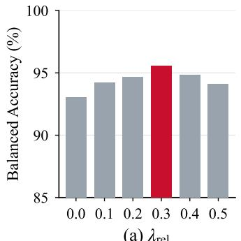  
(a) $\lambda _ { \mathrm { { r e l } } }$

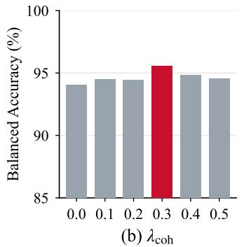

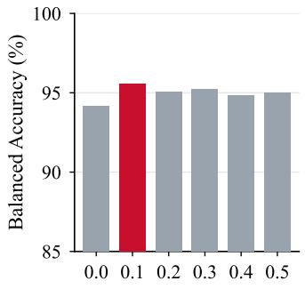  
(c) $\lambda _ { \mathrm { { r a n k } } }$  
Figure 6: Sensitivity to the loss weights. Mean balanced accuracy (%) over GenImage, AIGCDetect, Chameleon and WildRF when one weight varies and the other two keep their default values; the red bar is the default setting.