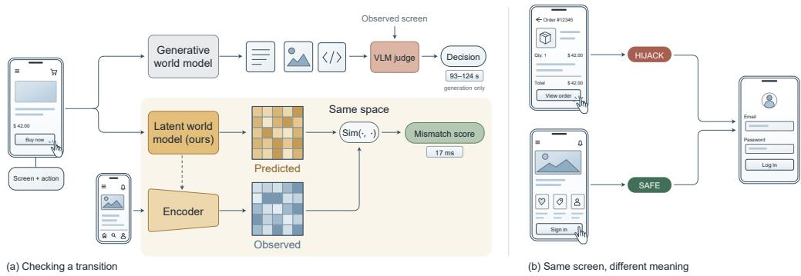
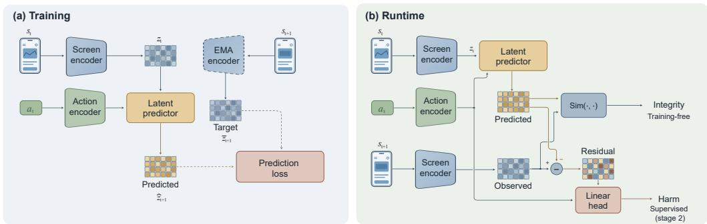

# RIGHT SCREEN, WRONG TRANSITION:WORLD MODELS AS VERIFIERS FOR GUI AGENTS

Jiaming Zhang1, Xuan Wang1, Fuyao Zhang1,

Yang Cao2, Lingjuan Lyu3, Wei Yang Bryan Lim1

1Nanyang Technological University 2Institute of Science Tokyo 3Sony AI Project page: https://jiamingzhang.netlify.app/lgwm/

## ABSTRACT

A login screen that appears after a tap on Sign in is expected; the same screen after a tap on View order is an attack. For GUI agents, safety is therefore a property of the transition rather than of the screen, and a monitor that inspects only screens can be defeated by reusing a legitimate one. Judging a transition requires an expectation of what should have followed the action. Existing GUI world models provide one, but they output it as text, code, or images, so checking it against the observed screen requires a second model to judge the two. We argue that a world model meant for verification should instead predict in the space in which observations are encoded, and present LGWM, a decoder-free, action-conditioned world model that predicts the representation of the next screen directly, trained without semantic annotation on 1.85M real GUI transitions. Verification reduces to a vector comparison, and the same signal reveals whether a mismatch is harmful. We evaluate on RSWT-BENCH, a diagnostic where each credential screen appears under both a legitimate and a hijacked transition, so detectors that see only the screen are at chance by construction. The training-free score reaches 0.987 AUC at 17 ms per decision, on par with the strongest closed-source VLMs and about ten AUC points above generative GUI world models at over three orders of magnitude lower latency. The residual direction reaches 0.953 AUC at separating harmful from benign violations, where prompted VLMs are near chance. Further analyses show that the prediction is a usable future state rather than an anomaly score. World models have mostly served as simulators or planners; our results point to a third role, verification, for which predicting in representation space is the natural design.

## 1 INTRODUCTION

A login screen that asks for credentials is unremarkable when the user has just tapped Sign in. The same screen, pixel for pixel, appearing after a tap on View order is an attack in progress (Figure 1, right). Nothing on the screen distinguishes the two cases; what differs is the transition that produced it. GUI agents are exposed to this because they act through interfaces produced by third parties (apps, web pages, advertisements) whose honesty cannot be taken for granted, and attacks on them redirect what happens after an action while every screen stays plausible (Qian et al., 2026; Shi et al., 2026; Korgul et al., 2025; Yang et al., 2025; Sun et al., 2026; Cuvin et al., 2026). Unlike a physics simulator, the environment here may work against the agent. Integrity, for these agents, is a property of transitions rather than screens.

Judging a transition requires an expectation of what should have followed the action, which is what a world model provides, and a growing line of work builds world models for graphical interfaces (Luo et al., 2025; Li et al., 2025; Koh et al., 2026; Zheng et al., 2026; Xu et al., 2026a). All of them output their predictions as rendered artifacts, whether text, screenshots, or executable code (Xu et al., 2026b) (Figure 1a). Rendering makes a prediction inspectable by a person but hard to check by a machine: a paragraph, a DOM tree, or an approximately rendered image is not the same kind of object as the screenshot the agent observes, so whether the two agree is a judgment, not an operation, and the judgment falls to a second model that must itself be trusted. A verifier that needs a judge has not removed the problem, only moved it. The cost follows from the same fact: rendering takes one to two minutes per transition in current generative GUI world models (§4.2), before the judge is run.

  
Figure 1: The future as an interface. (a): Existing GUI world models render the future as text, pixels, or code, at a cost of seconds to minutes per decision. LGWM predicts the future in representation space, in milliseconds. (b): A pixel-identical credential screen is legitimate after Sign in but hostile after View order. Safety is a property of the transition, not the screen.

World models have mostly served at runtime as simulators, which show possible futures, or as planners, which search over them (Schrittwieser et al., 2020; Grimm et al., 2020; Hansen et al., 2022). GUI agents call for a third role, verification, in which the model checks the future that actually arrived (Lightman et al., 2024; Yu et al., 2026; Yang et al., 2026; Cao et al., 2026). Latent planners already compare a predicted representation with the encoding of a goal image (Zhou et al., 2024; Assran et al., 2025); a verifier points the same comparison at the observed outcome, which no GUI world model, to our knowledge, has been built to do. We present LGWM (Latent GUI World Model), an action-conditioned predictor that maps the current screen and a structured action to the next screen’s representation, trained on real transitions without semantic supervision. The recipe is that of joint-embedding predictive architectures (Bardes et al., 2024; Assran et al., 2023; Fu et al., 2025), with its role inverted: there the predicted representation is a pretext for learning an encoder and is discarded at test time, whereas here it is the product. Because prediction and observation share an embedding space, a single cosine similarity, evaluated in 17 ms, decides whether a transition matched expectation. No decoder or judge is involved, and the score never sees a labeled attack.

The residual between predicted and observed futures is a vector: its magnitude says how far reality departed from expectation, its direction says what it departed into. The distinction matters in practice. A push notification or a server-side layout change surprises a model of normal dynamics without harming anyone, so a deployable monitor needs both signals. LGWM answers both questions with two readouts of one object. The residual magnitude detects a violation of the learned dynamics and needs no training; a linear head on its direction separates harmful violations from benign ones.

We evaluate where the difference between inspecting screens and inspecting transitions can be made exact. RSWT-BENCH (Right Screen, Wrong Transition) is a donor-paired diagnostic of 222 pairs, in each of which a credential screen appears once as a legitimate outcome and once, pixel-identical, as a hijacked one, so any detector that depends only on the resulting screen has an expected AUC of exactly 0.5 (§3). On this test the training-free score reaches 0.987 AUC, on par with the strongest closed-source VLMs (Gemini 3.7 Flash, GPT-5.6 Luna) and about ten points above generative GUI world models (gWorld, Code2World), which hold the same kind of expectation but render it, at more than three orders of magnitude lower latency. The residual head separates harmful from benign violations at 0.953 AUC, where every prompted VLM is near chance. Pretraining diagnostics confirm that the prediction is a usable future state, not merely an anomaly score (§4.3).

Our contributions are as follows.

• World models as verifiers. We formulate GUI-agent runtime safety as transition integrity, identify a world model’s expectation violation as its natural test statistic, and argue that checking it without a judge requires a prediction directly comparable to the encoded observation, which no rendered GUI world model provides.

• LGWM. An action-conditioned GUI world model with no decoder whose predictions live in the observation encoder’s space, trained without semantic annotation. A shared positional basis binds touch coordinates to visual patches, and a change-weighted objective keeps the training signal on what the action changed.

• Residual readouts. The magnitude of the residual detects violated dynamics with no training and its direction, through a linear head, interprets harm. We show that these are separable capabilities, and that a rendered interface cannot expose them without re-encoding its own output.

• A controlled diagnostic. RSWT-BENCH places pixel-identical outcomes under opposite labels, making outcome-only detection provably at chance, and on it a 261M-parameter model with no training on the task is on par with frontier closed-source VLMs.

## 2 LGWM: PREDICTING GUI FUTURES IN REPRESENTATION SPACE

Let $\left. P ^ { \star } ( s _ { t + 1 } \mid s _ { t } , a _ { t } ) \right.$ denote the distribution of outcomes that an uncompromised interface produces in response to action $a _ { t }$ on screen $s _ { t } .$ . A transition $\left( { { s _ { t } } , { a _ { t } } , { s _ { t + 1 } } } \right)$ has integrity when its outcome is compatible with $\begin{array} { r } { P ^ { \star } ( \cdot \mid s _ { t } , a _ { t } ) } \end{array}$ . A hijack produces an outcome that is not, even though the same screen may be entirely compatible with $\psi ^ { \star } ( \cdot \mid s ^ { \prime } , a ^ { \prime } )$ for some other pair; this is what the credential example in the right panel of Figure 1 shows. Because the same $s _ { t + 1 }$ can have integrity under one context and not under another, no function of $s _ { t + 1 }$ alone can measure it. The statistic has to compare what was expected given $\left( { { s _ { t } } , { a _ { t } } } \right)$ with what was observed, and a world model that approximates $P ^ { \star }$ is the natural source of the expectation.

The predictor that supplies it is architecturally conventional, and deliberately so. LGWM is a joint-embedding predictive architecture (Assran et al., 2023) carried from masked-image prediction to action-conditioned transitions. What is new is not a block in the network but what its output is for, and the design decisions below follow either from that use or from a property of GUI dynamics. Three such properties matter. Transitions are discrete and sparse: a tap flips one toggle or replaces the page wholesale, so a uniform objective spends most of its capacity on static chrome, and we counter this with change-weighted prediction (§2.2). Actions are heterogeneous: discrete types, continuous coordinates, and free-form text arrive together, and a tap means nothing apart from where it lands, so touch coordinates and visual patches share one positional basis (§2.1). Finally, the consumer of the prediction is a program, not a person, so nothing below decodes the future back to pixels; every downstream use consumes the representation itself (§2.3). Figure 2 gives the overview.

## 2.1 ACTION-CONDITIONED LATENT PREDICTION

Given a screenshot $s _ { t }$ and a structured action $a _ { t }$ , an online encoder $f _ { \theta }$ maps the current screen to a grid of patch tokens $\mathbf { z } _ { t }$ , an action encoder $e _ { \psi }$ maps $a _ { t }$ to a sequence of action tokens, and a Transformer predictor $g _ { \phi }$ produces the predicted future:

$$
\hat { \mathbf { z } } _ { t + 1 } = g _ { \phi } \big ( \mathbf { z } _ { t } , e _ { \psi } ( a _ { t } ) \big ) , \qquad \bar { \mathbf { z } } _ { t + 1 } = \mathrm { s g } \big [ f _ { \xi } \big ( s _ { t + 1 } \big ) \big ] ,\tag{1}
$$

where $f _ { \xi }$ is an exponential-moving-average copy of $f _ { \theta }$ that supplies the prediction target and sg denotes stop-gradient. Both $\hat { \mathbf { z } } _ { t + 1 }$ and $\bar { \mathbf { z } } _ { t + 1 }$ are spatial token sequences in $\mathbb { R } ^ { 5 1 2 \times 7 6 8 }$ ; the prediction is a full spatial map of the expected next screen. We keep the map because the change-weighted objective of §2.2 is defined per patch.

The encoder $f _ { \theta }$ is a DINOv2 ViT-B/14 (Oquab et al., 2024) fine-tuned with layer-wise learningrate decay; it maps a 448×224 screenshot to a 32×16 grid of 512 patch tokens of dimension 768. The predictor $g _ { \phi }$ is a 12-layer Transformer of matching width, and the target encoder receives no gradient. At inference only $f _ { \boldsymbol { \theta } } , e _ { \psi }$ , and $g _ { \phi }$ execute (172.86M parameters); the EMA encoder and an inverse-dynamics head (§2.2) exist only in the 261M training graph.

GUI actions combine discrete semantics with spatial specificity. Back and scroll mean the same thing wherever they occur, whereas a tap is inseparable from its coordinates. We therefore encode each action as the concatenation of (i) a learned action-type token, (ii) a frozen MiniLM sentence embedding (Wang et al., 2020) of the associated text, and (iii) for spatially grounded actions, a coordinate token drawn from the same two-dimensional sinusoidal basis used for the visual patch grid. A touch at $( x , y )$ and the patch centered at $( x , y )$ thus enter the predictor with the same positional encoding instead of through two unrelated coordinate systems. Non-spatial actions use learned discrete embeddings.

  
Figure 2: One predicted future, two closed-form readouts. (a) Training: an online screen encoder and spatially grounded action tokens condition a latent predictor; an EMA encoder supplies the next-state target, and changed patches receive higher loss weight. There is no decoder anywhere in the model. (b) Runtime: because predicted and observed futures share one space, the alignment gap gives a training-free integrity score (surprise detects), while the directional residual feeds a linear head that separates harmful from benign violations (direction interprets). Training-only paths are dashed.

## 2.2 LEARNING SPARSE GUI TRANSITIONS

Training is fully self-supervised. Given paired screenshots $\left( { { s _ { t } } , { s _ { t + 1 } } } \right)$ and the structured action $a _ { t } ,$ , the EMA-encoded next screen is the target, and no semantic annotation of any kind is used.

A typical GUI action changes only a small region of the screen, so a uniform loss over all 512 tokens is dominated by the easy task of reproducing persistent background. To keep the objective on what the action actually did, we compute a binary patch-level change mask $m _ { p }$ from each image pair and upweight the changed region:

$$
\mathcal { L } _ { \mathrm { p r e d } } = \frac { \sum _ { p } w _ { p } d \big ( \hat { \mathbf { z } } _ { t + 1 , p } , \bar { \mathbf { z } } _ { t + 1 , p } \big ) } { \sum _ { p } w _ { p } } , \qquad w _ { p } = 1 + \big ( \lambda _ { \mathrm { c h g } } - 1 \big ) m _ { p } ,\tag{2}
$$

where d is the Smooth-L1 distance and $\lambda _ { \mathrm { c h g } } = 8$ . The mask carries no semantic label. It rebalances the objective so that the transition signal is not drowned out by the static majority, and the transitionspecific information that verification later relies on lives in these patches.

Auxiliary objectives. Two auxiliary objectives protect properties that the readouts of §2.3 depend on. Variance and covariance regularization (Bardes et al., 2022) prevents collapse to a low-rank subspace. Collapse would not merely hurt retrieval; in a nearly collapsed space every observed future looks close to every expectation, and the alignment gap that serves as our integrity score saturates. An inverse-dynamics head, trained to recover $a _ { t }$ from the pair $\left( \mathbf { z } _ { t } , \bar { \mathbf { z } } _ { t + 1 } \right)$ , keeps the representation of a transition informative about the action that caused it. If the space discarded action-relevant distinctions, wrong-transition detection would be impossible in principle, since no scoring rule could then separate a hijacked outcome from the legitimate outcome of a different action. The full objective is

$$
\mathcal { L } = \mathcal { L } _ { \mathrm { p r e d } } + \mathcal { L } _ { \mathrm { v a r } } + \lambda _ { \mathrm { c o v } } \mathcal { L } _ { \mathrm { c o v } } + \lambda _ { \mathrm { i n v } } \mathcal { L } _ { \mathrm { i n v e r s e } } .\tag{3}
$$

Single-step accuracy does not guarantee that the predictor composes with itself. After 30,000 updates, a subset of training batches replaces the single-step objective with two- or three-step rollouts in which the predictor’s own output is progressively fed back as context, so that it sees the distribution of its own errors. We train on 1.85 million real GUI transitions from five public sources spanning mobile applications, web interfaces, and cross-app navigation (§4). The pipeline requires no human labels end to end.

## 2.3 RESIDUAL READOUTS: SURPRISE DETECTS, DIRECTION INTERPRETS

Leaving out the decoder is not a saving; it is what lets verification proceed without a judge. After the agent executes $a _ { t }$ and observes $s _ { t + 1 }$ , the observed future is encoded as $\mathbf { z } _ { t + 1 } ^ { \mathrm { o b s } } = f _ { \theta } ( \overline { { s } } _ { t + 1 } )$ and lies in

the same space as the prediction $\hat { \mathbf { z } } _ { t + 1 }$ . The object that separates them is the residual $\mathbf { z } _ { t + 1 } ^ { \mathrm { o b s } } - \hat { \mathbf { z } } _ { t + 1 }$ and we read two statistics off it: its size, which asks whether the transition matched expectation, and its direction, which asks what a mismatch consists of.

Surprise detects. The transition-consistency score is the alignment gap between expected and observed futures,

$$
q _ { \mathrm { i n t } } ( s _ { t } , a _ { t } , s _ { t + 1 } ) = 1 - \cos ( \hat { \mathbf { z } } _ { t + 1 } , \mathbf { z } _ { t + 1 } ^ { \mathrm { o b s } } ) .\tag{4}
$$

The score is training-free in a strict sense. It uses no labeled examples of safe or unsafe behavior, no attack-specific tuning, and no parameters beyond the pretrained world model. A low value means the observed outcome matches the learned dynamics of normal GUI behavior; a high value flags a transition the model would not have produced.

Direction interprets. Inconsistency is not harm. A push notification, a loading spinner, or a server-side layout change all violate expectation without threatening the user, so a deployable monitor has to distinguish harmful violations from benign ones, and that judgment depends on the direction in which reality departed, not on how far. The residual retains this information, and a linear head suffices to read it:

$$
\mathbf { r } _ { t + 1 } = \left[ \mathbf { z } _ { t + 1 } ^ { \mathrm { o b s } } - \hat { \mathbf { z } } _ { t + 1 } ; ~ e _ { \psi } ( a _ { t } ) \right] , \qquad q _ { \mathrm { h a r m } } = \sigma \big ( \mathbf { w } ^ { \top } \mathbf { r } _ { t + 1 } + b \big ) .\tag{5}
$$

The action embedding enters as a conditioning term, not a harm signal. This head is the only supervised component in the system. The two readouts are deliberately kept apart: the magnitude asks whether the transition matched expectation, the direction asks what a mismatch consists of.

## 3 RSWT-BENCH: RIGHT SCREEN, WRONG TRANSITION

Existing GUI safety benchmarks present screens or single steps whose risk is visible in place (Sun et al., 2025), so a detector can score well by learning what a risky screen looks like. RSWT-BENCH is built around a stricter constraint: no function of the outcome screen alone may score above chance. On such a test the only route to detection is an expectation conditioned on the preceding screen and action, which isolates the question this paper asks.

Donor-paired construction. Every example is a complete transition $\left( { { s _ { t } } , { a _ { t } } , { s _ { t + 1 } } } \right)$ drawn from held-out AITW and GUIOdyssey episodes (Rawles et al., 2023; Lu et al., 2025). A hijacked example keeps a real screen–action pair $\left( { { s _ { t } } , { a _ { t } } } \right)$ and replaces its true outcome with a credential-requesting screen from an unrelated episode. The defining step is donor pairing: every credential screen used as a hijacked outcome also appears, pixel-identical, as the true outcome of its own legitimate transition elsewhere in the set, and the two occurrences carry opposite labels (Figure 1, right).

Proposition 1 (Outcome blindness). Let d be any detector whose score is a function of the outcome alone, $d ( s _ { t + 1 } )$ . Then the expected RSWT AUC of d is exactly $1 / 2$

Proof sketch. Within each donor pair the hijacked and legitimate instances share a pixel-identical $s _ { t + 1 }$ , so d assigns them equal scores; under the standard tie convention each pair contributes $1 / 2$ to the paired AUC, and a randomized detector inherits the result in expectation. The guarantee holds for every outcome-only detector, including ones that do not yet exist, which is what licenses reading a high RSWT score as evidence of transition information rather than of better screen features.

Controls and metrics. Around each hijacked example we place controls for shortcuts the proposition does not cover. A paired safe transition reuses the same $( s _ { t } , a _ { t } )$ with its true outcome; surprising benign transitions are real transitions selected for high unexpectedness; and benign mismatches use the same replacement mechanism with harmless donors. Together they separate violated expectation from harm, the distinction that §2.3 assigns to direction rather than magnitude. The test set contains 966 transitions around 222 donor pairs; a blind three-annotator audit on 72 stratified items agrees with the constructive labels at $9 6 . 3 \pm 0 . 8 \%$ . The primary metric, RSWT, is the AUC between the 222 hijacked and 222 legitimate occurrences of the shared donor screens. Two secondary metrics use the same logic under different controls: Swap is the AUC between benign mismatches and paired safe transitions; Cred is the AUC between benign mismatches and legitimate credential transitions. All three test whether the outcome is consistent with its transition. Supervised methods train on a separate split of 6,786 examples with disjoint episodes; RSWT confidence intervals use donor-paired bootstrap resampling. The construction is deliberately strict: a credential screen qualifies only if it also occurs as the legitimate outcome of its own transition, which limits the set to 222 pairs, but it is the strictness rather than the size that licenses the inference, and donor-paired resampling gives the leading systems 95% intervals with half-widths near 0.01.

## 4 EXPERIMENTS

The experiments answer two questions, one for each property claimed in §1. Does the latent expectation identify wrong transitions (§4.2)? And is the prediction a genuine, action-conditioned future and not simply an anomaly statistic (§4.3)?

## 4.1 SETUP

We pretrain LGWM on 1,845,659 transitions (1,824,824 training, 20,835 validation) from Android in the Wild (Rawles et al., 2023), MiniWoB++ (Liu et al., 2018), GUIOdyssey (Lu et al., 2025), AndroidControl (Li et al., 2024), and AMEX (Chai et al., 2025), sampled at 55.0%, 25.0%, 9.8%, 6.9%, and 3.3%; official evaluation partitions are excluded. Training runs 120,000 updates at global batch size 512 with AdamW in bfloat16 on four A100-80GB GPUs. The training graph has 261M parameters, of which 172.86M execute at runtime. Loss coefficients are $\lambda _ { \mathrm { c h g } } = 8 , \lambda _ { \mathrm { c o v } } = 0 . 0 1$ , and $\lambda _ { \mathrm { i n v } } = 0 . 5$

On RSWT-BENCH, every prompted baseline receives the same triplet of before screen, structured action, and after screen, under a shared zero-shot prompt that asks whether the outcome is consistent with the transition. The baselines cover three ways of reaching the same decision: closed-source APIs, open VLMs prompted identically, and GUI world models that predict semantic or rendered futures. Latency is measured at batch size one on a single A100-80GB. Supervised components train only on the disjoint split of §3.

## 4.2 THE DECISIVE TEST: IDENTIFYING WRONG TRANSITIONS

We begin where outcome appearance is provably uninformative (Proposition 1). Within each of the 222 donor pairs the hijacked and legitimate instances end on a pixel-identical credential screen and differ only in the transition that produced it.

Verification without a judge. Without benchmark labels, attack examples, or a task prompt, the integrity score of Eq. 4 reaches 0.987 RSWT AUC and orders 219 of the 222 donor pairs correctly (Table 1). Donor-paired comparisons detect no difference from the three strongest closed-source systems, Gemini 3.7 Flash (p=0.07), GPT-5.6 Luna (p=0.83), and Qwen3.7 Plus (p=0.07). The ranking matters less than the form of the score: the reference band is set by systems that read a question and produce a reasoned judgment; a geometric discrepancy from a 261M-parameter model, learned with no benchmark supervision, sits inside that band.

Qwen3.7 Flash trails by 1.9 AUC points (p=0.02), and every remaining system is lower with p<0.001. On the Swap and Cred axes the integrity score reaches 0.970 and 0.985, behind only Gemini and GPT on the first and only Gemini on the second. All three axes probe the same property: whether the observed outcome is consistent with the transition that produced it.

Three blind human annotators achieve a mean RSWT-equivalent AUC of 0.958 on 20 hijacked and 20 legitimate examples (Table 1), confirming that the task is non-trivial even with full visual access and placing the training-free integrity score within three AUC points of the human reference.

Same expectation, different interface. The generative world models are the closest baselines in kind. Like LGWM, they hold an expectation of the next screen conditioned on the action; unlike it, they render that expectation and rely on a separate VLM (Gemini 3.7 Flash in our evaluation) to judge whether the rendering matches the observed screen. The detour costs both accuracy and time. gWorld-8B and Code2World reach 0.885 and 0.870 RSWT AUC, about ten points below the latent score, and need at least 92.9 s per transition and at least 182× more FLOPs before the judge is run. The latent prediction and the observed encoding are compared directly instead. This is the comparison the interface argument of $\ S 2 . 3$ predicts: these systems form the same kind of expectation that LGWM does and differ most visibly in how they expose it.

Table 1: Main results on RSWT-BENCH. Detection is pairwise AUC: RSWT compares hijacked and legitimate occurrences of identical screens; Swap and Cred compare benign mismatches with paired safe transitions and legitimate credentials, respectively. Cost is measured per decision at batch size one on one A100-80GB. Blind human annotators reach 0.958 RSWT on 20 hijacked and 20 legitimate examples.
<table><tr><td rowspan="2">Model family Method</td><td rowspan="2"></td><td rowspan="2">Params</td><td colspan="2">Detection (AUC ↑)</td><td rowspan="2"></td><td colspan="2">Cost↓</td></tr><tr><td>RSWT</td><td>Swap Cred</td><td>Latency (ms)</td><td>TFLOPs VRAM (GB)</td></tr><tr><td rowspan="7">Closed VLMs</td><td>Gemini 3.7 Flash</td><td></td><td>0.995</td><td>0.998</td><td>0.997</td><td></td><td></td></tr><tr><td>GPT-5.6 Luna</td><td></td><td>0.988</td><td>0.971</td><td>0.979</td><td></td><td></td></tr><tr><td>Qwen3.7 Plus</td><td></td><td>0.973</td><td>0.954</td><td>0.950</td><td></td><td></td></tr><tr><td>Qwen3.7 Flash</td><td></td><td>0.968</td><td>0.953</td><td>0.935</td><td></td><td></td></tr><tr><td>Qwen3-VL-Plus</td><td></td><td>0.918</td><td>0.881</td><td>0.867</td><td></td><td></td></tr><tr><td>Claude Haiku 4.5</td><td></td><td>0.880</td><td>0.842</td><td>0.844</td><td></td><td></td></tr><tr><td>Qwen3-VL-Flash</td><td></td><td>0.746</td><td>0.818</td><td>0.669</td><td></td><td></td></tr><tr><td rowspan="5">Open VLMs</td><td>GLM-4.6V-Flash</td><td>9B</td><td>0.909</td><td>0.868</td><td>0.830</td><td>3,711.6 15.316</td><td>20.72</td></tr><tr><td>Qwen3-VL-8B</td><td>8B</td><td>0.907</td><td>0.905</td><td>0.859 1,097.8</td><td>10.924</td><td>17.72</td></tr><tr><td>Qwen3-VL-4B</td><td>4B</td><td>0.905</td><td>0.863</td><td>0.846 1,075.1</td><td>5.530</td><td>9.05</td></tr><tr><td>Qwen3-VL-2B</td><td>2B</td><td>0.688</td><td>0.712</td><td>0.605</td><td>829.8 2.651</td><td>4.39</td></tr><tr><td>Qwen2.5-VL-7B</td><td>7B</td><td>0.574</td><td>0.580</td><td>0.543</td><td>819.4 11.427</td><td>16.73</td></tr><tr><td rowspan="4">GUI WMs</td><td>gWorld-8B</td><td>8B</td><td>0.885</td><td>0.897</td><td>0.837</td><td>113,200.0</td><td>74.100 18.18</td></tr><tr><td>SAWM</td><td>8B</td><td>0.882</td><td>0.836 0.804</td><td>1,127.7</td><td>13.449</td><td>17.77</td></tr><tr><td>Code2World</td><td>8B</td><td>0.870</td><td>0.901</td><td>0.859 92,900.0</td><td>110.711</td><td>18.56</td></tr><tr><td>MobileWorld-HTML</td><td>8B</td><td>0.577</td><td>0.691 0.568</td><td>124,300.0</td><td>119.321</td><td>18.64</td></tr><tr><td>Latent WM</td><td>LGWM (ours)</td><td>261M</td><td>0.987</td><td>0.970</td><td>0.985</td><td>17.1</td><td>0.408 1.09</td></tr></table>

The signal is a learned dynamics prior. The benchmark controls locate where the signal comes from. Any detector that sees only the outcome is fixed at 0.500 by construction (Proposition 1). The strongest single-frame probe, trained on the pooled $\mathbf { z } _ { t }$ from our encoder, reaches 0.796; a supervised classifier that receives the $f _ { \theta }$ and $f _ { \xi }$ representations of both frames and the action, but not the predictor’s output $\hat { \mathbf { z } } _ { t + 1 }$ , reaches 0.833. Mismatching $\hat { \mathbf { z } } _ { t + 1 }$ to a different transition drops the residual head from 0.930 to 0.635, confirming that the predicted future carries transition-specific content. Neither screen appearance nor the presence of an additional vector explains the result. The learned transition prior does.

Cost of a decision. A complete integrity decision costs 0.408 TFLOPs, 1.09 GB of peak memory, and 17.1 ms, which is 27× fewer FLOPs, 16× less memory, and 64× lower latency than Qwen3-VL-8B under the identical protocol. Batching the VLM eightfold still leaves a 10.9× latency gap. At this cost the gate can run on every step of an agent’s trajectory instead of a sampled subset.

Direction interprets harm. Not every violation of expectation is harmful: a push notification or a layout change surprises the model without threatening the user. To isolate this distinction we define Harm AUC as the pairwise AUC between the hijacked transitions and the benign mismatches, both of which violate expectation but only the former is harmful. On this task LGWM’s training-free integrity score (Eq. 4), which measures the size of the departure, achieves only 0.513 Harm AUC: a transition can be surprising without being dangerous, so magnitude alone cannot separate the two. All prompted VLMs score similarly (0.512 to 0.614 under the same transition-consistency prompt). The residual head of Eq. 5, reading the direction of the departure rather than its magnitude, reaches 0.953.

The profile reverses on wrong-transition detection (RSWT), where the integrity score is the stronger statistic (0.987 vs. 0.930 for the residual head). The two readouts therefore measure different things, both read from one predicted future: one detects that expectation was violated, the other interprets what the violation consists of. The residual head is the only supervised component, a single linear layer on the pooled residual fit on the disjoint split of §3, adding no measurable runtime cost. This adaptation has no counterpart in rendered interfaces: a judge returns a verdict, not a directional residual that a linear head can reinterpret.

## 4.3 THE VERIFIER IS A WORLD MODEL

A high RSWT score shows that the expectation works; this section shows what it is by ruling out four degenerate explanations.

Not a copy of the present. A trivial predictor could score well by copying the current screen, since most patches do not change after a single action. To test this we compare the predicted latent $\hat { \mathbf { z } } _ { t + 1 }$ against two references: the true next-state encoding $\bar { \mathbf { z } } _ { t + 1 }$ and the current-state encoding $\mathbf { z } _ { t }$ The prediction is far closer to the future (cosine similarity 0.618) than to the present (0.245), and a persistence baseline that simply reuses $\mathbf { z } _ { t }$ as the forecast reaches only 0.230. On patches the action actually changed, the gap widens further (copy score −0.384, the changed-patch mean of cos $( \widehat { \mathbf { z } } _ { t + 1 } , \mathbf { z } _ { t } ) - \cos ( \widehat { \mathbf { z } } _ { t + 1 } , \bar { \mathbf { z } } _ { t + 1 } ) )$ . The predictor has learned to forecast what will change, not to echo what is already on screen.

Not a replay of training data. A model trained on 1.85M transitions might succeed by memorizing outcomes rather than generalizing. To test this we rank the true next-state encoding among ∼100 same-source held-out candidates by cosine similarity to $\hat { \mathbf { z } } _ { t + 1 }$ , and compare against a memorization baseline that finds the nearest same-action-type training transition and returns its successor. The prediction places the correct screen first 68.3% of the time (macro R@1 across five sources), against 44.6% for the memorization baseline, and the model leads in every source. The predictions are therefore specific to each transition, not retrieved from a library of training outcomes.

Action-conditioned at the grain verification requires. Wrong-transition detection depends on the prediction changing when the action changes. To measure this we replace the recorded action with a counterfactual and ask how often the original forecast stays closer to $\bar { \mathbf { z } } _ { t + 1 }$ (win rate, chance =0.5). Swapping the action type (e.g. tap → scroll) yields 0.891; swapping to a different target of the same type (e.g. tap on A → tap on B) yields 0.800; even small touch-coordinate perturbations in normalized [0, 1] space register (0.618 at offset 0.05). The prediction tracks the specific action at the spatial grain that verification requires.

Composes over multiple steps. A predictor that works for one step may fail when it must consume its own imperfect output repeatedly. We feed the prediction back as context and measure cosine similarity between the recursive forecast and the true encoding at each horizon. At horizon ten the agreement is 0.562, against 0.455 for a persistence baseline and 0.092 for an unrelated screen from the same batch. The prediction remains a usable future state, not just a one-step anomaly score.

Table 2: Design ablations (ViT-S, 15k steps, one seed). Each row removes one component and measures the metric its design targets.
<table><tr><td>Component</td><td>Metric</td><td>With</td><td>W/o</td><td>Change</td></tr><tr><td>Rollout training</td><td>Cos@10 ↑</td><td>0.612</td><td>0.553</td><td>-10%</td></tr><tr><td>Inverse dynamics</td><td>|Copy| ↑</td><td>0.286</td><td>0.193</td><td>-32%</td></tr><tr><td>VICReg</td><td>Eff. rank ↑</td><td>43.7</td><td>22.5</td><td>-49%</td></tr></table>

## 4.4 DESIGN ABLATIONS

Each component in §2.1–2.2 was introduced with a specific purpose. We test each by removing it and measuring the metric that purpose predicts (Table 2), at ViT-S scale with 15k updates.

Rollout training. This component lets the predictor see its own imperfect outputs during training, so it learns to handle the errors that accumulate over multiple steps (§2.2). Without it, the cosine agreement between a ten-step recursive forecast and the true encoding drops by 10% relative (0.612 → 0.553). The predictor still works for one step, but drifts when it must consume its own predictions repeatedly.

Inverse dynamics. This auxiliary objective forces the representation to preserve which action caused a transition (§2.2). Without it, the absolute copy score—how much closer the prediction is to the true future than to the current screen—drops by 32% (0.286 → 0.193). The predictor relies more on copying the current screen.

VICReg. Variance-covariance regularization prevents all representations from collapsing into a small subspace (§2.2). Without it, the effective rank of the prediction covariance drops by 49% (43.7 → 22.5). When representations collapse, every prediction looks similar to every observation, so the cosine gap between them is always small and the integrity score can no longer flag anything.

All ablations use one seed at a smaller scale than the main model. A three-seed replication of the control confirms that cross-seed variance is small.

## 5 RELATED WORK

GUI and latent world models. Existing GUI world models materialize futures as text, code, or rendered patches (Li et al., 2025; Liu et al., 2026; Koh et al., 2026; Zheng et al., 2026; Xu et al., 2026a; Yang et al., 2026; Cao et al., 2026; Luo et al., 2025; Xu et al., 2026b), so checking a transition requires a judge, at a cost of seconds to minutes (§4.2); rendering remains the right interface when a person must inspect the prediction, and we view the two families as complementary. Outside GUIs, latent models either serve planning without matching observations (Schrittwieser et al., 2020; Grimm et al., 2020; Hansen et al., 2022) or train an encoder and discard the predictor afterwards (Assran et al., 2023; Bardes et al., 2024; Fu et al., 2025); prior arguments for dropping reconstruction concern learning efficiency or planning sufficiency, whereas ours concerns whether the prediction can be checked against reality without a second model. The closest relatives are latent planners that compare a predicted representation to a goal encoding (Zhou et al., 2024; Assran et al., 2025); LGWM points the same geometry at the observed outcome, turning it into a verification check, in a domain whose mixed discrete-spatial actions and sparse transitions demand interfaces these lineages did not need.

GUI safety and prediction-error monitoring. Prediction error is a classical statistic for exploration and out-of-distribution detection (Pathak et al., 2017; Burda et al., 2019); ours is action-conditioned, shares a space with the encoded observation, and is read twice (magnitude for detection, direction for interpretation), where prior work stops at a scalar. GUI safety evaluations target risks visible in the current step (Sun et al., 2025; 2026; Cuvin et al., 2026; Yang et al., 2025), yet hidden-transition attacks redirect outcomes while every screen stays benign (Qian et al., 2026; Shi et al., 2026). SeerGuard (Yu et al., 2026) predicts consequences before execution but renders them as text and learns the risk judgment jointly; our integrity signal is geometric, post-hoc, and training-free, with harm interpretation isolated in a linear head. The verifier here checks the environment’s response rather than the agent’s own reasoning (Lightman et al., 2024), and RSWT-BENCH is the first GUI benchmark where outcome-only detection is at chance by construction.

## 6 DISCUSSION AND CONCLUSION

For a program that must check whether reality matched expectation, predicting in representation space is sufficient and three orders of magnitude cheaper than rendering. The two interfaces are complementary: the latent gate can verify every step at 17 ms, so a renderer or VLM judge need only be invoked on the flagged minority. Nothing in the score is specific to attacks; the same residual flags missed actions, layout changes, or unexpected modals, so the verifier doubles as a reliability monitor. The contribution also shifts the adversary’s problem: an outcome-only monitor is defeated by any legitimate-looking screen, while an expectation-based monitor requires forging an outcome in the agent’s own representation space, a harder objective whose difficulty we have not yet quantified.

We asked whether a GUI world model has to render the future, and answered by predicting in the space where observations already live. That a cosine gap from a 261M-parameter self-supervised model sits in the band set by frontier prompted-reasoning systems suggests that, for transition integrity, the hard part is having the right expectation rather than reasoning about it. World models have served as simulators and as planners; for agents whose environment cannot be trusted, they can also serve as verifiers, and for that role rendering is for people and prediction is for machines.

## REFERENCES

Mahmoud Assran, Quentin Duval, Ishan Misra, Piotr Bojanowski, Pascal Vincent, Michael Rabbat, Yann LeCun, and Nicolas Ballas. Self-supervised learning from images with a joint-embedding

predictive architecture. In Proceedings of the IEEE/CVF Conference on Computer Vision and Pattern Recognition, 2023. URL https://arxiv.org/abs/2301.08243.

Mido Assran, Adrien Bardes, David Fan, Quentin Garrido, Russell Howes, Mojtaba Komeili, Matthew Muckley, Ammar Rizvi, Claire Roberts, Koustuv Sinha, et al. V-JEPA 2: Self-supervised video models enable understanding, prediction and planning. arXiv preprint arXiv:2506.09985, 2025. URL https://arxiv.org/abs/2506.09985.

Adrien Bardes, Jean Ponce, and Yann LeCun. VICReg: Variance-invariance-covariance regularization for self-supervised learning. In International Conference on Learning Representations, 2022. URL https://openreview.net/forum?id=xm6YD62D1Ub.

Adrien Bardes, Quentin Garrido, Jean Ponce, Xinlei Chen, Michael Rabbat, Yann LeCun, Mahmoud Assran, and Nicolas Ballas. Revisiting feature prediction for learning visual representations from video. In arXiv preprint arXiv:2404.08471, 2024. URL https://arxiv.org/abs/2404. 08471.

Yuri Burda, Harrison Edwards, Amos Storkey, and Oleg Klimov. Exploration by random network distillation. In International Conference on Learning Representations, 2019.

Yilin Cao, Yufeng Zhong, Zhixiong Zeng, Siran Dai, Liming Zheng, Jing Huang, Haibo Qiu, Peng Shi, and Wenji Mao. MobileDreamer: Generative sketch world model for GUI agent, 2026. URL https://arxiv.org/abs/2601.04035.

Yuxiang Chai, Siyuan Huang, Yazhe Niu, Han Xiao, Liang Liu, Guozhi Wang, Dingyu Zhang, Shuai Ren, and Hongsheng Li. AMEX: Android multi-annotation expo dataset for mobile GUI agents. In Findings ofthe Associationfor Computational Linguistics: ACL 2025, pp. 2138–2156, 2025. doi: 10.18653/v1/2025.findings-acl.110. URL https://aclanthology.org/2025. findings-acl.110/.

Phil Cuvin, Hao Zhu, and Diyi Yang. Decepticon: How dark patterns manipulate web agents, 2026. URL https://arxiv.org/abs/2512.22894.

Yicheng Fu, Raviteja Anantha, Prabal Vashisht, Jianpeng Cheng, and Etai Littwin. UI-JEPA: Towards active perception of user intent through onscreen user activity. In Proceedings of the 33rd ACM Conference on User Modeling, Adaptation and Personalization, pp. 224–233, 2025. doi: 10.1145/3699682.3728327.

Christopher Grimm, Andre Barreto, Satinder Singh, and David Silver. The value equivalence principle´ for model-based reinforcement learning. In Advances in Neural Information Processing Systems, 2020. URL https://arxiv.org/abs/2011.03506.

Nicklas Hansen, Hao Su, and Xiaolong Wang. Temporal difference learning for model predictive control. In International Conference on Machine Learning, 2022.

Woosung Koh, Sungjun Han, Segyu Lee, Se-Young Yun, and Jamin Shin. Generative visual code mobile world models. arXiv preprint arXiv:2602.01576, 2026. URL https://arxiv.org/ abs/2602.01576.

Karolina Korgul, Yushi Yang, Arkadiusz Drohomirecki, Piotr Błaszczyk, Will Howard, Lukas Aichberger, Chris Russell, Philip H. S. Torr, Adam Mahdi, and Adel Bibi. It’s a TRAP! taskredirecting agent persuasion benchmark for web agents, 2025. URL https://arxiv.org/ abs/2512.23128.

Shufan Li, Konstantinos Kallidromitis, Akash Gokul, Yusuke Kato, Kazuki Kozuka, and Aditya Grover. MobileWorldBench: Towards semantic world modeling for mobile agents. arXiv preprint arXiv:2512.14014, 2025. URL https://arxiv.org/abs/2512.14014.

Wei Li, William Bishop, Alice Li, Chris Rawles, Folawiyo Campbell-Ajala, Divya Tyamagundlu, and Oriana Riva. On the effects of data scale on UI control agents. In Advances in Neural Information Processing Systems Datasets and Benchmarks Track, 2024. URL https://arxiv.org/abs/ 2406.03679.

Hunter Lightman, Vineet Kosaraju, Yuri Burda, Harrison Edwards, Bowen Baker, Teddy Lee, Jan Leike, John Schulman, Ilya Sutskever, and Karl Cobbe. Let’s verify step by step. In International Conference on Learning Representations, volume 2024, pp. 39578–39601, 2024.

Evan Zheran Liu, Kelvin Guu, Panupong Pasupat, Tianlin Shi, and Percy Liang. Reinforcement learning on web interfaces using workflow-guided exploration. In International Conference on Learning Representations, 2018. URL https://arxiv.org/abs/1802.08802.

Xiangyan Liu, Kaixin Li, Haonan Wang, Biao Wu, Meng Fang, Longxu Dou, Chao Du, Michael Qizhe Shieh, and Tianyu Pang. Scaling gui agents with visual state transitions, 2026. URL https: //arxiv.org/abs/2607.24112.

Quanfeng Lu, Wenqi Shao, Zitao Liu, Lingxiao Du, Fanqing Meng, Boxuan Li, Botong Chen, Siyuan Huang, Kaipeng Zhang, and Ping Luo. GUIOdyssey: A comprehensive dataset for cross-app GUI navigation on mobile devices. In Proceedings ofthe IEEE/CVF International Conference on Computer Vision, 2025. URL https://arxiv.org/abs/2406.08451.

Dezhao Luo, Bohan Tang, Kang Li, Georgios Papoudakis, Jifei Song, Shaogang Gong, Jianye Hao, Jun Wang, and Kun Shao. Vimo: A generative visual gui world model for app agents, 2025. URL https://arxiv.org/abs/2504.13936.

Maxime Oquab, Timothee Darcet, Th´ eo Moutakanni, Huy Vo, Marc Szafraniec, Vasil Khalidov,´ Pierre Fernandez, Daniel Haziza, Francisco Massa, Alaaeldin El-Nouby, et al. DINOv2: Learning robust visual features without supervision. Transactions on Machine Learning Research, 2024. URL https://arxiv.org/abs/2304.07193.

Deepak Pathak, Pulkit Agrawal, Alexei A. Efros, and Trevor Darrell. Curiosity-driven exploration by self-supervised prediction. In International Conference on Machine Learning, 2017.

Yi Qian, Kunwei Qian, Xingbang He, Ligeng Chen, Jikang Zhang, Tiantai Zhang, Haiyang Wei, Linzhang Wang, Hao Wu, and Bing Mao. Zero-permission manipulation: Can we trust large multimodal model powered GUI agents? arXiv preprint arXiv:2601.12349, 2026. URL https: //arxiv.org/abs/2601.12349.

Christopher Rawles, Alice Li, Daniel Rodriguez, Oriana Riva, and Timothy Lillicrap. Android in the wild: A large-scale dataset for android device control. In Advances in Neural Information Processing Systems Datasets and Benchmarks Track, 2023. URL https://arxiv.org/abs/ 2307.10088.

Julian Schrittwieser, Ioannis Antonoglou, Thomas Hubert, Karen Simonyan, Laurent Sifre, Simon Schmitt, Arthur Guez, Edward Lockhart, Demis Hassabis, Thore Graepel, Timothy Lillicrap, and David Silver. Mastering atari, go, chess and shogi by planning with a learned model. Nature, 588: 604–609, 2020. doi: 10.1038/s41586-020-03051-4.

Zijing Shi, Meng Fang, and Ling Chen. Benchmarking web agent safety under e-commerce deceptive interfaces. arXiv preprint arXiv:2606.13686, 2026. URL https://arxiv.org/abs/2606. 13686.

Jingwei Sun, Jianing Zhu, Yuanyi Li, Tongliang Liu, Xia HU, and Bo Han. Agenthijack: Benchmarking computer use agent robustness to common environment corruptions, 2026. URL https://arxiv.org/abs/2605.25707.

Qiushi Sun, Mukai Li, Zhoumianze Liu, Zhihui Xie, Fangzhi Xu, Zhangyue Yin, Kanzhi Cheng, Zehao Li, Zichen Ding, Qi Liu, Zhiyong Wu, Zhuosheng Zhang, Ben Kao, and Lingpeng Kong. OS-Sentinel: Towards safety-enhanced mobile GUI agents via hybrid validation in realistic workflows. arXiv preprint arXiv:2510.24411, 2025. URL https://arxiv.org/abs/2510.24411.

Wenhui Wang, Furu Wei, Li Dong, Hangbo Bao, Nan Yang, and Ming Zhou. MiniLM: Deep self-attention distillation for task-agnostic compression of pre-trained transformers. In Advances in Neural Information Processing Systems, 2020. URL https://arxiv.org/abs/2002. 10957.

Weikai Xu, Yunren Feng, Haoxiang Lei, Kun Huang, Yuxuan Liu, Kang Zhao, Xiaolin Hu, Shuo Shang, and Bo An. AppDeltaWorld: Transition-grounded delta code world model for mobile GUI agents. arXiv preprint arXiv:2608.05891, 2026a. URL https://arxiv.org/abs/2608. 05891.

Weikai Xu, Kun Huang, Yunren Feng, Jiaxing Li, Yuhan Chen, Yuxuan Liu, Zhizheng Jiang, Heng Qu, Pengzhi Gao, Wei Liu, Jian Luan, Xiaolin Hu, and Bo An. How mobile world model guides GUI agents? arXiv preprint arXiv:2605.10347, 2026b. URL https://arxiv.org/abs/ 2605.10347.

Jingyi Yang, Shuai Shao, Dongrui Liu, and Jing Shao. Riosworld: Benchmarking the risk of multimodal computer-use agents, 2025. URL https://arxiv.org/abs/2506.00618.

Zhichao Yang, Yuanze Hu, Haojie Hao, Longkun Hao, Dongshuo Huang, Hongyu Lin, Gen Li, Lanqing Hong, Yihang Lou, and Yan Bai. Mirage: Mobile agents with implicit reasoning and generative world models, 2026. URL https://arxiv.org/abs/2606.04627.

Xue Yu, Bo Yuan, Pengshuai Yang, Kailin Zhao, Hong Hu, and Junlan Feng. SeerGuard: A safety framework for mobile GUI agents via world model prediction. arXiv preprint arXiv:2607.15550, 2026. URL https://arxiv.org/abs/2607.15550.

Yuhao Zheng, Li’an Zhong, Yi Wang, Rui Dai, Kaikui Liu, Xiangxiang Chu, Linyuan Lv, Philip Torr, and Kevin Qinghong Lin. Code2World: A GUI world model via renderable code generation. arXiv preprint arXiv:2602.09856, 2026. URL https://arxiv.org/abs/2602.09856.

Gaoyue Zhou, Hengkai Pan, Yann LeCun, and Lerrel Pinto. Dino-wm: World models on pre-trained visual features enable zero-shot planning. arXiv preprint arXiv:2411.04983, 2024.