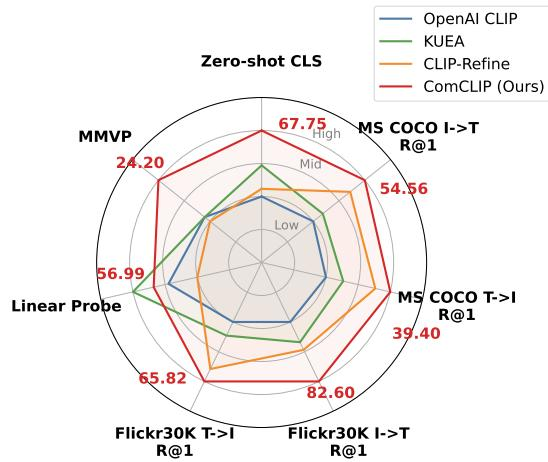
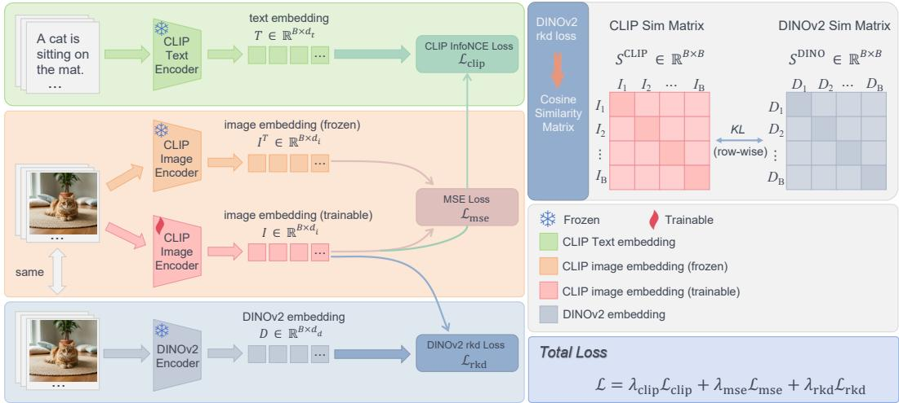
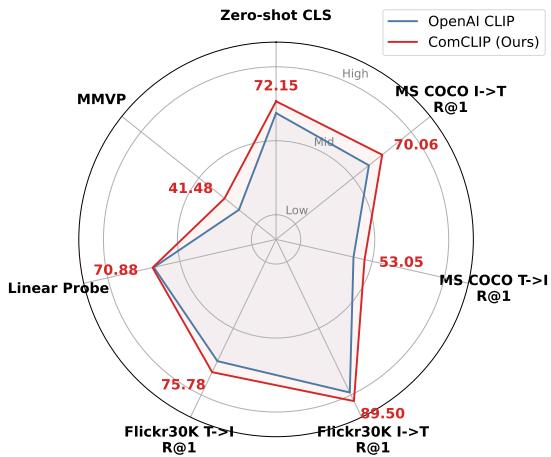
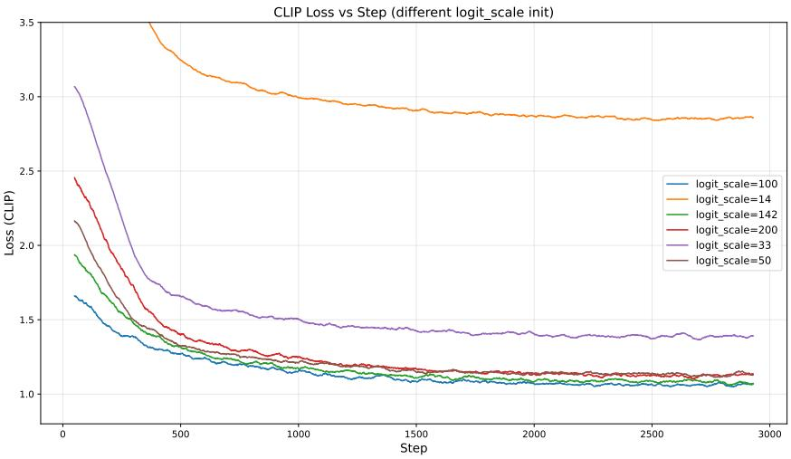

# Rethinking Contrastive Loss in CLIP Post-training: A Complementary Framework with Frozen Text Encoder

Zidan Wang1 Yaqian Li2,∗ Xiaokai Zhang1 Kaiwen Long2 Kun He1 Hanpeng Liu1,2,∗,† 1Huazhong University of Science and Technology 2Li Auto Inc.

## Abstract

CLIP serves as a foundational vision-language model and the de facto vision encoder for downstream VLMs such as LLaVA. Post-training offers a lightweight route to refine CLIP, but recent work argues that the standard contrastive loss is unsuitable for post-training due to catastrophic forgetting under small batches, motivating designs that abandon the contrastive objective in favor of distillation. We revisit this premise and find that, for the InfoNCE objective, the reported forgetting is driven primarily not by insufficient negatives but by an inappropriate magnitude of the contrastive temperature τ: with τ set sufficiently small, contrastive post-training improves rather than degrades the pretrained CLIP, which we explain through the temperature dependence of the InfoNCE gradient. Building on this finding, we propose ComCLIP, a lightweight single-epoch post-training recipe that freezes CLIP’s text encoder—so the refined vision encoder is a drop-in replacement with unchanged architecture and inference cost—and trains the vision encoder with a properly-tempered contrastive loss, an MSE anchoring loss against the original CLIP, and a relational distillation loss from DINOv2. Over multiple seeds, Com-CLIP matches the self-distillation baseline CLIP-Refine on zero-shot classification while significantly improving the transferability of visual features, measured by linear probing (48.99 vs. 42.28 on ViT-B/16), and on ViT-L/14 it also improves MMVP over CLIP-Refine (24.20 vs. 19.01); CLIP-Refine remains stronger on image-text retrieval. Used as a drop-in vision encoder for LLaVA-1.5-7B without realigning the projector or LLM, ComCLIP yields no net change across 8 VLM benchmarks, i.e., the refinement does not break downstream compatibility. Code and models are available at https://github.com/showstarpro/ComCLIP.git.

## 1 Introduction

Vision-language foundation models, particularly CLIP (Radford et al., 2021), serve as the de facto vision encoder for modern vision-language models (VLMs) such as LLaVA (Liu et al., 2024a). Despite its success, CLIP exhibits residual issues including the modality gap (Liang et al., 2022) and systematic visual blindness on fine-grained pairs (Tong et al., 2024), which propagate into downstream VLMs. Re-training CLIP from scratch (Zhai et al., 2023; Sun et al., 2023) is prohibitively expensive and breaks compatibility with the existing CLIP-based ecosystem. Post-training—refining a pretrained CLIP on a small dataset with limited compute—offers a pragmatic alternative. We target a developer who upgrades the vision encoder of a CLIP-based VLM without retraining its projector or LLM: the refined encoder must stay in the original CLIP image-text space, and the visual features the VLM consumes should become more transferable.

Existing CLIP post-training methods fall into two categories: self-distillation methods such as CLIP-Refine (Yamaguchi et al., 2025) that use image-text soft labels, and external-teacher distillation methods such as KUEA (Gong et al., 2025) that align the geometric structure of CLIP’s visual representations with DINOv2’s (Oquab et al., 2024) via kernel-based methods. Notably, both lines deliberately avoid the standard image-text contrastive loss—the very objective that produced CLIP. CLIP-Refine, for instance, argues that contrastive post-training is fundamentally limited by the small batch sizes affordable in this regime, which provide insufficient negative samples and lead to catastrophic forgetting; they report that even scaling the batch size up to 2,048—near the practical ceiling for post-training—still fails to recover the zero-shot performance of the original CLIP. This pessimistic conclusion about contrastive loss has shaped subsequent designs that rely on distillation rather than direct contrastive learning.

Finding 1: Contrastive temperature is a major underappreciated factor in CLIP posttraining. We revisit this premise and find that, for the InfoNCE objective, the reported forgetting is driven primarily not by insufficient negatives in small batches but by an inappropriate magnitude of the contrastive temperature τ . Directly inheriting the pretraining initialization $\tau \approx 0 . 0 7 ( \mathrm { i } . \mathrm { e } . , 1 / \tau \approx 1 4 )$ leads to performance degradation, whereas a substantially smaller $\tau = 0 . 0 1 ( \mathrm { i . e . , } 1 / \tau = 1 0 0 )$ does not. The mechanism is visible in the InfoNCE gradient: the gradient on a negative pair decays as ${ \mathrm { x p } } ( - ( s _ { i i } - s _ { i j } ) / \tau )$ in its margin to the positive. Because a pretrained CLIP already separates matched from mismatched pairs, a small τ makes the gradient on easy pairs vanish, so the pretrained geometry is left largely intact, and concentrates the update on the few hard negatives, which refines it (Sec. 3.3). On ViT-B/16 (CC3M, 1 epoch, batch size 1,024), naive contrastive post-training with $\tau = 0 . 0 7$ drops 12-dataset zero-shot accuracy from 61.82 to 57.90, reproducing prior reports; with $\tau = 0 . 0 1$ , the same objective improves zero-shot accuracy to 62.90 under the same compute budget.

  
Figure 1: Multi-dimensional comparison on ViT-L/14 (values from Table 1). Relative to the original OpenAI CLIP, ComCLIP improves all four evaluation dimensions (zero-shot classification, retrieval, linear probing, MMVP), whereas prior post-training methods exhibit characteristic trade-offs. Each axis is min–max normalized per metric; ComCLIP’s MMVP is the 3-seed mean (Sec. 4.3).

Finding 2: Different post-training objectives act on separable metric families. While properlytempered contrastive loss alone is beneficial, it leaves the transferability of visual features, measured by linear probing, essentially unchanged. Our loss-decoupling ablation shows that the objectives we consider act on largely separable groups of metrics: the contrastive loss drives zero-shot classification and retrieval, anchoring to the pretrained encoder preserves transferable visual features, and relational distillation from DINOv2 adds further linear-probe transferability. We do not claim this is a unique or exhaustive decomposition of post-training failure modes; it is the empirical basis for combining the objectives. Building on these findings, we propose ComCLIP, a lightweight single-epoch posttraining recipe that freezes the text encoder—so the refined vision encoder is a drop-in replacement with unchanged architecture and inference cost—and trains the vision encoder under three losses that follow one principle, refine relative structure while anchoring absolute geometry: a properlytempered contrastive loss for alignment, an MSE anchoring loss against the original CLIP, and a relational distillation loss from DINOv2.

On ViT-B/16 and ViT-L/14 with one epoch on CC3M or COCO Caption, ComCLIP and the selfdistillation baseline CLIP-Refine sit at different points of a trade-off. Over three seeds on ViT-B/16, the two are at parity on 12-dataset zero-shot accuracy $( 6 3 . 0 0 _ { \pm 0 . 1 3 } ~ \mathrm { v s . 6 2 . 8 7 _ { \pm 0 . 1 1 } }$ , not significant), CLIP-Refine is ahead on image-text retrieval, and ComCLIP is substantially ahead on linear probing $( 4 8 . 9 9 \pm 0 . 3 5 ~ \mathrm { v s . ~ } 4 2 . 2 8 _ { \pm 0 . 6 2 } , p < 0 . 0 0 1 )$ , an advantage that also holds when both methods use the same post-training data. On ViT-L/14, ComCLIP additionally improves MMVP over CLIP-Refine trained on the same data $( 2 4 . 2 0 { \scriptstyle \pm 0 . 8 6 }$ vs. $1 9 . 0 1 _ { \pm 1 . 8 6 } )$ . Swapped into LLaVA-1.5-7B without any re-alignment, ComCLIP yields no net change across 8 VLM benchmarks: the refinement preserves downstream compatibility rather than improving downstream accuracy.

Contributions. (1) We show that, for InfoNCE, the failure of contrastive post-training reported in prior work is driven primarily by the magnitude of τ rather than by batch size, isolate this effect from batch size and temperature learnability, and explain it through the temperature dependence of the InfoNCE gradient. (2) We propose ComCLIP, a lightweight single-epoch post-training recipe with a frozen text encoder that combines a properly-tempered contrastive loss with anchoring and relational distillation. (3) With multi-seed statistics, we show that ComCLIP significantly improves linear-probe transferability over CLIP-Refine at zero-shot parity on ViT-B/16 and ViT-L/14, improves MMVP over CLIP-Refine on ViT-L/14, and serves as a drop-in vision encoder for LLaVA-1.5-7B without degrading downstream performance.

## 2 Related Work

CLIP and its limitations. CLIP (Radford et al., 2021) pioneered web-scale contrastive image-text pretraining and serves as the de facto vision encoder for modern VLMs (Liu et al., 2024a). While subsequent work improved pretraining via better objectives (SigLIP (Zhai et al., 2023)), rewritten or cleaner data (LaCLIP (Fan et al., 2023)), more efficient training recipes (CLIPA (Li et al., 2023a)), and stronger architectures (EVA-CLIP (Sun et al., 2023)), CLIP still exhibits the modality gap (Liang et al., 2022) and visual blindness on fine-grained pairs (Tong et al., 2024), both of which propagate into downstream VLMs (Li et al., 2024). These pretraining studies also document that the temperature interacts with batch size and training recipe, which provides context for our Finding 1; our setting differs in that the model starts from a converged CLIP and sees only a small corpus for a single epoch.

Freezing one tower. LiT (Zhai et al., 2022) freezes a pretrained image encoder and tunes the text encoder to it. ComCLIP is the mirror image: the text encoder is frozen and the image encoder is refined, so that the refined encoder remains compatible with every system built on the original CLIP text space (e.g., LLaVA’s projector).

CLIP post-training. Post-training refines a pretrained CLIP with limited compute. Self-distillation methods such as CLIP-Refine (Yamaguchi et al., 2025) use image-text soft labels and explicitly abandon the contrastive objective, arguing it causes catastrophic forgetting under small batches. External-teacher distillation such as KUEA (Gong et al., 2025) aligns CLIP with DINOv2 (Oquab et al., 2024) via kernel-based methods, but risks degrading the language-aligned contrastive structure. Generative-model-based enhancement—DIVA (Wang et al., 2025), un2CLIP (Li et al., 2025), GenHancer (Ma et al., 2025)—uses feedback from diffusion or unCLIP-style generative models to improve fine-grained visual perception, with large gains on MMVP. Their published results show that this need not come at the cost of CLIP’s other capabilities: DIVA and GenHancer report essentially unchanged zero-shot classification and retrieval, and un2CLIP reports improved text-to-image retrieval with reduced ImageNet accuracy (Appendix N). These methods rely on a large generative model during training and are therefore in a heavier compute class than single-epoch contrastive post-training. Retrieval-augmented customization such as REACT (Liu et al., 2023) retrieves task-relevant imagetext pairs from a web-scale corpus to adapt CLIP to a target domain; it addresses domain customization rather than general-purpose refinement and is not directly comparable.

Our position. ComCLIP revisits the role of the contrastive loss within lightweight post-training at a fixed text encoder. It shows that the InfoNCE objective is a viable post-training signal when its temperature is set appropriately, and combines it with anchoring and relational distillation (Park et al., 2019; Tung and Mori, 2019; Zheng et al., 2021) from DINOv2. We do not aim to maximize fine-grained perception, where generative methods lead; our target is a single-epoch refinement that improves the transferability of the visual features while keeping the encoder a drop-in replacement.

## 3 Method

We propose ComCLIP, a lightweight post-training recipe that refines CLIP’s vision encoder under three losses that act on separable metric families (Sec. 1). The text encoder is frozen throughout to preserve drop-in compatibility with downstream VLMs. The framework is illustrated in Figure 2.

  
Figure 2: Overview of ComCLIP. Three parallel branches operate jointly: (i) frozen CLIP text encoder for image-text alignment $( { \mathcal { L } } _ { \mathrm { c l i p } } ) .$ , (ii) trainable CLIP image encoder anchored to its frozen pretrained counterpart $( \mathcal { L } _ { \mathrm { m s e } } )$ , and (iii) frozen DINOv2 encoder providing relational supervision via batch-wise similarity matrices $( \mathcal { L } _ { \mathrm { r k d } } )$ . All three losses operate on the post-projection embedding.

## 3.1 Preliminaries

CLIP (Radford et al., 2021) consists of an image encoder $f _ { v }$ and a text encoder $f _ { t }$ , jointly trained on image-text pairs (x, t) via the symmetric InfoNCE loss (Oord et al., 2018):

$$
\mathcal { L } _ { \mathrm { N C E } } ( \boldsymbol { u } , \boldsymbol { v } ; \tau ) = - \frac { 1 } { B } \sum _ { i = 1 } ^ { B } \log \frac { \exp ( \boldsymbol { u } _ { i } ^ { \top } \boldsymbol { v } _ { i } / \tau ) } { \sum _ { j = 1 } ^ { B } \exp ( \boldsymbol { u } _ { i } ^ { \top } \boldsymbol { v } _ { j } / \tau ) } ,\tag{1}
$$

where $u _ { i } , v _ { i } \in \mathbb { R } ^ { d }$ are $\ell _ { 2 }$ -normalized projected embeddings, B is the batch size, and $\tau > 0$ is the contrastive temperature. The full CLIP objective is symmetric over images and texts. For each image x, we denote the post-projection $\ell _ { 2 } \cdot$ -normalized embedding produced by $f _ { v }$ as $\pmb { u } ( x ) \in \mathbb { R } ^ { d }$ which lives in the shared image-text contrastive space. Given a pretrained CLIP $( f _ { v } ^ { 0 } , f _ { t } ^ { 0 } )$ and a small post-training dataset ${ \mathcal { D } } ,$ , our goal is to refine $f _ { v }$ while keeping $\mathbf { \widehat { \mathbf { \phi } } } _ { f _ { t } ^ { 0 } } ^ { 0 }$ frozen, with all ComCLIP losses operating on u.

## 3.2 Overview of ComCLIP

ComCLIP trains $f _ { v }$ under a weighted sum of three losses:

$$
\mathcal { L } _ { \mathrm { C o m C L I P } } = \lambda _ { \mathrm { c l i p } } \mathcal { L } _ { \mathrm { c l i p } } + \lambda _ { \mathrm { m s e } } \mathcal { L } _ { \mathrm { m s e } } + \lambda _ { \mathrm { r k d } } \mathcal { L } _ { \mathrm { r k d } } .\tag{2}
$$

$\mathcal { L } _ { \mathrm { c l i p } }$ preserves image-text alignment via a properly-tempered contrastive objective; ${ \mathcal { L } } _ { \mathrm { m s e } }$ preserves the pretrainedfeature manifold by anchoring the post-projection embedding to its frozen pretrained counterpart; and $\mathcal { L } _ { \mathrm { r k d } }$ transfers the inter-sample relational structure of DINOv2 features via relational distillation. All three losses operate in the shared contrastive space, ensuring they jointly shape the same feature geometry. The design follows one principle: refine relative structure (which samples and texts are close to which) through $\mathcal { L } _ { \mathrm { c l i p } }$ and $\mathcal { L } _ { \mathrm { r k d } }$ , while anchoring absolute geometry through ${ \mathcal { L } } _ { \mathrm { m s e } }$

## 3.3 Properly-Tempered Contrastive Loss

We retain the standard contrastive objective (Eq. 1) as the primary post-training signal, but with a critical modification: we set the contrastive temperature τ to a value smaller than that of the CLIP pre-training initialization $( \tau \approx 0 . 0 7 , \mathrm { i . e . , } 1 / \tau \approx \bar { 1 } 4 )$ . Specifically, we fix $\tau = 0 . 0 1 ( \mathrm { i . e . , } 1 / \tau = 1 0 0 )$ throughout post-training. The objective is:

$$
\begin{array} { r } { \mathcal { L } _ { \mathrm { c l i p } } = \frac { 1 } { 2 } \big [ \mathcal { L } _ { \mathrm { N C E } } ( \boldsymbol { u } , \boldsymbol { v } ; \tau ) + \mathcal { L } _ { \mathrm { N C E } } ( \boldsymbol { v } , \boldsymbol { u } ; \tau ) \big ] , \quad \tau = 0 . 0 1 , } \end{array}\tag{3}
$$

where ${ \pmb u } _ { i } = f _ { v } ( x _ { i } )$ and ${ \pmb v } _ { i } = f _ { t } ^ { 0 } ( t _ { i } )$

Why a small temperature is necessary. Consider the image-to-text term for sample i, with similarities $s _ { i j } = { \pmb u } _ { i } ^ { \top } { \pmb v } _ { j }$ and softmax weights $\begin{array} { r } { p _ { i j } = \exp ( s _ { i j } / \tau ) \bar { \langle } \sum _ { k } \exp ( s _ { i k } / \tau ) } \end{array}$ . Its gradient with respect to the logits is

$$
\frac { \partial \mathcal { L } _ { i } } { \partial s _ { i j } } = \frac { 1 } { \tau } \big ( p _ { i j } - \mathcal { k } [ j = i ] \big ) , \qquad p _ { i j } \leq \exp \Bigl ( - \frac { s _ { i i } - s _ { i j } } { \tau } \Bigr ) \quad ( j \neq i ) ,\tag{4}
$$

so the gradient on a negative pair is bounded by $\begin{array} { r } { \frac { 1 } { \tau } \exp ( - \Delta _ { i j } / \tau ) } \end{array}$ , where $\Delta _ { i j } = s _ { i i } - s _ { i j }$ is its margin to the positive, and the gradient on the positive is $\textstyle { \frac { 1 } { \tau } } \sum _ { j \neq i } p _ { i j }$ . A pretrained CLIP already separates matched from mismatched pairs, $\mathrm { i } . \mathrm { e } . , \Delta _ { i j } > 0$ for most negatives in a post-training batch. The temperature then sets which pairs receive gradient, which is the hardness-aware property of the contrastive loss (Wang and Liu, 2021). With a small $\tau , \Delta _ { i j } / \tau$ is large for all but the hardest negatives, so the gradient on easy pairs vanishes exponentially and the pretrained geometry around them is left intact (no forgetting), while the update concentrates on the few hard negatives whose margin is comparable to τ (refinement). With the pretraining initialization $\tau \approx 0 . 0 7$ , typical margins are of the same order as $\tau ,$ so a large fraction of already-correct pairs in every batch still receives gradient. The encoder is then pushed to re-fit the small post-training corpus rather than to correct its residual errors, which is the forgetting observed in prior work. This argument concerns which pairs are updated, not convergence. It is consistent with $\mathcal { L } _ { \mathrm { c l i p } }$ alone improving zero-shot accuracy from 61.82 to 62.90 at $\tau = 0 . 0 1$ and with every $1 / \tau \geq 5 0$ improving over the base model (Sec. 4.5.3), and with a text-anchored geometric diagnostic in Appendix H. It is specific to the InfoNCE form of Eq. (1); objectives whose temperature plays a different role, such as the KL-based self-distillation of CLIP-Refine, are not covered by it.

Practical guidance. The argument gives a range rather than an optimal value: set τ well below the pretraining initialization, so that $\Delta _ { i j } / \tau \gg 1$ for most in-batch negatives of the pretrained model. Empirically, every $5 0 \leq 1 / \tau \leq 2 0 0$ improves zero-shot accuracy over the base model (Sec. 4.5.3), and $\tau = 0 . 0 1$ does so at every batch size from 128 to 2,048 (Appendix C); we transfer it unchanged to ViT-L/14, SigLIP, COCO Caption and CC12M. We do not derive an optimal τ for a given batch size or dataset.

## 3.4 MSE Anchoring Loss

To preserve the intra-modal visual feature manifold within the CLIP pretrained image-text contrastive space—which pure contrastive optimization on a small dataset tends to distort by overfitting to the post-training image-text correspondences—we introduce a feature-level MSE anchoring loss between the post-projection embeddings of the trainable encoder $f _ { v }$ and a frozen copy $f _ { v } ^ { 0 }$

$$
\mathcal { L } _ { \mathrm { m s e } } = \frac { 1 } { B } \sum _ { i = 1 } ^ { B } \bigl \| \pmb { u } ( \boldsymbol { x } _ { i } ) - \pmb { u } ^ { 0 } ( \boldsymbol { x } _ { i } ) \bigr \| _ { 2 } ^ { 2 } .\tag{5}
$$

By anchoring u to its pretrained counterpart $\boldsymbol { u } ^ { 0 } , \boldsymbol { \mathcal { L } } _ { \mathrm { m s e } }$ provides a stable reference in the contrastive space, preventing the encoder from drifting under the joint optimization of $\mathcal { L } _ { \mathrm { c l i p } }$ and $\mathcal { L } _ { \mathrm { r k d } }$

## 3.5 Relational Distillation from DINOv2

To enrich the visual structure of CLIP’s features beyond what image-text pairs supervise, we distill from DINOv2 (Oquab et al., 2024), whose self-supervised features encode visual structure complementary to $\mathrm { C L I P } \mathrm { s }$ contrastive pretraining. Directly aligning CLIP’s features to DINOv2’s would force the CLIP feature space into DINOv2’s purely visual coordinate system—catastrophically degrading image-text alignment. Following relational knowledge distillation (Park et al., 2019; Tung and Mori, 2019), we instead distill the relational structure between samples within a batch.

Let $\pmb { u } ( x _ { i } )$ and $\mathbf { \nabla } _ { \mathbf { \boldsymbol { g } } } ( \boldsymbol { x } _ { i } )$ denote the ℓ -normalized post-projection embeddings of the trainable CLIP encoder and the frozen DINOv2 encoder, respectively. We compute batch-wise self-similarity matrices and convert them into row-wise distributions via a temperature-scaled softmax:

$$
\begin{array} { r } { S _ { i j } ^ { \mathrm { c l i p } } = \pmb { u } ( \boldsymbol { x } _ { i } ) ^ { \top } \pmb { u } ( \boldsymbol { x } _ { j } ) , } \end{array}
$$

$$
S _ { i j } ^ { \mathrm { d i n o } } = \pmb { g } ( \pmb { x } _ { i } ) ^ { \top } \pmb { g } ( \pmb { x } _ { j } ) ,\tag{6}
$$

$$
P _ { i j } ^ { \mathrm { c l i p } } = \frac { \exp ( S _ { i j } ^ { \mathrm { c l i p } } / T ) } { \sum _ { k } \exp ( S _ { i k } ^ { \mathrm { c l i p } } / T ) } ,
$$

$$
P _ { i j } ^ { \mathrm { d i n o } } = \frac { \exp ( S _ { i j } ^ { \mathrm { d i n o } } / T ) } { \sum _ { k } \exp ( S _ { i k } ^ { \mathrm { d i n o } } / T ) } .\tag{7}
$$

The relational distillation loss is the row-wise KL divergence, the distributional relation-matching form used in ReSSL (Zheng et al., 2021):

$$
\mathcal { L } _ { \mathrm { r k d } } = \frac { 1 } { B } \sum _ { i = 1 } ^ { B } \mathrm { K L } \big ( P _ { i , : } ^ { \mathrm { d i n o } } \big \| P _ { i , : } ^ { \mathrm { c l i p } } \big ) ,\tag{8}
$$

with $T = 0 . 1$ and DINOv2 features computed without gradients. We compute $\mathcal { L } _ { \mathrm { r k d } }$ on the postprojection embedding so that all three losses shape the same space; the pre-projection alternative performs comparably (Appendix E). In a multi-seed control, adding $\mathcal { L } _ { \mathrm { r k d } }$ to ${ \mathcal { L } } _ { \mathrm { c l i p } } + { \mathcal { L } } _ { \mathrm { m s e } }$ significantly improves linear probing on ViT-L/14 (Sec. 4.5.2).

Relation to KUEA. KUEA (Gong et al., 2025) also distills DINOv2’s relational structure under an $\ell _ { 2 }$ anchor, but matches kernel values element-wise, $[ k _ { 1 } ( { \pmb u } _ { i } , { \pmb u } _ { j } ) - k _ { 2 } ( { \pmb g } _ { i } , { \pmb g } _ { j } ) ] ^ { 2 }$ , with a trainable CLIP-side kernel to calibrate absolute similarity magnitudes. $\mathcal { L } _ { \mathrm { r k d } }$ is parameter-free and, as softma $\mathrm { x } ( z + c ) = \mathrm { s o f t m a x } ( z )$ , constrains each sample’s relative neighborhood rather than absolute similarities. These are left to ${ \mathcal { L } } _ { \mathrm { m s e } } ,$ so the two terms do not compete for them, unlike value matching, which pulls them toward DINOv2’s scale. This is a design rationale; Table 4 compares full recipes, not a single-factor swap.

## 3.6 Complementary Effects of the Three Losses

$\mathcal { L } _ { \mathrm { c l i p } }$ and $\mathcal { L } _ { \mathrm { r k d } }$ are both row-wise softmax objectives over in-batch similarities, so both act on relative structure: with a small $\tau , \mathcal { L } _ { \mathrm { c l i p } }$ refines how texts are ranked around each image (Sec. 3.3), and $\mathcal { L } _ { \mathrm { r k d } }$ adds DINOv2’s ranking of images around it, a self-normalizing target of the same kind. A kernel-value term such as KUEA’s instead fixes absolute magnitudes to DINOv2’s scale, against the relative structure that $\mathcal { L } _ { \mathrm { c l i p } }$ sharpens. ${ \mathcal { L } } _ { \mathrm { m s e } }$ , the only term on absolute position, keeps both from over-shaping the features. Sec. 4.5.1 and Sec. 4.5.2 test this empirically.

## 4 Experiments

## 4.1 Settings

Pre-trained models. We experiment with two student backbones: OpenAI CLIP ViT-B/16 and ViT-L/14. DINOv2 ViT-L/14 (with registers) (Oquab et al., 2024) serves as the visual teacher for $\mathcal { L } _ { \mathrm { r k d } }$ . During post-training, both the student’s text encoder and DINOv2 are kept frozen; only the student’s vision encoder is updated.

Post-training datasets. We use three datasets spanning different scales and curation styles: CC3M (Sharma et al., 2018) and CC12M (Changpinyo et al., 2021) (web-scraped, 3M and 12M pairs) and COCO Caption (Lin et al., 2014) (591K human-annotated pairs).

Baselines. We compare against (i) the original OpenAI CLIP without post-training, (ii) CLIP-Refine (Yamaguchi et al., 2025) trained on COCO Caption and on CC3M for 1 epoch, and (iii) KUEA (Gong et al., 2025) trained on ImageNet-1K (Deng et al., 2009) and on CC3M for 2 epochs (its default schedule), all reproduced from the official codebases with their original hyperparameters. Generative-model-based methods (DIVA, un2CLIP, GenHancer) are compared using their published numbers in Appendix N.

Training details. ComCLIP is implemented on top of the official KUEA codebase. We use AdamW (Loshchilov and Hutter, 2019) with learning rate $1 \times 1 0 ^ { - 6 }$ , weight decay 0.1, and a 410-step linear warm-up. Each model is post-trained for 1 epoch on 8 A800 GPUs with global batch size 1,024 and the standard per-sample CLIP data augmentation inherited from the KUEA codebase. Because augmentation is applied per sample, the features of the frozen CLIP copy and of DINOv2 are computed on the fly (forward pass only) rather than cached. The contrastive temperature is fixed at $\tau = 0 . 0 1$ , and all three loss weights are set to $\lambda _ { \mathrm { c l i p } } = \lambda _ { \mathrm { m s e } } = \lambda _ { \mathrm { r k d } } = 1 . 0$ . The delivered model is a single CLIP vision encoder with the same architecture and parameter count as the input model, so inference cost is unchanged.

Evaluation. We evaluate on five task families: (i) zero-shot classification averaged over 12 datasets; (ii) image-text retrieval (R@1) on MS COCO (Chen et al., 2015) and Flickr30K (Young et al., 2014); (iii) linear probing averaged over 5 datasets; (iv) MMVP (Tong et al., 2024) for fine-grained visual

Table 1: Comparison of post-training methods on two backbones (ViT-B/16 and ViT-L/14). The “+” denotes the application of a post-training method and dataset to the pre-trained OpenAI CLIP. Each method is reported under its strongest validated setting (Sec. 4.2): ComCLIP and CLIP-Refine are trained for 1 epoch and KUEA for 2 epochs (its default schedule). Cells with a subscript are means ± standard deviation over seeds (3 seeds; see Table 2); all other cells are single runs. MMVP has N = 135 image pairs and a seed standard deviation of up to ∼3 points, so single-run MMVP differences should not be over-interpreted. The best and second-best results within each backbone are in bold and underline; highlighting does not imply statistical significance.
<table><tr><td>Method</td><td>Zero-shot CLS Avg</td><td colspan="2">MS COCO (R@1)</td><td colspan="2">Flickr30K (R@1)</td><td>Linear Probe</td><td>MMVP</td></tr><tr><td></td><td></td><td>I→T</td><td>T→I</td><td>I→T</td><td>T→I</td><td>Avg</td><td>Avg</td></tr><tr><td colspan="8">Backbone: ViT-B/16</td></tr><tr><td>OpenAI CLIP (no post-training)</td><td>61.82</td><td>48.16</td><td>31.47</td><td>74.70</td><td>57.10</td><td>44.70</td><td>12.59</td></tr><tr><td>+ KUEA (ImageNet-1K)</td><td>62.07</td><td>48.48</td><td>31.99</td><td>75.00</td><td>57.62</td><td>44.65</td><td>11.85</td></tr><tr><td>+ KUEA (CC3M)</td><td>61.99 62.87±0.11</td><td>48.00</td><td>31.47</td><td>75.00</td><td>57.00 64.45±0.21</td><td>44.72</td><td>14.07 16.05±1.14</td></tr><tr><td>+ CLIP-Refine (COCO Caption) + CLIP-Refine (CC3M)</td><td>61.59</td><td>54.17±0.28 41.12</td><td>37.72±0.07 33.29</td><td>81.30±0.40 66.20</td><td>60.18</td><td>42.28±0.62 44.89</td><td>19.26</td></tr><tr><td>+ ComCLIP (COCO Caption)</td><td>62.97</td><td>52.24</td><td>35.36</td><td>79.50</td><td>61.36</td><td>47.23</td><td>15.56</td></tr><tr><td>+ ComCLIP (CC3M)</td><td>63.00±0.13</td><td>52.49±0.28</td><td>36.17±0.02</td><td>77.80±0.00</td><td>63.11±0.09</td><td>48.99±0.35</td><td>14.81±2.97</td></tr><tr><td>+ ComCLIP (CC12M)</td><td>63.04</td><td>51.58</td><td>35.56</td><td>77.10</td><td>62.42</td><td>46.56</td><td>15.56</td></tr><tr><td></td><td></td><td></td><td>Backbone: ViT-L/14</td><td></td><td></td><td></td><td></td></tr><tr><td colspan="8"></td></tr><tr><td>OpenAI CLIP (no post-training) + KUEA (ImageNet-1K)</td><td>66.12 66.89</td><td>50.04</td><td>34.29</td><td>77.90</td><td>59.80</td><td>54.90</td><td>17.78</td></tr><tr><td>+ KUEA (CC3M)</td><td>66.36</td><td>50.88 50.30</td><td>35.66 34.68</td><td>79.50 78.00</td><td>61.18 60.02</td><td>59.92 55.82</td><td>17.78 18.52</td></tr><tr><td>+ CLIP-Refine (COCO Caption)</td><td>66.31</td><td>53.28</td><td>38.21</td><td>80.10</td><td>64.56</td><td>50.83</td><td>17.04</td></tr><tr><td>+ CLIP-Refine (CC3M)</td><td></td><td></td><td></td><td></td><td></td><td></td><td>19.01±1.86</td></tr><tr><td>+ ComCLIP (COCO Caption)</td><td>67.09</td><td>54.32</td><td>38.79</td><td>81.80</td><td>64.98</td><td>58.28</td><td>20.74</td></tr><tr><td>+ ComCLIP (CC3M)</td><td>67.75</td><td>54.56</td><td>39.40</td><td>82.60</td><td>65.82</td><td>56.99</td><td>24.20±0.86</td></tr><tr><td></td><td>67.78</td><td></td><td>38.63</td><td></td><td>65.00</td><td></td><td></td></tr><tr><td>+ ComCLIP (CC12M)</td><td></td><td>53.74</td><td></td><td>80.10</td><td></td><td>57.42</td><td>22.22</td></tr><tr><td></td><td></td><td></td><td></td><td></td><td></td><td></td><td></td></tr></table>

perception; and (v) downstream VLM evaluation on 8 benchmarks via LLaVA-1.5-7B integration. The full list of zero-shot and linear-probing datasets, along with the VLM benchmarks, is provided in Appendix A. MMVP contains only N = 135 image pairs, so one pair corresponds to 0.74 points and seed-to-seed variation is several points; we therefore base MMVP claims only on multi-seed comparisons (Sec. 4.3).

## 4.2 Main Results

Table 1 compares ComCLIP with the original OpenAI CLIP and two post-training baselines, KUEA (Gong et al., 2025) and CLIP-Refine (Yamaguchi et al., 2025), on ViT-B/16 and ViT-L/14. Since different post-training methods favor different datasets and training budgets, the table reports each method under its strongest validated setting rather than forcing a single shared configuration. Concretely, CLIP-Refine is trained on COCO Caption, where it performs best, and additionally on CC3M; KUEA is trained on ImageNet-1K and on CC3M for 2 epochs; ComCLIP and CLIP-Refine use 1 epoch, since 2 epochs gave no consistent improvement (Appendix G). As a result, the bestsetting rows compare ComCLIP (CC3M) with CLIP-Refine (COCO Caption), i.e., methods trained on different data; the dataset-matched rows (both on CC3M for ViT-B/16, both on COCO Caption for ViT-L/14) are included in the same table and discussed below.

ComCLIP and CLIP-Refine occupy different points of a trade-off. On ViT-B/16, over three seeds, ComCLIP and CLIP-Refine are at parity on zero-shot classification $( 6 3 . 0 0 _ { \pm 0 . 1 3 } \mathrm { v s . 6 2 . 8 7 _ { \pm 0 . 1 1 } }$ p = 0.26), CLIP-Refine is ahead on all four retrieval metrics, and ComCLIP is far ahead on linear probing $( 4 8 . 9 9 _ { \pm 0 . 3 5 } \mathrm { v s . } 4 2 . 2 8 _ { \pm 0 . 6 2 } , p < 0 . 0 0 1 ;$ Table 2). CLIP-Refine raises retrieval while reducing linear-probe accuracy below the original CLIP (44.70), whereas ComCLIP improves it. On ViT-L/14 the same pattern holds for linear probing (CLIP-Refine 50.83 vs. original 54.90; ComCLIP 56.99–58.28), and ComCLIP is also ahead on retrieval.

The linear-probe advantage is not an artifact of the training data. Under dataset-matched comparisons, ComCLIP retains a large linear-probe advantage over CLIP-Refine: with both methods trained on CC3M on ViT-B/16, 48.99 vs. 44.89 (+4.10), and with both trained on COCO Caption on ViT-L/14, 58.28 vs. 50.83 (+7.45).

KUEA yields small zero-shot changes (at most +0.77); its highest linear-probe accuracy (ViT-L/14, ImageNet-1K, 59.92) is plausibly helped by ImageNet-1K being in the probe suite, and on CC3M it gain is small (55.82).

Table 2: Multi-seed comparison between ComCLIP and CLIP-Refine (mean ± standard deviation). Top: ViT-B/16, 3 seeds per method, each method in its best setting (ComCLIP on CC3M, CLIP-Refine on COCO Caption). Bottom: ViT-L/14 MMVP, 3 seeds per method, both trained on CC3M. p: two-sided Welch t-test. MMVP has $N = 1 3 5$ image pairs; on ViT-B/16 the ComCLIP seeds correspond to {16, 20, 24} correct pairs.

$$
6 2 . 8 7 _ { \pm 0 . 1 1 }
$$

$$
5 4 . 1 7 { \scriptstyle \pm 0 . 2 8 }
$$

$$
6 3 . 0 0 { \scriptstyle \pm 0 . 1 3 }
$$

$$
3 7 . 7 2 _ { \pm 0 . 0 7 }
$$

$$
5 2 . 4 9 _ { \pm 0 . 2 8 }
$$

$$
3 6 . 1 7 _ { \pm 0 . 0 2 } ^ { - }
$$

$$
8 1 . 3 0 { \scriptstyle \pm 0 . 4 0 }
$$

$$
6 4 . 4 5 _ { \pm 0 . 2 1 }
$$

$$
7 7 . 8 0 _ { \pm 0 . 0 0 }
$$

$$
4 2 . 2 8 _ { \pm 0 . 6 2 }
$$

$$
2 \times 1 0 ^ { - 3 }
$$

$$
1 6 . 0 5 _ { \pm 1 . 1 4 }
$$

$$
3 \times 1 0 ^ { - 4 }
$$

$$
6 3 . 1 1 _ { \pm 0 . 0 9 }
$$

$$
4 \times 1 0 ^ { - 3 }
$$

$$
4 8 . 9 9 _ { \pm 0 . 3 5 }
$$

$$
1 4 . 8 1 _ { \pm 2 . 9 7 }
$$

$$
3 \times 1 0 ^ { - 3 }
$$

$$
4 \times 1 0 ^ { - 4 }
$$

<table><tr><td>CLIP-Refine (CC3M)</td><td></td><td> $1 9 . 0 1 _ { \pm 1 . 8 6 }$ </td></tr><tr><td>ComCLIP (CC3M)</td><td>一</td><td> $2 4 . 2 0 { \scriptstyle \pm 0 . 8 6 }$ </td></tr><tr><td>Welch p</td><td></td><td>0.025</td></tr></table>

Table 3: LLaVA-1.5-7B with the vision encoder swapped for ComCLIP ViT-L/14 (post-trained on CC3M), KUEA ViT-L/14 (ImageNet-1K), CLIP-Refine ViT-L/14 (COCO Caption), or the original OpenAI CLIP ViT-L/14; the LLM and projector are kept frozen. ‘\*’ indicates official KUEA weights (Gong et al., 2025). Because the benchmarks differ in scale by more than 60× (e.g., MME-p vs. RefCOCOg), we do not report a raw arithmetic mean. Instead, Rel. ∆ is the mean per-benchmark relative change w.r.t. OpenAI CLIP (%), Ceil. ∆ is the mean change after dividing each benchmark by its maximum attainable score (points), and W/T/L counts benchmarks improved/tied/degraded w.r.t. OpenAI CLIP. The best result in each benchmark column is in bold.
<table><tr><td>Method</td><td>Rel. ∆</td><td>Ceil. ∆</td><td>W/T/L</td><td>AI2D</td><td>POPE</td><td>RefCOCOg</td><td>V*</td><td>MME-c</td><td>MME-p</td><td>SQA-Img</td><td>OCRBench</td><td>TextVQA</td></tr><tr><td>OpenAI CLIP</td><td></td><td></td><td></td><td>52.75</td><td>85.20</td><td>20.67</td><td>41.36</td><td>320.00</td><td>1350.79</td><td>67.63</td><td>27.80</td><td>34.57</td></tr><tr><td>KUEA*</td><td>-1.23</td><td>-0.51</td><td>3/0/6</td><td>52.30</td><td>85.46</td><td>20.50</td><td>38.74</td><td>317.14</td><td>1350.82</td><td>66.68</td><td>27.40</td><td>34.69</td></tr><tr><td>CLIP-Refine</td><td>-0.95</td><td>-0.37</td><td>3/0/6</td><td>52.20</td><td>85.57</td><td>20.61</td><td>39.79</td><td>308.21</td><td>1345.97</td><td>67.72</td><td>27.60</td><td>34.84</td></tr><tr><td>ComCLIP</td><td>+0.02</td><td>+0.04</td><td>4/2/3</td><td>52.75</td><td>85.14</td><td>20.63</td><td>41.36</td><td>307.50</td><td>1373.47</td><td>67.82</td><td>28.20</td><td>34.89</td></tr></table>

Effect of the post-training corpus. Gains are not monotone in corpus size: on ViT-B/16, CC12M matches CC3M on zero-shot (63.04 vs. $6 3 . 0 0 { \scriptstyle \pm 0 . 1 3 } )$ but is lower on linear probing (46.56 vs. $4 8 . 9 9 _ { \pm 0 . 3 5 } )$ , and ViT-L/14 zero-shot is flat (67.75 vs. 67.78). We use CC3M by default (see Sec. 5).

## 4.3 Multi-seed Statistics

Table 2 reports seed statistics for the comparisons the paper relies on. On ViT-B/16 (three seeds), the only significant difference between ComCLIP and CLIP-Refine in favor of ComCLIP is linear probing (Welch $t = 1 6 . 3 , p < 0 . 0 0 1 )$ ; CLIP-Refine is significantly ahead on all four retrieval metrics $( p \textless 0 . 0 0 5 )$ ; the zero-shot difference is not significant $( p = 0 . 2 6 )$ , and on MMVP the two are indistinguishable $( 1 4 . 8 1 _ { \pm 2 . 9 7 }$ vs. $1 6 . 0 5 { \scriptstyle \pm 1 . 1 4 } , p = 0 . 5 6 )$ . On ViT-B/16, the ComCLIP MMVP seeds span [11.85, 17.78], and every MMVP value in our ViT-B/16 ablations (Sec. 4.5) lies within this range; we therefore draw no conclusions from MMVP on ViT-B/16. On ViT-L/14, with three seeds per method and both methods trained on CC3M, ComCLIP improves MMVP over CLIP-Refine $( 2 4 . 2 0 _ { \pm 0 . 8 6 } \mathrm { v s . 1 9 . 0 1 _ { \pm 1 . 8 6 } }$ , Welch $t = 4 . 4 , p = 0 . 0 2 5 ) ;$ this is the only MMVP claim we make. We note that generative enhancement methods report higher MMVP on the same backbone (Appendix N).

## 4.4 Downstream VLM Compatibility

To verify that the refined encoder remains a drop-in replacement, we replace LLaVA-1.5-7B’s vision encoder (originally CLIP ViT-L/14-336) with ComCLIP, KUEA, CLIP-Refine and the original OpenAI CLIP (all ViT-L/14-224), while keeping the LLM and cross-modal projector strictly frozen (Table 3). Because the benchmarks differ in scale by more than an order of magnitude, we aggregate with scale-normalized measures rather than a raw arithmetic mean. Under these measures, ComCLIP produces no net change relative to the original CLIP: the mean per-benchmark relative change is +0.02%, the ceiling-normalized change is +0.04 points, and it improves 4, ties 2, and degrades 3 of the 9 scores; excluding the two MME scores, the mean change is +0.12 points (+0.34%). The largest individual movements are on MME, with perception up by 22.68 and cognition down by 12.50, i.e., by more than twice as much in relative terms (+1.7% vs. −3.9%). By contrast, KUEA

Table 4: Loss decoupling ablation on ViT-B/16, post-trained on CC3M with batch size $1 2 8 \times 8 . \ : \mathrm { A l l }$ configurations of $\{ \bar { \mathcal { L } } _ { \mathrm { c l i p } } , \mathcal { L } _ { \mathrm { m s e } } , \mathcal { L } _ { \mathrm { r k d } } \}$ are trained for 1 epoch. KUEA and KUEA + $\mathcal { L } _ { \mathrm { c l i p } }$ use KUEA’s default 2-epoch schedule and hyperparameters, which were not re-tuned (loss weight, learning rate, anchor weight) after adding $\mathcal { L } _ { \mathrm { c l i p } }$ . Temperature is fixed at $\tau = 0 . 0 1$ throughout. Entries are single runs except where a seed standard deviation is given. Best results per column (except MMVP) in bold. All MMVP values $( N = 1 3 5 )$ lie within the 3-seed range of ComCLIP ([11.85, 17.78]), so MMVP is not highlighted and no conclusion is drawn from it.
<table><tr><td>Method</td><td>Zero-shot 12 datasets Avg</td><td colspan="2">MS COCO (R@1) I→T T→I</td><td colspan="2">Flickr30K (R@1) I→T T→I</td><td>Linear Probe 5 datasets Avg</td><td>MMVP Avg</td></tr><tr><td>OpenAI CLIP (no post-training)</td><td>61.82</td><td>48.16</td><td>31.47</td><td>74.70</td><td>57.10</td><td>44.70</td><td>12.59</td></tr><tr><td> $+ \operatorname { K U E A }$   $+ ( \mathrm { K U E A } + \mathcal { L } _ { \mathrm { c l i p } } )$ </td><td>61.99 62.24</td><td>48.00 48.84</td><td>31.47 34.20</td><td>75.00 75.30</td><td>57.00 60.80</td><td>44.72 45.25</td><td>14.07 13.33</td></tr><tr><td> $+ \mathcal { L } _ { \mathrm { c l i p } }$   $+ \mathcal { L } _ { \mathrm { m s e } }$ </td><td>62.90 61.82</td><td>51.92 48.18</td><td>38.28 31.45</td><td>76.80 74.70</td><td>64.56 57.12</td><td>44.04 44.79</td><td>14.07 11.85</td></tr><tr><td> $+ \mathcal { L } _ { \mathrm { r k d } }$ </td><td>56.64</td><td>43.30</td><td>25.57</td><td>69.30</td><td>49.66</td><td>44.42</td><td>17.78</td></tr><tr><td> $+ \left( \mathcal { L } _ { \mathrm { m s e } } + \mathcal { L } _ { \mathrm { r k d } } \right)$ </td><td>61.36</td><td>49.98</td><td>31.53</td><td>75.40</td><td>58.08</td><td>45.50</td><td>15.56</td></tr><tr><td></td><td></td><td></td><td></td><td></td><td></td><td></td><td></td></tr><tr><td> $+ \left( \mathcal { L } _ { \mathrm { c l i p } } + \mathcal { L } _ { \mathrm { m s e } } \right)$ </td><td>63.35</td><td>51.64</td><td>37.03</td><td>77.00</td><td>64.34</td><td>48.60</td><td>14.07</td></tr><tr><td> $+ \left( \mathcal { L } _ { \mathrm { c l i p } } + \mathcal { L } _ { \mathrm { r k d } } \right)$ </td><td>62.49</td><td>51.50</td><td>36.67</td><td>77.30</td><td>63.96</td><td>47.15</td><td>14.07</td></tr><tr><td>+ ComCLIP  $( \mathcal { L } _ { \mathrm { c l i p } } + \mathcal { L } _ { \mathrm { m s e } } + \mathcal { L } _ { \mathrm { r k d } } )$ </td><td>63.15</td><td>52.20</td><td>36.18</td><td>77.80</td><td>63.22</td><td>48.74</td><td> $1 4 . 8 1 _ { \pm 2 . 9 7 }$ </td></tr></table>

and CLIP-Refine reduce the aggregate (−1.23% and −0.95% relative, each degrading 6 of 9 scores). We read these results as evidence of compatibility: ComCLIP’s refinement of the vision encoder does not break the frozen projector and LLM trained on the original CLIP, but it does not by itself improve downstream VLM accuracy without re-alignment.

## 4.5 Ablation Study

Ablations are run on ViT-B/16 with CC3M. Unless a seed standard deviation is given, entries are single runs; for reference, the ViT-B/16 seed standard deviations of ComCLIP are 0.13 (zero-shot), 0.35 (linear probe) and 2.97 (MMVP). Every ViT-B/16 MMVP value in this section lies within the seed range of a single configuration, so we report MMVP for completeness only.

## 4.5.1 Loss Decoupling

Table 4 reports all single-loss, pairwise, and full configurations of $\{ \mathcal { L } _ { \mathrm { c l i p } } , \mathcal { L } _ { \mathrm { m s e } } , \mathcal { L } _ { \mathrm { r k d } } \}$ (Finding 2). Each loss moves a different group of metrics. $\mathcal { L } _ { \mathrm { c l i p } }$ alone improves zero-shot classification (+1.08) and retrieval but leaves linear probing essentially unchanged (44.04 vs. 44.70). $\mathcal { L } _ { \mathrm { m s e } }$ alone is a no-op (differences within 0.1). $\mathcal { L } _ { \mathrm { r k d } }$ alone severely degrades zero-shot classification $( - 5 . 1 8 )$ and retrieval (−7.44 on Flickr30K T→I): distilling DINOv2’s relational structure without an image-text signal pulls the embedding away from the text space. Combinations. $\mathcal { L } _ { \mathrm { c l i p } } + \mathcal { L } _ { \mathrm { m s e } }$ achieves the highest zero-shot accuracy (63.35) and a large linear-probe gain over $\mathcal { L } _ { \mathrm { c l i p } }$ alone (48.60 vs. 44.04): anchoring the absolute geometry lets the contrastive signal improve alignment without eroding transferable features. $\mathcal { L } _ { \mathrm { c l i p } } + \mathcal { L } _ { \mathrm { r k d } }$ improves linear probing less (47.15), and $\overline { { \mathcal { L } } } _ { \mathrm { m s e } } + \mathcal { L } _ { \mathrm { r k d } }$ leaves zero-shot accuracy below the baseline. The full objective reaches the highest linear-probe accuracy (48.74) with zero-shot accuracy (63.15) within ∼1.5 seed standard deviations of the best variant. Adding properly-tempered $\mathcal { L } _ { \mathrm { c l i p } }$ to KUEA, without re-tuning KUEA’s hyperparameters, also improves its zero-shot accuracy (+0.25) and retrieval (up to +3.80 on Flickr30K T→I), so the temperature finding is not tied to ComCLIP’s other components; ComCLIP remains ahead of $\mathrm { K U E A } + \mathcal { L } _ { \mathrm { c l i p } }$ on zero-shot (+0.91) and linear probing (+3.49), a comparison between recipes rather than a single-factor ablation (see the caption of Table 4).

## 4.5.2 Contribution of $\mathcal { L } _ { \bf r k d }$

Because the single-run effect of $\mathcal { L } _ { \mathrm { r k d } }$ above is small, we isolate it with a 3-seed control that adds $\mathcal { L } _ { \mathrm { r k d } }$ to ${ \mathcal { L } } _ { \mathrm { c l i p } } + { \mathcal { L } } _ { \mathrm { m s e } } \left( { \mathrm { A } } \right.$ ppendix D, Table 9). On $\mathrm { V i T - L } / 1 4 , \mathcal { L } _ { \mathrm { r k d } }$ significantly improves linear probing $( 5 6 . 3 6 { \scriptstyle \pm 0 . 2 3 }  5 7 . 1 2 { \scriptstyle \pm 0 . 1 4 } .$ , Welch $t = 4 . 9 , p \approx 0 . 0 1 3 )$ ; on ViT-B/16 the effect has the same sign but is not significant $( 4 8 . 5 4 _ { \pm 0 . 1 0 }  4 8 . 9 4 _ { \pm 0 . 4 1 } , p \approx 0 . 2 3 )$ , consistent with a benefit that grows with student capacity. It is not an all-metric gain: on ViT-L/14, zero-shot accuracy is unchanged (67.76 → 67.75) and retrieval changes are small and mixed (e.g., COCO T→I 40.37 → 39.40). We therefore retain $\mathcal { L } _ { \mathrm { r k d } }$ on the basis of linear-probe transferability only. The benefit also holds with a DINOv2-Base teacher, but our comparison does not single out a teacher size (Appendix D).

Table 5: Ablation study on the initialization of the temperature parameter (τ) in the CLIP loss. We conduct this experiment exclusively using the CLIP loss on the pre-trained OpenAI CLIP ViT-B/16 model to isolate the impact of τ. We conduct post-training on the CC3M dataset. The global batch size is fixed at $1 2 8 \times 8 \ : ( 1 0 2 4 )$ across all settings. The best results are highlighted in bold. MMVP $( N = 1 3 5$ , single runs) is reported for completeness only: its variation across rows is within seed-to-seed variance (Table 2), so it is not highlighted and not used to select τ.
<table><tr><td>T</td><td>Zero-shot 12 datasets Avg</td><td colspan="2">MS COCO (R@1) I→T T→I</td><td colspan="2">Flickr30K (R@1) T→I</td><td rowspan="2">Linear Probe 5 datasets Avg</td><td rowspan="2">MMVP Avg</td></tr><tr><td></td><td>61.82</td><td>48.16</td><td>31.47</td><td>I→T</td><td></td></tr><tr><td>OpenAI CLIP (no post-training)</td><td></td><td></td><td></td><td>74.70</td><td>57.10</td><td>44.70</td><td>12.59</td></tr><tr><td>0.07 0.03</td><td>57.90</td><td>39.10</td><td>34.12</td><td>65.70</td><td>58.86</td><td>43.95</td><td>16.30</td></tr><tr><td></td><td>61.51</td><td>48.94</td><td>37.01</td><td>74.50</td><td>63.54</td><td>43.12</td><td>13.33</td></tr><tr><td>0.02</td><td>62.57</td><td>51.54</td><td>38.33</td><td>76.70</td><td>65.00</td><td>43.98</td><td>13.33</td></tr><tr><td>0.01</td><td>62.90</td><td>52.50</td><td>38.26</td><td>76.80</td><td>64.56</td><td>44.04</td><td>14.07</td></tr><tr><td>0.007</td><td>62.72</td><td>50.72</td><td>37.74</td><td>75.90</td><td>64.28</td><td>44.53</td><td>17.78</td></tr><tr><td>0.005</td><td>62.36</td><td>49.38</td><td>37.48</td><td>75.10</td><td>64.10</td><td>45.90</td><td>14.81</td></tr></table>

## 4.5.3 Effect of Contrastive Temperature

To examine Finding 1, we train with $\mathcal { L } _ { \mathrm { c l i p } }$ only and sweep τ (Table 5). The pretraining temperature reproduces catastrophic forgetting. $\dot { { \bf A } } \mathrm { t } \tau = 0 . 0 7$ (the CLIP pretraining initialization), zero-shot accuracy drops by 3.92 and Flickr30K I→T by 9.00, consistent with the gradient analysis in Sec. 3.3. Sufficiently small τ enables successful post-training. For every tested $5 \mathrm { { 0 } } \leq 1 / \tau \leq \dot { 2 } 0 0$ , contrastive post-training improves zero-shot accuracy (all in [62.36, 62.90]) and retrieval: the magnitude of $\tau ,$ not its exact value, matters. We adopt $\tau = 0 . 0 1$ (best zero-shot, best or near-best retrieval; MMVP not used). Batch size and learnability. With $\tau = 0 . 0 1$ , larger batches still help (+1.03 zero-shot from 128 to 2,048), but far less than the −3.92 caused by $\tau = 0 . 0 7$ , so limited negatives alone do not explain the failures reported by CLIP-Refine (Yamaguchi et al., 2025); fixed and learnable τ differ by at most 0.05 (Appendix C).

## 5 Conclusion and Limitations

We presented ComCLIP, a lightweight single-epoch CLIP post-training recipe at a fixed text encoder. We showed that, for InfoNCE, the forgetting attributed to contrastive post-training is driven primarily by the temperature magnitude rather than by small batches: with a small τ , already-separated pairs receive vanishing gradient and contrastive post-training improves the pretrained model. Relative to CLIP-Refine, ComCLIP is at parity on zero-shot classification, significantly better on linear-probe transferability (on both backbones and under dataset-matched data), better on MMVP on ViT-L/14, and behind on retrieval; inside LLaVA-1.5-7B it is a drop-in replacement with no net change.

Limitations and Future Work. (i) ComCLIP targets CLIP-like models with a shared contrastive image-text space; extending it to vision encoders or VLMs without such a space is future work. The temperature analysis covers InfoNCE only; it does not directly apply to the KL-based selfdistillation of CLIP-Refine or to SigLIP’s sigmoid loss (Appendix B applies our InfoNCE objective to a SigLIP backbone). (ii) MMVP has only 135 pairs and large seed variance; our MMVP gain over CLIP-Refine is significant only on ViT-L/14, and generative methods report substantially higher MMVP (Appendix N). ComCLIP is not a method for maximizing fine-grained perception. (iii) Our downstream evaluation uses a single VLM configuration $( \mathrm { L L a } \bar { \mathsf { V } } \mathrm { A } - 1 . 5 \bar { \mathsf { - 7 B } }$ , frozen projector and LLM); other VLM architectures would better establish generality. Without re-aligning the projector, ComCLIP preserves but does not improve downstream VLM accuracy; whether re-alignment converts its linear-probe gains into VLM gains is untested. (iv) Performance is not monotone in corpus size (Sec. 4.2); whether this reflects single-epoch dynamics, data quality, or a capacity limit is open. (v) Training runs a frozen CLIP copy and a DINOv2 teacher forward at every step, and we report no per-component compute breakdown; the efficiency we claim is a single epoch on a small corpus with unchanged inference cost.

## Acknowledgments

This work is supported by National Natural Science Foundation of China(U22B2017), and International Cooperation Foundation of Hubei Province, China (2024EHA032).

## References

Soravit Changpinyo, Piyush Sharma, Nan Ding, and Radu Soricut. Conceptual 12m: Pushing web-scale image-text pre-training to recognize long-tail visual concepts. In Proceedings of the IEEE/CVF conference on computer vision and pattern recognition, pages 3558–3568, 2021.

Xinlei Chen, Hao Fang, Tsung-Yi Lin, Ramakrishna Vedantam, Saurabh Gupta, Piotr Dollár, and C Lawrence Zitnick. Microsoft coco captions: Data collection and evaluation server. arXiv preprint arXiv:1504.00325, 2015.

Gong Cheng, Junwei Han, and Xiaoqiang Lu. Remote sensing image scene classification: Benchmark and state of the art. Proceedings ofthe IEEE, 105(10):1865–1883, 2017.

Mircea Cimpoi, Subhransu Maji, Iasonas Kokkinos, Sammy Mohamed, and Andrea Vedaldi. Describing textures in the wild. In Proceedings of the IEEE conference on computer vision and pattern recognition, pages 3606–3613, 2014.

Jia Deng, Wei Dong, Richard Socher, Li-Jia Li, Kai Li, and Li Fei-Fei. Imagenet: A large-scale hierarchical image database. In 2009 IEEE conference on computer vision and pattern recognition, pages 248–255. Ieee, 2009.

Lijie Fan, Dilip Krishnan, Phillip Isola, Dina Katabi, and Yonglong Tian. Improving CLIP training with language rewrites. In Advances in Neural Information Processing Systems (NeurIPS), 2023.

Li Fei-Fei, Rob Fergus, and Pietro Perona. Learning generative visual models from few training examples: An incremental bayesian approach tested on 101 object categories. In 2004 conference on computer vision and pattern recognition workshop, pages 178–178. IEEE, 2004.

Chaoyou Fu, Peixian Chen, Yunhang Shen, Yulei Qin, Mengdan Zhang, Xu Lin, Jinrui Yang, Xiawu Zheng, Ke Li, Xing Sun, et al. Mme: A comprehensive evaluation benchmark for multimodal large language models. arXiv preprint arXiv:2306.13394, 2023.

Shizhan Gong, Yankai Jiang, Qi Dou, and Farzan Farnia. Kernel-based unsupervised embedding alignment for enhanced visual representation in vision-language models. In Forty-second International Conference on Machine Learning, ICML 2025, Vancouver, BC, Canada, July 13-19, 2025. PMLR / OpenReview.net, 2025.

Ian J Goodfellow, Dumitru Erhan, Pierre Luc Carrier, Aaron Courville, Mehdi Mirza, Ben Hamner, Will Cukierski, Yichuan Tang, David Thaler, Dong-Hyun Lee, et al. Challenges in representation learning: A report on three machine learning contests. In International conference on neural information processing, pages 117–124. Springer, 2013.

Patrick Helber, Benjamin Bischke, Andreas Dengel, and Damian Borth. Eurosat: A novel dataset and deep learning benchmark for land use and land cover classification. IEEE Journal ofSelected Topics in Applied Earth Observations and Remote Sensing, 12(7):2217–2226, 2019.

Dan Hendrycks, Kevin Zhao, Steven Basart, Jacob Steinhardt, and Dawn Song. Natural adversarial examples. In Proceedings ofthe IEEE/CVF conference on computer vision and pattern recognition, pages 15262–15271, 2021.

Justin Johnson, Bharath Hariharan, Laurens Van Der Maaten, Li Fei-Fei, C Lawrence Zitnick, and Ross Girshick. Clevr: A diagnostic dataset for compositional language and elementary visual reasoning. In Proceedings of the IEEE conference on computer vision and pattern recognition, pages 2901–2910, 2017.

Aniruddha Kembhavi, Mike Salvato, Eric Kolve, Minjoon Seo, Hannaneh Hajishirzi, and Ali Farhadi. A diagram is worth a dozen images. In European conference on computer vision, pages 235–251. Springer, 2016.

Alex Krizhevsky, Geoffrey Hinton, et al. Learning multiple layers of features from tiny images.(2009), 2009.

Xianhang Li, Zeyu Wang, and Cihang Xie. An inverse scaling law for CLIP training. In Advances in Neural Information Processing Systems (NeurIPS), 2023a.

Yifan Li, Yifan Du, Kun Zhou, Jinpeng Wang, Xin Zhao, and Ji-Rong Wen. Evaluating object hallucination in large vision-language models. In Proceedings of the 2023 conference on empirical methods in natural language processing, pages 292–305, 2023b.

Yinqi Li, Jiahe Zhao, Hong Chang, Ruibing Hou, Shiguang Shan, and Xilin Chen. un2clip: Improving clip’s visual detail capturing ability via inverting unclip. CoRR, abs/2505.24517, 2025.

Zheng Li, Xiang Li, Xinyi Fu, Xin Zhang, Weiqiang Wang, Shuo Chen, and Jian Yang. Promptkd: Unsupervised prompt distillation for vision-language models. In Proceedings ofthe IEEE/CVF Conference on Computer Vision and Pattern Recognition, pages 26617–26626, 2024.

Weixin Liang, Yuhui Zhang, Yongchan Kwon, Serena Yeung, and James Y. Zou. Mind the gap: Understanding the modality gap in multi-modal contrastive representation learning. In Advances in Neural Information Processing Systems 35: Annual Conference on Neural Information Processing Systems 2022, NeurIPS 2022, New Orleans, LA, USA, November 28 - December 9, 2022, 2022.

Tsung-Yi Lin, Michael Maire, Serge Belongie, James Hays, Pietro Perona, Deva Ramanan, Piotr Dollár, and C Lawrence Zitnick. Microsoft coco: Common objects in context. In European conference on computer vision, pages 740–755. Springer, 2014.

Haotian Liu, Kilho Son, Jianwei Yang, Ce Liu, Jianfeng Gao, Yong Jae Lee, and Chunyuan Li. Learning customized visual models with retrieval-augmented knowledge. In Proceedings ofthe IEEE/CVF Conference on Computer Vision and Pattern Recognition (CVPR), pages 15148–15158, 2023.

Haotian Liu, Chunyuan Li, Yuheng Li, and Yong Jae Lee. Improved baselines with visual instruction tuning. In CVPR, pages 26286–26296, 2024a.

Yuliang Liu, Zhang Li, Mingxin Huang, Biao Yang, Wenwen Yu, Chunyuan Li, Xu-Cheng Yin, Cheng-Lin Liu, Lianwen Jin, and Xiang Bai. Ocrbench: on the hidden mystery of ocr in large multimodal models. Science China Information Sciences, 67(12):220102, 2024b.

Ilya Loshchilov and Frank Hutter. Decoupled weight decay regularization. In 7th International Conference on Learning Representations, ICLR 2019, New Orleans, LA, USA, May 6-9, 2019. OpenReview.net, 2019.

Pan Lu, Swaroop Mishra, Tanglin Xia, Liang Qiu, Kai-Wei Chang, Song-Chun Zhu, Oyvind Tafjord, Peter Clark, and Ashwin Kalyan. Learn to explain: Multimodal reasoning via thought chains for science question answering. Advances in neural information processing systems, 35:2507–2521, 2022.

Shijie Ma, Yuying Ge, Teng Wang, Yuxin Guo, Yixiao Ge, and Ying Shan. Genhancer: Imperfect generative models are secretly strong vision-centric enhancers. In 2025 IEEE/CVF International Conference on Computer Vision (ICCV), pages 24402–24412, 2025.

Junhua Mao, Jonathan Huang, Alexander Toshev, Oana Camburu, Alan L Yuille, and Kevin Murphy. Generation and comprehension of unambiguous object descriptions. In Proceedings of the IEEE conference on computer vision and pattern recognition, pages 11–20, 2016.

Yuval Netzer, Tao Wang, Adam Coates, Alessandro Bissacco, Baolin Wu, Andrew Y Ng, et al. Reading digits in natural images with unsupervised feature learning. In NIPS workshop on deep learning and unsupervised feature learning, page 4. Granada, 2011.

Aaron van den Oord, Yazhe Li, and Oriol Vinyals. Representation learning with contrastive predictive coding. arXiv preprint arXiv:1807.03748, 2018.

Maxime Oquab, Timothée Darcet, Théo Moutakanni, Huy V. Vo, Marc Szafraniec, Vasil Khalidov, Pierre Fernandez, Daniel Haziza, Francisco Massa, Alaaeldin El-Nouby, Mido Assran, Nicolas Ballas, Wojciech Galuba, Russell Howes, Po-Yao Huang, Shang-Wen Li, Ishan Misra, Michael Rabbat, Vasu Sharma, Gabriel Synnaeve, Hu Xu, Hervé Jégou, Julien Mairal, Patrick Labatut, Armand Joulin, and Piotr Bojanowski. Dinov2: Learning robust visual features without supervision. Trans. Mach. Learn. Res., 2024, 2024.

Wonpyo Park, Dongju Kim, Yan Lu, and Minsu Cho. Relational knowledge distillation. In Proceedings ofthe IEEE/CVF Conference on Computer Vision and Pattern Recognition, pages 3967–3976, 2019.

Omkar M Parkhi, Andrea Vedaldi, Andrew Zisserman, and CV Jawahar. Cats and dogs. In 2012 IEEE conference on computer vision and pattern recognition, pages 3498–3505. IEEE, 2012.

Alec Radford, Jong Wook Kim, Chris Hallacy, Aditya Ramesh, Gabriel Goh, Sandhini Agarwal, Girish Sastry, Amanda Askell, Pamela Mishkin, Jack Clark, Gretchen Krueger, and Ilya Sutskever. Learning transferable visual models from natural language supervision. In ICML, pages 8748–8763, 2021.

Piyush Sharma, Nan Ding, Sebastian Goodman, and Radu Soricut. Conceptual captions: A cleaned, hypernymed, image alt-text dataset for automatic image captioning. In Proceedings of the 56th Annual Meeting of the Association for Computational Linguistics (Volume 1: Long Papers), pages 2556–2565, 2018.

Amanpreet Singh, Vivek Natarajan, Meet Shah, Yu Jiang, Xinlei Chen, Dhruv Batra, Devi Parikh, and Marcus Rohrbach. Towards vqa models that can read. In Proceedings of the IEEE/CVF conference on computer vision and pattern recognition, pages 8317–8326, 2019.

Johannes Stallkamp, Marc Schlipsing, Jan Salmen, and Christian Igel. The German Traffic Sign Recognition Benchmark: A multi-class classification competition. In IEEE International Joint Conference on Neural Networks, pages 1453–1460, 2011.

Quan Sun, Yuxin Fang, Ledell Wu, Xinlong Wang, and Yue Cao. EVA-CLIP: improved training techniques for CLIP at scale. CoRR, abs/2303.15389, 2023.

Shengbang Tong, Zhuang Liu, Yuexiang Zhai, Yi Ma, Yann LeCun, and Saining Xie. Eyes wide shut? exploring the visual shortcomings of multimodal llms. In IEEE/CVF Conference on Computer Vision and Pattern Recognition, CVPR 2024, Seattle, WA, USA, June 16-22, 2024, pages 9568–9578. IEEE, 2024.

Frederick Tung and Greg Mori. Similarity-preserving knowledge distillation. In Proceedings of the IEEE/CVF international conference on computer vision, pages 1365–1374, 2019.

Bastiaan S Veeling, Jasper Linmans, Jim Winkens, Taco Cohen, and Max Welling. Rotation equivariant cnns for digital pathology. In International Conference on Medical image computing and computer-assisted intervention, pages 210–218. Springer, 2018.

Feng Wang and Huaping Liu. Understanding the behaviour of contrastive loss. In Proceedings of the IEEE/CVF Conference on Computer Vision and Pattern Recognition, pages 2495–2504, 2021.

Haohan Wang, Songwei Ge, Zachary Lipton, and Eric P Xing. Learning robust global representations b penalizing local predictive power. Advances in neural information processing systems, 32, 2019.

Wenxuan Wang, Quan Sun, Fan Zhang, Yepeng Tang, Jing Liu, and Xinlong Wang. Diffusion feedback helps CLIP see better. In The Thirteenth International Conference on Learning Representations, ICLR 2025, Singapore, April 24-28, 2025. OpenReview.net, 2025.

Penghao Wu and Saining Xie. V?: Guided visual search as a core mechanism in multimodal llms. In Proceedings of the IEEE/CVF Conference on Computer Vision and Pattern Recognition, pages 13084–13094, 2024.

Shin’ya Yamaguchi, Dewei Feng, Sekitoshi Kanai, Kazuki Adachi, and Daiki Chijiwa. Post-pre-training for modality alignment in vision-language foundation models. In IEEE/CVF Conference on Computer Vision and Pattern Recognition, CVPR 2025, Nashville, TN, USA, June 11-15, 2025, pages 4256–4266. Computer Vision Foundation / IEEE, 2025.

Peter Young, Alice Lai, Micah Hodosh, and Julia Hockenmaier. From image descriptions to visual denotations: New similarity metrics for semantic inference over event descriptions. Transactions ofthe associationfor computational linguistics, 2:67–78, 2014.

Xiaohua Zhai, Xiao Wang, Basil Mustafa, Andreas Steiner, Daniel Keysers, Alexander Kolesnikov, and Lucas Beyer. Lit: Zero-shot transfer with locked-image text tuning. In Proceedings ofthe IEEE/CVF Conference on Computer Vision and Pattern Recognition (CVPR), pages 18123–18133, 2022.

Xiaohua Zhai, Basil Mustafa, Alexander Kolesnikov, and Lucas Beyer. Sigmoid loss for language image pre-training. In IEEE/CVF International Conference on Computer Vision, ICCV 2023, Paris, France, October 1-6, 2023, pages 11941–11952. IEEE, 2023.

Mingkai Zheng, Shan You, Fei Wang, Chen Qian, Changshui Zhang, Xiaogang Wang, and Chang Xu. ReSSL: Relational self-supervised learning with weak augmentation. In Advances in Neural Information Processing Systems, pages 2543–2555, 2021.

## A Experiments Settings

Datasets Settings For zero-shot evaluation, we use the following datasets: ImageNet-1K, CIFAR-10/100 (Krizhevsky et al., 2009), Caltech101 (Fei-Fei et al., 2004), FER2013 (Goodfellow et al., 2013), OxfordPets (Parkhi et al., 2012), DTD (Cimpoi et al., 2014), RESISC45 (Cheng et al., 2017), EuroSAT (Helber et al., 2019), PCAM (Veeling et al., 2018), ImageNet-Sketch (Wang et al., 2019), ImageNet-O (Hendrycks et al., 2021). We evaluate the model’s linear probing performance on five datasets: ImageNet-1K, SVHN Netzer et al. (2011), GTSRB Stallkamp et al. (2011), CLEVR Distance, and CLEVR Counts Johnson et al. (2017). For multimodal large language model evaluation, we select the following benchmarks: AI2D Kembhavi et al. (2016), POPE Li et al. (2023b), RefCOCOg Mao et al. (2016), VSTAR Wu and Xie (2024), MME Fu et al. (2023), SQA-Img Lu et al. (2022), OCRBench Liu et al. (2024b), and TextVQA Singh et al. (2019).

## B Post-training Performance Results based on SigLIP

Table 6: Performance evaluation of post-training methods based on the SigLIP backbone. We compare our proposed method (ComCLIP) against the pre-trained SigLIP ViT-SO400M/14 baseline and KUEA (post-trained on ImageNet-1K). All methods are evaluated on the CC3M dataset for post-training, except for the KUEA baseline which is evaluated on its original setting. ‘\*’ denotes results reported by the original authors(Gong et al., 2025). The best results in each column are highlighted in bold.
<table><tr><td rowspan="2">Method</td><td rowspan="2">Zero-shot CLS Avg</td><td colspan="2">MS COCO (R@1)</td><td colspan="2">Flickr30K (R@1)</td><td rowspan="2">Linear Probe Avg</td><td rowspan="2">MMVP Avg</td></tr><tr><td>I→T</td><td>T→I</td><td>I→T</td><td>T→I</td></tr><tr><td>SigLIP (no post-training)</td><td>71.24</td><td>68.16</td><td>52.20</td><td>88.90</td><td>74.80</td><td>70.87</td><td>39.26</td></tr><tr><td>KUEA (ImageNet-1K) ComCLIP (CC3M)</td><td>71.67 72.15</td><td>70.06</td><td>53.05</td><td>89.50</td><td>75.78</td><td>70.88</td><td>41.48</td></tr></table>

Applying ComCLIP to a SigLIP backbone. We apply ComCLIP to the pre-trained SigLIP ViT-SO400M/14, post-training on CC3M for one epoch with τ fixed at 0.01 (Table 6, single run). Note that this experiment uses our InfoNCE contrastive objective on a SigLIP backbone; it does not test whether the temperature finding transfers to SigLIP’s sigmoid loss, which we leave to future work. Compared with the pretrained SigLIP and with KUEA (zero-shot result reported in the original paper), ComCLIP improves zero-shot classification (71.24 → 72.15) and retrieval, and leaves linear probing unchanged $( 7 0 . 8 7  7 0 . 8 8 )$ ; the MMVP change (39.26 → 41.48, three pairs) is within the seed variance we observe elsewhere. Figure 3 visualizes these results.

  
Figure 3: Multi-dimensional performance comparison on SigLIP ViT-SO400M/14.

## C Disentangling Temperature from Batch Size and Learnability

To rule out two alternative explanations of Finding 1—that the underlying issue lies with batch size or with the learnability of τ—we run two controlled studies using only $\mathcal { L } _ { \mathrm { c l i p } }$ with $\tau = 0 . 0 1$ on ViT-B/16.

Batch size. CLIP-Refine (Yamaguchi et al., 2025) attributes the failure of contrastive post-training mainly to insufficient negatives, reporting that even batch size 2,048 cannot recover $\bar { \mathrm { C L I P } ^ { \prime } \mathrm { s } }$ performance. With $\tau = 0 . 0 1$ , contrastive post-training improves zero-shot accuracy over the original CLIP at every tested batch size from 128 to 2,048 (Table 7). Larger batches still provide gains (+1.03 zeroshot from 128 to 2,048), but these are much smaller than the degradation caused by an improperly set τ (−3.92). Temperature calibration is therefore a critical and previously under-emphasized factor in InfoNCE post-training, and limited negatives alone do not explain the reported failures.

Table 7: Ablation study on the effect of batch size during post-training with the CLIP loss. Experiments are conducted on the pre-trained OpenAI CLIP ViT-B/16 model, utilizing the CC3M dataset exclusively for post-training. Only the CLIP loss is applied to update the visual encoder $( \lambda _ { \mathrm { c l i p } } = 1 . 0 , \lambda _ { \mathrm { m s e } } = 0 . 0 , \lambda _ { \mathrm { r k d } } = 0 . 0 )$ . The batch sizes are denoted as $( p e r – G P U$ batch size × number $o f G P U s )$ . The best results in each column are highlighted in bold. MMVP (N = 135, single runs) varies within seed-to-seed variance (Table 2) and is not highlighted.
<table><tr><td rowspan=1 colspan=1>Batch Size</td><td rowspan=1 colspan=1>Zero-shot12 datasets Avg</td><td rowspan=1 colspan=1>MS COCO (R@1)I→T     T→I</td><td rowspan=1 colspan=1>Flickr30K (R@1)I→T    T→I</td><td rowspan=1 colspan=1>Linear Probe5 datasets $\operatorname { A v g }$ </td><td rowspan=1 colspan=1>MMVPAvg</td></tr><tr><td rowspan=1 colspan=1> $1 6 \times 8$ </td><td rowspan=1 colspan=1>62.00</td><td rowspan=1 colspan=1>50.56    37.26</td><td rowspan=1 colspan=1>76.10    63.22</td><td rowspan=1 colspan=1>42.15</td><td rowspan=1 colspan=1>15.56</td></tr><tr><td rowspan=1 colspan=1> $3 2 \times 8$ </td><td rowspan=1 colspan=1>62.50</td><td rowspan=1 colspan=1>51.26    37.79</td><td rowspan=1 colspan=1>76.50    64.16</td><td rowspan=1 colspan=1>42.98</td><td rowspan=1 colspan=1>11.85</td></tr><tr><td rowspan=1 colspan=1> $6 4 \times 8$ </td><td rowspan=1 colspan=1>62.65</td><td rowspan=1 colspan=1>51.44    38.10</td><td rowspan=1 colspan=1>76.50    64.12</td><td rowspan=1 colspan=1>43.65</td><td rowspan=1 colspan=1>14.81</td></tr><tr><td rowspan=1 colspan=1> $1 2 8 \times 8$ </td><td rowspan=1 colspan=1>62.69</td><td rowspan=1 colspan=1>52.50    38.26</td><td rowspan=1 colspan=1>77.40    64.52</td><td rowspan=1 colspan=1>43.68</td><td rowspan=1 colspan=1>15.56</td></tr><tr><td rowspan=1 colspan=1> $2 5 6 \times 8$ </td><td rowspan=1 colspan=1>63.03</td><td rowspan=1 colspan=1>52.52    38.22</td><td rowspan=1 colspan=1>77.80   64.80</td><td rowspan=1 colspan=1>44.63</td><td rowspan=1 colspan=1>18.52</td></tr></table>

Table 8: Ablation study on the learnability of τ and the impact of different post-training datasets (COCO Caption vs. CC3M). All experiments are conducted on the pre-trained OpenAI CLIP ViT-B/16 model, utilizing exclusively the CLIP loss $( \lambda _ { \mathrm { c l i p } } = 1 . 0 , \lambda _ { \mathrm { m s e } } ^ { \cdot } = 0 . 0 , \lambda _ { \mathrm { r k d } } \dot { = } 0 . 0 )$ . During post-training, only the parameters of the visual encoder are updated while the text encoder remains strictly frozen. The best results in each metric are highlighted in bold (MMVP, single runs within seed-to-seed variance, is not highlighted).
<table><tr><td rowspan=1 colspan=1>Dataset</td><td rowspan=1 colspan=1>Learnable</td><td rowspan=1 colspan=1>Batch Size</td><td rowspan=1 colspan=1>Zero-shot12 datasets $\mathbf { A v } \mathbf { g }$ </td><td rowspan=1 colspan=1>MS COCO (R@1)I→T   T→I</td><td rowspan=1 colspan=1>Flickr30K (R@1)I→T   T→I</td><td rowspan=1 colspan=1>Linear Probe5 datasets Avg</td><td rowspan=1 colspan=1>MMVP $\mathbf { A v } \mathbf { g }$ </td></tr><tr><td rowspan=2 colspan=1>COCO Caption</td><td rowspan=2 colspan=1>YesNo</td><td rowspan=2 colspan=1> $1 2 8 \times 8$  $1 2 8 \times 8$ </td><td rowspan=2 colspan=1>62.2562.25</td><td rowspan=1 colspan=1>49.86   34.74</td><td rowspan=1 colspan=1>77.20  61.38</td><td rowspan=2 colspan=1>45.3045.27</td><td rowspan=2 colspan=1>14.8114.81</td></tr><tr><td rowspan=1 colspan=1>49.86   34.74</td><td rowspan=1 colspan=1>77.20  61.40</td></tr><tr><td rowspan=1 colspan=1>CC3M</td><td rowspan=1 colspan=1>YesNo</td><td rowspan=1 colspan=1>128 × 8128 × 8</td><td rowspan=1 colspan=1>62.9562.90</td><td rowspan=1 colspan=1>52.22   38.2252.50   38.26</td><td rowspan=1 colspan=1>76.90  64.4876.80  64.56</td><td rowspan=1 colspan=1>43.4244.04</td><td rowspan=1 colspan=1>14.0714.07</td></tr></table>

Table 9: Contribution of $\mathcal { L } _ { \mathrm { r k d } }$ and choice of teacher. Top: adding $\mathcal { L } _ { \mathrm { r k d } }$ (DINOv2-Large teacher) to $\mathcal { L } _ { \mathrm { c l i p } } + \mathcal { L } _ { \mathrm { m s e } } ,$ , linear probe (5-dataset average), mean ± standard deviation over 3 seeds, CC3M, 1 epoch; p: two-sided Welch t-test. Bottom: teacher choice for $\mathcal { L } _ { \mathrm { r k d } }$ (single runs, CC3M, 1 epoch). The ViT-B/16 teacher runs use the same configuration as Table 4.

<table><tr><td colspan="4">Linear probe with vs. without  $\mathcal { L } _ { \bf r k d }$  (3 seeds)</td></tr><tr><td>Backbone</td><td> ${ \mathcal { L } } _ { \mathrm { c l i p } } + { \mathcal { L } } _ { \mathrm { m s e } }$ </td><td> $+ \mathcal { L } _ { \mathrm { r k d } }$  (ComCLIP)</td><td>Welch p</td></tr><tr><td>ViT-B/16</td><td> $4 8 . 5 4 { \scriptstyle \pm 0 . 1 0 }$ </td><td> $4 8 . 9 4 { \scriptstyle \pm 0 . 4 1 }$ </td><td>0.23</td></tr><tr><td>ViT-L/14</td><td> $5 6 . 3 6 { \scriptstyle \pm 0 . 2 3 }$ </td><td> $5 7 . 1 2 _ { \pm 0 . 1 4 }$ </td><td>0.013</td></tr><tr><td colspan="4">Teacher for  $\mathcal { L } _ { \bf r k d }$  (single runs)</td></tr><tr><td>Configuration</td><td colspan="2">Zero-shot (12 avg)</td><td>Linear Probe (5 avg)</td></tr><tr><td>ViT-B/16,  ${ \mathcal { L } } _ { \mathrm { c l i p } } + { \mathcal { L } } _ { \mathrm { m s e } }$  (no teacher)</td><td colspan="2">63.35</td><td>48.60</td></tr><tr><td> $\mathrm { V i T - B } / 1 6 , + \dot { \mathcal { L } } _ { \mathrm { r k d } } ,$  MAE-Large</td><td colspan="2">63.51</td><td>46.99</td></tr><tr><td> $\mathrm { V i T - B } / 1 6 , + \mathcal { L } _ { \mathrm { r k d } } ,$  DINOv2-Base</td><td colspan="2">62.87</td><td>49.28</td></tr><tr><td> $\mathrm { V i T - B } / 1 6 , + \mathcal { L } _ { \mathrm { r k d } } ,$  DINOv2-Large</td><td colspan="2">63.15</td><td>48.74</td></tr><tr><td> $\mathrm { V i T - L } / 1 4 , + \mathcal { L } _ { \mathrm { r k d } } ,$  DINOv2-Base</td><td colspan="2"></td><td>56.91</td></tr><tr><td> $\mathrm { V i T - L } / 1 4 , + \mathcal { L } _ { \mathrm { r k d } } , \mathrm { D I N O v 2 - L a r g e }$ </td><td colspan="2">67.75</td><td>56.99</td></tr></table>

Learnability. On COCO Caption and CC3M, with τ initialized at 0.01 (Table 8), fixed and learnable τ yield near-identical results (within 0.05 on zero-shot): initialized at a sufficiently small value, τ does not drift back towards the pretraining value. The critical factor is the magnitude of τ, not whether it remains learnable.

## D Contribution of $\mathcal { L } _ { \mathbf { r } \mathbf { k } \mathbf { d } }$ and Choice of Teacher

Table 9 (top) gives the 3-seed control discussed in Sec. 4.5.2. The teacher comparison (bottom) does not single out a teacher. On ViT-B/16, DINOv2-Base gives the highest linear-probe accuracy (49.28)

and MAE-Large the highest zero-shot accuracy (63.51) in single runs; on ViT-L/14, DINOv2-Base and DINOv2-Large give nearly identical linear probing (56.91 vs. 56.99). The benefit of $\mathcal { L } _ { \mathrm { r k d } }$ is thus present even when teacher and student have matched capacity. We use DINOv2-Large for both backbones for uniformity. These results support the component but do not by themselves select a teacher size, and a cheaper DINOv2-Base teacher is a reasonable alternative.

## E Where to Apply RKD

Table 10: Investigation of the alignment position for DINOv2 rkd loss features on ViT-B/16. We conduct post-training on the CC3M dataset. ComCLIP-bp denotes that the visual features of the student model used for rkd loss calculation are extracted prior to the projection layer. ComCLIP represents our default configuration, where visual features are projected into the joint image-text embedding space via the original projection layer. Single runs except where a seed standard deviation is given; the MMVP difference is within seed-to-seed variance (Table 2) and is not highlighted.
<table><tr><td>Method</td><td>Zero-shot 12 datasets Avg</td><td>MS COCO (R@1) I→T</td><td>T→I</td><td>Flickr30K (R@1) I→T</td><td>T→I</td><td>Linear Probe 5 datasets Avg</td><td>MMVP Avg</td></tr><tr><td>OpenAI CLIP (no post-training) |</td><td>61.82</td><td>48.16</td><td>31.47</td><td>|74.70</td><td>57.10</td><td>44.70</td><td>12.59</td></tr><tr><td>ComCLIP-bp</td><td>一 63.19</td><td>51.44</td><td>36.54</td><td>|77.00</td><td>63.50</td><td>48.23</td><td>13.33</td></tr><tr><td>ComCLIP</td><td>一 63.15</td><td>52.20</td><td>36.18</td><td>77.80</td><td>63.22</td><td>48.74</td><td>14.81±2.97</td></tr></table>

We additionally investigate where DINOv2 distillation should be applied along the visual encoder. ComCLIP’s default configuration applies $\mathcal { L } _ { \mathrm { r k d } }$ on the post-projection embedding $\pmb { u } ( x _ { i } )$ (the same space used by $\mathcal { L } _ { \mathrm { c l i p } } )$ . A natural alternative, denoted ComCLIP-bp, applies it on the pre-projection [CLS] feature $h ( x _ { i } )$ , which retains the full pretrained visual semantics before dimensionality reduction.

Table 10 compares the two choices on ViT-B/16 (CC3M, 1 epoch). The two variants perform comparably: differences on zero-shot classification, retrieval and linear probing are within ∼0.8 points, and the MMVP difference is within seed-to-seed variance (Table 2), so we draw no conclusion from it. We adopt the post-projection variant as the default so that all three losses act on the same embedding space.

## F Hyperparameter Selection Protocol

Table 11: Ablation study on the balancing coefficients of the three loss components used during post-training. Setting the weight of the primary CLIP loss as the baseline $( \lambda _ { \mathrm { c l i p } } = 1 . 0 )$ , we investigate the impact of varying the proportions of the MSE loss $\left( \lambda _ { \mathrm { m s e } } \right)$ and RKD loss $( \lambda _ { \mathrm { { r k d } } } )$ coefficients. All experiments are conducted on the CC3M dataset based on the pre-trained OpenAI CLIP ViT-B/16 architecture. The best results in each column are highlighted in bold; MMVP (single runs except where a seed standard deviation is given) is within seed-to-seed variance and is not highlighted.
<table><tr><td colspan="3">Loss Weights</td><td rowspan="2">Zero-shot 12 datasets  $\mathbf { A v } \mathbf { g }$ </td><td colspan="2">MS COCO (R@1)</td><td colspan="2">Flickr30K (R@1) T→I</td><td rowspan="2">Linear Probe 5 datasets Avg</td><td rowspan="2">MMVP Avg</td></tr><tr><td> $\lambda _ { \mathrm { c l i p } }$ </td><td> $\lambda _ { \mathrm { m s e } }$ </td><td> $\lambda _ { \mathrm { r k d } }$ </td><td>I→T</td><td>T→I</td><td>I→T</td><td></td></tr><tr><td>1.0</td><td>1.0</td><td>0.5</td><td>62.77</td><td>52.42</td><td>36.47</td><td>78.00</td><td>63.06</td><td>49.75</td><td>14.81</td></tr><tr><td>1.0</td><td>0.5</td><td>1.0</td><td>62.91</td><td>52.40</td><td>36.56</td><td>77.50</td><td>63.32</td><td>47.29</td><td>13.33</td></tr><tr><td>1.0</td><td>0.5</td><td>0.5</td><td>63.03</td><td>52.62</td><td>36.76</td><td>77.80</td><td>63.38</td><td>48.85</td><td>17.04</td></tr><tr><td>1.0</td><td>1.0</td><td>1.0</td><td>63.15</td><td>52.20</td><td>36.18</td><td>77.80</td><td>63.22</td><td>48.74</td><td> $1 4 . 8 1 _ { \pm 2 . 9 7 }$ </td></tr></table>

To ensure no validation leakage, we determine all hyperparameters on the ViT-B/16 + CC3M setting only, using the following protocol: Temperature τ : Selected via the sweep in Table 5. We chose $\tau = 0 . 0 1$ as it gives the best zero-shot accuracy and the best or near-best retrieval; MMVP was not used for selection. We then transferred this value unchanged to ViT-L/14, COCO Caption, and CC12M experiments, without any additional tuning.

We perform an ablation study to investigate the influence of the weighting coefficients $( \lambda _ { \mathrm { c l i p } } , \lambda _ { \mathrm { m s e } } , \lambda _ { \mathrm { r k d } } )$ for the three loss components. Taking the CLIP loss as our primary objective $( \lambda _ { \mathrm { c l i p } } = \mathrm { i } . 0 ) .$ , we systematically vary the scales of $\lambda _ { \mathrm { m s e } }$ and $\lambda _ { \mathrm { { r k d } } }$ to observe their collective impact on model performance. The results are summarized in Table 11.

Different configurations favor different metrics: $\lambda _ { \mathrm { c l i p } } : \lambda _ { \mathrm { m s e } } : \lambda _ { \mathrm { r k d } } = 1 . 0 : 1 . 0 : 0 . 5$ gives the best linear-probe accuracy, and $1 . 0 : 1 . 0 : 1 . 0$ the best zero-shot accuracy. The variation across ratios is small: within 0.4 points on zero-shot classification and within 0.6 points on retrieval. We adopt 1.0 : 1.0 : 1.0 as the default for simplicity; MMVP was not used for this choice.

## G Results After 1 or 2 epochs of Post-training

Table 12: Performance evaluation of post-training with ComCLIP on the CC3M dataset. Experiments are based on the pre-trained OpenAI CLIP ViT-B/16 architecture. We compare the results obtained after 1 and 2 epochs of post-training against the OpenAI CLIP baseline. The best results in each column are highlighted in bold; MMVP (single run for 2 epochs, 3-seed mean for 1 epoch) is within seed-to-seed variance and is not highlighted.
<table><tr><td>Method</td><td>epochs</td><td>Zero-shot CLS Avg</td><td>MS COCO (R@1) I→T</td><td>T→I</td><td>Flickr30K (R@1) I→T</td><td>T→I</td><td>Linear Probe Avg</td><td>MMVP Avg</td></tr><tr><td>OpenAI CLIP (Baseline)</td><td>1</td><td>61.82</td><td>48.16</td><td>31.47</td><td>74.70</td><td>57.10</td><td>44.70</td><td>12.59</td></tr><tr><td>ComCLIP ComCLIP</td><td>1 2</td><td>63.15 62.84</td><td>52.20 52.02</td><td>36.18 36.24</td><td>77.80 77.20</td><td>63.22 63.44</td><td>48.74 49.98</td><td>14.81±2.97 16.30</td></tr></table>

To investigate the impact of multiple epochs, we train ComCLIP for 1–2 epochs on the ViT-B/16 model using the CC3M dataset. Table 12 indicates that extending the training duration did not yield a significant improvement in overall performance, so we use a single epoch throughout.

## H Geometric Metric for Preserving the Pre-trained Image-Text Feature Space

We treat the frozen text features as anchor points and compute the KL divergence of the image feature distribution before and after post-training—referred to as Text-Anchored KL Divergence. A lower KL divergence indicates that the manifold of image-text feature in contrastive space has been better preserved.

Table 13 demonstrates that when utilizing the temperature $( \tau = 0 . 0 7 )$ used for initialization during the CLIP pre-training phase, the KL divergence reaches a value of 5.50; this indicates that, relative to the frozen text anchors, the visual features have undergone severe manifold drift. Conversely, the "small $\tau "$ mechanism we adopted effectively suppresses this drift, resulting in a KL divergence of only 0.48. This is consistent with the gradient analysis in Sec. 3.3: with a small τ, already-separated pairs receive vanishing gradient, so the image features move little relative to the frozen text anchors. The KL is not monotone in τ (it rises again at $\tau = 0 . 0 0 5 )$ , matching the slight decline in zero-shot accuracy at the smallest temperature.

## I Training Curves of $\mathcal { L } _ { \mathbf { c l i p } }$ under Different τ Settings

Figure 4 visualizes the variation of $\mathcal { L } _ { \mathrm { c l i p } }$ as a function of training steps under different settings of τ. When using the temperature $\tau = 0 . 0 7 \mathrm { ~ ( i . e . }$ ., logit\_scale ≈ 14)—the value initialized by the pre-trained CLIP model— $- \mathcal { L } _ { \mathrm { c l i p } }$ remains relatively high and fails to converge to a lower value within 3,000 steps. As τ is decreased (equivalently, as logit\_scale is increased to 33, 50, and 100), $\mathcal { L } _ { \mathrm { c l i p } }$ gradually declines; notably, the convergence curve for logit\_scale = 100 is the most optimal. When τ is further reduced—corresponding to an increase in logit\_scale to 142 and $2 0 0 { - }  { \mathcal { L } } _ { \mathrm { c l i p } }$ increases slightly; nevertheless, it still converges to a favorable level within 3,000 steps, demonstrating that an appropriately small value of τ is effective for the post-training process.

## J Detailed Zero-shot Experimental Results

Table 14 presents per-dataset single-run results for the baselines and ComCLIP across the 12 zero-shot classification benchmarks. On ViT-B/16, ComCLIP and CLIP-Refine (COCO Caption) are at parity in average zero-shot accuracy; over three seeds the difference $( 6 3 . 0 0 _ { \pm 0 . 1 3 }$ vs. $6 2 . 8 7 _ { \pm 0 . 1 1 } )$ is not significant (Table 2). When trained on CC3M, CLIP-Refine drops to 61.59, notably on ImageNet-1K (63.30 vs. 68.35 for the original CLIP), whereas ComCLIP varies by at most 0.2 across the three post-training datasets.

Table 13: Text-anchored geometric diagnostic of models post-trained using only $\mathcal { L } _ { \mathrm { c l i p } }$ across different temperature (τ) values. A lower Text Anchor KL (↓, closer to 0) indicates that the post-trained visual feature manifold has not suffered from severe structural drift relative to the frozen text features.
<table><tr><td>T</td><td>logit Scale  $( 1 / \tau )$ </td><td>Text Anchor KL (↓)</td></tr><tr><td>0.07</td><td>14.29</td><td>5.50</td></tr><tr><td>0.03</td><td>33.33</td><td>2.18</td></tr><tr><td>0.02</td><td>50.00</td><td>1.25</td></tr><tr><td>0.01</td><td>100.00</td><td>0.48</td></tr><tr><td>0.007</td><td>142.86</td><td>0.56</td></tr><tr><td>0.005</td><td>200.00</td><td>1.15</td></tr></table>

  
Figure 4: $\mathcal { L } _ { \mathbf { c l i p } }$ Training Curve. With the temperature τ (logit\_scale = 1/τ ) set to various values, post-training was performed using only $\mathcal { L } _ { \mathrm { c l i p } }$ . Convergence of the loss function was optimal when logit\_scale = 100.

Table 14: Top-1 zero-shot classification accuracy on 12 public benchmarks. The best and second-best results in each model block are highlighted in bold and underline, respectively.
<table><tr><td>Model</td><td>Dataset</td><td>| epochs|</td><td>Method</td><td>Avg</td><td>|IN-1k</td><td>Cifar10</td><td>Cifar100</td><td>CalTech</td><td>FER</td><td>Pets</td><td>DTD</td><td>RESISC</td><td>EuroSAT</td><td>PCAM</td><td>IN-S</td><td>IN-O</td></tr><tr><td rowspan="9">ViT-B/16</td><td>ImageNet-1k</td><td></td><td>OpenAI CLIP KUEA</td><td>61.82 62.07</td><td>68.35 68.52</td><td>90.00 90.69</td><td>65.61 67.08</td><td>82.17 82.14</td><td>46.39 46.45</td><td>88.99 89.21</td><td>44.95 45.00</td><td>58.19 58.14</td><td>55.91 55.26</td><td>50.73 51.01</td><td>48.24 48.23</td><td>42.30 43.15</td></tr><tr><td></td><td></td><td></td><td></td><td></td><td>90.27</td><td>66.52</td><td>82.19</td><td>46.53</td><td>89.02</td><td>45.05</td><td>58.33</td><td></td><td></td><td>48.25</td><td></td></tr><tr><td>CC3M</td><td>221</td><td>KUEA</td><td>61.99</td><td>68.40</td><td></td><td></td><td>83.40</td><td>49.80</td><td></td><td>44.68</td><td>59.35</td><td>56.00 56.20</td><td>51.12</td><td></td><td>42.15 42.90</td></tr><tr><td>COCO Caption</td><td></td><td>CLIP-Refine</td><td>62.99</td><td>67.74</td><td>90.50</td><td>68.28</td><td></td><td></td><td>89.75</td><td></td><td></td><td></td><td>55.18</td><td>48.14</td><td></td></tr><tr><td>CC3M</td><td>1</td><td>CLIP-Refine</td><td>61.59</td><td>63.30</td><td>89.56</td><td>67.25</td><td>84.29</td><td>49.47</td><td>81.47</td><td>44.63</td><td>59.97</td><td>59.46</td><td>54.23</td><td>44.28</td><td>41.20</td></tr><tr><td>CC3M</td><td>2</td><td>CLIP-Refine</td><td>61.10</td><td>62.71</td><td>88.46</td><td>66.71</td><td>83.96</td><td>47.80</td><td>80.76</td><td>44.36</td><td>59.21</td><td>60.17</td><td>54.60</td><td>43.67</td><td>40.75</td></tr><tr><td>COCO Caption</td><td>1</td><td>ComCLIP</td><td>62.97</td><td>68.89</td><td>91.01</td><td>67.99</td><td>81.71</td><td>47.20</td><td>90.13</td><td>46.81</td><td>58.63</td><td>57.56</td><td>55.92</td><td>48.36</td><td>41.45</td></tr><tr><td>CC3M</td><td>121</td><td>ComCLIP</td><td>63.15</td><td>69.31</td><td>91.50</td><td>68.51</td><td>82.70</td><td>49.55</td><td>89.67</td><td>46.81</td><td>59.02</td><td>55.76</td><td>53.24</td><td>48.95</td><td>42.80</td></tr><tr><td>CC3M CC12M</td><td></td><td>ComCLIP ComCLIP</td><td>62.84 63.04</td><td>69.38 69.18</td><td>91.02 90.66</td><td>67.80 66.66</td><td>82.53 81.94</td><td>48.57 47.67</td><td>89.59 89.37</td><td>46.60 46.12</td><td>58.92 59.11</td><td>56.15 58.74</td><td>52.28 54.49</td><td>48.97 49.44</td><td>42.25 43.10</td></tr><tr><td></td><td></td><td></td><td></td><td></td><td></td><td>71.05</td><td></td><td></td><td></td><td></td><td></td><td></td><td></td><td></td><td></td></tr><tr><td></td><td></td><td></td><td>OpenAI CLIP KUEA</td><td>66.12 66.89</td><td>75.54 75.93</td><td>95.19 95.95</td><td></td><td>83.27</td><td>49.96 93.24</td><td>55.27</td><td>63.33</td><td>62.65</td><td>52.01</td><td>59.59</td><td>32.35</td></tr><tr><td>ImageNet-1k CC3M</td><td></td><td></td><td></td><td></td><td></td><td>75.13</td><td>83.78</td><td>50.06</td><td>93.24</td><td>55.69</td><td>64.08</td><td>62.30</td><td>52.15</td><td>59.93</td><td>34.45</td></tr><tr><td></td><td>221</td><td>KUEA</td><td>66.36</td><td>75.53</td><td>95.53</td><td>72.44</td><td>83.50</td><td>50.03</td><td>93.35</td><td>55.37</td><td>63.57</td><td>62.67</td><td>52.02</td><td>59.70</td><td>32.65</td></tr><tr><td>COCO Caption</td><td>1</td><td>CLIP-Refine</td><td>66.31</td><td>74.16</td><td>94.76</td><td>70.31</td><td>84.52</td><td>48.75</td><td>91.39</td><td>55.74</td><td>63.92</td><td>66.80</td><td>54.40</td><td>58.68</td><td>32.25</td></tr><tr><td>COCO Caption CC3M</td><td>1</td><td>ComCLIP ComCLIP</td><td>67.09 67.75</td><td>75.82 76.10</td><td>95.18 95.37</td><td>74.07 73.89</td><td>82.96 82.53</td><td>52.72 53.89</td><td>93.35 93.35</td><td>55.90</td><td>63.56</td><td>66.74</td><td>52.79</td><td>59.95 60.25</td><td>32.05 33.45</td></tr><tr><td>CC3M</td><td>21</td><td>ComCLIP</td><td>67.78</td><td>76.11</td><td>95.25</td><td>73.99</td><td>82.73</td><td>54.07</td><td>93.46</td><td>56.76 56.91</td><td>64.62 64.46</td><td>69.19 68.80</td><td>53.63 53.98</td><td>60.20</td><td>33.35</td></tr><tr><td>CC12M</td><td></td><td>ComCLIP</td><td>67.78</td><td>75.81</td><td>95.64</td><td>74.67</td><td>83.37</td><td>53.78</td><td>93.54</td><td>55.69</td><td>64.54</td><td>67.57</td><td>54.84</td><td>60.43</td><td>33.45</td></tr><tr><td></td><td></td><td></td><td></td><td></td><td></td><td></td><td></td><td></td><td></td><td></td><td></td><td></td><td></td><td></td><td></td><td></td></tr><tr><td>ViT-SO</td><td></td><td></td><td>SigLIP</td><td>71.24</td><td>82.02</td><td>96.87</td><td>84.30</td><td>86.01</td><td>49.89</td><td>95.26</td><td>71.06</td><td>72.56</td><td>62.74</td><td>50.55</td><td>74.02</td><td>29.60</td></tr><tr><td>400M/14</td><td>ImageNet-1k</td><td>21</td><td>KUEA*</td><td>71.67</td><td>82.18</td><td>96.88</td><td>84.89</td><td>86.11</td><td>49.16</td><td>95.42</td><td>71.06</td><td>72.84</td><td>65.54</td><td>50.11</td><td>73.92</td><td>31.90</td></tr><tr><td></td><td>CC3M</td><td></td><td>ComCLIP</td><td>72.15</td><td>82.50</td><td>97.31</td><td>85.14</td><td>85.54</td><td>49.14</td><td>95.26</td><td>71.91</td><td>72.48</td><td>62.11</td><td>60.33</td><td>74.38</td><td>29.70</td></tr></table>

Table 15: Zero-shot image-text and text-to-image retrieval results on MSCOCO and Flickr30K benchmarks. The best and second-best results in each model block are highlighted in bold and underline, respectively.
<table><tr><td rowspan="2">Model</td><td rowspan="2">Dataset</td><td rowspan="2">epochs</td><td rowspan="2">Method</td><td colspan="6">MSCOCO</td><td colspan="6">Flickr30K</td></tr><tr><td colspan="2">Image-to-Text R@5</td><td colspan="2">Text-to-Image R@1 R@5</td><td colspan="2">R@10</td><td colspan="2">Image-to-Text R@1 R@5</td><td colspan="2">R@1</td><td colspan="2">Text-to-Image R@5</td></tr><tr><td></td><td></td><td></td><td></td><td>R@1 72.58</td><td>R@10 81.88</td><td>31.47</td><td>55.62</td><td>66.73</td><td></td><td></td><td></td><td>R@10</td><td></td><td></td><td>R@10 88.20</td></tr><tr><td rowspan="9">ViT-B/16</td><td></td><td>一</td><td>OpenAI CLIP KUEA</td><td>48.16 48.48</td><td>72.98</td><td>82.24</td><td>31.99</td><td>56.35</td><td>67.21</td><td>74.70 75.00</td><td>92.90 93.10</td><td>96.40 96.60</td><td>57.10 57.62</td><td>81.36 81.82</td><td>88.66</td></tr><tr><td>ImageNet-1k</td><td></td><td></td><td></td><td></td><td></td><td></td><td></td><td>66.71</td><td></td><td></td><td></td><td>57.00</td><td></td><td>88.38</td></tr><tr><td>CC3M</td><td>221</td><td>KUEA</td><td>48.00</td><td>72.64</td><td>81.76</td><td>31.47</td><td>55.79</td><td></td><td>75.00</td><td>92.80</td><td>96.60</td><td></td><td>81.46</td><td>92.46</td></tr><tr><td>COCO Caption</td><td>1</td><td>CLIP-Refine</td><td>53.96</td><td>79.02</td><td>86.60</td><td>37.67</td><td>63.83</td><td>74.26</td><td>80.90</td><td>95.40</td><td>97.50</td><td>64.64</td><td>87.34</td><td></td></tr><tr><td>CC3M</td><td></td><td>CLIP-Refine</td><td>41.12</td><td>67.54</td><td>77.88</td><td>33.29</td><td>58.50</td><td>69.12</td><td>66.20</td><td>91.30</td><td>95.40</td><td>60.18</td><td>84.64</td><td>90.64</td></tr><tr><td>CC3M</td><td>21</td><td>CLIP-Refine</td><td>39.38</td><td>66.64</td><td>77.52</td><td>33.73</td><td>58.87</td><td>69.68</td><td>65.50</td><td>90.10</td><td>95.30</td><td>60.42</td><td>85.12</td><td>90.96</td></tr><tr><td>COCO Caption</td><td>1</td><td>ComCLIP</td><td>52.24</td><td>76.56</td><td>84.60</td><td>35.36</td><td>61.09</td><td>71.78</td><td>79.50</td><td>94.70</td><td>96.70</td><td>61.36</td><td>84.62</td><td>90.80</td></tr><tr><td>CC3M CC3M</td><td>2</td><td>ComCLIP</td><td>52.20 52.02</td><td>76.26</td><td>84.40</td><td>36.18</td><td>61.44</td><td>72.11</td><td>77.80</td><td>94.30</td><td>97.40</td><td>63.22</td><td>86.06</td><td>91.88</td></tr><tr><td>CC12M</td><td>1</td><td>ComCLIP ComCLIP</td><td>51.58</td><td>75.86 75.84</td><td>84.06 83.78</td><td>36.24 35.56</td><td>61.51 60.70</td><td>72.19 70.99</td><td>77.20 77.10</td><td>94.20 94.80</td><td>96.90 97.50</td><td>63.44 62.42</td><td>86.20 85.48</td><td>91.84 91.32</td></tr><tr><td rowspan="8"></td><td></td><td>-</td><td></td><td>50.04</td><td>73.62</td><td>82.88</td><td>34.29</td><td>58.88</td><td>69.16</td><td>77.90</td><td>94.60</td><td>98.10</td><td>59.80</td><td></td><td>89.26</td></tr><tr><td>ImageNet-1k</td><td>221</td><td>OpenAI CLIP KUEA</td><td>50.88</td><td>75.38</td><td>83.80</td><td>35.66</td><td>60.47</td><td>70.64</td><td>79.50</td><td>95.30</td><td>98.30</td><td>61.18</td><td>83.48 84.70</td><td>90.24</td></tr><tr><td>CC3M</td><td></td><td>KUEA</td><td>50.30</td><td>74.22</td><td>83.08</td><td>34.68</td><td>59.25</td><td>69.43</td><td>78.00</td><td>94.80</td><td>98.30</td><td>60.02</td><td>83.64</td><td>89.66</td></tr><tr><td>COCO Caption</td><td></td><td>CLIP-Refine</td><td>53.28</td><td>77.42</td><td>85.30</td><td>38.21</td><td>63.05</td><td>73.24</td><td>80.10</td><td>96.20</td><td>98.30</td><td>64.56</td><td>87.86</td><td>92.74</td></tr><tr><td>COCO Caption</td><td>1</td><td>ComCLIP</td><td>54.32</td><td>77.96</td><td>85.78</td><td>38.79</td><td>63.93</td><td>73.77</td><td>81.80</td><td>97.00</td><td>99.10</td><td>64.98</td><td>86.76</td><td>92.32</td></tr><tr><td>CC3M</td><td>1</td><td>ComCLIP</td><td>54.56</td><td>77.96</td><td>85.98</td><td>39.40</td><td>64.45</td><td>74.12</td><td>82.60</td><td>96.30</td><td>98.80</td><td>65.82</td><td>88.22</td><td>92.62</td></tr><tr><td>CC3M</td><td>21</td><td>ComCLIP</td><td>54.88</td><td>77.46</td><td>85.82</td><td>39.63</td><td>64.79</td><td>74.31</td><td>82.10</td><td>96.30</td><td>98.90</td><td>66.28</td><td>88.52</td><td>92.98</td></tr><tr><td>CC12M</td><td></td><td>ComCLIP</td><td>53.74</td><td>77.30</td><td>85.38</td><td>38.63</td><td>63.73</td><td>73.35</td><td>80.10</td><td>95.30</td><td>98.40</td><td>65.00</td><td>87.74</td><td>92.14</td></tr><tr><td rowspan="2">ViT-SO 400M/14</td><td></td><td>-</td><td>SigLIP</td><td>68.16</td><td>87.46</td><td>92.86</td><td>52.20</td><td>75.71</td><td>83.37</td><td>88.90</td><td>98.50</td><td>99.60</td><td>74.80</td><td>92.24</td><td>95.22</td></tr><tr><td>CC3M</td><td>1</td><td>ComCLIP</td><td>70.06</td><td>88.24</td><td>93.60</td><td>53.05</td><td>76.48</td><td>83.84</td><td>89.50</td><td>98.90</td><td>99.80</td><td>75.78</td><td>92.88</td><td>95.94</td></tr></table>

## K Detailed Image-text Retrieval Experimental Results

Table 15 presents the detailed results (R@1, R@5, and R@10) of the baseline model and our proposed ComCLIP on two image-text retrieval datasets, covering various model architectures, training datasets, and training epochs.

On ViT-B/16, CLIP-Refine (COCO Caption) achieves the best retrieval performance on all metrics, and ComCLIP is second. On ViT-L/14, ComCLIP achieves higher retrieval than KUEA and CLIP-Refine (COCO Caption) in these single runs.

## L Detailed Linear Probe Experimental Results

Table 16 presents detailed results for the baselines and our proposed ComCLIP across 5 linear probe tests, covering various model architectures, training datasets, and epochs.

On ViT-B/16, ComCLIP achieves higher average linear-probe accuracy than KUEA and CLIP-Refine on all three post-training datasets; the advantage over CLIP-Refine is significant over three seeds (Table 2) and holds under dataset-matched comparisons (Sec. 4.2). On ViT-L/14, KUEA (ImageNet-1K) achieves the best average, plausibly aided by the overlap between its post-training data and the ImageNet-1K probe; ComCLIP is second and varies by at most 1.3 across post-training datasets for one epoch.

## M Detailed MMVP Experimental Results

Table 17 presents detailed results for the baselines and our proposed ComCLIP on MMVP benchmark, covering various model architectures, training datasets, and epochs.

MMVP contains 135 evaluated image pairs in total and only 15 pairs per category, so single-run per-category values move in steps of 6.67 points and should not be interpreted individually. The figures we report are the multi-seed means in Table 2: on ViT-B/16, $\mathrm { C o \bar { m } C L I P \ ( 1 4 . 8 1 \bar { \mu } 2 . 9 7 ) }$ and CLIP-Refine $( 1 6 . 0 5 _ { \pm 1 . 1 4 } )$ are indistinguishable; on ViT-L/14, ComCLIP $( 2 4 . 2 0 _ { \pm 0 . 8 6 } )$ is above CLIP-Refine trained on the same data $\left( 1 9 . 0 1 _ { \pm 1 . 8 6 } \right)$ . Generative enhancement methods report higher MMVP on ViT-L/14 (Appendix N).

## N Comparison with Generative-Model-Based Enhancement

DIVA (Wang et al., 2025), GenHancer (Ma et al., 2025) and un2CLIP (Li et al., 2025) improve CLIP’s fine-grained perception using feedback from a large generative model. A matched retraining is outside our compute class, so Table 18 reports their published numbers on OpenAI CLIP ViT-L/14. Contrary to a common characterization (including our own submitted version), these methods do not in general sacrifice CLIP’s other capabilities: DIVA reports unchanged zero-shot classification (27- dataset average 69.3 → 69.3; ImageNet-1K 75.5 → 75.5) with slightly improved COCO retrieval, and GenHancer reports changes under 0.3 points on ImageNet-1K, SUN397 and COCO retrieval (a third-party reproduction from its official checkpoints reports a large ImageNet drop, and we cannot resolve the disagreement). un2CLIP reduces ImageNet-1K accuracy $( 7 5 . 5  6 2 . 4 )$ while improving text-to-image retrieval. On MMVP, GenHancer (31.9) and un2CLIP (32.6) are well above ComCLIP $( 2 4 . 2 0 _ { \pm 0 . 8 6 } )$ , and DIVA (25.9) is comparable, although base values differ across papers. ComCLIP is therefore not a method for maximizing fine-grained perception. It occupies a different point: a single-epoch contrastive refinement at a fixed text encoder, without a generative model in the loop, whose supported contributions are the temperature diagnosis and improved linear-probe transferability.

Table 16: Linear probe evaluation results on various datasets. The best and second-best results in each model block are highlighted in bold and underline, respectively.
<table><tr><td>Model</td><td>Dataset</td><td>epochs</td><td>Method</td><td>Avg</td><td>IN-1K</td><td>SVHN</td><td>GTSRB</td><td>CLEVR Dist.</td><td>CLEVR Counts</td></tr><tr><td rowspan="7">ViT-B/16</td><td rowspan="7">IN-1k</td><td>- 2 2 1</td><td>OpenAI CLIP KUEA</td><td>44.70 44.65</td><td>66.34 66.82</td><td>45.19 47.85</td><td>56.94 58.19</td><td>31.37 28.34</td><td>23.68 22.07</td></tr><tr><td>CC3M</td><td>KUEA</td><td>44.72</td><td>66.46</td><td>46.22</td><td>57.48</td><td>30.83</td><td>22.62</td></tr><tr><td>COCO Caption</td><td>CLIP-Refine</td><td>42.01</td><td>67.51</td><td>44.53</td><td>56.60</td><td>18.58</td><td>22.83</td></tr><tr><td>CC3M</td><td>CLIP-Refine</td><td>44.89</td><td>66.22</td><td>45.61</td><td></td><td></td><td></td></tr><tr><td>1 2</td><td>CLIP-Refine</td><td>43.52</td><td>65.74</td><td></td><td>56.94</td><td>31.38</td><td>24.28</td></tr><tr><td>CC3M COCO Caption</td><td>1</td><td>47.23</td><td>67.00</td><td>45.20 46.27</td><td>56.76 57.13</td><td>25.89 29.49</td><td>23.99</td></tr><tr><td>CC3M 1</td><td>ComCLIP ComCLIP</td><td>48.74</td><td>67.15</td><td>48.06</td><td>58.26</td><td>32.69</td><td>36.25 37.53</td></tr><tr><td>CC3M</td><td>2</td><td>ComCLIP</td><td>49.98</td><td>66.62</td><td>46.96</td><td>57.66</td><td>38.11</td><td>40.55</td></tr><tr><td rowspan="10"></td><td>CC12M</td><td>1</td><td>ComCLIP</td><td>46.56</td><td>66.69</td><td>45.86</td><td>57.09</td><td>26.38</td><td>36.79</td></tr><tr><td></td><td>-</td><td>OpenAI CLIP</td><td>54.90</td><td>72.07</td><td>65.21</td><td>72.96</td><td>22.97</td><td></td></tr><tr><td>IN-1k</td><td>2</td><td>KUEA</td><td>59.92</td><td>73.37</td><td>71.04</td><td>73.77</td><td>28.99</td><td>41.29</td></tr><tr><td>CC3M</td><td>2</td><td>KUEA</td><td>55.82</td><td>72.45</td><td>66.79</td><td>73.59</td><td>23.89</td><td>52.42 42.37</td></tr><tr><td>COCO Caption</td><td>1</td><td>CLIP-Refine</td><td>50.83</td><td>72.84</td><td>64.11</td><td>72.84</td><td>21.10</td><td>23.28</td></tr><tr><td>COCO Caption</td><td>1</td><td>ComCLIP</td><td>58.28</td><td>72.11</td><td>66.71</td><td>74.46</td><td>26.43</td><td>51.69</td></tr><tr><td>CC3M</td><td>1</td><td>ComCLIP</td><td>56.99</td><td>72.85</td><td>64.78</td><td>73.53</td><td>21.49</td><td></td></tr><tr><td>CC3M</td><td>2</td><td>ComCLIP</td><td>56.60</td><td>72.63</td><td>64.65</td><td>73.20</td><td>21.03</td><td>52.29</td></tr><tr><td>CC12M</td><td>1</td><td>ComCLIP</td><td>57.42</td><td>72.71</td><td>65.50</td><td>73.65</td><td>24.25</td><td>51.47 50.99</td></tr><tr><td></td><td></td><td></td><td></td><td></td><td></td><td></td><td></td><td></td></tr><tr><td>ViT-SO 400M/14</td><td>CC3M</td><td>- 1</td><td>SigLIP ComCLIP</td><td>70.87 70.88</td><td>80.78 80.84</td><td>78.02 78.02</td><td>89.63 89.63</td><td>37.94 37.93</td><td>67.98 67.99</td></tr></table>

Table 17: Detailed MMVP benchmark results (single runs; each category has only 15 pairs, so one pair corresponds to 6.67 points). ‡: per-category breakdown of one seed; on ViT-B/16 this seed is the maximum of three (3-seed mean $1 4 . 8 1 _ { \pm 2 . 9 7 } )$ , and on ViT-L/14 it is one of three seeds (3-seed mean $2 4 . 2 0 _ { \pm 0 . 8 6 } )$ . The multi-seed means in Table 2 are the figures we report; per-category and single-run differences are not used for any conclusion. The best results in each model block are highlighted in bold.
<table><tr><td rowspan="2">Model</td><td rowspan="2">Dataset</td><td rowspan="2">epochs</td><td rowspan="2">Method</td><td rowspan="2">Avg</td><td rowspan="2">Orientation and</td><td rowspan="2">Presence of Specific</td><td rowspan="2">State and Condition</td><td rowspan="2">Quantity and</td><td rowspan="2">Positional and</td><td rowspan="2">Color and Appearance</td><td rowspan="2">Structural and</td><td rowspan="2">Texts</td><td rowspan="2">Viewpoint and Perspective</td></tr><tr><td></td></tr><tr><td rowspan="9">ViT-B/16</td><td></td><td>=</td><td>OpenAI CLIP</td><td>12.59</td><td>6.67</td><td>0.00</td><td>26.67</td><td>13.33</td><td>13.33</td><td>20.00</td><td>13.33</td><td>0.00</td><td>20.00</td></tr><tr><td>ImageNet-1k</td><td>22</td><td>KUEA</td><td>11.85</td><td>0.00</td><td>0.00</td><td>20.00</td><td>13.33</td><td>13.33</td><td>26.67</td><td>13.33</td><td>0.00</td><td>20.00</td></tr><tr><td>CC3M</td><td>1</td><td>KUEA</td><td>14.07</td><td>6.67</td><td>0.00 6.67</td><td>26.67 20.00</td><td>20.00 0.00</td><td>13.33 20.00</td><td>20.00</td><td>20.00</td><td>0.00 0.00</td><td>20.00 13.33</td></tr><tr><td>COCO Caption</td><td>1</td><td>CLIP-Refine</td><td>17.04 19.26</td><td>13.33 13.33</td><td>0.00</td><td>26.67</td><td>6.67</td><td>26.67</td><td>46.67</td><td>33.33 33.33</td><td></td><td>13.33</td></tr><tr><td>CC3M CC3M</td><td></td><td>CLIP-Refine</td><td>20.74</td><td>13.33</td><td>0.00</td><td>33.33</td><td>20.00</td><td>20.00</td><td>53.33 40.00</td><td>33.33</td><td>0.00 6.67</td><td>20.00</td></tr><tr><td>COCO Caption</td><td>21</td><td>CLIP-Refine</td><td>15.56</td><td>13.33</td><td>6.67</td><td>33.33</td><td>6.67</td><td></td><td></td><td></td><td></td><td></td></tr><tr><td></td><td>1</td><td>ComCLIP</td><td></td><td>6.67</td><td>0.00</td><td></td><td></td><td>13.33</td><td>20.00</td><td>33.33</td><td>0.00</td><td>13.33</td></tr><tr><td>CC3M</td><td>2</td><td>ComCLIP</td><td>17.78</td><td>6.67</td><td>0.00</td><td>26.67 33.33</td><td>0.00</td><td>13.33</td><td>46.67</td><td>33.33</td><td>6.67</td><td>26.67 6.67</td></tr><tr><td>CC3M CC12M</td><td>1</td><td>ComCLIP ComCLIP</td><td>16.30 15.56</td><td>6.67</td><td>0.00</td><td>33.33</td><td>0.00 0.00</td><td>13.33 6.67</td><td>46.67 26.67</td><td>33.33 40.00</td><td>6.67 6.67</td><td>20.00</td></tr><tr><td rowspan="9">ViT-L/14</td><td></td><td></td><td></td><td></td><td></td><td></td><td></td><td></td><td></td><td></td><td></td><td></td><td></td></tr><tr><td>ImageNet-1k</td><td>-</td><td>OpenAI CLIP</td><td>17.78</td><td>6.67</td><td>13.33</td><td>20.00</td><td>13.33</td><td>6.67</td><td>53.33</td><td>26.67</td><td>6.67</td><td>13.33</td></tr><tr><td></td><td>22</td><td>KUEA</td><td>17.78</td><td>6.67</td><td>20.00</td><td>20.00</td><td>6.67</td><td>6.67</td><td>40.00</td><td>33.33</td><td>6.67</td><td>20.00</td></tr><tr><td>CC3M</td><td>1</td><td>KUEA</td><td>18.52</td><td>13.33</td><td>13.33</td><td>20.00</td><td>13.33</td><td>6.67</td><td>46.67</td><td>20.00</td><td>13.33</td><td>20.00</td></tr><tr><td>COCO Caption</td><td>1</td><td>CLIP-Refine</td><td>17.04 20.74</td><td>6.67 6.67</td><td>13.33 13.33</td><td>26.67 33.33</td><td>13.33 13.33</td><td>6.67 6.67</td><td>33.33</td><td>13.33</td><td>13.33</td><td>26.67</td></tr><tr><td>COCO Caption</td><td>1</td><td>ComCLIP ComCLIP</td><td>25.19</td><td>20.00</td><td>20.00</td><td>33.33</td><td>13.33</td><td></td><td>53.33</td><td>13.33</td><td>13.33</td><td>33.33</td></tr><tr><td>CC3M</td><td>2</td><td></td><td></td><td>20.00</td><td>26.67</td><td>40.00</td><td>13.33</td><td>6.67 6.67</td><td>60.00</td><td>20.00</td><td>13.33</td><td>40.00</td></tr><tr><td>CC3M</td><td>1</td><td>ComCLIP</td><td>25.93</td><td></td><td>13.33</td><td>26.67</td><td>13.33</td><td></td><td>40.00</td><td>26.67</td><td>13.33</td><td>46.67</td></tr><tr><td>CC12M</td><td></td><td>ComCLIP</td><td>22.22</td><td>20.00</td><td></td><td></td><td></td><td>6.67</td><td>46.67</td><td>26.67</td><td>20.00</td><td>26.67</td></tr><tr><td>ViT-SO 400M/14</td><td>CC3M</td><td>- 1</td><td>SigLIP ComCLIP</td><td>39.26 41.48</td><td>26.67 26.67</td><td>20.00 33.33</td><td>53.33 60.00</td><td>40.00 40.00</td><td>20.00 13.33</td><td>66.67 66.67</td><td>40.00 46.67</td><td>26.67 26.67</td><td>60.00 60.00</td></tr></table>

Table 18: Comparison with generative-model-based enhancement methods on OpenAI CLIP ViT-L/14 (224px), using the numbers published by each paper (base → post-trained, as reported in that paper). Evaluation protocols and base values differ across papers (e.g., retrieval R@1 base values), so the rows are not strictly comparable; each row should be read as the change relative to its own base. “–”: not reported in the form used here. † A third-party reproduction from GenHancer’s official checkpoints reports ImageNet-1K 40.2 (Li et al., 2025); the two sources disagree. ComCLIP MMVP is the 3-seed mean (Table 2).
<table><tr><td>Method</td><td>Enhancement signal</td><td>|IN-1K zero-shot | Retrieval (as reported)</td><td></td><td>MMVP-VLM</td></tr><tr><td>DIVA (Wang et al., 2025)</td><td>diffusion feedback</td><td>75.5 → 75.5</td><td>COCO R@1 I→T 56.4 → 56.7, T→I 36.5 → 36.6</td><td>19.3 → 25.9</td></tr><tr><td>GenHancer (Ma et al., 2025)</td><td>generative reconstruction</td><td>75.5 → 75.6†</td><td>COCO text retrieval R@5 79.2 → 79.4</td><td>31.9</td></tr><tr><td>un2CLIP (Li et al., 2025)</td><td>inverted unCLIP</td><td>75.5 → 62.4</td><td>COCO T→I R@5 61.0 → 65.5; Flickr T→I R@5 87.3 → 90.1</td><td>32.6</td></tr><tr><td>ComCLIP (ours, CC3M)</td><td>contrastive + anchor + RKD, 1 epoch | 75.54 → 76.10</td><td></td><td>COCO R@1 I→T 50.04 → 54.56, T→I 34.29 → 39.40; Flickr T→I R@5 83.48 → 88.22 | 17.78 → 24.20±0.86</td><td></td></tr></table>

## O Broader Impacts

ComCLIP is a lightweight post-training method that improves an existing vision-language encoder with one epoch on public data, which lowers the compute and energy cost of refining CLIP compared with re-training from scratch. Because the text encoder is frozen, ComCLIP can be dropped into existing CLIP-based systems such as LLaVA without re-training them; more transferable visual features may benefit downstream applications such as accessibility tools and visual question answering. On the other hand, ComCLIP inherits the biases of the pretrained CLIP and DINOv2 models and of the web-scraped post-training data (CC3M, CC12M), and our post-training does not explicitly mitigate them. Improved visual encoders could also be misused, for example in surveillance applications. We encourage practitioners to evaluate downstream systems built on ComCLIP for fairness and safety before deployment.

## NeurIPS Paper Checklist

## 1. Claims

Question: Do the main claims made in the abstract and introduction accurately reflect the paper’s contributions and scope?

Answer: [Yes]

Justification: We summarize the contributions of the paper in the introduction.

Guidelines:

• The answer [N/A] means that the abstract and introduction do not include the claims made in the paper.

• The abstract and/or introduction should clearly state the claims made, including the contributions made in the paper and important assumptions and limitations. A [No] or [N/A] answer to this question will not be perceived well by the reviewers.

• The claims made should match theoretical and experimental results, and reflect how much the results can be expected to generalize to other settings.

• It is fine to include aspirational goals as motivation as long as it is clear that these goals are not attained by the paper.

## 2. Limitations

Question: Does the paper discuss the limitations of the work performed by the authors?

Answer: [Yes]

Guidelines:

• The answer [N/A] means that the paper has no limitation while the answer [No] means that the paper has limitations, but those are not discussed in the paper.

• The authors are encouraged to create a separate “Limitations” section in their paper.

• The paper should point out any strong assumptions and how robust the results are to violations of these assumptions (e.g., independence assumptions, noiseless settings, model well-specification, asymptotic approximations only holding locally). The authors should reflect on how these assumptions might be violated in practice and what the implications would be.

• The authors should reflect on the scope of the claims made, e.g., if the approach was only tested on a few datasets or with a few runs. In general, empirical results often depend on implicit assumptions, which should be articulated.

• The authors should reflect on the factors that influence the performance of the approach. For example, a facial recognition algorithm may perform poorly when image resolution is low or images are taken in low lighting. Or a speech-to-text system might not be used reliably to provide closed captions for online lectures because it fails to handle technical jargon.

• The authors should discuss the computational efficiency of the proposed algorithms and how they scale with dataset size.

• If applicable, the authors should discuss possible limitations of their approach to address problems of privacy and fairness.

• While the authors might fear that complete honesty about limitations might be used by reviewers as grounds for rejection, a worse outcome might be that reviewers discover limitations that aren’t acknowledged in the paper. The authors should use their best judgment and recognize that individual actions in favor of transparency play an important role in developing norms that preserve the integrity of the community. Reviewers will be specifically instructed to not penalize honesty concerning limitations.

## 3. Theory assumptions and proofs

Question: For each theoretical result, does the paper provide the full set of assumptions and a complete (and correct) proof?

Answer: [N/A]

Justification: There are no theoretical results in this paper.

## Guidelines:

• The answer [N/A] means that the paper does not include theoretical results.

• All the theorems, formulas, and proofs in the paper should be numbered and crossreferenced.

• All assumptions should be clearly stated or referenced in the statement of any theorems.

• The proofs can either appear in the main paper or the supplemental material, but if they appear in the supplemental material, the authors are encouraged to provide a short proof sketch to provide intuition.

• Inversely, any informal proof provided in the core of the paper should be complemented by formal proofs provided in appendix or supplemental material.

• Theorems and Lemmas that the proof relies upon should be properly referenced.

## 4. Experimental result reproducibility

Question: Does the paper fully disclose all the information needed to reproduce the main experimental results of the paper to the extent that it affects the main claims and/or conclusions of the paper (regardless of whether the code and data are provided or not)?

Answer: [Yes]

Justification: In Section 4, we have provided the detailed experimental settings for results reproducing.

Guidelines:

• The answer [N/A] means that the paper does not include experiments.

• If the paper includes experiments, a [No] answer to this question will not be perceived well by the reviewers: Making the paper reproducible is important, regardless of whether the code and data are provided or not.

• If the contribution is a dataset and/or model, the authors should describe the steps taken to make their results reproducible or verifiable.

• Depending on the contribution, reproducibility can be accomplished in various ways. For example, if the contribution is a novel architecture, describing the architecture fully might suffice, or if the contribution is a specific model and empirical evaluation, it may be necessary to either make it possible for others to replicate the model with the same dataset, or provide access to the model. In general. releasing code and data is often one good way to accomplish this, but reproducibility can also be provided via detailed instructions for how to replicate the results, access to a hosted model (e.g., in the case of a large language model), releasing of a model checkpoint, or other means that are appropriate to the research performed.

• While NeurIPS does not require releasing code, the conference does require all submissions to provide some reasonable avenue for reproducibility, which may depend on the nature of the contribution. For example

(a) If the contribution is primarily a new algorithm, the paper should make it clear how to reproduce that algorithm.

(b) If the contribution is primarily a new model architecture, the paper should describe the architecture clearly and fully.

(c) If the contribution is a new model (e.g., a large language model), then there should either be a way to access this model for reproducing the results or a way to reproduce the model (e.g., with an open-source dataset or instructions for how to construct the dataset).

(d) We recognize that reproducibility may be tricky in some cases, in which case authors are welcome to describe the particular way they provide for reproducibility. In the case of closed-source models, it may be that access to the model is limited in some way (e.g., to registered users), but it should be possible for other researchers to have some path to reproducing or verifying the results.

## 5. Open access to data and code

Question: Does the paper provide open access to the data and code, with sufficient instructions to faithfully reproduce the main experimental results, as described in supplemental material?

## Answer: [Yes]

Justification: All post-training and evaluation datasets are public. Code and post-trained checkpoints are released at https://github.com/showstarpro/ComCLIP.git, and the full experimental setup is given in Section 4 and the Appendix.

## Guidelines:

• The answer [N/A] means that paper does not include experiments requiring code.

• Please see the NeurIPS code and data submission guidelines (https://neurips.cc/ public/guides/CodeSubmissionPolicy) for more details.

• While we encourage the release of code and data, we understand that this might not be possible, so [No] is an acceptable answer. Papers cannot be rejected simply for not including code, unless this is central to the contribution (e.g., for a new open-source benchmark).

• The instructions should contain the exact command and environment needed to run to reproduce the results. See the NeurIPS code and data submission guidelines (https: //neurips.cc/public/guides/CodeSubmissionPolicy) for more details.

• The authors should provide instructions on data access and preparation, including how to access the raw data, preprocessed data, intermediate data, and generated data, etc.

• The authors should provide scripts to reproduce all experimental results for the new proposed method and baselines. If only a subset of experiments are reproducible, they should state which ones are omitted from the script and why.

• At submission time, to preserve anonymity, the authors should release anonymized versions (if applicable).

• Providing as much information as possible in supplemental material (appended to the paper) is recommended, but including URLs to data and code is permitted.

## 6. Experimental setting/details

Question: Does the paper specify all the training and test details (e.g., data splits, hyperparameters, how they were chosen, type of optimizer) necessary to understand the results?

Answer: [Yes]

Justification: We have provided the detailed experimental settings in Section 4.

Guidelines:

• The answer [N/A] means that the paper does not include experiments.

• The experimental setting should be presented in the core of the paper to a level of detail that is necessary to appreciate the results and make sense of them.

• The full details can be provided either with the code, in appendix, or as supplemental material.

## 7. Experiment statistical significance

Question: Does the paper report error bars suitably and correctly defined or other appropriate information about the statistical significance of the experiments?

Answer: [Yes]

Justification: The comparisons that support our main claims are reported as mean ± standard deviation over seeds (3 seeds, including the ViT-L/14 MMVP and $\mathcal { L } _ { \mathrm { r k d } }$ controls) with twosided Welch t-tests (Table 2, Table 9). Remaining ablations are single runs because of compute cost; they are labelled as such, and we draw no conclusions from differences within seed variance (Section 4.5).

## Guidelines:

• The answer [N/A] means that the paper does not include experiments.

• The authors should answer [Yes] if the results are accompanied by error bars, confidence intervals, or statistical significance tests, at least for the experiments that support the main claims of the paper.

• The factors of variability that the error bars are capturing should be clearly stated (for example, train/test split, initialization, random drawing of some parameter, or overall run with given experimental conditions).

• The method for calculating the error bars should be explained (closed form formula, call to a library function, bootstrap, etc.)

• The assumptions made should be given (e.g., Normally distributed errors).

• It should be clear whether the error bar is the standard deviation or the standard error of the mean.

• It is OK to report 1-sigma error bars, but one should state it. The authors should preferably report a 2-sigma error bar than state that they have a 96% CI, if the hypothesis of Normality of errors is not verified.

• For asymmetric distributions, the authors should be careful not to show in tables or figures symmetric error bars that would yield results that are out of range (e.g., negative error rates).

• If error bars are reported in tables or plots, the authors should explain in the text how they were calculated and reference the corresponding figures or tables in the text.

## 8. Experiments compute resources

Question: For each experiment, does the paper provide sufficient information on the computer resources (type of compute workers, memory, time of execution) needed to reproduce the experiments?

Answer: [Yes]

Justification: We describe the hardware setup, software environment, and codebase for our experiments in detail in Section 4.

Guidelines:

• The answer [N/A] means that the paper does not include experiments.

• The paper should indicate the type of compute workers CPU or GPU, internal cluster, or cloud provider, including relevant memory and storage.

• The paper should provide the amount of compute required for each of the individual experimental runs as well as estimate the total compute.

• The paper should disclose whether the full research project required more compute than the experiments reported in the paper (e.g., preliminary or failed experiments that didn’t make it into the paper).

## 9. Code of ethics

Question: Does the research conducted in the paper conform, in every respect, with the NeurIPS Code of Ethics https://neurips.cc/public/EthicsGuidelines?

Answer: [Yes]

Justification: Our paper is conducted with the NeurIPS Code of Ethics.

Guidelines:

• The answer [N/A] means that the authors have not reviewed the NeurIPS Code of Ethics.

• If the authors answer [No], they should explain the special circumstances that require a deviation from the Code of Ethics.

• The authors should make sure to preserve anonymity (e.g., if there is a special consideration due to laws or regulations in their jurisdiction).

## 10. Broader impacts

Question: Does the paper discuss both potential positive societal impacts and negative societal impacts of the work performed?

Answer: [Yes]

Justification: We discuss positive and negative societal impacts in Appendix O.

Guidelines:

• The answer [N/A] means that there is no societal impact of the work performed.

• If the authors answer [N/A] or [No], they should explain why their work has no societal impact or why the paper does not address societal impact.

• Examples of negative societal impacts include potential malicious or unintended uses (e.g., disinformation, generating fake profiles, surveillance), fairness considerations (e.g., deployment of technologies that could make decisions that unfairly impact specific groups), privacy considerations, and security considerations.

• The conference expects that many papers will be foundational research and not tied to particular applications, let alone deployments. However, if there is a direct path to any negative applications, the authors should point it out. For example, it is legitimate to point out that an improvement in the quality of generative models could be used to generate Deepfakes for disinformation. On the other hand, it is not needed to point out that a generic algorithm for optimizing neural networks could enable people to train models that generate Deepfakes faster.

• The authors should consider possible harms that could arise when the technology is being used as intended and functioning correctly, harms that could arise when the technology is being used as intended but gives incorrect results, and harms following from (intentional or unintentional) misuse of the technology.

• If there are negative societal impacts, the authors could also discuss possible mitigation strategies (e.g., gated release of models, providing defenses in addition to attacks, mechanisms for monitoring misuse, mechanisms to monitor how a system learns from feedback over time, improving the efficiency and accessibility of ML).

## 11. Safeguards

Question: Does the paper describe safeguards that have been put in place for responsible release of data or models that have a high risk for misuse (e.g., pre-trained language models, image generators, or scraped datasets)?

Answer: [N/A]

Justification: This paper does not release generative models. And this paper poses no such risks.

Guidelines:

• The answer [N/A] means that the paper poses no such risks.

• Released models that have a high risk for misuse or dual-use should be released with necessary safeguards to allow for controlled use of the model, for example by requiring that users adhere to usage guidelines or restrictions to access the model or implementing safety filters.

• Datasets that have been scraped from the Internet could pose safety risks. The authors should describe how they avoided releasing unsafe images.

• We recognize that providing effective safeguards is challenging, and many papers do not require this, but we encourage authors to take this into account and make a best faith effort.

## 12. Licenses for existing assets

Question: Are the creators or original owners of assets (e.g., code, data, models), used in the paper, properly credited and are the license and terms of use explicitly mentioned and properly respected?

Answer: [Yes]

Justification: We conduct experiments in this paper using publicly available datasets and codebases, and cite relevant references.

Guidelines:

• The answer [N/A] means that the paper does not use existing assets.

• The authors should cite the original paper that produced the code package or dataset.

• The authors should state which version of the asset is used and, if possible, include a URL.

• The name of the license (e.g., CC-BY 4.0) should be included for each asset.

• For scraped data from a particular source (e.g., website), the copyright and terms of service of that source should be provided.

• If assets are released, the license, copyright information, and terms of use in the package should be provided. For popular datasets, paperswithcode.com/datasets has curated licenses for some datasets. Their licensing guide can help determine the license of a dataset.

• For existing datasets that are re-packaged, both the original license and the license of the derived asset (if it has changed) should be provided.

• If this information is not available online, the authors are encouraged to reach out to the asset’s creators.

## 13. New assets

Question: Are new assets introduced in the paper well documented and is the documentation provided alongside the assets?

Answer: [Yes]

Justification: We release the ComCLIP code and post-trained checkpoints with documentation (training/evaluation instructions and license) at https://github.com/ showstarpro/ComCLIP.git.

Guidelines:

• The answer [N/A] means that the paper does not release new assets.

• Researchers should communicate the details of the dataset/code/model as part of their submissions via structured templates. This includes details about training, license, limitations, etc.

• The paper should discuss whether and how consent was obtained from people whose asset is used.

• At submission time, remember to anonymize your assets (if applicable). You can either create an anonymized URL or include an anonymized zip file.

## 14. Crowdsourcing and research with human subjects

Question: For crowdsourcing experiments and research with human subjects, does the paper include the full text of instructions given to participants and screenshots, if applicable, as well as details about compensation (if any)?

Answer: [N/A]

Justification: This paper does not involve crowdsourcing nor research with human subjects. Guidelines:

• The answer [N/A] means that the paper does not involve crowdsourcing nor research with human subjects.

• Including this information in the supplemental material is fine, but if the main contribution of the paper involves human subjects, then as much detail as possible should be included in the main paper.

• According to the NeurIPS Code of Ethics, workers involved in data collection, curation, or other labor should be paid at least the minimum wage in the country of the data collector.

## 15. Institutional review board (IRB) approvals or equivalent for research with human subjects

Question: Does the paper describe potential risks incurred by study participants, whether such risks were disclosed to the subjects, and whether Institutional Review Board (IRB) approvals (or an equivalent approval/review based on the requirements of your country or institution) were obtained?

Answer: [N/A]

Justification: This paper does not involve crowdsourcing nor research with human subjects.

Guidelines:

• The answer [N/A] means that the paper does not involve crowdsourcing nor research with human subjects.

• Depending on the country in which research is conducted, IRB approval (or equivalent) may be required for any human subjects research. If you obtained IRB approval, you should clearly state this in the paper.

• We recognize that the procedures for this may vary significantly between institutions and locations, and we expect authors to adhere to the NeurIPS Code of Ethics and the guidelines for their institution.

• For initial submissions, do not include any information that would break anonymity (if applicable), such as the institution conducting the review.

## 16. Declaration of LLM usage

Question: Does the paper describe the usage of LLMs if it is an important, original, or non-standard component of the core methods in this research? Note that if the LLM is used only for writing, editing, or formatting purposes and does not impact the core methodology, scientific rigor, or originality of the research, declaration is not required.

Answer: [N/A]

Justification: The core method development in this research does not involve LLMs as any important, original, or non-standard components.

Guidelines:

• The answer [N/A] means that the core method development in this research does not involve LLMs as any important, original, or non-standard components.

• Please refer to our LLM policy in the NeurIPS handbook for what should or should not be described.