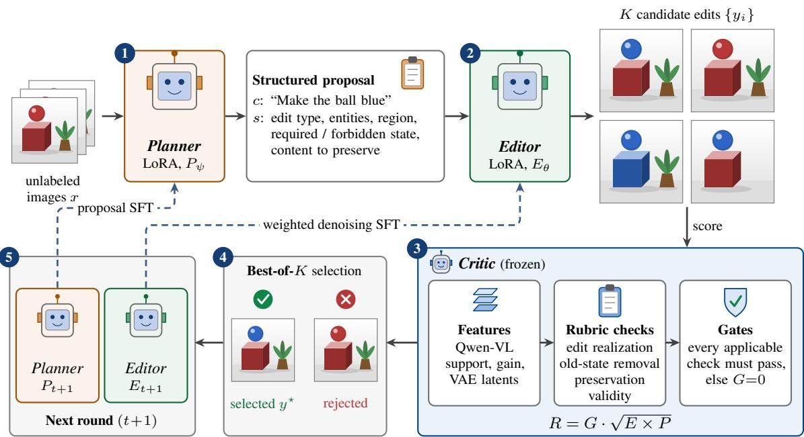
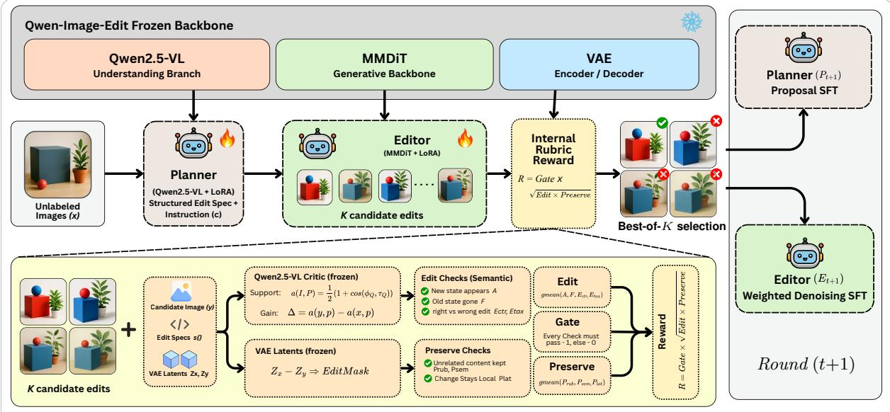
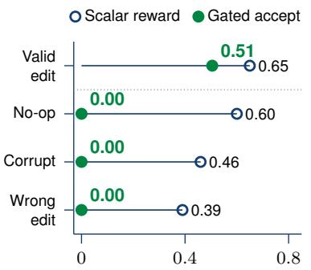
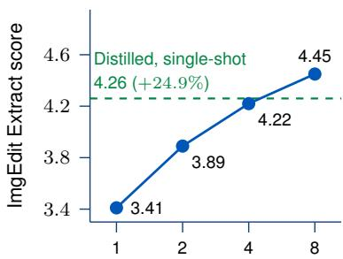
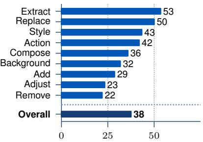
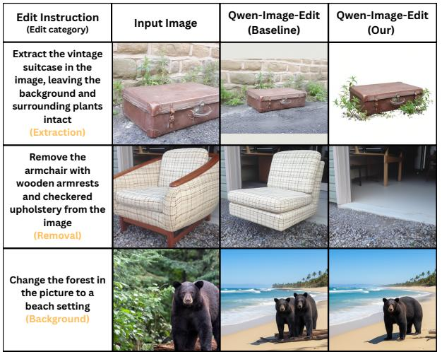
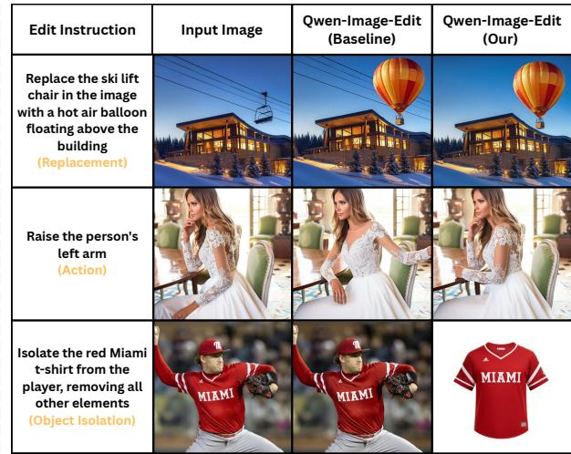
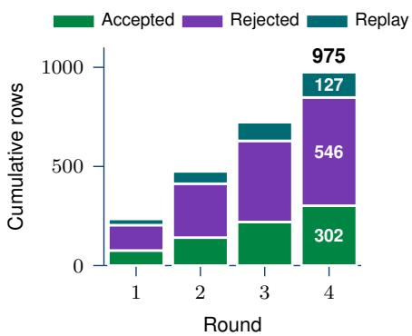
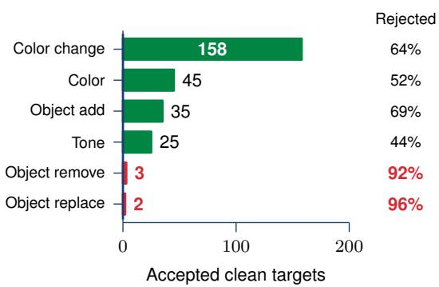
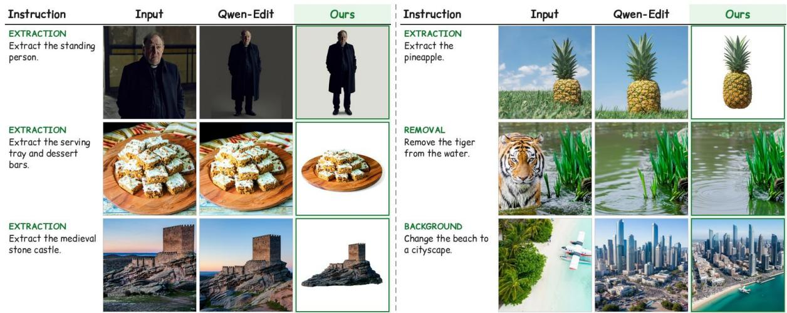

# Rubric-CEPR: Self-Evolving Image Editing via Reward-Verified Self-Distillation

Ritesh Thawkar1,∗ Shubham Patle1 Shravan Venkatraman1 Rao Muhammad Anwer1,2

1Mohamed bin Zayed University of Artificial Intelligence 2Aalto University

## Abstract

Instruction-guided image editors have become highly capable, yet improving them further still depends on human-edited training pairs or external reward models. Such supervision is costly to obtain and can reward plausible failures: a realistic output may leave the requested change undone or alter content that should be preserved. In this work, we strive to improve a pretrained image editor using only its own generations, without human-edited targets or an external training-time reward model. To this end, we propose a self-evolving framework, named Rubric-CEPR, that verifies the editor’s own samples with its internal representations through a rubric-augmented Contrastive Edit-Preservation Reward (CEPR). A Planner proposes structured edit instructions from unlabeled images, the Editor samples multiple candidate edits, and a frozen Critic scores each candidate with decomposed rubric checks for edit realization, removal of the old state, and content preservation, using features already exposed by the editor. Noncompensatory gates reject infeasible candidates, and the best verified candidate is distilled into the editor through lightweight adapter training. On Qwen-Image-Edit, Rubric-CEPR improves ImgEdit from 4.36 to 4.60 (+5.5%), with a +24.9% gain on object isolation, and transfers to GEdit-Bench and Complex-Edit. The same procedure also improves Step1X-Edit by +7.8% on ImgEdit. We hope our approach will serve as a solid baseline for image editors that improve themselves from their own verified samples.

Github Code: https://github.com/riteshthawkar/Rubric-CEPR

Project Page: https://riteshthawkar.github.io/Rubric-CEPR/

  
Figure 1: Illustration of our self-evolving image editing framework (Rubric-CEPR). Our Rubric-CEPR improves a pretrained image editor without human-edited targets or an external reward model. Given only unlabeled images, a Planner proposes structured edit instructions, the Editor samples K candidate edits, and an internal Critic scores them with features already exposed by the editor. Only the best gate-passing candidate per source becomes a target for weighted denoising SFT, so the editor learns from its own verified successes. The resulting single-shot checkpoint improves object isolation on ImgEdit from 3.41 → 4.26 (+24.9%) and the full ImgEdit score from 4.36 → 4.60 (+5.5%), and transfers to GEdit-Bench (+12.4%).

## 1 Introduction

Instruction-guided image editing has progressed rapidly, from inversion- and attention-based techniques [15, 30, 31] to instruction-following editors built on multimodal backbones [4, 5, 27, 34, 40]. An editor must satisfy two requirements: perform the requested change and preserve the content that the instruction leaves unchanged. Strong pretrained editors still violate this contract. For example, an instruction to isolate a shirt may produce a realistic photograph of the person wearing it, preserving appearance while failing to isolate the object (Figure 4). Improving editors beyond such failures currently relies on two forms of external supervision: (i) curated pairs of source and edited images [46, 49, 50], and (ii) learned reward models or multimodal judges that score generated edits [25, 28, 41]. Both are costly to scale, and a scalar measure of prompt relevance or visual plausibility can still favor an unchanged source, a partial edit, or an attractive output that discards important content.

Recent research in large language models explores self-evolving models that generate their own training data and improve from their own judgments [7, 39, 47, 48]. These methods show that a model can bootstrap from its own outputs when correctness can be checked from text, through answer agreement, reasoning traces, or a learned judge. In image editing, recent post-training methods optimize editors with preference or reward signals [25, 28, 38, 41, 52]. However, these approaches obtain their reward from a separately trained reward model or an external multimodal judge. Self-training an editor is particularly sensitive to this signal: plausible failures that pass a lenient score become supervision for the next model.

In this work, we investigate the following question: Can a pretrained image editor improve its own editing ability by verifying its generated edits with its own internal representations, without human-edited targets or an external reward model? To this end, we propose Rubric-CEPR, a self-evolving framework that follows a propose–edit– verify–distill loop (Figure 1) and scores candidates with a rubric-augmented Contrastive Edit-Preservation Reward (CEPR): the reward contrasts support for the requested edit with incorrect alternative instructions and rewards preservation of unrelated content, while the rubric adds explicit checks for required states, removal of forbidden old states, and preservation constraints. A Planner expresses the intended operation as an instruction and a structured specification. The Editor samples several candidate edits, and a fixed Critic checks the specification using the editor’s own multimodal features and latents. Edit realization, suppression of the old state, preservation, and validity are checked separately, and failure of any applicable check makes a candidate ineligible for training. The best verified candidate then supervises a lightweight editor adapter through the editor’s native denoising objective. It is worth mentioning that the primary model never queries a human-edited target or an external reward model during training.

We evaluate the resulting checkpoint in the standard single-shot setting. On Qwen-Image-Edit-2509, Rubric-CEPR improves ImgEdit from 4.36 to 4.60 (+5.5%), consistently across three training seeds, with a +24.9% gain on object isolation, the weakest family of the base editor. The same checkpoint transfers to GEdit-Bench and Complex-Edit, and applying the procedure to Step1X-Edit improves ImgEdit by +7.8%. Our analysis further shows that gains are largest where the base editor is weak but its success criterion is internally checkable.

In summary, our main contributions are:

• We introduce Rubric-CEPR, a self-evolving image editing framework in which a Planner, an Editor, and a fixed internal Critic form a propose–edit–verify–distill loop that improves a pretrained editor from unlabeled images, without human-edited targets or an external training-time reward model.

• We develop a decomposed rubric reward with non-compensatory feasibility gates that checks edit realization, removal of the old state, and preservation separately using editor-exposed Qwen-VL features and VAE latents, so that plausible failures cannot become training targets.

• We empirically validate Rubric-CEPR on ImgEdit, GEdit-Bench, and Complex-Edit, with a +5.5% ImgEdit gain and a +24.9% gain on object isolation for Qwen-Image-Edit-2509, and a +7.8% ImgEdit gain on Step1X-Edit We further show that training the Planner increases the rate of feasible targets by 62.4%.

## 2 Related Work

Instruction-guided image editing. Inversion, attention control, and feature manipulation enable edits to real images at inference time [1, 6, 9, 15, 20, 30–32, 36]. Instruction-following editors extend this interface to naturallanguage commands and multimodal backbones [4, 5, 11, 13, 18, 27, 34, 40, 46, 50], and are commonly evaluated on ImgEdit, GEdit-Bench, and Complex-Edit [27, 45, 46]. These editors are trained on large collections of curated source–target pairs [5, 46, 49, 50]. However, once pretrained, they provide no mechanism to keep improving from their own outputs without collecting new paired data.

Reward models and editing post-training. Human and text–image preference models provide supervision for image generation [21, 24, 42, 43]. EditReward [41] trains an editing-specific reward model on expert preference annotations and uses it to filter training data for Step1X. EditScore [28] connects editing-reward benchmarking, best-of-N selection, and online reinforcement learning, and UniWorld’s Edit-R1 framework [25] optimizes an editor with the logits of an external multimodal LLM through diffusion negative-aware fine-tuning. ImageEdit-R1 and NP-Edit also study reward-based editing updates [23, 52], while UniEdit-I couples understanding, editing, and verification at inference time [2]. While effective, these approaches require either a separately trained reward model, annotated preferences, or an external multimodal judge, and a single scalar score can still reward plausible outputs that do not realize the requested edit.

Self-training and preference optimization. Iterative self-generation and self-rewarding improve language models through instruction generation, reasoning, or preference training [7, 39, 47, 48]. Self-Rewarding Language Models [47] update both response generation and judging ability within the same model. In multimodal models, self-rewarding and self-evolving frameworks let the understanding branch supervise generation [14, 16, 19, 35], and CVPD distills a model’s own counterfactual visual evidence into dense perception supervision [37]. For editing, JarvisEvo co-optimizes a photo-editing agent as editor and evaluator [26], and MT-OPSD applies on-policy self-distillation to multi-turn editing [51]. DPO and its diffusion variants learn from preference pairs [33, 38, 44], and RL or differentiable-reward methods optimize rewards through denoising [3, 8, 10]. Verifier-guided search [29] improves samples at inference time, and reward over-optimization [12] shows that policies can exploit imperfect rewards. However, these methods target language, perception, text-to-image generation, tool-based retouching, or multi-turn consistency, and none verifies single-turn instruction edits against a structured specification, where the reward must distinguish a correct edit from a plausible but unedited output.

Our Approach. Different from the aforementioned approaches, Rubric-CEPR improves a pretrained image editor without human-edited targets or an external training-time reward model. Our framework uses only unlabeled source images and a Planner–Editor–Critic loop where (i) the Planner proposes structured edit specifications, (ii) the Editor samples candidate edits, and (iii) a fixed Critic verifies each candidate with the editor’s own Qwen-VL features, VAE latents, and simple image statistics. Instead of a single scalar score, the Critic checks edit realization, removal of the old state, and preservation separately, and non-compensatory gates reject any candidate that fails an applicable check. Unlike self-rewarding methods whose judge changes with the policy, our Critic stays fixed, so the selection criterion does not drift as the editor adapts. Verified targets are distilled with the editor’s native denoising objective, and the adapted editor is evaluated in the standard single-shot setting. Published results of reward-based editing methods are reported with their own base and protocol in Tables 1 and 2.

## 3 Method

Problem Formulation. We consider the setting of self-evolving image editing, where no human-edited targets or external reward models are available during training. Let $\chi = \{ \bar { \boldsymbol { x } } \}$ denote a collection of unlabeled source images and $E _ { 0 }$ a pretrained instruction-guided editor. Our goal is to improve $E _ { 0 }$ using training targets constructed from its own verified samples. To this end, we instantiate three components:

• a Planner $P _ { \psi } ( c , s \mid x )$ that proposes a natural-language instruction c and a structured edit specification s for image x;

• an Editor $E _ { \theta } ( y \mid x , c )$ that samples candidate edits y; and

• a fixed Critic $C ( x , c , s , y )$ that returns a reward R and a feasibility indicator $G \in \{ 0 , 1 \}$ from the editor’s own features.

The Planner and Editor are trained through lightweight LoRA adapters, while the reference feature interface and the Critic remain frozen.

Motivation. A natural baseline is to fine-tune the editor on its own generated candidates, either directly or ranked by a single scalar score. We observe that this fails for image editing: plausible but incorrect edits are common, and a scalar score cannot tell an unchanged or partially edited image from a correct one. A naive four-round self-training loop therefore improves the base editor less than verified targets do, as rejected candidates outnumber usable targets (Section 5.2). In Rubric-CEPR, we instead verify every candidate against the structured specification with decomposed checks and non-compensatory gates, and distill only verified targets into the editor, as shown in Figure 2. The primary instantiation targets object isolation, the weakest family of the base editor; broader verifier-bank variants are analyzed separately.

  
Figure 2: Overview of the Rubric-CEPR propose–edit–verify–distill loop. The frozen Qwen-Image-Edit backbone provides the Qwen2.5-VL understanding branch, the MMDiT generative backbone, and the VAE. Given an unlabeled image x, the Planner (Qwen2.5-VL with LoRA) emits an instruction c and a structured edit specification $s ,$ and the Editor (MMDiT with LoRA) samples K candidate edits. The frozen Critic converts s into rubric prompts and scores each candidate with Qwen-VL support and gain (Eq. (2)) and VAE-latent preservation checks. Semantic edit checks (the new state appears, the old state is gone, the right edit is made) and preservation checks (unrelated content is kept, the change stays local) form the non-compensatory reward $R = { \mathrm { G a t e } } \cdot { \sqrt { \mathrm { E d i t } } } \times { \mathrm { P r e s e r v e } }$ , where a candidate is rejected if any applicable check fails. The best gate-passing candidate trains the Editor with weighted denoising SFT, and band-pass proposal traces train the Planner, giving $P _ { t + 1 }$ and $E _ { t + 1 }$ for the next round. No external reward model is queried at any stage of the primary loop.

## 3.1 Structured Proposals and Candidate Selection

For a source x, the Planner produces an instruction c and specification s. The instruction is the natural-language command given to the Editor. The specification adds machine-readable fields: edit type, source and target entities, target region, required and forbidden after-states, and content to preserve. For example, isolate the red shirt specifies a complete shirt as the required output, the person and surrounding scene as forbidden output content, and shirt appearance as a preservation constraint. These fields determine the Critic’s atomic prompts; they are not a second edited target.

At round $t ,$ the current editor samples K candidates $y _ { i } \sim E _ { t } ( \cdot \mid x , c )$ and the Critic returns reward $R _ { i }$ and feasibility $G _ { i }$ . We retain one target:

$$
y ^ { \star } = \arg \operatorname* { m a x } _ { y _ { i } : G _ { i } = 1 } R _ { i } , \qquad \mathcal { D } _ { t } ^ { + } = \{ ( x , c , y ^ { \star } , R ^ { \star } ) : \exists i , G _ { i } = 1 \} .\tag{1}
$$

If no candidate passes, that proposal contributes no editor target. The primary self-distillation run uses $K = 4$ . The general loop may repeat proposal generation, sampling, and adapter updates; we evaluate the resulting checkpoint with one generation per instruction. Algorithms A1–A2 give the complete loop.

## 3.2 Frozen Internal Features

The image-conditioned feature $\phi _ { Q } ( I , p )$ and text anchor $\tau _ { Q } ( p )$ are mean-pooled final-layer states of the frozen reference Qwen-VL component, obtained with fixed multimodal and text-only templates. We compute

$$
\begin{array} { r } { a ( I , p ) = \frac { 1 } { 2 } \left[ 1 + \cos ( \phi _ { Q } ( I , p ) , \tau _ { Q } ( p ) ) \right] , \qquad d _ { p } ( y , x ) = a ( y , p ) - a ( x , p ) . } \end{array}\tag{2}
$$

Both features have the same dimensional representation, so no cross-model projection is required. This permits a similarity calculation; it does not guarantee calibrated edit correctness, which we examine with selection probes. The reference VAE encodes $z _ { x }$ and $z _ { y }$ for latent preservation and locality.

For the primary object-isolation reward, these features are supplemented by programmatic background-purity and object-completeness checks. No separate learned reward model or external VLM is queried for its targets. The

broader verifier bank additionally uses yes/no token log-probabilities from the editor-side VLM. Its addition analysis uses an open-vocabulary detector, so that analysis variant is distinct from the primary internal-only instantiation.

## 3.3 Decomposed Rubric and Feasibility Gates

Fixed templates convert s into prompt sets for source grounding $S ,$ required after-state $A ,$ forbidden after-state $F$ and explicit preservation $P _ { \mathrm { r u b } }$ . Grounding checks the source entity before the edit. Required-state prompts measure support and gain for the requested outcome. Forbidden-state prompts measure both loss of old-state support and its absolute absence. Preservation prompts compare the named unchanged content before and after the edit. Applicable terms aggregate shifted-sigmoid supports geometrically; inapplicable terms are omitted.

Two additional edit terms compare the true instruction with distractors: $E _ { \mathrm { c t r } }$ checks gain against counterfactual instructions, and $E _ { \mathrm { t a x } }$ compares required, old-state, and wrong-edit prompts. The scalar preservation term combines semantic and latent preservation, $\bar { P _ { C E P R } } = \mathrm { g m e a n } ( P _ { \mathrm { s e m } } , P _ { \mathrm { l a t } } )$ . Together with $E _ { \mathrm { c t r } }$ , this forms the Contrastive Edit-Preservation Reward (CEPR), which compares support for the requested edit against incorrect alternative instructions and rewards preserved content; the rubric prompts above extend it with explicit required-state, forbidden-state, and preservation checks. For applicable components,

$$
E = { \mathrm { g m e a n } } ( A , F , E _ { \mathrm { c t r } } , E _ { \mathrm { t a x } } ) , \qquad P = { \mathrm { g m e a n } } ( P _ { C E P R } , P _ { \mathrm { r u b } } ) , \qquad R = G { \sqrt { E P R } }\tag{3}
$$

Here gmean is the geometric mean. A geometric score alone still permits partial compensation; feasibility therefore requires each applicable check:

$$
G = \left( \prod _ { u \in \mathcal { U } } 1 [ u \geq \tau _ { u } ] \right) \mathbb { 1 } [ \sqrt { E P } \geq \tau _ { R } ] , \quad \mathcal { U } \subseteq \{ S , A , F , P _ { \mathrm { r u b } } , E _ { \mathrm { c t r } } , E _ { \mathrm { t a x } } , P _ { C E P R } , V , J \} .\tag{4}
$$

J is included only for supported verifier-bank checks. A failed gate makes the candidate ineligible for Eq. (1);   
visual plausibility cannot override a failed edit or preservation check.

The validity term $V$ uses a relative latent-change mask $M = \mathbb { 1 } [ | z _ { x } - z _ { y } | _ { \mathrm { n o r m } } > \delta ]$ . This mask estimates changed regions rather than supplying a ground-truth edit region. Sub-threshold differences remain outside $M ;$ the check penalizes their magnitude, mismatch with the area prior, and global drift. Thresholds and implementation settings are provided in Appendix F.

## 3.4 Editor and Planner Updates

For an accepted record, let $\ell _ { \mathrm { F M } } ^ { \mathrm { n a t i v e } }$ denote the official backend’s flow-matching denoising loss toward the selected target:

$$
\ell _ { \mathrm { F M } } ^ { \mathrm { n a t i v e } } ( \theta ; x , c , y ) = \mathbb { E } _ { t , \epsilon } \left[ \eta ( t ) \lVert v _ { \theta } ( z _ { t } , t ; z _ { x } , c ) - u _ { t } \rVert _ { 2 } ^ { 2 } \right] .\tag{5}
$$

The noisy target latent $z _ { t } ,$ flow target $u _ { t } ,$ and time weighting $\eta ( t )$ follow the backend’s scheduler and loss convention. Writing $\omega _ { r }$ for a record’s training weight, the weighted adapter update has the form

$$
{ \mathcal { L } } _ { E } = { \frac { \sum _ { r \in { \mathcal { D } } _ { t } ^ { + } \cup { \mathcal { D } } _ { t } ^ { \mathrm { i d } } } \omega _ { r } \ell _ { { \mathrm { F M } } } ^ { \mathrm { n a t i v e } } ( \theta ; x _ { r } , c _ { r } , y _ { r } ) } { \sum _ { r } \omega _ { r } } } + \lambda _ { \mathrm { a n c } } \| A _ { \theta } - A _ { \mathrm { w a r m } } \| _ { F } ^ { 2 } .\tag{6}
$$

$\mathcal { D } _ { t } ^ { \mathrm { i d } }$ contains identity/reconstruction replay pairs. $A _ { \theta }$ is the attention-only rank-16, α = 16 LoRA adapter, anchored to the warm-start adapter $A _ { \mathrm { w a r m } }$ with a relative-change cap. Targets and rewards are detached; rejected candidates do not enter the loss. The object-isolation run uses 400 SFT steps and learning rate $1 0 ^ { - 4 }$

The Planner learns normalized instruction/specification JSON with reward-weighted token SFT:

$$
\mathcal { L } _ { P } = - \frac { 1 } { Z _ { P } } \sum _ { j \in \mathcal { B } _ { t } } \beta _ { j } \log P _ { \psi } ( c _ { j } , s _ { j } \mid x _ { j } ) , \qquad Z _ { P } = \sum _ { j \in \mathcal { B } _ { t } } \beta _ { j } .\tag{7}
$$

The band-pass set $B _ { t }$ excludes proposals for which every candidate fails or every candidate passes, and retains traces satisfying the proposal reward and quality thresholds. The Planner adapter has rank $1 6 , \alpha = 3 2$ , learning rate $1 0 ^ { - 5 }$ and 16 training steps. This update improves proposal feasibility in the matched control of Section 5.3.

Table 1: Comparison with image editing methods on ImgEdit. We compare published editors, UniWorld (external reward), and our Rubric-CEPR, which self-distills Qwen-Image-Edit with only internal rewards. Rubric-CEPR improves every family and raises the overall score from 4.36 → 4.60 (+5.5%; +0.24 ± 0.02 SD over three seeds), with the largest gain on extraction $( 3 . 4 1  4 . 2 6 , + 2 4 . 9 \% )$ , the weakest base family. Scores are on the 0–5 scale and ∆ Improvement is the relative improvement over the base, 100 × (adapted − base)/base. †UniWorld post-trains Qwen-Image-Edit with an external multimodal-LLM reward model (training-free, logit-based) and reports 4.35 → 4.48 (+3.0%) over its own base. Rows from other papers use their own judges and are not directly comparable.
<table><tr><td>Model</td><td>Add</td><td>Remove</td><td>Replace Adjust</td><td></td><td>Action</td><td>Style</td><td>Bg.</td><td>Extract</td><td>Compose</td><td>Overall</td></tr><tr><td colspan="9">Image editing models</td></tr><tr><td>GPT-4o-Image [46]</td><td>4.65</td><td>3.81</td><td>4.49</td><td>4.26</td><td>4.76</td><td>4.75</td><td>4.62</td><td>2.96</td><td>4.54</td><td>4.32</td></tr><tr><td>Step1X-Edit [27]</td><td>3.90</td><td>2.61</td><td>3.45</td><td>3.13</td><td>3.43</td><td>4.44</td><td>3.19</td><td>1.87</td><td>2.52</td><td>3.17</td></tr><tr><td>ImgEdit-E1 [46]</td><td>3.82</td><td>2.40</td><td>2.80</td><td>4.04</td><td>3.21</td><td>4.38</td><td>3.38</td><td>2.55</td><td>2.87</td><td>3.27</td></tr><tr><td>UltraEdit [50]</td><td>3.63</td><td>1.71</td><td>3.13</td><td>3.01</td><td>3.57</td><td>3.69</td><td>3.31</td><td>2.02</td><td>2.33</td><td>2.93</td></tr><tr><td>MagicBrush [49]</td><td></td><td></td><td></td><td></td><td></td><td></td><td></td><td></td><td></td><td>1.90</td></tr><tr><td>InstructPix2Pix [5]</td><td>2.29</td><td>1.49</td><td>1.93</td><td>1.79</td><td>1.51</td><td>3.54</td><td>1.67</td><td>1.33</td><td>1.48</td><td>1.89</td></tr><tr><td colspan="9">Reward post-trained methods</td><td></td></tr><tr><td>UniWorld-Qwen-Edit† [25]</td><td>4.34</td><td>4.65</td><td>4.62</td><td>4.40</td><td>4.80</td><td>4.89</td><td>4.31</td><td>4.37</td><td>3.90</td><td>4.48</td></tr><tr><td>UniWorld-V2† [25]</td><td>4.29</td><td>4.72</td><td>4.69</td><td>4.44</td><td>4.83</td><td>4.91</td><td>4.41</td><td>4.32</td><td>3.83</td><td>4.49</td></tr><tr><td>Qwen-Image-Edit-2509 [40]</td><td>4.51</td><td>4.36</td><td>4.72</td><td>4.40</td><td>4.69</td><td>4.70</td><td>4.40</td><td>3.41</td><td>4.05</td><td>4.36</td></tr><tr><td>Rubric-CEPR (ours)</td><td>4.65</td><td>4.50</td><td>4.86</td><td>4.54</td><td>4.82</td><td>4.83</td><td>4.59</td><td>4.26</td><td>4.39</td><td>4.60</td></tr><tr><td>△ Improvement</td><td>+3.1%</td><td>+3.2%</td><td>+3.0%</td><td>+3.2%</td><td>+2.8%</td><td>+2.8%</td><td>+4.3%</td><td>+24.9%</td><td>+8.4%</td><td>+5.5%</td></tr></table>

## 4 Experimental Setup

## 4.1 Training Data and Implementation Details

Our training uses only unlabeled, off-benchmark source images; no benchmark image or human-edited target is used for supervision. All editor targets are the editor’s own candidates selected by the Critic. The primary base is Qwen-Image-Edit-2509. The Editor is adapted with an attention-only rank-16 LoRA (α = 16) for 400 SFT steps with learning rate $1 0 ^ { - 4 }$ , using $K = 4$ candidates per proposal; the Planner uses a rank-16 LoRA (α = 32) trained for 16 steps with learning rate $1 0 ^ { - 5 }$ . A second instantiation applies the same procedure to Step1X-Edit with its own VLM and VAE, without importing Qwen-Image-Edit weights. Table A6 lists all generation, adapter, and verifier settings.

## 4.2 Evaluation

We evaluate on the full ImgEdit, GEdit-Bench, and Complex-Edit benchmarks with one generation per instruction and matched generation settings for the base and adapted editors. ImgEdit is scored with GPT-4o ratings on the 0–5 scale (Table 1). GEdit-Bench uses all 11 tasks with mixed-language prompts scored by GPT-4.1 VIEScore, and Complex-Edit uses its compound edits and 0–10 metrics (Table 2). For Step1X-Edit, we report GEdit-Bench and ImgEdit (Table 3). Results taken from other papers keep their original protocols and are not rebased onto our scores. The GEdit-Bench background task was also used when choosing reward types.

## 4.3 Baselines and Controls

We compare against the pretrained base editor evaluated under the same protocol, published image editors, and UniWorld [25], which post-trains the same base with an external multimodal reward. To analyze the components of Rubric-CEPR, we further use: (i) a naive four-round self-training loop with two candidates per proposal and no feasibility gates; (ii) a fixed 210-pair probe that tests candidate ranking and negative-control acceptance; and (iii) a Planner control that changes only whether the Planner is trained, together with a blinded 64-source audit of proposal grounding. We report the sample standard deviation (SD) over three training seeds where multiple seeds were trained, and otherwise the bootstrap standard error (s.e.) of the paired score difference over test items (Step1X-Edit ImgEdit).

## 5 Results and Analysis

We first report the main results on ImgEdit, the transfer to GEdit-Bench, Complex-Edit and a second editor, then analyze why verified targets matter and what training the Planner adds.

Table 2: Transfer of Rubric-CEPR to GEdit-Bench and Complex-Edit. We evaluate the same checkpoint as in Table 1 without any further adaptation. Rubric-CEPR improves every reported metric over its Qwen-Image-Edit base, raising the GEdit-Bench overall score from 7.39→ 8.31 (+12.4%) and the Complex-Edit overall score from 8.77 → 8.97 (+2.3%), with the largest Complex-Edit gains on perceptual quality (+4.9%) and identity preservation (+1.8%). This suggests that the verified targets improve editing quality beyond the edit types emphasized during training. Scores are on the 0–10 scale; GEdit-Bench reports Semantic Consistency, Perceptual Quality, and Overall VIEScore [22]; Complex-Edit reports Instruction Following, Identity Preservation, Perceptual Quality, and Overall, the mean of the three metrics. Results of other methods [25, 27, 45] are reported under their own protocols. ∆ Improvement is the relative improvement over the base. †UniWorld uses an external multimodal-LLM reward model during post-training and reports 7.54 → 7.76 (+2.9%) over its own Qwen-Image-Edit base on GEdit-Bench.
<table><tr><td></td><td colspan="3">GEdit-Bench</td><td colspan="4">Complex-Edit</td></tr><tr><td>Model</td><td>Semantic Consistency</td><td>Perceptual Quality</td><td>Overall</td><td>Instruction Following</td><td>Identity Preservation</td><td>Perceptual Quality</td><td>Overall</td></tr><tr><td colspan="8">Image editing models</td></tr><tr><td>GPT-40</td><td>7.74</td><td>8.13</td><td>7.49</td><td>9.29</td><td>7.51</td><td>9.47</td><td>8.76</td></tr><tr><td>Imagen3</td><td></td><td></td><td></td><td>7.56</td><td>6.55</td><td>7.67</td><td>7.26</td></tr><tr><td>SeedEdit</td><td>7.22</td><td>7.89</td><td>6.98</td><td>8.49</td><td>6.91</td><td>8.74</td><td>8.04</td></tr><tr><td>Step1X-Edit [27]</td><td>7.13</td><td>7.00</td><td>6.44</td><td></td><td></td><td></td><td></td></tr><tr><td>Step1X-Edit v1.1 [27]</td><td>7.66</td><td>7.35</td><td>6.97</td><td></td><td></td><td></td><td></td></tr><tr><td>Gemini 2.0 Flash</td><td>6.87</td><td>7.44</td><td>6.51</td><td></td><td></td><td></td><td></td></tr><tr><td>OmniGen</td><td>5.88</td><td>5.87</td><td>5.01</td><td>6.25</td><td>6.42</td><td>7.54</td><td>6.74</td></tr><tr><td>AnyEdit</td><td>3.05</td><td>5.88</td><td>2.85</td><td>1.60</td><td>8.15</td><td>7.25</td><td>5.67</td></tr><tr><td>UltraEdit [50]</td><td></td><td></td><td></td><td>6.56</td><td>5.93</td><td>7.29</td><td>6.59</td></tr><tr><td>MagicBrush [49]</td><td>4.52</td><td>6.37</td><td>4.19</td><td></td><td></td><td></td><td></td></tr><tr><td>InstructPix2Pix [5]</td><td>3.30</td><td>6.19</td><td>3.22</td><td></td><td></td><td></td><td></td></tr><tr><td colspan="8">Reward post-trained methods</td></tr><tr><td>UniWorld-Qwen-Edit† [25]</td><td>8.36</td><td>7.87</td><td>7.76</td><td>9.73</td><td>9.08</td><td>7.61</td><td>8.81</td></tr><tr><td>UniWorld-V2† [25]</td><td>8.39</td><td>8.02</td><td>7.83</td><td></td><td></td><td></td><td></td></tr><tr><td>Qwen-Image-Edit-2509 [40]</td><td>8.11</td><td>7.10</td><td>7.39</td><td>9.69</td><td>9.02</td><td>7.60</td><td>8.77</td></tr><tr><td>Rubric-CEPR (ours) △ Improvement</td><td>9.05 +11.6%</td><td>7.92 +11.5%</td><td>8.31 +12.4%</td><td>9.75 +0.7%</td><td>9.18 +1.8%</td><td>7.97 +4.9%</td><td>8.97 +2.3%</td></tr></table>

## 5.1 Main Results

In Table 1, we compare Rubric-CEPR with three groups of baselines: (1) the pretrained Qwen-Image-Edit base without additional training, evaluated under our protocol; (2) published image editors; and (3) UniWorld, which post-trains the same base with an external multimodal reward.

Qwen-Image-Edit (Base). The base editor is already strong on many edit types, such as action (4.69), replacement (4.72), and style (4.70). However, its performance drops on edits that require removing surrounding content while keeping the target intact, most notably extraction (3.41) and composition (4.05), indicating that pretraining alone does not reliably enforce the edit contract.

Rubric-CEPR (Ours). Self-distilling verified targets improves every edit family and raises the overall ImgEdit score from 4.36 to 4.60 (+5.5%). The adapted score is stable across three training seeds (4.58, 4.60, and 4.62; 4.60 ± 0.02 SD), giving a gain of +0.24 ± 0.02 SD. The largest improvement is on extraction, which rises from 3.41 to 4.26 (+24.9%), followed by composition (+8.4%); the remaining seven families gain between +2.8% and +4.3%. Measured against the headroom left below the 5.0 ceiling, Rubric-CEPR closes between 22% and 53% of the remaining gap on every family (Figure 3c), so the large extraction gain largely reflects its large headroom. UniWorld reports +3.0% over its own base with an external multimodal reward; Rubric-CEPR obtains a larger relative gain using only internal signals, although the two evaluation protocols differ.

Transfer to other benchmarks. The same checkpoint transfers without further adaptation (Table 2). GEdit-Bench improves from 7.39 to 8.31 (+12.4%) and Complex-Edit from 8.77 to 8.97 (+2.3%), and every reported submetric improves, including identity preservation (+1.8%) and perceptual quality (+4.9%) on Complex-Edit. At the task level, all eleven GEdit-Bench tasks improve, with the largest gains on style change, human photo editing, and tone transfer (Table A9).

Generalization to a second editor. Applying the same procedure to Step1X-Edit improves the overall GEdit-Bench score from 6.69 to 7.24 (+8.2%; +0.55 ± 0.05 SD across three training seeds) and ImgEdit from 3.86 to 4.16

Table 3: Rubric-CEPR generalizes to a second editor, Step1X-Edit. We apply the same procedure to Step1X-Edit using its own VLM and VAE features, without any Qwen-Image-Edit weights. Self-distillation raises the overall GEdit-Bench score from 6.69 → 7.24 (+8.2%) and the overall ImgEdit score from $3 . 8 6 \to 4 . 1 6 ( + 7 . 8 \% )$ . This shows that internal verification is not specific to a single editor. ∆ Improvement is the relative improvement over the base. The overall gains are $+ 0 . 5 5 \pm 0 . 0 5$ SD over three training seeds for GEdit-Bench and +0.30 ± 0.06 s.e. for ImgEdit.
<table><tr><td rowspan="2"></td><td colspan="3">GEdit-Bench</td><td rowspan="2">ImgEdit</td></tr><tr><td>Semantic Consistency</td><td>Perceptual</td><td>Overall</td></tr><tr><td>Model</td><td></td><td>Quality</td><td></td><td>Overall</td></tr><tr><td>Step1X-Edit [27] Rubric-CEPR (ours)</td><td>7.07 7.84</td><td>7.58 8.05</td><td>6.69 7.24</td><td>3.86 4.16</td></tr><tr><td>∆ Improvement</td><td>+10.9%</td><td>+6.2%</td><td>+8.2%</td><td>+7.8%</td></tr></table>

Table 4: The internal reward ranks candidate edits far better than a naive composite. We measure how often each signal selects the stronger edit in a held-out pair (30 pairs per family; chance = 0.50). A naive product of all reward components collapses on near-ceiling families (e.g., 0.13 on action change) because it over-weights preservation, whereas the reward used for target selection reaches 0.85 pooled accuracy. This ranking ability allows self-distillation targets to be mined without an external judge.
<table><tr><td>Family</td><td>Naive composite</td><td>VLM success</td><td>CEPR edit</td><td>Reward (ours)</td></tr><tr><td>Action change</td><td>0.13</td><td>0.90</td><td>0.87</td><td>0.87</td></tr><tr><td>Color change</td><td>0.17</td><td>0.80</td><td>0.87</td><td>0.87</td></tr><tr><td>Compose</td><td>0.20</td><td>0.97</td><td>0.96</td><td>0.97</td></tr><tr><td>Material change</td><td>0.27</td><td>0.73</td><td>0.80</td><td>0.80</td></tr><tr><td>Object addition</td><td>0.33</td><td>0.83</td><td>0.87</td><td>0.87</td></tr><tr><td>Object removal</td><td>0.60</td><td>0.47</td><td>0.57</td><td>0.60</td></tr><tr><td>Object replacement</td><td>0.87</td><td>1.00</td><td>0.97</td><td>0.97</td></tr><tr><td>Pooled</td><td>0.37</td><td>0.81</td><td>0.84</td><td>0.85</td></tr></table>

$( + 7 . 8 \% ; + 0 . 3 0 \pm 0 . 0 6 \ \mathrm { s . e . } )$ , improving the overall score on both benchmarks (Table 3). Since Step1X-Edit uses its own VLM and VAE, this shows that internal verification is not specific to a single editor.

## 5.2 Why Verified Targets Matter

Naive self-training improves less. Training on the editor’s own candidates without feasibility gates yields a smaller ImgEdit gain $( + 0 . 0 9 , + 2 . 0 \% )$ than Rubric-CEPR (+5.5%), and a smaller GEdit-Bench diagnostic gain (+0.77, +10.5% vs. +12.4%). The training manifest (Appendix B, Figure A1) explains this behavior: rejected candidates outnumber accepted ones, and the few clean targets are dominated by easy color edits, while removal and replacement receive almost none.

Gates keep plausible failures out of training. A useful selector must both rank valid edits and reject invalid ones. On the fixed 210-pair probe, our reward chooses the stronger edit in 84.8% of pairs, compared with 36.7% for a naive product of its components (Table 4). The full verifier-bank gate accepts 50.5% of valid edits and none of the no-op, corrupted, or wrong-edit controls, whereas a scalar reward still assigns them scores of 0.39–0.60 (Figure 3a). Removing the editor-side VLM check admits 4.8% of corrupted candidates (Table A7).

Self-distillation internalizes best-of-K headroom. For the primary isolation reward, mean border whiteness is 0.208 for outputs that the evaluation judge scores at least 4, compared with 0.014 for outputs scored at most 2, showing that the internal check tracks edit success. Reward-best selection from K=1, 2, 4, 8 base samples raises the extraction score from 3.41 to 3.89, 4.22, and 4.45, and training on verified four-candidate targets reaches 4.26 with a single generation, on par with best-of-4 (Figure 3b). On the full extraction family the matched change is 3.41 to 4.26 (+0.85, +24.9%), with 71/27/19 wins/ties/losses against the base. Figure 4 shows representative edits.

## 5.3 Proposal Learning and Reward Coverage

Training the Planner. In a matched control that changes only whether the Planner is trained, a trained Planner improves both target availability and the downstream Editor. It raises the feasible-source rate, the share of source images with at least one gate-passing candidate, from 12.5% to 20.3% (+62.4% relative) and the best Critic score by 0.06, and the downstream Editor gains +0.10 ± 0.02 SD on ImgEdit over three training seeds. This shows that proposal quality, and not only target selection, drives self-distillation. A blinded audit finds correctly grounded proposals for 58 of 64 sources (κ = 0.82; Appendix G.3).

(a) Gate validation  
  
Score / acceptance rate

(b) Best-of-K headroom  
  
Samples K (best-of-K)

(c) Headroom closed  
  
Headroom closed (%)

Figure 3: Verified targets, recoverable headroom, and where the gains land. (a) Valid targets. On a fixed 210-pair probe, a scalar reward still assigns 0.39–0.60 to no-op, corrupted, and wrong-edit candidates, whereas our feasibility gates accept 51% of valid edits and none of the invalid ones. (b) Recoverable headroom. On the extraction (object-isolation) family, reward-best selection from K base samples raises the score from 3.41 (K=1) to 3.89, 4.22, and 4.45 (K=2, 4, 8), and the single-shot distilled checkpoint reaches 4.26 (+24.9%), on par with best-of-4 without any inference-time sampling. (c) Headroom closed. Share of the gap between the base score and the 5.0 judge ceiling that Rubric-CEPR closes on each ImgEdit family, (ours − base)/(5 − base) from Table 1. Extraction’s large relative gain (+24.9%) largely reflects its large headroom: it closes 53% of the gap, similar to replacement (50%) and style (43%), and every family closes between 22% and 53%, a 2.4× spread compared with 9× for the raw relative gains.  

  
Figure 4: Qualitative comparison between Qwen-Image-Edit and our Rubric-CEPR on ImgEdit. Each row shows the edit instruction with its category, the input image, the baseline output, and ours. The baseline often returns a realistic image that leaves the requested change undone; for example, it keeps the player when asked to isolate the red shirt (bottom right). Rubric-CEPR completes such edits while preserving the content that the instruction leaves unchanged. Additional examples are provided in Appendix H.

Broader reward coverage. A four-type verifier-bank model retains the isolation improvement (+25.8%) and reaches a similar overall gain (+5.3% vs. +5.5% for the primary isolation model; Table A8), but its composition gain is smaller (+3.2% vs. +8.4%). Covering more edit types therefore does not compound the benefit of the aligned reward.

## 6 Limitations

Rubric-CEPR amplifies successful behavior that already has nonzero support in the editor’s sampling distribution. Under independent draws with valid-target probability p, the chance of finding a target among K candidates is $1 - ( 1 - p ) ^ { \mathbf { \hat { K } } }$ , so increasing K cannot recover an edit when $p = 0$ . Gains are also concentrated where success is internally checkable: on adjustment edits, the tested internal signals recover at most 30% of the oracle headroom (Appendix C.3). The approach requires access to the editor’s multimodal features and latents, and our evidence covers two multimodal diffusion editors. Evaluation relies on automatic judges, and published results use their own protocols. Finally, the primary result is a single adaptation pass over one source pool. Independent human assessment, matched random, scalar, and learned-reward controls at the primary training budget, and multi-round learning curves would further strengthen claims about verification quality and sustained self-improvement.

## 7 Conclusion

We introduced Rubric-CEPR, a self-evolving framework that improves a pretrained image editor without humanedited targets or an external training-time reward model. By coupling a Planner, an Editor, and a fixed internal Critic in a propose–edit–verify–distill loop, and verifying each candidate with decomposed rubric checks and non-compensatory gates, the editor learns only from its own verified successes. Our experiments show consistent gains on ImgEdit, with the largest improvement on object isolation, transfer to GEdit-Bench and Complex-Edit, and a second successful instantiation on Step1X-Edit. Our analyses show that verified targets give larger gains than naive self-training, and that training the Planner further improves the Editor. This work takes a step toward image editors that improve themselves from their own verified samples, and suggests future directions in richer internal verifiers, multi-round self-evolution, and broader edit types.

## Acknowledgements

The computations were enabled by resources provided by LUMI hosted by CSC (Finland) and LUMI consortium, and by Berzelius resource provided by the Knut and Alice Wallenberg Foundation at the NSC.

## References

[1] Omri Avrahami, Dani Lischinski, and Ohad Fried. Blended diffusion for text-driven editing of natural images. In IEEE Conference on Computer Vision and Pattern Recognition, 2022.

[2] Chengyu Bai, Jintao Chen, Xiang Bai, Yilong Chen, Qi She, Ming Lu, and Shanghang Zhang. UniEdit-I: Training-free image editing for unified VLM via iterative understanding, editing and verifying. arXiv preprint arXiv:2508.03142, 2025.

[3] Kevin Black, Michael Janner, Yilun Du, Ilya Kostrikov, and Sergey Levine. Training diffusion models with reinforcement learning. In International Conference on Learning Representations, 2024.

[4] Black Forest Labs. FLUX.1 Kontext: Flow matching for in-context image generation and editing in latent space. arXiv preprint arXiv:2506.15742, 2025.

[5] Tim Brooks, Aleksander Holynski, and Alexei A. Efros. Instructpix2pix: Learning to follow image editing instructions. In IEEE Conference on Computer Vision and Pattern Recognition, 2023.

[6] Mingdeng Cao, Xintao Wang, Zhongang Qi, Ying Shan, Xiaohu Qie, and Yinqiang Zheng. MasaCtrl: Tuningfree mutual self-attention control for consistent image synthesis and editing. In IEEE International Conference on Computer Vision, 2023.

[7] Zixiang Chen, Yihe Deng, Huizhuo Yuan, Kaixuan Ji, and Quanquan Gu. Self-play fine-tuning converts weak language models to strong language models. In International Conference on Machine Learning, 2024.

[8] Kevin Clark, Paul Vicol, Kevin Swersky, and David J. Fleet. Directly fine-tuning diffusion models on differentiable rewards. In International Conference on Learning Representations, 2024.

[9] Guillaume Couairon, Jakob Verbeek, Holger Schwenk, and Matthieu Cord. DiffEdit: Diffusion-based semantic image editing with mask guidance. In International Conference on Learning Representations, 2023.

[10] Ying Fan, Olivia Watkins, Yuqing Du, Hao Liu, Moonkyung Ryu, Craig Boutilier, Pieter Abbeel, Mohammad Ghavamzadeh, Kangwook Lee, and Kimin Lee. DPOK: Reinforcement learning for fine-tuning text-to-image diffusion models. In Advances in Neural Information Processing Systems, 2023.

[11] Tsu-Jui Fu, Wenze Hu, Xianzhi Du, William Yang Wang, Yinfei Yang, and Zhe Gan. Guiding instruction-based image editing via multimodal large language models. In International Conference on Learning Representations, 2024.

[12] Leo Gao, John Schulman, and Jacob Hilton. Scaling laws for reward model overoptimization. In International Conference on Machine Learning, 2023.

[13] Zigang Geng, Binxin Yang, Tiankai Hang, Chen Li, Shuyang Gu, Ting Zhang, Jianmin Bao, Zheng Zhang, Han Hu, Dong Chen, and Baining Guo. Instructdiffusion: A generalist modeling interface for vision tasks. In IEEE Conference on Computer Vision and Pattern Recognition, 2024.

[14] Ruiyan Han, Zhen Fang, XinYu Sun, Yuchen Ma, Ziheng Wang, Yu Zeng, Zehui Chen, Lin Chen, Wenxuan Huang, Wei-Jie Xu, Yi Cao, and Feng Zhao. UniCorn: Towards self-improving unified multimodal models through self-generated supervision. arXiv preprint arXiv:2601.03193, 2026.

[15] Amir Hertz, Ron Mokady, Jay Tenenbaum, Kfir Aberman, Yael Pritch, and Daniel Cohen-Or. Prompt-toprompt image editing with cross attention control. In International Conference on Learning Representations, 2023.

[16] Jixiang Hong, Yiran Zhang, Guanzhong Wang, Yi Liu, Ji-Rong Wen, and Rui Yan. SUDER: Self-improving unified large multimodal models for understanding and generation with dual self-rewards. arXiv preprint arXiv:2506.07963, 2025.

[17] Edward J. Hu, Yelong Shen, Phillip Wallis, Zeyuan Allen-Zhu, Yuanzhi Li, Shean Wang, Lu Wang, and Weizhu Chen. LoRA: Low-rank adaptation of large language models. In International Conference on Learning Representations, 2022.

[18] Yuzhou Huang, Liangbin Xie, Xintao Wang, Ziyang Yuan, Xiaodong Cun, Yixiao Ge, Jiantao Zhou, Chao Dong, Rui Huang, Ruimao Zhang, and Ying Shan. SmartEdit: Exploring complex instruction-based image editing with multimodal large language models. In IEEE Conference on Computer Vision and Pattern Recognition, 2024.

[19] Weiyang Jin, Yuwei Niu, Jiaqi Liao, Chengqi Duan, Aoxue Li, Shenghua Gao, and Xihui Liu. SRUM: Fine-grained self-rewarding for unified multimodal models. In European Conference on Computer Vision, 2026.

[20] Bahjat Kawar, Shiran Zada, Oran Lang, Omer Tov, Huiwen Chang, Tali Dekel, Inbar Mosseri, and Michal Irani. Imagic: Text-based real image editing with diffusion models. In IEEE Conference on Computer Vision and Pattern Recognition, 2023.

[21] Yuval Kirstain, Adam Polyak, Uriel Singer, Shahbuland Matiana, Joe Penna, and Omer Levy. Pick-a-pic: An open dataset of user preferences for text-to-image generation. In Advances in Neural Information Processing Systems, 2023.

[22] Max Ku, Dongfu Jiang, Cong Wei, Xiang Yue, and Wenhu Chen. VIEScore: Towards explainable metrics for conditional image synthesis evaluation. In Annual Meeting of the Association for Computational Linguistics, 2024.

[23] Nupur Kumari, Sheng-Yu Wang, Nanxuan Zhao, Yotam Nitzan, Yuheng Li, Krishna Kumar Singh, Richard Zhang, Eli Shechtman, Jun-Yan Zhu, and Xun Huang. Learning an image editing model without image editing pairs. In International Conference on Learning Representations, 2026.

[24] Kimin Lee, Hao Liu, Moonkyung Ryu, Olivia Watkins, Yuqing Du, Craig Boutilier, Pieter Abbeel, Mohammad Ghavamzadeh, and Shixiang Shane Gu. Aligning text-to-image models using human feedback. arXiv preprint arXiv:2302.12192, 2023.

[25] Zongjian Li, Zheyuan Liu, Qihui Zhang, Bin Lin, Feize Wu, Shenghai Yuan, Zhiyuan Yan, Yang Ye, Wangbo Yu, Yuwei Niu, Shaodong Wang, Xinhua Cheng, and Li Yuan. Uniworld-V2: Reinforce image editing with diffusion negative-aware finetuning and MLLM implicit feedback. arXiv preprint arXiv:2510.16888, 2025.

[26] Yunlong Lin, Linqing Wang, Kunjie Lin, Zixu Lin, Kaixiong Gong, Wenbo Li, Bin Lin, Zhenxi Li, Shiyi Zhang, Yuyang Peng, Wenxun Dai, Xinghao Ding, Chunyu Wang, and Qinglin Lu. JarvisEvo: Towards a self-evolving photo editing agent with synergistic editor-evaluator optimization. arXiv preprint arXiv:2511.23002, 2025.

[27] Shiyu Liu, Yucheng Han, Peng Xing, Fukun Yin, Rui Wang, Wei Cheng, Jiaqi Liao, Yingming Wang, Honghao Fu, Chunrui Han, Guopeng Li, Yuang Peng, Quan Sun, Jingwei Wu, Yan Cai, Zheng Ge, Ranchen Ming, Lei Xia, Xianfang Zeng, Yibo Zhu, Binxing Jiao, Xiangyu Zhang, Gang Yu, and Daxin Jiang. Step1X-Edit: A practical framework for general image editing. arXiv preprint arXiv:2504.17761, 2025.

[28] Xin Luo, Jiahao Wang, Chenyuan Wu, Shitao Xiao, Xiyan Jiang, Defu Lian, Jiajun Zhang, Dong Liu, and Zheng Liu. EditScore: Unlocking online RL for image editing via high-fidelity reward modeling. In International Conference on Learning Representations, 2026. URL https://proceedings.iclr.cc/paper\_files/ paper/2026/hash/381ceeae4a1feb1abc59c773f7e61839-Abstract-Conference.html.

[29] Nanye Ma, Shangyuan Tong, Haolin Jia, Hexiang Hu, Yu-Chuan Su, Mingda Zhang, Xuan Yang, Yandong Li, Tommi Jaakkola, Xuhui Jia, and Saining Xie. Inference-time scaling for diffusion models beyond scaling denoising steps. arXiv preprint arXiv:2501.09732, 2025.

[30] Chenlin Meng, Yutong He, Yang Song, Jiaming Song, Jiajun Wu, Jun-Yan Zhu, and Stefano Ermon. SDEdit: Guided image synthesis and editing with stochastic differential equations. In International Conference on Learning Representations, 2022.

[31] Ron Mokady, Amir Hertz, Kfir Aberman, Yael Pritch, and Daniel Cohen-Or. Null-text inversion for editing real images using guided diffusion models. In IEEE Conference on Computer Vision and Pattern Recognition, 2023.

[32] Gaurav Parmar, Krishna Kumar Singh, Richard Zhang, Yijun Li, Jingwan Lu, and Jun-Yan Zhu. Zero-shot image-to-image translation. In ACM SIGGRAPH Conference Proceedings, 2023.

[33] Rafael Rafailov, Archit Sharma, Eric Mitchell, Stefano Ermon, Christopher D. Manning, and Chelsea Finn. Direct preference optimization: Your language model is secretly a reward model. In Advances in Neural Information Processing Systems, 2023.

[34] Shelly Sheynin, Adam Polyak, Uriel Singer, Yuval Kirstain, Amit Zohar, Oron Ashual, Devi Parikh, and Yaniv Taigman. Emu edit: Precise image editing via recognition and generation tasks. In IEEE Conference on Computer Vision and Pattern Recognition, 2024.

[35] Ritesh Thawkar, Shravan Venkatraman, Omkar Thawakar, Abdelrahman Shaker, Fahad Khan, Hisham Cholakkal, Salman Khan, and Rao Muhammad Anwer. Ask, solve, generate: Self-evolving unified multimodal understanding and generation via self-consistency rewards. arXiv preprint arXiv:2606.27376, 2026.

[36] Narek Tumanyan, Michal Geyer, Shai Bagon, and Tali Dekel. Plug-and-play diffusion features for text-driven image-to-image translation. In IEEE Conference on Computer Vision and Pattern Recognition, 2023.

[37] Shravan Venkatraman, Omkar Thawakar, Ritesh Thawkar, Abdelrahman Shaker, and Rao Muhammad Anwer. Perception before supervision: Self-contained visual distillation from counterfactual blind spots. In British Machine Vision Conference, 2026.

[38] Bram Wallace, Meihua Dang, Rafael Rafailov, Linqi Zhou, Aaron Lou, Senthil Purushwalkam, Stefano Ermon, Caiming Xiong, Shafiq Joty, and Nikhil Naik. Diffusion model alignment using direct preference optimization. In IEEE Conference on Computer Vision and Pattern Recognition, 2024.

[39] Yizhong Wang, Yeganeh Kordi, Swaroop Mishra, Alisa Liu, Noah A. Smith, Daniel Khashabi, and Hannaneh Hajishirzi. Self-instruct: Aligning language models with self-generated instructions. In Annual Meeting of the Associationfor Computational Linguistics, 2023.

[40] Chenfei Wu et al. Qwen-Image technical report. arXiv preprint arXiv:2508.02324, 2025.

[41] Keming Wu, Sicong Jiang, Max Ku, Ping Nie, Minghao Liu, and Wenhu Chen. EditReward: A human-aligned reward model for instruction-guided image editing. In International Conference on Learning Representations, 2026.

[42] Xiaoshi Wu, Yiming Hao, Keqiang Sun, Yixiong Chen, Feng Zhu, Rui Zhao, and Hongsheng Li. Human preference score v2: A solid benchmark for evaluating human preferences of text-to-image synthesis. arXiv preprint arXiv:2306.09341, 2023.

[43] Jiazheng Xu, Xiao Liu, Yuchen Wu, Yuxuan Tong, Qinkai Li, Ming Ding, Jie Tang, and Yuxiao Dong. ImageReward: Learning and evaluating human preferences for text-to-image generation. In Advances in Neural Information Processing Systems, 2023.

[44] Kai Yang, Jian Tao, Jiafei Lyu, Chunjiang Ge, Jiaxin Chen, Qimai Li, Weihan Shen, Xiaolong Zhu, and Xiu Li. Using human feedback to fine-tune diffusion models without any reward model. In IEEE Conference on Computer Vision and Pattern Recognition, 2024.

[45] Siwei Yang, Mude Hui, Bingchen Zhao, Yuyin Zhou, Nataniel Ruiz, and Cihang Xie. Complex-Edit: CoT-like instruction generation for complexity-controllable image editing benchmark. arXiv preprint arXiv:2504.13143, 2025.

[46] Yang Ye, Xianyi He, Zongjian Li, Bin Lin, Shenghai Yuan, Zhiyuan Yan, Bohan Hou, and Li Yuan. ImgEdit: A unified image editing dataset and benchmark. arXiv preprint arXiv:2505.20275, 2025.

[47] Weizhe Yuan, Richard Yuanzhe Pang, Kyunghyun Cho, Xian Li, Sainbayar Sukhbaatar, Jing Xu, and Jason Weston. Self-rewarding language models. In International Conference on Machine Learning, 2024.

[48] Eric Zelikman, Yuhuai Wu, Jesse Mu, and Noah D. Goodman. STaR: Bootstrapping reasoning with reasoning. In Advances in Neural Information Processing Systems, 2022.

[49] Kai Zhang, Lingbo Mo, Wenhu Chen, Huan Sun, and Yu Su. Magicbrush: A manually annotated dataset for instruction-guided image editing. In Advances in Neural Information Processing Systems, 2023.

[50] Haozhe Zhao, Xiaojian Ma, Liang Chen, Shuzheng Si, Rujie Wu, Kaikai An, Peiyu Yu, Minjia Zhang, Qing Li, and Baobao Chang. UltraEdit: Instruction-based fine-grained image editing at scale. In Advances in Neural Information Processing Systems, 2024.

[51] Liangbing Zhao, Le Zhuo, and Mohamed Elhoseiny. On-policy self-distillation for multi-turn image editing. arXiv preprint arXiv:2609.35611, 2026.

[52] Yiran Zhao, Yaoqi Ye, Xiang Liu, Michael Qizhe Shieh, and Trung Bui. ImageEdit-R1: Boosting multi-agent image editing via reinforcement learning. arXiv preprint arXiv:2603.08059, 2026.

## A Supplementary Experiments and Details

This appendix provides additional details and analyses supporting the main paper. We present (1) sampling and target-selection diagnostics, (2) extended reward-signal and headroom studies, (3) the complete training algorithms, (4) evaluation protocols and self-training comparisons, (5) implementation details, (6) additional ablations, and (7) additional qualitative results. The primary internal-only model and broader verifier-bank analyses are distinguished throughout.

## B Sampling and Target Construction

The method relies on the editor’s own stochastic successes being selected by an aligned internal reward and distilled into a single-shot checkpoint. We analyze four properties of this pipeline: the base distribution contains recoverable successful edits; the final model internalizes those edits rather than relying on test-time selection; and the reward gate rejects invalid pseudo-labels. Fig. 3b visualizes the recoverable headroom diagnostics, and the following sections report the supporting studies in detail.

## B.1 Naive-Loop Target Distribution

The four-round diagnostic retains 302 accepted, 546 rejected, and 127 replay records by its final round. Its accepted targets are concentrated in color edits, with few clean removal and replacement targets. These counts describe target construction in the naive-loop configuration; they are not a held-out quality trajectory. Figure A1 visualizes the manifest.

(a) Cumulative manifest rows  
  
(b) Clean-target bottleneck

  
Figure A1: Without verification, naive self-training collects more failures than usable targets. We analyze the training manifest of a four-round self-training loop without feasibility gates. (a) Cumulative accepted, rejected, and replay rows per round: by the final round, rejected candidates outnumber accepted ones (546 vs. 302). (b) Accepted clean targets per edit type: color edits dominate the pool, while preservation-sensitive removal and replacement receive only 3 and 2 clean targets (92% and 96% rejected). This imbalance explains why the naive loop improves the base editor less than verified targets do, and motivates verifying each target before distillation.

## B.2 Best-of-K Sampling Diagnostics

Figure 3b reports the best-of-K headroom on the full ImgEdit extraction family: reward-best selection raises the score from 3.41 at K=1 to 3.89, 4.22, and 4.45 at K=2, 4, 8, showing that the base distribution already contains many successful isolations, while the self-distilled checkpoint reaches 4.26 with a single generation.

This analysis motivates reward-verified distillation rather than a best-of-K multi-sample inference procedure. Best-of-K confirms that the base distribution contains successful hard edits, but it requires multiple samples and a selector at inference. The reported result instead evaluates the trained checkpoint in the same single-sample setting as the base, so the headroom must be internalized into the editor weights. The analysis also separates sample availability from sample validity: increasing K makes more successful edits visible, but it also exposes more invalid candidates. Consequently, the remaining ablations focus on the gate that decides which candidates are suitable for denoising targets.

Table A1: Object isolation offers the largest recoverable headroom. We report the reward-best ImgEdit-style score at each K on a six-family probe, where $\Delta _ { 5 }$ is the best-of-5 gain over the base (K=1) mean. Object isolation gains +1.86, 6–7× more than the near-ceiling families, which approach the grader’s 5.0 ceiling. This makes object isolation the most promising target for self-distillation, which we adopt as the primary instantiation. Deltas are computed before rounding the means.
<table><tr><td>Edit family</td><td>Base</td><td> $K { = } 2$ </td><td> $K { = } 4$ </td><td> $K { = } 5$ </td><td> $\Delta _ { 5 }$ </td></tr><tr><td>Object isolation</td><td>2.97</td><td>4.15</td><td>4.68</td><td>4.82</td><td>+1.86</td></tr><tr><td>Adjust (attribute)</td><td>4.04</td><td>4.41</td><td>4.53</td><td>4.62</td><td>+0.59</td></tr><tr><td>Object removal</td><td>3.92</td><td>4.23</td><td>4.39</td><td>4.42</td><td>+0.49</td></tr><tr><td>Action change</td><td>4.60</td><td>4.84</td><td>4.88</td><td>4.89</td><td>+0.28</td></tr><tr><td>Object replacement</td><td>4.62</td><td>4.86</td><td>4.88</td><td>4.89</td><td>+0.28</td></tr><tr><td>Style / tone</td><td>4.61</td><td>4.83</td><td>4.87</td><td>4.87</td><td>+0.25</td></tr></table>

## C Extended Reward-Signal and Headroom Studies

This section reports four studies that extend the main paper’s evidence. First, a six-family stochastic probe shows that recoverable best-of-K headroom is largest for object isolation, the weakest self-verifiable base family (Sec. C.1). Second, on the same 210-pair probe used for the reward-gate ablation, the internal reward selects the better of two candidate edits far more reliably than a naive composite of its components (Sec. C.2). Third, an oracle-capture analysis on the adjust family illustrates a self-verifiability limitation: the method recovers headroom only when a family’s success criterion is internally checkable, which motivates examining verifier quality before training (Sec. C.3). Fourth, a Step1X-Edit diagnostic tests whether the same headroom pattern appears on a different editor backbone (Sec. C.4).

## C.1 Per-Family Recoverable Headroom

The largest primary gain occurs in the weakest base family. Table A1 examines sampling headroom across six families. On a 75-example, five-seed stochastic probe (a separate sample, so its base scores differ from Table 1) we draw five independent samples per instruction and record the reward-best score at $K \in \{ 1 , 2 , 4 , 5 \}$ . Object isolation, the weakest base family (2.97), exposes a large +1.86 best-of-5 gain. The three near-ceiling families (base 4.60–4.62) gain only +0.25 to +0.28: action and replacement approach the grader’s 5.0 ceiling (4.87–4.88) at K=4, as does style/tone. These families leave less recoverable headroom than object isolation. Adjust and removal sit in between, at +0.59 and +0.49. Weighting the per-family deltas by their true ImgEdit type counts (covering 525/737 examples) yields a full-benchmark selection projection of +0.51 at best-of-5, assuming the uncovered families remain unchanged. Whether this selected headroom is realizable by single-shot self-distillation depends on internal verifiability (Sec. C.3), so this probe should be read as a target-selection diagnostic across edit families.

## C.2 Reward-Verified Target Selection

Self-distillation must not only accept a valid edit (Sec. G.1) but also pick the better of two valid candidates as the denoising target. Table 4 (main paper) evaluates this on the same 210-pair probe: each pair contrasts a stronger and a weaker edit for one instruction, and the reward must select the stronger. A naive product of all reward components picks correctly only 36.7% of the time — below chance on the near-ceiling families (action 13%, color 17%, compose 20%) because it over-weights the preservation term and penalizes large but legitimate edits. The verifier-bank reward balances edit and preservation terms after applicable feasibility checks, raising pooled selection accuracy to 84.8% (chance = 50%), with 80–97% on six families and 60% on removal. This is the ranking behavior required to mine self-distillation targets without an external judge.

## C.3 The Self-Verifiability Boundary

The per-family probe shows the adjust family carries a real +0.52 oracle headroom on a controlled 12-instance subset, yet the distilled model improves it by only +0.14 (+3.2%), consistent with the per-type discussion in Sec. G.2. Table A2 explains the gap. We ask whether any internal signal can select the oracle-best adjust sample from six candidates. Best-of-6 oracle selection recovers the full +0.52; but a VLM edit-success judge recovers only +0.16 (30% of the gap), a diff-region crop of the same judge matches it, a pairwise VLM comparison recovers +0.05, and a deterministic computer-vision color-matching tool recovers +0.02. CEPR-based semantic signals are actively negative (−0.18, −0.26): they rank perceptually worse samples higher. The pattern suggests a limitation of the tested internal signals on this probe. Multiple plausible adjust outputs satisfy the instruction, while the tested checks recover little of the oracle’s perceptual-quality advantage. Extraction, removal, and addition offer more explicit after-state criteria, such as a clean background, object absence, or object presence. Table A2 motivates measuring selector quality before training; it does not establish that a family is universally unverifiable.

Table A2: Internal signals recover only part of the oracle headroom on adjustment edits. We test whether any internal signal can pick the oracle-best of six adjustment samples. Capture fraction is (signal-best − mean)/(oracle − mean) over 12 instances × six seeds, and recovered score expresses the same quantity in ImgEdit-style points. The best internal signal recovers only 30% of the oracle headroom, and semantic-embedding signals are anti-correlated with perceptual quality. Self-distillation is therefore most effective on edit types whose success criterion can be checked internally.
<table><tr><td>Selection signal</td><td>Capture (fraction)</td><td>Recovered (score pts)</td></tr><tr><td>Oracle (best-of-6)</td><td>1.00</td><td>+0.52</td></tr><tr><td>VLM edit-success judge</td><td>0.30</td><td>+0.16</td></tr><tr><td>VLM judge, diff-region crop</td><td>0.30</td><td>+0.16</td></tr><tr><td>Pairwise VLM comparison</td><td>0.09</td><td>+0.05</td></tr><tr><td>CV color-match tool</td><td>0.04</td><td>+0.02</td></tr><tr><td>CEPR semantic margin</td><td>-0.34</td><td>-0.18</td></tr><tr><td>CEPR margin, diff-region crop</td><td>-0.50</td><td>-0.26</td></tr></table>

Table A3: Headroom recovery on Step1X-Edit follows reward quality. We repeat the headroom diagnostic on the two weakest Step1X-Edit families using five-seed GPT-4o means. Oracle is the grader-best of five samples, Reward pick is the sample chosen by the fixed internal Critic before training, and Self-dist. is the single-pass rank-16 LoRA trained on reward-selected targets For removal, where the reward correlates well with quality (0.64), the reward pick captures 61% of the oracle headroom and self-distillation retains 57%; for object isolation (correlation 0.16) recovery is smaller, suggesting that better internal rewards translate into larger distilled gains.
<table><tr><td>Family</td><td>Base</td><td>Oracle best-of-5</td><td>Reward pick</td><td>Reward capt.</td><td>Self dist.</td><td>Self capt.</td></tr><tr><td>Object removal</td><td>3.29</td><td>4.27</td><td>3.89</td><td>61%</td><td>3.85</td><td>57%</td></tr><tr><td>Object isolation</td><td>1.64</td><td>2.39</td><td>1.86</td><td>30%</td><td>1.80</td><td>21%</td></tr></table>

## C.4 Cross-Backbone Diagnostic: Step1X-Edit

The observed headroom pattern (Sec. C.1) and the self-verifiability boundary (Sec. C.3) should not be specific to one editor. We therefore repeat the diagnostic on Step1X-Edit [27], using its own Qwen2.5-VL feature interface and DiT decoder. This diagnostic does not import Qwen-Image-Edit weights [40]. We compare both editors’ base scores per family on the same probe under the identical GPT-4o protocol.

The results show that object isolation is the single weakest family on both backbones, and it is markedly weaker on Step1X-Edit (1.64 vs. 2.97). The ordering of the remaining families is also largely preserved — removal is the second-weakest on both (3.29 and 3.92), while action, replacement, and style sit near the grader ceiling. Object isolation has a well-defined, internally checkable success criterion (the requested object isolated on a clean background), placing it squarely inside the self-verifiable region of Sec. C.3. We next measure whether these weak families also contain recoverable best-of-K headroom.

Table A3 summarizes the full Step1X diagnostic in one view. This five-seed GPT-4o probe is separate from the three-training-seed GEdit-Bench and ImgEdit experiments reported in the main paper; their scores should not be compared across protocols. Both weak families contain best-of-5 oracle headroom, but recovery tracks reward quality: removal has a stronger reward–quality correlation (0.64), so the reward pick captures 61% of oracle headroom and the self-distilled LoRA recovers 57% into a single pass. Object isolation has weaker reward correlation (0.16), and the distilled gain is correspondingly smaller.

## D Algorithms

Algorithm A1 formalizes the general round-based distillation loop, and Algorithm A2 specifies the gated internal reward used to select self-distillation targets.

## Algorithm A1. Reward-verified self-distillation loop.

Input: unlabeled image pool X, base editor E0, Planner P0, fixed internal Critic C, rounds T, candidates per proposal K.

For each round $t = 0 , \ldots , T - 1 \colon$

1. Sample a source shard $\mathcal { X } _ { t } \subset \mathcal { X } .$ , optionally stratified toward edit families with low base scores.

2. For every source image $x \in \mathcal { X } _ { t }$ , let the Planner emit a natural language instruction c and structured specification s containing edit type, source/target entities, required after-state, forbidden after-state, target region, and preservation constraints.

3. Generate K Editor samples $\{ y _ { i } \} _ { i = } ^ { K }$ 1 with the current $E d i t o r E t ( x , c )$ under matched generation settings.

4. Score each candidate with the internal Critic: $R _ { i } = C ( x , c , s , y _ { i } )$ , retaining all component scores, gates, and ranks.

5. If at least one candidate is feasible, select $y ^ { \star } = \arg \operatorname* { m a x } _ { i } R _ { i }$ over gate-passing candidates and write $( x , c , s , y ^ { \star } , R ^ { \star } )$ to the self-distillation manifest.

6. Train an Editor adapter on accepted records plus replay/identity records, using reward-weighted denoising SFT. Train the Planner only from band-pass proposal traces, where neither all candidates fail nor all candidates pass.

7. Promote the Editor and Planner checkpoints for the next round. Rejected candidates are retained for analysis and excluded from SFT targets.

Output: the final editor $E _ { T }$ and a manifest containing source images, instructions, candidates, rewards, gates, and selected targets.

## Algorithm A2. Gated internal reward.

Input: source image x, instruction $^ { c , }$ structured edit specification s, candidate edit y, exposed Qwen image/text features $\phi _ { Q } ( \cdot )$ and $\tau _ { Q } ( \cdot )$ , VAE latents $z _ { x } , z _ { y }$

1. Compute prompt support $\begin{array} { r } { a ( I , p ) = \frac { 1 } { 2 } \left( 1 + \cos ( \phi _ { Q } ( I , p ) , \tau _ { Q } ( p ) ) \right) } \end{array}$ and source-to-edit gains $d _ { p } ( y , x ) = a ( y , p ) - a ( x , p )$ for required, forbidden, counterfactual, and preservation prompts.

2. Evaluate source grounding $S ,$ required after-state A, forbidden after-state $F ,$ explicit preservation $P _ { \mathrm { r u b } } ,$ , contrastive edit $E _ { \mathrm { c t r } }$ taxonomy edit $E _ { \mathrm { t a x } }$ , scalar $P _ { C E P R }$ preservation, and latent locality/validity $\bar { V }$

3. When an edit type has an editor-side verifier-bank check, evaluate the yes/no VLM gate J. Unsupported checks are omitted rather than filled with a neutral hallucinated score.

4. Form edit and preservation aggregates

$$
E = \mathrm { g m e a n } ( A , F , E _ { \mathrm { c t r } } , E _ { \mathrm { t a x } } ) , \qquad P = \mathrm { g m e a n } ( P _ { C E P R } , P _ { \mathrm { r u b } } ) .\tag{A1}
$$

5. Apply the non-compensatory gate

$$
\begin{array} { r } { G = G _ { \mathrm { c h e c k s } } \mathbb { 1 } [ \sqrt { E P } \geq \tau _ { R } ] , \qquad G _ { \mathrm { c h e c k s } } = \prod _ { u \in \mathcal { U } } \mathbb { 1 } [ u \geq \tau _ { u } ] . } \end{array}\tag{A2}
$$

where U contains the supported checks from $\{ S , A , F , P _ { \mathrm { r u b } } , E _ { \mathrm { c t r } } , E _ { \mathrm { t a x } } , P _ { C E P R } , V , J \}$ after omitting unsupported terms.

6. Return $R = G { \sqrt { E P } }$ . If any required check fails, the candidate is infeasible and cannot be selected, even if another score is high.

## E Evaluation Protocols

All deltas for our adapted editors are matched against the same base within the same protocol. Literature values retain their original source protocols. We use ImgEdit [46], Complex-Edit [45], and GEdit-Bench [27] scored with VIEScore [22]; absolute scores are interpreted only within their corresponding scorer and benchmark protocol.

The separation is important for interpreting the results. ImgEdit is the typed edit benchmark used to locate the weakest family and report the main in-domain gain. The 11-task GEdit-Bench study uses a different judge from ImgEdit. Complex-Edit is a broader compound-edit evaluation that measures whether the checkpoint preserves instruction following, identity, and perceptual quality. The reward-gate and per-type analyses characterize pseudolabel quality and reward coverage.

## E.1 Self-Training Procedures and Signal Sources

Table A4 compares the reward-verified procedure with an ungated self-training loop and a pairwise DPO diagnostic. Each row compares a checkpoint with its own base under one benchmark protocol; absolute scores are not compared across judges.

Table A5 separates training-time reward signals, analysis signals, and final evaluation judges. This separation is important because the primary method is trained without querying an external reward model, while external judges are still needed for benchmark measurement.

Table A4: Verified targets give the largest gains over naive self-training and DPO. We compare an ungated self-training loop, pairwise DPO on generated targets, and our reward-verified self-distillation, each against the Qwen-Image-Edit base under the same protocol. Rubric-CEPR yields the largest gains (+5.5% on ImgEdit and +12.4% on GEdit-Bench); the naive loop gains +2.0% on ImgEdit and +10.5% on GEdit-Bench, and DPO is roughly neutral (+0.7%). ∆ Improvement is the relative change over the base. The naive-loop GEdit-Bench evaluation uses a different scorer (base 7.33 vs. 7.39), and the DPO diagnostic uses a smaller diagnostic split of ImgEdit.
<table><tr><td></td><td colspan="3">ImgEdit</td><td colspan="3">GEdit-Bench</td></tr><tr><td>Procedure</td><td>Base</td><td>Adapted</td><td>∆ Impr.</td><td>Base</td><td>Adapted</td><td>∆ Impr.</td></tr><tr><td>Naive self-training loop (ungated)</td><td>4.36</td><td>4.45</td><td>+2.0%</td><td>7.33</td><td>8.10</td><td>+10.5%</td></tr><tr><td>Pairwise DPO [33, 38]</td><td>4.56</td><td>4.59</td><td>+0.7%</td><td></td><td></td><td></td></tr><tr><td>Rubric-CEPR (reward-verified)</td><td>4.36</td><td>4.60</td><td>+5.5%</td><td>7.39</td><td>8.31</td><td>+12.4%</td></tr></table>

Table A5: Rubric-CEPR trains only on signals available inside the editor. We list the signal used at each stage and whether it involves an external model. Target selection for the primary model uses editor-exposed features, VAE latents, and image statistics only. External judges are used solely for benchmark evaluation
<table><tr><td>Stage</td><td>Signal</td><td>External model</td><td>Role</td></tr><tr><td>Source pool</td><td>Unlabeled off-benchmark images; Planner-generated instructions and specifications</td><td>X</td><td>Training inputs</td></tr><tr><td>Primary target selection</td><td>Editor-exposed Qwen image/text features, VAE latents, image statistics</td><td>X</td><td>Training reward</td></tr><tr><td>Verifier-bank analysis</td><td>Editor-side VLM yes/no log-probabilities; detector for detector only Analysis the addition variant only</td><td></td><td></td></tr><tr><td>Benchmark evaluation</td><td>ImgEdit GPT scoring, GPT-4.1 VIEScore, Complex-Edit metrics</td><td>judge</td><td>Evaluation only</td></tr></table>

## F Implementation Details

The base editor is Qwen-Image-Edit-2509. The round-level analysis uses four rounds, 128 records per round, two candidates per proposal, and a rank-16 editor LoRA [17] trained for 128 steps per round. The reward-verified run removes rejected candidates from SFT, uses four candidates per proposal, seeds sources for underrepresented edit types, and trains an attention-only rank-16, alpha-16 LoRA adapter anchored to the warm-start checkpoint. Table A6 summarizes the implementation settings used for the reported experiments.

Self-distillation manifest. Each accepted record stores the source-image identifier, instruction, structured edit specification, candidate identifiers, reward components, gate decisions, selected target, and replay flag. The manifest links every accepted denoising target to its source instruction and keeps rejected candidates separate from SFT.

## G Additional Ablation Studies

## G.1 Reward Gate Components

The reward is designed as a selector, not merely as a ranking score. The required behavior is therefore twodimensional: a useful reward must accept valid edits while rejecting no-op, corrupt, and wrong-edit candidates. The component ablation reports the verifier-bank operating point: the full gate accepts 50.5% of valid edits while keeping all three negative-control acceptances at 0.0%. The only ablated variant that admits corrupted edits removes the editor-side VLM check, so that check remains part of the verifier-bank setting. We therefore prioritize zero negative-control acceptance over looser valid-edit recall, because accepted candidates become denoising targets in subsequent self-distillation.

## G.2 Per-Type Self-Distillation

The per-type analysis shows that self-distillation follows base-model headroom: the aligned object-isolation checkpoint gives the best overall ImgEdit gain because it directly targets the weakest base family. The broader verifier-bank model keeps the object-isolation improvement but redistributes smaller gains across secondary families, yielding a slightly lower aggregate gain. The per-task GEdit-Bench analysis below reports behavior under a different evaluation scorer.

Table A6: Implementation details of Rubric-CEPR. We list the generation, adapter, round-level, Planner, and verifier settings used for the reported experiments. Every reported gain compares the adapted model with the same base, benchmark, and scorer protocol. Rejected candidates are kept for analysis but never used as denoising-SFT targets.
<table><tr><td>Setting</td><td>Value</td></tr><tr><td colspan="2">Generation</td></tr><tr><td>Target / conditioning resolution</td><td>1024 px / 384 px, aspect ratio preserved</td></tr><tr><td>Max. sequence length</td><td>512</td></tr><tr><td>Scheduler shift / mode scale</td><td>3.0 /1.29</td></tr><tr><td>Candidates per proposal</td><td>4 (round-level analysis: 2)</td></tr><tr><td colspan="2">Editor adapter (self-distillation run)</td></tr><tr><td>LoRA placement</td><td>Attention QKV and output projections</td></tr><tr><td>Rank / alpha / dropout</td><td>16 / 16 / 0</td></tr><tr><td>Optimizer, precision</td><td>AdamW, bf16</td></tr><tr><td>Learning rate</td><td>10⁻4</td></tr><tr><td>SFT steps</td><td>400</td></tr><tr><td>Batch size / grad. accumulation</td><td>1/1</td></tr><tr><td>Seed</td><td>123</td></tr><tr><td>Initialization</td><td>Warm-start checkpoint (anchored)</td></tr><tr><td colspan="2">Round-level analysis</td></tr><tr><td>Rounds / records per round</td><td></td></tr><tr><td>Editor LoRA rank / steps per round</td><td>4/128 16 / 128</td></tr><tr><td>Learning rate</td><td> $5 \times 1 0 ^ { - 5 }$ </td></tr><tr><td colspan="2">Planner adapter</td></tr><tr><td></td><td></td></tr><tr><td>Rank / alpha Learning rate / steps</td><td>16 / 32  $1 0 ^ { - 5 } / 1 6$ </td></tr><tr><td>Targets</td><td>Reward-weighted normalized JSON</td></tr><tr><td colspan="2">Verifier thresholds</td></tr><tr><td>Edit / preservation / validity / reward</td><td>0.40 / 0.20 / 0.50 / 0.30</td></tr><tr><td>Taxonomy / source grounding</td><td>0.35 / 0.42</td></tr><tr><td>Required / forbidden after-state</td><td>0.45 / 0.42</td></tr><tr><td>Rubric preservation / reward</td><td>0.30 / 0.28</td></tr><tr><td>Conservative-region difference</td><td>18</td></tr><tr><td>Detector box / text / score*</td><td>0.22 / 0.18 / 0.45</td></tr></table>

∗Addition verifier-bank variant only.

Table A7: Every gate is needed to keep invalid candidates out of training. We ablate verifier-bank components on the fixed 210-pair probe. Acceptance columns report the final gate rate on valid edits and three negative controls; AUC columns measure ungated ranking against each negative class. The full verifier bank accepts 50.5% of valid edits with no false accepts, whereas removing the editor-side VLM check admits 4.8% of corrupted edits. We therefore prefer zero false acceptance over higher valid-edit recall, since every accepted candidate becomes a training target. CEPR only uses the base Contrastive Edit-Preservation Reward without the rubric checks.
<table><tr><td rowspan="2">Reward variant</td><td colspan="4">Accepted as feasible (%)</td><td colspan="3">Reward AUC vs. valid edit</td></tr><tr><td>Valid</td><td>No-op</td><td>Corrupt</td><td>Wrong</td><td>No-op</td><td>Corrupt</td><td>Wrong</td></tr><tr><td>Rubric-CEPR (full verifier bank)</td><td>50.5</td><td>0.0</td><td>0.0</td><td>0.0</td><td>0.461</td><td>0.916</td><td>0.957</td></tr><tr><td>CEPR only</td><td>13.3</td><td>0.0</td><td>0.0</td><td>0.0</td><td>0.317</td><td>0.998</td><td>1.000</td></tr><tr><td>w/o forbidden gate</td><td>45.7</td><td>0.0</td><td>0.0</td><td>0.0</td><td>0.461</td><td>0.916</td><td>0.957</td></tr><tr><td>w/o region gate</td><td>61.9</td><td>0.0</td><td>0.0</td><td>0.0</td><td>0.472</td><td>0.920</td><td>0.958</td></tr><tr><td>w/o object detector</td><td>68.6</td><td>0.0</td><td>0.0</td><td>0.0</td><td>0.503</td><td>0.967</td><td>0.991</td></tr><tr><td>w/o editor-side VLM check</td><td>40.0</td><td>0.0</td><td>4.8</td><td>0.0</td><td>0.461</td><td>0.916</td><td>0.957</td></tr><tr><td>relaxed preservation gate</td><td>56.2</td><td>0.0</td><td>0.0</td><td>0.0</td><td>0.495</td><td>0.910</td><td>0.955</td></tr></table>

Verifier-bank confidence signal. Verbalized confidence takes only two realized values and ties 93% of candidate pairs in the diagnostic. Yes/no token log-probabilities reduce ties to 7%; their correlation with the evaluation judge is 0.32, versus 0.06 for verbalized confidence. These are descriptive measurements of the broader verifier-bank signal, not an independent human-alignment benchmark.

Table A8: Broader reward coverage does not increase the aggregate gain. We compare relative ImgEdit gains over the Qwen-Image-Edit base after distilling either the aligned object-isolation reward or a broader four-type verifier-bank reward. Both obtain a large extraction gain $( + 2 4 . 9 \%$ and +25.8%), but the broader reward redistributes secondary improvements, lowering the composition gain from +8.4% to +3.2% and the overall gain slightly from +5.5% to +5.3%. Covering more edit types is thus not more effective than focusing on a verifiable one.
<table><tr><td>Model</td><td>Add</td><td>Remove</td><td>Replace</td><td>Adjust</td><td>Action</td><td>Style</td><td>Bg.</td><td>Extract</td><td>Compose</td><td>Overall</td></tr><tr><td>Qwen-Image-Edit-2509</td><td>4.51</td><td>4.36</td><td>4.72</td><td>4.40</td><td>4.69</td><td>4.70</td><td>4.40</td><td>3.41</td><td>4.05</td><td>4.36</td></tr><tr><td colspan="9">∆ Improvement over base</td></tr><tr><td>Object-isolation reward</td><td>+3.1%</td><td>+3.2%</td><td>+3.0%</td><td>+3.2%</td><td>+2.8% +2.8%</td><td></td><td>+4.3%</td><td>+24.9%</td><td>+8.4%</td><td>+5.5%</td></tr><tr><td>Four-type verifier bank</td><td>+3.3%</td><td>+3.0%</td><td>+3.0%</td><td>+2.7%</td><td>+3.2% +2.8%</td><td></td><td>6 +3.0%</td><td>+25.8%</td><td>+3.2%</td><td>+5.3%</td></tr></table>

Table A9: Rubric-CEPR improves every GEdit-Bench task. We report the Semantic Consistency, Perceptual Quality, and Overall VIEScore of Qwen-Image-Edit (base) and Rubric-CEPR for each of the 11 tasks, and the Mean row matches Table 2. Gains are largest on style change, human photo editing, and tone transfer, which are among the tasks with the lowest base scores, and smallest on color alteration; no task regresses.
<table><tr><td></td><td colspan="2">Semantic Consistency</td><td colspan="2">Perceptual Quality</td><td colspan="2">Overall</td></tr><tr><td>GEdit-Bench task</td><td>Base</td><td>Ours</td><td>Base</td><td>Ours</td><td>Base</td><td>Ours</td></tr><tr><td>Background change</td><td>8.51</td><td>9.33</td><td>7.13</td><td>7.83</td><td>7.61</td><td>8.41</td></tr><tr><td>Color alteration</td><td>8.36</td><td>8.96</td><td>7.21</td><td>7.62</td><td>7.58</td><td>8.13</td></tr><tr><td>Material alteration</td><td>8.25</td><td>9.09</td><td>5.46</td><td>6.29</td><td>6.57</td><td>7.44</td></tr><tr><td>Motion change</td><td>8.13</td><td>8.81</td><td>8.42</td><td>9.04</td><td>8.10</td><td>8.78</td></tr><tr><td>Human photo editing</td><td>7.19</td><td>8.27</td><td>6.82</td><td>8.04</td><td>6.86</td><td>8.02</td></tr><tr><td>Style change</td><td>7.45</td><td>8.79</td><td>4.97</td><td>6.28</td><td>5.94</td><td>7.31</td></tr><tr><td>Subject addition</td><td>8.74</td><td>9.75</td><td>7.48</td><td>8.26</td><td>7.91</td><td>8.83</td></tr><tr><td>Subject removal</td><td>8.70</td><td>9.97</td><td>7.28</td><td>7.97</td><td>7.77</td><td>8.77</td></tr><tr><td>Subject replacement</td><td>8.50</td><td>9.31</td><td>7.61</td><td>8.11</td><td>7.87</td><td>8.55</td></tr><tr><td>Text change</td><td>8.17</td><td>8.89</td><td>8.09</td><td>9.06</td><td>7.94</td><td>8.83</td></tr><tr><td>Tone transfer</td><td>7.22</td><td>8.40</td><td>7.62</td><td>8.62</td><td>7.23</td><td>8.37</td></tr><tr><td>Mean</td><td>8.11</td><td>9.05</td><td>7.10</td><td>7.92</td><td>7.39</td><td>8.31</td></tr></table>

Secondary-family effects. Outside object isolation, the primary checkpoint gains between +0.13 and +0.34 in each of the other eight families (unweighted mean +0.17). A 42-item off-target probe has mean change 0.11. Across the nine families, the descriptive correlation between base score and gain is $r = - 0 . 9 4$ . The small number of families and unequal headroom prevent interpreting this correlation as a universal prediction rule.

## G.3 Planner Proposal Audit

A blinded 64-source audit records 63 valid emissions, 61 complete specifications, and 60 unique proposals. Grounding is correct for 58/64 sources, with inter-rater agreement $\kappa = 0 . 8 2$ . All 13 scheduled proposal types occur; this schedule differs from the nine ImgEdit benchmark families. These measurements assess proposal grounding and coverage, rather than human preferences over the final edited images. The matched Planner training comparison is reported in Section 5.3.

## G.4 Per-Task GEdit Transfer

The aggregate GEdit improvement averages over 11 tasks, and Table A9 shows the task-level scores. Gains are strongest for style change, human photo editing, and tone transfer, among the tasks with the lowest base scores, and weakest for color alteration; no task regresses. This is consistent with the main-paper result: the checkpoint improves most where the base editor is weakest.

## H Additional Qualitative Samples

Figures A2 and A3 present two complementary qualitative views. The first group contains high-headroom cases where the matched Qwen-Image-Edit baseline fails to realize the requested operation and Rubric-CEPR completes the edit. The second group covers families where the baseline is often already strong, emphasizing preservation and cross-family robustness.

  
Figure A3: Qualitative results on edit families beyond object isolation. We compare the final Rubric-CEPR checkpoint with Qwen-Image-Edit on replacement, addition, adjustment, action, and style-transfer instructions from unused ImgEdit examples. Self-distillation preserves the baseline’s competence on these families, where the baseline is often already strong, while improving instruction placement, localization, or visual faithfulness.

  
Figure A2: Additional qualitative results on high-headroom edits. Each row shows the instruction, the source image, the Qwen-Image-Edit output, and our Rubric-CEPR output on unused ImgEdit examples. The extraction rows use the object-isolation checkpoint, and the removal and background rows use the final Rubric-CEPR checkpoint. Where the baseline fails to realize the requested operation, Rubric-CEPR cleanly separates the requested object from its context and localizes spatially specific removal and background edits.  
REPLACEMENT Replace the singer with a microphone stand.  
Input  
Qwen-Edit  
Ours  
Instruction  
Input  
ADJUSTMENT Change the dress to solid blue.  
Qwen-Edit  
Ours  
ADDITION Add a vintage house behind the car  
ACTION Raise the person's left arm.  
ADDITION Add a glass skyscraper in the background.  
STYLE Transfer to pop-art comics style.