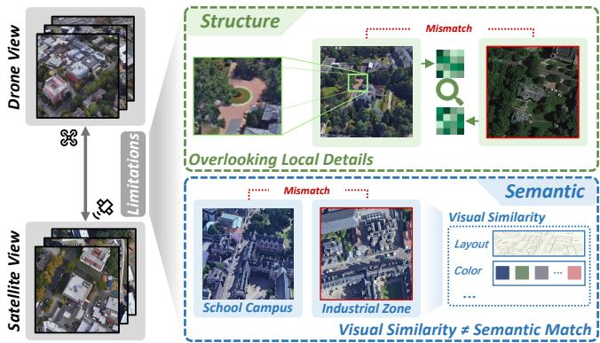
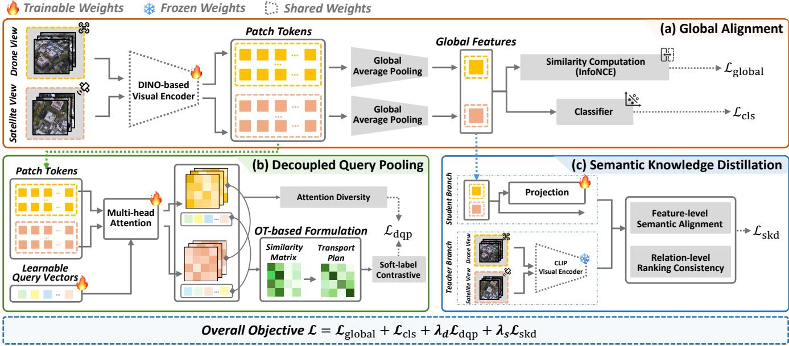
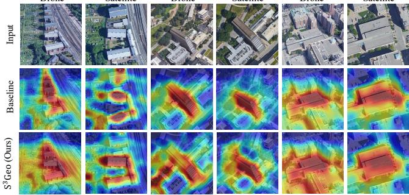

# S3Geo: Structure-Semantic Synergistic Learning for Cross-View Geo-Localization

Ziqian Mo The Hong Kong University of Science and Technology (Guangzhou) Guangzhou, China ziqianmo2023@163.com

Hill Zhang Claremont McKenna College The Claremont, California, USA yzhang68@students.claremontmckenna. edu

Ling Li The Hong Kong University of Science and Technology (Guangzhou) Guangzhou, China lli297@connect.hkust-gz.edu.cn

Haosheng Tan Hong Kong University of Science and Technology (Guangzhou) Guangzhou, China su21822@alumni.bristol.ac.uk

Jiaheng Wei The Hong Kong University of Science and Technology (Guangzhou) Guangzhou, China jiahengwei@hkust-gz.edu.cn

## Abstract

Cross-view geo-localization (CVGL) aims to estimate geographic locations by matching images captured from diferent viewpoints, such as drone and satellite views. Existing methods mainly rely on visual representations, but often fail to jointly model fine-grained structural correspondences and semantic priors, making them prone to confusion between visually similar but semantically diferent regions, and thus limiting robustness under large viewpoint variations. To address these challenges, we propose S3Geo, a structuresemantic synergistic learning framework for cross-view matching. Specifically, we first introduce a Decoupled Query Pooling (DQP) module to extract a compact set of region-aware features from dense tokens, enabling explicit modeling of local structural patterns. We then design a query-level contrastive learning scheme with an optimal transport (OT)-based formulation to establish soft correspondences under cross-view spatial misalignment. Furthermore, we incorporate a Semantic Knowledge Distillation (SKD) strategy from a frozen CLIP teacher to transfer semantic priors and relational structures, thereby improving discrimination on hard negatives. By operating synergistically, the semantic priors provide robust contextual filtering, which guides the structural module to establish precise spatial alignments. Experiments on the University-1652 and SUES-200 datasets demonstrate that S3Geo consistently outperforms state-of-the-art approaches without increasing inference complexity, validating the efectiveness of jointly modeling structural and semantic information for CVGL.

## Keywords

Cross-view geo-localization, image retrieval, feature representation

## 1 Introduction

Cross-view geo-localization (CVGL) is commonly formulated as an image retrieval task across heterogeneous platforms, where the goal is to estimate geographic locations of a query image by matching it with reference images captured from diferent viewpoints, such as unmanned aerial vehicles (UAVs) and satellites [17, 51, 54]. The task was originally introduced for ground-to-satellite matching, providing a visual alternative to Global Navigation Satellite Systems (GNSS) [41] in urban environments where severe occlusions from high-rise buildings degrade positioning accuracy. With the rapid development of UAV technologies, UAV imagery has been incorporated into CVGL, enabling large-scale spatial observation and alleviating viewpoint discrepancies [5, 27]. Compared with groundlevel images, UAV images ofer wider coverage, fewer occlusions, and viewpoints more geometrically consistent with satellite imagery, making them suitable for cross-view matching. In practical scenarios, UAV-to-satellite CVGL plays a crucial role in UAV localization and navigation, supporting accurate positioning and path planning in applications such as disaster response [5, 30], environmental monitoring [11, 35], and infrastructure inspection [1, 14].

  
Figure 1: Illustration of structural and semantic limitations in CVGL. Global representations may overlook local structural diferences, while visually similar regions may correspond to diferent semantic categories, causing mismatches.

Despite the significant progress achieved by recent deep learningbased methods [4, 7, 8, 44], most existing approaches rely on a single visual representation for matching, leading to several inherent limitations. As illustrated in Figure 1, global representations may overlook fine-grained structural diferences under similar layouts, while visually similar regions may correspond to diferent semantic categories, causing mismatches. From the perspective of structural modeling, many methods perform alignment based on global features [51, 55], which tend to overlook discriminative local regions and fail to establish fine-grained spatial correspondences. Although some recent works attempt to incorporate local feature modeling or attention mechanisms to capture structural information, they often rely on implicit alignment or assume consistent spatial layouts across views, limiting their efectiveness under severe viewpoint variations [39, 44]. From the perspective of semantic modeling, purely visual models lack semantic priors, making them prone to mismatches when encountering scenes with similar structures but diferent semantic meanings. Recent eforts introduce semantic cues or vision-language models to enhance representation learning [2, 12, 18, 19, 43]. However, these approaches typically focus on feature-level enhancement and lack modeling of the relational structure of semantic knowledge, thereby limiting their discriminative capability in cross-view matching. Meanwhile, severe viewpoint variations lead to inherent cross-view misalignment, where local regions often do not follow strict one-to-one correspondences. Therefore, jointly modeling local structural alignment and semantic knowledge, while enabling flexible correspondences, remains a critical challenge for CVGL.

To address these challenges, we propose S3Geo, a structuresemantic synergistic learning framework for CVGL. To explicitly model local structures and mitigate spatial misalignment, we introduce a Decoupled Query Pooling (DQP) module equipped with an Optimal Transport (OT)-based query-level contrastive loss [6, 37] for soft cross-view matching. To resolve semantic ambiguity, we design a Semantic Knowledge Distillation (SKD) strategy that transfers language-aligned priors from CLIP [36]. Crucially, this distilled knowledge acts as a macro-level filter to reject visually deceptive hard negatives, enabling DQP to establish precise micro-level spatial correspondences. Without extra inference overhead, S3Geo unifies structural and semantic learning, achieving state-of-theart performance on the University-1652 [51] and SUES-200 [54] benchmarks. Our contributions are summarized as follows:

• We propose S3Geo, a structure-semantic synergistic learning framework that unifies local structural modeling and semantic knowledge enhancement for CVGL.

• We design two complementary mechanisms: a Decoupled Query Pooling (DQP) module with OT-based soft matching for flexible structural alignment, and a Semantic Knowledge Distillation (SKD) strategy for transferring languagealigned semantic priors and relational structures without additional annotations.

• Extensive experiments on public benchmarks demonstrate that our method consistently outperforms existing approaches, validating the efectiveness of the proposed framework.

## 2 Related Work

## 2.1 Cross-view Geo-localization

Early research in CVGL primarily relies on convolutional neural networks (CNNs) to extract global visual representations and perform retrieval via metric learning [16, 21, 51]. While efective to some extent, these methods often struggle with severe viewpoint variations due to limited modeling of long-range dependencies and spatial context.

More recent works adopt transformer-based [42] architectures to enhance feature representation by capturing global context and spatial relationships [7, 20, 50]. Despite these advances, most existing approaches still rely on global representations [3, 9, 52], which may overlook fine-grained structural details and remain sensitive to cross-view misalignment. These limitations highlight the need for more efective modeling of region-level correspondences and semantic consistency.

## 2.2 Structural Modeling for Cross-view Matching

To alleviate the spatial misalignment caused by viewpoint discrepancies, several studies attempt to incorporate local feature modeling or attention-based mechanisms. Patch-based representations, multi-branch architectures, and transformer attention have been explored to capture spatial structures and improve matching robustness [8, 13, 38]. Some methods further exploit multi-scale features or cross-attention pooling strategies to enhance structural representation [46]. Additionally, spatial aggregation mechanisms, such as graph convolutional networks and direction-aware learning, have been introduced to explicitly model geometric topologies [23, 26].

Nevertheless, these approaches often rely on implicit alignment or assume consistent spatial layouts across views, which is not valid in cross-view scenarios. As a result, they struggle to establish reliable fine-grained correspondences between regions under drastic viewpoint changes. Moreover, naive one-to-one matching of local features may introduce incorrect associations due to inconsistent region ordering. These limitations highlight the need for more flexible region-level representations and correspondence modeling strategies that can adapt to cross-view misalignment without relying on strict spatial assumptions.

## 2.3 Semantic Learning for Cross-view Matching

Most existing highly competitive CVGL methods [4, 10, 28, 47, 48] still focus primarily on visual representation learning and lack explicit semantic modeling, making them vulnerable to semantic ambiguity and hard negative samples. In many cases, visually similar regions may correspond to diferent semantic categories, leading to incorrect matching results. Recent advances in vision-language models, such as CLIP [36], provide language-aligned semantic representations that capture high-level concepts beyond purely visual features. These models have been widely applied in various vision tasks to improve semantic understanding and generalization.

Some recent works, such as SIGN [29], incorporate semantic cues to enhance representation learning. CLIP-UG [45] further leverages CLIP to introduce language-aligned semantic features into the matching framework. However, it mainly relies on featurelevel fusion and lacks an explicit mechanism to efectively transfer semantic knowledge while preserving the relational structure of cross-view similarities. As a result, efectively transferring semantic knowledge for cross-view matching remains underexplored, especially for improving the discrimination of hard negative samples under complex scene variations.

  
Figure 2: Overview of ${ \bf { s } } ^ { 3 } { \bf { G e } } { \bf { 0 } } .$ . (a) Global alignment learns instance-level representations via contrastive learning and classification. (b) The DQP module performs region-level structural modeling with OT-based matching with soft-label contrastive learning and attention diversity. (c) The SKD module enhances semantic consistency via feature- and relation-level distillation from CLIP. During inference, only the global branch is used for retrieval, while DQP and SKD are employed for training without additional overhead.

## 3 Method

We propose $\mathbf { s } ^ { 3 } \mathbf { G e o } .$ , a structure-semantic synergistic learning frame work for CVGL. As illustrated in Figure 2, our method jointly models global alignment, local structural correspondence, and semantic consistency to address cross-view misalignment and semantic ambiguity. Given a pair of images from diferent viewpoints (e.g., drone and satellite), we extract visual features using a shared backbone and perform cross-view matching based on the learned representations.

We first introduce the backbone and global alignment, followed by the DQP module for structural modeling and the SKD strategy for semantic enhancement. Finally, we present the overall training objective.

## 3.1 Backbone Representation and Global Alignment

Given a drone image $x ^ { q }$ and a satellite image $x ^ { g } { } _ { ; }$ , we adopt a DINObased visual encoder [40] $f _ { \mathrm { d i n o } } ( \cdot )$ to extract dense visual representations in the form of patch tokens:

$$
\begin{array} { r } { \mathbf { Z } ^ { q } = f _ { \mathrm { d i n o } } ( x ^ { q } ) \in \mathbb { R } ^ { N \times D } , \qquad \mathbf { Z } ^ { g } = f _ { \mathrm { d i n o } } ( x ^ { g } ) \in \mathbb { R } ^ { N \times D } , } \end{array}\tag{1}
$$

where � denotes the number of visual tokens and $D$ is the feature dimension. The shared encoder ensures that features from diferent viewpoints are projected into a unified embedding space, providing a consistent basis for cross-view alignment.

To obtain compact image-level representations, we perform global average pooling over all tokens:

$$
\mathbf { v } ^ { q } = \frac { 1 } { N } \sum _ { n = 1 } ^ { N } \mathbf { Z } _ { n } ^ { q } , \qquad \mathbf { v } ^ { g } = \frac { 1 } { N } \sum _ { n = 1 } ^ { N } \mathbf { Z } _ { n } ^ { g } .\tag{2}
$$

These global features capture holistic scene information and serve as the foundation for instance-level matching.

To establish cross-view alignment, we adopt a bidirectional InfoNCE objective [31]. After $L _ { 2 }$ normalization, the similarity between drone and satellite features is computed as:

$$
\begin{array} { r } { \mathbf { M } _ { i j } = \tau ^ { - 1 } \hat { \mathbf { v } } _ { i } ^ { q } \cdot \hat { \mathbf { v } } _ { j } ^ { g } , } \end{array}\tag{3}
$$

where $\hat { \mathbf { v } } = \mathbf { v } / \| \mathbf { v } \| _ { 2 }$ and � is a temperature parameter controlling the concentration level of the similarity distribution. The global contrastive loss is formulated as:

$$
\mathcal { L } _ { \mathrm { g l o b a l } } = \frac { 1 } { 2 B } \left[ \sum _ { i = 1 } ^ { B } \mathrm { C E } ( \mathbf { S } _ { i , : } , i ) + \sum _ { j = 1 } ^ { B } \mathrm { C E } ( \mathbf { S } _ { : , j } , j ) \right] ,\tag{4}
$$

where � is the batch size. This bidirectional formulation enforces mutual consistency between drone→satellite and satellite→drone retrieval, encouraging matched pairs to be close in the embedding space while pushing apart unmatched pairs.

In addition to contrastive supervision, we introduce an identity (ID) classification loss to further enhance feature discriminability. Specifically, we treat each geographic location as a distinct class and train a classifier � (·) on top of the global representation:

$$
\mathbf { p } _ { i } ^ { q } = \phi ( \mathbf { v } _ { i } ^ { q } ) , \qquad \mathbf { p } _ { i } ^ { g } = \phi ( \mathbf { v } _ { i } ^ { g } ) ,\tag{5}
$$

$$
\mathcal { L } _ { \mathrm { c l s } } = \frac { 1 } { 2 B } \sum _ { i = 1 } ^ { B } \left[ \mathrm { C E } ( \mathbf { p } _ { i } ^ { q } , y _ { i } ) + \mathrm { C E } ( \mathbf { p } _ { i } ^ { g } , y _ { i } ) \right] ,\tag{6}
$$

where $y _ { i }$ denotes the ground-truth location label. This formulation introduces category-level supervision, which complements instance-level contrastive learning by improving inter-class separability and stabilizing optimization.

Together, $\mathcal { L } _ { \mathrm { g l o b a l } }$ and ${ \mathcal { L } } _ { \mathrm { c l s } }$ form the basic training objective for global cross-view retrieval.

## 3.2 Decoupled Query Pooling Module

While global contrastive learning enforces instance-level alignment, it does not explicitly model fine-grained spatial correspondences across views. In particular, global pooling aggregates all patch tokens into a single representation, inevitably suppressing discriminative local structures such as road layouts and building configurations, which are crucial for cross-view matching.

To capture such local structures, we employ a DQP module to extract a compact set of region-level features from dense patch tokens. Specifically, we define � learnable query vectors $Q _ { 0 } \in$ $\mathbb { R } ^ { M \times D }$ , which are randomly initialized and optimized jointly with the network. These learnable queries interact with patch tokens through multi-head cross-attention [42]:

$$
\begin{array} { r } { \begin{array} { r l r l r } { \mathbf { Q } ^ { q } , \mathbf { A } ^ { q } = \mathrm { M H A } ( \mathbf { Q } _ { 0 } , \mathbf { Z } ^ { q } , \mathbf { Z } ^ { q } ) , } & { { } } & { \mathbf { Q } ^ { g } , \mathbf { A } ^ { g } = \mathrm { M H A } ( \mathbf { Q } _ { 0 } , \mathbf { Z } ^ { g } , \mathbf { Z } ^ { g } ) , } \end{array} } \end{array}\tag{7}
$$

where $Q ^ { q } , Q ^ { g } \in \mathbb { R } ^ { M \times D }$ denote query-level features, and $\mathbf { A } ^ { q } , \mathbf { A } ^ { g } \in$ $\mathbb { R } ^ { M \times N }$ are the corresponding attention maps. Unlike heuristic saliency based selection or fixed region partitioning, DQP performs datadriven structural decomposition, where each query acts as a region probe that selectively aggregates informative tokens, producing complementary regional descriptors.

While DQP provides compact region-aware representations, it does not explicitly resolve cross-view correspondence. In particular, the extracted query features lack consistent spatial ordering across views, making one-to-one alignment unreliable under sig nificant viewpoint variations. To address this, we adopt an Optimal Transport (OT)-based formulation to model soft correspondences between query features [6, 37]. For each positive pair $( \bar { x } _ { i } ^ { q } , x _ { i } ^ { g } )$ , we compute the pairwise similarity matrix as:

$$
\mathbf { K } _ { i } = \hat { \mathbf { Q } } _ { i } ^ { q } ( \hat { \mathbf { Q } } _ { i } ^ { g } ) ^ { \top } \in \mathbb { R } ^ { M \times M } ,\tag{8}
$$

where $\hat { \mathbf { Q } }$ denotes $L _ { 2 } \cdot$ -normalized query features, and define the transport cost as:

$$
\mathbf { C } _ { i } = \mathbf { 1 } _ { M \times M } - \mathbf { K } _ { i } .\tag{9}
$$

We then solve the entropy-regularized OT problem as:

$$
\mathbf { P } _ { i } = \arg \operatorname* { m i n } _ { \mathbf { P } \in \Pi ( \mathbf { a } , \mathbf { b } ) } \left. \mathbf { P } , \mathbf { C } _ { i } \right. - \varepsilon H ( \mathbf { P } ) ,\tag{10}
$$

where $\begin{array} { r } { \mathbf { a } = \mathbf { b } = \frac { 1 } { M } } \end{array}$ 1 denote uniform marginals, Π(a, b) denotes the set of admissible transport plans with marginals a and b, and �(P) is the entropy regularization term.

To jointly train all query tokens, we flatten them across the batch and compute cross-view logits:

$$
\begin{array} { r } { \mathbf { Z } _ { ( i , m ) , ( j , n ) } = \tau _ { u } ^ { - 1 } \hat { \mathbf { Q } } _ { i , m } ^ { q } \cdot \hat { \mathbf { Q } } _ { j , n } ^ { g } , } \end{array}\tag{11}
$$

where $m , n \in \{ 1 , \ldots , M \}$ index the query tokens, and $\tau _ { u }$ is a temperature parameter. This formulation treats each query token as an individual matching unit, allowing all region-level correspon dences within a mini-batch to be optimized jointly. We construct the corresponding soft label matrix as:

$$
\mathbf { Y } _ { ( i , m ) , ( i , n ) } = \mathbf { P } _ { i } ( m , n ) , \qquad \mathbf { Y } _ { ( i , m ) , ( j , n ) } = 0 \ ( i \neq j ) .\tag{12}
$$

Finally, we define a symmetric soft-label contrastive loss with an additional decorrelation regularization:

$$
\begin{array} { r l } & { \mathcal { L } _ { \mathrm { d q p } } = \frac { 1 } { 2 } \Big ( \mathrm { C E } _ { \mathrm { s o f t } } ( \mathbf { Z } , \mathbf { Y } ) + \mathrm { C E } _ { \mathrm { s o f t } } ( \mathbf { Z } ^ { \top } , \mathbf { Y } ^ { \top } ) \Big ) } \\ & { \qquad + \alpha \Big ( \left\| \hat { \mathbf { A } } ^ { q } ( \hat { \mathbf { A } } ^ { q } ) ^ { \top } - \mathbf { I } _ { M } \right\| _ { F } ^ { 2 } + \left\| \hat { \mathbf { A } } ^ { g } ( \hat { \mathbf { A } } ^ { g } ) ^ { \top } - \mathbf { I } _ { M } \right\| _ { F } ^ { 2 } \Big ) , } \end{array}\tag{13}
$$

which enforces consistent region-level alignment across views and complements global contrastive learning with fine-grained structural supervision. Note that the second term applies a decorrelation regularization to the attention maps of both views independently, where Aˆ denotes the row-wise $L _ { 2 } ,$ -normalized attention maps along the spatial dimension. Meanwhile, the scaling constant � controls this penalty, encouraging diferent queries to attend to complementary spatial regions in both drone and satellite images, thereby reducing redundancy among the learned region-level representations.

## 3.3 Semantic Knowledge Distillation Strategy

In cross-view scenarios, visually similar regions may correspond to semantically diferent locations, making it dificult to distinguish hard negatives for purely visual models. To address this limitation, instead of directly fusing CLIP features, we distill semantic knowledge from a frozen CLIP visual encoder [15, 36] $f _ { \mathrm { c l i p } } ( \cdot )$ into the retrieval model, which provides language-aligned semantic priors learned from large-scale image-text data.

The student global features are first projected into the CLIP embedding space through a learnable head ℎ(·):

$$
\hat { \mathbf { s } } _ { i } ^ { q } = \frac { h ( \mathbf { v } _ { i } ^ { q } ) } { \| h ( \mathbf { v } _ { i } ^ { q } ) \| _ { 2 } } , \qquad \hat { \mathbf { s } } _ { i } ^ { g } = \frac { h ( \mathbf { v } _ { i } ^ { g } ) } { \| h ( \mathbf { v } _ { i } ^ { g } ) \| _ { 2 } } ,\tag{14}
$$

while the teacher features are computed as:

$$
\hat { \mathbf { t } } _ { i } ^ { q } = \frac { f _ { \mathrm { c l i p } } ( x _ { i } ^ { q } ) } { \lVert f _ { \mathrm { c l i p } } ( x _ { i } ^ { q } ) \rVert _ { 2 } } , \qquad \hat { \mathbf { t } } _ { i } ^ { g } = \frac { f _ { \mathrm { c l i p } } ( x _ { i } ^ { g } ) } { \lVert f _ { \mathrm { c l i p } } ( x _ { i } ^ { g } ) \rVert _ { 2 } } .\tag{15}
$$

This projection enables the student to align with the CLIP semantic space, thereby introducing semantic cues that are not captured by purely visual representations and improving robustness to appearance ambiguity. To further preserve the teacher’s ranking behavior, we compute the cross-view similarity matrices:

$$
\mathbf { R } _ { i j } ^ { s } = \hat { \mathbf { v } } _ { i } ^ { q } \cdot \hat { \mathbf { v } } _ { j } ^ { g } , \qquad \mathbf { R } _ { i j } ^ { t } = \hat { \mathbf { t } } _ { i } ^ { q } \cdot \hat { \mathbf { t } } _ { j } ^ { g } ,\tag{16}
$$

and transform them into probability distributions via row-wise softmax with temperature � :

$$
\mathbf { P } _ { i } ^ { s } = \mathrm { s o f t m a x } ( \mathbf { R } _ { i , : } ^ { s } / T ) , \qquad \mathbf { P } _ { i } ^ { t } = \mathrm { s o f t m a x } ( \mathbf { R } _ { i , : } ^ { t } / T ) .\tag{17}
$$

The student similarity is computed in the original retrieval space (vˆ) rather than the projected space (zˆ), ensuring that the distilled relational supervision directly benefits the target matching objective. Since cross-view retrieval is inherently a ranking problem, matching the similarity distributions allows the student to inherit the teacher’s soft ranking structure, providing richer supervision for hard negatives.

The unified semantic knowledge distillation objective is defined as:

$$
\mathcal { L } _ { \mathrm { s k d } } = \frac { 1 } { B } \sum _ { i = 1 } ^ { B } \left[ \left( 1 - \cos ( \hat { \mathbf { s } } _ { i } ^ { q } , \hat { \mathbf { t } } _ { i } ^ { q } ) \right) + \left( 1 - \cos ( \hat { \mathbf { s } } _ { i } ^ { g } , \hat { \mathbf { t } } _ { i } ^ { g } ) \right) + \beta \operatorname { K L } \left( \mathbf { P } _ { i } ^ { t } \parallel \mathbf { P } _ { i } ^ { s } \right) \right] .\tag{18}
$$

The KL divergence term preserves the relative similarity structure between samples, making it particularly suitable for transferring ranking information compared to point-wise regression objectives [33]. The coeficient � is a scaling factor to balance the magnitude of the KL divergence term for stable optimization.

This objective jointly enforces feature-level semantic alignment and relation-level ranking consistency. Ultimately, this semantic knowledge distillation complements our structural modeling, yielding more discriminative and robust cross-view representations.

## 3.4 Overall Training Objective

The overall training objective combines global alignment, classification supervision, local structural modeling, and semantic knowledge distillation. Specifically, we optimize:

$$
\mathcal { L } = \mathcal { L } _ { \mathrm { g l o b a l } } + \mathcal { L } _ { \mathrm { c l s } } + \lambda _ { d } \mathcal { L } _ { \mathrm { d q p } } + \lambda _ { s } \mathcal { L } _ { \mathrm { s k d } } ,\tag{19}
$$

where $\mathcal { L } _ { \mathrm { g l o b a l } }$ enforces instance-level alignment across views, ${ \mathcal { L } } _ { \mathrm { c l s } }$ improves feature discriminability via identity supervision, ${ \mathcal { L } } _ { \mathrm { d q p } }$ provides fine-grained structural alignment at the region level, and $\mathcal { L } _ { \mathrm { s k d } }$ injects semantic knowledge from the CLIP teacher. During inference, only the global branch is retained for similarity computation, while the DQP and SKD modules are used as auxiliary supervision during training without introducing additional overhead.

## 4 Experiments

## 4.1 Datasets and Evaluation Metrics

We evaluate our method on two widely used CVGL benchmarks: University-1652 [51] and SUES-200 [54].

University-1652 is a large-scale CVGL dataset containing droneview, satellite-view, and ground-view images collected from 1,652 buildings across 72 universities. It is a standard benchmark for drone-to-satellite geo-localization. The dataset consists of 50,218 training images, 41,135 query images, and 55,227 gallery images. We follow the common evaluation settings of Drone → Satellite and Satellite → Drone.

SUES-200 extends this setting by introducing multi-altitude drone imagery, with images captured at four flight heights (150m, 200m, 250m, and 300m). Compared with University-1652, it exhibits larger variations in scale and viewpoint, making it more challenging for fine-grained cross-view alignment.

Evaluation Metrics. Following prior works, we adopt Recall@K (R@K) and Average Precision (AP) for evaluation. R@K measures the percentage of queries for which at least one correct match appears in the top-K retrieved results, reflecting retrieval accuracy. AP summarizes the precision-recall trade-of over the entire rank ing list, providing a more comprehensive evaluation of retrieval performance.

## 4.2 Implementation Details

We implement our method using PyTorch [34] and conduct all experiments on a single NVIDIA A100 GPU. The input drone and satellite images are resized to 512 × 512. During training, we apply standard data augmentations, including random horizontal flipping, random cropping, and color jittering.

For the visual backbone, we adopt the DINOv3 encoder [40] to extract patch-level features. To preserve its robust generalized representations while adapting to the cross-view domain, we freeze all but the last two transformer blocks of the DINOv3 encoder during fine-tuning. For the semantic knowledge distillation, we employ the pre-trained CLIP ViT-L/14 visual encoder [36] as the frozen teacher. The model is trained under a standard training setting with a batch size of 32. We use the AdamW optimizer [25] with an initial learning rate of $5 \times 1 0 ^ { - 4 }$ . A cosine learning rate scheduler [24] is applied to dynamically adjust the learning rate, with the first 10% of the training steps serving as a linear warm-up phase to stabilize optimization.

Table 1: Performance comparison on the University-1652 dataset. The best results are highlighted in bold, and the second-best are underlined.
<table><tr><td rowspan="2">Method</td><td rowspan="2">Venue</td><td colspan="2"></td><td colspan="2">Drone→Satellite Satellite→Drone</td></tr><tr><td>R@1</td><td>AP</td><td>R@1</td><td>AP</td></tr><tr><td>University-1652 [51] ACM MM&#x27;20 58.49</td><td></td><td></td><td>63.13</td><td>71.18</td><td>58.74</td></tr><tr><td>FSRA [7]</td><td>TCSVT&#x27;22</td><td>82.25</td><td>84.82</td><td>87.87</td><td>81.53</td></tr><tr><td>TransFG [50]</td><td>TGRS&#x27;24</td><td>84.01</td><td>86.31</td><td>90.16</td><td>84.61</td></tr><tr><td>MJRLIFS [13]</td><td>TGRS&#x27;24</td><td>86.06</td><td>88.08</td><td>91.44</td><td>85.73</td></tr><tr><td>GeoFormer [20]</td><td>JSTARS&#x27;24</td><td>89.08</td><td>90.83</td><td>92.30</td><td>88.54</td></tr><tr><td>SeGCN [23]</td><td>JSTARS&#x27;24</td><td>89.18</td><td>90.89</td><td>94.29</td><td>89.65</td></tr><tr><td>MCCG [38]</td><td>TCSVT’23</td><td>89.64</td><td>91.32</td><td>94.30</td><td>89.39</td></tr><tr><td>SDPL [3]</td><td>TCSVT’24</td><td>90.16</td><td>91.64</td><td>93.58</td><td>89.45</td></tr><tr><td>CCR [9]</td><td>TCSVT&#x27;24</td><td>92.54</td><td>93.78</td><td>95.15</td><td>91.80</td></tr><tr><td>Sample4Geo [8]</td><td>ICCV&#x27;23</td><td>92.65</td><td>93.81</td><td>96.43</td><td>93.79</td></tr><tr><td>SRLN [26]</td><td>TGRS&#x27;24</td><td>92.70</td><td>93.77</td><td>95.14</td><td>91.97</td></tr><tr><td>MEAN [4]</td><td>TGRS&#x27;25</td><td>93.55</td><td>94.53</td><td>96.01</td><td>92.08</td></tr><tr><td>SCOF [10]</td><td>TGRS&#x27;25</td><td>93.68</td><td>94.68</td><td>96.29</td><td>92.68</td></tr><tr><td>CAMP [46]</td><td>TGRS&#x27;24</td><td>94.46</td><td>95.38</td><td>96.15</td><td>92.72</td></tr><tr><td>DAC [47]</td><td>TCSVT&#x27;24</td><td>94.67</td><td>95.50</td><td>96.43</td><td>93.79</td></tr><tr><td>SIGN [29]</td><td>IGARSS&#x27;25</td><td>94.68</td><td>95.59</td><td>96.29</td><td>94.33</td></tr><tr><td>ECSNet [48]</td><td>TGRS&#x27;26</td><td>94.80</td><td>95.68</td><td>96.57</td><td>92.89</td></tr><tr><td>CDM-Net [52]</td><td>TGRS’25</td><td>95.13</td><td>96.04</td><td>96.43</td><td>93.79</td></tr><tr><td>S3Geo (Ours)</td><td>-</td><td>96.19</td><td>96.86</td><td>96.72</td><td>95.10</td></tr></table>

For the DQP module, the number of learnable queries is set to $M = 4 .$ In the optimal transport formulation, we use an entropy regularization parameter $\varepsilon = 0 . 1$ and perform Sinkhorn normalization [6] for eficient computation. The overall objective weights are empirically set to $\lambda _ { d } = 0 . 5$ and $\lambda _ { s } = 0 . 5$ to balance local structural modeling, and semantic knowledge transfer.

## 4.3 Comparison with State-of-the-Art Methods

We compare the proposed $\mathbf { s } ^ { 3 } \mathbf { G e o }$ with a broad range of recent state-of-the-art CVGL methods, including representative metriclearning, graph-based, and transformer-inspired approaches, as well as recent strong baselines built on modern visual backbones. The compared methods cover both early CVGL benchmarks and the latest high-performance models, providing a comprehensive evaluation of the proposed method. Quantitative results on the University-1652 and SUES-200 datasets are reported in Table 1 and Table 2, respectively.

Results on the University-1652 Dataset As shown in Table 1, S3Geo achieves absolute state-of-the-art performance, outperforming all existing methods across all evaluation metrics. In the Drone → Satellite task, our method reaches 96.19% on R@1 and 96.86% on AP, efectively surpassing recent strong competitors like CDM-Net [52] and ECSNet [48]. Similarly, in the Satellite → Drone task, S3Geo achieves 96.72% R@1 and 95.10% AP, outperforming all competing methods. This consistent superiority, particularly the significant gain in AP, demonstrates that our method is not only accurate in identifying the top-1 match but also robust in retrieving all relevant images. These improvement are likely attributed to our synergistic design: the semantic priors efectively filter out visually similar but contextually incorrect distractions, while the DQP ensures precise local structural alignment.

Table 2: Performance comparison on the SUES-200. The best results are highlighted in bold, and the second-best results are underlined.
<table><tr><td colspan="9">Drone→Satellite</td></tr><tr><td rowspan="2">Method</td><td rowspan="2">Publication</td><td colspan="2">150m</td><td colspan="2">200m</td><td colspan="2">250m</td><td colspan="2">300m</td></tr><tr><td>R@1</td><td>AP</td><td>R@1</td><td>AP</td><td>R@1</td><td>AP</td><td>R@1</td><td>AP</td></tr><tr><td>SUES-200 [54]</td><td>TCSVT&#x27;23</td><td>55.65</td><td>61.92</td><td>66.78</td><td>71.55</td><td>72.00</td><td>76.43</td><td>74.05</td><td>78.26</td></tr><tr><td>MJRLIFS [13]</td><td>TGRS&#x27;24</td><td>77.57</td><td>81.30</td><td>89.50</td><td>91.40</td><td>92.58</td><td>94.21</td><td>97.40</td><td>97.92</td></tr><tr><td>FSRA [7]</td><td>TCSVT&#x27;22</td><td>68.25</td><td>73.45</td><td>83.00</td><td>85.99</td><td>90.68</td><td>92.27</td><td>91.95</td><td>91.95</td></tr><tr><td>MBF [53]</td><td>Sensors&#x27;23</td><td>85.62</td><td>88.21</td><td>87.43</td><td>90.02</td><td>90.65</td><td>92.53</td><td>92.12</td><td>93.63</td></tr><tr><td>SeGCN [23]</td><td>JSTARS&#x27;24</td><td>90.80</td><td>92.32</td><td>91.93</td><td>93.41</td><td>92.53</td><td>93.90</td><td>93.33</td><td>94.61</td></tr><tr><td>SRLN [26]</td><td>TGRS&#x27;24</td><td>89.90</td><td>91.90</td><td>94.32</td><td>95.65</td><td>95.92</td><td>96.79</td><td>96.37</td><td>97.21</td></tr><tr><td>MCCG [38]</td><td>TCSVT&#x27;23</td><td>82.22</td><td>85.47</td><td>89.38</td><td>91.41</td><td>93.82</td><td>95.04</td><td>95.07</td><td>96.20</td></tr><tr><td>SCOF [10]</td><td>TGRS&#x27;25</td><td>90.75</td><td>92.32</td><td>94.25</td><td>95.35</td><td>96.88</td><td>97.42</td><td>97.85</td><td>98.10</td></tr><tr><td>Sample4Geo [8]</td><td>ICCV&#x27;23</td><td>92.60</td><td>94.00</td><td>97.38</td><td>97.81</td><td>98.28</td><td>98.64</td><td>99.18</td><td>99.36</td></tr><tr><td>CDM-Net [52]</td><td>TGRS&#x27;25</td><td>93.78</td><td>95.16</td><td>97.62</td><td>98.16</td><td>98.28</td><td>98.69</td><td>99.20</td><td>99.31</td></tr><tr><td>CAMP [46]</td><td>TGRS&#x27;24</td><td>95.40</td><td>96.38</td><td>97.63</td><td>98.16</td><td>98.05</td><td>98.45</td><td>99.33</td><td>99.46</td></tr><tr><td>MEAN [4]</td><td>TGRS&#x27;25</td><td>95.50</td><td>96.46</td><td>98.38</td><td>98.72</td><td>98.95</td><td>99.17</td><td>99.52</td><td>99.63</td></tr><tr><td>SIGN [29]</td><td>IGARSS&#x27;25</td><td>96.50</td><td>97.35</td><td>97.93</td><td>98.33</td><td>98.70</td><td>98.83</td><td>99.44</td><td>99.54</td></tr><tr><td>DAC [47]</td><td>TCSVT24</td><td>96.80</td><td>97.54</td><td>97.48</td><td>97.97</td><td>98.20</td><td>98.62</td><td>97.58</td><td>98.14</td></tr><tr><td>ECSNet [48]</td><td>TGRS&#x27;26</td><td>96.82</td><td>97.60</td><td>98.84</td><td>98.80</td><td>98.92</td><td>99.20</td><td>99.50</td><td>99.58</td></tr><tr><td>S3Geo (Ours)</td><td></td><td>99.23</td><td>99.41</td><td>99.63</td><td>99.72</td><td>99.98</td><td>99.98</td><td>100.00</td><td>100.00</td></tr><tr><td colspan="8"></td><td colspan="2"></td></tr><tr><td rowspan="3">Method</td><td rowspan="3">Publication</td><td>150m</td><td></td><td colspan="2">Satellite→Drone 200m</td><td colspan="2">250m</td><td colspan="2"></td></tr><tr><td>R@1</td><td>AP</td><td>R@1</td><td>AP</td><td>R@1</td><td>AP</td><td>300m</td><td>AP</td></tr><tr><td></td><td></td><td></td><td></td><td></td><td></td><td>R@1</td><td></td></tr><tr><td>SUES-200 [54]</td><td>TCSVT&#x27;23</td><td>75.00</td><td>55.46</td><td>85.00</td><td>66.05</td><td>86.25 97.50</td><td>69.94 96.03</td><td>88.75</td><td>74.46</td></tr><tr><td>MJRLIFS [13]</td><td>TGRS&#x27;24</td><td>93.75 83.75</td><td>79.49 76.67</td><td>97.50</td><td>90.52</td><td>93.75</td><td>90.17</td><td>100.00</td><td>97.66</td></tr><tr><td>FSRA [7]</td><td>TCSVT&#x27;22</td><td>88.75</td><td>84.74</td><td>90.00 91.25</td><td>85.34 89.95</td><td>93.75</td><td>90.65</td><td>95.00</td><td>92.03</td></tr><tr><td>MBF [53]</td><td>Sensors&#x27;23</td><td>93.75</td><td>92.45</td><td>95.00</td><td>93.65</td><td>96.25</td><td>94.39</td><td>96.25</td><td>91.60</td></tr><tr><td>SeGCN [23]</td><td>JSTARS&#x27;24 TGRS&#x27;24</td><td>93.75</td><td>93.01</td><td>97.50</td><td>95.08</td><td>97.50</td><td>96.52</td><td>97.50 97.50</td><td>94.55</td></tr><tr><td>SRLN [26]</td><td>TCSVT&#x27;23</td><td>93.75</td><td>89.72</td><td>93.75</td><td>92.21</td><td>96.25</td><td>96.14</td><td></td><td>96.71</td></tr><tr><td>MCCG [38]</td><td>TGRS&#x27;25</td><td>95.00</td><td>89.72</td><td>97.50</td><td>93.13</td><td>98.75</td><td>96.33</td><td>98.75 97.50</td><td>96.64</td></tr><tr><td>SCOF [i0]</td><td>ICCV&#x27;23</td><td>97.50</td><td>93.63</td><td>98.75</td><td>96.70</td><td>98.75</td><td>98.28</td><td>98.75</td><td>96.62 98.05</td></tr><tr><td>Sample4Geo [8]</td><td>TGRS&#x27;25</td><td>95.25</td><td>92.24</td><td>98.50</td><td>96.40</td><td>99.00</td><td>97.60</td><td>99.00</td><td>98.01</td></tr><tr><td>CDM-Net [52]</td><td>TGRS&#x27;24</td><td>96.25</td><td>93.69</td><td>97.50</td><td></td><td>98.75</td><td>98.10</td><td></td><td></td></tr><tr><td>CAMP [46]</td><td>TGRS&#x27;25</td><td>97.50</td><td>94.75</td><td></td><td>96.76</td><td>100.00</td><td>98.28</td><td>100.00</td><td>98.85</td></tr><tr><td>MEAN [4]</td><td></td><td></td><td>95.67</td><td>100.00 98.75</td><td>97.09</td><td></td><td>98.28</td><td>100.00</td><td>99.21</td></tr><tr><td>SIGN [29] DAC [47]</td><td>IGARSS&#x27;25 TCSVT&#x27;24</td><td>98.75 97.50</td><td>94.06</td><td>98.75</td><td>97.50</td><td>98.75</td><td>98.09</td><td>100.00</td><td>98.86</td></tr><tr><td>ECSNet [48]</td><td>TGRS&#x27;26</td><td>97.52</td><td>95.01</td><td>99.26</td><td>96.66</td><td>98.75</td><td>98.30</td><td>98.75</td><td>97.87</td></tr><tr><td></td><td></td><td></td><td></td><td></td><td>97.20</td><td>99.48</td><td></td><td>99.92</td><td>99.30</td></tr><tr><td>S³Geo (Ours)</td><td></td><td>100.00</td><td>97.87</td><td>100.00</td><td>98.62</td><td>100.00</td><td>98.72</td><td>100.00</td><td>99.35</td></tr></table>

Results on the SUES-200 Dataset. The SUES-200 dataset introduces significant challenges due to large scale variations caused by diferent drone flight altitudes (150m-300m). As shown in Table $2 , { \bf S } ^ { 3 } { \bf G e o }$ consistently achieves the best performance across all altitude settings in both retrieval directions. Notably, for the Satellite→Drone task, our method achieves a 100.00% R@1 across all altitude levels, indicating highly stable cross-view matching performance regardless of scale variations. For the Drone→Satellite task, S3Geo also reaches near-saturated performance at higher altitudes (e.g., 100.00% at 300m), while maintaining strong robustness under the most challenging low-altitude setting (150m), achieving 99.23% R@1. Compared with strong baselines such as ECSNet [48] and MEAN [4], which exhibit noticeable performance degradation at lower altitudes, our method demonstrates superior robustness to severe scale and viewpoint changes. These results validate the efectiveness of jointly modeling structural correspondences and semantic consistency for CVGL.

## 4.4 Cross-Region Transferability

The ability to generalize across diferent geographic regions is crucial for CVGL, as real-world deployments often involve unseen environments. To evaluate the cross-region generalization capability of S3Geo, we conduct a zero-shot cross-dataset evaluation. Specifically, the model is trained solely on the University-1652 dataset and directly tested on SUES-200 without any fine-tuning, providing a rigorous assessment of domain transferability. As shown in Table 3, S3Geo consistently outperforms existing methods in both

Table 3: Comparison with state-of-the-art results in crossregion transferability. The best results are highlighted in bold, and the second-best are underlined.
<table><tr><td colspan="9">Drone→Satellite</td></tr><tr><td rowspan="2">Method</td><td colspan="2">150m</td><td colspan="2">200m</td><td colspan="2">250m</td><td colspan="2">300m</td></tr><tr><td>R@1</td><td>AP</td><td>R@1</td><td>AP</td><td>R@1</td><td>AP</td><td>R@1</td><td>AP</td></tr><tr><td>MCCG [38]</td><td>57.62</td><td>62.80</td><td>66.83</td><td>71.60</td><td>74.25</td><td>78.35</td><td>82.55</td><td>85.27</td></tr><tr><td>Sample4Geo [8]</td><td>70.05</td><td>74.93</td><td>80.68</td><td>83.90</td><td>87.35</td><td>89.72</td><td>90.03</td><td>91.91</td></tr><tr><td>CAMP [46]</td><td>78.90</td><td>82.38</td><td>86.83</td><td>89.28</td><td>91.95</td><td>93.63</td><td>95.68</td><td>96.65</td></tr><tr><td>DAC [47]</td><td>76.65</td><td>80.56</td><td>86.45</td><td>89.00</td><td>92.95</td><td>94.18</td><td>94.53</td><td>95.45</td></tr><tr><td>MEAN [4]</td><td>81.73</td><td>87.72</td><td>89.05</td><td>91.00</td><td>92.13</td><td>93.60</td><td>94.63</td><td>95.76</td></tr><tr><td>ECSNet [48]</td><td>82.85</td><td>88.02</td><td>89.21</td><td>91.00</td><td>92.89</td><td>94.20</td><td>94.66</td><td>95.80</td></tr><tr><td>S3Geo (Ours) 91.65 93.46</td><td colspan="8">96.73 97.45 98.40 98.74</td></tr><tr><td colspan="8">Satellite→Drone</td></tr><tr><td>Method</td><td colspan="2">150m</td><td colspan="2">200m</td><td colspan="2">250m</td><td colspan="2">300m</td></tr><tr><td>MCCG [38]</td><td>R@1</td><td>AP</td><td>R@1</td><td>AP</td><td>R@1</td><td>AP</td><td>R@1</td><td>AP</td></tr><tr><td>Sample4Geo [8]</td><td>61.25 83.75</td><td>53.51</td><td>82.50</td><td>67.06</td><td>81.25</td><td>74.99 89.07</td><td>87.50</td><td>80.20</td></tr><tr><td>CAMP [46]</td><td></td><td>73.83</td><td>91.25</td><td>83.42</td><td>93.75</td><td></td><td>93.75</td><td>90.66</td></tr><tr><td></td><td>87.50</td><td>78.98</td><td>95.00</td><td>87.05</td><td>95.00</td><td>91.05</td><td>96.25</td><td>93.44</td></tr><tr><td>DAC [47]</td><td>87.50</td><td>79.87</td><td>96.25</td><td>88.98</td><td>95.00</td><td>92.81</td><td>96.25</td><td>94.00</td></tr><tr><td>MEAN [4]</td><td>91.25</td><td>81.50</td><td>96.25</td><td>89.55</td><td>95.00</td><td>92.36</td><td>96.25</td><td>94.32</td></tr><tr><td>ECSNet [48]</td><td>91.28</td><td>81.52</td><td>96.28</td><td>89.83</td><td>95.00</td><td>92.82</td><td>96.25</td><td>94.36</td></tr><tr><td>S³Geo (Ours)</td><td>96.25</td><td>94.45</td><td>97.50</td><td>96.71</td><td>97.50</td><td>97.15</td><td>97.50</td><td>97.43</td></tr></table>

Drone→Satellite and Satellite→Drone tasks, achieving the best R@1 and AP across all altitude settings. Compared with purely visual models, which typically sufer from noticeable performance degradation under domain shifts (e.g., variations in illumination, weather, and scene layout), our method demonstrates stronger robustness in cross-dataset scenarios. These results indicate that the proposed structural-semantic synergistic learning enables the model to capture more transferable representations, allowing it to generalize efectively to unseen environments without requiring target-domain adaptation.

## 4.5 Ablation Study

To validate the core motivation of S3Geo, we conduct hierarchical ablation studies on the University-1652 dataset, including both overall component analysis and internal design evaluation.

Overall Component Analysis. We first evaluate the efectiveness of the main components, including DQP and SKD. Starting from the global baseline, introducing either DQP or SKD leads to consistent performance improvements, while combining both yields the best result. This demonstrates that structural modeling and semantic enhancement are both essential and complementary for CVGL.

Internal Design Analysis. We further analyze the internal design of DQP and SKD, as shown in Table 4. Starting from the global baseline, introducing DQP with naive matching brings moderate improvements, indicating that region-aware feature aggregation is beneficial for cross-view matching. Replacing naive matching with OT-based alignment further improves performance, demonstrating that modeling soft correspondences efectively alleviates spatial misalignment across views.

Table 4: Ablation study of the internal design of DQP and SKD on the University-1652 dataset.
<table><tr><td rowspan="2">Variant</td><td colspan="2"></td><td colspan="2">Drone→Satellite Satellite→Drone</td></tr><tr><td>R@1</td><td>AP</td><td>R@1</td><td>AP</td></tr><tr><td colspan="5">(a) Effect of Decoupled Query Pooling and OT</td></tr><tr><td>Baseline</td><td>95.12</td><td>96.02</td><td>96.29</td><td>93.79</td></tr><tr><td>+ DQP (w/o OT)</td><td>95.42</td><td>96.20</td><td>96.37</td><td>94.65</td></tr><tr><td>+ DQP (w/ OT)</td><td>95.80</td><td>96.50</td><td>96.58</td><td>94.90</td></tr><tr><td colspan="5">(b) Effect of Semantic Knowledge Distillation</td></tr><tr><td>Baseline</td><td>95.12</td><td>96.02</td><td>96.29</td><td>93.79</td></tr><tr><td>+ SKD (feature only)</td><td>95.63</td><td>96.38</td><td>96.52</td><td>94.80</td></tr><tr><td>+ SKD (relation only)</td><td>95.68</td><td>96.42</td><td>96.54</td><td>94.86</td></tr><tr><td>+ SKD (full)</td><td>95.86</td><td>96.62</td><td>96.64</td><td>94.92</td></tr><tr><td>Full Model (Ours)</td><td>96.19</td><td>96.86</td><td>96.72</td><td>95.10</td></tr></table>

For semantic knowledge distillation, both feature-level and relationlevel distillation independently improve performance over the baseline, suggesting that semantic priors provide complementary information beyond purely visual features. Notably, relation-level distillation yields slightly larger gains, highlighting the importance of preserving similarity structure. Combining both further enhances performance, indicating that feature alignment and relational consistency are mutually beneficial.

Finally, integrating both DQP and SKD achieves the best result, confirming that structural modeling and semantic enhancement are complementary and jointly contribute to more discriminative and robust cross-view representations.

Backbone and Teacher Robustness. As shown in Table 5, S3Geo consistently improves the corresponding baseline under both DINOv2 [32] and DINOv3 [40]. With DINOv2, it improves R@1 by 2.09 and 1.11 percentage points for Drone→Satellite and Satellite→Drone, respectively, confirming that the gains do not solely arise from DINOv3. Moreover, replacing CLIP with SigLIP [49] or RemoteCLIP [22] results in R@1 diferences below 0.2 percentage points, indicating that SKD is robust to the choice of semantic teacher.

Efect of Query Number. We investigate the impact of the number of learnable queries � in the DQP module, as shown in Table 6. When � = 1, the operation degenerates to producing a single global representation. Although the multi-head mechanism internally attends to various parts, compressing them into one vector fails to explicitly decouple distinct local geometric structures, resulting in inferior performance. Increasing � improves performance by enabling the model to extract multiple region-aware representations. The performance peaks at � = 4, suggesting a good balance between representation diversity and redundancy. Further increasing the number of queries brings marginal gains or even slight degradation, likely due to overlapping attention regions and increased redundancy. Therefore, we set � = 4 in all experiments.

Table 5: Backbone-controlled and semantic-teacher comparisons on University-1652.
<table><tr><td rowspan="2">Setting</td><td rowspan="2">Variant</td><td colspan="2"></td><td colspan="2">Drone→Satellite Satellite→Drone</td></tr><tr><td>R@1</td><td>AP</td><td>R@1</td><td>AP</td></tr><tr><td></td><td>(a) Backbone-controlled comparison</td><td></td><td></td><td></td><td></td></tr><tr><td rowspan="2">DINOv2</td><td>Baseline</td><td>93.49</td><td>94.56</td><td>95.34</td><td>91.56</td></tr><tr><td>S³Geo</td><td>95.58</td><td>96.31</td><td>96.45</td><td>94.65</td></tr><tr><td rowspan="2">DINOv3</td><td>Baseline</td><td>95.12</td><td>96.02</td><td>96.29</td><td>93.79</td></tr><tr><td>S3Geo</td><td>96.19</td><td>96.86</td><td>96.72</td><td>95.10</td></tr><tr><td></td><td>(b) Effect of semantic teacher</td><td></td><td></td><td></td><td></td></tr><tr><td>SigLIP-L/16@384</td><td></td><td>96.06</td><td>96.78</td><td>96.60</td><td>95.05</td></tr><tr><td>RemoteCLIP ViT-L/14</td><td></td><td>96.14</td><td>96.83</td><td>96.63</td><td>95.09</td></tr><tr><td>CLIP ViT-L/14</td><td></td><td>96.19</td><td>96.86</td><td>96.72</td><td>95.10</td></tr></table>

Table 6: Efect of the number of queries � in the DQP module on the University-1652 dataset.

<table><tr><td rowspan="2">Queries M</td><td colspan="2">Drone→Satellite</td><td colspan="2">Satellite→Drone</td></tr><tr><td>R@1</td><td>AP</td><td>R@1</td><td>AP</td></tr><tr><td>1</td><td>95.90</td><td>96.66</td><td>96.43</td><td>94.95</td></tr><tr><td>2</td><td>95.94</td><td>96.67</td><td>96.45</td><td>94.98</td></tr><tr><td>4</td><td>96.19</td><td>96.86</td><td>96.72</td><td>95.10</td></tr><tr><td>8</td><td>96.11</td><td>96.81</td><td>96.71</td><td>95.09</td></tr></table>

Sensitivity to Loss Weights. We analyze the sensitivity of the loss weights $\lambda _ { d }$ and $\lambda _ { s } ,$ , which control the contributions of DQP and SKD, respectively, as shown in Table 7. The best performance is achieved at $\lambda _ { d } = 0 . 5$ and $\lambda _ { s } = 0 . 5 ,$ , indicating a balanced contribution between structural modeling and semantic supervision. Notably, varying either weight within a reasonable range leads to only minor performance fluctuations, demonstrating that the proposed framework is not sensitive to the specific choice of hyperparameters. This suggests that both structural and semantic components provide stable and complementary contributions, and the model does not rely on carefully tuned weighting to achieve strong performance. Overall, these results indicate that S3Geo is robust to the selection of loss weights, which is desirable for practical deployment.

## 4.6 Visualization Analysis

Heatmap Visualization. We visualize the heatmaps of the baseline and S3Geo to better understand the learned representations. As shown in Figure 3, both models tend to focus on similar salient regions, indicating that the baseline is already capable of capturing coarse structural cues. However, S3Geo produces more concentrated and consistent attention patterns. This suggests that the pro posed modules help refine the feature representation by suppressing noise and enhancing meaningful structural information. Although the visual diferences are relatively subtle, these improvements lead to more reliable cross-view alignment and better discrimination, which contribute to the overall performance gain.

Table 7: Sensitivity analysis of the loss weights $\lambda _ { d }$ (DQP) and �� (SKD) on the University-1652 dataset.
<table><tr><td rowspan="2"> $\lambda _ { d }$ </td><td rowspan="2"> $\lambda _ { s }$ </td><td colspan="2">Drone→Satellite</td><td colspan="2">Satellite→Drone</td></tr><tr><td>R@1</td><td>AP</td><td>R@1</td><td>AP</td></tr><tr><td>0.30</td><td>0.50</td><td>96.00</td><td>96.71</td><td>96.58</td><td>95.04</td></tr><tr><td>0.50</td><td>0.50</td><td>96.19</td><td>96.86</td><td>96.72</td><td>95.10</td></tr><tr><td>0.70</td><td>0.50</td><td>95.94</td><td>96.66</td><td>96.43</td><td>94.80</td></tr><tr><td>0.50</td><td>0.30</td><td>95.89</td><td>96.57</td><td>96.58</td><td>95.13</td></tr><tr><td>0.50</td><td>0.70</td><td>95.93</td><td>96.69</td><td>96.62</td><td>94.99</td></tr></table>

Drone  
Satellite  
Drone  
Satellite  
Drone  
Satellite  
  
Figure 3: Visualization of heatmaps generated by the backbone network and S3Geo on the University-1652 dataset.

## 5 Conclusion

We propose S3Geo, a structure-semantic synergistic framework for cross-view geo-localization that explicitly addresses the challenges of structural misalignment and semantic ambiguity across views. By introducing Decoupled Query Pooling with OT-based soft alignment, the model captures fine-grained region-level correspondences, while CLIP-based semantic knowledge distillation enhances semantic consistency and improves discrimination of hard negatives. Extensive experiments on the University-1652 and SUES-200 datasets demonstrate that the proposed method achieves consistent performance gains and strong generalization ability. These results highlight the importance of jointly modeling structural and semantic information for learning robust cross-view representations.

## Acknowledgments

This work was supported by the Yangcheng Scholars Research Project under Grant No. 2024312049, the Guangdong Provincial Key Lab of Integrated Communication, Sensing and Computation for Ubiquitous Internet of Things under Grant No. 2023B1212010007, and the CNPC Technology Project “Research on Key Technologies of Artificial Intelligence for Oil and Gas Exploration and Development” under Grant No. 2023DJ84.

## References

[1] Juan A Besada, Luca Bergesio, Iván Campaña, Diego Vaquero-Melchor, Jaime López-Araquistain, Ana M Bernardos, and Jose R Casar. 2018. Drone Mission Definition and Implementation for Automated Infrastructure Inspection Using Airborne Sensors. Sensors 18, 4 (2018), 1170.

[2] Guanli Chen, Guoheng Huang, Xiaochen Yuan, Xuhang Chen, Guo Zhong, and Chi-Man Pun. 2025. Cross-view geo-localization via learning correspondence semantic similarity knowledge. In International Conference on Multimedia Modeling. Springer, 220–233.

[3] Quan Chen, Tingyu Wang, Zihao Yang, Haoran Li, Rongfeng Lu, Yaoqi Sun, Bolun Zheng, and Chenggang Yan. 2024. SDPL: Shifting-dense partition learning for UAV-view geo-localization. IEEE Transactions on Circuits and Systems for Video Technology 34, 11 (2024), 11810–11824.

[4] Zhongwei Chen, Zhao-Xu Yang, and Hai-Jun Rong. 2025. Multi-level embedding and alignment network with consistency and invariance learning for cross-view geo-localization. IEEE Transactions on Geoscience and Remote Sensing (2025).

[5] Sudipta Chowdhury, Adindu Emelogu, Mohammad Marufuzzaman, Sarah G Nurre, and Linkan Bian. 2017. Drones for Disaster Response and Relief Operations: A Continuous Approximation Model. International Journal ofProduction Economics 188 (2017), 167–184.

[6] Marco Cuturi. 2013. Sinkhorn distances: Lightspeed computation of optimal transport. Advances in neural information processing systems 26 (2013).

[7] Ming Dai, Jianhong Hu, Jiedong Zhuang, and Enhui Zheng. 2021. A transformerbased feature segmentation and region alignment method for UAV-view geolocalization. IEEE Transactions on Circuits and Systems for Video Technology 32, 7 (2021), 4376–4389.

[8] Fabian Deuser, Konrad Habel, and Norbert Oswald. 2023. Sample4geo: Hard negative sampling for cross-view geo-localisation. In Proceedings of the IEEE/CVF International Conference on Computer Vision. 16847–16856.

[9] Haolin Du, Jingfei He, and Yuanqing Zhao. 2024. CCR: A counterfactual causa reasoning-based method for cross-view geo-localization. IEEE Transactions on Circuits and Systems for Video Technology 34, 11 (2024), 11630–11643.

[10] Cheng Fang, Jingchun Gao, Ping Han, Chaoyu Zhao, and Bing Gao. 2025. SCOF: Supervised Contrastive Orthogonal Fusion for Robust Cross-View Geolocaliza tion. IEEE Transactions on Geoscience and Remote Sensing 63 (2025), 1–15.

[11] Clare Gafey and Anshuman Bhardwaj. 2020. Applications of Unmanned Aerial Vehicles in Cryosphere: Latest Advances and Prospects. Remote Sensing 12, 6 (2020), 948.

[12] Yuan Gao, Haibo Liu, and Xiaohui Wei. 2025. Semantic concept perception network with interactive prompting for cross-view image geo-localization. IEEE Transactions on Circuits and Systemsfor Video Technology 35, 6 (2025), 5343–5354.

[13] Fawei Ge, Yunzhou Zhang, Yixiu Liu, Guiyuan Wang, Sonya Coleman, Dermot Kerr, and Li Wang. 2024. Multibranch joint representation learning based on information fusion strategy for cross-view geo-localization. IEEE Transactions on Geoscience and Remote Sensing 62 (2024), 1–16.

[14] Yunze He, Zhaoyan Liu, Yike Guo, Qijia Zhu, Yu Fang, Yong Yin, Yang Wang, Bei Zhang, and Zhaohua Liu. 2024. UAV Based Sensing and Imaging Technologies for Power System Detection, Monitoring and Inspection: A Review. Nondestructive Testing and Evaluation (2024), 1–68.

[15] Geofrey Hinton, Oriol Vinyals, and Jef Dean. 2015. Distilling the knowledge in a neural network. arXiv preprint arXiv:1503.02531 (2015).

[16] Sixing Hu, Mengdan Feng, Rang MH Nguyen, and Gim Hee Lee. 2018. Cvm-net: Cross-view matching network for image-based ground-to-aerial geo-localization. In Proceedings of the IEEE conference on computer vision and pattern recognition. 7258–7267.

[17] Ling Li, Yutian Jiang, Ziqian Mo, Qihan Yu, Na Di, Yao Zhou, Xixuan Hao, Hill Zhang, Xinhu Zheng, Xinlei He, et al. 2026. A Survey on Visual Geolocalization: Taxonomy, Progress, and Prospects. (2026).

[18] Ling Li, Yu Ye, Yao Zhou, Bingchuan Jiang, and Wei Zeng. 2024. Georeasoner: Geo-localization with reasoning in street views using a large vision-language model. arXiv preprint arXiv:2406.18572 (2024).

[19] Ling Li, Yao Zhou, Yuxuan Liang, Fugee Tsung, and Jiaheng Wei. 2026. Recognition through reasoning: Reinforcing image geo-localization with large visionlanguage models. Advances in Neural Information Processing Systems 38 (2026), 62132–62159.

[20] Qingge Li, Xiaogang Yang, Jiwei Fan, Ruitao Lu, Bin Tang, Siyu Wang, and Shuang Su. 2024. GeoFormer: An Efective Transformer-Based Siamese Network for UAV Geo-Localization. IEEE Journal of Selected Topics in Applied Earth Observations and Remote Sensing (JSTARS) (2024).

[21] Tsung-Yi Lin, Yin Cui, Serge Belongie, and James Hays. 2015. Learning deep representations for ground-to-aerial geolocalization. In Proceedings ofthe IEEE conference on computer vision and pattern recognition. 5007–5015.

[22] Fan Liu, Delong Chen, Zhangqingyun Guan, Xiaocong Zhou, Jiale Zhu, Qiaolin Ye, Liyong Fu, and Jun Zhou. 2024. Remoteclip: A vision language foundation model for remote sensing. IEEE Transactions on Geoscience and Remote Sensing 62 (2024), 1–16.

[23] Xiangzeng Liu, Ziyao Wang, Yue Wu, and Qiguang Miao. 2024. SeGCN: A Semantic-Aware Graph Convolutional Network for UAV Geo-Localization. IEEE Journal of Selected Topics in Applied Earth Observations and Remote Sensing (JSTARS) (2024).

[24] Ilya Loshchilov and Frank Hutter. 2016. Sgdr: Stochastic gradient descent with warm restarts. arXiv preprint arXiv:1608.03983 (2016).

[25] Ilya Loshchilov and Frank Hutter. 2017. Decoupled weight decay regularization. arXiv preprint arXiv:1711.05101 (2017).

[26] Hongxiang Lv, Hai Zhu, Runzhe Zhu, Fei Wu, Chunyuan Wang, Meiyu Cai, and Kaiyu Zhang. 2024. Direction-Guided Multi-Scale Feature Fusion Network for Geo-Localization. IEEE Transactions on Geoscience and Remote Sensing (TGRS) (2024).

[27] Victor RF Miranda, Adriano MC Rezende, Thiago L Rocha, Héctor Azpúrua, Luciano CA Pimenta, and Gustavo M Freitas. 2022. Autonomous Navigation System for a Delivery Drone. Journal of Control, Automation and Electrical Systems 33 (2022), 141–155.

[28] Ziqian Mo, Yuxi Sun, Sen Jia, and Meng Xu. 2026. STAR: Spatio-Temporal Alignment and Refinement for Cross-View Geo-Localization. IEEE Transactions on Geoscience and Remote Sensing (2026).

[29] Ziqian Mo, Yuxi Sun, Meng Xu, and Sen Jia. 2025. SIGN: Saliency-Aware Integrated Global-Local Network for Cross-View Geo-Localization. In IGARSS 2025-2025 IEEE International Geoscience and Remote Sensing Symposium. IEEE, 6296–6300.

[30] Francesco Nex, Costas Armenakis, Michael Cramer, Davide A Cucci, Markus Gerke, Eija Honkavaara, Antero Kukko, Claudio Persello, and Jan Skaloud. 2022. UAV in the Advent of the Twenties: Where We Stand and What Is Next. ISPRS Journal ofPhotogrammetry and Remote Sensing 184 (2022), 215–242.

[31] Aaron van den Oord, Yazhe Li, and Oriol Vinyals. 2018. Representation learning with contrastive predictive coding. arXiv preprint arXiv:1807.03748 (2018).

[32] Maxime Oquab, Timothée Darcet, Théo Moutakanni, Huy Vo, Marc Szafraniec, Vasil Khalidov, Pierre Fernandez, Daniel Haziza, Francisco Massa, Alaaeldin El Nouby, et al. 2023. Dinov2: Learning robust visual features without supervision. arXiv preprint arXiv:2304.07193 (2023).

[33] Wonpyo Park, Dongju Kim, Yan Lu, and Minsu Cho. 2019. Relational knowledge distillation. In Proceedings of the IEEE/CVF conference on computer vision and pattern recognition. 3967–3976.

[34] Adam Paszke, Sam Gross, Francisco Massa, Adam Lerer, James Bradbury, Gregory Chanan, Trevor Killeen, Zeming Lin, Natalia Gimelshein, Luca Antiga, et al. 2019. Pytorch: An imperative style, high-performance deep learning library. Advances in neural information processing systems 32 (2019).

[35] Brooke Potter, Gina Valentino, Laura Yates, Thomas Benzing, and Ahmad Salman. 2019. Environmental Monitoring Using a Drone-Enabled Wireless Sensor Network. In 2019 Systems and Information Engineering Design Symposium (SIEDS). IEEE, 1–6.

[36] Alec Radford, Jong Wook Kim, Chris Hallacy, Aditya Ramesh, Gabriel Goh, Sandhini Agarwal, Girish Sastry, Amanda Askell, Pamela Mishkin, Jack Clark, et al. 2021. Learning transferable visual models from natural language supervision. In International conference on machine learning. PmLR, 8748–8763.

[37] Paul-Edouard Sarlin, Daniel DeTone, Tomasz Malisiewicz, and Andrew Rabi novich. 2020. Superglue: Learning feature matching with graph neural networks. In Proceedings ofthe IEEE/CVF conference on computer vision and pattern recognition. 4938–4947.

[38] Tianrui Shen, Yingmei Wei, Lai Kang, Shanshan Wan, and Yee-Hong Yang. 2023. MCCG: A ConvNeXt-Based Multiple-Classifier Method for Cross-View Geo-Localization. IEEE Transactions on Circuits and Systems for Video Technology (TCSVT) 34, 3 (2023), 1456–1468.

[39] Yujiao Shi, Liu Liu, Xin Yu, and Hongdong Li. 2019. Spatial-aware feature aggregation for image based cross-view geo-localization. Advances in Neural Information Processing Systems 32 (2019).

[40] Oriane Siméoni, Huy V Vo, Maximilian Seitzer, Federico Baldassarre, Maxime Oquab, Cijo Jose, Vasil Khalidov, Marc Szafraniec, Seungeun Yi, Michaël Rama monjisoa, et al. 2025. Dinov3. arXiv preprint arXiv:2508.10104 (2025).

[41] Yicong Tian, Chen Chen, and Mubarak Shah. 2017. Cross-View Image Matching for Geo-Localization in Urban Environments. In Proceedings of the IEEE Conference on Computer Vision and Pattern Recognition (CVPR). 3608–3616.

[42] Ashish Vaswani, Noam Shazeer, Niki Parmar, Jakob Uszkoreit, Llion Jones, Aidan N Gomez, Łukasz Kaiser, and Illia Polosukhin, 2017. Attention is all you need. Advances in neural information processing systems 30 (2017).

[43] Vicente Vivanco Cepeda, Gaurav Kumar Nayak, and Mubarak Shah. 2023. Geoclip: Clip-inspired alignment between locations and images for efective world wide geo-localization. Advances in Neural Information Processing Systems 36 (2023), 8690–8701.

[44] Tingyu Wang, Zhedong Zheng, Chenggang Yan, Jiyong Zhang, Yaoqi Sun, Bolun Zheng, and Yi Yang. 2021. Each part matters: Local patterns facilitate cross-view geo-localization. IEEE Transactions on Circuits and Systems for Video Technology 32, 2 (2021), 867–879.

[45] Jiayi Wu and Guorui Feng. 2025. Clip-ug: Clip-driven vision-language model for uav-view geo-localization. IEEE Transactions on Consumer Electronics (2025).

[46] Qiong Wu, Yi Wan, Zhi Zheng, Yongjun Zhang, Guangshuai Wang, and Zhenyang Zhao. 2024. CAMP: A Cross-View Geo-Localization Method Using Contrastive Attributes Mining and Position-Aware Partitioning. IEEE Transactions on Geoscience and Remote Sensing (TGRS) (2024).

[47] Panwang Xia, Yi Wan, Zhi Zheng, Yongjun Zhang, and Jiwei Deng. 2024. Enhancing Cross-View Geo-Localization with Domain Alignment and Scene Consistency. IEEE Transactions on Circuits and Systems for Video Technology (TCSVT) (2024).

[48] Mo Yang, Luo Chen, and NingJing. 2026. Integrating Multi-Scale Consistency and Enhanced Feature Interaction for Cross-View Geo-Localization. IEEE Transactions on Geoscience and Remote Sensing (2026).

[49] Xiaohua Zhai, Basil Mustafa, Alexander Kolesnikov, and Lucas Beyer. 2023. Sigmoid loss for language image pre-training. In 2023 IEEE/CVF International Conference on Computer Vision (ICCV). IEEE, 11941–11952.

[50] Hu Zhao, Keyan Ren, Tianyi Yue, Chun Zhang, and Shuai Yuan. 2024. TransFG: A Cross-View Geo-Localization of Satellite and UAVs Imagery Pipeline Using Transformer-Based Feature Aggregation and Gradient Guidance. IEEE Transactions on Geoscience and Remote Sensing (TGRS) 62 (2024), 1–12.

[51] Zhedong Zheng, Yunchao Wei, and Yi Yang. 2020. University-1652: A multi-view multi-source benchmark for drone-based geo-localization. In Proceedings ofthe 28th ACM international conference on Multimedia. 1395–1403.

[52] Xin Zhou, Xuerong Yang, and Yanchun Zhang. 2025. Cdm-net: A framework for cross-view geo-localization with multimodal data. IEEE Transactions on Geoscience and Remote Sensing (2025).

[53] Runzhe Zhu, Mingze Yang, Ling Yin, Fei Wu, and Yuncheng Yang. 2023. UAV’s Status Is Worth Considering: A Fusion Representations Matching Method for Geo-Localization. Sensors 23, 2 (2023), 720.

[54] Runzhe Zhu, Ling Yin, Mingze Yang, Fei Wu, Yuncheng Yang, and Wenbo Hu. 2023. SUES-200: A multi-height multi-scene cross-view image benchmark across drone and satellite. IEEE Transactions on Circuits and Systems for Video Technology 33, 9 (2023), 4825–4839.

[55] Sijie Zhu, Mubarak Shah, and Chen Chen. 2022. Transgeo: Transformer is all you need for cross-view image geo-localization. In Proceedings ofthe IEEE/CVF Conference on Computer Vision and Pattern Recognition. 1162–1171.