# SEEK-AND-VIEW REASONING FOR MULTI-VIEW SPATIAL UNDERSTANDING

Qixiang Chen1 Cheng Zhang1 Fucai Ke1 Chi-Wing Fu2 Jianfei Cai1 Jingwen Ye1

1Monash University

2The Chinese University of Hong Kong

## ABSTRACT

Existing approaches to multi-view spatial reasoning operate largely on sparse input views. Vision-language models (VLMs) are thus restricted to understand a scene and infer spatial relations within these fixed views, leading to fragile crossview alignment and geometry-to-language bottleneck. To address these issues, we formulate a novel Seek-and-View reasoning approach to find implicit cross-view spatial evidence by locating a question-relevant view to support the spatial reasoning. To realize this approach, we propose Vantage, a training-free model-agnostic reasoning framework that pairs a VLM with a 3D foundation model: a viewpointgrounded reasoning stage for question analysis and view planning, followed by a geometry-grounded evidence augmentation stage to effectively synthesize and incorporate visual evidence into the final reasoning. Comprehensive experiments on six VLMs demonstrate consistent improvements on five benchmarks without fine-tuning. Overall, by revealing spatial evidence through view-grounded reasoning, Vantage can largely reduce reliance on language-based cross-view alignment and improve multi-view spatial understanding. Our code is available at https://github.com/q1xiangchen/Vantage.

## 1 INTRODUCTION

Multi-view spatial understanding [1–4] requires models to capture the structure of a scene from partial observations that are fixed and sparse. Accurate cross-view alignment is therefore essential. Especially, spatial questions cannot be answered simply from individual views and instead require associating evidence from different views. Despite rapid progress in vision-language models (VLMs), their spatial reasoning over multiple views remains limited and prone to hallucination [5].

Recent VLMs therefore seek to strengthen geometric reasoning capabilities by verbalizing the geometry during reasoning [4, 6, 7] or by injecting geometric priors into the model [8–10], both aimed at improving the model’s awareness of the underlying scene structure (see the illustrations in Figure 1(a)). While improving over shallow visual recognition, both approaches rely on the VLM to align views and perform the reasoning explicitly in language, leading to the following two issues. First is fragile cross-view alignment. Strong semantic and contextual reasoning ability does not inherently enforce structured and globally consistent geometric constraints required across views, leaving the alignment implicit and error-prone. Second is the geometry-to-language bottleneck. Upon compressing the spatial geometry into discrete semantic descriptions, the reasoning would potentially overlook fine-grained spatial information [11–13]. More fundamentally, both approaches remain within a View-and-Reason paradigm, in which the reasoning is fixed on the given observations. Humans, in contrast, can conceptualize the three-dimensional structure of a scene and seek a view to reveal the visible information for resolving the spatial relation. Such a visual thinking process leads us to ask: Can a model decide where to look, then reason betterfrom that view?

To explore this idea, we formulate a novel Seek-and-View paradigm, in which a model first seeks a viewpoint that consolidates evidence from different views into an observation for supporting the spatial reasoning. Our new paradigm alleviates the burden on semantic textual reasoning for global scene understanding through question-relevant, evidence-seeking, and reasoning-oriented visual evidence acquisition. Recent studies explore a think-with-image paradigm for visual question answering (VQA), where the model reasons with additional visual cues obtained by zooming, drawing auxiliary lines, or estimating depth [14–17, 12, 18]. Yet, the underlying visual thoughts are still an in-view understanding confined to the fixed observations. Beyond fixed observations, we aim to realize a Seek-and-View paradigm, in which the challenges are (i) to locate a question-relevant viewpoint, and (ii) to effectively contextualize the acquired visual evidence for subsequent reasoning.

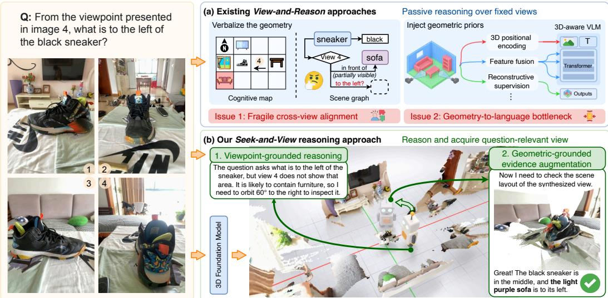  
Figure 1: (a) Existing approaches reason over fixed views, suffering from fragile cross-view alignment and the geometry-to-language bottleneck. (b) Our novel Seek-and-View reasoning paradigm seeks a question-relevant view (see bottom right) to make the spatial evidence directly observable.

To address these challenges, we propose Vantage, a two-stage training-free and model-agnostic framework that instantiates the Seek-and-View paradigm by incorporating a VLM with a 3D foundation model (3DFM). In the first viewpoint-grounded reasoning stage, the VLM analyzes the question to identify the necessary observation(s) and plans a viewpoint to acquire the intended evidence. In the second geometry-grounded evidence augmentation stage, the 3DFM produces a new view of the scene and takes it with the given question and proper guidance to support the final VLM reasoning. In this way, the 3DFM externalizes the cross-view alignment by reconstructing a consistent scene representation, meanwhile the VLM plans the viewpoint and continues reasoning with the additional visual evidence acquired from the new view; see Figure 1(b).

Our evaluations focus on multi-view spatial VQA tasks whose answers are determined by the geometric relations within static real-world scenes. Across five spatial reasoning benchmarks and six different VLMs, Vantage is able to consistently boost the performance of all the six VLMs without any fine-tuning, with a mean accuracy gain of 6.7%. These results highlight that the difficulty in current multi-view spatial understanding stems not only from limited geometric reasoning capability but also from passive reasoning on fixed input observations. Further, we analyze failure cases and reveal the other limitations of existing VLMs. Our main contributions are threefold:

• We introduce a novel Seek-and-View reasoning paradigm for multi-view spatial understanding, in which we propose to seek cross-view spatial evidence through a questionrelevant viewpoint rather than reasoning solely on fixed input observations.

• We propose Vantage, a two-stage training-free framework to realize Seek-and-View with a viewpoint-grounded reasoning and a geometry-grounded evidence augmentation, explicitly coupling VLM reasoning with a 3D foundation model.

• Through extensive experiments across six VLMs and five benchmarks, we demonstrate the effectiveness of Seek-and-View, revealing its strength to boost the VLM performance and also the limitations of existing VLMs under this reasoning paradigm.

## 2 RELATED WORK

Multi-View Spatial Reasoning Existing research has enhanced VLMs for multi-view spatial reasoning largely in two directions. The first verbalizes scene geometry into textual or symbolic structures, such as cognitive maps, scene graphs, or bounding boxes to support downstream reasoning [19, 4, 3, 7, 20–23]. This approach, however, demands labor-intensive per-scene annotations and subsequent supervised fine-tuning. The second direction injects geometric priors directly into the model [24, 8, 25, 10, 26, 9], e.g., by fusing features from geometric encoders, redesigning positional encoding with 3D coordinates, or introducing reconstructive training objectives. Despite these advances, the visual observations are typically fixed, leaving the model to reason over a predeter mined set of views. In contrast, our Seek-and-View reasoning paradigm adapts the observation itself by acquiring a task-specific view tailored to the question, while keeping the core VLM training-free.

Thinking with images paradigm Thinking with images [16] is an emerging paradigm that externalizes intermediate reasoning into visual operations such as sketching, marking, zooming, and depth estimation for mathematical geometry and 2D spatial tasks [14, 15, 27, 17, 28–30, 12, 31]. Related agentic approaches further treat the VLM as a tool-calling agent, augmenting reasoning via various external tools [13, 32–34].

Spatial reasoning can leverage a world model to generate unseen observations for iterative exploration [35–40, 18]. This approach, however, incurs substantial inference cost, while requiring dedicated fine-tuning to maintain cross-view consistency. Other approaches [41–43] construct stitched panoramic views or top-down scene representations to try to preserve the scene consistency. Yet, these representations are typically generated as generic global views, rather than tailored to expose the spatial evidence needed for a specific question. Our approach instead performs a questionrelevant view seeking, allowing the geometric backend to acquire the desired visual evidence to support the subsequent spatial reasoning.

3D Foundation Models for View Synthesis Recent 3D foundation models (3DFMs) [44–47] have made feed-forward recovery of scene geometry increasingly practical. G3T [48] further introduces gravity-aligned point maps, providing an upright scene coordinate frame. By reconstructing a consistent scene representation and estimating camera poses, 3DFMs externalize the cross-view alignment and allow viewpoint planning and view synthesis of the scene. Such a view synthesis differs from conventional novel view synthesis, which aims to faithfully render a scene from a specified pose. Our setting instead seeks a viewpoint mainly for exposing the spatial evidence to support the reasoning. Hence, the synthesized view need not be photorealistic. Its core value is to preserve the underlying scene and reveal necessary visual evidence needed for answering the given question.

## 3 METHOD

Vantage is a two-stage pipeline, as shown in Figure 2. Its name reflects the key idea, $i . e . .$ , the model seeks a vantage viewpoint from which the spatial relation relevant to answering the given question can become visible to support the reasoning. In this section, we first overview the Seek-and-View reasoning paradigm in Section 3.1, followed by the method details in Sections 3.2 and 3.3.

## 3.1 OVERVIEW OF SEEK-AND-VIEW REASONING PARADIGM

Given a spatial question q and a set of sparse, unposed input views $\mathcal { V } = \{ v _ { i } \} _ { i = 1 } ^ { N }$ , we consider visual question answering (VQA), in which the observed input views V collectively provide the scene information for answering question $q .$ However, the relevant spatial relation for answering question q may not be directly observable solely from any individual view in V.

Seeking. Directly using a VLM to predict the camera pose of the target view is unreliable [40]. Yet, introducing a metric 3D coordinate system could further escalate the uncertainty in scale, orientation, and alignment. We thus formulate view planning as a relative camera action grounded in one of the observed views to more reliably control the viewpoint. A reasoner H analyzes the question q and available observations $\nu$ to select a reference view $v _ { r }$ and a relative camera action $\Delta v ,$ while retaining intermediate reasoning contexts for subsequent answer prediction:

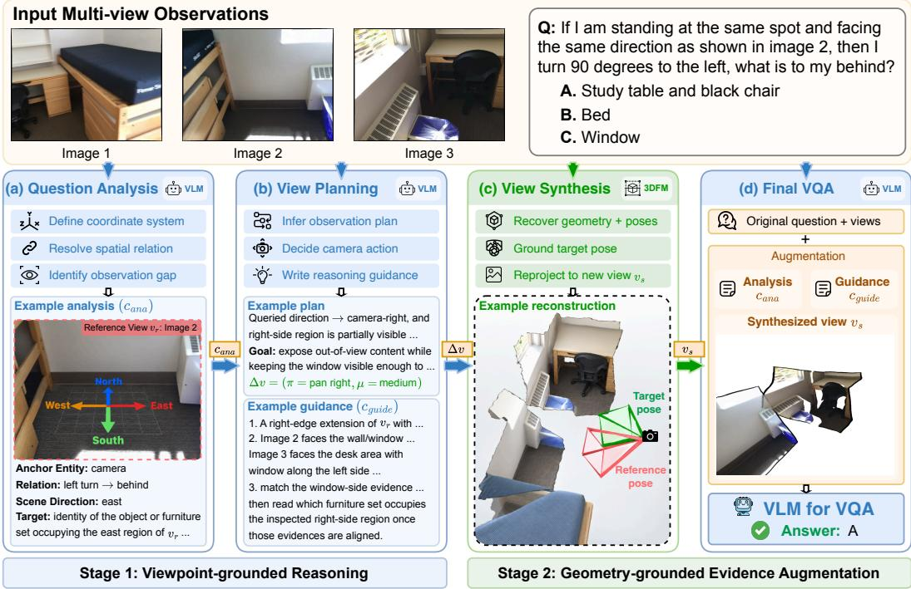  
Figure 2: Overview of Vantage pipeline. Stage 1: Viewpoint-grounded reasoning employs an VLM (in blue) to (a) produce an analysis on the input question (top-right), select reference view $v _ { r } ,$ identify queried spatial relation, then (b) plan a question-relevant camera action $\Delta v$ on reference view $v _ { r }$ and generate reasoning guidance for supporting view interpretation. Stage 2: (c) Geometrygrounded evidence augmentation synthesizes the planned view $v _ { s }$ from the 3DFM reconstruction (in green) and provides it together with the original images, viewpoint analysis $c _ { \mathrm { a n a } }$ , and reasoning guidance $c _ { \mathrm { g u i d e } }$ to support (d) the final reasoning.

$$
\mathcal { H } ( q , \mathcal { V } )  ( v _ { r } , \Delta v , c _ { \mathrm { a n a } } , c _ { \mathrm { g u i d e } } ) ,\tag{1}
$$

where $c _ { \mathrm { a n a } }$ captures the question-oriented analysis of the current observations, and $c _ { \mathrm { g u i d e } }$ contains the planned view adjustment and its underlying rationale.

Viewing. Before answering the input question $q ,$ , we obtain the view through a geometry-grounded synthesis: a 3D foundation model reconstructs the scene and its camera poses from the unposed input views $\nu ,$ and the planned action $\Delta v$ is applied to the reference view $v _ { r }$ to reproject the reconstruction to produce the requested view $v _ { s }$ . The synthesized view $v _ { s }$ is then incorporated into the original VQA (q, V), together with the intermediate reasoning contexts $( c _ { \mathrm { a n a } } , c _ { \mathrm { g u i d e } } )$ , to support the subsequent spatial reasoning. We detail the reconstruction and reprojection in Section 3.3.

## 3.2 VIEWPOINT-GROUNDED REASONING

Instead of unconstrained reasoning, we structure view planning around question analysis and action planning in viewpoint-aware perspective. In this way, we can resolve spatial relations not directly observable from any individual view and determine how to adjust the viewpoint to reveal the spatial relations. However, grounding such semantic reasoning into an executable camera action remains challenging. We therefore decompose viewpoint-grounded reasoning into the following two steps:

Question analysis: Establishing a semantic directional frame from the reference view. A natural starting point for multi-view reasoning is to find a view whose scene contents are most relevant to the question. Here, we employ a VLM to first select a reference view $v _ { r }$ from the input views V conditioned on the question $q .$ It then then identifies the anchor entity, namely the camera viewpoint, object, or region in the reference view that constitutes one side of the queried spatial relation.

Directional terms such as left, right, front, and behind may refer to different frames of reference while sharing the same linguistic expressions [49, 3]. This creates ambiguity in how a directional relation should be spatially grounded. To reduce this ambiguity, the VLM establishes a semantic directional frame grounded in reference view $v _ { r }$ . By default, the forward direction of $v _ { r }$ is treated as north, unless an explicit directional convention is specified by the question. This semantic frame is maintained throughout the reasoning process to provide a consistent interpretation of directional relations without requiring explicit metric 3D coordinates.

Resolving Spatial Relations into Observation Needs. The VLM identifies the queried entity or region and the spatial relation with respect to the anchor. It then resolves this relation within the established semantic directional frame, translating object-relative or camera-relative directions into a unified scene direction; see Figure 2 (Stage 1). From the reference view $v _ { r } ,$ the model examines the currently visible evidence and determines which spatial relation remains visible or verifiable. Together, these elements form the question analysis context $c _ { \mathrm { a n a } }$ , which summarizes the problem diagnosis and provides the reasoning basis for subsequent viewpoint planning.

View Planning: From Observation Need to Camera Action. The observation need identified above is then translated into a camera action. However, it is expressed semantically, whereas acquiring a new view requires a camera pose defined in the reconstructed 3D space. We therefore provide the VLM with a predefined action set of 17 camera motions spanning rotation, translation, and hybrid transformations, each parameterized by three coarse magnitude levels: small, medium, and large. For example, a rightward rotation corresponds to 30◦, 60◦, and $9 0 ^ { \circ }$ , respectively. Conditioned on question $q ,$ input views V, question analysis context $c _ { \mathrm { a n a } } .$ , and an action-planning prompt that specifies this action set, the VLM predicts a camera adjustment relative to the reference view $v _ { r } \colon$

$$
\Delta v = ( \pi , \mu ) ,\tag{2}
$$

where $\pi$ denotes the selected camera action and $\mu$ its magnitude level. After the 3DFM estimates the pose of the reference view, the geometric backend maps $\Delta v$ to the corresponding numerical pose transformation in the reconstructed coordinate frame. This structured interface allows the VLM to reason about how to adjust the viewpoint without directly predicting the metric camera pose, while leaving precise geometric grounding to the reconstruction backend. Section 4.3 shows the benefit of this structured action interface and the Appendix provides the action set and planning prompt.

Preserving the Reasoning Context. The synthesized view alone does not convey why the viewpoint was selected or which spatial cues should be examined. To explicitly convey this planning intent [34], the VLM also generates the reasoning guidance context $c _ { \mathrm { g u i d e } }$ within the same view planning call. The guidance describes the expected spatial configuration, identifies relevant visual anchors in the input views, and specifies the spatial cues to inspect or combine in the synthesized view. Since it is generated before view synthesis, it records the intended use of the new observation without assuming that the expected evidence is present. The resulting $c _ { \mathrm { g u i d e } }$ is passed to the final VQA stage as auxiliary context, preserving the connection between the planned observation and the original visual evidence.

## 3.3 GEOMETRY-GROUNDED EVIDENCE AUGMENTATION

In this stage, we ground the planned viewpoint in the reconstructed 3D scene to synthesize the view. We then use this geometry-grounded observation with proper guidance from the previous stage to augment the original VQA for continuous reasoning through the following two steps.

View Synthesis: Realizing the Requested Observation. It is important that the planned semantic action preserves its intended orientation with respect to the ground plane. For example, the action in Figure 2 requires the camera to pan $6 0 ^ { \circ }$ to the right while remaining horizontally aligned with the ground plane. This motivates gravity-aligning the reconstructed scene to provide a canonical world frame for converting semantic actions into geometric camera transformations. The 3DFM $\mathcal { G }$ first recovers the scene geometry and camera poses from the unposed input views V:

$$
\mathcal { G } ( \mathcal { V } ) = ( \mathcal { Z } , \mathcal { P } ) ,\tag{3}
$$

where $\mathcal { Z }$ denotes the reconstructed scene as a point cloud and $\mathcal { P } = \{ p _ { i } \} _ { i = 1 } ^ { N }$ the estimated camera poses. The planned action $\Delta v$ is then deterministically mapped to a 6-DoF camera transformation relative to the reference view pose $p _ { r }$ in this gravity-aligned reconstruction, with the scene geometry

providing the scale required to instantiate its coarse magnitude. Reprojecting the point cloud from the resulting target pose gives the synthesized view:

$$
v _ { s } = \mathcal { R } \left( \mathcal { Z } , p _ { r } \oplus \Delta v \right) ,\tag{4}
$$

where $\mathcal { R }$ denotes the reprojection operator and ⊕ the relative camera transformation induced by $\Delta v .$ Since $v _ { s }$ only rearranges pixels observed in the input views, scene surfaces not covered by any input view remain empty, so the synthesized view supplements rather than replaces the input observations. More implementation details of view synthesis are provided in the Appendix.

Final VQA: Answering with Contextual Augmentation. For final answer prediction, we augment the original inputs with the synthesized view $v _ { s }$ and the reasoning contexts produced during question analysis and view planning. Specifically, $c _ { \mathrm { a n a } }$ preserves the resolved directional frame and observation need, while $c _ { \mathrm { g u i d e } }$ conveys how the synthesized view should be interpreted with respect to the relevant anchors and spatial cues. The VLM $\mathcal { F }$ then answers the question with the synthesized view and the reasoning contexts:

$$
\boldsymbol { \hat { y } } = \mathcal { F } \left( \boldsymbol { q } , \mathcal { V } , v _ { s } , c _ { \mathrm { a n a } } , c _ { \mathrm { g u i d e } } \right) ,\tag{5}
$$

where $\hat { y }$ is the predicted answer. The original input views remain available throughout this stage, since the synthesized view may be incomplete, allowing the model to combine evidence from both the observed views and the synthesized observation. These three augmentation components, namely the synthesized view, question analysis, and reasoning guidance, are evaluated separately in our ablation study in Section 4.3.

## 4 EXPERIMENTS

## 4.1 SETUP

Implementation Details. We evaluate Vantage on six VLMs for a wide range of model sizes, $i . e . ,$ GPT-5.4 [50], Gemma-4-31B [51], Qwen3.6-27B [52], InternVL3-8B [53], Qwen3-VL-8B, and Qwen3-VL-4B [54]. For the open-source models, we run inference using vLLM [55] under the official configurations with two NVIDIA H200 GPUs. We employ G3T [48] as the default 3D foundation model (3DFM) for gravity-aligned scene reconstruction and camera pose estimation, and deploy it on the same two GPUs.

Benchmarks. We primarily evaluate on multi-view spatial VQA in static scenes, excluding tasks that involve temporal dynamics or simulated environments. Our main evaluation covers MindCubetiny [3], the Positional Relationship and Attribute subsets of MMSI-Bench [49], and the Multiview Reasoning subset of BLINK [5]. To evaluate the broader applicability of the Seek-and-View paradigm, we additionally include the Perspective Taking subset of OmniSpatial [6] for singleview spatial understanding, and the Dynamic Rotation and Dynamic Translation subsets of SPIN-Bench [56], where objects or subjects rotate or translate while the background scene remains static.

We compare with the state-of-the-art methods [21, 13] on three multi-view benchmarks. Following the evaluation protocols of prior work [3, 13], we report accuracy (%) for each subset and the average accuracy (%) across subsets. Unless otherwise specified, all evaluations use the benchmark subsets described above. Details on each benchmark are provided in the Appendix.

## 4.2 MAIN RESULTS

Consistent Gains Across Benchmarks. Table 1 shows that Vantage consistently improves the average accuracy of all six VLMs without additional training. The gains extend to strong base performance, with Qwen3.6-27B improving from 90.5% to 93.5% on the MindCube-tiny Rotation subset. More substantial gains are observed when cross-view reasoning remains challenging, as Gemma-4-31B improves from 51.0% to 82.0% on the same subset. Beyond the multi-view benchmarks, Vantage also improves five of the six models on OmniSpatial, where viewpoint adjustment can expose inferred 3D structures through parallax and provide auxiliary depth cues. On the dy namic SPINBench subsets, Vantage improves four of the six models, suggesting that the sought view helps to provide spatial cues for object-motion reasoning. Overall, these results demonstrate the consistent benefits of Vantage through viewpoint-grounded reasoning and geometry-grounded evidence augmentation to enhance the spatial reasoning.

Table 1: Main results on five benchmarks. For each base model, the better result is shown in bold. The final two columns report the average accuracy across all five benchmarks and the relative improvement. †Results are reported as in their original papers.
<table><tr><td rowspan="2">Model</td><td colspan="4">MindCube-tiny</td><td colspan="3">MMSI-Bench</td><td>BLINK OmniSpatial</td><td colspan="4"></td><td rowspan="2"></td><td rowspan="2">% Gain</td></tr><tr><td>Rot.</td><td>Ard.</td><td>Amg.</td><td>All</td><td>PR.</td><td>Attr.</td><td>All</td><td>MV</td><td>Pers.</td><td>D.Rot D.Tr</td><td>All</td></tr><tr><td>Training-Scaled Spatial Model</td><td></td><td></td><td></td><td></td><td></td><td></td><td></td><td></td><td></td><td></td><td></td><td></td><td></td><td></td></tr><tr><td>SenseNova-SI-1.5-InternVL3-8B Model-Scaled Spatial Agent</td><td>92.5</td><td>90.8</td><td>94.5</td><td>93.24</td><td>47.1</td><td>37.7</td><td>45.2</td><td>63.9</td><td>52.0</td><td>43.6</td><td>41.7</td><td>43.0 | 59.5</td><td></td><td></td></tr><tr><td>GCA (Qwen3-VL-235B-A22B-Thinking)†</td><td>82.0</td><td>61.8</td><td>59.8</td><td>64.2</td><td>52.8</td><td>45.0</td><td>51.2</td><td></td><td>58.6</td><td></td><td></td><td>1</td><td>1</td><td></td></tr><tr><td>Vantage on base models</td><td></td><td></td><td></td><td></td><td></td><td></td><td></td><td></td><td></td><td></td><td></td><td></td><td></td><td></td></tr><tr><td>Qwen3-VL-4B</td><td>33.0</td><td>34.0</td><td>20.3</td><td>26.0</td><td>27.4</td><td>30.0</td><td>27.9</td><td>41.4</td><td>42.1</td><td>48.2</td><td>64.7</td><td>53.2</td><td>38.1</td><td></td></tr><tr><td>+ Vantage</td><td>35.0</td><td>46.8</td><td>36.8</td><td>38.9</td><td>34.7</td><td>30.0</td><td>33.7</td><td>42.1</td><td>47.2</td><td>49.3</td><td>62.8</td><td>53.4</td><td>43.1</td><td>+13.1</td></tr><tr><td>Qwen3-VL-8B</td><td>36.5</td><td>33.2</td><td>28.8</td><td>31.3</td><td>31.4</td><td>24.6</td><td>30.1</td><td>44.4</td><td>43.9</td><td>44.2</td><td>73.7</td><td>53.2</td><td>40.6</td><td></td></tr><tr><td>+ Vantage</td><td>36.5</td><td>28.8</td><td>31.2</td><td>31.6</td><td>29.9</td><td>30.8</td><td>30.1</td><td>45.1</td><td>45.1</td><td>42.5</td><td>75.0</td><td>52.5</td><td>40.9</td><td>+0.7</td></tr><tr><td>InternVL3-8B</td><td>35.5</td><td>47.2</td><td>32.8</td><td>36.8</td><td>29.3</td><td>24.6</td><td>28.4</td><td>54.1</td><td>44.0</td><td>47.0</td><td>53.2</td><td>48.9</td><td>42.4</td><td></td></tr><tr><td>+ Vantage</td><td>31.5</td><td>41.2</td><td>42.2</td><td>39.9</td><td>30.8</td><td>27.7</td><td>30.2</td><td>55.6</td><td>43.9</td><td>52.1</td><td>49.4</td><td>51.3</td><td>44.2</td><td>+4.2</td></tr><tr><td>Qwen3.6-27B</td><td>90.5</td><td>71.2</td><td>50.5</td><td>63.0</td><td>42.5</td><td>41.5</td><td>42.3</td><td>28.6</td><td>52.6</td><td>85.3</td><td>98.1</td><td>89.2</td><td>55.1</td><td></td></tr><tr><td>+ Vantage</td><td>93.5</td><td>70.0</td><td>60.0</td><td>68.8</td><td>44.3</td><td>46.9</td><td>44.8</td><td>29.3</td><td>64.7</td><td>83.6</td><td>98.1</td><td>88.0</td><td>59.1</td><td>+7.3</td></tr><tr><td>Gemma-4-31B</td><td>51.0</td><td>63.6</td><td>50.2</td><td>53.5</td><td>35.4</td><td>42.3</td><td>36.8</td><td>36.1</td><td>51.7</td><td>59.8</td><td>96.8</td><td>71.1</td><td>49.8</td><td></td></tr><tr><td>+ Vantage</td><td>82.0</td><td>56.0</td><td>57.7</td><td>61.9</td><td>36.2</td><td>40.8</td><td>37.1</td><td>44.4</td><td>55.1</td><td>64.9</td><td>94.2</td><td>73.9</td><td>54.5</td><td>+9.4</td></tr><tr><td>GPT-5.4</td><td>38.5</td><td>50.8</td><td>43.3</td><td>44.2</td><td>33.3</td><td>38.5</td><td>34.4</td><td>48.1</td><td>47.4</td><td>49.0</td><td>82.7</td><td>59.3</td><td>46.7</td><td></td></tr><tr><td>+ Vantage</td><td>61.5</td><td>56.8</td><td>50.8</td><td>54.3</td><td>41.8</td><td>38.5</td><td>41.1</td><td>54.1</td><td>53.7</td><td>53.8</td><td>86.5</td><td>63.9</td><td>53.4</td><td>+14.3</td></tr></table>

Table 2: Cross-source composition results. Self denotes steps executed by the evaluated model, while Cross denotes steps replaced by Qwen3.6-27B. Bold indicates the highest accuracy within each model group. ∆ denotes the accuracy change relative to model + Vantage.
<table><tr><td rowspan="2">Model</td><td rowspan="2">Question Analysis</td><td rowspan="2">View Planning</td><td colspan="2">MindCube-tiny</td><td colspan="2">MMSI-Bench</td><td colspan="2">BLINK</td><td colspan="2">OmniSpatial</td></tr><tr><td>Acc.</td><td>∆</td><td>Acc.</td><td>∆</td><td>Acc.</td><td>∆</td><td>Acc.</td><td>∆</td></tr><tr><td rowspan="4">Qwen3-VL-4B</td><td></td><td></td><td>26.0</td><td>-12.9</td><td>27.9</td><td>-5.8</td><td>41.4</td><td>-0.7</td><td>42.1</td><td>-5.1</td></tr><tr><td>Self</td><td>Self</td><td>38.9</td><td></td><td>33.7</td><td></td><td>42.1</td><td></td><td>47.2</td><td></td></tr><tr><td>Cross</td><td>Self</td><td>51.0</td><td>+12.1</td><td>35.3</td><td>+1.6</td><td>37.6</td><td>-4.5</td><td>50.6</td><td>+3.4</td></tr><tr><td>Cross</td><td>Cross</td><td>49.9</td><td>+11.0</td><td>36.2</td><td>+2.5</td><td>36.8</td><td>-5.3</td><td>48.1</td><td>+0.9</td></tr><tr><td rowspan="4">Qwen3-VL-8B</td><td></td><td>1</td><td>31.3</td><td>-0.3</td><td>30.1</td><td>0.0</td><td>44.4</td><td>-0.7</td><td>43.9</td><td>-1.2</td></tr><tr><td>Self</td><td>Self</td><td>31.6</td><td></td><td>30.1</td><td></td><td>45.1</td><td></td><td>45.1</td><td>一</td></tr><tr><td>Cross</td><td>Self</td><td>50.6</td><td>+19.0</td><td>35.1</td><td>+5.0</td><td>36.1</td><td>-9.0</td><td>51.3</td><td>+6.2</td></tr><tr><td>Cross</td><td>Cross</td><td>50.8</td><td>+19.2</td><td>34.8</td><td>+4.7</td><td>33.1</td><td>-12.0</td><td>49.0</td><td>+3.9</td></tr><tr><td rowspan="2">Qwen3.6-27B</td><td>一</td><td>一</td><td>63.0</td><td>-5.8</td><td>42.3</td><td>-2.5</td><td>28.6</td><td>-0.7</td><td>52.6</td><td>-12.1</td></tr><tr><td>Self</td><td>Self</td><td>68.8</td><td>一</td><td>44.8</td><td>1</td><td>29.3</td><td></td><td>64.7</td><td></td></tr></table>

Comparison with State-of-the-Art Methods. We also compare with state-of-the-art methods on three multi-view benchmarks. These approaches achieve strong performance through either extensive spatial-task training or tool-integrated agents built on substantially larger VLMs. In contrast, Vantage achieves its improvements with a training-free and diagnostic pipeline, reaching comparable or superior performance on several subsets without scaling task-specific training or model capacity for reliable tool calling. This highlights the potential of Seek-and-View as a complementary direction for advancing multi-view spatial reasoning.

Analysis and Planning Are Critical to Seek-and-View. The gains vary across models and do not increase monotonically with model size. To study further into this behavior, we compose the two steps in Stage 1, i.e., question analysis and view planning, using different model sources, while keeping Stage 2 unchanged. As shown in Table 2, the additional gains for the two smaller models depend strongly on the quality of question analysis and view planning, particularly for Qwen3-VL-8B. Directly replacing both steps with outputs from the larger Qwen3.6-27B does not always yield the best performance. Instead, stronger results are obtained often when the smaller model performs view planning based on the question analysis by Qwen3.6-27B. This suggests that the camera action and reasoning guidance should be aligned with the reasoning needs of the model for final VQA.

## 4.3 ABLATION STUDIES

We evaluate the design of Vantage through ablations of its question analysis step, action interface, and final VQA context. Reconstruction backend comparisons are provided in the Appendix.

Table 3: Question analysis (QA) step ablation. QA-skip plans views without the analysis; QAonly augments final VQA with analysis alone.
<table><tr><td>Model</td><td>Setting</td><td>MindCube-tiny</td><td>MMSI-Bench</td></tr><tr><td rowspan="4">Qwen3-VL-4B</td><td>Baseline</td><td>26.0</td><td>27.9</td></tr><tr><td>Vantage</td><td>38.9</td><td>33.7</td></tr><tr><td>QA-skip</td><td>30.0</td><td>26.8</td></tr><tr><td>QA-only</td><td>34.8</td><td>33.3</td></tr><tr><td rowspan="4">Qwen3-VL-8B</td><td>Baseline</td><td>31.3</td><td>30.1</td></tr><tr><td>Vantage</td><td>31.6</td><td>30.1</td></tr><tr><td>QA-skip</td><td>31.2</td><td>31.6</td></tr><tr><td>QA-only</td><td>27.5</td><td>28.5</td></tr><tr><td rowspan="4">Qwen3.6-27B</td><td>Baseline</td><td>63.0</td><td>42.3</td></tr><tr><td>Vantage</td><td>68.8</td><td>44.8</td></tr><tr><td>QA-skip</td><td>65.0</td><td>43.3</td></tr><tr><td>QA-only</td><td>63.4</td><td>42.2</td></tr><tr><td rowspan="4">Gemma-4-31B</td><td>Baseline</td><td>53.5</td><td>36.8</td></tr><tr><td>Vantage</td><td>61.9</td><td>37.1</td></tr><tr><td>QA-skip</td><td>58.7</td><td>37.3</td></tr><tr><td>QA-only</td><td>57.9</td><td>36.5</td></tr></table>

Table 4: Action interface ablation. We compare action selection, 6-DoF prediction, random actions and view interpolation on MindCube-tiny.
<table><tr><td>Model</td><td>Setting</td><td>Acc.</td><td>∆</td></tr><tr><td rowspan="4">Qwen3-VL-4B</td><td>Action selection (ours)</td><td>38.9</td><td></td></tr><tr><td>6-DoF prediction</td><td>34.6</td><td>-4.3</td></tr><tr><td>Random action</td><td>33.0</td><td>-5.9</td></tr><tr><td>View interpolation</td><td>32.1</td><td>-6.8</td></tr><tr><td rowspan="4">Qwen3-VL-8B</td><td>Action selection (ours)</td><td>31.6</td><td></td></tr><tr><td>6-DoF prediction</td><td>31.2</td><td>-0.4</td></tr><tr><td>Random action</td><td>31.8</td><td>+0.2</td></tr><tr><td>View interpolation</td><td>32.4</td><td>+0.8</td></tr><tr><td rowspan="4">Qwen3.6-27B</td><td>Action selection (ours)</td><td>68.8</td><td></td></tr><tr><td>6-DoF prediction</td><td>67.4</td><td>-1.4</td></tr><tr><td>Random action</td><td>63.1</td><td>-5.7</td></tr><tr><td>View interpolation</td><td>64.3</td><td>-4.5</td></tr><tr><td rowspan="4">Gemma-4-31B</td><td>Action selection (ours)</td><td>61.9</td><td></td></tr><tr><td>6-DoF prediction</td><td>61.5</td><td>-0.4</td></tr><tr><td>Random action</td><td>55.2</td><td>-6.7</td></tr><tr><td>View interpolation</td><td>54.6</td><td>-7.3</td></tr></table>

Table 5: Final VQA context ablation. Checkmarks indicate the component provided to the original VQA. Bold and italic denote the best and second-best average accuracy within each model, respectively. The final two columns report the absolute and relative improvements over its baseline.
<table><tr><td rowspan="2">Model</td><td colspan="3">Augmentation</td><td colspan="3">Benchmark</td><td rowspan="2">Avg.</td><td rowspan="2">Abs∆</td><td rowspan="2">Relative ∆</td></tr><tr><td>View</td><td>Analysis</td><td>Guidance</td><td>MindCube-tiny</td><td>MMSI-Bench</td><td>OmniSpatial</td></tr><tr><td rowspan="6">Qwen3-VL-4B</td><td></td><td></td><td></td><td>26.0</td><td>27.9</td><td>42.1</td><td>32.0</td><td>1</td><td></td></tr><tr><td></td><td>√</td><td>√</td><td>34.5</td><td>32.1</td><td>43.1</td><td>36.6</td><td>+4.6</td><td>+14.4</td></tr><tr><td></td><td></td><td></td><td>29.7</td><td>32.7</td><td>43.5</td><td>35.3</td><td>+3.3</td><td>+10.3</td></tr><tr><td>√ √</td><td>√</td><td></td><td>38.2</td><td>34.0</td><td>42.4</td><td>38.2</td><td>+6.2</td><td>+19.4</td></tr><tr><td>√</td><td></td><td>V</td><td>36.7</td><td>31.4</td><td>42.1</td><td>36.7</td><td>+4.7</td><td>+14.7</td></tr><tr><td>√</td><td>√</td><td>√</td><td>38.9</td><td>33.7</td><td>47.2</td><td>39.9</td><td>+7.9</td><td>+24.7</td></tr><tr><td rowspan="6">Gemma-4-31B</td><td></td><td></td><td></td><td>53.5</td><td>36.8</td><td>51.7</td><td>47.3</td><td></td><td></td></tr><tr><td></td><td>√</td><td>√</td><td>56.9</td><td>37.6</td><td>53.6</td><td>49.4</td><td>+2.1</td><td>+4.4</td></tr><tr><td>√</td><td></td><td></td><td>56.8</td><td>34.5</td><td>55.4</td><td>48.9</td><td>+1.6</td><td>+3.4</td></tr><tr><td>√</td><td>√</td><td></td><td>59.3</td><td>36.4</td><td>55.3</td><td>50.3</td><td>+3.0</td><td>+6.3</td></tr><tr><td>√</td><td></td><td>√</td><td>60.9</td><td>35.4</td><td>51.7</td><td>49.3</td><td>+2.0</td><td>+4.2</td></tr><tr><td>√</td><td>√</td><td>√</td><td>61.9</td><td>37.1</td><td>55.1</td><td>51.4</td><td>+4.1</td><td>+8.7</td></tr></table>

Role of the Question Analysis. As shown in Table 3, we compare the full pipeline with QA-skip, which plans the view without question analysis, and QA-only, which uses question analysis alone to augment the final VQA. For Qwen3-VL-4B, removing QA reduces accuracy from 38.9% to 30.0% on MindCube-tiny and from 33.7% to 26.8% on MMSI-Bench. Although QA alone improves over the baseline in several cases, Vantage outperforms both variants in most settings. This indicates that the QA step supports both view seeking and subsequent final reasoning.

Role of the Action Interface. Table 4 compares alternative strategies for determining the viewpoint. The 6-DoF variant directly predicts a numerical camera pose, the random variant samples from the predefined action set, and view interpolation synthesizes an intermediate observation between neighboring views. Across all four models, 6-DoF prediction underperforms our action-selection interface, while random actions and view interpolation provide limited gains overall. Notably, view interpolation only surpasses our method for Qwen3-VL-8B. These results support structured action selection as a more reliable interface between semantic planning and executable camera motion, and suggest that the gains of Seek-and-View come from seeking question-relevant viewpoints rather than simply adding denser or more continuous observations.

Role of the Visual and Textual Context. Table 5 examines how the synthesized view $v _ { s } .$ , question analysis $c _ { \mathrm { a n a } }$ , and reasoning guidance $c _ { \mathrm { g u i d e } }$ contribute to the final VQA step. All preceding steps are kept fixed, with only the context supplied to the final VQA being varied. Using the synthesized view alone improves the average accuracy across the three benchmarks for all four models. Combining the view with textual context generally yields further gains, while the full combination consistently outperforms the setting using only question analysis and reasoning guidance (row 2). These results indicate that visual and textual context play complementary roles: the synthesized view provides additional spatial evidence, while the analysis and guidance preserve the observation objective and help the model interpret this evidence during the final reasoning.

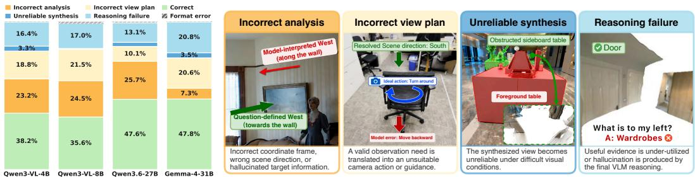  
Figure 3: Major failure types of Vantage. Left: Macro-averaged failure analysis. Right: Representative failure cases by type. More detailed visualizations of these representative failure cases are provided in the Appendix.

## 4.4 DISCUSSION

Our training-free model-agnostic framework enables a diagnostic analysis of where current VLMs + Seek-and-View still fail. We audit 600 incorrect predictions across four models and three multi-view benchmarks. Figure 3 summarizes the estimated prevalence of different failure types and representative cases. Detailed categorization and estimation procedures are provided in the Appendix.

What Limits View Seeking? The dominant failures arise in the viewpoint-grounded reasoning stage. Incorrect analysis and incorrect view plan together account for most residual errors, indicating that deciding what should be seen and how to reach it remains the main bottleneck. As illustrated in Figure 3 (right), these failures reflect errors in analyzing the spatial context or in translating a valid observation need into an executable camera action. These results suggest that effective viewpoint seeking depends on both accurate question interpretation and reliable grounding from semantic in tent to geometric action. This trend is further supported by the cross-source results in Table 2.

What Limits Reasoning from the Sought View? Failures at this stage mainly arise from unreliable synthesis or reasoning failure. Unreliable synthesis is rare and mostly occurs under challenging visual conditions, such as reflections, transparency, severe occlusion, close-up views, darkness, blur, or low resolution. This suggests that Seek-and-View tolerates imperfect rendering, as long as the synthesized view preserves sufficient geometric and semantic evidence for reasoning. Reasoning failures occur when the final VLM under-utilizes useful evidence in the sought view or produces an inconsistent reasoning trace. Thus, the sought view provides additional visual evidence to support cross-view alignment, while reliable spatial reasoning remains necessary for accurate answering.

## 5 CONCLUSION

We formulated Seek-and-View, a new reasoning paradigm that seeks question-relevant viewpoints to make spatial evidence distributed across views more directly observable. This paradigm alleviates the burden on semantic textual reasoning for global scene understanding through questionrelevant, evidence-seeking and reasoning-oriented visual evidence acquisition. To instantiate Seekand-View, we proposed Vantage, which integrates a VLM with a 3D foundation model through a viewpoint-grounded reasoning stage and a geometry-grounded evidence augmentation stage. Across five benchmarks and six VLMs, this training-free and model-agnostic framework consistently improves spatial reasoning. The results suggest that more robust multi-view spatial understanding does not always require strengthening reasoning over fixed observations; rather, seeking question-relevan visual evidence supports cross-view alignment and enhances subsequent reasoning.

Limitation & Future work. As a training-free framework, Vantage may yield rollouts of varying quality depending on the capabilities of the underlying VLM and 3DFM. Future work could leverage high-quality rollouts for end-to-end optimization toward more reliable spatial reasoning.

## ACKNOWLEDGMENT

This research was undertaken with the assistance of resources from Monash University and the National Computational Infrastructure (NCI Australia) allocation scheme. NCI is an NCRIS-enabled capability supported by the Australian Government.

## REFERENCES

[1] Mohsen Gholami, Ahmad Rezaei, Zhou Weimin, Sitong Mao, Shunbo Zhou, Yong Zhang, and Mohammad Akbari. Spatial reasoning with vision-language models in ego-centric multiview scenes. In International Conference on Learning Representations, volume 2026, pages 101989–102021, 2026.

[2] Jiahui Zhang, Yurui Chen, Yueming Xu, Ze Huang, Jilin Mei, Chunhui Chen, Yanpeng Zhou, Yu-Jie Yuan, Xinyue Cai, Guowei Huang, et al. From flatland to space: Teaching visionlanguage models to perceive and reason in 3d. Advances in Neural Information Processing Systems, 38, 2026.

[3] Qineng Wang, Baiqiao Yin, Pingyue Zhang, Jianshu Zhang, Kangrui Wang, Zihan Wang, Jieyu Zhang, Keshigeyan Chandrasegaran, Han Liu, Ranjay Krishna, Saining Xie, Jiajun Wu, Li Fei-Fei, and Manling Li. Mindcube: Spatial mental modeling from limited views. In The Fourteenth International Conference on Learning Representations, 2026. URL https: //openreview.net/forum?id=0FhrtdKLtD.

[4] Fucai Ke, Zhixi Cai, Boying Li, Long Chen, Beibei Lin, Weiqing Wang, Pari Delir Haghighi, Gholamreza Haffari, and Hamid Rezatofighi. View2space: Studying multi-view visual reasoning from sparse observations. In European Conference on Computer Vision, pages 520–538. Springer, 2026.

[5] Xingyu Fu, Yushi Hu, Bangzheng Li, Yu Feng, Haoyu Wang, Xudong Lin, Dan Roth, Noah A Smith, Wei-Chiu Ma, and Ranjay Krishna. Blink: Multimodal large language models can see but not perceive. In European Conference on Computer Vision, pages 148–166. Springer, 2024.

[6] Mengdi Jia, Zekun Qi, Shaochen Zhang, Wenyao Zhang, Xinqiang Yu, Jiawei He, He Wang, and Li Yi. Omnispatial: Towards comprehensive spatial reasoning benchmark for vision language models. In International Conference on Learning Representations, volume 2026, pages 35634–35670, 2026.

[7] Xudong Li, Mengdan Zhang, Peixian Chen, Jiaxi Tan, Zihao Huang, Jingyuan Zheng, Yan Zhang, Xiawu Zheng, Xing Sun, and Rongrong Ji. Omniview-space: Reinforcing spatial reasoning via multi-perspective spatial mapping. arXiv preprint arXiv:2607.00881, 2026.

[8] Duo Zheng, Yanyang Li, Liwei Wang, et al. Learning from videos for 3d world: Enhancing mllms with 3d vision geometry priors. Advances in neural information processing systems, 38: 20560–20586, 2026.

[9] Shihua Zhang, Qiuhong Shen, Shizun Wang, Tianbo Pan, and Xinchao Wang. Make geometry matter for spatial reasoning. In European Conference on Computer Vision, pages 231–249. Springer, 2026.

[10] Wenbo Hu, Jingli Lin, Yilin Long, Yunlong Ran, Lihan Jiang, Yifan Wang, Chenming Zhu, Runsen Xu, Tai Wang, and Jiangmiao Pang. G\$ˆ2\$vlm: Geometry grounded vision language model with unified 3d reconstruction and spatial reasoning. In Proceedings of the IEEE/CVF Conference on Computer Vision and Pattern Recognition (CVPR), pages 9535–9546, June 2026.

[11] Qixiang Chen, Cheng Zhang, Chi-Wing Fu, Jingwen Ye, and Jianfei Cai. Openview: Empowering mllms with out-of-view vqa. arXiv preprint arXiv:2512.18563, 2025.

[12] Junfei Wu, Jian Guan, Kaituo Feng, Qiang Liu, Shu Wu, Liang Wang, Wei Wu, and Tieniu Tan. Reinforcing spatial reasoning in vision-language models with interwoven thinking and visual drawing. Advances in Neural Information Processing Systems, 38:143297–143330, 2026.

[13] Zeren Chen, Xiaoya Lu, Zhijie Zheng, Pengrui Li, Lehan He, Yijin Zhou, Jing Shao, Bohan Zhuang, and Lu Sheng. Geometrically-constrained agent for spatial reasoning. In Proceedings of the IEEE/CVF Conference on Computer Vision and Pattern Recognition, pages 38689– 38699, 2026.

[14] Tanmay Gupta and Aniruddha Kembhavi. Visual programming: Compositional visual reasoning without training. In 2023 IEEE/CVF Conference on Computer Vision and Pattern Recognition (CVPR), pages 14953–14962. IEEE, 2023.

[15] D´ıdac Sur´ıs, Sachit Menon, and Carl Vondrick. Vipergpt: Visual inference via python execution for reasoning. In 2023 IEEE/CVF International Conference on Computer Vision (ICCV), pages 11854–11864. IEEE, 2023.

[16] OpenAI. Thinking with images. https://openai.com/index/ thinking-with-images/, April 2025.

[17] Yiming Qin, Bomin Wei, Jiaxin Ge, Konstantinos Kallidromitis, Stephanie Fu, Trevor Darrell, and XuDong Wang. Chain-of-visual-thought: Teaching vlms to see and think better with continuous visual tokens. arXiv preprint arXiv:2511.19418, 2025.

[18] JiaKui Hu, Shanshan Zhao, Qing-Guo Chen, Xuerui Qiu, Jialun Liu, Zhao Xu, Weihua Luo, Kaifu Zhang, and Yanye Lu. Omni-view: Unlocking how generation facilitates understanding in unified 3d model based on multiview images. In International Conference on Learning Representations, volume 2026, pages 133697–133724, 2026.

[19] Phillip Y Lee, Jihyeon Je, Chanho Park, Mikaela Angelina Uy, Leonidas Guibas, and Minhyuk Sung. Perspective-aware reasoning in vision-language models via mental imagery simulation. In Proceedings of the IEEE/CVF international conference on computer vision, pages 9241– 9251, 2025.

[20] Xingjian Tao, Yiwei Wang, Yujun Cai, Yifan Song, and Jing Tang. Viewfusion: Structured spatial thinking chains for multi-view reasoning. In European Conference on Computer Vision, pages 135–151. Springer, 2026.

[21] Zhongang Cai, Ruisi Wang, Chenyang Gu, Fanyi Pu, Junxiang Xu, Yubo Wang, Wanqi Yin, Zhitao Yang, Chen Wei, Tongxi Zhou, et al. Scaling spatial intelligence with multimodal foundation models. In Proceedings of the IEEE/CVF Conference on Computer Vision and Pattern Recognition, pages 7879–7890, 2026.

[22] An-Chieh Cheng, Yang Fu, Yatai Ji, Ligeng Zhu, Guanqi Zhan, Zhuoyang Zhang, Zhaojing Yang, Song Han, Yao Lu, Pavlo Molchanov, et al. Grounded 3d-aware spatial vision-language modeling. arXiv preprint arXiv:2605.30307, 2026.

[23] Jiho Choi, Seonho Lee, Seojeong Park, and Hyunjung Shim. Dense reward for multi-view 3d reasoning with global maps and local views. arXiv preprint arXiv:2606.23557, 2026.

[24] Haochen Wang, Yucheng Zhao, Tiancai Wang, Haoqiang Fan, Xiangyu Zhang, and Zhaoxiang Zhang. Ross3d: Reconstructive visual instruction tuning with 3d-awareness. In 2025 IEEE/CVF International Conference on Computer Vision (ICCV), pages 9275–9286. IEEE, 2025.

[25] Muhammad Kamran Janjua, Hugo Silva, Di Niu, and Bahador Rashidi. Don’t show pixels, show cues: Unlocking visual tool reasoning in language models via perception programs. arXiv preprint arXiv:2604.12896, 2026.

[26] Jian Zhang, Shijie Zhou, Bangya Liu, Achuta Kadambi, and Zhiwen Fan. Spatialstack: Layered geometry-language fusion for 3d vlm spatial reasoning. arXiv preprint arXiv:2603.27437, 2026.

[27] Yushi Hu, Weijia Shi, Xingyu Fu, Dan Roth, Mari Ostendorf, Luke Zettlemoyer, Noah A Smith, and Ranjay Krishna. Visual sketchpad: Sketching as a visual chain of thought for multimodal language models. Advances in Neural Information Processing Systems, 37:139348– 139379, 2024.

[28] Wenhao Zhang, Yuexiang Xie, Yuchang Sun, Yanxi Chen, Guoyin Wang, Yaliang Li, Bolin Ding, and Jingren Zhou. On-policy rl meets off-policy experts: Harmonizing supervised finetuning and reinforcement learning via dynamic weighting. In International Conference on Learning Representations, volume 2026, pages 120693–120726, 2026.

[29] Zeyuan Yang, Xueyang Yu, Delin Chen, Maohao Shen, and Chuang Gan. Machine mental imagery: Empower multimodal reasoning with latent visual tokens. In Proceedings of the IEEE/CVF Conference on Computer Vision and Pattern Recognition, pages 33510–33520, 2026.

[30] Fucai Ke, Joy Hsu, Zhixi Cai, Zixian Ma, Xin Zheng, Xindi Wu, Sukai Huang, Weiqing Wang, Pari Delir Haghighi, Gholamreza Haffari, et al. Explain before you answer: A survey on compositional visual reasoning. arXiv preprint arXiv:2508.17298, 2025.

[31] Fucai Ke, Vijay Kumar B G, Xingjian Leng, Zhixi Cai, Zaid Khan, Weiqing Wang, Pari Delir Haghighi, Hamid Rezatofighi, and Manmohan Chandraker. Dwim: Towards tool-aware visual reasoning via discrepancy-aware workflow generation & instruct-masking tuning. In Proceedings of the IEEE/CVF International Conference on Computer Vision (ICCV), pages 3378– 3389, October 2025.

[32] Jiahua Chen, Qihong Tang, Weinong Wang, and Qi Fan. Enhancing mllm spatial understanding via active 3d scene exploration for multi-perspective reasoning. arXiv preprint arXiv:2604.06725, 2026.

[33] Seokju Cho, Ryo Hachiuma, Abhishek Badki, Hang Su, Byung-Kwan Lee, Chan Hee Song, Sifei Liu, Subhashree Radhakrishnan, Seungryong Kim, Yu-Chiang Frank Wang, et al. Spatialclaw: Rethinking action interface for agentic spatial reasoning. arXiv preprint arXiv:2606.13673, 2026.

[34] Kangrui Wang, Pingyue Zhang, Zihan Wang, Yaning Gao, Linjie Li, Qineng Wang, Hanyang Chen, Yiping Lu, Zhengyuan Yang, Lijuan Wang, et al. Vagen: Reinforcing world model reasoning for multi-turn vlm agents. Advances in Neural Information Processing Systems, 38: 172871–172933, 2026.

[35] Yuncong Yang, Jiageng Liu, Zheyuan Zhang, Siyuan Zhou, Reuben Tan, Jianwei Yang, Yilun Du, and Chuang Gan. Mindjourney: Test-time scaling with world models for spatial reasoning. Advances in Neural Information Processing Systems, 38:109855–109885, 2026.

[36] Meng Cao, Xingyu Li, Xue Liu, Ian Reid, and Xiaodan Liang. Spatialdreamer: Incentivizing spatial reasoning via active mental imagery. In Proceedings of the IEEE/CVF Conference on Computer Vision and Pattern Recognition, pages 7176–7187, 2026.

[37] Wanyue Zhang, Wenxiang Wu, Wang Xu, Jiaxin Luo, Helu Zhi, Yibin Huang, Shuo Ren, Zitao Liu, and Jiajun Zhang. World2vlm: Distilling world model imagination into vlms for dynamic spatial reasoning. arXiv preprint arXiv:2604.26934, 2026.

[38] Chenming Zhu, Jingli Lin, Yilin Long, Peizhou Cao, Tai Wang, Jiangmiao Pang, and Xihui Liu. Thinking with imagination: Agentic visual spatial reasoning with world simulators. arXiv preprint arXiv:2606.06476, 2026.

[39] Yifan Liu, Fangneng Zhan, Kaichen Zhou, Yilun Du, Paul Pu Liang, and Hanspeter Pfister. Abstract 3d perception for spatial intelligence in vision-language models. In Proceedings of the IEEE/CVF Conference on Computer Vision and Pattern Recognition, pages 38647–38656, 2026.

[40] Yanbing Zhang, Bo Wang, Jianhui Liu, Nan Jiang, Jiaxiu Jiang, Haoze Sun, Yijun Yang, Shenghe Zheng, Lin Song, Haoyang Huang, et al. Thinking with novel views: A systematic analysis of generative-augmented spatial intelligence. arXiv preprint arXiv:2605.10588, 2026.

[41] Qian Yang, Ankur Sikarwar, Huy Le, Le Zhang, Zhuan Shi, Perouz Taslakian, and Aishwarya Agrawal. How and what to imagine? visual thinking in unified multimodal models for crossview spatial reasoning. arXiv preprint arXiv:2605.27310, 2026.

[42] Zaibin Zhang, Yuhan Wu, Lianjie Jia, Yifan Wang, Zhongbo Zhang, Yijiang Li, Binghao Ran, Fuxi Zhang, Zhuohan Sun, Yizhuang Peng, et al. Think3d: Thinking with space for spatial reasoning. arXiv preprint arXiv:2601.13029, 2026.

[43] Zhao Jin, Rong-Cheng Tu, Jingyi Liao, Wenhao Sun, Xiao Luo, Shunyu Liu, and Dacheng Tao. Spazer: Spatial-semantic progressive reasoning agent for zero-shot 3d visual grounding. Advances in Neural Information Processing Systems, 38:165549–165576, 2026.

[44] Jianyuan Wang, Minghao Chen, Nikita Karaev, Andrea Vedaldi, Christian Rupprecht, and David Novotny. Vggt: Visual geometry grounded transformer. In 2025 IEEE/CVF Conference on Computer Vision and Pattern Recognition (CVPR), pages 5294–5306. IEEE, 2025.

[45] Haotong Lin, Sili Chen, Junhao Liew, Donny Y Chen, Zhenyu Li, Guang Shi, Jiashi Feng, and Bingyi Kang. Depth anything 3: Recovering the visual space from any views. arXiv preprint arXiv:2511.10647, 2025.

[46] Yifan Wang, Jianjun Zhou, Haoyi Zhu, Wenzheng Chang, Yang Zhou, Zizun Li, Junyi Chen, Jiangmiao Pang, Chunhua Shen, and Tong He. π3: Permutation-equivariant visual geometry learning. arXiv preprint arXiv:2507.13347, 2025.

[47] Jianyuan Wang, Minghao Chen, Shangzhan Zhang, Nikita Karaev, Johannes Schonberger,¨ Patrick Labatut, Piotr Bojanowski, David Novotny, Andrea Vedaldi, and Christian Rupprecht. Vggt-ω. arXiv preprint arXiv:2605.15195, 2026.

[48] Bharath Raj Nagoor Kani and Noah Snavely. G3t up! gravity aligned coordinate frames simplify pointmap processing. arXiv preprint arXiv:2605.27372, 2026.

[49] Sihan Yang, Runsen Xu, Yiman Xie, Sizhe Yang, Mo Li, Jingli Lin, Chenming Zhu, Xiaochen Chen, Haodong Duan, Xiangyu Yue, et al. Mmsi-bench: A benchmark for multi-image spatial intelligence. In International Conference on Learning Representations, volume 2026, pages 157051–157088, 2026.

[50] OpenAI. Introducing GPT-5.4. https://openai.com/index/ introducing-gpt-5-4/, 2026.

[51] Gemma Team, Sherif El Abd, Vaibhav Aggarwal, Robin Algayres, Alek Andreev, Olivier Bachem, Ian Ballantyne, Cormac Brick, Victor Carbune, Michelle Casbon, et al. Gemma 4˘ technical report. arXiv preprint arXiv:2607.02770, 2026.

[52] Qwen Team. Qwen3.6-27B: Flagship-level coding in a 27b dense model, April 2026. URL https://qwen.ai/blog?id=qwen3.6-27b.

[53] Jinguo Zhu, Weiyun Wang, Zhe Chen, Zhaoyang Liu, Shenglong Ye, Lixin Gu, Hao Tian, Yuchen Duan, Weijie Su, Jie Shao, et al. Internvl3: Exploring advanced training and test-time recipes for open-source multimodal models. arXiv preprint arXiv:2504.10479, 2025.

[54] An Yang, Anfeng Li, Baosong Yang, Beichen Zhang, Binyuan Hui, Bo Zheng, Bowen Yu, Chang Gao, Chengen Huang, Chenxu Lv, et al. Qwen3 technical report. arXiv preprint arXiv:2505.09388, 2025.

[55] Woosuk Kwon, Zhuohan Li, Siyuan Zhuang, Ying Sheng, Lianmin Zheng, Cody Hao Yu, Joseph E. Gonzalez, Hao Zhang, and Ion Stoica. Efficient memory management for large language model serving with pagedattention. In Proceedings of the ACM SIGOPS 29th Symposium on Operating Systems Principles, 2023.

[56] Yuyou Zhang, Radu Corcodel, Chiori Hori, Anoop Cherian, and Ding Zhao. Spinbench: Perspective and rotation as a lens on spatial reasoning in vlms. In International Conference on Learning Representations, volume 2026, pages 70072–70141, 2026.

[57] Alexander Veicht, Paul-Edouard Sarlin, Philipp Lindenberger, and Marc Pollefeys. Geocalib: Learning single-image calibration with geometric optimization. In European Conference on Computer Vision, pages 1–20. Springer, 2024.

## APPENDIX

The appendix is organized as follows:

• Section A provides additional design and implementation details of Vantage, including the action set, view synthesis pipeline, gravity alignment, reconstruction backend, and prompt templates.

• Section B provides detailed descriptions of the evaluation benchmarks and subset selection.

• Section C presents additional qualitative results and the detailed failure analysis protocol.

## A MORE DETAILS OF VANTAGE

This section provides additional details of Vantage, covering the action space, view synthesis procedure, gravity alignment study, and prompt templates.

## A.1 ACTION SET FOR VIEW PLANNING

We provide the complete action set used for view planning in Table 6, together with the corresponding magnitude levels. We adopt the camera convention +yaw for leftward rotation, +pitch for upward tilt, and +x, +y, and +z for rightward, downward, and forward translation, respectively. Rotation actions modify only the viewing direction, whereas translation actions move the camera by a distance specified in scene units. For hybrid transformations, orbit actions rotate the camera around the centroid of the reconstructed point cloud, while bird’s-eye and worm’s-eye views introduce ad ditional pitch rotations to obtain elevated or lowered viewpoints. Since the reconstructed point cloud is not metrically scaled, absolute translation distances are not directly transferable across scenes. We therefore define one scene unit s as the mean Euclidean distance from the reference camera center to the remaining input camera centers, providing a scene-adaptive scale that reflects the spatial spread of the observed viewpoints.

Table 6: Action set for view planning. Each semantic action is deterministically mapped to a geometric transformation with three magnitude levels (small, medium, and large), except for turn around, which uses a fixed 180◦ rotation. Translation magnitudes are expressed in scene unit s.
<table><tr><td>Category</td><td>Action</td><td>Transformation</td><td>Small</td><td>Medium</td><td>Large</td></tr><tr><td rowspan="5">Rotation</td><td>Pan left</td><td>+∆yaw</td><td>30°</td><td>60°</td><td>90°</td></tr><tr><td>Pan right</td><td>-∆yaw</td><td>30°</td><td>60°</td><td>90°</td></tr><tr><td>Tilt up</td><td>+∆pitch</td><td>30°</td><td>60°</td><td>90°</td></tr><tr><td>Tilt down</td><td>-∆pitch</td><td>30°</td><td>60°</td><td>90°</td></tr><tr><td>Turn around</td><td>∆yaw</td><td></td><td>180°</td><td></td></tr><tr><td rowspan="6">Translation</td><td>Move right</td><td>+∆x</td><td>0.40s</td><td>0.80s</td><td>1.40s</td></tr><tr><td>Move left</td><td>−∆x</td><td>0.40s</td><td>0.80s</td><td>1.40s</td></tr><tr><td>Pedestal down</td><td>+∆y</td><td>0.30s</td><td>0.55s</td><td>0.90s</td></tr><tr><td>Pedestal up</td><td>-∆y</td><td>0.30s</td><td>0.55s</td><td>0.90s</td></tr><tr><td>Move forward</td><td>+∆z</td><td>0.40s</td><td>0.80s</td><td>1.40s</td></tr><tr><td>Move backward</td><td>−∆z</td><td>0.40s</td><td>0.80s</td><td>1.40s</td></tr><tr><td rowspan="6">Hybrid</td><td>Orbit left</td><td>Orbit around centroid, left</td><td>30°</td><td>60°</td><td>90°</td></tr><tr><td>Orbit right</td><td>Orbit around centroid, right</td><td>30°</td><td>60°</td><td>90°</td></tr><tr><td>Orbit up</td><td>Orbit around centroid, upward</td><td>30°</td><td>60°</td><td>90°</td></tr><tr><td>Orbit down</td><td>Orbit around centroid, downward</td><td>30°</td><td>60°</td><td>90°</td></tr><tr><td>Bird&#x27;s-eye view</td><td>+∆pitch</td><td>40°</td><td>55°</td><td>70°</td></tr><tr><td>Worm&#x27;s-eye view</td><td>-∆pitch</td><td>40°</td><td>55°</td><td>70°</td></tr></table>

## A.2 VIEW SYNTHESIS PIPELINE

Given the target camera extrinsics determined above, we further specify the camera intrinsics for view synthesis. In particular, the field of view (FoV) is chosen to preserve sufficient scene coverage after the planned camera transformation. For rotation and translation actions, we use a fixed FoV of 120◦ to provide a sufficiently wide observation. For hybrid transformations, which can substantially change the camera position relative to the scene, we adapt the FoV to maintain coverage of the reconstructed scene. For example, a bird’s-eye transformation may change the apparent scale of a compact scene, and the FoV is adjusted accordingly to retain informative coverage. The output follows the aspect ratio of the reference view, while reprojection is performed at twice the target width and height before downsampling to the resolution of the reference view.

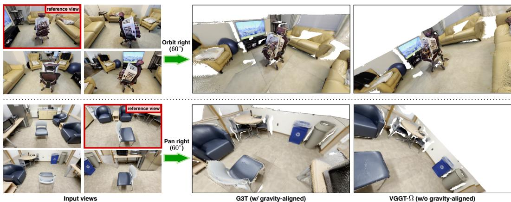  
Figure 4: Effect of gravity alignment on view synthesis. Given the same input views, reference view, and planned camera action, we compare view synthesis using a gravity-aligned G3T reconstruction and a non-gravity-aligned VGGT-Ω reconstruction. Gravity alignment provides a groundconsistent coordinate frame for executing relative camera actions, while an unaligned reconstruction can cause the realized viewpoint to deviate from the intended ground-relative motion.

Table 7: Field-of-view ablation on MindCube.
<table><tr><td>Model</td><td>FoV</td><td>MindCube-tiny</td><td>∆</td></tr><tr><td rowspan="2">Qwen3.6-27B</td><td>120° (ours)</td><td>68.8</td><td>一</td></tr><tr><td>80°</td><td>68.1</td><td>-0.7</td></tr><tr><td rowspan="2">Gemma-4-31B</td><td>120° (ours)</td><td>61.9</td><td></td></tr><tr><td>80°</td><td>59.4</td><td>-2.5</td></tr></table>

Table 7 illustrate the effect of the FoV while keeping the upstream viewpoint-grounded reasoning fixed. Reducing the diagonal FoV from 120◦ to 80◦ lowers accuracy by 0.7 and 2.5 % for Qwen3.6- 27B and Gemma-4-31B, respectively. This suggests that FoV affects how much spatial context can be captured within the synthesized view, which is particularly important for complex real-world scenes where relevant evidence may span a broader spatial region.

Our action interface assumes a ground-aligned coordinate frame, as camera motions such as forward, backward, and lateral translation are defined relative to the ground plane. Accordingly, the reconstructed scene should be aligned with gravity before applying the planned camera transformation. Figure 4 illustrates this effect by applying the same planned action under different reconstruction configurations, showing how gravity alignment influences the realized camera motion.

Reconstruction Backend. Table 8 compares G3T [48] with VGGT-Ω [47] combined with Geo-Calib [57], representing two routes to the gravity-aligned reconstruction required by our action interface. G3T directly produces a gravity-aligned reconstruction, whereas the alternative first reconstructs the scene with VGGT-Ω and then uses GeoCalib on the reference view to estimate the gravity direction for alignment. Both backends yield comparable downstream performance. We use G3T as the default backend, as it integrates gravity alignment directly into reconstruction and avoids the additional calibration step, while the VGGT-Ω + GeoCalib pipeline requires approximately 1.4× the inference time.

## A.3 PROMPT TEMPLATES

Prompts 1–4 provide the prompt templates used throughout Vantage pipeline.

Table 8: Reconstruction backends ablation.
<table><tr><td>Model</td><td>Backend</td><td>MindCube-tiny</td><td>MMSI-Bench</td><td>Avg.</td></tr><tr><td rowspan="2">Qwen3-VL-4B</td><td>G3T</td><td>38.9</td><td>33.7</td><td>36.3</td></tr><tr><td>VGGT-Ω + GeoCalib</td><td>37.4</td><td>30.7</td><td>34.1</td></tr><tr><td rowspan="2">Qwen3-VL-8B</td><td>G3T</td><td>31.6</td><td>30.1</td><td>30.9</td></tr><tr><td>VGGT-Ω + GeoCalib</td><td>31.6</td><td>29.9</td><td>30.8</td></tr><tr><td rowspan="2">Qwen3.6-27B</td><td>G3T</td><td>68.8</td><td>44.8</td><td>56.8</td></tr><tr><td>VGGT-Ω + GeoCalib</td><td>67.2</td><td>42.2</td><td>54.7</td></tr><tr><td rowspan="2">Gemma-4-31B</td><td>G3T</td><td>61.9</td><td>37.1</td><td>49.5</td></tr><tr><td>VGGT-Ω + GeoCalib</td><td>63.5</td><td>35.6</td><td>49.6</td></tr></table>

Prompt 1 is used for viewpoint analysis. Given the input views V and question $q ,$ the VLM produces a structured, viewpoint-centric analysis $c _ { \mathrm { a n a } }$ that identifies the reference view, anchor entity, frame of reference, and observation need. At this step, the model does not answer the question or select a camera action.

Prompt 2 is used for view planning. Conditioned on the input views, question, and viewpoint analysis, the VLM selects a relative camera action ∆v with respect to the reference view and generates the reasoning guidance $c _ { \mathrm { g u i d e } }$ for subsequent answering. The action is represented by a predefined action type and magnitude level, rather than direct numerical camera parameters.

Prompt 3 is used for final VQA. The synthesized view $v _ { s }$ is appended to the original input views, and the VLM receives the original question together with $c _ { \mathrm { a n a } }$ and $c _ { \mathrm { g u i d e } }$ as additional context for final answering.

Prompt 4 defines the fallback setting triggered by a format error. In this case, the VLM answers using only the original input views together with the available textual context, namely the question analysis and, if available, the reasoning guidance.

## B BENCHMARK DETAILS

This section provides additional descriptions of the benchmarks summarized in Table 1 of the main paper, including the evaluated subsets and our subset selection criteria.

## B.1 BENCHMARK DESCRIPTIONS

MindCube-tiny. MindCube evaluates spatial mental modeling from limited multi-view observations, covering spatial relations that require reasoning about object positions, orientations, and hypothetical viewpoint changes [3]. We evaluate on the MindCube-tiny split and report its Rotation, Among, and Around subsets.

MMSI-Bench. MMSI-Bench evaluates multi-view spatial intelligence over real-world scenes, covering positional relations among cameras, objects, and regions, as well as attribute, motion, and multi-step reasoning [49]. We focus on the subsets centered on static multi-view spatial reasoning and exclude the Motion and Multi-Step Reasoning subsets. The former involves temporal changes across observations, while the latter places greater emphasis on compositional reasoning over multiple spatial steps. Both introduce additional reasoning factors beyond the setting targeted by Seek-and-View, which focuses on seeking question-relevant visual evidence when spatial information is fragmented across sparse observations or difficult to express and resolve through language alone.

BLINK. BLINK is a diagnostic benchmark covering wide perception-demanding visual tasks, including multi-view reasoning, relative depth, visual correspondence, and spatial relations [5]. We use only its Multi-view Reasoning subset, which requires reasoning across observations from different viewpoints and is therefore most aligned with our multi-view spatial setting.

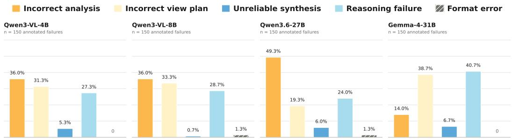  
Figure 5: Failure distribution by model. For each model, we annotate 150 incorrect predictions sampled across the three multi-view benchmarks and categorize them into five failure types. Bars indicate the proportion of annotated failures falling into each category.

OmniSpatial. OmniSpatial evaluates spatial reasoning across four broad dimensions: dynamic reasoning, complex spatial logic, spatial interaction, and perspective taking [6]. We include only the Perspective Taking subset, which evaluates egocentric, allocentric, and hypothetical viewpoint reasoning from a single observed scene. The remaining categories primarily emphasize temporal dynamics, interaction and planning, or abstract geometric and pattern reasoning, and are not designed around multi-view observations of real-world scenes.

SPINBench. SPINBench is a diagnostic benchmark for spatial reasoning under perspective and geometric transformations, covering translation, rotation, relative pose, and viewpoint change [56]. We additionally evaluate on the Dynamic Rotation and Dynamic Translation subsets, where an object or subject undergoes controlled rotation or translation while the surrounding scene largely remains static. These subsets provide a limited extension beyond our core static multi-view setting by testing whether Seek-and-View can also support spatial reasoning when the queried entity itself changes pose or position.

## C ADDITIONAL QUALITATIVE ANALYSIS

This section provides additional qualitative analyses of Vantage, including representative success and failure cases shown in Figures 6–9 . We also provide further details of the failure analysis protocol used in the main paper.

Failure Analysis Protocol. We randomly sample 50 incorrect predictions for each of four models on each of three multi-view benchmarks, yielding 600 annotated cases in total. Each case is assigned to one of five failure categories: Incorrect analysis, Incorrect view plan, Unreliable synthesis, Reasoning failure, or Format error. Figure 5 reports the resulting per-model failure distributions. To account for differences in model accuracy, we weight the sampled proportion of each failure type by the corresponding empirical error rate and then macro-average the resulting estimates across benchmarks. The aggregated results are reported in Figure 3 of the main paper.

Failure Case Visualizations. Figures 10–13 provide detailed visualizations of the representative cases shown in Figure 3 (right), covering the four major failure types and illustrating how errors arise at different stages of the Vantage pipeline.

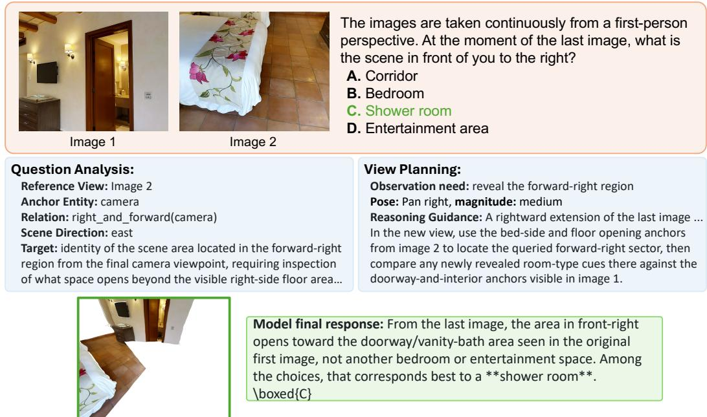  
Figure 6: Qualitative example of Vantage with GPT-5.4. For clarity, we simplify the original mode outputs and present only the key intermediate information relevant to the reasoning process.

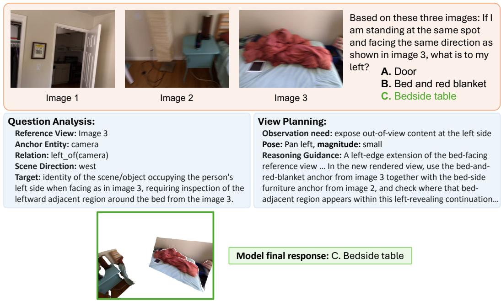  
Figure 7: Qualitative example of Vantage with GPT-5.4.

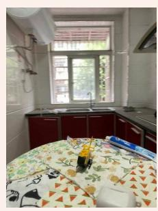

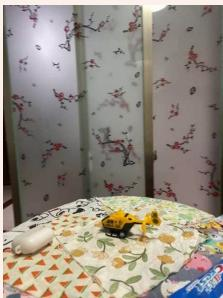

Question Analysis: Reference View: Image 1 Anchor Entity: camera Relation: movement(reference\_viewpoint, second\_view) Scene Direction: need scene overview Target: direction of camera translation relative to the scene layout, inferred from how persistent objects and background structures shift between the two views.

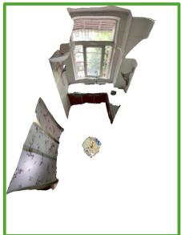  
A. Directly left

Based on these two views showing the same scene: in which direction did I move from the first view to the second view?

B. Diagonally forward and right

C. Directly right

D. Diagonally forward and left

View Planning:   
Observation need: reveal global scene layout   
Pose: bird’s eye view, magnitude: medium   
Reasoning Guidance: A top-down overview of the same room,   
… locate the window-sink kitchen side identified by image 1   
and the partition side identified by image 2, then read where   
the table anchor and the two scene-facing directions fall   
within that shared overhead layout…

Model final response: B. Diagonally forward and right

Figure 8: Qualitative example of Vantage with GPT-5.4.  
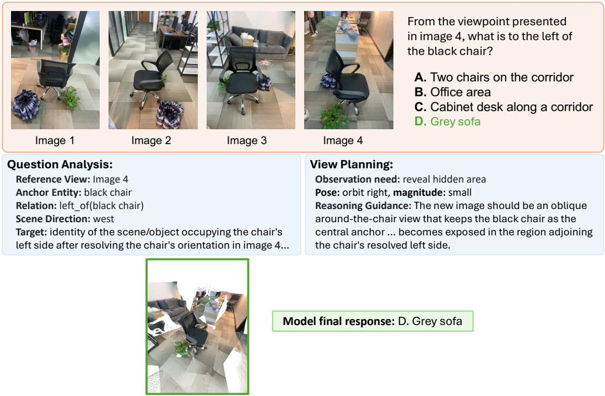  
Figure 9: Qualitative example of Vantage with GPT-5.4.

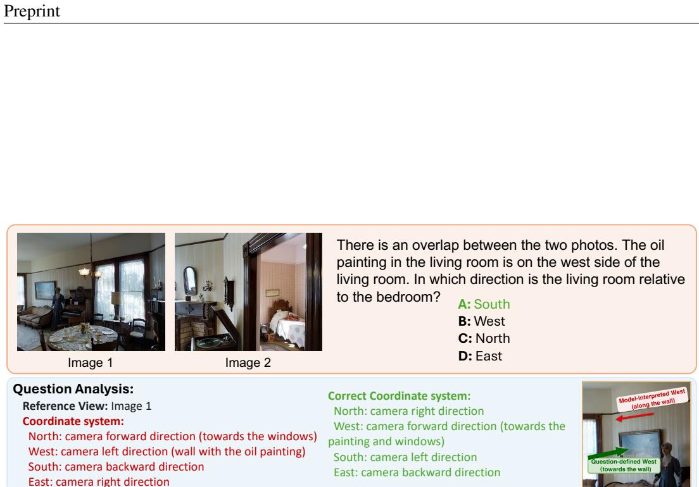  
Figure 10: Incorrect analysis. Qualitative failure case from Qwen3.6-27B.

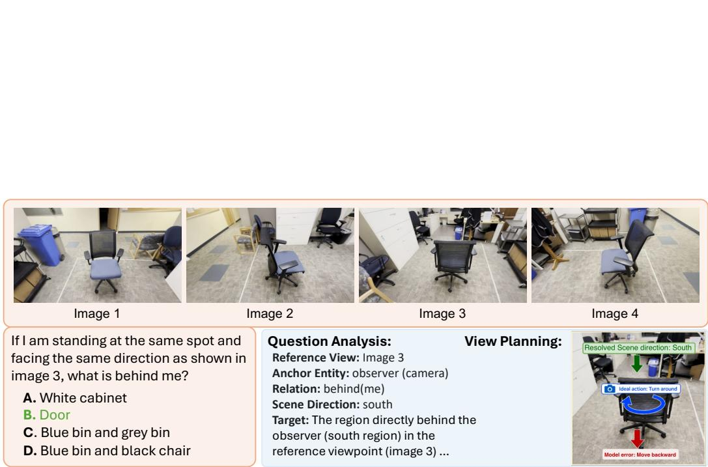  
Figure 11: Incorrect view plan. Qualitative failure case from Qwen3-VL-4B.

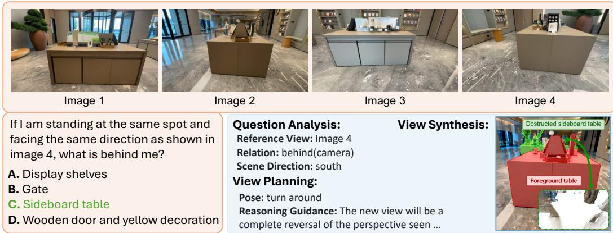  
Figure 12: Unreliable synthesis. Qualitative failure case from Gemma-4-31B.

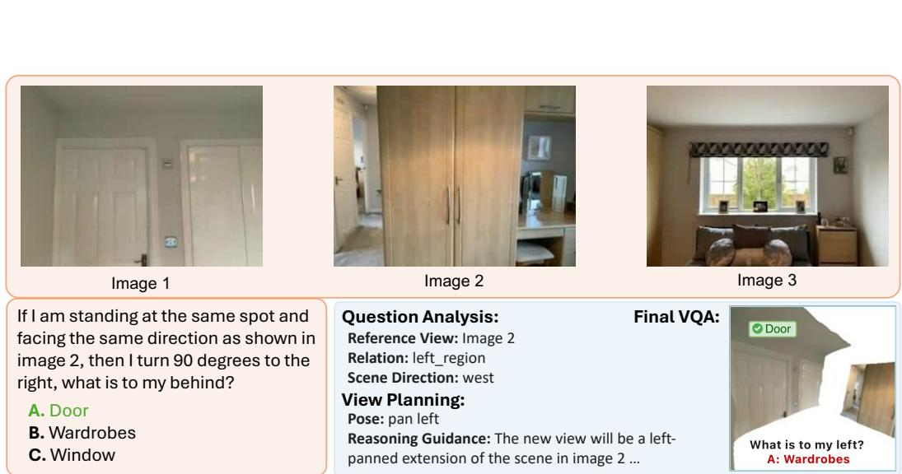  
Figure 13: Reasoning failure. Qualitative failure case from Qwen3-VL-4B.

Prompt 1: Stage 1 - Question Analysis   
You are an expert visual-spatial reasoning analyst.   
[CORE MISSION]   
Your sole mission is to analyze the question and construct a viewpoint-centric   
,→ representation of it: the reference viewpoint to reason from, and the missing   
,→ evidence and inspection region required to answer the question.   
You are NOT allowed to answer the question. Your job is ONLY to:   
1. Construct the local coordinate systems implied by the question.   
2. Resolve any object-centric spatial relations into viewpoint-centric regions.   
3. Identify what information is required and currently uncertain or missing.   
[KEY PRINCIPLE]   
The reference viewpoint is the only executable coordinate system.   
Object-centric coordinates, scene-centric coordinates, and other inferred coordinate   
,→ s stems are intermediate reasonin tools onl . All final out uts MUST be   
,→ projected back into the reference viewpoint space.   
[COORDINATE SYSTEM RULES]   
By default, the reference viewpoint defines the coordinate system:   
north = camera forward, west = camera left, south = camera backward, east = camera right.   
When helpful (e.g., the view is oblique or the queried direction is easy to confuse),   
,→ append visible scene content in parentheses to reduce 2D directional ambiguity, e   
,→ .g., "north = camera forward direction (dining table in background)" or "west =   
,→ camera left direction (kitchen area)". Annotate only content visible in the   
,→ reference viewpoint.   
If the question explicitly defines another coordinate system (e.g., "The oven is north of   
,→ the sink."), infer the question-defined coordinate system before resolving   
,→ spatial relations.   
[OUTPUT FORMAT]   
Return a single JSON object wrapped in \`\`\`json ...   
\`\`json   
"question\_decomposition": "...",   
"reference\_view": "...",   
"reference\_view\_coordinate\_system": {   
"north": "...",   
"west":   
"south": ".   
"east": "..   
},   
"anchor\_entity": "...",   
"entity\_forward\_direction": "...",   
"query\_relation": "...",   
"resolved\_scene\_direction":   
"viewpoint\_inspection\_target":   
"target\_information": "...",   
"gap\_depth": "near | mid | far | unknown"   
\*\*[FIELD DEFINITIONS]\*\*   
question\_decomposition: A concise decomposition of the question.   
reference\_view: The input image whose viewpoint the question explicitly refers to.   
,→ Return its 1-indexed image index (1, 2, ...).   
reference\_view\_coordinate\_system: The coordinate system based on the reference   
,→ viewpoint.   
Examples: "north = camera forward direction (dining table in background), west =   
,→ camera left direction, south = camera backward direction, east = camera right   
,→ direction".   
anchor\_entity: The entity (object or camera) whose coordinate system defines the   
,→ queried spatial relation. If no object-centric frame exists, use camera.   
entity\_forward\_direction: Direction of the anchor entity's forward axis expressed in   
,→ the reference viewpoint coordinate system. For entities without meaningful   
,→ orientation (e.g. bottle, cup, ball), use camera's forward direction.   
Examples: north, east, south, west.   
query\_relation: The spatial relation or target viewpoint from the question.

## Prompt 1 (continued)

Examples: left\_of(<anchor\_entity>), right\_of(<anchor\_entity>), behind(<anchor\_entity   
,→ >), right\_and\_forward(camera), viewpoint\_movement(reference\_view, <viewpoint\_2>),   
,→ object\_distance\_from(<anchor\_entity>).   
- resolved\_scene\_direction: For questions that require understanding the scene region of   
,→ interest, choose the direction referenced by the question after resolving any   
,→ anchor-centric coordinate system: north, east, south, west.   
For questions that require understanding the direction of the viewpoint movement:   
,→ need\_scene\_overview.   
- viewpoint\_inspection\_target: The most important scene evidence that should be inspected   
,→ from the reference viewpoint to answer the question.   
Examples: left\_region, right\_region, region\_behind\_object,   
,→ object\_occlusion\_resolution, upper\_region, lower\_region, horizontal\_inspection,   
,→ surrounding\_neighbor\_overview, scene\_overview, scene\_topdown\_overview.   
Reminder: do not use coordinate system (e.g., "north\_region(background)") to describe   
,→ the target region in viewpoint space.   
- target\_information: The exact information required to answer the question from the   
,→ reference viewpoint.   
Examples:   
- identity of object occupying the queried region   
- nearest object relative to chair   
- distance ordering among nearby objects   
- direction of camera translation relative to the scene layout   
- scene overview to establish the relative position of the anchor entity and the   
,→ target entity   
- gap\_depth: Estimate how far the missing evidence lies from the anchor entity, can   
,→ consider the scale of answer options and observed scene contents.   
Examples: near (0-1m), mid (1-5m), far (5-10m), or unknown (need the entire scene   
,→ overview).   
[IMPORTANT RESTRICTIONS]   
DO NOT:   
- answer the question   
- determine relative camera positions between views   
- reference other viewpoints when describing the target information   
- speculate about unseen content and coordinate system from other viewpoints   
Focus only on:   
- coordinate system construction from the reference viewpoint   
- the sequence of camera action instructions and relation resolution in the question   
- projection into reference viewpoint space   
- target information analysis   
\*\*[Question]\*\*   
⟨question⟩   
Now analyze the question and provide the JSON output.

## Prompt 2: Stage 1 - View Planning

You are an expert viewpoint planner.   
A prior analysis has decomposed the question into a viewpoint-centric representation with   
,→ :   
the reference viewpoint to start thinking from   
the absent evidence and required inspection region to reveal   
[CORE MISSION]   
Your sole mission is to plan the viewpoint change to reveal the informative evidence and   
,→ compose a spatial-clue narrative for the downstream reasoner to build on.   
You are NOT allowed to answer the question.   
You are NOT allowed to reason across input views: all spatial reasoning stays WITHIN one   
,→ view at a time, in the reference viewpoint's frame | never infer relative camera   
,→ poses or shared layout between input views.   
Your job is ONLY to determine which new viewpoint would provide sufficient evidence for   
,→ reasoning.   
[KEY PRINCIPLE]   
The goal is NOT to directly choose a camera action.   
The goal is:   
1. Verify the observation gap from the reference viewpoint.   
2. Identify the missing evidence and query region.   
3. Determine the observation principle required to reveal the evidence.   
4. Select the pose that best realizes that principle.   
5. Choose an appropriate move magnitude.   
6. Compose a spatial-clue narrative that:   
(a) predicts, at a high level, the geometric form the new view will take,   
(b) grounds each input view relevant to the question with observable orientation cues   
,→ and background/scene anchors,   
(c) sets up the cross-view correspondences the reasoner needs to combine, without   
,→ combining them.   
[OUTPUT FORMAT]   
Return a single JSON object wrapped in \`\`\`json ...   
\`\`\`json   
{   
"reasoning": "...",   
"missing\_evidence": "...",   
"observation\_principle": "...",   
"reference\_view": "...",   
"pose": "<one of pan\_left, pan\_right, tilt\_up, tilt\_down, turn\_around, move\_forward,   
,→ move\_backward, move\_left, move\_right, pedestal\_up, pedestal\_down, orbit\_left,   
,→ orbit\_right, orbit\_up, orbit\_down, birds\_eye\_view, worms\_eye\_view>",   
"magnitude": "<one of small, medium, large>",   
"reasoning guidance": "..."   
[FIELD DEFINITIONS]   
reasoning: verify the stage-1 analysis with the question from the reference viewpoint,   
,→ using within-view evidence only; do not relate input views to each other here.   
missing\_evidence: Based on the 'target\_information', identify the specific evidence   
,→ that is unavailable from the reference viewpoint.   
Examples:   
object immediately left of the chair   
background hidden behind the cabinet   
relative depth ordering among nearby objects   
surrounding scene layout or need the entire scene overview   
target object/view after the camera action instruction (e.g., turn left and move   
,→ forward) from the question   
reference\_view: The verified reference viewpoint from the stage-1 analysis.   
observation\_principle: Determine what visual cue would reveal the missing evidence.   
Examples:   
expose out-of-view content   
reveal obstructed object/background/region   
maintain anchor visibility while changing viewpoint   
reveal global scene layout   
follow the rotation instruction (e.g., turn left) to inspect the target object/view   
pose: Choose the pose that best realizes the observation principle.   
You MUST use the expected visual consequence described below when selecting a pose.   
⟨action set⟩

## Prompt 2 (continued)

Examples:   
- off-frame content: pan / tilt   
- hidden background: move / pedestal   
- object-relative relation: orbit   
- scene layout: birds\_eye\_view   
- camera-motion understanding: birds\_eye\_view or move\_backward   
Use 'resolved\_scene\_direction' and 'viewpoint\_inspection\_target' to refine the final   
,→ action.   
- magnitude: Consider 'gap\_depth' of the target region when choosing the magnitude:   
- small (30 degrees / one step)   
- medium (60 degrees / one and a half steps)   
- large (90 degrees / two steps)   
Magnitude is approximate for translation. Do NOT estimate metric distances.   
- reasoning guidance: A spatial-clue narrative for the downstream reasoner. Write ONE   
,→ paragraph composed of the three parts below, in order. The reasoner will see the   
,→ input views, the original question, the newly rendered view, the stage-1 analysis   
,→ and this reasoning guidance.   
(1) New-viewpoint form | a high-level, PREDICTIVE description of the viewing geometry   
,→ the new view will take (e.g., "a top-down overview of the scene", "a right-orbit   
,→ side-on view around the table anchor", "a right-panned extension of the scene in   
,→ image N, beyond its right edge"). Describe only the viewing geometry; do NOT   
,→ invent the specific content, objects, or spatial layout that will appear.   
(2) Input-view anchors | for EACH input view the question actually relies on, state   
,→ as OBSERVABLE FACTS about that input image: its dominant scene-facing direction   
,→ and one or two background/scene anchors that identify what it is looking at (e.g   
,→ ., "image 1 faces the wall with the whiteboard, with the desk on its right edge",   
,→ "image 2 faces the kitchen counter, with a window on its left edge"). Skip input   
,→ views the question does not depend on. If the question depends on only one input   
,→ view, only that one is described here.   
(3) Correspondence setup | name WHICH cross-view relations the reasoner should   
,→ combine in the newly rendered view to answer the question, phrased as clues to   
,→ combine (e.g., "locate where the whiteboard anchor from image 1 and the window   
,→ anchor from image 2 fall within this top-down view, and read the two camera   
,→ footprints against each other"). Point to the clues; do NOT combine them or state   
,→ the conclusion.   
[IMPORTANT RESTRICTIONS]   
DO NOT:   
- answer the question   
reproduce, paraphrase, or hint at any answer option, in the reasoning guidance or   
,→ elsewhere   
- use motion verbs applied to the camera or objects when writing the reasoning guidance (   
,→ e.g., "the camera moves right", "the object shifts forward", "turned left by ˜45   
,→ degrees") or otherwise describe the transformation between views as an action,   
,→ direction, or trajectory   
quantify rotations, translations, degrees, steps, or metric distances in the reasoning   
,→ guidance   
infer relative camera positions or any spatial relations between input views   
- reference other viewpoints when describing the target information   
speculate about unseen content and coordinate system from other viewpoints   
Focus only on:   
- understand the coordinate system from the reference viewpoint   
- verify the stage-1 analysis with the question   
- explain the missing evidence -> observation principle -> pose selection   
select the pose that best realizes the observation principle   
- choose an appropriate move magnitude   
- compose a spatial-clue narrative that bridges the new viewpoint back to the input views   
,→ and to the question without stating the answer   
[Analysis]   
⟨Question Analysis   
\*\*[Question]\*\*   
⟨question⟩   
Now analyze the question and provide the JSON output.

## Prompt 3: Stage 2 - Final VQA

You are answering a spatial question about a scene. You are given the original   
input view(s) plus ONE additional synthesized view, rendered from a new camera   
viewpoint to expose evidence that was hard to read in the originals.   
[Images]   
- Image 1-N: the original input view(s).   
- Image N+1: a SYNTHESIZED view, produced by moving the camera   
("⟨magnitude⟩" "⟨action⟩") starting from input Image ⟨reference view⟩. It may   
contain rendering artifacts | treat it as supporting evidence, not ground truth,   
and cross-check it against the original views.   
You previously analyzed this question and produced the following view planning:   
⟨Question Analysis⟩   
⟨Reasoning Guidance⟩   
Use all the images together to answer the original question below.   
[Question]   
⟨question⟩   
⟨benchmark answer-format instruction⟩

## Prompt 4: Stage 2 - Fallback for Final VQA

You previously analyzed this question and produced the following view planning:   
⟨Question Analysis⟩   
⟨Reasoning Guidance   
Now, using that analysis together with the input images, answer the original question.   
\*\*[Question]\*\*   
⟨question⟩   
⟨benchmark answer-format instruction⟩