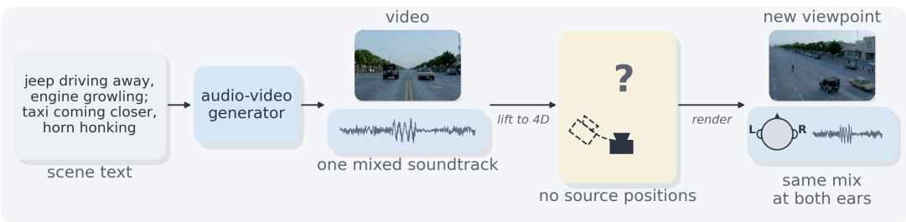
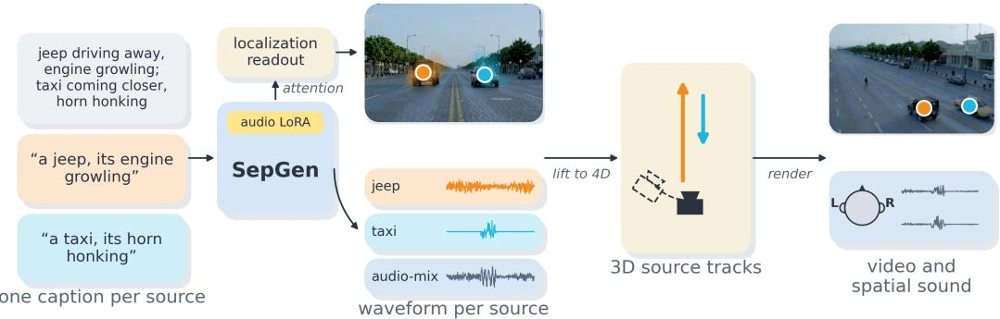
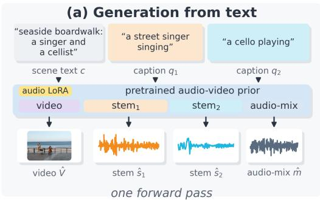
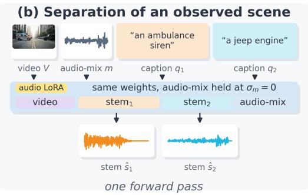
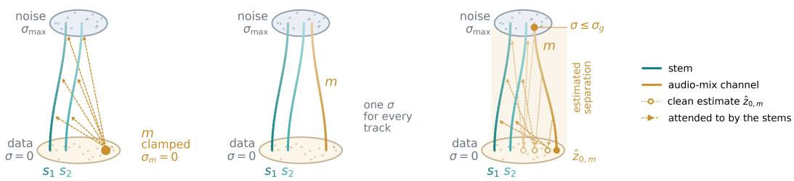
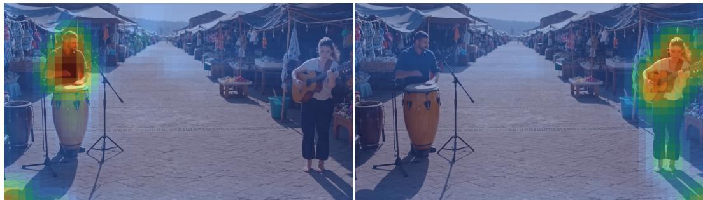
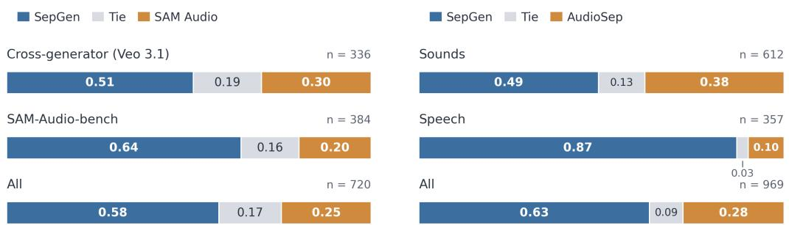
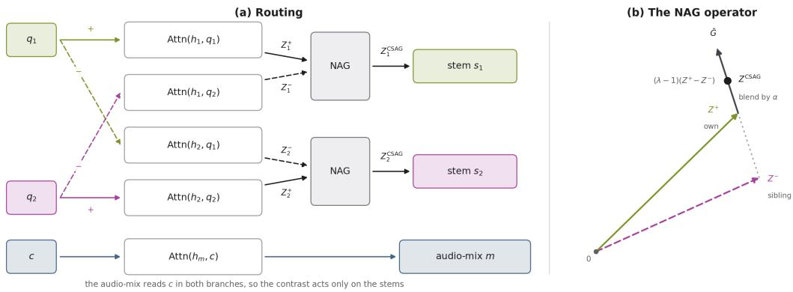
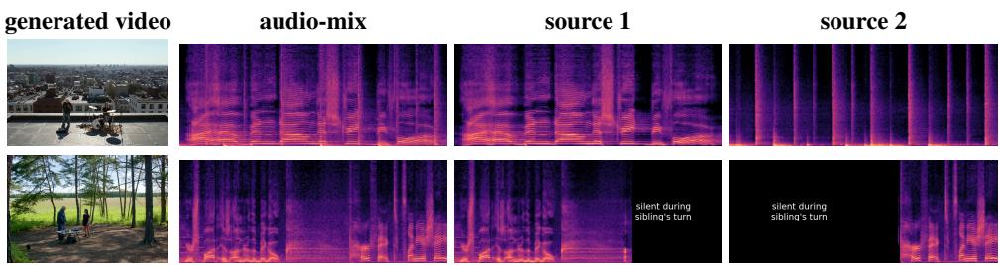
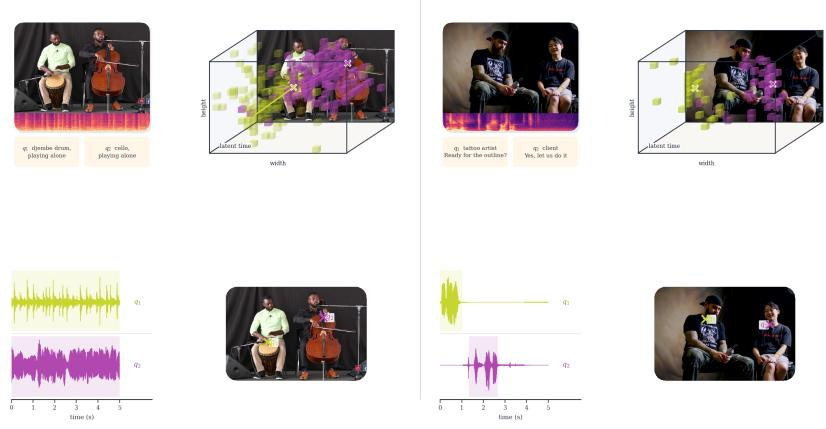

# SEPGEN: MULTI-STEM AUDIO-VIDEOSEPARATION AND GENERATION IN A SINGLE MODEL

Aviad Dahan1 Rajaei Khatib1 Yonatan Bitton2 Idan Szpektor2 Lior Wolf1 Raja Giryes1 1Tel Aviv University 2Google

## ABSTRACT

A 4D audio-visual scene comprises a video, the dynamic geometry it depicts, and the sound sources that populate it, each with its own position and trajectory. Rendering such a scene from a novel viewpoint requires that every source be available as an individual waveform, so that it can be localized in the scene and propagated to the observer before the signals are mixed. Joint audio-video generators can synthesize the video and its soundtrack, but the soundtrack is emitted as a single audio-mix in which the sources are not individually accessible. We present SepGen, which extends a pretrained audio-video generator to emit the video, the mixed soundtrack, and one waveform per captioned source in one joint sampling run. SepGen supports two complementary modes: generation and separation. In generation mode, each source caption specifies what its stem contains. A two-speaker dialogue, for example, comes out as one stem per speaker in the original turn order. In separation mode, the input audio-mix remains clean while the captions specify what to extract, so the model can decompose a recording from a free-text description. We evaluate generation on scenes synthesized from text, and separation on scenes rendered by other generators and on real recordings of speech, music, and sound effects. Given an audio-mix and captions that carry the spoken lines, SepGen outperforms language-conditioned separators, most clearly on speech, and it keeps the lead when the lines are removed from the captions. Code, checkpoints, and datasets are available at https://sepgen.github.io/.

## 1 INTRODUCTION

Recent joint audio-video generators (HaCohen et al., 2026; Low et al., 2025) synthesize video with synchronized sound, but output the entire scene as one waveform, the audio-mix, whose sources cannot be moved, removed, or rerendered individually. Language-queried separation (Liu et al., 2025; Yuan et al., 2025; Shi et al., 2025) can estimate a described source afterward, but requires an additional model run and handles each caption in isolation, which fails when two sources belong to the same category: asked separately for each of two men speaking, it might return the same speaker.

Per-source waveforms matter most when the scene itself is rerendered. Monocular video methods lift a video to a 4D scene that can be viewed from a new camera pose (Karhade et al., 2026; Litman et al., 2026; Zhang et al., 2025), and spatial audio renderers propagate each source to the observer (Chen et al., 2020a; Xie et al., 2026; Jin et al., 2026; Liang et al., 2023). An audio-mix recorded at the original pose, however, exposes no source to place, so the sound stays fixed (Figure 1a).

We present SepGen, an audio-video generator that also outputs each source: from a scene caption and one caption per source, it produces the video, the audio-mix, and one waveform per source, a stem, in a single sampling run (Figure 2). Predicting both stems jointly from the shared audio-mix lets each follow its own caption while sharing the scene’s timing, and yields the per-source waveforms that a spatial renderer requires (Figure 1b).

Adding stems to a pretrained backbone must not disturb what the backbone already produces. SepGen therefore appends the two stems to the backbone’s audio sequence as additional channels, trained through a low-rank audio adapter, and keeps the audio-mix as a protected channel that attends only to itself and bypasses the adapter, so the backbone’s soundtrack and video are unchanged while the stems attend to the audio-mix and to each other at aligned rotary positions. The stems must also stay apart from each other: block-diagonal caption routing gives each stem only its own caption, and

(a) Joint audio-video generation emits a single soundtrack with no addressable sources  

(b) SepGen emits per-source waveforms that can be localized, lifted to 4D, and rerendered per-stem localization  
  
Figure 1: SepGen overview and motivation. (a) Joint audio-video generation emits one soundtrack with no addressable source: the video is lifted to 4D and rerendered from a new viewpoint, but both ears hear the same mix. (b) SepGen emits one waveform per captioned source, each placed at its source in the lifted scene and rendered as spatial sound from the new viewpoint (illustration). A demonstration video is available on the project page.

Cross-Stem Attention Guidance steers it away from its sibling’s. The same model can either generate a scene together with its stems, or separate the stems from an observed scene. Since the backbone is a denoising model, the noise level of the audio-mix selects between the two: separation holds the observed audio-mix at zero noise, whereas generation denoises it together with the stems, which then attend to its current denoised estimate (Estimated Separation). We therefore train on separation first and briefly continue on noisy audio-mixes, yielding one checkpoint that does both.

Our contributions are: (i) SepGen, to our knowledge the first framework that turns a pretrained joint audio-video generator into a multi-stem generator, emitting the video, its soundtrack, and one waveform per captioned source in a single sampling run. (ii) Mechanisms that keep the stems captionfaithful and the pretrained output intact: a protected audio-mix channel that bypasses the adapter, aligned rotary positions, block-diagonal caption routing, and a schedule in which the stems attend to the estimated clean audio-mix. (iii) A single set of weights for both modes, selected by the audio-mix noise level: a separation-trained checkpoint already generates stems, and a brief continuation reduces leakage between the generated stems, improves speech intelligibility, and stabilizes results across seeds, while preserving separation. We evaluate both modes on generated, cross-generator, and real scenes, with automatic metrics and a human A/B study.

## 2 RELATED WORK

Joint audio-video generation. Joint audio-video generators synthesize a video and its synchronized soundtrack from text, either by coupling two modality streams, as in LTX-2 (HaCohen et al., 2026), our backbone’s family, and Ovi (Low et al., 2025), or by bridging separately pretrained generators (Xing et al., 2024). Proprietary systems such as Veo 3.1 Lite (Google DeepMind, 2026), which renders our Veo benchmark, also generate video and audio jointly. Video-to-audio (V2A) models add a soundtrack to an existing video (Polyak et al., 2024; Cheng et al., 2025a; Wang et al., 2025b; Shan et al., 2025; Viertola et al., 2025; Tao et al., 2026). All of them output one audio-mix per scene, whereas SepGen outputs a separate waveform for each source, in both of its modes. Like prior LoRA adaptations of such generators (Hu et al., 2021; Huang et al., 2024b; Dahan et al., 2026), SepGen adapts its backbone, but its extra audio tracks are captioned stems that neither the video nor the audio-mix attends to, and the audio-mix bypasses the LoRA (Section 3.1). Its Cross-Stem Attention Guidance (Section 3.2) adapts Normalized Attention Guidance (Chen et al., 2025), with the sibling caption as the negative prompt.

  
Figure 2: SepGen: a unified representation for multi-stem generation and separation. (a) Generation: scene text and two source captions yield the video, audio-mix, and per-source waveforms. (b) Separation: from an observed video and audio-mix, the same model extracts both captioned stems.

Multi-source audio generation. Multi-source models emit several stems at once. In music, MSDM (Mariani et al., 2023) and its latent and text-conditioned extensions (Karchkhadze et al., 2025; Postolache et al., 2024) generate and separate stems, and other models generate, add, or text-specify stems (Xu et al., 2024; Yao et al., 2025; Rouard et al., 2025; Parker et al., 2024; Wu et al., 2026). Closest to ours, MGE-LDM (Chae & Lee, 2025) switches between generation and extraction by choosing which tracks to denoise, like our two modes, but is audio-only and extracts one source per run. Given a video, other models generate one clip per detected source, speech and background tracks, one track per event, or only a text-selected source (Dagli et al., 2025; Tian et al., 2025; Hayakawa et al., 2026; Lee et al., 2026), or fuse detected sources into one audio-mix (Guo et al., 2026). To our knowledge, no method generates a video with several captioned stems in one denoising run.

Language-queried source separation. Query-conditioned separation extracts from an audio-mix only the source specified by a query, such as text, a visual region, or an audio example. Languagequeried audio source separation (LASS) uses free-form text (Liu et al., 2022; Dong et al., 2022). Our cascade baselines (Section 4.1) are three released LASS models. AudioSep (Liu et al., 2025) conditions a separation network on CLAP text embeddings (Wu et al., 2023), FlowSep (Yuan et al., 2025) is a rectified-flow generative separator, and SAM Audio (Shi et al., 2025) is a flow-matching transformer that also accepts visual-mask and time-span prompts. We do not compare with the recent FlowSep 2 (Yuan et al., 2026), whose models were unreleased at the time of writing. Other separators vary the query encoder or network (Ma et al., 2024; Wang et al., 2025a), parse sources with a large language model (Mahmud & Marculescu, 2024), combine text, image, and audio queries (Cheng et al., 2025b), extract several sources in one pass but only from fixed categories (Saijo et al., 2025; Paissan et al., 2025), or reuse pretrained text-to-audio diffusion models without separation training (Huang et al., 2025; Lee et al., 2025).

Audio-visual and generative separation. Targets can also be specified by sounding objects or musicians’ motion (Zhao et al., 2018; Gao & Grauman, 2019; Gan et al., 2020), speakers’ faces (Ephrat et al., 2018; Gao & Grauman, 2021), or a typed speaker description (Hao et al., 2025). Generative separators exist for speech (Scheibler et al., 2023), audio-visual mixes (Huang et al., 2024a), and film audio with fixed speech, music, and effects stems (Zhang et al., 2026). MMAudioSep (Takahashi et al., 2026) turns a video-to-audio model into a separator that can still generate, but extracts one source per pass. Since query-based separators process each query independently, queries for two speakers can both return the louder voice (Section 1); SepGen instead predicts both stems jointly from the shared audio-mix.

## 3 METHOD

SepGen extends a joint audio-video generator so that, in addition to the video and its soundtrack, it outputs one waveform per sound source. This enables a 4D audio-visual scene renderer to place each source in space over time (Figure 1). In addition to generation, SepGen can act as a source separator given an existing video. In generation, the model synthesizes the video, the audio-mix, and the stems from a conditioning text. In separation, the video and audio-mix are inputs and SepGen extracts the captioned stems. Section 3.1 describes the two-stage training and Section 3.2 the inference.

Problem Formulation. Let $F$ denote a flow matching diffusion audio-video generator with two transformer streams, one for the video tokens and one for the audio tokens, e.g. LTX-2.5 (HaCohen et al., 2026). In every block, each stream self-attends over its own tokens and cross-attends to the conditioning scene caption c. Additionally, the two streams exchange information through bidirectional audio-video cross-attention. Denoising both latents jointly and decoding them yields a video V and its audio-mix $m , ( V , m ) = F ( c )$ . For brevity, V denotes both the video and its latent.

SepGen is formulated for scenes with N sound sources, described by per-source captions $Q =$ $( q _ { 1 } , \dots , q _ { N } ) ;$ we train and evaluate N=2. Our model $F _ { \theta }$ keeps both streams of $F$ and represents each source as additional tokens in the audio stream. The audio VAE encoder maps each stem and the audio-mix to latents $z _ { s _ { 1 } } , z _ { s _ { 2 } } ,$ , and $z _ { m } ,$ , each with the temporal length of the pretrained audio latent, and its decoder maps each latent back to a waveform. The audio stream receives the three latents as one token sequence, $z _ { a } = [ z _ { s _ { 1 } } \mid z _ { s _ { 2 } } \mid z _ { m } ]$ , concatenated along the token axis. Each channel keeps the temporal positions of the pretrained audio latent, so the $j \mathrm { - t h }$ token of every channel refers to the same time instant in the audio stream. Each stem channel attends to itself, the other stems, the audio-mix, the video, and only to its own caption $q _ { i }$ . The audio-mix channel attends to c as in $F .$ . Neither the audio-mix nor the video attend to the stems, so information flows only from the scene to the stems. $\mathrm { A }$ low-rank adapter (LoRA) (Hu et al., 2021) with parameters $\theta$ updates the projections of the audio stream on the stem tokens only, while the weights of $F$ stay frozen. Each forward pass of $F _ { \theta }$ predicts the velocities of the video and of all three audio channels, and the sampling schedule of each mode determines which of these predictions are used. Section 3.1 details this layout. SepGen, $F _ { \theta } { } _ { : }$ , is a single model that supports two modes:

$$
( \hat { V } , \hat { m } , \hat { s } _ { 1 } , \hat { s } _ { 2 } ) = F _ { \theta } ( c , Q ) ,
$$

$$
\mathrm { S e p a r a t i o n : } \ ( { \hat { s } } _ { 1 } , { \hat { s } } _ { 2 } ) = F _ { \theta } ( c , Q , V , m ) .\tag{1}
$$

In generation (Figure 2a), $F _ { \theta }$ samples the video, the audio-mix, and one stem per source from the captions alone. In separation (Figure 2b), $F _ { \theta }$ receives an observed video $V$ and audio-mix m and returns only the stems. The two modes differ in how $F _ { \theta }$ treats $z _ { V }$ and $z _ { m } \colon$ separation keeps them clean through sampling, and generation denoises them together with $\left[ z _ { s _ { 1 } } \right. \left[ z _ { s _ { 2 } } \right]$

## 3.1 Two-Stage Training.

Training data. Each training example consists of a video, its audio-mix, the waveform of each of its two sources, a scene caption, and a caption per source. We assemble 4,843 such examples from four origins: CelebV-HQ (Zhu et al., 2022), URMP (Li et al., 2019), two-source scenes that we generate, and synthetic audio-mixes that combine clips from different VGGSound (Chen et al., 2020b) videos and MUSIC-21 (Zhao et al., 2019) solo performances. The two sources of an example may sound at the same time or alternate, as in a dialogue where the speakers take turns. Each example has up to three sets of captions at different verbosity levels, and each training step draws one set at random. Appendix A describes this process in detail.

Objective. We train LoRA parameters $\theta ,$ with the flow-matching objective of F. For a clean latent z and a noise level $\sigma \in [ 0 , 1 ]$ , the noisy latent and its target velocity are

$$
z ^ { \sigma } = ( 1 - \sigma ) z + \sigma \varepsilon , \qquad u = \varepsilon - z , \qquad \varepsilon \sim \mathcal { N } ( 0 , I ) .\tag{2}
$$

The two stem latents are noised to a common level $\sigma _ { s }$ and the audio-mix latent is noised to a level $\sigma _ { m }$ $\leq \sigma _ { s }$ . The distribution of $\sigma _ { m }$ is the only difference between the two stages. Thus, the input to $F _ { \theta }$ is

$$
\begin{array} { r } { \mathcal { T } ( \sigma _ { s } , \sigma _ { m } ) = \big ( [ z _ { s _ { 1 } } ^ { \sigma _ { s } } \mid z _ { s _ { 2 } } ^ { \sigma _ { s } } \mid z _ { m } ^ { \sigma _ { m } } ] , V , c , Q \big ) . } \end{array}\tag{3}
$$

It provides $F _ { \theta }$ with the source timestep $\sigma _ { s }$ and the audio-mix timestep $\sigma _ { m }$ . Let $v _ { \theta , i }$ denote the velocity that $F _ { \theta }$ predicts on the tokens of stem $s _ { i } .$ , and ${ { u } _ { s } } _ { i }$ the target velocity of Eq. (2) for $z _ { s _ { i } }$ . The loss is

$$
\mathcal { L } = \sum _ { i = 1 } ^ { 2 } \mathbb { E } \Big [ \big \| v _ { \theta , i } \big ( \mathcal { T } ( \sigma _ { s } , \sigma _ { m } ) \big ) - u _ { s _ { i } } \big \| _ { 2 } ^ { 2 } \Big ] ,\tag{4}
$$

where the expectation is over training examples. Only the stem tokens receive the loss. The predictions on the video and audio-mix tokens are not supervised, and these tokens serve as inputs that tell the stems what the scene contains.

Stage 1: separation. The first stage trains $F _ { \theta }$ for the separation mode of Eq. (1): given an observed video, its audio-mix, and the two source captions, predict the two stems. The LoRA update starts at zero, so training begins from the behavior of F. We set $\sigma _ { m } { = } 0$ for every example, so the audio-mix is always clean and the stems learn to decompose it into the sources described by $q _ { 1 }$ and $q _ { 2 } .$ . This stage trains only the separation task, yet the resulting checkpoint can already generate stems by attending to the estimated clean audio-mix at every step (Appendix Table S7); Stage 2 improves this ability.

Stage 2: generation. In the generation mode of $\operatorname { E q . }$ (1), no clean audio-mix is available: the audiomix is denoised together with the stems, so the stems must attend to an audio-mix that is still noisy. In both modes, the stems solve the same task, decomposing the audio-mix they attend to into the captioned sources. The modes differ only in whether that audio-mix is clean or still being denoised. The second stage therefore initializes θ from the separation checkpoint and continues training with the same data and loss, changing only how $\sigma _ { m }$ is drawn. Concretely, we first sample an auxiliary audio-mix noise level $\sigma _ { m } ^ { \prime }$ (independently of $\sigma _ { s } )$ and then define $\sigma _ { m }$ as

$$
\sigma _ { s } , \sigma _ { m } ^ { \prime \mathrm { \normalsize ~ i n d } } p ( \sigma ) , \qquad b \sim \mathrm { B e r n o u l l i } ( 0 . 3 ) , \qquad \sigma _ { m } = ( 1 - b ) \operatorname* { m i n } ( \sigma _ { m } ^ { \prime } , \sigma _ { s } ) .\tag{5}
$$

With probability $0 . 3 \ : ( b { = } 1 )$ , the audio-mix stays clean as in Stage 1, which preserves the separation mode. Otherwise $( b { = } 0 )$ , the audio-mix is noised to level $\sigma _ { m } = \operatorname* { m i n } ( \sigma _ { m } ^ { \prime } , \sigma _ { s } )$ , i.e., capped at $\sigma _ { s } .$ Since $\sigma _ { m } ^ { \prime } \geq \sigma _ { s }$ in half of the draws, half of these samples place the audio-mix at exactly the stem level. The cap keeps the audio-mix no noisier than the stems, which covers the two conditions that occur during generation: an audio-mix at the same noise level as the stems, and a clean estimate of the audio-mix (Section 3.2). This stage yields the generation checkpoint, which performs both separation and generation. Compared with the separation checkpoint used as a generator, the continuation raises J-swap from 1.95 to 2.07, lowers own-line word error from 0.10 to 0.07, and reduces the seed spread of J-swap from 0.13 to 0.01 (Appendix Table S7).

Stem Layout and Routing. In order not to degrade the base model’s capabilities, we let each stem attend to the audio-mix, but block any information flow back into the mix. We concatenate the audio tokens as $z _ { a } = [ z _ { s _ { 1 } } \mid z _ { s _ { 2 } } \mid z _ { m } ]$ , keeping each channel’s pretrained temporal shape. We enforce this routing with the attention mask

$$
\Lambda = { \left[ \begin{array} { l l l } { 1 } & { 1 } & { 1 } \\ { 1 } & { 1 } & { 1 } \\ { 0 } & { 0 } & { 1 } \end{array} \right] } \ ,\tag{6}
$$

(rows are queries, columns are keys, ordered as $( s _ { 1 } , s _ { 2 } , m ) )$ . Thus stems can attend to stems and the mix, while the mix attends only to itself.

Attention alone is not enough: LoRA would still change mix-token projections. We therefore gate the audio-side LoRA update off for mix tokens (indices $\mathcal { I } _ { m } )$

$$
h _ { j } ^ { \prime } = W _ { 0 } h _ { j } + g _ { j } B A ( h _ { j } ) , \qquad g _ { j } = \mathbf { 1 } [ j \notin \mathcal { I } _ { m } ] .\tag{7}
$$

Mix tokens use the frozen projection $W _ { 0 } \ ( g _ { j } = 0 )$ , stem tokens use the adapted one $( g _ { j } = 1 )$ . For caption routing, block-diagonal cross-attention lets $s _ { i }$ attend only to $q _ { i }$ and $z _ { m }$ only to c. We use the same rotary positions so the j-th token of every channel aligns in time. Overall, neither attention nor adapted weights can carry information from stems into the mix, only stem tokens are updated.

## 3.2 Inference Schedules.

At each sampling step k, with the noise level $\sigma _ { k }$ decreasing from 1 to 0, $F _ { \theta }$ predicts a velocity for every latent. The audio stream predicts the stem velocities $\hat { v } _ { s _ { i } }$ and the audio-mix velocity $\hat { v } _ { m }$ , and the video stream predicts the video velocity vˆ . A latent being denoised is updated by a solver step:

$$
z ^ { \sigma _ { k + 1 } } = z ^ { \sigma _ { k } } + \left( \sigma _ { k + 1 } - \sigma _ { k } \right) \hat { v } .\tag{8}
$$

The two modes differ in which latents are updated (Figure 3).

Separation. Only the stems are denoised, starting from noise. At every step, $F _ { \theta }$ receives the input $\mathcal { T } ( \sigma _ { s } , 0 )$ of Eq. (3) with $\sigma _ { s } = \sigma _ { k } .$ : the audio-mix is the observed clean $z _ { m }$ . The stems are updated with Eq. (8) as illustrated in Figure 3 (a).

Generation. During generation, all latents are being denoised together, video and audio-mix are updated with their own predicted velocities. If the stems attend to the noisy audio-mix throughout sampling, they may produce content that the final audio-mix does not contain. Instead, they can

  
Figure 3: Inference schedules in σ-space. Left to right: (a) Separation keeps the audio-mix m clean. (b) Shared-noise generation, the naive approach, denoises the stems and the audio-mix at one shared noise level. (c) SepGen’s stems attend to noisy m above $\sigma _ { g } ,$ , then its clean estimate $\hat { z } _ { 0 , m }$ below it.

attend to the estimated audio-mix that the current step predicts, which follows from Eq. (2) as $\hat { z } _ { 0 , m } = z _ { m } ^ { \sigma _ { k } } - \sigma _ { k } \hat { v } _ { m }$ . This estimate is unreliable at high noise levels, so we switch between the two at a threshold $\sigma _ { g } .$

$$
z _ { m } ^ { \mathrm { r e a d } } ( \sigma _ { k } ) = \left\{ \begin{array} { l l } { z _ { m } ^ { \sigma _ { k } } , } & { \sigma _ { k } > \sigma _ { g } , } \\ { \hat { z } _ { 0 , m } , } & { \sigma _ { k } \le \sigma _ { g } , } \end{array} \right.\tag{9}
$$

with $\sigma _ { g } { = } 0 . 9 7$ , so in the first denoising steps the stems attend to the noisy audio-mix. We call this scheme Estimated Separation (Figure 3c). Stage 2 training covers both regimes: its samples with $\sigma _ { m } { = } \sigma _ { s }$ match the noisy steps, and its clean samples match Estimated Separation. Appendix Table S7 compares this schedule with alternatives.

Guidance. In both operation modes, the stems use our introduced Cross-Stem Attention Guidance (CSAG), which applies Normalized Attention Guidance (Chen et al., 2025) inside each stem’s caption cross-attention with the sibling caption as the negative branch, at scale λ=2 (Appendix A).

## 4 EXPERIMENTS

We evaluate both modes of SepGen against cascade baselines that apply a language-queried separator to the same audio-mix. We address two questions: does the generation mode produce stems that adhere to their captions without cross-stem leakage (Section 4.2), and does the same model separate real and externally generated scenes while retaining this ability after generation training (Section 4.3)? We then report a user study (Section 4.4) and ablations (Section 4.5).

## 4.1 SETUP

Benchmarks and baselines. Generation. For the generation task, we curate 194 two-source scene prompts (134 sound scenes and 60 two-speaker dialogues) using Claude for a draft and manually approving each prompt. For each prompt, the generation checkpoint generates the video, the audiomix, and one stem per source caption; each baseline then receives this generated audio-mix and separates the same two captions from it. Separation. For separation, we curate two benchmarks of rendered scenes: 149 scenes rendered by Veo 3.1 Lite and 64 scenes rendered by LTX-2.3. We further evaluate on 172 real recordings from SAM-Audio-bench, each with a single queried source. In this benchmark, SepGen receives the queried source as $q _ { 1 }$ and a fixed caption describing the residual background as $q _ { 2 } ,$ , the swap margins score the target stem against the list of the other sound events annotated in the clip, and the speech recordings, which have no transcripts, are scored with Judge and CLAP. In every case, the input is an existing video with its audio-mix, and every method, including both checkpoints of SepGen, extracts the captioned sources from it. We compare with FlowSep (Yuan et al., 2025), AudioSep (Liu et al., 2025), and the two released SAM Audio checkpoints (Shi et al., 2025), SAM large and SAM large-tv. On the Veo benchmark, we also prompt SAM large-tv with SAM3 (Carion et al., 2026) video masks of each source instead of text (SA×SAM3).

Metrics. On sounds, we use the SAM Audio Judge (Shi et al., 2025), which rates a stem from 1 to 5 given its description and the input audio-mix, and the CLAP similarity (Wu et al., 2023; Xiao et al., 2024) between a stem and its description. Since CLAP scores a copied audio-mix close to a separated stem (Appendix Table S4), we also report swap margins (J-swap, C-swap), the score against the stem’s description minus that against the sibling’s, on which a copy scores zero. On speech, we use

Table 1: Generation benchmark. Comparison of SepGen with cascade baselines, each of which separates the same generated audio-mix given the same captions (sounds n=134, speech n=60). Both SepGen rows use the generation checkpoint.
<table><tr><td rowspan="2">Method</td><td colspan="4">Sounds (n=134)</td><td colspan="2">Speech (n=60)</td></tr><tr><td>Judge ↑</td><td>J-swap ↑</td><td>CLAP↑</td><td>C-swap ↑</td><td>WER↓</td><td>Cosine↓</td></tr><tr><td>FlowSep</td><td>3.35</td><td>1.26</td><td>0.14</td><td>0.10</td><td>1.03</td><td>0.97</td></tr><tr><td>AudioSep</td><td>3.23</td><td>1.27</td><td>0.14</td><td>0.11</td><td>0.91</td><td>0.87</td></tr><tr><td>SAM large-tv</td><td>2.96</td><td>0.41</td><td>0.05</td><td>0.03</td><td>0.87</td><td>0.95</td></tr><tr><td>SAM large</td><td>2.93</td><td>0.42</td><td>0.04</td><td>0.03</td><td>0.81</td><td>0.95</td></tr><tr><td>Ours (joint run)</td><td>3.82</td><td>2.07</td><td>0.15</td><td>0.18</td><td>0.07</td><td>0.66</td></tr><tr><td>Ours (self-separation)</td><td>4.21</td><td>2.29</td><td>0.16</td><td>0.20</td><td>0.10</td><td>0.67</td></tr></table>

  
Figure 4: Stem-to-video attention in a generated frame. Each stem attends to the source named in its caption: bongo drum (left) and acoustic guitar (right); warmer is higher.

Whisper (Radford et al., 2023) word error rate against the speaker’s quoted line (own-line WER) and the cosine between the two stems’ WavLM speaker embeddings (Chen et al., 2022). Since no benchmark provides reference stems, all metrics compare each stem with its caption. On 129 held-out scenes that do have reference stems, SepGen outperforms every baseline in envelope correlation and log-spectral distance (Appendix F). Definitions and controls are in Appendix C. In all tables, the best value is in bold and the second underlined.

Implementation details. We train LoRA adapters (327M parameters) on the audio stream of the frozen LTX-2.5 22B backbone: the separation checkpoint for 12,000 updates and the generation checkpoint for 3,000 more, on a single NVIDIA A6000. Results are averaged over three seeds, or five on SAM-Audio-bench (Appendices A and C).

## 4.2 GENERATION RESULTS

Table 1 reports SepGen in two configurations: the stems of the generation run itself (joint run), and a second run of the same weights in separation mode over the generated video and audio-mix, with the same captions (self-separation). The joint-run stems lead every cascade baseline on every metric, significantly except for CLAP against FlowSep and against AudioSep, whose query encoder is the scorer’s CLAP checkpoint (Holm-corrected paired tests, Appendix Table S4). The widest lead is in J-swap: the two stems are generated jointly and each is bound to its caption, whereas a cascade answers each query in isolation and can return the same source twice. Self-separation raises every sounds column at the cost of a second sampling run, while the joint-run stems keep a lower own-line word error, within seed variation. The summed stems also match the audio-mix more closely than those of any cascade (Appendix Table S14). In the generated scene of Figure 4, the video attention of each stem concentrates on the source named in its caption. Per-category results are in Appendix Table S5 and qualitative examples in Appendix Figure S2.

## 4.3 SEPARATION RESULTS

Tables 2 and 3 report separation on the Veo benchmark and SAM-Audio-bench, and Appendix Table S9 on the LTX-2.3 benchmark, for both checkpoints, which perform comparably on every benchmark. Veo benchmark. Both checkpoints surpass every cascade baseline in Table 2 on Judge and both swap margins, and prompting SAM large-tv with SAM3 video masks instead of text (SA×SAM3) does not close the gap. A cascade’s query encoder cannot exploit the quoted line in a speech caption, so each speech cell also reports every method with all quoted lines removed (second value); the lead persists. Without the lines, 4 to 5 of the 90 stems fall silent, which partly explains why speaker cosine improves while word error rises. A dedicated speech separator, SepFormer (Subakan et al., 2021), matches the separation checkpoint only when the quoted lines are removed (Table 2 and Appendix Table S11). SAM Audio’s released pipeline also samples eight candidates per query and keeps the one with the highest Judge and CLAP scores, a post-processing step absent from the other methods. Applying it to SepGen and both SAM Audio checkpoints leaves a significant Judge gap, and the speech measures, which the reranker does not select on, stay far apart (Appendix Table S8). The candidate-count paragraph of Appendix E explains why we treat single draws as the fairer comparison. LTX-2.3 benchmark. SepGen leads every cascade baseline on every metric (Appendix Table S9). SAM-Audio-bench. On real recordings, scored with a Judge from the same encoder family as SAM Audio, SepGen leads the strongest SAM Audio checkpoint in Judge and every cascade baseline on both swap margins (Table 3). Captions follow our style (e.g., “Car driving” becomes “A car, driving.”). A comparison with the benchmark’s native text is presented at Appendix Table S10.

Table 2: Separation on the Veo benchmark (149 scenes rendered by Veo 3.1 Lite). Speech cells report results with and without the quoted lines.
<table><tr><td rowspan="2">Method</td><td colspan="4">Sounds (n=104)</td><td colspan="2">Speech (n=45)</td></tr><tr><td>Judge ↑</td><td>J-swap ↑</td><td>CLAP ↑</td><td>C-swap ↑</td><td>WER↓</td><td>Cosine ↓</td></tr><tr><td>AudioSep</td><td>3.46</td><td>1.60</td><td>0.19</td><td>0.16</td><td>0.93 / 1.03</td><td>0.89 / 0.86</td></tr><tr><td>FlowSep</td><td>3.21</td><td>1.33</td><td>0.15</td><td>0.10</td><td>0.98 / 0.99</td><td>0.94 / 0.94</td></tr><tr><td>SAM large</td><td>3.14</td><td>0.50</td><td>0.07</td><td>0.04</td><td>0.74/ 0.73</td><td>0.95 / 0.94</td></tr><tr><td>SAM large-tv</td><td>3.06</td><td>0.35</td><td>0.07</td><td>0.04</td><td>0.81 / 0.79</td><td>0.96 / 0.94</td></tr><tr><td>SA×SAM3</td><td>3.07</td><td>0.27</td><td>0.08</td><td>0.03</td><td>0.87/-</td><td>0.94/-</td></tr><tr><td>SepGen (separation checkpoint)</td><td>4.36</td><td>2.61</td><td>0.19</td><td>0.23</td><td>0.05 / 0.50</td><td>0.61 / 0.53</td></tr><tr><td>SepGen (generation checkpoint)</td><td>4.39</td><td>2.59</td><td>0.20</td><td>0.23</td><td>0.05 / 0.55</td><td>0.61 / 0.54</td></tr></table>

Table 3: Separation on SAM-Audio-bench. All methods are queried with identical captions.
<table><tr><td>Method</td><td>Judge ↑</td><td>J-swap ↑</td><td>CLAP↑</td><td>C-swap ↑</td></tr><tr><td>SAM large-tv</td><td>3.12</td><td>0.78</td><td>0.13</td><td>0.03</td></tr><tr><td>AudioSep</td><td>2.81</td><td>0.82</td><td>0.20</td><td>0.07</td></tr><tr><td>SAM large</td><td>2.75</td><td>0.63</td><td>0.10</td><td>0.01</td></tr><tr><td>FlowSep</td><td>2.64</td><td>0.51</td><td>0.16</td><td>0.03</td></tr><tr><td>SepGen (separation checkpoint)</td><td>3.70</td><td>1.42</td><td>0.21</td><td>0.11</td></tr><tr><td>SepGen (generation checkpoint)</td><td>3.70</td><td>1.52</td><td>0.21</td><td>0.13</td></tr></table>

## 4.4 USER STUDY

Figure 5 reports two listening studies, one per mode, comparing SepGen with a cascade baseline: SAM Audio (Shi et al., 2025) for separation and AudioSep (Liu et al., 2025) for generation. For each source caption, participants viewed the reference video, listened to the two anonymized candidate stems, in an order randomized per listener and source, and selected the preferred stem or a tie; the protocol is detailed in Appendix C. The separation study runs SAM Audio’s released pipeline unchanged, so its ranker selects the best of eight candidates per source (k=8) while SepGen contributed a single draw. In separation, SepGen received 0.58 of the judgements and SAM Audio 0.25 (panel a), clearly on the real recordings of SAM-Audio-bench (0.64 against 0.20) and by a narrower margin on the Veo benchmark (0.51 against 0.30). In generation, SepGen received 0.63 and AudioSep 0.28 (panel b), 0.87 against 0.10 on speech and 0.49 against 0.38 on sounds.

## 4.5 ABLATIONS

Table 4 ablates each component on the LTX-2.3 benchmark. Sibling similarity (Sib-sim) is the CLAP score of a stem against its sibling’s caption.

Jointness. Separating each caption in a standalone pass, without the sibling stem, returns two near-copies of the audio-mix and collapses every swap margin, word error and speaker cosine;

  
Figure 5: User study. Forced choice with a tie option, against SAM Audio (a, left) on ten clips from Tables 2 and 3, 48 listeners, and AudioSep (b, right) on ten generation clips of Table 1, 51 listeners. Bars give the share of the n judgements.

Table 4: Ablations on the LTX-2.3 benchmark (separation checkpoint, seed 0). Each block modifies a single component of our configuration. Stars mark Holm-corrected paired Wilcoxon significance against our configuration (\* p < 0.05, \*\* p < 0.01, \*\*\* p < 0.001).
<table><tr><td rowspan="2">Component</td><td rowspan="2">Condition</td><td colspan="5">Sounds</td><td rowspan="2"></td><td colspan="2">Speech</td></tr><tr><td></td><td>Judge ↑ J-swap ↑</td><td>CLAP↑</td><td></td><td>C-swap ↑ Sib-sim ↓</td><td>WER ↓ Cosine ↓</td><td></td></tr><tr><td>Our configuration</td><td></td><td>4.07</td><td>1.99</td><td>0.19</td><td>0.18</td><td>0.01</td><td></td><td>0.09</td><td>0.66</td></tr><tr><td>Jointness</td><td>Independent passes 2.43*</td><td>***</td><td>0.21 **</td><td>0.16*</td><td>0.04***</td><td>0.13</td><td>***</td><td>1.05***</td><td>0.95***</td></tr><tr><td rowspan="3">Video</td><td>Blank</td><td>4.09</td><td>2.01</td><td>0.19</td><td>0.18</td><td>0.01</td><td></td><td>0.09</td><td>0.67</td></tr><tr><td>Unrelated</td><td>4.08</td><td>2.01</td><td>0.19</td><td>0.17</td><td>0.01</td><td></td><td>0.09</td><td>0.68</td></tr><tr><td>None</td><td>4.06</td><td>1.99</td><td>0.19</td><td>0.17</td><td>0.01</td><td></td><td>0.13</td><td>0.67</td></tr><tr><td>Aligned Positions Retrained</td><td></td><td>3.61**</td><td>1.36**</td><td>0.19</td><td></td><td>0.14</td><td>0.05*</td><td>0.31**</td><td>0.69</td></tr></table>

generation collapses the same way (Appendix Table S6). The joint pass is what gives the two stems complementary content. Protected audio-mix. A generation pass executed with the adapter enabled and disabled from identical inputs yields bit-identical audio-mix tokens and video at every layer and at the output; the stem tokens differ (Appendix A). Video. Blank frames, an unrelated clip, or no video leave every separation metric unchanged (no significant paired difference): each stem’s video attention finds its source (Figure 4), but the captions and audio-mix drive separation. CSAG. Appendix Table S1 ablates the guidance strength. Aligned positions. Retraining with a concatenated rotary timeline instead of the aligned layout drops Judge and more than triples WER, indicating that the stems depend on their temporal alignment with the audio-mix. Audio-mix conditioning. Appendix Table S12 shows that the stems are separated from the audio-mix rather than synthesized.

## 5 DISCUSSION AND CONCLUSION

Limitations. The audio VAE decoder keeps each stem’s envelope and spectrum and regenerates its phase, so SI-SDR against a reference waveform measures that phase resynthesis (Appendix F). The current layout is fixed at two sources. The stems keep the acoustics of the scene they come from, including reverberation and distance cues, so a spatial renderer must account for them before propagating each source to a new viewpoint.

Conclusion. SepGen allows a pretrained audio-video generator to produce per-source waveforms alongside its video and soundtrack, by training a lightweight stem adapter on paired two-source data and switching between separation and generation through the audio-mix noise schedule alone. The stems are free-text addressed, jointly denoised, and grounded in a protected audio-mix that the backbone produces unmodified. Future work includes extending the layout beyond two stems, and evaluating a placement readout from each stem’s video attention (Appendix G) and integrating it into a spatial renderer for the 4D scenes that motivate this work. The project page (https: //sepgen.github.io/) shows audio-video examples of both modes beside the baselines, and an explainer video.

## REFERENCES

Nicolas Carion, Laura Gustafson, Yuan-Ting Hu, Shoubhik Debnath, Ronghang Hu, Didac Suris Coll-Vinent, Chaitanya Ryali, Kalyan Vasudev Alwala, Haitham Khedr, Andrew Huang, et al. Sam 3: Segment anything with concepts. In International conference on learning representations, volume 2026, pp. 138846–138923, 2026.

Yunkee Chae and Kyogu Lee. Mge-ldm: Joint latent diffusion for simultaneous music generation and source extraction. In Advances in Neural Information Processing Systems, volume 38, pp. 86934–86969, 2025.

Changan Chen, Unnat Jain, Carl Schissler, Sebastia Vicenc Amengual Gari, Ziad Al-Halah, Vamsi Krishna Ithapu, Philip Robinson, and Kristen Grauman. Soundspaces: Audio-visual navigation in 3d environments. In European conference on computer vision, pp. 17–36. Springer, 2020a.

Dar-Yen Chen, Hmrishav Bandyopadhyay, Kai Zou, and Yi-Zhe Song. Normalized attention guidance: Universal negative guidance for diffusion models. In The Thirty-ninth Annual Conference on Neural Information Processing Systems, 2025. URL https://openreview.net/forum? id=SGnZhRp3al.

Honglie Chen, Weidi Xie, Andrea Vedaldi, and Andrew Zisserman. Vggsound: A large-scale audiovisual dataset. In ICASSP 2020-2020 IEEE International Conference on Acoustics, Speech and Signal Processing (ICASSP), pp. 721–725. IEEE, 2020b.

Sanyuan Chen, Chengyi Wang, Zhengyang Chen, Yu Wu, Shujie Liu, Zhuo Chen, Jinyu Li, Naoyuki Kanda, Takuya Yoshioka, Xiong Xiao, et al. Wavlm: Large-scale self-supervised pre-training for full stack speech processing. IEEE Journal of Selected Topics in Signal Processing, 16(6): 1505–1518, 2022.

Ho Kei Cheng, Masato Ishii, Akio Hayakawa, Takashi Shibuya, Alexander Schwing, and Yuki Mitsufuji. Mmaudio: Taming multimodal joint training for high-quality video-to-audio synthesis. In 2025 IEEE/CVF Conference on Computer Vision and Pattern Recognition (CVPR), pp. 28901– 28911. IEEE, 2025a.

Xize Cheng, Siqi Zheng, Zehan Wang, Minghui Fang, Ziang Zhang, Rongjie Huang, Shengpeng Ji, Jialong Zuo, Tao Jin, and Zhou Zhao. Omnisep: Unified omni-modality sound separation with query-mixup. In International Conference on Learning Representations, 2025b. URL https://openreview.net/forum?id=DkzZ1ooc7q.

Joris Cosentino, Manuel Pariente, Samuele Cornell, Antoine Deleforge, and Emmanuel Vincent. Librimix: An open-source dataset for generalizable speech separation, 2020. URL https: //arxiv.org/abs/2005.11262.

Rishit Dagli, Shivesh Prakash, Robert Wu, and Houman Khosravani. See-2-sound: Zero-shot spatial environment-to-spatial sound. In Proceedings ofthe Special Interest Group on Computer Graphics and Interactive Techniques Conference Posters, pp. 1–2, 2025.

Aviad Dahan, Moran Yanuka, Noa Kraicer, Lior Wolf, and Raja Giryes. Id-lora: Identity-driven audio-video personalization with in-context lora. In European Conference on Computer Vision, pp. 467–483. Springer, 2026.

Hao-Wen Dong, Naoya Takahashi, Yuki Mitsufuji, Julian McAuley, and Taylor Berg-Kirkpatrick. Clipsep: Learning text-queried sound separation with noisy unlabeled videos. arXiv preprint arXiv:2212.07065, 2022.

Ariel Ephrat, Inbar Mosseri, Oran Lang, Tali Dekel, Kevin Wilson, Avinatan Hassidim, William T Freeman, and Michael Rubinstein. Looking to listen at the cocktail party: A speaker-independent audio-visual model for speech separation. arXiv preprint arXiv:1804.03619, 2018.

Chuang Gan, Deng Huang, Hang Zhao, Joshua B Tenenbaum, and Antonio Torralba. Music gesture for visual sound separation. In 2020 IEEE/CVF Conference on Computer Vision and Pattern Recognition (CVPR), pp. 10475–10484. IEEE, 2020.

Ruohan Gao and Kristen Grauman. Co-separating sounds of visual objects. In 2019 IEEE/CVF International Conference on Computer Vision (ICCV), pp. 3878–3887. IEEE, 2019.

Ruohan Gao and Kristen Grauman. Visualvoice: Audio-visual speech separation with cross-modal consistency. In 2021 IEEE/CVF Conference on Computer Vision and Pattern Recognition (CVPR), pp. 15490–15500. IEEE, 2021.

Google DeepMind. Veo 3.1 Lite: Model card. https://deepmind.google/models/ model-cards/veo-3-1-lite/, 2026. Published April 8, 2026.

Wei Guo, Heng Wang, Jianbo Ma, and Weidong Cai. Gotta hear them all: Towards sound source aware audio generation. In Proceedings ofthe AAAI Conference on Artificial Intelligence, 2026.

Yoav HaCohen, Benny Brazowski, Nisan Chiprut, Yaki Bitterman, Andrew Kvochko, Avishai Berkowitz, Daniel Shalem, Daphna Lifschitz, Dudu Moshe, Eitan Porat, et al. Ltx-2: Efficient joint audio-visual foundation model. arXiv preprint arXiv:2601.03233, 2026.

Xiang Hao, Jibin Wu, Jianwei Yu, Chenglin Xu, and Kay Chen Tan. Typing to listen at the cocktail party: Text-guided target speaker extraction. IEEE Transactions on Cognitive and Developmental Systems, 2025.

Akio Hayakawa, Masato Ishii, Takashi Shibuya, and Yuki Mitsufuji. Step-by-step video-to-audio synthesis via negative audio guidance. In European Conference on Computer Vision, pp. 681–698. Springer, 2026.

Edward J Hu, Yelong Shen, Phillip Wallis, Zeyuan Allen-Zhu, Yuanzhi Li, Shean Wang, Lu Wang, and Weizhu Chen. Lora: Low-rank adaptation of large language models. arXiv preprint arXiv:2106.09685, 2021.

Chao Huang, Susan Liang, Yapeng Tian, Anurag Kumar, and Chenliang Xu. High-quality visuallyguided sound separation from diverse categories. In Asian Conference on Computer Vision, pp. 104–122. Springer, 2024a.

Chao Huang, Yuesheng Ma, Junxuan Huang, Susan Liang, Yunlong Tang, Jing Bi, Wenqiang Liu, Nima Mesgarani, and Chenliang Xu. Zerosep: Separate anything in audio with zero training. In Conference on Neural Information Processing Systems, 2025. URL https://openreview. net/forum?id=IIjiNTR1cV.

Lianghua Huang, Wei Wang, Zhi-Fan Wu, Yupeng Shi, Huanzhang Dou, Chen Liang, Yutong Feng, Yu Liu, and Jingren Zhou. In-context lora for diffusion transformers. arXiv preprint arXiv:2410.23775, 2024b.

Derong Jin, Xiyi Chen, Ming C. Lin, and Ruohan Gao. Sonoworld: From one image to a 3d audio-visual scene. In Proceedings ofthe IEEE/CVF Conference on Computer Vision and Pattern Recognition (CVPR), pp. 30194–30204, June 2026.

Tornike Karchkhadze, Mohammad Rasool Izadi, and Shlomo Dubnov. Simultaneous music separation and generation using multi-track latent diffusion models. In ICASSP 2025-2025 IEEE International Conference on Acoustics, Speech and Signal Processing (ICASSP), pp. 1–5. IEEE, 2025.

Jay Karhade, Nikhil Keetha, Yuchen Zhang, Tanisha Gupta, Akash Sharma, Sebastian Scherer, and Deva Ramanan. Any4d: Unified feed-forward metric 4d reconstruction. In Proceedings of the IEEE/CVF Conference on Computer Vision and Pattern Recognition, pp. 14578–14589, 2026.

Geonyoung Lee, Geonhee Han, and Paul Hongsuck Seo. Dgmo: Training-free audio source separation through diffusion-guided mask optimization. arXiv preprint arXiv:2506.02858, 2025.

Junwon Lee, Juhan Nam, and Jiyoung Lee. Hear what matters! text-conditioned selective video-toaudio generation. In Proceedings ofthe IEEE/CVF Conference on Computer Vision and Pattern Recognition, pp. 36680–36690, 2026.

Bochen Li, Xinzhao Liu, Karthik Dinesh, Zhiyao Duan, and Gaurav Sharma. Creating a multitrack classical music performance dataset for multimodal music analysis: Challenges, insights, and applications. IEEE Transactions on Multimedia, 21(2):522–535, 2019.

Susan Liang, Chao Huang, Yapeng Tian, Anurag Kumar, and Chenliang Xu. Av-nerf: Learning neural fields for real-world audio-visual scene synthesis. Advances in Neural Information Processing Systems, 36:37472–37490, 2023.

Yehonathan Litman, Xiaoxuan Ma, Manan Shah, Nicolas Ugrinovic, Kris Kitani, Fernando De la Torre, and Shubham Tulsiani. Lift4d: Harmonizing single-view 3d estimation for 4d reconstruction in-the-wild. arXiv preprint arXiv:2606.23688, 2026.

Xubo Liu, Haohe Liu, Qiuqiang Kong, Xinhao Mei, Jinzheng Zhao, Qiushi Huang, Mark D Plumbley, and Wenwu Wang. Separate what you describe: Language-queried audio source separation. arXiv preprint arXiv:2203.15147, 2022.

Xubo Liu, Qiuqiang Kong, Yan Zhao, Haohe Liu, Yi Yuan, Yuzhuo Liu, Rui Xia, Yuxuan Wang, Mark D. Plumbley, and Wenwu Wang. Separate anything you describe. IEEE Transactions on Audio, Speech and Language Processing, 33:458–471, 2025. doi: 10.1109/TASLP.2024.3520017.

Chetwin Low, Weimin Wang, and Calder Katyal. Ovi: Twin backbone cross-modal fusion for audio-video generation. arXiv preprint arXiv:2510.01284, 2025.

Hao Ma, Zhiyuan Peng, Xu Li, Mingjie Shao, Xixin Wu, and Ju Liu. Clapsep: Leveraging contrastive pre-trained model for multi-modal query-conditioned target sound extraction. IEEE/ACM Transactions on Audio, Speech, and Language Processing, 32:4945–4960, 2024.

Tanvir Mahmud and Diana Marculescu. Opensep: Leveraging large language models with textual inversion for open world audio separation. In Proceedings ofthe 2024 Conference on Empirical Methods in Natural Language Processing, pp. 13244–13260, 2024.

Giorgio Mariani, Irene Tallini, Emilian Postolache, Michele Mancusi, Luca Cosmo, and Emanuele Rodola. Multi-source diffusion models for simultaneous music generation and separation.\` arXiv preprint arXiv:2302.02257, 2023.

Francesco Paissan, Gordon Wichern, Yoshiki Masuyama, Ryo Aihara, Franc¸ois G. Germain, Kohei Saijo, and Jonathan Le Roux. FasTUSS: Faster task-aware unified source separation. In IEEE Workshop on Applications of Signal Processing to Audio and Acoustics, 2025. doi: 10.1109/ WASPAA66052.2025.11230943.

Julian D Parker, Janne Spijkervet, Katerina Kosta, Furkan Yesiler, Boris Kuznetsov, Ju-Chiang Wang, Matt Avent, Jitong Chen, and Duc Le. Stemgen: A music generation model that listens. In ICASSP 2024-2024 IEEE International Conference on Acoustics, Speech and Signal Processing (ICASSP), pp. 1116–1120. IEEE, 2024.

Adam Polyak, Amit Zohar, Andrew Brown, Andros Tjandra, Animesh Sinha, Ann Lee, Apoorv Vyas, Bowen Shi, Chih-Yao Ma, Ching-Yao Chuang, et al. Movie gen: A cast of media foundation models. arXiv preprint arXiv:2410.13720, 2024.

Emilian Postolache, Giorgio Mariani, Luca Cosmo, Emmanouil Benetos, and Emanuele Rodola.\` Generalized multi-source inference for text conditioned music diffusion models. In ICASSP 2024-2024 IEEE International Conference on Acoustics, Speech and Signal Processing (ICASSP), pp. 6980–6984. IEEE, 2024.

Alec Radford, Jong Wook Kim, Tao Xu, Greg Brockman, Christine McLeavey, and Ilya Sutskever. Robust speech recognition via large-scale weak supervision. In International conference on machine learning, pp. 28492–28518. PMLR, 2023.

Simon Rouard, Robin San Roman, Yossi Adi, and Axel Roebel. Musicgen-stem: Multi-stem music generation and edition through autoregressive modeling. In ICASSP 2025-2025 IEEE International Conference on Acoustics, Speech and Signal Processing (ICASSP), pp. 1–5. IEEE, 2025.

Kohei Saijo, Janek Ebbers, Franc¸ois G Germain, Gordon Wichern, and Jonathan Le Roux. Task-aware unified source separation. In ICASSP 2025-2025 IEEE International Conference on Acoustics, Speech and Signal Processing (ICASSP), pp. 1–5. IEEE, 2025.

Robin Scheibler, Youna Ji, Soo-Whan Chung, Jaeuk Byun, Soyeon Choe, and Min-Seok Choi. Diffusion-based generative speech source separation. In ICASSP 2023-2023 IEEE International Conference on Acoustics, Speech and Signal Processing (ICASSP), pp. 1–5. IEEE, 2023.

Arda Senocak, Tae-Hyun Oh, Junsik Kim, Ming-Hsuan Yang, and In So Kweon. Learning to localize sound source in visual scenes. In 2018 IEEE/CVF Conference on Computer Vision and Pattern Recognition, pp. 4358–4366. IEEE, 2018.

Sizhe Shan, Qiulin Li, Yutao Cui, Miles Yang, Yuehai Wang, Qun Yang, Jin Zhou, and Zhao Zhong. Hunyuanvideo-foley: Multimodal diffusion with representation alignment for high-fidelity foley audio generation. arXiv preprint arXiv:2508.16930, 2025.

Bowen Shi, Andros Tjandra, John Hoffman, Helin Wang, Yi-Chiao Wu, Luya Gao, Julius Richter, Matt Le, Apoorv Vyas, Sanyuan Chen, et al. Sam audio: Segment anything in audio. arXiv preprint arXiv:2512.18099, 2025.

Cem Subakan, Mirco Ravanelli, Samuele Cornell, Mirko Bronzi, and Jianyuan Zhong. Attention is all you need in speech separation. In IEEE International Conference on Acoustics, Speech and Signal Processing (ICASSP), pp. 21–25, 2021.

Akira Takahashi, Shusuke Takahashi, and Yuki Mitsufuji. Mmaudiosep: Taming video-to-audio generative model towards video/text-queried sound separation. In ICASSP 2026-2026 IEEE International Conference on Acoustics, Speech and Signal Processing (ICASSP), pp. 15667–15671. IEEE, 2026.

Ye Tao, Lupeng Liu, Xuenan Xu, Jiasun Feng, Jiarui Wang, Ying Qin, Shuiyang Mao, Wei Liu, and Shuai Wang. Foley-omni: A unified multimodal generation model from task-level audio synthesis to complete video soundtrack generation. arXiv preprint arXiv:2606.03672, 2026.

Wenjie Tian, Xinfa Zhu, Haohe Liu, Zhixian Zhao, Zihao Chen, Chaofan Ding, Xinhan Di, Junjie Zheng, and Lei Xie. Dualdub: Video-to-soundtrack generation via joint speech and background audio synthesis. In Proceedings ofthe 33rd ACM International Conference on Multimedia, pp. 10671–10680, 2025.

Ilpo Viertola, Vladimir Iashin, and Esa Rahtu. Temporally aligned audio for video with autoregression. In ICASSP 2025-2025 IEEE International Conference on Acoustics, Speech and Signal Processing (ICASSP), pp. 1–5. IEEE, 2025.

Helin Wang, Jiarui Hai, Yen-Ju Lu, Karan Thakkar, Mounya Elhilali, and Najim Dehak. Soloaudio: Target sound extraction with language-oriented audio diffusion transformer. In ICASSP 2025-2025 IEEE International Conference on Acoustics, Speech and Signal Processing (ICASSP), pp. 1–5. IEEE, 2025a.

Jun Wang, Xijuan Zeng, Chunyu Qiang, Ruilong Chen, Shiyao Wang, Le Wang, Wangjing Zhou, Pengfei Cai, Jiahui Zhao, Nan Li, et al. Kling-foley: Multimodal diffusion transformer for high-quality video-to-audio generation. arXiv preprint arXiv:2506.19774, 2025b.

Shih-Lun Wu, Ge Zhu, Juan-Pablo Caceres, Cheng-Zhi Anna Huang, and Nicholas J Bryan. Stemphonic: All-at-once flexible multi-stem music generation. In ICASSP 2026-2026 IEEE International Conference on Acoustics, Speech and Signal Processing (ICASSP), pp. 15067–15071. IEEE, 2026.

Yusong Wu, Ke Chen, Tianyu Zhang, Yuchen Hui, Taylor Berg-Kirkpatrick, and Shlomo Dubnov. Large-scale contrastive language-audio pretraining with feature fusion and keyword-to-caption augmentation. In ICASSP 2023-2023 IEEE International Conference on Acoustics, Speech and Signal Processing (ICASSP), pp. 1–5. IEEE, 2023.

Feiyang Xiao, Jian Guan, Qiaoxi Zhu, Xubo Liu, Wenbo Wang, Shuhan Qi, Kejia Zhang, Jianyuan Sun, and Wenwu Wang. A reference-free metric for language-queried audio source separation using contrastive language-audio pretraining. arXiv preprint arXiv:2407.04936, 2024.

Siyi Xie, Hanxin Zhu, Xinyi Chen, Tianyu He, Xin Li, and Zhibo Chen. Sonic4d: Spatial audio generation for immersive 4d scene exploration. In Proceedings of the AAAI Conference on Artificial Intelligence, volume 40, pp. 11087–11095, 2026.

Yazhou Xing, Yingqing He, Zeyue Tian, Xintao Wang, and Qifeng Chen. Seeing and hearing: Opendomain visual-audio generation with diffusion latent aligners. In 2024 IEEE/CVF Conference on Computer Vision and Pattern Recognition (CVPR), pp. 7151–7161. IEEE, 2024.

Zhongweiyang Xu, Debottam Dutta, Yu-Lin Wei, and Romit Roy Choudhury. Multi-source music generation with latent diffusion. arXiv preprint arXiv:2409.06190, 2024.

Yao Yao, Peike Li, Boyu Chen, and Alex Wang. Jen-1 composer: A unified framework for high-fidelity multi-track music generation. In Proceedings of the AAAI Conference on Artificial Intelligence, volume 39, pp. 14459–14467, 2025.

Yi Yuan, Xubo Liu, Haohe Liu, Mark D Plumbley, and Wenwu Wang. Flowsep: Language-queried sound separation with rectified flow matching. In ICASSP 2025-2025 IEEE International Conference on Acoustics, Speech and Signal Processing (ICASSP), pp. 1–5. IEEE, 2025.

Yi Yuan, Xubo Liu, Haohe Liu, Xiyuan Kang, Mark D Plumbley, and Wenwu Wang. Flowsep 2: Self-supervised flow matching for language-queried audio source separation. arXiv preprint arXiv:2608.22111, 2026.

Junyi Zhang, Charles Herrmann, Junhwa Hur, Varun Jampani, Trevor Darrell, Forrester Cole, Deqing Sun, and Ming-Hsuan Yang. MonST3r: A simple approach for estimating geometry in the presence of motion. In International Conference on Learning Representations, 2025. URL https://openreview.net/forum?id=lJpqxFgWCM.

Kang Zhang, Suyeon Lee, Arda Senocak, and Joon Son Chung. Cinematic audio source separation using visual cues. arXiv preprint arXiv:2603.26113, 2026.

Hang Zhao, Chuang Gan, Andrew Rouditchenko, Carl Vondrick, Josh McDermott, and Antonio Torralba. The sound of pixels. In European conference on computer vision, pp. 587–604. Springer, 2018.

Hang Zhao, Chuang Gan, Wei-Chiu Ma, and Antonio Torralba. The sound of motions. In 2019 IEEE/CVF International Conference on Computer Vision (ICCV), pp. 1735–1744. IEEE, 2019.

Shengkui Zhao, Yukun Ma, Chongjia Ni, Chong Zhang, Hao Wang, Trung Hieu Nguyen, Kun Zhou, Jia Qi Yip, Dianwen Ng, and Bin Ma. Mossformer2: Combining transformer and rnn-free recurrent network for enhanced time-domain monaural speech separation. In ICASSP 2024 - 2024 IEEE International Conference on Acoustics, Speech and Signal Processing (ICASSP), pp. 10356–10360, 2024.

Hao Zhu, Wayne Wu, Wentao Zhu, Liming Jiang, Siwei Tang, Li Zhang, Ziwei Liu, and Chen Change Loy. Celebv-hq: A large-scale video facial attributes dataset. In European conference on computer vision, pp. 650–667. Springer, 2022.

## Appendix

This appendix gives training and inference details (§A), benchmark construction (§B), the evaluation protocol (§C), full generation and separation results (§D, §E), a waveform-level evaluation against reference stems (§F), and the placement readout (§G). The project page $( { \mathrm { h t t } } \tt t p s : / /$ sepgen. github.io/) has audio and video examples of both modes next to the cascade baselines, the main results tables, the user-study results, and an explainer video. We encourage listening to the examples, since automatic metrics are proxies for what a listener hears.

## A TRAINING AND INFERENCE DETAILS

Training uses 4,843 two-source segments from four families: CelebV-HQ talking-head pairs (n=1,658) (Zhu et al., 2022), URMP two-instrument scenes (n=1,437) (Li et al., 2019), generated two-source clips (n=749), and cross-video composites (n=999) of VGGSound (Chen et al., 2020b) and MUSIC-21 (Zhao et al., 2019) clips. Ground-truth stems exist in every family because each audio-mix is the sum of two known sources: URMP provides per-instrument tracks, and the other families mix two single-source clips (two single-speaker recordings, two clips synthesized by our model, or two web clips placed as split-screen panels or with one source off screen). Each source caption comes in three registers, semantic, positional, and short, sampled with equal probability. Positional captions state where each source is located, and a source box, the frame region a source occupies in each video latent frame according to the composition records, enforces that statement during training through a soft additive bias that restricts each stem’s audio queries in video-to-audio attention to the video tokens inside its box. The bias is zeroed on the audio-mix channel and removed at inference, so no source location is supplied to the model when it separates. Since SAM-Audiobench and three training families are YouTube clips, we verified that no video contributes to both: the 771 VGGSound, 170 MUSIC-21, and 133 CelebV-HQ training videos share no identifier with the 592 videos of the full SAM-Audio-bench release, and the benchmark’s VGGSound rows resolve in the same index as our training clips.

Settings. Training runs in two stages, 12,000 separation updates followed by 3,000 generation updates, on the audio stream with the LTX-2.5 22B weights frozen and int8-quantized, on a single NVIDIA A6000: AdamW, batch size 1, learning rate $1 0 ^ { - 4 }$ with linear decay, bfloat16, LoRA rank and scale 128 (Hu et al., 2021) on audio self-attention, the query and output projections of text crossattention and video-to-audio attention, and the audio feed-forward block, 480 modules and 327M trainable parameters in total. Training segments are 113 frames at 25 fps encoded at 768 × 512. The LoRA delta is zeroed on audio-mix tokens (the protected audio-mix of the main paper, Eq. (7)) and the loss is computed on the stems alone. The separation stage presents the audio-mix clean (σ=0) at every step; the generation stage presents it clean on 30% of samples and otherwise at an independent noise level clamped to that of the stems, $\sigma _ { m } =$ min $( \sigma _ { m } ^ { \prime } , \sigma _ { s } )$ . At inference, video is encoded at $7 6 8 \times 5 1 2$ and each clip keeps its length (113 frames at 25 fps on the generation benchmark; 121, 137, and 241 frames at 24 fps on LTX-2.3, Veo, and SAM-Audio-bench). Generation adds an attention bias from stem queries to audio-mix keys, $b _ { 0 } ( 1 - \rho ) U + b _ { f } D _ { w }$ with $b _ { 0 } { = } b _ { f } { = } 1$ and $w { = } 4 ,$ , where U covers every audio-mix key, $D _ { w }$ the keys within w latent frames of the query’s own time, and $\rho$ the fraction of the schedule elapsed, so the uniform term fades while the time-local band remains; once $\sigma \leq 0 . 9 7$ Estimated Separation (Section 3.2 of the main paper) conditions the stems on the clean estimate of the audio-mix. Each generation pass adds a second-stage spatial upscale and returns 1536 × 1024 video at 113 frames and 25 fps with three 48 kHz waveforms. Separation re-clamps the encoded audio-mix to σ=0 at every step. Guidance follows the LTX-2 pipeline defaults: classifier-free guidance (CFG) scales of 3.0 for video and 7.0 for audio, and, in generation, cross-modal guidance 3.0 on the video and audio-mix tracks; the stems receive no isolated-modality guidance in either mode. Separation uses 30 Euler steps with CFG rescale 0.7; generation uses the LTX pipeline’s 15-step res 2s sampler with video/audio-mix rescales 0.45/1.0 and stem rescale 0.7.

Cross-Stem Attention Guidance. Routing each stem to its own caption does not ensure that each stem contains only its own source: when a sound fits both captions, both stems may reproduce it. Cross-Stem Attention Guidance (CSAG) steers each stem away from its sibling’s caption inside the caption cross-attention. For the hidden states $h _ { i }$ of stem i, CSAG computes a positive branch with

  
Figure S1: Cross-Stem Attention Guidance. (a) Each stem attends to its own caption in the positive branch (solid) and its sibling’s in the negative branch (dashed). The audio-mix attends to c in both. (b) NAG moves $Z ^ { + }$ away from $Z ^ { - }$ to obtain $Z ^ { \mathrm { C S A G } }$  
the stem’s own caption $q _ { i }$ and a negative branch with the sibling caption $q _ { j }$ (Figure S1a),

$$
\begin{array} { c c } { { Z _ { i } ^ { + } = \mathrm { A t t n } ( h _ { i } , q _ { i } ) , } } & { { Z _ { i } ^ { - } = \mathrm { A t t n } ( h _ { i } , q _ { j } ) , \nonumber } } \\ { { Z _ { i } ^ { \mathrm { C S A G } } = \mathrm { N A G } ( Z _ { i } ^ { + } , Z _ { i } ^ { - } ) , } } & { { j \neq i , } } \end{array}\tag{10}
$$

where $Z$ denotes an attention output. The branches are combined by the normalized attention guidance operator of Chen et al. (2025) (Figure S1b),

$$
\begin{array} { c } { { G = \lambda Z ^ { + } - ( \lambda - 1 ) Z ^ { - } , } } \\ { { \displaystyle r = \frac { \| G \| _ { 1 } } { \| Z ^ { + } \| _ { 1 } } , ~ \bar { G } = G \frac { \operatorname* { m i n } ( r , \tau ) } { r } , } } \\ { { Z ^ { \mathrm { C S A G } } = \alpha \bar { G } + ( 1 - \alpha ) Z ^ { + } , } } \end{array}\tag{11}
$$

with per-token norms over the feature dimension; λ corresponds to an extrapolation coefficient of $\lambda - 1$ in the notation of Chen et al. (2025), τ bounds the norm ratio, and α blends the result with the positive branch. We use $\lambda { = } 2 , \tau { = } 2 . 5$ , and $\alpha { = } 0 . 5$ , in every audio-stream caption cross-attention block at every step. The audio-mix reads the scene caption in both branches and so carries no contrast. On the LTX-2.3 benchmark, removing the guidance lowers the CLAP swap margin (Holm $\scriptstyle { p = 0 . 0 3 ) }$ Judge and J-swap move in the same direction without reaching significance, and $\lambda { \ge } 3$ lowers the Judge (Table S1).

Table S1: Cross-Stem Attention Guidance ablation on the LTX-2.3 benchmark (separation checkpoint, seed 0); stars mark Holm-corrected paired Wilcoxon significance against λ=2, as in Table 4 of the main paper.
<table><tr><td rowspan="2">Guidance</td><td colspan="5">Sounds</td><td colspan="2">Speech</td></tr><tr><td>Judge ↑ J-swap ↑</td><td></td><td>CLAP↑</td><td>C-swap ↑</td><td>Sib-sim ↓</td><td>WER↓</td><td>Cosine ↓</td></tr><tr><td>λ=2 (ours)</td><td>4.07</td><td>1.99</td><td>0.19</td><td>0.18</td><td>0.01</td><td>0.09</td><td>0.66</td></tr><tr><td>Off</td><td>3.92</td><td>1.80</td><td>0.18</td><td>0.15* 水</td><td>0.03</td><td>0.08</td><td>0.68</td></tr><tr><td>λ=3</td><td>3.94</td><td>1.77*</td><td>0.18</td><td>0.18</td><td>0.01</td><td>0.16</td><td>0.66</td></tr><tr><td>λ=5</td><td>3.87</td><td>1.74</td><td>0.18</td><td>0.16</td><td>0.01</td><td>0.17</td><td>0.66</td></tr></table>

Adapter contribution to the audio-mix and video. A denoising pass of the generation configuration is executed twice from identical inputs, with the adapter enabled and with all LoRA updates disabled, and the intermediate activations of each transformer block and the final outputs are compared. The audio-mix rows and the video are bit-identical between the two runs at every layer; the stem rows differ. Relative to a stock render from the same inputs, the audio-mix and video differ only through floating-point rounding, which arises from the text encoder’s batch composition, the batched guidance layout of the stock pipeline, and the timestep embedding computed over the three-track sequence, and, over a full render, through the sampler’s noise draw.

Checkpoints. Training yields two checkpoints. The separation checkpoint, taken after the first stage, is trained on separation only. The generation checkpoint, taken after the second stage, performs joint video-and-stem generation and separation with the same weights and produces the generation results; on the separation benchmarks, results name their checkpoint, and unnamed separation results are those of the separation checkpoint.

## B BENCHMARKS

Evaluation spans four benchmarks, three of generated videos, scored separately for sounds and speech, and one of real recordings, scored as one pool. On the generated benchmarks, speech captions consist of a role and a quoted line. Every language-queried method receives identical per-source captions (Shi et al., 2025; Yuan et al., 2025; Liu et al., 2025); SA×SAM3 is SAM large-tv driven by SAM3 video masks, and its empty-mask stems (24 of the 298 Veo stems, 14 of the 74 LTX-2.3 sounds stems) are silent and remain in every mean.

Generation benchmark. The generation benchmark comprises 194 two-source scene prompts: speech (n=60) and foley (59), music (45), and speech-with-background (30) as the sounds lane (n=134). Prompts were drafted with a large language model and approved manually, and no prompt string matches a training caption exactly or at a token-set Jaccard similarity of 0.8 or above. For each prompt, the generation checkpoint synthesizes the video, the audio-mix, and both stems in one sampling run; every cascade baseline then receives that audio-mix with the same two captions, and self-separation passes it through our separation pipeline. Scorer queries are fixed acoustic descriptions of each source, shared verbatim with the Veo benchmark. The generated audio-mixes carry the scripted lines: transcribed with the speech scorer’s recognizer, they read word error 0.05 against the two lines concatenated. Each clip lasts 4.5 s.

LTX-2.3 and Veo benchmarks. The LTX-2.3 benchmark comprises 64 two-source clips of 5 s (37 sounds, 27 speech) whose audio-mixes were rendered by LTX-2.3, a model of the same family as our backbone; captions and scene names are disjoint from the training segments. The Veo benchmark was rendered by Veo 3.1 Lite from the same prompt suite as the generation benchmark with an ultrawide camera cue. Before any separator was scored, one reviewer screened all 198 renders for a usable two-source scene, both captioned sources present in picture and soundtrack, and retained 153; removing four same-prompt duplicates leaves 149 clips, foley (39), music (36), and speech-with background (29) as the sounds lane (n=104) and turn-taking and overlapping speech as the speech lane (n=45). Veo renders the scripted lines: over all 90 quoted lines of the speech lane, the transcript of the audio-mix has a mean word error of 0.02 against each line. Native clips are 1280 × 720 at 144 frames (6 s) with stereo 48 kHz audio; every method is scored on the same first 5.7 s, adjusted to the input-length quantization of SepGen.

SAM-Audio-bench. SAM-Audio-bench consists of in-the-wild YouTube recordings from AudioSet, AVSpeech, Condensed Movies, music duets, and VGGSound, each with one target description, a benchmark-provided 10 s window, and no reference stems. We score its instrument-wild, soundeffects, and speaker subsets, removing seven speech rows that duplicate another row’s video, window, and text, for 172 recordings (69 / 55 / 48). Every method is queried with the benchmark’s text adapted to our caption style; the cascade baselines are also scored with the native text (Table S10). SepGen writes two stems, the second describing the residual background; Judge and CLAP are reported on the queried target, and the swap-margin sibling text is drawn from the benchmark’s list of other sources present in the clip.

## C EVALUATION PROTOCOL

Let $J ( s , c )$ denote the SAM Audio Judge overall rating of stem s given description c and the input audio-mix, and $C ( s , c )$ the CLAP cosine between stem and description (Shi et al., 2025; Wu et al., 2023). For a clip with stems $s _ { 1 } , s _ { 2 }$ and descriptions $c _ { 1 } , c _ { 2 }$ , identity scores are $J ( s _ { i } , c _ { i } )$ and $C ( s _ { i } , c _ { i } )$ , and swap margins are $J ( s _ { i } , c _ { i } ) \ : - \ : J ( s _ { i } , c _ { j } )$ and $C ( s _ { i } , c _ { i } ) - C ( s _ { i } , c _ { j } )$ for $j \neq i ,$ averaged over both stems (J-swap, C-swap); a stem that copies the audio-mix obtains a margin of zero. Speech stems are scored by own-line word error, the word error rate of each stem’s transcript against its own speaker’s quoted line (Radford et al., 2023), and by speaker cosine between the speaker embeddings of the two stems, which equals 1.00 for a duplicated stem. Lower cosine means more distinct voices; a silent stem also lowers it but scores an own-line word error near 1.0, so the two are read together. CLAP scores use LAION-CLAP with the HTSAT-base audio encoder and the music speech audioset epoch 15 esc 89.98 checkpoint; transcripts come from Whisper large-v3 (faster-whisper); speaker embeddings are the x-vectors of microsoft/wavlm-base-plus-sv. Judge shares the PE-AV (Perception Encoder, audiovisual) encoder family with the SAM Audio separator, and AudioSep’s query encoder is the scorer’s CLAP checkpoint, which inflates its CLAP-derived columns. CLAP identity places the audio-mix returned twice close to a real method (0.12 on the sounds lane, against 0.07 for silence), whereas swap margin places both controls at 0.00; the headline claims therefore rest on margins. The reference-stem evaluation of Section F adds two waveform-level measures.

Seeds and statistics. Separation tables report mean ± standard deviation over seeds {0, 1, 2}, and SAM-Audio-bench over $\{ 0 , \ldots , 4 \}$ ; a seed redraws each method against the same fixed audio-mix, and AudioSep, being deterministic, enters as one draw, and its word-error spread reflects recognizer variation alone. On the generation benchmark a seed re-runs the entire experiment, so the spread also carries the variation of the generated audio-mix. Every $p$ is a Holm-corrected paired Wilcoxon test within its stated family. Whisper transcription is not deterministic (pass-to-pass spread up to 0.08 own-line word error), so word-error comparisons are made within one recognizer pass. Tables report mean ± SD over these seeds, best in bold and second underlined; stars on a baseline cell give the significance of SepGen against it at the weakest seed: \*\*\* $p < 0 . 0 0 1 , ^ { * * } p < 0 . 0 1 , ^ { * } p < 0 . 0 5$ , ns not significant.

Metric controls. Three controls bound alternative readings of the scores. Our stems come out of our audio VAE decoder. Each cascade baseline uses its own decoder or mask, so a scorer could favor the sound of our decoder. We pass each baseline’s stems through our audio VAE and rescore them (Table S2). The ranking does not change, and the decoder accounts for at most 27% of a baseline’s Judge margin (0.15 of AudioSep’s 0.55). FlowSep delivers 16 kHz audio and AudioSep 32 kHz; band-limiting every method’s stems and the scorer’s references to 16 kHz keeps 96% of the Judge gap, 94% of J-swap, and 76% of C-swap over the best cascade baseline, and SepGen stays ahead of every cascade baseline. The summed stems carry the spectral content of the audio-mix without matching its samples (Section F), and the WavLM speaker embedding, outside the Judge family, confirms that each speech stem carries the voice of its audio-mix: median stem-to-audio-mix cosine is 0.97 to 0.98, against 0.60 to 0.70 for wrong-voice anchors, and the own-region minus sibling-region margin is +0.21 to +0.33, against at most +0.04 for every cascade baseline.

Table S2: Audio VAE requantization control (sounds, n=134, seed 0). The stems of each method are passed once more through the audio VAE; $\Delta$ denotes the requantized minus the published score.
<table><tr><td>Method</td><td>Judge (published)</td><td> $\Delta$ </td></tr><tr><td>FlowSep</td><td>3.49</td><td>+0.08</td></tr><tr><td>AudioSep</td><td>3.27</td><td>+0.15</td></tr><tr><td>SAM large-tv</td><td>2.84</td><td>-0.09</td></tr><tr><td>SAM large</td><td>2.75</td><td>-0.08</td></tr><tr><td>SepGen (second round trip)</td><td>3.82</td><td>0.00</td></tr></table>

User study protocol. Each study uses ten clips, each with one caption per source to be recovered, and the listener answers one question per caption. The separation study draws four clips from the Veo benchmark and six from SAM-Audio-bench, and the generation study ten clips of the generation benchmark at seed 0. For separation, SepGen contributes one draw per clip at a randomly drawn seed, and SAM Audio its best-of-eight output, reranked by its own ranker: SAM Audio large with our captions on the Veo clips, and SAM Audio large-tv with the native captions on SAM-Audio-bench.

Table S3: User-study preference shares with 95% bootstrap intervals, resampling listeners and clips. The Sources column reports the number of sources on which SepGen won, tied, or lost by majority vote.
<table><tr><td>Study</td><td>Cut</td><td>n</td><td>SepGen</td><td>Tie</td><td>Baseline</td><td>Sources</td></tr><tr><td rowspan="3">Separation</td><td>Veo</td><td>336</td><td>0.51 [0.40, 0.58]</td><td>0.19</td><td>0.30 [0.19, 0.42]</td><td>3/0/4</td></tr><tr><td>SAM-Audio-bench</td><td>384</td><td>0.64 [0.45, 0.83]</td><td>0.16</td><td>0.20 [0.09, 0.34]</td><td>6/0/2</td></tr><tr><td>All</td><td>720</td><td>0.58 [0.47, 0.70]</td><td>0.17</td><td>0.25 [0.16, 0.34]</td><td>9/0/6</td></tr><tr><td rowspan="3">Generation</td><td>Sounds</td><td>612</td><td>0.49 [0.35, 0.63]</td><td>0.13</td><td>0.38 [0.24, 0.51]</td><td>6/1/5</td></tr><tr><td>Speech</td><td>357</td><td>0.87 [0.80, 0.95]</td><td>0.03</td><td>0.10 [0.04, 0.17]</td><td>7/0/0</td></tr><tr><td>All</td><td>969</td><td>0.63 [0.48, 0.78]</td><td>0.09</td><td>0.28 [0.15, 0.40]</td><td>13/1/5</td></tr></table>

For every clip, the listener watches the reference video with its unseparated soundtrack, then hears the two candidate stems of a caption, one per method, and picks the better one, with a tie option. The question asks which candidate is better overall, judged on faithfulness, separation, and alignment with the text description, all three explained on the instruction page. The candidates are anonymous, and the order of the clips and of the two players is drawn independently for every listener and every source, so nothing on the page reveals a method. One source per study is a screening question whose better candidate is obvious, which detects listeners who answer without listening; a listener who misses it is discarded in full, and that source is excluded from the figure, since the remaining listeners all answered it identically. We recruited on the Prolific platform and kept 48 listeners for separation, after two missed the screening question, and 51 for generation. The ten separation clips carry 16 sources, one the screening question, giving 48 × 15 = 720 judgements, and the ten generation clips carry two stems each, one of them the screening question, giving $5 1 \times ( 1 0 \times 2 - 1 ) = 9 6 9$ judgements. Participants consented to taking part, gave no personal data beyond an anonymous platform identifier, and were paid a fixed fee.

User study uncertainty. Table S3 gives each bar of the main paper’s user-study figure with a 95% interval from a bootstrap that resamples listeners and clips independently (10,000 draws). The width of the intervals comes mostly from the clips: resampling listeners alone gives 0.55 to 0.61 for the overall separation share of SepGen, and resampling clips alone gives 0.48 to 0.70.

## D GENERATION RESULTS

Figure S2 shows stems generated by SepGen on scenes of the generation benchmark.

Table S4 repeats Table 1 of the main paper with seed spreads, paired-test stars, and three degenerate controls, and Table S5 splits the sounds lane by scene category: the Judge and swap-margin leads hold in every category and are widest on music, where two instruments sound for the whole clip and a cascade has no silent span to exploit. Seed spreads are larger for the cascade baselines because a cascade’s seed mean moves with the regenerated audio-mixes it is handed (FlowSep reads 3.49, 3.43, and 3.14 Judge on the three seeds), whereas stems generated jointly with the audio-mix do not inherit its difficulty.

Table S4: Generation benchmark with seed standard deviations, degenerate controls, and the paired test significance of SepGen (joint run) against each baseline.
<table><tr><td></td><td colspan="4">Sounds (n=134)</td><td colspan="2">Speech (n=60)</td></tr><tr><td>Method</td><td>Judge ↑</td><td>J-swap ↑</td><td>CLAP↑</td><td>C-swap ↑</td><td>WER↓</td><td>Cosine ↓</td></tr><tr><td>FlowSep</td><td> $3 . 3 5 \pm 0 . 1 9 ^ { \ast \ast }$ </td><td> $1 . 2 6 \pm 0 . 1 4 ^ { * * * }$ </td><td> $0 . 1 4 \pm 0 . 0 0 ^ { \mathrm { n s } }$ </td><td> $0 . 1 0 \pm 0 . 0 1 ^ { \ast \ast * }$ </td><td> $1 . 0 3 \pm 0 . 0 4 ^ { \ast \ast \ast }$ </td><td> $0 . 9 7 \pm 0 . 0 1 ^ { \ast \ast \ast }$ </td></tr><tr><td>AudioSep</td><td> $3 . 2 3 \pm 0 . 0 5 ^ { \ast \ast \ast }$ </td><td> $1 . 2 7 \pm 0 . 0 4 ^ { * * * }$ </td><td> $0 . 1 4 \pm 0 . 0 1 ^ { \mathrm { n s } }$ </td><td> $0 . 1 1 \pm 0 . 0 1 ^ { \ast \ast * }$ </td><td> $0 . 9 1 \pm 0 . 0 2 ^ { \ast \ast \ast }$ </td><td> $0 . 8 7 \pm 0 . 0 1 ^ { \ast \ast \ast }$ </td></tr><tr><td>SAM large-tv</td><td> $2 . 9 6 \pm 0 . 1 3 ^ { \ast \ast \ast }$ </td><td> $0 . 4 1 \pm 0 . 0 3 ^ { \ast \ast \ast }$ </td><td>0.05 ± 0.01***</td><td> $0 . 0 3 \pm 0 . 0 1 ^ { \ast \ast * }$ </td><td> $0 . 8 7 \pm 0 . 0 2 ^ { \ast \ast \ast }$ </td><td> $0 . 9 5 \pm 0 . 0 3 ^ { \ast \ast \ast }$ </td></tr><tr><td>SAM large</td><td> $2 . 9 3 \pm 0 . 1 9 ^ { \ast \ast \ast }$ </td><td> $0 . 4 2 \pm 0 . 1 1 ^ { \ast \ast * }$ </td><td> $0 . 0 4 \pm 0 . 0 1 ^ { \ast \ast \ast }$ </td><td> $0 . 0 3 \pm 0 . 0 1 ^ { \ast \ast * }$ </td><td> $0 . 8 1 \pm 0 . 0 6 ^ { \ast \ast \ast }$ </td><td> $0 . 9 5 \pm 0 . 0 2 ^ { \ast \ast \ast }$ </td></tr><tr><td>Audio-mix twice</td><td> $1 . 5 4 \pm 0 . 0 4$ </td><td>0.00</td><td> $0 . 1 2 \pm 0 . 0 0$ </td><td>0.00</td><td> $1 . 0 9 \pm 0 . 0 2$ </td><td>1.00</td></tr><tr><td>Half silent</td><td> $1 . 2 8 \pm 0 . 0 1$ </td><td> $- 0 . 0 2 \pm 0 . 0 4$ </td><td> $0 . 1 0 \pm 0 . 0 0$ </td><td>0.02 ± 0.00</td><td> $1 . 0 1 \pm 0 . 0 1$ </td><td> $0 . 4 8 \pm 0 . 0 1$ </td></tr><tr><td>Silent stem</td><td> $1 . 0 4 \pm 0 . 0 0$ </td><td>0.00</td><td>0.07</td><td>0.00</td><td>1.00</td><td>1.00</td></tr><tr><td>SepGen (joint run)</td><td> $3 . 8 2 \pm 0 . 0 1$ </td><td> $2 . 0 7 \pm 0 . 0 1$ </td><td> $0 . 1 5 \pm 0 . 0 0$ </td><td> $0 . 1 8 \pm 0 . 0 0$ </td><td> $\mathbf { 0 . 0 7 \pm 0 . 0 3 }$ </td><td> $\mathbf { 0 . 6 6 \pm 0 . 0 1 }$ </td></tr><tr><td>SepGen (self-separation)</td><td> $\mathbf { 4 . 2 1 \pm 0 . 0 1 }$ </td><td> $\mathbf { 2 . 2 9 \pm 0 . 0 2 }$ </td><td> $\mathbf { 0 . 1 6 \pm 0 . 0 0 }$ </td><td> $\mathbf { 0 . 2 0 \pm 0 . 0 0 }$ </td><td> $\underline { { 0 . 1 0 \pm 0 . 0 6 } }$ </td><td> $\underline { { 0 . 6 7 \pm 0 . 0 1 } }$ </td></tr></table>

  
Figure S2: Generated stems. Top: singing and drums. Bottom: two turn-taking speakers. Each row shows the generated video, audio-mix, and caption-addressed stems from one sampling run.

Table S5: Generation benchmark by scene category; rankings are computed within each category.
<table><tr><td>Method</td><td>Judge ↑</td><td>J-swap ↑</td><td>CLAP↑</td><td>C-swap ↑</td></tr><tr><td colspan="5">Foley (n=59)</td></tr><tr><td>FlowSep</td><td> $3 . 3 0 \pm 0 . 1 8$ </td><td> $1 . 0 7 \pm 0 . 1 7$ </td><td> $0 . 1 5 \pm 0 . 0 1$ </td><td> $0 . 1 1 \pm 0 . 0 1$ </td></tr><tr><td>AudioSep</td><td> $3 . 2 3 \pm 0 . 1 0$ </td><td> $1 . 2 1 \pm 0 . 0 3$ </td><td> $\underline { { 0 . 1 6 \pm 0 . 0 1 } }$ </td><td> $0 . 1 3 \pm 0 . 0 0$ </td></tr><tr><td>SAM large-tv</td><td> $3 . 2 2 \pm 0 . 0 9$ </td><td> $0 . 3 8 \pm 0 . 1 2$ </td><td> $\overline { { 0 . 0 7 \pm 0 . 0 1 } }$ </td><td> $0 . 0 3 \pm 0 . 0 1$ </td></tr><tr><td>SAM large</td><td> $3 . 2 5 \pm 0 . 1 9$ </td><td> $0 . 4 5 \pm 0 . 1 7$ </td><td> $0 . 0 6 \pm 0 . 0 1$ </td><td> $0 . 0 4 \pm 0 . 0 1$ </td></tr><tr><td>SepGen (joint run)</td><td> $3 . 5 7 \pm 0 . 0 1$ </td><td> $1 . 6 1 \pm 0 . 0 7$ </td><td> $0 . 1 6 \pm 0 . 0 0$ </td><td> $0 . 1 8 \pm 0 . 0 0$ </td></tr><tr><td>SepGen (self-separation)</td><td> $\mathbf { 4 . 0 4 \pm 0 . 0 1 }$ </td><td> $\mathbf { 1 . 8 1 \pm 0 . 0 4 }$ </td><td> $\mathbf { 0 . 1 7 \pm 0 . 0 0 }$ </td><td> $\mathbf { 0 . 2 0 \pm 0 . 0 0 }$ </td></tr><tr><td colspan="5">Music (n=45)</td></tr><tr><td>FlowSep AudioSep</td><td> $3 . 1 5 \pm 0 . 1 9$   $2 . 9 4 \pm 0 . 0 2$ </td><td> $0 . 7 4 \pm 0 . 0 9$   $0 . 7 3 \pm 0 . 0 7$ </td><td> $0 . 1 2 \pm 0 . 0 0$ </td><td> $0 . 0 7 \pm 0 . 0 1$   $0 . 0 8 \pm 0 . 0 1$ </td></tr><tr><td>SAM large-tv</td><td> $3 . 0 1 \pm 0 . 2 7$ </td><td> $0 . 4 9 \pm 0 . 0 3$ </td><td> $\underline { { 0 . 1 3 \pm 0 . 0 0 } }$   $0 . 0 6 \pm 0 . 0 1$ </td><td> $0 . 0 4 \pm 0 . 0 1$ </td></tr><tr><td>SAM large</td><td> $2 . 7 1 \pm 0 . 3 1$ </td><td> $0 . 4 9 \pm 0 . 2 1$ </td><td> $0 . 0 3 \pm 0 . 0 3$ </td><td> $0 . 0 4 \pm 0 . 0 2$ </td></tr><tr><td>SepGen (joint run)</td><td> $3 . 8 6 \pm 0 . 0 1$ </td><td> $\underline { { 1 . 9 5 \pm 0 . 0 5 } }$   $\mathbf { 2 . 1 7 \pm 0 . 1 2 }$ </td><td> $\mathbf { 0 . 1 7 \pm 0 . 0 0 }$   $\mathbf { 0 . 1 7 \pm 0 . 0 0 }$ </td><td> ${ \bf 0 . 1 9 \pm 0 . 0 0 }$   $\underline { { 0 . 1 8 \pm 0 . 0 0 } }$ </td></tr><tr><td colspan="5">SepGen (self-separation)  $\mathbf { 4 . 2 8 \pm 0 . 0 5 }$ </td></tr><tr><td>Speech-with-background FlowSep</td><td> $( n { = } 3 0 )$   $3 . 7 6 \pm 0 . 2 3$ </td><td> $2 . 4 0 \pm 0 . 3 3$ </td><td></td><td></td></tr><tr><td>AudioSep</td><td> $3 . 6 3 \pm 0 . 0 5$ </td><td> $2 . 2 2 \pm 0 . 0 5$ </td><td> $\mathbf { 0 . 1 3 \pm 0 . 0 1 }$   $\underline { { 0 . 1 0 \pm 0 . 0 1 } }$ </td><td> $0 . 1 4 \pm 0 . 0 1$   $0 . 1 4 \pm 0 . 0 1$ </td></tr><tr><td>SAM large-tv</td><td> $2 . 3 9 \pm 0 . 2 7$ </td><td> $0 . 3 7 \pm 0 . 1 1$ </td><td> $- 0 . 0 2 \pm 0 . 0 3$ </td><td> $0 . 0 2 \pm 0 . 0 2$ </td></tr><tr><td>SAM large</td><td> $2 . 6 1 \pm 0 . 2 7$ </td><td> $0 . 2 6 \pm 0 . 1 1$ </td><td> $0 . 0 0 \pm 0 . 0 2$ </td><td> $0 . 0 1 \pm 0 . 0 1$ </td></tr><tr><td>SepGen (joint run) SepGen (self-separation)</td><td> $4 . 2 5 \pm 0 . 0 3$   $\mathbf { 4 . 4 5 \pm 0 . 0 3 }$ </td><td> $3 . 1 4 \pm 0 . 0 6$   $\mathbf { 3 . 4 1 \pm 0 . 0 3 }$ </td><td> $\underline { { 0 . 1 0 \pm 0 . 0 0 } }$   $\mathbf { 0 . 1 3 \pm 0 . 0 0 }$ </td><td> $\underline { { 0 . 1 8 \pm 0 . 0 1 } }$ </td></tr></table>

Generating each source in its single-caption pass, without a shared audio-mix channel, collapses both lanes (Table S6): nothing binds the two scenes, so Judge falls below every cascade baseline that receives the joint audio-mix; the within-architecture cascade on LTX-2.3 is in Table 4 of the main paper.

Table S6: Effect of joint sampling on the generation benchmark (seed 0): a single joint run compared with one single-caption run per source.
<table><tr><td></td><td colspan="2">Sounds</td><td colspan="2">Speech</td></tr><tr><td>Method</td><td></td><td>Judge ↑ J-swap ↑</td><td>WER↓</td><td>Cosine ↓</td></tr><tr><td>SepGen (joint run)</td><td>3.82</td><td>2.08</td><td>0.11</td><td>0.67</td></tr><tr><td>Independent passes</td><td>2.27</td><td>0.65</td><td>0.69</td><td>0.86</td></tr><tr><td>FlowSep on the joint audio-mix</td><td>3.49</td><td>1.39</td><td>1.02</td><td>0.96</td></tr></table>

Dual mode and schedule. Table S7 scores the estimated-separation schedule of the generation stage (Section 3.2 of the main paper). Starting Estimated Separation at every step $( \sigma _ { g } { = } \sigma _ { \mathrm { m a x } } )$ rather than below $\sigma _ { g } { = } 0 . 9 7$ lowers J-swap at equal Judge and word error, because the stems then read a clean estimate of an audio-mix that has not yet committed to its sources; using it at no step $( \sigma _ { g } = 0 )$

lowers J-swap and raises word error while Judge rises, so the schedule purchases isolation of each speaker’s line rather than sound quality. Run as a generator, the separation checkpoint matches the generation checkpoint on Judge but trails on J-swap and word error; conversely, the generation checkpoint separates the Veo benchmark at parity with the separation checkpoint (Table S8).

Table S7: Estimated Separation schedule on the generation benchmark. The threshold $\sigma _ { g }$ is the noise level below which the stems condition on the clean estimate of the audio-mix rather than on its noisy state.
<table><tr><td></td><td></td><td colspan="4">Sounds (n=134)</td><td colspan="2">Speech (n=60)</td></tr><tr><td></td><td>Checkpoint Estimate read</td><td>Judge ↑</td><td>J-swap ↑</td><td>CLAP↑</td><td>C-swap ↑</td><td>WER↓</td><td>Cosine ↓</td></tr><tr><td>Generation below</td><td> $\sigma _ { g } { = } 0 . 9 7 \mathrm { ( o u r s ) }$ </td><td> $3 . 8 2 \pm 0 . 0 1$ </td><td> ${ \bf 2 . 0 7 \pm 0 . 0 1 }$ </td><td> $0 . 1 5 \pm 0 . 0 0$ </td><td> $\underline { { 0 . 1 8 \pm 0 . 0 0 } }$ </td><td> ${ \bf 0 . 0 7 \pm 0 . 0 3 }$ </td><td> $\mathbf { 0 . 6 6 \pm 0 . 0 1 }$ </td></tr><tr><td>Generation every step</td><td></td><td> $3 . 7 9 \pm 0 . 0 5$ </td><td> $1 . 9 1 \pm 0 . 1 4$ </td><td> $0 . 1 5 \pm 0 . 0 0$ </td><td> $0 . 1 8 \pm 0 . 0 0$ </td><td> ${ \bf 0 . 0 7 \pm 0 . 0 2 }$ </td><td> $\mathbf { 0 . 6 6 \pm 0 . 0 1 }$ </td></tr><tr><td>Generation never</td><td></td><td> ${ \bf 3 . 9 0 \pm 0 . 0 4 }$ </td><td> $1 . 9 3 \pm 0 . 0 6$ </td><td> $\mathbf { 0 . 1 8 \pm 0 . 0 0 }$ </td><td> $\mathbf { 0 . 2 1 \pm 0 . 0 0 }$ </td><td> $0 . 1 6 \pm 0 . 0 2$ </td><td> $\mathbf { 0 . 6 6 \pm 0 . 0 0 }$ </td></tr><tr><td>Separation every step</td><td></td><td> $3 . 8 3 \pm 0 . 0 1$ </td><td> $\underline { { 1 . 9 5 \pm 0 . 1 3 } }$ </td><td> $0 . 1 4 \pm 0 . 0 0$ </td><td> $\underline { { 0 . 1 8 \pm 0 . 0 0 } }$ </td><td> $0 . 1 0 \pm 0 . 0 3$ </td><td> $\underline { { 0 . 6 8 \pm 0 . 0 1 } }$ </td></tr></table>

## E SEPARATION RESULTS

Table S8 reports the full Veo benchmark grid with paired-test stars, and Tables S9 and S10 the LTX-2.3 benchmark and SAM-Audio-bench. Both checkpoints lead every cascade baseline on every column of all three benchmarks, except CLAP identity on Veo, where AudioSep, whose query encoder is the scorer’s CLAP checkpoint, ties the separation checkpoint.

Table S8: Veo benchmark (sounds n=104, speech n=45) with seed standard deviations and the paired-test significance of SepGen (separation checkpoint) against each baseline. The bottom block applies SAM Audio’s best-of-eight protocol to both methods (Section E); its stars compare with SepGen at eight candidates, and rankings are computed over the single-draw rows.
<table><tr><td rowspan="2">Method</td><td colspan="4">Sounds (n=104)</td><td colspan="2">Speech (n=45)</td></tr><tr><td>Judge ↑</td><td>J-swap ↑</td><td>CLAP↑</td><td>C-swap ↑</td><td>WER↓</td><td>Cosine ↓</td></tr><tr><td>SAM large</td><td> $3 . 1 4 \pm 0 . 2 2 ^ { \ast \ast \ast }$ </td><td> $0 . 5 0 \pm 0 . 1 5 ^ { \ast \ast \ast }$ </td><td> $0 . 0 7 \pm 0 . 0 2 ^ { \ast \ast \ast }$ </td><td> $0 . 0 4 \pm 0 . 0 1 ^ { * * * }$ </td><td> $0 . 7 4 \pm 0 . 0 6 ^ { \ast \ast \ast }$ </td><td> $0 . 9 5 \pm 0 . 0 2 ^ { \ast \ast \ast }$ </td></tr><tr><td>SAM large-tv</td><td> $3 . 0 6 \pm 0 . 0 6 ^ { \ast \ast \ast }$ </td><td> $0 . 3 5 \pm 0 . 0 2 ^ { \ast \ast * }$ </td><td> $0 . 0 7 \pm 0 . 0 1 ^ { \ast \ast \ast }$ </td><td> $0 . 0 4 \pm 0 . 0 0 ^ { \ast \ast \ast }$ </td><td> $\overline { { 0 . 8 1 \pm 0 . 0 2 } } ^ { * * }$ </td><td> $0 . 9 6 \pm 0 . 0 1 ^ { * * }$ </td></tr><tr><td>FlowSep</td><td> $3 . 2 1 \pm 0 . 1 3 ^ { \ast \ast \ast }$ </td><td> $1 . 3 3 \pm 0 . 1 1 ^ { \ast \ast \ast }$ </td><td> $0 . 1 5 \pm 0 . 0 1 ^ { \ast \ast }$ </td><td> $0 . 1 0 \pm 0 . 0 1 ^ { \ast \ast \ast }$ </td><td> $0 . 9 8 \pm 0 . 0 2 ^ { \ast \ast * }$ </td><td> $0 . 9 4 \pm 0 . 0 0 ^ { \ast \ast \ast }$ </td></tr><tr><td>AudioSep</td><td> $3 . 4 6 ^ { * * * }$ </td><td> $1 . 6 0 ^ { * * * }$ </td><td>0.19ⁿs</td><td> $\underline { { 0 . 1 6 } } ^ { * * * }$ </td><td> $0 . 9 3 \pm 0 . 0 0 ^ { \ast \ast * }$ </td><td> $\underline { { 0 . 8 9 } } ^ { * * * }$ </td></tr><tr><td>SA×SAM3</td><td> $3 . 0 7 \pm 0 . 0 2 ^ { \ast \ast \ast }$ </td><td> $0 . 2 7 \pm 0 . 0 7 ^ { \ast \ast \ast }$ </td><td> $0 . 0 8 \pm 0 . { \overline { { 0 1 ^ { * * } } } }$ </td><td> $0 . 0 3 \pm \overline { { 0 . 0 1 } } ^ { * * * }$ </td><td> $0 . 8 7 \pm 0 . 0 4 ^ { * * * }$ </td><td> $0 . 9 4 \pm \overline { { 0 . 0 1 } } ^ { * * * }$ </td></tr><tr><td>SepGen (separation checkpoint)</td><td> $\underline { { 4 . 3 6 \pm 0 . 0 1 } }$ </td><td> $\mathbf { 2 . 6 1 \pm 0 . 0 1 }$ </td><td> $\underline { { 0 . 1 9 \pm 0 . 0 1 } }$ </td><td> $\mathbf { 0 . 2 3 \pm 0 . 0 0 }$ </td><td> $\mathbf { 0 . 0 5 \pm 0 . 0 1 }$ </td><td> $\mathbf { 0 . 6 1 \pm 0 . 0 0 }$ </td></tr><tr><td>SepGen (generation checkpoint)</td><td> $\pm { \bf 0 . 0 1 }$ </td><td> $\underline { { 2 . 5 9 \pm 0 . 0 3 } }$ </td><td> $\mathbf { 0 . 2 0 \pm 0 . 0 0 }$ </td><td> ${ \bf 0 . 2 3 \pm 0 . 0 0 }$ </td><td> $\mathbf { 0 . 0 5 \pm 0 . 0 1 }$ </td><td> $\mathbf { 0 . 6 1 \pm 0 . 0 0 }$ </td></tr><tr><td colspan="5">Best of eight candidates, SAM Audio ranker</td><td></td><td></td></tr><tr><td>SAM large</td><td> $4 . 1 0 ^ { * * }$ </td><td> $1 . 8 1 ^ { * * * }$ </td><td> $0 . 1 6 ^ { * * * }$ </td><td> $0 . 1 5 ^ { * * * }$ </td><td> $0 . 5 6 ^ { * * * }$ </td><td> $0 . 7 7 ^ { * * * }$ </td></tr><tr><td>SAM large-tv</td><td> $4 . 1 5 ^ { * * }$ </td><td> $1 . 8 2 ^ { * * * }$ </td><td> $0 . 1 7 ^ { * * }$ </td><td> $0 . 1 5 ^ { * * * }$ </td><td> $0 . 5 5 ^ { * * * }$ </td><td> $0 . 7 7 ^ { * * * }$ </td></tr><tr><td>SepGen (separation checkpoint)</td><td>4.49</td><td>2.70</td><td>0.20</td><td>0.24</td><td>0.05</td><td>0.61</td></tr></table>

Candidate count. Under SAM Audio’s eight-candidate protocol (Section 4.3 of the main paper), the ranker selects on Judge and CLAP, two of the measures reported here. We regard single draws as the fairer comparison: reranking is a selection step that is independent of the separator and could be added to any method, and because it selects on Judge and CLAP it raises those columns by construction. We nonetheless report both settings, and SepGen matches or surpasses the baselines in each. Apart from the bottom block of Table S8, all tables report each method’s direct output; that block evaluates both methods under SAM Audio’s protocol on the Veo benchmark, with the same captions and the same reranker applied to eight independent draws of each. Reranking changes little for SepGen, whose eight draws have a Judge standard deviation of 0.02, and much for both SAM Audio checkpoints, whose candidates range from clean to silent. After reranking SepGen keeps a significant lead over both checkpoints on every measure, most clearly on those the reranker does not select on, own-line word error and speaker cosine.

Speech separators. Table S11 compares SepGen with two pretrained speech separators, Moss-Former2 (Zhao et al., 2024) and SepFormer (Subakan et al., 2021) trained on Libri2Mix (Cosentino et al., 2020). Each separates the audio-mix into two outputs, which are assigned to the two captions by matching their transcripts to the quoted lines. SepGen has lower own-line word error on all three benchmarks; on Veo, SepFormer’s speaker cosine is 0.59 against 0.61, not significant.

Table S9: LTX-2.3 benchmark (sounds $n { = } 3 7 ,$ speech n=27). SA×SAM3 stems obtained from empty masks are silent and are included in all means.
<table><tr><td></td><td colspan="4">Sounds  $( n { = } 3 7 )$ </td><td colspan="2">Speech (n=27)</td></tr><tr><td>Method</td><td>Judge ↑</td><td>J-swap ↑</td><td>CLAP↑</td><td>C-swap ↑</td><td>WER↓</td><td>Cosine ↓</td></tr><tr><td>SAM large</td><td> $3 . 4 0 \pm 0 . 1 0$ </td><td> $0 . 8 5 \pm 0 . 0 5$ </td><td> $0 . 1 1 \pm 0 . 0 2$ </td><td> $0 . 0 7 \pm 0 . 0 0$ </td><td> $0 . 7 8 \pm 0 . 0 1$ </td><td> $0 . 9 6 \pm 0 . 0 1$ </td></tr><tr><td>SAM large-tv</td><td> $3 . 0 6 \pm 0 . 1 9$ </td><td> $0 . 3 9 \pm 0 . 2 5$ </td><td> $0 . 1 1 \pm 0 . 0 1$ </td><td> $0 . 0 3 \pm 0 . 0 1$ </td><td> $0 . 8 8 \pm 0 . 0 1$ </td><td> $0 . 9 5 \pm 0 . 0 1$ </td></tr><tr><td>FlowSep</td><td> $3 . 1 5 \pm 0 . 1 1$ </td><td> $1 . 0 0 \pm 0 . 1 0$ </td><td> $0 . 1 5 \pm 0 . 0 1$ </td><td> $0 . 0 7 \pm 0 . 0 1$ </td><td> $1 . 0 8 \pm 0 . 0 6$ </td><td> $0 . 9 4 \pm 0 . 0 4$ </td></tr><tr><td>AudioSep</td><td>2.92</td><td>1.01</td><td>0.16</td><td>0.11</td><td>0.98</td><td>0.90</td></tr><tr><td> $\mathbf { S } \mathbf { A } { \times } \mathbf { S } \mathbf { A } \mathbf { \dot { M } } 3$ </td><td> $2 . 8 4 \pm 0 . 1 8$ </td><td> $0 . 5 2 \pm 0 . 1 9$ </td><td> $0 . 1 0 \pm 0 . 0 1$ </td><td> $0 . 0 3 \pm 0 . 0 1$ </td><td> $0 . 9 0 \pm 0 . 0 5$ </td><td> $0 . 9 6 \pm \overline { { 0 . 0 2 } }$ </td></tr><tr><td>SepGen (separation checkpoint)</td><td> ${ \bf 4 . 0 8 \pm 0 . 0 3 }$ </td><td> ${ \bf 2 . 0 4 \pm 0 . 0 4 }$ </td><td> ${ \bf 0 . 1 9 \pm 0 . 0 0 }$ </td><td> $\mathbf { 0 . 1 8 \pm 0 . 0 1 }$ </td><td> $\mathbf { 0 . 0 9 \pm 0 . 0 1 }$ </td><td> $\mathbf { 0 . 6 6 \pm 0 . 0 1 }$ </td></tr><tr><td>SepGen (generation checkpoint)</td><td> $\underline { { 4 . 0 1 \pm 0 . 0 3 } }$ </td><td> $\underline { { 1 . 8 2 \pm 0 . 0 3 } }$ </td><td> ${ \bf 0 . 1 9 \pm 0 . 0 0 }$ </td><td> $0 . 1 6 \pm 0 . 0 0$ </td><td> $\underline { { 0 . 1 3 \pm 0 . 0 1 } }$ </td><td> $\mathbf { 0 . 6 6 \pm 0 . 0 1 }$ </td></tr></table>

Table S10: SAM-Audio-bench (172 clips). Each baseline is queried both with our captions (ours) and with the native benchmark text (native); rankings are computed over the ours rows.
<table><tr><td>Method</td><td>Captions</td><td>Judge ↑</td><td>J-swap ↑</td><td>CLAP↑</td><td>C-swap ↑</td></tr><tr><td rowspan="2">SAM large-tv</td><td>ours</td><td> $3 . 1 2 \pm 0 . 0 8$ </td><td> $0 . 7 8 \pm 0 . 1 4$ </td><td> $0 . 1 3 \pm 0 . 0 1$ </td><td> $0 . 0 3 \pm 0 . 0 1$ </td></tr><tr><td>native</td><td> $\overline { { 3 . 3 2 \pm 0 . 1 1 } }$ </td><td> $0 . 9 8 \pm 0 . 1 2$ </td><td> $0 . 1 4 \pm 0 . 0 1$ </td><td> $0 . 0 4 \pm 0 . 0 1$ </td></tr><tr><td rowspan="2">AudioSep</td><td>ours</td><td> $2 . 8 1 \pm 0 . 0 0$ </td><td> $0 . 8 2 \pm 0 . 0 0$ </td><td> $0 . 2 0 \pm 0 . 0 0$ </td><td> $0 . 0 7 \pm 0 . 0 0$ </td></tr><tr><td>native</td><td> $2 . 3 8 \pm 0 . 0 0$ </td><td> $0 . 5 1 \pm 0 . 0 0$ </td><td> $\overline { { 0 . 2 0 \pm 0 . 0 0 } }$ </td><td> $0 . 0 3 \pm 0 . 0 0$ </td></tr><tr><td rowspan="2">SAM large</td><td>ours</td><td> $2 . 7 5 \pm 0 . 1 5$ </td><td> $0 . 6 3 \pm 0 . 0 6$ </td><td> $0 . 1 0 \pm 0 . 0 1$ </td><td> $0 . 0 1 \pm 0 . 0 1$ </td></tr><tr><td>native</td><td> $2 . 7 0 \pm 0 . 1 3$ </td><td> $0 . 5 8 \pm 0 . 0 9$ </td><td> $0 . 1 0 \pm 0 . 0 1$ </td><td> $0 . 0 1 \pm 0 . 0 1$ </td></tr><tr><td rowspan="2">FlowSep</td><td>ours</td><td> $2 . 6 4 \pm 0 . 0 6$ </td><td> $0 . 5 1 \pm 0 . 0 8$ </td><td> $0 . 1 6 \pm 0 . 0 1$ </td><td> $0 . 0 3 \pm 0 . 0 1$ </td></tr><tr><td>native</td><td> $2 . 2 9 \pm 0 . 1 0$ </td><td> $0 . 3 3 \pm 0 . 0 7$ </td><td> $0 . 1 7 \pm 0 . 0 0$ </td><td> $0 . 0 0 \pm 0 . 0 1$ </td></tr><tr><td>SepGen (separation checkpoint)</td><td>ours</td><td> ${ \bf 3 . 7 0 \pm 0 . 0 6 }$ </td><td> $1 . 4 2 \pm 0 . 0 6$ </td><td> ${ \bf 0 . 2 1 \pm 0 . 0 0 }$ </td><td> $0 . 1 1 \pm 0 . 0 1$ </td></tr><tr><td>SepGen (generation checkpoint)</td><td>ours</td><td> ${ \bf 3 . 7 0 \pm 0 . 0 6 }$ </td><td> ${ \bf 1 . 5 2 \pm 0 . 0 6 }$ </td><td> ${ \bf 0 . 2 1 \pm 0 . 0 0 }$ </td><td> $\mathbf { 0 . 1 3 \pm 0 . 0 1 }$ </td></tr></table>

Table S11: Comparison with dedicated speech separators on the three speech lanes. Separator outputs are assigned to captions by matching their transcripts to the quoted lines.
<table><tr><td rowspan="2">Method</td><td colspan="2">Generation</td><td colspan="2">Veo</td><td colspan="2">LTX-2.3</td></tr><tr><td>WER↓</td><td>Cosine ↓</td><td>WER↓</td><td>Cosine ↓</td><td>WER↓</td><td>Cosine ↓</td></tr><tr><td>MossFormer2</td><td> $0 . 9 0 ^ { * * * }$ </td><td> $0 . 7 7 ^ { * * }$ </td><td> $0 . 6 8 ^ { * * * * }$ </td><td> $0 . 6 5 ^ { \mathrm { n s } }$ </td><td>0.85***</td><td>0.74*</td></tr><tr><td>SepFormer (Libri2Mix)</td><td> $0 . 5 8 ^ { * * * }$ </td><td> $0 . 7 4 ^ { * * }$ </td><td> $0 . 5 3 ^ { * * * * }$ </td><td> $\mathbf { 0 . 5 9 } ^ { \mathrm { n s } }$ </td><td>0.39**</td><td>0.73*</td></tr><tr><td>SepGen</td><td> ${ \bf 0 . 0 7 \pm 0 . 0 3 }$ </td><td> $\mathbf { 0 . 6 6 \pm 0 . 0 1 }$ </td><td> $\mathbf { 0 . 0 5 \pm 0 . 0 1 }$ </td><td> $0 . 6 1 \pm 0 . 0 1$ </td><td> $\mathbf { 0 . 0 9 \pm 0 . 0 1 }$ </td><td> $\mathbf { 0 . 6 6 \pm 0 . 0 1 }$ </td></tr></table>

Audio-mix conditioning. Table S12 replaces the audio-mix channel of the separation checkpoint on the LTX-2.3 clip set: a silent audio-mix collapses every stem, whereas a cross-clip donor leaves the stems live and separating the donor scene, transcribing the donor’s lines rather than the caption’s script, the inverse of the observed-audio-mix run, so the stems decompose the audio-mix they observe.

<table><tr><td rowspan="2">Audio-mix clamped to Judge ↑</td><td rowspan="2"></td><td colspan="2">Word error</td></tr><tr><td>Own-line ↓</td><td>Donor-line</td></tr><tr><td>Observed scene</td><td>3.80</td><td>0.09</td><td>0.99</td></tr><tr><td>Cross-clip donor</td><td>2.97</td><td>1.16</td><td>0.41</td></tr><tr><td>Digital silence</td><td>1.10</td><td>1.00</td><td></td></tr></table>

Table S12: Audio-mix ablation on the LTX-2.3 clip set (separation checkpoint, 64 clips), in which the observed audio-mix is replaced by silence or by the audio-mix of another clip.

## F WAVEFORM-LEVEL EVALUATION

Reference-stem evaluation. Every training family is additive, so held-out recordings from them carry true stems. We hold out 129 two-source scenes at native levels, 60 URMP duets from pieces absent from training (26 with two of the same instrument), 57 CelebV-HQ dialogues from the identitydisjoint split, and 12 validation composites, 258 stems in all; URMP and CelebV-HQ are outside the training lists of AudioSep and SAM Audio. Each output stem is compared with its reference after level matching and a ±50 ms lag search, by 20 ms envelope correlation and 64-band log-spectral distance (LSD), the two measures that survive the audio VAE decoder (see the SI-SDR paragraph and Table S14); controls are the audio-mix in both stems, the true stems and each cascade baseline’s stems after one decoder pass, and a cross-clip null. SepGen leads on both measures (Table S13; LSD 6.39 ± 0.05 over three seeds), including over SAM Audio at eight ranker-selected draws. On the 57 dialogues our stems transcribe at the own-line word error of the true stems, 0.05, where the strongest cascade baseline reads 0.29 and the audio-mix 1.03. Same-instrument duets carry identical captions on both stems; there SepGen reads 11.7 dB LSD against 6.3 dB on distinct-instrument duets, with permutation-invariant LSD (11.4 dB) close to caption-fixed LSD, so the two stems are a split that the caption cannot direct, and no permutation fixes it.

Table S13: Reference-stem evaluation on 129 held-out scenes with ground-truth stems (258 stems, seed 0), measured by envelope correlation and log-spectral distance. Best-of-eight rows and controls are not ranked.
<table><tr><td>Method</td><td>Envelope r ↑</td><td>LSD↓</td></tr><tr><td>SepGen (separation checkpoint)</td><td>0.82</td><td>6.3</td></tr><tr><td>AudioSep</td><td>0.76</td><td>11.0</td></tr><tr><td>FlowSep</td><td>0.65</td><td>13.1</td></tr><tr><td>SAM large-tv</td><td>0.47</td><td>17.6</td></tr><tr><td>SAM large</td><td>0.39</td><td>18.9</td></tr><tr><td>SAM large-tv, best of eight</td><td>0.78</td><td>10.3</td></tr><tr><td>SAM large, best of eight</td><td>0.78</td><td>10.3</td></tr><tr><td>Audio-mix in both stems</td><td>0.69</td><td>12.4</td></tr><tr><td>True stems, VAE round trip</td><td>0.96</td><td>3.1</td></tr><tr><td>AudioSep, VAE round trip</td><td>0.73</td><td>11.6</td></tr><tr><td>SAM large-tv, best of eight, round trip</td><td>0.76</td><td>10.6</td></tr><tr><td>Cross-clip null</td><td>0.04</td><td>23.8</td></tr></table>

SI-SDR and the audio VAE. SI-SDR compares a stem with a reference sample by sample. It suits mask-based separators such as AudioSep, which filter the audio-mix. Generative separators synthesize a new waveform. Our audio VAE decoder, for example, regenerates the fine time structure of each stem from its latent. Passing each method’s stems once through the decoder and scoring every input against its round trip (Table S14) makes SI-SDR negative for every method while envelope correlation stays high and LSD low: the decoder reproduces energy and spectrum while rewriting the waveform. Restoring the original short-time phase alone makes SI-SDR positive again, whereas restoring the original magnitudes alone barely moves it, so the loss lies in the resynthesized phase and we score separation with phase-invariant measures. The bottom block of Table S14 scores each method’s summed stems against its audio-mix by the same measures; a low SI-SDR there is expected for decoder-resynthesized stems, and envelope correlation and LSD are the operative columns.

Table S14: Audio VAE decoder round trip (194 clips, seed 0). Top: the stems of each method evaluated against their own round trip. Bottom: the summed stems evaluated against the audio-mix.
<table><tr><td rowspan="2">Method</td><td colspan="3">Stem vs. round trip</td><td colspan="2">SI-SDR (dB), restoring original</td></tr><tr><td>SI-SDR (dB)</td><td>envelope r</td><td>LSD (dB)</td><td>phase</td><td>magnitudes</td></tr><tr><td>FlowSep</td><td>-25.2</td><td>0.99</td><td>2.8</td><td>+15.3</td><td>-25.0</td></tr><tr><td>AudioSep</td><td>-13.5</td><td>0.99</td><td>2.6</td><td>+15.7</td><td>-13.2</td></tr><tr><td>SAM large-tv</td><td>-26.1</td><td>0.78</td><td>2.0</td><td>+6.5</td><td>-24.5</td></tr><tr><td>SAM large</td><td>-25.1</td><td>0.81</td><td>2.1</td><td>+7.5</td><td>-23.8</td></tr><tr><td>SepGen (2nd round trip)</td><td>-10.4</td><td>0.96</td><td>2.2</td><td>+15.8</td><td>-9.7</td></tr><tr><td colspan="6">Stem sum vs. its audio-mix (n=194 clips per method)</td></tr><tr><td>FlowSep</td><td>-28.5</td><td>0.82</td><td>9.1</td><td></td><td></td></tr><tr><td>AudioSep</td><td>+12.7</td><td>0.84</td><td>6.9</td><td></td><td></td></tr><tr><td>SAM large-tv</td><td>-16.0</td><td>0.50</td><td>25.2</td><td></td><td></td></tr><tr><td>SAM large</td><td>-14.9</td><td>0.47</td><td>26.5</td><td></td><td></td></tr><tr><td>SepGen</td><td>-17.0</td><td>0.92</td><td>4.8</td><td></td><td></td></tr></table>

## G PLACEMENT READOUT

We track each source in the image from the attention of its stem, with no extra training or detector. Each stem has two attention maps: one between the video and the words of its caption, and one from the video to the stem’s audio. We average both over the 30 separation steps and blocks 26 to 33 and 36, and keep the map that gives the more stable track. In each frame we take the weighted geometric median of its strongest 2% and smooth the track with a Kalman smoother. Earlier work finds sounding objects with audio-visual attention (Senocak et al., 2018) or by separating a sound for each pixel (Zhao et al., 2018). Figure S3 shows the tracks.

  
Figure S3: Same-pass placement readout on two scenes. Left: instrument couple (djembe / cello). Right: turn-taking dialogue (tattoo artist / client). Each column shows the observed video and mix, the two captions, the $H { \overset { - } { \times } } W \times T$ attention volume (16 latent frames), the two source waveforms, and the pooled geometric-median + Kalman tracks. Voxels and tracks are drawn only on latent bins where that source waveform is active; quiet bins are omitted. Colors match the two captions.