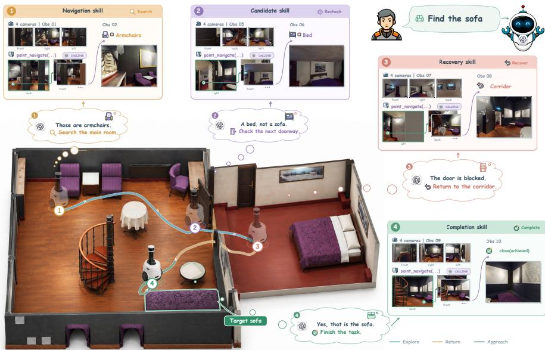
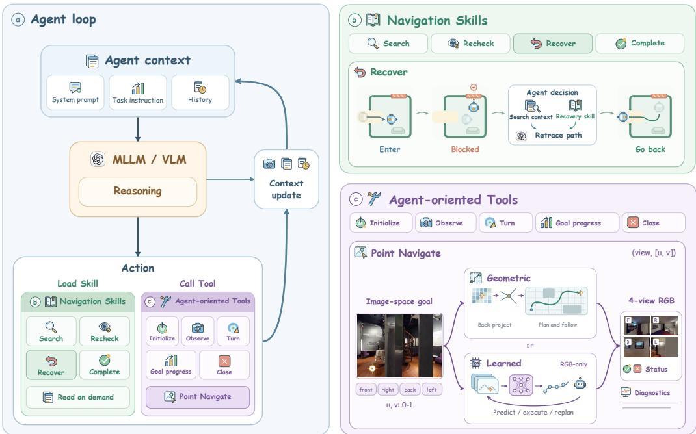
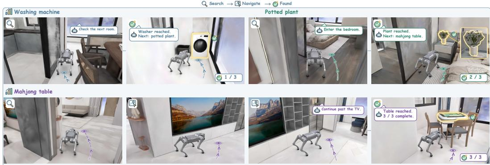
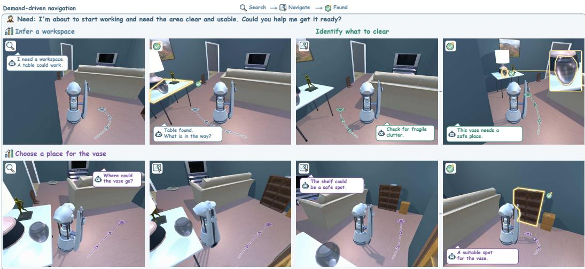
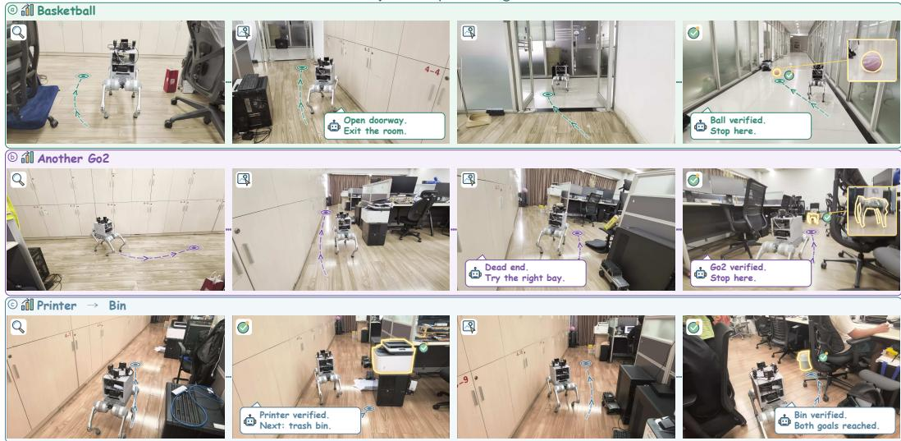
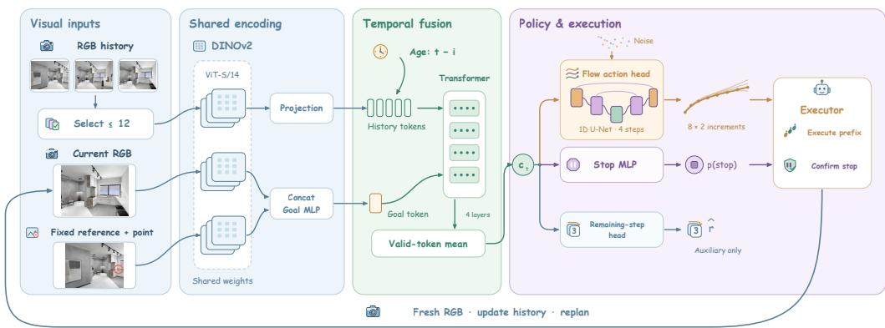

# SUPERNAV: AN AGENTIC NAVIGATION SYSTEM FOR ANY TASK IN ANY SCENE

Jinkai Zhang1 Jingyi Xu1 Yuanhong Yu1 Jiarui Guo1 Ruizhen Hu2 Hujun Bao1 Xiaowei Zhou1 Sida Peng1,3†

1Zhejiang University 2Shenzhen University 3Causa Robotics †Corresponding author

Figure 1: Skill-guided sofa search. The Agent rechecks candidates, recovers from a blocked doorway, and verifies completion.

## ABSTRACT

General-purpose service robots need navigation systems that can handle diverse human requests in unfamiliar environments, combining task generality with scene generality. Some existing methods fine-tune multimodal large language models (MLLMs) to predict navigation actions, making their behavior dependent on the coverage of navigation training data and potentially limiting generalization to new requests and environments. Our key insight is to let the MLLM focus on interpreting requests, understanding scenes, and making decisions while preserving its general-purpose capabilities and delegating motion execution to navigation tools. To realize this idea, we introduce SuperNav, which equips a pretrained MLLM with a specialized agent harness without navigation-specific fine-tuning of the MLLM. Our harness supports these decisions with Navigation Skills, agentoriented Tools for physical interaction, and task-progress and context management. A unified visual-point interface connects decision-making to motion by allowing the model to specify destinations directly in images and revise its decisions from execution feedback. Together, these components support sustained navigation across different task requirements and environments. SuperNav outperforms four evaluated baselines on instance-level, multi-object, and demand-driven tasks. Category-level evaluation on HM3D and deployment on a real quadruped robot further demonstrate its applicability across environments. Project Page: https://zju3dv.github.io/SuperNav/

## 1 INTRODUCTION

General-purpose service robots need navigation capabilities that can fulfill diverse human requests in unfamiliar environments. These requests range from finding a specific object and visiting multiple targets to satisfying high-level needs and gathering evidence for embodied questions (Batra et al., 2020; Khanna et al., 2024; Wang et al., 2023; Zhu et al., 2025). For example, finding a specified object requires identifying the intended target, whereas “finding a place to rest” requires interpreting the need and deciding which objects in the scene can satisfy it. Such differences change not only what the robot seeks, but also how it explores, tracks progress, and determines completion. General navigation therefore requires both task generality, adapting to different requests, and scene generality, operating effectively in environments unseen during training and system development.

Task generality remains constrained by predefined workflows in modular zero-shot navigation systems. These methods typically use pretrained vision-language models to assess the semantic relevance of observations to a goal and incorporate these assessments into goal-directed exploration scores (Yokoyama et al., 2024a; Zhang et al., 2025). Although these scores adapt search to new observations, task-specific logic still determines when the model participates, how exploration transitions to goal confirmation, and when execution ends. When a request changes from finding an object category to identifying a particular instance, visiting multiple targets, or satisfying an abstract need, its goal interpretation, progress tracking, and completion conditions also change, often requiring corresponding changes to this workflow.

End-to-end navigation methods seek to support diverse tasks within a single model, but their generalization across both tasks and scenes remains constrained by the coverage of navigation training data. These approaches typically fine-tune pretrained vision-language models on paired navigation instructions and trajectories to predict actions from visual observations and language (Zhang et al., 2024b; Zheng et al., 2024; Zhang et al., 2024a). The resulting models encode associations between observations, instructions, and navigation behavior; transfer depends on whether those associations remain useful under new visual appearances, spatial layouts, and interaction conditions. Consequently, learning to navigate in the training environments does not establish reliable navigation beyond them, and our cross-environment evaluations reveal substantial task-completion gaps for the evaluated methods (Section 4.1).

To address these constraints, we introduce SuperNav, a navigation framework that equips a pretrained multimodal large language model (MLLM) with a specialized agent harness for task and scene generality (Figure 1). Our design is motivated by the success of general-purpose agents across diverse computer-use tasks, where harnesses support sustained tool use and context management (Lopopolo, 2026; Young, 2025). Specifically, we use the MLLM’s existing capabilities to interpret requests, understand visual observations, and reason about subsequent actions. To turn these decisions into sustained physical interaction, our harness provides optional Navigation Skills for procedural guidance and agent-oriented Tools for observation, motion, and task management. It also maintains task-progress records and manages the interaction context, enabling the model to continue reasoning across successive actions. This division of responsibilities lets the MLLM adapt its use of navigation capabilities to the current request and scene without navigation-specific fine-tuning.

Connecting these decisions to physical motion requires an interface that grounds the MLLM’s text outputs in the observed scene. We therefore design a unified visual-point interface: the MLLM specifies a destination directly in an observation image, and the navigation tool executes the movement and returns feedback for the next decision. Compared with predicting low-level actions directly (Zhang et al., 2024b;a), this interface lets the model focus on selecting destinations while supporting different motion backends through the same interaction pattern. SuperNav achieves higher success rates than these two action-prediction baselines on our single-object and demand-driven task sets (Table 1).

We construct an instance-navigation benchmark in Habitat-GS using InteriorGS scenes to evaluate single-object and ordered multi-object navigation. We also evaluate demand-driven navigation using tasks from Demand-Bench (Anonymous, 2026) under an adapted protocol, and category-level navigation on HM3Dv2 and HM3D-OVON, complemented by real-quadruped deployment. SuperNav achieves 78.00% success on single-object navigation and 59.50% on demand-driven navigation, compared with 34.00% and 37.50% for the respective strongest baselines, UniNaVid and

OmniNav’s Action Former (Table 1). For category-level navigation, SuperNav achieves 73.33% success rate (SR) and 0.4105 success weighted by path length (SPL) on a 120-episode HM3D-OVON val-unseen subset at a 1 m threshold, without OVON-specific training or adaptation. At the stricter 0.25 m threshold, it achieves 68.33% SR and 0.3837 SPL (Table 2). These results examine the complete system across task requirements and scene settings, with motion-backend effects and evaluation-protocol differences analyzed in Section 4.

Our contributions are threefold:

• We introduce SuperNav, a specialized agent harness that enables a pretrained MLLM to direct navigation across different requests through tool execution, task-progress tracking, and context management.

• We design agent-oriented Tools with a unified visual-point motion interface and optional Navigation Skills, connecting model decisions to physical execution and providing reusable guidance for search, verification, and recovery.

• We evaluate the system across category-level, instance-level, multi-object, and demanddriven navigation, together with real-robot deployment, examining its applicability across task and scene settings.

## 2 RELATED WORK

Modular Navigation Pipelines. Modular systems integrate semantic reasoning into dedicated mapping, exploration, and verification components. SemExp (Chaplot et al., 2020), L3MVN (Yu et al., 2023), and VLFM (Yokoyama et al., 2024a) guide object search through learned exploration, language priors, or image–text relevance. VoroNav (Wu et al., 2024) and SG-Nav (Yin et al., 2024) add topological or scene-graph context, while ApexNav (Zhang et al., 2025) combines adaptive exploration with multi-frame target identification. These systems assign models specific roles within task-oriented pipelines; SuperNav instead lets the MLLM select and coordinate available capabilities at runtime.

Hierarchical Navigation Systems. Hierarchical systems couple high-level model reasoning with dedicated navigation modules. InstructNav (Long et al., 2024) translates predicted actions and landmarks into trajectories through value maps; OmniNav (Xue et al., 2026) combines prospective exploration and subgoal planning with a fast waypoint policy; SysNav (Zhu et al., 2026) delegates within-room exploration and motion to classical algorithms under room-level VLM reasoning. These systems already support online adaptation, demonstrating cooperation between model reasoning and learned or geometric execution. SuperNav focuses on the interfaces and runtime through which the model chooses and combines capabilities across a task.

Agentic Systems and Harnesses. Agentic systems organize execution through callable capabilities and feedback. Inner Monologue (Huang et al., 2022) incorporates environmental feedback into planning, Code as Policies (Liang et al., 2023) composes robotics APIs into executable policies, and SWE-agent (Yang et al., 2024) studies how action and observation interfaces affect software-task performance. Embodied harnesses extend this perspective: Show-Harness (Chen et al., 2026b) translates semantic actions into robot motion, AgenticNav (Li et al., 2026) combines pixel-goal motion with depth queries and historical-image retrieval, and HarnessVLN (Chen et al., 2026a) maintains event memory and a spatiotemporal graph while validating action and termination proposals. Concurrent DemandAgent (Anonymous, 2026) addresses dependency-aware human demands through an Adaptive Demand Ledger, spatial memory, and embodied Skills, and introduces Demand-Bench. SuperNav studies task and scene generality through a unified visual-point interface with interchangeable motion backends, supported by context pruning and Navigation Skills. Task-level action selection and semantic completion judgments remain with the MLLM.

## 3 NAVIGATION AGENT HARNESS

Overview. SuperNav combines a pretrained MLLM with a navigation-specific harness to form an embodied navigation Agent that sustains decisions and actions across different requests. A request may specify a target, an ordered sequence of targets, or a high-level need; the Agent must interpret that request and act until it can judge whether the completion conditions are met. The MLLM performs this interpretation and decision-making, while the harness organizes execution and context through an agent loop. Within this loop, agent-oriented Tools are callable operations for observation, motion, and task-state management, and Navigation Skills are instructions the MLLM can read for search, verification, and recovery. As illustrated in Figure 2, the MLLM interprets observations, selects a Tool call, and uses the returned feedback to decide again, consulting Skills when relevant. We first describe how the loop coordinates these capabilities (Section 3.1), then develop the Tool interfaces (Section 3.2) and Skill guidance (Section 3.3).

  
Figure 2: Navigation with Skills and agent-oriented Tools. (a) The Agent loop maintains context for MLLM reasoning, Skill loading, and Tool calls. (b) Navigation Skills guide search, candidate rechecking, recovery, and completion; the recovery example shows the Agent retracing its path after a blocked passage. (c) Agent-oriented Tools support observation, motion, goal-progress tracking, and task closure. Point navigation shares an image-space goal interface across geometric and learned execution backends.

## 3.1 AGENT LOOP

Continuous decision-making. The agent loop organizes the request, visual observations, and interaction history into a continuing navigation process. Initialization opens a session and returns the first observation, from which the MLLM interprets the requested goals and completion conditions. At each subsequent step, it uses the current context and task progress to choose an operation: observe, move, update goal state, or read relevant Skill guidance. Tool returns and retrieved instructions enter the context for the next decision, allowing execution feedback to change the MLLM’s plan. For example, after approaching a candidate, the MLLM inspects the new images, judges whether the candidate satisfies the request, and either records completion or continues searching.

Task state and context management. Long-horizon execution requires these local decisions to remain connected to earlier evidence and unfinished goals. Goal records maintain pending and completed items, while textual interaction history retains inspected areas, candidate clues, and failed attempts for later decisions. To control the growing image context, the harness removes an image’s media payload from subsequent requests once it has been processed and superseded by newer observations. It preserves textual history, task state, and image paths; the MLLM can request earlier images from the workspace when needed. This media-only pruning limits repeated image transmission while retaining access to earlier evidence and task progress.

Task termination. The MLLM judges whether the request is satisfied or execution is blocked from the observations and progress records, and selects the termination Tool to end the loop. A termination Tool records either declared outcome and closes the session; successful closure confirms that the session ended, not that the task succeeded. Benchmark scoring evaluates success separately from this declaration. The loop therefore depends on operations that expose observations, execute motion, and maintain state, whose interfaces we describe next; runtime restrictions and execution limits appear in Appendix A.

## 3.2 AGENT-ORIENTED NAVIGATION TOOLS

Tool suite and design principles. Agent-oriented Tools connect the MLLM’s navigation decisions to executable environment operations. The suite covers initialization, observation, turning, visual-point navigation, goal-progress management, and termination. Its design makes inputs easy for the MLLM to specify and returns useful for the next decision, while keeping destination representations consistent across motion backends. The central observation–motion interface implements these principles by pairing visual destinations with updated observations and execution feedback.

Observation and visual-point navigation. An observation returns four RGB images labeled front, right, back, and left, relative to the robot’s heading at capture. These labels let the MLLM associate a candidate or passage with a particular view and select a destination through

$$
\mathrm { P o i n t N a v } ( d , [ u , v ] ) , \qquad u , v \in [ 0 , 1 ] ,
$$

where d identifies the view and u, v are horizontal and vertical coordinates normalized from its top-left corner. The Agent may select a point on a candidate or on visible floor to approach a target or obtain a new view. The Tool executes the movement internally and returns new fourview images, execution status, and concise diagnostics; the turning Tool provides the same types of feedback. These returns connect destination selection to visual rechecking without requiring a separate observation call after every movement.

Interchangeable motion backends. The visual-point interface separates destination selection from the mechanism that executes it. The geometric backend, termed Geo-based Executor, uses depth, camera calibration, and pose to associate the selected point with an environment location, then plans and follows a path to a reachable goal. Simulation supplies rendered depth, camera poses, and navigation geometry, while robot deployment uses sensed geometry and localization (Appendix A.1). The learned backend, Learned Executor, is inspired by NoMaD’s goal-conditioned generative-policy design (Sridhar et al., 2024), replacing destination-image goals with marked points in reference observations. It predicts local displacement increments and a stopping signal from the selected image–point pair and recent RGB observations. It turns toward the selected view and repeatedly executes short predicted motion segments within one Tool call. Both backends accept visual destinations and return observations with execution feedback, so the Agent can retain the same decision workflow; learned-controller architecture and training details are deferred to Appendix C.

Progress and termination. Progress and termination Tools extend this workflow from individual movements to complete requests. The progress Tool lets the MLLM query or update pending/found goals and continue with the remaining items; the termination Tool records its achieved/blocked judgment and closes the session. These records represent the MLLM’s reports rather than independent semantic verification. Deciding when to search further, recheck a candidate, or recover from failed motion thus remains the MLLM’s responsibility, for which Skills provide reusable guidance.

## 3.3 NAVIGATION SKILLS

Skill organization and discovery. Navigation Skills organize reusable navigation experience into procedural guidance that the MLLM can read on demand. Each Skill is a Markdown package describing its applicable situations, evidence to inspect, recommended steps, and linked references.

Table 1: Single-object, multi-object, and demand-driven navigation results. SR (%) and SPL (0– 1): instance tasks use viewpoint geodesic distance < 1 m; demand-driven tasks use 2 m boundingbox regions. Task counts are in parentheses; bold marks column bests.
<table><tr><td rowspan="3"></td><td colspan="4">Our instance-navigation benchmark</td><td colspan="2">Demand-driven benchmark</td></tr><tr><td colspan="2">Single-object (150)</td><td colspan="2">Multi-object (150)</td><td colspan="2">Demand-driven (200)</td></tr><tr><td>SR↑</td><td>SPL↑</td><td>SR↑</td><td>SPL↑</td><td>SR↑</td><td>SPL↑</td></tr><tr><td>NaVid</td><td>24.67</td><td>0.1599</td><td>2.67</td><td>0.0216</td><td>17.00</td><td>0.0920</td></tr><tr><td>UniNaVid</td><td>34.00</td><td>0.1833</td><td>1.33</td><td>0.0131</td><td>25.00</td><td>0.0943</td></tr><tr><td>StreamVLN</td><td>13.33</td><td>0.1036</td><td>0.00</td><td>0.0000</td><td>25.50</td><td>0.0775</td></tr><tr><td>OmniNav (Action Former)</td><td>27.33</td><td>0.2133</td><td>4.00</td><td>0.0275</td><td>37.50</td><td>0.1213</td></tr><tr><td></td><td>78.00</td><td>0.4127</td><td>34.00</td><td>0.1388</td><td>59.50</td><td></td></tr><tr><td>SuperNav + Geo-based Executor SuperNav + Learned Executor</td><td>68.00</td><td>0.2059</td><td>34.00</td><td>0.0862</td><td>45.00</td><td>0.1801 0.1603</td></tr></table>

The bundle comprises a main navigation Skill, backend-specific Tool-use instructions, and references for exploration, recovery, and entrance search, together covering search, recovery, and completion. The harness exposes Skill names and descriptions so the MLLM can discover the relevant package and load its instructions or linked references into the decision context.

Navigation guidance. The guidance addresses three recurring decisions: where to search, how to recover, and when to finish. Search guidance asks the MLLM to record inspected areas, visible openings, and uncertain branches, preserving alternatives for later exploration; revisiting relies on visual recognition rather than a stored return path. Recovery guidance recommends changing the point or route after failed motion, stepping back when a candidate is difficult to inspect, or seeking an entrance when glass blocks access. Completion guidance calls for checking the candidate’s appearance, requested relations, and surrounding context, then recording verified goals and continuing with any remaining request. For example, a blocked passage can prompt the MLLM to read recovery guidance, select another route, and reassess the candidate from the returned images.

Integration with the Agent loop. Together, the loop sustains decisions, Tools provide execution capabilities, and Skills guide their use. Skills influence decisions by entering the context; they neither add environment capabilities nor programmatically enforce action sequences or semantic judgments. The MLLM still chooses each operation from the current request and feedback, using the shared loop, interfaces, and guidance to handle different navigation tasks.

## 4 EXPERIMENTS

We evaluate SuperNav across four settings using GPT-5.6 Terra with Geo-based Executor or Learned Executor, reporting SR (%) and SPL (0–1). In Habitat-GS and AI2-THOR, we compare against NaVid (Zhang et al., 2024b), UniNaVid (Zhang et al., 2024a), StreamVLN (Wei et al., 2025), and OmniNav’s Action Former (Xue et al., 2026), retaining each baseline’s native inputs and history mechanisms. Detailed protocols appear in Appendix B.

## 4.1 INSTANCE NAVIGATION IN HABITAT-GS

Our InteriorGS-based benchmark contains 150 single-object tasks and 150 ordered multi-object tasks with two to five targets. Arrival requires navmesh geodesic distance below 1 m to an approved target viewpoint. Single-object success tests the final position; multi-object success tests ordered arrivals along the trajectory, both requiring explicit STOP (Appendix B.1–B.3).

Results. SuperNav sustains its advantage through later goals (Table 1; Appendix B.3), as illustrated in Figure 3. Both backends achieve the same multi-object success rate, while Geo-based Executor yields more efficient paths.

Figure 3: Ordered multi-object navigation in simulation. The Agent visits a washing machine, a potted plant, and a mahjong table in order.  
  
Figure 4: Demand-driven navigation. To prepare a workspace, the Agent locates a table, identifies a vase to clear, and finds a suitable shelf for it.

## 4.2 DEMAND-DRIVEN NAVIGATION

We use 200 AI2-THOR (Kolve et al., 2017) tasks from Demand-Bench (Anonymous, 2026), adapting evaluation to one to eight ordered stages (Appendix B.2). Success requires entering each stage’s admissible 2 m bounding-box region in order, without object reuse, and explicitly stopping.

Results. Both backends improve on the baselines in SR and SPL (Table 1), extending the framework from explicit targets to inferred goals. Geo-based Executor progresses furthest, but long sequences remain challenging (Appendix B.3).

Figure 4 illustrates navigation toward successive inferred goals.

## 4.3 HM3D BENCHMARKS

We evaluate category-level navigation on a shared 120-episode HM3D-OVON val-unseen subset and 1,000 HM3Dv2 validation episodes (Ramakrishnan et al., 2021; Yokoyama et al., 2024b). Tables 2 and 3 group results by the threshold on the shortest navigable-path distance from the agent’s final position to the nearest goal viewpoint. MTU3D (Zhu et al., 2025), AstraNav-Memory (Ren et al., 2025), and the A-star branch of OmniNav’s slow system (Xue et al., 2026) use the same underlying navigation-mesh path-query and follower mechanism as our Geo-based Executor. We therefore use Geo-based Executor for our primary OVON comparisons; details of these execution mechanisms appear in Appendix B.5. Our scoring rules and the protocols behind published comparisons are detailed in Appendix B.5–B.6.

Table 2: Category-level navigation on HM3D. SR (%) and SPL (0–1) at the indicated thresholds. External entries are published results; L3MVN, VLFM, and SG-Nav use ApexNav’s HM3Dv2 reevaluation. Bold marks the highest value in each column.
<table><tr><td rowspan="3">Method</td><td colspan="4">HM3D-OVON val-unseen</td><td colspan="4">HM3Dv2</td></tr><tr><td colspan="2">0.25 m</td><td colspan="2">1m</td><td colspan="2">0.2 m</td><td colspan="2">1m</td></tr><tr><td>SR↑</td><td>SPL↑</td><td>SR↑</td><td>SPL↑</td><td>SR↑</td><td>SPL↑</td><td>SR↑</td><td>SPL↑</td></tr><tr><td>MTU3D (Zhu et al., 2025)</td><td>40.80</td><td>0.1210</td><td></td><td></td><td></td><td></td><td></td><td></td></tr><tr><td>SoftNav (Wu et al., 2026)</td><td>66.700.2570</td><td></td><td></td><td></td><td></td><td></td><td></td><td></td></tr><tr><td>AstraNav-Memory (Ren et al., 2025)</td><td></td><td></td><td></td><td>62.500.3490</td><td></td><td></td><td></td><td></td></tr><tr><td>OmniNav (slow + CoT) (Xue et al., 2026)</td><td></td><td></td><td></td><td>59.200.3320</td><td></td><td></td><td></td><td></td></tr><tr><td>L3MVN (Yu et al., 2023)</td><td></td><td></td><td></td><td></td><td>36.300.1570</td><td></td><td></td><td></td></tr><tr><td>VLFM (Yokoyama et al., 2024a)</td><td></td><td></td><td></td><td></td><td></td><td>63.600.3250</td><td></td><td></td></tr><tr><td>SG-Nav (Yin et al., 2024)</td><td></td><td></td><td></td><td></td><td></td><td>49.600.2550</td><td></td><td></td></tr><tr><td>ApexNav (Zhang et al., 2025)</td><td></td><td></td><td></td><td></td><td></td><td>76.200.3800</td><td></td><td></td></tr><tr><td>WMNav (Nie et al., 2025)</td><td></td><td></td><td></td><td></td><td></td><td></td><td>72.200.3330</td><td></td></tr><tr><td>MSGNav (Huang et al., 2026)</td><td></td><td></td><td></td><td></td><td></td><td></td><td>74.10</td><td>0.3340</td></tr><tr><td></td><td></td><td></td><td></td><td></td><td></td><td></td><td></td><td></td></tr><tr><td>SuperNav + Geo-based Executor</td><td>68.330.383773.330.410580.300.3338</td><td></td><td></td><td></td><td></td><td></td><td>86.500.3638</td><td></td></tr><tr><td>SuperNav + Learned Executor</td><td>65.000.135570.830.144379.000.128885.400.1383</td><td></td><td></td><td></td><td></td><td></td><td></td><td></td></tr></table>

Table 3: OVON ablations with Geo-based Executor. The 0.25 m and 1 m thresholds apply to the shortest navigable-path distance from the agent’s final position to the nearest goal viewpoint. Each variant uses 120 episodes and GPT-5.6 Terra (high) unless specified. SR (%) and SPL (0–1); bold marks the best value.
<table><tr><td rowspan="2">Variant</td><td colspan="2">0.25 m</td><td colspan="2">1m</td></tr><tr><td>SR↑</td><td>SPL↑</td><td>SR↑</td><td>SPL↑</td></tr><tr><td>w/o Navigation Skills</td><td>35.00</td><td>0.2460</td><td>54.17</td><td>0.3894</td></tr><tr><td>w/o Agent-oriented Tool Design</td><td>52.50</td><td>0.2230</td><td>65.83</td><td>0.2855</td></tr><tr><td>w/o Skills and Tool Design</td><td>31.67</td><td>0.1870</td><td>54.17</td><td>0.3417</td></tr><tr><td>Grounding Motion Tool</td><td>55.83</td><td>0.3201</td><td>62.50</td><td>0.3624</td></tr><tr><td>SuperNav (GPT-6 Astra medium)</td><td>71.67</td><td>0.4579</td><td>79.17</td><td>0.4974</td></tr><tr><td>SuperNav (GPT-5.6 Terra high)</td><td>68.33</td><td>0.3837</td><td>73.33</td><td>0.4105</td></tr></table>

Results. Learned Executor retains much of Geo-based Executor’s success but loses path efficiency (Table 2). Geo-based Executor is competitive with the listed published methods, although their evaluation subsets and protocols differ from ours.

## 4.4 HARNESS AND MODEL ABLATIONS

With Geo-based Executor fixed, we remove Navigation Skills, replace agent-oriented Tools with front-only interaction, or substitute language grounding and candidate selection for direct pointing (Grounding Motion Tool, Appendix B.6). A decision-model configuration variant uses GPT-6 Astra (medium) instead of GPT-5.6 Terra (high), preserving the full harness.

Results. Removing Navigation Skills reduces SR more than restricting the interface to the front view, especially at the stricter threshold (Table 3). The Tool design complements this guidance: with Skills retained, front-only interaction reduces SR and SPL while requiring substantially more explicit turns (Table 6). External grounding does not improve on the Agent’s direct point selection, whereas replacing Terra (high) with Astra (medium) improves both SR and SPL with the harness fixed. This demonstrates compatibility with a different decision-model configuration.

Search → Navigate → Found

  
Figure 5: Real-world navigation on Unitree Go2. The robot searches for (a) a basketball and (b) another Go2, and (c) visits a printer followed by a trash bin.

## 4.5 REAL-WORLD NAVIGATION

On a Unitree Go2 with four-view RGB and LiDAR-based geometric execution, SuperNav revises routes at blocked passages, verifies targets, and transitions between goals (Figure 5; Appendix A.1).

## 5 CONCLUSION

We presented SuperNav, a navigation harness that enables a pretrained MLLM to interpret requests, understand scenes, and make decisions while delegating motion execution to tools, without navigation-specific fine-tuning of the MLLM. Navigation Skills, task-progress tracking, and context management support sustained interaction, while a unified visual-point interface connects decisions to physical motion. Experiments across category-level, instance-level, multi-object, and demanddriven navigation demonstrate the framework’s applicability across task and scene settings. These results support building navigation capabilities around a general-purpose MLLM’s existing understanding and reasoning.

Limitations. SuperNav relies on the underlying MLLM for semantic judgments and is therefore limited by its capabilities. Geometric execution relies on available maps or scene geometry, while MLLM inference incurs computational cost and substantial latency variability, making task duration less predictable. Our demand-driven evaluation measures ordered navigation to relevant targets rather than completion of the underlying activities. Extending evaluation to more real-world settings and improving reliability on long navigation sequences remain future directions.

## AI USE STATEMENT

We used Codex with GPT-6 to assist with drafting and refining manuscript text based on authordeveloped ideas. AI tools also helped identify some comparison papers. Codex assisted with implementing navigation tools and evaluation code, and with running and debugging experiments. The authors developed the research ideas, Skill and Tool design principles, and interface specifications, and tested the AI-assisted code. For our instance-navigation benchmark, generative AI assisted in producing scene-based object annotations and evaluation instructions, which were manually checked by the authors before use. Images and trajectories were generated by the simulator. The authors take responsibility for the final content of this work.

## REFERENCES

Anonymous. Demandagent: Towards an embodied agent harness for everyday human demands. In Submitted to The Fifteenth International Conference on Learning Representations, 2026. URL https://openreview.net/forum?id=jWsuiC01Wm. under review.

Dhruv Batra, Aaron Gokaslan, Aniruddha Kembhavi, Oleksandr Maksymets, Roozbeh Mottaghi, Manolis Savva, Alexander Toshev, and Erik Wijmans. Objectnav revisited: On evaluation of embodied agents navigating to objects. arXiv preprint arXiv:2006.13171, 2020.

Devendra Singh Chaplot, Dhiraj Prakashchand Gandhi, Abhinav Gupta, and Russ R Salakhutdinov. Object goal navigation using goal-oriented semantic exploration. Advances in neural information processing systems, 33:4247–4258, 2020.

Yang Chen, Lirong Che, Zhenyu Huang, Wenbo Fu, Chuang Wang, Xu Cao, Daqi Liu, Yuzhe Yang, Jian Su, and Lan-Zhe Guo. Harnessvln: Unifying training-free embodied navigation through an agent harness. arXiv preprint arXiv:2609.15195, 2026a.

Yanzhe Chen, Zechen Bai, Zhijun Cao, Wenzheng Zeng, Kevin Qinghong Lin, Yiqi Lin, Guoqiang Liang, Kevin Yuchen Ma, Qiming Huang, and Mike Zheng Shou. Show-harness: Just a vlm agent can play robots. arXiv preprint arXiv:2609.10522, 2026b.

Wenlong Huang, Fei Xia, Ted Xiao, Harris Chan, Jacky Liang, Pete Florence, Andy Zeng, Jonathan Tompson, Igor Mordatch, Yevgen Chebotar, Pierre Sermanet, Noah Brown, Tomas Jackson, Linda Luu, Sergey Levine, Karol Hausman, and Brian Ichter. Inner monologue: Embodied reasoning through planning with language models. arXiv preprint arXiv:2207.05608, 2022.

Xun Huang, Shijia Zhao, Yunxiang Wang, Xin Lu, Wanfa Zhang, Rongsheng Qu, Weixin Li, Yunhong Wang, and Chenglu Wen. Msgnav: Unleashing the power of multi-modal 3d scene graph for zero-shot embodied navigation. In Proceedings of the IEEE/CVF Conference on Computer Vision and Pattern Recognition, pp. 37154–37163, 2026.

Mukul Khanna, Ram Ramrakhya, Gunjan Chhablani, Sriram Yenamandra, Theophile Gervet, Matthew Chang, Zsolt Kira, Devendra Singh Chaplot, Dhruv Batra, and Roozbeh Mottaghi. Goatbench: A benchmark for multi-modal lifelong navigation. In 2024 IEEE/CVF Conference on Computer Vision and Pattern Recognition (CVPR), pp. 16373–16383. IEEE, 2024.

Eric Kolve, Roozbeh Mottaghi, Winson Han, Eli VanderBilt, Luca Weihs, Alvaro Herrasti, Matt Deitke, Kiana Ehsani, Daniel Gordon, Yuke Zhu, Aniruddha Kembhavi, Abhinav Gupta, and Ali Farhadi. Ai2-thor: An interactive 3d environment for visual ai. arXiv preprint arXiv:1712.05474, 2017.

Yijian Li, Changze Li, Han Zheng, Jiyuan Cai, Tong Qin, and Ming Yang. AgenticNav: Zero-shot vision-and-language navigation as a tool-calling harness. arXiv preprint arXiv:2606.10577v3, 2026. URL https://arxiv.org/abs/2606.10577v3.

Jacky Liang, Wenlong Huang, Fei Xia, Peng Xu, Karol Hausman, Brian Ichter, Pete Florence, and Andy Zeng. Code as policies: Language model programs for embodied control. In 2023 IEEE International conference on robotics and automation (ICRA), pp. 9493–9500. IEEE, 2023.

Yaron Lipman, Ricky TQ Chen, Heli Ben-Hamu, Maximilian Nickel, and Matt Le. Flow matching for generative modeling. arXiv preprint arXiv:2210.02747, 2022.

Yuxing Long, Wenzhe Cai, Hongcheng Wang, Guanqi Zhan, and Hao Dong. Instructnav: Zeroshot system for generic instruction navigation in unexplored environment. arXiv preprint arXiv:2406.04882, 2024.

Ryan Lopopolo. Harness engineering: leveraging Codex in an agent-first world. OpenAI Engineering Blog, February 2026. URL https://openai.com/index/harness-engineeri ng/.

Dujun Nie, Xianda Guo, Yiqun Duan, Ruijun Zhang, and Long Chen. Wmnav: Integrating visionlanguage models into world models for object goal navigation. In 2025 IEEE/RSJ International Conference on Intelligent Robots and Systems (IROS), pp. 2392–2399. IEEE, 2025.

Maxime Oquab, Timothee Darcet, Th´ eo Moutakanni, Huy Vo, Marc Szafraniec, Vasil Khalidov,´ Pierre Fernandez, Daniel Haziza, Francisco Massa, Alaaeldin El-Nouby, Mahmoud Assran, Nicolas Ballas, Wojciech Galuba, Russell Howes, Po-Yao Huang, Shang-Wen Li, Ishan Misra, Michael Rabbat, Vasu Sharma, Gabriel Synnaeve, Hu Xu, Herve Jegou, Julien Mairal, Patrick Labatut, Ar-´ mand Joulin, and Piotr Bojanowski. Dinov2: Learning robust visual features without supervision. arXiv preprint arXiv:2304.07193, 2023.

Santhosh K Ramakrishnan, Aaron Gokaslan, Erik Wijmans, Oleksandr Maksymets, Alex Clegg, John Turner, Eric Undersander, Wojciech Galuba, Andrew Westbury, Angel X Chang, Manolis Savva, Yili Zhao, and Dhruv Batra. Habitat-matterport 3d dataset (hm3d): 1000 large-scale 3d environments for embodied ai. arXiv preprint arXiv:2109.08238, 2021.

Botao Ren, Junjun Hu, Xinda Xue, Minghua Luo, Jintao Chen, Haochen Bai, Liangliang You, and Mu Xu. Astranav-memory: Contexts compression for long memory. arXiv preprint arXiv:2512.21627, 2025.

Ajay Sridhar, Dhruv Shah, Catherine Glossop, and Sergey Levine. Nomad: Goal masked diffusion policies for navigation and exploration. In 2024 IEEE International Conference on Robotics and Automation (ICRA), pp. 63–70. IEEE, 2024.

Hongcheng Wang, Andy Guan Hong Chen, Xiaoqi Li, Mingdong Wu, and Hao Dong. Find what you want: Learning demand-conditioned object attribute space for demand-driven navigation. Advances in Neural Information Processing Systems, 36:16353–16366, 2023.

Shihao Wang, Shilong Liu, Yuanguo Kuang, Xinyu Wei, Yangzhou Liu, Zhiqi Li, Yunze Man, Guo Chen, Andrew Tao, Guilin Liu, Jan Kautz, Lei Zhang, and Zhiding Yu. Locateanything: Fast and high-quality vision-language grounding with parallel box decoding. In European Conference on Computer Vision, pp. 336–357. Springer, 2026.

Meng Wei, Chenyang Wan, Xiqian Yu, Tai Wang, Yuqiang Yang, Xiaohan Mao, Chenming Zhu, Wenzhe Cai, Hanqing Wang, Yilun Chen, Xihui Liu, and Jiangmiao Pang. Streamvln: Streaming vision-and-language navigation via slowfast context modeling. arXiv preprint arXiv:2507.05240, 2025.

Pengying Wu, Yao Mu, Bingxian Wu, Yi Hou, Ji Ma, Shanghang Zhang, and Chang Liu. Voronav: Voronoi-based zero-shot object navigation with large language model. arXiv preprint arXiv:2401.02695, 2024.

Yi Wu, Junjie An, Xiao Liu, Yiqun Zhou, Yuechen Wu, Xiaoqing Guan, Shuyang Yu, You Wang, and Guang Li. Softnav: Injecting 3d scene tokens into vlms for embodied navigation. arXiv preprint arXiv:2607.14586, 2026.

Xinda Xue, Junjun Hu, Minghua Luo, Shichao Xie, Jintao Chen, Zixun Xie, Kuichen Quan, Wei Guo, Mu Xu, and Zedong Chu. OmniNav: A unified framework for prospective exploration and visual-language navigation, 2026. URL https://arxiv.org/abs/2509.25687.

John Yang, Carlos Jimenez, Alexander Wettig, Kilian Lieret, Shunyu Yao, Karthik Narasimhan, and Ofir Press. Swe-agent: Agent-computer interfaces enable automated software engineering. Advances in Neural Information Processing Systems, 37:50528–50652, 2024.

Hang Yin, Xiuwei Xu, Zhenyu Wu, Jie Zhou, and Jiwen Lu. Sg-nav: Online 3d scene graph prompting for llm-based zero-shot object navigation. Advances in neural information processing systems, 37:5285–5307, 2024.

Naoki Yokoyama, Sehoon Ha, Dhruv Batra, Jiuguang Wang, and Bernadette Bucher. Vlfm: Visionlanguage frontier maps for zero-shot semantic navigation. In 2024 IEEE International Conference on Robotics and Automation (ICRA), pp. 42–48. IEEE, 2024a.

Naoki Yokoyama, Ram Ramrakhya, Abhishek Das, Dhruv Batra, and Sehoon Ha. Hm3d-ovon: A dataset and benchmark for open-vocabulary object goal navigation. In 2024 IEEE/RSJ International Conference on Intelligent Robots and Systems (IROS), pp. 5543–5550. IEEE, 2024b.

Justin Young. Effective harnesses for long-running agents. Anthropic Engineering Blog, November 2025. URL https://www.anthropic.com/engineering/effective-harness es-for-long-running-agents.

Bangguo Yu, Hamidreza Kasaei, and Ming Cao. L3mvn: Leveraging large language models for visual target navigation. In 2023 IEEE/RSJ International Conference on Intelligent Robots and Systems (IROS), pp. 3554–3560. IEEE, 2023.

Jiazhao Zhang, Kunyu Wang, Shaoan Wang, Minghan Li, Haoran Liu, Songlin Wei, Zhongyuan Wang, Zhizheng Zhang, and He Wang. Uni-navid: A video-based vision-language-action model for unifying embodied navigation tasks. arXiv preprint arXiv:2412.06224, 2024a.

Jiazhao Zhang, Kunyu Wang, Rongtao Xu, Gengze Zhou, Yicong Hong, Xiaomeng Fang, Qi Wu, Zhizheng Zhang, and He Wang. Navid: Video-based vlm plans the next step for vision-andlanguage navigation. arXiv preprint arXiv:2402.15852, 2024b.

Mingjie Zhang, Yuheng Du, Chengkai Wu, Jinni Zhou, Zhenchao Qi, Jun Ma, and Boyu Zhou. Apexnav: An adaptive exploration strategy for zero-shot object navigation with target-centric semantic fusion. IEEE Robotics and Automation Letters, 10(11):11530–11537, 2025. doi: 10.1 109/LRA.2025.3606388.

Duo Zheng, Shijia Huang, Lin Zhao, Yiwu Zhong, and Liwei Wang. Towards learning a generalist model for embodied navigation. In 2024 IEEE/CVF Conference on Computer Vision and Pattern Recognition (CVPR), pp. 13624–13634. IEEE, 2024.

Haokun Zhu, Zongtai Li, Zihan Liu, Kevin Guo, Zhengzhi Lin, Yuxin Cai, Guofei Chen, Chen Lv, Wenshan Wang, Jean Oh, and Ji Zhang. Sysnav: Multi-level systematic cooperation enables real-world, cross-embodiment object navigation. IEEE Robotics and Automation Letters, 11(9): 10577–10584, 2026. doi: 10.1109/LRA.2026.3713730.

Ziyu Zhu, Xilin Wang, Yixuan Li, Zhuofan Zhang, Xiaojian Ma, Yixin Chen, Baoxiong Jia, Wei Liang, Qian Yu, Zhidong Deng, Siyuan Huang, and Qing Li. Move to understand a 3d scene: Bridging visual grounding and exploration for efficient and versatile embodied navigation. In 2025 IEEE/CVF International Conference on Computer Vision (ICCV), pp. 8120–8132. IEEE, 2025.

## A METHOD IMPLEMENTATION DETAILS

## A.1 EXPERIMENTAL SETUP

Unitree Go2. The geometric backend combines four directional RGB cameras with robotprovided LiDAR data and odometry. Camera intrinsics, mounting extrinsics, and the robot pose associated with the selected observation relate image-space goals to the LiDAR map. The backend associates the selected pixel’s neighborhood with mapped 3D points, selecting a foreground surface and an approach position. A voxel-grid mapper accumulates LiDAR observations into a height-based 2D traversal-cost map; voxel size and grid resolution both default to 0.05 m. ReplanningAStarPlanner computes paths, and a lookahead-based follower uses proportional heading control to generate linear and angular velocity commands at 10 Hz. Localization uses the robot’s reported odometry, without an additional loop-closing SLAM system in our software.

Simulation and Geo-based Executor. Habitat-Sim provides RGB-D images at 640 × 480 resolution, a 90◦ horizontal field of view, and a camera height of 1.25 m, together with known intrinsics and simulator camera poses. Geo-based Executor back-projects image-space anchors using rendered depth and checks nearby candidate destinations on the scene’s precomputed navigation mesh. Recast/Detour-based PathFinder supplies path queries; GreedyGeodesicFollower executes discrete forward and turning actions. Defaults are a 0.7 m standoff, a 0.75 m candidate snap-distance limit, a 0.3 m follower goal radius, and 200 follower steps. These local execution limits are separate from benchmark success thresholds.

<table><tr><td>Variant tor</td><td>Entry Skill Geo-based Execu- global-navigation-geo-based-executor localnav-pointnav-geo-based-execu</td><td>Tool-usage Skill</td></tr><tr><td></td><td>Learned Executorglobal-navigation-learned-executor</td><td>tor localnav-pointnav</td></tr><tr><td>Multi-goal</td><td colspan="2">multi-global-navigation-learned-exe localnav-pointnav cutor</td></tr></table>

Learned Executor controller. Learned Executor generates motion from RGB observations and image-space goals without depth-based grounding or navigation-mesh planning. Learned Executor uses marked reference images, a shared DINOv2 encoder, variable-length visual history, and a flow action head, as described in Section C. Simulator position changes and collision reports support progress monitoring.

## A.2 RUNTIME AND TOOL ACCESS

Agent runtime. We implement the Agent loop with Codex CLI and expose environment operations through the Model Context Protocol (MCP).

Task workspaces and permissions. For Learned Executor and Geo-based Executor, the harness launches each non-interactive Codex process with a task-specific working directory and CODEX HOME, containing its configuration, Skill snapshot, and logs. Native Skill loading requires filesystem reads; execution uses danger-full-access with interactive approval disabled. Directories organize task state and artifacts without operating-system-level isolation. Instructions permit read-only access to the prescribed Skill bundle but require scene perception and action through MCP tools, prohibiting filesystem or shell inspection of scene assets, ground-truth annotations, trajectories, and evaluator metadata. The MCP whitelist restricts exposed environment tools; filesystem restrictions are instruction-level constraints.

Tool interfaces. The shared visual-point contract comprises a view, a normalized image point, and returned observations with execution feedback; concrete tool names and auxiliary operations depend on the backend. Both variants expose hab init scene, hab panorama, hab turn, and hab clo se session for initialization, observation, in-place turning, and closure. Learned Executor translates through hab local navigate, with hab localnav status and hab localnav stop for monitoring and cancellation. Geo-based Executor uses hab visual point navigate; valid requests execute without a preview–confirmation round trip. The learned navigation call waits for the bounded hop to finish; status queries inspect a running or recent hop, and cancellation requests take effect at the next replanning boundary. These auxiliary operations support monitoring or interruption rather than being required after each completed call. The Agent selects targets visually, while Geo-based Executor uses privileged geometry internally.

Returned observations and context. Initialization and navigation return four directional RGB images. The global-task JSON filter removes absolute pose, maps, evaluator outputs, and selected artifact fields. Validation or service failures may return only an error; panorama-capture failures are explicit.

## A.3 SKILL CONFIGURATION

The Skill snapshot manifest records file inventories, file hashes, and a bundle hash, checked before installation or reuse. Codex discovers the bundle in a run-local Skills directory; the task prompt references the Skill without embedding its text, and generated instructions require reading its entry file before scene actions. A visibility probe verifies the discovered name, description, and source path, blocking startup on failure; results may be reused for the same backend, entry Skill, and snapshot hash. The entry files for Section 3.3 are listed below.

## A.4 EXECUTION LIMITS AND EVALUATION

Timeouts and session closure. Benchmark configurations set timeouts of 3,600 s per Codex execution, 180 s for MCP startup, and 300 s per tool call. The harness accepts an achieved or blocked outcome from hab close session only after successful closure. It does not automatically resume a process lacking a valid terminal outcome: missing or unsuccessful closure is recorded separately, and the batch runner handles exceptions, including timeouts, before continuing to the next task.

Evaluation criteria. The Agent judges semantic completion using Skill guidance. HM3D results use geodesic-distance criteria at the thresholds reported in Table 2. Our single-object and multiobject tasks use geodesic distance strictly below 1 m to approved target viewpoints; demand-driven tasks retain 2 m horizontal bounding-box regions. All three require explicit STOP, with sequential tasks evaluated by ordered arrival along the trajectory. Demand-driven scoring matches admissible candidate objects at each stage, without reusing an already matched candidate. Appendix B defines the benchmark-specific scoring.

## B EVALUATION PROTOCOLS AND ADDITIONAL RESULTS

## B.1 INSTANCE-NAVIGATION BENCHMARK CONSTRUCTION

We build our instance-navigation benchmark in the Habitat-GS simulator using InteriorGS scene assets, generate object-level semantic annotations with a vision-language model, and manually review the annotations. The final evaluation set contains 150 single-object tasks and 150 ordered multi-object tasks; the latter contain two to five targets per instruction.

## B.2 INSTANCE- AND DEMAND-DRIVEN NAVIGATION METRICS

Instance-navigation arrival and termination. For target $^ { g , }$ let $V _ { g }$ be its approved viewpoint set and $d _ { \mathrm { n a v } }$ the shortest geodesic distance on the scene’s navigation mesh. Arrival at position p requires

$$
\operatorname* { m i n } _ { v \in V _ { g } } d _ { \mathrm { n a v } } ( p , v ) < 1 \mathrm { m } .
$$

Single-object success requires the final saved position to satisfy this test and an explicit STOP. Multi-object success requires saved trajectory positions to satisfy the targets in order, followed by explicit STOP; earlier targets need not remain near the final position. We test the complete approved viewpoint set at each stage using Habitat’s MultiGoalShortestPath, without interpolating between saved positions. The initial position can satisfy a goal, and one position may satisfy consecutive stages. Scoring is performed after execution and is not returned as policy feedback.

Viewpoint-reference SPL. For each task, SPL is $S _ { i } L _ { i } / \operatorname* { m a x } ( L _ { i } , P _ { i } )$ , where $S _ { i }$ is success under the 1 m viewpoint criterion and $P _ { i }$ is the full executed path length. We use the dataset-provided global reference: the shortest route over approved viewpoints in the fixed target order, computed by dynamic programming for multi-object tasks. For single-object tasks, the local and global references coincide. The reference reaches the viewpoint positions themselves; it is not shortened to the 1 m arrival regions, and the denominator caps SPL at one when $P _ { i } < L _ { i }$ . All methods share the same reference for each task, and both SR and SPL average over all 150 tasks in each task set, each with a valid reference. Failed tasks receive zero SPL; a successful zero-length reference and trajectory receive one.

Demand-driven navigation. We use tasks from Demand-Bench, introduced with DemandAgent (Anonymous, 2026), under an adapted evaluation protocol. DemandAgent evaluates explicit completion claims against functional dependencies and uses a 1.5 m object-center or supportfootprint criterion with applicable facing and visibility checks. Our evaluation instead scores ordered trajectory arrivals at admissible objects; its SR and SPL are therefore not directly comparable to DemandAgent's reported scores. Our protocol uses a horizontal bounding-box criterion: the distance from the robot to an admissible object’s axis-aligned box must be at most 2 m, including the box in terior, without additional visibility, line-of-sight, or vertical-distance tests. Success requires ordered completion of all stages and explicit STOP. At each stage, the scorer selects the nearest unused admissible object, breaking ties by object ID; one position may complete consecutive stages, including at initialization. SPL uses reference paths through all ordered 2 m success regions, averaged over all 200 tasks, with the same references for every method.

Table 4: Ordered progress on multi-object and demand-driven tasks. Multi-object tasks use viewpoint geodesic distance < 1 m; demand-driven tasks use 2 m bounding-box regions. $\mathrm { S R } _ { k }$ measures completion of the first k goals among tasks with at least k goals, without requiring STOP. Overall task SR appears in Table 1.
<table><tr><td colspan="9">Multi-object navigation</td></tr><tr><td>Method Eligible tasks</td><td> $\mathrm { S R _ { 1 } \uparrow }$  150</td><td> $\mathrm { S R _ { 2 } \uparrow }$  150</td><td> $\mathrm { S R _ { 3 } \uparrow }$  112</td><td> $\mathrm { S R _ { 4 } ~ \uparrow }$  75</td><td> $\mathrm { S R _ { 5 } ~ \uparrow }$  38</td><td></td><td></td><td></td></tr><tr><td>NaVid</td><td>40.00</td><td>6.67</td><td>2.68</td><td>1.33</td><td>0.00</td><td></td><td></td><td></td></tr><tr><td>UniNaVid</td><td>36.67</td><td>4.00</td><td>1.79</td><td>1.33</td><td>0.00</td><td></td><td></td><td></td></tr><tr><td>StreamVLN</td><td>22.00</td><td>3.33</td><td>0.89</td><td>0.00</td><td>0.00</td><td></td><td></td><td></td></tr><tr><td>OmniNav (Action Former)</td><td>44.00</td><td>11.33</td><td>1.79</td><td>1.33</td><td>0.00</td><td></td><td></td><td></td></tr><tr><td>SuperNav + Learned Executor</td><td>86.00</td><td>63.33</td><td>52.68</td><td>42.67</td><td>34.21</td><td></td><td></td><td></td></tr><tr><td>SuperNav + Geo-based Executor</td><td>85.33</td><td>62.00</td><td>48.21</td><td>38.67</td><td>39.47</td><td></td><td></td><td></td></tr><tr><td>Demand-driven navigation Method</td><td>SR1↑</td><td>SR2 ↑</td><td> $\mathrm { S R _ { 3 } \uparrow }$ </td><td> $\mathrm { S R _ { 4 } ~ \uparrow }$ </td><td> $\mathrm { S R _ { 5 } ~ \uparrow }$ </td><td> $\mathrm { S R _ { 6 } }$ </td><td>↑ SR7 ↑</td><td> $\mathrm { S R _ { 8 } }$  ←</td></tr><tr><td>Eligible tasks</td><td>200</td><td>130</td><td>82</td><td>37</td><td>11</td><td>3</td><td>2</td><td>1</td></tr><tr><td>NaVid</td><td>28.50</td><td>11.54</td><td>7.32</td><td>0.00</td><td>0.00</td><td>0.00</td><td>0.00</td><td>0.00</td></tr><tr><td>UniNaVid</td><td>40.00 45.00</td><td>20.77 23.08</td><td>14.63 12.20</td><td>2.70</td><td>0.00</td><td>0.00</td><td>0.00</td><td>0.00</td></tr><tr><td>StreamVLN</td><td>48.50</td><td>26.92</td><td>15.85</td><td>2.70 8.11</td><td>0.00 0.00</td><td>0.00 0.00</td><td>0.00 0.00</td><td>0.00</td></tr><tr><td>OmniNav (Action Former)</td><td>55.00</td><td>33.08</td><td>26.83</td><td>5.41</td><td>0.00</td><td>0.00</td><td>0.00</td><td>0.00</td></tr><tr><td>SuperNav + Learned Executor</td><td></td><td></td><td></td><td></td><td></td><td></td><td></td><td>0.00</td></tr><tr><td>SuperNav + Geo-based Executor</td><td>72.00</td><td>55.38</td><td>45.12</td><td>24.32</td><td>9.09</td><td>0.00</td><td>0.00</td><td>0.00</td></tr></table>

Table 5: Baseline observation settings in Habitat-GS and AI2-THOR. Dimensions refer to environment-rendered images before each model’s preprocessing. Camera height is 1.25 m. All policies receive the complete instruction and retain their native history mechanisms.
<table><tr><td>Method</td><td>RGB views</td><td>Resolution per view</td><td>HFOV</td><td>Precision</td></tr><tr><td>NaVid</td><td>Front</td><td> $6 4 0 \times 4 8 0$ </td><td> $9 0 ^ { \circ }$ </td><td>FP16</td></tr><tr><td>UniNaVid</td><td>Front</td><td> $6 4 0 \times 4 8 0$ </td><td> $1 2 0 ^ { \circ }$ </td><td>FP16</td></tr><tr><td>StreamVLN</td><td>Front</td><td> $6 4 0 \times 4 8 0$ </td><td> $7 9 ^ { \circ }$ </td><td>BF16</td></tr><tr><td>OmniNav (Action Former)</td><td>Left, front, right</td><td> $7 2 0 \times 6 4 0$ </td><td> $1 1 0 ^ { \circ }$ </td><td>BF16</td></tr></table>

Stage denominators and task composition. $\mathrm { S R } _ { k }$ counts trajectories completing the first k goals among tasks with at least k goals and does not require STOP. Multi-object tasks contain two, three, four, or five goals in groups of 38, 37, 37, and 38 tasks, respectively. Demand-driven tasks contain one through eight goals in groups of 70, 48, 45, 26, 8, 1, 1, and 1 tasks. No method completes six or more stages; only three, two, and one tasks are eligible for stages six, seven, and eight, respectively.

## B.3 ORDERED GOAL COMPLETION

Table 4 reports ordered progress using viewpoint geodesic distance below 1 m for multi-object tasks and 2 m bounding-box regions for demand-driven tasks. SuperNav leads every multi-object stage and the first five demand-driven stages.

## B.4 OBSERVATION INTERFACES AND BASELINE EXECUTION

The baseline configurations preserve model-specific inputs rather than imposing a shared camera interface (Table 5). NaVid uses the navid-7b-full-224-video-fps-1-grid-2-r2r-rxr-training-split checkpoint, and UniNaVid uses uninavid-7b-full-224-video-fps-1-grid-2. StreamVLN uses its local checkpoint and native adapter. OmniNav uses the chongchongjj/OmniNav fast-system checkpoint with its waypoint and arrival-prediction interface, including the required self-pose input. Its positive arrival prediction is converted to STOP; for the video-policy adapters, a

parsing-failure fallback is not accepted as an explicit STOP. No Agentic controller, goal-wise policy reset, or evaluator stage-progress signal is added to these baselines.

SuperNav uses direction-labeled four-view observations. In InteriorGS evaluation, the MLLM re ceives images at 256 × 192 resolution. For single-object navigation, Geo-based Executor uses depth and navigation-mesh geometry; for demand-driven navigation, it uses selected-pixel depth and a reachable-position graph. Neither grants the upper-level Agent access to evaluator targets. The motion-backend comparison changes both the controller and its supporting geometric resources.

## B.5 PUBLISHED HM3D PROTOCOLS

HM3D-OVON. The public MTU3D and AstraNav-Memory navigation loops snap predicted destinations to the simulator navigation mesh and construct a GreedyGeodesicFollower with PathFinder to generate executable actions. OmniNav’s slow system uses the same mechanism in its A-star branch. These are uses of simulator geometry for motion execution, independently of its use for computing evaluation distances. We therefore use Geo-based Executor as our primary OVON comparison configuration. Our OVON evaluation uses a 120-episode val-unseen subset. The MTU3D, AstraNav-Memory, and OmniNav slow-system implementations compute geodesic distance to the nearest goal viewpoint, using thresholds of 0.25 m, 1 m, and 1 m, respectively. Their evaluation scripts continue the outer navigation loop while cumulative action counts are below 500, 2,000, and 4,000, respectively. SoftNav reports a 0.25 m threshold and 120 episodes per split.

HM3Dv2. The ApexNav table reports 1,000 validation episodes across 36 scenes and six target categories, with a 500-step limit and a 0.2 m threshold. L3MVN, VLFM, and SG-Nav values are taken from its HM3Dv2 reevaluations. ApexNav’s Habitat success measure requires STOP and geodesic distance strictly below 0.2 m to a goal viewpoint. WMNav (Nie et al., 2025) and MSG-Nav (Huang et al., 2026) report results on 1,000 HM3Dv2 validation episodes; we use WMNav’s full-model result from Table II and MSGNav’s arXiv v5 result from Table 2. Their implementations test geodesic distance strictly below 1 m to the nearest goal viewpoint, but do not require a Habitat STOP flag for success: WMNav scores after STOP or budget exhaustion, and MSGNav scores after its navigation loop exits. WMNav’s default 40-step budget counts its action loop rather than Habitat atomic actions, so it is not directly equivalent to a 500-action budget.

## B.6 OVON EVALUATION AND ABLATION IMPLEMENTATION

Shared episodes and scoring. The four Skills/Tool-design configurations and the Learned Executor variant use the same 120-episode OVON val-unseen manifest, GPT-5.6 Terra in Codex user mode with high reasoning effort, and a 3,600 s budget per episode; every episode ends with its session closed. Success requires the final position’s shortest navmesh geodesic distance to the goal viewpoint set to be strictly below 0.25 m or 1 m, without a separate Habitat STOP requirement or reliance on the Agent’s verbal judgment. SPL averages $S _ { i } L _ { i } \mathrm { \bar { / } } \operatorname* { m a x } ( P _ { i } , L _ { i } )$ over all episodes, using the start-to-viewpoint shortest geodesic distance $L _ { i }$ and executed path length $P _ { i } .$ . Following MTU3D’s designated unreachable-goal rule, two episodes per configuration receive SR and SPL contributions of one.

Decision-model substitution. The model variant replaces GPT-5.6 Terra with high reasoning effort by GPT-6 Astra with medium reasoning effort. It retains the full system’s Navigation Skills, agent-oriented Tools, direct visual-point interface, Geo-based Executor, episode manifest, time budget, and scoring protocol. Astra succeeds on 86 of 120 episodes at 0.25 m and 95 of 120 at 1 m. This comparison varies the model and its stated reasoning setting while holding the navigation harness and execution configuration fixed.

Removing Navigation Skills. We disable global and local navigation Skills but retain system Skills and MCP interface descriptions and schemas. The prompt contains only the goal and an instruction to close the session; generated agent guidance is empty, and repository-document injection and shell access are disabled. The descriptions specify initialization order, normalized image coordinates, feedback, and closure, without search, recovery, or final-approach strategies. The runner preconfigures the scene and starting pose, allowing argument-free initialization.

Table 6: Interaction and execution statistics for Geo-based Executor ablations. Means include all 120 episodes, both successes and failures. Calls count Habitat tools, including unsuccessful calls; turns may serve observation or heading adjustment.
<table><tr><td>Variant</td><td>Calls</td><td>Navigation</td><td>Turns</td><td>Path (m)</td></tr><tr><td>w/o Navigation Skills</td><td>7.43</td><td>5.33</td><td>0.10</td><td>7.56</td></tr><tr><td>w/o Agent-oriented Tool Design</td><td>30.28</td><td>10.72</td><td>17.56</td><td>23.60</td></tr><tr><td>w/o Skills and Tool Design</td><td>15.37</td><td>5.61</td><td>7.72</td><td>10.47</td></tr><tr><td>SuperNav (Full)</td><td>11.17</td><td>8.76</td><td>0.41</td><td>16.44</td></tr></table>

Ablating agent-oriented Tool design. The four Skills/Tool-design configurations expose the same initialization, turning, visual-point navigation, and closing tools, retaining depth backprojection, reachable-navmesh snapping, and follower execution. The full interface returns front/right/back/left RGB after initialization, movement, and turning, and accepts points on any latest directional image. The front-only interface returns one forward image, removes view-selection and image-reference parameters, and binds points to the latest forward image, rejecting otherdirection or stale references. The Agent must turn before inspecting or pointing sideways or backward; no panorama tool or scanning schedule is provided.

Adapting Skills. Front-only Skills retain target judgment, exploration-branch records, exploration and return, recovery, final approach, and termination procedures. They replace four-view inspection with forward-view inspection and require turning before side or rear pointing; the Agent chooses when and where to look. Both Skill versions require final pointing at the target or its base followed by close-range visual verification, with approximately 1 m distance guidance. The Learned Executor variant uses its own global and local Skills and four-view RGB; its results appear only in the backend comparison (Table 2).

Language grounding versus direct point selection. Grounding Motion Tool denotes our interface built on LocateAnything (Wang et al., 2026) (visual ground preview). The Agent specifies a visible object or proxy with a natural-language referring expression in a selected camera view. An external grounding model localizes the referent, and the tool uses depth and navigability checks to construct candidate navigation goals. A unique candidate that requires no confirmation is executed directly; multiple candidates and designated doorway candidates require the Agent to select and confirm a candidate from a numbered visual overlay. In contrast, direct point navigation requires the Agent to predict a normalized image coordinate itself; the tool projects this pixel using depth and executes navigation toward a reachable location without a preview–confirmation step. Both variants use the same underlying navigation controller, while differing in how visual navigation goals are specified and selected. This comparison examines external language-conditioned grounding and candidate selection relative to the Agent’s own visual point selection.

Tool-call counts exclude shell operations for reading Skills and non-Habitat resource-listing calls. In the no-Skills, front-only configuration, one episode initializes five sessions; its score and path length use the final session associated with the reported metrics, whereas tool-call counts include the entire run.

## C LEARNED EXECUTOR: POINT-GOAL NAVIGATION IN IMAGE SPACE

Overview. All experiments with a learned motion backend use the policy described in this appendix, including instance-level, multi-object, demand-driven, and HM3D navigation. Learned Executor converts an image-space destination into a sequence of local movements as the robot’s viewpoint changes. The MLLM selects the destination and judges task completion, while Learned Executor predicts motion and when to stop the current movement request. Inspired by NoMaD’s goalconditioned generative-policy design (Sridhar et al., 2024), Learned Executor combines a marked reference image, a shared DINOv2 encoder, variable-length visual history, and a conditional flow head. The marked image specifies a point within an observed scene, replacing the destination-image goal used by NoMaD; the flow head generates displacement increments conditioned on this point and the evolving visual history. We train Learned Executor on simulator expert trajectories, initializ ing its visual encoder from pretrained DINOv2 and training the navigation policy independently of released NoMaD navigation weights. Figure 6 summarizes the resulting policy and execution loop.

  
Figure 6: Learned Executor architecture. A point selected in a fixed reference image is fused with a bounded, age-aware RGB history. The policy predicts displacement increments and a stop score; the executor converts the increments to motion and returns fresh observations for replanning.

## C.1 VISUAL GOAL AND HISTORY ENCODING

Point-goal representation. A local request specifies a reference RGB image $I ^ { \mathrm { r e f } }$ and a normalized pixel $q = \bar { ( u , v ) } \in [ 0 , 1 ] ^ { 2 }$ identifying the destination. Both remain fixed throughout the request, while the current observation $I _ { t }$ changes with motion. RGB images are resized to $2 2 4 \times 2 2 4 ;$ ; a red ring with a central dot is drawn at $q$ after resizing to obtain $\widetilde { I } ^ { \mathrm { r e f } } = \mathrm { M a r k } ( I ^ { \mathrm { r e f } } , q )$ . Images are normalized using ImageNet statistics and encoded separately by a shared DINOv2 ViT-S/14 backbone ϕ (Oquab et al., 2023), producing 384-dimensional global features. The observation projection $W _ { o }$ and goal MLP produce 256-dimensional tokens:

$$
z _ { i } = W _ { o } \phi ( I _ { i } ) , \qquad g _ { t } = \mathrm { M L P } _ { g } \Bigl ( [ \phi ( I _ { t } ) ; \phi ( \widetilde { I } ^ { \mathrm { r e f } } ) ] \Bigr ) .\tag{1}
$$

The goal MLP has dimensions $7 6 8  2 5 6  2 5 6$ , with a ReLU between its linear layers. By combining the current and marked reference features, $g _ { t }$ relates the fixed destination to the current view using RGB inputs.

Variable-length visual history. As the robot moves, the selected destination may leave its current view, making earlier observations useful context. At observation index t, we select a history index set $S _ { t }$ containing the initial and current frames, with $K _ { t } = | S _ { t } | \le 1 2$ . Selection starts from a stride-two sequence plus the current frame; when it exceeds the budget, we repeatedly thin the older half while preserving the endpoints. This retains observations across the local request with finer sampling toward the present. For example, the scheduler selects $[ 0 , 2 , 4 , 6 , 8 ]$ at $t = 8$ and [0, 30, 42, 46, 48, 50, 52, 54, 56, 58, 60] at t = 60 (Figure 7). Because selected frames are not equally spaced, we encode each frame’s age $t - i$ using a projected sinusoidal embedding ψ:

$$
h _ { i } = z _ { i } + \psi ( t - i ) + e _ { o } , \qquad c _ { t } = \mathrm { M e a n } _ { \mathrm { v a l i d } } \big ( \mathrm { T r a n s f o r m e r } \big ( [ \{ h _ { i } \} _ { i \in S _ { t } } ; g _ { t } + e _ { g } ] \big ) \big )\tag{2}
$$

Here $e _ { o }$ and $e _ { g }$ identify observation and goal tokens; ages use the recorded observation indices. A four-layer, four-head Transformer with width 256 and feed-forward width 1,024 fuses the tokens. Padding is excluded from attention and pooling, and the goal token participates in the mean. At inference, projected image features are cached before age embeddings are added, so a selected frame can be reused with its updated age. The 12-observation budget applies to each fusion pass, while the feature cache retains earlier observations within the local request.

## C.2 MOTION REPRESENTATION AND TRAINING

Expert trajectories and point goals. We train Learned Executor by supervised imitation on Habitat greedy-follower trajectories, recording RGB observations and robot poses after motion primitives. Future expert positions are projected into the initial image to construct visible point goals, with depth used to check occlusion during data generation. For object-surface point samples, a nearby visible surface supplies the image marker while the corresponding ground-level endpoint supplies the approach trajectory. The reference image and pixel remain fixed as each trajectory is expanded into training samples at successive current frames. Training applies shared brightness augmentation to a sample’s images and pixel jitter of up to two pixels per axis to its goal marker.

Visual history selection   
Observation index · stride 2 Selected   
t = 8 N 5 / 12   
0 2 4 6 8   
t = 24 M 10 / 12   
  
0 2 4 6 8 10 12 14 16 18 20 22 24   
t = 60 11 / 12   
0 2 4 6 8 10 12 14 16 18 20 22 24 26 28 30 32 34 36 38 40 42 44 46 48 50 52 54 56 58 60   
Start Selected Current Not selected this pass  
Figure 7: Variable-length visual memory. Each row shows every stride-two candidate on a shared observation-index scale, from the start to the current frame. Colored frames are selected; gray frames are omitted from this fusion pass but remain available in the history. Repeated thinning of the older candidate half limits the input to at most 12 observations, selecting 5, 10, and 11 frames at $t = 8 ,$ 24, and 60, respectively.

Displacement-increment representation. The policy predicts eight two-dimensional displacement increments, all expressed in the robot’s coordinate frame at prediction time, with x forward and y left. Let $P _ { j }$ be the expert ground-plane position at frame $j , \bar { T }$ the target-frame index, and $R _ { t }$ the transformation from world-plane displacements to the robot frame at t. The normalized training target $A \in \mathbb { R } ^ { 8 \times 2 }$ is defined by

$$
A _ { k } = \mathrm { c l i p } \left( \frac { R _ { t } \big ( P _ { \mathrm { m i n } ( t + k , T ) } - P _ { \mathrm { m i n } ( t + k - 1 , T ) } \big ) } { 0 . 2 5 \mathrm { m } } , - 1 , 1 \right) , \quad k = 1 , \dots , 8 .\tag{3}
$$

Clipping is componentwise, and increments after the endpoint are zero. Multiplying the predictions by 0.25 m gives displacement increments in meters; summing these increments in the fixed prediction-time frame gives the corresponding relative waypoints.

Conditional flow prediction. A one-dimensional U-Net generates the increment sequence conditioned on the fused visual representation $c _ { t } .$ . Following flow matching (Lipman et al., 2022), we interpolate between the normalized sequence and Gaussian noise and regress the corresponding flow velocity:

$$
x _ { \tau } = ( 1 - \tau ) A + \tau \epsilon , \qquad \mathscr { L } _ { \mathrm { f o w } } = \frac { 1 } { 1 6 } \mathbb { E } \Bigl [ \| v _ { \theta } ( x _ { \tau } , \tau , c _ { t } ) - ( \epsilon - A ) \| _ { F } ^ { 2 } \Bigr ] ,\tag{4}
$$

where $\epsilon \sim \mathcal { N } ( 0 , I )$ and $\tau \sim \mathcal { U } ( 0 , 1 )$ ; the factor $1 / 1 6$ averages over the sequence components. The flow network receives the rescaled time 10τ internally. For classifier-free guidance, 10% of training samples replace the goal token with a learned null token while retaining the observation history.

Stopping supervision and optimization. Separate heads predict a stopping probability $p _ { t }$ and an auxiliary remaining-step estimate $\hat { r } _ { t }$ from $c _ { t } .$ . The supervision uses the expert observation-index gap $r _ { t } ~ = T - t$ and stopping label $y _ { t } = 1 [ r _ { t } \le 2 ] ;$ ; the index gap includes turning primitives. We optimize $\mathcal { L } _ { \mathrm { f l o w } } + 0 . 5 \mathcal { L } _ { \mathrm { s t o p } } + 0 . 0 0 2 \mathcal { L } _ { \mathrm { r e m a i n i n g } } ,$ , using binary cross-entropy with positive-label weight 3 for stopping and squared error for the remaining index gap. The flow loss averages over all samples and sequence components, while the stop and remaining-step losses average over samples retaining their goal token. We train for $4 5 { , } 0 0 0$ updates with global batch size 256 using AdamW, a learning rate of $1 0 ^ { - 4 }$ for policy layers and $1 0 ^ { - 5 }$ for the pretrained visual backbone, weight decay

$1 0 ^ { - 6 }$ , and 500 warmup updates followed by cosine decay. Training uses bfloat16 automatic mixed precision, gradient-norm clipping at 1, and an exponential moving average with decay 0.999. The visual backbone is fine-tuned jointly with the policy, and inference uses the averaged weights.

## C.3 CLOSED-LOOP MOTION EXECUTION

Goal initialization and sequence sampling. For a new goal, the runtime saves the selected reference image and aligns the robot with that view’s capture direction; alignment observations can also enter the history. The current simulation configuration uses a camera height of 1.25 m. At each replanning call, sequence sampling starts with $x _ { 1 } ~ \sim ~ \mathcal { N } ( 0 , I )$ and uses four Euler steps, $x _ { \tau - 1 / 4 } = x _ { \tau } - { \textstyle \frac { 1 } { 4 } } v _ { \mathrm { g u i d e d } } ( x _ { \tau } , \tau , c _ { t } )$ . We use $v _ { \mathrm { g u i d e d } } \ = \ v _ { u } + 2 ( v _ { c } - v _ { u } )$ , where $v _ { c }$ retains the goal token and $v _ { u }$ uses the null goal with the same observation history. The executor selects one of 16 sampled sequences using endpoint-direction agreement and path straightness.

Increment execution and replanning. The selected displacement increments are rescaled by 0.25 m, and the executor normally follows a prefix of three increments. The direction and length of each increment determine a heading change and travel distance, which the simulator adapter executes as turn-then-translate sequences using $1 0 ^ { \circ }$ turns and 0.25 m forward primitives. A predicted increment can therefore require multiple motion primitives. The executor then acquires new RGB observations and predicts another sequence toward the same reference goal. Collision recovery and blockage detection run within the executor; in simulation, the blockage monitor uses recent robot positions to assess progress.

Local stopping and feedback. For this controller configuration, the executor confirms a local stop when $p _ { t } \geq 0 . 1$ on at least two consecutive replanning calls and the motion-progress condition is satisfied. This condition requires either (i) at least four executed primitives in total and at least three since the first above-threshold prediction in the current streak, or (ii) no executed primitives in the previous cycle. A below-threshold prediction resets the streak; the auxiliary remaining-step estimate does not gate stopping. Execution continues until a confirmed stop, failure, or budget limit. Failure and budget termination are reported separately from a confirmed local stop, which ends only the current movement request. The Tool returns execution status and fresh views; the MLLM then assesses task completion and chooses the next operation.