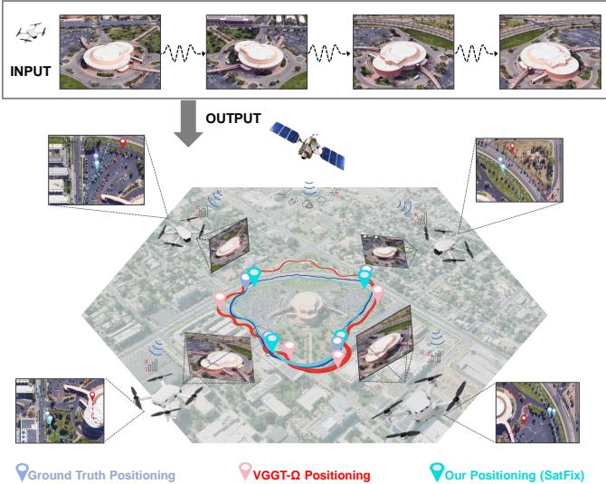
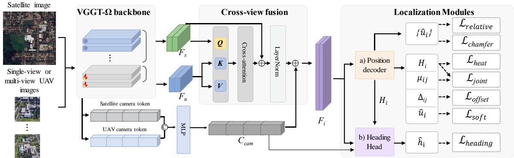
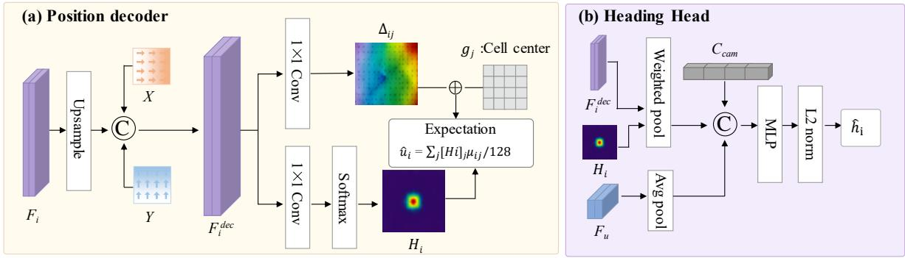
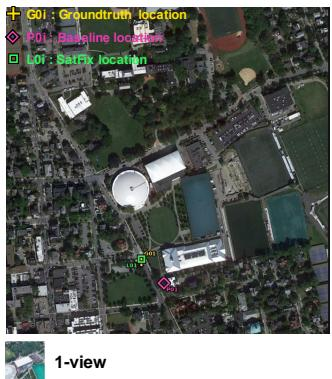
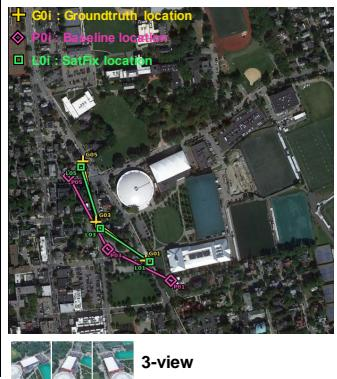
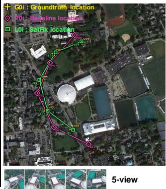
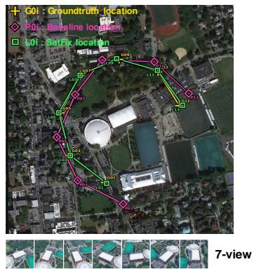

# SatFix: Absolute Visual Localization of UAVs in Satellite Maps from a Single Oblique Image

Jiarui Zeng1,2, Kun Shi1,2, Chiman Vong1,2 and Zhedong Zheng1,2

Abstract— We study absolute metric UAV localization within a provided geo-referenced satellite region: recovering continuous map position and viewing heading from a single oblique image, or a short clip of multiple views. Existing cross-view geolocalization methods retrieve the most similar satellite tile from a gallery and report Recall@K. However, retrieval depends on gallery sampling, carries no heading estimate, and returns a tile index rather than a continuous coordinate. To this end, we propose SatFix, a feed-forward UAV–satellite localization framework built on VGGT-Ω: satellite-grid features act as queries that aggregate UAV visual evidence, and two lightweight heads regress a 3-DoF pose in the satellite-map frame, i.e., continuous 2D position and heading. Unlike reconstruction-based pipelines, SatFix needs no explicit 3D map, rendered bird’s-eye image, or auxiliary sensor. A single model supports single- and multi-view inputs, with trajectory constraints applied during multi-view training. To enable metric evaluation, we introduce University-Metric, in which satellite imagery is re-collected over a region up to 10.7× longer on a side (≈ 114× the ground area) than the original University-1652 tiles, with continuous position and heading labels of the original UAV tours. With one UAV view, SatFix localizes 52.08% of test frames within 50 m and 17.34% within 10 m, with a median position error of 45.66 m and a median heading error of 20.81◦. Inference takes less than 0.1 seconds per single-view query on an NVIDIA RTX 4090; SatFix directly predicts in the geo-referenced satellitemap frame without test-time pose alignment. In the controlled multi-view evaluation, using nine UAV views further reduces the median position error to 21.96 m and the median heading error to 8.73◦. Against a fine-tuned VGGT-Ω baseline, SatFix lowers the median position error by 34.0% and the nine-view median heading error from 25.43◦ to 8.73◦.

## I. INTRODUCTION

Given the satellite map and what the camera sees, a skilled operator can infer the UAV position. In this work, we study Absolute Metric UAV Localization based on visual inputs. Given either a single oblique UAV image or a short clip of several views, plus one geo-referenced RGB satellite crop of a known operating region, we aim to recover the continuous position and viewing heading of the UAV camera in the satellite map (see Fig. 1). Yet we face two challenges: (1) existing benchmarks rarely combine oblique UAV views with a large regional satellite reference; and (2) efficient feedforward methods for this setting remain under-explored.

For the first challenge, most existing benchmarks cast localization as retrieval from a gallery of geo-tagged satellite tiles [1]–[3] and report Recall@K. The satellite references of these benchmarks span only ∼118–120 m on a side (Table I); a tile index encodes neither a continuous position nor a heading. Other benchmarks [4]–[6] do cover a larger extent, but these datasets acquire the UAV imagery at a nearnadir view, where a top-down frame and the reference crop show nearly the same scene; the task then loses much of the cross-view difficulty associated with forward-looking oblique UAV observations. We therefore study regional localization under a coarse geographic prior, where the UAV is known to lie within a provided geo-referenced satellite region rather than an unconstrained global search space. To support metric evaluation at region scale with oblique views, we introduce University-Metric, a benchmark derived from the University-1652 UAV tours with a location-level train/validation/test split. We re-collect the satellite map over a region up to 10.7× longer on a side (≈ 114× the ground area) than the original per-building crops and inherit the tours’ continuous position and heading labels. The benchmark contains 83,160 UAV frames from 1,540 locations, split by location into 631 training, 70 validation, and 839 test locations.

  
Fig. 1: Task motivation. When GNSS is unavailable, e.g., in urban canyons or under dense canopy, absolute metric UAV localization can use onboard vision. Given a single UAV view or a short clip of multiple views as input, the model outputs a position and a heading on a geo-referenced satellite map. Top: the UAV clip input and the satellite map. Bottom: ground-truth (blue), VGGT-Ω zeroshot (red), and SatFix (cyan) trajectories.

For the second challenge, we propose SatFix, a feedforward framework that anchors geometric representations to the satellite coordinate frame. Specifically, satellite-grid features serve as queries and UAV features serve as keys and values in cross-attention to estimate continuous position and heading. A single model supports both single-view and multi-view inputs. In summary, our contributions are:

• Region-scale oblique benchmark. Existing geolocalization benchmarks retrieve from a gallery whose tiles span only ∼118 m on a side, or capture near-nadir frames that nearly duplicate the reference crop. We introduce University-Metric, which pairs oblique UAV imagery with a regional satellite map whose default crop is 5.3× longer on a side than University-1652 tiles and whose largest crop is 10.7× longer, and per-frame position–heading labels, split by location.

• Grounding by cross-attention. We propose SatFix, which forgoes scene reconstruction and tile retrieval: satellitegrid features query UAV features through a single crossattention, and two light heads decode a 3-DoF pose on top of a pretrained VGGT-Ω backbone, without a 3D map, auxiliary sensor, or test-time alignment.

• Accuracy and efficiency. Our SatFix localizes 52.08% of single-view frames within 50 m (median 45.66 m), and, with nine views, reaches 21.96 m median position and 8.73◦ median heading, all in one forward pass under 0.1 s per query on a single RTX 4090, faster than WildNav and Reloc3r.

## II. RELATED WORK

Retrieval-based Cross-view Geo-localization. Cross-view geo-localization commonly matches a query image against a geo-tagged aerial or satellite gallery. Recent methods improve retrieval through compressed map representations [10], multimodal fusion [11], local feature aggregation [12], [13], temporal consistency [14], and semantic mapping [15]. In the UAV domain, University-1652 establishes drone-satellite cross-view retrieval [1] and is extended to varying weather conditions [16], while SUES-200 and DenseUAV further study altitude variation and densely sampled low-altitude positioning [2], [7]. Sample4Geo, MFRGN, and DMNIL improve hard-negative learning, multi-scale representation, and label-efficient training, while more recent extensions incorporate language guidance, adverse-weather robustness, scale adaptation, and video reasoning [3], [17]–[22]. Despite these advances, the final geographic estimate remains associated with a retrieved gallery item and therefore depends on gallery sampling density.

Metric UAV Geo-localization. A complementary line of work moves beyond image-level retrieval toward explicit metric localization. Recent approaches study satelliteassisted matching, UAV geo-localization, satellite–thermal alignment, and visual relative localization for aerial swarms [23]–[27]. Other map-based localization systems exploit active viewpoint selection, LiDAR heat-map alignment, event– depth registration, or lightweight topo-metric maps [28]– [31]. Bearing-UAV jointly estimates position and heading from unaligned UAV–satellite observations [32], while AnyVisLoc studies low-altitude multi-view localization [33] and WildNav targets GNSS-free localization against opensource maps [34]. UAV-VisLoc and AerialVL further provide regional maps, frame-level geographic annotations, or aerial sequences for map-based evaluation [4], [6]. In contrast, we take a provided geo-referenced RGB satellite region together with one or a few oblique UAV views to predict a continuous map-frame $( x , y , \theta )$ directly, without relying on a dense 3D map or long-horizon tracking. Because the reference region is geo-referenced, position errors are reported in meters in the metric frame of the satellite map rather than in a learned or up-to-scale coordinate system.

Geometry-aware Visual Localization. Recent visual localization methods leverage uncertainty-aware neural radiance fields, Gaussian-splatting pose refinement, compact neural implicit maps, geometry-aware local features, and efficient hierarchical retrieval [35]–[40]. VGGT and VGGT-Ω learn feed-forward camera and scene geometry from a variable number of views [41], [42], while Reloc3r directly targets generalizable relative camera pose estimation [43]. University-Pose (Uni-CVGL) reconstructs a local UAV scene before satellite retrieval and pose refinement [8]. In contrast, SatFix directly grounds geometric features in the provided satellite coordinate frame, avoiding explicit scene reconstruction and candidate-map retrieval. CloudTrack [44] and CGTrack [45] address the distinct task of UAV target tracking rather than absolute UAV localization.

## III. UNIVERSITY-METRIC: DATASET AND TASK SETTING

Benchmark setting and task. We construct University-Metric from the UAV tours and trajectory/KML metadata of University-1652 [1]. The UAV views are rendered from Google Earth imagery following the corresponding KML camera trajectories, while the regional satellite references are re-collected at larger spatial extents. The largest satellite crops cover approximately 114× the ground area of the original per-building tiles (the default crop used in all main experiments spans 630 m on a side, i.e., 28× the ground area of the original tiles). As summarized in Table I, earlier benchmarks primarily formulate UAV geo-localization as gallery retrieval [1], [2], [7], whereas more recent datasets provide regional maps and frame-level geographic annotations for direct localization [4], [6]. University-Metric provides continuous position and heading labels for every UAV frame, enabling metric localization from either a single UAV view or a short clip. We will publicly release the complete University-Metric benchmark, including satellite imagery, frame-level annotations, and the official train/validation/test splits.

Let Is denote a geo-referenced satellite map and $I _ { i } ^ { d }$ the i-th UAV image. Given one or more UAV images, we formulate the task as

$$
( I ^ { s } , \{ I _ { i } ^ { d } \} _ { i = 1 } ^ { T } )  \{ ( \hat { x } _ { i } , \hat { y } _ { i } , \hat { \theta } _ { i } ) \} _ { i = 1 } ^ { T } .\tag{1}
$$

Each drone frame has its own absolute position and heading target. Unlike gallery retrieval, which returns a discrete reference item, our task predicts a continuous coordinate within the provided geo-referenced region. Here, absolute refers to the satellite coordinate frame rather than an unbounded geographic search space, and T is the number of

<table><tr><td>Benchmark</td><td>Input</td><td># UAV Imgs.</td><td>Sat. Extent (m)</td><td>UAV Viewpoint</td><td>Sat. Ref.</td><td>Loc. Label</td><td>Task</td></tr><tr><td>University-1652 [1]</td><td>Single</td><td>89.2K</td><td>118</td><td>Oblique</td><td>Gallery</td><td>ID</td><td>Retrieval</td></tr><tr><td>SUES-200 [7]</td><td>Single</td><td>40.0K</td><td>N/A</td><td>Oblique</td><td>Gallery</td><td>ID</td><td>Retrieval</td></tr><tr><td>DenseUAV [2]</td><td>Single</td><td>9.1K</td><td>120</td><td>Nadir</td><td>Gallery</td><td>Coord.</td><td>Retrieval</td></tr><tr><td>UAV-VisLoc [4]</td><td>Single</td><td>6.7K</td><td>11000</td><td>Nadir</td><td>Regional map</td><td>Coord.+Heading</td><td>Localization</td></tr><tr><td>GeoVINS [5]</td><td>Sequence</td><td>18,361</td><td>50000</td><td>Nadir</td><td>Regional map</td><td>Coord.+Heading</td><td>Localization</td></tr><tr><td>AerialVL [6]</td><td>Single/Sequence</td><td>18.4K</td><td>300</td><td>Nadir</td><td>Regional map</td><td>Coord.</td><td>Retrieval/Localization</td></tr><tr><td>University-Pose [8]</td><td>Single/Sequence</td><td>N/A</td><td>118</td><td>Oblique</td><td>Gallery</td><td>Coord.+Heading</td><td>Retrieval/Localization</td></tr><tr><td>KoSim-GL [9]</td><td>Single/Sequence</td><td>2.45M</td><td>N/A</td><td>Nadir/Oblique</td><td>Gallery</td><td>ID+Coord.</td><td>Retrieval</td></tr><tr><td>University-Metric (Ours)</td><td>Single/Sequence</td><td>83.2K</td><td>473/630/1261</td><td>Oblique</td><td>Regional map</td><td>Coord.+Heading</td><td>Localization</td></tr></table>

TABLE I: Comparison of UAV geo-localization benchmarks and released evaluation data. Sat. Extent reports approximate ground side lengths of satellite references in meters; regional-map extents may vary by location. The AerialVL image count refers to its visual place recognition subset. GeoVINS denotes its released evaluation data. N/A denotes information not reported in the corresponding source.

UAV views, i.e., UAV images with their own camera poses $( T ~ = ~ 1$ recovers the single-view setting). The operating region is assumed to be specified by a coarse geographic prior. In our benchmark, this prior defines a fixed satellitemap center for each location, while the map extent is treated as a controlled variable (Table VI). We denote the groundtruth and predicted positions in the resized satellite crop by $\mathbf { p } _ { i } = ( x _ { i } , y _ { i } ) ^ { \top }$ and $\hat { \mathbf { p } } _ { i } = ( \hat { x } _ { i } , \hat { y } _ { i } ) ^ { \top }$ , respectively.

Annotations and coordinate representation. Each location contains 54 UAV images sampled every 0.5 s, while the trajectory records are sampled every 0.1 s. Each UAV frame corresponds directly to a trajectory record at the same timestamp, so no temporal interpolation or nearest-neighbor timestamp matching is required. The camera positions are then projected into the satellite coordinate frame, while the viewing heading is taken from the corresponding KML LookAt metadata. Specifically, the KML heading field specifies the horizontal viewing azimuth of the virtual UAV camera, with $0 ^ { \circ }$ pointing North and angles increasing clockwise. Throughout this paper, heading refers to this horizontal camera-viewing azimuth rather than the direction of motion along the trajectory. We split University-Metric by source location identity into 631 training, 70 validation, and 839 test locations, corresponding to 34,074, 3,780, and 45,306 UAV frames, respectively. No UAV tour or source location identity is shared across the three splits. For each location, we construct a single $1 0 2 4 \times 1 0 2 4$ satellite crop centered at the geo-referenced map center specified by the corresponding KML metadata. The same satellite crop is shared by all 54 UAV frames from that location and is not recentered for individual frames. For each location, the metric scale is derived from the corresponding satellite KML geometry. Specifically, the ground width is computed from the KML range and horizontal field of view, and divided by the original satellite-image width to obtain meters per pixel. In the default setting, this is approximately 0.616 m/pixel, corresponding to a $1 0 2 4 \times 1 0 2 4$ crop of about 630 m on a side. We resize satellite and UAV images to $5 1 2 \times 5 1 2 ,$ and we sample short clips within the same location. We map the geographic positions into the resized $5 1 2 \times 5 1 2$ satellitecrop pixel coordinate system using the tile’s geo-referencing transform. The heading is defined as a bearing in the local horizontal plane rather than as an image-plane direction.

We order the two vector components as (North, East) and encode the heading as $\mathbf { h } _ { i } = ( \cos \theta _ { i } , \sin \theta _ { i } ) ^ { \top } = ( h _ { \mathrm { N } } , h _ { \mathrm { E } } ) ^ { \top } .$ where the two components are the north and east direction cosines. This unit-vector encoding is continuous across the $0 ^ { \circ } / 3 6 0 ^ { \circ }$ boundary. Angles are converted to radians for the trigonometric encoding.

Evaluation protocol and satellite extent. For each test frame, we map the predicted and ground-truth positions back to the original satellite crop, compute their Euclidean pixel distance, and convert it to meters using the locationspecific meters-per-pixel scale derived from the corresponding satellite KML metadata. We denote the resulting metric position error by $e _ { i }$ and report its mean and median, together with the success rate SR@τ = meani $1 [ e _ { i } \ \leq \ \tau ]$ for τ ∈ {10, 25, 50, 100} m. We evaluate heading using the minimum circular angular difference. Beyond the accuracy protocol, we collect the satellite reference at three physical extents while keeping the network input resolution fixed. Square crops of 768, 1024, and 2048 pixels span approximately 473, 630, and 1261 m on a side and are all resized to $5 1 2 \times 5 1 2$ . We first evaluate the model trained on 1024-pixel crops at all three crop sizes without retraining. We then train separate models on 768- and 2048-pixel crops and evaluate each at the corresponding crop size, using the same test locations.

## IV. METHOD

As shown in Fig. 2, SatFix first matches UAV visual features to the satellite grid, then decodes the matched features into continuous positions and headings.

## A. Geometry-grounded Localization

Cross-view feature matching. We use a pretrained VGGT-Ω backbone [42] to jointly encode the satellite and UAV images. The resulting representations provide complementary visual and geometry-aware information across the UAV views. To associate each UAV view with a location in the map, satellite-grid features query the corresponding UAV features through cross-attention. We fuse the matched features with the original satellite features and a cameraconditioning vector derived from the camera tokens of the satellite and UAV inputs. The fused representation retains the satellite-grid layout and provides view-specific evidence for localization.

  
© ConcatenationElement-wise sum Trainable Frozen Feature flow Calculation flow Fig. 2: Overview of SatFix. The satellite image and multiple UAV views are jointly encoded by the VGGT-Ω backbone. Satellite-grid features query UAV visual features through cross-attention, after which a coordinate-aware decoder predicts a spatial distribution over continuous position hypotheses. The heading branch estimates a unit heading vector for each UAV view.

Coordinate-aware decoding. Given the fused features, the decoder upsamples them and incorporates spatial coordinate channels following CoordConv [46]. The coordinate channels give each grid cell an explicit map position alongside its visual features. For UAV view $i ,$ the decoder predicts a spatial probability map $H _ { i }$ and a two-dimensional offset at each cell. The heatmap is normalized by spatial softmax, so the entries of $H _ { i }$ sum to one.

## B. Position and Heading Modeling

Position estimation. Each cell represents a candidate UAV location. Adding its predicted offset to the cell center gives a continuous position hypothesis $\pmb { \mu } _ { i j }$ , where j indexes the output cells. At inference, we select the hypothesis with the highest probability in $H _ { i }$ and convert its output-grid coordinates to the input satellite crop, obtaining pˆi. For differentiable position supervision, we use the expectation $\mathbb { E } _ { j \sim H _ { i } } [ \pmb { \mu } _ { i j } ]$ during training. We denote its crop-normalized form by uˆi and the corresponding normalized ground truth by ui.

Heading estimation. The same probability map guides heading prediction. We use $H _ { i }$ to pool the localization features, giving greater weight to likely UAV locations. The pooled features are combined with the camera-conditioning vector and the globally pooled UAV features. An MLP maps this representation to a two-dimensional vector, which is normalized to the unit heading vector $\hat { \mathbf { h } } _ { i }$ . We recover the final bearing as $\hat { \theta } _ { i } = \mathrm { a t a n 2 } ( \hat { h } _ { \mathrm { E } } , \hat { h } _ { \mathrm { N } } )$ , using the (North, East) component ordering defined in Section III.

Optimization objectives. To jointly train the heatmap and offsets, we give greater weight to continuous position hypotheses near the ground truth. The target is converted to output-grid coordinates, giving the joint position loss

$$
\mathcal { L } _ { \mathrm { j o i n t } } = - \log \left[ \sum _ { j } [ H _ { i } ] _ { j } \exp \left( - \frac { \| \pmb { \mu _ { i j } } - \mathbf { p } _ { i } / 4 \| _ { 2 } ^ { 2 } } { 4 . 5 } \right) \right] .\tag{2}
$$

Because the same distance term weights the heatmap score, a cell contributes strongly only when its offset is also accurate, thereby encouraging sub-cell precision at high-scoring locations. We additionally supervise the heatmap, offsets, and expected position with $\mathcal { L } _ { \mathrm { h e a t } } , \mathcal { L } _ { \mathrm { o f f s e t } }$ , and $\mathcal { L } _ { \mathrm { { s o f t } } }$ , respectively. These auxiliary terms stabilize position learning, and the combined objective is

$$
\mathcal { L } _ { \mathrm { p o s } } = \mathcal { L } _ { \mathrm { j o i n t } } + \mathcal { L } _ { \mathrm { h e a t } } + \mathcal { L } _ { \mathrm { o f f s e t } } + \mathcal { L } _ { \mathrm { s o f t } } .\tag{3}
$$

For heading, we compare the predicted unit vector with the ground-truth vector hi using cosine distance:

$$
{ \mathcal { L } } _ { \mathrm { h e a d i n g } } = 1 - { \hat { \mathbf { h } } } _ { i } ^ { \top } \mathbf { h } _ { i } .\tag{4}
$$

This representation avoids the discontinuity between $0 ^ { \circ }$ and $3 6 0 ^ { \circ }$ . For multiple UAV views, we further supervise the trajectory using normalized positions. The relativedisplacement loss compares the predicted and ground-truth displacement between consecutive views:

$$
\mathcal { L } _ { \mathrm { r e l a t i v e } } = \mathrm { S m o o t h L 1 } \big ( \hat { \mathbf { u } } _ { i + 1 } - \hat { \mathbf { u } } _ { i } , \mathbf { u } _ { i + 1 } - \mathbf { u } _ { i } \big ) .\tag{5}
$$

To also constrain the overall spatial layout, we apply symmetric Chamfer distance between the predicted and ground-

truth point sets:

$$
\mathcal { L } _ { \mathrm { c h a m f e r } } = \frac { 1 } { 2 } \times \mathrm { m e a n } _ { i } \bigg [ \operatorname* { m i n } _ { j } \| \hat { { \bf u } } _ { i } - { \bf u } _ { j } \| _ { 2 } + \operatorname* { m i n } _ { j } \| { \bf u } _ { i } - \hat { { \bf u } } _ { j } \| _ { 2 } \bigg ] .\tag{6}
$$

The mean and nearest-neighbor searches cover all views in the clip. Unlike the relative-displacement loss, this term compares the point sets without using their temporal order.

The final supervised objective combines the position, heading, and trajectory terms:

$$
{ \mathcal { L } } _ { \mathrm { t o t a l } } = { \mathcal { L } } _ { \mathrm { p o s } } + \lambda _ { \mathrm { h e a d } } { \mathcal { L } } _ { \mathrm { h e a d i n g } } + \lambda _ { \mathrm { r e l } } { \mathcal { L } } _ { \mathrm { r e l a t i v e } } + \lambda _ { \mathrm { c h a m } } { \mathcal { L } } _ { \mathrm { c h a m f e r } }\tag{7}
$$

The position coefficient is fixed to one. Position and heading losses are averaged over views, relative-displacement losses over consecutive pairs, and the combined loss over the batch. The trajectory terms apply only when $T > 1$ . Implementation and loss settings are detailed in Section V.

## V. EXPERIMENT

All experiments are conducted on University-Metric using the location-level train/validation/test split defined in Section III. Unless stated otherwise, the satellite crop is the default 630 m reference.

Implementation details and loss settings. We initialize the visual geometry backbone from the released VGGT-Ω 1B-512 checkpoint [42]. The last two pairs of frame and inter-frame attention blocks, together with the proposed localization and heading modules, remain trainable. We train the full model with AdamW for 30 epochs, sampling 12,000 examples per epoch with a batch size of 1 and eight step gradient accumulation. The learning rates for the new heads and pretrained backbone are $2 \times 1 0 ^ { - 4 }$ and $5 \times 1 0 ^ { - 6 }$ respectively, with a 5% linear warmup followed by cosine decay. During training, we sample the number of UAV views from $T \in \{ 1 , 3 , 5 , 7 , 9 \}$ . Training takes about 40 hours on a 24-GB RTX 4090, and we select the checkpoint based on validation localization and heading performance. The default loss weights are $\lambda _ { \mathrm { h e a d } } = 0 . 2 5 , \lambda _ { \mathrm { r e l } } = 0 . 2 5$ and $\lambda _ { \mathrm { c h a m } } ~ = ~ 0 . 1 0$ . These coefficients are selected using the validation locations only and are then fixed for all test-set evaluations. The loss-weight study reported below is used only to characterize sensitivity and is not used for hyperparameter selection. In the multi-view setting, we sample UAV frames from the same 839 test locations and arrange them in temporal order. Inputs with more views retain the frames used in inputs with fewer views. We also evaluate a single-view reference using the same sampling procedure. Satellite and UAV inputs are resized to 512×512, and the decoder outputs a $1 2 8 \times 1 2 8$ grid. In Eq. (2), $\mathbf { p } _ { i } / 4$ converts the input-crop target to output-grid coordinates; the Gaussian bandwidth is 1.5 cells, giving the denominator 4.5. The expected grid position is divided by 128 to obtain $\hat { \mathbf { u } } _ { i } .$ with target $\mathbf { u } _ { i } = \mathbf { p } _ { i } / 5 1 2$ . At inference, grid positions are multiplied by four to recover input-crop coordinates. The cross-attended features are added to the satellite features and layer-normalized before adding the broadcast cameraconditioning vector. This vector is produced by an MLP from concatenated satellite and UAV camera tokens. The decoder uses coordinate channels in $[ - 1 , 1 ] ^ { 2 }$ and 0.5 tanh(·) for offsets bounded within half a grid cell per component. Auxiliary position losses consist of cross-entropy with a Gaussian heatmap target, SmoothL1 regression of the offset at the ground-truth cell, and SmoothL1 regression of the normalized expected position. We will also release the training and inference code, baseline adaptations, and evaluation scripts to facilitate reproducibility.

<table><tr><td>Method</td><td colspan="2">Localization Error (m)</td><td colspan="4">Localization Success (%)</td></tr><tr><td></td><td>Mean</td><td>Median</td><td>@10 m @25m @50m @100m</td><td></td><td></td><td></td></tr><tr><td colspan="7">Retrieval-based methods</td></tr><tr><td>University-1652 baseline [1] 230.72</td><td></td><td>221.13</td><td>0.09</td><td>0.65</td><td>2.71</td><td>11.88</td></tr><tr><td>Sample4Geo [3]</td><td>171.12</td><td>141.28</td><td>0.08</td><td>0.57</td><td>2.78</td><td>21.13</td></tr><tr><td>MFRGN [17]</td><td>170.47</td><td>139.99</td><td>0.09</td><td>0.52</td><td>2.73</td><td>21.57</td></tr><tr><td>DMNIL [18]</td><td>165.24</td><td>134.95</td><td>0.09</td><td>0.50</td><td>2.54</td><td>21.84</td></tr><tr><td>DenseUAV [2]</td><td>163.63</td><td>141.69</td><td>0.06</td><td>0.32</td><td>1.42</td><td>14.95</td></tr><tr><td colspan="7">Localization-based methods</td></tr><tr><td>WildNav [34]</td><td>264.58</td><td>263.56</td><td>0.01</td><td>0.02</td><td>0.07</td><td>0.22</td></tr><tr><td>Reloc3r [43]</td><td>196.50</td><td>185.75</td><td>0.14</td><td>0.98</td><td>3.93</td><td>16.56</td></tr><tr><td>Bearing-UAV [32]</td><td>197.90</td><td>178.69</td><td>0.10</td><td>0.59</td><td>2.66</td><td>15.90</td></tr><tr><td>AnyVisLoc [33]</td><td>164.15</td><td>137.04</td><td>0.07</td><td>0.44</td><td>2.14</td><td>20.33</td></tr><tr><td>VGGT-Ω zero-shot [42]</td><td>212.64</td><td>196.49</td><td>0.43</td><td>3.28</td><td>15.20</td><td>30.10</td></tr><tr><td>VGGT-Ω fine-tuned [42]</td><td>88.15</td><td>69.17</td><td>5.93</td><td>22.43</td><td>40.58</td><td>61.74</td></tr><tr><td>SatFix</td><td>82.33</td><td>45.66</td><td>17.34</td><td>34.88</td><td>52.08</td><td>66.18</td></tr></table>

TABLE II: Single-view UAV–satellite metric localization on all 45,306 University-Metric test frames. All methods use the same location-level split and evaluation protocol; localization success is reported in percent.
<table><tr><td rowspan="2">Method</td><td rowspan="2">Views</td><td colspan="2">Position (m)</td><td colspan="2">Heading (°)</td><td colspan="4">SR (%)</td></tr><tr><td>Mean</td><td>Med.</td><td>Mean Med.</td><td></td><td>@10m</td><td></td><td></td><td>@25m @50m @100m</td></tr><tr><td>VGGT-Ω zero-shot</td><td>3</td><td></td><td>|270.98 232.94</td><td>41.04</td><td>27.61</td><td>0.40</td><td>3.54</td><td>15.53</td><td>30.43</td></tr><tr><td>VGGT-Ω zero-shot</td><td>5</td><td>304.04 252.35</td><td></td><td>40.32</td><td>23.82</td><td>0.45</td><td>4.15</td><td>16.83</td><td>31.87</td></tr><tr><td>VGGT-Ω zero-shot</td><td>7</td><td>311.26251.32</td><td></td><td>39.0422.76</td><td></td><td>0.73</td><td>4.58</td><td>18.81</td><td>33.92</td></tr><tr><td>VGGT-Ω zero-shot</td><td>9</td><td></td><td>319.01 253.69</td><td>39.0422.72</td><td></td><td>0.61</td><td>4.48</td><td>18.82</td><td>34.30</td></tr><tr><td>VGGT-Ω fine-tuned|</td><td>3</td><td>83.00</td><td>66.77</td><td>38.23</td><td>31.82</td><td>6.16</td><td>23.32</td><td>40.52</td><td>63.37</td></tr><tr><td>VGGT-Ω fine-tuned</td><td>5</td><td>80.21</td><td>66.83</td><td>37.40 29.53</td><td></td><td>6.82</td><td>25.79</td><td>42.36</td><td>64.24</td></tr><tr><td>VGGT-Ω fine-tuned</td><td>7</td><td>77.39</td><td>62.83</td><td>36.43 26.40</td><td></td><td>6.66</td><td>26.73</td><td>44.07</td><td>66.56</td></tr><tr><td>VGGT-Ω fine-tuned</td><td>9</td><td>76.68</td><td>61.73</td><td>36.39</td><td>25.43</td><td>6.70</td><td>26.94</td><td>44.48</td><td>66.55</td></tr><tr><td>SatFix</td><td>3</td><td>76.64</td><td>34.46</td><td>33.04</td><td>12.16</td><td>22.01</td><td>39.37</td><td>59.99</td><td>70.60</td></tr><tr><td>SatFix</td><td>5</td><td>66.65</td><td>28.98</td><td>29.64</td><td>10.01</td><td>25.84</td><td>46.08</td><td>65.65</td><td>74.42</td></tr><tr><td>SatFix</td><td>7</td><td>59.10</td><td>24.34</td><td>27.46</td><td>9.33</td><td>30.14</td><td>50.81</td><td>69.35</td><td>77.86</td></tr><tr><td>SatFix</td><td>9</td><td>56.12</td><td>21.96</td><td>26.56</td><td>8.73</td><td>32.15</td><td>53.26</td><td>70.43</td><td>78.65</td></tr></table>

TABLE III: Localization and heading estimation in the multi-view setting on University-Metric for $\bar { T ^ { \prime } } \in \ \{ 3 , 5 , 7 , 9 \}$ . Localization success is reported in percent.

Compared methods. We compare SatFix with representative retrieval-based and direct-localization approaches. The retrieval baselines are the University-1652 baseline [1], Sample4Geo [3], MFRGN [17], DMNIL [18], and DenseUAV [2]. For direct localization, we evaluate WildNav [34], Reloc3r [43], Bearing-UAV [32], and AnyVisLoc [33]. We evaluate VGGT-Ω [42] both zero-shot and after fine-tuning on our training split, to separate the gains of fine-tuning from those of our localization modules. For the zero-shot VGGT-Ω baseline, we use its stronger reference-plane projection: a robust reference plane is estimated from the satellite branch, and the predicted UAV camera center is projected onto this plane before being mapped to the satellite crop. This projection uses no test-set ground-truth correspondence or fitted similarity transform.

For a consistent comparison, we evaluate all methods using the same location-level train/validation/test split, satellite extent, coordinate transformation, and metric evaluator. Except for the zero-shot VGGT-Ω baseline, all baselines are fine-tuned on our training split. Retrieval methods extract overlapping satellite tiles of approximately 100×100 m with an approximately 10 m stride along each axis $( 5 5 \times 5 5 =$ 3025 candidates for the default crop) and return the center of the top-ranked tile, whereas direct-localization methods retain continuous position outputs, which we map into the same metric coordinate frame.

## A. Comparison with the State-of-the-Art Methods

We first evaluate single-view localization over all 45,306 test frames and report the results in Table II. As shown in Table II, SatFix achieves a mean error of 82.33 m and a median error of 45.66 m, with localization success rates of 17.34%, 34.88%, 52.08%, and 66.18% at 10, 25, 50, and 100 m, respectively. The fine-tuned VGGT-Ω baseline provides the strongest comparison, with a mean error of 88.15 m and a median error of 69.17 m. Relative to the fine-tuned VGGT-Ω baseline, SatFix reduces the median position error by 34.0%, from 69.17 m to 45.66 m, while also lowering the mean error from 88.15 m to 82.33 m.

To understand this gap, we consider the two baseline families. Retrieval accuracy depends on cross-view matching and gallery quantization. Direct localization removes the discrete output constraint, but still faces strong appearance and geometric differences between oblique UAV views and satellite imagery. For example, AnyVisLoc yields 164.15/137.04 m mean/median error, compared with 82.33/45.66 m for Sat-Fix, indicating that continuous prediction alone does not resolve these cross-view differences. Zero-shot VGGT-Ω yields mean/median position errors of 212.64/196.49 m. Finetuning substantially reduces these errors, and the proposed localization modules provide further improvements.

## B. Ablation Studies and Further Discussion

Multi-view setting. Table II reports the canonical singleview evaluation over all 45,306 test frames. For the controlled multi-view study, we instead construct nested frame sets using the same temporal sampling procedure for all view counts. We therefore report a separate T = 1 reference under this sampling protocol, which gives mean/median position errors of 212.38/194.10 m for zero-shot VGGT-Ω and $8 7 . 0 7 / 4 1 . 8 5$ m for SatFix. We then evaluate SatFix with increasing numbers of UAV views. Table III reports results for $T \in \{ 3 , 5 , 7 , 9 \}$ . Under this controlled sampling protocol, increasing the number of views from one to nine reduces the mean position error from 87.07 m to 56.12 m and the median position error from 41.85 m to 21.96 m. SR@10 m increases from 19.31% to 32.15%, while the median heading error decreases from $1 6 . 4 7 ^ { \circ }$ to 8.73◦. Thus, additional UAV views improve localization accuracy. The gains from additional UAV views diminish beyond five views, particularly in median heading error. The zero-shot VGGT-Ω baseline does not improve consistently as views are added, while its fine-tuned counterpart remains less accurate than SatFix for $T \in \{ 3 , 5 , 7 , 9 \}$

<table><tr><td>Configuration</td><td colspan="5">|XY Joint H-O Heading|Mean (m) Median (m) @10 m @100 m</td></tr><tr><td>CoordConv only</td><td rowspan="3">√ √</td><td>83.30</td><td>45.56</td><td>15.97</td><td>65.87</td></tr><tr><td>Joint H-O only</td><td></td><td>84.81 49.20</td><td>16.45</td><td>65.40</td></tr><tr><td>Heading only</td><td>√ 85.64</td><td>47.20</td><td>15.19</td><td>64.94</td></tr><tr><td rowspan="3">w/o CoordConv w/o Joint H–O w/o Heading</td><td>√ √</td><td>87.15</td><td>50.15</td><td>16.57</td><td>64.15</td></tr><tr><td>√</td><td>√ 82.80</td><td>47.85</td><td>15.97</td><td>65.81</td></tr><tr><td>√ √</td><td>84.71</td><td>48.66</td><td>17.08</td><td>65.32</td></tr><tr><td>Full SatFix</td><td> $\mid \checkmark$   $\checkmark$ </td><td> $\checkmark$ </td><td>82.33</td><td>45.66 17.34</td><td>66.18</td></tr></table>

TABLE IV: Component ablation on all 45,306 University-Metric test frames with single-view inputs. XY denotes coordinate channels, and Joint H–O denotes the joint heatmap–offset objective.

Effect of localization components. We next study how coordinate channels, the joint heatmap–offset objective, and heading supervision affect single-view localization through the component ablations in Table IV. Across the evaluated configurations, the full model achieves the lowest mean position error and the highest localization success rates. The coordinate-channel-only variant has a nearly identical median error (45.56 m vs. 45.66 m), while removing heading supervision changes SR@10 m only slightly (17.08% vs. 17.34%). With coordinate channels and heading supervision fixed, adding the joint position objective in Eq. (2) to the auxiliary heatmap, offset, and expected-position objectives reduces mean/median position error from 82.80/47.85 m to 82.33/45.66 m and increases SR@10 m from 15.97% to 17.34%. This controlled comparison is consistent with coupling spatial probability and sub-cell refinement within a single continuous-position objective.

Sensitivity to loss weights. We further study the sensitivity of SatFix to the three loss weights in Eq. (7). Starting from the fixed default configuration, we vary one coefficient at a time while keeping the position-loss coefficient equal to one and the remaining coefficients unchanged. Each configuration uses the same training procedure with $T \in \{ 1 , 3 , 5 , 7 , 9 \}$ and we report its single-view performance on the 45,306 test frames in Table V. Increasing $\lambda _ { \mathrm { { r e l } } }$ from 0.25 to 0.30 or 0.35 increases the mean position error from 82.33 m to 93.53 and 93.21 m, respectively. In contrast, varying $\lambda _ { \mathrm { c h a m } }$ over the tested range changes the mean position error only moderately, from 82.33 to 84.03 m. The median heading error is $2 0 . 5 7 ^ { \circ }$ at $\lambda _ { \mathrm { c h a m } } = 0 . 0 8$ and $2 0 . 8 1 ^ { \circ }$ at the default value of 0.10. We therefore regard the small differences among nearby configurations as sensitivity trends rather than precise rankings.

Effect of satellite extent. Beyond model components, we examine the effect of the satellite extent (Table VI). We vary the physical extent of the map while keeping the network input fixed at $5 1 2 \times 5 1 2$ . Without retraining, reducing the satellite extent from the default 630 m setting to 473 m decreases mean error from 82.33 m to 63.67 m. Increasing the extent to approximately 1261 m raises mean error to 199.15 m and reduces SR@50 m to 1.55%. To test whether training mitigates this performance loss, we also train and evaluate on matching crop sizes. Training on 2048-pixel crops reduces mean error from 199.15 m to 97.66 m. In contrast, on 768-pixel test crops, training on the same crop size does not outperform the model trained on 1024-pixel crops.

Mean error (m): VGGT-Ω 62.3 | SatFix 2.7  

Mean error (m): VGGT-Ω 53.2 | SatFix 11.4  

Mean error (m): VGGT-Ω 58.0 | SatFix 4.3  

Mean error (m): VGGT-Ω 55.6 | SatFix 4.6  
  
Fig. 3: Qualitative comparison of multi-view UAV–satellite localization on University-Metric. From one to seven UAV views, groundtruth locations are shown in yellow, predictions from the VGGT-Ω zero-shot baseline in magenta, and SatFix predictions in green. The UAV views used in each case are shown below the corresponding satellite map. The reported mean error is averaged over the displayed localization points within each example and is used only to summarize the qualitative result.

<table><tr><td rowspan=1 colspan=2>Loss Weight       Position (m)  Heading (°)λheadλrel  $\lambda _ { \mathrm { c h a m } }$  MeanMedian   Median</td></tr><tr><td rowspan=1 colspan=1>0.15  0.25  0.10</td><td rowspan=1 colspan=1>85.95  48.85     21.45</td></tr><tr><td rowspan=1 colspan=1>0.20  0.25  0.10</td><td rowspan=1 colspan=1>85.07  48.52     21.04</td></tr><tr><td rowspan=1 colspan=1>0.25  0.25  0.10</td><td rowspan=1 colspan=1>82.33  45.66     20.81</td></tr><tr><td rowspan=3 colspan=1>0.30  0.25  0.10</td><td rowspan=3 colspan=1>88.48  51.14     22.5</td></tr><tr><td rowspan=2 colspan=1>2.57</td></tr><tr><td rowspan=1 colspan=1>7</td></tr><tr><td rowspan=1 colspan=1>0.35  0.25  0.10</td><td rowspan=1 colspan=1>84.53  49.27     21.63</td></tr><tr><td rowspan=1 colspan=1>0.25  0.15  0.10</td><td rowspan=1 colspan=1>85.07  47.91     21.14</td></tr><tr><td rowspan=1 colspan=1>0.25  0.20  0.10</td><td rowspan=1 colspan=1>85.96  49.64     21.55</td></tr><tr><td rowspan=1 colspan=1>0.25  0.25  0.10</td><td rowspan=1 colspan=1>82.33  45.66     20.81</td></tr><tr><td rowspan=1 colspan=1>0.25  0.30  0.10</td><td rowspan=1 colspan=1>93.53  58.94     26.15</td></tr><tr><td rowspan=1 colspan=1>0.25 0.35  0.10</td><td rowspan=1 colspan=1>93.21  59.06     25.69</td></tr><tr><td rowspan=1 colspan=1>0.25  0.25  0.06</td><td rowspan=1 colspan=1>83.44  47.34     21.32</td></tr><tr><td rowspan=1 colspan=1>0.25  0.25  0.08</td><td rowspan=1 colspan=1>84.03  46.05     20.57</td></tr><tr><td rowspan=1 colspan=1>0.25  0.25  0.10</td><td rowspan=1 colspan=1>82.33  45.66     20.81</td></tr><tr><td rowspan=1 colspan=1>0.25  0.25  0.12</td><td rowspan=1 colspan=1>83.55  47.05     21.58</td></tr><tr><td rowspan=1 colspan=1>0.25 0.25  0.14</td><td rowspan=1 colspan=1>83.12  47.91     20.79</td></tr></table>

TABLE V: Loss-weight ablation on all 45,306 University-Metric test frames with single-view inputs. The position-loss coefficient is fixed to one; one coefficient is varied at a time while the others remain at their default values.

Qualitative comparison. Figure 3 visualizes localization with one, three, five, and seven UAV views. The satellite maps compare ground-truth UAV locations (yellow) with predictions from zero-shot VGGT-Ω (magenta) and SatFix (green), with the corresponding UAV inputs shown below.

Scope and limitations. The median position error of 21.96 m and median heading error of 8.73◦ at T = 9 suggest potential for regional position correction. The present experiments evaluate localization accuracy, not closed-loop navigation, integration with odometry, or UAV–UGV cooperative routing [47]. Position errors above 100 m remain in 33.82% of single-view predictions and 21.35% at T = 9. The evaluation assumes satellite coverage of the operating region, and robustness to map aging, seasonal changes, sensor shift, and incomplete maps remains to be tested. We further assume a coarse prior on the operating region, which bounds the search space to the provided crop; the heatmap probability is not calibrated, so the model does not yet signal when its estimate should be discarded; and the reported latency is measured on a desktop GPU, while deployment efficiency on embedded hardware remains to be evaluated.

<table><tr><td>Train Crop</td><td>Test Crop</td><td>Extent (m)</td><td>Mean (m)</td><td>Median (m)</td><td>SR@50 m (%)</td></tr><tr><td>1024</td><td>768</td><td>~473</td><td>63.67</td><td>36.94</td><td>62.57</td></tr><tr><td>1024</td><td>1024</td><td>~630</td><td>82.33</td><td>45.66</td><td>52.08</td></tr><tr><td>1024</td><td>2048</td><td>~1261</td><td>199.15</td><td>183.99</td><td>1.55</td></tr><tr><td>768</td><td>768</td><td>~473</td><td>99.94</td><td>59.75</td><td>43.69</td></tr><tr><td>2048</td><td>2048</td><td>~1261</td><td>97.66</td><td>85.24</td><td>15.79</td></tr></table>

TABLE VI: Effect of the satellite extent on University-Metric. Train Crop and Test Crop are the pixel sizes of the square satellite crop; Extent is the corresponding physical side length in meters. All crops are resized to $5 1 2 \times 5 1 2$

Inference time. We measure the complete single-view inference pipeline excluding only the one-time model loading cost. The timing includes input preprocessing, satellite/UAV encoding, localization, and coordinate decoding. We compare against four direct-localization baselines under the same timing scope. Bearing-UAV and AnyVisLoc take 0.037 and 0.052 s per query, respectively, while WildNav and Reloc3r take 0.250 and 0.382 s. SatFix takes less than 0.1 s per query and achieves lower mean and median position errors than these four baselines (Table II). Although slower than Bearing-UAV and AnyVisLoc, SatFix is faster than WildNav and Reloc3r.

## VI. CONCLUSION

We presented SatFix for absolute metric UAV localization from one or a few oblique UAV views within a georeferenced satellite region. We also introduced University-Metric, a benchmark derived from University-1652 with a location-level train/validation/test split, enlarged regional satellite references, and continuous position and viewingheading annotations. On University-Metric, SatFix grounds feed-forward geometric representations to the satellite coordinate frame and jointly estimates continuous position and heading using a single model for both single-view and multi-view inputs. Across the reported multi-view settings, SatFix achieves lower position and heading errors than both zero-shot and fine-tuned VGGT-Ω baselines, reaching 56.12/21.96 m mean/median position error and an 8.73◦ median heading error with nine views.

## REFERENCES

[1] Z. Zheng, Y. Wei, and Y. Yang, “University-1652: A multi-view multisource benchmark for drone-based geo-localization,” in ACM MM, 2020.

[2] M. Dai, E. Zheng, Z. Feng, L. Qi, J. Zhuang, and W. Yang, “Visionbased uav self-positioning in low-altitude urban environments,” IEEE Transactions on Image Processing, vol. 33, pp. 493–508, 2024.

[3] F. Deuser, K. Habel, and N. Oswald, “Sample4geo: Hard negative sampling for cross-view geo-localisation,” in ICCV, 2023.

[4] W. Xu, Y. Yao, J. Cao, Z. Wei, C. Liu, J. Wang, and M. Peng, “Uav-visloc: A large-scale dataset for uav visual localization,” arXiv:2405.11936, 2024.

[5] C. Li, M. He, C. Chen, J. Liu, X. Lyu, G. Huang, and Z. Meng, “GeoVINS: Geographic-visual-inertial navigation system for largescale drift-free aerial state estimation,” IEEE Transactions on Robotics, vol. 41, pp. 5835–5853, 2025.

[6] M. He, C. Chen, J. Liu, C. Li, X. Lyu, G. Huang, and Z. Meng, “Aerialvl: A dataset, baseline and algorithm framework for aerialbased visual localization with reference map,” IEEE Robotics and Automation Letters, vol. 9, no. 10, pp. 8210–8217, 2024.

[7] R. Zhu, L. Yin, M. Yang, F. Wu, Y. Yang, and W. Hu, “Sues-200: A multi-height multi-scene cross-view image benchmark across drone and satellite,” IEEE Transactions on Circuits and Systems for Video Technology, vol. 33, no. 9, pp. 4825–4839, 2023.

[8] H. Li, W. Yang, F. Xu, H. Tan, H. Zhang, S. Li, and G.-S. Xia, “Unifying uav cross-view geo-localization via 3d geometric perception,” arXiv:2604.01747, 2026.

[9] H. Ahn, C. Lee, S. Lee, H. Wi, I. Jang, and D.-G. Choi, “KoSim-GL: A large-scale simulation-based dataset for uav cross-view geolocalization in korean urban environments,” Electronics, vol. 15, no. 12, p. 2720, 2026.

[10] X. Cai, Y. Wang, Z. Huang, Y. Shao, and D. Li, “Voloc: Visual place recognition by querying compressed lidar map,” in ICRA, 2024.

[11] A. Garc´ıa-Hernandez, R. Giubilato, K. H. Strobl, J. Civera, and ´ R. Triebel, “Unifying local and global multimodal features for place recognition in aliased and low-texture environments,” in ICRA, 2024.

[12] J. Lin, Z. Zheng, Z. Zhong, Z. Luo, S. Li, Y. Yang, and N. Sebe, “Joint representation learning and keypoint detection for cross-view geo-localization,” IEEE Transactions on Image Processing, vol. 31, pp. 3780–3792, 2022.

[13] W. Song, R. Yan, B. Lei, and T. Okatani, “Globalizing local features: Image retrieval using shared local features with pose estimation for faster visual localization,” in ICRA, 2024.

[14] L. Suomela, J. Kalliola, H. Edelman, and J.-K. Kam¨ ar¨ ainen, “Placenav:¨ Topological navigation through place recognition,” in ICRA, 2024.

[15] C. Kassab, M. Mattamala, L. Zhang, and M. F. Fallon, “Languageextended indoor slam (lexis): A versatile system for real-time visual scene understanding,” in ICRA, 2024.

[16] T. Wang, Z. Zheng, Y. Sun, C. Yan, Y. Yang, and T.-S. Chua, “Multiple-environment self-adaptive network for aerial-view geolocalization,” Pattern Recognition, vol. 152, p. 110363, 2024.

[17] Y. Wang, J. Zhang, R. Wei, W. Gao, and Y. Wang, “Mfrgn: Multi-scale feature representation generalization network for ground-to-aerial geolocalization,” in ACM MM, 2024.

[18] Z. Chen, Z.-X. Yang, H.-J. Rong, and G. Li, “Without paired labeled data: End-to-end self-supervised learning for drone-view geolocalization,” IEEE Transactions on Neural Networks and Learning Systems, 2026.

[19] M. Chu, Z. Zheng, W. Ji, T. Wang, and T.-S. Chua, “Towards natural language-guided drones: Geotext-1652 benchmark with spatial relation matching,” in ECCV, 2024.

[20] J. Wen, H. Yu, and Z. Zheng, “Weatherprompt: Multi-modality representation learning for all-weather drone visual geo-localization,” in NeurIPS, 2025.

[21] Q. Chen, B. Zheng, T. Wang, R. Lu, Y. Liu, and Z. Zheng, “Scaleadaptive uav geo-localization via height-aware partition learning,” in ACM MM, 2026.

[22] H. Ju, S. Huang, S. Liu, and Z. Zheng, “Video2bev: Transforming drone videos to bevs for video-based geo-localization,” in ICCV, 2025.

[23] X. Guo, H. Peng, J. Hu, H. Bao, and G. Zhang, “From satellite to ground: Satellite assisted visual localization with cross-view semantic matching,” in ICRA, 2024.

[24] X. Zhang, S. Zhao, Y. Zhang, F. Ge, B. Zhao, and Y. Zhang, “Apa-bi: Adaptive partition aggregation and bidirectional integration for uavview geo-localization,” in ICRA, 2025.

[25] H. Zhou, Y. Zhang, T. Huang, F. Ge, M. Qi, X. Zhang, and Y. Zhang, “Jrn-geo: A joint perception network based on rgb and normal images for cross-view geo-localization,” in ICRA, 2025.

[26] J. Xiao and G. Loianno, “Uasthn: Uncertainty-aware deep homography estimation for uav satellite-thermal geo-localization,” in ICRA, 2025.

[27] M. Kˇr´ızek, M. Vrba, A. B. Kula ˇ s, S. Bogdan, and M. Saska, “Bio-ˇ inspired visual relative localization for large swarms of uavs,” in ICRA, 2024.

[28] M. Hanlon, B. Sun, M. Pollefeys, and H. Blum, “Active visual localization for multi-agent collaboration: A data-driven approach,” in ICRA, 2024.

[29] X. Wu, J. Xu, P. Hu, G. Wang, and H. Wang, “Lhmap-loc: Crossmodal monocular localization using lidar point cloud heat map,” in ICRA, 2024.

[30] K. Chen, J. Zhang, and F. Fraundorfer, “Evloc: Event-based visual localization in lidar maps via event-depth registration,” in ICRA, 2025.

[31] J. Jiao, J. He, C. Liu, S. Aegidius, X. Hu, T. Braud, and D. Kanoulas, “Litevloc: Map-lite visual localization for image goal navigation,” in ICRA, 2025.

[32] K. Liu, H. Zhou, R. Xu, P. Wang, M. Song, and H. Zhang, “Beyond matching to tiles: Bridging unaligned aerial and satellite views for vision-only uav navigation,” arXiv:2603.22153, 2026.

[33] Y. Ye, X. Teng, S. Chen, L. Liu, K. Wang, X. Song, and Z. Li, “Exploring the best way for uav visual localization under low-altitude multi-view observation condition: A benchmark,” in CVPR Findings, 2026.

[34] M.-M. Gurgu, J. P. Queralta, and T. Westerlund, “Vision-based gnssfree localization for uavs in the wild,” arXiv:2210.09727, 2022.

[35] L. Chen, W. Chen, R. Wang, and M. Pollefeys, “Leveraging neural radiance fields for uncertainty-aware visual localization,” in ICRA, 2024.

[36] Y. Cheng, J. Jiao, Y. Wang, and D. Kanoulas, “Logs: Visual localization via gaussian splatting with fewer training images,” in ICRA, 2025.

[37] Z. Niu, Z. Tan, J. Zhang, X. Yang, and D. Hu, “Hgsloc: 3dgs-based heuristic camera pose refinement,” in ICRA, 2025.

[38] H. Zhai, B. Zhao, H. Li, X. Pan, Y. He, Z. Cui, H. Bao, and G. Zhang, “Neuraloc: Visual localization in neural implicit map with dual complementary features,” in ICRA, 2025.

[39] Y. Liu, W. Lai, Z. Zhao, Y. Xiong, J. Zhu, J. Cheng, and Y. Xu, “Liftfeat: 3d geometry-aware local feature matching,” in ICRA, 2025.

[40] C. Liu, J. Jiao, H. Huang, Z. Ma, D. Kanoulas, and T. Braud, “Air-hloc: Adaptive retrieved images selection for efficient visual localisation,” in ICRA, 2025.

[41] J. Wang, M. Chen, N. Karaev, A. Vedaldi, C. Rupprecht, and D. Novotny, “Vggt: Visual geometry grounded transformer,” in CVPR, 2025.

[42] J. Wang, M. Chen, S. Zhang, N. Karaev, J. Schonberger, P. Labatut,¨ P. Bojanowski, D. Novotny, A. Vedaldi, and C. Rupprecht, “VGGT-Ω,” in CVPR, 2026.

[43] S. Dong, S. Wang, S. Liu, L. Cai, Q. Fan, J. Kannala, and Y. Yang, “Reloc3r: Large-scale training of relative camera pose regression for generalizable, fast, and accurate visual localization,” in CVPR, 2025.

[44] Y. Blei, M. Krawez, N. Nilavadi, T. K. Kaiser, and W. Burgard, “CloudTrack: Scalable UAV tracking with cloud semantics,” in ICRA, 2025.

[45] W. Li, X. Liu, H. Fan, and L. Zhang, “CGTrack: Cascade gating network with hierarchical feature aggregation for UAV tracking,” in ICRA, 2025.

[46] R. Liu, J. Lehman, P. Molino, F. P. Such, E. Frank, A. Sergeev, and J. Yosinski, “An intriguing failing of convolutional neural networks and the coordconv solution,” in NeurIPS, vol. 31, 2018.

[47] M. S. Mondal, S. Ramasamy, R. Rownak, L. Russo, J. D. Humann, J. M. Dotterweich, and P. Bhounsule, “Risk-aware energy-constrained UAV-UGV cooperative routing using attention-guided reinforcement learning,” in ICRA, 2025.