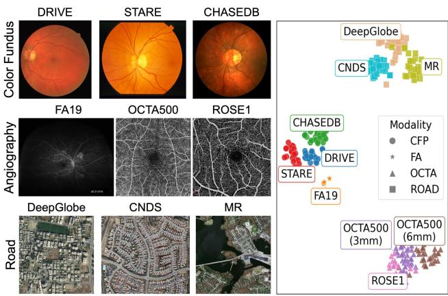
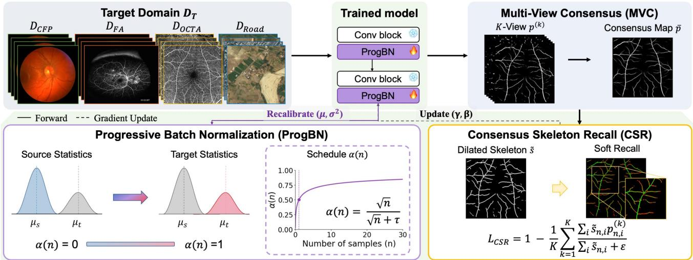
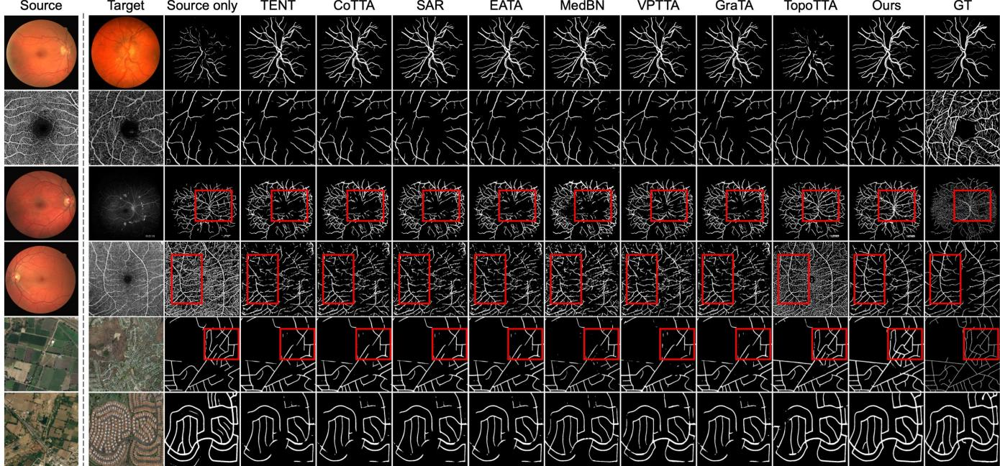
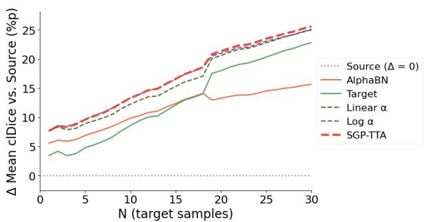
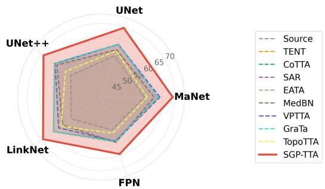
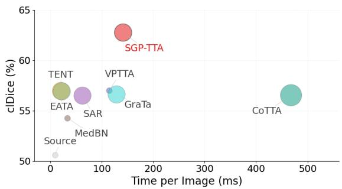

# Skeleton-Guided Progressive Test-Time Adaptation for Thin Curvilinear Structures

Boa Jang1,2,\*, JunGyu Lee3,\*,‡, Gwanho Lee4, Jinwook Choi1,2, Young-Gon Kim2,†

1Seoul National University 2Seoul National University Hospital 3Yonsei University 4Korea University

## Abstract

Accurate segmentation of thin curvilinear structures is vital for various real-world applications, from vessel analysis to road extraction. Yet their intricate geometry makes even minor pixel-wise errors enough to break the global topology, and this structural fragility turns severe domain shifts into catastrophic failures. The dificulty is most acute under cross-modality gaps, where the imaging process itself difers fundamentally between source and target. While test-time adaptation (TTA) ofers a practical source-free remedy, existing methods adapt feature statistics and confidence, neither of which constrains connectivity, and thus degrade under such extreme gaps. To address this, we propose Skeleton-Guided Progressive Test-Time Adaptation (SGP-TTA). Progressive Batch Normalization (ProgBN) shifts normalization from frozen source statistics toward current target estimates under a sample-count schedule, so that the source–target balance follows the stage of adaptation rather than a fixed coeficient. Consensus Skeleton Recall (CSR) then derives a structural target from geometrically aligned multi-view predictions and updates only the BN afine parameters to preserve connected structures. Extensive experiments show that SGP-TTA consistently outperforms existing TTA methods in topological connectivity, with the largest margins under cross-modality shift. The project page is available at https://boa-jang.github.io/SGP-TTA.

## Introduction

Segmentation of thin curvilinear structures is a critical challenge in computer vision, arising in domains like satellite road extraction and vessel segmentation in medical imaging (Bibiloni, González-Hidalgo, and Massanet 2016; Cheng et al. 2021; Goharbavang et al. 2025). Because these narrow and intricately branched structures are highly susceptible to local prediction errors, minor misclassifications easily break structural connectivity. Such topological failures critically undermine downstream applications including autonomous navigation (Bastani et al. 2018) and biomarker quantification (Giesser et al. 2024; Montalt-Tordera et al. 2022). Consequently, recent methods focus on preserving structural fidelity through topological architectures and connectivity losses (Hu et al. 2019; Shit et al. 2021; Kirchhof et al. 2024). Yet these methods rely heavily on supervision from a single domain, failing to generalize under inevitable distributional shifts. The limitation is most formidable across modalities. Retinal vasculature imaged by diferent systems and road networks captured by diferent sensors share the same underlying structure yet difer sharply in appearance, contrast, and background characteristics (Figure 1).

  
(a)  
(b)  
Figure 1: Representative curvilinear structure datasets and their domain characteristics. (a) Images from color fundus photography (CFP), OCT angiography (OCTA), fluorescein angiography (FA), and road datasets. (b) t-SNE of batch-normalization statistics; colors denote datasets, marker shapes denote imaging domains.

To address severe domain shifts, unsupervised domain adaptation (UDA) typically exploits a pre-collected target dataset for ofline alignment or retraining (Hu et al. 2024; Guo, Feng, and Zhou 2026). While efective, this requirement limits its applicability in deployment scenarios where target data are available only at inference time. Consequently, test-time adaptation (TTA) has emerged as a practical sourcefree alternative, adapting models on-the-fly during inference (Wang et al. 2020; Zhou et al. 2025). However, existing TTA frameworks are poorly matched to thin curvilinear structures for two reasons. First, normalization-based methods must determine how strongly to rely on target statistics estimated from a single test image. Immediately replacing the source statistics can destabilize early predictions because the batch normalization (BN) afine parameters remain tuned to source-normalized features. Conversely, a source-heavy mixture that stabilizes this early stage becomes increasingly conservative after the afine parameters have adapted. The appropriate source–target balance is therefore stage-dependent rather than constant. Second, confidence-based objectives such as entropy minimization are reduced as efectively by suppressing a weak branch as by confirming it, and under the extreme foreground–background imbalance of thin structures suppression is the cheaper direction; connectivity enters the objective nowhere and is therefore free to break.

To address these two limitations, we propose Skeleton-Guided Progressive Test-Time Adaptation (SGP-TTA), a unified source-free framework that separately adapts the normalization statistics and afine parameters of BN layers. This separation reflects their diferent roles during test-time adaptation. Normalization statistics can be recalibrated directly from the current target input, whereas afine parameters are updated through unsupervised optimization. SGP-TTA therefore combines Progressive Batch Normalization (ProgBN) for statistical recalibration with Consensus Skeleton Recall (CSR) for topology-aware parameter adaptation.

ProgBN addresses the stage-dependent source–target trade-of by monotonically increasing the target-statistics weight as more target samples are processed. We use the number of observed samples as a simple, label-free surrogate for adaptation progress, allowing the model to remain anchored to source statistics early in the stream and to rely more strongly on current target estimates later. The resulting schedule is deterministic and requires neither ofline coeficient learning nor stored target statistics.

CSR addresses the lack of structural supervision in confidence-based adaptation. Predictions from geometrically transformed views are aligned and aggregated into a multiview consensus map, from which a dilated skeleton is extracted as a self-supervised structural target. CSR encourages each view prediction to recover the consensus-supported centerline and, together with an entropy term, updates only the BN afine parameters. ProgBN and CSR thus play complementary roles, with ProgBN reducing statistical mismatch and CSR preserving the connectivity of thin foreground structures. Our contributions are threefold:

• We identify a stage-dependent limitation in BN-statistics adaptation. A source–target mixture that stabilizes early predictions becomes overly conservative once the afine parameters have adapted. We address this limitation with ProgBN, a deterministic sample-count schedule that requires neither target labels nor ofline coeficient learning.

• We introduce CSR, a self-supervised structural objective that aggregates geometrically aligned multi-view predictions into a consensus map, extracts a dilated skeleton from it, and encourages each view prediction to recover the consensus-supported centerline, supplying the connectivity constraint that confidence-based objectives lack.

• We combine the two into SGP-TTA, a source-free framework that adapts the normalization statistics and the afine parameters of BN through separate mechanisms.

## Related Work

## Curvilinear Structure Segmentation

Curvilinear structures are characterized by thin, elongated, and densely branched geometry, demanding both fine pixellevel accuracy and the preservation of global connectivity (Bibiloni, González-Hidalgo, and Massanet 2016; Cheng et al. 2021). One line of work injects geometric and connectivity priors into the network architecture, where deformable and orientation-aware convolutions model local curvature and long-range dependencies (Mou et al. 2021; Qi et al. 2023), while connectivity- and point-set representations explicitly encode structural relations and irregular topologies (Qin et al. 2019; Wang et al. 2022a). A complementary line designs topology-aware objectives that penalize disconnected components and broken centerline overlooked by region-based losses (Hu et al. 2019; Clough et al. 2020). In particular, clDice (Shit et al. 2021) and skeleton recall loss (Kirchhof et al. 2024) promote connectivity by aligning predictions with soft or ground-truth skeletons. More recently, adapter-based approaches built on segmentation foundation models have advanced domain-general curvilinear segmentation across vessels, roads, and other thin structures (Zhu, Chen, and Cheng 2026). However, these methods require reference masks or structural annotations during training, limiting their applicability to adaptation on unlabeled target images at test time.

## Cross-Modality Domain Adaptation

To bridge distribution shifts, UDA aligns source and target domains through adversarial feature alignment (Ganin et al. 2016; Tsai et al. 2018), statistic matching (Sun and Saenko 2016), entropy-based adaptation (Vu et al. 2019), or imageto-image translation (Hofman et al. 2018). In the sourcefree setting, where source data is inaccessible, adaptation instead relies on pseudo-labeling and the intrinsic feature structure (Chidlovskii, Clinchant, and Csurka 2016; Liang, Hu, and Feng 2020). For retinal vessels specifically, crossmodality methods synergistically align image and feature spaces (Chen et al. 2019, 2020), disentangle style from structure (Peng et al. 2022), or synthesize target-style images via difusion to fine-tune the segmenter (Hu et al. 2024; Zhang et al. 2025). Closer to our setting, topology-aware road adaptation predicts road skeletons as a domain-invariant auxiliary task and refines pseudo-labels by connectivity (Iqbal et al. 2023), yet still depends on source data and ofline adversarial alignment. In general, these approaches require pre-collected target images and computationally heavy ofline retraining, which is often impractical in unconstrained deployment.

## Test-Time Adaptation

TTA adapts a source-trained model to unlabeled targets on the fly, updating parameters with unsupervised surrogates such as entropy minimization (Wang et al. 2020; Niu et al. 2022, 2023), continual self-training (Wang et al. 2022b; Döbler, Marsden, and Yang 2023), or auxiliary self-supervision (Sun et al. 2020; Liu et al. 2021). Such objectives are fragile for thin structures, where the extreme foreground–background imbalance lets entropy minimization and pseudo-labeling reinforce errors around weak branches, and aggregating augmented views (Khurana et al. 2021; Zhang, Levine, and Finn 2022) reduces variability without preserving connectivity. Medical and curvilinear variants add visual prompts (Chen et al. 2024), gradient alignment (Chen et al. 2025), or topology-aware adaptation (Zhou et al. 2025); the last supervises predictions with pseudo-labels placed in synthesized pseudo-breaks, so its structural signal is only as reliable as the output it perturbs, and it retains standard normalization. CSR instead reinforces the structure supported by the multi-view consensus rather than the structure the model is already confident about, and requires no ground-truth skeleton.

  
Figure 2: Overview of SGP-TTA. A source-trained network with frozen convolutions adapts only at its BN layers, through two complementary mechanisms. ProgBN blends frozen source and current target statistics under a sample-count schedule, without gradient updates, while CSR recalls the skeleton of the multi-view consensus map and updates only the BN afine parameters.

Normalization-based TTA recalibrates BN statistics directly, replacing source statistics with target estimates (Li et al. 2016; Nado et al. 2020) or interpolating the two with a fixed coeficient (Schneider et al. 2020; You, Li, and Zhao 2021); later works estimate the interpolation online, momentum-update toward the target, or robustify it against outliers and small batches (Hu et al. 2021; Lim et al. 2023; Mirza et al. 2022; Park et al. 2024; Kang et al. 2024). Yet small-batch statistics remain unreliable under severe covariate shift (Su et al. 2024), suppressing the delicate foreground of thin structures. In contrast, ProgBN blends online target estimates with the frozen source statistics via a closedform, monotone sample-count schedule, with no accumulated statistics or ofline coeficient learning.

## Method

## Preliminaries

Problem Setup. We adapt a binary curvilinear-structure segmentation model $f _ { \theta }$ , trained on a labeled source domain $\mathcal { D } _ { S }$ , to an unlabeled target domain $\mathcal { D } _ { T }$ . The target is presented as a stream $\bar { \mathcal { D } _ { T } } \overset { = } { = } \{ x _ { n } \} _ { n = 1 } ^ { N }$ , where n indexes the current target sample. The source and target domains share the same segmentation task but may difer substantially in image appearance, contrast, background characteristics, and acquisition conditions. Adaptation is source-free and labelfree. Only the source-trained model is available, while the source data and target annotations are inaccessible. For a target image x, the model outputs a pixel-wise foreground probability map $p = \operatorname { s i g m o i d } ( f _ { \theta } ( x ) )$ ) and a binary prediction $\bar { y } _ { i } = \mathbf { 1 } [ p _ { i } \geq \delta ]$ , where i indexes the spatial locations and δ is the prediction threshold.

Batch Normalization. Every BN layer applies the same operation, so we describe a single layer and omit the layer index. Given an input feature map h, the layer normalizes it using the channel-wise statistics $( \mu , \sigma ^ { 2 } )$ and applies learnable afine parameters $( \gamma , \beta )$

$$
\hat { h } = \frac { h - \mu } { \sqrt { \sigma ^ { 2 } + \epsilon } } , \qquad y = \gamma \hat { h } + \beta ,\tag{1}
$$

where ϵ is a small constant for numerical stability. At inference, BN normalizes the input using the running source statistics accumulated during training rather than statistics estimated from the test input. Under domain shift both components may be miscalibrated for the target, yet only the statistics are directly re-estimable from unlabeled target activations, whereas the afine parameters require a surrogate unsupervised objective.

Overview. We propose Skeleton-Guided Progressive Test-Time Adaptation (SGP-TTA), which adapts the two BN components through separate mechanisms (Figure 2). Progressive Batch Normalization (ProgBN) recalibrates the normalization statistics without gradient updates, while a single gradient step per image updates the afine parameters under a Consensus Skeleton Recall (CSR) loss and an entropy term. All non-BN weights and the source statistics remain frozen.

## Progressive Batch Normalization (ProgBN)

Because the afine parameters remain calibrated to sourcenormalized features and are corrected only through successive gradient updates, replacing the source statistics immediately may destabilize early predictions, whereas a fixed source-heavy mixture becomes increasingly conservative once the afine parameters have adapted. ProgBN addresses this stage-dependent trade-of by progressively increasing its reliance on target statistics as the stream proceeds.

The same operation is applied to every BN layer, so we omit the layer index. Let $( \mu _ { s } , \sigma _ { s } ^ { 2 } )$ denote the frozen source running statistics, and let n index the current target image, starting from $n = 1$ . For a target image $x _ { n }$ , let $\bar { ( \mu _ { t } ( x _ { n } ) , \sigma _ { t } ^ { 2 } ( x _ { n } ) ) }$ denote the channel-wise statistics of its feature map $h _ { n } .$ , computed over the spatial locations of the current image. These statistics carry no gradient and are discarded after processing the sample. ProgBN constructs the normalization statistics as

$$
\begin{array} { r } { \tilde { \mu } _ { n } = \alpha ( n ) \mu _ { t } ( x _ { n } ) + \big ( 1 - \alpha ( n ) \big ) \mu _ { s } , } \\ { \tilde { \sigma } _ { n } ^ { 2 } = \alpha ( n ) \sigma _ { t } ^ { 2 } ( x _ { n } ) + \big ( 1 - \alpha ( n ) \big ) \sigma _ { s } ^ { 2 } , } \end{array}\tag{2}
$$

where $\alpha ( n ) \ \in \ ( 0 , 1 )$ controls the reliance on the current target statistics. Following prior BN-statistics interpolation methods (Schneider et al. 2020; You, Li, and Zhao 2021), the source and target means and variances are interpolated component-wise.

We use the number of processed target samples as a simple, label-free proxy for the stage of afine adaptation. To operationalize the transition from source-anchored to targetoriented normalization, we adopt a bounded square-root schedule that increases rapidly early in the stream while changing more gradually as adaptation proceeds:

$$
\alpha ( n ) = \frac { \sqrt { n } } { \sqrt { n } + \tau } , \qquad 1 - \alpha ( n ) = \frac { \tau } { \sqrt { n } + \tau } ,\tag{3}
$$

where $\tau > 0$ controls the transition horizon. The schedule is monotonically increasing, the source contribution remains positive for every finite n, and no target labels are required. The source weight admits a pseudo-count reading: the frozen source statistics act as a prior worth τ units of adaptation progress, while $\sqrt { n }$ measures the progress made after n target images. The count is not a measure of statistical precision: ProgBN never pools statistics across images, since each estimate is computed from the current image and discarded, so additional images sharpen the stage of afine adaptation rather than the statistic itself. That stage advances through one noisy gradient step per image; across n steps the systematic component accumulates in proportion to n while the fluctuations accumulate in proportion to $\sqrt { n }$ , so its evidence grows as their ratio, $\sqrt { n }$ . Thus τ carries a concrete meaning rather than serving as an opaque tuning constant, and the half-transition point $n = \tau ^ { 2 }$ follows immediately.

For an individual BN layer, ProgBN normalizes the curren feature map using the progressively mixed statistics:

$$
\mathrm { P r o g B N } _ { n } ( h _ { n } ) = \gamma _ { n } \frac { h _ { n } - \tilde { \mu } _ { n } } { \sqrt { \tilde { \sigma } _ { n } ^ { 2 } + \epsilon } } + \beta _ { n } ,\tag{4}
$$

where ϵ is a small constant. Among the model parameters, only the BN afine parameters $( \gamma _ { n } , \beta _ { n } )$ are updated across

target samples. After the update on $x _ { n }$ , the complete set advances from $\Phi _ { n } \ \mathrm { t o } \ \Phi _ { n + 1 }$ , and we denote the model before this update as $f _ { n } = f ( \cdot ; \Phi _ { n } )$ ).

## Consensus Skeleton Recall (CSR)

ProgBN recalibrates feature statistics but does not explicitly constrain the spatial connectivity of thin structures. We therefore derive a self-supervised structural target from prediction agreement across geometric views. For K invertible transformations $\{ T _ { k } \} _ { k = 1 } ^ { K }$ , the pre-update model $f _ { n }$ is applied to each transformed input, and the predictions are mapped back to the original coordinate frame to form a multi-view consensus (MVC):

$$
\begin{array} { l } { { \displaystyle p _ { n } ^ { ( k ) } = T _ { k } ^ { - 1 } [ \mathrm { s i g m o i d } \left( f _ { n } ( T _ { k } ( x _ { n } ) ) \right) ] , } } \\ { { \displaystyle \bar { p } _ { n } = \frac { 1 } { K } \sum _ { k = 1 } ^ { K } p _ { n } ^ { ( k ) } . } } \end{array}\tag{5}
$$

All views share the same afine parameters $\Phi _ { n }$ and stream coeficient α(n), so the stream index advances once per image, while the target BN statistics are estimated indepen dently for each transformed input.

Since local centerline errors can disconnect entire branches, we convert the consensus into a tubed skeleton target following Skeleton Recall Loss (Kirchhof et al. 2024):

$$
\widetilde { s } _ { n } = \mathrm { D i l a t e } ( \mathrm { S k e l } ( \mathbf { 1 } [ \bar { p } _ { n } \geq \delta ] ) , r ) ,\tag{6}
$$

where $r$ is the dilation radius used to tolerate minor disagreement across views. Unlike the supervised formulation, the skeleton is derived from the model’s own consensus rather than from ground truth. Since this construction is nondiferentiable, ${ \tilde { s } } _ { n }$ is treated as a stop-gradient target.

CSR encourages each aligned view prediction to cover the consensus-supported skeleton:

$$
\mathcal { L } _ { \mathrm { C S R } } = 1 - \frac { 1 } { K } \sum _ { k = 1 } ^ { K } \frac { \sum _ { i } \tilde { s } _ { n , i } p _ { n , i } ^ { ( k ) } } { \sum _ { i } \tilde { s } _ { n , i } + \varepsilon } ,\tag{7}
$$

where i indexes spatial locations. Within $\mathcal { L } _ { \mathrm { C S R } }$ , gradients flow only through $p _ { n } ^ { ( k ) }$ to the BN afine parameters; when the consensus skeleton is empty, the term contributes no gradient. The objective is recall-only and does not by itself penalize over-segmentation, but the update is confined to the BN afine parameters of a frozen network and takes a single step per image, so predictions stay close to the source model and do not drift toward a trivial all-foreground solution.

## Overall Objective and Online Adaptation

A pixel-wise entropy term ${ \mathcal { L } } _ { \mathrm { e n t } }$ on $\bar { p } _ { n }$ further encourages confident predictions, and the objective combines two terms:

$$
\mathcal { L } _ { \mathrm { S G P - T T A } } = \lambda _ { \mathrm { C S R } } \mathcal { L } _ { \mathrm { C S R } } + \lambda _ { \mathrm { e n t } } \mathcal { L } _ { \mathrm { e n t } } ,\tag{8}
$$

where $\lambda _ { \mathrm { C S R } }$ and $\lambda _ { \mathrm { e n t } }$ are weights. A single gradient step on $\mathcal { L } _ { \mathrm { S G P - T T A } }$ updates the BN afine parameters, after which the consensus is recomputed to form the prediction.

Table 1: Comparison with TTA methods for curvilinear structure segmentation under within-modality shifts across retinal imaging datasets. Each column denotes a transfer setting. Source denotes the source model tested on the target domain without adaptation. The best and second-best results in each column are highlighted in bold and underline, respectively.
<table><tr><td rowspan="2">Method</td><td colspan="2">DRIVE → STARE</td><td colspan="2">DRIVE → CHASEDB</td><td colspan="2">OCTA3mm → ROSE1</td><td colspan="2">OCTA6mm → ROSE1</td><td colspan="2">ROSE1 → OCTA3mm</td><td colspan="2">ROSE1 → OCTA6mm</td></tr><tr><td>Dice</td><td>clDice</td><td>Dice</td><td>clDice</td><td>Dice</td><td>clDice</td><td>Dice</td><td>clDice</td><td>Dice</td><td>clDice</td><td>Dice</td><td>clDice</td></tr><tr><td>Source</td><td>51.32</td><td>48.55</td><td>37.08</td><td>38.95</td><td>47.47</td><td>41.75</td><td>56.49</td><td>49.72</td><td>59.76</td><td>64.22</td><td>68.92</td><td>80.51</td></tr><tr><td>TENT (Wang et al. 2020)</td><td>70.96</td><td>68.66</td><td>71.60</td><td>73.51</td><td>48.47</td><td>41.65</td><td>53.77</td><td>48.79</td><td>63.17</td><td>66.07</td><td>71.71</td><td>80.89</td></tr><tr><td>CoTTA (Wang et al. 2022b)</td><td>71.67</td><td>69.66</td><td>71.27</td><td>73.43</td><td>47.54</td><td>42.75</td><td>53.94</td><td>48.95</td><td>62.26</td><td>64.52</td><td>71.41</td><td>80.30</td></tr><tr><td>SAR (Niu et al. 2023)</td><td>70.96</td><td>68.69</td><td>71.37</td><td>73.22</td><td>48.55</td><td>41.73</td><td>53.84</td><td>48.87</td><td>62.17</td><td>64.44</td><td>71.36</td><td>80.26</td></tr><tr><td>EATA (Niu et al. 2022)</td><td>71.06</td><td>68.78</td><td>71.61</td><td>73.56</td><td>48.57</td><td>43.73</td><td>53.87</td><td>49.79</td><td>62.44</td><td>65.05</td><td>71.42</td><td>80.60</td></tr><tr><td>MedBN (Park et al. 2024)</td><td>70.26</td><td>68.15</td><td>70.13</td><td>71.33</td><td>50.19</td><td>43.89</td><td>56.54</td><td>51.81</td><td>49.86</td><td>50.83</td><td>61.76</td><td>71.54</td></tr><tr><td>VPTTA (Chen et al. 2024)</td><td>70.92</td><td>68.03</td><td>71.33</td><td>73.47</td><td>49.23</td><td>42.75</td><td>56.05</td><td>51.06</td><td>54.43</td><td>55.75</td><td>67.97</td><td>78.44</td></tr><tr><td>GraTa (Chen et al. 2025)</td><td>70.96</td><td>68.69</td><td>71.41</td><td>73.26</td><td>48.56</td><td>41.74</td><td>53.85</td><td>48.89</td><td>62.37</td><td>64.66</td><td>71.44</td><td>80.33</td></tr><tr><td>TopoTTA (Zhou et al. 2025)</td><td>71.98</td><td>70.66</td><td>71.70</td><td>76.12</td><td>49.44</td><td>43.35</td><td>55.15</td><td>48.57</td><td>62.18</td><td>65.55</td><td>65.76</td><td>79.23</td></tr><tr><td>SGP-TTA (Ours)</td><td>74.17</td><td>71.36</td><td>73.79</td><td>78.30</td><td>58.72</td><td>52.02</td><td>62.71</td><td>58.41</td><td>63.55</td><td>66.30</td><td>72.56</td><td>81.95</td></tr></table>

Table 2: Comparison with TTA methods under cross-modality shifts across retinal imaging datasets.
<table><tr><td rowspan="2">Method</td><td colspan="2">DRIVE → FA19</td><td colspan="2">DRIVE → OCTA3mm</td><td colspan="2">DRIVE → OCTA6mm</td><td colspan="2">DRIVE → ROSE1</td></tr><tr><td>Dice</td><td>clDice</td><td>Dice</td><td>clDice</td><td>Dice</td><td>clDice</td><td>Dice</td><td>clDice</td></tr><tr><td>Source</td><td>40.75</td><td>40.09</td><td>25.84</td><td>24.39</td><td>37.92</td><td>36.60</td><td>46.35</td><td>44.31</td></tr><tr><td>TENT (Wang et al. 2020)</td><td>41.58</td><td>41.84</td><td>30.14</td><td>33.90</td><td>54.67</td><td>63.02</td><td>40.74</td><td>42.12</td></tr><tr><td>CoTTA (Wang et al. 2022b)</td><td>41.42</td><td>41.92</td><td>29.48</td><td>33.07</td><td>52.64</td><td>60.59</td><td>40.62</td><td>42.03</td></tr><tr><td>SAR (Niu et al. 2023)</td><td>42.61</td><td>42.89</td><td>29.58</td><td>33.50</td><td>53.42</td><td>61.37</td><td>41.63</td><td>43.25</td></tr><tr><td>EATA (Niu et al. 2022)</td><td>41.60</td><td>41.88</td><td>30.49</td><td>34.01</td><td>54.91</td><td>62.98</td><td>40.80</td><td>42.18</td></tr><tr><td>MedBN (Park et al. 2024)</td><td>39.97</td><td>41.18</td><td>27.08</td><td>29.60</td><td>48.62</td><td>54.90</td><td>41.86</td><td>43.00</td></tr><tr><td>VPTTA (Chen et al. 2024)</td><td>44.79</td><td>45.08</td><td>32.50</td><td>33.91</td><td>55.13</td><td>59.38</td><td>44.30</td><td>44.90</td></tr><tr><td>GraTa (Chen et al. 2025)</td><td>41.62</td><td>41.89</td><td>29.48</td><td>33.10</td><td>52.88</td><td>60.90</td><td>40.64</td><td>42.04</td></tr><tr><td>TopoTTA (Zhou et al. 2025)</td><td>43.85</td><td>44.01</td><td>24.18</td><td>23.33</td><td>35.51</td><td>35.36</td><td>46.68</td><td>47.04</td></tr><tr><td>SGP-TTA (Ours)</td><td>47.53</td><td>49.65</td><td>44.83</td><td>46.41</td><td>59.62</td><td>69.71</td><td>53.95</td><td>51.16</td></tr></table>

Table 3: Comparison with TTA methods under cross-dataset shifts across road datasets.
<table><tr><td rowspan="2">Method</td><td colspan="2">DeepGlobe → MR</td><td colspan="2">DeepGlobe → CNDS</td></tr><tr><td>Dice</td><td>clDice</td><td>Dice</td><td>clDice</td></tr><tr><td>Source</td><td>37.23</td><td>44.94</td><td>85.56</td><td>93.39</td></tr><tr><td>TENT (Wang et al. 2020)</td><td>37.18</td><td>46.05</td><td>62.67</td><td>77.06</td></tr><tr><td>CoTTA (Wang et al. 2022b)</td><td>37.35</td><td>46.32</td><td>62.91</td><td>77.20</td></tr><tr><td>SAR (Niu et al. 2023)</td><td>37.35</td><td>46.30</td><td>62.94</td><td>77.22</td></tr><tr><td>EATA (Niu et al. 2022)</td><td>37.26</td><td>46.28</td><td>63.11</td><td>77.41</td></tr><tr><td>MedBN (Park et al. 2024)</td><td>35.27</td><td>42.64</td><td>67.26</td><td>82.41</td></tr><tr><td>VPTTA (Chen et al. 2024)</td><td>37.67</td><td>46.85</td><td>71.52</td><td>84.63</td></tr><tr><td>GraTa (Chen et al. 2025)</td><td>37.40</td><td>46.38</td><td>63.00</td><td>77.30</td></tr><tr><td>TopoTTA (Zhou et al. 2025)</td><td>42.24</td><td>53.51</td><td>83.03</td><td>91.28</td></tr><tr><td>SGP-TTA (Ours)</td><td>40.80</td><td>54.84</td><td>85.27</td><td>94.30</td></tr></table>

## Experiments

## Experiment Setup

Datasets and Evaluation Metrics. We adopt 10 widelyused curvilinear segmentation datasets spanning four imaging domains. The retinal vessel datasets on color fundus photographs (CFP) are DRIVE (Staal et al. 2004), STARE (Hoover, Kouznetsova, and Goldbaum 2000), and CHASEDB (Fraz et al. 2012), containing 40, 20, and 28 images. For OCT angiography (OCTA), ROSE1 (Ma et al. 2020) and the two fields of view of OCTA500 (Li et al. 2024), OCTA3mm and OCTA6mm, contain 117, 200, and 300 images. Fluorescein angiography (FA) is represented by RECOVERY-FA19 (Ding et al. 2020) (8 images). The road extraction datasets are DeepGlobe (Demir et al. 2018), Massachusetts Roads (MR) (Mnih 2013), and CNDS (Cheng et al. 2017), with 8,570, 1,171, and 224 images. We follow the original splits and report Dice and clDice (Shit et al. 2021) for pixel-wise accuracy and topological continuity.

Implementation Details. For each transfer scenario, we use UNet (Ronneberger, Fischer, and Brox 2015) as the primary backbone and resize all images to 512×512. The source model is trained on the labeled source domain with a combined Dice and cross-entropy loss, and every TTA method adapts from this same checkpoint. Because angiography renders vessels bright on a dark background while CFP renders them dark on a bright one, we invert the angiography images so that foreground polarity is consistent across domains; this uses only the known contrast polarity of each modality, not target annotations. The target domain is presented as a singleimage stream. Images arrive one at a time, each is seen once, and predictions are binarized at $\delta = 0 . 5$

For SGP-TTA, the MVC uses K = 6 transformations, which include the identity, horizontal and vertical flips, and rotations of 90◦, 180◦, and 270◦, which preserve the image grid. The consensus skeleton is dilated with a disk of radius r = 2. We set $\lambda _ { \mathrm { C S R } } = \lambda _ { \mathrm { e n t } } = 1$ and take one Adam step per target image at learning rate $1 \times 1 0 ^ { - 3 }$ . The ProgBN parameter τ is 1 for the retinal scenarios and 5 for road extraction, whose target stream is more heterogeneous.

Baselines. SGP-TTA is evaluated at two levels. At the method level, it is compared against the source-only model (no adaptation) and eight test-time adaptation methods: TENT (Wang et al. 2020), CoTTA (Wang et al. 2022b), SAR (Niu et al. 2023), EATA (Niu et al. 2022), MedBN (Park et al. 2024), VPTTA (Chen et al. 2024), GraTa (Chen et al. 2025), and TopoTTA (Zhou et al. 2025). Since no oficial implementation of TopoTTA is available, we reproduce it following the descriptions in the original paper. At the normalization level, ProgBN is compared against five alternative BN strategies applied to the source model alone: AdaptiveBN (Schneider et al. 2020), α-BN (You, Li, and Zhao 2021), MixNormBN (Hu et al. 2021), TTN (Lim et al. 2023), and MemBN (Kang et al. 2024). All baselines adapt under the same single-image stream with one gradient step per image; their hyperparameters follow the original papers.

TopoTTA  
  
Figure 3: Qualitative comparison across diverse target domains. Red boxes indicate restored continuity of fine vessel structures and reduced false negatives in our SGP-TTA.

Table 4: Comparison of BN adaptation strategies. Each strategy replaces ProgBN in the source model, without MVC or CSR. Source and Target denote source-only and target-batch normalization.
<table><tr><td rowspan="2">Method</td><td colspan="2">Retinal</td><td colspan="2">Retinal (Cross)</td><td colspan="2">Road</td></tr><tr><td>Dice</td><td>clDice</td><td>Dice</td><td>clDice</td><td>Dice</td><td>clDice</td></tr><tr><td>Source</td><td>53.51</td><td>53.95</td><td>37.72</td><td>36.35</td><td>61.40</td><td>69.17</td></tr><tr><td>Target</td><td>63.04</td><td>62.87</td><td>41.01</td><td>44.32</td><td>50.15</td><td>61.76</td></tr><tr><td>AdaptiveBN (Schneider et al. 2020)</td><td>56.99</td><td>57.00</td><td>44.73</td><td>43.68</td><td>63.56</td><td>72.53</td></tr><tr><td>α-BN (You, Li, and Zhao 2021)</td><td>61.40</td><td>60.95</td><td>43.19</td><td>45.93</td><td>61.32</td><td>71.98</td></tr><tr><td>MixNormBN (Hu et al. 2021)</td><td>56.34</td><td>56.13</td><td>46.13</td><td>45.59</td><td>63.48</td><td>72.63</td></tr><tr><td>TTN (Lim et al. 2023)</td><td>61.17</td><td>60.70</td><td>46.62</td><td>45.45</td><td>61.29</td><td>71.97</td></tr><tr><td>MemBN (Kang et al. 2024)</td><td>60.38</td><td>59.95</td><td>46.21</td><td>47.08</td><td>55.02</td><td>66.40</td></tr><tr><td>ProgBN</td><td>64.12</td><td>63.76</td><td>47.07</td><td>48.13</td><td>62.80</td><td>72.75</td></tr></table>

## Comparison Results

We evaluate SGP-TTA under three types of distribution shift: within-modality retinal transfer, cross-modality retinal transfer, and cross-dataset road transfer.

Key Observation 1: Consistent performance across diverse shifts. SGP-TTA achieves the highest clDice in all 12 transfer settings and the highest Dice in 10 of 12. Under within-modality retinal shifts (Table 1), the largest margin over existing baselines is on OCTA3mm → ROSE1, where SGP-TTA reaches 58.72 Dice, compared with 47.47 for the source model and 50.19 for the strongest baseline. The only settings in which SGP-TTA does not rank first in Dice are the two road transfers (Table 3), where it nevertheless attains the highest clDice. On CNDS, the source model already achieves 85.56 Dice, leaving limited room for improvement. Whereas several TTA baselines reduce Dice to 62.67–71.52, SGP-TTA retains 85.27 Dice and raises clDice from 93.39 to 94.30. On MR, SGP-TTA obtains 40.80 Dice, slightly below the best of 42.24, but records the highest clDice of 54.84.

Table 5: Ablation ofthe proposed components. MVC and ProgBN are first applied alone, then combined with each loss term.
<table><tr><td rowspan="2">Configuration</td><td colspan="2">Retinal</td><td colspan="2">Retinal (Cross)</td><td colspan="2">Road</td></tr><tr><td>Dice</td><td>clDice</td><td>Dice</td><td>clDice</td><td>Dice</td><td>clDice</td></tr><tr><td>Source</td><td>53.51</td><td>53.95</td><td>37.72</td><td>36.35</td><td>61.40</td><td>69.17</td></tr><tr><td>MVC</td><td>53.93</td><td>54.47</td><td>38.51</td><td>37.00</td><td>61.23</td><td>69.30</td></tr><tr><td>ProgBN</td><td>64.12</td><td>63.76</td><td>47.07</td><td>48.13</td><td>62.80</td><td>72.75</td></tr><tr><td>MVC + ProgBN</td><td>65.22</td><td>65.10</td><td>47.84</td><td>51.42</td><td>59.15</td><td>70.62</td></tr><tr><td> $\mathbf { M V C } + \mathbf { P r o g B N } + \mathcal { L } _ { \mathrm { e n t } }$ </td><td>62.36</td><td>62.02</td><td>35.24</td><td>38.71</td><td>44.98</td><td>53.08</td></tr><tr><td>MVC + ProgBN + LCSR</td><td>67.53</td><td>67.97</td><td>49.70</td><td>52.28</td><td>62.58</td><td>73.75</td></tr><tr><td>SGP-TTA</td><td>67.58</td><td>68.06</td><td>51.49</td><td>54.23</td><td>63.03</td><td>74.57</td></tr></table>

Key Observation 2: Larger gains under cross-modality shifts. SGP-TTA shows its largest average gains in the cross-modality retinal setting (Table 2). Several existing methods provide only limited improvements or degrade the source model in at least one transfer, whereas SGP-TTA improves both Dice and clDice over the source model across all four cross-modality settings. The largest margin is observed on DRIVE → OCTA3mm, where SGP-TTA achieves 44.83 Dice and 46.41 clDice, compared with the best baseline scores of 32.50 Dice and 34.01 clDice, respectively. Notably, TopoTTA, which also incorporates an explicit structural objective, performs below the source model on both OCTA500 transfers, whereas SGP-TTA consistently improves both metrics. This comparison indicates that reliable adaptation under severe modality shifts requires not only structural guidance but also stable feature-statistic recalibration. Figure 3 supports these quantitative trends. In the displayed examples, SGP-TTA recovers weak vessel branches and narrow road segments while leaving fewer visible discontinuities along the annotated structures.

  
Figure 4: Efect of the α schedule over the target stream. Improvement over the source model against the number of observed target samples N, averaged over all settings.

## Analysis and Ablation Studies

Analysis of BN Adaptation Strategies. Table 4 isolates BN-statistics adaptation by removing MVC and gradient updates. No single source–target balance performs consistently. Target-only normalization is second only to ProgBN on within-modality retinal transfers, yet on road transfers it falls from 61.40 to 50.15 Dice against frozen source statistics, and neither endpoint is competitive under cross-modality shift. ProgBN instead adjusts the balance with the number of observed samples, achieving the highest clDice in all three groups and the highest Dice in both retinal groups.

Choice of the α Schedule. Figure 4 reports the improvement over the source model, removing the efect of image dificulty along the stream. No fixed coeficient remains effective throughout. Source-heavy normalization leads early, whereas target-only normalization starts lowest and overtakes it later in the stream. The linear schedule releases the source prior rapidly and the logarithmic one separates only late; the square-root schedule gives the largest improvement at every point. This reversal between the two fixed endpoints is direct evidence that the preferred balance shifts with the stage of afine adaptation, which no single coeficient can follow.

Ablation of Adaptation Components. In Table 5, MVC alone yields only marginal changes, whereas ProgBN provides the largest individual gain, indicating that statistical recalibration is the primary contributor. Adding MVC to ProgBN further improves both retinal groups, although its benefit does not transfer uniformly to the road setting. Entropy minimization without CSR degrades performance, reducing cross-modality Dice from 47.84 to 35.24, whereas CSR improves both metrics across all three groups.

Robustness Across Segmentation Architectures. Figure 5 evaluates SGP-TTA across five BN-based backbones (UNet, UNet++, MaNet, LinkNet, and FPN), averaged over all transfer settings. SGP-TTA is the outermost method on every axis, so the gain does not rest on a particular decoder design and requires no architecture-specific modification. This is expected, since the method operates entirely on the BN layers these backbones share; by the same token, the claim extends to normalization-based networks and no further.

Figure 5: Robustness across segmentation architectures. Mean clDice on five diferent BN-based backbones, averaged over all settings.  
  
Figure 6: clDice against adaptation cost. Mean inference time per target image and clDice, averaged over all settings; marker area scales with the number of updated parameters.

Adaptation Cost. Figure 6 relates clDice to inference time and to the number of updated parameters. SGP-TTA is slower than the entropy-driven baselines, since it runs multiple views and a skeletonization step per image, but it remains well below the most expensive compared method while attaining the highest clDice. The entropy-driven methods cluster near the same clDice whether they update the BN afine parameters or the whole network, while SGP-TTA sits above them. The limiting factor therefore appears to be the adaptation objective rather than the compute spent on it.

## Conclusion

We presented SGP-TTA, a source-free test-time adaptation framework for thin curvilinear structures under single-image streams. Its premise is that the two domain-sensitive parts of a normalization layer fail diferently and should be adapted diferently. The statistics are recalibrated without gradients by a schedule over the number of images seen so far, while the afine parameters are trained against a skeleton consensus pooled over multiple views. The separation matters most under cross-modality transfer, where the target modality never appeared in training and existing methods degrade below the source model while ours improves both metrics. The useful mixture of source and target statistics moves as images accumulate, so no fixed proportion serves the whole stream; confidence is likewise a poor proxy for connectivity, so supervision must be anchored to the skeleton.

## References

Bastani, F.; He, S.; Abbar, S.; Alizadeh, M.; Balakrishnan, H.; Chawla, S.; Madden, S.; and DeWitt, D. 2018. Roadtracer: Automatic extraction of road networks from aerial images. In Pro ceedings of the IEEE conference on computer vision and pattern recognition, 4720–4728.

Bibiloni, P.; González-Hidalgo, M.; and Massanet, S. 2016. A survey on curvilinear object segmentation in multiple applications. Pattern Recognition, 60: 949–970.

Chen, C.; Dou, Q.; Chen, H.; Qin, J.; and Heng, P.-A. 2019. Synergistic image and feature adaptation: Towards cross-modality domain adaptation for medical image segmentation. In Proceedings of the AAAI conference on artificial intelligence, volume 33, 865–872.

Chen, C.; Dou, Q.; Chen, H.; Qin, J.; and Heng, P. A. 2020. Unsupervised bidirectional cross-modality adaptation via deeply synergistic image and feature alignment for medical image segmentation. IEEE transactions on medical imaging, 39(7): 2494–2505.

Chen, Z.; Pan, Y.; Ye, Y.; Lu, M.; and Xia, Y. 2024. Each test image deserves a specific prompt: Continual test-time adaptation for 2d medical image segmentation. In Proceedings of the IEEE/CVF conference on computer vision and pattern recognition, 11184– 11193.

Chen, Z.; Ye, Y.; Pan, Y.; and Xia, Y. 2025. Gradient alignment improves test-time adaptation for medical image segmentation. In Proceedings ofthe AAAI Conference on Artificial Intelligence, volume 39, 2429–2437.

Cheng, G.; Wang, Y.; Xu, S.; Wang, H.; Xiang, S.; and Pan, C. 2017. Automatic road detection and centerline extraction via cascaded end-to-end convolutional neural network. IEEE Transactions on Geoscience and Remote Sensing, 55(6): 3322–3337.

Cheng, M.; Zhao, K.; Guo, X.; Xu, Y.; and Guo, J. 2021. Joint topology-preserving and feature-refinement network for curvilinear structure segmentation. In Proceedings of the IEEE/CVF international conference on computer vision, 7147–7156.

Chidlovskii, B.; Clinchant, S.; and Csurka, G. 2016. Domain adaptation in the absence of source domain data. In Proceedings of the 22nd ACM SIGKDD International Conference on Knowledge Discovery and Data Mining, 451–460.

Clough, J. R.; Byrne, N.; Oksuz, I.; Zimmer, V. A.; Schnabel, J. A.; and King, A. P. 2020. A topological loss function for deep-learning based image segmentation using persistent homology. IEEE transactions on pattern analysis and machine intelligence, 44(12): 8766– 8778.

Demir, I.; Koperski, K.; Lindenbaum, D.; Pang, G.; Huang, J.; Basu, S.; Hughes, F.; Tuia, D.; and Raskar, R. 2018. Deepglobe 2018: A challenge to parse the earth through satellite images. In Proceedings ofthe IEEE conference on computer vision andpattern recognition workshops, 172–181.

Ding, L.; Bawany, M. H.; Kuriyan, A. E.; Ramchandran, R. S.; Wykof, C. C.; and Sharma, G. 2020. A novel deep learning pipeline for retinal vessel detection in fluorescein angiography. IEEE Transactions on Image Processing, 29: 6561–6573.

Döbler, M.; Marsden, R. A.; and Yang, B. 2023. Robust mean teacher for continual and gradual test-time adaptation. In Proceedings of the IEEE/CVF Conference on Computer Vision and Pattern Recognition, 7704–7714.

Fraz, M. M.; Remagnino, P.; Hoppe, A.; Uyyanonvara, B.; Rudnicka, A. R.; Owen, C. G.; and Barman, S. A. 2012. An ensemble classification-based approach applied to retinal blood vessel segmentation. IEEE Transactions on Biomedical Engineering, 59(9): 2538–2548.

Ganin, Y.; Ustinova, E.; Ajakan, H.; Germain, P.; Larochelle, H.; Laviolette, F.; March, M.; and Lempitsky, V. 2016. Domainadversarial training of neural networks. Journal of machine learning research, 17(59): 1–35.

Giesser, S. D.; Turgut, F.; Saad, A.; Zoellin, J. R.; Sommer, C.; Zhou, Y.; Wagner, S. K.; Keane, P. A.; Becker, M.; DeBuc, D. C.; et al. 2024. Evaluating the impact of retinal vessel segmentation metrics on retest reliability in a clinical setting: a comparative analysis using AutoMorph. Investigative Ophthalmology & Visual Science, 65(13): 24–24.

Goharbavang, H.; Ashitkov, A. T.; Pillai, A.; Wythe, J. D.; Chen, G.; and Mayerich, D. 2025. Segmentation and modeling of large-scale microvascular networks: a survey. Frontiers in Bioinformatics, 5: 1645520.

Guo, Z.; Feng, J.; and Zhou, J. 2026. Cross-Domain Vessel Segmentation via Latent Similarity Mining and Iterative Co-Optimization. In 2026 IEEE 23rd International Symposium on Biomedical Imaging (ISBI), 1–5. IEEE.

Hofman, J.; Tzeng, E.; Park, T.; Zhu, J.-Y.; Isola, P.; Saenko, K.; Efros, A.; and Darrell, T. 2018. Cycada: Cycle-consistent adversarial domain adaptation. In International conference on machine learning, 1989–1998. Pmlr.

Hoover, A.; Kouznetsova, V.; and Goldbaum, M. 2000. Locating blood vessels in retinal images by piecewise threshold probing of a matched filter response. IEEE Transactions on Medical imaging, 19(3): 203–210.

Hu, D.; Li, H.; Liu, H.; Wang, J.; Yao, X.; Lu, D.; and Oguz, I. 2024. Adaptdif: Cross-modality domain adaptation via weak conditional semantic difusion for retinal vessel segmentation. In International Workshop on Simulation and Synthesis in Medical Imaging, 13–23. Springer.

Hu, X.; Li, F.; Samaras, D.; and Chen, C. 2019. Topologypreserving deep image segmentation. Advances in neural information processing systems, 32.

Hu, X.; Uzunbas, G.; Chen, S.; Wang, R.; Shah, A.; Nevatia, R.; and Lim, S.-N. 2021. Mixnorm: Test-time adaptation through online normalization estimation. arXiv preprint arXiv:2110.11478.

Iqbal, J.; Masood, A.; Sultani, W.; and Ali, M. 2023. Leveraging topology for domain adaptive road segmentation in satellite and aerial imagery. ISPRS Journal of Photogrammetry and Remote Sensing, 206: 106–117.

Kang, J.; Kim, N.; Ok, J.; and Kwak, S. 2024. Membn: Robust testtime adaptation via batch norm with statistics memory. In European Conference on Computer Vision, 467–483. Springer.

Khurana, A.; Paul, S.; Rai, P.; Biswas, S.; and Aggarwal, G. 2021. Sita: Single image test-time adaptation. arXiv preprint arXiv:2112.02355.

Kirchhof, Y.; Rokuss, M. R.; Roy, S.; Kovacs, B.; Ulrich, C.; Wald, T.; Zenk, M.; Vollmuth, P.; Kleesiek, J.; Isensee, F.; et al. 2024. Skeleton recall loss for connectivity conserving and resource eficient segmentation of thin tubular structures. In European Conference on Computer Vision, 218–234. Springer.

Li, M.; Huang, K.; Xu, Q.; Yang, J.; Zhang, Y.; Ji, Z.; Xie, K.; Yuan, S.; Liu, Q.; and Chen, Q. 2024. OCTA-500: a retinal dataset for optical coherence tomography angiography study. Medical image analysis, 93: 103092.

Li, Y.; Wang, N.; Shi, J.; Liu, J.; and Hou, X. 2016. Revisiting batch normalization for practical domain adaptation. arXiv preprint arXiv:1603.04779.

Liang, J.; Hu, D.; and Feng, J. 2020. Do we really need to access the source data? source hypothesis transfer for unsupervised domain

adaptation. In International conference on machine learning, 6028– 6039. PMLR.

Lim, H.; Kim, B.; Choo, J.; and Choi, S. 2023. Ttn: A domain-shift aware batch normalization in test-time adaptation. arXiv preprint arXiv:2302.05155.

Liu, Y.; Kothari, P.; Van Delft, B.; Bellot-Gurlet, B.; Mordan, T.; and Alahi, A. 2021. Ttt++: When does self-supervised test-time training fail or thrive? Advances in Neural Information Processing Systems, 34: 21808–21820.

Ma, Y.; Hao, H.; Xie, J.; Fu, H.; Zhang, J.; Yang, J.; Wang, Z.; Liu, J.; Zheng, Y.; and Zhao, Y. 2020. ROSE: a retinal OCT-angiography vessel segmentation dataset and new model. IEEE transactions on medical imaging, 40(3): 928–939.

Mirza, M. J.; Micorek, J.; Possegger, H.; and Bischof, H. 2022. The norm must go on: Dynamic unsupervised domain adaptation by normalization. In Proceedings of the IEEE/CVF conference on computer vision and pattern recognition, 14765–14775.

Mnih, V. 2013. Machine learning for aerial image labeling. University of Toronto (Canada).

Montalt-Tordera, J.; Pajaziti, E.; Jones, R.; Sauvage, E.; Puranik, R.; Singh, A. A. V.; Capelli, C.; Steeden, J.; Schievano, S.; and Muthurangu, V. 2022. Automatic segmentation of the great arteries for computational hemodynamic assessment. Journal of Cardio vascular Magnetic Resonance, 24(1): 57.

Mou, L.; Zhao, Y.; Fu, H.; Liu, Y.; Cheng, J.; Zheng, Y.; Su, P.; Yang, J.; Chen, L.; Frangi, A. F.; et al. 2021. CS2-Net: Deep learning segmentation of curvilinear structures in medical imaging. Medical image analysis, 67: 101874.

Nado, Z.; Padhy, S.; Sculley, D.; D’Amour, A.; Lakshminarayanan, B.; and Snoek, J. 2020. Evaluating prediction-time batch normalization for robustness under covariate shift. arXiv preprint arXiv:2006.10963.

Niu, S.; Wu, J.; Zhang, Y.; Chen, Y.; Zheng, S.; Zhao, P.; and Tan, M. 2022. Eficient test-time model adaptation without forgetting. In International conference on machine learning, 16888–16905. PMLR.

Niu, S.; Wu, J.; Zhang, Y.; Wen, Z.; Chen, Y.; Zhao, P.; and Tan, M. 2023. Towards stable test-time adaptation in dynamic wild world. arXiv preprint arXiv:2302.12400.

Park, H.; Hwang, J.; Mun, S.; Park, S.; and Ok, J. 2024. Medbn: Robust test-time adaptation against malicious test samples. In Proceedings of the IEEE/CVF Conference on Computer Vision and Pattern Recognition, 5997–6007.

Peng, L.; Lin, L.; Cheng, P.; Huang, Z.; and Tang, X. 2022. Unsupervised domain adaptation for cross-modality retinal vessel segmentation via disentangling representation style transfer and collaborative consistency learning. In 2022 IEEE 19th International Symposium on Biomedical Imaging (ISBI), 1–5. IEEE.

Qi, Y.; He, Y.; Qi, X.; Zhang, Y.; and Yang, G. 2023. Dynamic snake convolution based on topological geometric constraints for tubular structure segmentation. In Proceedings of the IEEE/CVF international conference on computer vision, 6070–6079.

Qin, Y.; Chen, M.; Zheng, H.; Gu, Y.; Shen, M.; Yang, J.; Huang, X.; Zhu, Y.-M.; and Yang, G.-Z. 2019. Airwaynet: a voxel-connectivity aware approach for accurate airway segmentation using convolutional neural networks. In International conference on medi cal image computing and computer-assisted intervention, 212–220. Springer.

Ronneberger, O.; Fischer, P.; and Brox, T. 2015. U-net: Convolutional networks for biomedical image segmentation. In International Conference on Medical image computing and computerassisted intervention, 234–241. Springer.

Schneider, S.; Rusak, E.; Eck, L.; Bringmann, O.; Brendel, W.; and Bethge, M. 2020. Improving robustness against common corruptions by covariate shift adaptation. Advances in neural information processing systems, 33: 11539–11551.

Shit, S.; Paetzold, J. C.; Sekuboyina, A.; Ezhov, I.; Unger, A.; Zhylka, A.; Pluim, J. P.; Bauer, U.; and Menze, B. H. 2021. clDice-a novel topology-preserving loss function for tubular structure segmentation. In Proceedings of the IEEE/CVF conference on computer vision and pattern recognition, 16560–16569.

Staal, J.; Abràmof, M. D.; Niemeijer, M.; Viergever, M. A.; and Van Ginneken, B. 2004. Ridge-based vessel segmentation in color images of the retina. IEEE transactions on medical imaging, 23(4): 501–509.

Su, Z.; Guo, J.; Yao, K.; Yang, X.; Wang, Q.; and Huang, K. 2024. Unraveling batch normalization for realistic test-time adaptation. In Proceedings of the AAAI conference on artificial intelligence, volume 38, 15136–15144.

Sun, B.; and Saenko, K. 2016. Deep coral: Correlation alignment for deep domain adaptation. In European conference on computer vision, 443–450. Springer.

Sun, Y.; Wang, X.; Liu, Z.; Miller, J.; Efros, A.; and Hardt, M. 2020. Test-time training with self-supervision for generalization under distribution shifts. In International conference on machine learning, 9229–9248. PMLR.

Tsai, Y.-H.; Hung, W.-C.; Schulter, S.; Sohn, K.; Yang, M.-H.; and Chandraker, M. 2018. Learning to adapt structured output space for semantic segmentation. In Proceedings ofthe IEEE conference on computer vision and pattern recognition, 7472–7481.

Vu, T.-H.; Jain, H.; Bucher, M.; Cord, M.; and Pérez, P. 2019. Advent: Adversarial entropy minimization for domain adaptation in semantic segmentation. In Proceedings of the IEEE/CVF conference on computer vision and pattern recognition, 2517–2526.

Wang, D.; Shelhamer, E.; Liu, S.; Olshausen, B.; and Darrell, T. 2020. Tent: Fully test-time adaptation by entropy minimization. arXiv preprint arXiv:2006.10726.

Wang, D.; Zhang, Z.; Zhao, Z.; Liu, Y.; Chen, Y.; and Wang, L. 2022a. Pointscatter: Point set representation for tubular structure extraction. In European conference on computer vision, 366–383. Springer.

Wang, Q.; Fink, O.; Van Gool, L.; and Dai, D. 2022b. Continual test-time domain adaptation. In Proceedings of the IEEE/CVF conference on computer vision andpattern recognition, 7201–7211.

You, F.; Li, J.; and Zhao, Z. 2021. Test-time batch statistics calibration for covariate shift. arXiv preprint arXiv:2110.04065.

Zhang, L.; Wu, F.; Bronik, K.; and Papiez, B. W. 2025. Difuseg: domain-driven difusion for medical image segmentation. IEEE Journal of Biomedical and Health Informatics, 29(5): 3619–3631.

Zhang, M.; Levine, S.; and Finn, C. 2022. Memo: Test time robustness via adaptation and augmentation. Advances in neural information processing systems, 35: 38629–38642.

Zhou, J.; Wang, W.; Li, S.; Qu, X.; Guo, X.; Liu, Y.; Tang, W.; Lin, X.; and Zheng, Y. 2025. TopoTTA: Topology-Enhanced Test-Time Adaptation for Tubular Structure Segmentation. In Proceedings of the IEEE/CVF International Conference on Computer Vision, 24123–24134.

Zhu, K.; Chen, L.; and Cheng, J. 2026. Dual-level Adapter Boosting Prompt-free Curvilinear Structure Segmentation. In Proceedings of the IEEE/CVF Conference on Computer Vision and Pattern Recognition, 36300–36310.