# Slot3R: Set-Associative Spatial Memory for Streaming 3D Reconstruction

Xiyuan Zhang1,2\* Yanming Yang1 Kaiyuan Xu1 Ruibo Li3 Chi Zhang1†

1AGI Lab, Westlake University 2University of Illinois Urbana-Champaign 3Nanyang Technological University †Corresponding author. \*Equal contribution.

Project page: https://ashleyxyz.github.io/Slot-3R/

## Abstract

Streaming 3D reconstruction must preserve evidence from each frame while processing an expanding scene online. Spatial memory is a natural fit because it organizes history by reconstructed 3D location. Yet Point3R uses spatial proximity both to associate a new observation with an existing memory entry and to decide whether to fuse it, conflating co-location with state identity. Because pointers summarize image patches, nearby pointers may encode distinct surfaces, viewpoints, or visibility conditions; averaging them can destroy complementary evidence before later frames disambiguate it. We argue that location should determine address, not whether observations must merge. Slot3R realizes this principle as a training-free, set-associative retrofit that lets multiple states coexist at a shared address while keeping the pretrained Point3R backbonefrozen. A bounded sparse readoutfurther decouples persistent storage from per-frame decoder access. At 300–500 sampled frames, Slot3R reduces Point3R’s pointcloud accuracy error (Acc) by 57.1%–63.1% on 7Scenes and 64.0%–72.0% on NeuralRGBD, lowers Sim(3)-aligned absolute trajectory error (ATE) on all three pose benchmarks, and remains competitive on video-depth estimation. It completes all evaluated settingsfrom 600 to 1000 sampledframes at about 19 FPS under the same protocol, whereas Point3R and InfiniteVGGT run out ofmemory at 800frames and beyond.

Why not merge by location? Same region. Different evidence.

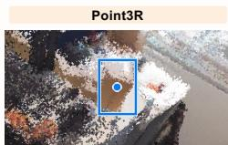  
Reconstruction Results

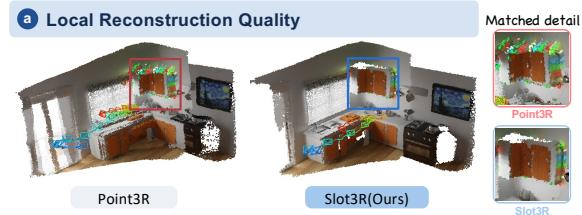

Viewpoint Guided Camera Pose Estimationc  
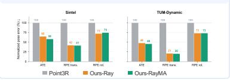  
Streaming Scalabilityd

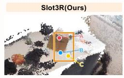  
Indoor-Outdoor Reconstructionb  
Spatial proximity ≠ state identity

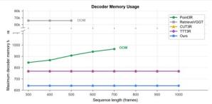

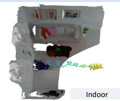

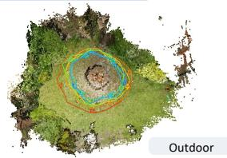

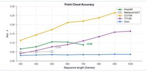  
Fig. 1. Reconstruction quality, viewpoint-guided pose estimation, and streaming scalability. (a) Local point-cloud comparison with Point3R. (b) Indoor and outdoor reconstructions produced by Ours. (c) Relative to Point3R, both VPC variants reduce all three pose errors on Sinte and TUM-Dynamic; Ours-VPC-A lowers ATE by 41.8%/53.1% and translation RPE by 58.6%/79.6%, respectively. (d) The 640-token readou keeps decoder-visible memory bounded: Slot3R completes 1000-frame streams with $\begin{array} { r } { \mathrm { A c c } \leq 0 . 0 6 2 . } \end{array}$ , while Point3R fails with OOM at 800 frames.

## 1. Introduction

Recovering 3D scene geometry and camera motion from visual observations is a foundational capability for visual SLAM, robotic navigation, augmented reality, and embodied intelligence. Classical Structure-from-Motion and multi-view stereo pipelines rely on feature matching, triangulation, and iterative optimization [1–5]. Recent feed-forward models instead regress pointmaps, depth, and camera parameters from multiple views in a single forward pass [6–9]. Although this shift substantially reduces reconstruction time, most such models require the complete image collection before inference. Real-world visual systems instead receive observations sequentially: future frames are unavailable, each frame must be incorporated online, and the scene representation may need to expand throughout operation. Streaming 3D reconstruction must therefore preserve and organize accumulated visual evidence without repeatedly processing the full observation history.

An attractive route is to anchor long-term memory directly to the reconstructed 3D scene [10, 11]. Spatially indexed memory associates historical features with reconstructed 3D locations: new regions can allocate memory, whereas revisited regions can retrieve and update the states stored there. Compared with fixed-length recurrent states, spatial memory avoids repeatedl compressing an expanding scene into a limited token set [12, 13]. Causal key–value caches instead retain history in tempora order, and their storage and attention costs grow with the stream unless tokens are compressed, selected, or discarded [14–16]. Spatially indexed memory explicitly associates evidence with the reconstructed 3D regions it describes. It therefore organizes history by scene coverage rather than frame order, making it a promising basis for long-term streaming reconstruction. A representative spatial-memory approach is Point3R[11], which maintains a persistent set of memory entries anchored to reconstructed 3D locations. As each new frame arrives, the model converts its visual evidence into spatially localized memory states and uses nearby stored entries to incorporate information from previously observed regions. This design provides a natural way to organize long-term history by scene location rather than by frame order.

However, an ambiguity arises when spatial proximity is used as a proxy for state identity. In learned spatial memory, a pointer location is a coarse geometric summary of the visual region it represents; for example, Point3R [11] derives it by averaging the predicted 3D points within an image patch. Consequently, observations of different surfaces, viewpoints, or visibility conditions may occupy nearby 3D locations while carrying distinct and complementary evidence. Merging them solely by proximity can prematurely and irreversibly collapse useful information, producing ambiguous memory states that affect subsequent predictions and updates. This motivates us to decouple spatial association from state consolidation: observations should be organized by location while remaining distinct until their content provides sufficient evidence for fusion.

We introduce Slot3R, a spatial pointer memory framework with set-associative spatial storage. The core idea is to use spatia proximity only to organize observations into local memory regions, while relying on their feature agreement to determine whether they should be consolidated or preserved as distinct states. Specifically, we quantize 3D space with a spherical hash, where each spatial bucket maintains up to K independent position–feature slots. For each incoming candidate, a frame-wise confidence filter first removes unreliable observations, after which feature similarity determines its memory update: a sufficiently similar and reliable candidate is fused with its matched slot, while a distinct candidate is stored separately in a free slot or replaces the leas reliable one when the bucket is full. In this way, Slot3R preserves complementary evidence within the same spatial region instead of prematurely collapsing it based on spatial proximity alone.

A second challenge lies in scaling spatial memory to long streams: as the camera continuously explores new regions, more spatial buckets become occupied and the persistent memory grows with scene coverage, while each incoming frame typically requires only a small fraction of this history. This motivates us to decouple persistent storage from per-frame memory access, allowing the system to preserve an expanding scene history without exposing the entire memory to the decoder at every step. Slot3R retrieves relevant local evidence from neighboring spatial buckets using a spatial prior, and complements it with a small set of uniformly sampled global anchors for coarse nonlocal context. Only a fixed number of these selected tokens are passed to the pointer–image interaction module. As a result, Slot3R preserves long-term spatial evidence as the scene expands while keeping memory-dependent decoder cost bounded regardless of the total memory size.

Slot3R is entirely training-free and can be directly applied to a pretrained Point3R model without modifying or fine-tuning its network parameters. Slot3R sets a new state of the art on 7Scenes and remains competitive with state-of-the-art methods on NeuralRGBD. Across 300–500 sampled-frame evaluations, Slot3R reduces Point3R’s Acc by 57.1%–63.1% on 7Scenes and 64.0%–72.0% on NeuralRGBD, while increasing average throughput by 14.3% and 5.6%, respectively. It also improves Sim(3)- aligned ATE on all three pose benchmarks, remains competitive on video depth, and completes all evaluated streams of up to 1000 sampled frames.

Our contributions are summarized as follows:

• We reveal that conflating spatial proximity with state identity can cause premature information collapse in streaming spatia memory.

• We introduce Slot3R, a training-free set-associative spatial memory that preserves distinct local states while selectively consolidating consistent observations.

• We develop a bounded sparse spatial readout that decouples allocated persistent storage from per-frame access cost.

• Without any additional training, Slot3R sets a new state of the art for long-sequence point-cloud reconstruction on 7Scenes, while scaling robustly to streams of up to 1000 frames.

## 2. Related Work

## 2.1. Offline Feed-Forward Visual Geometry

Feed-forward visual geometry replaces the correspondence-and-optimization chain of classical reconstruction with direct regression of geometry in a shared coordinate frame [6]. Later offline models scale this up: many views in a single pass, joint prediction of cameras, depth, pointmaps, and tracks, and reference-free, permutation-equivariant architectures [7–9, 17]. Further work cuts the cost on large collections by chunking, partitioning, pruning tokens, and training scene states at test time [18–22]. Similar formulations extend to dynamic and 4D scenes [23–25]. Such models provide geometric priors for downstream 3D tasks. Most require full collections in offline or bidirectional modes, although ZipMap also supports sequential inference [22]. Online methods instead provide immediate per-frame estimates with stream-scalable memory and computation.

## 2.2. Streaming Reconstruction

Streaming reconstruction preserves past observations in two memory forms. One compresses the stream into a bounded latent state, rewriting a fixed token pool across frames [12]. Per-frame cost is constant; later work refines the write rule or uses sequence models and test-time-trained states [13, 26–29]. LONG3R combines recurrent memory gating with adaptive 3D spatio-temporal management [30]. The second causalizes offline attention, caching earlier-frame keys and values as memory [14]. Frame-level evidence then survives uncompressed, but the cache grows with the stream and is bounded by windows, hierarchies, or scoring, merging, evicting, and retrieving tokens under a fixed budget [31–38]. Both designs struggle with long streams. Fixed capacity may overwrite early evidence in unbounded scenes [13]. Bounded caches retain history using attention-, confidence-, or geometry aware criteria [16, 33], but remain token-centric rather than maintaining distinct states at each 3D location. Geometry-informed external memory offers another route: Spann3R retrieves by feature affinity, with geometry encoded in its values [10]. Point3R instead indexes position–feature pointers by 3D location and averages nearby pointers into one state per region [11]. Concurren work adds viewing direction and retain-or-replace updates [39]. Our set-associative memory preserves multiple states per address; viewpoint-guided variants use a separate pose-conditioning bank.

## 3. Method

We introduce Slot3R, a training-free streaming 3D reconstruction method with a set-associative spatial memory that retains multiple feature states at each spatial address. We formulate the problem and review Point3R’s memory in Sec. 3.1, followed by our memory organization in Sec. 3.2 and its confidence-aware update in Sec. 3.3, and finally the sparse readout with globa anchors in Sec. 3.4. We describe optional viewpoint-guided pose conditioning in Sec. 3.5. Fig. 2 shows the pipeline.

## 3.1. Problem Setup and Preliminaries

Streaming 3D reconstruction takes an ordered RGB sequence $\mathcal { T } = \{ I _ { t } \} _ { t = 1 } ^ { T }$ and predicts a camera pose $T _ { t } ,$ a depth map $D _ { t } ,$ , and a pointmap $X _ { t }$ for each frame as it arrives. At time t, the model can access only the prefix $\mathcal { T } _ { 1 : }$ t. It therefore maintains a memory $\mathcal { M } _ { t }$ that summarizes the observations processed so far. The central challenge is to organize and update $\mathcal { M } _ { t }$ as the stream progresses.

As summarized in Fig. 2(a), our method builds on Point3R’s spatial pointer memory [11]. In Point3R, each incoming frame is encoded into image tokens that interact with the existing pointer memory to predict geometry and camera pose, after which the memory-aware features and predicted geometry are encoded into new spatial pointers and fused back into memory. Given the current image $I _ { t }$ and the previous memory $\mathcal { M } _ { t - 1 }$ , this process is written as:

$$
\begin{array} { r l } & { F _ { t } = \mathrm { E n c o d e } ( I _ { t } ) , \qquad \widetilde { F } _ { t } = \mathrm { R e a d } ( F _ { t } , { \mathcal M } _ { t - 1 } ) , \qquad ( X _ { t } , D _ { t } , T _ { t } ) = \mathrm { P r e d i c t } ( \widetilde { F } _ { t } ) , } \\ & { { \mathcal C } _ { t } = \mathrm { P o i n t e r i z e } ( \widetilde { F } _ { t } , X _ { t } , D _ { t } , T _ { t } ) , \qquad { \mathcal M } _ { t } = \mathrm { F u s e } ( { \mathcal M } _ { t - 1 } , { \mathcal C } _ { t } ) . } \end{array}\tag{1}
$$

Here $F _ { t }$ and $\widetilde { F } _ { t }$ are the image and memory-aware tokens, respectively. The pointer candidates are $\mathcal { C } _ { t } = \{ ( p _ { i } , m _ { i } ) \} _ { i = 1 } ^ { N _ { t } }$ , where $N _ { t }$ is the number of candidates, and $\boldsymbol { p } _ { i } \in \mathbb { R } ^ { \bar { 3 } }$ and $m _ { i }$ denote a 3D position and its associated memory feature. However, Point3R averages spatially nearby pointer candidates, even when they may represent distinct surfaces or observations. To address this, we modify its inference-time memory to decouple spatial storage from feature fusion. Each pointer is assigned to a spatial address based on its 3D position, but this assignment alone does not determine whether it is fused with a feature state. Each address can maintain up to K distinct feature states.

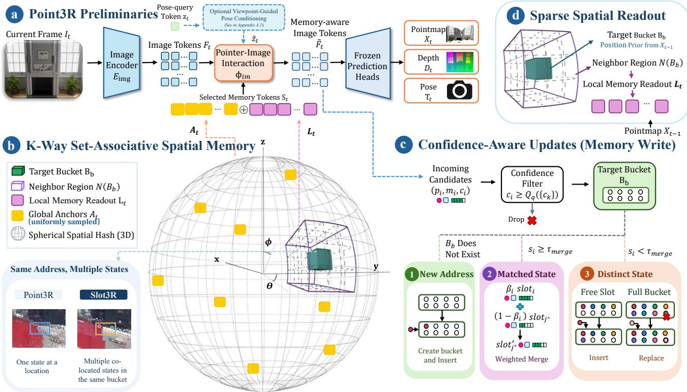  
Fig. 2. Overview of the core Slot3R pipeline. (a) The frozen Point3R backbone interacts image tokens with selected memory states and predicts geometry and camera pose (Sec. 3.1). (b) K-way set-associative spatial memory retains multiple states at each discrete 3D address (Sec. 3.2). (c) Confidence and feature similarity govern the memory-write path through rejection, insertion, fusion, and replacement (Sec. 3.3). (d) Previous frame spatial priors retrieve neighboring buckets; the resulting local states are combined with uniformly sampled global anchors under a fixed readout budget (Sec. 3.4).

## 3.2. Set-Associative Spatial Memory

Specifically, to retain different feature states within the same spatial region, we organize the persistent memory $\mathcal { M } _ { t }$ as a setassociative table over a discretization of 3D space, as illustrated in Fig. 2(b). An addressing function $h ( \cdot )$ then maps each candidate position $p _ { i }$ to a discrete address $b _ { i } : = h ( p _ { i } )$ . Each address indexes a bucket $B _ { b _ { i } }$ containing $n _ { b _ { i } } ~ \leq ~ K$ slots, where slot j stores $( p _ { b _ { i } , j } , m _ { b _ { i } , j } , c _ { b _ { i } , j } )$ , denoting its 3D position, memory feature, and confidence, respectively. In Fig. 2(b), the single blue marker for Point3R represents the memory state produced by averaging nearby pointers at the highlighted location. The differently colored markers for Slot3R represent appearance-distinct states retained in separate slots of the same spatial bucket, separating a shared spatial address from feature-state identity while preserving up to K local alternatives.

Specifically, to assign each pointer candidate to a spatial bucket and retrieve that bucket efficiently, we map its 3D position to a discrete address on a quantized spherical grid. Given $p _ { i } = ( x _ { i } , y _ { i } , z _ { i } )$ , we first express its position by its azimuth, elevation, and log-radius:

$$
\theta _ { i } = \mathrm { a t a n 2 } ( y _ { i } , x _ { i } ) , \phi _ { i } = \mathrm { a t a n 2 } \biggl ( z _ { i } , \sqrt { x _ { i } ^ { 2 } + y _ { i } ^ { 2 } } \biggr ) , r _ { i } = \mathrm { l o g } \bigl ( \mathrm { m a x } \bigl ( \| p _ { i } \| _ { 2 } , \rho _ { \mathrm { m i n } } \bigr ) \bigr ) .\tag{2}
$$

We partition these three dimensions into $B _ { \theta } , B _ { \phi }$ , and $B _ { r }$ bins. Their bin widths are $\Delta _ { \theta } = 2 \pi / B _ { \theta } , \Delta _ { \phi } = \pi / B _ { \phi }$ , and $\Delta _ { r } =$ $( r _ { \operatorname* { m a x } } - r _ { \operatorname* { m i n } } ) / B _ { r }$ , where $r _ { \mathrm { m i n } } = \log \rho _ { \mathrm { m i n } }$ and $r _ { \mathrm { m a x } } = \log \rho _ { \mathrm { m a x } }$ . We then quantize the three coordinates into integer bin indices:

$$
\begin{array} { r } { \hat { \theta } _ { i } = \left\lfloor ( \theta _ { i } + \pi ) / \Delta _ { \theta } \right\rfloor , \quad \hat { \phi } _ { i } = \left\lfloor ( \phi _ { i } + \pi / 2 ) / \Delta _ { \phi } \right\rfloor , \quad \hat { r } _ { i } = \left\lfloor ( r _ { i } - r _ { \operatorname* { m i n } } ) / \Delta _ { r } \right\rfloor . } \end{array}\tag{3}
$$

After clipping each index to its valid range, we concatenate the three indices to obtain the address:

$$
b _ { i } = h ( p _ { i } ) = \operatorname { C o n c a t } \left( \hat { \theta } _ { i } , \hat { \phi } _ { i } , \hat { r } _ { i } \right) .\tag{4}
$$

The address $b _ { i }$ indexes its corresponding bucket $B _ { b _ { i } }$ , providing direct access to the slots associated with that spatial region during memory updates.

## 3.3. Confidence-Aware Memory Update

Figure 2(c) summarizes the confidence-aware write path. Prediction quality varies across patches, so we first discard candidates below the frame-wise q-quantile confidence threshold. A candidate mapped to a new bucket is inserted directly. For each candidate mapped to an existing bucket, we identify the most similar slot $j ^ { * }$ and the least confident slot $j _ { \mathrm { m i n } }$ . If the maximum cosine similarity exceeds $\tau _ { \mathrm { m e r g e } }$ and the candidate confidence is at least that of the matched slot, we update $j ^ { * }$ through confidenceweighted fusion with coefficient $\beta _ { i }$ . If the similarity is below $\tau _ { \mathrm { m e r g e } } ,$ the candidate is admitted only if its confidence is at least that of $j _ { \mathrm { m i n } } ;$ it then occupies a free slot or replaces the lowest-confidence slot after grouped fusion if the bucket is full. All remaining candidates are rejected. In this way, confidence determines whether memory is modified, while feature similarity determines how it is modified. Each update compares at most K slots and costs $O ( K )$ , independent of the total memory size. The confidence-based definition of $\beta _ { i }$ and the complete slot-level update are given in Appendix A.3 and Algorithm 1.

## 3.4. Sparse Spatial Readout with Global Anchors

The number of occupied memory buckets grows as the camera explores new regions, but each incoming frame observes only a small part of the scene. We therefore retrieve memory at two scales: local neighborhoods provide nearby geometric evidence, while a small set of global anchors provides coarse context from the rest of the scene. We combine the two sets and limit the number of memory tokens passed to the decoder with a fixed readout budget.

Local spatial readout. To retrieve local evidence for each image token, we first estimate where its current patch lies in the spatial memory. Following Point3R’s 3D hierarchical positional encoding [11], we assign each current image token the position pooled from the same image-patch region of the previous-frame global pointmap as an approximate spatial prior. Consecutive frames typically overlap, so same-index patch regions often observe nearby scene content, although no exact correspondence is assumed. Slot3R additionally uses this prior for sparse retrieval because the current geometry is available only after pointer– image interaction. Let $\bar { p } _ { t , i }$ denote the prior for the i-th current image token and $b _ { t , i } = h ( \bar { p } _ { t , i } )$ its spatial hash address, written as $b _ { t , i } = ( b _ { t , i } ^ { \theta } , b _ { t , i } ^ { \phi } , b _ { t , i } ^ { r } )$ . Rather than query the entire table, we retrieve buckets within a neighborhood of this address. With d controlling the neighborhood extent and $\delta _ { \theta } , \delta _ { \phi } , \delta _ { r } \in \mathbb { Z } \cap [ - d , d ]$ , we define:

$$
\mathcal { N } _ { d } ( b _ { t , i } ) = \big \{ ( b _ { t , i } ^ { \theta } + \delta _ { \theta } , b _ { t , i } ^ { \phi } + \delta _ { \phi } , b _ { t , i } ^ { r } + \delta _ { r } ) \big \} .\tag{5}
$$

During neighborhood expansion, out-of-range indices in all three dimensions are discarded.

For each token, we collect the position-feature slots from occupied buckets in $\mathcal { N } _ { d } ( b _ { t , i } )$ . Concatenating slots across $N _ { t }$ tokens and removing duplicate references yields the frame-level local readout $\mathcal { L } _ { t }$ , as illustrated in Fig. 2(d).

Global anchors and readout budget. To retain coarse nonlocal context, we uniformly sample a small set of global anchors from the full memory, denoted by $\boldsymbol { A } _ { t }$ . The final readout $S _ { t }$ places $\boldsymbol { A } _ { t }$ before the local candidates $\mathcal { L } _ { t }$ , removes duplicate references, and retains the first $K _ { \mathrm { r e a d } }$ entries. Thus, at most $K _ { \mathrm { r e a d } }$ memory tokens participate in pointer-image interaction, combining local geometric evidence with global context while bounding attention cost independently of persistent memory size.

## 3.5. Auxiliary Viewpoint-Guided Pose Conditioning

The set-associative memory in Secs. 3.2–3.4 is designed primarily to preserve spatial evidence for reconstruction. Camera-pose estimation, however, can additionally benefit from viewpoint-specific history. We therefore maintain an auxiliary viewpoint bank $\mathcal { R } _ { t }$ , adapted from the viewpoint-conditioned pointer representation and update of Li et al. [39], in parallel with the core Slot3R memory $\mathcal { M } _ { t }$ . For frame $t ,$ nearby entries from $\mathcal { R } _ { t - 1 }$ are retrieved using the same spatial priors as Sec. 3.4 and pooled with the pose-query token $\mathbf { z } _ { t }$ to obtain a viewpoint-conditioned context $\mathbf { u } _ { t } .$ . An agreement score $a _ { t } \in [ 0 , 1 ]$ suppresses unreliable retrievals. We mix this context into the pose query as

$$
\widetilde { \mathbf { z } } _ { t } = ( 1 - w _ { t } ) \mathbf { z } _ { t } + w _ { t } \mathbf { u } _ { t } , \qquad w _ { t } = \left\{ \begin{array} { l l } { a _ { t } \lambda _ { \mathrm { j } } g _ { t } , } & { \mathrm { O u r s - V P C - M } , } \\ { a _ { t } \lambda _ { \mathrm { c } } , } & { \mathrm { O u r s - V P C - A } , } \end{array} \right.\tag{6}
$$

where $g _ { t } ~ \in ~ [ 0 , 1 ]$ measures recent rotational-motion change. Ours-VPC-M emphasizes the auxiliary context when rotational motion changes sharply, whereas Ours-VPC-A removes the motion-dependent gate and uses a stronger constant agreement-gated coefficient. Both variants remain training-free and use the same single decoder forward. Details are provided in Appendix A.1.

## 4. Experiments

## 4.1. Experimental Setup

Setup. We evaluate dense point-cloud reconstruction, camera trajectories, and video depth to assess accumulated spatial evidence, trajectory stability, and dense per-frame prediction, respectively. We additionally report forwarding speed across stream lengths to characterize long-sequence efficiency.

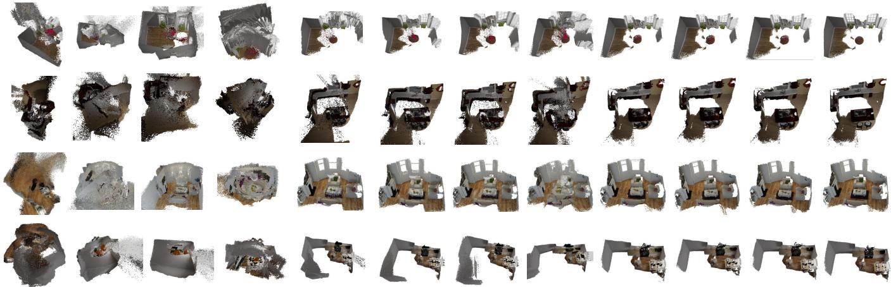  
Fig. 3. Qualitative point-cloud reconstruction comparison on four 500-frame NeuralRGBD sequences. Our variants recover more complete and coherent scene geometry than Point3R and more closely approach the ground truth.

Baselines. We compare with CUT3R [12], TTT3R [26], StreamVGGT [14], STream3R [40], InfiniteVGGT [15], RetrieveVGGT [16], Spann3R [10], Point3R [11], and ZipMap [22]. CUT3R and TTT3R propagate fixed-length recurrent states, while ZipMap-Stream adapts ZipMap’s persistent scene state to sequential inference using unit-size chunks. StreamVGGT, STream3R, InfiniteVGGT, and RetrieveVGGT preserve history through causal attention and cache-based context. Spann3R and Point3R associate memory with reconstructed geometry; Point3R is our direct baseline because Ours retains its frozen backbone and changes only inference-time memory organization and readout.

Datasets. We evaluate point-cloud reconstruction on 7Scenes [41] and NeuralRGBD [42]. Following state-of-the-art RetrieveVGGT [16], we use fixed sequence lengths of 300, 400, and 500 frames and sample every second frame (k = 2). Following Point3R [11], we evaluate camera pose on ScanNet [43], Sintel [44], and TUM-Dynamic [45]. For depth, we retain Bonn [46] and KITTI [47], following Point3R and CUT3R [12], and evaluate ScanNet. Methods use the same frames and metric backend within each dataset block.

Metrics. We report accuracy (Acc), completeness (Comp), normal consistency (NC), and average forwarding speed (Avg. FPS), preferring lower Acc and Comp and higher NC and FPS. After Sim(3) alignment, pose metrics are absolute trajectory error RMSE, mean relative translation error, and mean relative rotation-angle error in degrees; relative errors use adjacent-frame pairs. Depth metrics are absolute relative error (AbsRel) and the percentage of pixels satisfying δ < 1.25, under direct metric-scale evaluation and per-sequence scale-and-shift alignment.

Implementation details. Point3R-family variants use released Point3R weights without fine-tuning. Unless otherwise stated, our model uses K = 8 slots per bucket, a spherical hash with $( B _ { \theta } , B _ { \phi } , B _ { r } ) = ( 1 6 , 8 , 3 2 )$ bins, radius range $[ \rho _ { \mathrm { m i n } } , \rho _ { \mathrm { m a x } } ] =$ [0.05, 50], and uniform log-radius binning, local readout radius $d = 1$ , merge threshold $\tau _ { \mathrm { m e r g e } } = 0 . 9 0$ , confidence-drop quantile $q = 0 . 2 5 , K _ { \mathrm { a n c h o r } } = 1 2 8$ global anchors, and a readout budget of $K _ { \mathrm { r e a d } } = 6 4 0$ memory tokens. Point3R-family runtime results use the same fused RoPE3D implementation, so FPS differences reflect memory organization and readout rather than the PyTorch RoPE3D fallback. As verified in Appendix A.7, the fused kernel changes runtime while leaving reconstruction metrics nearly unchanged. Runtime and OOM comparisons use a single NVIDIA RTX 4090 (24 GB). FPS excludes data loading and metric computation. The decoder and memory updates are causal, although the evaluation harness encodes each input sequence before recurrent decoding. OOM denotes out-of-memory failure. Ours (Core) denotes core Slot3R. Ours-VPC-M adds the auxiliary viewpoint-conditioned pose readout from Sec. 3.5 with motion gating; Ours-VPC-A uses equal interpolation endpoints, yielding agreement-only conditioning, and refreshes its auxiliary bank every frame.

## 4.2. Point-Cloud Reconstruction

Table 1 shows that Ours reduces Point3R’s Acc by 57.1%–63.1% on 7Scenes and 64.0%–72.0% on NeuralRGBD, while improving NC throughout. The VPC variants retain comparable quality, and all three variants complete every setting; STream3R fails a 500 frames, whereas Spann3R is faster but markedly less accurate. Figure 3 shows the qualitative gains over Point3R.

Table 1. Point-cloud reconstruction on 7Scenes and NeuralRGBD with k = 2 at 300–500 frames. Pink, Orange, and Yellow denote the top three results per block; ties share and occupy the corresponding ranks. ∆ reports the relative change from Point3R to Ours (Core), and OOM denotes failure. Avg. FPS averages completed runs. † marks reconstruction values reported by RetrieveVGGT [16]; FPS is measured in ou setup.
<table><tr><td rowspan="2">Method</td><td colspan="3">Acc ↓</td><td colspan="3">Comp ↓</td><td colspan="3">NC↑</td><td rowspan="2">Avg. FPS ↑</td></tr><tr><td>300</td><td>400</td><td>500</td><td>300</td><td>400</td><td>500</td><td>300</td><td>400</td><td>500</td></tr><tr><td>7Scenes</td><td></td><td></td><td></td><td></td><td></td><td></td><td></td><td></td><td></td><td></td></tr><tr><td>CUT3R</td><td>0.1362</td><td>0.1697</td><td>0.1926</td><td>0.0744</td><td>0.1078</td><td>0.0894</td><td>0.5513</td><td>0.5447</td><td>0.5409</td><td>13.89</td></tr><tr><td>TTT3R†</td><td>0.0402</td><td>0.0502</td><td>0.0651</td><td>0.0245</td><td>0.0263</td><td>0.0295</td><td>0.5647</td><td>0.5575</td><td>0.5522</td><td>13.68</td></tr><tr><td>StreamVGGT</td><td>OOM</td><td>OOM</td><td>OOM</td><td>OOM</td><td>OOM</td><td>OOM</td><td>OOM</td><td>OOM</td><td>OOM</td><td>OOM</td></tr><tr><td>STream3R</td><td>0.0962</td><td>0.1013</td><td>OOM</td><td>0.0317</td><td>0.0426</td><td>OOM</td><td>0.5769</td><td>0.5744</td><td>OOM</td><td>5.82</td></tr><tr><td>InfiniteVGGT†</td><td>0.0432</td><td>0.0421</td><td>0.0398</td><td>0.0269</td><td>0.0269</td><td>0.0236</td><td>0.5695</td><td>0.5649</td><td>0.5617</td><td>3.63</td></tr><tr><td>RetrieveVGGT</td><td>0.0266</td><td>0.0276</td><td>0.0284</td><td>0.0275</td><td>0.0292</td><td>0.0294</td><td>0.5065</td><td>0.5063</td><td>0.5084</td><td>0.97</td></tr><tr><td>ZipMap-Stream</td><td>0.1096</td><td>0.1057</td><td>0.1021</td><td>0.2644</td><td>0.3001</td><td>0.3088</td><td>0.5223</td><td>0.5180</td><td>0.5150</td><td>5.12</td></tr><tr><td>Spann3R†</td><td>0.0765</td><td>0.0797</td><td>0.0707</td><td>0.0278</td><td>0.0275</td><td>0.0187</td><td>0.5464</td><td>0.5428</td><td>0.5402</td><td>41.80</td></tr><tr><td>Point3R</td><td>0.0634</td><td>0.0638</td><td>0.0745</td><td>0.0347</td><td>0.0308</td><td>0.0265</td><td>0.5596</td><td>0.5541</td><td>0.5510</td><td>16.77</td></tr><tr><td>Ours (Core)</td><td>0.0262</td><td>0.0274</td><td>0.0275</td><td>.0154</td><td>0.0169</td><td>.0158</td><td></td><td>0.5789</td><td>0.5790</td><td>19.17</td></tr><tr><td>Ours-VPC-M</td><td>0.0257</td><td>0.0266</td><td>0.0282</td><td>0.0158</td><td>0.0164</td><td>0.0163</td><td>0.5789</td><td>0.5786</td><td>0.5792</td><td>17.54</td></tr><tr><td>Ours-VPC-A</td><td>0.0264</td><td>0.0269</td><td>0.0270</td><td>0.0159</td><td>0.0167</td><td>0.0163</td><td>0.5793</td><td>0.5786</td><td>0.5791</td><td>15.73</td></tr><tr><td>∆ Ours (Core) vs. Point3R</td><td>↓58.7%</td><td>↓57.1%</td><td>↓ 63.1%</td><td>↓55.6%</td><td>↓45.1%</td><td>↓40.4%</td><td>↑3.5%</td><td>↑4.5%</td><td>↑5.1%</td><td></td></tr><tr><td>NeuralRGBD</td><td></td><td></td><td></td><td></td><td></td><td></td><td></td><td></td><td></td><td>↑14.3%</td></tr><tr><td>CUT3R</td><td>0.2260</td><td>0.3170</td><td>0.3471</td><td>0.0883</td><td>0.1245</td><td>0.1539</td><td>0.5846</td><td>0.5656</td><td>0.5539</td><td></td></tr><tr><td>TTT3R</td><td>0.1058</td><td>0.1425</td><td>0.1666</td><td>0.0323</td><td>0.0775</td><td>0.1027</td><td>0.6415</td><td>0.6269</td><td>0.6221</td><td>17.51</td></tr><tr><td>StreamVGGT</td><td>OOM</td><td>OOM</td><td>OOM</td><td>OOM</td><td>OOM</td><td>OOM</td><td>OOM</td><td>OOM</td><td>OOM</td><td>17.40</td></tr><tr><td>STream3R</td><td>0.0664</td><td>0.0828</td><td>OOM</td><td>0.0149</td><td>0.0211</td><td>OOM</td><td>0.6880</td><td>0.6935</td><td>OOM</td><td>OOM</td></tr><tr><td>InfiniteVGGT†</td><td>0.0532</td><td>0.0651</td><td></td><td></td><td></td><td></td><td></td><td></td><td></td><td>5.81</td></tr><tr><td>RetrieveVGGT</td><td>0.0438</td><td></td><td>0.0696</td><td>0.0244</td><td>0.0348</td><td>0.0370</td><td>0.6431</td><td>0.6503</td><td>0.6433</td><td>3.63</td></tr><tr><td>ZipMap-Stream</td><td>0.1745</td><td>0.0456</td><td>0.0370</td><td>0.0248</td><td>0.0316</td><td>0.0397</td><td>0.6166</td><td>0.6158</td><td>0.5132</td><td>1.07</td></tr><tr><td></td><td></td><td>0.1985</td><td>0.2141</td><td>0.2962</td><td>0.4452</td><td>0.5305</td><td>0.5288</td><td>0.5288</td><td>0.5291</td><td>5.01</td></tr><tr><td>Spann3R</td><td>0.1002</td><td>0.1417</td><td>0.1829</td><td>0.0262</td><td>0.0447</td><td>0.0487</td><td>0.5953</td><td>0.5855</td><td>0.5794</td><td>35.37</td></tr><tr><td>Point3R</td><td>0.1132</td><td>0.1665</td><td>0.2106</td><td>0.0377</td><td>0.0557</td><td>0.0706</td><td>0.6116</td><td>0.6039</td><td>0.6025</td><td>18.01</td></tr><tr><td>Ours (Core)</td><td>0.0408</td><td>0.057</td><td>0.0589</td><td>0.0151</td><td>0.020</td><td>0.0236</td><td>0.6662</td><td>0.6743</td><td>0.6728</td><td>19.02</td></tr><tr><td>Ours-VPC-M</td><td>0.0403</td><td>0.0579</td><td>0.0606</td><td>0.0150</td><td>0.0207</td><td>0.0218</td><td>0.6630</td><td>0.6711</td><td>0.6692</td><td>17.57</td></tr><tr><td>Ours-VPC-A</td><td>0.0401</td><td>0.0561</td><td>0.0611</td><td>0.0147</td><td>0.0206</td><td>0.0242</td><td>0.6631</td><td>0.6711</td><td>0.6699</td><td>16.25</td></tr><tr><td>∆ Ours (Core) vs. Point3R ↓ 64.0%</td><td></td><td>↓65.7%↓72.0%↓59.9%</td><td></td><td></td><td>↓62.8%</td><td>↓66.6%</td><td></td><td>↑8.9%↑11.7%↑11.7%</td><td></td><td>↑5.6%</td></tr></table>

## 4.3. Depth Estimation

Under per-sequence alignment, Ours improves Point3R’s AbsRel on all three datasets while matching or improving δ < 1.25 (Table 2). The VPC variants remain comparable. Metric-scale results improve on ScanNet but not Bonn or KITTI, indicating better relative depth consistency without a consistent gain in absolute-scale calibration.

## 4.4. Camera Pose Estimation

Ours improves Point3R’s ATE on all three benchmarks but not its RPE consistently (Table 3). Ours-VPC-A reduces Point3R’s ATE by 29.1%–53.1% and translation RPE by 47.8%–79.7%, while Ours-VPC-M gives comparable gains. Although CUT3R or TTT3R remains stronger on several metrics, these results support viewpoint-conditioned pose readout.

## 4.5. Ablation Study

Table 4 shows that K-way memory improves reconstruction, sparse readout restores throughput, and filtering with anchors reduces storage while preserving NC. Table 5 finds comparable reconstruction but much lower FPS with a current-frame prior, favoring Point3R’s previous-frame prior.

Table 2. Video depth estimation on ScanNet, Bonn, and KITTI under per-sequence alignment and direct metric-scale evaluation. $\delta < 1 . 2 5$ is reported as a percentage.
<table><tr><td rowspan="2">Method</td><td rowspan="2">Alignment</td><td colspan="2">ScanNet</td><td colspan="2">Bonn</td><td colspan="2">KITTI</td></tr><tr><td>AbsRel ↓</td><td> $\delta < 1 . 2 5 \uparrow$ </td><td>AbsRel ↓</td><td> $\delta < 1 . 2 5 \uparrow$ </td><td>AbsRel ↓</td><td> $\delta < 1 . 2 5 \uparrow$ </td></tr><tr><td>CUT3R</td><td>Per-sequence</td><td>0.056</td><td>97.1</td><td>0.074</td><td>94.4</td><td>0.111</td><td>88.3</td></tr><tr><td>TTT3R</td><td>Per-sequence</td><td>0.049</td><td>97.8</td><td>0.064</td><td>95.8</td><td>0.100</td><td>91.3</td></tr><tr><td>StreamVGGT</td><td>Per-sequence</td><td>0.268</td><td>57.1</td><td>0.059</td><td>97.2</td><td>0.173</td><td>72.2</td></tr><tr><td>STream3R</td><td>Per-sequence</td><td>0.037</td><td>98.9</td><td>0.058</td><td>97.5</td><td>0.077</td><td>95.2</td></tr><tr><td>InfiniteVGGT</td><td>Per-sequence</td><td>0.269</td><td>57.0</td><td>0.060</td><td>97.3</td><td>0.172</td><td>72.4</td></tr><tr><td>RetrieveVGGT</td><td>Per-sequence</td><td>0.268</td><td>57.1</td><td>0.057</td><td>97.2</td><td>0.175</td><td>71.9</td></tr><tr><td>ZipMap-Stream</td><td>Per-sequence</td><td>0.040</td><td>98.6</td><td>0.073</td><td>97.1</td><td>0.110</td><td>88.9</td></tr><tr><td>Spann3R</td><td>Per-sequence</td><td>0.176</td><td>73.7</td><td>0.231</td><td>72.3</td><td>0.336</td><td>51.9</td></tr><tr><td>Point3R</td><td>Per-sequence</td><td>0.053</td><td>97.1</td><td>0.066</td><td>95.8</td><td>0.093</td><td>93.5</td></tr><tr><td>Ours (Core)</td><td>Per-sequence</td><td>0.046</td><td>97.8</td><td>0.063</td><td>96.2</td><td>0.088</td><td>93.5</td></tr><tr><td>Ours-VPC-M</td><td>Per-sequence</td><td>0.046</td><td>97.8</td><td>0.063</td><td>96.3</td><td>0.088</td><td>93.3</td></tr><tr><td>Ours-VPC-A</td><td>Per-sequence</td><td>0.046</td><td>97.8</td><td>0.064</td><td>96.3</td><td>0.088</td><td>93.4</td></tr><tr><td>CUT3R</td><td>Metric-scale</td><td>0.084</td><td>94.2</td><td>0.103</td><td>88.6</td><td>0.127</td><td>84.3</td></tr><tr><td>TTT3R</td><td>Metric-scale</td><td>0.082</td><td>95.0</td><td>0.090</td><td>94.2</td><td>0.111</td><td>89.1</td></tr><tr><td>StreamVGGT</td><td>Metric-scale</td><td>0.490</td><td>11.0</td><td>0.644</td><td>0.3</td><td>0.969</td><td>0.0</td></tr><tr><td>STream3R</td><td>Metric-scale</td><td>0.547</td><td>1.8</td><td>0.065</td><td>96.7</td><td>0.084</td><td>95.3</td></tr><tr><td>InfiniteVGGT</td><td>Metric-scale</td><td>0.491</td><td>11.2</td><td>0.646</td><td>0.3</td><td>0.969</td><td>0.0</td></tr><tr><td>RetrieveVGGT</td><td>Metric-scale</td><td>0.491</td><td>11.0</td><td>0.643</td><td>0.3</td><td>0.969</td><td>0.0</td></tr><tr><td>ZipMap-Stream</td><td>Metric-scale</td><td>0.573</td><td>0.0</td><td>0.648</td><td>0.6</td><td>0.925</td><td>0.0</td></tr><tr><td>Spann3R</td><td>Metric-scale</td><td>0.820</td><td>0.0</td><td>0.850</td><td>0.0</td><td>0.959</td><td>0.0</td></tr><tr><td>Point3R</td><td>Metric-scale</td><td>0.069</td><td>95.6</td><td>0.081</td><td>95.8</td><td>0.169</td><td>80.5</td></tr><tr><td>Ours (Core)</td><td>Metric-scale</td><td>0.063</td><td>96.5</td><td>0.087</td><td>95.7</td><td>0.179</td><td>77.7</td></tr><tr><td>Ours-VPC-M</td><td>Metric-scale</td><td>0.063</td><td>96.5</td><td>0.087</td><td>95.8</td><td>0.179</td><td>77.5</td></tr><tr><td>Ours-VPC-A</td><td>Metric-scale</td><td>0.063</td><td>96.6</td><td>0.087</td><td>95.8</td><td>0.179</td><td>77.8</td></tr></table>

Table 3. Camera pose estimation after Sim(3) alignment on 94 ScanNet scenes, 14 Sintel sequences, and 8 TUM-Dynamic sequences.
<table><tr><td rowspan="2">Method</td><td colspan="3">ScanNet (Static)</td><td colspan="3">Sintel</td><td colspan="3">TUM-Dynamic</td></tr><tr><td>ATE RMSE</td><td>RPE trans</td><td>RPE rot↓</td><td>ATE RMSE</td><td>RPE trans</td><td>RPE rot ↓</td><td>ATE RMSE↓</td><td>RPE trans</td><td>RPE rot ↓</td></tr><tr><td>CUT3R</td><td>0.0960</td><td>0.0180</td><td>0.4830</td><td>0.2020</td><td>0.0560</td><td>0.5290</td><td>0.0460</td><td>0.0120</td><td>0.3750</td></tr><tr><td>TTT3R</td><td>0.0640</td><td>0.0170</td><td>0.4590</td><td>0.2050</td><td>0.0740</td><td>0.5930</td><td>0.0290</td><td>0.0110</td><td>0.3270</td></tr><tr><td>StreamVGGT</td><td>0.1607</td><td>0.0515</td><td>3.2820</td><td>0.2589</td><td>0.1296</td><td>1.6673</td><td>0.0604</td><td>0.0303</td><td>2.7908</td></tr><tr><td>STream3R</td><td>0.1191</td><td>0.0407</td><td>2.3151</td><td>0.3721</td><td>0.0923</td><td>1.1694</td><td>0.0294</td><td>0.0125</td><td>0.3098</td></tr><tr><td>InfiniteVGGT</td><td>0.1618</td><td>0.0515</td><td>3.3262</td><td>0.2589</td><td>0.1296</td><td>1.6673</td><td>0.0607</td><td>0.0305</td><td>2.7962</td></tr><tr><td>RetrieveVGGT</td><td>0.1624</td><td>0.0521</td><td>3.2814</td><td>0.2599</td><td>0.1297</td><td>1.6721</td><td>0.0603</td><td>0.0305</td><td>2.7915</td></tr><tr><td>ZipMap-Stream</td><td>0.3340</td><td>0.1010</td><td>1.7810</td><td>0.5030</td><td>0.2380</td><td>1.1570</td><td>0.1670</td><td>0.0700</td><td>1.5070</td></tr><tr><td>Spann3R</td><td>0.0760</td><td>0.0190</td><td>0.5090</td><td>3.2490</td><td>1.2050</td><td>2.5020</td><td>0.0720</td><td>0.0360</td><td>2.7670</td></tr><tr><td>Point3R</td><td>0.1120</td><td>0.0310</td><td>1.1630</td><td>0.4360</td><td>0.1360</td><td>1.5450</td><td>0.0640</td><td>0.0280</td><td>0.6610</td></tr><tr><td>Ours (Core)</td><td>0.0809</td><td>0.0322</td><td>1.4235</td><td>0.4243</td><td>0.1279</td><td>2.0687</td><td>0.0404</td><td>0.0260</td><td>0.7231</td></tr><tr><td>Ours-VPC-M</td><td>0.0817</td><td>0.0165</td><td>1.0528</td><td>0.2832</td><td>0.0574</td><td>1.1154</td><td>0.0307</td><td>0.0059</td><td>0.4843</td></tr><tr><td> $\mathrm { O u r s \mathrm { - } V P C \mathrm { - } A }$ </td><td>0.0794</td><td>0.0162</td><td>1.1103</td><td>0.2539</td><td>0.0563</td><td>1.1529</td><td>0.0300</td><td>0.0057</td><td>0.4964</td></tr></table>

Table 4. Component ablation on nine 200-frame NeuralRGBD sequences (k = 2). Ours uses $q = 0 . 2 5$ and a 640-token readout; Final tokens is the average sequence-end memory size.
<table><tr><td>Component</td><td> $\operatorname { A c c } \downarrow$ </td><td>Comp ↓</td><td>NC↑</td><td> $\mathrm { F P S \uparrow }$ </td><td>Final tokens ↓</td></tr><tr><td>Point3R</td><td>0.086</td><td>0.032</td><td>0.635</td><td>17.943</td><td>836.0</td></tr><tr><td>+ Set-associative K-way memory</td><td>0.044</td><td>0.017</td><td>0.676</td><td>16.346</td><td>1165.2</td></tr><tr><td>+ Sparse local readout (640)</td><td>0.042</td><td>0.017</td><td></td><td>0.67019.411</td><td>1162.3</td></tr><tr><td>+ Filtering and anchors (Ours)</td><td>0.039</td><td>0.018</td><td></td><td>0.680 19.283</td><td>694.2</td></tr></table>

Table 5. Spatial-prior ablation on nine 200-frame NeuralRGBD sequences (k = 2). The current-frame alternative adds a preliminary prediction pass; Final tokens follows Table 4.
<table><tr><td>Method</td><td> $\operatorname { A c c } \downarrow$ </td><td>Comp ↓</td><td>NC↑</td><td></td><td>FPS ↑ Final tokens ↓</td></tr><tr><td> $\mathrm { S p a r s e } 6 4 0 \ : ( q = 0 . 2 5 )$ </td><td>0.039</td><td>0.018</td><td>0.680</td><td>19.28</td><td>694.2</td></tr><tr><td>+ Predicted 3D position prior</td><td>0.039</td><td>0.018</td><td>0.676</td><td>12.29</td><td>695.4</td></tr></table>

## 5. Conclusion

We introduced Slot3R, a training-free set-associative spatial memory that separates spatial addressing from state identity and bounds per-frame decoder access while keeping the pretrained Point3R backbone frozen. Across the main 300–500-frame evaluations, core Ours reduces Point3R’s point-cloud Acc by 57.1%–72.0%, improves normal consistency, and provides 5.6%–14.3% higher average throughput; for depth, it improves per-sequence AbsRel on all three benchmarks and remains broadly comparable overall, although metric-scale results are mixed. Ours-VPC-M and Ours-VPC-A maintain comparable point-cloud and depth performance while substantially improving camera pose, with Ours-VPC-A reducing Point3R’s Sim(3)-aligned ATE by 29.1%– 53.1% and translation RPE by 47.8%–79.7% across the three pose benchmarks. Persistent storage still grows with scene coverage and depends on fixed memory choices; future work should study adaptive, globally budgeted memory across backbones, while our results broadly support separating location from identity and storage from per-frame access in long-lived 3D perception.

## References

[1] Noah Snavely, Steven M. Seitz, and Richard Szeliski. Photo tourism: Exploring photo collections in 3d. ACM Transactions on Graphics, 25(3):835–846, 2006. 2

[2] Sameer Agarwal, Noah Snavely, Ian Simon, Steven M. Seitz, and Richard Szeliski. Building rome in a day. In Proceedings of the IEEE International Conference on Computer Vision, pages 72–79, 2009.

[3] Johannes L. Schönberger and Jan-Michael Frahm. Structure-from-motion revisited. In Proceedings of the IEEE Conference on Computer Vision and Pattern Recognition, pages 4104–4113, 2016.

[4] Yasutaka Furukawa and Jean Ponce. Accurate, dense, and robust multiview stereopsis. IEEE Transactions on Pattern Analysis and Machine Intelligence, 32(8):1362–1376, 2010.

[5] Johannes L. Schönberger, Enliang Zheng, Marc Pollefeys, and Jan-Michael Frahm. Pixelwise view selection for unstructured multi-view stereo. In Proceedings ofthe European Conference on Computer Vision, pages 501–518, 2016. 2

[6] Shuzhe Wang, Vincent Leroy, Yohann Cabon, Boris Chidlovskii, and Jerome Revaud. DUSt3R: Geometric 3d vision made easy. In Proceedings ofthe IEEE/CVF Conference on Computer Vision and Pattern Recognition, 2024. 2, 3

[7] Jianing Yang, Alexander Sax, Kevin J. Liang, Mikael Henaff, Hao Tang, Ang Cao, Joyce Chai, Franziska Meier, and Matt Feiszli. Fast3R: Towards 3d reconstruction of 1000+ images in one forward pass. arXiv preprint arXiv:2501.13928, 2025. 3

[8] Yifan Wang, Jianjun Zhou, Haoyi Zhu, Wenzheng Chang, Yang Zhou, Zizun Li, Junyi Chen, Jiangmiao Pang, Chunhua Shen, and Tong He. $\pi ^ { 3 } \colon$ : Scalable permutation-equivariant visual geometry learning. arXiv preprint arXiv:2507.13347, 2025.

[9] Jianyuan Wang, Minghao Chen, Nikita Karaev, Andrea Vedaldi, Christian Rupprecht, and David Novotny. VGGT: Visual geometry grounded transformer. In Proceedings ofthe IEEE/CVF Conference on Computer Vision and Pattern Recognition, 2025. 2, 3

[10] Hengyi Wang and Lourdes Agapito. 3d reconstruction with spatial memory. arXiv preprint arXiv:2408.16061, 2024. 2, 3, 6

[11] Yuqi Wu, Wenzhao Zheng, Jie Zhou, and Jiwen Lu. Point3R: Streaming 3d reconstruction with explicit spatial pointer memory. arXiv preprint arXiv:2507.02863, 2025. 2, 3, 5, 6

[12] Qianqian Wang, Yifei Zhang, Aleksander Holynski, Alexei A. Efros, and Angjoo Kanazawa. Continuous 3d perception model with persistent state. arXiv preprint arXiv:2501.12387, 2025. 2, 3, 6

[13] Kejun Ren, Lei Jin, Tianxin Huang, Lianming Xu, and Li Wang. Rethinking the state update gate for long-sequence recurrent 3d recon struction. arXiv preprint arXiv:2605.16981, 2026. 2, 3

[14] Dong Zhuo, Wenzhao Zheng, Jiahe Guo, Yuqi Wu, Jie Zhou, and Jiwen Lu. Streaming visual geometry transformer. In International Conference on Learning Representations, 2026. 2, 3, 6

[15] Shuai Yuan, Yantai Yang, Xiaotian Yang, Xupeng Zhang, Zhonghao Zhao, Lingming Zhang, and Zhipeng Zhang. InfiniteVGGT: Visual geometry grounded transformer for endless streams. arXiv preprint arXiv:2601.02281, 2026. 6

[16] Zichen Zou, Xiaosong Jia, Zuxuan Wu, and Yu-Gang Jiang. RetrieveVGGT: Training-free long context streaming 3d reconstruction via query-key similarity retrieval. arXiv preprint arXiv:2605.09644, 2026. 2, 3, 6, 7

[17] Tianrun Chen, Yuanqi Hu, Yidong Han, Hanjie Xu, Deyi Ji, Qi Zhu, Chunan Yu, Xin Zhang, Cheng Chen, Chaotao Ding, Ying Zang, Xuanfu Li, Jin Ma, and Lanyun Zhu. HD-VGGT: High-resolution visual geometry transformer. arXiv preprint arXiv:2603.27222, 2026. 3

[18] Kai Deng, Zexin Ti, Jiawei Xu, Jian Yang, and Jin Xie. VGGT-Long: Chunk it, loop it, align it, pushing VGGT’s limits on kilometer-scale long RGB sequences. arXiv preprint arXiv:2507.16443, 2026. 3

[19] Jinsoo Park, Donggyu Choi, Ahyun Seo, Minsu Cho, and Jeany Son. Diversity-aware view partitioning for scalable VGGT. arXiv preprint arXiv:2607.01885, 2026.

[20] You Shen, Zhipeng Zhang, Yansong Qu, Xiawu Zheng, Jiayi Ji, Shengchuan Zhang, and Liujuan Cao. FastVGGT: Training-free acceler ation of visual geometry transformer. arXiv preprint arXiv:2509.02560, 2025.

[21] Tao Xie, Peishan Yang, Yudong Jin, Yingfeng Cai, Wei Yin, Weiqiang Ren, Qian Zhang, Wei Hua, Sida Peng, Xiaoyang Guo, and Xiaowei Zhou. Scal3R: Scalable test-time training for large-scale 3d reconstruction. arXiv preprint arXiv:2604.08542, 2026.

[22] Haian Jin, Rundi Wu, Tianyuan Zhang, Ruiqi Gao, Jonathan T. Barron, Noah Snavely, and Aleksander Holynski. ZipMap: Linear-time stateful 3d reconstruction with test-time training. arXiv preprint arXiv:2603.04385, 2026. 3, 6

[23] Junyi Zhang, Charles Herrmann, Junhwa Hur, Varun Jampani, Trevor Darrell, Forrester Cole, Deqing Sun, and Ming-Hsuan Yang. MonST3R: A simple approach for estimating geometry in the presence of motion. In Proceedings of the International Conference on Learning Representations, 2025. 3

[24] Chuhan Zhang, Guillaume Le Moing, Skanda Koppula, Ignacio Rocco, Liliane Momeni, Junyu Xie, Shuyang Sun, Rahul Sukthankar, Joëlle K. Barral, Raia Hadsell, Zoubin Ghahramani, Andrew Zisserman, Junlin Zhang, and Mehdi S. M. Sajjadi. Efficiently reconstructing dynamic scenes one D4RT at a time. arXiv preprint arXiv:2512.08924, 2025.

[25] Shing Ho J. Lin, Wenzhao Zheng, Dong Zhuo, Yuqi Wu, Jie Zhou, and Jiwen Lu. SM4RT: Learning structured motion geometry for 4d reconstruction. arXiv preprint arXiv:2607.22534, 2026. 3

[26] Xingyu Chen, Yue Chen, Yuliang Xiu, Andreas Geiger, and Anpei Chen. TTT3R: 3d reconstruction as test-time training. arXiv preprint arXiv:2509.26645, 2025. 3, 6

[27] Jiacheng Dong, Huan Li, Sicheng Zhou, Wenhao Hu, Weili Xu, and Yan Wang. MeMix: Writing less, remembering more for streaming 3d reconstruction. arXiv preprint arXiv:2603.15330, 2026.

[28] Seonghyun Jin and Jong Chul Ye. FILT3R: Latent state adaptive kalman filter for streaming 3d reconstruction. arXiv preprint arXiv:2603.18493, 2026.

[29] Tianchen Deng, Zhenxiang Xiong, Nailin Wang, Fangjinhua Wang, Jiuming Liu, Jianfei Yang, and Hesheng Wang. Mamba-VGGT: Persistent long-sequence video geometry grounded transformer via external sliding window mamba memory. arXiv preprint arXiv:2605.17478, 2026. 3

[30] Zhuoguang Chen, Minghui Qin, Tianyuan Yuan, Zhe Liu, and Hang Zhao. LONG3R: Long sequence streaming 3d reconstruction. arXiv preprint arXiv:2507.18255, 2025. 3

[31] Zizun Li, Jianjun Zhou, Yifan Wang, Haoyu Guo, Wenzheng Chang, Yang Zhou, Haoyi Zhu, Junyi Chen, Chunhua Shen, and Tong He. WinT3R: Window-based streaming reconstruction with camera token pool. arXiv preprint arXiv:2509.05296, 2025. 3

[32] Lin-Zhuo Chen, Jian Gao, Yihang Chen, Ka Leong Cheng, Yipengjing Sun, Liangxiao Hu, Nan Xue, Xing Zhu, Yujun Shen, Yao Yao, and Yinghao Xu. Geometric context transformer for streaming 3d reconstruction. arXiv preprint arXiv:2604.14141, 2026.

[33] Leyang Chen, Junyi Wu, Zhiteng Li, and Yulun Zhang. GHOST: Geometry-hierarchical online streaming token eviction for efficient 3d reconstruction. arXiv preprint arXiv:2605.15852, 2026. 3

[34] Zhisong Xu and Takeshi Oishi. FrameVGGT: Frame evidence rolling memory for streaming VGGT. arXiv preprint arXiv:2603.07690, 2026.

[35] Xuanyi Liu, Deyi Ji, Chunan Yu, Qi Zhu, Xuanfu Li, Jin Ma, Tianrun Chen, and Lanyun Zhu. StreamCacheVGGT: Streaming visual geometry transformers with robust scoring and hybrid cache compression. arXiv preprint arXiv:2604.15237, 2026.

[36] Keyu Fang, Changchun Zhou, Yuzhe Fu, Hai Li, and Yiran Chen. IncVGGT: Incremental VGGT for memory-bounded long-range 3d reconstruction. In Proceedings ofthe International Conference on Learning Representations, 2026.

[37] Runze Wang, Yuxuan Song, Youcheng Cai, and Ligang Liu. STAC: Plug-and-play spatio-temporal aware cache compression for streaming 3d reconstruction. arXiv preprint arXiv:2603.20284, 2026.

[38] Chong Cheng, Peilin Tao, Nanjie Yao, Guanzhi Ding, Xianda Chen, Yuansen Du, Xiaoyang Guo, Wei Yin, Weiqiang Ren, Qian Zhang, Zhengqing Chen, and Hao Wang. HorizonStream: Long-horizon attention for streaming 3d reconstruction. arXiv preprint arXiv:2605.23889, 2026. 3

[39] Feifei Li, Qi Song, Chi Zhang, and Rui Huang. Ray-aware pointer memory with adaptive updates for streaming 3d reconstruction. arXiv preprint arXiv:2605.05749, 2026. 3, 5, 12

[40] Yushi Lan, Yihang Luo, Fangzhou Hong, Shangchen Zhou, Honghua Chen, Zhaoyang Lyu, Bo Dai, Shuai Yang, Chen Change Loy, and Xingang Pan. STream3R: Scalable sequential 3d reconstruction with causal transformer. In International Conference on Learning Representations, 2026. 6

[41] Jamie Shotton, Ben Glocker, Christopher Zach, Shahram Izadi, Antonio Criminisi, and Andrew Fitzgibbon. Scene coordinate regression forests for camera relocalization in RGB-D images. In Proceedings ofthe IEEE Conference on Computer Vision and Pattern Recognition, 2013. 6

[42] Dejan Azinovic, Ricardo Martin-Brualla, Dan B. Goldman, Matthias Nießner, and Justus Thies. Neural RGB-D surface reconstruction. In´ Proceedings ofthe IEEE/CVF Conference on Computer Vision and Pattern Recognition, pages 6290–6301, 2022. 6

[43] Angela Dai, Angel X. Chang, Manolis Savva, Maciej Halber, Thomas Funkhouser, and Matthias Nießner. ScanNet: Richly-annotated 3d reconstructions of indoor scenes. In Proceedings ofthe IEEE Conference on Computer Vision and Pattern Recognition, 2017. 6

[44] Daniel J. Butler, Jonas Wulff, Garrett B. Stanley, and Michael J. Black. A naturalistic open source movie for optical flow evaluation. In Proceedings ofthe European Conference on Computer Vision, 2012. 6

[45] Jürgen Sturm, Nikolas Engelhard, Felix Endres, Wolfram Burgard, and Daniel Cremers. A benchmark for the evaluation of RGB-D SLAM systems. In Proceedings ofthe IEEE/RSJ International Conference on Intelligent Robots and Systems, 2012. 6

[46] Emanuele Palazzolo, Jens Behley, Philipp Lottes, Philippe Giguère, and Cyrill Stachniss. ReFusion: 3d reconstruction in dynamic envi ronments for RGB-D cameras exploiting residuals. In Proceedings of the IEEE/RSJ International Conference on Intelligent Robots and Systems, 2019. 6

[47] Andreas Geiger, Philip Lenz, and Raquel Urtasun. Are we ready for autonomous driving? the KITTI vision benchmark suite. In Proceedings ofthe IEEE Conference on Computer Vision and Pattern Recognition, 2012. 6

## Appendix

## Contents

A.1. Viewpoint-Guided Variant Details . . . . . . . . . . . . . . . . . . . . . . . . . . . . . . . . . . . . . . . . . . . . . . . . . . . . . . . . . . . . . . . . . . . . . . . . . . . . . . . . . . . . . . . . . . 12   
A.2. Extended-Sequence Point-Cloud Reconstruction . . . . . . . . . . . . . . . . . . . . . . . . . . . . . . . . . . . . . . . . . . . . . . . . . . . . . . . . . . . . . . . . . . . . . . . . . . . . 13   
A.3. Confidence-Aware Memory Update . . . . . . . . . . . . . . . . . . . . . . . . . . . . . . . . . . . . . . . . . . . . . . . . . . . . . . . . . . . . . . . . . . . . . . . . . . . . . . . . . . . . . . . . 14   
A.4. Bucket Capacity . . . . . . . . . . . . . . . . . . . . . . . . . . . . . . . . . . . . . . . . . . . . . . . . . . . . . . . . . . . . . . . . . . . . . . . . . . . . . . . . . . . . . . . . . . . 16   
A.6. Spherical Hash versus Voxel Hash . . . . . . . . . . . . . . . . . . . . . . . . . . . . . . . . . . . . . . . . . . . . . . . . . . . . . . . . . . . . . . . . . . . . . . . . . . . . . . . . . . . . . . . . . 18   
A.7. Fused RoPE3D Runtime Control . . . . . . . . . . . . . . . . . . . . . . . . . . . . . . . . . . . . . . . . . . . . . . . . . . . . . . . . . . . . . . . . . . . . . . . . . . . . . . . . . . . . . . . . . . . 18

## A. Additional Ablations and Diagnostics

This appendix reports diagnostic experiments that support the design choices in the main paper. The results isolate bucket capacity, readout budget, hash parameterization, sequence length sensitivity, and the fused RoPE3D implementation used for fair runtime comparison.

## A.1. Viewpoint-Guided Variant Details

This section provides the implementation details of the auxiliary viewpoint-guided pose conditioning introduced in Sec. 3.5.   
Figure 4 summarizes the auxiliary pathway and the two variant-specific conditioning strategies.

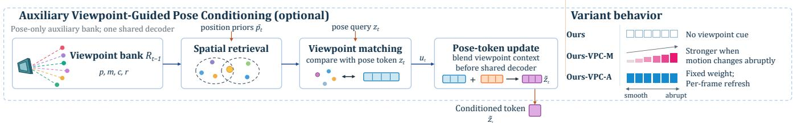  
Fig. 4. Auxiliary viewpoint-guided pose conditioning. Spatial priors retrieve nearby viewpoint-bank entries, whose features are pooled using the pose query to condition its input to the shared decoder. Ours-VPC-M uses motion- and agreement-gated mixing, whereas Ours-VPC-A ℒ� uses agreement-only mixing with per-frame bank refresh. The auxiliary bank leaves the structure and update rule of the core Slot3R memory unchanged, and neither variant requires a second decoder forward.

The viewpoint bank $\mathcal { R } _ { t }$ is maintained separately from the core Slot3R memory $\mathcal { M } _ { t }$ . Each entry stores a 3D position, a memory Incoming feature, a confidence value, and the viewing direction associated with the observation:

$$
\mathcal { R } _ { t } = \left\{ ( p _ { k } ^ { r } , m _ { k } ^ { r } , c _ { k } ^ { r } , r _ { k } ) \right\} .
$$

We adapt the direction-conditioned association and retain-or-replace update of Li et al. [39] for this auxiliary bank. The main Slot3R memory remains on the set-associative K-way update described in Sec. 3.3 and supplies the sparse reconstruction readou of Sec. 3.4. Thus, the viewpoint bank enters through pose-token conditioning without changing the structure or update rule of the core memory. Because pose and image tokens interact in the shared decoder, this conditioning can still influence dense predictions and subsequent memory writes. Ours-VPC-M updates the auxiliary bank every four frames, whereas Ours-VPC-A refreshes it every frame.

Viewpoint-bank retrieval and pooling. Before processing frame t, we use the spatial position priors $\{ \bar { p } _ { t , i } \}$ from Sec. 3.4 to retrieve relevant entries from $\mathcal { R } _ { t - 1 }$ . We uniformly sample at most 192 position priors and rank the viewpoint-bank entries by their minimum Euclidean distance to these sampled positions. We retain the nearest 128 entries, denoted by $\textstyle { \mathcal { K } } _ { t }$

Given the current pose-query token $\mathbf { z } _ { t } .$ , we compute the cosine similarity between the query and each retrieved feature,

$$
s _ { t , k } = \mathrm { s i m } \left( \mathbf { z } _ { t } , m _ { k } ^ { r } \right) ,
$$

and convert the similarities to attention weights using temperature τ :

$$
\alpha _ { t , k } = \frac { \exp ( s _ { t , k } / \tau ) } { \sum _ { \ell \in \mathcal { K } _ { t } } \exp ( s _ { t , \ell } / \tau ) } .
$$

The viewpoint-conditioned feature is then

$$
\mathbf { u } _ { t } = \| \mathbf { z } _ { t } \| _ { 2 } \frac { \sum _ { k \in \mathcal { K } _ { t } } \alpha _ { t , k } m _ { k } ^ { r } } { \left\| \sum _ { k \in \mathcal { K } _ { t } } \alpha _ { t , k } m _ { k } ^ { r } \right\| _ { 2 } } .
$$

The normalization preserves the magnitude of the original pose-query token.

To prevent weakly related viewpoint-bank entries from perturbing the pose query, we compute an agreement factor from the maximum cosine similarity. We first rescale the maximum similarity from [−1, 1] to [0, 1], clip it to this interval for numerica stability, and raise it to the fourth power:

$$
a _ { t } = \left[ \operatorname { c l i p } \left( { \frac { 1 + \operatorname* { m a x } _ { k \in { \mathcal { K } } _ { t } } s _ { t , k } } { 2 } } , 0 , 1 \right) \right] ^ { 4 } .
$$

We use $\tau = 0 . 1 0$ in all reported viewpoint-guided experiments.

Motion gate for Ours-VPC-M. Ours-VPC-M additionally modulates the auxiliary context according to the change in recent rotational motion. Let $\mathbf { R } _ { t - 3 } , \mathbf { R } _ { t - 2 }$ , and $\mathbf { R } _ { t - 1 }$ be the latest three estimated camera rotations available before processing frame t. We form the two relative rotations

$$
\Delta \mathbf { R } _ { t - 2 } = \mathbf { R } _ { t - 3 } ^ { \top } \mathbf { R } _ { t - 2 } , \qquad \Delta \mathbf { R } _ { t - 1 } = \mathbf { R } _ { t - 2 } ^ { \top } \mathbf { R } _ { t - 1 } .
$$

The rotational change $j _ { t }$ is the angular difference between these two relative rotations. We linearly map $j _ { t }$ from $j _ { \mathrm { l o w } }$ to $j _ { \mathrm { h i g h } }$ and clip the result to [0, 1] to obtain the motion gate $g _ { t }$ . We use $j _ { \mathrm { l o w } } = 0 . 0 1 0$ and $j _ { \mathrm { h i g h } } = 0 . 0 3 5$ radians.

The final pose-query mixing is

$$
\widetilde { \mathbf { z } } _ { t } = ( 1 - w _ { t } ) \mathbf { z } _ { t } + w _ { t } \mathbf { u } _ { t } .
$$

For Ours-VPC-M,

$$
w _ { t } ^ { \mathrm { M } } = a _ { t } \lambda _ { \mathrm { j } } g _ { t } , \qquad \lambda _ { \mathrm { j } } = 0 . 0 2 5 .
$$

The auxiliary context therefore receives negligible weight under smooth rotational motion and progressively more influence as the change between consecutive relative rotations increases.

Agreement-only conditioning for Ours-VPC-A. Ours-VPC-A uses the same auxiliary bank, spatial retrieval, cosine attention, and agreement factor, but removes the motion-dependent weighting. Its mixing coefficient is

$$
w _ { t } ^ { \mathrm { A } } = a _ { t } \lambda _ { \mathrm { c } } , \qquad \lambda _ { \mathrm { c } } = 0 . 1 5 .
$$

Hence, motion magnitude does not directly affect the auxiliary residual in Ours-VPC-A; only the agreement between the pose query and retrieved viewpoint features controls its frame-dependent strength. This corresponds to setting the smooth- and highjerk endpoints of the underlying interpolation to the same value, making the interpolation constant.

In both variants, the resulting $\widetilde { \mathbf { z } } _ { t }$ replaces the original pose-query token before the shared decoder. The decoder memory context still comes from the core Slot3R sparse readout, and no second decoder forward is introduced.

## A.2. Extended-Sequence Point-Cloud Reconstruction

Table 6 evaluates sequences of 600–1000 frames with $k = 1$ , rather than the $k = 2$ sampling used in the main comparison. This stress test examines whether reconstruction quality and execution remain stable beyond the sequence lengths reported in Table 1.

All three Slot3R configurations complete the 600–1000-frame settings on both datasets. On NeuralRGBD, Ours averages 18.91 FPS; its peak GPU memory at 600, 700, 800, 900, and 1000 frames is 17.6074, 19.8434, 17.3587, 18.6159, and 20.0095 GB, respectively. The VPC variants sustain 16–17 FPS and stable NC. Point3R and InfiniteVGGT fail beyond 700 frames, while the recurrent baselines complete the streams with larger errors.

Table 6. Extended-sequence point-cloud reconstruction on 7Scenes and NeuralRGBD with k-frame sampling k = 1. “OOM” indicates out-ofmemory failure. Pink, Orange, and Yellow cells mark the best, second-best, and third-best results within each dataset–length–metric block and within each dataset for Avg. FPS; ties occupy the corresponding ranks. † RetrieveVGGT exhausts CPU memory because its full-history KV repository grows with the input sequence.
<table><tr><td rowspan="2">Method</td><td colspan="5">Acc ↓</td><td colspan="5">Comp ↓</td><td colspan="5">NC↑</td><td rowspan="2">Avg. FPS ↑</td></tr><tr><td>600</td><td>700</td><td>800</td><td>900</td><td>1000</td><td>600</td><td>700</td><td>800</td><td>900</td><td>1000</td><td>600</td><td>700</td><td>800 900</td><td>1000</td><td></td></tr><tr><td>7Scenes CUT3R</td><td>0.2117</td><td>0.2200</td><td>0.2381</td><td>0.2658</td><td>0.2674</td><td>0.1263</td><td>0.1286</td><td>0.1279</td><td>0.1236</td><td>0.1010</td><td>0.5620</td><td>0.5602</td><td>0.5547</td><td>0.5502</td><td>0.5333</td><td>17.37</td></tr><tr><td>TTT3R StreamVGGT</td><td>0.0901 OOM</td><td>0.1106 OOM</td><td>0.1338 OOM</td><td>0.1588 OOM</td><td>0.1638 OOM</td><td>0.0477 OOM</td><td>0.0616 OOM</td><td>0.0670 OOM</td><td>0.0728 OOM</td><td>0.0728 OOM</td><td>0.6217 OOM</td><td>0.6157 OOM</td><td>0.6075 OOM</td><td>0.6018 OOM</td><td>0.6013 OOM</td><td>17.04 OOM</td></tr><tr><td>InfiniteVGGT RetrieveVGGTt</td><td>0.0533 OOM</td><td>0.0545 OOM</td><td>OOM 00M</td><td>OOM OOM</td><td>OOM 00M</td><td>0.0356 OOM</td><td>0.0378 OOM 0.2333</td><td>OOM OOM</td><td>OOM OOM</td><td>OOM OOM</td><td>0.6815 OOM</td><td>0.6772 OOM</td><td>OOM OOM</td><td>OOM OOM</td><td>OOM OOM</td><td>3.44 O0M</td></tr><tr><td>ZipMap-Stream Spann3R Point3R</td><td>0.1321 1.0309 0.1039</td><td>0.1236 0.9774 0.0891</td><td>0.1281 0.9379 OOM</td><td>0.1285 0.9294 OOM</td><td>0.1233 0.9545 OOM</td><td>0.2225 1.9878 0.0680</td><td>1.9876 0.0432</td><td>0.2345 1.9716 OOM</td><td>0.2470 1.9669 OOM</td><td>0.2288 1.9844 OOM</td><td>0.5671 0.5372 0.6042</td><td>0.5629 0.5246 0.6023</td><td>0.5602 0.5316 OOM</td><td>0.5543 0.5312 OOM</td><td>0.5567 0.5226 OOM</td><td>17.82 23.85 17.54</td></tr><tr><td>Ours (Core) Ours-VPC-M Ours-VPC-A</td><td>0.0336</td><td>0.0351 0.03400.0346 0.0349</td><td>0.0348 0.0355 0.0352</td><td>0.0369 0.0362 0.0362</td><td>0.0362 0.0364 0.0362</td><td>0.0220 0.0231 0.0228</td><td>0.024 0.0240</td><td>0.0247 0.0239 0.0248</td><td>0.0251 0.0241</td><td>0.0245 0.0237 0.0254 0.0243</td><td>0.6663 0.6627 0.6684 0.6704</td><td>0.6700 0.6672</td><td>0.6703 0.6655 0.6679 0.6701</td><td>0.6739 0.6727</td><td>0.6737 0.6687 0.6726</td><td>19.18 17.52 16.03</td></tr><tr><td>NeuralRGBD</td><td>0.0333</td><td></td><td></td><td>0.4454</td><td>0.4627</td><td></td><td></td><td></td><td></td><td></td><td>0.5861</td><td></td><td></td><td></td><td></td><td></td></tr><tr><td>CUT3R</td><td>0.3547</td><td>0.3961</td><td>0.4217</td><td></td><td></td><td></td><td></td><td></td><td></td><td></td><td></td><td>0.5884</td><td>0.5776 0.6380</td><td>0.5708 0.6204</td><td></td><td></td></tr><tr><td>TTT3R</td><td>0.1626</td><td>0.1959</td><td>0.2463</td><td>0.2793</td><td></td><td>0.2166 0.0621 OOM 0.0364</td><td>0.2327</td><td>0.2536</td><td>0.2590</td><td>0.2641</td><td>0.6733</td><td>0.6523</td><td></td><td></td><td>0.5782</td><td></td></tr><tr><td>StreamVGGT</td><td>OOM</td><td>OOM 0.0688</td><td>OOM OOM</td><td>OOM OOM</td><td>0.2703 OOM OOM</td><td></td><td>0.0861 OOM</td><td>0.1071 OOM</td><td></td><td>0.1338</td><td></td><td></td><td></td><td></td><td></td><td>17.76 17.45</td></tr><tr><td></td><td></td><td></td><td></td><td></td><td></td><td></td><td></td><td></td><td>0.1263</td><td></td><td></td><td></td><td></td><td></td><td></td><td></td></tr><tr><td>InfiniteVGGT</td><td></td><td></td><td></td><td></td><td></td><td></td><td></td><td></td><td>OOM</td><td></td><td></td><td></td><td></td><td></td><td>0.6181</td><td></td></tr><tr><td></td><td>0.0592</td><td></td><td></td><td></td><td></td><td></td><td></td><td></td><td></td><td>OOM</td><td>OOM</td><td>OOM</td><td>OOM</td><td>OOM</td><td>OOM</td><td>OOM</td></tr><tr><td>RetrieveVGGT†</td><td>OOM</td><td>OOM</td><td></td><td></td><td></td><td></td><td>0.0436</td><td>OOM</td><td>OOM</td><td>OOM</td><td>0.7750</td><td>0.7725</td><td>OOM</td><td>OOM</td><td>OOM</td><td>3.44</td></tr><tr><td>ZipMap-Stream</td><td></td><td></td><td>OOM</td><td>OOM</td><td>OOM</td><td>OOM</td><td>OOM</td><td>OOM</td><td>OOM</td><td></td><td></td><td>OOM</td><td>OOM</td><td></td><td></td><td></td></tr><tr><td></td><td>0.1780</td><td>0.1846</td><td>0.2002</td><td>0.2150</td><td>0.2259</td><td>0.2697</td><td>0.3160</td><td></td><td></td><td>OOM</td><td>OOM</td><td></td><td></td><td>OOM</td><td>OOM</td><td>00M</td></tr><tr><td>Spann3R</td><td>0.6594</td><td>0.5771</td><td>0.4579</td><td>0.4555</td><td>0.4837</td><td></td><td></td><td>0.3635</td><td>0.3984</td><td>0.4293</td><td>0.5873</td><td>0.5822</td><td>0.5773</td><td>0.5649</td><td>0.5649</td><td>17.76</td></tr><tr><td>Point3R</td><td>0.1650 0.1885</td><td></td><td></td><td>OOM</td><td></td><td>2.0183</td><td>2.0187</td><td>1.9562</td><td>1.9908 OOM 0.0244</td><td>2.0561</td><td>0.5307</td><td>0.5246</td><td>0.5151</td><td>0.5089</td><td>0.5025</td><td>23.99</td></tr><tr><td></td><td></td><td></td><td>OOM</td><td>0.0604</td><td>OOM 0.0618</td><td>0.0831 0.0146 0.0173</td><td></td><td>OOM</td><td></td><td></td><td></td><td></td><td></td><td></td><td></td><td></td></tr><tr><td>Ours (Core)</td><td>0.0406 0.0505</td><td></td><td>0.0588</td><td>0.0605</td><td>0.0615</td><td></td><td>0.1004</td><td>0.0208 0.0206</td><td>0.0239</td><td>OOM 0.0243 0.0217</td><td>0.6195 0.6567 0.6574</td><td>0.6215</td><td>OOM</td><td>OOM 0.6644</td><td>OOM</td><td>18.19</td></tr><tr><td>Ours-VPC-M</td><td></td><td>0.0503</td><td>0.0588</td><td>0.0609</td><td>0.0605</td><td>0.0147</td><td>0.0176</td><td>0.0209</td><td>0.0245</td><td>0.0216</td><td>0.6575</td><td>0.6631 0.6616 0.6637</td><td>0.6684 0.6652</td><td></td><td>0.6643</td><td>18.91</td></tr><tr><td></td><td>0.0411</td><td></td><td>0.0586</td><td></td><td></td><td></td><td>0.0144 0.0172</td><td></td><td></td><td></td><td></td><td></td><td>0.6693</td><td>0.6614 0.6645 0.6646 0.6657</td><td></td><td></td></tr><tr><td></td><td></td><td></td><td></td><td></td><td></td><td></td><td></td><td></td><td></td><td></td><td></td><td></td><td></td><td></td><td></td><td></td></tr><tr><td>Ours-VPC-A</td><td>0.0405 0.0495</td><td></td><td></td><td></td><td></td><td></td><td></td><td></td><td></td><td></td><td></td><td></td><td></td><td></td><td></td><td>17.24 16.07</td></tr></table>

## A.3. Confidence-Aware Memory Update

Candidate filtering and bucket admission. For each $( p _ { i } , m _ { i } ) \in { \mathcal { C } } _ { t }$ , we compute its confidence $c _ { i }$ by averaging the prediction confidence over the corresponding image patch. We retain candidates at or above a frame-wise quantile threshold:

$$
\mathcal { W } _ { t } = \{ ( p _ { i } , m _ { i } , c _ { i } ) \mid ( p _ { i } , m _ { i } ) \in \mathcal { C } _ { t } , c _ { i } \geq \mathrm { Q u a n t i l e } _ { q } ( \{ c _ { k } \} _ { k = 1 } ^ { N _ { t } } ) \} .\tag{7}
$$

Here $q$ is the drop quantile, and ${ \mathcal { W } } _ { t }$ contains the candidates retained by this frame-level filter. The address $b _ { i } = h ( p _ { i } )$ identifies the destination bucket $B _ { b _ { i } }$ . A candidate whose destination bucket does not yet exist is admitted directly. For an existing bucket, admission depends on feature similarity and the confidence of the stored slots.

For a bucket, we identify its lowest-confidence slot $j _ { \mathrm { m i n } }$ and the slot $j ^ { * }$ whose feature is most similar to the candidate. Let sim $\mathsf { \Omega } _ { 1 } ( a , b ) = a ^ { \top } b / ( \| a \| _ { 2 } \| b \| _ { 2 } )$ denote cosine similarity. We then write:

$$
j _ { \mathrm { m i n } } = \arg \operatorname* { m i n } _ { 1 \leq j \leq n _ { b _ { i } } } c _ { b _ { i } , j } , \qquad j ^ { * } = \arg \operatorname* { m a x } _ { 1 \leq j \leq n _ { b _ { i } } } \sin ( m _ { i } , m _ { b _ { i } , j } ) , \qquad s _ { i } = \sin ( m _ { i } , m _ { b _ { i } , j ^ { * } } ) .\tag{8}
$$

Here $j ^ { * }$ is the selected slot and $s _ { i }$ is its similarity to the candidate. A similar candidate with $s _ { i } \geq \tau _ { \mathrm { m e r g e } }$ is admitted only if $c _ { i } \geq c _ { b _ { i } , j ^ { * } }$ , whereas a dissimilar candidate is admitted if $c _ { i } \geq c _ { b _ { i } , j _ { \operatorname* { m i n } } } ;$ all other candidates are rejected. The former condition prevents a weaker observation from modifying a more reliable matched state, while the latter ensures that a distinct candidate has confidence at least as high as the weakest state in the pre-update snapshot.

Matched-slot fusion. For a single admitted candidate with $s _ { i } \geq \tau _ { \mathrm { m e r g e } }$ , confidence-weighted fusion is

$$
\begin{array} { c } { { \beta _ { i } = \displaystyle \frac { c _ { i } } { c _ { i } + c _ { b _ { i } , j ^ { * } } + \epsilon } , p _ { b _ { i } , j ^ { * } } \gets ( 1 - \beta _ { i } ) p _ { b _ { i } , j ^ { * } } + \beta _ { i } p _ { i } , } } \\ { { \ldots } } \\ { { m _ { b _ { i } , j ^ { * } } \gets ( 1 - \beta _ { i } ) m _ { b _ { i } , j ^ { * } } + \beta _ { i } m _ { i } , c _ { b _ { i } , j ^ { * } } \gets ( 1 - \beta _ { i } ) c _ { b _ { i } , j ^ { * } } + \beta _ { i } c _ { i } . } } \end{array}\tag{9}
$$

The weight $\beta _ { i }$ gives more reliable evidence greater influence on the updated position, feature, and confidence. The implementation evaluates all candidates in a frame against the same pre-update memory snapshot. If multiple candidates target the same slot, i first computes their confidence-weighted mean position and feature and their mean confidence, then applies Eq. (9) once using these aggregate quantities. The single-candidate rule above is the corresponding singleton case.

Distinct-state storage. If no matched slot is available, an admitted candidate is stored as a distinct state. Within each frame, candidates assigned to the same bucket can occupy slots that were free in the pre-update snapshot, up to capacity K. If the snapshot bucket is full, the implementation applies at most one replacement candidate for that bucket. After grouped fusion, this candidate replaces the then-lowest-confidence slot; remaining colliding candidates are rejected. The vectorized implementation resolves excess candidates in its bucket-grouping order rather than assuming a stable input order. Each candidate compares against at most K snapshot slots.

Algorithm 1 summarizes this snapshot-based batched update.

Algorithm 1 Snapshot-based confidence-aware memory update   
Require: Previous memory $\mathcal { M } _ { t - 1 }$ , retained write candidates ${ \mathcal W } _ { t } = \{ ( p _ { i } , m _ { i } , c _ { i } ) \}$ , hash function $h ( \cdot )$ , bucket capacity K, merge   
threshold $\tau _ { \mathrm { m e r g e } } .$   
Ensure: Updated memory $\mathcal { M } _ { t }$   
1: Snapshot $\mathcal { M } ^ { 0 }  \mathcal { M } _ { t - 1 }$   
2: Initialize merge groups $\{ \mathcal { G } _ { b , j } \}$ and distinct groups $\{ \mathcal { D } _ { b } \}$   
3: for all $( p _ { i } , m _ { i } , c _ { i } ) \in \mathcal { W } _ { t }$ in parallel do   
4: $b _ { i } \gets h ( p _ { i } )$ ; read $n _ { b _ { i } } ^ { 0 }$ and slots from $\mathcal { M } ^ { 0 }$   
5: if $n _ { b _ { i } } ^ { 0 } = 0$ then   
6: Append i to $\mathcal { D } _ { b _ { i } }$   
7: else   
8: Compute $j _ { \mathrm { m i n } } , j ^ { * }$ , and si from $\mathcal { M } ^ { 0 }$ using Eq. (8)   
9: if $s _ { i } \geq \tau _ { \mathrm { m e r g e } }$ and $c _ { i } \geq c _ { b _ { i } , j } ^ { 0 } ,$ ∗ then   
10: Append i to $\mathcal { G } _ { b _ { i } , j ^ { * } }$   
11: else if $s _ { i } < \tau _ { \mathrm { m e r g e } }$ and $c _ { i } \geq c _ { b _ { i } , j _ { \operatorname* { m i n } } } ^ { 0 }$ then   
12: Append i to $\mathcal { D } _ { b _ { i } }$   
13: else   
14: Drop i   
15: end if   
16: end if   
17: end for   
18: for all nonempty merge groups $\mathcal { G } _ { b , j }$ do   
19: Compute confidence-weighted $\bar { p } _ { b , j } , \bar { m } _ { b , j }$ , and mean confidence $\bar { c } _ { b , j }$   
20: Fuse $( \bar { p } _ { b , j } , \bar { m } _ { b , j } , \bar { c } _ { b , j } )$ once into snapshot slot $( b , j )$ using Eq. (9)   
21: end for   
22: for all nonempty distinct groups $\mathcal { D } _ { b }$ do   
23: if $n _ { b } ^ { 0 } < K$ then   
24: Insert up to $K - n _ { b } ^ { 0 }$ candidates selected by the vectorized bucket grouping into snapshot-free slots   
25: else   
26: Select one candidate from $\mathcal { D } _ { b }$ by the same grouping order   
27: Replace the lowest-confidence slot of bucket b after grouped fusion with the selected candidate   
28: end if   
29: end for   
30: return $\mathcal { M } _ { t }$

Table 7 favors Drop-then-Compare, particularly at 400–500 frames. Global post-write pruning degrades more sharply because it reduces spatial coverage.

Drop-quantile sensitivity. Tables 8 and 9 show opposing task trends. Stronger filtering generally benefits point-cloud accuracy and memory: at $q = 0 . 2 5$ , NC is highest, memory is 23.5% smaller, and FPS is 7.1% higher than at $q = 0 .$ . Depth favors weaker filtering, and $q = 0 . 2 5$ outperforms $q = 0 . 3 5$ on nine of twelve metrics. We therefore use $q = 0 . 2 5$ as a cross-task compromise between reconstruction, memory, and depth.

Table 7. Ablation of the ordering and scope of confidence-guided memory filtering on NeuralRGBD with k = 2 and n = 9 sequences. All variants retain the same K-way memory, confidence-aware fusion, and 640-token sparse readout. C–D and D–C denote Compare-then-Drop and Drop-then-Compare, respectively. Avg. FPS is computed over the matched 200–500-frame runs. This diagnostic sweep was run separately from the main comparison in Table 1. OOM denotes failure on at least one sequence.
<table><tr><td rowspan="2">Filtering policy</td><td colspan="5">Acc ↓</td><td colspan="5">Comp ↓</td><td colspan="5">NC↑</td><td rowspan="2"> $\mathbf { A v g . F P S \uparrow }$ </td></tr><tr><td>200</td><td>300</td><td>400</td><td>500</td><td>1000</td><td>200</td><td>300</td><td>400</td><td>500</td><td>1000</td><td>200</td><td>300 400</td><td>500</td><td>1000</td></tr><tr><td>C–D, bucket 25%</td><td>0.04400.0450</td><td></td><td>0.0690</td><td>0.0686</td><td>OOM</td><td>0.0180</td><td>0.0150</td><td>0.0227</td><td>0.0204</td><td>OOM</td><td>0.6745</td><td>0.6620</td><td>0.6692</td><td>0.6673</td><td>OOM</td><td>19.52</td></tr><tr><td>C–D, bucket 12.5%</td><td>0.03900.0460</td><td></td><td>0.0672</td><td>0.0708</td><td>OOM</td><td>0.0180</td><td>0.0160 0.0227</td><td></td><td>0.0217</td><td>OOM</td><td>0.6810</td><td>0.6675</td><td>0.6733</td><td>0.6695</td><td>OOM</td><td>18.99</td></tr><tr><td>C–D, global 10%</td><td>0.04200.0620</td><td></td><td>0.1109 0.0861</td><td></td><td>OOM</td><td></td><td>0.0180 0.0190 0.0362 0.0250</td><td></td><td></td><td>OOM</td><td>0.6670</td><td>0.64900.65450.6554</td><td></td><td></td><td>OOM</td><td>19.26</td></tr><tr><td>C-D, global 15%</td><td>0.0530 0.1430 0.1753 0.1242</td><td></td><td></td><td></td><td>OOM</td><td>0.0200 0.0290 0.0660 0.0362</td><td></td><td></td><td></td><td>OOM</td><td>0.66250.64350.64460.6469</td><td></td><td></td><td></td><td>OOM</td><td>19.33</td></tr><tr><td>No dropping</td><td>0.0390 0.0450 0.0617 0.0650</td><td></td><td></td><td></td><td>00M 0.0180 0.0160 0.0214 0.0203</td><td></td><td></td><td></td><td></td><td></td><td>00M 0.6795 0.6635 0.6737 0.6736</td><td></td><td></td><td></td><td>OOM</td><td>18.91</td></tr><tr><td>D-C, 25% (Ours)</td><td>0.0389 0.0408 0.0571 0.0589 0.0631 0.0178 0.0151 0.0207 0.0236 0.0239 0.6801 0.6664 0.6743 0.6729 0.6758</td><td></td><td></td><td></td><td></td><td></td><td></td><td></td><td></td><td></td><td></td><td></td><td></td><td></td><td></td><td>19.02</td></tr></table>

Table 8. A separate sensitivity sweep of the pre-write drop quantile q on 500-frame NeuralRGBD reconstruction with n = 9 sequences. Al variants within this sweep use the same K-way memory and 640-token sparse readout.
<table><tr><td>q</td><td>Acc ↓</td><td>Comp ↓</td><td>NC↑ FPS ↑</td><td>Final tokens ↓</td></tr><tr><td>0.00</td><td>0.0649</td><td>0.0227</td><td>0.6713 17.949</td><td>1367.3</td></tr><tr><td>0.05</td><td>0.0637</td><td>0.0228</td><td>0.6678 19.140</td><td>1291.4</td></tr><tr><td>0.10</td><td>0.0621</td><td>0.0211</td><td>0.6713 19.230</td><td>1210.9</td></tr><tr><td>0.15</td><td>0.0624</td><td>0.0220</td><td>0.6698 19.141</td><td>1163.4</td></tr><tr><td>0.20</td><td>0.0620</td><td>0.0220</td><td>0.6702 19.253</td><td>1101.4</td></tr><tr><td>0.25</td><td>0.0589</td><td>0.0236</td><td>0.6729 19.216</td><td>1046.2</td></tr><tr><td>0.30</td><td>0.0597</td><td>0.0228</td><td>0.6708 19.209</td><td>996.2</td></tr><tr><td>0.35</td><td>0.0588</td><td>0.0231</td><td>0.6673 19.359</td><td>937.1</td></tr></table>

Table 9. Depth sensitivity to the pre-write drop quantile q on ScanNet, Bonn, and KITTI under metric-scale and per-sequence alignment. These results are from a diagnostic sweep separate from the main depth evaluation in Table 2. δ < 1.25 is reported as a percentage.
<table><tr><td rowspan="2">Alignment</td><td rowspan="2">q</td><td colspan="2">ScanNet</td><td colspan="2">Bonn</td><td colspan="2">KITTI</td></tr><tr><td></td><td> $\mathrm { A b s R e l } \downarrow \delta < 1 . 2 5 \uparrow$ </td><td></td><td> $\mathrm { A b s R e l } \downarrow \delta < 1 . 2 5 \uparrow$ </td><td></td><td> $\mathrm { A b s R e l } \downarrow \delta < 1 . 2 5 \uparrow$ </td></tr><tr><td>Metric-scale</td><td>0.00</td><td>0.06219</td><td>96.54</td><td>0.08453</td><td>96.08</td><td>0.18206</td><td>77.19</td></tr><tr><td>Metric-scale</td><td>0.05</td><td>0.06225</td><td>96.53</td><td>0.08534</td><td>95.98</td><td>0.18179</td><td>77.07</td></tr><tr><td>Metric-scale</td><td>0.10</td><td>0.06179</td><td>96.58</td><td>0.08514</td><td>96.04</td><td>0.18216</td><td>77.33</td></tr><tr><td>Metric-scale</td><td>0.15</td><td>0.06251</td><td>96.45</td><td>0.08521</td><td>95.97</td><td>0.18135</td><td>77.11</td></tr><tr><td>Metric-scale</td><td>0.20</td><td>0.06230</td><td>96.43</td><td>0.08547</td><td>96.01</td><td>0.17915</td><td>77.72</td></tr><tr><td>Metric-scale</td><td>0.25</td><td>0.06317</td><td>96.43</td><td>0.08652</td><td>95.86</td><td>0.17966</td><td>77.37</td></tr><tr><td>Metric-scale</td><td>0.30</td><td>0.06290</td><td>96.44</td><td>0.08727</td><td>95.78</td><td>0.17871</td><td>77.58</td></tr><tr><td>Metric-scale</td><td>0.35</td><td>0.06349</td><td>96.24</td><td>0.08730</td><td>95.83</td><td>0.17833</td><td>77.47</td></tr><tr><td>Per-sequence</td><td>0.00</td><td>0.04455</td><td>97.84</td><td>0.06379</td><td>96.38</td><td>0.08708</td><td>93.39</td></tr><tr><td>Per-sequence</td><td>0.05</td><td>0.04495</td><td>97.80</td><td>0.06364</td><td>96.43</td><td>0.08793</td><td>93.35</td></tr><tr><td>Per-sequence</td><td>0.10</td><td>0.04465</td><td>97.83</td><td>0.06350</td><td>96.40</td><td>0.08738</td><td>93.42</td></tr><tr><td>Per-sequence</td><td>0.15</td><td>0.04533</td><td>97.74</td><td>0.06297</td><td>96.44</td><td>0.08806</td><td>93.28</td></tr><tr><td>Per-sequence</td><td>0.20</td><td>0.04554</td><td>97.77</td><td>0.06298</td><td>96.43</td><td>0.08832</td><td>93.23</td></tr><tr><td>Per-sequence</td><td>0.25</td><td>0.04622</td><td>97.72</td><td>0.06324</td><td>96.37</td><td>0.08789</td><td>93.44</td></tr><tr><td>Per-sequence</td><td>0.30</td><td>0.04585</td><td>97.80</td><td>0.06360</td><td>96.39</td><td>0.08772</td><td>93.30</td></tr><tr><td>Per-sequence</td><td>0.35</td><td>0.04675</td><td>97.76</td><td>0.06355</td><td>96.36</td><td>0.08815</td><td>93.31</td></tr></table>

## A.4. Bucket Capacity

The bucket capacity K denotes the maximum number of distinct states retained at one spatial address. Tables 10 and 11 vary only K under two 7Scenes settings. In Table 10, increasing K from 1 to 2 reduces Acc and Comp by 66.7% and 66.5%, respectively, showing that a single state is insufficient when local ambiguity is strong. The trend is smoother when sampling every 20th frame $( k = 2 0 )$ , where Point3R is already competitive; nevertheless, $K = 8$ improves its Acc and Comp by 9.0% and 12.7% while its NC differs by only 0.0009. Across both settings, K = 1 is weakest and gains saturate by $K = 8 .$ . With k = 20, K = 16 uses 67.1% more final tokens than K = 8 without improving reconstruction. Although $K = 1 6$ gives the best reconstruction metrics in Table 10, it uses 63.8% more final tokens than $K = 8$ and is slower. We therefore use $K = 8$ as the default balance between quality, local-state capacity, and memory cost.

Table 10. Bucket-capacity ablation on 7Scenes with k = 2 and 200 sampled frames, where K is the maximum number of slots per spatia bucket. Avg. final token count is averaged across evaluated sequences.
<table><tr><td>Method</td><td>K</td><td> $\operatorname { A c c } \downarrow$ </td><td>Comp ↓</td><td>NC↑</td><td>FPS↑</td><td>Avg. final tokens ↓</td></tr><tr><td>Point3R</td><td></td><td></td><td>0.047003 0.018037</td><td>0.578354</td><td>17.746</td><td>918.0</td></tr><tr><td>Ours (Core)</td><td>1</td><td></td><td>0.089329 0.053222 0.569152 19.911</td><td></td><td></td><td>219.2</td></tr><tr><td>Ours (Core)</td><td>2</td><td></td><td>0.029775 0.017823 0.580439 19.935</td><td></td><td></td><td>250.9</td></tr><tr><td>Ours (Core)</td><td>4</td><td></td><td>0.028163 0.0169600.583035 19.816</td><td></td><td></td><td>440.4</td></tr><tr><td>Ours (Core)</td><td>8</td><td></td><td></td><td>0.026758 0.0170590.584917 19.405</td><td></td><td>754.3</td></tr><tr><td>Ours (Core)</td><td>16</td><td></td><td></td><td>0.026092 0.016093 0.585791 18.958</td><td></td><td>1235.2</td></tr></table>

Table 11. Bucket-capacity ablation on 7Scenes when sampling every 20th frame (k = 20). Avg. final token count is averaged across evaluated sequences.
<table><tr><td>Method</td><td>K</td><td>Acc ↓</td><td>Comp ↓</td><td>NC↑</td><td>FPS ↑</td><td>Avg. final tokens ↓</td></tr><tr><td>Point3R</td><td></td><td>0.034096</td><td>0.024413</td><td>0.649663</td><td>13.618</td><td>1406.9</td></tr><tr><td>Ours (Core)</td><td>1</td><td></td><td></td><td>0.0560780.0393120.636682</td><td>16.914</td><td>168.3</td></tr><tr><td>Ours (Core)</td><td>2</td><td></td><td></td><td>0.0423580.0296190.641545</td><td>16.199</td><td>271.4</td></tr><tr><td>Ours (Core)</td><td>4</td><td></td><td></td><td>0.0341100.0236240.646727</td><td>17.047</td><td>482.4</td></tr><tr><td>Ours (Core)</td><td>8</td><td></td><td></td><td>0.031013 0.021317 0.648767</td><td>16.459</td><td>847.0</td></tr><tr><td>Ours (Core)</td><td>16</td><td></td><td></td><td>0.031309 0.0216900.648118 16.513</td><td></td><td>1415.4</td></tr></table>

## A.5. Readout Budget Sensitivity

The readout budget controls the number of memory tokens exposed to the decoder, not the size of the stored memory. Tables 12 and 13 show that performance saturates at moderate budgets. On NeuralRGBD point-cloud reconstruction, increasing the budget from 128 to 512 improves Acc from 0.043 to 0.039 and NC from 0.653 to 0.680, indicating that very small readouts omit usefu spatial evidence. Beyond 512 tokens, Acc remains within 0.038–0.039 and NC within 0.677–0.681, with no monotonic gain from exposing more tokens. Depth accuracy similarly plateaus around 640–768 tokens: 768 is numerically best, but differs from 640 by only 0.00003 AbsRel and 0.00030 in $\delta < 1 . 2 5$ . We therefore use $K _ { \mathrm { r e a d } } = 6 4 0$ as a balanced budget across reconstruction and depth.

Table 12. Sparse-readout budget sensitivity on NeuralRGBD point-cloud reconstruction with k = 2 and 200 sampled frames. This diagnostic sweep was run separately from the component ablation in Table 4.
<table><tr><td>Sparse budget Acc ↓</td><td>Comp ↓ NC↑ FPS ↑</td></tr><tr><td>128 0.043</td><td>0.017 0.653 20.000</td></tr><tr><td>256 0.041</td><td>0.017 0.665 20.068</td></tr><tr><td>384 0.040</td><td>0.017 0.677 20.312</td></tr><tr><td>512 0.039</td><td>0.018 0.680 19.756</td></tr><tr><td>640 0.038</td><td>0.018 0.677 19.114</td></tr><tr><td>768 0.038</td><td>0.017 0.678 18.925</td></tr><tr><td>912 0.038</td><td>0.017 0.681 19.259</td></tr><tr><td>1024 0.039</td><td>0.018 0.680 19.362</td></tr></table>

Table 13. Sparse-readout budget sensitivity for depth estimation.
<table><tr><td colspan="2">Sparse budget AbsRel ↓  $\delta < 1 . 2 5 \uparrow$ </td></tr><tr><td>128</td><td>0.06508 0.96185</td></tr><tr><td>256</td><td>0.06427 0.96323</td></tr><tr><td>384</td><td>0.06453 0.96245</td></tr><tr><td>512</td><td>0.06405 0.96303</td></tr><tr><td>640</td><td>0.06326 0.96399</td></tr><tr><td>768</td><td>0.06323 0.96429</td></tr><tr><td>912</td><td>0.06392 0.96199</td></tr><tr><td>1024</td><td>0.06390 0.96175</td></tr></table>

## A.6. Spherical Hash versus Voxel Hash

The hash parameterization determines which observations share a bucket and which buckets are treated as neighbors during readout. We compare the proposed azimuth–elevation–log-radius grid with a voxel-style Cartesian quantization under the same sparse-512 setting on seven diagnostic sequences. As shown in Table 14, the spherical hash reduces Acc from 0.1409 to 0.0491 and Comp from 0.0564 to 0.0280, while increasing NC from 0.6076 to 0.7451. This result indicates that the addressing geometry, rather than hash lookup alone, materially affects which local states are grouped and retrieved. We therefore retain the spherical parameterization in the main method, while treating alternative grids as an implementation choice rather than a separate contribution.

Table 14. Hash parameterization ablation for sparse-512 readout.
<table><tr><td>Hash</td><td>n</td><td>Acc↓</td><td>Comp ↓</td><td>NC↑</td><td>Acc med. ↓</td></tr><tr><td>Spherical</td><td>7</td><td>0.0491</td><td>0.0280</td><td>0.7451</td><td>0.0318</td></tr><tr><td>Voxel</td><td>7</td><td>0.1409</td><td>0.0564</td><td>0.6076</td><td>0.0991</td></tr></table>

## A.7. Fused RoPE3D Runtime Control

Runtime comparisons are sensitive to the RoPE3D implementation. Table 15 compares Point3R before and after enabling the fused RoPE3D kernel under the NeuralRGBD diagnostic protocol. The fused kernel raises Point3R throughput from 4.547 to 14.750 FPS while leaving reconstruction metrics and memory essentially unchanged. Under the same fused implementation, the 640-token sparse readout raises throughput from 16.658 to 18.269 FPS relative to full-memory readout, while NC remains 0.753. This bounded readout uses up to 128 uniformly sampled global anchors and fills the remaining 640-token budget with up to 512 additional local tokens after deduplication. These controls separate acceleration due to fused RoPE3D from that due to the local-and-global bounded readout. We therefore use fused RoPE3D for all Point3R-family runtime comparisons and do not count it as part of our method.

Table 15. Effect of fused RoPE3D and sparse readout on NeuralRGBD diagnostic runs with approximately 50-frame sequences. “Ours (Core) w/o sparse readout” uses K-way memory and pre-write filtering with q = 0.25, but exposes the full stored memory to the decoder; Ours (Core) instead applies a bounded readout of at most 640 tokens, comprising up to 128 uniformly sampled global anchors and up to 512 additional loca tokens after deduplication.
<table><tr><td>Method</td><td>Acc</td><td>Comp</td><td>NC↑</td><td>FPS ↑</td><td>Avg. stored tokens ↓</td></tr><tr><td>Point3R w/o fused RoPE3D</td><td>0.084</td><td>0.030</td><td>0.753</td><td>4.547</td><td>1571.0</td></tr><tr><td>Point3R w/ fused RoPE3D</td><td>0.083</td><td>0.030</td><td>0.752</td><td>14.750</td><td>1572.6</td></tr><tr><td>Ours (Core) w/o sparse readout</td><td>0.061</td><td>0.027</td><td>0.753</td><td>16.658</td><td>1204.1</td></tr><tr><td>Ours (Core)</td><td>0.063</td><td>0.029</td><td>0.753</td><td>18.269</td><td>1220.1</td></tr></table>