# SpaceFlow: Locally Controllable 3D Generation

Neil De La Fuente1 ∗, Joan Lafuente1 ∗, Mukhammadali Sayfiddinov1 ∗, Felicia Scharitzer1 ∗, Marc Pollefeys1,3, Ata Çelen1, Sayan Deb Sarkar2 †, Elisabetta Fedele1 †

1ETH Zürich, 2Stanford University, 3Microsoft ∗Equal contribution (ordered alphabetically) †Equal supervision

Current 3D generation methods lack explicit local control: geometric adherence is often defined by a global control strength, and appearance cannot be specified locally. We present SpaceFlow, a trainingfree pipeline for locally controllable 3D generation from text descriptions and a collection of geometric primitives. Each primitive serves as a proxy for an object part and is assigned a local control level, enabling users to specify whether regions should strictly follow the input shape or allow generative completion. During structure generation, we enforce these spatial constraints within the generative flow process. For appearance synthesis, the generated structure is segmented and matched to the primitives. Each generated part is conditioned only on its assigned text or image cue, thereby limiting cross-part leakage. Regional geometry metrics demonstrate that SpaceFlow preserves the specified geometry in high-control regions and enables plausible shape variation in low-control areas. A user study further indicates that the resulting balance between geometric fidelity and generative freedom remains competitive in overall quality. When evaluating appearance on fixed geometry, text-conditioned routing achieves state-of-the-art prompt faithfulness and color/material accuracy. Qualitative results additionally show localized routing of image cues. The project page is available at https://spaceflow3d.github.io.

## Geometric Control

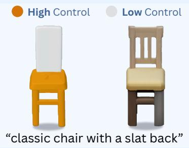

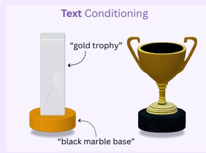

Appearance Control  
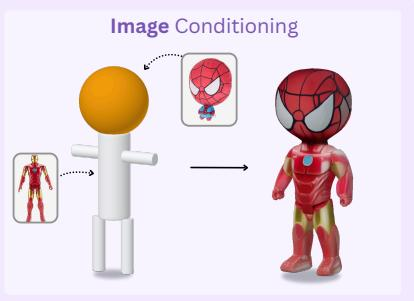

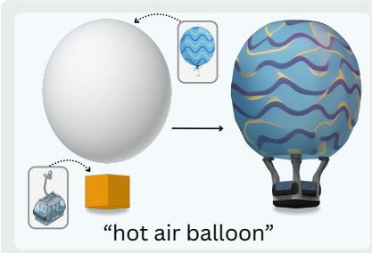  
Joint Geometric and Appearance Control

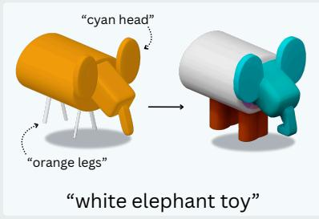

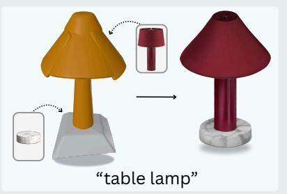  
Figure 1 Overview of Local Geometric and Appearance Control Capabilities. Top left (Geometric Control): SpaceFlow assigns diferent control strengths to editable geometric inputs: orange regions (strong geometric control) preserve the specified geometry, whereas grey regions (weak geometric control) allow prompt-driven completion. Top right (Appearance Control): Local text or image cues are bound to their target primitives, localizing distinct materials on specified regions, and combining visual references across diferent parts. Bottom (Joint Geometric and Appearance Control): Additional examples show localized shape and appearance control.

## 1 Introduction

Recent text- and image-conditioned 3D generative models can synthesize high-quality textured assets across increasingly diverse object categories [1–8]. These advances dramatically lower the barrier from a visual idea or reference to an initial 3D candidate asset, with applications in games, immersive media, and digital content creation [9–13]. Although the quality of assets generated from a single image or text prompt continues to improve, integrating such generators into artistic workflows requires more interactive and controllable guidance mechanisms [14–17].

In practice, asset creation is iterative [18, 19] and part-specific [20–24], rather than one-shot: creators establish coarse structure, inspect generated candidates, retain some design decisions, and revise others [25]. Some parts may have to follow an intended shape, whereas others are left underconstrained, relying on the generative prior [26]. Supporting this process requires control not only over what is generated, but also over where each instruction applies and how strictly it should be followed [20, 27, 28].

To support this need, recent methods augment general-purpose 3D generators [3, 29] with controllable geometric or appearance guidance [28, 30]. On one hand, proxy-guided approaches [28, 31] enable geometric conditioning by guiding 3D generation with an input 3D shape. However, they apply this conditioning globally, such that all regions are equally constrained by the input geometry. On the other hand, other approaches introduce test-time, part-aware guidance for appearance transfer [30] or localized editing of implicit representations [32], while leaving geometry generation unconstrained or operating post-hoc on pre-existing representations. Appearance guidance is also limited to a single global condition, preventing diferent cues from being assigned to diferent regions. Existing approaches therefore lack a unified mechanism for local control over both geometry and appearance.

We propose SpaceFlow, a unified approach for local control of both geometry and appearance during 3D generation, as shown in Fig. 1. In practice, the user specifies the geometry and scene layout as an explicit geometric input, decomposed into an arbitrary set of local parts that can be addressed independently. For geometric conditioning, we assign a local control level to each part: higher levels enforce closer adherence to the specified geometry, whereas lower levels leave more freedom to the generative prior. The formulation is agnostic to how individual parts are represented, ranging from coarse geometric primitives to detailed meshes. Following [28], we represent parts as superquadric primitives [33], which provide a compact, expressive, and easily editable representation. These can either be defined manually or initialized from existing geometry using shape decomposition methods [34, 35].

We use the same part decomposition for appearance conditioning. Specifically, the user can assign a distinct appearance condition to each part, allowing diferent regions to be controlled independently. We achieve this by restricting cross-attention to the condition associated with each part, while retaining global self-attention across all tokens. This enables distinct local appearances while preserving coherence and smooth blending across the generated asset.

We evaluate the geometric and appearance components separately and demonstrate their combined capabilities on diverse multipart assets. Regional geometry metrics show that SpaceFlow preserves strongly constrained regions more faithfully than weak global conditioning, while allowing greater variation in weakly constrained regions than strong global conditioning. A user study further supports this balance between geometric fidelity and generative freedom. On fixed geometry, our VLM-asa-judge evaluation of localized text-conditioned appearance shows higher prompt faithfulness and color/material accuracy than the evaluated TRELLIS and GuideFlow3D variants [3, 30]. We additionally demonstrate localized image-conditioned appearance through qualitative results.

In summary, our technical contributions are:

• An approach to locally control the strength of geometric conditioning for 3D generation.

• An approach to locally condition the appearance of generated 3D assets.

• A unified framework combining both approaches to enable local geometric and appearance control for 3D generation.

## 2 Related Work

3D Asset Generation. Generative 3D modeling has advanced rapidly in output fidelity and representation flexibility, from explicit point clouds [36] and implicit functions [7] to compact latent-space approaches [37–39]. Recently, large-scale generators have achieved strong fidelity: CLAY [1] leverages multi-resolution latent spaces, Hunyuan3D [2] scales difusion for high-resolution textured assets, SAM 3D [29] enables single-image 3D reconstruction, and TRELLIS [3] introduces structured latents factoring geometry and appearance on a sparse voxel grid. However, these models condition on a global text or image prompt and lack fine-grained, localized part control.

Spatially Controllable 3D Generation. Spatially controllable generation conditions on explicit 3D inputs, such as voxels, primitives, proxy shapes, or meshes, rather than ambiguous text or images [28, 39–41]. Existing frameworks either fine-tune generative models to accept structural conditions [31, 41, 42] at additional training cost, or enforce test-time constraints via optimization and latent projection [28, 40] without retraining. Closest to our structural setting, SpaceControl [28] injects user-specified geometry into a pretrained generator’s latent space with a control strength that trades geometric fidelity for generative realism. However, since this trade-of is applied uniformly across the entire asset, it cannot handle scenarios where designated regions must strictly preserve input geometry while others are left unconstrained for generative completion [28].

Appearance Control for 3D Assets. Appearance control has been widely explored across mesh texturing [43–47], radiance fields, and 3D Gaussian splats [48–50]. These methods primarily formulate appearance control as post-hoc texturing or stylization of an existing 3D asset, whereas our focus is localized appearance conditioning during the generative flow process [43, 44, 48, 49]. Guide-Flow3D [30] provided training-free guidance of a pretrained rectified-flow model using a self-similarity loss for robust appearance transfer. However, it transfers a single appearance source globally across the generated asset. In contrast, SpaceFlow routes independent visual conditions to specific semantic parts, eliminating cross-part leakage.

Part-Aware Generation and Editing. A complementary line of work introduces part-aware generators, which incorporate explicit part structure through hierarchical graphs and programs [21, 24], implicit or radiance-field representations, and difusion over point or latent spaces [22, 23, 26, 51], including recent part-level reconstruction and synthesis methods [20, 42, 52–54]. In contrast, SpaceFlow does not require the generated asset to be represented as parts; it uses primitives and part assignments only as localized control signals for a pretrained generator.

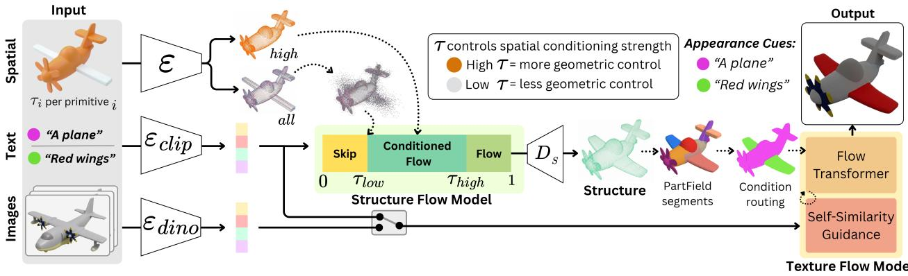  
Figure 2 SpaceFlow pipeline. Given editable geometric controls with local geometric conditioning strengths $\tau _ { i } ,$ SpaceFlow encodes the high-control regions and injects them into the sparse-structure flow process over a controlled time interval. The resulting structure is segmented with PartField [55], then per-part text or image conditions are routed to each part, and the latent is finally passed to an appearance flow model and refined with self-similarity guidance, producing a 3D asset with localized geometric and appearance control.

## 3 Method

## 3.1 Problem Formulation

Given a text prompt � and a user-edited set of deformable primitives $\mathcal { S } = \{ S _ { i } \} _ { i = 1 } ^ { N }$ , our goal is to generate a textured 3D asset $X = ( G , T )$ whose geometry and appearance adhere to localized spatial controls. Each primitive $S _ { i }$ is parameterized by a control strength $\tau _ { i } \in \{ \tau _ { \mathrm { l o w } } , \tau _ { \mathrm { h i g h } } \}$ and an optional appearance cue $a _ { i } \in \mathcal { A }$ such as an image or text prompt. The control strengths $\tau _ { i }$ determine the local trade-of between geometric fidelity and generative freedom. $\tau _ { \mathrm { h i g h } }$ promotes strict adherence to the input, whereas $\tau _ { \mathrm { l o w } }$ relaxes the spatial constraints to allow for flexible modeling using a generative prior. As shown in Fig. 3, assigning control independently per primitive enables the trade-of to vary spatially across the asset. Furthermore, when an appearance cue $a _ { i }$ is available, it only influences the appearance of its corresponding primitive region $S _ { i }$

## 3.2 Preliminaries

TRELLIS [3] is a pretrained 3D generator based on structured latents (SLAT), which attach local feature vectors to the active voxels of a sparse 3D grid. It generates assets in two stages using rectified flow transformers: first establishing the coarse sparse voxel structure, and then synthesizing the local geometry and appearance latents on the active voxels. Finally, diferent decoders are applied to map SLAT to diverse 3D representations [56–58] of high quality.

SpaceControl [28] is a training-free method built on TRELLIS that enables conditioning asset generation on geometric inputs. Given a user-specified geometric control input S (primitives or meshes), it encodes the geometry into the structure latent space via TRELLIS’s pretrained VAE encoder to obtain a clean latent $\mathbf { z } _ { 1 }$ . Instead of sampling from pure Gaussian noise, SpaceControl perturbs $\mathbf { z } _ { 1 }$ to an intermediate flow timestep $\tau ,$ producing a partially noisy latent $\mathbf { z } _ { \tau }$ , and starts denoising from this state. The timestep � serves as a global control parameter governing the trade-of between geometric adherence and generative freedom across the entire asset.

## 3.3 Method Overview

We propose SpaceFlow, a training-free framework built upon TRELLIS [3]. As shown in Fig. 2, our method takes as input a set of editable superquadric control shapes with per-primitive geometric conditioning strengths $\tau _ { i } ,$ , alongside optional appearance cues $a _ { i }$ (text descriptors or reference images) for localized appearance control.

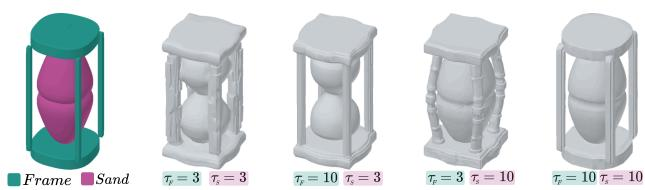  
Figure 3 Local spatial control. Starting from the same "hourglass" superquadric primitive set and prompt, high control (�=10) preserves the corresponding part’s input geometry, while low control (� = 3) allows generative variation. The four settings showcase independent control of the frame and sand.

The primitives and their corresponding control levels $\tau _ { i }$ first guide the Structure Flow Model (Sec. 3.4) during sparse-structure generation. The resulting sparse structure is then passed to the appearance stage. We extract and cluster Part-

Field [55] features on this structure to segment the geometry, match each segment to its respective input primitive, and route the local appearance conditions to their target regions in the Appearance Flow Model (Sec. 3.5). Finally, self-similarity guidance [30] is applied to ensure coherent appearance and smooth cross-part transitions.

## 3.4 Local Geometric Control

To implement local geometric control during structure generation, we partition the user-defined primitives S according to their assigned control levels $\tau _ { i } \dot { \cdot }$

$$
S _ { r } = \{ S _ { i } \in S \mid \tau _ { i } = \tau _ { r } \} , \qquad r \in \{ \mathrm { l o w } , \mathrm { h i g h } \} ,\tag{1}
$$

where $\tau _ { \mathrm { l o w } }$ and $\tau _ { \mathrm { h i g h } }$ denote the endpoints of the flow interval over which spatial guidance is enforced. First, we convert the complete set S and the high-control subset $S _ { \mathrm { h i g h } }$ into meshes independently. Both meshes are encoded into the structure latent space via the TRELLIS VAE to obtain clean latents $\mathbf { z } _ { 1 } ^ { \mathrm { a l l } }$ and $\mathbf { z } _ { 1 } ^ { \mathrm { h i g h } }$ . Additionally, we construct a binary spatial mask $\mathbf { M } _ { \mathrm { l o w } }$ by generating a bounding box around $S _ { \mathrm { l o w } }$ and downsampling the region to match the dimensions of the latent grid. Following [28], we perturb $\mathbf { z } _ { 1 } ^ { \mathrm { a l l } }$ with noise at timestep $\tau _ { \mathrm { l o w } }$ to obtain $\mathbf { z } _ { \tau _ { \mathrm { l o u } } } ^ { \mathrm { a l l } }$ and begin the denoising process, thus establishing the coarse layout of the more flexible, low-control components.

To preserve the precise geometry and structural details of high-control regions, we inject the clean high-control latent $\mathbf { z } _ { 1 } ^ { \mathrm { h i g h } }$ at each denoising step �. Using the low-control mask $\mathbf { M } _ { \mathrm { l o w } }$ , we compute a spatially masked weighted average to update the latent state $\mathbf { z } _ { t } ^ { \prime } \mathrm { : }$

$$
\mathbf { z } _ { t } ^ { \prime } = ( 1 - \mathbf { M } _ { \mathrm { l o w } } ) \odot \left( \alpha \mathbf { z } _ { 1 } ^ { \mathrm { h i g h } } + ( 1 - \alpha ) \mathbf { z } _ { t } \right) + \mathbf { M } _ { \mathrm { l o w } } \odot \mathbf { z } _ { t }\tag{2}
$$

where $\mathbf { z } _ { t }$ is the intermediate denoised prediction, ⊙ denotes the element-wise product, and � is the blending weight.

We leverage a RePaint-inspired resampling strategy [59] over � iterations for a smooth transition between high- and low-control regions. In each iteration, we perturb the blended state from $t _ { i + 1 }$ back to step $t _ { i }$ following the noise schedule, denoise forward to $t _ { i + 1 }$ in a single solver step, and re-apply the masked blending in Eq. 2. This iterative resampling is performed across the interval $[ \tau _ { \mathrm { l o w } } , \tau _ { \mathrm { h i g h } } ]$ corresponding to the Conditioned Flow phase shown in Fig. 2.

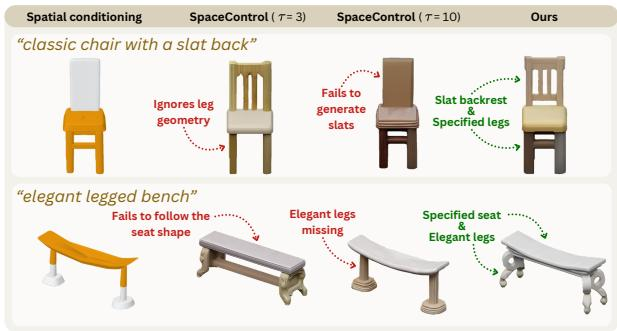  
(a) Spatial control in isolation

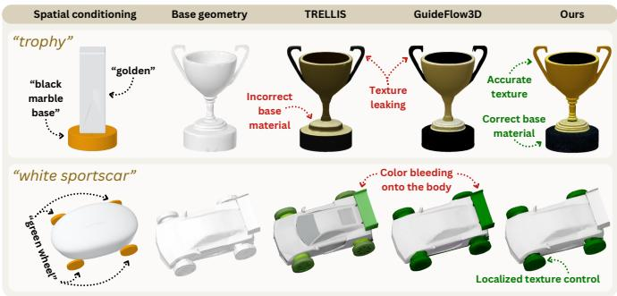  
(b) Appearance control in isolation  
Figure 4 Spatial and appearance control in isolation. (a) Spatial control. Uniform control with SpaceControl either loses specified structure (�=3) or constrains the full object (�=10), whereas SpaceFlow preserves the high-control regions and allows the generative prior to complete the low-control regions. (b) Appearance control on fixed geometry. Global conditioning can miss part-level cues or spread them beyond their targets; SpaceFlow routes each color or material cue to its target part while retaining coherent textures.

## 3.5 Local Appearance Routing and Guidance

The appearance stage takes as input the generated sparse structure and the local appearance cues $\mathcal { A } = \left\{ a _ { i } \right\} _ { i = 1 } ^ { N }$ , which default to the global text prompt � when unspecified. To ensure each local cue afects only its designated primitive $S _ { i } ,$ we propose local appearance routing. Specifically, we define a routing volume Φ that maps every appearance-latent voxel to its corresponding condition $a _ { i } ,$ dictating which prompt guides each spatial region along the flow trajectory.

Constructing Φ requires establishing semantic correspondences between the generated structure and initial primitives. Direct per-voxel geometric assignment is unreliable as low-control regions can be reshaped by the generative prior, causing drift from their original boundaries. To resolve this, we extract PartField [55] descriptors from the generated structure, cluster the active voxels via �-means, and assign each semantic cluster as a unit to its closest input primitive. This produces a geometrically adaptive part-consistent routing volume, accommodating for structural reinterpretation. Details on cluster-to-primitive assignment and small-part handling are described in Supp.

We build on the optimization-guided rectified flow mechanism in [30], extending its global appearance guidance with the routing volume $\Phi .$ . Each cue $a _ { i }$ is encoded into an embedding $\mathbf { e } _ { i } .$ . Within every cross-attention layer, each latent voxel attends only to the embedding selected by Φ. This confines each cue to its user-intended region.

Cross-attention routing alone does not completely isolate local cues because subsequent self-attention can inadvertently propagate and blend appearance features across distinct parts [60, 61]. We inject a soft self-attention bias modulated by Φ. For any query-key pair sharing the same assigned condition, we add a positive bias of log � (� > 1) to their raw attention logit [62]. This prioritizes intra-part feature propagation without blocking interactions across the rest of the asset.

To further encourage a coherent appearance within semantic parts, we optimize a test-time supervised contrastive loss over the PartField semantic clusters $\{ \ell _ { j } \}$ :

$$
\mathcal { L } = - \frac { 1 } { \vert \mathcal { V } \vert } \sum _ { j } \log \frac { \sum _ { k : \ell _ { k } = \ell _ { j } , k \neq j } \exp ( s _ { j k } / \tau _ { c } ) } { \sum _ { k \neq j } \exp ( s _ { j k } / \tau _ { c } ) } ,\tag{3}
$$

where $_ \mathrm { ~ \textit ~ { ~ N ~ } ~ }$ is the set of structure voxels, $\boldsymbol { s } _ { j k }$ is the cosine similarity between voxel latents, and $\tau _ { c }$ is the temperature. During inference, we perform test-time optimization directly on the intermediate appearance latents without modifying the pretrained network weights. Specifically, at each guidance step, we compute $\nabla _ { \mathbf Z } \mathcal { L }$ and update the latent state. This pulls together features within the same semantic part while pushing distinct parts apart. To maintain optimal visual fidelity, we track the latents along the guidance trajectory and select the lowest-loss state for final decoding. Full implementation details, routing hyperparameters, and optimizer configurations are provided in Supp.

## 4 Experimental Results

We evaluate each control component separately to isolate their efects: Sec. 4.1 analyzes local geometric control, while Sec. 4.2 evaluates localized appearance conditioning.

Dataset. To evaluate geometric and appearance control, we constructed a dataset of 83 geometric and appearance conditionings covering diverse object categories. Geometric conditioning is provided through superquadric primitives with designated high-control $( \tau _ { i } = 1 0 )$ and low-control $\left( \tau _ { i } = 3 \right)$ regions. Appearance conditioning is defined by local text prompt associated to single or multiple superquadrics. We refer to Supp. for more details.

## 4.1 Geometric Control

We evaluate our localized geometric control formulation $( \tau _ { \mathrm { h i g h } } = 1 0$ and $\tau _ { \mathrm { l o w } } = 3 )$ in direct comparison to SpaceControl with uniform global guidance scales $( \tau = 3 \ \mathrm { o r } \ \tau = 1 0 )$ . Specifically, � = 3 allows the generative model substantial freedom to generate natural, plausible geometry while retaining a smal level of structural guidance, whereas $\tau = 1 0$ enforces strict geometric adherence to the input shapes.

## 4.1.1 Quantitative Results

We evaluate the performance of SpaceFlow in local geometric control using GPT 5.6 Sol as an automated VLM judge. We assess prompt and geometric fidelity (PGF), which captures high-control shape adherence and low-control prompt completion, alongside realism and overall preference. Each comparison is evaluated in three passes with random ordering and aggregated by majority vote.

Tab. 1 shows the head-to-head win rates against global guidance baselines. These results illustrate the trade-of of uniform guidance: it forces a single compromise across the entire asset. A high global scale (� =10) enforces geometry at the expense of realism, whereas a low scale (� =3) allows generative freedom but weakens input adherence.

PGF results demonstrate that SpaceFlow reliably follows the high-control input geometry while using the generative prior to match the prompt in low-control regions. The Overall metric confirms that, when evaluated on the complete input, our method is preferred against both baselines.

Table 1 Localized geometric control. Win rates (%) of SpaceFlow $( \tau _ { \mathrm { l o w } } = 3 , \tau _ { \mathrm { h i g h } } = 1 0 )$ against SpaceControl [28] using a uniform global control strength. Brackets report 95% Wilson CIs over 83 assets.
<table><tr><td rowspan="2">Baseline</td><td colspan="2">Prompt and geometric fidelity</td><td colspan="2">Realism</td><td colspan="2">Overall</td></tr><tr><td>Win rate</td><td>95% CI</td><td>Win rate</td><td>95% CI</td><td>Win rate</td><td>95% CI</td></tr><tr><td>SpaceControl (τ = 3)</td><td>78.3%</td><td>[68.3, 85.8]</td><td>43.4%</td><td>[33.2, 54.1]</td><td>75.9%</td><td>[65.7, 83.8]</td></tr><tr><td>SpaceControl (τ = 10)</td><td>66.3%</td><td>[55.6, 75.5]</td><td>85.5%</td><td>[76.4, 91.5]</td><td>68.7%</td><td>[58.1, 77.6]</td></tr></table>

## 4.1.2 Geometric and Feature-Space Evaluation

To complement the VLM evaluation, we quantify spatial fidelity, regional feature deviation, and semantic alignment using three metrics:

(a) Regional Chamfer Distance. We evaluate spatial fidelity to the input primitives by computing the Chamfer Distance (CD) separately on the designated high-control $\left( \mathrm { C D } _ { \mathrm { h i g h } } \right)$ and low-control $\left( \mathrm { C D } _ { \mathrm { l o w } } \right)$ regions. Specifically, we partition mesh faces by mapping each face centroid to the nearest input primitive surface, inheriting its assigned control level. All meshes are normalized to a unit cube, and we report the symmetric mean-squared Chamfer distance $( \times 1 0 ^ { 3 } )$ . To quantify the diference in control enforcement across regions, we compute the regional delta $\Delta \mathrm { C D } = \mathrm { C D } _ { \mathrm { l o w } } - \mathrm { C D } _ { \mathrm { h i g h } }$ , where a higher positive value indicates that the model efectively diferentiates control strengths, preserving specified geometry more strictly in high-control regions than in low-control ones.

(b) Feature-Based Deviation. As a complementary measure of local control, we compare each source voxel structure $V ^ { s } { } _ { ; }$ , for $s \in \{ \mathrm { l o c a l } \cdot \tau , \tau = 3 \}$ , with a uniformly guided $\tau = 1 0$ reference $V ^ { 1 \bar { 0 } }$ . This reference remains close to the input while providing an object-like surface on which PartField descriptors are meaningful; direct adherence to the superquadric proxy is measured separately by Chamfer distance. Each active voxel $\upsilon \in V ^ { s }$ has a spatial coordinate $x _ { \nu }$ and an $\ell _ { 2 }$ -normalized PartField feature $\boldsymbol { z } _ { \nu } ^ { s }$ sampled at $x _ { \nu }$ . We first match it to its nearest reference voxel:

$$
\boldsymbol { u } ^ { * } ( \boldsymbol { \nu } ) = \underset { \boldsymbol { u } \in V ^ { 1 0 } } { \operatorname { a r g m i n } } \| \boldsymbol { x } _ { \boldsymbol { \nu } } - \boldsymbol { x } _ { \boldsymbol { u } } \| _ { 2 } .\tag{4}
$$

We then compute the cosine distance in PartField space:

$$
d _ { \mathrm { f e a t } } ^ { s \to 1 0 } ( \upsilon ) = 1 - \mathbf { z } _ { \nu } ^ { s } \cdot \mathbf { z } _ { u ^ { * } ( \nu ) } ^ { 1 0 } .\tag{5}
$$

As for regional Chamfer distance, each voxel inherits the high- or low-control label of its nearest input primitive. Let $V _ { r } ^ { s }$ denote the source voxels assigned to region $r \in$ {high, low}. Their mean feature distance is

$$
D _ { r } ^ { s \to 1 0 } = \frac { 1 } { | V _ { r } ^ { s } | } \sum _ { \nu \in V _ { r } ^ { s } } d _ { \mathrm { f e a t } } ^ { s \to 1 0 } ( \nu ) .\tag{6}
$$

Finally, the feature delta $\Delta D ^ { s  1 0 } = D _ { \mathrm { l o w } } ^ { s  1 0 } - D _ { \mathrm { h i g h } } ^ { s  1 0 }$ is positive when low-control features deviate more from the reference than high-control features, enabling direct comparison with SpaceControl.

(c) Text Alignment. In order to verify semantic fidelity to the text prompt, we compute the CLIP similarity between rendered views of the generated assets and the input text.

Results. Tab. 2 reports additional metrics evaluating our method against SpaceControl baselines under uniform global guidance $( \tau { = } 3 \mathrm { a n d } \tau { = } 1 0 )$ . The regional Chamfer Distance on high-control areas $( \mathrm { C D } _ { \mathrm { h i g h } } )$ demonstrates that SpaceFlow provides significantly stronger geometric adherence than $\tau = 3$ , approaching the strict compliance of the $\tau = 1 0$ baseline.

The regional deltas show that while uniform SpaceControl baselines exhibit virtually no diference in the level of control across regions $\left( \Delta \mathrm { C D } \approx 0 \right)$ and $\Delta D ^ { s  1 0 } \approx 0 )$

Table 2 Quantitative evaluation of spatial control selectivity and semantic alignment. We report the regional Chamfer Distance delta $( \Delta \mathrm { C D } = \mathrm { C D } _ { \mathrm { l o w } } - \mathrm { C D } _ { \mathrm { h i g h } } , \times 1 0 ^ { 3 } )$ , the feature deviation delta to the reference $( \Delta D ^ { s \breve {  } 1 0 } = D _ { \mathrm { l o w } } ^ { s  1 0 } - D _ { \mathrm { h i g h } } ^ { s  1 0 } )$ , and CLIP text-image similarity. Positive Δ values indicate efective localized control selectivity between high- and low-control regions. †Δ� is 0.00 by definition for $\tau = 1 0$ as $D ^ { 1 0 \to 1 0 } = 0$
<table><tr><td>Method</td><td> $\mathrm { C D } _ { \mathrm { h i g h } } \downarrow$ </td><td>∆CD↑</td><td> $\Delta D ^ { s  1 0 }$ </td><td>↑CLIP ↑</td></tr><tr><td>SpaceControl (τ=3)</td><td>15.99</td><td>-0.14</td><td>0.01</td><td>0.232</td></tr><tr><td>SpaceControl (τ=10)</td><td>0.94</td><td>0.11</td><td>0.00†</td><td>0.226</td></tr><tr><td>SPACEFLOW (Ours)</td><td>3.65</td><td>6.05</td><td>0.15</td><td>0.233</td></tr></table>

SpaceFlow achieves a substantial positive delta in both physical geometry (ΔCD) and feature space $( \Delta D ^ { s  1 0 } )$ . This confirms that our method efectively leverages the two control levels, performing more constrained generation in high-control than low-control regions. Furthermore, CLIP similarity remains comparable across methods, suggesting that this selectivity does not reduce semantic alignment. Together, these objective metrics ground the VLM judge’s findings, demonstrating that localized control successfully bypasses the rigid trade-of of uniform guidance across the entire asset.

## 4.1.3 Human Evaluation

To complement our quantitative evaluation, we conducted a pairwise user study assessing the perceptual quality of the generated assets. We compared SpaceFlow against SpaceControl baselines under uniform guidance (� =3 and � =10). For each scene, three variants (SpaceFlow, $\tau = 3$ and $\tau = 1 0 )$ were generated from identical text prompts and superquadric inputs. Participants inspected interactive 3D model pairs side-by-side and evaluated them based on shape fidelity, realism, and overall preference, yielding a total of 337 trials across 29 evaluators.

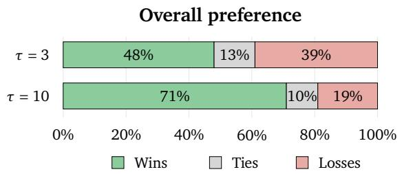  
Figure 6 User study showing overall preference for SpaceFlow over SpaceControl [28] with uniform �=3 and �=10 guidance across 337 evaluation trials.

As shown in Fig. 6, SpaceFlow remains competitive in overall preference against low guidance (�=3), with a 48% win rate, and is strongly preferred to the high-guidance baseline $\left( \tau = 1 0 \right)$ , with a 71% win rate. Overall, the study shows that local control avoids the rigid trade-of of uniform global guidance while maintaining overall quality.

## 4.2 Appearance Control

We assess localized appearance control using GPT 5.6 Sol as an automated vision-language judge, evaluating multiple rendered views of each asset.

Text-conditioned appearance. We evaluate on 83 text-conditioned assets across three variants sharing an identical base structure: (i) TRELLIS, applying the appearance flow model on fixed geometry without guidance or routing; (ii) GuideFlow3D, employing self-similarity guidance without routing; and (iii) SpaceFlow (ours), adding part-wise condition routing to self-similarity guidance (Sec. 3.5).

Table 3 Pairwise appearance evaluation. Win rates (%) of SpaceFlow against fixed-structure appearance baselines. Brackets report 95% Wilson CIs over the set of test assets.
<table><tr><td rowspan="2">Baseline</td><td colspan="2">Prompt faithfulness</td><td colspan="2">Texture detail</td><td colspan="2">Overall</td></tr><tr><td>Win rate</td><td>95% CI</td><td>Win rate</td><td>95% CI</td><td>Win rate</td><td>95% CI</td></tr><tr><td>TRELLIS</td><td>63.9%</td><td>[53.1, 73.4]</td><td>31.3%</td><td>[22.4, 41.9]</td><td>59.0%</td><td>[48.3, 69.0]</td></tr><tr><td>GuideFlow3D</td><td>58.5%</td><td>[47.7, 68.6]</td><td>37.5%</td><td>[27.7, 48.5]</td><td>57.3%</td><td>[46.5, 67.5]</td></tr></table>

The input specifies per-primitive requests, such as an orange backrest or a red cushion, consumed by all methods. We perform two complementary evaluations:

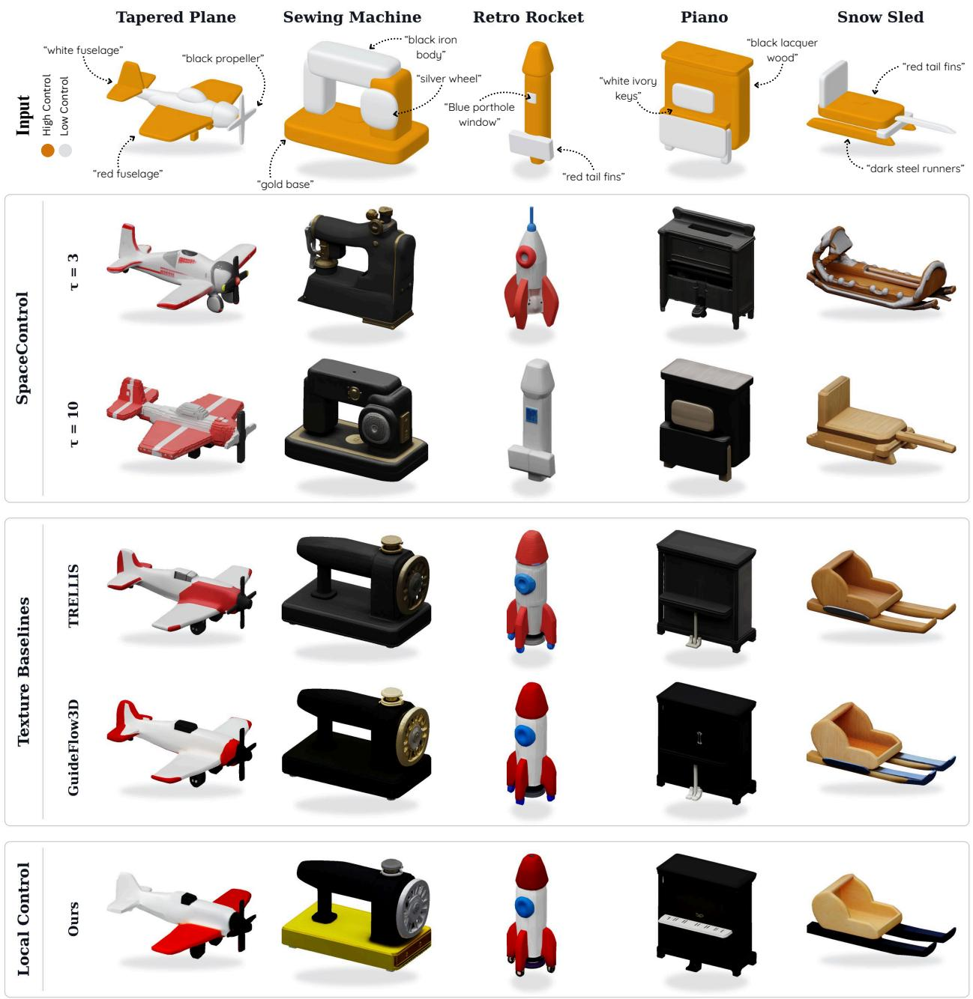  
Figure 5 Qualitative comparison of spatial and appearance control across diverse assets. Control (top): Input superquadric proxies with designated local control strengths (orange: high control $\tau _ { i } = 1 0 ;$ gray: low control $\tau _ { i } = 3 )$ and localized part-level appearance prompts. SpaceControl [28]: Baselines under uniform control strengths (�=3 vs. �=10), illustrating the trade-of between generative reinterpretation and strict adherence to the proxy geometry. Texture Baselines: Appearance baselines (TRELLIS [3] and GuideFlow3D [30]) built directly on our generated structure to isolate texture synthesis. Local Control (Ours): SpaceFlow provides localized geometric control (generating text-aligned geometric details in low-control regions while preserving high-control shapes) alongside accurate part-level texture routing.

First, an absolute rating on a 1–10 scale across four metrics: prompt faithfulness (evaluating localized per-primitive adherence), color and material accuracy (evaluating the correctness of colors and surface finishes relative to the prompt), texture detail, and overall preference (see Supp. for details). We report the mean scores in Tab. 4. Second, analogous to our geometric evaluation, we conduct a pairwise head-to-head evaluation to measure win rates across prompt faithfulness, texture detail, and overall preference.

In pairwise comparisons (Tab. 3), SpaceFlow shows an advantage on prompt-faithfulness and overall preference (considering the input requirements) over TRELLIS [3] and GuideFlow3D [30]. This shows that part-wise routing improves prompt fidelity by ensuring that localized appearance cues are faithfully reflected in the final asset and eliminating cross-part color bleeding. Conversely, both baselines are favored on texture detail, indicating that localized routing prioritizes part-level prompt adherence at some cost to unconstrained texture quality.

Table 4 Quantitative evaluation of appearance control. Mean scores (1–10) averaged over 83 cases: prompt faithfulness (PF), color/material accuracy (CM), texture detail (TD), and overall. All variants share the same structure; metrics are appearance-only.
<table><tr><td>Method</td><td>PF↑ CM↑ TD↑</td><td>Overall↑</td></tr><tr><td>TRELLIS</td><td>6.13 5.79 6.87</td><td>6.42</td></tr><tr><td>GuideFlow3D</td><td>6.40 5.96 6.76</td><td>6.46</td></tr><tr><td>SPACEFLOW (ours)</td><td>7.07 6.43 6.49</td><td>6.78</td></tr></table>

The complementary absolute ratings in Tab. 4 show that SpaceFlow ’s gains in localized prompt fidelity and material accuracy compensate for its lower unconstrained texture uniformity, yielding the highest overall score. Further, since all three variants share the same base structure, Tab. 4 isolates the improvement from self-similarity guidance from TRELLIS [3] to GuideFlow3D [30], and the additional efect of localized condition routing in SpaceFlow.

Image-conditioned appearance. In the image regime, appearance is dictated by reference style images. Because baseline methods cannot process per-part image conditions, SpaceFlow is scored standalone on local routing accuracy, style fidelity, texture detail, and overall preference (see Supp. for details). SpaceFlow obtains a style fidelity of 6.53, a local routing accuracy of 7.07, texture detail of 6.33, and an overall score of 6.73, confirming that our framework efectively transfers visual style references to their designated regions.

## 4.3 Qualitative Results

As shown in Fig. 4, existing methods use global control, forcing the entire object to follow either geometric fidelity (� = 10) or generative freedom (� = 3), while global appearance cues may leak across parts. SpaceFlow avoids this compromise by assigning control strengths per region and routing appearance cues to their corresponding parts.

Fig. 5 presents a diverse gallery of multi-part objects. Under our joint control, high-control primitives (orange) strictly guide the asset geometry in the specified area, while low-control proxies (gray) are completed with text-aligned geometric details (e.g., the rocket tail fins). To benchmark each modality without confounding factors, the figure isolates both axes: SpaceControl baselines demonstrate the structural failure modes of uniform � under identical texturing, whereas TRELLIS and GuideFlow3D show texture leakage across our fixed geometry. In contrast, SpaceFlow consistently preserves userspecified geometry while cleanly localizing textures to their target parts (see Supp. for more qualitative results).

## 5 Conclusion

We introduced SpaceFlow, an inference-time framework for localized geometry and appearance control in 3D asset generation. Editable geometric inputs define the controlled regions, each associated with a geometric control level and a text or image appearance cue. During structure generation, the control levels modulate spatial guidance, allowing constrained regions to follow the input geometry more closely while leaving others unconstrained, relying on the generative prior. During appearance synthesis, the framework matches the input regions to generated parts and routes each cue only to its corresponding part, supporting localized conditioning while limiting cross-part leakage.

Evaluations combining vision-language judge assessments, user studies, and regional metrics demonstrate that SpaceFlow successfully overcomes the limitations of uniform global guidance, enabling localized geometric control. Furthermore, localized appearance routing consistently outperforms existing unrouted baselines in prompt faithfulness. Overall, SpaceFlow enables users to specify not only what to generate, but precisely where each spatial constraint and appearance cue should apply.

## 6 Acknowledgements

NF is funded by the Rafael del Pino Foundation. EF is supported by the ETH AI Center doctoral fellowship and by the Swiss National Science Foundation (SNSF) Advanced Grant 216260 (Beyond Frozen Worlds: Capturing Functional 3D Digital Twinsfrom the Real World). SDS is partly supported by the Stanford Doerr School of Sustainability.

## References

[1] Longwen Zhang, Ziyu Wang, Qixuan Zhang, Qiwei Qiu, Anqi Pang, Haoran Jiang, Wei Yang, Lan Xu, and Jingyi Yu. CLAY: A Controllable Large-scale Generative Model for Creating High-quality 3D Assets. ACM TOG, 2024. 2, 3

[2] Tencent Hunyuan3D Team. Hunyuan3D 2.0: Scaling Difusion Models for High Resolution Textured 3D Assets Generation, 2025. 3

[3] Jianfeng Xiang, Zelong Lv, Sicheng Xu, Yu Deng, Ruicheng Wang, Bowen Zhang, Dong Chen, Xin Tong, and Jiaolong Yang. Structured 3D Latents for Scalable and Versatile 3D Generation. In CVPR, 2025. 2, 3, 4, 5, 10, 11, 22

[4] Jiaxiang Tang, Zhaoxi Chen, Xiaokang Chen, Tengfei Wang, Gang Zeng, and Ziwei Liu. LGM: Large Multi-view Gaussian Model for High-Resolution 3D Content Creation. In ECCV, 2024.

[5] Ben Poole, Ajay Jain, Jonathan T. Barron, and Ben Mildenhall. DreamFusion: Text-to-3D Using 2D Difusion. In ICLR, 2023.

[6] Jiale Xu, Weihao Cheng, Yiming Gao, Xintao Wang, Shenghua Gao, and Ying Shan. InstantMesh: Eficient 3D Mesh Generation from a Single Image with Sparse-view Large Reconstruction Models, 2024.

[7] Heewoo Jun and Alex Nichol. Shap-E: Generating Conditional 3D Implicit Functions, 2023. 3

[8] Minghua Liu, Ruoxi Shi, Linghao Chen, Zhuoyang Zhang, Chao Xu, Xinyue Wei, Hansheng Chen, Chong Zeng, Jiayuan Gu, and Hao Su. One-2-3-45++: Fast Single Image to 3D Objects with Consistent Multi-View Generation and 3D Difusion. In CVPR, 2024. 2

[9] Chen-Hsuan Lin, Jun Gao, Luming Tang, Towaki Takikawa, Xiaohui Zeng, Xun Huang, Karsten Kreis, Sanja Fidler, Ming-Yu Liu, and Tsung-Yi Lin. Magic3D: High-Resolution Text-to-3D Content Creation. In CVPR, 2023. 2

[10] Tianrun Chen, Chaotao Ding, Shangzhan Zhang, Chunan Yu, Ying Zang, Zejian Li, Sida Peng, and Lingyun Sun. Rapid 3D Model Generation with Intuitive 3D Input. In CVPR, 2024.

[11] Junshu Tang, Tengfei Wang, Bo Zhang, Ting Zhang, Ran Yi, Lizhuang Ma, and Dong Chen. Make-It-3D: High-fidelity 3D Creation from A Single Image with Difusion Prior. In ICCV, 2023.

[12] Rui Chen, Yongwei Chen, Ningxin Jiao, and Kui Jia. Fantasia3D: Disentangling geometry and appearance for high-quality text-to-3D content creation. In ICCV, 2023.

[13] Jingxiang Sun, Bo Zhang, Ruizhi Shao, Lizhen Wang, Wen Liu, Zhenda Xie, and Yebin Liu. Dreamcraft3D: Hierarchical 3D generation with bootstrapped difusion prior. In ICLR, 2024. 2

[14] Weiyu Li, Jiarui Liu, Hongyu Yan, Rui Chen, Yixun Liang, Xuelin Chen, Ping Tan, and Xiaoxiao Long. CraftsMan3D: High-fidelity Mesh Generation with 3D Native Difusion and Interactive Geometry Refiner. In CVPR, 2025. 2

[15] Aditya Sanghi, Pradeep Kumar Jayaraman, Arianna Rampini, Joseph Lambourne, Hooman Shayani, Evan Atherton, and Saeid Asgari Taghanaki. Sketch-A-Shape: Zero-Shot Sketch-to-3D Shape Generation, 2023.

[16] Ayaan Haque, Matthew Tancik, Alexei Efros, Aleksander Holynski, and Angjoo Kanazawa. Instruct-NeRF2NeRF: Editing 3D Scenes with Instructions. In ICCV, 2023.

[17] Gang Li, Heliang Zheng, Chaoyue Wang, Chang Li, Chang Wen Zheng, and Dacheng Tao. 3DDesigner: Towards Photorealistic 3D Object Generation and Editing with Text-guided Difusion Models, 2022. 2

[18] Haoxuan Li, Ziya Erkoç, Lei Li, Daniele Sirigatti, Vladislav Rosov, Angela Dai, and Matthias Nießner. MeshPad: Interactive Sketch-Conditioned Artist-Reminiscent Mesh Generation and Editing. In ICCV, 2025. 2

[19] Meng Yuan, Dawei Lin, Hongxia Xie, Tieru Wu, and Rui Ma. CAD-Refiner: A Unified Framework for CAD Generation and Iterative Editing. In CVPR, 2026. 2

[20] Minghao Chen, Roman Shapovalov, Iro Laina, Tom Monnier, Jianyuan Wang, David Novotny, and Andrea Vedaldi. PartGen: Part-level 3D Generation and Reconstruction with Multi-view Difusion Models. In CVPR, 2025. 2, 3

[21] Kaichun Mo, Paul Guerrero, Li Yi, Hao Su, Peter Wonka, Niloy Mitra, and Leonidas Guibas. StructureNet: Hierarchical Graph Networks for 3D Shape Generation. ACM TOG, 2019. 3

[22] Amir Hertz, Or Perel, Raja Giryes, Olga Sorkine-Hornung, and Daniel Cohen-Or. SPAGHETTI: Editing Implicit Shapes Through Part Aware Generation. ACM TOG, 2022. 3

[23] Juil Koo, Seungwoo Yoo, Minh Hieu Nguyen, and Minhyuk Sung. SALAD: Part-Level Latent Difusion for 3D Shape Generation and Manipulation. In ICCV, 2023. 3

[24] R. Kenny Jones, Theresa Barton, Xianghao Xu, Kai Wang, Ellen Jiang, Paul Guerrero, Niloy J. Mitra, and Daniel Ritchie. ShapeAssembly: Learning to Generate Programs for 3D Shape Structure Synthesis. ACM TOG, 2020. 2, 3

[25] Chuan Fang, Yuan Dong, Kunming Luo, Xiaotao Hu, Rakesh Shrestha, and Ping Tan. Ctrl-Room: Controllable text-to-3d room meshes generation with layout constraints. In Int. Conf. 3D Vision (3DV), 2025. 2

[26] Kiyohiro Nakayama, Mikaela Angelina Uy, Jiahui Huang, Shi-Min Hu, Ke Li, and Leonidas Guibas. DifFacto: Controllable Part-Based 3D Point Cloud Generation with Cross Difusion. In ICCV, 2023. 2, 3

[27] Xinhua Cheng, Tianyu Yang, Jianan Wang, Yu Li, Lei Zhang, Jian Zhang, and Li Yuan. Progressive3D: Progressively local editing for text-to-3D content creation with complex semantic prompts. In ICLR, 2024. 2

[28] Elisabetta Fedele, Francis Engelmann, Ian Huang, Or Litany, Marc Pollefeys, and Leonidas Guibas. Space-Control: Introducing test-time spatial control to 3D generative modeling. In ICLR, 2026. 2, 3, 4, 5, 7, 9, 10

[29] Xingyu Chen, Fu-Jen Chu, Pierre Gleize, Kevin J Liang, Alexander Sax, Hao Tang, Weiyao Wang, Michelle Guo, Thibaut Hardin, Xiang Li, Aohan Lin, Jia-Wei Liu, Ziqi Ma, Anushka Sagar, Bowen Song, Xiaodong Wang, Jianing Yang, Bowen Zhang, Piotr Dollár, Georgia Gkioxari, Matt Feiszli, and Jitendra Malik. SAM 3D: 3Dfy Anything in Images. In CVPR, 2026. 2, 3

[30] Sayan Deb Sarkar, Sinisa Stekovic, Vincent Lepetit, and Iro Armeni. GuideFlow3D: Optimization-Guided Rectified Flow For 3D Appearance Transfer. In NeurIPS, 2025. 2, 3, 5, 6, 10, 11, 22

[31] Etai Sella, Gal Fiebelman, Noam Atia, and Hadar Averbuch-Elor. Spice·E: Structural Priors in 3D Difusion using Cross-Entity Attention. In ACM SIGGRAPH Conference Papers, 2024. 2, 3

[32] Hyeonseop Song, Seokhun Choi, Hoseok Do, Chul Lee, and Taehyeong Kim. Blending-NeRF: Text-Driven Localized Editing in Neural Radiance Fields. In ICCV, 2023. 2

[33] Despoina Paschalidou, Ali Osman Ulusoy, and Andreas Geiger. Superquadrics Revisited: Learning 3D Shape Parsing beyond Cuboids. In CVPR, 2019. 2

[34] Elisabetta Fedele, Boyang Sun, Leonidas Guibas, Marc Pollefeys, and Francis Engelmann. SuperDec: 3D Scene Decomposition with Superquadric Primitives. In ICCV, 2025. 2

[35] Gabriel Tavernini, Elisabetta Fedele, Tiago Novello, Leonidas Guibas, Marc Pollefeys, and Francis Engelmann. SuperFlex: Deformable Superquadrics for Point Cloud Decomposition. In ECCV, 2026. 2

[36] Alex Nichol, Heewoo Jun, Prafulla Dhariwal, Pamela Mishkin, and Mark Chen. Point-E: A System for Generating 3D Point Clouds from Complex Prompts, 2022. 3

[37] Xiaohui Zeng, Arash Vahdat, Francis Williams, Zan Gojcic, Or Litany, Sanja Fidler, and Karsten Kreis. LION: Latent Point Difusion Models for 3D Shape Generation. In NeurIPS, 2022. 3

[38] Biao Zhang, Jiapeng Tang, Matthias Nießner, and Peter Wonka. 3DShape2VecSet: A 3D Shape Representation for Neural Fields and Generative Difusion Models. ACM TOG, 2023.

[39] Yen-Chi Cheng, Hsin-Ying Lee, Sergey Tulyakov, Alexander G. Schwing, and Liang-Yan Gui. SDFusion: Multimodal 3D Shape Completion, Reconstruction, and Generation. In CVPR, 2023. 3

[40] Gal Metzer, Elad Richardson, Or Patashnik, Raja Giryes, and Daniel Cohen-Or. Latent-NeRF for Shape-Guided Generation of 3D Shapes and Textures. In CVPR, 2023. 3

[41] Wenqi Dong, Bangbang Yang, Lin Ma, Xiao Liu, Liyuan Cui, Hujun Bao, Yuewen Ma, and Zhaopeng Cui. Coin3D: Controllable and Interactive 3D Assets Generation with Proxy-Guided Conditioning. In ACM SIGGRAPH Conference Papers, 2024. 3

[42] Peng Li, Suizhi Ma, Jialiang Chen, Yuan Liu, Congyi Zhang, Wei Xue, Wenhan Luo, Alla Shefer, Wenping Wang, and Yike Guo. CMD: Controllable multiview difusion for 3d editing and progressive generation. In ACM SIGGRAPH Conference Papers, 2025. 3

[43] Oscar Michel, Roi Bar-On, Richard Liu, Sagie Benaim, and Rana Hanocka. Text2Mesh: Text-Driven Neural Stylization for Meshes. In CVPR, 2022. 3

[44] Elad Richardson, Gal Metzer, Yuval Alaluf, Raja Giryes, and Daniel Cohen-Or. TEXTure: Text-Guided Texturing of 3D Shapes. In ACM SIGGRAPH Conference Papers, 2023. 3

[45] Sai Raj Kishore Perla, Yizhi Wang, Ali Mahdavi-Amiri, and Hao Zhang. EASI-Tex: Edge-Aware Mesh Texturing from Single Image. ACM TOG, 2024.

[46] Xianfang Zeng, Xin Chen, Zhongqi Qi, Wen Liu, Zibo Zhao, Zhibin Wang, Bin Fu, Yong Liu, and Gang Yu. Paint3D: Paint anything 3D with lighting-less texture difusion models. In CVPR, 2024.

[47] Dana Cohen-Bar, Daniel Cohen-Or, Gal Chechik, and Yoni Kasten. TriTex: Learning Texture from a Single Mesh via Triplane Semantic Features. In CVPR, 2025. 3

[48] Kunhao Liu, Fangneng Zhan, Yiwen Chen, Jiahui Zhang, Yingchen Yu, Abdulmotaleb El Saddik, Shijian Lu, and Eric Xing. StyleRF: Zero-shot 3D Style Transfer of Neural Radiance Fields. In CVPR, 2023. 3

[49] Kunhao Liu, Fangneng Zhan, Muyu Xu, Christian Theobalt, Ling Shao, and Shijian Lu. StyleGaussian: Instant 3D Style Transfer with Gaussian Splatting, 2024. 3

[50] Abhishek Saroha, Mariia Gladkova, Cecilia Curreli, Dominik Muhle, Tarun Yenamandra, and Daniel Cremers. Gaussian Splatting in Style. In DAGM German Conference on Pattern Recognition, 2024. 3

[51] Konstantinos Tertikas, Despoina Paschalidou, Boxiao Pan, Jeong Joon Park, Mikaela Angelina Uy, Ioannis Emiris, Yannis Avrithis, and Leonidas Guibas. Generating Part-Aware Editable 3D Shapes without 3D Supervision. In CVPR, 2023. 3

[52] Hyeongjin Nam, Donghwan Kim, Gyeongsik Moon, and Kyoung Mu Lee. PARTE: Part-guided texturing for 3D human reconstruction from a single image. In ICCV, 2025. 3

[53] Yuchen Lin, Chenguo Lin, Panwang Pan, Honglei Yan, Feng Yiqiang, Yadong Mu, and Katerina Fragkiadaki. PartCrafter: Structured 3D Mesh Generation via Compositional Latent Difusion Transformers. In NeurIPS, 2025.

[54] Habib Slim, Shariq Farooq Bhat, Mohamed Elhoseiny, Yifan Wang, and Mike Roberts. CompoSE: Compositional Synthesis and Editing of 3D Shapes via Part-Aware Control, 2026. 3

[55] Minghua Liu, Mikaela Angelina Uy, Donglai Xiang, Hao Su, Sanja Fidler, Nicholas Sharp, and Jun Gao. PartField: Learning 3D Feature Fields for Part Segmentation and Beyond, 2025. 4, 5, 6

[56] Ben Mildenhall, Pratul P. Srinivasan, Matthew Tancik, Jonathan T. Barron, Ravi Ramamoorthi, and Ren Ng. NeRF: Representing Scenes as Neural Radiance Fields for View Synthesis. In ECCV, 2020. 4

[57] Bernhard Kerbl, Georgios Kopanas, Thomas Leimkühler, and George Drettakis. 3D Gaussian Splatting for Real-Time Radiance Field Rendering. ACM TOG, 2023.

[58] Tianchang Shen, Jacob Munkberg, Jon Hasselgren, Kangxue Yin, Zian Wang, Wenzheng Chen, Zan Gojcic, Sanja Fidler, Nicholas Sharp, and Jun Gao. Flexible Isosurface Extraction for Gradient-Based Mesh Optimization. ACM TOG, 2023. 4

[59] Andreas Lugmayr, Martin Danelljan, Andres Romero, Fisher Yu, Radu Timofte, and Luc Van Gool. RePaint: Inpainting using Denoising Difusion Probabilistic Models. In CVPR, 2022. 5

[60] Ruichen Wang, Zekang Chen, Chen Chen, Jian Ma, Haonan Lu, and Xiaodong Lin. Compositional text-toimage synthesis with attention map control of difusion models. In AAAI, 2024. 6

[61] Dong Huk Park, Grace Luo, Clayton Toste, Samaneh Azadi, Xihui Liu, Maka Karalashvili, Anna Rohrbach, and Trevor Darrell. Shape-guided difusion with inside-outside attention. In IEEE/CVF Winter Conference on Applications of Computer Vision (WACV), 2024. 6

[62] Chengxuan Ying, Tianle Cai, Shengjie Luo, Shuxin Zheng, Guolin Ke, Di He, Yanming Shen, and Tie-Yan Liu. Do transformers really perform badly for graph representation? In NeurIPS, 2021. 6

## Supplementary Material

This supplementary material contains:

• Structure generation and guidance architecture (Sec. S1) and the appearance generation pipeline (Sec. S2).

• Superquadric primitives and their mathematical formulation (Sec. S3).

• Details of the 83-asset evaluation dataset (Sec. S4).

• Vision-language-model evaluation, including structure-control evaluation, pairwise and standalone appearance evaluation, judge configuration, and validation (Sec. S5).

• User-study details and protocol (Sec. S6).

• Additional analyses, including sensitivity to local control strength, spatial feature-distance visualization, and primitive-to-part assignment visualizations (Sec. S7).

• Limitations (Sec. S8).

• Additional qualitative results for image-conditioned and text-conditioned appearance control (Sec. S9).

• Implementation details (Sec. S10).

• Interactive examples in an accompanying HTML gallery, with rotatable 3D input geometries and generated results that can be inspected from arbitrary viewpoints.

## S1 Structure Generation and Guidance Architecture

Tab. S1 details the hyperparameters used across our spatial control evaluations. In addition, we present a schematic of our Conditioned Flow formulation, which is applied between $\tau _ { \mathrm { l o w } }$ and $\tau _ { \mathrm { h i g h } }$ , in Fig. S1. As illustrated, this mechanism blends the flow-predicted latent with the high-control target latent inside the designated control regions while allowing the low-control regions to generate freely. The combined latent is then updated through a feedback loop that adds noise back to the target timestep. This refinement process is repeated � times before the model proceeds to the next generation step. At each of the � resampling iterations, a fresh noise sample is drawn independently.

To match the notation of the main paper, � denotes the number of conditioned-flow resampling iterations. We use $K _ { \mathrm { P F } }$ to denote the number of PartField semantic clusters.

Latent Space Mask Generation. To spatially constrain the conditioning mechanism, we construct a discrete 3D binary mask from the input primitives. For low-control regions, a single bounding box is fitted around all low-control superquadrics with 7% diagonal padding. This continuous representation is first voxelized at a high resolution of $6 4 ^ { 3 }$ , then downsampled to the $1 6 ^ { 3 }$ latent space resolution via $4 \times 4 \times 4$ average pooling, and finally binarized with a threshold $\mathbf { o f } > 0$ (marking any latent cell with non-zero occupancy). The resulting binary mask directly dictates where the latent flow blending is applied.

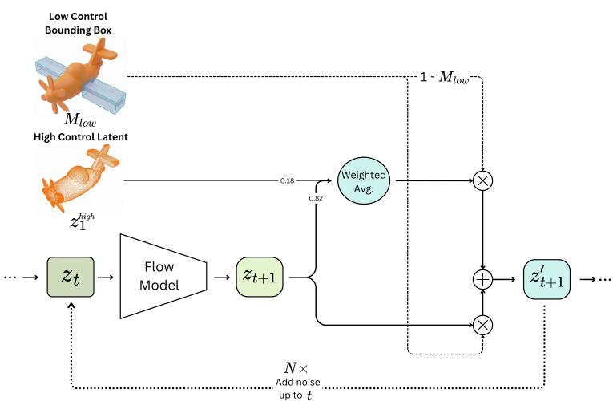  
Figure S1 Illustration of a single Conditioned Flow iteration. The process receives the low-control region mask $M _ { \mathrm { l o w } }$ (derived from the bounding boxes), the high-control target latent $z _ { 1 } ^ { \mathrm { h i g h } }$ , and the current latent state $\mathscr { z } _ { t } .$ . The flow model predicts the next state $\boldsymbol { z } _ { t + 1 }$ . Inside the high-control region (masked by $1 - M _ { \mathrm { l o w } } )$ , a weighted average of the target latent $z _ { 1 } ^ { \mathrm { h i g h } }$ and the predicted latent $\mathcal { Z } _ { t + 1 }$ is computed. This is combined with the unconstrained prediction $\mathfrak { z } _ { t + 1 }$ in the low-control region (masked by $M _ { \mathrm { l o w } } )$ to form $z _ { t + 1 } ^ { \prime }$ . Finally, noise is added to $z _ { t + 1 } ^ { \prime }$ up to timestep � (repeated � times) to update the latent $\scriptstyle { \mathcal { Z } } _ { t }$ for the subsequent step.

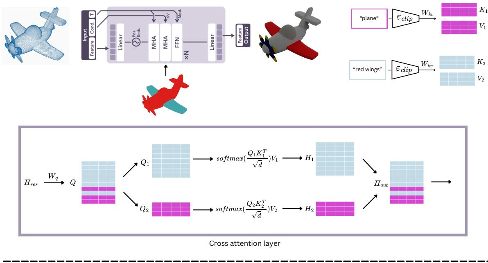  
Condition routing inner mechanics  
Figure S2 Routed cross-attention. Each text or image cue is encoded by a frozen CLIP (text) or DINOv2 (image) encoder into its own key/value pair $K _ { i } , V _ { i }$ . Within every cross-attention layer of the appearance transformer, the latent queries � are partitioned by the routing volume so that the voxels of a part attend only to their assigned cue—e.g. “red wings” routes to the wings while the global “plane” prompt covers the remaining voxels—and the per-region outputs $H _ { i }$ are recombined into $H _ { \mathrm { o u t } }$ . This confines each appearance cue to its target part and reduces cross-part texture leakage.

## S2 Appearance Generation Pipeline

Tab. S2 details the hyperparameters used across our appearance control evaluations, and Fig. S3 gives an overview of the part-wise appearance pipeline.

The appearance stage operates on the sparse structure produced by the first stage. We decode the structure into a mesh and extract a PartField feature representation. Features sampled at active structure voxels are clustered into semantic regions, and each cluster is matched to its closest input primitive. This produces a routing volume that remains part-consistent even when low-control geometry deviates from the original superquadric geometric input.

Each global or part-specific text or image condition is encoded into a separate embedding. Within the appearance-flow transformer, every latent voxel attends only to the embedding assigned by the routing volume; unassigned voxels attend to the global condition. This routed crossattention, illustrated in Fig. S2, restricts each cue to its intended region. During sampling, we additionally optimize a part-aware self-similarity objective that encourages coherent appearance within each semantic part and separation across diferent parts.

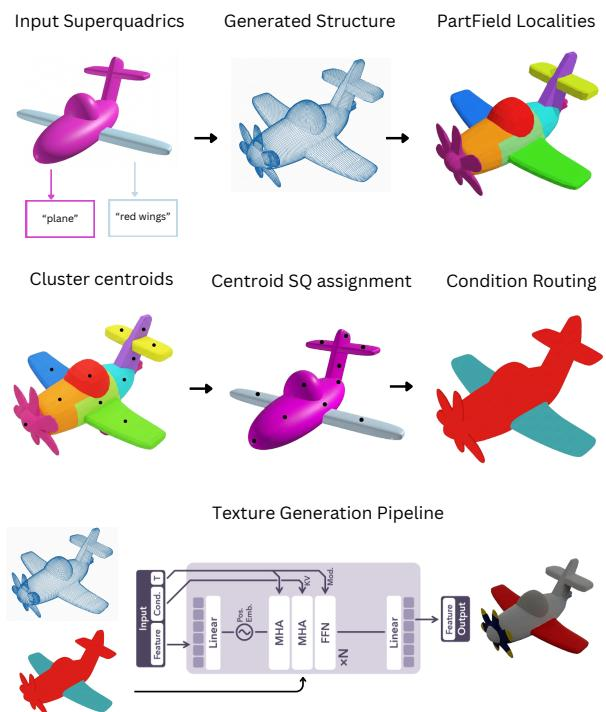  
Figure S3 Part-wise appearance pipeline. From the generated sparse structure and the part-wise text or image cues, we decode the structure into a mesh and extract a PartField triplane feature field. Active structure voxels are clustered into semantic localities; each cluster centroid is assigned to its nearest input superquadric, and the resulting map is rasterized into a conditionrouting volume that stays part-consistent even where low-control geometry drifts from the scafold. The appearance rectified-flow transformer then synthesizes the SLAT appearance latents under this routing.

Routing-volume construction. We decode the generated sparse structure into a mesh and extract a PartFieldtriplane feature field $\mathcal { P }$ . At each active structure voxel $\mathbf { v } _ { j }$ on the $6 4 ^ { 3 }$ featuresampling grid, we sample a descriptor $\mathbf { f } _ { j }$ and cluster the descriptors with �PF-means, obtaining semantic labels $\ell _ { j } .$ . For each cluster $C _ { m }$ , we

select the active voxel $\mathbf { c } _ { m }$ nearest the cluster mean as its representative, where $m \in \{ 1 , \ldots , K _ { \mathrm { P F } } \}$ . We voxelize the surface of each input primitive $S _ { i }$ into a set $\mathcal { B } _ { i }$ and assign the complete cluster to the closest primitive:

$$
a ( m ) = \arg \operatorname* { m i n } _ { i } \operatorname* { m i n } _ { \mathbf { b } \in \mathcal { B } _ { i } } \| \mathbf { c } _ { m } - \mathbf { b } \| _ { 2 } .\tag{S1}
$$

Each active voxel inherits the primitive assignment $a ( \ell _ { j } )$ of its cluster, so all voxels in the same semantic cluster are routed consistently. We rasterize these inherited assignments on the structure voxel grid and aggregate them onto the coarser $3 2 ^ { 3 }$ appearance-latent grid to obtain the routing volume Φ. After downsampling, we count how many latent cells are assigned to each primitive. Thin or small primitives, such as wheels, handles, or chair legs, may receive too few cells because multiple fine voxels are merged into a single coarse latent cell. When this support falls below a minimum threshold, we recompute the afected mask directly on the latent grid by assigning each latent-cell center to its nearest voxelized primitive. We then dilate the recovered mask by one-cell neighborhood step, ensuring that the corresponding local appearance cue has enough latent cells to influence the generated texture while remaining spatially close to the intended primitive.

Attention routing. The global condition and every primitive-specific text or image cue are encoded separately, using the encoders listed in Tab. S2. In each cross-attention layer, Φ selects the condition embedding attended to by every latent voxel; voxels without a local assignment use the global condition. For the self-attention bias, we add log � to the attention logit of each query–key pair whose voxels share the same routed condition. This is equivalent to multiplying its pre-softmax attention weight by $\beta$ and preserves soft interactions with the rest of the object.

Guidance optimization. At each conditioned appearance-flow step, we evaluate the supervised contrastive objective in Equation S2. To avoid materializing the full $| \mathcal { V } | \times | \mathcal { V } |$ similarity matrix, pairwise similarities are computed in chunks, with the chunk size selected according to the number of active voxels. We then take one AdamW step on the appearance latents. The lowest-loss latent state encountered along the guidance trajectory is retained, denormalized, and decoded into the final textured asset. Setting the guidance weight to zero disables the contrastive update and recovers part-routed sampling alone. Tab. S2 reports the grid resolutions, $K _ { \mathrm { P F } } , \beta ,$ chunk sizes, optimizer settings, and number of appearance-flow steps.

$$
\mathcal { L } = - \frac { 1 } { \vert \mathcal { V } \vert } \sum _ { j } \log \frac { \sum _ { k : \ell _ { k } = \ell _ { j } , k \neq j } \exp ( s _ { j k } / \tau _ { c } ) } { \sum _ { k \neq j } \exp ( s _ { j k } / \tau _ { c } ) } ,\tag{S2}
$$

where $_ \mathrm { ~ \textit ~ { ~ N ~ } ~ }$ is the set of structure voxels, $s _ { j k }$ is the cosine similarity between voxel latents, and $\tau _ { c }$ is the temperature. Voxels with no same-cluster neighbors are excluded from the mean through a validity mask.

Table S1 Structure-generation settings used in our spatial-control experiments.
<table><tr><td>Setting</td><td>Value</td></tr><tr><td>Structure backbone</td><td>TRELLIS text sparse-structure flow model</td></tr><tr><td>Structure latent tensor shape</td><td> $8 \times 1 6 \times 1 6 \times 1 6$ </td></tr><tr><td>Local control strengths</td><td> $\tau _ { \mathrm { l o w } } = 3 , \tau _ { \mathrm { h i g h } } = 1 0$ </td></tr><tr><td>High-control blending weight (α)</td><td>0.18 for locāl-τ</td></tr><tr><td>Number of structure flow steps</td><td>12</td></tr><tr><td>Flow solver</td><td>Euler flow-matching sampler with classifier-</td></tr><tr><td>CFG strength and interval</td><td>free guidance interval</td></tr><tr><td>Time rescaling</td><td>7.5, active for t ∈ [0.5, 0.95]</td></tr><tr><td>Resampling iterations K</td><td>3.0 10</td></tr></table>

## S3 Superquadric Primitives

Superquadrics are compact geometric primitives capable of representing a continuous spectrum of shapes, such as ellipsoids, cylinders, rounded boxes, and cuboids. A standard superquadric is defined by its scale $\pmb { \mathscr { s } } = ( \mathscr { s } _ { x } , \mathscr { s } _ { y } , \mathscr { s } _ { z } ) ^ { \top } \in \mathbb { R } _ { + } ^ { 3 }$ and shape exponents $\epsilon = ( \epsilon _ { 1 } , \epsilon _ { 2 } ) ^ { \intercal } \in \mathbb { R } _ { + } ^ { 2 }$ , which govern its roundness and squareness along the vertical and horizontal cross-sections.

For a 3D point $\mathbf { x } \in \mathbb { R } ^ { 3 }$ , let $\mathbf { u } = ( u _ { x } , u _ { y } , u _ { z } ) ^ { \top } = \mathbf { R } ^ { \top } ( \mathbf { x } - \mathbf { t } )$ represent its coordinates in the primitive’s local frame, transformed by rotation $\mathbf { R } \in S O ( 3 )$ and translation $\mathbf { t } \in \mathbb { R } ^ { 3 }$ . The volume bounded by the superquadric is implicitly defined by the inside-outside function $F ( \mathbf { x } ) \leq 1$

Table S2 Appearance-generation and self-similarity guidance settings. Text-conditioned appearance is evaluated pairwise and with standalone VLM scores; image-conditioned appearance is evaluated standalone using the criteria in Fig. S18 and is additionally illustrated qualitatively.
<table><tr><td>Setting</td><td>Value</td></tr><tr><td>Appearance backbone</td><td>TRELLIS SLAT flow model and decoders</td></tr><tr><td>Conditioning used in quantitative evaluation</td><td>Global and part-specific text prompts</td></tr><tr><td>Text-condition encoder</td><td>CLIP ViT-L/14</td></tr><tr><td>Image-condition encoder</td><td>DINOv2 ViT-L/14, used for image-conditioned standalone evaluation and qualitative examples</td></tr><tr><td>Part representation</td><td>PartField triplanes</td></tr><tr><td>PartField descriptor dimension</td><td>448</td></tr><tr><td>Feature-sampling grid</td><td>Generated sparse voxels on a  $6 4 \times 6 4 \times 6 4$  grid</td></tr><tr><td>Local routing volume</td><td> $3 2 \times 3 2 \times 3 2$  , only for local appearance prompts</td></tr><tr><td>Clustering method</td><td>KpF-means on PartField voxel descriptors</td></tr><tr><td>Number of PartField clusters  $K _ { \mathrm { P F } }$ </td><td>30</td></tr><tr><td>Self-attention boost  $\beta$ </td><td>2.5</td></tr><tr><td>Guidance optimizer</td><td>AdamW</td></tr><tr><td>Guidance weight</td><td>1.0</td></tr><tr><td>Optimizer learning rate</td><td> $5 \times 1 0 ^ { - 4 }$ </td></tr><tr><td>Similarity-computation chunk size</td><td>Automatic: 1024, 512, or 256 depending on</td></tr><tr><td>Number of appearance-flow steps</td><td>voxel count</td></tr><tr><td>Contrastive temperature  $\tau _ { c }$ </td><td>300 1.0</td></tr></table>

$$
F ( \mathbf { x } ) = \bigg ( \big | \frac { u _ { x } } { s _ { x } } \big | ^ { \frac { 2 } { \epsilon _ { 2 } } } + \big | \frac { u _ { y } } { s _ { y } } \big | ^ { \frac { 2 } { \epsilon _ { 2 } } } \bigg ) ^ { \frac { \epsilon _ { 2 } } { \epsilon _ { 1 } } } + \big | \frac { u _ { z } } { s _ { z } } \big | ^ { \frac { 2 } { \epsilon _ { 1 } } } ,\tag{S3}
$$

where $F ( \mathbf { x } ) < 1$ corresponds to points inside the primitive, $F ( \mathbf { x } ) = 1$ on its surface, and $F ( \mathbf { x } ) > 1$ outside.

Deformable Superquadrics. We use the deformable superquadric representation of SuperFlex.1 For a world-space point x, let $\mathbf { q } = \mathbf { R } ^ { \top } ( \mathbf { x } - \mathbf { t } )$ denote its coordinates in the primitive’s local frame. Let $F _ { \mathrm { c a n } } ( \mathbf { v } ; \mathbf { s } , \epsilon )$ denote the right-hand side of Eq. (S3) with u replaced by v. The deformed inside–outside function is

$$
\begin{array} { r } { F _ { \mathrm { d e f } } ( \mathbf { x } ) = F _ { \mathrm { c a n } } \Big ( \mathbf { \mathcal { D } } _ { \tau , \beta } ^ { - 1 } ( \mathbf { q } ) ; \mathbf { s } , \epsilon \Big ) , } \end{array}\tag{S4}
$$

where ${ \pmb \tau } = ( \tau _ { x } , \tau _ { y } )$ controls tapering and $\beta _ { a } = \left( k _ { a } , \alpha _ { a } \right)$ controls bending about local axis $a \in \{ x , y , z \}$ The inverse deformation follows the composition

$$
\mathcal { D } _ { \tau , \beta } ^ { - 1 } = \mathcal { T } _ { \tau } ^ { - 1 } \circ \mathcal { B } _ { y , \beta _ { y } } ^ { - 1 } \circ \mathcal { B } _ { x , \beta _ { x } } ^ { - 1 } \circ \mathcal { B } _ { z , \beta _ { z } } ^ { - 1 } .\tag{S5}
$$

Thus, inverse bending is applied about ${ \mathfrak { z } } ,$ then $x ,$ then $y ,$ followed by inverse tapering. Equivalently, the forward map tapers the canonical primitive first and then bends it about $y , x ,$ and ${ \mathfrak { z } } .$ . We use $\tau \in ( - 1 , 1 ) ^ { 2 } , k _ { a } \geq 0$ , and $\alpha _ { a } \in [ 0 , 2 \pi )$ , with angles measured in radians. The exact tapering and bending maps, axis conventions, parameterization, and admissible curvature range are specified by the linked implementation.

In our pipeline, these deformable primitives serve as compact, editable spatial control regions rather than final surface meshes.

Table S3 Object category distribution in the evaluation benchmark (� = 83). The benchmark spans 7 broad semantic categories designed to evaluate multi-part geometric control and local appearance conditioning.
<table><tr><td>Category</td><td>Count</td><td>Share</td><td>Representative Examples</td></tr><tr><td>Vehicles &amp; Transport</td><td>15</td><td>18.1%</td><td>Airplane, Space Shuttle, Satellite, Sailboat, F1 Car, Truck</td></tr><tr><td>Electronics, Audio &amp; Optics</td><td>15</td><td>18.1%</td><td>Telescope, Gramophone, Piano, Radio, Microscope, Clocks</td></tr><tr><td>Toys, Nature &amp; Decor</td><td>14</td><td>16.9%</td><td>Tin Robot, Wooden Dolls, Bonsai, Cactus, Elephant, Trophy</td></tr><tr><td>Furniture &amp; Seating</td><td>13</td><td>15.7%</td><td>Office Chair, Bar Stool, Armchairs, Park Bench, Pool Table</td></tr><tr><td>Tools &amp; Utility</td><td>10</td><td>12.0%</td><td>Fire Hydrant, Hammer, Sewing Machine, Toolbox, Iron, Bucket</td></tr><tr><td>Lighting &amp; Lanterns</td><td>8</td><td>9.6%</td><td>Desk Lamps, Chandelier, Stone Lantern, Candle Lantern</td></tr><tr><td>Kitchenware &amp; Tableware</td><td>8</td><td>9.6%</td><td>Teapot, Moka Pot, Mug, Stand Mixer, Frying Pan, Spoon</td></tr><tr><td>Total</td><td>83</td><td>100.0%</td><td></td></tr></table>

## S4 Dataset Details

We constructed a dataset of 83 3D assets covering diverse object categories. Each asset is defined by superquadric primitives with designated high-control and low-control regions, alongside local appearance prompts $a _ { i }$

The benchmark combines manually authored configurations designed to reflect realistic use cases with assets generated via a semi-automated pipeline in which an LLM (ChatGPT 5.6 Sol) proposed candidate primitive layouts, local control assignments, and appearance cues. All assets were validated and, if needed, refined by human annotators. The validation criteria were the following:

(i) meaningful control contrast, ensuring high-control regions specify well-defined structural elements while low-control regions remain intentionally coarse to test generative completion rather than trivial generation. (ii) spatial validity, confirming that low-control primitives are not geometrically contained by high-control ones. (iii) appearance fidelity, verifying that per-part appearance prompts are coherent, unambiguous, and accurately mapped to target primitives.

Object Categories. In Tab. S3, we report the distribution of object categories in the benchmark along with representative examples. The dataset spans 7 broad semantic categories covering everyday manufactured goods, furniture, vehicles, electronics, and natural/decorative objects, with primitive complexity ranging from 2 to 18 parts per asset.

Dataset Samples. Fig. S4 shows a representative selection of assets from our 83-asset benchmark across diverse categories.

## S5 Vision-Language-Model Evaluation

We evaluate localized geometric structure control and appearance generation using vision-languagemodel judges (GPT-5.6 Sol). Each evaluation instance presents the judge with two fixed views of a generated asset (∼ 210◦ apart) alongside the corresponding input conditions (superquadric proxies or text/image references). All evaluations are blinded: judges receive no method identifiers, filenames, or cross-sample scores.

For reproducibility, we detail below the exact prompts, rendering procedures, inference parameters used across our structure and appearance evaluations.

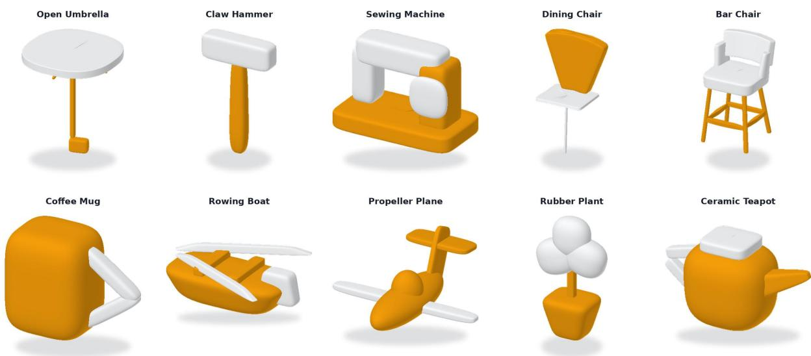  
Figure S4 Dataset assets gallery. Ten representative assets from our 83-asset benchmark. Orange primitives designate high-control regions requiring strict geometric preservation, while white/gray primitives designate low-control regions intended for generative completion. Subtitles denote the target object concept.

## S5.1 Structure Control Evaluation

To isolate geometric control from appearance quality, we render the generated assets as untextured shapes at the same scale and alignment as the input superquadrics. This prevents appearance quality from masking geometric defects.

The judge is presented with the input control shape, where region colors provide control-level labels:

• Orange (High Control, � = 10): The output geometry must strictly preserve the shape, proportions, and placement of these primitives.

• White/Gray (Weak Control, � = 3): The generator is expected to rely on the generative prior to generate a plausible geometry that matches the text prompt.

Pairwise Evaluation. We conduct head-to-head comparisons across all 83 dataset assets between SpaceFlow (local guidance with � = 10 in high-control and � = 3 in low-control regions) and SpaceControl uniform guidance baselines (� = 3 and � = 10). The judge evaluates control and prompt adherence, realism, and overall preference. The exact prompt layout and instructions are detailed in Fig. S15.

## S5.2 Appearance Evaluation: Pairwise Evaluation

For text-guided texture synthesis, we perform pairwise comparisons between SpaceFlow (part-level condition routing) and appearance baselines (TRELLIS [3] and GuideFlow3D [30] ). All methods generate textures on identical base geometry generated with SpaceFlow to strictly isolate appearance generation. The complete pairwise appearance instructions are shown in Fig. S16.

## S5.3 Appearance Evaluation: Standalone Prompts

In addition to pairwise comparisons, we score text- and image-conditioned appearance generations on absolute 1–10 scales.

Text-Conditioned Evaluation. Measures prompt faithfulness, color/material accuracy, texture detail, and overall appearance quality (Fig. S17).

Image-Conditioned Evaluation. Measures reference-style fidelity, local routing accuracy, texture detail, and overall appearance quality (Fig. S18).

## S5.4 VLM-Judge Configuration and Validation

Inference. The GPT-5.6 Sol model enforces a fixed default temperature of � = 1.0. To eliminate stochastic judge noise, evaluations are conducted over three independent passes. For head-to-head comparisons:

• A/B presentation order is independently randomized across passes

• Final pairwise preferences are decided by majority vote across three passes (three-way ties marked undecided), yielding 0.898 average inter-pass agreement.

Validation Probes. We verify judge reliability with two calibration checks:

1. Mismatched Controls: Scoring outputs against incorrect geometric inputs reduced adherence scores by 4.43 points, confirming sensitivity to geometric errors.

2. Identical Pairs: Comparing identical renders yielded 100% “Equal” ratings.

Tab. S4 summarizes the overall judge configuration, inference hyperparameters, and calibration metrics.

Table S4 VLM-judge configuration and evaluation settings. Summary of model parameters, multi-pass aggregation rules, and rendering specifications.
<table><tr><td>Setting</td><td>Value / Specification</td></tr><tr><td>Judge Model</td><td>GPT-5.6 Sol</td></tr><tr><td>Sampling Temperature</td><td>Default (T = 1.0)</td></tr><tr><td>Number of Passes</td><td>3 independent passes per condition</td></tr><tr><td>Pairwise Aggregation</td><td>2-of-3 majority vote (re-salted slot order)</td></tr><tr><td>Standalone Aggregation</td><td>Mean across 3 passes</td></tr><tr><td>Inter-Pass Agreement</td><td>Pairwise agreement: 0.898 (Spearman)</td></tr><tr><td>Rendered Input Views</td><td>2 fixed views (~ 210° azimuth separation)</td></tr><tr><td>Evaluated Modalities</td><td>Structure (untextured GLB) &amp; Appearance (textured)</td></tr></table>

## S6 User Study Details

This section provides additional details on the user study interface and evaluation protocol. Fig. S5 shows the interface presented to participants during the evaluation trials.

When participants entered the user study website, they saw a visual explanation of the task SpaceFlow solves. Afterwards, for each task, participants were shown: (i) the target text prompt (to assess realism of the generated asset); (ii) the input geometric control shape with high-control regions highlighted in orange (to evaluate shape fidelity); and (iii) two randomized, anonymous generated samples. Both the input shape and candidate samples were interactive 3D assets inspectable from any viewpoint.

Participants were then asked to choose between Sample A, Sample B, or No diference for the following question: “Which object looks better overall?”

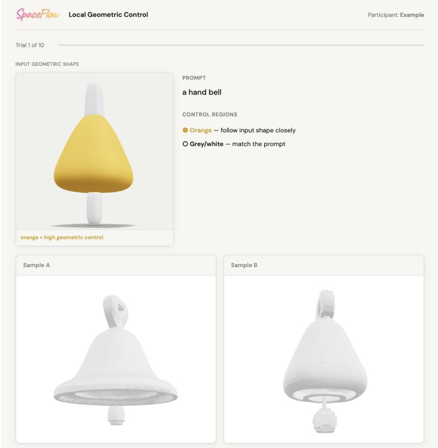  
Figure S5 User study interface screenshot. Screenshot of the evaluation interface to study participants during a trial. The interface displays the text prompt, the input geometric control shape with color-coded region guidelines, and two randomized, anonymous outputs for comparison.

## S7 Additional Ablation Study

We first isolate the spatial- and appearance-control components to illustrate their individual efects. We then present additional examples using the full SpaceFlow pipeline, in which spatial control and part-specific appearance conditions are applied simultaneously.

## S7.1 Sensitivity to Local Control Strength

The main paper evaluates local geometric control using $\tau _ { \mathrm { l o w } } = 3$ and $\tau _ { \mathrm { h i g h } } = 1 0$ . While this setting demonstrates the contrast between high- and low-control regions, it does not characterize how the output changes between the two control endpoints.

To quantify the efect of varying local guidance strength, we evaluate performance across $\tau _ { \mathrm { l o w } } ~ \in$ {1, 3, 5, 7, 9} on the 83-asset dataset, keeping $\tau _ { \mathrm { h i g h } } = 1 0 , \alpha = 0 . 1 8$ , random seeds, and the resampling schedule fixed. Following the regional Chamfer evaluation in the main text, generated mesh faces are partitioned into high- and low-control regions based on their nearest labeled input primitive surface. We compute the mean-squared Chamfer distance $( \times 1 0 ^ { 3 } )$ between each region and its corresponding input primitives, reporting the asset-wise mean.

As shown in Fig. S6, a lower $\tau _ { \mathrm { l o w } }$ gives the generator substantial freedom to deviate from the input primitives, while increasing $\tau _ { \mathrm { l o w } }$ progressively constrains the shape to the input geometry until both curves converge at $\tau _ { \mathrm { l o w } } \approx \tau _ { \mathrm { h i g h } }$ . Notably, deviation in the high-control regions also decreases slightly as $\tau _ { \mathrm { l o w } }$ increases, despite $\tau _ { \mathrm { h i g h } }$ being held constant. This reflects the global nature of the generative flow backbone: large shape modifications in low-control regions exert a slight geometric pull across part boundaries onto neighboring high-control regions.

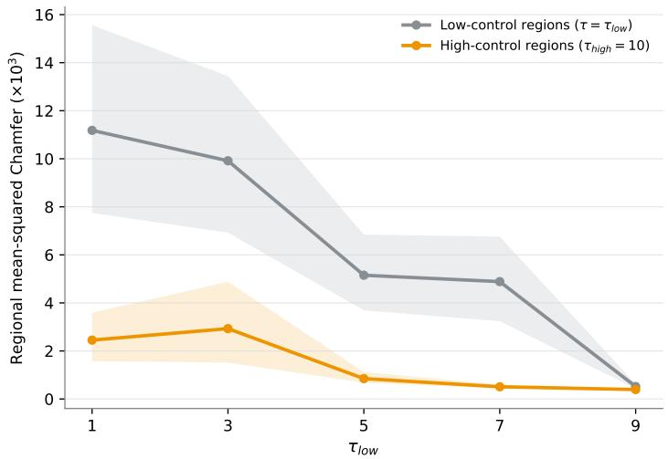  
Figure S6 Geometric deviation across local control strengths. We fix the high-control strength at $\tau _ { \mathrm { h i g h } } = 1 0$ and vary the low-control strength over $\tau _ { \mathrm { l o w } } \in \{ 1 , 3 , 5 , 7 , 9 \}$ . We report the regional symmetric mean-squared Chamfer distance to the input primitive surfaces $( \times 1 0 ^ { 3 } ;$ ; lower is better), averaged asset-wise over the 83-asset dataset. Lines show the mean and shaded bands indicate 95% bootstrap confidence intervals. Low-control regions (gray) deviate most under weak control, and the gap to high-control regions (orange) closes as the two control strengths converge.

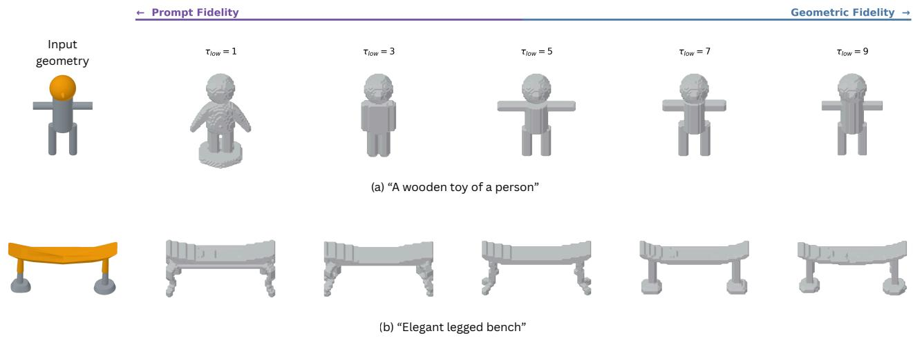  
Figure S7 Qualitative local control strength continuum. We fix the protected primitives at $\tau _ { \mathrm { h i g h } } = 1 0$ and vary the editable-region strength over $\tau _ { \mathrm { l o w } } \in \{ 1 , 3 , 5 , 7 , 9 \}$ . Orange input primitives denote high control and gray input primitives denote low control. Lower values permit greater prompt-driven geometric freedom, whereas increasing $\tau _ { \mathrm { l o w } }$ progressively strengthens adherence to the input geometry. Outputs are shown without texture to isolate geometric behavior.

Additionally, the higher mean and variance observed in the high-control region at low $\tau _ { \mathrm { l o w } }$ are partly due to a boundary efect of our metric definition. Under low control, the model can freely generate novel parts that may emerge near the boundary between regions. Because mesh faces are partitioned according to their nearest input primitive, some of these newly generated structures may be mapped to adjacent high-control primitives despite having no counterpart in the geometric input, thereby increasing the regional Chamfer distance. As $\tau _ { \mathrm { l o w } }$ increases, unconstrained generation is reduced, lowering both the metric mean and variance.

Fig. S7 illustrates this behavior for two representative inputs. At low $\tau _ { \mathrm { l o w } } ,$ the model has greater freedom to reinterpret the geometric input according to the prompt. At higher values, the output increasingly follows the input geometry, providing a continuous transition from prompt-driven generation to geometric fidelity.

## S7.2 Spatial Feature-Distance Visualization

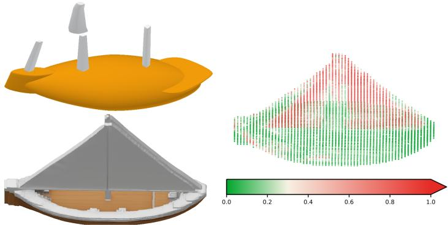  
Figure S8 Visualization of spatial feature distance. Left: input superquadrics (top; orange denotes high control and gray denotes low control) and the asset generated by SpaceFlow (bottom). Right: voxel-wise cosine distance between the generated asset’s PartField features and those of the nearest spatial match in the uniformly controlled (� = 10) reference. Feature deviations concentrate primarily in the low-control region.

The feature-distance metric reported in the main paper measures regional deviation from an asset generated with uniform high-control. For each generated voxel, we find its nearest spatial match in the reference generated with $\tau = 1 0$ and compute the cosine distance between their normalized PartField features.

Fig. S8 visualizes this metric for a representative example. Larger distances occur primarily in the low-control region, while the high-control region remains closer to the reference, illustrating that SpaceFlow localizes generative variation to regions where control is relaxed.

## S7.3 Primitive-to-Part Assignment Visualizations

In Fig. S9, we visualize local appearance routing. In each pair, the left image is the geometric input and the right image is the derived routing volume from generated structure in $3 2 ^ { 3 }$ voxel space; colored regions attend to local appearance cues and gray regions attend to the global condition. We use $K _ { \mathrm { P F } } = 3 0$ PartField clusters.

## S8 Limitations

Semantic-Geometric Conflicts. A primary failure mode in our geometric control module occurs when the text prompt contradicts the input geometry (e.g., requesting a “standing person” over a “bench”

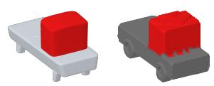

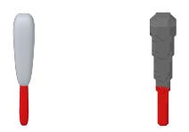  
(a) “red metal truck with a white cabin and blue glass”  
(b) “light wood baseball bat with a black grip”

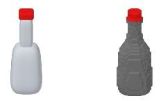  
(c) “green glass bottle with a brown cork stopper”

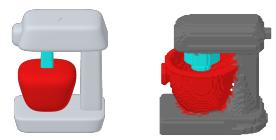  
(d) “cream enamel mixer with a silver metal bowl and beater”

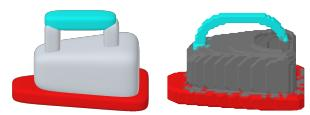

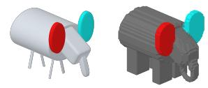  
(f) “blue wooden toy elephant with pink wooden ears”  
(e) “blue metal steam iron with a silver soleplate and black handle”

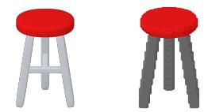

  
(g) “silver metal stool with a green fabric seat”  
(h) “white enamel mug with a blue handle”

Figure S9 Primitive-to-part appearance routing. In each pair (a–h), we show the input structure (left) and the resulting 323 routing volume (right). The mapping is defined color-wise: regions sharing the same color between the input primitives and the generated structure represent a 1-to-1 mapping to that condition (with gray assigned to the global prompt). Subcaptions provide the flattened prompt containing all localized appearance cues.

structure). In such cases, the text-conditioning pathway attempts to generate human features while the geometric guidance enforces the shape of the high-control regions. Because the underlying generator lacks a joint prior for geometric and textual combinations, the model struggles to reconcile both signals. This typically results in unnatural geometric distortions as the model attempts to synthesize the text-described asset around the constrained high-control regions (see Fig. S10).

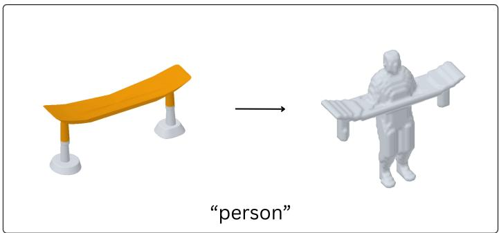  
Figure S10 Semantic-geometric conflict. Synthesizing a “person” over an input “bench” structure (left). Lacking a joint prior for conflicting modalities, the model generates unnatural distortions by embedding the bench’s high-control geometry inside the generated “person” (right).

Misrouted Appearance Cues. Our appearance module inherits the granularity of the underlying part decomposition: the routing volume is derived from PartField clusters in 323 voxel space, and each cluster is assigned to a single appearance condition. When a cluster boundary does not coincide with the true material boundary of the generated asset, the corresponding appearance cue is applied to the wrong voxels, and the error is directly visible in the final texture. Fig. S11 shows two representative cases. In the frying pan, the routing volume assigns the pan body and the handle to diferent conditions, but a thin band of handle voxels leaks along the rim; the wooden handle appearance consequently bleeds onto the metal body. In the chair, the seat cluster does not fully cover the cushion surface, so only part of the seat receives the intended upholstery condition while the remaining voxels are textured by the competing condition, yielding a visibly discontinuous seat. Both failures are localized to the routing stage rather than the generator: the geometry is faithful to the input primitives, and only the region-to-condition assignment is incorrect. Finer part decompositions or soft, distance-weighted routing boundaries are a natural direction for mitigating this efect.

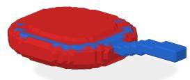

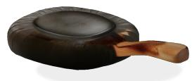  
(a) Frying pan – routing

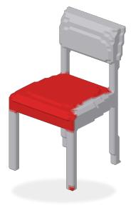  
(c) Wood chair – routing  
(b) Frying pan – result

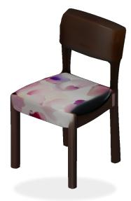  
(d) Wood chair – result

Figure S11 Failure cases of local appearance routing. For each asset we show the derived routing volume (left; colors denote distinct appearance conditions) and the generated result (right). (a–b) The handle cluster wraps around the rim, so the wooden handle appearance bleeds onto the metal pan body. (c–d) The seat cluster covers only part of the cushion, leaving the rest textured by the competing condition.

## S9 Additional Qualitative Results

Fig. S12 shows additional qualitative results for image-conditioned appearance control. In each example, the geometric input is paired with two reference images that specify the material or style for designated parts (indicated by arrows). Across diverse object categories, SpaceFlow faithfully transfers these appearance cues to the corresponding regions while preserving the underlying geometry.

Additionally, Figs. S13 and S14 show a gallery of text-conditioned qualitative examples of SpaceFlow spanning diverse object categories, varying numbers of geometric primitives, and diferent localized color and material requests. For each object, we pair the input geometric structure (with high-control regions in orange and low-control regions in gray) with the generated asset rendered from the same viewpoint. For interactive examples, we refer to the attached HTML gallery, which includes a broader set of examples of joint geometric and appearance control. In addition to that, we share an accompanying video that demonstrates the complete workflow and control capabilities in action using our own UI.

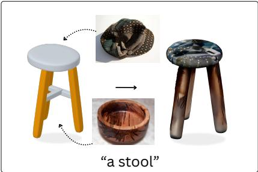

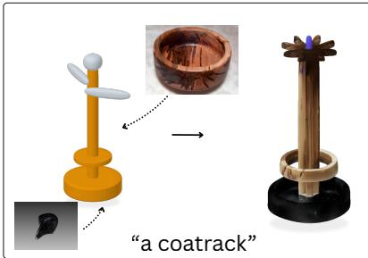

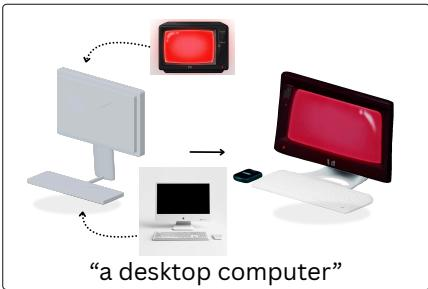

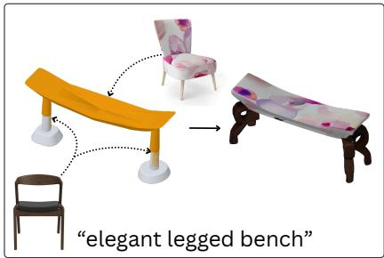

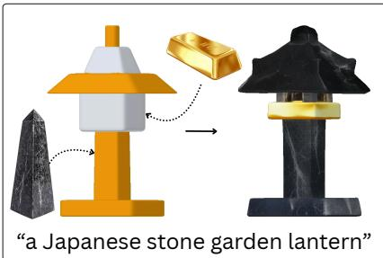

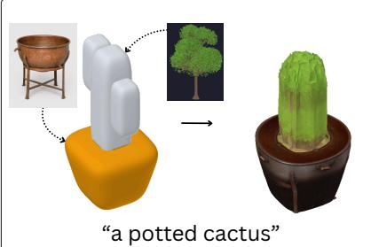

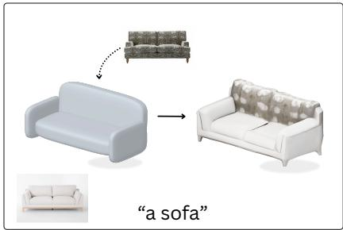

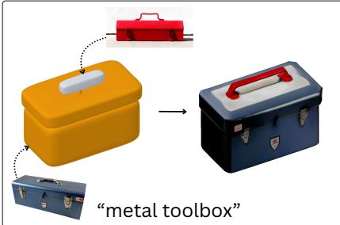

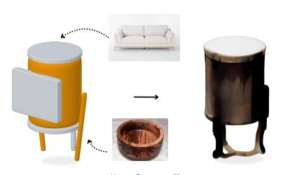  
“a drum”

Figure S12 Additional qualitative results for image-conditioned appearance control. Each panel shows an input geometric structure (left), the object-level text prompt (bottom), and two reference images specifying the desired material, texture or style for the object or for particular parts. Dotted arrows indicate the part-level associations between the reference images and the corresponding target regions. We recommend zooming in to inspect the fine-grained structural and appearance details; for example, in the metal-toolbox example, the generated asset includes the small front latches visible in the reference image and renders them with a consistent metallic appearance. These examples illustrate how SpaceFlow transfers reference-driven appearance cues to the corresponding regions while retaining the overall structure of the input object.

## S10 Implementation Details

Our implementation is developed in PyTorch and builds upon the SpaceControl2 and GuideFlow3D3 codebases. We use the publicly released TRELLIS-XL4 for all pretrained encoders, flow transformers, and decoders, which remain frozen because SpaceFlow is training-free. CLIP5 and DINOv26 encode the text and reference-image conditions, respectively. All experiments were conducted on a single NVIDIA GeForce RTX 5060 Ti GPU. The structure and appearance models were evaluated using the inference settings reported in Tab. S1 and S2.

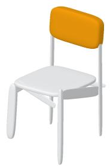

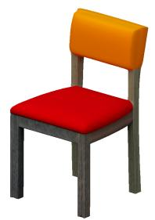  
(a) “wood chair with straight legs and a red cushioned seat and orange backrest”

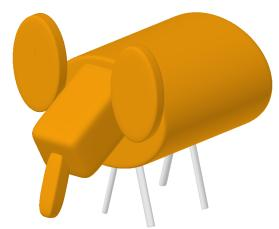

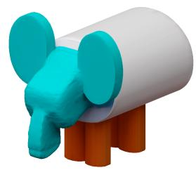  
(c) “white elephant toy with orange legs and cyan head”

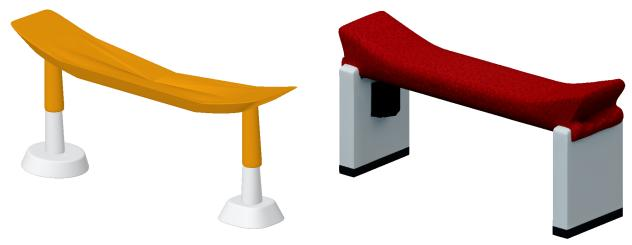

(e) “A white bench with a red velvet seat and a black bottom on the legs”

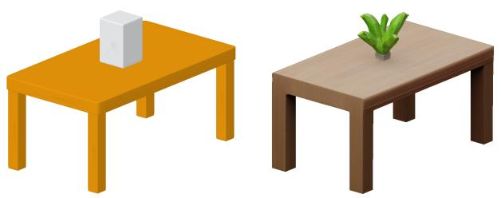  
(b) “A table with a plant”

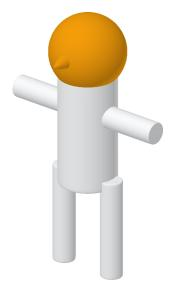

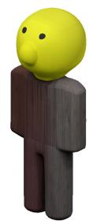  
(d) “A wooden toy of a person with a yellow plastic head”

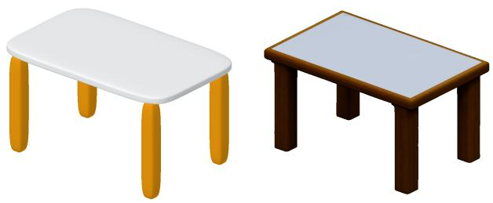  
(f) “A glass table with wooden legs”

  
(g) “A plane with the main wings red”

  
(h) “A bed with a green velvet duvet, pillows and an oak bed frame”

Figure S13 Extended qualitative gallery (Part 1). Text-conditioned SpaceFlow results across diverse object categories. Each cell pairs the input superquadric scafold (left; orange = high-control, gray = low-control regions) with the generated asset (right) rendered from the same viewpoint.

(a) “orange lamp with a cyan pole and a rectangular black base”

  
(c) “A white marble pool table with red billiard cloth”

  
(e) “white chair with a blue backrest”

  
(d) “A white house with a triangular brick roof”  
(b) “A gold trophy with a black marble base”

  
(f) “A silver pick up truck with a red cab and red wheels”  
(g) “blue classic chair with a black slat back”

  
(h) “A brown leather stool with white horizontal slats connecting the legs”

Figure S14 Extended qualitative gallery (Part 2). Additional text-conditioned SpaceFlow results. Each cell pairs the input superquadric scafold (left; orange = high-control, gray = low-control regions) with the generated asset (right) rendered from the same viewpoint.

  
Figure S15 Prompt template for pairwise structure evaluation. The judge evaluates two untextured geometries against the input control shape, with randomized A/B sample ordering across passes.

  
Figure S16 Prompt template for pairwise appearance evaluation. Blinded comparison of textured outputs on identical geometry to measure prompt faithfulness and surface quality.

  
Figure S17 Prompt template for text-conditioned standalone VLM evaluation. Complete system instructions and input layout used to score part-wise text appearance generation.

  
Figure S18 Prompt template for image-conditioned standalone VLM evaluation. Layout provided to the VLM judge to score local reference image style transfer and spatial routing accuracy.